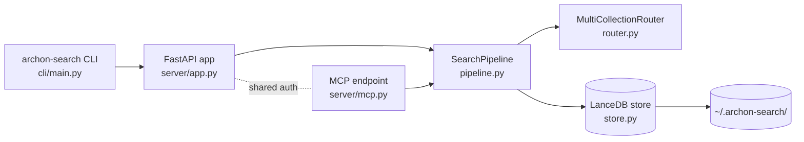

**Purpose**: State the vision, philosophy, and explicit non-goals that define what `archon-search` is — and what it deliberately is not.
**Audience**: Maintainers, integrators, and reviewers evaluating whether `archon-search` fits a use case.
**Status**: Draft
**Last reviewed**: 2026-05-20
**Next review**: 2026-08-20

# Introduction and Guiding Principles

`archon-search` is a standalone hybrid retrieval and routing server. It runs as a single local process, persists its state under `~/.archon-search/`, and exposes both a FastAPI REST control plane and an MCP endpoint behind a shared bearer-token auth layer. The component layout is summarised in `Architecture/100_system_architecture_overview.md`.

## Guiding Principles

1. **Local-first, single-process.** The server runs on one host, owns its on-disk state, and does not assume any external infrastructure. All runtime state — vector index, full-text index, configuration, API key, optional telemetry logs — lives under `~/.archon-search/`.
2. **One contract, two surfaces.** REST and MCP are layered over the same internal pipeline. The OpenAPI document published at `GET /openapi.json` is the authoritative shape; MCP tools mirror the same control-plane verbs.
3. **Hybrid retrieval, second-stage reranking.** The pipeline composes dense embeddings (fastembed) and full-text search (LanceDB FTS) into a fused candidate set, then applies a cross-encoder reranker. Multi-collection routing (`router.py`) selects which collections to query per prompt.
4. **No raw query text leaves the process — ever.** Telemetry is opt-in and disabled by default; when enabled it stays on the local disk and never includes the raw query string. This is enforced structurally, not by review (see `Architecture/010_engineering_principles_and_constraints.md`).
5. **Time-versioned, contract-versioned.** Releases use CalVer (`YY.M.<rev-count>`) derived from git tags via `hatch-vcs`. CalVer encodes time only; compatibility is documented separately in `BREAKING.md`.

## Vision

A self-contained search service that a developer can `pip install`, run on their workstation or a single server, point at one or more directories, and query through either HTTP or MCP — with retrieval quality measurable through a committed evaluation harness rather than asserted.

## Philosophy

- **Boring surfaces, sharp internals.** The external surface is a small set of well-typed REST and MCP endpoints. Quality investment goes into the retrieval pipeline (`parser.py` → `chunker.py` → `embedder.py` → `store.py` → `reranker.py` → `pipeline.py`) and the router.
- **Measurable, not asserted.** Retrieval, reranking, and routing changes are gated by `tests/eval/` with committed thresholds and a baseline. Latency p50/p95 in the harness is a regression guard, not a production SLA.
- **The OpenAPI document is the contract.** When in doubt, the schema at `GET /openapi.json` wins. Breaking changes go in `BREAKING.md` with a migration note.

## Goals

- Provide hybrid search (vector + FTS + cross-encoder rerank) over one or many local collections.
- Provide a router that scores collections by centroid similarity and dispatches to a shortlist per query.
- Run as a single OS-level service across macOS, Linux, and Windows (`archon_search/platform/`).
- Ship with an evaluation harness that gates regressions in retrieval, reranking, routing, and latency.

## Explicit Non-Goals

The following are out of scope for the v1 product. Calling them out prevents accidental scope drift.

- **Not a multi-tenant cloud service.** There is no per-tenant database, no hosted control plane, and no managed-service offering. ACL and namespace isolation exist at the document level (`acl.py`, namespace field on `CollectionMeta`), but the server itself is a single-process daemon.
- **No external telemetry transmission in v1.** Setting `[telemetry].export_enabled = true` logs a warning at config load and is coerced back to `false` (`config.py`); the value is reserved but ignored. Telemetry, when enabled, writes JSONL files locally under `~/.archon-search/search-logs/` and stays there. A remote export feature is reserved for a future release.
- **No raw query logging — by construction.** The factory methods in `archon_search/telemetry/entry.py` do not accept a `query` parameter. This is a structural invariant, not a policy.
- **Not a distributed system.** LanceDB-based storage is fast locally but is not a multi-writer distributed store. Horizontal scaling is not a v1 concern (see `../roadmap.md`).
- **No hardcoded versions.** Version strings come from git tags via `hatch-vcs`; the package never embeds a literal version. Plain pushes to `main` do not publish — only a tag push (typically via `release.sh`) triggers `archon-search-release.yml`.
- **No background phone-home, no analytics beacon, no auto-update.** The server starts, serves traffic on `127.0.0.1` by default, and does nothing the operator did not ask for.

## What Lives Where (Quick Map)

## Related Documents

- Engineering constraints that flow from these principles: `Architecture/010_engineering_principles_and_constraints.md`
- Component-level overview and module seams: `100_system_architecture_overview.md`
- Forward plan: `../roadmap.md`
- Developer onboarding: `../quick_start.md`
- Compatibility contract: `../../BREAKING.md`
