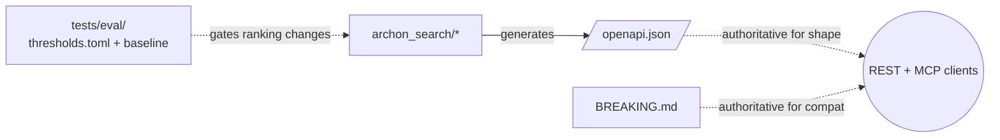

**Purpose**: Define the engineering constraints that every change to `archon-search` must respect — language baseline, tooling, versioning, coverage, structural invariants, and contract surfaces.
**Audience**: Contributors writing code, reviewers approving PRs, release engineers cutting tags.
**Status**: Draft
**Last reviewed**: 2026-05-20
**Next review**: 2026-08-20

# Engineering Principles and Constraints

This document lists the non-negotiable engineering constraints. The product vision and non-goals are in `Architecture/000_introduction_and_guiding_principles.md`; this file is concerned with *how* the codebase is built and released.

## Principles

1. **Single source of truth per dimension.** Versions come from git tags. The REST contract comes from `GET /openapi.json`. The compatibility story comes from `BREAKING.md`. Coverage gates come from `pyproject.toml`. No alternate sources.
2. **Structural invariants over reviewer vigilance.** Where a guarantee matters (no raw query logging), the code shape prevents the violation — a missing parameter on a factory method, not a checklist.
3. **The default `pytest` run is the contract.** It excludes `live`, `eval`, `benchmark`, `integration` markers and enforces `--cov-fail-under=85`. Marker-gated suites exist for the other dimensions.
4. **Breaking changes are explicit.** CalVer segments do not signal compatibility; a `BREAKING.md` entry does.
5. **Reproducibility over convenience.** `uv`-managed Python `>=3.12`, floor-pinned tooling (lower-bound version specifiers in `pyproject.toml`; the `uv.lock` provides the exact reproducible resolution), deterministic eval backends.

## Language and Tooling

- **Python**: `>=3.12` (see `pyproject.toml [project] requires-python`).
- **Package manager**: `uv`. `uv sync --dev` installs runtime + dev groups; `uv run <cmd>` executes inside the project environment.
- **Build backend**: `hatchling` + `hatch-vcs`. Wheels are built from a tagged commit and contain a version string derived from that tag.
- **Distribution vs. import name**: PyPI distribution is `archon-search` (hyphen); the importable package is `archon_search` (underscore). This split is encoded in `[tool.hatch.build.targets.wheel].packages = ["archon_search"]`. Do not change either name.

## Versioning: CalVer via `hatch-vcs`

Releases use CalVer `YY.M.<commit-count>` (e.g. `26.5.142`). The format is produced by `release.sh`:

```
yy = date -u +%y
m  = date -u +%-m
count = git rev-list --count HEAD
TAG = ${yy}.${m}.${count}
```

Constraints:

- **Never hardcode a version.** `pyproject.toml` declares `version` as `dynamic = ["version"]` and `[tool.hatch.version].source = "vcs"`. `archon_search/__init__.py` is empty by design — there is no `__version__` literal to drift.
- **`raw-options.local_scheme = "no-local-version"`** is intentional: PyPI rejects `+local` suffixes on upload. Do not change it.
- **CalVer encodes time, not compatibility.** A bump in the `YY.M` segment does not mean "breaking"; a bump in the patch segment does not mean "safe". The compatibility contract is `BREAKING.md`.
- **Plain pushes to `main` do not publish.** Only a tag push triggers `archon-search-release.yml`. The interactive cutter is `release.sh` (`-y` for non-interactive, `--dry-run` for preview).

## Coverage Gate: 85% on the Default Run

`pyproject.toml [tool.pytest.ini_options].addopts` includes:

```
--cov=archon_search --cov-report=term-missing --cov-fail-under=85
-m 'not live and not eval and not benchmark and not integration'
```

Rules:

- **`--cov-fail-under=85` applies to the default single-run invocation.** Split / matrix CI runs MUST `coverage combine` before applying the threshold; never apply it to a partial run.
- **`--no-cov` is a local developer override only.** It must not be baked into `addopts`.
- The four marker-gated suites (`live`, `eval`, `benchmark`, `integration`) are excluded from the default run on purpose and have their own invocation commands documented in `CLAUDE.md`.

## Structural Invariants

These are guarantees the code holds by *shape*, not by review.

### Telemetry: no raw query, ever

Factory methods in `archon_search/telemetry/entry.py` do not accept a `query` parameter. This makes it impossible to construct a telemetry entry that carries the raw query string. Adding such a parameter is a structural violation and must be rejected at review.

The companion runtime guarantees are enforced in `archon_search/config.py` (the README mirrors them for users):

- Telemetry is opt-in (`[telemetry].enabled = false` by default).
- `[telemetry].export_enabled = true` logs a warning at config load and is coerced back to `false` (`config.py`); there is no remote sink in v1.
- `doc_id`s are path-derived; when telemetry is on, log files may reveal filesystem paths. This is documented as accepted operator risk; a hashed-doc-id mode is on the roadmap. #Unverified

### Logger names: always `__name__`

All modules in `archon_search/` must use `logging.getLogger(__name__)` — except `archon_search/logging_setup.py`, which intentionally uses the literal `"archon_search"` to target the root hierarchy logger. The guard in `tests/test_logger_names.py` allows any string starting with `archon_search` followed by `.` or end of string, and flags all other hardcoded names.

`configure_logging()` (`archon_search/logging_setup.py`) is idempotent — calling it multiple times does not add duplicate handlers. The function is invoked once, as the first action in `run_server()`.

**`[logging]` TOML / Python field name mismatch**: the TOML key `format` maps to the `SearchConfig` dataclass field `log_format`. This is the only `[logging]` key where the TOML name differs from the Python attribute name.

### Auth: every data-plane endpoint is bearer-gated

The middleware exempts only `/health`, `/docs`, `/openapi.json`, `/redoc` (`server/middleware_auth.py::_EXEMPT_PATHS`); the latter three expose schema, not data. The API key is resolved by `key_manager.py` in priority order: `ARCHON_SEARCH_API_KEY` env var, then a key file at `ARCHON_SEARCH_KEY_FILE` (or default `~/.archon-search/.search.env`), then auto-generated with file mode `600` on POSIX.

The REST middleware and the MCP endpoint share the same auth layer (`server/middleware_auth.py`).

### Runtime state directory

All on-disk state lives under `~/.archon-search/`:

| Path | Owner | Purpose |
|---|---|---|
| `~/.archon-search/archon-search.toml` | operator / API | server config (override via `ARCHON_SEARCH_CONFIG`) |
| `~/.archon-search/.search.env` | `key_manager.py` | bootstrapped API key (mode `600`) |
| `~/.archon-search/search/` | `store.py` | LanceDB vector + FTS data (`db_path` default) |
| `~/.archon-search/logs/archon-search.log` | server logging | operational log |
| `~/.archon-search/search-logs/` | `telemetry/writer.py` | opt-in daily JSONL telemetry |

## Contracts



- **REST/MCP shape**: `GET /openapi.json` is the authoritative machine-readable schema. `GET /docs` serves the Swagger UI. Schemas live in `archon_search/server/schemas.py` and `schemas_telemetry.py`.
- **Compatibility**: `BREAKING.md` is the compatibility contract. Every release that removes or changes an existing API contract MUST add an entry describing the change, the migration path, and the announce-from release.
- **Retrieval quality**: `tests/eval/thresholds.toml` plus `tests/eval/baselines/baseline.{md,json}` gate ranking changes. The maintenance guide (fixture schemas, threshold-lowering policy, waivers) is `tests/eval/README.md`.

## Code Conventions

- **Present tense, active voice** in docstrings and docs.
- **No backward-compat shims** unless `BREAKING.md` says otherwise — the project favours a clean break with a migration note.
- **Match existing style.** The package directory is `archon_search/` (underscore) — do not "fix" it to match the hyphenated distribution name; `pyproject.toml` is explicit about this split.
- **Tests are part of the change.** A behaviour change without a corresponding test (or, for ranking, an eval-suite assertion) is incomplete.

## Related Documents

- Vision and non-goals: `Architecture/000_introduction_and_guiding_principles.md`
- Component overview: `Architecture/100_system_architecture_overview.md`
- Compatibility log: `../../BREAKING.md`
- Onboarding: `../quick_start.md`
- Forward plan: `../roadmap.md`
