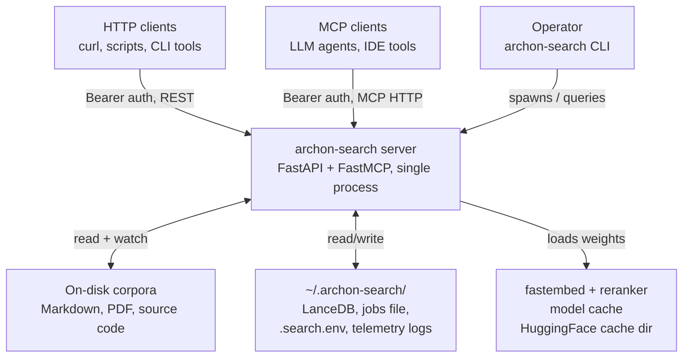
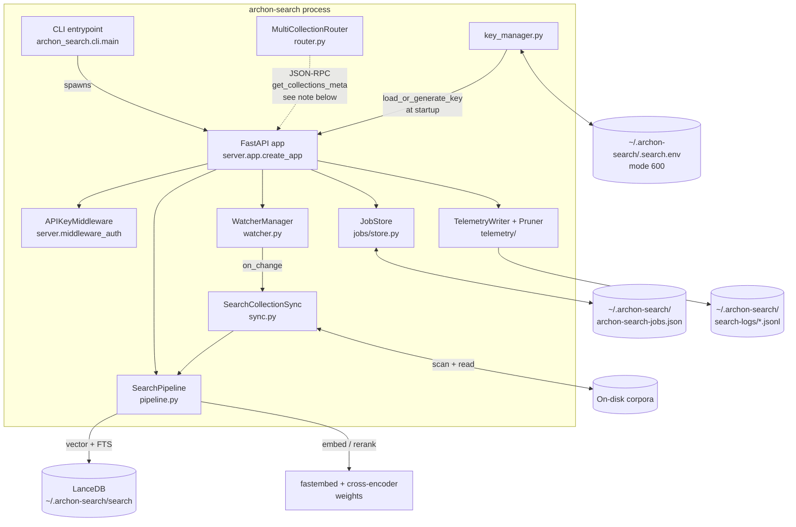
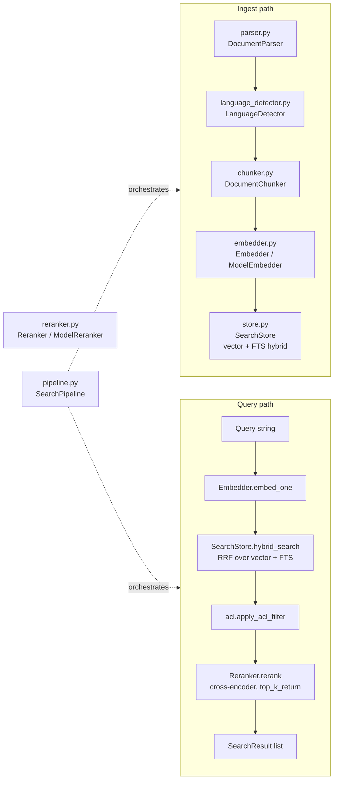

**Purpose**: Give a medior engineer a load-bearing mental model of `archon-search` end to end.
**Audience**: Engineers onboarding to `archon-search`; reviewers of cross-cutting changes.
**Status**: Draft
**Last reviewed**: 2026-05-20
**Next review**: 2026-08-20

# System Architecture Overview

`archon-search` is a single-process, local-first hybrid retrieval server. It indexes on-disk corpora into a LanceDB store, serves search over a FastAPI HTTP control plane and an MCP endpoint (both share a Bearer-token middleware), and keeps the index in sync with the filesystem via a watchdog observer. All runtime state lives under `~/.archon-search/`.

## Principles

1. **Layered pipeline, single orchestrator.** Ingest and query flow through a fixed sequence of stages owned by `SearchPipeline`; modules below it are replaceable, modules above only depend on the pipeline.
2. **Two-stage retrieval is non-negotiable.** Every query is `(vector + FTS) hybrid retrieval -> cross-encoder rerank`. The rerank stage is part of the contract, not an optimisation.
3. **One auth boundary, two transports.** REST and MCP share `APIKeyMiddleware`. Exempt paths are `/health`, `/docs`, `/openapi.json`, and `/redoc` (see `_EXEMPT_PATHS` in `server/middleware_auth.py`).
4. **Filesystem is source of truth.** Corpora on disk drive the index, not the other way around. Watchers + the sync engine reconcile drift.
5. **State is local, opt-in, and inspectable.** LanceDB, the JSON job store, the API-key file, and telemetry JSONL all live under `~/.archon-search/`. Nothing leaves the host by default.

## C4 Level 1: System Context



External actors are HTTP clients, MCP clients, the operator using the CLI, and the local filesystem. The single server process is the only thing that touches LanceDB and model weights.

## C4 Level 2: Container View



The CLI starts the process; `create_app` wires `SearchPipeline`, `JobStore`, telemetry, and middleware together. The API key is loaded by `load_or_generate_key()` at startup and passed into `APIKeyMiddleware` as a constructor argument (the middleware does not import `key_manager` itself). `MultiCollectionRouter` is designed as a JSON-RPC client of the MCP endpoint, not a peer of the pipeline. Note: in the shipped server, `python -m archon_search.server` only starts the FastAPI app via `run_server` -> `uvicorn.run(app, ...)`; `create_mcp_http_app` (in `server/mcp.py`) is defined but is not invoked from `create_app` or `run_server`, so the router-to-MCP JSON-RPC call path is reachable in tests but is not wired into the shipped runtime. The watcher feeds change events to `SearchCollectionSync`, which drives the pipeline.

## C4 Level 3: Component View — Retrieval Pipeline



`SearchPipeline.ingest_file` runs `parser -> language_detector -> chunker -> embedder -> store`, assigning sequential chunk IDs, detecting document language (C2, when `config.multilingual=True`), and propagating ACLs and language tags to all chunks. `SearchPipeline.search` runs `embedder -> store.hybrid_search -> acl filter -> reranker`. `SearchPipeline.explain` (A4) runs `embedder -> store.hybrid_search_with_trace (amplified pool) -> acl filter -> reranker._rerank_with_trace -> sort -> split top-k / near-misses`, and returns `ExplainPipelineResult`. `ingest_directory` additionally computes a centroid over all batch vectors and updates `CollectionMeta`, optionally regenerating the auto description (see [110_component_catalog_and_layer_breakdown.md](110_component_catalog_and_layer_breakdown.md) for module roles).

## Architecture Patterns

### Layered pipeline

Stages are independent classes wired by the orchestrator. The ordering `parser -> front-matter strip -> enricher.prepare -> chunker -> enricher.enrich_chunk -> embedder -> store -> reranker` is enforced by `SearchPipeline`; no other module should bypass it. **C3a**: `MarkdownEnricher` sits between front-matter extraction and the chunker; `prepare()` builds a heading-offset table from the stripped text, then `enrich_chunk()` is called per chunk to merge `_heading` and `_section_path` into each `ChunkRecord.metadata`. Backends (`EmbedderBackend`, `RerankerBackend`) are Protocols, so a deterministic backend can be swapped in for evaluation (`archon_search/eval/backends.py`).

### Two-stage hybrid retrieval

`SearchStore.hybrid_search` performs vector ANN and FTS, fuses them with Reciprocal Rank Fusion, returns `top_k_retrieve` candidates. The cross-encoder reranker then narrows to `top_k_return`. ACL filtering sits between the two stages so the reranker never wastes work on chunks the namespace cannot see.

### Multi-collection routing via centroid pre-ranking (and optional hybrid blend)

`MultiCollectionRouter.rank` scores each collection's stored centroid against the query embedding (cosine), applies a confidence gate, and shortlists. Collections whose `embedding_model` does not match the router's configured model (or have no centroid) are moved to an "unscored" list and appended after the scored shortlist; if no collections can be scored at all, the confidence gate is bypassed and unscored collections are returned up to `shortlist_size`. Three tiers in `get_pre_context`:

- `n_routable <= 3`: no decomposer, search all.
- `4 <= n_routable <= shortlist_size`: decomposer selects directly, no centroid ranking.
- `n_routable > shortlist_size`: centroid pre-rank, then decomposer picks from the shortlist.

**B4 — hybrid routing strategy (opt-in):** When `routing_strategy = "hybrid"` is set in `archon-search.toml`, the router blends each collection's centroid score with a description-embedding cosine score:

```
score = (1 - w) * centroid_score + w * description_score
```

where `w = routing_description_weight` (default `0.3`). The blend activates only when the collection's `description_embedding` field is non-null, non-zero, and dimensionally consistent with the query embedding. Collections without a valid `description_embedding` fall back to pure centroid scoring. The `description_embedding` artifact is computed per-collection at ingest time and stored in `CollectionMeta`. The default strategy remains `"centroid"` — no operator action is needed to preserve pre-B4 behavior. See ADR-07 for the full decision.

The router calls `get_collections_meta` over JSON-RPC against the MCP endpoint — it does not import the pipeline.

### Local-first persistence

LanceDB at `cfg.db_path` (default `~/.archon-search/search`) is the only durable index. `JobStore` is a JSON file with atomic rename writes and crash-recovery (RUNNING/CANCELLING jobs become FAILED on load). The API key is 32 bytes of entropy encoded as 64 hex characters (`secrets.token_hex(32)`) and stored in `~/.archon-search/.search.env`, chmod 600. See [130_data_architecture_and_persistence.md](130_data_architecture_and_persistence.md) for layout.

### Single auth boundary

`APIKeyMiddleware` is added to the FastAPI app produced by `create_app`. The same middleware class is also added to the FastMCP HTTP app constructed by `create_mcp_http_app`, but that app is not started by the shipped `run_server` entry point (see Runtime Topology below). Only `/health`, `/docs`, `/openapi.json`, `/redoc` are exempt (`_EXEMPT_PATHS` in `server/middleware_auth.py`). The middleware resolves a namespace per request (default or from `[namespaces]` config) and attaches it to `request.state.namespace`. See [150_security_and_privacy_architecture.md](150_security_and_privacy_architecture.md) for the threat model and [600_api_reference_or_public_interface.md](600_api_reference_or_public_interface.md) for the wire contract.

## Runtime Topology

One Python process. `uvicorn` serves the FastAPI app produced by `create_app`; `run_server` calls `uvicorn.run(app, host=..., port=...)` with no MCP sub-app mounted. The FastMCP HTTP app defined by `create_mcp_http_app` is currently not started by the shipped entry point — this is a known gap, not the intended end state. #Unverified whether this is intentional for v1 or an oversight to be fixed. Background tasks owned by the FastAPI lifespan when `config.telemetry.enabled` is true: `TelemetryWriter`, `Pruner` (both gated behind the telemetry-enabled config flag, which defaults to false). The watchdog `Observer` runs in its own thread per `CollectionWatcher` and posts coroutines back to the main event loop. Long-running ingest/reindex work is dispatched via FastAPI `BackgroundTasks` (see `routes_jobs.py`, `routes_collections.py`) with job state recorded in the synchronous `JobStore` (see [120_services_and_integration_architecture.md](120_services_and_integration_architecture.md) for sequence diagrams).

## Install Profile Registry (C0)

`archon_search/profiles.py` defines three tiered install profiles (`minimal`, `balanced`, `max`) for English and multilingual model stacks. The profile controls which `embedding_model`, `reranker_model`, and `chunk_size` are written into `archon-search.toml` at install time.

The install flow (`archon_search/install.py`):

1. Prompts for or validates the profile and multilingual flag.
2. Applies a Jina CC-BY-NC-4.0 license gate for multilingual `balanced`/`max` (those profiles use `jinaai/jina-reranker-v2-base-multilingual`).
3. **C2**: When `multilingual=True`, prompts for CC-BY-SA 3.0 fasttext license acceptance (or checks `--accept-fasttext-license`) and downloads `lid.176.ftz` to `~/.archon-search/models/`.
4. Detects reinstall with a mismatched profile; raises `NeedsForceDeleteError` when embedder or chunk_size differs; the caller requires `--force --delete-db` to proceed.
5. Writes profile config (`[database].profile`, `embedding_model`, `reranker_model`, `multilingual`, `chunk_size`) to `archon-search.toml`.
6. Checks available disk space against the profile's `download_mb` estimate.
7. Pre-warms model weights (before service registration).
8. Registers and starts the OS service.

The multilingual minimal profile sets `reranker_model = ""` (no reranker), which causes `create_pipeline()` in `pipeline.py` to pass `reranker=None` to `SearchPipeline`. `SearchPipeline` guards every reranker call with `if self.reranker is None`.

## Failure and Recovery Posture

Crash recovery and error handling are covered in [140_error_handling_strategy.md](140_error_handling_strategy.md). Key invariants set here:

- `JobStore` is the only thing that can declare a job FAILED on restart.
- The FastAPI lifespan in `server/app.py` calls `SearchStore.connect()`, then `migrate_namespace()`, then `migrate_acl()` as three separate awaits before the app starts serving; `connect()` itself does not invoke the migrations.
- The watcher debounces filesystem events (default 5 s) so a burst of writes triggers exactly one reindex.
