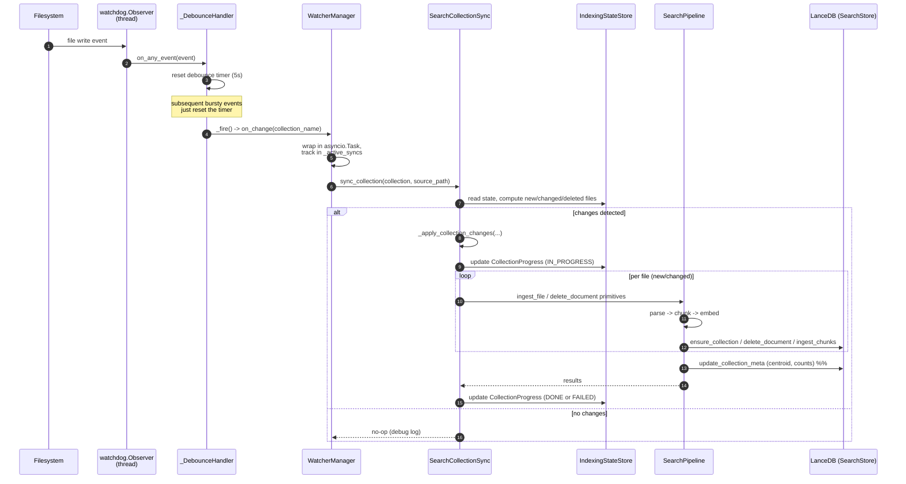

**Purpose**: Document how clients integrate with `archon-search` synchronously (REST, MCP) and how internal asynchronous flows (watcher, jobs) hang together.
**Audience**: Engineers integrating clients; engineers debugging long-running ingest/reindex flows.
**Status**: Draft
**Last reviewed**: 2026-06-24 (review-corrected)
**Next review**: 2026-09-24

# Services and Integration Architecture

`archon-search` exposes two synchronous transports — FastAPI HTTP and FastMCP HTTP — and runs two asynchronous internal integrations — the watchdog filesystem observer and the persistent job store. Both transports use the same `APIKeyMiddleware` class (each app factory adds its own instance); both async flows feed back into the same `SearchPipeline`. In the production run path (`run_server`), the FastAPI app is started under uvicorn **and** mounts the MCP Starlette wrapper at `/mcp` on the same port (D9) — a single uvicorn process, single port (8765 default), shared event loop. Layering and module roles are in [110_component_catalog_and_layer_breakdown.md](110_component_catalog_and_layer_breakdown.md); the topology is in [100_system_architecture_overview.md](100_system_architecture_overview.md).

## Principles

1. **One middleware class, two transports.** REST and MCP each instantiate `APIKeyMiddleware` (`server/middleware_auth.py`). `_EXEMPT_PATHS` is `{"/health", "/docs", "/openapi.json", "/redoc"}`; per `server/app.py` comments, only `/health` is a real schema exemption — the other three are defensive listings (FastAPI never includes them in the OpenAPI schema). As of D9 both factories are wired with `namespaces=config.namespaces`, so per-namespace TOML keys authenticate identically over REST and MCP.
2. **Sync edges write to the same state as async edges.** A watcher-triggered reindex and a `POST /collections/{name}/reindex` end up calling the same pipeline code paths.
3. **OpenAPI is the contract.** `GET /openapi.json` is authoritative for REST; breaking changes are recorded in `BREAKING.md`. See [600_api_reference_or_public_interface.md](600_api_reference_or_public_interface.md).
4. **Long-running work is jobified.** Anything that can exceed an HTTP timeout (ingest, add-collection, reindex) returns `202 Accepted` with a `job_id` instead of blocking.
5. **Telemetry never sees the query.** Telemetry entry factories take no `query` parameter; raw queries cannot be logged by construction.

## Synchronous integrations

### FastAPI HTTP control plane

Built by `archon_search.server.app.create_app`. The lifespan handler connects `SearchStore` and runs `migrate_namespace` + `migrate_acl` + `migrate_per_collection_model` before traffic flows. **C1**: an `EmbedderCache` (LRU, capacity `config.embedder_cache_size`, default 3) is constructed in the lifespan and injected into `SearchPipeline` so per-collection embedder instances are shared across requests rather than reconstructed per call. Routes are registered as separate `APIRouter`s and grouped by resource. The authoritative wire contract is `GET /openapi.json` (BearerAuth applied to every non-exempt path).

| Group | File | Endpoints |
|---|---|---|
| Health | `server/routes_health.py` | `GET /health` |
| Status | `server/routes_status.py` | `GET /status` |
| State | `server/routes_state.py` | `GET /indexing-state` |
| Search | `server/routes_search.py` | `POST /search` (single-collection or multi-collection fan-out — see below) |
| Route | `server/routes_route.py` | `POST /route` |
| Collections | `server/routes_collections.py` | `GET /collections/`, `POST /collections/` (202), `GET /collections/{name}`, `DELETE /collections/{name}`, `PATCH /collections/{name}`, `POST /collections/{name}/reindex` (202) |
| Jobs / Ingest | `server/routes_jobs.py` | `POST /ingest` (202), `GET /jobs` (D1/D2), `GET /jobs/{job_id}`, `DELETE /jobs/{job_id}`, `POST /jobs/{job_id}/resume` (202, D1/D2) |
| Export / Import | `server/routes_export.py` | `POST /collections/{name}/export` (202, D1/D2), `POST /collections/{name}/import` (202, D1/D2) |
| Telemetry | `server/routes_telemetry.py` | `GET /telemetry/stats`, `GET /telemetry/entries` |

Error envelopes use `schemas.ErrorDetail`. 401 returns `WWW-Authenticate: Bearer` from the middleware. Job-issuing routes return `schemas.JobResponse`.

### Multi-collection search fan-out (B3)

`POST /search` and the MCP `search` tool accept either `collection` (single-collection, unchanged) or `collections: list[str]` (a fan-out across an explicit set of collections in one request). The two are mutually exclusive — the request validator rejects both-or-neither. When `collections` is present, the route delegates to `SearchPipeline.search_many`; `POST /explain` / MCP `explain` route the multi-collection case to `SearchPipeline.explain(collections=...)`. B3 is the **execution primitive only** — the caller supplies the collection set explicitly. Supplying the *right* shortlist (collection-selection intelligence) is B4's job; see [`Documentation/Backlog/B4-stronger-collection-routing-plan.md`](../Backlog/B4-stronger-collection-routing-plan.md). B3 and B4 compose: B4 produces the shortlist that B3's `collections` parameter consumes.

The fan-out path (`pipeline.search_many`, implemented via the shared `_fanout_merge_acl` helper) is:

1. **Embed once.** A single `embed_one(query)` produces one query vector reused by every leg — N collections cost one embedding, not N.
2. **Metadata lookup + partition.** Load all namespace-scoped collection metas. Requested names missing from the namespace raise `CollectionNotFoundError` (→ HTTP 404 — no cross-namespace existence leak). Collections whose stored `embedding_model` differs from the live embedder are dropped and reported in `excluded_collections` (reason `embedding_model_mismatch`). If *every* requested collection is excluded, the result is an empty list with a populated `excluded_collections` (a valid HTTP 200, not an error).
3. **Parallel legs.** Each in-scope collection runs `store.hybrid_search_with_trace` (candidate depth `max(top_k_retrieve * 3, 20)`) as a task inside an `asyncio.TaskGroup`, the whole group wrapped in an `asyncio.timeout(fanout_timeout_seconds)`.
4. **Per-leg RRF trim.** Each leg's candidates are sorted by `(-rrf_score, chunk_id)` and trimmed to `fanout_leg_trim`. This trim is a hard recall ceiling — the reranker cannot recover candidates dropped here.
5. **Deterministic merge.** Trimmed legs are concatenated in **ascending collection-name order**, so the merged pool is reproducible.
6. **Single ACL pass.** `apply_acl_filter` runs once over the merged pool (pre-rerank). `acl_filtered` is a pool-wide boolean — it does not say which collection was filtered.
7. **Single global rerank.** One cross-encoder pass over the merged pool produces globally comparable scores; survivors are converted to `SearchResult`, each tagged with its source `collection` (provenance set at the row-to-`SearchResult` site, so `search_with_context` inherits it).

Failure mapping (verified against `routes_search.py` / `routes_explain.py`):

- Whole-fan-out timeout (`FanoutTimeoutError` from the `asyncio.timeout` context) → **504** `{"detail": "Search timed out"}`.
- Any single leg raising → siblings are cancelled by the `TaskGroup`; the first leg exception is re-raised as a plain exception so the route's existing **500** mapping fires.
- Metadata-lookup failure (`MetadataLookupError`) → **503** `{"detail": "service unavailable"}`.
- Model-mismatched collections are **not** an error — they are excluded and reported in `excluded_collections`.

Telemetry for the fan-out path uses `TelemetryEntry.from_search_multi_result` (`EndpointKind.search_multi`): it records `collections`, `fanout_count` (legs actually searched after exclusions), `result_count`, and `excluded_count` — never the query text (the no-raw-query invariant holds).

### MCP endpoint

`server/mcp.py` builds a FastMCP app. `create_mcp_http_app` wraps it in a Starlette app and adds its **own** `APIKeyMiddleware` instance. As of D9 this wrapper **is** mounted onto the FastAPI app inside `create_app()`'s async lifespan: `app.mount("/mcp", create_mcp_http_app(...))`, after entering `mcp_starlette.router.lifespan_context(app)`. It runs in the same uvicorn process on the same port (8765 default) and shares the event loop — it is **not** a separate process. The mount is gated on `config.mcp.enabled` (default `true`); when `false`, no `/mcp` is mounted and the `mcp` field on `GET /status` / `GET /health` is `null`. The mount is best-effort: a failure to enter the lifespan context or mount logs a WARNING and never blocks the REST control plane from starting.

The factory now receives, from the lifespan, the full `config` and internally passes `config.namespaces` to its `APIKeyMiddleware` (D9 asymmetry fix #1 — previously the middleware was constructed with a hardcoded `{}`, so TOML namespace tokens were invisible to MCP auth; now they authenticate). `namespaces` is **not** a parameter of `create_mcp_http_app` — it is extracted from `config` inside the factory. The factory also receives the lifespan-constructed `writer` (telemetry — so MCP writes telemetry identically to REST) and `key_store` (D9 asymmetry fix #3 — so the key-management tools register). MCP tools are pipeline-shaped, not REST-shaped — they wrap `SearchPipeline` directly.

**Namespace propagation (D9 asymmetry fix #2).** Each tool closure resolves the caller namespace at request time via `_get_request_namespace()`, which calls FastMCP's `get_http_request()` and reads `request.state.namespace` (set by the shared `APIKeyMiddleware`). Previously every tool except `update_collection` hardcoded `DEFAULT_NAMESPACE`; now all tools are namespace-correct. See [ADR-09](../ADRs/09_mcp_http_mount_and_namespace_propagation.md).

Tools registered in `server/mcp.py` (17 total; verified against source):

| Tool | Pipeline method | Notes |
|---|---|---|
| `search` | `SearchPipeline.search` / `SearchPipeline.search_many` | Returns `{results, acl_filtered, excluded_collections}`. Passing `collections` (instead of `collection`) routes to the multi-collection fan-out (`search_many`). |
| `search_with_context` | `SearchPipeline.search_with_context` | Returns each hit plus `context_before` / `context_after`. |
| `explain` | `SearchPipeline.explain` | Per-stage score breakdown (`results` + `near_misses`) plus the routing decision; mirrors REST `POST /explain`. Accepts `collections` for a multi-collection fan-out (routing is bypassed; legs are merged into one reranked pool). |
| `ingest_file` | `SearchPipeline.ingest_file` | Synchronous from the client's view. |
| `ingest_directory` | `SearchPipeline.ingest_directory` | Streams progress via an inner `progress_cb`. |
| `list_collections` | `SearchPipeline.list_collections` | |
| `get_collections_meta` | `SearchPipeline.get_all_collections_meta` | Used by `MultiCollectionRouter.fetch_metadata`. |
| `get_collection_meta` | `SearchPipeline.get_collection_meta` | |
| `list_documents` | `SearchPipeline.list_documents` | |
| `delete_document` | `SearchPipeline.delete_document` | |
| `update_collection` | `SearchStore.update_collection_meta` (direct) | **C1** — 11th tool. Accepts `collection_name: str` and `embedding_model: str`; implements the per-collection model state machine (same logic as `PATCH /collections/{name}`). Returns the updated `CollectionMeta` dict or `{error, code}`. |
| `export_collection` | `JobStore.create_export` (direct) | **D1/D2** — 12th tool. Non-blocking; creates a QUEUED export job. Returns `job_to_dict(job)` or `{error, code}`. |
| `import_collection` | `JobStore.create_import` (direct) | **D1/D2** — 13th tool. Non-blocking; pre-validates archive and creates a QUEUED import job. Returns `job_to_dict(job)` or `{error, code}`. |
| `create_key` | `KeyStore.create` (direct) | **D7** — registers only when `key_store` is present. Mirrors REST `POST /keys`. Returns the raw token once, then the `KeyRecord` metadata. |
| `list_keys` | `KeyStore.list_keys` (direct) | **D7** — registers only when `key_store` is present. Mirrors REST `GET /keys`. Never returns raw tokens or hashes. |
| `revoke_key` | `KeyStore.revoke` (direct) | **D7** — registers only when `key_store` is present. Mirrors REST `DELETE /keys/{id}`. |
| `rotate_key` | `KeyStore.rotate_default_key` (direct) | **D7** — registers only when `key_store` is present. Mirrors REST `POST /keys/rotate`. See the operator note in `160_operational_readiness_monitoring_and_reliability.md`: rotation does not hot-reload on MCP because the mounted sub-app's `app.state.api_key` is never updated (only the parent app's is), so the old bootstrap default key keeps authenticating MCP via the legacy fallback until process restart. |

### Shared authentication

`APIKeyMiddleware` reads `Authorization: Bearer <token>`, then resolves a namespace:

- Iterates `config.namespaces` with `secrets.compare_digest` (no early exit, to avoid timing leakage).
- Falls back to the single default key from `key_manager.load_or_generate_key()`.
- Validates the resolved namespace and attaches it to `request.state.namespace`.

Both app factories add this middleware to their respective apps. They remain **separate instances**, but as of D9 both are constructed with `namespaces=config.namespaces` (full multi-tenant resolution) — per-namespace keys now authenticate over MCP just as they do over REST. In production (`run_server`), the FastAPI app is started under uvicorn and the MCP wrapper is mounted at `/mcp` inside its lifespan (when `config.mcp.enabled`). One operator caveat applies to live key rotation: see the `rotate_key` runbook note in [160_operational_readiness_monitoring_and_reliability.md](160_operational_readiness_monitoring_and_reliability.md). The threat model and key-rotation story are in [150_security_and_privacy_architecture.md](150_security_and_privacy_architecture.md).

## Asynchronous integrations

### Watchdog filesystem observer

`archon_search/watcher.py` wraps a `watchdog.Observer` per collection in `CollectionWatcher`, and `WatcherManager` keeps a registry. `_DebounceHandler` coalesces a burst of filesystem events into a single coroutine call after `debounce_seconds` (default 5 s). The coroutine target is `SearchCollectionSync.sync_collection`. Note: the FastAPI server (`server/app.create_app`) does **not** construct or start a `WatcherManager` in its lifespan; watcher wiring lives in `archon_search/install.py` (the `install_cmd` flow). `sync_collection` does not call `ingest_directory` — it computes new/changed/deleted files and routes them through `_apply_collection_changes`, which uses per-file pipeline primitives.

Failure modes (see source: `archon_search/watcher.py`):

- Observer thread can't be scheduled or started — logged at WARNING, watcher silently inactive.
- Stopping observer fails — best-effort join with 5 s timeout; thread-leak logged.
- `WatcherManager._shutting_down` short-circuits new callbacks; in-flight syncs get 10 s to drain before cancellation.

### Job store

`archon_search/jobs/store.py` is the durable state machine for long-running work. `JobStatus` values are `PENDING`, `QUEUED` (D1/D2 — bulk jobs waiting for a scheduler slot), `RUNNING`, `DONE`, `FAILED`, `CANCELLING`, `CANCELLED` — there is no `SUCCEEDED`. The `types.py` module defines `IngestJob` as the base, plus `ReindexJob`, `DeleteJob`, `ExportJob` (D1/D2), and `ImportJob` (D1/D2) subclasses. Jobs are serialised as JSON to `~/.archon-search/archon-search-jobs.json` with atomic-rename writes. Crash recovery: any `RUNNING` or `CANCELLING` job loaded from disk is rewritten to `FAILED` with `error="process_restart"`; `QUEUED` jobs survive crashes (they re-enter the scheduler queue on next tick). Jobs older than 7 days are evicted — but only terminal jobs (`DONE`, `FAILED`, `CANCELLED`); non-terminal jobs (including `QUEUED`, `PENDING`, `RUNNING`, `CANCELLING`) are never evicted regardless of age (D1/D2 eviction guard). `JobStore.transition(job_id, from_statuses, to_status)` exists and enforces a from-status guard. `update_progress(job_id, processed, total, phase)` updates the `progress: dict | null` field on any job.

Routes that issue jobs: `POST /ingest`, `POST /collections/`, `POST /collections/{name}/reindex`, `POST /collections/{name}/export` (D1/D2), `POST /collections/{name}/import` (D1/D2). The client then polls `GET /jobs/{job_id}` or lists all jobs with `GET /jobs` (D1/D2). A FAILED export or import job can be resumed via `POST /jobs/{job_id}/resume` (D1/D2).

### Bulk job scheduler (D1/D2)

`archon_search/jobs/scheduler.py` contains `JobScheduler`, a background service that promotes QUEUED bulk jobs (export/import) to RUNNING when concurrency slots are available. It runs a 5-second tick loop as an `asyncio.Task` in the FastAPI lifespan, alongside the existing `SearchStore` connection and `EmbedderCache`. On each tick, the scheduler:

1. Counts active (non-done) bulk tasks.
2. Computes available slots: `max(0, max_concurrent_bulk - active_running)`.
3. Promotes QUEUED jobs in FIFO (`created_at` ascending) order via `store.transition(job_id, {QUEUED}, RUNNING)`.
4. Calls the dispatch closure for each promoted job; on dispatch failure, transitions the job to FAILED.

The dispatch closure is reassigned to `scheduler.dispatch_fn` inside `create_app()`'s lifespan (after `search_store`, `pipeline`, `embedder_cache`, and `job_store` are ready) so it can close over real runtime state instead of being a startup-time no-op. The closure creates an asyncio.Task for `_export_task()` or `_import_task()` and calls `scheduler.register_task(task)`. Existing ingest/reindex/delete jobs are unaffected — they dispatch immediately via `asyncio.create_task()` without going through the scheduler. `list_queued_bulk()` sorts by `(0 if source == "user" else 1, created_at)`, so backup-sourced jobs always yield to user-sourced jobs already in the queue.

### Backup loop (D2)

`archon_search/jobs/backup_loop.py` contains `BackupLoop`, an in-process orchestrator that turns the export pipeline into a scheduled backup feature. `create_app()` instantiates it in lifespan alongside `JobScheduler`, stores it on `app.state.backup_loop`, and starts `BackupLoop.run()` as a background task. `run()` is `await asyncio.gather(self._trigger_loop(), self._completion_loop())`:

- **Trigger loop** — returns immediately when `backup.interval_hours <= 0` (no ticks, no overdue check). Otherwise reads `~/.archon-search/.backup-state.json`, fires an immediate tick if any persisted collection is overdue, then sleeps `interval_hours * 3600` seconds between ticks. Each tick enumerates collections via `SearchStore.list_collections()`, groups by namespace, filters with `_is_excluded()`, then runs a synchronous two-part dedup (`is_collection_in_flight()` + `JobStore.list_queued_bulk()` source=backup match) before calling `job_store.create_export(..., source="backup")` and `track(job_id, ns, col)`. The completion loop runs regardless so any in-flight jobs from a prior session drain.
- **Completion loop** — every 60 seconds, iterates `_in_flight`, looks up each job, and on `DONE` updates `last_backup_at` in the state file and calls `_rotate(ns, col)` (keeps the most recent `backup.keep` archives, never rotates when `keep == 0`); on `FAILED` logs ERROR and removes the job from tracking without updating `last_backup_at`; on `CANCELLED` removes silently.

`POST /backup/trigger` reuses the same dedup checks to enumerate-and-enqueue once on demand; `GET /status` reads `_last_tick_at` and the state file to expose `BackupStatusDetail`. The CLI `archon-search backup status` works offline by reading the state file directly.

### Maintenance loop (D5)

`archon_search/jobs/maintenance_loop.py` contains `MaintenanceLoop`, an in-process maintenance orchestrator. `create_app()` instantiates it in lifespan alongside `BackupLoop`, stores it on `app.state.maintenance_loop`, and starts `MaintenanceLoop.run()` as an asyncio background task. Unlike `BackupLoop` (which has two loops), `MaintenanceLoop` has a single `_trigger_loop`:

- **Trigger loop** — uses `asyncio.wait_for(self._trigger_event.wait(), timeout=interval_seconds if interval_hours > 0 else None)`. When `interval_hours = 0` (default), `timeout=None` means the loop waits indefinitely — no scheduled passes fire, but a `POST /maintenance/trigger` can still unblock it. On interval timeout (`asyncio.TimeoutError`) or on `_trigger_event.set()`, the loop fires `_run_one_pass()`. After the pass completes (including `_save_state()`), the loop clears `_trigger_event`.

Each `_run_one_pass()` execution:
1. Calls `store.list_collections()` to enumerate all `(namespace, collection)` pairs.
2. Filters out excluded collections (bare name or `{ns}/{col}` patterns from `maintenance.exclude`).
3. For each non-excluded collection, runs `_run_fts_optimize` and `_run_orphan_cleanup` under separate per-policy lock acquisitions (not shared, to avoid reentrant-lock deadlocks).
4. Calls `_run_failed_ingest_retry()` **once** at the pass level (not per-collection) to re-enqueue FAILED `IngestJob`s across all namespaces within `retry_max_age_hours` and `retry_max_attempts`.
5. Writes `.maintenance-state.json` atomically (write-to-temp + rename).

`POST /maintenance/trigger` sets `_trigger_event` on `app.state.maintenance_loop` for an immediate pass; returns `{"status": "triggered"}` (202) or `{"status": "already_triggered"}` (202) when a pass is already pending or running. `GET /status` reads the state file (via `_build_maintenance_status()` in `routes_status.py`) to expose `MaintenanceStatusDetail` (namespace-scoped `collection_health`). The CLI `archon-search maintenance status` works offline by reading `.maintenance-state.json` directly.

### Background model validation (D6)

Unlike `BackupLoop` and `MaintenanceLoop` (long-lived loops), D6 model validation is a **one-shot** background task. In the lifespan, `create_app()` sets `app.state.model_validation = None`, then spawns `validate_models_async(config, config.validation_timeout_seconds, embedder_is_warm=app.state.embedder.is_warm)` via `asyncio.create_task`, tracks it in `app.state._background_tasks`, and attaches `task.add_done_callback(app.state._background_tasks.discard)` (the same pattern as the backup/maintenance tasks). Startup never awaits the task — boot stays sub-2-second and the lazy-load contract is preserved.

`validate_models_async` (in `model_validation.py`) runs the synchronous `validate_providers_shared` under `asyncio.to_thread` + `asyncio.wait_for(timeout=validation_timeout_seconds)`. It never raises: a timeout, `CancelledError`, or any other failure yields a `ModelValidationResult` with both `ok` flags `False` and a descriptive `provider_warnings` entry. The lifespan wrapper additionally catches `BaseException` and, on any escape, stores a failure `ModelValidationResult` with `provider_warnings=["validation task failed unexpectedly"]`; at shutdown it catches `asyncio.CancelledError`, logs "validation cancelled during shutdown", and re-raises.

The result drives two read-only surfaces: `GET /status` exposes it as `model_validation: ModelValidationStatus | null` (null while pending), and `GET /ready` maps it to `checks.models: CheckStatus` (strict priority FAIL > WARN > OK; PENDING while unset) without ever gating the storage-only `ready: bool`. Validation runs once at startup; configuration drift after startup (e.g. a CUDA driver update) is not re-checked until the next restart.

## Sequence: watcher-triggered sync

This is the canonical end-to-end async flow. The watcher detects a change, debounces, and schedules a sync coroutine. Important: watcher-triggered syncs do **not** create a `JobStore` job — they only update the `IndexingStateStore` and call per-file pipeline primitives via `_apply_collection_changes`. Job records are created only by the REST routes (`POST /ingest`, `POST /collections/`, `POST /collections/{name}/reindex`).

Notes on the diagram:

- `IndexingStatus` values are `pending`, `in_progress`, `done`, `failed` — there is no `INDEXING` or `READY` status.
- No `JobStore` participant appears because `sync_collection` does not import or touch `JobStore`.
- `rebuild_fts_index` ordering relative to per-file ingest in `_apply_collection_changes` was not re-verified in this review. #Unverified

Error paths and their handling are in [140_error_handling_strategy.md](140_error_handling_strategy.md). Persistence semantics for LanceDB and the jobs file are in [130_data_architecture_and_persistence.md](130_data_architecture_and_persistence.md).
