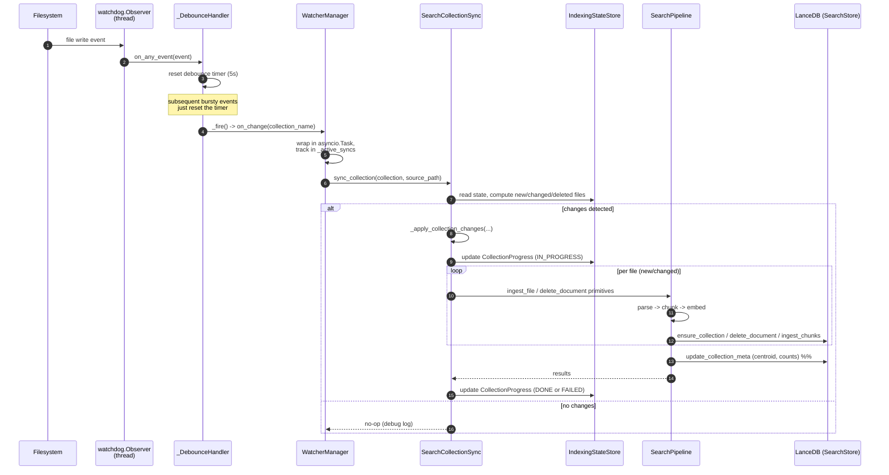

**Purpose**: Document how clients integrate with `archon-search` synchronously (REST, MCP) and how internal asynchronous flows (watcher, jobs) hang together.
**Audience**: Engineers integrating clients; engineers debugging long-running ingest/reindex flows.
**Status**: Draft
**Last reviewed**: 2026-05-20 (review-corrected)
**Next review**: 2026-08-20

# Services and Integration Architecture

`archon-search` exposes two synchronous transports — FastAPI HTTP and FastMCP HTTP — and runs two asynchronous internal integrations — the watchdog filesystem observer and the persistent job store. Both transports use the same `APIKeyMiddleware` class (each app factory adds its own instance); both async flows feed back into the same `SearchPipeline`. In the production run path (`run_server`), only the FastAPI app is started under uvicorn; `create_mcp_http_app` exists as a separate Starlette wrapper that is currently exercised only by tests. Layering and module roles are in [110_component_catalog_and_layer_breakdown.md](110_component_catalog_and_layer_breakdown.md); the topology is in [100_system_architecture_overview.md](100_system_architecture_overview.md).

## Principles

1. **One middleware class, two transports.** REST and MCP each instantiate `APIKeyMiddleware` (`server/middleware_auth.py`). `_EXEMPT_PATHS` is `{"/health", "/docs", "/openapi.json", "/redoc"}`; per `server/app.py` comments, only `/health` is a real schema exemption — the other three are defensive listings (FastAPI never includes them in the OpenAPI schema). Note that the FastAPI instance is wired with `namespaces=config.namespaces`, while the MCP wrapper passes `namespaces={}`, so MCP cannot resolve per-namespace keys — only the default key works for MCP.
2. **Sync edges write to the same state as async edges.** A watcher-triggered reindex and a `POST /collections/{name}/reindex` end up calling the same pipeline code paths.
3. **OpenAPI is the contract.** `GET /openapi.json` is authoritative for REST; breaking changes are recorded in `BREAKING.md`. See [600_api_reference_or_public_interface.md](600_api_reference_or_public_interface.md).
4. **Long-running work is jobified.** Anything that can exceed an HTTP timeout (ingest, add-collection, reindex) returns `202 Accepted` with a `job_id` instead of blocking.
5. **Telemetry never sees the query.** Telemetry entry factories take no `query` parameter; raw queries cannot be logged by construction.

## Synchronous integrations

### FastAPI HTTP control plane

Built by `archon_search.server.app.create_app`. The lifespan handler connects `SearchStore` and runs `migrate_namespace` + `migrate_acl` + `migrate_per_collection_model` before traffic flows. **C1**: an `EmbedderCache` (LRU, capacity `config.embedder_cache_size`, default 3) is constructed in the lifespan and injected into `SearchPipeline` so per-collection embedder instances are shared across requests rather than reconstructed per call. Routes are registered as separate `APIRouter`s and grouped by resource. The authoritative wire contract is `GET /openapi.json` (BearerAuth applied to every non-exempt path).

| Group | File | Endpoints |
|---|---|---|
| Health | `server/routes_health.py` | `GET /health` |
| Status | `server/routes_status.py` | `GET /status` |
| State | `server/routes_state.py` | `GET /indexing-state` |
| Search | `server/routes_search.py` | `POST /search` (single-collection or multi-collection fan-out — see below) |
| Route | `server/routes_route.py` | `POST /route` |
| Collections | `server/routes_collections.py` | `GET /collections/`, `POST /collections/` (202), `GET /collections/{name}`, `DELETE /collections/{name}`, `PATCH /collections/{name}`, `POST /collections/{name}/reindex` (202) |
| Jobs / Ingest | `server/routes_jobs.py` | `POST /ingest` (202), `GET /jobs/{job_id}`, `DELETE /jobs/{job_id}` |
| Telemetry | `server/routes_telemetry.py` | `GET /telemetry/stats`, `GET /telemetry/entries` |

Error envelopes use `schemas.ErrorDetail`. 401 returns `WWW-Authenticate: Bearer` from the middleware. Job-issuing routes return `schemas.JobResponse`.

### Multi-collection search fan-out (B3)

`POST /search` and the MCP `search` tool accept either `collection` (single-collection, unchanged) or `collections: list[str]` (a fan-out across an explicit set of collections in one request). The two are mutually exclusive — the request validator rejects both-or-neither. When `collections` is present, the route delegates to `SearchPipeline.search_many`; `POST /explain` / MCP `explain` route the multi-collection case to `SearchPipeline.explain(collections=...)`. B3 is the **execution primitive only** — the caller supplies the collection set explicitly. Supplying the *right* shortlist (collection-selection intelligence) is B4's job; see [`Documentation/Backlog/B4-stronger-collection-routing-plan.md`](../Backlog/B4-stronger-collection-routing-plan.md). B3 and B4 compose: B4 produces the shortlist that B3's `collections` parameter consumes.

The fan-out path (`pipeline.search_many`, implemented via the shared `_fanout_merge_acl` helper) is:

1. **Embed once.** A single `embed_one(query)` produces one query vector reused by every leg — N collections cost one embedding, not N.
2. **Metadata lookup + partition.** Load all namespace-scoped collection metas. Requested names missing from the namespace raise `CollectionNotFoundError` (→ HTTP 404 — no cross-namespace existence leak). Collections whose stored `embedding_model` differs from the live embedder are dropped and reported in `excluded_collections` (reason `embedding_model_mismatch`). If *every* requested collection is excluded, the result is an empty list with a populated `excluded_collections` (a valid HTTP 200, not an error).
3. **Parallel legs.** Each in-scope collection runs `store.hybrid_search_with_trace` (candidate depth `max(top_k_retrieve * 3, 20)`) as a task inside an `asyncio.TaskGroup`, the whole group wrapped in an `asyncio.timeout(fanout_timeout_seconds)`.
4. **Per-leg RRF trim.** Each leg's candidates are sorted by `(-rrf_score, chunk_id)` and trimmed to `fanout_leg_trim`. This trim is a hard recall ceiling — the reranker cannot recover candidates dropped here.
5. **Deterministic merge.** Trimmed legs are concatenated in **ascending collection-name order**, so the merged pool is reproducible.
6. **Single ACL pass.** `apply_acl_filter` runs once over the merged pool (pre-rerank). `acl_filtered` is a pool-wide boolean — it does not say which collection was filtered.
7. **Single global rerank.** One cross-encoder pass over the merged pool produces globally comparable scores; survivors are converted to `SearchResult`, each tagged with its source `collection` (provenance set at the row-to-`SearchResult` site, so `search_with_context` inherits it).

Failure mapping (verified against `routes_search.py` / `routes_explain.py`):

- Whole-fan-out timeout (`FanoutTimeoutError` from the `asyncio.timeout` context) → **504** `{"detail": "Search timed out"}`.
- Any single leg raising → siblings are cancelled by the `TaskGroup`; the first leg exception is re-raised as a plain exception so the route's existing **500** mapping fires.
- Metadata-lookup failure (`MetadataLookupError`) → **503** `{"detail": "service unavailable"}`.
- Model-mismatched collections are **not** an error — they are excluded and reported in `excluded_collections`.

Telemetry for the fan-out path uses `TelemetryEntry.from_search_multi_result` (`EndpointKind.search_multi`): it records `collections`, `fanout_count` (legs actually searched after exclusions), `result_count`, and `excluded_count` — never the query text (the no-raw-query invariant holds).

### MCP endpoint

`server/mcp.py` builds a FastMCP app. `create_mcp_http_app` wraps it in a Starlette app at `/mcp` and adds its **own** `APIKeyMiddleware` instance (`namespaces={}`). This wrapper is not mounted onto the FastAPI app by `run_server` — in the running server, only the FastAPI control plane is bound under uvicorn. `create_mcp_http_app` is currently called only from tests (`tests/server/test_mcp_auth.py`). MCP tools are pipeline-shaped, not REST-shaped — they wrap `SearchPipeline` directly. The MCP factory accepts a `TelemetryWriter | None`; there is no production code path that wires a shared writer into MCP today, so the "same `TelemetryWriter`" claim only holds if a caller explicitly passes one. #Unverified

Tools registered in `server/mcp.py` (verified against source):

| Tool | Pipeline method | Notes |
|---|---|---|
| `search` | `SearchPipeline.search` / `SearchPipeline.search_many` | Returns `{results, acl_filtered, excluded_collections}`. Passing `collections` (instead of `collection`) routes to the multi-collection fan-out (`search_many`). |
| `search_with_context` | `SearchPipeline.search_with_context` | Returns each hit plus `context_before` / `context_after`. |
| `explain` | `SearchPipeline.explain` | Per-stage score breakdown (`results` + `near_misses`) plus the routing decision; mirrors REST `POST /explain`. Accepts `collections` for a multi-collection fan-out (routing is bypassed; legs are merged into one reranked pool). |
| `ingest_file` | `SearchPipeline.ingest_file` | Synchronous from the client's view. |
| `ingest_directory` | `SearchPipeline.ingest_directory` | Streams progress via an inner `progress_cb`. |
| `list_collections` | `SearchPipeline.list_collections` | |
| `get_collections_meta` | `SearchPipeline.get_all_collections_meta` | Used by `MultiCollectionRouter.fetch_metadata`. |
| `get_collection_meta` | `SearchPipeline.get_collection_meta` | |
| `list_documents` | `SearchPipeline.list_documents` | |
| `delete_document` | `SearchPipeline.delete_document` | |
| `update_collection` | `SearchStore.update_collection_meta` (direct) | **C1** — 11th tool. Accepts `collection_name: str` and `embedding_model: str`; implements the per-collection model state machine (same logic as `PATCH /collections/{name}`). Returns the updated `CollectionMeta` dict or `{error, code}`. |

> **Discrepancy with CLAUDE.md:** the project description names MCP tools such as `search_status`, `search_start`, `search_stop`, `search_ingest`, `search_collection_{list,add,remove,info,reindex}`. The current `server/mcp.py` does not register those names. The list above is what the running server actually exposes. See source: `archon_search/server/mcp.py`.

### Shared authentication

`APIKeyMiddleware` reads `Authorization: Bearer <token>`, then resolves a namespace:

- Iterates `config.namespaces` with `secrets.compare_digest` (no early exit, to avoid timing leakage).
- Falls back to the single default key from `key_manager.load_or_generate_key()`.
- Validates the resolved namespace and attaches it to `request.state.namespace`.

Both app factories add this middleware to their respective apps, but they are **separate instances**: the FastAPI factory passes `namespaces=config.namespaces` (full multi-tenant resolution); the MCP wrapper passes `namespaces={}` (default-key only). In production (`run_server`), only the FastAPI app is started. The threat model and key-rotation story are in [150_security_and_privacy_architecture.md](150_security_and_privacy_architecture.md).

## Asynchronous integrations

### Watchdog filesystem observer

`archon_search/watcher.py` wraps a `watchdog.Observer` per collection in `CollectionWatcher`, and `WatcherManager` keeps a registry. `_DebounceHandler` coalesces a burst of filesystem events into a single coroutine call after `debounce_seconds` (default 5 s). The coroutine target is `SearchCollectionSync.sync_collection`. Note: the FastAPI server (`server/app.create_app`) does **not** construct or start a `WatcherManager` in its lifespan; watcher wiring lives in `archon_search/install.py` (the `install_cmd` flow). `sync_collection` does not call `ingest_directory` — it computes new/changed/deleted files and routes them through `_apply_collection_changes`, which uses per-file pipeline primitives.

Failure modes (see source: `archon_search/watcher.py`):

- Observer thread can't be scheduled or started — logged at WARNING, watcher silently inactive.
- Stopping observer fails — best-effort join with 5 s timeout; thread-leak logged.
- `WatcherManager._shutting_down` short-circuits new callbacks; in-flight syncs get 10 s to drain before cancellation.

### Job store

`archon_search/jobs/store.py` is the durable state machine for long-running work. `JobStatus` values are `PENDING`, `RUNNING`, `DONE`, `FAILED`, `CANCELLING`, `CANCELLED` — there is no `SUCCEEDED`. The `types.py` module defines `IngestJob` plus `ReindexJob` and `DeleteJob` subclasses, but the persistent `JobStore` is hard-coded to reconstruct every record as `IngestJob` on load; `ReindexJob` / `DeleteJob` are unused by the running REST paths (the reindex route creates an `IngestJob`). Jobs are serialised as JSON to `~/.archon-search/archon-search-jobs.json` with atomic-rename writes. Crash recovery: any `RUNNING` or `CANCELLING` job loaded from disk is rewritten to `FAILED` with `error="process_restart"`. Jobs older than 7 days are evicted on every write (and on load). `JobStore.transition(job_id, from_statuses, to_status)` exists and enforces a from-status guard, but only `DELETE /jobs/{job_id}` uses it; the ingest lifecycle wrapper (`_default_ingest_task`) moves `PENDING -> RUNNING -> DONE/FAILED/CANCELLED` via plain `store.update(...)`.

Routes that issue jobs: `POST /ingest`, `POST /collections/`, `POST /collections/{name}/reindex`. The client then polls `GET /jobs/{job_id}`.

## Sequence: watcher-triggered sync

This is the canonical end-to-end async flow. The watcher detects a change, debounces, and schedules a sync coroutine. Important: watcher-triggered syncs do **not** create a `JobStore` job — they only update the `IndexingStateStore` and call per-file pipeline primitives via `_apply_collection_changes`. Job records are created only by the REST routes (`POST /ingest`, `POST /collections/`, `POST /collections/{name}/reindex`).

Notes on the diagram:

- `IndexingStatus` values are `pending`, `in_progress`, `done`, `failed` — there is no `INDEXING` or `READY` status.
- No `JobStore` participant appears because `sync_collection` does not import or touch `JobStore`.
- `rebuild_fts_index` ordering relative to per-file ingest in `_apply_collection_changes` was not re-verified in this review. #Unverified

Error paths and their handling are in [140_error_handling_strategy.md](140_error_handling_strategy.md). Persistence semantics for LanceDB and the jobs file are in [130_data_architecture_and_persistence.md](130_data_architecture_and_persistence.md).
