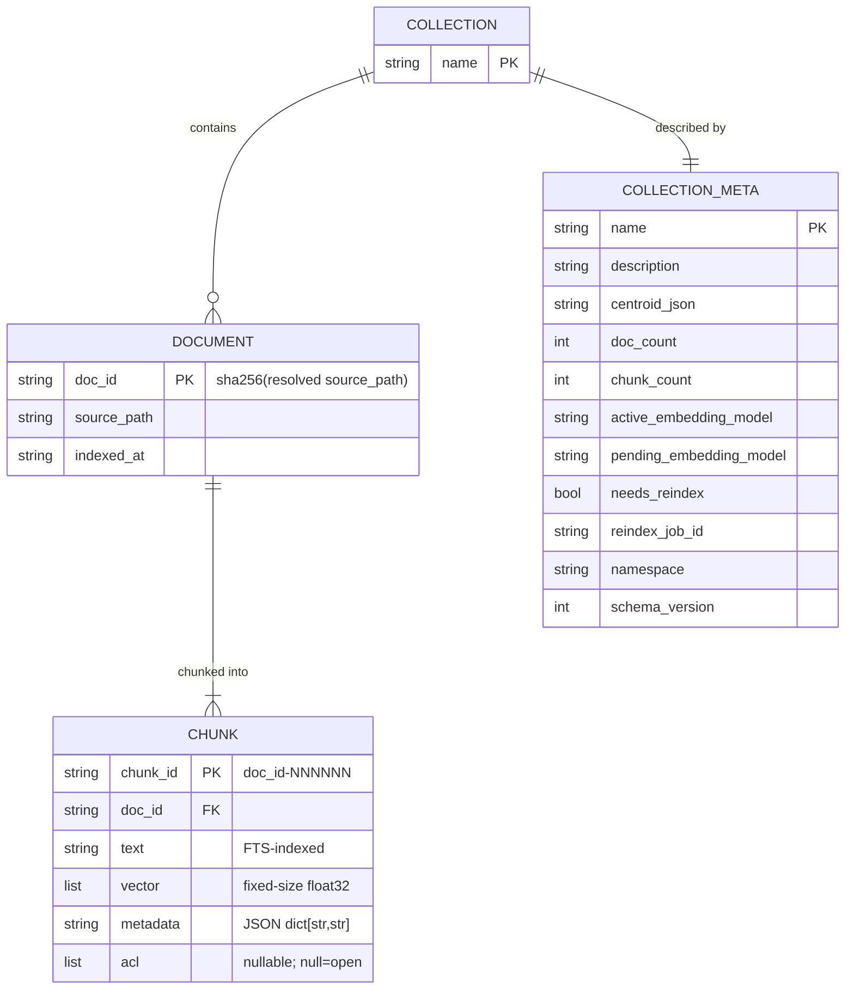
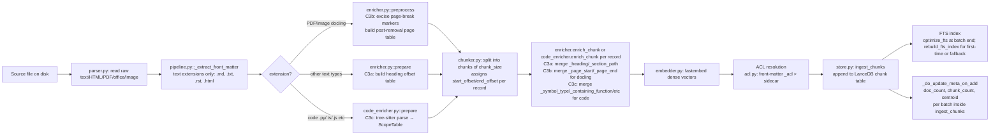

**Purpose**: Document where `archon-search` keeps state on disk, the LanceDB schemas it writes, and how ingest mutates that state.
**Audience**: Maintainers and operators of an `archon-search` install.
**Status**: Draft
**Last reviewed**: 2026-05-24
**Next review**: 2026-08-20

# Data Architecture and Persistence

archon-search is a single-user local service. All persistent state lives under a single root directory (`~/.archon-search/` by default; relocatable to any path via `ARCHON_SEARCH_DATA_DIR`, which the published Docker image sets to `/data`). There is no database server, no remote storage, and no built-in backup; the user owns the data.

See also: [100_system_architecture_overview.md](100_system_architecture_overview.md), [120_services_and_integration_architecture.md](120_services_and_integration_architecture.md), [160_operational_readiness_monitoring_and_reliability.md](160_operational_readiness_monitoring_and_reliability.md).

## Principles

1. **One directory, owned by the user.** All state lives under a single root — `~/.archon-search/` by default, or `$ARCHON_SEARCH_DATA_DIR` if set (the Docker image sets this to `/data`). Nothing escapes the root unless the user explicitly points an override env var (`ARCHON_SEARCH_KEY_FILE`, `ARCHON_SEARCH_CONFIG`, `FASTEMBED_CACHE_PATH`) elsewhere.
2. **LanceDB is the source of truth.** Vector + FTS data and per-collection metadata live in LanceDB tables; everything else (TOML, JSON, JSONL) is derived or operational.
3. **Stable, content-addressed identifiers.** `doc_id` is `sha256(resolved_source_path)`; `chunk_id` is `<doc_id>-<6-digit-index>`. This is enforced by regex in `archon_search/store.py`.
4. **Telemetry is opt-in, locally retained, never exported.** No raw query text is ever persisted (structural guarantee — see `telemetry/entry.py`).
5. **No backup, no replication.** The user is responsible for backing up `~/.archon-search/`. Loss of the directory loses the index.

## On-disk layout under `~/.archon-search/`

In the table below, paths are relative to the data-directory root — `~/.archon-search/` by default, or `$ARCHON_SEARCH_DATA_DIR` if set (the Docker image sets this to `/data`).

| Path | Owner | Contents | Notes |
|------|-------|----------|-------|
| `archon-search.toml` | user (or `config_cmd` CLI) | runtime config | optional; missing file → all defaults (`config.py::load_config`). **Note**: not relocated by `ARCHON_SEARCH_DATA_DIR` — use `ARCHON_SEARCH_CONFIG` instead. |
| `.search.env` | `key_manager.py` | `ARCHON_SEARCH_API_KEY=<hex>` | mode `0600`; auto-generated on first start if missing. Resolved lazily via `get_key_file()`. |
| `keys.json` | `key_manager.py` (`KeyStore`) | Durable multi-key store: JSON array of `KeyRecord` objects (`id`, `token_hash`, `namespace`, `label`, `created_at`, `expires_at`, `status`). Written with mode `0o600` via `atomic_write_bytes`. Created on first managed-key operation (D7). |
| `search/` | `store.py` (LanceDB) | vector + FTS + collection meta tables | `db_path` config key; created on `SearchStore.connect()` |
| `search-logs/` | `telemetry/writer.py` | `YYYY-MM-DD.jsonl` per UTC day | only if `[telemetry].enabled = true` |
| `logs/archon-search.log` | server | server logs | `[logging].log_file` |
| `archon-search-jobs.json` | `jobs/store.py` | job state for long-running ingest/reindex | `get_jobs_file()` in `jobs/model.py` |
| `.indexing_state.json` | `progress.py` (`IndexingStateStore`) | per-collection indexing progress/status | atomic-rename writes; RMW serialized by an internal `RLock` (see "Indexing state") |
| `.maintenance-state.json` | `jobs/maintenance_loop.py` (`MaintenanceLoop`) | last/next run timestamps, per-collection health, retry counts | atomic-rename write after each pass; absent/corrupt → fresh empty state (no error); see "Maintenance state" |
| `models/` | `language_detector.py` | fasttext language detector (`lid.176.ftz`) | only if `multilingual=True`; resolved lazily via `get_fasttext_models_dir()` |
| `history/sessions/` | `cli/ingest.py` | default `--sessions-dir` for the `ingest` subcommand | resolved lazily via `get_data_dir()` |

Override paths:
- `ARCHON_SEARCH_DATA_DIR` (C9) — relocates the entire layout above (except `archon-search.toml` — see `ARCHON_SEARCH_CONFIG`). The Docker image sets `ARCHON_SEARCH_DATA_DIR=/data`. Read lazily on every call by `paths.get_data_dir()`, `key_manager.get_key_file()`, `jobs.get_jobs_file()`, `language_detector.get_fasttext_models_dir()`, `cli/ingest.py`, and `config.load_config()`.
- `ARCHON_SEARCH_KEY_FILE` overrides `.search.env` location (takes precedence over `ARCHON_SEARCH_DATA_DIR` for the key file).
- `ARCHON_SEARCH_API_KEY` (env var) overrides reading any key file entirely.
- `ARCHON_SEARCH_CONFIG` overrides `archon-search.toml` location.
- `FASTEMBED_CACHE_PATH` (fastembed's own env var) overrides where the embedding model weights cache. The Docker image sets this to `/data/fastembed-cache` so model weights persist on the mounted volume.

## Durability contract

Every durable JSON/bytes write of runtime state routes through a single helper module, `archon_search/_durable_io.py`, rather than calling `os.replace`/`write_text`/`write_bytes` directly. The helper exposes two functions:

- `atomic_write_json(path, data)` — write to `path.tmp`, `flush()`, `os.fsync(file_fd)`, `os.replace(tmp, path)`, then `os.fsync(parent_dir_fd)`.
- `atomic_write_bytes(path, data, mode=0o600)` — same sequence, but the temp file is created with `os.open(..., O_WRONLY | O_CREAT | O_EXCL, mode)`, so the file permission is set at creation (no chmod-after window) and a pre-existing temp file is signalled as `FileExistsError` rather than silently overwritten.

The crucial property is that the helper fsyncs **both the file and the parent directory**: the parent-directory fsync is what makes the `os.replace` rename itself durable. fsync is never retried — on `EIO` the kernel may already have marked the page clean (POSIX "fsyncgate"), so a retry is unsafe. The helper is **not internally synchronized**; callers must serialize writes to the same path.

The eight durable-write sites that use the helper are:

| Site | Helper | File written |
|------|--------|--------------|
| `progress.IndexingStateStore.write` | `atomic_write_json` | indexing-state JSON |
| `sync._write_manifest` | `atomic_write_json` | sync manifest |
| `sync.manifest_remove_entry` | `atomic_write_json` | sync manifest |
| `jobs/store.py::JobStore._write_atomic` | `atomic_write_json` | `archon-search-jobs.json` |
| `key_manager._generate_and_write` | `atomic_write_bytes` | `.search.env` (mode `0600`) |
| `key_manager.KeyStore._write` | `atomic_write_bytes` | `keys.json` (mode `0600`) |
| `maintenance_loop._save_state` | `atomic_write_json` | `.maintenance-state.json` |
| `backup_loop._save_state` | `atomic_write_json` | `.backup-state.json` |

A CI lint gate, `tests/test_no_raw_durable_writes.py`, scans `archon_search/**/*.py` (excluding the helper itself) for raw write patterns and fails the build on new ones; a handful of out-of-scope one-shot writes (TOML config writers, OS service-unit files) carry a `# noqa: durable-write` allow-list comment.

### Telemetry durability (rotate-only fsync)

Telemetry does **not** use `_durable_io`. `TelemetryWriter` (`telemetry/writer.py`) holds a persistent per-date file descriptor and appends each line **without per-line fsync**. It fsyncs only at boundaries: on a UTC-date rollover it does `fsync(old_fd) + close(old_fd)` before opening the new day's file, and `drain_and_stop()` does a final `fsync + close` on shutdown. This keeps the hot path cheap while still flushing on rotation and clean shutdown; the trade-off is that an unclean crash can lose up to one kernel writeback window of telemetry lines (see Known limits).

### Error-propagation matrix

Per-call-site `OSError` handling is deliberate, not uniform:

| Site | On `OSError` |
|------|--------------|
| `sync._write_manifest` + progress writes invoked through sync | **Swallowed** by `sync.py::_safe_state_update` (`except Exception`); partial state is recoverable on the next sync pass. |
| `sync.manifest_remove_entry` | **Swallowed** by its own local `except (json.JSONDecodeError, OSError): pass`. |
| `key_manager._generate_and_write` | **Propagates** — fatal at startup; the operator must intervene. Concurrent-bootstrap `FileExistsError` is recovered (the other writer won the race). |
| Route-driven `jobs/store` writes (`routes_jobs.py` ingest + `delete_job`; `routes_collections.py` add_collection + reindex_collection) | **Propagates** to the route's narrow `except OSError`, which returns `JSONResponse({"detail": "internal error"}, status_code=500)`. The background ingest task logs and marks the job `FAILED`, suppressing a secondary `OSError`. |
| Telemetry `_append` | **Swallowed** by `_run`'s `except (OSError, ValueError)`; the entry is dropped (best-effort). |

The OSError-to-`500` mapping for the route-driven sites is recorded in [140_error_handling_strategy.md](140_error_handling_strategy.md).

### Known limits

- **tmpfs caveat.** The crash-injection integration tests verify the write *sequence* on a disk-backed filesystem and **skip on tmpfs**; CI must pass a disk-backed `--basetemp` (GitHub Actions' default `/tmp` is tmpfs). The tests do not simulate power loss — `os._exit()` leaves the kernel page cache intact.
- **Telemetry crash window.** Telemetry can lose up to one kernel writeback window of lines on an unclean crash (Linux default ~5s via `dirty_writeback_centisecs`, longer under load), because per-line fsync is deliberately rejected.
- **macOS `F_FULLFSYNC` is not used.** `os.fsync()` on Darwin flushes the kernel buffer cache but not the device's internal write cache, so the "survives power loss" property is conditional on the device having power-loss protection.
- **Windows is not exercised.** `platform/windows.py` is a stub; the helper's behavior there is best-effort and untested.

The full rationale, alternatives, and consequences are in [ADR-06: Durable State Writes via fsync](../ADRs/06_durable_state_writes_via_fsync.md).

## LanceDB layout

LanceDB lives in `~/.archon-search/search/` (configurable via `[database].db_path`). It contains two kinds of tables:

- **One chunk table per collection.** Table name = collection name (validated against `^[a-zA-Z0-9][a-zA-Z0-9_-]{0,63}$` in `store.py::_COLLECTION_RE`).
- **One shared metadata table** named `_archon_collection_meta` (constant `_META_TABLE`). The `_archon_` prefix is reserved; user collections cannot start with it (filtered out of `list_collections`).

### Chunk-table schema (`SearchStore._schema`)

| Field | Type | Notes |
|-------|------|-------|
| `doc_id` | `utf8` | sha256 hex of resolved source path |
| `chunk_id` | `utf8` | `<doc_id>-<NNNNNN>` |
| `text` | `utf8` | chunk text (FTS-indexed) |
| `vector` | `list<float32>[embedding_dim]` | dense embedding |
| `source_path` | `utf8` | absolute resolved path at ingest time |
| `indexed_at` | `utf8` | ISO 8601 |
| `file_type` | `utf8` | e.g. `md`, `py`, … |
| `language` | `utf8` | **C2 three-state contract**: `""` = never processed (pre-C2 / legacy chunk); `"unknown"` = processed by `LanguageDetector` but confidence below threshold; `"<code>"` = ISO 639-1 or ISO 639-3 code (e.g. `"fr"`, `"de"`). The `language=<code>` search filter returns only chunks matching that exact state; `language=unknown` returns `"unknown"`-tagged chunks only; no filter returns all three states. Only populated when `config.multilingual=True` at ingest time. |
| `metadata` | `utf8` | JSON-encoded `dict[str,str]`; size-bounded (see `validate_metadata`). **C3a**: text-format files carry `_heading` (nearest preceding heading text, capped at 512 chars) and `_section_path` (e.g. `"Installation > macOS > Homebrew"`, capped at 512 chars, left-truncated) after ingest. Non-text or heading-free chunks carry empty strings for both keys. **C3b**: PDF and image files (docling-parsed sources) carry `_page_start` (1-indexed page number as `str`; always present) and, when a chunk spans a page boundary, `_page_end` (last page as `str`; absent when equal to `_page_start`). The internal page-break marker `<!-- archon-search:pagebreak:v1 -->` is an implementation detail that is excised before chunking and never reaches `ChunkRecord.text`, API responses, or the FTS index. **C3c**: source-code files (`.py`, `.ts`, `.js`, `.go`, `.rs`, `.java`, `.sh`) carry five symbol-level fields populated by `CodeEnricher` at ingest time: `_symbol_type` (one of `"function"`, `"method"`, `"class"`, `"module"`), `_containing_function` (innermost function/method name, `""` if none), `_containing_class` (innermost class name, `""` if none), `_module_path` (dotted module path derived from the file path and optional `collection_root`; falls back to `file_path.stem` when `collection_root` is `None`), and `_symbol_subtype` (e.g. `"python-function"`, `"typescript-class"`). When tree-sitter is not installed or the grammar is missing, only `_module_path` is populated; when `collection_root` is `None`, `_module_path` equals `file_path.stem`. Code files do NOT receive `_heading` / `_section_path` keys. |
| `custom_score` | `float32` | nullable |
| `ingested_by` | `utf8` | call-site identity: one of `cli` / `http` / `watcher` / `reindex` (defined by `_types.IngestedBy`; legacy `archon-search-cli` is normalized at boundaries) |
| `updated_at` | `utf8` | ISO 8601 |
| `acl` | `list<utf8>` (nullable) | `None`=open, `[]`=deny-all, `[ns…]`=allowed namespaces |
| `expires_at` | `utf8` (nullable) | ISO 8601 UTC fixed-width timestamp (`YYYY-MM-DDTHH:MM:SS.ffffffZ`); `null` = never expires. Computed at ingest time from `chunk_ttl_seconds` (request-level) → `default_ttl_seconds` (collection meta) → `null`. **E2a** — added by `migrate_expires_at_and_scopes` (in-place migration at `introduced_at=1`; run `POST /collections/{name}/migrate` to apply). |
| `scopes` | `list<utf8>` (nullable) | List of scope tags (e.g. `["user:alice"]`); `null` = unscoped (matches any `scope_filter`). Assigned at ingest time from `chunk_scopes` in the ingest request. `chunk_scopes=[]` is normalized to `null`. **E2a** — added by `migrate_expires_at_and_scopes`. |

Metadata bounds enforced by `store.py::validate_metadata`: max 50 fields, key ≤ 256 chars, value ≤ 4096 chars.

The per-field partition map (**system** / **filterable** / **ranking** / **audit**) for `ChunkRecord` lives in `archon_search/_types.py` as docstrings on the dataclass — see the source for the authoritative breakdown. The categories drive how A2 (filters) and future ranking/audit work each field; this doc does not duplicate the assignment.

### Collection-metadata schema (`SearchStore._meta_schema`)

| Field | Type | Notes |
|-------|------|-------|
| `name` | `utf8` | collection name |
| `description` | `utf8` | auto- or user-provided (see `description_generator.py`) |
| `centroid_json` | `utf8` | JSON-encoded list of floats — the routing centroid; `""` if unset |
| `doc_count` | `int64` | |
| `chunk_count` | `int64` | |
| `active_embedding_model` | `utf8` | embedding model currently used for this collection's index; `""` when not yet set (defaults to global `config.embedding_model` at query time) |
| `pending_embedding_model` | `utf8` (nullable) | model requested via `PATCH /collections/{name}` that requires a reindex before becoming active; `null` when no model change is pending |
| `needs_reindex` | `bool` | `true` when `pending_embedding_model` differs from `active_embedding_model` and a reindex has not yet completed; cleared to `false` after successful reindex |
| `reindex_job_id` | `utf8` (nullable) | job ID of the in-progress or most-recent reindex triggered by a model change; `null` when no such job has been issued |
| `last_indexed` | `utf8` | ISO 8601 or `""` |
| `last_described` | `utf8` | ISO 8601 or `""` |
| `described_at_doc_count` | `int64` | `-1` sentinel = unset |
| `namespace` | `utf8` | added by `migrate_namespace`; defaults to `default` |
| `centroid_sum_json` | `utf8` | JSON-encoded `list[float]` — element-wise sum of all chunk vectors. Combined with `chunk_count`, satisfies `centroid = centroid_sum / chunk_count`. Added by B5 incremental-centroid maintenance; `""` when unset or not yet migrated. |
| `mutations_since_recompute` | `int64` | Counter incremented on every ingest batch and every delete operation; reset to `0` after a full `recompute_collection_meta`. Used to detect high-churn collections that need a periodic drift-reset recompute. `-1` sentinel = pre-B5 row (treated as 0 at read time). |
| `needs_recompute` | `bool` | Set `True` when incremental maintenance cannot proceed (model mismatch detected, NaN/Inf in a vector batch, or centroid sum absent from a pre-B5 store). The pipeline calls `recompute_collection_meta` automatically when this flag is `True` before the next search or routing query against the collection. Cleared to `False` on successful full recompute. |
| `schema_version` | `int64` | **D3** — tracks which structural migrations (to the shared chunk-table schema or the collection-metadata schema) have been applied to this collection. Added by `_run_startup_migrations()` idempotently; defaults to `0` for all rows (including pre-D3 collections read before the migration runs). Compared against `STORE_SCHEMA_VERSION` by `pending_migrations()` to determine which migrations need to be applied. Updated to `STORE_SCHEMA_VERSION` by `apply_in_place_migrations()` on success; left unchanged if a rewrite migration is cancelled or fails mid-way. |
| `default_ttl_seconds` | `int64` (nullable) | Collection-level TTL default in seconds; `null` = no default. When set, newly ingested chunks without per-request `chunk_ttl_seconds` inherit `expires_at = ingest_time + default_ttl_seconds`. Forward-only — PATCH does NOT retroactively update existing chunks. **E2a** — added by `migrate_default_ttl_seconds` (in-place migration at `introduced_at=1`). |

The three B5 columns are additive and populated lazily: rows written by an older binary that lacks B5 will have `None` for all three fields, which the store treats identically to the `needs_recompute = True` state and triggers a full recompute on next access. See also `BREAKING.md` for mixed-version deployment caveats.

### Per-collection graph tables (E1a / E1b)

When `[graph].enabled = true`, `GraphStore` creates two auxiliary tables per collection on first ingest:

- **`_archon_graph_{col}_nodes`** — one row per unique entity (`entity_id`, `entity_type`, `entity_name`, `source_chunk_ids`). Written by `GraphStore.write_graph` during ingest.
- **`_archon_graph_{col}_edges`** — one row per relationship (`edge_id`, `src_id`, `rel`, `tgt_id`). Written by `GraphStore.write_graph` during ingest.

**E1b** adds a third auxiliary table per collection, populated only by the explicit CLI command `archon-search graph build-communities <collection>` (via `CommunityBuilder`). It is **never** auto-populated during ingest:

**`_archon_graph_{col}_communities`** (`GraphStore.ensure_communities_table()`):

| Column | Type | Description |
|--------|------|-------------|
| `community_id` | string | Stable community identifier |
| `entity_ids` | list[string] | Member entity IDs (from `_archon_graph_{col}_nodes`) |
| `representative_chunk_ids` | list[string] | MMR-selected chunk IDs for retrieval |
| `summary_text` | string? | Optional LLM abstractive summary; null when no `extraction_model` is configured |
| `built_at` | string (ISO 8601 UTC) | UTC timestamp of last `build-communities` run; stored as `pa.utf8()` following the same convention as other timestamp columns |

The table becomes stale whenever new entities are ingested after the last `build-communities` run. `GET /status` exposes `graph.last_built_at` per collection to signal staleness. `graph_mode="local"` falls back to hybrid search when the table is absent or empty; `graph_mode="global"` raises `GraphCommunitiesNotBuiltError` → `422`.

### Timestamp format

`indexed_at` and `updated_at` are stored as fixed-width UTC strings: **`YYYY-MM-DDTHH:MM:SS.ffffffZ`** (26 characters, always 6 fractional digits, always `Z` suffix). The canonical producer is `archon_search._types.normalize_iso_utc`.

**Mixed-storage transition window**: rows indexed before A2 may carry variable-precision ISO 8601 timestamps (e.g. `2025-01-02T10:00:00Z` without microseconds). Because date-range filter comparisons use lexicographic SQL ordering against the `indexed_at` column, mixed-precision rows may sort incorrectly and produce wrong date-range filter results. Run `archon-search collection reindex-metadata <name> --normalize-timestamps` (offline-friendly, online-safe) to rewrite all rows to the fixed-width format and restore correct ordering.

### Full-text index

FTS is built per chunk table on the `text` column via `store.py::rebuild_fts_index` using `lancedb.index.FTS`. The hybrid search path (`hybrid_search`) issues a vector search and an FTS search in parallel, fuses results with Reciprocal Rank Fusion (`_RRF_K=60`), and gracefully falls back to vector-only if no FTS index exists.

**C6 — Incremental FTS maintenance**: as of C6, normal ingest and delete operations no longer trigger a full `rebuild_fts_index()`. Instead:

- `store.optimize_fts(collection)` wraps `table.optimize()` to incorporate newly added and deleted rows into the existing FTS index incrementally (O(delta), not O(collection-size)).
- `store.delete_document(skip_fts_optimize=False)` calls `optimize_fts` after the LanceDB delete; pass `skip_fts_optimize=True` from ingest paths that will call `optimize_fts` separately at batch end.
- `pipeline.ingest_file` and `pipeline.ingest_directory` call `optimize_fts` at batch end (not per-file) under Plan A (`store.supports_incremental_fts_delete = True`). They fall back to `rebuild_fts_index` per the Plan B branch if that flag is `False`, and also fall back on `optimize_fts` exception.
- `store.reindex_metadata` does **not** call any FTS method — it only writes `file_type`, `updated_at`, `ingested_by`, and `indexed_at`; the `text` column (the sole FTS-indexed column) is never modified.
- `rebuild_fts_index` remains available for operator-initiated full FTS repair (not called from ingest paths automatically).

**Known limitations (C6)**:
- BM25 scores after N incremental `optimize()` calls may differ numerically from a fresh rebuild. Equivalence is defined as result-set membership, not score equality.
- If `optimize_fts` fails mid-ingest, the fallback is a full `rebuild_fts_index()` — see `pipeline.py`.
- Concurrent `optimize()` on the same table raises a LanceDB commit conflict; the production code serializes calls per collection via the per-collection lock pattern.

### Filter execution and over-fetch

A2 adds query-side filtering (`archon_search/filters.py`, `archon_search/store_filters.py`). Filter execution splits into two phases:

1. **SQL WHERE clause** (LanceDB-side, `store_filters.build_where`): handles `file_type`, `source_path_prefix`, `indexed_after`, `indexed_before`. **E2a**: also handles exact `scope_filter` values via `(scopes IS NULL OR list_has(scopes, '<value>'))` — the `scopes IS NULL` arm ensures unscoped chunks always pass through. These are expressed as SQL predicates pushed into the LanceDB query.
2. **Python post-filter** (in-memory, `store.py`): handles `source_path_glob` via `fnmatch.fnmatchcase`. **No path semantics**: `*` matches `/`, and `**` is identical to `*` — there is no shell-style directory-boundary awareness. **E2a**: also handles `scope_filter` with a trailing `*` (wildcard prefix match). Wildcard scope matching is Python-side on the top-k candidate set after LanceDB retrieval; unscoped chunks (`scopes is None`) always pass through the wildcard filter.

Because glob and ACL filtering happen after retrieval, the store over-fetches candidates before post-processing. The `_compute_fetch` helper (`store_filters.py`) controls this:
- No glob: `max(top_k * 3, 20)` — standard RRF over-fetch.
- With glob: `max(top_k * GLOB_OVERFETCH_FACTOR, 60)` where `GLOB_OVERFETCH_FACTOR = 5` — extra headroom to absorb glob × ACL attrition.

**Known limitation (E2a):** `_compute_fetch` does not account for wildcard `scope_filter`. When both `source_path_glob` and a wildcard `scope_filter` (trailing `*`) are active simultaneously, two independent Python-side post-filters apply — the 5x glob over-fetch factor may not compensate for the compounded attrition, and the caller may receive fewer than `top_k` results. No additional over-fetch multiplier is applied for `scope_filter`.

### Migrations (idempotent, run at startup)

**D3: `STORE_SCHEMA_VERSION`** — a module-level integer constant in `store.py` (currently `1`). Every structural change to `_schema()` or `_meta_schema()` that requires existing rows to be migrated must increment this constant and register a `MigrationSpec` in `SearchStore._all_migrations()`. `GET /collections/{name}/migrations/pending` compares each collection's `schema_version` against this constant and returns the list of unapplied specs. `GET /status` reports `store_schema_version` (the constant) and `collections_schema_behind` (count of collections below it).

The five startup migrations below are formalised as `MigrationSpec` entries with `kind=in_place` and `introduced_at=0`. They run via `SearchStore._run_startup_migrations()` on every server startup (alongside a sixth infrastructure step, `_migrate_schema_version()`, which idempotently adds the `schema_version` column to `_archon_collection_meta` and is not a `MigrationSpec`).

- `migrate_namespace` — adds `namespace` column to `_archon_collection_meta` if absent.
- `migrate_description_embedding` — adds `description_embedding_json` column to `_archon_collection_meta` if absent (B4).
- `migrate_acl` — adds nullable `acl` column to each chunk table that lacks it.
- `migrate_centroid_sum` — adds `centroid_sum_json`, `mutations_since_recompute`, and `needs_recompute` columns to `_archon_collection_meta` if absent (B5).
- `migrate_per_collection_model` — adds `active_embedding_model`, `pending_embedding_model`, `needs_reindex`, and `reindex_job_id` columns to `_archon_collection_meta` if absent, backfilling `active_embedding_model` from the pre-C1 `embedding_model` column. Idempotent: a second run is a no-op. The old `embedding_model` column is dropped after backfill.

**E2a migrations (`introduced_at=1`)**: unlike the five startup migrations above, these are NOT applied automatically at server startup. Operators must run `POST /collections/{name}/migrate` for each collection after upgrading to E2a:

- `migrate_expires_at_and_scopes` — adds `expires_at` (`utf8`, nullable) and `scopes` (`list<utf8>`, nullable) columns to every collection's chunk table. Idempotent: running it twice produces no error and no data change (column-existence guard). Until migrated, TTL/scope data is silently omitted from ingest rows.
- `migrate_default_ttl_seconds` — adds `default_ttl_seconds` (`int64`, nullable) column to `_archon_collection_meta`. Idempotent.

**D3 migration-kind taxonomy:**
- `in_place` — idempotent `add_columns()` call; completes in under a second; no data rewrite required. Applied synchronously by `POST /collections/{name}/migrate` (returns `200`) or automatically at startup.
- `rewrite` — batch read/transform/write of all chunks via `apply_rewrite_migration()`; runs as a `MigrationJob` (QUEUED → RUNNING → DONE); requires `backup_confirmed: true` before dispatch; acquires the per-collection `asyncio.Lock` for its duration. Each batch uses delete-then-add (non-atomic): a crash between delete and re-add loses that batch's rows. The `backup_confirmed` flag is the primary mitigation.
- `export_rebuild` — classified and surfaced in the pending list; execution deferred to D5 (operators must re-ingest manually). `POST /collections/{name}/migrate` returns `422` for this kind.

## Entity relationships



Notes:
- A `COLLECTION` is materialized as one LanceDB chunk table; `DOCUMENT` is not a separate table — it is a logical grouping of chunks sharing a `doc_id`.
- `COLLECTION_META` rows live in the shared `_archon_collection_meta` table, one row per `(name, namespace)`. Reassigning a collection to a different namespace is refused (`update_collection_meta` raises `ValueError`).
- The `centroid` is persisted as a JSON-encoded list of floats in `centroid_json`; the `MultiCollectionRouter` reads these to rank collections per query.

## Ingest data flow



Note: step `H` (`_do_update_meta_on_add`) runs inside `store.ingest_chunks()` on every batch — centroid, `doc_count`, and `chunk_count` are maintained incrementally (B5 incremental path, unconditional since D4). `ingest_directory` additionally calls `store.update_description()` (description + `last_indexed`) after each file. A drift-correction full recompute (`recompute_collection_meta`) fires if any batch sets `needs_recompute=True`.

### Reindex semantics

`sync.py` records `indexed_chunk_size` on the **per-collection** checkpoint (one value per collection in `state.collections`, see `sync.py:228, 275`), not per document. When the current configured `chunk_size` differs from the stored `indexed_chunk_size` and the value is non-zero:

- If `[database].auto_reindex_on_chunk_size_change = true` (default) → `force_full_reindex = True` is set and `_check_collection_changes` returns every eligible file as "to add", so the **entire collection** is re-chunked, re-embedded, and replaces the existing chunks (`sync.py:402–409`, `:425–426`).
- If `false` → no reindex is triggered; a collection-scoped warning is logged (`"Chunk size mismatch for '%s' …"`) and the collection is left as-is until a manual `archon search reindex` is run (`sync.py:411–416`).

The same `force_full_reindex` path is taken when the configured embedding model differs from the indexed one (`sync.py:391–398`); the doc-level "no reindex for embedding-model changes" claim refers only to automatic per-file reindexing — at the collection level the next sync rebuilds everything. A manual `collection reindex` is still exposed as a job-returning route (see `routes_collections.py::reindex`, returns `202` + job id).

## Telemetry persistence

When `[telemetry].enabled = true`:

- `TelemetryWriter` (`telemetry/writer.py`) appends one JSON object per line to `~/.archon-search/search-logs/<YYYY-MM-DD>.jsonl` (UTC date) via a persistent per-date file descriptor with rotate-only fsync (see [Telemetry durability](#telemetry-durability-rotate-only-fsync) above). One file per UTC day; bounded async queue (`queue_size=1024`); entries beyond `MAX_ENTRY_BYTES=8192` get `result_doc_ids` truncated with `truncated=true`.
- `Pruner` (`telemetry/pruner.py`) runs once per 24 hours and deletes `*.jsonl` files whose UTC date is strictly older than `now - retention_days` (i.e. a file exactly `retention_days` old is deleted; see `telemetry/pruner.py:31, 47`). Default `retention_days = 30`. Today's file is never deleted; malformed filenames are skipped.
- `[telemetry].export_enabled = true` is **not** honored — `config.py:213–215` logs a warning and forces the value to `false`. No external transmission path exists in v1.

The persisted schema is the closed field set declared in `telemetry/entry.py::DOCUMENTED_SCHEMA_FIELDS`; no raw query text is ever in any field (see `150_security_and_privacy_architecture.md`).

## Job state

Long-running operations (ingest, reindex, delete) are tracked in `~/.archon-search/archon-search-jobs.json` (resolved lazily via `get_jobs_file()` in `jobs/model.py`; honours `ARCHON_SEARCH_DATA_DIR`). Each job carries `JobStatus ∈ {PENDING, RUNNING, DONE, FAILED, CANCELLED, CANCELLING}` plus a `result` dict or an `error` string (see `archon_search/types.py::IngestJob`). The file is rewritten on every transition via `atomic_write_json` (see [Durability contract](#durability-contract) above); see source: `archon_search/jobs/store.py` for the exact concurrency model.

## Indexing state

Per-collection indexing progress (`status`, file counters, timestamps, `error_count`, and the path/mtime/hash bookkeeping) is persisted in `~/.archon-search/.indexing_state.json` by `IndexingStateStore` (`progress.py`). Each mutation writes the whole file via a tmp-file + `os.replace` atomic rename. The store is **thread-safe**: `write`, `update_collection`, `remove_collection`, `set_trigger`, and `reset_in_progress` are serialized by an internal `threading.RLock`, so concurrent cross-collection writers cannot lose updates (A6 closed `CON-3`; see `Architecture/530_technical_debt_refactoring_roadmap.md`). `read()` is an unlocked snapshot; read-modify-write must go through the locked composite methods. On-disk **durability** under power loss (fsync of the rename) is still open — tracked under A7.

## Maintenance state (D5)

`MaintenanceLoop` persists its pass state in `~/.archon-search/.maintenance-state.json` (resolved via `get_data_dir()`). Written atomically (write-to-temp + rename) by `_save_state()` after every completed pass. Absent or corrupt file → fresh empty state (no error; WARNING logged on corrupt JSON). Read by `routes_status.py::_build_maintenance_status()` and by `cli/maintenance_cmd.py status`.

Schema (C3 contract):
```json
{
  "last_run_at": "<ISO-8601> | null",
  "next_run_at": "<ISO-8601> | null",
  "last_expired_pruned_at": "<ISO-8601> | null",
  "collection_health": {
    "{namespace}/{collection}": {
      "fts_optimized_at":           "<ISO-8601> | null",
      "orphans_removed_last_run":   <int>,
      "last_retry_at":              "<ISO-8601> | null",
      "last_error":                 "<string> | null",
      "meta_chunk_count":           <int>,
      "expired_chunks_removed_last_run": <int>,
      "mutations_since_recompute":  <int>
    }
  },
  "retry_counts": {
    "{namespace}/{collection}/{absolute_source_file_path}": <int>
  }
}
```

`meta_chunk_count` comes from `CollectionMeta.chunk_count` (the O(1) metadata-row value from `store.get_collection_meta()`), not the live `count_rows()` from `CollectionInfo.chunk_count`. `retry_counts` keys use `{namespace}/{collection}/{absolute_source_file_path}` to scope retry limits correctly when the same file is ingested into multiple collections. Keys whose source path is no longer tracked in `JobStore.list()` and whose count is 0 are pruned at each retry-policy pass to bound growth.

## Backup and recovery

There is **no built-in backup**. To preserve state, the user must back up `~/.archon-search/` (specifically `search/`, `.search.env`, `keys.json`, `archon-search.toml`, and `archon-search-jobs.json`). `keys.json` contains all managed keys issued via D7 (`KeyStore`); losing it without a backup means all managed keys must be reissued. LanceDB tables are file-based and can be copied while the service is stopped. There is no incremental backup, no snapshot tooling, and no disaster-recovery automation — accepted scope for a local single-user service.
