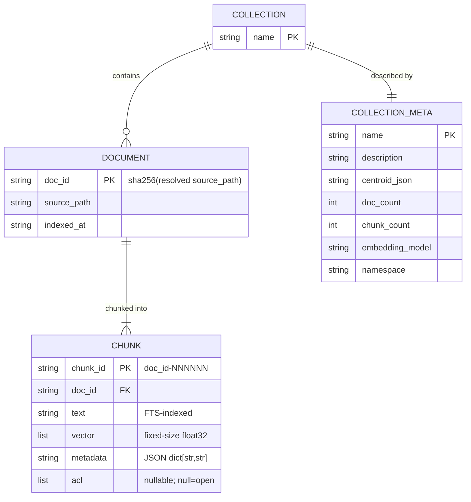
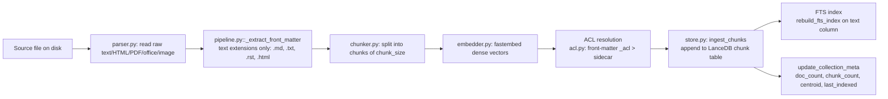

**Purpose**: Document where `archon-search` keeps state on disk, the LanceDB schemas it writes, and how ingest mutates that state.
**Audience**: Maintainers and operators of an `archon-search` install.
**Status**: Draft
**Last reviewed**: 2026-05-20
**Next review**: 2026-08-20

# Data Architecture and Persistence

archon-search is a single-user local service. All persistent state lives under a single root directory (`~/.archon-search/` by default). There is no database server, no remote storage, and no built-in backup; the user owns the data.

See also: [100_system_architecture_overview.md](100_system_architecture_overview.md), [120_services_and_integration_architecture.md](120_services_and_integration_architecture.md), [160_operational_readiness_monitoring_and_reliability.md](160_operational_readiness_monitoring_and_reliability.md).

## Principles

1. **One directory, owned by the user.** All state lives under `~/.archon-search/`; nothing escapes it unless the user explicitly points an env var elsewhere.
2. **LanceDB is the source of truth.** Vector + FTS data and per-collection metadata live in LanceDB tables; everything else (TOML, JSON, JSONL) is derived or operational.
3. **Stable, content-addressed identifiers.** `doc_id` is `sha256(resolved_source_path)`; `chunk_id` is `<doc_id>-<6-digit-index>`. This is enforced by regex in `archon_search/store.py`.
4. **Telemetry is opt-in, locally retained, never exported.** No raw query text is ever persisted (structural guarantee — see `telemetry/entry.py`).
5. **No backup, no replication.** The user is responsible for backing up `~/.archon-search/`. Loss of the directory loses the index.

## On-disk layout under `~/.archon-search/`

| Path | Owner | Contents | Notes |
|------|-------|----------|-------|
| `archon-search.toml` | user (or `config_cmd` CLI) | runtime config | optional; missing file → all defaults (`config.py::load_config`) |
| `.search.env` | `key_manager.py` | `ARCHON_SEARCH_API_KEY=<hex>` | mode `0600`; auto-generated on first start if missing |
| `search/` | `store.py` (LanceDB) | vector + FTS + collection meta tables | `db_path` config key; created on `SearchStore.connect()` |
| `search-logs/` | `telemetry/writer.py` | `YYYY-MM-DD.jsonl` per UTC day | only if `[telemetry].enabled = true` |
| `logs/archon-search.log` | server | server logs | `[logging].log_file` |
| `archon-search-jobs.json` | `jobs/store.py` | job state for long-running ingest/reindex | `JOBS_FILE` constant in `jobs/model.py` |

Override paths:
- `ARCHON_SEARCH_KEY_FILE` overrides `.search.env` location.
- `ARCHON_SEARCH_API_KEY` (env var) overrides reading any key file entirely.
- `ARCHON_SEARCH_CONFIG` overrides `archon-search.toml` location.

## LanceDB layout

LanceDB lives in `~/.archon-search/search/` (configurable via `[database].db_path`). It contains two kinds of tables:

- **One chunk table per collection.** Table name = collection name (validated against `^[a-zA-Z0-9][a-zA-Z0-9_-]{0,63}$` in `store.py::_COLLECTION_RE`).
- **One shared metadata table** named `_archon_collection_meta` (constant `_META_TABLE`). The `_archon_` prefix is reserved; user collections cannot start with it (filtered out of `list_collections`).

### Chunk-table schema (`SearchStore._schema`)

| Field | Type | Notes |
|-------|------|-------|
| `doc_id` | `utf8` | sha256 hex of resolved source path |
| `chunk_id` | `utf8` | `<doc_id>-<NNNNNN>` |
| `text` | `utf8` | chunk text (FTS-indexed) |
| `vector` | `list<float32>[embedding_dim]` | dense embedding |
| `source_path` | `utf8` | absolute resolved path at ingest time |
| `indexed_at` | `utf8` | ISO 8601 |
| `file_type` | `utf8` | e.g. `md`, `py`, … |
| `language` | `utf8` | empty string when unknown |
| `metadata` | `utf8` | JSON-encoded `dict[str,str]`; size-bounded (see `validate_metadata`) |
| `custom_score` | `float32` | nullable |
| `ingested_by` | `utf8` | defaults to `archon-search-cli` |
| `updated_at` | `utf8` | ISO 8601 |
| `acl` | `list<utf8>` (nullable) | `None`=open, `[]`=deny-all, `[ns…]`=allowed namespaces |

Metadata bounds enforced by `store.py::validate_metadata`: max 50 fields, key ≤ 256 chars, value ≤ 4096 chars.

The per-field partition map (**system** / **filterable** / **ranking** / **audit**) for `ChunkRecord` lives in `archon_search/_types.py` as docstrings on the dataclass — see the source for the authoritative breakdown. The categories drive how A2 (filters) and future ranking/audit work each field; this doc does not duplicate the assignment.

### Collection-metadata schema (`SearchStore._meta_schema`)

| Field | Type | Notes |
|-------|------|-------|
| `name` | `utf8` | collection name |
| `description` | `utf8` | auto- or user-provided (see `description_generator.py`) |
| `centroid_json` | `utf8` | JSON-encoded list of floats — the routing centroid; `""` if unset |
| `doc_count` | `int64` | |
| `chunk_count` | `int64` | |
| `embedding_model` | `utf8` | model used at index time |
| `last_indexed` | `utf8` | ISO 8601 or `""` |
| `last_described` | `utf8` | ISO 8601 or `""` |
| `described_at_doc_count` | `int64` | `-1` sentinel = unset |
| `namespace` | `utf8` | added by `migrate_namespace`; defaults to `default` |

### Full-text index

FTS is built per chunk table on the `text` column via `store.py::rebuild_fts_index` using `lancedb.index.FTS`. The hybrid search path (`hybrid_search`) issues a vector search and an FTS search in parallel, fuses results with Reciprocal Rank Fusion (`_RRF_K=60`), and gracefully falls back to vector-only if no FTS index exists.

### Migrations (idempotent, run at startup)

- `migrate_namespace` — adds `namespace` column to `_archon_collection_meta` if absent.
- `migrate_acl` — adds nullable `acl` column to each chunk table that lacks it.

## Entity relationships

Notes:
- A `COLLECTION` is materialized as one LanceDB chunk table; `DOCUMENT` is not a separate table — it is a logical grouping of chunks sharing a `doc_id`.
- `COLLECTION_META` rows live in the shared `_archon_collection_meta` table, one row per `(name, namespace)`. Reassigning a collection to a different namespace is refused (`update_collection_meta` raises `ValueError`).
- The `centroid` is persisted as a JSON-encoded list of floats in `centroid_json`; the `MultiCollectionRouter` reads these to rank collections per query.

## Ingest data flow

Note: step `H` (`update_collection_meta`) runs at the end of `ingest_directory` (`pipeline.py:277–289`); a bare `ingest_file` call does not refresh collection-level centroid/`last_indexed` on its own.

### Reindex semantics

`sync.py` records `indexed_chunk_size` on the **per-collection** checkpoint (one value per collection in `state.collections`, see `sync.py:228, 275`), not per document. When the current configured `chunk_size` differs from the stored `indexed_chunk_size` and the value is non-zero:

- If `[database].auto_reindex_on_chunk_size_change = true` (default) → `force_full_reindex = True` is set and `_check_collection_changes` returns every eligible file as "to add", so the **entire collection** is re-chunked, re-embedded, and replaces the existing chunks (`sync.py:402–409`, `:425–426`).
- If `false` → no reindex is triggered; a collection-scoped warning is logged (`"Chunk size mismatch for '%s' …"`) and the collection is left as-is until a manual `archon search reindex` is run (`sync.py:411–416`).

The same `force_full_reindex` path is taken when the configured embedding model differs from the indexed one (`sync.py:391–398`); the doc-level "no reindex for embedding-model changes" claim refers only to automatic per-file reindexing — at the collection level the next sync rebuilds everything. A manual `collection reindex` is still exposed as a job-returning route (see `routes_collections.py::reindex`, returns `202` + job id).

## Telemetry persistence

When `[telemetry].enabled = true`:

- `TelemetryWriter` (`telemetry/writer.py`) appends one JSON object per line to `~/.archon-search/search-logs/<YYYY-MM-DD>.jsonl` (UTC date). One file per UTC day; bounded async queue (`queue_size=1024`); entries beyond `MAX_ENTRY_BYTES=8192` get `result_doc_ids` truncated with `truncated=true`.
- `Pruner` (`telemetry/pruner.py`) runs once per 24 hours and deletes `*.jsonl` files whose UTC date is strictly older than `now - retention_days` (i.e. a file exactly `retention_days` old is deleted; see `telemetry/pruner.py:31, 47`). Default `retention_days = 30`. Today's file is never deleted; malformed filenames are skipped.
- `[telemetry].export_enabled = true` is **not** honored — `config.py:213–215` logs a warning and forces the value to `false`. No external transmission path exists in v1.

The persisted schema is the closed field set declared in `telemetry/entry.py::DOCUMENTED_SCHEMA_FIELDS`; no raw query text is ever in any field (see `150_security_and_privacy_architecture.md`).

## Job state

Long-running operations (ingest, reindex, delete) are tracked in `~/.archon-search/archon-search-jobs.json` (constant `JOBS_FILE` in `jobs/model.py`). Each job carries `JobStatus ∈ {PENDING, RUNNING, DONE, FAILED, CANCELLED, CANCELLING}` plus a `result` dict or an `error` string (see `archon_search/types.py::IngestJob`). The file is rewritten on every transition; see source: `archon_search/jobs/store.py` for the exact concurrency model.

## Backup and recovery

There is **no built-in backup**. To preserve state, the user must back up `~/.archon-search/` (specifically `search/`, `.search.env`, `archon-search.toml`, and `archon-search-jobs.json`). LanceDB tables are file-based and can be copied while the service is stopped. There is no incremental backup, no snapshot tooling, and no disaster-recovery automation — accepted scope for a local single-user service.
