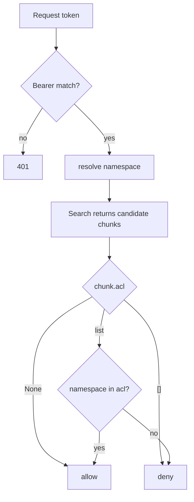

**Purpose**: Document the threat model, authentication, ACL semantics, and privacy guarantees of `archon-search`.
**Audience**: Operators and security reviewers of a local `archon-search` deployment.
**Status**: Draft
**Last reviewed**: 2026-05-20
**Next review**: 2026-08-20

# Security and Privacy Architecture

archon-search is designed as a **local, single-user service**. It does not implement multi-tenant isolation, user accounts, or any external-facing controls. The bearer-token API and namespace-scoped ACL exist to keep stray local clients (and a small number of cooperating LLM agents) from reading each other's data — not to defend against a hostile process running as the same Unix user.

See also: [100_system_architecture_overview.md](100_system_architecture_overview.md), [120_services_and_integration_architecture.md](120_services_and_integration_architecture.md), [160_operational_readiness_monitoring_and_reliability.md](160_operational_readiness_monitoring_and_reliability.md).

## Principles

1. **Local trust boundary.** The threat model assumes anything running as the same OS user is trusted; the server binds to `127.0.0.1` by default.
2. **Bearer auth on every endpoint except `/health`.** No anonymous access to data planes.
3. **Privacy is structural, not procedural.** The telemetry schema cannot represent a raw query — there is no field for it and no factory that accepts one.
4. **No outbound network calls for telemetry.** `export_enabled` is silently coerced to `false`; nothing leaves the host.
5. **ACL is best-effort, default-open.** Documents without an explicit `_acl` are visible to all namespaces. Misconfigured ACLs fail-open with a warning, never crash.

## Threat model — scope and non-scope

In scope:
- Casual misuse by a second local client that doesn't have the API key.
- Cross-namespace data leakage when multiple cooperating clients share one server.
- Accidental persistence of user query text (privacy regression).

Out of scope:
- Hostile processes running as the same OS user (can read `.search.env`, the LanceDB files, and the logs directly).
- Multi-tenant SaaS deployment (the service is not designed for it).
- Network-level attacks against the loopback interface.
- Supply-chain integrity of dependencies.

## Authentication

### Key bootstrap (`archon_search/key_manager.py`)

`load_or_generate_key()` resolves a key from the first source that succeeds, in this priority order:

1. `ARCHON_SEARCH_API_KEY` env var — must be a non-empty lowercase hex string (`^[0-9a-f]+$`). Invalid values are ignored with a warning, falling through to the next source.
2. Key file — by default `~/.archon-search/.search.env`; `ARCHON_SEARCH_KEY_FILE` overrides the path. File must contain a line `ARCHON_SEARCH_API_KEY=<hex>`.
3. Auto-generation — `secrets.token_hex(32)` writes a 64-char hex key through the durable helper `_durable_io.atomic_write_bytes` (mode `0600` set at creation via `O_EXCL`, then fsync file → `os.replace` → fsync parent dir; see the [durability contract](130_data_architecture_and_persistence.md#durability-contract)). Concurrent first-start writers raise `FileExistsError` and are recovered by retrying via `_load_from_file()`.

### File permissions

- The key file is created with mode `0600` (owner read/write only) at creation time by `atomic_write_bytes` — there is no chmod-after-rename window on the write path.
- On subsequent reads, if the mode has drifted, `_chmod_600` attempts to retighten it. Failure is logged as a warning, not fatal.
- On Windows, the read-path chmod step is skipped (`key_manager.py:112–115`).

### Bearer enforcement (`archon_search/server/middleware_auth.py`)

- Every request except `/health`, `/docs`, `/openapi.json`, `/redoc` requires `Authorization: Bearer <token>`.
- Token is compared with `secrets.compare_digest` against (a) every entry in the per-namespace key map and (b) the default API key. The loop does not short-circuit on match (no early `break`) — this is deliberate and labelled in the source as timing-leak mitigation (`middleware_auth.py:39`: comment `no early exit — prevents timing leakage`).
- A successful match stamps `request.state.namespace`; the rest of the app uses that to scope reads and writes.
- Failure → `401` with `WWW-Authenticate: Bearer`, empty body.

### Unauthenticated endpoints

Only `GET /health` is intended to be reachable without auth on the data path. `/docs`, `/openapi.json`, and `/redoc` are also exempted by `_EXEMPT_PATHS` so OpenAPI tooling works; these expose schema only, not data.

## Authorization (ACL — `archon_search/acl.py`)

ACL is **per-chunk**, stored as a nullable `list<utf8>` column on every chunk table (added by `store.py::migrate_acl`).

### Semantics (`is_acl_allowed`)

| Stored `acl` value | Meaning | Result |
|--------------------|---------|--------|
| `None` (NULL) | open — no restriction | every namespace passes |
| `[]` (empty list) | `deny-all` sentinel | no namespace passes |
| `["a", "b"]` | allow-list | only namespaces `a`, `b` pass; comparison is case-sensitive |

Empty namespace (`""`) always fails closed against a protected chunk.

### Source resolution (`resolve_acl`)

For each document, the effective ACL is:

1. Front-matter `_acl` key if present (highest precedence).
2. Sidecar file `<doc>.acl` if present.
3. Otherwise → `None` (open).

If both exist, front-matter wins and a warning is logged.

### Robustness (fail-open with warning)

`parse_acl_value` and `read_acl_sidecar` are intentionally permissive. Invalid types, non-string list elements, invalid namespace names, ACL sidecars larger than `_ACL_SIDECAR_MAX_BYTES = 65536`, symlinked sidecars, non-UTF-8 content — all degrade to `None` (open) with a warning. The reserved word `deny-all` cannot be used as a namespace identifier (`is_acl_namespace_valid`).

The filter is applied in the pipeline after retrieval; see `acl.py::apply_acl_filter`.

## Privacy

### No raw query text in telemetry — structural guarantee

`archon_search/telemetry/entry.py::TelemetryEntry`:

- `model_config = ConfigDict(extra="forbid", frozen=True)` — no extra fields can be added at runtime.
- The documented schema field set (`DOCUMENTED_SCHEMA_FIELDS`) is a frozenset of exactly: `query_id`, `timestamp`, `endpoint`, `latency_ms`, `status`, `collection`, `result_count`, `result_doc_ids`, `truncated`, `collections`, `decomposer_invoked`, `error_kind`. There is no `query` field.
- The three factories (`from_search_tool_result`, `from_route_response`, `from_error`) are keyword-only and **none of them accepts a `query` parameter**. There is no path by which a query string can be assigned to a telemetry entry without a code change to the model itself.

This is reinforced by `CLAUDE.md`'s "Structural invariant" note and is the privacy contract for v1.

### `doc_id` leakage risk — accepted

`doc_id` is `sha256(resolved_source_path)`. The hash is one-way, but `result_doc_ids` is logged in telemetry. The hash itself doesn't reveal the path; however:

- `source_path` is stored *in clear* in the LanceDB chunk table (`store.py::_schema` field `source_path`).
- Anyone with read access to `~/.archon-search/search/` can join `result_doc_ids` (from telemetry) back to a source path. On a single-user host that is by definition the operator.

This is documented as accepted risk: telemetry is local-only and the operator already has filesystem access. Note: archon-search does **not** explicitly set mode `0700` on `~/.archon-search/`; the directory is created via `os.makedirs(..., exist_ok=True)` (`key_manager.py:83`), so its mode is governed by the process umask. Only the key file itself is enforced to mode `0600`. The effective protection of the parent directory depends on the user's home-directory permissions, which vary by platform. #Unverified

### No external transmission

`config.py:209–217`: `[telemetry].export_enabled = true` is logged as a warning and forced to `false`. There is no corresponding code path in `telemetry/` to send entries anywhere — the writer's only sink is `~/.archon-search/search-logs/<date>.jsonl`. Removing this guarantee requires both a config-loader change *and* a new transport implementation; neither is shipped in v1.

### Retention

`telemetry/pruner.py::Pruner` deletes `*.jsonl` files older than `[telemetry].retention_days` (default 30) on a 24-hour interval. Today's file is never deleted. There is no per-entry redaction — older entries are deleted by file age only.

## Operational notes

- The server binds to `127.0.0.1` by default (`[server].host`). Binding to `0.0.0.0` is not recommended and the threat model does not cover it.
- The key file, the LanceDB directory, and the telemetry logs all live under `~/.archon-search/`. The operator should ensure that directory is not on a shared filesystem with looser permissions.
- Rotating the API key requires editing/regenerating `.search.env` and restarting the server. There is no in-process rotation API.
