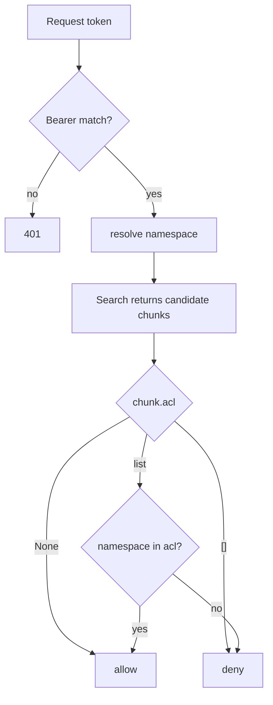

**Purpose**: Document the threat model, authentication, ACL semantics, and privacy guarantees of `archon-search`.
**Audience**: Operators and security reviewers of a local `archon-search` deployment.
**Status**: Draft
**Last reviewed**: 2026-05-20
**Next review**: 2026-08-20

# Security and Privacy Architecture

archon-search is designed as a **local, single-user service**. It does not implement multi-tenant isolation, user accounts, or any external-facing controls. The bearer-token API and namespace-scoped ACL exist to keep stray local clients (and a small number of cooperating LLM agents) from reading each other's data — not to defend against a hostile process running as the same Unix user.

See also: [100_system_architecture_overview.md](100_system_architecture_overview.md), [120_services_and_integration_architecture.md](120_services_and_integration_architecture.md), [160_operational_readiness_monitoring_and_reliability.md](160_operational_readiness_monitoring_and_reliability.md).

## Principles

1. **Local trust boundary.** The threat model assumes anything running as the same OS user is trusted; the server binds to `127.0.0.1` by default.
2. **Bearer auth on every endpoint except `/health` and `/ready`.** No anonymous access to data planes.
3. **Privacy is structural, not procedural.** The telemetry schema cannot represent a raw query — there is no field for it and no factory that accepts one.
4. **No outbound network calls for telemetry.** `export_enabled` is silently coerced to `false`; nothing leaves the host. **Exception (C4/C5)**: when `[hyde] enabled = true` and a caller sends `hyde=true`, or when `[rag_fusion] enabled = true` and a caller sends `rag_fusion=true`, the raw query is sent to Anthropic's API — both are explicit operator opt-ins; see the HyDE and RAG Fusion sections under Privacy. The two features are mutually exclusive per request.
5. **ACL is best-effort, default-open.** Documents without an explicit `_acl` are visible to all namespaces. Misconfigured ACLs fail-open with a warning, never crash.

## Threat model — scope and non-scope

In scope:
- Casual misuse by a second local client that doesn't have the API key.
- Cross-namespace data leakage when multiple cooperating clients share one server.
- Accidental persistence of user query text (privacy regression).

Out of scope:
- Hostile processes running as the same OS user (can read `.search.env`, the LanceDB files, and the logs directly).
- Multi-tenant SaaS deployment (the service is not designed for it).
- Network-level attacks against the loopback interface.
- Supply-chain integrity of dependencies.

## Authentication

### Key bootstrap (`archon_search/key_manager.py`)

`load_or_generate_key()` resolves a key from the first source that succeeds, in this priority order:

1. `ARCHON_SEARCH_API_KEY` env var — must be a non-empty lowercase hex string (`^[0-9a-f]+$`). Invalid values are ignored with a warning, falling through to the next source.
2. Key file — by default `~/.archon-search/.search.env`; `ARCHON_SEARCH_KEY_FILE` overrides the path. File must contain a line `ARCHON_SEARCH_API_KEY=<hex>`.
3. Auto-generation — `secrets.token_hex(32)` writes a 64-char hex key through the durable helper `_durable_io.atomic_write_bytes` (mode `0600` set at creation via `O_EXCL`, then fsync file → `os.replace` → fsync parent dir; see the [durability contract](130_data_architecture_and_persistence.md#durability-contract)). Concurrent first-start writers raise `FileExistsError` and are recovered by retrying via `_load_from_file()`.

### File permissions

- The key file is created with mode `0600` (owner read/write only) at creation time by `atomic_write_bytes` — there is no chmod-after-rename window on the write path.
- On subsequent reads, if the mode has drifted, `_chmod_600` attempts to retighten it. Failure is logged as a warning, not fatal.
- On Windows, the read-path chmod step is skipped (`key_manager.py:112–115`).

### Bearer enforcement (`archon_search/server/middleware_auth.py`)

- Every request except `/health`, `/docs`, `/openapi.json`, `/redoc` requires `Authorization: Bearer <token>`.
- Token is compared with `secrets.compare_digest` against (a) every entry in the per-namespace key map and (b) the default API key. The loop does not short-circuit on match (no early `break`) — this is deliberate and labelled in the source as timing-leak mitigation (`middleware_auth.py:39`: comment `no early exit — prevents timing leakage`).
- A successful match stamps `request.state.namespace`; the rest of the app uses that to scope reads and writes.
- Failure → `401` with `WWW-Authenticate: Bearer`, empty body.

### Unauthenticated endpoints

`GET /health` and `GET /ready` are both reachable without auth. `/docs`, `/openapi.json`, and `/redoc` are also exempted by `_EXEMPT_PATHS` so OpenAPI tooling works; these expose schema only, not data.

**Threat-model rationale for unauthenticated `/ready`**: `/ready` is a readiness probe — it answers whether the service's storage layer is connected and able to serve requests. It returns `{ready: bool, checks: {storage: "ok"|"fail", models: "pending"|"ok"|"warn"|"fail"}}` (the D6 `checks.models` field reports background model-validation state) and nothing more: no document counts, no collection names, no version string, no user data. An attacker who can reach the loopback socket already has more sensitive information (the process is running, port is open) than `/ready` reveals. Supervisor tooling (e.g. a load-balancer health check, an install script waiting for warm-up) needs this signal without holding the API key. Withholding it would force the API key into infrastructure-level probing scripts, which is a worse security posture than exposing a no-data probe. `/health` (liveness) and `/ready` (readiness) are intentionally separate endpoints with different shapes — `/health` returns `{status, version}` and is never `503`; `/ready` returns `{ready, checks}` and returns HTTP 503 when the storage layer is unavailable.

## Authorization (ACL — `archon_search/acl.py`)

ACL is **per-chunk**, stored as a nullable `list<utf8>` column on every chunk table (added by `store.py::migrate_acl`).

### Semantics (`is_acl_allowed`)

| Stored `acl` value | Meaning | Result |
|--------------------|---------|--------|
| `None` (NULL) | open — no restriction | every namespace passes |
| `[]` (empty list) | `deny-all` sentinel | no namespace passes |
| `["a", "b"]` | allow-list | only namespaces `a`, `b` pass; comparison is case-sensitive |

Empty namespace (`""`) always fails closed against a protected chunk.

### Source resolution (`resolve_acl`)

For each document, the effective ACL is:

1. Front-matter `_acl` key if present (highest precedence).
2. Sidecar file `<doc>.acl` if present.
3. Otherwise → `None` (open).

If both exist, front-matter wins and a warning is logged.

### Robustness (fail-open with warning)

`parse_acl_value` and `read_acl_sidecar` are intentionally permissive. Invalid types, non-string list elements, invalid namespace names, ACL sidecars larger than `_ACL_SIDECAR_MAX_BYTES = 65536`, symlinked sidecars, non-UTF-8 content — all degrade to `None` (open) with a warning. The reserved word `deny-all` cannot be used as a namespace identifier (`is_acl_namespace_valid`).

The filter is applied in the pipeline after retrieval; see `acl.py::apply_acl_filter`.

## Ingest input safety (A5a)

The four ingest entry points — HTTP `POST /collections`, HTTP `POST /jobs/ingest`, MCP `ingest_file`, MCP `ingest_directory` — validate the caller-supplied path through `validate_ingest_path` (`archon_search/_path_safety.py`) before any filesystem read. It rejects empty / whitespace-only input, NUL bytes, non-absolute paths (after `expanduser()`), and any path whose `Path.parts` contains a `..` traversal segment. HTTP rejections are `HTTPException(400, detail="path is unsafe: <reason>")`; MCP rejections are `McpErrorResponse(code="path_unsafe", error=<LLM-readable phrase>)`. Authentication fires first — an unauthenticated unsafe-path request gets 401, not 400.

What is **not** validated (accepted trade-offs, deferred to a future `allowed_dirs` feature): symlink resolution (the validator inspects only the raw `Path.parts`; the returned `resolve()`d path may follow a symlink elsewhere — the existing `pipeline.py` / `sync.py` symlink-skip during walks is the only symlink defence), and absolute-path scope (e.g. `/etc/passwd` still passes the validator). The CLI ingest surface is out of scope (local trusted user).

## SQL boundary defense-in-depth (A5b)

`store.py` builds LanceDB (DataFusion) `where` / `delete` / `count_rows` predicates from identifiers (`name`, `namespace`, `doc_id`, constructed `chunk_id`). The **primary** security boundary remains the upstream regex gates — `_COLLECTION_RE` (name), `_validate_namespace` / `_NAMESPACE_RE` (namespace), `_DOC_ID_RE` (doc_id) — which make injection unreachable today. As defense-in-depth, every predicate is now composed via `_where_eq` / `_where_in` (`store.py`), which quote values through `_sql_quote_str` (`store_filters.py`, single-quote doubling) rather than f-string interpolation. A CI guard (`tests/test_no_fstring_sql.py`) fails the build if any f-string-wrapped `.where(` / `.delete(` / `.count_rows(` reappears in `store.py`, so relaxing a regex gate in the future cannot silently re-enable SQL injection.

## Ingest concurrency — synchronous store-busy signalling (A5c)

While a reindex holds a collection's per-collection ingest lock, `POST /jobs/ingest` and `POST /collections` pre-acquire that lock in the request handler and, on a 30s acquisition timeout, return HTTP 503 with `Retry-After: 30` and `{"error": "store_busy", ...}` synchronously (rather than a 202 followed by a failed job). Ingest into a different collection is unaffected. The MCP `ingest_file` / `ingest_directory` tools surface the same condition as `McpErrorResponse(code="store_busy")`.

## Privacy

### No raw query text in telemetry — structural guarantee

`archon_search/telemetry/entry.py::TelemetryEntry`:

- `model_config = ConfigDict(extra="forbid", frozen=True)` — no extra fields can be added at runtime.
- The documented schema field set (`DOCUMENTED_SCHEMA_FIELDS`) is a frozenset of exactly: `query_id`, `timestamp`, `endpoint`, `latency_ms`, `status`, `collection`, `result_count`, `result_doc_ids`, `truncated`, `collections`, `decomposer_invoked`, `error_kind`. There is no `query` field.
- The four factories (`from_search_tool_result`, `from_route_response`, `from_explain_result`, `from_error`) are keyword-only and **none of them accepts a `query` parameter**. There is no path by which a query string can be assigned to a telemetry entry without a code change to the model itself.

This is reinforced by `CLAUDE.md`'s "Structural invariant" note and is the privacy contract for v1.

**C2 — language filter telemetry**: `FilterFlags.language_filter_used: bool` records only whether a language filter was set, never the actual language code value. This preserves the no-raw-value invariant: a boolean `true`/`false` reveals that a language filter was applied, not which language. The actual code (`"fr"`, `"de"`, etc.) is never stored in telemetry.

### `/explain` endpoint — no query echo, same privacy posture as `/search` (A4)

`POST /explain` and the `explain` MCP tool preserve all existing privacy guarantees:

- **No query in response**: the response body (`ExplainResponse`) has no `query` field. This matches the `SearchResponse` / `RouteResponse` pattern; callers already have the query.
- **No query in telemetry**: `TelemetryEntry.from_explain_result` records only `collection`, `result_count`, and `latency_ms` — no query text and no `result_doc_ids` (scalar count only, to avoid any path-hash leakage on the explain surface).
- **`source_path` exposure**: `source_path` appears on every `results[]` and `near_misses[]` item. This is the same exposure as `/search` today; it is not new surface introduced by A4. The accepted risk is documented in the `doc_id` leakage note above.
- **`routing.candidates` scoped to caller's namespace**: when `collection` is omitted, the routing block lists every collection in the caller's namespace (the same ACL boundary that gates results). Collections outside the caller's namespace cannot appear in `routing.candidates`. The confidence-threshold gate is bypassed by `rank_with_scores`, but the namespace gate is not.
- **Error message sanitisation**: pipeline-stage failures (`ExplainStageError`) surface as `{"detail": "<stage> error: <ExceptionType>"}` — the original exception message (which may contain the query, e.g. from an FTS error) is logged server-side only and never forwarded to the client.

### Page-break marker collision risk — accepted

**C3b** introduces the internal marker string `<!-- archon-search:pagebreak:v1 -->` to identify page boundaries during PDF/image ingest. If a PDF's text body contains this exact literal string, it will be misinterpreted as a page break and the surrounding content will carry incorrect `_page_start` metadata. The marker is namespaced (`archon-search:`) and versioned (`:v1`) to make accidental collisions highly improbable in practice. This risk is accepted: the marker never leaves the ingest pipeline (it is excised before chunking, never stored in `ChunkRecord.text`, never returned by the API, and never indexed by FTS), so the blast radius of a collision is limited to a metadata field on the affected chunk.

### `doc_id` leakage risk — accepted

`doc_id` is `sha256(resolved_source_path)`. The hash is one-way, but `result_doc_ids` is logged in telemetry. The hash itself doesn't reveal the path; however:

- `source_path` is stored *in clear* in the LanceDB chunk table (`store.py::_schema` field `source_path`).
- Anyone with read access to `~/.archon-search/search/` can join `result_doc_ids` (from telemetry) back to a source path. On a single-user host that is by definition the operator.

This is documented as accepted risk: telemetry is local-only and the operator already has filesystem access. Note: archon-search does **not** explicitly set mode `0700` on `~/.archon-search/`; the directory is created via `os.makedirs(..., exist_ok=True)` (`key_manager.py:83`), so its mode is governed by the process umask. Only the key file itself is enforced to mode `0600`. The effective protection of the parent directory depends on the user's home-directory permissions, which vary by platform. #Unverified

### HyDE external LLM transmission (C4) — explicit opt-in exception

**C4 introduces the first point in archon-search v1 where user data can leave the host by design. C5 introduces a second (see the RAG Fusion section below).**

When `[hyde] enabled = true` in config *and* a request includes `hyde=true`, the user's raw query (up to 2000 characters) is sent to Anthropic's API servers over HTTPS to generate a hypothetical answer passage. This is a deliberate operator opt-in, not a default behaviour.

**Gating requirements** — HyDE transmission occurs only when all three conditions are true simultaneously:
1. The operator has installed `archon-search[hyde]` (optional dependency).
2. The operator has set `[hyde] enabled = true` in `~/.archon-search/archon-search.toml`.
3. The caller includes `hyde=true` in the request body.

**Invariants preserved despite the external call:**
- The hypothesis text returned by the API is consumed only by the local embedder. It is **never logged, stored in LanceDB, or returned to the caller**.
- Log messages in `archon_search/hyde.py` use `_query_fingerprint(query)` (SHA-256 truncated to 16 hex chars) — the raw query is never passed to any logging call. A CI guard (`tests/test_no_query_log_in_hyde.py`) enforces this structurally.
- `TelemetryEntry` factories receive no query text — the HyDE path does not weaken the telemetry structural invariant.
- Fallback is silent and transparent: a timeout, API error, missing key, or rate limit causes `hyde_applied: false` in the response, not an error. Availability is never degraded by the external dependency.

**Operator visibility:** when `enabled = true`, the server logs an INFO message at startup naming the model. This makes the data-transmission fact visible in server logs without the operator needing to read config.

See `Documentation/ADRs/C4-hyde-external-llm-dependency.md` for the full decision record.

### RAG Fusion external LLM transmission (C5) — explicit opt-in exception

**C5 introduces a second point where user data can leave the host by design**, following the same opt-in pattern as HyDE (C4).

When `[rag_fusion] enabled = true` in config *and* a request includes `rag_fusion=true`, the user's raw query (up to 2000 characters) is sent to Anthropic's API servers over HTTPS to generate semantic query variants. This is a deliberate operator opt-in, not default behaviour.

**Gating requirements** — RAG Fusion transmission occurs only when all three conditions are true simultaneously:

1. The operator has installed `archon-search[rag_fusion]` (optional dependency).
2. The operator has set `[rag_fusion] enabled = true` in `~/.archon-search/archon-search.toml`.
3. The caller includes `rag_fusion=true` in the request body.

**Invariants preserved despite the external call:**

- LLM-generated query variants are consumed only by the local embedder. They are **never logged, stored in LanceDB, or returned to the caller**.
- Log messages in `archon_search/rag_fusion.py` use `_query_fingerprint(query)` (from `archon_search/_privacy.py`) — the raw query is never passed to any logging call. A CI guard (`tests/test_no_query_log_in_rag_fusion.py`) enforces this structurally.
- `TelemetryEntry` factories receive no query text — the RAG Fusion path does not weaken the telemetry structural invariant.
- Fallback is silent: timeout, API error, missing key, or rate limit causes `rag_fusion_applied: false` in the response, not an error. Availability is never degraded.

**Shared API key operational risk:** both HyDE and RAG Fusion use `ANTHROPIC_API_KEY`. Each maintains independent per-process token-bucket rate limiters (`[hyde].max_requests_per_minute` and `[rag_fusion].max_requests_per_minute`). In steady state, the combined peak rate from a single process can approach `hyde_rpm + rag_fusion_rpm` API calls per minute. In multi-worker deployments this is multiplied by the worker count. Operators must ensure the combined rate does not exceed their Anthropic account rate limit. See `Documentation/ADRs/C5-rag-fusion-external-llm-dependency.md` for the full decision record.

**HyDE and RAG Fusion are mutually exclusive**: when `rag_fusion=true` is present, HyDE is skipped regardless of the `hyde` flag value. This prevents compounding privacy risk (both calls for a single request) and avoids multiplying LLM cost.

### No external transmission (baseline — non-HyDE traffic)

`config.py:209–217`: `[telemetry].export_enabled = true` is logged as a warning and forced to `false`. There is no corresponding code path in `telemetry/` to send entries anywhere — the writer's only sink is `~/.archon-search/search-logs/<date>.jsonl`. Removing this guarantee requires both a config-loader change *and* a new transport implementation; neither is shipped in v1.

### Retention

`telemetry/pruner.py::Pruner` deletes `*.jsonl` files older than `[telemetry].retention_days` (default 30) on a 24-hour interval. Today's file is never deleted. There is no per-entry redaction — older entries are deleted by file age only.

## Operational notes

- The server binds to `127.0.0.1` by default (`[server].host`). Binding to `0.0.0.0` is not recommended and the threat model does not cover it. **C9 exception**: `archon-search serve` (used by the Docker image) flips the host default to `0.0.0.0` so containers are reachable on the mapped port. Operators running `serve` outside a container assume responsibility for upstream isolation (reverse proxy, firewall). See [`UserManual/08_running_with_docker.md`](../UserManual/08_running_with_docker.md).
- The key file, the LanceDB directory, and the telemetry logs all live under `~/.archon-search/` by default. `ARCHON_SEARCH_DATA_DIR` relocates the entire tree to a single root (used by the Docker image to put everything under `/data`). The relocation is structural: `paths.get_data_dir()` is read lazily by every path accessor (`key_manager.get_key_file()`, `jobs.get_jobs_file()`, `language_detector.get_fasttext_models_dir()`, `cli/ingest.py` history default, and `config.load_config()` for `db_path` / `log_file` / `telemetry.log_dir`) on every call — no module-level capture. The operator should ensure the chosen root is not on a shared filesystem with looser permissions; the same trust-boundary expectation applies regardless of location.
- `ARCHON_SEARCH_KEY_FILE` still takes precedence over `ARCHON_SEARCH_DATA_DIR` for the key file path specifically. The key file's separate-security-lifecycle override is preserved by design.
- Rotating the API key requires editing/regenerating `.search.env` and restarting the server. There is no in-process rotation API.
- **Container logging (C9)**: when `ARCHON_SEARCH_CONTAINER=1` is set (baked into the Docker image), `logging_setup.configure_logging()` attaches a `StreamHandler(sys.stderr)` to the `archon_search` logger so `docker logs` captures application output even with an empty `log_file`. The structured-log invariants (no raw queries, HyDE/RAG Fusion query fingerprints) apply identically across file and stderr handlers — the handler is a transport switch, not a content filter.
