**Purpose**: Describe the operational surface of `archon-search` — what an operator can observe, how the service is installed and lifecycled, and the runbooks for the failure modes that actually occur.
**Audience**: Operators running `archon-search` on a workstation or single server, and maintainers extending its observability surface.
**Status**: Draft
**Last reviewed**: 2026-05-20
**Next review**: 2026-08-20

# Operational Readiness, Monitoring, and Reliability

`archon-search` is a single-process local daemon. There is no fleet, no orchestrator, and no upstream control plane — operational tooling reflects that. This document is the canonical reference for what the service exposes, how it is installed and supervised by the host OS, and what to check first when something is wrong. The component map is in `Architecture/100_system_architecture_overview.md`; failure-mode taxonomy lives in `Architecture/140_error_handling_strategy.md`; release lifecycle is in `Architecture/510_release_and_environment_strategy.md`.

## Principles

1. **No formal SLOs, SLIs, or SLAs.** `archon-search` is a local service. No availability or latency objective is declared or contractually promised. Latency p50/p95 are *captured* (telemetry, eval harness) as regression guards, not as production targets.
2. **Observability is local-only.** Health, status, indexing state, and telemetry are all served from the same process to the same operator. Nothing is exported off-box. Telemetry is opt-in and disabled by default (`Architecture/000_introduction_and_guiding_principles.md`, principle 4).
3. **OS-native supervision.** The service is registered as a `launchd` user agent (macOS) or `systemd --user` unit (Linux). The OS — not `archon-search` — is responsible for restart-on-crash and start-at-login.
4. **`/health` and `/ready` are unauthenticated; everything else requires bearer auth.** `GET /health` (liveness) and `GET /ready` (readiness) exist so a supervisor or installer can probe the port without holding the API key.
5. **State recovery via re-sync, not via clever rollback.** When indexes drift, the runbook is to re-run `archon-search sync` or `archon-search collection reindex`. There is no transactional repair path. Concurrent multi-collection syncs no longer lose progress: `IndexingStateStore` (`archon_search/progress.py`) serializes all mutating writes to `.indexing_state.json` via an internal `threading.RLock` (A6 closed `CON-3`; see `Architecture/530_technical_debt_refactoring_roadmap.md`). On-disk durability under power-loss or torn writes is still open, tracked under A7 (fsync).

## Reliability targets

| Pillar | Status                                                                                                                                                  |
| ------ | ------------------------------------------------------------------------------------------------------------------------------------------------------- |
| SLO    | **Not declared.** Single-tenant local service; no availability or latency objective.                                                                    |
| SLI    | Latency p50/p95 captured by `telemetry/reader.py::compute_stats` and `tests/eval/`. Treat both as **regression guards**, not production indicators.     |
| SLA    | **None.** No external promise of uptime or response time.                                                                                               |

If a future deployment needs an SLO, declare it in this document and pick an SLI that is *already* being captured — do not introduce hidden objectives.

## Observability surface

```mermaid
flowchart LR
  op[Operator / Supervisor] -->|GET /health| H[routes_health.py<br/>unauth]
  op -->|GET /ready| R[routes_ready.py<br/>unauth]
  op -->|GET /status<br/>Bearer auth| S[routes_status.py]
  op -->|GET /indexing-state<br/>Bearer auth| I[routes_state.py]
  op -->|GET /telemetry/stats<br/>GET /telemetry/entries| T[routes_telemetry.py]
  R --> RS[SearchStore.ping&#40;&#41;]
  S --> SS[SearchStore + IndexingStateStore]
  T --> TR[TelemetryReader<br/>~/.archon-search/search-logs/*.jsonl]
  proc[archon-search process] --> LOG[~/.archon-search/logs/archon-search.log]
```



### HTTP endpoints

| Endpoint                 | Auth        | Returns                                                                                                | Source                                  |
| ------------------------ | ----------- | ------------------------------------------------------------------------------------------------------ | --------------------------------------- |
| `GET /health`            | None        | `{"status": "running", "version": "<vcs version>"}`. Liveness probe; no business state. Never returns 503. | `server/routes_health.py`               |
| `GET /ready`             | None        | `{"ready": bool, "checks": {"storage": "ok"\|"fail", "models": "pending"\|"ok"\|"warn"\|"fail"}}`. Readiness probe; returns HTTP 200 when storage is connected, HTTP 503 when not. **D6** — `checks.models` reflects the background model-validation result but does **not** gate `ready` or the HTTP status (storage-only). | `server/routes_ready.py`                |
| `GET /status`            | Bearer      | Top-level `running` (bool, always `true` when this handler responds), `pid`, `version`, a per-collection list with `name`, `path`, `doc_count`, `chunk_count`, `status`, `watching`, `processed_files`, `total_files`, `eta_seconds`, `error`, `error_count` (filtered to caller's namespace), and a `readiness` sub-object (`storage_connected`, `embedder_warm`, `reranker_warm`, `jobs`, `collections_indexing`, `collections_failed`, `watcher`). `path`, `doc_count`, and `chunk_count` are currently always `""` / `0` placeholders. | `server/routes_status.py`               |
| `GET /indexing-state`    | Bearer      | Machine-readable raw indexing state: per-collection `status`, file counters, timestamps, error, `error_count`. Empty object when no state file exists. | `server/routes_state.py`                |
| `GET /telemetry/stats`   | Bearer      | Aggregate stats over `[since, until]`: `total_queries`, `success_rate`, p50/p95 `latency_ms`, `by_endpoint`, `by_collection`, `error_breakdown`, `skipped_lines`. `enabled: false` body when telemetry is off. | `server/routes_telemetry.py`            |
| `GET /telemetry/entries` | Bearer      | Paginated raw entries with `collection`, `endpoint`, `status`, `error_kind` filters. Hard cap `limit ≤ 200`. | `server/routes_telemetry.py`            |

**Endpoint shape asymmetry — intentional**: `/health` is a *liveness* probe (`{status, version}`); `/ready` is a *readiness* probe (`{ready, checks}`). They serve different consumers and have different failure semantics. `/health` never returns 503 — if the process can answer at all, it is alive. `/ready` returns 503 when `SearchStore.ping()` fails, signalling that the service cannot yet serve search requests. Neither endpoint requires auth; both are safe to expose to supervisors that do not hold the API key.

**Gating vs. informational**: `/ready` is the correct gate for "can I send a query yet?" checks (e.g. installer warm-up polls, load-balancer health checks). `/status` is informational — it requires auth and returns per-collection progress, watcher state, and the full `readiness` sub-object including embedder/reranker warm status and job queue depth. Use `/ready` for automated gating; use `/status` for operator inspection.

**`watcher.running` flag**: the `readiness.watcher.running` field on `/status` reflects the live state of the watchdog observer. The legacy top-level `watching` field on each `StatusCollectionEntry` item is per-collection (whether that collection's path is being watched) and remains separate. Do not conflate the two — `readiness.watcher.running = false` means the watcher process is not running at all; `collections[].watching = false` means that specific collection is not under active file-watch (e.g. it was registered without a path).

### Correlation IDs and `X-Request-ID`

`RequestContextMiddleware` (`archon_search/server/middleware_context.py`) runs on every HTTP request. It reads the inbound `X-Request-ID` header (or the header name configured via `[observability].request_id_header`), validates it against the regex `^[A-Za-z0-9._-]{1,128}$`, and either accepts the caller-supplied value or mints a fresh `uuid4().hex`. The resolved ID is:

- Written back as the `X-Request-ID` response header on **every** response (including `/health`, `401`, and `422`).
- Stored in the `correlation_id` ContextVar (`archon_search/observability.py`), which is read by structured-log emit sites in `/search`, `/route`, `/explain`, and the MCP `search`, `search_with_context`, `explain`, `ingest_file`, and `ingest_directory` tools.
- Recorded on each `TelemetryEntry` (when telemetry is enabled) via the `correlation_id` field.

Clients that want to correlate their log lines with server-side log lines should send a stable `X-Request-ID` (one per logical request). Clients that do not supply one will still receive a server-minted ID in the response they can use for retroactive correlation.

The header name can be changed from the default `"X-Request-ID"` via `[observability].request_id_header` in `archon-search.toml`. Both the inbound check and the response header use the configured name, lowercased.

### Log file

`configure_logging()` (`archon_search/logging_setup.py`) is called as the first action in `run_server()`. When `[logging].log_file` is non-empty (the default is `~/.archon-search/logs/archon-search.log`), it opens a `TimedRotatingFileHandler` that rotates at UTC midnight and retains `[logging].backup_count` (default 7) rotated files. File logging is therefore **active by default** — no explicit opt-in is required.

Set `log_file = ""` to disable file logging and write to stderr only (recommended for containers and multi-worker deployments). For Docker the simpler path is to keep TOML at defaults and rely on `ARCHON_SEARCH_CONTAINER=1` (baked into the published image): `configure_logging()` then attaches a `StreamHandler(sys.stderr)` to the `archon_search` logger in addition to any file handler, so `docker logs` captures application output regardless of `log_file`. The container handler uses the same formatter as the file handler (text or JSON per `[logging].format`).

When `log_file` is non-empty, `configure_logging()` sets `logger.propagate = False` to prevent duplicate output — log output goes **only** to the file, not to stderr. Operators expecting logs in both destinations simultaneously must use a separate log-forwarding solution. macOS launchd users should be aware that `StandardErrorPath` output will be empty while `log_file` is configured.

**Log format**: when `[logging].format = "json"` (default is `text`), each record is a single-line JSON object suitable for ELK, Loki, or Datadog. JSON records emitted during an active HTTP request include a `correlation_id` field matching the request's `X-Request-ID`.

Two independent code paths reference the log path and they are **not kept in sync**:

- `platform/macos.py::LaunchdSearchService.register` hard-codes `Path.home() / ".archon-search" / "logs" / "archon-search.log"` when formatting `_PLIST_TEMPLATE`'s `{log_path}` placeholder into `StandardOutPath` / `StandardErrorPath`. It does **not** read `cfg.log_file`.
- `cli/install_cmd.py::install` ensures `Path(cfg.log_file).expanduser().parent` exists before service start, but never feeds `cfg.log_file` into the plist.

Consequence: if an operator customizes `cfg.log_file`, the macOS plist will still point at the hard-coded default path. The `cfg.log_file`-driven directory creation only affects code paths that actually open `cfg.log_file` (the in-process `TimedRotatingFileHandler`).

The Linux unit (`platform/linux.py::_UNIT_TEMPLATE`) delegates stdout/stderr to `journalctl --user -u archon-search`. There is no rotation policy in the systemd unit itself — rotation is handled in-process by `TimedRotatingFileHandler`.

### Telemetry JSONL

When `telemetry.enabled = true` in `~/.archon-search/archon-search.toml`:

- `telemetry/writer.py` runs a single background drain task per process, fed by a bounded `asyncio.Queue` (default 1024). When the queue is full it drops the **oldest** entry, never the new one, and emits one rate-limited warning per minute. Drop atomicity is asserted in the module docstring: `enqueue()` is intentionally synchronous because the drop-and-replace sequence must not interleave with the drain loop.
- One file per UTC day at `~/.archon-search/search-logs/YYYY-MM-DD.jsonl`. Each line is ≤ 8 KiB; oversize entries truncate `result_doc_ids` via binary search and set `truncated: true`.
- `telemetry/reader.py` parses these files for the `/telemetry/*` endpoints. Malformed lines increment `skipped_lines` and are surfaced in the response, never silently swallowed.
- `telemetry/pruner.py` deletes files where `file_date < today - retention_days` once every 24 hours. Today's file is never deleted regardless of retention.
- **Structural invariant**: telemetry entries cannot carry the raw query string. The factory methods in `telemetry/entry.py` do not accept a `query` parameter. Do not add one.

`export_enabled = true` is coerced to `false` with a warning at config load (v1); there is no remote sink.

### Stage-latency surface (`stage_timings_ms`)

When `[observability].stage_timings_enabled = true` (the default), `bind_stage_recorder()` wraps the active request with a `StageRecorder` (`archon_search/observability.py`). Individual pipeline stages — embedder, router, store, reranker — are each wrapped with `record_stage("<stage_name>")`, which records blocked-coroutine wall time using `time.perf_counter()`.

At the end of each handled request the structured log line emitted by the route includes a `stage_timings_ms` key with a `dict[str, float]` of stage names to milliseconds. For `POST /explain` (REST) and the `explain` MCP tool, `stage_timings_ms` is also **included in the response body** when timings are enabled; when `stage_timings_enabled = false` the field is absent from the response entirely.

**Interpretation note**: the recorded durations are blocked-coroutine wall time, not pure stage CPU time. They include any event-loop scheduling latency that accumulates between the `yield` in the calling coroutine and the actual stage execution. Do not interpret them as CPU profiles; treat them as relative ordering and rough magnitude indicators for identifying which stage dominates latency on a given query.

## Service install and lifecycle

```mermaid
flowchart TB
  CLI[archon-search install] --> INST[cli/install_cmd.py::install]
  INST --> CFG[Create ~/.archon-search/archon-search.toml<br/>if absent]
  INST --> DIRS[mkdir db_path, logs/]
  INST --> LEGACY[Detect + remove legacy<br/>service definition]
  INST --> REG[service.register&#40;&#41;]
  REG -->|macOS| L[LaunchAgents/com.archon.search.plist]
  REG -->|Linux| U[~/.config/systemd/user/archon-search.service]
  REG -->|Windows| X[NotImplementedError]
  INST --> START[service.start&#40;&#41;]
  INST --> WAIT[Poll GET /health up to 60s]
```



The active install path is `cli/install_cmd.py::install` (wired into `cli/main.py`). `archon_search/install.py::SearchInstaller` is the **profile-aware installer** called by `cli/install_cmd.py` — it handles disk-space checks, profile selection, Jina license gating, config writes, model pre-warming, service registration, and health polling. The full C0 install flow is documented in `100_system_architecture_overview.md` (see "Install Profile Registry (C0)").

The `SearchServiceLifecycle` ABC (`platform/service.py`) declares `start`, `stop`, `restart`, `status`, `register`, `unregister`. Concrete implementations:

- **macOS (`platform/macos.py::LaunchdSearchService`)** — writes `~/Library/LaunchAgents/com.archon.search.plist`; `KeepAlive=true`, `ThrottleInterval=60`, wrapped in `/usr/sbin/taskpolicy -b` (background QoS). `start()` is a no-op if `launchctl list com.archon.search` already reports it loaded.
- **Linux (`platform/linux.py::SystemdSearchService`)** — writes `~/.config/systemd/user/archon-search.service`; `Restart=always`, `RestartSec=5`, `Nice=10`, `CPUQuota=50%`. `register()` runs `daemon-reload`, `systemctl --user enable`, and `loginctl enable-linger $USER` so the service survives logout.
- **Windows (`platform/windows.py::WindowsSearchService`)** — every lifecycle method raises `NotImplementedError("Windows service management not yet supported — run archon-search start manually")`. `status()` always reports `running=False`.

GPU detection (`platform/runtime.py::SearchRuntime.detect_gpu_type`) is **not gated by OS**: it first invokes `nvidia-smi` on any platform, and returns `GpuType.CUDA` whenever `nvidia-smi` exits with rc=0. Only if `nvidia-smi` is missing or fails does it fall back to checking `platform.system() == "Darwin" and platform.machine() == "arm64"`, which returns `GpuType.METAL` (mapped to the ONNX provider name `CoreMLExecutionProvider` by `install.py::SearchInstaller.configure_providers`). Otherwise it returns `GpuType.NONE` and no provider is written.

`SearchInstaller.configure_providers` writes the matching ONNX provider into `[database].providers`. As of C0, `archon-search install` calls `SearchInstaller.run()`, which invokes `detect_gpu_type()` and `configure_providers()` during the install flow — GPU detection runs automatically and the correct ONNX provider is written to `archon-search.toml` without manual intervention. Operators can override by editing `[database].providers` after installation.

## Container deployment (C9)

The Docker image bypasses the platform service lifecycle entirely: there is no `launchd` plist and no systemd unit. `tini` runs as PID 1 and execs `archon-search serve`, which calls `load_config(path, serve=True)` (host defaults to `0.0.0.0`) and then `run_server(config)` in the foreground. Lifecycle is the orchestrator's responsibility: `docker stop` sends `SIGTERM`, uvicorn drains in-flight HTTP requests, the FastAPI lifespan disconnects the store and drains telemetry, and the process exits; `docker-compose.yml` ships a 30-second `stop_grace_period` to give the lifespan room to finish.

Two image variants are published to GHCR on every tag push by `.github/workflows/archon-search-release.yml`: `:latest` / `:<version>` (CPU, base `python:3.12-slim`) and `:gpu` / `:<version>-gpu` (NVIDIA CUDA + `onnxruntime-gpu`). Both bake the source commit into the `org.opencontainers.image.revision` label; `docker inspect --format '{{index .Config.Labels "org.opencontainers.image.revision"}}'` resolves which commit produced a given pulled tag, which matters because the `:gpu` floating tag is not deleted on a failed GPU build — operators may pull a stale `:gpu` and need to verify the SHA.

The image declares a `HEALTHCHECK` against `GET /ready`:

```
HEALTHCHECK --interval=15s --timeout=5s --start-period=30s --retries=3 \
  CMD python3 -c "import urllib.request, sys; urllib.request.urlopen('http://localhost:8765/ready')" || exit 1
```

The `start-period=30s` gives the storage layer time to connect before failures count against the `retries` budget; once `SearchStore.ping()` returns OK, `docker ps` reports `(healthy)`. **The `/ready` `ready: bool` (and thus this HEALTHCHECK) is not gated on model availability** — D6 added a `checks.models` field that *reports* background model-validation state, but it never affects `ready` or the HTTP status. The first `/search` after a cold container start may still pay a multi-second model-load tax. If you need search-readiness gating, inspect `checks.models` (`"ok"`/`"warn"` once validation completes) or warm the embedder explicitly in your orchestration.

`ARCHON_SEARCH_DATA_DIR=/data` is baked into the image so every runtime path (LanceDB index, logs, telemetry JSONL, key file, jobs file, fastembed models, ingest history) lands on a single mounted volume. Without a volume the key regenerates on every container start. See [`UserManual/08_running_with_docker.md`](../UserManual/08_running_with_docker.md) for the env-var matrix and the dev/test/prod docker-compose stack.

## Runbooks

### Start, stop, status

```bash
archon-search install          # one-time: register service, start, wait for /health
archon-search start            # subsequent starts via the OS supervisor
archon-search stop
archon-search status           # queries the OS supervisor (launchctl / systemctl) — does NOT call GET /status
```

`install --dry-run` prints the plan without touching the filesystem or the service manager.

Note: `archon-search status` is purely a local OS-supervisor query — `cli/status.py::status` calls `_get_service().status()` (i.e. `launchctl list com.archon.search` on macOS, `systemctl is-active` on Linux) and prints `running (PID N, uptime Ns)` or `stopped`. It never makes an HTTP request, does not require the API key, and does not include per-collection progress. To see per-collection progress use `curl -H "Authorization: Bearer $KEY" http://127.0.0.1:8765/status`.

### Search returns nothing

In order:

1. `curl http://127.0.0.1:8765/health` — confirms the process is up. If this fails, check `~/.archon-search/logs/archon-search.log` (macOS) or `journalctl --user -u archon-search` (Linux).
2. `curl http://127.0.0.1:8765/ready` — confirms the storage layer is connected and the service can accept queries. HTTP 503 with `{"ready": false, "checks": {"storage": "fail", "models": ...}}` (where `checks.models` carries the D6 model-validation state and is irrelevant to the 503) means the LanceDB store is not reachable; restart the service or check `~/.archon-search/logs/archon-search.log`. This step requires no API key.
3. `curl -H "Authorization: Bearer $KEY" http://127.0.0.1:8765/status` — inspect the per-collection block. A collection with `status: "not_yet_indexed"` or `processed_files < total_files` is still ingesting; consult `eta_seconds`. (The `archon-search status` CLI is OS-supervisor-only and does not show this.)
4. `archon-search collection list` — confirm the expected collections actually exist in the caller's namespace. Routing only considers namespace-visible collections (`routes_status.py` filters by `request.state.namespace`).
5. `GET /indexing-state` — machine-readable form of the same data; useful when `error_count > 0`.
6. If indexes look stale, re-run `archon-search sync` or `archon-search collection reindex <name>`.

### Service will not start

- **macOS**: `launchctl load ~/Library/LaunchAgents/com.archon.search.plist` and inspect `~/.archon-search/logs/archon-search.log`. `LaunchdSearchService.start` raises `RuntimeError` containing `launchctl`'s stderr — read it.
- **Linux**: `systemctl --user status archon-search` then `journalctl --user -u archon-search -e`. `SystemdSearchService.start` surfaces `systemctl`'s stderr in its `RuntimeError`.
- **Port already in use**: `lsof -i :8765` (or the configured port). Stop the conflicting process; `install` warns but proceeds if `/health` is already answering.

### Telemetry inconsistency

- If `GET /telemetry/stats` shows `skipped_lines > 0`, one or more lines in the day's JSONL failed schema validation. `TelemetryReader.read_entries` logs `"telemetry: skipping malformed line in <path>"` at WARNING — the offending **filename** is logged but the line **content** is not. Open the file under `~/.archon-search/search-logs/` to diagnose.
- If `GET /telemetry/stats` returns `{"enabled": false}` despite expecting it on, telemetry is disabled in config — `routes_telemetry.py` short-circuits before touching the log directory.
- The pruner runs every 24 hours from process start. To force a prune, restart the service. Today's file is intentionally exempt from deletion.

### FTS index inconsistency (phantom hits or missing results)

**Symptom**: after an ingest, search returns stale results for the updated document, or deleted document content still appears in search results.

**Cause**: `optimize_fts` (C6 incremental path) failed mid-ingest, or the process crashed between `ingest_chunks` and the `optimize_fts` call. The log will show `"optimize_fts failed for collection …; falling back to rebuild_fts_index"` if the fallback ran — if you see this, the FTS index should still be consistent. If the process crashed before either completed, the FTS index may lag the vector store.

**Recovery**:
```bash
archon-search collection reindex <collection-name>
```
This triggers a full re-ingest (re-parse, re-embed, `rebuild_fts_index`). The FTS index will be fully consistent with the vector store after completion. Monitor with `GET /status` or `GET /indexing-state`.

**Note on double-failure**: if both `optimize_fts` AND its `rebuild_fts_index` fallback fail (e.g., disk full, LanceDB corruption), the ingest data is persisted in the vector store but FTS is inconsistent. The ingest API will report `status: "ok"` for the persist step. Run `archon-search collection reindex` to repair.

### API key rotation

The key is auto-generated on first start at `~/.archon-search/.search.env` with mode `0600` (`key_manager.py`). To rotate:

- **Overwrite the file**: edit `~/.archon-search/.search.env` (preserve `0600`) and restart the service.
- **Override at runtime**: set `ARCHON_SEARCH_API_KEY=<new-key>` in the environment; this takes precedence over the file.
- **Relocate the file**: set `ARCHON_SEARCH_KEY_FILE=<path>` and restart. The new path is read with the same `0600` expectation.

There is no live-reload — every rotation requires a service restart. Clients holding the old key will receive `401` immediately after restart.

### Stale centroid — symptoms, causes, and recovery

**Symptom**: The log line `logger.warning("Collection %r centroid stale, recompute queued", ...)` appears in `~/.archon-search/logs/archon-search.log`. The `needs_recompute` flag is `True` on one or more collections in `_archon_collection_meta`. Routing scores for the affected collection may be unreliable until the recompute completes.

**Causes**:
- **Model switch**: the embedding model was changed and the stored `centroid_sum_json` was computed under a different model, making it incompatible with current vectors.
- **NaN / Inf in vectors**: a vector batch contained non-finite values (e.g. from a corrupt document or embedder bug). The incremental update is aborted and `needs_recompute` is set to prevent corrupting the sum.
- **Crash between writes**: the server crashed after writing new chunks to the chunk table but before updating `_archon_collection_meta`. On next start the incremental sum is out of sync with the actual chunk set.
- **Delete-only workload**: a series of deletions crossed the `mutations_since_recompute` threshold without any subsequent ingest to re-anchor the sum. The centroid remains valid mathematically but may be stale relative to the current corpus distribution.

**Recovery**:

```bash
# Trigger a full centroid recompute for the affected collection:
archon-search collection reindex <collection-name>

# Or via the MCP reindex tool (requires a live server and valid API key):
# mcp call reindex collection=<collection-name>
```

Calling `recompute_collection_meta` with `force=True` from the pipeline (internal API) also clears the flag. The reindex job runs asynchronously; monitor progress with `GET /status` or `GET /indexing-state`.

**Monitoring**:

```bash
grep 'centroid stale, recompute queued' ~/.archon-search/logs/archon-search.log
```

On Linux, use `journalctl --user -u archon-search | grep 'centroid stale'`.

**Note on delete-only workloads**: collections that undergo many deletions without subsequent ingest will accumulate `mutations_since_recompute` until the configured threshold is exceeded. When the threshold fires, the pipeline sets `needs_recompute = True` and queues a recompute automatically. If no ingest follows, the recompute must be triggered manually via `archon-search collection reindex <name>`.

## Maintenance runbook (D5)

`MaintenanceLoop` runs three configurable policies per non-excluded collection each pass: FTS optimize, orphan chunk cleanup, and failed-ingest retry. Disabled by default (`interval_hours = 0`).

### Enabling scheduled maintenance

Add to `~/.archon-search/archon-search.toml`:

```toml
[maintenance]
interval_hours = 24        # run once per day
fts_optimize = true        # optimize FTS indexes
orphan_cleanup = true      # remove chunks whose source file is gone
failed_ingest_retry = true # re-enqueue failed ingest jobs
retry_max_attempts = 3
retry_max_age_hours = 72
```

Restart the server for the change to take effect.

### Triggering an immediate pass

```bash
# Via CLI (posts POST /maintenance/trigger):
archon-search maintenance run

# Wait for the pass to complete (polls GET /status):
archon-search maintenance run --wait

# Via HTTP directly:
curl -s -X POST http://localhost:8765/maintenance/trigger \
  -H "Authorization: Bearer <your-api-key>"
```

The trigger returns `202` immediately; the pass runs asynchronously in the background.

### Reading maintenance health state

```bash
# Offline-capable (reads .maintenance-state.json directly):
archon-search maintenance status

# JSON output for scripting:
archon-search maintenance status --json

# Via GET /status (includes maintenance block when loop is running):
curl -s http://localhost:8765/status \
  -H "Authorization: Bearer <your-api-key>" | python3 -m json.tool | grep -A 20 '"maintenance"'
```

The `maintenance.collection_health` block in `GET /status` is namespace-scoped to the caller's API key.

### Interpreting the health state

| Field | Meaning |
|---|---|
| `enabled` | `true` when `interval_hours > 0` |
| `last_run_at` | ISO-8601 timestamp of last completed pass; `null` if no pass has run |
| `next_run_at` | ISO-8601 timestamp of next scheduled pass; `null` when disabled |
| `collection_health[n].fts_optimized_at` | Last time FTS was optimized for this collection; `null` if never or index absent |
| `collection_health[n].orphans_removed_last_run` | Number of orphaned source paths removed in the last pass |
| `collection_health[n].last_retry_at` | Last time a failed-ingest retry was enqueued for this collection |
| `collection_health[n].last_error` | Most recent per-collection error string; `null` when last pass was clean |
| `collection_health[n].meta_chunk_count` | Chunk count from the O(1) metadata row (written at ingest time) |
| `collection_health[n].mutations_since_recompute` | Mutations since last centroid recompute (from metadata row) |
| `collection_health[n].centroid_recompute_threshold` | Current configured threshold for triggering a centroid recompute |

### Troubleshooting

**`last_run_at` is always null**: either no pass has been triggered (`interval_hours = 0` and no `POST /maintenance/trigger` called), or `app.state.maintenance_loop` is not set (inspect with `GET /status`).

**`last_error` is non-null for a collection**: a per-collection exception was logged at ERROR level. Check `~/.archon-search/logs/archon-search.log` around the `last_run_at` timestamp for the full traceback.

**Orphan cleanup takes > 60 s**: a WARNING is logged with the elapsed time. Increase `interval_hours` or reduce collection size. The pass still completes — the warning is advisory.

**Failed ingest job not retried**: check that `source_path` is non-empty on the job (`GET /jobs/{job_id}`). Pre-D5 jobs with `source_path=""` are skipped by the retry policy (source path is unknown). Re-trigger manually via `POST /ingest`.

**FTS index not found (`fts_optimized_at` stays null after a pass)**: the collection has no FTS index (never searched with FTS or no documents ingested). A WARNING is logged at the DEBUG level and the policy skips silently. Ingest at least one document and run a search to create the FTS index, then re-trigger.

## See also

- `Architecture/100_system_architecture_overview.md` — component layout and request flow.
- `Architecture/140_error_handling_strategy.md` — failure-mode taxonomy, including telemetry write failures and indexing errors surfaced via `error_count`.
- `Architecture/510_release_and_environment_strategy.md` — versioning, release cuts, environment promotion (or its deliberate absence).
