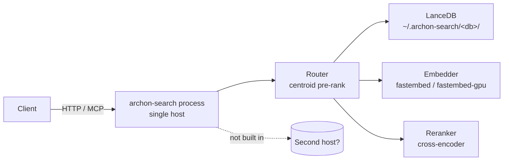

**Purpose**: State the performance targets `archon-search` does and does not promise, the scalability envelope of the single-process design, and the knobs and tools available when latency or throughput need attention.
**Audience**: Operators sizing a deployment, maintainers tuning the router, and reviewers evaluating a performance-sensitive change.
**Status**: Draft
**Last reviewed**: 2026-05-20
**Next review**: 2026-08-20

# Performance and Scalability

`archon-search` is a single-process local service. Performance is bounded by what one host can do; scalability beyond that host is **not built in**. This document pins down what the latency numbers in the repo actually mean, where the boundaries are, and which configuration values move the needle.

## Principles

1. **No production SLA.** The latency p50/p95 figures captured by the eval harness and the routing benchmark are **regression guards**, not service-level agreements. They exist so a refactor that doubles routing latency fails review — they are not a promise to callers.
2. **Single-process, single-host.** One `archon-search` process owns one LanceDB directory. There is no built-in horizontal scaling, no replication, no sharding across hosts.
3. **Local I/O is the scaling unit.** Throughput is driven by disk, CPU, and (when configured) GPU on the host running the daemon. Scaling up means picking a bigger host; scaling out is not a v1 affordance.
4. **Tune the router before you tune the model.** The cheapest latency wins come from `routing_shortlist_size` and `routing_confidence_threshold`. (`max_parallel_collections` is parsed from config but **not yet wired into the runtime** — see the knob table below.) Model swaps are expensive and have to clear the eval harness.
5. **Measure with the committed tools, not with new ones.** `tests/benchmark_routing_latency.py` and the eval harness are the agreed measurement surfaces. New benchmarks need to live alongside them, not replace them.

## Performance targets

| Surface                              | Number                                                                                                                          | Source                                              | Status                              |
| ------------------------------------ | ------------------------------------------------------------------------------------------------------------------------------- | --------------------------------------------------- | ----------------------------------- |
| Eval-harness retrieval latency       | p50 / p95 captured per run                                                                                                      | `tests/eval/baselines/baseline.json`                | **Report-only** — latency ceilings are intentionally unset in `tests/eval/thresholds.toml` for v1 (see header note). |
| Routing latency over HTTP            | p50 ≤ 30 ms, p95 ≤ 150 ms over localhost, 100 iterations, `POST /route`                                                          | `tests/benchmark_routing_latency.py`                | **Regression guard** for the benchmark itself. Not a production SLA. |
| Routing latency in-process           | Reported alongside HTTP latency; difference is the HTTP transport overhead.                                                      | `tests/benchmark_routing_latency.py`                | Same — regression guard.            |

Both numbers are measured against **deterministic eval backends and localhost transport**. Do not quote them to callers and do not compare them to live-server measurements taken in a different environment.

If the benchmark reports `p95 > 150 ms`, the recorded mitigation is the **co-located embedder** pattern: the host application embeds the query locally and posts the vector to `/route`, removing the embedding round-trip inside the server. The decision must be recorded in `Documentation/ADRs/` (see the printed message in `benchmark_routing_latency.py`).

## Scalability boundaries

What is *not* in the box:

- **No horizontal scale-out.** Two `archon-search` processes cannot share a LanceDB directory safely. There is no replication, no sharding, no leader election.
- **No external orchestration.** The supervisor is `launchd` or `systemd --user` (see `Architecture/160_operational_readiness_monitoring_and_reliability.md`). Restart-on-crash is the OS's job; that is the entire HA story.
- **No backpressure for ingestion.** Ingestion runs on the same process as serving; large reindexes will compete with query latency. Use `archon_search status` (`processed_files`, `eta_seconds`) to monitor.

Scaling *up* a single deployment is supported by GPU detection at install time (`platform/runtime.py::SearchRuntime.detect_gpu_type` → `GpuType.CUDA` on Linux with `nvidia-smi`, `GpuType.METAL` on ARM macOS; `install.py` later maps `GpuType.METAL` to `CoreMLExecutionProvider`) and by the systemd unit's `CPUQuota=50%` / `Nice=10` defaults, which can be raised in `~/.config/systemd/user/archon-search.service` for dedicated hosts.

## Profiling and load tools

### `tests/benchmark_routing_latency.py` — `uv run pytest -m benchmark`

In-process `MultiCollectionRouter` vs `POST /route` over 100 iterations with 3 warmups against `http://127.0.0.1:8765`. Prints p50, p95, min, max, and the HTTP transport overhead (`http_p95 − inprocess_p95`).

- Auto-skips when `/health` does not answer — safe to leave in CI.
- Asserts that at least 90% of HTTP iterations returned 200; below that the benchmark fails rather than reporting bogus percentiles.
- When `p95 > 150 ms` it prints the co-located embedder recommendation. Recording the decision in an ADR is part of the mitigation, not optional.

### Eval harness latency capture

`tests/eval/` records p50 / p95 alongside quality metrics for every run. These are stored in `baselines/baseline.json` and currently *not* gated (latency ceilings unset). They are useful for trending across PRs even though they do not fail a build.

### In-process stage-latency measurement (B1)

`archon_search/observability.py` provides `StageRecorder` / `record_stage()` / `bind_stage_recorder()`, a lightweight in-process surface for capturing per-stage wall times without external tooling.

Each handled request (REST `/search`, `/route`, `/explain`; MCP `search`, `search_with_context`, `explain`, `ingest_file`, `ingest_directory`) wraps its pipeline call with `bind_stage_recorder()`. Individual stages — `embed`, `route`, `vector`, `fts`, `fuse`, `rerank`, `context`, and ingest stages (`parse`, `persist`) — call `record_stage("<name>")`. At the end of the request the times are emitted in the structured log line as `stage_timings_ms`.

For `POST /explain` and the `explain` MCP tool, `stage_timings_ms` is also returned in the response body when `[observability].stage_timings_enabled = true` (the default). Set `stage_timings_enabled = false` in `archon-search.toml` to suppress the field from responses.

**Important caveat**: the recorded durations are **blocked-coroutine wall time**, not pure CPU time. They include event-loop scheduling latency that accumulates when the event loop is busy. Use these numbers to identify which stage dominates end-to-end latency on a given query; do not use them as CPU profiles or compare them directly to benchmark figures measured under isolated conditions.

All stage-timing numbers are **report-only**. There are no latency ceilings enforced on individual stages in v1; they serve as observability breadcrumbs, not SLA gates.

## Multi-collection fan-out concurrency (B3)

`POST /search` / `POST /explain` (and their MCP equivalents) accept `collections: list[str]` to fan a single query out across several collections in one request (`SearchPipeline.search_many` for search; `SearchPipeline.explain(collections=...)` for explain — both share the `_fanout_merge_acl` helper). The end-to-end flow and error mapping are in [`120_services_and_integration_architecture.md`](120_services_and_integration_architecture.md) ("Multi-collection search fan-out"); the cost model is below.

What the fan-out buys:

- **Embed once.** One `embed_one(query)` is shared by all N legs — N collections cost one embedding, not N (the dominant win over assembling multi-collection queries client-side).
- **Parallel retrieval.** Per-collection hybrid retrieval runs concurrently inside an `asyncio.TaskGroup`, so leg latency overlaps rather than serializes.
- **Single rerank pass.** One cross-encoder pass scores the merged candidate pool, producing globally comparable scores (vs. per-collection reranking, which yields incomparable local rank spaces).

Known constraints (cost / recall):

- **The reranker serializes concurrent fan-out requests.** There is a single `Reranker` instance reranking on one thread (`asyncio.to_thread`). Retrieval legs parallelize, but the rerank pass does not — concurrent multi-collection requests queue at that one instance. B1 stage timings (`rerank`) make the cost measurable.
- **`fanout_leg_trim` is a hard recall ceiling.** Each leg is trimmed to its top `fanout_leg_trim` candidates (default 40) by RRF score *before* the merge and ACL pass; the reranker cannot recover anything dropped here. Trim-before-ACL means that if the top-N-by-RRF all fail ACL, lower-ranked ACL-passing candidates are unreachable — set `fanout_leg_trim` generously under fine-grained ACL policies.
- **Per-leg retrieval is ~3× single-collection cost.** Each leg retrieves `max(top_k_retrieve * 3, 20)` candidates (`candidate_depth`) — a wider net than the `top_k_retrieve` used by single-collection `search()` — to compensate for merge loss. This is 3× more retrieval work per leg.

Config knobs (all under `[search]` in `archon-search.toml`; parsed and validated in `config.py`, must be ≥ 1 / > 0):

| Knob | Type | Default | Effect |
|---|---|---|---|
| `max_fanout` | `int` | `8` | Maximum collections per fan-out request. Also enforced at the Pydantic/MCP validation layer via the `_FANOUT_VALIDATION_LIMIT = 8` constant in `routes_search.py`; raising `max_fanout` above 8 in config alone has no effect until that constant is also updated. |
| `fanout_leg_trim` | `int` | `40` | Per-leg candidate cap fed into the merge + rerank pool — the hard recall ceiling above. |
| `fanout_timeout_seconds` | `float` | `30.0` | Whole-fan-out wall-clock budget (`asyncio.timeout`). Exceeding it → HTTP 504. |

## Routing knobs

All values live in `~/.archon-search/archon-search.toml` (see `archon-search.toml.example`). The router is `archon_search/router.py::MultiCollectionRouter`. `POST /route` builds a fresh `MultiCollectionRouter` per request (`routes_route._build_router`), so server-path routing never drifts on stale centroids — a regression test pins this lifecycle. `MultiCollectionRouter` also exposes `invalidate()` and an `initial_metadata` constructor param for future long-lived router consumers (A6, `CON-2`).

| Knob                            | Effect                                                                                                                                                       | When to tune                                                                                                |
| ------------------------------- | ------------------------------------------------------------------------------------------------------------------------------------------------------------ | ----------------------------------------------------------------------------------------------------------- |
| `routing_shortlist_size`        | How many collections survive centroid pre-ranking. Smaller → faster `/route` (fewer per-collection queries downstream); larger → higher recall when the router is unsure. | Raise when routing accuracy is low and the eval suite shows lost positives. Lower when `/route` latency dominates and the router is confident. |
| `routing_confidence_threshold`  | All-or-nothing gate on the top centroid similarity. If `max(similarity)` across scored collections is below the threshold, `MultiCollectionRouter.rank` returns an empty shortlist; otherwise the ranked list is truncated to `routing_shortlist_size` and individual sub-threshold collections are **not** pruned independently (see `archon_search/router.py::MultiCollectionRouter.rank`). | Raise to be stricter (router falls back to empty shortlist more often, forcing callers to handle "no confident route"). Lower to keep returning a shortlist even when the router is unsure. |
| `max_parallel_collections`      | **Reserved / not yet implemented.** Parsed and validated in `archon_search/config.py` (default `3`) and surfaced by `archon-search config`, but **no runtime code in `router.py`, `pipeline.py`, or `server/` consumes it** — there is no `asyncio.Semaphore` or equivalent fan-out gate today. Setting it has no effect on latency or concurrency in the current release. #Unverified | Not actionable until the knob is wired into the pipeline. #Unverified |

Before changing any of these in a release, re-run `uv run pytest -m eval --thresholds-path tests/eval/thresholds.toml tests/eval/test_eval_suite.py` to confirm `routing_accuracy` does not drop below the floor. Knob changes are eval-gated, not just benchmark-gated.

## See also

- `Architecture/100_system_architecture_overview.md` — the pipeline these knobs affect.
- `Architecture/140_error_handling_strategy.md` — how degraded performance is surfaced as `error_count` and `eta_seconds`.
- `Architecture/160_operational_readiness_monitoring_and_reliability.md` — observability surface used to monitor latency in production.
- `Architecture/510_release_and_environment_strategy.md` — how performance regressions interact with the release process.
- `tests/eval/README.md` — eval harness maintenance, including the latency-caveat section.
