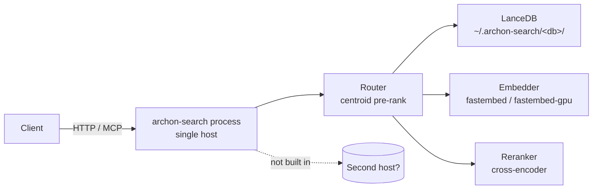

**Purpose**: State the performance targets `archon-search` does and does not promise, the scalability envelope of the single-process design, and the knobs and tools available when latency or throughput need attention.
**Audience**: Operators sizing a deployment, maintainers tuning the router, and reviewers evaluating a performance-sensitive change.
**Status**: Draft
**Last reviewed**: 2026-05-20
**Next review**: 2026-08-20

# Performance and Scalability

`archon-search` is a single-process local service. Performance is bounded by what one host can do; scalability beyond that host is **not built in**. This document pins down what the latency numbers in the repo actually mean, where the boundaries are, and which configuration values move the needle.

## Principles

1. **No production SLA.** The latency p50/p95 figures captured by the eval harness and the routing benchmark are **regression guards**, not service-level agreements. They exist so a refactor that doubles routing latency fails review — they are not a promise to callers.
2. **Single-process, single-host.** One `archon-search` process owns one LanceDB directory. There is no built-in horizontal scaling, no replication, no sharding across hosts.
3. **Local I/O is the scaling unit.** Throughput is driven by disk, CPU, and (when configured) GPU on the host running the daemon. Scaling up means picking a bigger host; scaling out is not a v1 affordance.
4. **Tune the router before you tune the model.** The cheapest latency wins come from `routing_shortlist_size` and `routing_confidence_threshold`. Model swaps are expensive and have to clear the eval harness.
5. **Measure with the committed tools, not with new ones.** `tests/benchmark_routing_latency.py` and the eval harness are the agreed measurement surfaces. New benchmarks need to live alongside them, not replace them.

## Performance targets

| Surface                              | Number                                                                                                                          | Source                                              | Status                              |
| ------------------------------------ | ------------------------------------------------------------------------------------------------------------------------------- | --------------------------------------------------- | ----------------------------------- |
| Eval-harness retrieval latency       | p50 / p95 captured per run                                                                                                      | `tests/eval/baselines/baseline.json`                | **Report-only** — latency ceilings are intentionally unset in `tests/eval/thresholds.toml` for v1 (see header note). |
| Routing latency over HTTP            | p50 ≤ 30 ms, p95 ≤ 150 ms over localhost, 100 iterations, `POST /route`                                                          | `tests/benchmark_routing_latency.py`                | **Regression guard** for the benchmark itself. Not a production SLA. |
| Routing latency in-process           | Reported alongside HTTP latency; difference is the HTTP transport overhead.                                                      | `tests/benchmark_routing_latency.py`                | Same — regression guard.            |
| Real-model search steady-state p95   | Asserted ≤ `steady_state_p95_ms` in `live_thresholds.toml` (`[real_model_search]`)                                              | `tests/eval/live_benchmark/test_real_model_search_benchmark.py` | **Hard CI gate** — fails PR if regression detected. Uses real fastembed + cross-encoder ONNX. |
| Real-model cold-load p90             | Asserted ≤ `cold_load_p90_ms` in `live_thresholds.toml` (`[real_model_search]`)                                                 | `tests/eval/live_benchmark/test_real_model_search_benchmark.py` | **Hard CI gate** — measures ONNX session construction cost (N=10, p90). |

Eval-harness numbers are measured against **deterministic eval backends**; do not quote them to callers. Real-model benchmark numbers are measured on CI runners (ubuntu-latest) using actual ONNX inference. They guard against regressions in the fastembed/ONNX path that the deterministic harness cannot detect.

If the benchmark reports `p95 > 150 ms`, the recorded mitigation is the **co-located embedder** pattern: the host application embeds the query locally and posts the vector to `/route`, removing the embedding round-trip inside the server. The decision must be recorded in `Documentation/ADRs/` (see the printed message in `benchmark_routing_latency.py`).

## Scalability boundaries

What is *not* in the box:

- **No horizontal scale-out.** Two `archon-search` processes cannot share a LanceDB directory safely. There is no replication, no sharding, no leader election.
- **No external orchestration.** The supervisor is `launchd` or `systemd --user` (see `Architecture/160_operational_readiness_monitoring_and_reliability.md`). Restart-on-crash is the OS's job; that is the entire HA story.
- **No backpressure for ingestion.** Ingestion runs on the same process as serving; large reindexes will compete with query latency. Use `archon_search status` (`processed_files`, `eta_seconds`) to monitor.

Scaling *up* a single deployment is supported by GPU detection at install time (`platform/runtime.py::SearchRuntime.detect_gpu_type` → `GpuType.CUDA` on Linux with `nvidia-smi`, `GpuType.METAL` on ARM macOS; `install/installer.py` later maps `GpuType.METAL` to `CoreMLExecutionProvider`) and by the systemd unit's `CPUQuota=50%` / `Nice=10` defaults, which can be raised in `~/.config/systemd/user/archon-search.service` for dedicated hosts.

## Profiling and load tools

### `tests/benchmark_routing_latency.py` — `uv run pytest -m benchmark`

In-process `MultiCollectionRouter` vs `POST /route` over 100 iterations with 3 warmups against `http://127.0.0.1:8765`. Prints p50, p95, min, max, and the HTTP transport overhead (`http_p95 − inprocess_p95`).

- Auto-skips when `/health` does not answer — safe to leave in CI.
- Asserts that at least 90% of HTTP iterations returned 200; below that the benchmark fails rather than reporting bogus percentiles.
- When `p95 > 150 ms` it prints the co-located embedder recommendation. Recording the decision in an ADR is part of the mitigation, not optional.

### Eval harness latency capture

`tests/eval/` records p50 / p95 alongside quality metrics for every run. These are stored in `baselines/baseline.json` and currently *not* gated (latency ceilings unset). They are useful for trending across PRs even though they do not fail a build.

### Real-model latency gate (`live_benchmark` marker, C16)

`tests/eval/live_benchmark/` contains two **hard CI gates** that run the real fastembed BAAI/bge-small-en-v1.5 embedder and Xenova/ms-marco-MiniLM-L-6-v2 cross-encoder reranker — the same ONNX models used in production. Unlike the deterministic eval harness, these tests catch regressions in ONNX session configuration, fastembed version upgrades, and reranker path changes.

**Two thresholds (both in `tests/eval/live_thresholds.toml` under `[real_model_search]`)**:
- `steady_state_p95_ms` — end-to-end p95 of 100 `pipeline.search()` calls after 5 warmups. Guards the hot-path: embedding → vector+FTS retrieval → RRF → rerank.
- `cold_load_p90_ms` — p90 of 10 fresh embedder+reranker constructions (ONNX session creation only). Guards against ONNX initialization regressions; N=10 uses p90 instead of p95 to avoid fitting to the single worst value.

**Calibration procedure**:
1. Trigger `workflow_dispatch` on `archon-search-pr.yml` (or a dedicated calibration PR) 10 times on ubuntu-latest. Record the printed p95/p90 from each run.
2. Compute `steady_state_p95_ms = median × 2` and `cold_load_p90_ms = median × 3`. The 2× / 3× multipliers absorb CI noise while still blocking large regressions.
3. Add a provenance comment (date, runner, 10 raw samples) above the values in `live_thresholds.toml`.

**Important**: calibration must be done on ubuntu-latest. Darwin/aarch64 (Apple Silicon) ONNX is 2–5× faster; thresholds derived from it will be too tight for CI runners. The current placeholders in `live_thresholds.toml` include a provenance comment documenting the measurement source.

These thresholds are loaded by `load_benchmark_thresholds(path: Path) -> BenchmarkThresholds` from `archon_search/eval/runner.py`. Unlike `load_live_thresholds()`, this function raises `ValueError` if the `[real_model_search]` section is absent — the gate cannot operate in report-only mode; explicit thresholds are required.

The CI step (`archon-search-pr.yml`, `Run real-model latency benchmark`) runs with `timeout-minutes: 3`, uses `--no-cov` (coverage overhead biases latency), and is followed by a `Verify benchmark tests ran` step that fails if the model cache was missing and all tests were skipped.

### In-process stage-latency measurement (B1)

`archon_search/observability.py` provides `StageRecorder` / `record_stage()` / `bind_stage_recorder()`, a lightweight in-process surface for capturing per-stage wall times without external tooling.

Each handled request (REST `/search`, `/route`, `/explain`; MCP `search`, `search_with_context`, `explain`, `ingest_file`, `ingest_directory`) wraps its pipeline call with `bind_stage_recorder()`. Individual stages — `embed`, `route`, `vector`, `fts`, `fuse`, `rerank`, `context`, and ingest stages (`parse`, `persist`) — call `record_stage("<name>")`. At the end of the request the times are emitted in the structured log line as `stage_timings_ms`.

For `POST /explain` and the `explain` MCP tool, `stage_timings_ms` is also returned in the response body when `[observability].stage_timings_enabled = true` (the default). Set `stage_timings_enabled = false` in `archon-search.toml` to suppress the field from responses.

**Important caveat**: the recorded durations are **blocked-coroutine wall time**, not pure CPU time. They include event-loop scheduling latency that accumulates when the event loop is busy. Use these numbers to identify which stage dominates end-to-end latency on a given query; do not use them as CPU profiles or compare them directly to benchmark figures measured under isolated conditions.

All stage-timing numbers are **report-only**. There are no latency ceilings enforced on individual stages in v1; they serve as observability breadcrumbs, not SLA gates.

## Multi-collection fan-out concurrency (B3)

`POST /search` / `POST /explain` (and their MCP equivalents) accept `collections: list[str]` to fan a single query out across several collections in one request (`SearchPipeline.search_many` for search; `SearchPipeline.explain(collections=...)` for explain — both share the `_fanout_merge_acl` helper). The end-to-end flow and error mapping are in [`120_services_and_integration_architecture.md`](120_services_and_integration_architecture.md) ("Multi-collection search fan-out"); the cost model is below.

What the fan-out buys:

- **Embed once.** One `embed_one(query)` is shared by all N legs — N collections cost one embedding, not N (the dominant win over assembling multi-collection queries client-side).
- **Parallel retrieval.** Per-collection hybrid retrieval runs concurrently inside an `asyncio.TaskGroup`, so leg latency overlaps rather than serializes.
- **Single rerank pass.** One cross-encoder pass scores the merged candidate pool, producing globally comparable scores (vs. per-collection reranking, which yields incomparable local rank spaces).

Known constraints (cost / recall):

- **The reranker serializes concurrent fan-out requests.** There is a single `Reranker` instance reranking on one thread (`asyncio.to_thread`). Retrieval legs parallelize, but the rerank pass does not — concurrent multi-collection requests queue at that one instance. B1 stage timings (`rerank`) make the cost measurable.
- **`fanout_leg_trim` is a hard recall ceiling.** Each leg is trimmed to its top `fanout_leg_trim` candidates (default 40) by RRF score *before* the merge and ACL pass; the reranker cannot recover anything dropped here. Trim-before-ACL means that if the top-N-by-RRF all fail ACL, lower-ranked ACL-passing candidates are unreachable — set `fanout_leg_trim` generously under fine-grained ACL policies.
- **Per-leg retrieval is ~3× single-collection cost.** Each leg retrieves `max(top_k_retrieve * 3, 20)` candidates (`candidate_depth`) — a wider net than the `top_k_retrieve` used by single-collection `search()` — to compensate for merge loss. This is 3× more retrieval work per leg.

Config knobs (all under `[search]` in `archon-search.toml`; parsed and validated in `config.py`, must be ≥ 1 / > 0):

| Knob | Type | Default | Effect |
|---|---|---|---|
| `max_fanout` | `int` | `8` | Maximum collections per fan-out request. Enforced at request time in the route handler body and MCP tool body by reading `config.max_fanout` directly; raising `max_fanout` in TOML takes effect immediately with no code change required. |
| `fanout_leg_trim` | `int` | `40` | Per-leg candidate cap fed into the merge + rerank pool — the hard recall ceiling above. |
| `fanout_timeout_seconds` | `float` | `30.0` | Whole-fan-out wall-clock budget (`asyncio.timeout`). Exceeding it → HTTP 504. |

## Routing knobs

All values live in `~/.archon-search/archon-search.toml` (see `archon-search.toml.example`). The router is `archon_search/router.py::MultiCollectionRouter`. `POST /route` builds a fresh `MultiCollectionRouter` per request (`routes_route._build_router`), so server-path routing never drifts on stale centroids — a regression test pins this lifecycle. `MultiCollectionRouter` also exposes `invalidate()` and an `initial_metadata` constructor param for future long-lived router consumers (A6, `CON-2`).

| Knob                            | Effect                                                                                                                                                       | When to tune                                                                                                |
| ------------------------------- | ------------------------------------------------------------------------------------------------------------------------------------------------------------ | ----------------------------------------------------------------------------------------------------------- |
| `routing_shortlist_size`        | How many collections survive centroid pre-ranking. Smaller → faster `/route` (fewer per-collection queries downstream); larger → higher recall when the router is unsure. | Raise when routing accuracy is low and the eval suite shows lost positives. Lower when `/route` latency dominates and the router is confident. |
| `routing_confidence_threshold`  | All-or-nothing gate on the top centroid similarity. If `max(similarity)` across scored collections is below the threshold, `MultiCollectionRouter.rank` returns an empty shortlist; otherwise the ranked list is truncated to `routing_shortlist_size` and individual sub-threshold collections are **not** pruned independently (see `archon_search/router.py::MultiCollectionRouter.rank`). | Raise to be stricter (router falls back to empty shortlist more often, forcing callers to handle "no confident route"). Lower to keep returning a shortlist even when the router is unsure. |

Before changing any of these in a release, re-run `uv run pytest -m eval --thresholds-path tests/eval/thresholds.toml tests/eval/test_eval_suite.py` to confirm `routing_accuracy` does not drop below the floor. Knob changes are eval-gated, not just benchmark-gated.

### FTS maintenance cost (C6)

As of C6, ingest and delete FTS maintenance is O(delta-size), not O(collection-size):

- **`ingest_file`** (add path): calls `store.optimize_fts(collection)` once at batch end. `optimize()` incorporates only the newly added/deleted rows into the FTS index. A 10-chunk update into a 50,000-chunk collection completes in milliseconds.
- **`delete_document`** (standalone delete): calls `optimize_fts` after the LanceDB `table.delete()` (after lock release). Callers that batch-delete before adding (e.g., `ingest_file` re-ingesting a changed document) pass `skip_fts_optimize=True` to suppress per-file FTS and issue a single batch-end optimize.
- **`ingest_directory`** and **sync watcher** (`sync.py`): call `optimize_fts` once per batch/cycle, not per file — N files → 1 optimize call.
- **`reindex_metadata`**: no FTS call at all (metadata-only columns; `text` is unchanged).
- **`rebuild_fts_index`**: retained for operator-initiated FTS repair, available via `archon-search collection reindex`. Not called from normal ingest paths.

The C6 ingest latency regression guard lives in `tests/eval/thresholds.toml` under `[ingest_latency]` (`single_file_p95_ms`). It is a **hard CI gate** — a regression above the threshold fails the eval run (see `tests/eval/test_eval_suite.py::test_ingest_latency_p95_single_file_on_large_corpus`).

**Trade-offs and limitations (C6)**:
- BM25 scores after N incremental `optimize()` calls may differ numerically from a freshly rebuilt index. Operators requiring strict score reproducibility should run `archon-search collection reindex` periodically.
- Concurrent `optimize()` on the same table raises a LanceDB commit conflict; callers must serialize per collection. The production code paths do not issue parallel optimize calls on the same collection.
- If `optimize_fts` fails, the ingest path falls back to `rebuild_fts_index` and logs a warning. If both fail, the ingest data is persisted but FTS may be inconsistent — repair via `archon-search collection reindex`.

### Centroid maintenance cost (B5)

As of B5, centroid maintenance cost is no longer O(chunks) on every ingest:

- **Ingest**: O(batch) — `(centroid_sum, chunk_count)` is updated incrementally from the newly ingested vectors only. The existing centroid sum is read once from `_archon_collection_meta`, the batch contribution is added, and the result is written back.
- **Delete**: O(chunks-in-document) — deleting a document subtracts only that document's chunk vectors from the running sum. No full collection scan is needed.
- **Full recompute** (`recompute_collection_meta`): O(chunks) — retained for explicit calls: `archon-search collection reindex <name>`, crash recovery (when `needs_recompute = True`), and periodic drift-reset checkpoints. This path is not triggered by normal ingest or delete.

As of D4, the incremental path is unconditional — `centroid_incremental_enabled` has been removed. The B5 incremental path is always used. See `archon_search/store.py` and `CON-4` in `530_technical_debt_refactoring_roadmap.md` for the full rationale.

### `compute_impact` BFS traversal cost (E2g)

`GraphStore.compute_impact` is a depth-capped BFS over `_archon_graph_{ns}__{col}_edges`. Cost model:

- **Per-hop fan-out**: each BFS frontier expansion reads `get_neighbours(collection, frontier_ids, ns)` and `get_edges_for_nodes(collection, frontier_ids, ns)` — two LanceDB scans per hop.
- **Hard cap**: `MAX_IMPACT_DEPTH = 5` limits traversal to at most 5 hops regardless of the requested `depth`; `MAX_IMPACT_GROUP_SIZE = 50` caps the live frontier at each hop, so fan-out from a hub symbol never causes an unbounded scan.
- **Result-set cap**: each `ImpactGroup` (direct + indirect) is capped at `MAX_IMPACT_GROUP_SIZE` entries total; excess entries are reported via `omitted_count` (never silently dropped).
- **PageRank ordering**: results are sorted by persisted `pagerank_score` (nulls-last). No re-computation happens at query time — scores are pre-persisted by `PageRankBuilder`.

No per-query `compute_impact` latency ceiling is enforced in v1; the BFS traversal cost is proportional to the graph size and depth cap, bounded by `MAX_IMPACT_DEPTH=5` and `MAX_IMPACT_GROUP_SIZE=50`.

### Code-lane eval gate (E2g)

The code-lane eval gate (`tests/eval/test_e2e_graph_eval_gate_v2.py`) adds two new fixture collections measured independently:

- `code_chunking_recall_at_5` — Recall@5 on the chunk-boundary-sensitive corpus (`code-chunking/`). **Report-only, no gated floor** — see `tests/eval/README.md` for the rationale (the gated vs. no-feature comparison is apples-to-oranges at the aggregate level; non-vacuity is proved by `test_codeChunkingRecall_nonVacuous` comparing both arms at the same `chunk_size=65`).
- `code_defref_recall_at_5` — Recall@5 on the connection-sensitive corpus (`code-defref/`). **Gated floor: 1.0** (strict above the measured no-feature baseline of 0.6667) — a regression that disables `DefRefExtractor` wiring reproduces the 0.6667 baseline and fails the gate.

Latency p50/p95 for both code-lane collections are captured in `baselines/baseline.json` alongside the existing retrieval latency fields. No ceiling is enforced in v1.

## CLI startup latency

**Goal (feature 190):** lightweight commands (`config show`, `config get`, `status`, `stop`, `key list`) start without loading the ML/agent stack.

**Import-boundary design:** Three module-level imports were moved into the function bodies that actually use them, using the repo's established `# noqa: PLC0415` lazy-import convention:

| File | Import deferred | Benefit |
|---|---|---|
| `cli/serve.py` | `from archon_search.server.app import run_server` → inside `serve()` | `fastembed`/`onnxruntime` no longer load at CLI group-build time |
| `cli/collection.py` | `from archon_search.pipeline import create_pipeline` → inside `list_cmd._run()` and `info._run()` | pipeline not constructed for lightweight commands |
| `description_generator.py` | `from claude_agent_sdk import ...` → inside `_call_haiku()` | `claude_agent_sdk` removed from the import cost of every pipeline consumer |

**Remaining floor (after feature 190):** Lightweight store-free commands approach the Python interpreter + Click startup floor (~0.23 s median on a warm machine). Commands that open LanceDB (`collection list`, `collection info`) faced an additional ~900 ms first-import floor from `lancedb` plus the GPT-2 tokenizer cost (~1 s) — both were accepted floors not yet addressed by feature 190.

**Feature 210 (`_make_store` for `collection list`/`info`):** `list_cmd` and `info` now open `SearchStore(cfg.db_path)` directly via a `_make_store()` helper instead of calling `create_pipeline()`. This eliminates the GPT-2 tokenizer cost (~1 s) from these commands. The remaining floor is the `lancedb` first-import (~900 ms), which is irreducible without a precompiled binary and is documented in release notes. The import is at module level in `collection.py` (not lazy); lancedb opens the connection only on `store.connect()`. See brief [2026-07-15-210-cli-store-commands-slow-brief.md](../../Documentation/Completed/2026-07-15-210-cli-store-commands-slow-brief.md) and debt entry CLI-1 (resolved) in [530_technical_debt_refactoring_roadmap.md](./530_technical_debt_refactoring_roadmap.md).

**Import-boundary regression guard (`tests/test_cli_startup_latency.py`):** Spawns a fresh Python subprocess running `archon-search config show` and asserts that `claude_agent_sdk` and `fastembed` are absent from `sys.modules`. This is the only reliable automated proof — in-process CliRunner shares `sys.modules` with the test runner and cannot prove absence (see plan Q4). The test is in the default CI suite (not smoke) and is serialised via `xdist_group("startup_latency")`. A positive-control assertion (`archon_search.cli.main` and `archon_search.cli.serve` present in `sys.modules`) prevents vacuous passes if the subprocess output is malformed. If either absence assertion fails, the import was promoted back to module scope in one of the three edited files.

**Note on `mcp`:** `mcp` is NOT guarded by the regression test. It enters only via `server/mcp.py` (a lazy FastMCP mount at serve time) and was never present in `sys.modules` for lightweight commands before or after feature 190.

## See also

- `Architecture/100_system_architecture_overview.md` — the pipeline these knobs affect.
- `Architecture/140_error_handling_strategy.md` — how degraded performance is surfaced as `error_count` and `eta_seconds`.
- `Architecture/160_operational_readiness_monitoring_and_reliability.md` — observability surface used to monitor latency in production.
- `Architecture/510_release_and_environment_strategy.md` — how performance regressions interact with the release process.
- `tests/eval/README.md` — eval harness maintenance, including the latency-caveat section.
