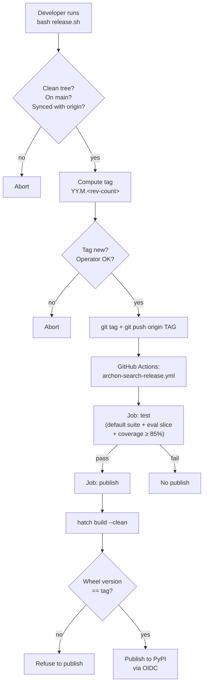

**Purpose**: Describe how `archon-search` is versioned, released, and deployed — including CI workflows, the runtime environment layout, and the compatibility contract.
**Audience**: Maintainers cutting releases, operators deploying the server, and contributors changing build / CI / packaging behaviour.
**Status**: Draft
**Last reviewed**: 2026-05-20
**Next review**: 2026-08-20

# Release and Environment Strategy

`archon-search` is a single-process, locally-installed server distributed as a PyPI wheel. Releases are manual, tag-driven, and time-versioned. There is exactly one runtime environment — the developer's or operator's machine — and all state lives under `~/.archon-search/`.

## Principles

1. **CalVer encodes time, not compatibility.** Version segments tell you *when* a release was cut; `BREAKING.md` tells you whether it breaks you.
2. **Tags drive releases.** Plain pushes to `main` never publish. A release is a tag push, and the tag push is what runs the publish workflow.
3. **No hardcoded versions.** The wheel's version is derived from `git describe` via `hatch-vcs`. There is no `__version__ = "..."` literal anywhere in the package.
4. **One runtime, one state directory.** Everything the server needs — config, key, vector index, FTS index, telemetry logs — lives under `~/.archon-search/`. There is no "staging" vs. "prod" layout.
5. **OIDC, not stored secrets.** PyPI publishing uses GitHub's OIDC integration with PyPI's trusted publisher. There are no long-lived API tokens stored in CI.

## Versioning

### CalVer formula

```
YY.M.<commit-count>
```

- `YY` — two-digit UTC year (e.g. `26` for 2026).
- `M` — UTC month with no leading zero (e.g. `5`, not `05`).
- `<commit-count>` — `git rev-list --count HEAD`, the total number of commits in the history at tag time.

`release.sh` computes this tag and pushes it; `hatch-vcs` reads it back from the checkout at build time.

### Why `no-guess-dev` + `no-local-version`

From `pyproject.toml`:

```toml
[tool.hatch.version]
source = "vcs"
raw-options.version_scheme = "no-guess-dev"
raw-options.local_scheme = "no-local-version"
raw-options.fallback_version = "0.0.0+local"
```

- `no-guess-dev`: between tags, the version becomes `<tag>.post{N}` (commit distance) rather than the default "guess the next version" behaviour. This produces deterministic, PyPI-compatible strings.
- `no-local-version`: drops the `+gXXXXX` local-version identifier. PyPI rejects local version identifiers on upload, so this strip is necessary for publish to succeed.
- `fallback_version`: used only when there is no git history (e.g. building from an exported tarball with no `.git`). It will never appear on a real release.

### No hardcoded versions

The package reads its own version at runtime via `importlib.metadata.version("archon-search")` (see `archon_search/server/app.py` and `archon_search/cli/main.py`). If installation metadata is missing, both call sites fall back to a sentinel (`"dev"` or `"0.0.0+source"`) — never a literal release number. Do not introduce a `__version__` constant.

## Release Flow

Releases are cut from `main` using `release.sh`. The script is the only sanctioned way to start a release.

```bash
bash release.sh           # interactive: prints the computed tag, asks to confirm
bash release.sh -y        # non-interactive: tag + push without prompting
bash release.sh --dry-run # show what would happen; do not tag or push
```

### What `release.sh` does

1. **Pre-flight**: refuses to run unless the working tree is clean, the current branch is `main`, and `HEAD` matches `origin/main`.
2. **Compute the tag**: `YY.M.<git rev-list --count HEAD>` with UTC date components.
3. **Confirm the tag is new**: rejects if the tag already exists locally or on the origin remote.
4. **Confirm with the operator** (unless `-y` / `--yes`).
5. **`git tag` + `git push origin <tag>`**.

Once the tag lands on the origin remote, `archon-search-release.yml` takes over.

### What the release workflow does

`.github/workflows/archon-search-release.yml` is the only workflow that publishes. It is triggered by `push: tags: "*"` and by `workflow_dispatch:` (the dispatch trigger has no `inputs:` block; the "Resolve tag name" step nonetheless requires a tag context and errors out if none can be resolved). It runs two jobs:

1. **`test`**: clean install via `uv sync --dev`, default test suite with coverage, eval slice with thresholds, then `coverage report --fail-under=85`. The publish job will not start unless this passes.
2. **`publish`**:
   - Resolves the tag name from `GITHUB_REF` (or `git describe --exact-match` for `workflow_dispatch`).
   - Builds wheel and sdist with `hatch build --clean`.
   - **Verifies wheel version matches the pushed tag**. The wheel filename is parsed and compared to the tag; if they drift, the job fails before uploading anything.
   - Publishes to PyPI via `pypa/gh-action-pypi-publish@release/v1` using OIDC. No stored secrets.

### Flow diagram



### What does NOT trigger a release

- Plain pushes to `main` — handled by `archon-search-pr.yml` for PRs only.
- Branch pushes other than tag refs.
- Re-pushing a tag that already exists on `origin` — git rejects the push outright. (Note: manually re-invoking the workflow via `workflow_dispatch` against an existing tag *does* re-run the workflow; it will fail at the PyPI upload step because the version already exists, but the workflow itself executes.)

## CI Workflows

Three workflows live under `.github/workflows/`. Each has a single, narrow purpose.

| Workflow file                  | Trigger                              | Purpose                                                                                                                                                                                                |
| ------------------------------ | ------------------------------------ | ------------------------------------------------------------------------------------------------------------------------------------------------------------------------------------------------------ |
| `archon-search-pr.yml`         | `pull_request`                       | PR gate. Installs with `uv sync --dev`, runs the default test suite with coverage append, then the eval slice with thresholds, then enforces `coverage report --fail-under=85`. Both pytest steps use `--cov-append` against a single `.coverage` file; there is no `coverage combine` step. |
| `archon-search-release.yml`    | `push: tags: "*"`, `workflow_dispatch` | Manual release. Job 1 re-runs the eval-gated suite + coverage floor; Job 2 builds the wheel, verifies the wheel version matches the pushed tag, and publishes to PyPI via OIDC.                        |
| `archon-search-eval-live.yml`  | `push: tags: "*"`, `workflow_dispatch` | Live model eval. Runs `pytest -m live_eval tests/eval/live/` with real fastembed + cross-encoder weights. Runs **concurrently** with `archon-search-release.yml` on tag push — it does not block the release. The test step uses `continue-on-error: true` and always uploads the `live-eval-report` artifact. In v1 the `live_thresholds.toml` is a comment-only stub, so this workflow is **report-only** (no gates fire) until the baseline is calibrated and thresholds are added. |

All three workflows pin Python 3.12 and use `astral-sh/setup-uv@v3` to install `uv`. The release workflow additionally installs `hatch` out-of-band via `uv tool install hatch` for the build step — `hatch` is not a declared project dependency (only `hatchling` and `hatch-vcs` appear in `[build-system].requires`). No other third-party tooling is brought in beyond what `pyproject.toml` declares.

## Environment

There is one runtime environment: the operator's machine. The server is single-process and owns all of its on-disk state.

### State directory layout

All persistent state lives under `~/.archon-search/`:

- `archon-search.toml` — user configuration (see `archon-search.toml.example`).
- `.search.env` — the API key, mode `600`. Auto-generated by `key_manager.py` on first start if absent.
- LanceDB tables (vector + FTS) under the configured `db_path`.
- `search-logs/` — JSONL telemetry, only when `[telemetry].enabled = true`.

### Environment variable overrides

- `ARCHON_SEARCH_API_KEY` — overrides the on-disk key entirely. When set, no key file is read or generated.
- `ARCHON_SEARCH_KEY_FILE` — redirects the key file location away from the default `~/.archon-search/.search.env`.

See `150_security_and_privacy_architecture.md` for the full auth model, including how the bearer token is bootstrapped and rotated.

### Configuration

`config.py` loads `~/.archon-search/archon-search.toml` and validates it against the `SearchConfig` schema. A starter file ships as `archon-search.toml.example` at the repository root. Selected fields:

- `[search].top_k_retrieve`, `[search].top_k_return` — pipeline shortlist and final cut-off.
- `[server].host`, `[server].port` — defaults bind to `127.0.0.1`.
- `[telemetry].enabled` — opt-in, default off. `[telemetry].export_enabled = true` is coerced to `false` at config load with a warning in v1 (reserved for a future release).

## Compatibility Contract

`BREAKING.md` IS the compatibility contract. CalVer segments encode time only; they do not signal whether a release breaks consumers.

The rule, restated from `BREAKING.md`:

> Every release that removes or changes an existing API contract MUST add an entry here describing: what changed, the migration path, and from which release the deprecated form was announced. Consumers should subscribe to changes in this file, not interpret CalVer segments.

The codebase does not carry backward-compatibility shims. When a contract changes, the old form is removed in the same release that documents the change.

## Related Documents

- Day-to-day development workflow and PR expectations: `500_development_workflows_and_conventions.md`
- API surface and contract discipline: `520_api_design_and_contracts.md`
- Endpoint reference: `600_api_reference_or_public_interface.md`
- Test layout, eval harness, and the coverage floor: `200_testing_strategy.md`
- Auth model, key bootstrap, and telemetry privacy: `150_security_and_privacy_architecture.md`
- Compatibility log: `../../BREAKING.md`
