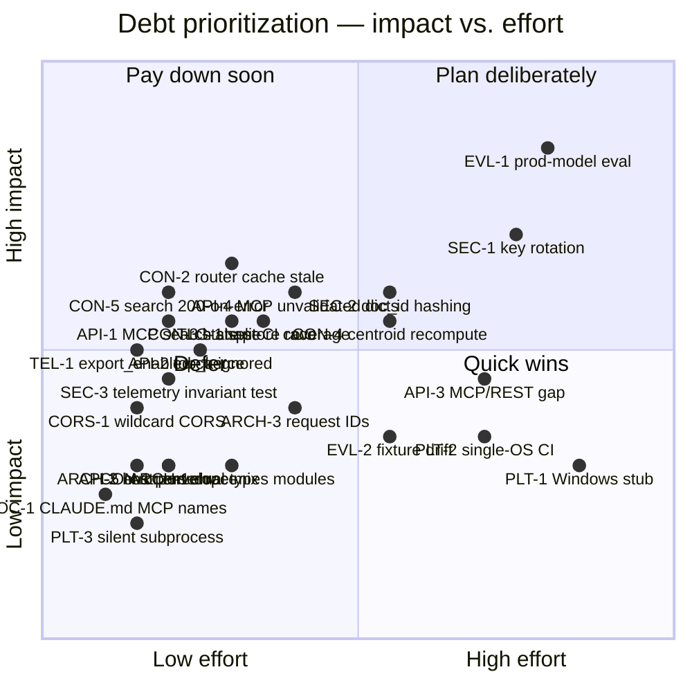

**Purpose**: Catalog known technical debt in `archon-search`, with severity, triggers, and refactor candidates, so maintainers can decide what to pay down and when.
**Audience**: Maintainers and backend engineers.
**Status**: Accepted
**Last reviewed**: 2026-05-20 / **Next review**: 2026-08-20

# Technical Debt and Refactoring Roadmap

This document is the canonical register of accepted compromises in `archon-search`. It complements the per-release [`BREAKING.md`](../../BREAKING.md) (which records contract changes that already shipped or are queued) by tracking debt that has **not yet been scheduled**.

For architectural context, see [`100_system_architecture_overview.md`](./100_system_architecture_overview.md). For the security and privacy invariants debt is measured against, see [`150_security_and_privacy_architecture.md`](./150_security_and_privacy_architecture.md). For the release flow that ships paydowns, see [`510_release_and_environment_strategy.md`](./510_release_and_environment_strategy.md).

## Principles

1. **Debt is a forecast, not a moral failing.** Every entry below was a deliberate trade-off at the time. The register exists to surface *triggers* — the conditions under which a trade-off stops paying.
2. **Every entry has a trigger and a reference.** If an item cannot point to a file path, a `BREAKING.md` entry, or a documented invariant, it does not belong here. Ungrounded debt is rumor.
3. **The eval harness is the regression gate.** Debt that bypasses [`tests/eval/`](../../tests/eval/README.md) — for example, a refactor without a metric to defend it — is high-risk by default. See [`200_testing_strategy.md`](./200_testing_strategy.md).
4. **Bias toward shipping over polishing absent measurable user pain.** A debt item without a trigger event (user report, eval regression, security finding) stays Low severity.
5. **Out-of-scope items are recorded, not hidden.** Deliberate non-goals (single-process server, no horizontal scale) live in [Out of scope](#out-of-scope) so they are not re-litigated as debt.

## Debt register

### API contract drift

| ID | Item | Category | Severity | Trigger | Refs |
| --- | --- | --- | --- | --- | --- |
| API-1 | MCP `search` tool response shape change (bare list → `{results, acl_filtered}`) is announced but not yet released. Consumers may still depend on the old shape. | API contract | Med | Tag pushed before consumers migrate. | [`BREAKING.md`](../../BREAKING.md) "[next release] — MCP `search` tool response shape"; `archon_search/server/mcp.py` |
| API-2 | REST `/search` `top_k` field still accepted by the Pydantic schema but ignored at the route. The schema documents a parameter that has no effect. | API contract | Med | Confused user report or external integration relying on per-request `top_k`. | [`BREAKING.md`](../../BREAKING.md) "[next release] — REST `/search` per-request `top_k` no longer honored"; `archon_search/server/routes_search.py`, `schemas.py` |
| API-3 | MCP-mirrors-REST aspiration is partial. MCP exposes 10 tools (`search`, `search_with_context`, `explain`, `ingest_file`, `ingest_directory`, `list_collections`, `get_collections_meta`, `get_collection_meta`, `list_documents`, `delete_document`); REST also surfaces `state`, `status`, `route`, `jobs`, `telemetry`, and collection `reindex`/`add`/`remove`. The naming gap (`search_*` prefix in CLAUDE.md vs. bare names in code) compounds the drift. | API contract | Low | New REST endpoint added; downstream MCP client requests parity. | `archon_search/server/mcp.py`, `archon_search/server/app.py` (8 routers), [`520_api_design_and_contracts.md`](./520_api_design_and_contracts.md) |
| API-4 | MCP tools return raw `dataclasses.asdict(...)` payloads without a Pydantic response model. REST routes are gated by `response_model=` and enforce schema; MCP clients silently absorb whatever shape the dataclass currently has. Adding/removing a field in `SearchResult`, `CollectionMeta`, or `IngestResult` is a silent MCP contract break. | API contract | Med | Domain dataclass field added or removed without a `BREAKING.md` entry. | `archon_search/server/mcp.py` (`asdict` call sites for `search`, `search_with_context`, `ingest_file`, `ingest_directory`, `list_collections`, `get_collections_meta`, `get_collection_meta`, `list_documents`); [`520_api_design_and_contracts.md`](./520_api_design_and_contracts.md) |
| API-5 | REST error responses are inconsistent: most failures raise `HTTPException` (FastAPI-serialized `{"detail": ...}`), but `routes_search.py` and `routes_collections.py` mix in hand-built `JSONResponse({"detail": ...}, status_code=...)`. Same shape today by convention, but the two paths can diverge silently. | API contract / Reliability | Low | Error envelope is extended (e.g., add `code` field) in one path and not the other. | `archon_search/server/routes_search.py:68–84`, `routes_collections.py`, `routes_jobs.py`; [`140_error_handling_strategy.md`](./140_error_handling_strategy.md) |

### Privacy and security

| ID | Item | Category | Severity | Trigger | Refs |
| --- | --- | --- | --- | --- | --- |
| SEC-1 | Auth middleware supports a single default key plus an optional `namespaces` map of static keys. There is no rotation, expiry, or revocation primitive — restart with a new key file is the only path. | Security | Med | Multi-tenant deployment, or first reported key compromise. | `archon_search/server/middleware_auth.py`; [`150_security_and_privacy_architecture.md`](./150_security_and_privacy_architecture.md) |
| SEC-2 | Telemetry `doc_id` is path-derived. With telemetry enabled, the JSONL log under `~/.archon-search/search-logs/` reveals filesystem paths. Documented as accepted risk; a hashed-doc-id mode is planned. | Security | Med | Telemetry enabled by a user who later needs to share logs, or any external-handoff requirement. | `archon_search/telemetry/entry.py`, `writer.py`; ADR [`05_opt_in_local_telemetry_no_raw_query.md`](../ADRs/05_opt_in_local_telemetry_no_raw_query.md) |
| SEC-3 | Telemetry retains the structural no-raw-query invariant; enforcement is backed by a dedicated structural test (`tests/telemetry/test_entry_factories.py::test_factory_signatures_reject_raw_query_argument`) that introspects every `TelemetryEntry` factory and forbids `{"query", "query_text", "body", "request"}` kwargs. The residual debt is that the invariant lives outside the type system — a maintainer who bypasses the factories (e.g., constructs `TelemetryEntry` directly with a renamed field) would not be caught. | Security | Low | New telemetry field requested for debugging that does not go through the factories. | `archon_search/telemetry/entry.py`; `tests/telemetry/test_entry_factories.py`; [`CLAUDE.md`](../../CLAUDE.md) "Structural invariant" |
| CORS-1 | FastAPI `CORSMiddleware` is mounted with `allow_origins=["*"]`, `allow_methods=["*"]`, `allow_headers=["*"]` and no config knob. Because the middleware short-circuits OPTIONS preflight **before** `APIKeyMiddleware` runs, CORS is the only layer governing whether arbitrary remote origins can attempt cross-origin requests on a non-loopback bind. Acceptable while the server binds to `127.0.0.1` only; becomes a CSRF/exfiltration surface as soon as the bind moves off loopback without a reverse proxy that overrides CORS headers. | Security | Low | Bind address moves off `127.0.0.1` without a hardening reverse proxy. | `archon_search/server/app.py:122`; [`Documentation/SecurityGuide/05_network_exposure_and_tls.md`](../SecurityGuide/05_network_exposure_and_tls.md); [`150_security_and_privacy_architecture.md`](./150_security_and_privacy_architecture.md) |

### Telemetry / config contract

| ID | Item | Category | Severity | Trigger | Refs |
| --- | --- | --- | --- | --- | --- |
| TEL-1 | `[telemetry].export_enabled = true` is **silently coerced to `false` with a warning**, not rejected at config load. Code and [`CLAUDE.md`](../../CLAUDE.md) agree on the silent-coerce behavior; the residual debt is that this is a warn-and-continue path rather than a hard config-load failure, and downstream docs/ADRs that describe "external transmission" semantics need to be checked against the actual no-op v1 implementation. #Unverified — ADR-05 wording was not re-opened during this audit. | Reliability / Docs | Med | User reports unexpected silent demotion, or contract is cited in an audit. | `archon_search/config.py` lines 209–217; [`CLAUDE.md`](../../CLAUDE.md) "Telemetry"; [`150_security_and_privacy_architecture.md`](./150_security_and_privacy_architecture.md) |

### Platform

| ID | Item | Category | Severity | Trigger | Refs |
| --- | --- | --- | --- | --- | --- |
| PLT-1 | Windows service lifecycle is a stub. Every method on `WindowsSearchService` (`start`, `stop`, `restart`, `register`, `unregister`) raises `NotImplementedError`; only `status()` returns a `not running` shape. CLI `install`/`start`/`stop` on Windows surface the `NotImplementedError`. | Architecture | Low | First Windows user request, or a CI runner added for `win32`. | `archon_search/platform/windows.py`; `archon_search/platform/service.py` |
| PLT-2 | CI runs only on `ubuntu-latest`. macOS branches are exercised via `patch("sys.platform", "darwin")` mocks; the Windows branch is the explicit stub (PLT-1) and has no native test. The launchd/systemd integration paths are never exercised against the real OS in CI. | Testing / Reliability | Low | Native-OS regression that mocks miss (e.g., a `launchctl` flag change). | `.github/workflows/`, `archon_search/platform/{macos,linux,windows}.py`, `tests/test_service_*.py` |
| PLT-3 | `install_cmd.py` invokes `launchctl`/`systemctl` with `subprocess.run(..., check=False, capture_output=True)` and discards the result. If the helper is missing or fails, the uninstall path silently no-ops with no warning logged. | Reliability | Low | User reports an install/uninstall that "did nothing" and there is no log to triage. | `archon_search/cli/install_cmd.py` (uninstall path) |

### Concurrency and runtime state

| ID | Item | Category | Severity | Trigger | Refs |
| --- | --- | --- | --- | --- | --- |
| CON-1 | `archon_search/parser.py:_parse_with_docling` lazy-initialises `self._converter` with an acknowledged check-then-set race (in-code comment: "NOT THREAD SAFE … current RAG pipeline is sequential, so this is an accepted limitation"). The risk is dormant only as long as ingest stays single-threaded. | Reliability | Low | Parallel ingest path added (e.g., `asyncio.gather` over images). | `archon_search/parser.py` `_parse_with_docling` |
| CON-2 | `MultiCollectionRouter._cached_metadata` is populated once and never invalidated. After ingest/reindex/description regeneration, the router keeps routing on stale centroids until the process restarts or `fetch_metadata()` is manually re-invoked. No TTL, no event hook, no cache-bust API. | Reliability | Med | Collections evolve mid-process (long-lived server, frequent ingest) and route quality degrades silently. | `archon_search/router.py` (`_cached_metadata` field, `fetch_metadata`); [`210_performance_and_scalability.md`](./210_performance_and_scalability.md) |
| CON-3 | `IndexingStateStore` (`progress.py`) performs read–modify–write on `.indexing_state.json` without internal locking. `sync.py` wraps `_safe_state_update` / `_safe_state_remove` call sites in **per-collection** `asyncio.Lock`s via `_get_lock(name)` (see `sync.py:487`, `sync.py:614`), so intra-collection writes are serialised. The residual race is **across collections**: two collections syncing concurrently hold two different locks but write the same shared `.indexing_state.json` file. `set_trigger` is defined on `IndexingStateStore` but is not invoked from `sync.py`. | Reliability | Med | Two collections sync concurrently; one writer overwrites the other's update to the shared state file. | `archon_search/progress.py` (`IndexingStateStore.update_collection`, `remove_collection`); `archon_search/sync.py` (`_get_lock`, `_safe_state_update`, `_safe_state_remove`) |
| CON-4 | `SearchPipeline.recompute_collection_meta` re-reads **all** vectors for a collection and recomputes the centroid on every ingest, synchronously, inside the ingest path. No incremental update, no batching threshold. Cost is O(chunks) per ingest call and scales linearly with corpus size. | Performance | Med | Single-collection corpus grows past a few thousand chunks and ingest latency becomes user-visible. | `archon_search/pipeline.py` (`recompute_collection_meta`), `archon_search/store.py` `get_all_vectors`; [`210_performance_and_scalability.md`](./210_performance_and_scalability.md) |
| CON-5 | `routes_search.py` returns **200 OK with empty `results`** when the search pipeline raises. Meta lookup failure surfaces as 503, but pipeline failure is logged at `warning` and downgraded to `SearchResponse(results=[], acl_filtered=False)`. Clients cannot distinguish "no hits" from "search broke". | Reliability / API contract | Med | A downstream LanceDB/embedder fault causes silent empty-result regressions; user-visible recall drops with no error signal. | `archon_search/server/routes_search.py:68–84`; [`140_error_handling_strategy.md`](./140_error_handling_strategy.md) |

### Eval and CI

| ID | Item | Category | Severity | Trigger | Refs |
| --- | --- | --- | --- | --- | --- |
| EVL-1 | The eval harness uses deterministic, label-blind, SHA-256-derived embedder and reranker backends (`EvalEmbedderBackend`). Latency p50/p95 thresholds are a regression guard, not a production SLA, and recall/NDCG are computed against stub scoring — production-model evaluation is **not** in CI. | Testing | High | Production-model regression that the harness misses; any change to ranking heuristics. | `archon_search/eval/backends.py`; [`tests/eval/README.md`](../../tests/eval/README.md); [`210_performance_and_scalability.md`](./210_performance_and_scalability.md) |
| EVL-2 | Eval fixtures (`documents.jsonl`, `queries.jsonl`, `labels.jsonl`) and `thresholds.toml` evolve by waiver. The maintenance burden grows with corpus size and there is no automated drift check between fixture corpus and production-shape corpora. | Testing | Low | Fixture set grows past the point a human can review threshold deltas confidently. | `tests/eval/README.md` ("threshold-lowering policy, waivers") |
| TLG-1 | `--cov-fail-under=85` is enforced only on the default `pytest` invocation. Split-CI matrices must `coverage combine` before applying the threshold; the discipline is convention, not a check. A future split-CI workflow that forgets to combine silently reports false-green coverage. | Tooling | Med | New CI matrix added (OS, Python version) without a combine step. | `pyproject.toml` (`addopts` comment lines 55–61); [`CLAUDE.md`](../../CLAUDE.md) "Repository conventions"; [`200_testing_strategy.md`](./200_testing_strategy.md) |

### Internal architecture

| ID | Item | Category | Severity | Trigger | Refs |
| --- | --- | --- | --- | --- | --- |
| ARCH-1 | Two parallel domain-types modules: `archon_search/_types.py` (search/ingest results) and `archon_search/types.py` (jobs/queries/collection facade). Importers must remember which symbols live where, and there is no rule that distinguishes them. Consolidation is low-risk (incremental re-export). | Architecture / Docs | Low | New domain type lands in the wrong module and triggers an import-shuffle PR. | `archon_search/_types.py`, `archon_search/types.py`; [`110_component_catalog_and_layer_breakdown.md`](./110_component_catalog_and_layer_breakdown.md) |
| ARCH-2 | Server `host`/`port` are configurable only via the TOML config; there is no `ARCH_SEARCH_HOST` / `ARCHON_SEARCH_PORT` env override. This is asymmetric with `key_manager` (env-overridable via `ARCHON_SEARCH_API_KEY` / `ARCHON_SEARCH_KEY_FILE`) and awkward for container/process-manager deployments. | Operations / Architecture | Low | Operator needs to run on a non-default port without editing TOML. | `archon_search/config.py` (`host`, `port` defaults); [`160_operational_readiness_monitoring_and_reliability.md`](./160_operational_readiness_monitoring_and_reliability.md) |
| ARCH-3 | No request-correlation ID is generated by `middleware_auth.py` or propagated through pipeline / telemetry logs. Concurrent failures across `/search`, `/ingest`, and the watcher cannot be tied together post-hoc. | Observability | Low | First production-style incident that requires tracing one request across modules. | `archon_search/server/middleware_auth.py`, all `routes_*.py`; [`160_operational_readiness_monitoring_and_reliability.md`](./160_operational_readiness_monitoring_and_reliability.md) |

### Documentation

| ID | Item | Category | Severity | Trigger | Refs |
| --- | --- | --- | --- | --- | --- |
| DOC-1 | The MCP tool surface is documented in three places (`mcp.py`, `CLAUDE.md`, and the API reference at [`600_api_reference_or_public_interface.md`](./600_api_reference_or_public_interface.md)). `CLAUDE.md:67` and `mcp.py` agree on the ten names (`search`, `search_with_context`, `explain`, `ingest_file`, `ingest_directory`, `list_collections`, `get_collections_meta`, `get_collection_meta`, `list_documents`, `delete_document`). The residual debt is that this consistency is convention, not enforced — any new MCP tool added to `mcp.py` without updating `CLAUDE.md` and the API reference re-introduces the drift. | Docs | Low | New MCP tool added without updating `CLAUDE.md` and the API reference. | `archon_search/server/mcp.py`; [`CLAUDE.md`](../../CLAUDE.md) "MCP tools" |

### In-code debt markers

A repository-wide `grep -RIn "TODO\|FIXME\|XXX\|HACK" archon_search/` returns **no matches** as of 2026-05-20. The only in-code self-warning is the `# NOT THREAD SAFE` comment in `parser.py` captured as CON-1 above. The items above otherwise derive from documented contracts, configuration coercion, stub modules, or runtime patterns surfaced by audit rather than from `TODO`-style markers.

## Prioritization matrix

Quick wins (low effort, mid-to-high impact): **TEL-1**, **DOC-1**, **CON-2**, **CON-5**, **API-1/API-2** (already on the next-release queue). Plan deliberately (high effort, high impact): **EVL-1**, **SEC-1**, **SEC-2**, **API-3**, **API-4**, **CON-4**. Defer until a trigger fires: **PLT-1**, **PLT-2**, **PLT-3**, **CON-1**, **EVL-2**, **ARCH-1/2/3**.

## Planned refactors

- **Decide whether `export_enabled = true` should hard-fail at config load** (TEL-1). Current behavior (warn + coerce to `false`) is what `CLAUDE.md` describes; if ADR-05 prescribes "reject at load", reconcile in a single PR.
- **Ship the queued breaking changes** (API-1, API-2). Both are already in [`BREAKING.md`](../../BREAKING.md); they paydown on the next tagged release via [`release.sh`](../../release.sh).
- **Hashed `doc_id` mode for telemetry** (SEC-2). Track in [`Backlog/`](../Backlog/) once a concrete request arrives; ADR-05 is the design anchor.
- **Production-model eval lane in CI** (EVL-1). Likely a `live`-marker job that runs on tag pushes only, gated by [`tests/eval/thresholds.toml`](../../tests/eval/thresholds.toml). See the long-form plan in [`Backlog/03_world_class_roadmap.md`](../Backlog/03_world_class_roadmap.md) and the active [`roadmap.md`](../../roadmap.md).
- **Multi-key auth with rotation** (SEC-1). Builds on the existing `namespaces` map in `middleware_auth.py`; needs a key-file format that supports expiry and revocation. Track in [`Backlog/`](../Backlog/).
- **Lint/test that gates MCP tool name parity across `mcp.py`, `CLAUDE.md`, and the API reference** (DOC-1). Pair with API-3 review.
- **Decide search-failure semantics** (CON-5). Either propagate a 5xx with the standard error envelope, or document that empty `results` + `acl_filtered=false` is the failure signal. Whichever wins, encode it in `routes_search.py` and a test.
- **Invalidate `MultiCollectionRouter._cached_metadata` after collection mutations** (CON-2). Either a TTL or an explicit bust on ingest / reindex / description-regen. Cheap if scoped to a single-process invariant.
- **Close the cross-collection race on `.indexing_state.json`** (CON-3). The per-collection locks in `sync.py` already serialise intra-collection writes; a single file-level mutex (or moving the state to per-collection files) is sufficient given local-only state.
- **Wrap MCP responses in Pydantic models** (API-4). Reuse the REST `response_model` schemas (`SearchResponse`, `CollectionMeta`, etc.) so that MCP and REST share the validation gate.
- **Incremental centroid update** (CON-4). Maintain `(sum, count)` on the collection metadata and update on add/delete instead of full re-scan; full recompute only on reindex.

## Out of scope

The following look like debt but are deliberate design choices. They are recorded here so they are not re-opened without a new ADR.

- **Single-process local server, no horizontal scale.** Runtime state under `~/.archon-search/` is local-only; LanceDB is opened by a single process. See ADR [`01_lancedb_as_local_vector_store.md`](../ADRs/01_lancedb_as_local_vector_store.md) and [`210_performance_and_scalability.md`](./210_performance_and_scalability.md).
- **Opt-in, local-only telemetry.** No external transmission, no third-party sinks. See ADR [`05_opt_in_local_telemetry_no_raw_query.md`](../ADRs/05_opt_in_local_telemetry_no_raw_query.md).
- **CalVer with no compatibility signal in the version string.** [`BREAKING.md`](../../BREAKING.md) is the compatibility contract; the version is time-only by design.
- **Two-stage retrieval (dense + cross-encoder).** Replacing the second stage is a design change, not debt. See ADR [`03_cross_encoder_reranker_second_stage.md`](../ADRs/03_cross_encoder_reranker_second_stage.md).
- **Centroid pre-ranking for multi-collection routing.** Alternative routers are an open design space, not unpaid debt. See ADR [`04_multi_collection_router_with_centroid_preranking.md`](../ADRs/04_multi_collection_router_with_centroid_preranking.md).

## Related documents

- [`100_system_architecture_overview.md`](./100_system_architecture_overview.md) — pipeline context.
- [`140_error_handling_strategy.md`](./140_error_handling_strategy.md) — how contract drift surfaces at runtime.
- [`150_security_and_privacy_architecture.md`](./150_security_and_privacy_architecture.md) — invariants behind the SEC-* and TEL-* entries.
- [`200_testing_strategy.md`](./200_testing_strategy.md) — coverage and eval gates.
- [`510_release_and_environment_strategy.md`](./510_release_and_environment_strategy.md) — how paydowns ship.
- [`../BREAKING.md`](../../BREAKING.md) — already-queued contract changes.
- [`../roadmap.md`](../../roadmap.md) and [`../Backlog/`](../Backlog/) — where planned refactors land.
