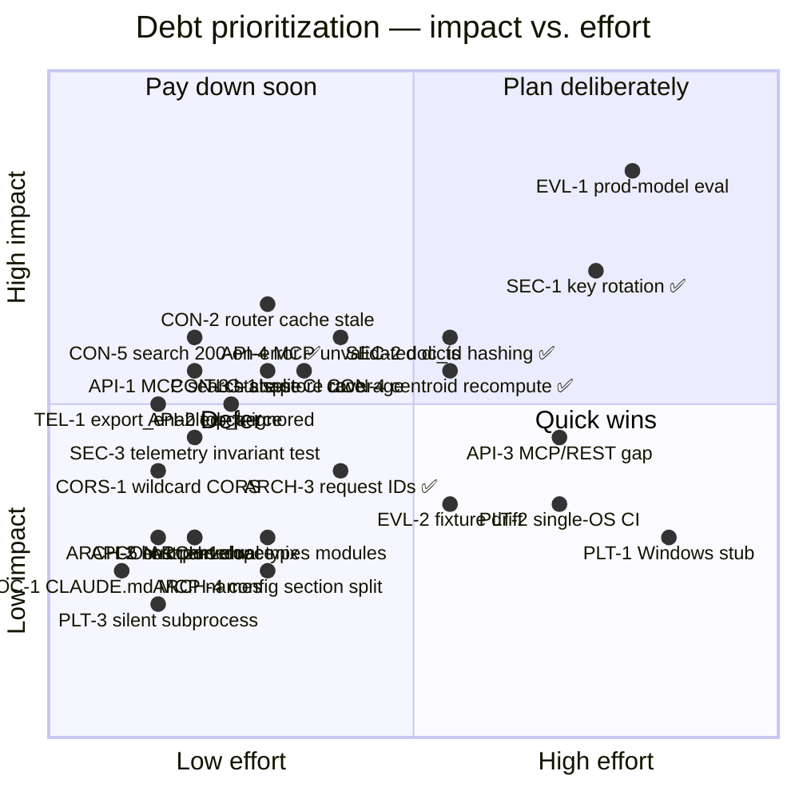

**Purpose**: Catalog known technical debt in `archon-search`, with severity, triggers, and refactor candidates, so maintainers can decide what to pay down and when.
**Audience**: Maintainers and backend engineers.
**Status**: Accepted
**Last reviewed**: 2026-05-20 / **Next review**: 2026-08-20

# Technical Debt and Refactoring Roadmap

This document is the canonical register of accepted compromises in `archon-search`. It complements the per-release [`BREAKING.md`](../../BREAKING.md) (which records contract changes that already shipped or are queued) by tracking debt that has **not yet been scheduled**.

For architectural context, see [`100_system_architecture_overview.md`](./100_system_architecture_overview.md). For the security and privacy invariants debt is measured against, see [`150_security_and_privacy_architecture.md`](./150_security_and_privacy_architecture.md). For the release flow that ships paydowns, see [`510_release_and_environment_strategy.md`](./510_release_and_environment_strategy.md).

## Principles

1. **Debt is a forecast, not a moral failing.** Every entry below was a deliberate trade-off at the time. The register exists to surface *triggers* — the conditions under which a trade-off stops paying.
2. **Every entry has a trigger and a reference.** If an item cannot point to a file path, a `BREAKING.md` entry, or a documented invariant, it does not belong here. Ungrounded debt is rumor.
3. **The eval harness is the regression gate.** Debt that bypasses [`tests/eval/`](../../tests/eval/README.md) — for example, a refactor without a metric to defend it — is high-risk by default. See [`200_testing_strategy.md`](./200_testing_strategy.md).
4. **Bias toward shipping over polishing absent measurable user pain.** A debt item without a trigger event (user report, eval regression, security finding) stays Low severity.
5. **Out-of-scope items are recorded, not hidden.** Deliberate non-goals (single-process server, no horizontal scale) live in [Out of scope](#out-of-scope) so they are not re-litigated as debt.

## Debt register

### API contract drift

| ID | Item | Category | Severity | Trigger | Refs |
| --- | --- | --- | --- | --- | --- |
| API-1 | MCP `search` tool response shape change (bare list → `{results, acl_filtered}`) is announced but not yet released. Consumers may still depend on the old shape. | API contract | Med | Tag pushed before consumers migrate. | [`BREAKING.md`](../../BREAKING.md) "[next release] — MCP `search` tool response shape"; `archon_search/server/mcp.py` |
| API-2 | REST `/search` `top_k` field still accepted by the Pydantic schema but ignored at the route. The schema documents a parameter that has no effect. | API contract | Med | Confused user report or external integration relying on per-request `top_k`. | [`BREAKING.md`](../../BREAKING.md) "[next release] — REST `/search` per-request `top_k` no longer honored"; `archon_search/server/routes_search.py`, `schemas.py` |
| API-3 | MCP-mirrors-REST aspiration is partial. MCP exposes 17 tools (as of D7: 13 original + `create_key`, `list_keys`, `revoke_key`, `rotate_key`); REST also surfaces `state`, `status`, `route`, `jobs` (list + resume), `telemetry`, and collection `reindex`/`add`/`remove`. The `GET /jobs` list and `POST /jobs/{id}/resume` endpoints have no MCP mirror yet. The naming gap compounds the drift. **D9 (shipped)** mounted the MCP HTTP app at `/mcp` on the REST port — the transport is now reachable on the shipped server and namespace-correct, but the tool-set asymmetry above is unchanged. See `Documentation/Completed/mcp-wiring-team-plan.md`. | API contract | Low | New REST endpoint added; downstream MCP client requests parity. | `archon_search/server/mcp.py`, `archon_search/server/app.py`, [`520_api_design_and_contracts.md`](./520_api_design_and_contracts.md) |
| ~~API-4~~ | ~~MCP tools return raw `dataclasses.asdict(...)` payloads without a Pydantic response model.~~ **Resolved in C7.** All 11 MCP tools now validate return values through explicit Pydantic schemas in `archon_search/server/mcp_schemas.py` (`extra='forbid'`). Schema drift surfaces as `{"error": "...", "code": "schema_validation_error"}`. See `BREAKING.md` C7 entries and `mcp_schemas.py`. | API contract | ~~Med~~ Resolved | — | `archon_search/server/mcp_schemas.py`, `archon_search/server/mcp.py` |
| API-5 | REST error responses are inconsistent: most failures raise `HTTPException` (FastAPI-serialized `{"detail": ...}`), but `routes_search.py` and `routes_collections.py` mix in hand-built `JSONResponse({"detail": ...}, status_code=...)`. Same shape today by convention, but the two paths can diverge silently. (A3 removed the mix from the pipeline-failure and timeout paths; the meta-lookup 503 and 404 paths at `routes_search.py:86-93` still use `JSONResponse`.) | API contract / Reliability | Low | Error envelope is extended (e.g., add `code` field) in one path and not the other. | `archon_search/server/routes_search.py:86-93`, `routes_collections.py`, `routes_jobs.py`; [`140_error_handling_strategy.md`](./140_error_handling_strategy.md) |

### Privacy and security

| ID | Item | Category | Severity | Trigger | Refs |
| --- | --- | --- | --- | --- | --- |
| ~~SEC-1~~ | ~~Auth middleware supports a single default key plus an optional `namespaces` map of static keys. There is no rotation, expiry, or revocation primitive — restart with a new key file is the only path.~~ **Resolved by D7**: `KeyStore` in `key_manager.py` adds durable multi-key store with `create`, `revoke`, `list_keys`, `active_keys`, `rotate_default_key`. `POST /keys/rotate`, `DELETE /keys/{id}`, `archon-search key rotate/revoke` provide live rotation and revocation without server restart. | Security | ~~Med~~ **Resolved** | — | `archon_search/key_manager.py`, `archon_search/server/routes_keys.py`, `archon_search/cli/key_cmd.py`; [`150_security_and_privacy_architecture.md`](./150_security_and_privacy_architecture.md) |
| ~~SEC-2~~ | ~~Telemetry `doc_id` is path-derived. With telemetry enabled, the JSONL log under `~/.archon-search/search-logs/` reveals filesystem paths. Documented as accepted risk; a hashed-doc-id mode is planned.~~ **Resolved by D8**: `[telemetry] hash_doc_ids = true` enables HMAC-SHA256 hashing of `result_doc_ids` before JSONL write. Salt stored at `get_data_dir()/.telemetry-salt` (mode 0600). `doc_ids_hashed: bool` field in every entry. `GET /status` exposes `telemetry.hash_doc_ids_enabled`. See `archon_search/telemetry/hasher.py`, ADR-05 Amendment. | Security | ~~Med~~ **Resolved** | — | `archon_search/telemetry/hasher.py`, `archon_search/telemetry/entry.py`, `archon_search/server/routes_status.py`; ADR [`05_opt_in_local_telemetry_no_raw_query.md`](../ADRs/05_opt_in_local_telemetry_no_raw_query.md) |
| SEC-3 | Telemetry retains the structural no-raw-query invariant; enforcement is backed by a dedicated structural test (`tests/telemetry/test_entry_factories.py::test_factory_signatures_reject_raw_query_argument`) that introspects every `TelemetryEntry` factory and forbids `{"query", "query_text", "body", "request"}` kwargs. The residual debt is that the invariant lives outside the type system — a maintainer who bypasses the factories (e.g., constructs `TelemetryEntry` directly with a renamed field) would not be caught. | Security | Low | New telemetry field requested for debugging that does not go through the factories. | `archon_search/telemetry/entry.py`; `tests/telemetry/test_entry_factories.py`; [`CLAUDE.md`](../../CLAUDE.md) "Structural invariant" |
| CORS-1 | FastAPI `CORSMiddleware` is mounted with `allow_origins=["*"]`, `allow_methods=["*"]`, `allow_headers=["*"]` and no config knob. Because the middleware short-circuits OPTIONS preflight **before** `APIKeyMiddleware` runs, CORS is the only layer governing whether arbitrary remote origins can attempt cross-origin requests on a non-loopback bind. Acceptable while the server binds to `127.0.0.1` only; becomes a CSRF/exfiltration surface as soon as the bind moves off loopback without a reverse proxy that overrides CORS headers. | Security | Low | Bind address moves off `127.0.0.1` without a hardening reverse proxy. | `archon_search/server/app.py:122`; [`Documentation/SecurityGuide/05_network_exposure_and_tls.md`](../SecurityGuide/05_network_exposure_and_tls.md); [`150_security_and_privacy_architecture.md`](./150_security_and_privacy_architecture.md) |
| SEC-4 | `pipeline.py`'s parse-failure handler does `IngestResult(..., error=str(e), code="parse_error")` where `e` is a caught `ParseError` — a wire-facing `detail`/`error` field built from `str(exc)` on a caught exception whose message can embed internals, in violation of the root `CLAUDE.md` invariant ("Never put `str(exc)` in a wire-facing `detail` or job `error` field..."). The sanitized `code="parse_error"` field already exists alongside it, so callers have a stable machine-readable signal; `error` is the free-text field that leaks. `IngestResult.error` is MCP-visible via `IngestResultSchema.from_result` (`server/mcp_schemas.py`). Found during the 2026-08-19 OCR-memory-fix cycle-1 review (C1-B-3); deliberately **not fixed** in that cycle — `IngestResult.error` is an observable wire field, so sanitizing it needs its own brief plus a `BREAKING.md` entry, not a drive-by change. The fix's own new `BrokenProcessPool` failure text was kept off this leak at the source instead (`parser.py::_PARSE_WORKER_LOST_DETAIL`), so this row is scoped to the pre-existing general case. | Reliability / Security | Low | An operator reports a parse-failure message containing an internal path/library detail they should not have seen. | `archon_search/pipeline.py` (parse-failure branch, `error=str(e)`); `archon_search/server/mcp_schemas.py` (`IngestResultSchema.from_result`); [`CLAUDE.md`](../../CLAUDE.md) "wire-facing detail" invariant |

### Telemetry / config contract

| ID | Item | Category | Severity | Trigger | Refs |
| --- | --- | --- | --- | --- | --- |
| TEL-1 | `[telemetry].export_enabled = true` is **silently coerced to `false` with a warning**, not rejected at config load. Code and [`CLAUDE.md`](../../CLAUDE.md) agree on the silent-coerce behavior; the residual debt is that this is a warn-and-continue path rather than a hard config-load failure, and downstream docs/ADRs that describe "external transmission" semantics need to be checked against the actual no-op v1 implementation. #Unverified — ADR-05 wording was not re-opened during this audit. | Reliability / Docs | Med | User reports unexpected silent demotion, or contract is cited in an audit. | `archon_search/config.py` lines 209–217; [`CLAUDE.md`](../../CLAUDE.md) "Telemetry"; [`150_security_and_privacy_architecture.md`](./150_security_and_privacy_architecture.md) |

### Platform

| ID | Item | Category | Severity | Trigger | Refs |
| --- | --- | --- | --- | --- | --- |
| PLT-1 | Windows service lifecycle is a stub. Every method on `WindowsSearchService` (`start`, `stop`, `restart`, `register`, `unregister`) raises `NotImplementedError`; only `status()` returns a `not running` shape. CLI `install`/`start`/`stop` on Windows surface the `NotImplementedError`. | Architecture | Low | First Windows user request, or a CI runner added for `win32`. | `archon_search/platform/windows.py`; `archon_search/platform/service.py` |
| PLT-2 | CI runs only on `ubuntu-latest`. macOS branches are exercised via `patch("sys.platform", "darwin")` mocks; the Windows branch is the explicit stub (PLT-1) and has no native test. The launchd/systemd integration paths are never exercised against the real OS in CI. | Testing / Reliability | Low | Native-OS regression that mocks miss (e.g., a `launchctl` flag change). | `.github/workflows/`, `archon_search/platform/{macos,linux,windows}.py`, `tests/test_service_*.py` |
| PLT-3 | `install_cmd.py` invokes `launchctl`/`systemctl` with `subprocess.run(..., check=False, capture_output=True)` and discards the result. If the helper is missing or fails, the uninstall path silently no-ops with no warning logged. | Reliability | Low | User reports an install/uninstall that "did nothing" and there is no log to triage. | `archon_search/cli/install_cmd.py` (uninstall path) |
| PLT-4 | The fasttext degrade-to-English-only path flips `is_multilingual = False` but leaves `prof` holding the multilingual profile it was resolved from. On the **reinstall** branch only, `persist_reinstall_config` → `_write_profile_config` then writes multilingual model names alongside `multilingual = false`. The fresh branch is unaffected — it re-derives via `_profile_toml(profile_name, is_multilingual, features)` and never reads `prof`. **The obvious fix is wrong and was tried and reverted:** re-resolving `prof` to the English profile makes `_check_reinstall_guard` compare an existing multilingual index against a now-English embedder, raise `NeedsForceDeleteError`, and abort the install — destroying the S11 guarantee that this path degrades rather than aborts. A correct fix has to decide what an existing multilingual index degrades to, which is an index-migration decision, not a wizard-copy one. | Reliability | Medium | A user reinstalls a multilingual install whose `lid.176.ftz` download fails, and gets a config whose embedder and `multilingual` flag disagree. | `archon_search/install/installer.py` (fasttext degrade block, `persist_reinstall_config`); `archon_search/install/prewarm.py::_check_reinstall_guard`; `Documentation/Backlog/2026-08-19-035-multilingual-graph-ner-tasks.md` BE-13 / T-4 |

### Concurrency and runtime state

| ID | Item | Category | Severity | Trigger | Refs |
| --- | --- | --- | --- | --- | --- |
| CON-1 | `archon_search/parser.py:_docling_pool` lazy-creates `self._pool` with an acknowledged check-then-set race (in-code comment, paraphrased at the time this row was written: "NOT THREAD SAFE … the RAG pipeline is sequential, so this is an accepted limitation"). The risk is dormant only as long as ingest stays single-threaded. **Restated** by the 2026-08-19 OCR-memory fix: what the race can duplicate is now the single-worker `ProcessPoolExecutor`, not the in-process `DocumentConverter` it replaced — a duplicate costs a second worker process rather than a second docling model stack inside the server process. **Update 2026-08-19 (cycle-1 review):** the "sequential pipeline" premise was found to be false — `Documentation/Backlog/2026-08-19-060-ingest-job-level-lock-dropped-brief.md` item 3 documents that concurrent ingest jobs call `parser.parse()` from multiple `asyncio.to_thread` workers today, because job-scope exclusivity is released before dispatch (`server/routes_jobs.py`). The quoted in-code comment above no longer exists verbatim; `_docling_pool` now guards the check-then-set with a double-checked `threading.Lock` (`self._pool_lock`), and `_parse_with_docling`'s `BrokenProcessPool` handler compares pool identity before clearing `self._pool` so it cannot orphan a replacement another thread already installed. This row's race is resolved; see `archon_search/parser.py::_docling_pool` for the current comment. | Reliability | Low | Parallel ingest path added (e.g., `asyncio.gather` over images). | `archon_search/parser.py` `_docling_pool` |
| CON-6 | `DocumentParser.parse` dispatches every handler through `asyncio.to_thread`, so a docling parse now blocks a thread of the event loop's **shared default** `ThreadPoolExecutor` for its queue wait *plus* its parse, behind a `max_workers=1` pool. Before the 2026-08-19 OCR-memory fix, N concurrent parses did N concurrent conversions; now they serialize, so thread occupancy is N x per-file parse time rather than 1x — on the same pool (`min(32, cpu_count+4)`) every other `asyncio.to_thread` caller draws from, including the search path. Found in the cycle-2 review (C2-B-6) and deliberately **not fixed**: the remedy restructures `parse()`'s dispatch to special-case two of five formats, and exposure is bounded today (~18 threads here, `[jobs].max_concurrent_bulk` defaults to 1). Distinct from the declined `.result()`-timeout question — this is about *where the wait is parked*, not how long it may last. | Performance | Low | Ingest concurrency raised (`[jobs].max_concurrent_bulk > 1`), or a corpus of large scanned PDFs stalling unrelated request handling. | Candidate remedy: `await asyncio.wrap_future(pool.submit(...))` from `parse()` for the docling formats, or give `DocumentParser` its own small `ThreadPoolExecutor`. `archon_search/parser.py` `parse` / `_parse_with_docling` |
| CON-2 | **Addressed by A6.** `MultiCollectionRouter` now exposes `invalidate()` (clears `_cached_metadata`; idempotent) and an `initial_metadata` constructor param; the eval harness injects metadata via the constructor instead of writing the private `_cached_metadata`. The originally documented "stale centroids until restart" symptom does **not** occur in the FastAPI `/route` path, which builds a fresh router per request (`routes_route._build_router`) — now pinned by a regression test. `invalidate()` ships as pre-emptive API for a future shared-router migration; the in-flight-fetch TOCTOU residual is documented on the method. | Reliability | Med (resolved) | A future shared, long-lived router instance must call `invalidate()` after collection mutations or the stale-centroid symptom reappears. | `archon_search/router.py` (`invalidate`, `initial_metadata`, `_cached_metadata`, `fetch_metadata`); [`210_performance_and_scalability.md`](./210_performance_and_scalability.md) |
| CON-3 | **Closed by A6.** `IndexingStateStore` (`progress.py`) is now thread-safe: `write` / `update_collection` / `remove_collection` / `set_trigger` and the new `reset_in_progress(predicate)` are serialized by an internal `threading.RLock`; `read()` is an unlocked snapshot. The cross-collection lost-update race on the shared `.indexing_state.json` is gone — concurrent collection writers no longer clobber each other. `sync._reset_stale_in_progress` now delegates to the locked `reset_in_progress(...)` (no more call-site read→modify→write). **Durability under power-loss is still open** (owned by A7/fsync); A6 fixed consistency only. | Reliability | Med (resolved; durability tracked by A7) | Two collections sync concurrently; previously one writer overwrote the other's update — now serialized. | `archon_search/progress.py` (`IndexingStateStore.write`, `update_collection`, `remove_collection`, `set_trigger`, `reset_in_progress`); `archon_search/sync.py` (`_reset_stale_in_progress`) |
| CON-4 | **Resolved by B5.** Three concrete defects existed: (1) ingest performed a batch-only centroid overwrite — the centroid was recomputed from all vectors on every ingest batch, costing O(chunks); (2) delete did not update the centroid at all, leaving the routing centroid stale after deletions; (3) the watcher-sync hot path triggered a full O(chunks) rescan on every sync cycle. B5 fixes all three: ingest is now O(batch) via `(centroid_sum, chunk_count)` incremental maintenance; delete updates the centroid O(chunks-in-document); the O(chunks) full scan is retained only for explicit `recompute_collection_meta` calls (reindex, crash recovery, periodic drift reset). The `centroid_incremental_enabled` feature flag (removed in D4) was the escape hatch; it is no longer needed. | Performance | Med (resolved) | Reopen if incremental maintenance introduces centroid drift beyond the accepted threshold; trigger is `needs_recompute = True` on more than a configurable fraction of collections. | `archon_search/store.py` (`_meta_schema`, `update_collection_meta`, `delete_document`); `archon_search/pipeline.py` (`recompute_collection_meta`); [`210_performance_and_scalability.md`](./210_performance_and_scalability.md) |
| CON-5 | **Resolved in A3**: `routes_search.py` previously returned **200 OK with empty `results`** when a pipeline stage raised an exception — pipeline failure was logged at `warning` and silently downgraded to `SearchResponse(results=[], acl_filtered=False)`, so clients could not distinguish "no hits" from "search broke". Now returns HTTP 500 on pipeline stage failure (bare re-raise) and HTTP 504 on timeout; telemetry is emitted on both failure paths. (resolved in A3; see [`BREAKING.md`](../../BREAKING.md) `[next release]` — `POST /search` pipeline-exception behavior) | Reliability / API contract | ~~Med~~ Done | Would have caused silent empty-result regressions before the A3 fix — a downstream LanceDB/embedder fault produced user-visible recall drops with no error signal. | `archon_search/server/routes_search.py`; [`140_error_handling_strategy.md`](./140_error_handling_strategy.md) |

### Eval and CI

| ID | Item | Category | Severity | Trigger | Refs |
| --- | --- | --- | --- | --- | --- |
| EVL-1 | The eval harness uses deterministic, label-blind, SHA-256-derived embedder and reranker backends (`EvalEmbedderBackend`). Latency p50/p95 thresholds are a regression guard, not a production SLA, and recall/NDCG are computed against stub scoring — production-model evaluation is **not** in CI. | Testing | High | Production-model regression that the harness misses; any change to ranking heuristics. | `archon_search/eval/backends.py`; [`tests/eval/README.md`](../../tests/eval/README.md); [`210_performance_and_scalability.md`](./210_performance_and_scalability.md) |
| EVL-2 | Eval fixtures (`documents.jsonl`, `queries.jsonl`, `labels.jsonl`) and `thresholds.toml` evolve by waiver. The maintenance burden grows with corpus size and there is no automated drift check between fixture corpus and production-shape corpora. | Testing | Low | Fixture set grows past the point a human can review threshold deltas confidently. | `tests/eval/README.md` ("threshold-lowering policy, waivers") |
| TLG-1 | `--cov-fail-under=85` is enforced only on the default `pytest` invocation. Split-CI matrices must `coverage combine` before applying the threshold; the discipline is convention, not a check. A future split-CI workflow that forgets to combine silently reports false-green coverage. | Tooling | Med | New CI matrix added (OS, Python version) without a combine step. | `pyproject.toml` (`addopts` comment lines 55–61); [`CLAUDE.md`](../../CLAUDE.md) "Repository conventions"; [`200_testing_strategy.md`](./200_testing_strategy.md) |
| TLG-2 | The `archon-search-pr.yml` real-model cache steps (fastembed, graph NER) each hardcode their model name/revision into the `actions/cache` `key`, guarded only by an adjacent comment ("update whenever X changes") — no repo-guard test asserts the key still matches the live constant. A revision bump in `archon_search/paths.py` without a matching workflow edit silently restores stale cached weights every run (the key still matches, so the cache is never invalidated or re-saved). The two existing cache steps also use two different key-versioning conventions (a manual `-v1` suffix vs. baking the full revision hash into the key), which should converge on one. Found reviewing T-8's graph-NER cache step (2026-09-06); the fastembed cache predates it with the same unguarded pattern. | Reliability | Med | A pinned model name or revision constant changes without the matching cache `key:` line changing in lockstep. | `.github/workflows/archon-search-pr.yml` (fastembed cache ~line 39, graph NER cache ~line 90); `archon_search/paths.py` (`GRAPH_NER_MODEL_NAME`/`GRAPH_NER_MODEL_REVISION`) |
| TLG-3 | `archon-search-pr.yml`'s two model-prefetch steps (fastembed, graph NER) duplicate an identical 13-line retry-with-backoff shell block verbatim — only the inner `python -c` payload differs — and the step is labeled "exponential backoff" while the sleep schedule (`attempt * 5` → 5/10/15s) is actually linear. Their paired "verify tests ran" junitxml-parsing one-liners are likewise duplicated verbatim (now correct in both copies — see the fixed `.find('testsuite')` comment at each — but still two copies of one check). Both prefetch defects now exist twice; a third lane would make it three. Not introduced by T-8's graph-NER steps — they mirror the pre-existing `live_benchmark` steps per that task's explicit "mirror `live_benchmark`" instruction — but it is real, growing duplication worth extracting (e.g. a shared `.github/scripts/prefetch-with-retry.sh` and a shared junitxml-check script, or composite actions) the next time either pair needs to change. | Code Quality | Low | A third real-model prefetch lane is added, or either step pair's logic needs a fix. | `.github/workflows/archon-search-pr.yml` (fastembed prefetch ~line 48 / graph NER prefetch ~line 102; fastembed junitxml-check ~line 84 / graph NER junitxml-check ~line 135) |

### Schema versioning

| ID | Item | Category | Severity | Trigger | Refs |
| --- | --- | --- | --- | --- | --- |
| SCH-1 | The LanceDB metadata table has no `schema_version` column. Column-absent rows are tolerated at read time by treating missing columns as `None` (e.g., `description_embedding` added in B4, previously `acl`, `centroid`, `description`). Each new optional column adds another "absent = None" tolerance site with no version invariant to gate on. B4 adds one more such site (`description_embedding`); B5 (incremental centroid `sum`/`count`) and B6 may add more. Once two or more columns are absent-tolerant simultaneously, a `schema_version` marker becomes a prerequisite for safe migration ordering and for detecting partially migrated stores. | Architecture / Data | Low | B5 or B6 ship a new column; the absent-column list exceeds two entries; or a store-migration bug silently leaves a store in an intermediate state with no detectable version signal. | `archon_search/collection_meta.py` (`description_embedding`), `archon_search/store.py` (metadata table reads); `Documentation/Architecture/130_data_architecture_and_persistence.md` |

### Internal architecture

| ID | Item | Category | Severity | Trigger | Refs |
| --- | --- | --- | --- | --- | --- |
| ARCH-1 | Two parallel domain-types modules: `archon_search/_types.py` (search/ingest results) and `archon_search/types.py` (jobs/queries/collection facade). Importers must remember which symbols live where, and there is no rule that distinguishes them. Consolidation is low-risk (incremental re-export). | Architecture / Docs | Low | New domain type lands in the wrong module and triggers an import-shuffle PR. | `archon_search/_types.py`, `archon_search/types.py`; [`110_component_catalog_and_layer_breakdown.md`](./110_component_catalog_and_layer_breakdown.md) |
| ARCH-2 | **Resolved in C9 (Task 1.1).** `load_config()` now reads `ARCHON_SEARCH_HOST` (any non-empty string) and `ARCHON_SEARCH_PORT` (int 1–65535) env vars; precedence is env > TOML > default. The `FileNotFoundError` early-return was converted to a fall-through so env vars apply even when no TOML file is mounted (the standard container path). See `archon_search/config.py` (`load_config`, `_apply_env_overrides`) and `tests/test_config_env_overrides.py`. | Operations / Architecture | ~~Low~~ Done | — | `archon_search/config.py` (`_apply_env_overrides`); [`160_operational_readiness_monitoring_and_reliability.md`](./160_operational_readiness_monitoring_and_reliability.md) |
| ARCH-2a | `load_config(path, *, serve: bool = False)` accepts a CLI-layer concern (`serve` mode flips the host default to `0.0.0.0` before TOML/env processing) in the config layer. This is an intentional short-cut for C9 to keep the foreground/container path one line; the cleaner alternative is a sentinel for "was this value explicitly set?" applied by the caller after `load_config()` returns. | Architecture / Config | Low | Another deployment mode needs a different host default (e.g., systemd socket activation), forcing a second kwarg. | `archon_search/config.py` (`load_config` `serve` kwarg); `archon_search/cli/serve.py` (planned in C9 Task 3.1) |
| ARCH-3 | **Resolved in B1 (2026-05-26).** `RequestContextMiddleware` (`server/middleware_context.py`) now mints or validates an `X-Request-ID` on every HTTP request and writes the correlation ID into a `ContextVar`. Structured log lines emitted by `/search`, `/route`, `/explain`, and the MCP tools carry `correlation_id`; the `TelemetryEntry` schema also records it. `bind_stage_recorder()` + `record_stage()` accumulate per-stage wall-time timings available via `StageRecorder.stage_timings_ms`. See `archon_search/observability.py`. | Observability | ~~Low~~ Done | — | `archon_search/observability.py`, `archon_search/server/middleware_context.py`; [`160_operational_readiness_monitoring_and_reliability.md`](./160_operational_readiness_monitoring_and_reliability.md) |
| ARCH-4 | Search-execution config keys are split across two TOML sections. `top_k_retrieve` / `top_k_return` (which also drive the multi-collection per-leg `candidate_depth = max(top_k_retrieve * 3, 20)`) live under `[database]`, while B3's fan-out keys (`max_fanout`, `fanout_leg_trim`, `fanout_timeout_seconds`) live under `[search]`. Operators tuning fan-out recall/latency must edit two sections, and the split obscures that `[database]` keys govern retrieval behavior, not storage. A future cleanup should migrate all search-execution parameters under `[search]` (with back-compat reads from `[database]`). | Architecture / Config | Low | Operator confusion tuning fan-out, or a new search-execution key lands in the "wrong" section. | `archon_search/config.py` (`[database]` block parsing `top_k_*`, `[search]` block parsing `max_fanout`/`fanout_leg_trim`/`fanout_timeout_seconds`); [`210_performance_and_scalability.md`](./210_performance_and_scalability.md) |

### CLI performance

| ID | Item | Category | Severity | Trigger | Refs |
| --- | --- | --- | --- | --- | --- |
| CLI-1 | ~~**RESOLVED (feature 210):** `collection list` and `collection info` now open `SearchStore` directly via `_make_store()` instead of calling `create_pipeline()`, eliminating the GPT-2 tokenizer cost (~1 s). The remaining floor is the `lancedb` first-import (~900 ms). Lazy chunker init in `SearchPipeline` is still deferred (wider blast-radius) but no longer blocks these commands.~~ | Performance | Resolved | — | `archon_search/cli/collection.py` (`_make_store`, `list_cmd`, `info`); [2026-07-15-210-cli-store-commands-slow-brief.md](../../Documentation/Completed/2026-07-15-210-cli-store-commands-slow-brief.md) |

### Query expansion provider matrix

| ID | Item | Category | Severity | Trigger | Refs |
| --- | --- | --- | --- | --- | --- |
| ~~QE-1~~ | ~~HyDEGenerator and RAGFusionGenerator were coupled to a single provider (`AnthropicQueryExpansionProvider`) — operators had no way to use a local or alternative LLM without patching source code.~~ **Resolved in G10, extended by C15/LLCP.** `QueryExpansionProvider` protocol defined in `query_expansion_protocol.py`; `OllamaQueryExpansionProvider` (BE-3), `OpenAIQueryExpansionProvider` (BE-6), `ClaudeCLIQueryExpansionProvider` (subprocess-based, uses Claude Code's own login, no API key), and `LlamaCppQueryExpansionProvider` (LLCP BE-2; local llama-server via `httpx`, no API key) all added in `archon_search/providers/`; `[hyde].provider` / `[rag_fusion].provider` TOML fields route to the correct adapter at startup via a single authoritative `_PROVIDER_REGISTRY` in `config.py` (LLCP BE-1 centralization); wizard (`archon-search wizard`) prompts for provider, model, and Ollama/llama-server base URL; `ConfigError` raised at startup when the required package is missing; `GET /status` exposes `hyde.provider` and `rag_fusion.provider` plus `llama_cpp_ok` (LLCP BE-9 non-blocking reachability probe). Setting `provider = "ollama"` or `"llama_cpp"` achieves zero-transmission operation (query text never leaves the host). | Architecture / Ops | ~~Med~~ **Resolved** | — | `archon_search/query_expansion_protocol.py`; `archon_search/providers/`; `archon_search/config.py` (`HyDEConfig.provider`, `RAGFusionConfig.provider`, `_PROVIDER_REGISTRY`); `archon_search/server/app.py` (`_check_provider_deps`, `_build_query_expansion_provider`); `archon_search/install/config_writer.py` (`WizardFeatures`); `archon_search/server/schemas.py` (`HydeStatusDetail.provider`, `RagFusionStatusDetail.provider`) |

### Graph retrieval

| ID | Item | Category | Severity | Trigger | Refs |
| --- | --- | --- | --- | --- | --- |
| ~~GRAPH-1~~ | ~~Naive graph expansion (`graph_mode="naive"`) had no upper bound on the number of first-degree neighbour names appended to the query. Very high-degree graph nodes ("god" entities connected to hundreds of nodes) produced unbounded FTS queries, degrading precision and increasing latency.~~ **Resolved in E2h BE-8.** `GraphExpander` now caps the neighbour-name list at `[graph].naive_max_expansion_terms` (default `20`) before deduplication. See `BREAKING.md` "[next release] — E2h BE-8: naive graph expansion is now capped". | Performance / Reliability | ~~Med~~ **Resolved** | — | `archon_search/graph_expander.py` (`_naive_max_expansion_terms`); `archon_search/config.py` (`GraphConfig.naive_max_expansion_terms`); `BREAKING.md` E2h BE-8 entry |
| ~~GRAPH-2~~ | ~~`LLMEnrichmentClientProtocol` and its sole concrete adapter (`AnthropicEnrichmentClient`, from E2i BE-0) were orphaned — no factory constructed it, and both call sites were stubs: `CommunityBuilder._generate_llm_summary` raised `NotImplementedError` (caught and logged, falling back to MMR-only summaries), and `GraphExtractor.extract`'s inline LLM-relationship path logged a WARNING and fell back to spaCy-only co-occurrence edges — so LLM-backed graph enrichment was unreachable in v1 despite having a tested client.~~ **Resolved in LLCP BE-7.** `EnrichmentClientFactory` (`archon_search/enrichment/factory.py`) routes the new discrete `[graph].provider` field to one of four concrete adapters (`archon_search/enrichment/`: `anthropic.py`, `ollama.py`, `openai.py`, `llama_cpp.py`) and is injected into both `CommunityBuilder` and `GraphExtractor` at startup (`server/app.py`). `provider=None` (default) or `"claude_cli"` (no v1 HTTP enrichment client) both return `None` — enrichment silently skipped, air-gap preserved. **Superseded in part by BE-17:** the LLM relationship-labelling half was removed — `label_relationships`, its `GraphExtractor` call site, and the `enrichment_client` injection into `GraphExtractor` are deleted; the factory now injects into `CommunityBuilder` only, and typed relationship edges are produced locally by the graph engine (see ADR 12). | Architecture | ~~Med~~ **Resolved** | — | `archon_search/graph_enrichment_protocol.py`; `archon_search/enrichment/`; `archon_search/community_builder.py` (`_generate_llm_summary`); `archon_search/server/app.py` |
| ~~GRAPH-3~~ | ~~**The prose graph NER seam was a silent production no-op** — real documents yielded zero entities and zero relations while the ingest reported success, so every graph mode ran against an empty graph. Two defects on the same seam, both in the prompt label lists sent to `gliner`. **(1) The `"other"` decoy dominated inference.** `_ENTITY_LABELS` appended a bare `"other"` label (Q3) alongside the four descriptive real labels; against the pinned checkpoint that bare label absorbed nearly every real span, which the `_REAL_ENTITY_LABELS` filter then correctly — and fatally — discarded. **(2) Descriptive relation labels returned nothing.** `_RELATION_LABELS` was built with `_labels_with_descriptions(...)`, i.e. the `label <> description` form; the pinned checkpoint returns ZERO relations for that form, so even entity-bearing chunks produced no typed edges. Neither defect was reachable by the unit suite: every test stubs `gliner` at the module boundary and asserts the adapter's own filtering, so the label strings' effect on real inference was never exercised. The spike had in fact already recorded the decoy over-triggering under a description-carrying prompt form (tasks file, K2c findings, 2026-08-23), but that observation was attributed to the ONNX export and did not block the shipped configuration.~~ **Resolved 2026-09-06.** `_ENTITY_LABELS` drops the decoy (descriptive real labels only) and `_RELATION_LABELS = list(_RELATION_LABEL_DESCRIPTIONS)` prompts relations **bare**; that combination was measured against the pinned checkpoint to yield real entities *and* typed relations where the shipped configuration yielded zero relations. `_RELATION_LABEL_DESCRIPTIONS` is retained as the documented meaning of each label, no longer as prompt text. Guarded by `tests/test_graph_ner_real_artifact_lane.py::test_graph_ner_lane_non_vacuity`, which drives the real model and fails on a vacuous extraction. **Filed retroactively:** a prior task (T-8) reported filing this entry but never did — the row is recorded here so the defect has a permanent home even though it shipped fixed. | Correctness / Graph | ~~High~~ **Resolved** | — | `archon_search/prose_extraction_backend.py` (`_ENTITY_LABELS`, `_RELATION_LABELS`, `_REAL_ENTITY_LABELS`, `_labels_with_descriptions`); `archon_search/graph_extractor.py`; `tests/test_graph_ner_real_artifact_lane.py`; [`2026-08-19-035-multilingual-graph-ner-team-plan.md`](../Backlog/2026-08-19-035-multilingual-graph-ner-team-plan.md) Q3 |
| GRAPH-4 | The `graph_real_artifact` lane — the only guard that drives the real GLiNER checkpoint and fails on a vacuous extraction (`tests/test_graph_ner_real_artifact_lane.py::test_graph_ner_lane_non_vacuity`) — runs in the PR gate only ([`archon-search-pr.yml`](../../.github/workflows/archon-search-pr.yml)`:133`, trigger `pull_request`). The release workflow excludes the marker at both of its pytest steps ([`archon-search-release.yml`](../../.github/workflows/archon-search-release.yml)`:51`, `:62`) and adds no lane step, so a tag pushed from a commit that never went through a PR publishes to PyPI with zero real-model coverage. This is the exact gap that let GRAPH-3 ship silently. Not fixed inline with GRAPH-3 because adding the lane to release is a CI cost/policy decision (a ~1.2 GB artifact download and 3-5 min per run on the release path, and a new way for a publish to block), not a code fix. | Testing / Release | High | A tag pushed from a commit that did not pass the PR gate. | [`archon-search-release.yml`](../../.github/workflows/archon-search-release.yml); [`archon-search-pr.yml`](../../.github/workflows/archon-search-pr.yml)`:133`; `tests/test_graph_ner_real_artifact_lane.py` |

### Documentation

| ID | Item | Category | Severity | Trigger | Refs |
| --- | --- | --- | --- | --- | --- |
| DOC-1 | The MCP tool surface is documented in three places (`mcp.py`, `CLAUDE.md`, and the API reference at [`600_api_reference_or_public_interface.md`](./600_api_reference_or_public_interface.md)). As of D1/D2 all three agree on the 13 tool names. The residual debt is that this consistency is convention, not enforced — any new MCP tool added to `mcp.py` without updating `CLAUDE.md` and the API reference re-introduces the drift. | Docs | Low | New MCP tool added without updating `CLAUDE.md` and the API reference. | `archon_search/server/mcp.py`; [`CLAUDE.md`](../../CLAUDE.md) "MCP tools" |
| DOC-2 | **E2a: `scope_filter` validation is triplicated** — `_check_scope_filter` is implemented independently in `routes_search.py:39`, `routes_explain.py:53`, and a parallel `_validate_scope_filter` in `mcp.py:128`. All three enforce the same regex-based rules (reject bare `*`, leading `*`, mid-string `*`, multiple `*`). Any change to the validation rule (e.g., new allowed characters, max length) must be applied in all three locations — a missed site silently creates an inconsistency between REST and MCP. Extract to a shared `_validate_scope_filter(value: str) -> None` utility in `store_filters.py` or a new `archon_search/server/_validators.py`. | Code Quality | Low | Validation rule change required (e.g., allow `.` in scope names, max-length constraint added). | `archon_search/server/routes_search.py:39`; `archon_search/server/routes_explain.py:53`; `archon_search/server/mcp.py:128` |

### Test guards

| ID | Item | Category | Severity | Trigger | Refs |
| --- | --- | --- | --- | --- | --- |
| TEST-2 | `find_marker_tests_missing_xdist_group` (and its sibling `assert_marker_excluded_on_step_lines`) live in `tests/test_parser_ocr_memory.py` — a module about docling OCR memory behavior — and are imported cross-module by `tests/test_removed_engine_repo_guard.py` for the `graph_real_artifact` lane's own guard. A third lane would add a third cross-module import. Separately, the scan matches only an exact `@pytest.mark.<marker>` line (`line.strip() != decorator`); a commented, parenthesized (`@pytest.mark.<marker>()`), or module-level `pytestmark = [...]` form is invisible to it and would pass vacuously — pre-existing in the `docling` guard this was generalized from, not introduced by T-8, but now covers the more expensive (`~1.2 GB`) miss too. Found reviewing T-8 (2026-09-06). | Code Quality | Low | A third xdist-group-guarded lane is added, or a marked test uses a non-bare-decorator form and the guard needs to actually catch it. | `tests/test_parser_ocr_memory.py` (`find_marker_tests_missing_xdist_group`, `assert_marker_excluded_on_step_lines`); `tests/test_removed_engine_repo_guard.py` |
| ~~TEST-1~~ | ~~**The English-only wording has no guard in the graph-enabled configurations.** MGE S57 deleted four `ENGLISH_ONLY_DISCLOSURE`-pinning tests from `test_install_ui.py` on the stated basis that "the absence of English-only wording in any configuration is S42(1)'s repository-wide scan to prove". S42(1) does not prove it: `_ENGINE_PATTERN` is `re.compile(r"spacy\|en_core_web_sm\|_LABEL_TO_ENTITY_TYPE", re.IGNORECASE)` and never matches `English-only` or `ENGLISH_ONLY_DISCLOSURE`. The only surviving assertion is `test_wizard_summary_no_english_only_note_when_graph_disabled`, which covers the graph-**disabled** summary alone — the graph-**enabled** configurations, where the deleted disclosure actually rendered, are unguarded.~~ **Resolved in MGE T-6.** `test_e2e_rendered_transcript_names_no_removed_engine` (`tests/test_e2e_wizard_optional_features.py`) asserts the deleted disclosure's own phrase — `"prose entity extraction is English-only"`, verbatim from the FE-3 deletion (commit `5838760a`) — absent from the **rendered** transcript of a graph-enabled wizard run, parametrized over both the multilingual and the English profile, and anchored on FE-3's replacement bullet being present so the absence cannot pass on a transcript where the summary never rendered. It deliberately does **not** pin the bare substring `English-only`, which two live legitimate strings also contain (`render.py:186`, `config_writer.py:449`) and which would therefore fire on a fasttext failure instead. The S42 pattern is left unwidened: it stays the removed-engine scan, and the English-only property is guarded where it is actually rendered. **Scope of the closure, stated rather than overclaimed:** this guards the disclosure's *rendering site* (`_render_summary`'s graph bullets), which is where it lived and where a reintroduction would land. It does not re-create the four deleted unit assertions one-for-one, and the original text rendered only under `if multilingual:` — so the English-profile leg guards FE-3's de-nesting rather than the original conditional. Raised and narrowed during T-6 review. | Testing | ~~Low~~ **Resolved** | — | `tests/test_e2e_wizard_optional_features.py` (`test_e2e_rendered_transcript_names_no_removed_engine`); `tests/test_graph_ner_model_visibility.py` (`test_wizard_summary_no_english_only_note_when_graph_disabled`, the graph-disabled half); [`2026-08-19-035-multilingual-graph-ner-team-plan.md`](../Backlog/2026-08-19-035-multilingual-graph-ner-team-plan.md) S57 |

### In-code debt markers

A repository-wide `grep -RIn "TODO\|FIXME\|XXX\|HACK" archon_search/` returns one match as of 2026-05-22: `archon_search/server/routes_search.py:15` — `# TODO: make configurable via config.py (see /route for parity)` — for the `_SEARCH_TIMEOUT_SECONDS = 30.0` constant (added in A3). This is ARCH-2-adjacent (no env override for a timeout constant). The only in-code self-warning predating A3 is the `# NOT THREAD SAFE` comment in `parser.py` captured as CON-1 above. The items above otherwise derive from documented contracts, configuration coercion, stub modules, or runtime patterns surfaced by audit rather than from `TODO`-style markers.

## Prioritization matrix

Resolved by A6: **CON-2** (router cache invalidation API + per-request lifecycle pinned), **CON-3** (state-store RLock; durability still tracked under A7). Resolved by B1: **ARCH-3** (correlation ID + stage-latency surface). Resolved by B5: **CON-4** (incremental centroid maintenance; three defects fixed). Resolved by C9: **ARCH-2** (host/port env overrides), and the C9 brief's separate "ARCH-3" relocatable-path-root item (delivered as `paths.get_data_dir()` + lazy accessors in `key_manager`, `jobs`, `language_detector`, `cli/ingest.py`, and `config.load_config()`). Quick wins (low effort, mid-to-high impact): **TEL-1**, **DOC-1**, ~~**CON-5**~~ (resolved in A3), **API-1/API-2** (already on the next-release queue). Plan deliberately (high effort, high impact): **EVL-1**, ~~**SEC-1**~~ (resolved by D7), ~~**SEC-2**~~ (resolved by D8), **API-3**, **API-4**. Defer until a trigger fires: **PLT-1**, **PLT-2**, **PLT-3**, **CON-1**, **EVL-2**, **ARCH-1**.

## Planned refactors

- **Decide whether `export_enabled = true` should hard-fail at config load** (TEL-1). Current behavior (warn + coerce to `false`) is what `CLAUDE.md` describes; if ADR-05 prescribes "reject at load", reconcile in a single PR.
- **Ship the queued breaking changes** (API-1, API-2). Both are already in [`BREAKING.md`](../../BREAKING.md); they paydown on the next tagged release via [`release.sh`](../../release.sh).
- ~~**Hashed `doc_id` mode for telemetry** (SEC-2). Track in [`Backlog/`](../Backlog/) once a concrete request arrives; ADR-05 is the design anchor.~~ **Resolved by D8** — `[telemetry] hash_doc_ids = true` applies HMAC-SHA256 to `result_doc_ids` before JSONL write. See `archon_search/telemetry/hasher.py` and ADR-05 Amendment.
- **Production-model eval lane in CI** (EVL-1). Likely a `live`-marker job that runs on tag pushes only, gated by [`tests/eval/thresholds.toml`](../../tests/eval/thresholds.toml). See the long-form plan in [`Backlog/03_world_class_roadmap.md`](../Backlog/03_world_class_roadmap.md) (graph track E2b–E2j complete as of 2026-07-12).
- ~~**Multi-key auth with rotation** (SEC-1). Builds on the existing `namespaces` map in `middleware_auth.py`; needs a key-file format that supports expiry and revocation.~~ **Resolved by D7** — see `archon_search/key_manager.py` (`KeyStore`), `routes_keys.py`, `cli/key_cmd.py`.
- **Lint/test that gates MCP tool name parity across `mcp.py`, `CLAUDE.md`, and the API reference** (DOC-1). Pair with API-3 review.
- ~~**Decide search-failure semantics** (CON-5). Either propagate a 5xx with the standard error envelope, or document that empty `results` + `acl_filtered=false` is the failure signal. Whichever wins, encode it in `routes_search.py` and a test.~~ **Done in A3** — pipeline exceptions now return HTTP 500 / 504; see [`BREAKING.md`](../../BREAKING.md) `[next release]` — `POST /search` pipeline-exception behavior.
- ~~**Invalidate `MultiCollectionRouter._cached_metadata` after collection mutations** (CON-2).~~ **Addressed by A6**: `invalidate()` and `initial_metadata` shipped, the eval path no longer writes the private cache, and the FastAPI per-request router lifecycle is pinned by a regression test. Wiring `invalidate()` into a future shared, long-lived router is the remaining follow-up.
- ~~**Close the cross-collection race on `.indexing_state.json`** (CON-3).~~ **Closed by A6**: `IndexingStateStore` now serialises all mutating methods with an internal `threading.RLock`, and `sync._reset_stale_in_progress` delegates to the locked `reset_in_progress(...)`. Durability under power-loss (fsync) remains open and is tracked under A7.
- **Wrap MCP responses in Pydantic models** (API-4). Reuse the REST `response_model` schemas (`SearchResponse`, `CollectionMeta`, etc.) so that MCP and REST share the validation gate.
- ~~**Incremental centroid update** (CON-4).~~ **Resolved by B5**: ingest is O(batch) via `(centroid_sum, chunk_count)` incremental maintenance; delete updates the centroid O(chunks-in-document); O(chunks) full scan retained only for explicit `recompute_collection_meta` (reindex, crash recovery, drift reset). The `centroid_incremental_enabled` escape-hatch flag was removed in D4; the incremental path is now unconditional.

- **`ProvisionFailureKind.conflicting_onnx_runtimes` is overloaded** (INST-1). `install/device_probe.py:114,118` repurposes it as a generic "device unavailable" category, so a step-down on a host with no accelerator is indistinguishable from S33's genuine dual-ONNX-runtime conflict. The category is frozen against contract C4 (`provisioning.py:21-35`), so splitting it needs a contract change, not a local edit. Raised during FE-5 review; the overload predates FE-5 and was introduced with the probe itself (BE-14).
- **Wizard functions past the maintainability threshold** (INST-2). `installer.py::BaseInstaller.run` (~510 lines), `wizard.py::_prompt_optional_features` (~289 lines, 40+ branches), and `prewarm.py::_execute_force_reinstall` (18+ branches) are all well over the limits [`2026-09-05-core-module-complexity-refactor.md`](../Backlog/2026-09-05-core-module-complexity-refactor.md) applies to the core modules; that backlog item does not cover `install/`. Raised during FE-5 review — FE-5 added ~15 lines to `run()` but none of these functions crossed a threshold because of it.
- **The graph device-probe failure renders a category with no remedy** (INST-3). `installer.py::_configure_graph_providers` (`:490-494`) reports its failure as a bare `logger.warning("Graph accelerator not validated (%s) …", result.failure)` — the raw enum token, no remedy. Every other provisioning category goes through `render.py::_render_provision_failure` (`:181-188`), which attaches a distinct sanitized remedy from `_PROVISION_REMEDIES`; that map has no `conflicting_onnx_runtimes` entry at all. The team plan's Presentation "Done when" (`2026-08-19-035-multilingual-graph-ner-team-plan.md:776`) lists S33 among the scenarios whose categories must render "sanitized, **remedy-bearing**", so the sanitized half holds and the remedy half does not. Raised during T-6 review; the gap is FE-4/FE-5 production behaviour, not test scope — T-6 is a tester task and asserts only that the category reaches the operator (S33, plan `:846`). Fixing it means one `_PROVISION_REMEDIES` entry plus routing that warning through the shared renderer.
- **Component catalog is missing the newer install modules** (DOC-1). `110_component_catalog_and_layer_breakdown.md` has no rows for `install/device_probe.py`, `install/provisioning.py`, or `torch_device.py`. Raised during FE-5 review; all three landed with earlier tasks (BE-3/BE-14), so backfilling them belongs with that feature's close-out doc sweep rather than a single frontend task.

## Out of scope

The following look like debt but are deliberate design choices. They are recorded here so they are not re-opened without a new ADR.

- **Single-process local server, no horizontal scale.** Runtime state under `~/.archon-search/` is local-only; LanceDB is opened by a single process. See ADR [`01_lancedb_as_local_vector_store.md`](../ADRs/01_lancedb_as_local_vector_store.md) and [`210_performance_and_scalability.md`](./210_performance_and_scalability.md).
- **Opt-in, local-only telemetry.** No external transmission, no third-party sinks. See ADR [`05_opt_in_local_telemetry_no_raw_query.md`](../ADRs/05_opt_in_local_telemetry_no_raw_query.md).
- **CalVer with no compatibility signal in the version string.** [`BREAKING.md`](../../BREAKING.md) is the compatibility contract; the version is time-only by design.
- **Two-stage retrieval (dense + cross-encoder).** Replacing the second stage is a design change, not debt. See ADR [`03_cross_encoder_reranker_second_stage.md`](../ADRs/03_cross_encoder_reranker_second_stage.md).
- **Centroid pre-ranking for multi-collection routing.** Alternative routers are an open design space, not unpaid debt. See ADR [`04_multi_collection_router_with_centroid_preranking.md`](../ADRs/04_multi_collection_router_with_centroid_preranking.md).

## Related documents

- [`100_system_architecture_overview.md`](./100_system_architecture_overview.md) — pipeline context.
- [`140_error_handling_strategy.md`](./140_error_handling_strategy.md) — how contract drift surfaces at runtime.
- [`150_security_and_privacy_architecture.md`](./150_security_and_privacy_architecture.md) — invariants behind the SEC-* and TEL-* entries.
- [`200_testing_strategy.md`](./200_testing_strategy.md) — coverage and eval gates.
- [`510_release_and_environment_strategy.md`](./510_release_and_environment_strategy.md) — how paydowns ship.
- [`../BREAKING.md`](../../BREAKING.md) — already-queued contract changes.
- [`../roadmap.md`](../../roadmap.md) and [`../Backlog/`](../Backlog/) — where planned refactors land.
