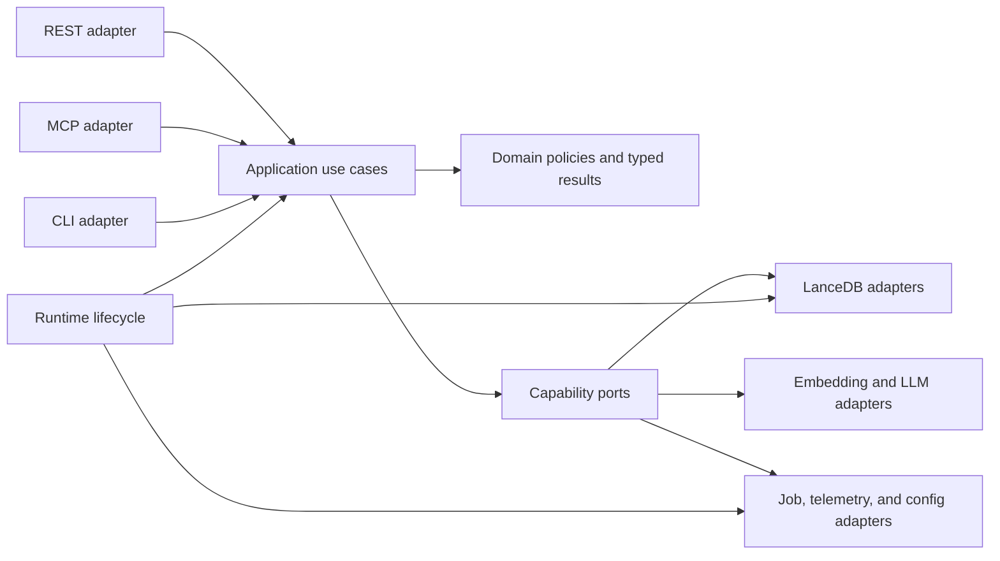

**Purpose**: Assess production-code quality and architecture risks, then define a prioritized remediation path toward Clean Architecture and SOLID design.<br>
**Audience**: Maintainers, backend engineers, technical leads, and security reviewers.<br>
**Status**: Reviewed<br>
**Last reviewed**: 2026-08-03<br>
**Next review**: 2026-11-03

# Code and Architecture Quality Audit

## Executive assessment

The codebase has substantial automated-test investment and several strong local engineering practices, but its core runtime is not yet organized as Clean Architecture. Application policy, transport handling, persistence, lifecycle management, and operational fallbacks are concentrated in a small number of very large classes and functions. This concentration has already produced correctness, confidentiality, availability, and shutdown defects.

The immediate priority is **not** a broad file-splitting exercise. First fix the six High-severity runtime risks in this report. Then introduce stable application-service and port boundaries at seams proven by those fixes, move transport logic behind those boundaries, and split core orchestrators only where independent change axes are demonstrated.

| Severity | Count | Interpretation |
| --- | ---: | --- |
| Critical | 0 | No confirmed issue met the catastrophic impact and blast-radius threshold defined below. |
| High | 6 | Correctness, confidentiality, authentication, or lifecycle failures that can lose data, expose scoped data, preserve revoked credentials, or wedge the service. |
| Medium | 11 | Structural and operational debt with a material change cost or failure risk. |
| Low | 3 | Quality-gate, duplication, and extensibility debt worth addressing incrementally. |

### Most important conclusions

1. **Data replacement and schema compatibility fail unsafe.** Re-ingest can destroy a valid document and leave a partial replacement. Missing TTL/scope columns silently discard retention and scope policy.
2. **Runtime ownership is incomplete.** Graph startup can leave a split-brain set of collaborators, while scheduler and maintenance child tasks can outlive stores during shutdown.
3. **Authentication rotation is not a single atomic use case.** REST and MCP hold separate locks and separate default-key state; an initial key can remain valid on MCP after immediate rotation.
4. **Transport adapters contain business workflows.** REST and MCP independently implement search, explain, collection mutation, error mapping, telemetry, and validation.
5. **The central classes have multiple independent reasons to change.** `SearchPipeline`, `SearchStore`, and `GraphStore` are god objects, not merely large files.
6. **The quality gate is currently not green.** The full default-marked suite without coverage produced one deterministic failure and ten warnings.

## Scope and evidence standard

This audit covers production code and its architecture. Documentation quality, wording, freshness, and organization are explicitly out of scope. Architecture documents were consulted only to identify intended constraints; findings are based on source code, tests, static inspection, or direct reproduction.

Audit snapshot:

- Repository: `archon-search`
- Commit: `31fad1a1`
- Date: 2026-08-03
- Production Python inventory: 146 files, 48,825 lines, 307 classes, 1,170 functions
- Existing working-tree changes were present before the audit and were not modified
- Concurrent source/test changes appeared during final verification; the audit neither created nor reverted them
- Context7 was not configured in the available MCP registry; Serena, source, tests, and installed tooling were used instead

Severity means:

- **Critical**: a confirmed, broadly reachable failure with catastrophic blast radius and poor recoverability, such as systemic irreversible data loss or cross-namespace authentication bypass.
- **High**: can violate a security/data invariant, lose valid data, preserve revoked access, wedge startup, or break runtime resource ownership.
- **Medium**: creates a credible operational failure, high change blast radius, weak dependency boundary, or sustained maintainability cost.
- **Low**: localized quality-gate, interface-safety, duplication, or extensibility debt without a present high-impact failure.

## Prioritized findings

| ID | Severity | Finding | Primary principle affected |
| --- | --- | --- | --- |
| CQ-01 | High | Re-ingest is non-atomic and can replace a valid document with a partial one | Data integrity, SRP |
| SEC-01 | High | Missing schema columns silently discard TTL and scope restrictions | Fail-safe defaults, data integrity |
| REL-01 | High | Graph connection degradation leaves stale active collaborators | Consistent state, DIP |
| REL-02 | High | Shutdown disconnects stores before all work is owned and stopped | Resource ownership |
| AUTH-01 | High | Immediate default-key rotation does not revoke the initial MCP credential | Authentication invariant |
| IO-01 | High | A stranded fixed-name temp file can permanently block future durable writes | Recoverability |
| REL-03 | Medium | Graph fan-out modes have inconsistent and unobservable partial-failure semantics | Explicit failure semantics |
| ARCH-01 | Medium | REST and MCP duplicate application workflows | SRP, DRY, Clean Architecture |
| ARCH-02 | Medium | Core pipeline and persistence classes are god objects | SRP, ISP, OCP |
| ARCH-03 | Medium | `app.state` acts as an untyped service locator and mutable dependency container | DIP, explicit dependencies |
| ARCH-04 | Medium | Installer and configuration workflows are branch-heavy procedural monoliths | SRP, OCP |
| PERF-01 | Medium | Durable job-state fsync runs synchronously on the event loop | Async safety |
| CON-01 | Medium | Shared Docling parser state is not safe under current cross-collection concurrency | Concurrency safety |
| REL-04 | Medium | Collection APIs convert storage failures into valid-looking zero values | Explicit failure semantics |
| SEC-02 | Medium | Archive validation lacks resource limits and blocks async request handlers | Availability, input bounds |
| SEC-03 | Medium | Long-lived bearer credentials are accepted in URLs and embedded in HTML | Secret handling |
| SEC-04 | Medium | Telemetry and export artifacts can be group/world readable | Least privilege |
| TYPE-01 | Low | Core boundaries are weakly typed and no linter/type-checker gate exists | Interface safety |
| EXT-01 | Low | Query-expansion provider metadata is distributed across multiple modules | OCP, registry pattern |
| DUP-01 | Low | API-key resolution is copied across five CLI modules | DRY |

## High-severity findings

### CQ-01 — Re-ingest is non-atomic

**Evidence**

- `archon_search/pipeline.py:642-680` embeds only the first batch, deletes the existing document, then embeds and persists later batches independently.
- `archon_search/store.py:1684-1802` acquires and releases the collection lock per batch; each `table.add(rows)` is durable before the next batch begins.
- `tests/pipeline/test_pipeline_ingest_batch_integration.py:72-114` explicitly asserts that the first replacement batch remains stored when the second batch fails.

**Failure scenario**

A large, previously valid document is re-ingested. The old chunks are deleted. Batch one succeeds; batch two fails during embedding, lock acquisition, metadata update, or persistence. Search now observes a truncated replacement, and the original version is unrecoverable. The returned `chunks_created=0` can also contradict the persisted partial state.

**Required remediation**

Introduce a store-level `replace_document` unit of work that owns one collection/document lock for the complete replacement. Prefer generation-based staging:

1. validate and embed all replacement chunks;
2. write them under a new generation identifier;
3. atomically activate the generation;
4. delete the old generation after activation.

Do not attempt rollback by retaining indistinguishable rows: replacement chunks reuse deterministic identifiers, so plain `table.add` cannot reliably separate generations. Require generation/version identity with activation filtering, or a verified LanceDB transaction/atomic replacement primitive. Add failure-injection assertions for later-batch embedding, persistence, metadata and centroid state, document counts, active model, FTS visibility, graph rows, and cancellation.

### SEC-01 — TTL and scope policy fail open on old schemas

**Evidence**

- `archon_search/pipeline.py:557-579` computes `expires_at` and applies caller-provided scopes to every chunk.
- `archon_search/store.py:1752-1802` detects missing `expires_at`/`scopes` columns, logs a warning, and persists the row without those values.
- `archon_search/store_filters.py:39-54` treats `scopes IS NULL` as shared/global and therefore matches every scope filter.
- `tests/test_e2a_be1_store_schema.py:512-579` pins the silent-drop behavior as successful ingestion.
- Startup migrations in `archon_search/store.py:1021-1042` do not apply `migrate_expires_at_and_scopes`; that migration remains explicit per collection.

**Failure scenario**

A caller ingests a chunk with `scopes=["user:alice"]` into a pre-migration collection. The store drops the scope, writes `NULL`, and later treats the chunk as globally shared. TTL is also discarded, so retention policy is not enforced.

**Required remediation**

Fail closed before writing any row when requested TTL/scope fields are unsupported. Return a typed `SchemaMigrationRequired` error and expose the exact migration action. Optionally auto-run the idempotent migration under the collection lock before ingest. Replace the existing test with one that asserts no row is persisted and no policy is lost.

### REL-01 — Graph startup degradation creates split-brain runtime state

**Evidence**

- `archon_search/server/app.py:650-676` constructs `SearchPipeline` with graph store, extractor, expander, def/ref extractor, and PPR walker before startup.
- `archon_search/server/app.py:315-324` catches graph connection failure and clears only `app.state.graph_store`.
- The pipeline retains the failed graph collaborators, and `MaintenanceLoop` is later built from the stale closure variable `_graph_store` at `archon_search/server/app.py:444-469`.
- `archon_search/graph_store.py:164-185` raises when those retained collaborators reach an unconnected graph store.

**Failure scenario**

Status and route guards see graph storage as unavailable, but ingestion, graph search, PageRank, synonym enrichment, and maintenance still hold and call the failed object. The process enters a partially disabled state with warnings, incomplete graph writes, background failures, or request errors.

**Required remediation**

Create a cohesive `GraphSubsystem` only after a successful connection, or expose one atomic `disable()` operation that removes every graph capability. Inject the same connected-or-disabled subsystem into pipeline, routes, and maintenance. Never keep both a closure reference and a separately mutable `app.state` reference as competing sources of truth.

### REL-02 — Shutdown does not own or stop all work before disconnecting stores

**Evidence**

- `archon_search/server/app.py:545-559` disconnects search and graph stores before cancelling tasks in `app.state._background_tasks`.
- Scheduler-dispatched import/export/migration tasks live in `JobScheduler._active`, not in that application task set (`archon_search/server/app.py:382-417`).
- Cancelling `JobScheduler.run()` only stops its tick loop; it does not cancel active children (`archon_search/jobs/scheduler.py:50-99`).
- `MaintenanceLoop` creates community, synonym, and PageRank tasks at `archon_search/jobs/maintenance_loop.py:505-537`, `641-669`, and `796-821`; callbacks can re-enqueue work and there is no shutdown flag or `aclose()`.

**Failure scenario**

Shutdown begins during import or graph maintenance. Stores disconnect first; child work continues, touches disconnected resources, re-spawns from callbacks, leaves jobs `RUNNING`, or is destroyed when the event loop closes.

**Required remediation**

Give every task-owning component an explicit `aclose()` contract:

1. stop accepting/scheduling work;
2. set a stopping flag that prevents callback re-enqueue;
3. cancel or drain owned children;
4. persist terminal/recoverable job state;
5. drain telemetry;
6. disconnect stores last.

Add a lifespan test with blocked scheduler and maintenance children and assert no pending task remains after shutdown.

### AUTH-01 — The initial MCP credential survives immediate rotation

**Evidence**

- `archon_search/server/mcp.py:2167-2214` snapshots the default key into the mounted Starlette middleware.
- `archon_search/server/mcp.py:1734-1833` and `archon_search/server/routes_keys.py:191-311` implement separate rotation workflows under independent module locks.
- `archon_search/key_manager.py:238-376` creates no revoked record for an unmanaged initial key when `grace_seconds == 0`.
- `archon_search/server/middleware_auth.py:77-91,120-170` accepts the middleware's captured legacy fallback when no revoked record exists.
- Existing MCP rotation tests call tool closures directly and do not verify HTTP authentication after rotation (`tests/test_keystore_be9.py:381-433`).

**Failure scenario**

An operator immediately rotates a compromised initial default key. REST switches to the new key, but MCP continues accepting the captured initial token until restart. Independent REST/MCP locks can also interleave and leave an orphaned active key record.

**Required remediation**

Move rotation into one `KeyRotationService` with one lock and one current-key source shared by REST and MCP. Always persist a revoked record for the unmanaged old key when grace is zero. Add HTTP-level tests proving the old token receives `401` on both transports immediately after rotation and exercising concurrent REST/MCP rotation.

### IO-01 — Fixed durable-write temp names can wedge startup

**Evidence**

- `archon_search/_durable_io.py:45-75` always uses `<target>.tmp`, opens it with `O_EXCL`, and intentionally neither retries nor recovers an existing temp file.
- Startup rewrites `keys.json` through that primitive (`archon_search/server/app.py:292-300`, `archon_search/key_manager.py:382-407`).
- Job persistence uses the same primitive (`archon_search/jobs/store.py:345-371`).
- Direct reproduction confirmed that a pre-existing `keys.json.tmp` makes `load_synthetic_records([])` raise `FileExistsError`.

**Failure scenario**

Power loss or `SIGKILL` occurs after temp creation but before replace. The stranded temp blocks every later write; for `keys.json`, it can prevent every subsequent server startup.

**Required remediation**

Use unique, same-directory temp names and atomic replace, with explicit mode and directory fsync. Alternatively implement ownership-safe stale-temp recovery. Add crash-recovery tests that perform a second write or restart after the interrupted write, not only verify the original target.

## Medium-severity findings

### REL-03 — Graph fan-out has inconsistent and unobservable partial-failure semantics

**Evidence**

- Naive graph fan-out uses `gather(..., return_exceptions=True)` and skips failures at `archon_search/pipeline.py:2790-2840`.
- Local graph fan-out does the same at `archon_search/pipeline.py:3035-3080`.
- Standard fan-out uses `TaskGroup` and re-raises a failed leg at `archon_search/pipeline.py:3140-3190`.
- Failed graph legs are not added to `excluded_collections` and are not represented in the response.

**Failure scenario**

One collection backend fails while other graph legs succeed. The client receives a normal successful response with fewer results and cannot distinguish an intentionally partial response from low recall. The source proves inconsistent behavior and missing observability; it does not establish which product contract is intended.

**Required remediation**

Route all fan-out modes through one executor and make the product contract explicit: either fail the request uniformly, or add typed `failed_collections`/`degraded` fields and telemetry. Test every mode against the same failure matrix.

### ARCH-01 — Transport adapters duplicate application workflows

**Evidence**

- `archon_search/server/mcp.py:260-2164` is a 1,905-line application factory containing the implementations of the MCP tools.
- MCP search and explain (`archon_search/server/mcp.py:293-1120`) independently perform validation, query expansion, model resolution, pipeline orchestration, telemetry, error handling, and DTO mapping.
- REST repeats the corresponding workflows in `archon_search/server/routes_search.py:157-434` and `archon_search/server/routes_explain.py:390-741`.
- MCP collection updates (`archon_search/server/mcp.py:1341-1440`) and REST collection updates (`archon_search/server/routes_collections.py:533-682`) independently implement the same state machine.
- MCP imports private REST symbols (`archon_search/server/mcp.py:39-45,1361`), while route modules import private helpers from each other.

**Why this is architectural debt**

The inbound adapters contain use-case policy. Changes must be synchronized across transports, tests need transport-specific setup to exercise business rules, and contract drift is likely.

**Recommended pattern**

Introduce application services with typed commands, results, and domain errors:

- `SearchApplicationService`
- `ExplainApplicationService`
- `CollectionApplicationService`
- `KeyRotationService`

REST, MCP, and CLI should authenticate, map DTOs, invoke one use case, and translate its result to the transport contract. Split MCP registration into cohesive tool modules; nested closures should not own policy.

### ARCH-02 — Core pipeline and persistence classes are god objects

| Symbol | Size | Responsibilities observed |
| --- | ---: | --- |
| `SearchPipeline` (`archon_search/pipeline.py:311-3485`) | 3,175 lines, 28 methods | ingest, parse/enrich, embeddings, graph writes, search strategies, explain, fan-out, deletion, collection queries, metadata recomputation |
| `SearchStore` (`archon_search/store.py:269-2884`) | 2,616 lines, 67 methods | connection, schemas, migrations, metadata, ingest, FTS, hybrid search, TTL, maintenance, ACL statistics |
| `GraphStore` (`archon_search/graph_store.py:154-2323`) | 2,170 lines, 57 methods | schemas, graph writes, traversal, impact analysis, communities, mentions, GC, conversion |
| `MaintenanceLoop` (`archon_search/jobs/maintenance_loop.py:92-1255`) | 1,164 lines, 19 methods | scheduling, state persistence, six policies, child task ownership, retries |

Size alone is not the finding. Each type has multiple independent reasons to change and combines orchestration with implementation detail. `SearchPipeline.__init__` accepts 20 collaborators/settings (`archon_search/pipeline.py:313-380`), while `search_many` is 574 lines and mixes strategy selection, fan-out, fallback, ACL, ranking, and telemetry-facing result state (`archon_search/pipeline.py:2565-3138`).

**Recommended pattern**

Keep a thin facade during migration and start only at seams supported by concrete defects: a document-replacement unit of work, one fan-out executor, one collection-mutation application service, and one runtime lifecycle owner. Extract further persistence or graph capabilities only when a real consumer can depend on a smaller interface and independent tests demonstrate the boundary. Avoid a generic repository layer that only mirrors LanceDB.

### ARCH-03 — Runtime dependencies have competing mutable sources of truth

**Evidence**

- Production server code contains 214 `app.state`/`request.app.state` accesses.
- `archon_search/server/app.py:280-752` constructs services, starts tasks, mounts MCP, configures auth, performs migrations, registers routers, and shuts resources down in one composition function.
- Routes retrieve dependencies dynamically, often without types or with `Any`; missing attributes degrade through `getattr` fallbacks.
- Routes and app code access private implementation state, including `pipeline._global_embedder` and `search_store._db` (`archon_search/server/routes_search.py:324`, `archon_search/server/routes_explain.py:634-668`, `archon_search/server/app.py:301-311`).

**Recommended pattern**

Expose narrow, typed FastAPI dependency providers for handlers and remove competing closure/state references. A typed `AppServices` value may be stored once on `app.state` inside the composition root, but handlers should receive capabilities through dependency injection rather than fetch a general container. Move startup/shutdown to a `RuntimeLifecycle` that owns resources in dependency order.

### ARCH-04 — Installer and configuration parsing are procedural monoliths

**Evidence**

- `BaseInstaller.run` is 464 lines with 26 parameters and approximately 100 branch nodes (`archon_search/install/installer.py:444-907`). It prompts, validates licenses, mutates config, installs packages, performs rollback, configures GPU, prewarms models, registers services, checks readiness, and prints secrets.
- `_apply_toml` is 512 lines with approximately 159 branch nodes (`archon_search/config.py:408-919`).

**Recommended pattern**

Replace scalar argument growth with an immutable `InstallOptions` parameter object. Model installation as explicit phases or commands with compensating rollback actions. Parse configuration section-by-section into typed models and centralize provider descriptors in a registry. Do not replace one large function with dozens of arbitrary helpers; extract stateful phases that have independent inputs, outcomes, and tests.

### PERF-01 — Job persistence blocks the event loop with fsync

**Evidence**

- `JobStore.create`, `update`, and `update_progress` are synchronous and call `_write_atomic` on every mutation.
- `_write_atomic` serializes the full job set and calls durable JSON write at `archon_search/jobs/store.py:345-371`.
- `atomic_write_bytes` performs file and parent-directory `fsync` synchronously (`archon_search/_durable_io.py:45-75`).
- Async routes and workers call these methods repeatedly, including checkpoint loops in `archon_search/server/routes_export.py:84-141,174-352` and job flows in `archon_search/server/routes_jobs.py:179-478`.

**Required remediation**

Make persistence explicitly asynchronous or isolate it in one serialized writer task/thread. Coalesce progress updates, preserve ordering, and flush terminal transitions durably. Do not scatter `asyncio.to_thread` at every call site; one job-state repository should own the policy.

### CON-01 — Docling initialization and concurrency contracts are unsynchronized

**Evidence**

- `DocumentParser.parse` sends parsing to worker threads (`archon_search/parser.py:56-79`).
- `_parse_with_docling` lazily initializes and then shares `_converter` without synchronization (`archon_search/parser.py:102-116`).
- The source comment assumes sequential ingestion.
- The HTTP ingest path creates background tasks directly (`archon_search/server/routes_jobs.py:441-508`), and per-collection locking allows different collections to ingest concurrently. Bulk concurrency is also configurable.

**Required remediation**

First test simultaneous parser entry and confirm whether duplicate converter construction occurs. Then verify Docling's supported concurrency model before choosing serialization, eager initialization, one converter per worker, or a bounded pool. Do not assert output corruption without evidence.

### REL-04 — Collection APIs hide store failures as zero values

**Evidence**

- `archon_search/server/routes_collections.py:391-440` and `632-682` catch broad exceptions from state, document count, chunk count, and ACL statistics, then return `0` or `None`.
- Tests at `tests/test_routes_collections.py:586-611,645-674` pin HTTP 200 with zero counts after database failure.

**Failure scenario**

An operator or automation sees a valid empty collection instead of an unavailable store and may trigger deletion, reindex, or alert suppression based on false data.

**Required remediation**

Return 503 when a required field cannot be loaded, or make the field nullable and include an explicit `degraded`/`unavailable_fields` status. Never use a valid domain value as an error sentinel.

### SEC-02 — Archive import has no resource budgets

**Evidence**

- `validate_archive_members` validates member names but not uniqueness, regular-file type, compressed size, declared size, expansion ratio, line length, or record count (`archon_search/_path_safety.py:95-125`).
- `ImportArchiveReader.read_manifest` performs an unbounded synchronous `f.read()` (`archon_search/jobs/export_archive.py:143-167`).
- Async REST and MCP handlers call manifest inspection directly before queuing work (`archon_search/server/routes_export.py:477-499`, `archon_search/server/mcp.py:1528-1545`).

**Required remediation**

Require exactly one regular file for each expected member. Bound archive bytes, member sizes, expansion ratio, manifest size, JSONL line length, record count, and vector dimension. Move decompression and inspection off the event loop. Test gzip bombs, duplicate members, oversized lines, malformed vectors, and cancellation.

### SEC-03 — Bearer credentials are accepted in URLs and embedded in HTML

**Evidence**

- Auth middleware bypasses the header-presence check for `/graph/{collection}/view?token=...` (`archon_search/server/middleware_auth.py:127-150`).
- The route validates the raw token and inserts it into returned JavaScript (`archon_search/server/routes_graph.py:279-372`).
- Integration tests require the raw token in both URL and HTML (`tests/integration/test_e2j_be2_graph_view_route.py:169-175`).

**Risk**

The long-lived API key can enter browser history and synchronization, copied URLs, server/proxy access logs, diagnostics, and memory snapshots. `Referrer-Policy: no-referrer` does not remove the credential from the current URL or upstream logs.

**Required remediation**

Remove long-lived bearer-in-query support. Use an Authorization-based bootstrap that exchanges the API key for a short-lived, single-purpose viewer session, preferably delivered through an HttpOnly/SameSite cookie or another mechanism that never places the main key in the URL or HTML source.

### SEC-04 — Sensitive runtime artifacts use permissive file modes

**Evidence**

- Telemetry files are created with mode `0o644`; directories use default `mkdir` permissions (`archon_search/telemetry/writer.py:168-200`).
- Export temporary and final archives rely on default open modes (`archon_search/jobs/export_archive.py:66-108`, `archon_search/server/routes_export.py:78-89`).
- Direct POSIX verification under umask `022` produced `0644` telemetry and export files.

**Required remediation**

Create new sensitive directories with `0700` and new telemetry, temp, and export files with `0600`. Warn on existing permissive modes; change existing operator-managed permissions only through an explicit migration command or opt-in. Add POSIX-mode tests and define the Windows ACL posture separately.

## Low-severity improvement opportunities

### TYPE-01 — Static interface safety is not gated

**Evidence**

- Production code contains 94 `type: ignore` comments, 175 `Any` tokens, and 244 `noqa` comments.
- No Ruff, mypy, Pyright, or equivalent project configuration/dependency/CI gate is present.
- Critical boundaries use `Any`, bare dictionaries, or private attributes, particularly `archon_search/server/routes_jobs.py`, `archon_search/server/mcp.py`, `archon_search/pipeline.py`, and the installer protocol.

**Required remediation**

Add Ruff and Pyright or mypy incrementally. Start with application-service interfaces, domain results, lifecycle ownership, key rotation, and new/changed code. Establish a ratchet in selected modules: no unexplained suppressions and no new `Any` at core boundaries. Do not block adoption on making all 48,825 lines strict in one change.

### EXT-01 — Query-expansion providers need a registry

Provider names, dependency checks, factories, credential policy, rate-limit behavior, installer extras, and wizard choices are distributed across `archon_search/config.py`, `archon_search/server/app.py`, `archon_search/query_expansion_protocol.py`, `archon_search/hyde.py`, `archon_search/rag_fusion.py`, `archon_search/install/extras.py`, and `archon_search/install/wizard.py`. Adding a provider requires coordinated edits in each location.

Create a `QueryExpansionProviderSpec` registry containing the provider name, factory, dependency/extra metadata, credential check, rate-limit policy, and optional configuration hook. Keep providers as strategies; make the registry the single source of provider metadata.

### DUP-01 — CLI API-key resolution is copied

Equivalent API-key resolution helpers exist in `archon_search/cli/export_cmd.py:18-30`, `archon_search/cli/key_cmd.py:44-56`, `archon_search/cli/backup_cmd.py:36-48`, `archon_search/cli/collection.py:16-28`, and `archon_search/cli/maintenance_cmd.py:33-45`.

Move one typed helper to `archon_search/cli/_helpers.py` and test precedence once.

## Target architecture

The recommended target is a pragmatic Clean Architecture, not a directory-only rewrite:



Dependency rules:

1. Domain code imports no FastAPI, FastMCP, Click, LanceDB, or filesystem implementation.
2. Application services depend on narrow protocols and typed commands/results.
3. Inbound adapters contain only authentication/context extraction, DTO mapping, invocation, and transport error mapping.
4. Outbound adapters own persistence and external-library details.
5. The composition root constructs the graph and the lifecycle owner starts/stops it; neither implements business use cases.
6. Fallback is a typed outcome, not an unstructured broad-exception path.

## Remediation roadmap

### Phase 0 — Restore invariants before refactoring

1. **SEC-01**: fail closed on unsupported TTL/scope schema.
2. **CQ-01**: implement atomic/generation-based document replacement.
3. **REL-01**: make graph startup produce one connected-or-disabled state.
4. **REL-02**: own and stop all work before disconnecting stores.
5. **AUTH-01**: centralize rotation and eliminate the stale MCP default key.
6. **IO-01**: make durable writes recoverable after a crash.

Exit criteria:

- failure-injection tests prove the previous document survives every replacement failure;
- scoped data can never become unscoped through schema compatibility;
- an old key is rejected by REST and MCP immediately after rotation;
- a stranded temp file cannot prevent restart;
- graph state is consistent across routes, pipeline, and maintenance;
- shutdown leaves no child task using a disconnected store.

### Phase 1 — Make failure and resource policies explicit

1. **REL-03**: select and enforce one graph fan-out failure contract.
2. **PERF-01**: move durable JobStore writes behind one serialized async writer.
3. **CON-01**: verify Docling concurrency and synchronize initialization accordingly.
4. **SEC-02**: enforce archive budgets and move inspection off the event loop.
5. **SEC-03**: remove long-lived bearer credentials from URLs and HTML.
6. **SEC-04**: apply least-privilege modes when sensitive files are created.

Exit criteria:

- a fan-out leg failure either fails the request or is represented in a degraded response;
- progress writes do not block the event loop and terminal state is durable;
- concurrent parser tests define and verify initialization behavior;
- archive size, expansion, record, line, type, and vector-dimension limits are enforced;
- no long-lived bearer appears in a URL or returned HTML;
- newly created sensitive artifacts are private by default.

### Phase 2 — Create application seams

1. **ARCH-01**: extract shared search, explain, collection-mutation, and key-rotation use cases.
2. **ARCH-03**: replace competing mutable references and private-state access with narrow dependency providers.
3. **REL-04**: model collection-stat failures as unavailable/degraded outcomes, not zero values.
4. Introduce typed commands, results, and domain errors only at these extracted seams.

Exit criteria:

- one transport-neutral test matrix covers each use case;
- REST/MCP tests verify only mapping differences;
- no inbound adapter accesses `pipeline._*` or `store._*`.

### Phase 3 — Split core responsibilities behind stable facades

1. **ARCH-02**: extract only responsibilities with demonstrated consumers and independent tests, starting with document replacement and fan-out execution.
2. **ARCH-04**: replace installer scalar arguments with typed options and separate independently testable install phases.
3. Split persistence by capability only where an application use case can consume a narrower interface; retain one shared LanceDB session.

Exit criteria:

- extracted use cases run in tests without FastAPI, MCP, or a concrete LanceDB store;
- fan-out policy has one implementation and one shared failure matrix;
- inbound adapters no longer access pipeline/store private fields;
- installer phases have isolated inputs, outcomes, rollback tests, and no 26-parameter entry point.

### Phase 4 — Add quality ratchets

1. **TYPE-01**: add Ruff and incremental type checking to selected modules.
2. Fail CI on warnings owned by the repository.
3. Add architectural dependency tests for domain/application/adapter direction.
4. Add complexity and size budgets as review signals, not automatic design verdicts.

Suggested initial review thresholds:

- function over 60 lines: review required;
- function over 100 lines: refactor justification required;
- class over 500 lines or 15 public methods: SRP review required;
- more than 8 parameters: parameter-object review required;
- broad `Exception` catch: explicit fallback/error-policy review required.

These are guardrails, not targets. A short function can still be poorly designed, and a composition root can legitimately have high fan-out.

**Opportunistic disposition:** address **EXT-01** when the next provider is added and **DUP-01** when any affected CLI authentication behavior changes. Neither should block the invariant and lifecycle work above.

## Verification results

### Automated checks run

```text
uv run pytest --no-cov
8038 passed, 1 failed, 7 skipped, 1 xfailed, 10 warnings
```

The failing test is:

- `tests/integration/test_e1c_t3_e2e_naive_provenance.py::test_explain_naive_mixed_results_e2e`

A serial isolated rerun failed identically. The test expects at least one hybrid-only result with `graph_provenance=null`; all 30 results carried graph provenance. This is a deterministic current-tree contract mismatch, not an audit-induced change.

Warnings observed:

- eight Starlette/FastAPI test-client deprecation warnings;
- one deprecated LanceDB `table_names()` call in a test;
- one un-awaited `AsyncMock` coroutine warning in `test_run_graph_gc_aborts_when_list_chunks_raises_exception`.

Coverage was intentionally not measured in this command because `--no-cov` was used for the diagnostic run. The repository's configured 85% threshold was therefore not re-certified by this audit.

### Static results

- Internal import graph: 146 modules, 516 internal edges, **no dependency cycles**.
- Functions at least 50 lines: 216.
- Functions at least 100 lines: 69.
- Functions at least 200 lines: 20.
- Functions with at least 10 parameters: 21.
- Broad `Exception`/`BaseException` catches: 264. Only concrete false-success, lifecycle, and security cases are findings; the count alone is not treated as a defect.

### Reproduction and measurement method

Snapshot and test commands:

```bash
git rev-parse --short HEAD
find archon_search -name '*.py' -type f -print0 | xargs -0 wc -l
env UV_CACHE_DIR="$PWD/.uv-cache" uv run pytest --no-cov
env UV_CACHE_DIR="$PWD/.uv-cache" uv run pytest --no-cov -n0 -q \
  tests/integration/test_e1c_t3_e2e_naive_provenance.py::test_explain_naive_mixed_results_e2e
```

The static inventory used Python's `ast` module over every production Python file. Function counts include synchronous and asynchronous definitions, including nested definitions; size is the inclusive `lineno` to `end_lineno` span. Parameter counts include positional-only, positional, keyword-only, variadic, and keyword-variadic parameters. Broad-catch counts include handlers whose caught type is `Exception` or `BaseException`. Internal import edges resolve only imports under `archon_search`; strongly connected components were checked for cycles.

Direct reproductions used isolated temporary data roots:

- durable-write recovery: pre-create `keys.json.tmp`, then call `KeyStore.load_synthetic_records([])` and observe `FileExistsError`;
- key rotation: rotate an unmanaged default key with zero grace, then validate the captured legacy key through `validate_token_and_get_namespace` and observe namespace `default`;
- file permissions: create telemetry and export artifacts under POSIX umask `022`, then inspect modes with `stat`; both were `0644`.

These reproductions did not modify repository source or tests.

## What was checked

### Repository-wide checks

- [x] Parsed every `archon_search/**/*.py` production file with Python AST.
- [x] Measured module, class, function, parameter, and branch hotspots.
- [x] Built the internal import graph and checked strongly connected components.
- [x] Searched private cross-layer access, `Any`, suppressions, broad exceptions, TODO/FIXME markers, subprocess calls, filesystem writes, async task creation, and blocking-call indicators.
- [x] Checked configured lint, type-check, warning, test, and coverage gates.
- [x] Ran the full default-marked test suite without coverage and reran the failure serially.

### Architecture and SOLID checks

- [x] Dependency direction between transport, orchestration, domain policy, and persistence.
- [x] Single responsibility and cohesion of large modules/classes/functions.
- [x] Dependency inversion and interface segregation at core boundaries.
- [x] Open/closed behavior for search modes, maintenance policies, and providers.
- [x] REST/MCP/CLI duplication and application-service reuse.
- [x] Composition-root and service-locator behavior.
- [x] Encapsulation violations through private attributes.
- [x] Appropriateness of Strategy, Repository/Port, Unit of Work, State Machine, Registry, and lifecycle-owner patterns.

### Correctness, safety, and reliability checks

- [x] Ingest/re-ingest ordering, batching, locking, rollback, and partial failure.
- [x] LanceDB schema compatibility, migration gates, TTL, scopes, ACL, and metadata behavior.
- [x] Search/explain/fan-out fallback and error semantics.
- [x] Graph connection, maintenance, traversal, GC, and degraded-mode behavior.
- [x] Background task creation, ownership, cancellation, callback re-enqueue, and shutdown ordering.
- [x] Job persistence, scheduler active-task ownership, checkpointing, and durable writes.
- [x] Parser thread use and shared lazy state.
- [x] Auth middleware, namespace resolution, key creation/revocation/rotation, and REST/MCP parity.
- [x] Path validation, archive members, decompression bounds, file permissions, and secret exposure.
- [x] Telemetry no-raw-query structure, hashing path, queue lifecycle, and local file handling.

### Deep-inspected production areas

- Core: `pipeline.py`, `store.py`, `graph_store.py`, `sync.py`, `parser.py`, `config.py`
- Graph: extractors, expander, PPR walker, community builder, graph protocols and types
- Server: app/lifespan, middleware, MCP, search, explain, collection, job, export, graph, status, key, telemetry, and readiness routes
- Jobs: store, scheduler, backup loop, maintenance loop, export archive
- Install/platform: installer, wizard, config writer, extras, prewarm, service operations, platform services
- Security/runtime: key manager, path safety, durable I/O, ACL, telemetry writer/reader/hasher/pruner
- Quality support: eval runner/backends and targeted unit/integration tests for each reported behavior

## Positive controls observed

The following strengths should be preserved during refactoring:

- no internal production-module import cycle was found;
- embedder, reranker, query-expansion, and graph-facing areas already use several useful protocols/strategies;
- durable writes fsync both file and parent directory after replacement;
- path traversal and archive member-name validation exist;
- telemetry entry factories preserve the no-raw-query invariant;
- ACL filtering occurs before reranking;
- the test suite is broad and includes many failure-injection and integration cases;
- source comments often document deliberate fallbacks and concurrency assumptions, making risky behavior discoverable.

These controls reduce migration risk. The refactor should strengthen their boundaries rather than replace them wholesale.
