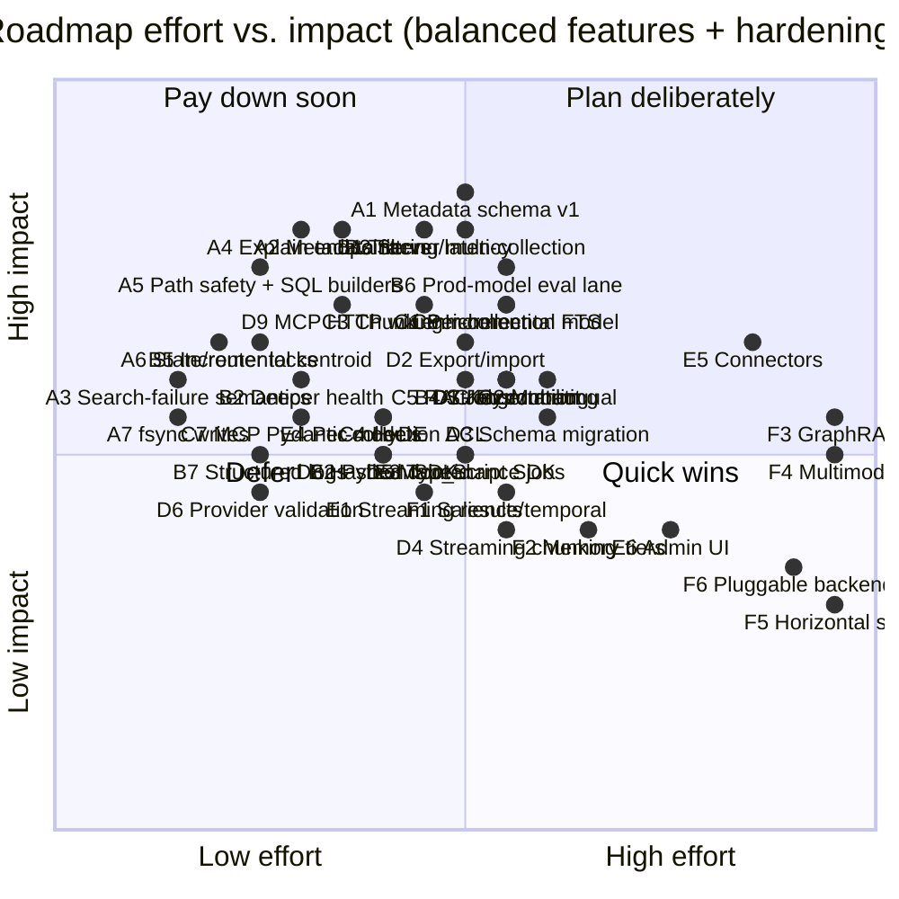

**Purpose**: Priority-ordered, checkable roadmap for evolving `archon-search` into a standalone world-class retrieval product.
**Audience**: Maintainers planning architecture and feature work.
**Status**: Draft
**Last reviewed**: 2026-06-11 / **Next review**: 2026-09-07

> Source of truth: current code under `archon_search/` verified against comparison docs `01_competitive_analysis_field.md` and `02_competitive_analysis_marveen.md`.

# Standalone Search Roadmap

## How to use this document

- Each numbered item is a checkbox. Check it when its **minimum acceptance criteria** are met, not when work begins.
- Priority groups (P0–P5) are ordered for sequencing, not for blocking — work within a group can parallelise once the prior group's invariants are in place.
- The [Effort vs. impact matrix](#effort-vs-impact-matrix) at the bottom is the planning view; the textual list is the contract.
- Code is the source of truth. When the doc and the code disagree, fix the doc in the same PR as the code change.

## Scope and current baseline

`archon-search` already exists as a standalone package (this repository); items below build on top of that baseline rather than recreating it.

Confirmed-shipped facts (verified against `archon_search/` on 2026-05-20):

- Standalone package, CLI (`archon-search`), config (`~/.archon-search/archon-search.toml`), CalVer release pipeline.
- MCP + REST control plane sharing one auth middleware; `GET /openapi.json` is authoritative for REST.
- Hybrid retrieval (vector + FTS + RRF) in `store.py`; cross-encoder reranker in `reranker.py`; context-window expansion in `pipeline.py`.
- Multi-collection routing via centroid pre-ranking in `router.py`.
- Async job model (`archon_search/jobs/`) for ingest/reindex operations.
- Bearer-token auth with namespace map (`middleware_auth.py`, `key_manager.py`); per-collection ACLs in `acl.py`.
- Deterministic eval harness in `tests/eval/` with thresholds and baseline (`EVL-1` in [530_technical_debt_refactoring_roadmap.md](../Architecture/530_technical_debt_refactoring_roadmap.md) tracks the production-model gap).
- Opt-in local telemetry (`archon_search/telemetry/`) with structural no-raw-query invariant.

Items already checked below reflect this baseline.

## Sequencing logic — balanced feature + hardening

Pure foundation-first sequencing pushes user-visible value too far out and lets hardening debt accumulate silently. Pure feature-first sequencing builds new ranking work on top of unsafe primitives (broad `except`, no fsync, stale router cache, no per-stage timings) and is impossible to debug in production. This roadmap interleaves both, by these rules:

1. **Every phase ships one user-visible feature, one operator-visible improvement, and one foundation step.** A phase that ships only foundation is allowed to slip; a phase that ships only features blocks the next phase.
2. **The eval harness gates ranking changes.** Any feature that touches ranking (items 9–11, 14, 19, 31) lands behind a benchmarked threshold in `tests/eval/`. No feature flag → no merge.
3. **Hardening items pulled from [`530_technical_debt_refactoring_roadmap.md`](../Architecture/530_technical_debt_refactoring_roadmap.md) are first-class entries here**, not invisible chores. They appear with `H‑N` IDs and link back to the debt register.
4. **Foundations are sized to the next feature, not to all future features.** Item 3 (metadata schema) ships the minimum needed for item 7 (filters); item 2 (full job contract) is only finished when item 20 (export/import) demands it.
5. **Measure before you change.** Observability (item 24) lands before HyDE / RAG Fusion (10, 11), not after — otherwise the eval harness will report a number with no story.
6. **Don't pre-pay for scale.** Items 33–36 stay last; their position is unchanged.

## Phase A — Trust the core (foundation + first user wins)

Goal: make the existing pipeline safe to extend, and ship two cheap features that operators and end users notice immediately.

- [x] **A1. Metadata schema v1 (item 3, minimum slice)** — add typed per-chunk and per-document metadata fields to the LanceDB schema, with system / filterable / ranking / audit partitions documented. Scope is intentionally narrow: only the fields needed for `A2` and item 13. Surfaced in search responses. [[brief](../Completed/A1-metadata-schema-v1-brief.md), [plan](../Completed/A1-metadata-schema-v1-plan.md)]
- [x] **A2. Metadata filters at search (item 7, minimum slice)** — source-path prefix/glob, `indexed-after`/`indexed-before`, file-type. Exposed on REST `/search`, MCP `search`, and the explain output (A4). Bounds-validated; uses the LanceDB `where()` API (no f-string SQL). A1 ships filterable fields populated; A2 only adds query-side wiring. **Language filtering deferred to C2** (real language detection) — A1's `language` field stays storage-only and is not exposed as a filter dimension here. [[brief](../Completed/A2-metadata-filters-at-search-brief.md), [plan](../Completed/A2-metadata-filters-at-search-plan.md)]
- [x] **A3. Hardening: search-failure semantics (`CON-5`)** — `/search` now returns HTTP 500 on pipeline stage failure (bare re-raise) and HTTP 504 on timeout; telemetry is emitted on both paths. See `BREAKING.md` `[next release]` — `POST /search` pipeline-exception behavior. [[brief](../Completed/A3-search-failure-semantics-brief.md), [plan](../Completed/A3-search-failure-semantics-plan.md)]
- [x] **A4. Explain / debug endpoint (item 12)** — `POST /explain` (REST) + `explain` MCP tool (10th tool) returning vector rank, FTS rank, fused (RRF) score, reranker score, and routing path. Two roadmap sub-fields deferred: `matched_filters` → A4.1 (additive, after A2 ships); `expansion-feature usage` → A4.2 (additive, after Phase B/C HyDE / RAG Fusion ships). Unlocks every later ranking change. [[brief](../Completed/A4-explain-endpoint-brief.md), [plan](../Completed/A4-explain-endpoint-plan.md)]
- [x] **A5. Hardening: input safety on ingest paths** — reject `..`-containing/empty/whitespace/NUL/non-absolute paths in `/collections` and `/jobs/ingest` (and MCP `ingest_file`/`ingest_directory`); replace all f-string `where()`/`delete()`/`count_rows()` builders in `store.py` with quoted helpers behind a CI guard. [[brief](../Completed/A5-ingest-hardening-brief.md), [plan](../Completed/A5-ingest-hardening-plan.md)]
  - [x] A5a — ingest path safety (`validate_ingest_path`). Note: narrowed from "symlink-escape" to `..`-traversal + trivial-junk rejection; symlink scope deferred to a future `allowed_dirs` feature.
  - [x] A5b — SQL builder defense-in-depth (`_where_eq`/`_where_in` + `tests/test_no_fstring_sql.py` guard).
  - [x] A5c — synchronous `StoreBusyError` → HTTP 503 (`Retry-After: 30`) on `/ingest` and `/collections`; MCP `code="store_busy"`.
- [x] **A6. Hardening: state-store + router cache locks (`CON-2`, `CON-3`)** — `asyncio.Lock` around `IndexingStateStore` mutations; router cache invalidates on ingest/reindex/description-regen. One PR, both bugs. [[brief](../Completed/A6-hardening-locks-brief.md), [plan](../Completed/A6-state-store-router-cache-hardening-plan.md)]
- [x] **A7. Hardening: stop writing without fsync (`PROG-1`, `TEL-2`, `SYN-1`)** — `IndexingStateStore`, telemetry writer, and sync manifest all `flush + fsync` before `os.replace`. Cheap durability win. [[brief](../Completed/A7-fsync-hardening-brief.md), [plan](../Completed/A7-fsync-hardening-plan.md)]

## Phase B — Make changes measurable (observability + retrieval seams)

Goal: stand up the measurement surface before adding ranking features, and ship the highest-leverage retrieval refactor.

- [x] **B1. Observability and stage-level latency (item 24)** — per-stage timings (parse, embed, route, vector, FTS, fuse, rerank, end-to-end); correlation IDs from middleware → pipeline → telemetry (`ARCH-3`). Emitted as structured logs and surfaced on `/explain`. [[brief](../Completed/B1-observability-stage-latency-brief.md), [plan](../Completed/B1-observability-stage-latency-plan.md)]
- [x] **B2. Deeper health and readiness (item 22)** — distinguish `live` vs. `ready`; cover storage connectivity, model warm-status, index build state, watcher state, queue depth. Operators need this before scaling load. [[brief](../Completed/B2-deeper-health-readiness-brief.md), [plan](../Completed/B2-deeper-health-readiness-plan.md)]
- [x] **B3. Server-side multi-collection search primitive (item 8)** — embed the query once; one merge + rerank pass across collections. Co-designed with `/explain` (A4) so the routing path is debuggable. [[brief](../Completed/B3-server-side-multi-collection-search-brief.md), [plan](../Completed/B3-server-side-multi-collection-search-plan.md)]
- [x] **B4. Stronger collection routing (item 9)** — description-embedding + centroid hybrid blend shipped; centroid remains the default (`routing_strategy = "centroid"`), hybrid is opt-in via `routing_strategy = "hybrid"` + `routing_description_weight`. One new artifact: `CollectionMeta.description_embedding` stored per-collection and used by the router in hybrid mode. Multi-centroid routing (per-cluster centroids for diffuse corpora) deferred to a future item; roadmap item 9's multi-centroid scope is narrowed to this single-artifact implementation. Gated by the eval harness (`routing_mrr_hybrid ≥ routing_mrr_centroid` baseline). [[brief](../Completed/B4-stronger-collection-routing-brief.md), [plan](../Completed/B4-stronger-collection-routing-plan.md)]
- [x] **B5. Hardening: incremental centroid update (`CON-4`, item 17)** — incremental `(centroid_sum, chunk_count)` maintenance at store layer — three concrete defects fixed (batch-only overwrite, delete-ignores-centroid, O(chunks) sync-path rescan). Ingest is O(batch); delete is O(chunks-in-document); O(chunks) full scan retained only for explicit `recompute_collection_meta` (reindex, crash recovery, drift reset). Controlled by `centroid_incremental_enabled` flag (default `True`). [[brief](../Completed/B5-incremental-centroid-brief.md), [plan](../Completed/B5-incremental-centroid-plan.md)]
- [x] **B6. Hardening: production-model eval lane (`EVL-1`, item 4 follow-up)** — `live`-marker job on tag pushes that runs the eval harness against the real embedder/reranker (not the deterministic stubs). Gated by `tests/eval/thresholds.toml`. [[brief](../Completed/B6-production-model-eval-lane-brief.md), [plan](../Completed/B6-production-model-eval-lane-plan.md)]
- [x] **B7. Hardening: structured logs + log rotation (item 25)** — JSON log option, telemetry JSONL rotation policy beyond retention-day pruning. [[brief](../Completed/B7-structured-logs-rotation-brief.md), [plan](../Completed/B7-structured-logs-rotation-plan.md)]

## Phase C — Quality features (ranking leaps, gated by the eval harness)

Goal: ship the features users actually came for. Each item must show a measurable eval lift to land.

- [x] **C0. Tiered install profiles** — three profiles (`minimal`/`balanced`/`max`) for English and multilingual; `[database].profile`/`[database].multilingual` in `archon-search.toml`; disk-space checks, Jina CC-BY-NC-4.0 license gate for multilingual `balanced`/`max`, model pre-warming, reinstall guard with rollback, `--force --delete-db` escape hatch. [[brief](../Completed/C0-tiered-install-profiles-brief.md), [plan](../Completed/C0-tiered-install-profiles-plan.md)]
- [x] **C0b. GitHub Releases via git-cliff changelog** — `release.sh` requires `git-cliff >= 2.4`, prepends release notes to `CHANGELOG.md`, verifies commit count vs. provisional tag; `github-release` job in `archon-search-release.yml` creates the GitHub Release via REST API on every tag push. [[brief](../Completed/C0b-github-releases-changelog-brief.md), [plan](../Completed/C0b-github-releases-changelog-plan.md)]
- [x] **C1. Per-collection embedding model (item 13)** — `CollectionMeta.active_embedding_model` is the per-collection model tag; ingest/search/sync paths consult it; `validate_embedding_model()` raises `ModelValidationError` on cross-model mismatch; `SearchResponse.embedding_model` echoes the resolved model. [[brief](../Completed/C1-per-collection-embedding-model-brief.md), [plan](../Completed/C1-per-collection-embedding-model-plan.md)]
- [x] **C2. Multilingual retrieval (item 14)** — fasttext `lid.176.ftz` language detection at ingest; `language=<code>` single-collection filter; three-state contract (`""`/`"unknown"`/`"<code>"`); CC-BY-SA-3.0 license gate; language-aware FTS tokenization; `FilterFlags.language_filter_used` telemetry; `/status` warning for untagged collections. [[brief](../Completed/C2-multilingual-retrieval-brief.md), [plan](../Completed/C2-multilingual-retrieval-plan.md)]
- [x] **C3. Chunk-level enrichment at ingest (item 19)** — local title / section path / heading ancestry / page / source-subtype / code-symbol context. Drives both ranking and filter quality.
  - [x] **C3a** — Heading enrichment (`_heading`, `_section_path`) for text-format sources (`.md`, `.txt`, `.rst`, `.html`). [[brief](../Completed/C3a-markdown-structural-enrichment-brief.md), [plan](../Completed/C3a-markdown-structural-enrichment-plan.md)]
  - [x] **C3b** — Page-number extraction (`_page_start`, `_page_end`) for PDF and image sources via docling page-break markers. Shipped 2026-06-07. [[brief](../Completed/C3b-page-number-extraction-brief.md), [plan](../Completed/C3b-page-number-extraction-plan.md)]
  - [x] **C3c** — Code-symbol context (`_symbol_type`, `_symbol_subtype`, `_containing_function`, `_containing_class`, `_module_path`) for source-code chunks (`.py`, `.ts`, `.js`, `.go`, `.rs`, `.java`, `.sh`) via tree-sitter (optional `[code]` extra). [[brief](../Completed/C3c-code-symbol-context-brief.md), [plan](../Completed/C3c-code-symbol-context-plan.md)]
- [x] **C4. HyDE / query expansion (item 10)** — optional `archon-search[hyde]` extra; `hyde=true` on `/search`, `/explain`, or MCP tools generates a hypothetical doc via Anthropic API and uses its embedding for vector retrieval; off by default; silent fallback on every failure path. Mutually exclusive with RAG Fusion (C5). [[brief](../Completed/C4-hyde-query-expansion-brief.md), [plan](../Completed/C4-hyde-query-expansion-plan.md)]
- [x] **C5. RAG Fusion / multi-query decomposition (item 11)** — `rag_fusion=true` decomposes the query into N variants via Anthropic API, searches in parallel, fuses via second-pass RRF; optional `archon-search[rag_fusion]` extra; mutually exclusive with HyDE (C4). [[brief](../Completed/C5-rag-fusion-brief.md), [plan](../Completed/C5-rag-fusion-plan.md)]
- [x] **C6. Hardening: incremental FTS maintenance (item 16)** — `store.optimize_fts()` replaces `rebuild_fts_index()` at all ingest and sync sites (O(delta) vs. O(collection)); delete-path FTS maintained via `optimize_fts` after `delete_document`; `reindex_metadata` no longer triggers any FTS call. [[brief](../Completed/C6-incremental-fts-maintenance-brief.md), [plan](../Completed/C6-incremental-fts-maintenance-plan.md), [spike-findings](../Completed/C6-spike-findings.md)]
- [x] **C7. Hardening: MCP responses behind Pydantic models (`API-4`)** — all ten MCP tools return validated Pydantic schemas (`McpSearchResponse`, `IngestResultSchema`, `CollectionDetailSchema`, …) with `extra="forbid"`; `ValidationError` is caught and surfaced as a structured error; field-narrowing breakages recorded in `BREAKING.md`. [[brief](../Completed/C7-mcp-pydantic-responses-brief.md), [plan](../Completed/C7-mcp-pydantic-responses-plan.md)]

### Test-suite infrastructure (parallel work, shipped during Phase C)

- [x] **C10. Test-suite speed — pytest-xdist + `--dist=loadfile`** — `pytest-xdist` dev-dep, parallel `addopts`, `-n0` in CI for `--cov-append` correctness; baseline test wall-time win. [[brief](../Completed/C10-test-suite-speed-brief.md), [plan](../Completed/C10-test-suite-speed-plan.md)]
- [x] **C11. Split `test_pipeline.py`** — break the monolithic 4 000-line `test_pipeline.py` into `tests/pipeline/{test_pipeline_ingest,test_pipeline_search,test_pipeline_multi}.py` with shared helpers in `tests/pipeline/conftest.py`. [[brief](../Completed/C11-split-test-pipeline-brief.md), [plan](../Completed/C11-split-test-pipeline-plan.md)]
- [x] **C12. Switch xdist to `--dist=loadgroup` with session-scoped store** — session-scoped `connected_store`, `xdist_group("mcp")` on 16 MCP-stub files, `xdist_group("install")` on 3 install-lock files; median wall time on a 14-core machine ≈ 127s with thread caps (from 6.5 min before C10). [[brief](../Completed/C12-dist-load-session-store-brief.md), [plan](../Completed/C12-dist-load-session-store-plan.md)]
- [x] **C17. Install-lock parallel-test isolation + `Path.home()` ratchet guard** — per-worker `ARCHON_SEARCH_DATA_DIR` autouse fixture eliminates xdist install-lock collisions; `test_no_hardcoded_path_home.py` ratchet prevents new `Path.home()` callsites outside `paths.py`; 3 `install.py` callsites migrated to `get_data_dir()`. [[brief](../Completed/C17-install-lock-parallel-isolation-brief.md), [plan](../Completed/C17-install-lock-parallel-isolation-plan.md)]

### Active backlog (post-Phase C, not yet sequenced into D/E/F)

- [x] **C8. Extended setup wizard with optional feature selection** — adds an interactive feature-selection step to the wizard so users can enable any optional feature at install time (including automatic `pip install archon-search[<extra>]` invocation). [[investigation](../Completed/C8-wizard-optional-features-investigation.md), [plan](../Completed/C8-wizard-optional-features-plan.md)]
- [x] **C9. Container support (Docker + GHCR)** — `docker run` and `docker compose up` start `archon-search` configured purely via env vars; all runtime state on one mounted volume; CPU (`:latest`) and NVIDIA GPU (`:gpu`) images published to GHCR on tag push. [[brief](../Completed/C9-container-support-brief.md), [plan](../Completed/C9-container-support-plan.md)]
- [x] **C13. Test perf: bypass FTS rebuild in tests that don't query FTS** — adds `rebuild_fts: bool = True` to `SearchPipeline.ingest_directory()` (mirroring `ingest_file`); median wall time improved from ~127s to ~71s. [[brief](../Completed/C13-fts-rebuild-test-bypass-brief.md), [plan](../Completed/C13-fts-rebuild-test-bypass-plan.md)]
- [x] **C14. Wizard UX improvements** — `--dry-run` flag, `--next-steps` suppression, improved summary formatting, structured error output, consistent exit-code contract. [[brief](../Completed/C14-wizard-ux-improvements-brief.md), [plan](../Completed/C14-wizard-ux-improvements-plan.md)]
- [x] **C15. Wizard configurability expansion** — `--host`, `--port`, `--server-key`, `--enable-hyde`, `--enable-rag-fusion`, and six other Tier-1 Click options; `_apply_wizard_features_to_toml()` write logic; prints full API key with source. [[brief](../Completed/C15-wizard-configurability-expansion-brief.md), [plan](../Completed/C15-wizard-configurability-expansion-plan.md)]
- [x] **C16. Real-model search latency benchmark** — `live_benchmark` pytest marker; `BenchmarkThresholds` + `load_benchmark_thresholds()`; steady-state p95 (100-iter) and cold-load p90 (N=10) tests with real fastembed + cross-encoder; model-cache restore + prefetch in CI. [[brief](../Completed/C16-real-model-search-latency-benchmark-brief.md), [plan](../Completed/C16-real-model-search-latency-benchmark-plan.md)]

## Phase D — Operability and portability (becomes serious to run)

Goal: support real operational workflows — backup, migration, key rotation, maintenance.

- [x] **D1. Job contract completion (item 2)** — formalise the protocol-agnostic contract; add `export`, `import`, `migration` job kinds with cancel/resume; backpressure and failure-isolation policy.
- [x] **D2. Export / import / backup / restore (item 20)** — collection export with manifest, import with schema-version check, per-backend backup compatibility statement.
- [ ] **D3. Schema migration tooling (item 21)** — migration job kind (depends on D1); documented rollback rules; no forced full re-ingest.
- [ ] **D4. Streaming / incremental chunking (item 18)** — avoid full-document materialisation above a configurable threshold.
- [ ] **D5. Maintenance jobs and policies (item 26)** — stale-collection detection, compaction/vacuum where the backend needs it, orphan cleanup, failed-ingest retry, periodic integrity checks.
- [ ] **D6. Install-time / background provider validation (item 23)** — validate reranker provider config at install or warm-up while preserving the lazy-load startup contract.
- [x] **D7. Hardening: multi-key auth with rotation (`SEC-1`)** — build on the existing `namespaces` map; key file format with expiry and revocation.
- [x] **D8. Hardening: hashed `doc_id` mode for telemetry (`SEC-2`)** — `[telemetry] hash_doc_ids = true` applies HMAC-SHA256 to `result_doc_ids`; salt at `get_data_dir()/.telemetry-salt` (mode 0600); `doc_ids_hashed` field in every entry; `GET /status` exposes `telemetry.hash_doc_ids_enabled`. See `archon_search/telemetry/hasher.py` and ADR-05 Amendment. [[brief](../Backlog/D8-hashed-doc-id-telemetry-brief.md), [plan](../Backlog/D8-hashed-doc-id-telemetry-team-plan.md)]
- [x] **D9. MCP HTTP server wiring** — mount the fully-implemented FastMCP HTTP app at `/mcp` on the existing REST port (8765) inside `create_app()`'s lifespan; single uvicorn, shared `APIKeyMiddleware`, gated by `[mcp].enabled` (default `true`). 17 tools register (13 always + 4 key-management when `key_store` present); the authenticated namespace propagates per-request into every tool closure (`_get_request_namespace()`); telemetry writer + `key_store` are wired from the lifespan; `GET /status` and `GET /health` gain an `mcp: McpStatusDetail | null` field. Mount/namespace mechanism anchored by [ADR-09](../ADRs/09_mcp_http_mount_and_namespace_propagation.md). [[brief](../Completed/mcp-wiring-brief.md), [plan](../Completed/mcp-wiring-team-plan.md)]

## Phase E — Surface and integrations

Goal: make adoption easy, and broaden the surface beyond power users.

- [ ] **E1. Streaming search results (item 27)** — partial-results delivery for large rerank candidate sets.
- [ ] **E2. Python SDK (item 28a)** — generated from OpenAPI.
- [ ] **E3. TypeScript SDK (item 28b)** — generated from OpenAPI.
- [ ] **E4. Per-collection access-control policies (item 30)** — builds on item 5 and D7.
- [ ] **E5. Connector and federation architecture (item 15)** — pluggable source connectors with sync checkpoints, ACL propagation, source-specific change detection.
- [ ] **E6. Admin / debug UI (item 29)** — only after A4 and B1 stabilise.

## Phase F — Advanced positioning (do not displace earlier work)

Goal: world-class differentiators. Gated by everything above.

- [ ] **F1. Salience and temporal weighting (item 31)** — explicit, disableable scoring component.
- [ ] **F2. Semantic memory tiers (item 32)** — recent / durable / pinned / archival; needs filters, metadata, explain.
- [ ] **F3. GraphRAG / entity-relationship retrieval (item 33)** — gated by a stable core and a real eval harness.
- [ ] **F4. Richer multimodal retrieval (item 34)** — high cost, complex eval; not a prerequisite for the product boundary.
- [ ] **F5. Reassess horizontal scaling (item 35)** — only after the storage contract stabilises.
- [ ] **F6. Reassess pluggable storage backends (item 36)** — first stabilise the contract above.

## Already shipped (P0 baseline)

These items from the original ordering are complete in the standalone repo:

- [x] **1. Extract Search into a standalone package and service** — this repo.
- [x] **4. Evaluation harness baseline** — `tests/eval/`; production-model lane is open as `B6`.
- [x] **5. Auth, authorization, namespace isolation, security trimming** — middleware + ACL + namespace map; live key rotation delivered in `D7`.
- [x] **6. Stable external APIs: REST + MCP** — OpenAPI is authoritative; contract drift items `API‑*` tracked in the debt register.

## Out of scope until earlier items land

Worth tracking, not the first moves:

- Binary quantisation.
- Embedded widget / web dashboard.
- OpenAI-compatible API shim.
- Citation-rich streaming UI.
- Multi-region / distributed deployment.

These become sensible only once stable APIs, auth, metadata, explainability, evaluation, and predictable ingestion all exist.

## Effort vs. impact matrix

Coordinates are deliberate planning estimates, not measurements. Both axes run 0–1. Items already complete (P0 baseline) are omitted. Labels follow the phase IDs above.

**Quick wins** (low effort, high impact — Phase A and early B): A2 filters, A4 explain, A5 path/SQL safety, A6 locks, A7 fsync, B2 health, B5 incremental centroid.
**Plan deliberately** (high effort, high impact): A1 metadata schema, B1 tracing, B3 server multi-collection, B6 prod-model eval lane, C1 per-collection model, C3 chunk enrichment, C6 incremental FTS.
**Defer until triggered** (high effort, currently low impact): E6 admin UI, F3 GraphRAG, F4 multimodal, F5 horizontal scale, F6 pluggable backends.

## Final ordered backlog (single-list view)

If only one ordering is used for planning, use this — each phase is a coherent shipping unit and should be closed before the next opens.

**Phase A — Trust the core**
1. ✅ A1. Metadata schema v1 (item 3 minimum slice).
2. ✅ A2. Metadata filters at search (item 7).
3. ✅ A3. Search-failure semantics (`CON-5`) — shipped; see `BREAKING.md` `[next release]` — `POST /search` pipeline-exception behavior.
4. ✅ A4. Explain / debug endpoint (item 12) — shipped; `matched_filters` deferred to A4.1 (after A2), `expansions` deferred to A4.2 (after Phase B/C).
5. ✅ A5. Ingest path safety + SQL-builder defense-in-depth + synchronous store-busy 503 (A5a/A5b/A5c).
6. ✅ A6. State-store and router cache locks (`CON-2`, `CON-3`).
7. ✅ A7. fsync on durable writes (`PROG-1`, `TEL-2`, `SYN-1`).

**Phase B — Make changes measurable**
8. ✅ B1. Observability and stage-level latency (item 24).
9. ✅ B2. Deeper health and readiness (item 22).
10. ✅ B3. Server-side multi-collection search primitive (item 8).
11. ✅ B4. Stronger collection routing (item 9) — description-embedding hybrid blend; centroid default preserved; multi-centroid deferred.
12. ✅ B5. Incremental centroid update (item 17, `CON-4`) — three defects fixed; see Phase B entry above.
13. ✅ B6. Production-model eval lane (`EVL-1`).
14. ✅ B7. Structured logs + log rotation (item 25).

**Phase C — Quality features**
15. ✅ C0. Tiered install profiles.
16. ✅ C0b. GitHub Releases via git-cliff changelog.
17. ✅ C1. Per-collection embedding model (item 13).
18. ✅ C2. Multilingual retrieval (item 14).
19. ✅ C3. Chunk-level enrichment (item 19). [C3a ✅, C3b ✅, C3c ✅]
20. ✅ C4. HyDE / query expansion (item 10).
21. ✅ C5. RAG Fusion / multi-query (item 11).
22. ✅ C6. Incremental FTS maintenance (item 16).
23. ✅ C7. MCP responses behind Pydantic models (`API-4`).

**Active backlog**
24. ✅ C8. Extended setup wizard with optional feature selection.
25. ✅ C9. Container support (Docker + GHCR).
26. ✅ C13. Test perf: bypass FTS rebuild in tests that don't query FTS.
27. ✅ C14. Wizard UX improvements (dry-run, summary, exit-code contract).
28. ✅ C15. Wizard configurability expansion (host, port, server-key, hyde, rag-fusion flags).
29. ✅ C16. Real-model search latency benchmark (live_benchmark CI gate).

**Test-suite infrastructure (parallel to Phase C)**
- ✅ C10. Test-suite speed — pytest-xdist + `--dist=loadfile`.
- ✅ C11. Split `test_pipeline.py` into focused files.
- ✅ C12. Switch xdist to `--dist=loadgroup` with session-scoped store (median wall time ≈ 127s).
- ✅ C17. Install-lock parallel-test isolation + `Path.home()` ratchet guard.

**Phase D — Operability and portability**
30. ✅ D1. Job contract completion (item 2).
31. ✅ D2. Export / import / backup / restore (item 20).
32. ⬜ D3. Schema migration tooling (item 21).
33. ⬜ D4. Streaming / incremental chunking (item 18).
34. ⬜ D5. Maintenance jobs and policies (item 26).
35. ⬜ D6. Install-time / background provider validation (item 23).
36. ✅ D7. Multi-key auth with rotation (`SEC-1`).
37. ✅ D8. Hashed `doc_id` for telemetry (`SEC-2`) — `hash_doc_ids = true` in `[telemetry]`; HMAC-SHA256; salt at `.telemetry-salt`; `doc_ids_hashed` field; `GET /status` exposes `telemetry.hash_doc_ids_enabled`.
38. ✅ D9. MCP HTTP server wiring — `/mcp` mounted on the REST port; 17 tools, namespace propagation, telemetry/key_store wiring, `mcp` field on `/status` + `/health`.

**Phase E — Surface and integrations**
39. ⬜ E1. Streaming search results (item 27).
40. ⬜ E2. Python SDK.
41. ⬜ E3. TypeScript SDK.
42. ⬜ E4. Per-collection access-control policies (item 30).
43. ⬜ E5. Connector and federation architecture (item 15).
44. ⬜ E6. Admin / debug UI (item 29). *A4 prerequisite met; not yet built.*

**Phase F — Advanced positioning**
45. ⬜ F1. Salience and temporal weighting (item 31).
46. ⬜ F2. Semantic memory tiers (item 32).
47. ⬜ F3. GraphRAG (item 33).
48. ⬜ F4. Richer multimodal retrieval (item 34).
49. ⬜ F5. Reassess horizontal scaling (item 35).
50. ⬜ F6. Reassess pluggable storage backends (item 36).

## Recommendation

If the goal is **a full-featured world-class search system that is also safe to run in production**, the balanced sequence is:

1. ✅ Product boundary (done).
2. ✅ **Phase A** — ship metadata + filters + explain (user wins), and close the most painful safety debt (path, SQL, locks, fsync) in the same release. Cheap, broad impact, unlocks every later phase. (Search-failure semantics is closed via A3; see `BREAKING.md`.)
3. ✅ **Phase B** — observability + production-model eval lane first; then the server-side multi-collection refactor and stronger routing. Without B1/B6 the later ranking work has no story.
4. ✅ **Phase C** — the ranking-leap features (per-collection model, multilingual, enrichment, HyDE, RAG Fusion) plus C0/C0b install + release polish and C6/C7 hardening. All gated by the eval harness or BREAKING.md.
5. ✅ **Active backlog (post-Phase C)** — C8 wizard, C9 container support, C13 test perf, C16 real-model benchmark, C17 install-lock isolation are all complete. Phase D is now open.
6. ⬜ **Phase D** — finish the job contract, export/import, key rotation; the system becomes operable end-to-end. (D1, D2, D7, D8, and D9 — MCP HTTP wiring — have shipped; D3–D6 remain.)
7. ⬜ **Phase E and F** — surface (SDKs, UI, connectors) and differentiators (salience, GraphRAG, multimodal, scale). Only after A–D close.

The biggest mistakes this ordering protects against (Phases A–C have shipped; these warnings stand as a record of the why):

- Shipping HyDE / RAG Fusion (C4/C5) before observability (B1) and the production-model eval lane (B6) — you will not know whether they helped. *(B1 + B6 shipped before C4 + C5, as ordered.)*
- Building filters (A2) without a metadata schema (A1) — they will be re-built within one release. *(A1 shipped before A2.)*
- Letting hardening (A3–A7, B5, C6, C7, D7, D8) accumulate behind features — the production incident curve is exponential. *(D7 and D8 both shipped.)*

## Related documents

- [`01_competitive_analysis_field.md`](./01_competitive_analysis_field.md) — feature-gap comparison versus R2R / Kotaemon / others.
- [`02_competitive_analysis_marveen.md`](./02_competitive_analysis_marveen.md) — UX and memory-tier comparison.
- [`../Architecture/530_technical_debt_refactoring_roadmap.md`](../Architecture/530_technical_debt_refactoring_roadmap.md) — debt register cross-referenced from items above (`SEC-1`, `EVL-1`, `CON-2`, `CON-4`, `ARCH-3`).
- [`../../BREAKING.md`](../../BREAKING.md) — already-queued contract changes that interact with items 6, 7, 12.
- [`../roadmap.md`](../roadmap.md) — active near-term roadmap.
