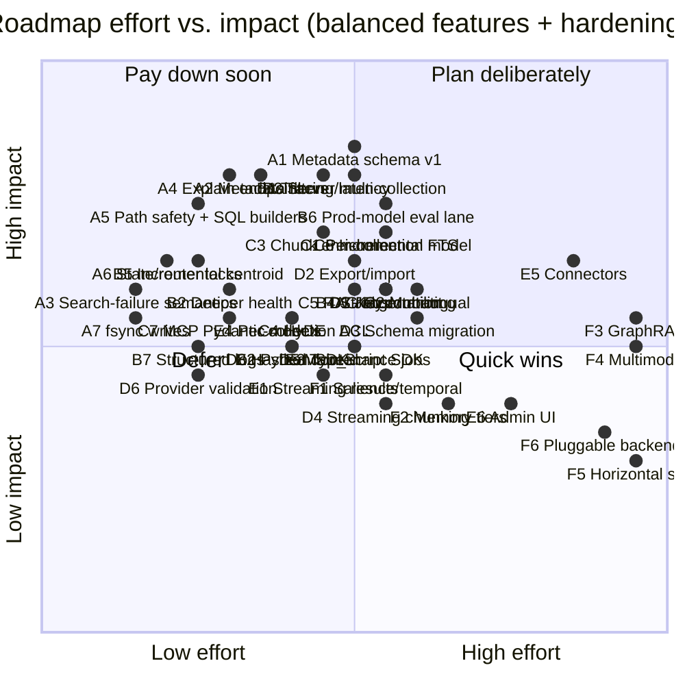

**Purpose**: Priority-ordered, checkable roadmap for evolving `archon-search` into a standalone world-class retrieval product.
**Audience**: Maintainers planning architecture and feature work.
**Status**: Draft
**Last reviewed**: 2026-05-20 / **Next review**: 2026-08-20

> Source of truth: current code under `archon_search/` verified against comparison docs `01_competitive_analysis_field.md` and `02_competitive_analysis_marveen.md`.

# Standalone Search Roadmap

## How to use this document

- Each numbered item is a checkbox. Check it when its **minimum acceptance criteria** are met, not when work begins.
- Priority groups (P0–P5) are ordered for sequencing, not for blocking — work within a group can parallelise once the prior group's invariants are in place.
- The [Effort vs. impact matrix](#effort-vs-impact-matrix) at the bottom is the planning view; the textual list is the contract.
- Code is the source of truth. When the doc and the code disagree, fix the doc in the same PR as the code change.

## Scope and current baseline

`archon-search` already exists as a standalone package (this repository); items below build on top of that baseline rather than recreating it.

Confirmed-shipped facts (verified against `archon_search/` on 2026-05-20):

- Standalone package, CLI (`archon-search`), config (`~/.archon-search/archon-search.toml`), CalVer release pipeline.
- MCP + REST control plane sharing one auth middleware; `GET /openapi.json` is authoritative for REST.
- Hybrid retrieval (vector + FTS + RRF) in `store.py`; cross-encoder reranker in `reranker.py`; context-window expansion in `pipeline.py`.
- Multi-collection routing via centroid pre-ranking in `router.py`.
- Async job model (`archon_search/jobs/`) for ingest/reindex operations.
- Bearer-token auth with namespace map (`middleware_auth.py`, `key_manager.py`); per-collection ACLs in `acl.py`.
- Deterministic eval harness in `tests/eval/` with thresholds and baseline (`EVL-1` in [530_technical_debt_refactoring_roadmap.md](../Architecture/530_technical_debt_refactoring_roadmap.md) tracks the production-model gap).
- Opt-in local telemetry (`archon_search/telemetry/`) with structural no-raw-query invariant.

Items already checked below reflect this baseline.

## Sequencing logic — balanced feature + hardening

Pure foundation-first sequencing pushes user-visible value too far out and lets hardening debt accumulate silently. Pure feature-first sequencing builds new ranking work on top of unsafe primitives (broad `except`, no fsync, stale router cache, no per-stage timings) and is impossible to debug in production. This roadmap interleaves both, by these rules:

1. **Every phase ships one user-visible feature, one operator-visible improvement, and one foundation step.** A phase that ships only foundation is allowed to slip; a phase that ships only features blocks the next phase.
2. **The eval harness gates ranking changes.** Any feature that touches ranking (items 9–11, 14, 19, 31) lands behind a benchmarked threshold in `tests/eval/`. No feature flag → no merge.
3. **Hardening items pulled from [`530_technical_debt_refactoring_roadmap.md`](../Architecture/530_technical_debt_refactoring_roadmap.md) are first-class entries here**, not invisible chores. They appear with `H‑N` IDs and link back to the debt register.
4. **Foundations are sized to the next feature, not to all future features.** Item 3 (metadata schema) ships the minimum needed for item 7 (filters); item 2 (full job contract) is only finished when item 20 (export/import) demands it.
5. **Measure before you change.** Observability (item 24) lands before HyDE / RAG Fusion (10, 11), not after — otherwise the eval harness will report a number with no story.
6. **Don't pre-pay for scale.** Items 33–36 stay last; their position is unchanged.

## Phase A — Trust the core (foundation + first user wins)

Goal: make the existing pipeline safe to extend, and ship two cheap features that operators and end users notice immediately.

- [ ] **A1. Metadata schema v1 (item 3, minimum slice)** — add typed per-chunk and per-document metadata fields to the LanceDB schema, with system / filterable / ranking / audit partitions documented. Scope is intentionally narrow: only the fields needed for `A2` and item 13. Surfaced in search responses.
- [ ] **A2. Metadata filters at search (item 7, minimum slice)** — source-path prefix/glob, `indexed-after`/`indexed-before`, file-type. Exposed on REST `/search`, MCP `search`, and the explain output (A4). Bounds-validated; uses the LanceDB `where()` API (no f-string SQL). A1 ships filterable fields populated; A2 only adds query-side wiring. **Language filtering deferred to C2** (real language detection) — A1's `language` field stays storage-only and is not exposed as a filter dimension here.
- [x] **A3. Hardening: search-failure semantics (`CON-5`)** ✅ — `/search` now returns HTTP 500 on pipeline stage failure (bare re-raise) and HTTP 504 on timeout; telemetry is emitted on both paths. See `BREAKING.md` `[next release]` — `POST /search` pipeline-exception behavior.
- [ ] **A4. Explain / debug endpoint (item 12)** — `/explain` (REST) + MCP tool returning vector rank, FTS rank, fused score, reranker score, matched filters, routing path, expansion-feature usage. Cheap to ship and unlocks every later ranking change.
- [ ] **A5. Hardening: input safety on ingest paths (`VAL-1`, `RP-5`)** — reject `..`-containing or symlink-escape paths in `/collections` and `/jobs/ingest`; replace all f-string `where()` builders in `store.py` with parameterised LanceDB calls.
- [ ] **A6. Hardening: state-store + router cache locks (`CON-2`, `CON-3`)** — `asyncio.Lock` around `IndexingStateStore` mutations; router cache invalidates on ingest/reindex/description-regen. One PR, both bugs.
- [ ] **A7. Hardening: stop writing without fsync (`PROG-1`, `TEL-2`, `SYN-1`)** — `IndexingStateStore`, telemetry writer, and sync manifest all `flush + fsync` before `os.replace`. Cheap durability win.

## Phase B — Make changes measurable (observability + retrieval seams)

Goal: stand up the measurement surface before adding ranking features, and ship the highest-leverage retrieval refactor.

- [ ] **B1. Observability and stage-level latency (item 24)** — per-stage timings (parse, embed, route, vector, FTS, fuse, rerank, end-to-end); correlation IDs from middleware → pipeline → telemetry (`ARCH-3`). Emitted as structured logs and surfaced on `/explain`.
- [ ] **B2. Deeper health and readiness (item 22)** — distinguish `live` vs. `ready`; cover storage connectivity, model warm-status, index build state, watcher state, queue depth. Operators need this before scaling load.
- [ ] **B3. Server-side multi-collection search primitive (item 8)** — embed the query once; one merge + rerank pass across collections. Co-designed with `/explain` (A4) so the routing path is debuggable.
- [ ] **B4. Stronger collection routing (item 9)** — summary-embedding + description + centroid hybrid alternatives; centroid stays the baseline. Gated by the eval harness.
- [ ] **B5. Hardening: incremental centroid update (`CON-4`, item 17)** — maintain `(sum, count)` on collection metadata; full recompute only on reindex. Eliminates an O(chunks) cost from every ingest.
- [ ] **B6. Hardening: production-model eval lane (`EVL-1`, item 4 follow-up)** — `live`-marker job on tag pushes that runs the eval harness against the real embedder/reranker (not the deterministic stubs). Gated by `tests/eval/thresholds.toml`.
- [ ] **B7. Hardening: structured logs + log rotation (item 25)** — JSON log option, telemetry JSONL rotation policy beyond retention-day pruning.

## Phase C — Quality features (ranking leaps, gated by the eval harness)

Goal: ship the features users actually came for. Each item must show a measurable eval lift to land.

- [ ] **C1. Per-collection embedding model (item 13)** — honour `CollectionMeta.embedding_model` at ingest and query; reject or downgrade cross-model routing explicitly; collection-level reindex workflow.
- [ ] **C2. Multilingual retrieval (item 14)** — multilingual embedding option, language metadata on chunks, language-aware FTS/tokenisation where the backend supports it.
- [ ] **C3. Chunk-level enrichment at ingest (item 19)** — local title / section path / heading ancestry / page / source-subtype / code-symbol context. Drives both ranking and filter quality.
- [ ] **C4. HyDE / query expansion (item 10)** — optional, opt-in; must clear the eval-harness bar before becoming default.
- [ ] **C5. RAG Fusion / multi-query decomposition (item 11)** — parallel sub-queries with fused ranking; benchmarked, not assumed.
- [ ] **C6. Hardening: incremental FTS maintenance (item 16)** — per-document add/update/delete against the existing FTS index instead of `replace=True` on every change set.
- [ ] **C7. Hardening: MCP responses behind Pydantic models (`API-4`)** — reuse REST `response_model` schemas in MCP so dataclass shape changes can't break MCP silently.

## Phase D — Operability and portability (becomes serious to run)

Goal: support real operational workflows — backup, migration, key rotation, maintenance.

- [ ] **D1. Job contract completion (item 2)** — formalise the protocol-agnostic contract; add `export`, `import`, `migration` job kinds with cancel/resume; backpressure and failure-isolation policy.
- [ ] **D2. Export / import / backup / restore (item 20)** — collection export with manifest, import with schema-version check, per-backend backup compatibility statement.
- [ ] **D3. Schema migration tooling (item 21)** — migration job kind (depends on D1); documented rollback rules; no forced full re-ingest.
- [ ] **D4. Streaming / incremental chunking (item 18)** — avoid full-document materialisation above a configurable threshold.
- [ ] **D5. Maintenance jobs and policies (item 26)** — stale-collection detection, compaction/vacuum where the backend needs it, orphan cleanup, failed-ingest retry, periodic integrity checks.
- [ ] **D6. Install-time / background provider validation (item 23)** — validate reranker provider config at install or warm-up while preserving the lazy-load startup contract.
- [ ] **D7. Hardening: multi-key auth with rotation (`SEC-1`)** — build on the existing `namespaces` map; key file format with expiry and revocation.
- [ ] **D8. Hardening: hashed `doc_id` mode for telemetry (`SEC-2`)** — opt-in; ADR-05 is the design anchor.

## Phase E — Surface and integrations

Goal: make adoption easy, and broaden the surface beyond power users.

- [ ] **E1. Streaming search results (item 27)** — partial-results delivery for large rerank candidate sets.
- [ ] **E2. Python SDK (item 28a)** — generated from OpenAPI.
- [ ] **E3. TypeScript SDK (item 28b)** — generated from OpenAPI.
- [ ] **E4. Per-collection access-control policies (item 30)** — builds on item 5 and D7.
- [ ] **E5. Connector and federation architecture (item 15)** — pluggable source connectors with sync checkpoints, ACL propagation, source-specific change detection.
- [ ] **E6. Admin / debug UI (item 29)** — only after A4 and B1 stabilise.

## Phase F — Advanced positioning (do not displace earlier work)

Goal: world-class differentiators. Gated by everything above.

- [ ] **F1. Salience and temporal weighting (item 31)** — explicit, disableable scoring component.
- [ ] **F2. Semantic memory tiers (item 32)** — recent / durable / pinned / archival; needs filters, metadata, explain.
- [ ] **F3. GraphRAG / entity-relationship retrieval (item 33)** — gated by a stable core and a real eval harness.
- [ ] **F4. Richer multimodal retrieval (item 34)** — high cost, complex eval; not a prerequisite for the product boundary.
- [ ] **F5. Reassess horizontal scaling (item 35)** — only after the storage contract stabilises.
- [ ] **F6. Reassess pluggable storage backends (item 36)** — first stabilise the contract above.

## Already shipped (P0 baseline)

These items from the original ordering are complete in the standalone repo:

- [x] **1. Extract Search into a standalone package and service** — this repo.
- [x] **4. Evaluation harness baseline** — `tests/eval/`; production-model lane is open as `B6`.
- [x] **5. Auth, authorization, namespace isolation, security trimming** — middleware + ACL + namespace map; rotation still open as `D7`.
- [x] **6. Stable external APIs: REST + MCP** — OpenAPI is authoritative; contract drift items `API‑*` tracked in the debt register.

## Out of scope until earlier items land

Worth tracking, not the first moves:

- Binary quantisation.
- Embedded widget / web dashboard.
- OpenAI-compatible API shim.
- Citation-rich streaming UI.
- Multi-region / distributed deployment.

These become sensible only once stable APIs, auth, metadata, explainability, evaluation, and predictable ingestion all exist.

## Effort vs. impact matrix

Coordinates are deliberate planning estimates, not measurements. Both axes run 0–1. Items already complete (P0 baseline) are omitted. Labels follow the phase IDs above.

**Quick wins** (low effort, high impact — Phase A and early B): A2 filters, A4 explain, A5 path/SQL safety, A6 locks, A7 fsync, B2 health, B5 incremental centroid.
**Plan deliberately** (high effort, high impact): A1 metadata schema, B1 tracing, B3 server multi-collection, B6 prod-model eval lane, C1 per-collection model, C3 chunk enrichment, C6 incremental FTS.
**Defer until triggered** (high effort, currently low impact): E6 admin UI, F3 GraphRAG, F4 multimodal, F5 horizontal scale, F6 pluggable backends.

## Final ordered backlog (single-list view)

If only one ordering is used for planning, use this — each phase is a coherent shipping unit and should be closed before the next opens.

**Phase A — Trust the core**
1. ⬜ A1. Metadata schema v1 (item 3 minimum slice).
2. ⬜ A2. Metadata filters at search (item 7).
3. ✅ A3. Search-failure semantics (`CON-5`) — shipped; see `BREAKING.md` `[next release]` — `POST /search` pipeline-exception behavior.
4. ⬜ A4. Explain / debug endpoint (item 12).
5. ⬜ A5. Ingest path safety + parameterised store queries (`VAL-1`, `RP-5`).
6. ⬜ A6. State-store and router cache locks (`CON-2`, `CON-3`).
7. ⬜ A7. fsync on durable writes (`PROG-1`, `TEL-2`, `SYN-1`).

**Phase B — Make changes measurable**
8. ⬜ B1. Observability and stage-level latency (item 24).
9. ⬜ B2. Deeper health and readiness (item 22).
10. ⬜ B3. Server-side multi-collection search primitive (item 8).
11. ⬜ B4. Stronger collection routing (item 9).
12. ⬜ B5. Incremental centroid update (item 17, `CON-4`).
13. ⬜ B6. Production-model eval lane (`EVL-1`).
14. ⬜ B7. Structured logs + log rotation (item 25).

**Phase C — Quality features**
15. ⬜ C1. Per-collection embedding model (item 13).
16. ⬜ C2. Multilingual retrieval (item 14).
17. ⬜ C3. Chunk-level enrichment (item 19).
18. ⬜ C4. HyDE / query expansion (item 10).
19. ⬜ C5. RAG Fusion / multi-query (item 11).
20. ⬜ C6. Incremental FTS maintenance (item 16).
21. ⬜ C7. MCP responses behind Pydantic models (`API-4`).

**Phase D — Operability and portability**
22. ⬜ D1. Job contract completion (item 2).
23. ⬜ D2. Export / import / backup / restore (item 20).
24. ⬜ D3. Schema migration tooling (item 21).
25. ⬜ D4. Streaming / incremental chunking (item 18).
26. ⬜ D5. Maintenance jobs and policies (item 26).
27. ⬜ D6. Install-time / background provider validation (item 23).
28. ⬜ D7. Multi-key auth with rotation (`SEC-1`).
29. ⬜ D8. Hashed `doc_id` for telemetry (`SEC-2`).

**Phase E — Surface and integrations**
30. ⬜ E1. Streaming search results (item 27).
31. ⬜ E2. Python SDK.
32. ⬜ E3. TypeScript SDK.
33. ⬜ E4. Per-collection access-control policies (item 30).
34. ⬜ E5. Connector and federation architecture (item 15).
35. ⬜ E6. Admin / debug UI (item 29).

**Phase F — Advanced positioning**
36. ⬜ F1. Salience and temporal weighting (item 31).
37. ⬜ F2. Semantic memory tiers (item 32).
38. ⬜ F3. GraphRAG (item 33).
39. ⬜ F4. Richer multimodal retrieval (item 34).
40. ⬜ F5. Reassess horizontal scaling (item 35).
41. ⬜ F6. Reassess pluggable storage backends (item 36).

## Recommendation

If the goal is **a full-featured world-class search system that is also safe to run in production**, the balanced sequence is:

1. ✅ Product boundary (done).
2. ⬜ **Phase A** — ship metadata + filters + explain (user wins), and close the most painful safety debt (path, SQL, locks, fsync) in the same release. Cheap, broad impact, unlocks every later phase. (Search-failure semantics is already closed via A3; see `BREAKING.md`.)
3. ⬜ **Phase B** — observability + production-model eval lane first; then the server-side multi-collection refactor and stronger routing. Without B1/B6 the later ranking work has no story.
4. ⬜ **Phase C** — the ranking-leap features (per-collection model, multilingual, enrichment, HyDE, RAG Fusion). Each gated by the eval harness.
5. ⬜ **Phase D** — finish the job contract, export/import, key rotation; the system becomes operable end-to-end.
6. ⬜ **Phase E and F** — surface (SDKs, UI, connectors) and differentiators (salience, GraphRAG, multimodal, scale). Only after A–D close.

The biggest mistakes this ordering protects against:

- Shipping HyDE / RAG Fusion (C4/C5) before observability (B1) and the production-model eval lane (B6) — you will not know whether they helped.
- Building filters (A2) without a metadata schema (A1) — they will be re-built within one release.
- Letting hardening (A3–A7, B5, C6, C7, D7, D8) accumulate behind features — the production incident curve is exponential.

## Related documents

- [`01_competitive_analysis_field.md`](./01_competitive_analysis_field.md) — feature-gap comparison versus R2R / Kotaemon / others.
- [`02_competitive_analysis_marveen.md`](./02_competitive_analysis_marveen.md) — UX and memory-tier comparison.
- [`../Architecture/530_technical_debt_refactoring_roadmap.md`](../Architecture/530_technical_debt_refactoring_roadmap.md) — debt register cross-referenced from items above (`SEC-1`, `EVL-1`, `CON-2`, `CON-4`, `ARCH-3`).
- [`../../BREAKING.md`](../../BREAKING.md) — already-queued contract changes that interact with items 6, 7, 12.
- [`../../roadmap.md`](../../roadmap.md) — active near-term roadmap.
