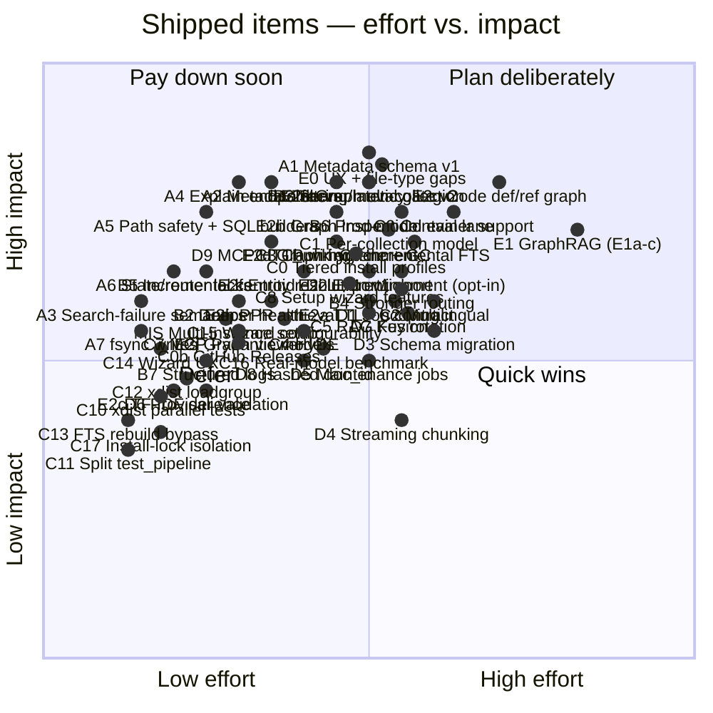
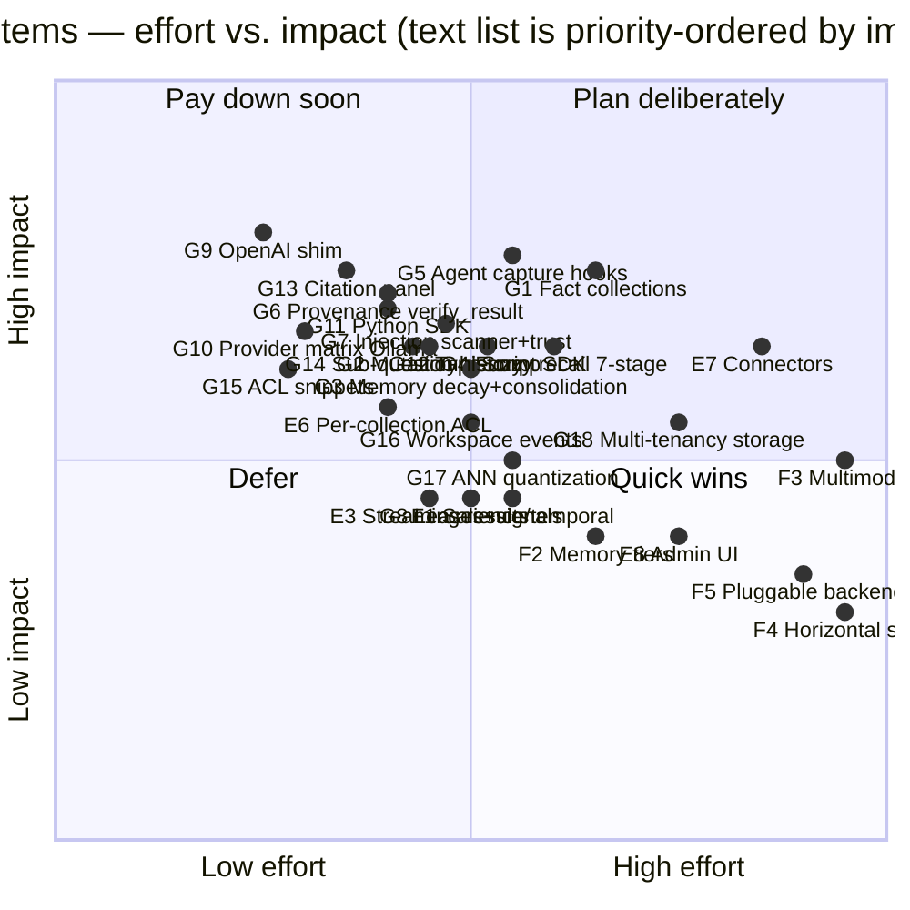

**Purpose**: Priority-ordered, checkable roadmap for evolving `archon-search` into a standalone world-class retrieval product.
**Audience**: Maintainers planning architecture and feature work.
**Status**: Draft
**Last reviewed**: 2026-07-12 / **Next review**: 2026-09-07

> Source of truth: current code under `archon_search/` verified against comparison docs `01_competitive_analysis_field.md` and `02_competitive_analysis_marveen.md`.

# Standalone Search Roadmap

## How to use this document

- Each numbered item is a checkbox. Check it when its **minimum acceptance criteria** are met, not when work begins.
- Status markers: ✅ = shipped and verified; ⬜ = open (not yet started or in progress); ⬛ = superseded (see replacement item for the canonical spec).
- Priority groups (P0–P5) are ordered for sequencing, not for blocking — work within a group can parallelise once the prior group's invariants are in place.
- The [Effort vs. impact matrix](#effort-vs-impact-matrix) at the bottom is the planning view; the textual list is the contract.
- Code is the source of truth. When the doc and the code disagree, fix the doc in the same PR as the code change.

## Scope and current baseline

`archon-search` already exists as a standalone package (this repository); items below build on top of that baseline rather than recreating it.

Confirmed-shipped facts (verified against `archon_search/` on 2026-05-20):

- Standalone package, CLI (`archon-search`), config (`~/.archon-search/archon-search.toml`), CalVer release pipeline.
- MCP + REST control plane sharing one auth middleware; `GET /openapi.json` is authoritative for REST.
- Hybrid retrieval (vector + FTS + RRF) in `store.py`; cross-encoder reranker in `reranker.py`; context-window expansion in `pipeline.py`.
- Multi-collection routing via centroid pre-ranking in `router.py`.
- Async job model (`archon_search/jobs/`) for ingest/reindex operations.
- Bearer-token auth with namespace map (`middleware_auth.py`, `key_manager.py`); per-collection ACLs in `acl.py`.
- Deterministic eval harness in `tests/eval/` with thresholds and baseline (`EVL-1` in [530_technical_debt_refactoring_roadmap.md](../Architecture/530_technical_debt_refactoring_roadmap.md) tracks the production-model gap).
- Opt-in local telemetry (`archon_search/telemetry/`) with structural no-raw-query invariant.

Items already checked below reflect this baseline.

## Sequencing logic — balanced feature + hardening

Pure foundation-first sequencing pushes user-visible value too far out and lets hardening debt accumulate silently. Pure feature-first sequencing builds new ranking work on top of unsafe primitives (broad `except`, no fsync, stale router cache, no per-stage timings) and is impossible to debug in production. This roadmap interleaves both, by these rules:

1. **Every phase ships one user-visible feature, one operator-visible improvement, and one foundation step.** A phase that ships only foundation is allowed to slip; a phase that ships only features blocks the next phase.
2. **The eval harness gates ranking changes.** Any feature that touches ranking (items 9–11, 14, 19, 31) lands behind a benchmarked threshold in `tests/eval/`. No feature flag → no merge.
3. **Hardening items pulled from [`530_technical_debt_refactoring_roadmap.md`](../Architecture/530_technical_debt_refactoring_roadmap.md) are first-class entries here**, not invisible chores. They appear with `H‑N` IDs and link back to the debt register.
4. **Foundations are sized to the next feature, not to all future features.** Item 3 (metadata schema) ships the minimum needed for item 7 (filters); item 2 (full job contract) is only finished when item 20 (export/import) demands it.
5. **Measure before you change.** Observability (item 24) lands before HyDE / RAG Fusion (10, 11), not after — otherwise the eval harness will report a number with no story.
6. **Don't pre-pay for scale.** Items 33–36 stay last; their position is unchanged.

## Phase A — Trust the core (foundation + first user wins)

Goal: make the existing pipeline safe to extend, and ship two cheap features that operators and end users notice immediately.

- [x] **A1. Metadata schema v1 (item 3, minimum slice)** — add typed per-chunk and per-document metadata fields to the LanceDB schema, with system / filterable / ranking / audit partitions documented. Scope is intentionally narrow: only the fields needed for `A2` and item 13. Surfaced in search responses. [[brief](../Completed/A1-metadata-schema-v1-brief.md), [plan](../Completed/A1-metadata-schema-v1-plan.md)]
- [x] **A2. Metadata filters at search (item 7, minimum slice)** — source-path prefix/glob, `indexed-after`/`indexed-before`, file-type. Exposed on REST `/search`, MCP `search`, and the explain output (A4). Bounds-validated; uses the LanceDB `where()` API (no f-string SQL). A1 ships filterable fields populated; A2 only adds query-side wiring. **Language filtering deferred to C2** (real language detection) — A1's `language` field stays storage-only and is not exposed as a filter dimension here. [[brief](../Completed/A2-metadata-filters-at-search-brief.md), [plan](../Completed/A2-metadata-filters-at-search-plan.md)]
- [x] **A3. Hardening: search-failure semantics (`CON-5`)** — `/search` now returns HTTP 500 on pipeline stage failure (bare re-raise) and HTTP 504 on timeout; telemetry is emitted on both paths. See `BREAKING.md` `[next release]` — `POST /search` pipeline-exception behavior. [[brief](../Completed/A3-search-failure-semantics-brief.md), [plan](../Completed/A3-search-failure-semantics-plan.md)]
- [x] **A4. Explain / debug endpoint (item 12)** — `POST /explain` (REST) + `explain` MCP tool (10th tool) returning vector rank, FTS rank, fused (RRF) score, reranker score, and routing path. Two roadmap sub-fields deferred: `matched_filters` → A4.1 (additive, after A2 ships); `expansion-feature usage` → A4.2 (additive, after Phase B/C HyDE / RAG Fusion ships). Unlocks every later ranking change. [[brief](../Completed/A4-explain-endpoint-brief.md), [plan](../Completed/A4-explain-endpoint-plan.md)]
- [x] **A5. Hardening: input safety on ingest paths** — reject `..`-containing/empty/whitespace/NUL/non-absolute paths in `/collections` and `/jobs/ingest` (and MCP `ingest_file`/`ingest_directory`); replace all f-string `where()`/`delete()`/`count_rows()` builders in `store.py` with quoted helpers behind a CI guard. [[brief](../Completed/A5-ingest-hardening-brief.md), [plan](../Completed/A5-ingest-hardening-plan.md)]
  - [x] A5a — ingest path safety (`validate_ingest_path`). Note: narrowed from "symlink-escape" to `..`-traversal + trivial-junk rejection; symlink scope deferred to a future `allowed_dirs` feature.
  - [x] A5b — SQL builder defense-in-depth (`_where_eq`/`_where_in` + `tests/test_no_fstring_sql.py` guard).
  - [x] A5c — synchronous `StoreBusyError` → HTTP 503 (`Retry-After: 30`) on `/ingest` and `/collections`; MCP `code="store_busy"`.
- [x] **A6. Hardening: state-store + router cache locks (`CON-2`, `CON-3`)** — `asyncio.Lock` around `IndexingStateStore` mutations; router cache invalidates on ingest/reindex/description-regen. One PR, both bugs. [[brief](../Completed/A6-hardening-locks-brief.md), [plan](../Completed/A6-state-store-router-cache-hardening-plan.md)]
- [x] **A7. Hardening: stop writing without fsync (`PROG-1`, `TEL-2`, `SYN-1`)** — `IndexingStateStore`, telemetry writer, and sync manifest all `flush + fsync` before `os.replace`. Cheap durability win. [[brief](../Completed/A7-fsync-hardening-brief.md), [plan](../Completed/A7-fsync-hardening-plan.md)]

## Phase B — Make changes measurable (observability + retrieval seams)

Goal: stand up the measurement surface before adding ranking features, and ship the highest-leverage retrieval refactor.

- [x] **B1. Observability and stage-level latency (item 24)** — per-stage timings (parse, embed, route, vector, FTS, fuse, rerank, end-to-end); correlation IDs from middleware → pipeline → telemetry (`ARCH-3`). Emitted as structured logs and surfaced on `/explain`. [[brief](../Completed/B1-observability-stage-latency-brief.md), [plan](../Completed/B1-observability-stage-latency-plan.md)]
- [x] **B2. Deeper health and readiness (item 22)** — distinguish `live` vs. `ready`; cover storage connectivity, model warm-status, index build state, watcher state, queue depth. Operators need this before scaling load. [[brief](../Completed/B2-deeper-health-readiness-brief.md), [plan](../Completed/B2-deeper-health-readiness-plan.md)]
- [x] **B3. Server-side multi-collection search primitive (item 8)** — embed the query once; one merge + rerank pass across collections. Co-designed with `/explain` (A4) so the routing path is debuggable. [[brief](../Completed/B3-server-side-multi-collection-search-brief.md), [plan](../Completed/B3-server-side-multi-collection-search-plan.md)]
- [x] **B4. Stronger collection routing (item 9)** — description-embedding + centroid hybrid blend shipped; centroid remains the default (`routing_strategy = "centroid"`), hybrid is opt-in via `routing_strategy = "hybrid"` + `routing_description_weight`. One new artifact: `CollectionMeta.description_embedding` stored per-collection and used by the router in hybrid mode. Multi-centroid routing (per-cluster centroids for diffuse corpora) deferred to a future item; roadmap item 9's multi-centroid scope is narrowed to this single-artifact implementation. Gated by the eval harness (`routing_mrr_hybrid ≥ routing_mrr_centroid` baseline). [[brief](../Completed/B4-stronger-collection-routing-brief.md), [plan](../Completed/B4-stronger-collection-routing-plan.md)]
- [x] **B5. Hardening: incremental centroid update (`CON-4`, item 17)** — incremental `(centroid_sum, chunk_count)` maintenance at store layer — three concrete defects fixed (batch-only overwrite, delete-ignores-centroid, O(chunks) sync-path rescan). Ingest is O(batch); delete is O(chunks-in-document); O(chunks) full scan retained only for explicit `recompute_collection_meta` (reindex, crash recovery, drift reset). Controlled by `centroid_incremental_enabled` flag (default `True`). [[brief](../Completed/B5-incremental-centroid-brief.md), [plan](../Completed/B5-incremental-centroid-plan.md)]
- [x] **B6. Hardening: production-model eval lane (`EVL-1`, item 4 follow-up)** — `live`-marker job on tag pushes that runs the eval harness against the real embedder/reranker (not the deterministic stubs). Gated by `tests/eval/thresholds.toml`. [[brief](../Completed/B6-production-model-eval-lane-brief.md), [plan](../Completed/B6-production-model-eval-lane-plan.md)]
- [x] **B7. Hardening: structured logs + log rotation (item 25)** — JSON log option, telemetry JSONL rotation policy beyond retention-day pruning. [[brief](../Completed/B7-structured-logs-rotation-brief.md), [plan](../Completed/B7-structured-logs-rotation-plan.md)]

## Phase C — Quality features (ranking leaps, gated by the eval harness)

Goal: ship the features users actually came for. Each item must show a measurable eval lift to land.

- [x] **C0. Tiered install profiles** — three profiles (`minimal`/`balanced`/`max`) for English and multilingual; `[database].profile`/`[database].multilingual` in `archon-search.toml`; disk-space checks, Jina CC-BY-NC-4.0 license gate for multilingual `balanced`/`max`, model pre-warming, reinstall guard with rollback, `--force --delete-db` escape hatch. [[brief](../Completed/C0-tiered-install-profiles-brief.md), [plan](../Completed/C0-tiered-install-profiles-plan.md)]
- [x] **C0b. GitHub Releases via git-cliff changelog** — `release.sh` requires `git-cliff >= 2.4`, prepends release notes to `CHANGELOG.md`, verifies commit count vs. provisional tag; `github-release` job in `archon-search-release.yml` creates the GitHub Release via REST API on every tag push. [[brief](../Completed/C0b-github-releases-changelog-brief.md), [plan](../Completed/C0b-github-releases-changelog-plan.md)]
- [x] **C1. Per-collection embedding model (item 13)** — `CollectionMeta.active_embedding_model` is the per-collection model tag; ingest/search/sync paths consult it; `validate_embedding_model()` raises `ModelValidationError` on cross-model mismatch; `SearchResponse.embedding_model` echoes the resolved model. [[brief](../Completed/C1-per-collection-embedding-model-brief.md), [plan](../Completed/C1-per-collection-embedding-model-plan.md)]
- [x] **C2. Multilingual retrieval (item 14)** — fasttext `lid.176.ftz` language detection at ingest; `language=<code>` single-collection filter; three-state contract (`""`/`"unknown"`/`"<code>"`); CC-BY-SA-3.0 license gate; language-aware FTS tokenization; `FilterFlags.language_filter_used` telemetry; `/status` warning for untagged collections. [[brief](../Completed/C2-multilingual-retrieval-brief.md), [plan](../Completed/C2-multilingual-retrieval-plan.md)]
- [x] **C3. Chunk-level enrichment at ingest (item 19)** — local title / section path / heading ancestry / page / source-subtype / code-symbol context. Drives both ranking and filter quality.
  - [x] **C3a** — Heading enrichment (`_heading`, `_section_path`) for text-format sources (`.md`, `.txt`, `.rst`, `.html`). [[brief](../Completed/C3a-markdown-structural-enrichment-brief.md), [plan](../Completed/C3a-markdown-structural-enrichment-plan.md)]
  - [x] **C3b** — Page-number extraction (`_page_start`, `_page_end`) for PDF and image sources via docling page-break markers. Shipped 2026-06-07. [[brief](../Completed/C3b-page-number-extraction-brief.md), [plan](../Completed/C3b-page-number-extraction-plan.md)]
  - [x] **C3c** — Code-symbol context (`_symbol_type`, `_symbol_subtype`, `_containing_function`, `_containing_class`, `_module_path`) for source-code chunks (`.py`, `.ts`, `.js`, `.go`, `.rs`, `.java`, `.sh`) via tree-sitter (optional `[code]` extra). [[brief](../Completed/C3c-code-symbol-context-brief.md), [plan](../Completed/C3c-code-symbol-context-plan.md)]
- [x] **C4. HyDE / query expansion (item 10)** — optional `archon-search[hyde]` extra; `hyde=true` on `/search`, `/explain`, or MCP tools generates a hypothetical doc via Anthropic API and uses its embedding for vector retrieval; off by default; silent fallback on every failure path. Mutually exclusive with RAG Fusion (C5). [[brief](../Completed/C4-hyde-query-expansion-brief.md), [plan](../Completed/C4-hyde-query-expansion-plan.md)]
- [x] **C5. RAG Fusion / multi-query decomposition (item 11)** — `rag_fusion=true` decomposes the query into N variants via Anthropic API, searches in parallel, fuses via second-pass RRF; optional `archon-search[rag_fusion]` extra; mutually exclusive with HyDE (C4). [[brief](../Completed/C5-rag-fusion-brief.md), [plan](../Completed/C5-rag-fusion-plan.md)]
- [x] **C6. Hardening: incremental FTS maintenance (item 16)** — `store.optimize_fts()` replaces `rebuild_fts_index()` at all ingest and sync sites (O(delta) vs. O(collection)); delete-path FTS maintained via `optimize_fts` after `delete_document`; `reindex_metadata` no longer triggers any FTS call. [[brief](../Completed/C6-incremental-fts-maintenance-brief.md), [plan](../Completed/C6-incremental-fts-maintenance-plan.md), [spike-findings](../Completed/C6-spike-findings.md)]
- [x] **C7. Hardening: MCP responses behind Pydantic models (`API-4`)** — all ten MCP tools return validated Pydantic schemas (`McpSearchResponse`, `IngestResultSchema`, `CollectionDetailSchema`, …) with `extra="forbid"`; `ValidationError` is caught and surfaced as a structured error; field-narrowing breakages recorded in `BREAKING.md`. [[brief](../Completed/C7-mcp-pydantic-responses-brief.md), [plan](../Completed/C7-mcp-pydantic-responses-plan.md)]

### Test-suite infrastructure (parallel work, shipped during Phase C)

- [x] **C10. Test-suite speed — pytest-xdist + `--dist=loadfile`** — `pytest-xdist` dev-dep, parallel `addopts`, `-n0` in CI for `--cov-append` correctness; baseline test wall-time win. [[brief](../Completed/C10-test-suite-speed-brief.md), [plan](../Completed/C10-test-suite-speed-plan.md)]
- [x] **C11. Split `test_pipeline.py`** — break the monolithic 4 000-line `test_pipeline.py` into `tests/pipeline/{test_pipeline_ingest,test_pipeline_search,test_pipeline_multi}.py` with shared helpers in `tests/pipeline/conftest.py`. [[brief](../Completed/C11-split-test-pipeline-brief.md), [plan](../Completed/C11-split-test-pipeline-plan.md)]
- [x] **C12. Switch xdist to `--dist=loadgroup` with session-scoped store** — session-scoped `connected_store`, `xdist_group("mcp")` on 16 MCP-stub files, `xdist_group("install")` on 3 install-lock files; median wall time on a 14-core machine ≈ 127s with thread caps (from 6.5 min before C10). [[brief](../Completed/C12-dist-load-session-store-brief.md), [plan](../Completed/C12-dist-load-session-store-plan.md)]
- [x] **C17. Install-lock parallel-test isolation + `Path.home()` ratchet guard** — per-worker `ARCHON_SEARCH_DATA_DIR` autouse fixture eliminates xdist install-lock collisions; `test_no_hardcoded_path_home.py` ratchet prevents new `Path.home()` callsites outside `paths.py`; 3 `install.py` callsites migrated to `get_data_dir()`. [[brief](../Completed/C17-install-lock-parallel-isolation-brief.md), [plan](../Completed/C17-install-lock-parallel-isolation-plan.md)]

### Active backlog (post-Phase C, not yet sequenced into D/E/F)

- [x] **C8. Extended setup wizard with optional feature selection** — adds an interactive feature-selection step to the wizard so users can enable any optional feature at install time (including automatic `pip install archon-search[<extra>]` invocation). [[investigation](../Completed/C8-wizard-optional-features-investigation.md), [plan](../Completed/C8-wizard-optional-features-plan.md)]
- [x] **C9. Container support (Docker + GHCR)** — `docker run` and `docker compose up` start `archon-search` configured purely via env vars; all runtime state on one mounted volume; CPU (`:latest`) and NVIDIA GPU (`:gpu`) images published to GHCR on tag push. [[brief](../Completed/C9-container-support-brief.md), [plan](../Completed/C9-container-support-plan.md)]
- [x] **C13. Test perf: bypass FTS rebuild in tests that don't query FTS** — adds `rebuild_fts: bool = True` to `SearchPipeline.ingest_directory()` (mirroring `ingest_file`); median wall time improved from ~127s to ~71s. [[brief](../Completed/C13-fts-rebuild-test-bypass-brief.md), [plan](../Completed/C13-fts-rebuild-test-bypass-plan.md)]
- [x] **C14. Wizard UX improvements** — `--dry-run` flag, `--next-steps` suppression, improved summary formatting, structured error output, consistent exit-code contract. [[brief](../Completed/C14-wizard-ux-improvements-brief.md), [plan](../Completed/C14-wizard-ux-improvements-plan.md)]
- [x] **C15. Wizard configurability expansion** — `--host`, `--port`, `--server-key`, `--enable-hyde`, `--enable-rag-fusion`, and six other Tier-1 Click options; `_apply_wizard_features_to_toml()` write logic; prints full API key with source. [[brief](../Completed/C15-wizard-configurability-expansion-brief.md), [plan](../Completed/C15-wizard-configurability-expansion-plan.md)]
- [x] **C16. Real-model search latency benchmark** — `live_benchmark` pytest marker; `BenchmarkThresholds` + `load_benchmark_thresholds()`; steady-state p95 (100-iter) and cold-load p90 (N=10) tests with real fastembed + cross-encoder; model-cache restore + prefetch in CI. [[brief](../Completed/C16-real-model-search-latency-benchmark-brief.md), [plan](../Completed/C16-real-model-search-latency-benchmark-plan.md)]

## Phase D — Operability and portability (becomes serious to run)

Goal: support real operational workflows — backup, migration, key rotation, maintenance.

- [x] **D1. Job contract completion (item 2)** — formalise the protocol-agnostic contract; add `export`, `import`, `migration` job kinds with cancel/resume; backpressure and failure-isolation policy.
- [x] **D2. Export / import / backup / restore (item 20)** — collection export with manifest, import with schema-version check, per-backend backup compatibility statement.
- [x] **D3. Schema migration tooling (item 21)** — migration job kind (depends on D1); documented rollback rules; no forced full re-ingest.
- [x] **D4. Streaming / incremental chunking (item 18)** — avoid full-document materialisation above a configurable threshold.
- [x] **D5. Maintenance jobs and policies (item 26)** — stale-collection detection, compaction/vacuum where the backend needs it, orphan cleanup, failed-ingest retry, periodic integrity checks.
- [x] **D6. Install-time / background provider validation (item 23)** — validate reranker provider config at install or warm-up while preserving the lazy-load startup contract.
- [x] **D7. Hardening: multi-key auth with rotation (`SEC-1`)** — build on the existing `namespaces` map; key file format with expiry and revocation.
- [x] **D8. Hardening: hashed `doc_id` mode for telemetry (`SEC-2`)** — `[telemetry] hash_doc_ids = true` applies HMAC-SHA256 to `result_doc_ids`; salt at `get_data_dir()/.telemetry-salt` (mode 0600); `doc_ids_hashed` field in every entry; `GET /status` exposes `telemetry.hash_doc_ids_enabled`. See `archon_search/telemetry/hasher.py` and ADR-05 Amendment. [[brief](../Backlog/D8-hashed-doc-id-telemetry-brief.md), [plan](../Backlog/D8-hashed-doc-id-telemetry-team-plan.md)]
- [x] **D9. MCP HTTP server wiring** — mount the fully-implemented FastMCP HTTP app at `/mcp` on the existing REST port (8765) inside `create_app()`'s lifespan; single uvicorn, shared `APIKeyMiddleware`, gated by `[mcp].enabled` (default `true`). 17 tools register (13 always + 4 key-management when `key_store` present); the authenticated namespace propagates per-request into every tool closure (`_get_request_namespace()`); telemetry writer + `key_store` are wired from the lifespan; `GET /status` and `GET /health` gain an `mcp: McpStatusDetail | null` field. Mount/namespace mechanism anchored by [ADR-09](../ADRs/09_mcp_http_mount_and_namespace_propagation.md). [[brief](../Completed/mcp-wiring-brief.md), [plan](../Completed/mcp-wiring-team-plan.md)]

## Phase E — Surface and integrations

Goal: make adoption easy, and broaden the surface beyond power users.

- [x] **E0. UX limitations and file-type gaps** — ✓ **All five sub-features shipped.** (E0a) markitdown as core dep, 8 additional file extensions; (E0b) HyDE/RAG Fusion key-available signals, `FAILED_EXPIRED` job state, telemetry truncation count, ACL sidecar warnings, Linux `EnvironmentFile`/macOS wrapper-script service env; (E0c) `list_documents` cursor pagination, `max_fanout` and `top_k_max` from TOML config, `GET /status` search detail; (E0d) configurable `max_file_mb` guard, `code="file_too_large"` MCP result code; (E0e) filters compose with multi-collection fan-out, `applied_filters` echoed in `SearchResponse`, MCP language restriction lifted. Windows service remains deferred.
- [x] **E1. GraphRAG / entity-relationship retrieval (item 33)** — ✓ **shipped as E1a + E1b + E1c** (2026-06/07), with deliberate deviations from this item's original spec (audit 2026-07-03). What shipped: (1) Extraction is **spaCy NER + C3 code-symbol, no LLM** — deterministic, zero-cost, offline (`graph_extractor.py`); stable `entity_id` via `make_stable_entity_id(entity_type, entity_name)` as specced; per-collection `_archon_graph_{col}_nodes`/`_edges`/`_communities` LanceDB tables. The configurable-LLM extraction pass (Haiku default) remains a config-guarded stub → **E2i**. Edges are co-occurrence `related_to` only; the typed-relationship vocabulary (USES, IMPLEMENTS, DEPENDS_ON, …) exists in `RelationshipType` but has no producer yet → **E2g** (code def/ref) + **E2i** (LLM). (2) All three `graph_mode` variants shipped on `/search`, `search_many`, and MCP `search`: `naive` (n-gram → first-degree neighbour expansion), `local` (Leiden communities + MMR representative chunks blended with hybrid), `global` (community representative chunks capped by `max_global_candidates`). Communities carry **no LLM summaries** (`_generate_llm_summary` raises `NotImplementedError`; `summary_text` is always null) → **E2i**. (3) Graph-path provenance in `/explain` shipped (E1c: `TraversalStep`/`GraphProvenance`). The Kuzu embedded-DB migration originally specced here was dropped — `backend_threshold_edges` warns instead; the scale path is now a **lance-graph** spike (see graph-track note below). Eval caveat: `graph_mrr` is report-only and the local/global floors are calibrated on the hybrid-fallback path, not real community retrieval → hardened in **E2e**.
- [x] **E2. TTL, scoping, and entity graph** — (a) TTL and (b) scoping ✓ **shipped as E2a** (2026-07): `expires_at` + `scopes` chunk columns (`STORE_SCHEMA_VERSION = 1`), request/collection TTL precedence, `scope_filter=` with exact + trailing-wildcard semantics on `/search`, `/explain`, and MCP, expired-chunk pruning in the maintenance loop, `GET /collections/{name}/expiring`. (c) Entity graph inspection ✓ **shipped as E2b** (2026-07): `GET /graph/{collection}` and `GET /graph/cross-collection?collections=a,b` return adjacency JSON (nodes: `entity_id`, name, type, subtype, `chunk_count`, `salience`; edges: source/target, `relationship_type`, `weight`, `source_chunk_ids`) **or GraphML** (`?format=graphml`; networkx already in `[graph]` extras). Derived fields computed at read time from a `(entity_id, chunk_id, doc_id)` mentions incidence table; deterministic truncation under `[graph] max_inspection_nodes/max_inspection_edges`; cross-collection deduplicated by `entity_id` (weighted-average salience). MCP `get_graph` / `get_graph_cross_collection` summary tools. [[brief](../Completed/e2b-graph-inspection-brief.md), [plan](../Completed/e2b-graph-inspection-team-plan.md)] Minimum acceptance: TTL pruning tested with an expired chunk (✓ E2a); scope filter tested with two non-overlapping scopes (✓ E2a); entity graph endpoint tested with a seeded graph incl. a re-ingest idempotency test (✓ E2b).
> **Graph track (E2b → E2j) — strategy and sequencing.** Evidence base (2026-07-03 competitive + literature review): the two *replicated* GraphRAG wins are (i) community/hierarchical summarization for global sensemaking and (ii) graph expansion for bridge multi-hop retrieval; graphs measurably **lose** on plain fact retrieval (GraphRAG-Bench: vanilla hybrid+rerank 60.9% vs MS GraphRAG 49.3% on fact-level questions) and code-graph evidence is stronger than prose (RepoGraph: +32.8% average relative on SWE-bench). Microsoft's LazyGraphRAG validated no-LLM-at-ingest graph construction (~0.1% of GraphRAG indexing cost, comparable global quality) but has never been open-sourced — archon-search is positioned to own that shape as a hardened local server. Positioning: **hybrid-first, graph-optional** — the zero-cost deterministic graph is additive lift over vector+FTS+rerank, never a gate; LLM enrichment is opt-in (E2i), never required. Recommended execution order: E2b → E2c → **E2d (hygiene before the graph grows)** → **E2e (eval gate — every ranking-affecting item after it gates on E2e)** → E2f → E2g → E2h → E2i; E2j any time after E2b. Scale path: when `backend_threshold_edges` warnings fire in practice, spike **lance-graph** (Cypher-capable graph queries over the Lance columnar format — same substrate as our store, no graph-DB sidecar; crates.io `lance-graph`, active since 2025-12) before considering any external graph DB.

- [x] **E2c. Graph salience upgrade — TF-IDF entity scoring** ✅ — upgrade the E2b-derived `salience` from per-collection chunk frequency to a TF-IDF-style score: `salience = (chunk_freq_in_collection / total_chunks_in_collection) * log(total_collections / collections_containing_entity + 1)`. IDF denominator is a per-request lookup — no separate table, no re-extraction. Exposed on both inspection endpoints via `?salience=tfidf`; default remains `frequency`. [[brief](../Completed/e2c-graph-salience-tfidf-brief.md), [plan](../Completed/e2c-graph-salience-tfidf-team-plan.md)]

- [x] **E2d. Graph lifecycle hygiene — freshness, GC, and namespace-scoped tables** ✅ — doc-scoped graph cleanup wired into `delete_document` (delete mentions by `doc_id`, then drop orphan nodes/edges); maintenance policy `graph_gc` (default `true` when graph enabled) prunes stale mentions and orphan nodes/edges, triggers community rebuild on membership change; `GET /status` gains `stale_mention_count` + `last_graph_gc_at`; namespace-scoped graph table names (`_archon_graph_{ns}__{col}_*`) isolate multi-namespace graphs. [[brief](../Completed/e2d-graph-lifecycle-hygiene-brief.md), [plan](../Completed/e2d-graph-lifecycle-hygiene-team-plan.md)]

- [x] **E2e. Deterministic graph eval gate v2 — bridge multi-hop recall + negative control** ✅ — frozen in-repo subsets of MuSiQue-Ans (CC BY 4.0, bridge multi-hop), 2WikiMultiHopQA (Apache-2.0, bridge+comparison), and HotpotQA-distractor (negative control). Metrics: Recall@{2,5,10} + MRR; A/B across `graph_mode ∈ {off, naive, local, global}`; two-sided gate (bridge lift + negative control floor). Determinism guards: pinned fixtures, seeded Leiden, stub embedder. Every ranking-affecting graph item (E2f–E2i) now gates on these thresholds. [[brief](../Completed/e2e-graph-eval-gate-v2-brief.md), [plan](../Completed/e2e-graph-eval-gate-v2-team-plan.md)]

- [x] **E2f. Entity resolution v1 — synonym edges + canonical merge (no LLM)** — string-normalization-only dedup fragments entities ("K8s" vs "Kubernetes" vs "kubernetes cluster"); practitioner analyses mark <~85% resolution accuracy as the point where a KG turns "toxic" (one bad merge poisons every path), and HippoRAG's **synonymy edges** (embedding cosine ≥ threshold via ANN) are the proven no-LLM mitigation. Scope: (1) synonym edges: embed entity names with the collection's fastembed model, ANN pass over node names (LanceDB — same substrate) at `graph build-communities` time and per ingest batch; add `relationship_type="synonym_of"` edges above `[graph] synonym_threshold` (default 0.85); expander, community builder, and E2h PPR traverse them transparently; (2) operator alias table for pinned merges (`[graph] alias_file`); (3) **label-free graph-health metrics** (no gold KG needed): dedup-merge rate, singleton-node %, orphan rate, connected-component count — surfaced in MCP `get_graph` stats and `GET /status`, catching extraction regressions (e.g. a spaCy upgrade fragmenting entities). Gated by E2e. Minimum acceptance: a fixture with surface variants of one entity becomes one connected component via synonym edges; health metrics exposed and asserted; E2e gate green (bridge recall up, negative control flat).

- [x] **E2g. Code def/ref typed graph — tree-sitter edges, PageRank salience, impact tool** — today code chunks contribute **isolated single-entity nodes with no edges** (verified: the extractor emits one `code_symbol` per code chunk, so pairwise co-occurrence yields nothing) — the code half of the graph is disconnected, while the evidence for code graphs is the strongest in the field (RepoGraph: +32.8% average relative success on SWE-bench; Aider's PageRank repo-map; cAST AST-chunking: +4.3 Recall@5 on RepoEval; 25k★ codebase-memory-mcp and 76k★ graphify prove demand). Scope: (a) **AST-aware chunk boundaries** for code files (cAST split/merge on tree-sitter nodes; chunker-level, independent value, no LLM); (b) def/ref extraction via the existing C3c tree-sitter layer → **typed edges** `calls`/`imports`/`defines`/`inherits` — the first real producer for the `RelationshipType` vocabulary — each edge tagged `extraction_method: "extracted" | "inferred"` (graphify's confidence pattern); (c) **PageRank salience** for `code_symbol` nodes (igraph already ships with `[graph]`; Aider pattern — entry points outrank leaf helpers); (d) MCP **`graph_impact`** tool: symbol → callers/callees/transitive blast radius (the `detect_changes`/`get_pr_impact` agent workflow competitors converge on). Gated by the E2e code lane (RepoBench-R A/B: def/ref expansion vs co-occurrence). Minimum acceptance: def/ref edges produced for Python + TypeScript fixtures; PageRank ranks an entry-point symbol above leaf helpers; `graph_impact` returns the callers of a changed symbol; code-lane eval ≥ baseline.

- [x] **E2h. PPR retrieval mode — principled multi-hop on the cheap graph** — naive-mode expansion is uncapped first-degree neighbour appending; **Personalized PageRank seeded by query entities** is the published upgrade (HippoRAG: 2WikiMultiHopQA R@5 68.2 → 89.1; fast-graphrag productized PPR on a cheap graph) and runs on exactly the graph we already have (igraph shipped). Scope: `graph_mode="ppr"` — n-gram entity match → personalization vector weighted by E2b mention counts → igraph PPR over co-occurrence + synonym (E2f) + def/ref (E2g) edges → top-K entities' chunks (via mentions) blended **additively** into hybrid RRF (never replaces dense/FTS — HippoRAG-2 and Mem0's own results show graph-only retrieval regresses); expansion-term cap applied, and the same cap retrofitted to naive mode (closes the unbounded-append gap). Config: `[graph] ppr_damping = 0.85`, `ppr_top_entities = 20`. REST/MCP surface identical to existing modes; `/explain` provenance shows PPR scores per traversal step. Gated by the E2e two-sided gate. Minimum acceptance: a bridge-doc fixture reachable only via 2-hop association surfaces in top-5 under `ppr`; HotpotQA negative control non-regressing; naive mode capped.

- [x] **E2i. Opt-in LLM graph enrichment — community summaries + typed extraction (default stays no-LLM)** — the two capabilities structurally out of reach without an LLM are **community summaries** (global sensemaking — MS GraphRAG's LLM-judged win-rates of 72–83% on comprehensiveness for corpus-level questions) and **typed semantic relations**; both are wired as stubs today (`_generate_llm_summary` raises `NotImplementedError`; `extraction_model` logs a warning and proceeds spaCy-only). Scope: (1) implement community summarization — when `[graph] extraction_model` is configured (Anthropic, or a local Ollama model via the G10 provider matrix for zero-cost offline), `graph build-communities` writes real `summary_text` per community; local/global modes and MCP `get_graph` **prefer summaries when present, representative chunks otherwise** (LazyGraphRAG-style deferral remains the default posture); (2) implement the typed-relationship extraction pass producing `uses`/`implements`/`depends_on` edges tagged `extraction_method: "llm"`; (3) ~~`summary_refresh`~~ deferred to follow-up — E2i does full-rebuild only (maintenance-loop incremental re-summarization of changed communities is a Q4 item); (4) cost guards: per-pass token budget, `max_communities_to_summarize`, and cost logged to `IngestResult.warnings`/status. All defaults remain no-LLM; the deterministic default path is byte-identical with the feature unconfigured. Minimum acceptance: deterministic-stub LLM tests for summary and typed-edge writes; global mode consumes `summary_text` when present; unconfigured behavior unchanged.

- [x] **E2j. Graph viewer — single-file local UI** ✅ — every credible competitor ships a visual graph surface (LightRAG WebUI, graphify `graph.html`, Understand-Anything dashboard, codebase-memory-mcp 3D UI at :9749, Neo4j Bloom); archon-search has none until E8. Scope: `GET /graph/{collection}/view` serves **one self-contained static HTML file** (bundled into the package; no CDN, no npm, no build step — vanilla canvas force-layout) that fetches the E2b adjacency JSON with the caller's Bearer token and renders: nodes sized by salience and colored by entity type, edges weighted, click-to-inspect side panel (chunk_count, source_chunk_ids), text search, `truncated` banner. Becomes the E8 admin-UI graph panel later (same markup, HTMX-compatible). Minimum acceptance: renders a seeded graph end-to-end (browser check documented or automated); zero external network requests; works with `graph.enabled=false` returning the same 422 as the data endpoints.

- [x] **G9. OpenAI-compatible API shim** ✅ — `GET /v1/models` + `POST /v1/chat/completions` (streaming and non-streaming) mounted at `/v1` on the existing REST port; `OpenAI401Middleware` rewrites bodyless 401s to OpenAI error envelope; `[openai_shim]` TOML section (`enabled`, `inject_citations`, `top_k`); Pydantic SSE chunk models; materialize-before-stream pattern so errors return JSON, not broken SSE. Verified end-to-end with `openai.AsyncOpenAI` via `httpx.ASGITransport` (12 SDK-level E2E tests covering model listing, single-collection and fanout completions, streaming, multi-turn conversation history, citation format, `inject_citations=False`, and all error shapes). [[plan](../Completed/g9-openai-shim-team-plan.md)]
- [x] **G10. LLM provider matrix for query expansion** `[effort 0.30 · impact 0.67 · ratio 2.23]` — HyDE (C4) and RAG Fusion (C5) currently require Anthropic. Add `[hyde].provider` and `[rag_fusion].provider` config with values: `anthropic` (current default), `openai` (via `openai` Python package; `[hyde].openai_model`), `ollama` (via `ollama` Python package; `[hyde].ollama_model` and `[hyde].ollama_base_url`). Ollama enables fully offline HyDE/RAG Fusion — no API key, no network, no cost. Provider abstraction: `QueryExpansionProvider` protocol with `async generate_hypothetical_doc(query: str) -> str` and `async decompose_query(query: str) -> list[str]` methods. Existing Anthropic implementation refactored to implement the protocol. Same silent-fallback behavior when provider unavailable. `archon-search[ollama]` extra installs the `ollama` package. `GET /status` exposes `hyde.provider` and `rag_fusion.provider`. Minimum acceptance: each provider tested with a mock backend; fallback tested for each provider failure mode.
- [x] **G15. Permission-aware search snippets** ✅ — add `acl_context: bool` param to `POST /search` (default false). When enabled, each returned chunk includes `acl_gate: {allowed_principals: list[str]|null, source: "frontmatter"|"sidecar"|"collection_default"|null, sidecar_path: str|null, warnings: list[str]}` showing which principals can see this chunk and where the ACL came from (three-way source enum: `"frontmatter"` / `"sidecar"` / `"collection_default"`; `null` for pre-G15 chunks). `POST /explain` includes `acl_gate` unconditionally on every `ExplainResult`; `ExplainNearMiss` does not carry it. Three new nullable per-chunk LanceDB columns (`acl_source`, `acl_sidecar_path`, `acl_warning`) added via `migrate_acl_provenance` (auto-applied at server startup, no `STORE_SCHEMA_VERSION` bump). All fail-open branches in `parse_acl_value` and `read_acl_sidecar` now surface as structured `warnings` in `AclResolutionResult` and `acl_gate.warnings`. Chunks the requesting namespace cannot see remain excluded regardless of `acl_context`. Pre-G15 chunks return `acl_gate.source: null`. [[brief](../Completed/2026-07-15-360-permission-aware-search-snippets-brief.md), [plan](../Completed/2026-07-15-360-permission-aware-search-snippets-team-plan.md), [tasks](../Completed/2026-07-15-360-permission-aware-search-snippets-tasks.md)]
- [ ] **G13. Citation panel and evidence attribution** `[effort 0.35 · impact 0.75 · ratio 2.14]` — `POST /search` and MCP `search` gain a `citations: bool` parameter (default false). When enabled, each result chunk includes a `citation` object: `source_snippet` (exact matched text ±200 characters with matched span as `{start: int, end: int}` character offsets for client-side highlighting); `source_highlight` (the specific FTS term or vector cluster that matched); `page_ref` (`_page_start`–`_page_end` from C3b if available); `section_path` (`_section_path` from C3a if available); `symbol` (`_containing_function`/`_containing_class` from C3c if a code chunk); `figure_caption` (`_figure_caption` if a VLM figure chunk from F3); `trust_score` (G7 field). Designed for direct rendering: MCP clients can show it in a tool response card; the admin UI search playground (E6) renders it inline. `POST /explain` already returns all of this in full detail; `citations=true` on `/search` is the lightweight version without full ranking diagnostics. Minimum acceptance: citation object tested for raw, fact, figure_description, table_data, and agent_session chunk types; snippet boundary tested at document start/end.
- [ ] **G6. Provenance and verify_result endpoints** `[effort 0.40 · impact 0.72 · ratio 1.80]` — `POST /verify` accepts `{result_doc_id, query, collection}` and returns a `VerificationReport`: source file path, ingestion timestamp, ingest job ID, ACL sidecar status, `_page_start`/`_page_end`, `_section_path`, `_symbol_type`/`_containing_function`, mutation history summary (G2), recall count and `last_recalled_at` (F1), salience, `_tier` (F2), which RRF streams returned it (vector rank, FTS rank, graph rank if E7 active), reranker score, `_fact_confidence` if `_chunk_type == "fact"`, and a `confidence: "high"|"medium"|"low"` assessment based on source type + recall history + mutation count. MCP `verify_result` tool wraps this endpoint. `GET /provenance/{collection}/{chunk_id}` returns the static provenance chain without a query: full mutation log, embedding model, chunk boundaries, scope, TTL, tier. Both endpoints require auth; write a `"verify"` event to telemetry (no raw query logged). Minimum acceptance: VerificationReport schema tested for a raw chunk, a fact chunk, and a graph-retrieved chunk; `GET /provenance` tested for a chunk with mutation history.
- [ ] **G11. Python SDK** `[effort 0.40 · impact 0.70 · ratio 1.75]` — generated from `GET /openapi.json` using `openapi-python-client`; published to PyPI as `archon-search-client`. Requirements: async and sync clients both present (`AsyncArchonClient`, `ArchonClient`); typed Pydantic models for all request/response schemas; auth helper reads `ARCHON_SEARCH_API_KEY` env if not passed; retry with exponential backoff on 503 (StoreBusyError); documented `README.md` with a 10-line quickstart. SDK lives under `sdk/python/`; version tracks server version via CalVer. CI: SDK regenerated and tested on every tag push; `test_sdk_contract.py` integration test runs SDK against a live `TestClient` instance to catch schema drift. Minimum acceptance: all 17 REST endpoints have a typed SDK method; SDK quickstart example runs against a live server.
- [ ] **G14. Sub-question decomposition pipeline** `[effort 0.43 · impact 0.65 · ratio 1.51]` — extends RAG Fusion (C5). Where RAG Fusion creates N rephrased variants of the same question, sub-question decomposition creates N orthogonal sub-questions that together cover the original complex query. LLM prompt: "Decompose this complex question into 2–4 independent sub-questions, each answerable by a single document passage. Output a JSON array of strings." Each sub-question searched independently in parallel; results merged with the original query's results via weighted RRF (`[search].decompose_original_weight: float = 0.5`; sub-questions weighted equally at `(1 - original_weight) / N`). Compatible with RAG Fusion (can run both: decompose first, then rephrase each sub-question); mutually exclusive with HyDE (C4). Activated via `decompose=true` on `/search`; requires the same provider as RAG Fusion. Sub-questions and their per-sub-question result sets visible in `/explain` under a `decomposition` key. Gated by eval harness: `decompose_mrr >= rag_fusion_mrr` baseline on a complex multi-faceted query fixture. Minimum acceptance: sub-question LLM call mocked; per-sub-question results and weighted RRF tested deterministically; `/explain` decomposition output tested.
- [ ] **G7. Prompt injection scanner and trust metadata** `[effort 0.47 · impact 0.68 · ratio 1.45]` — pre-ingest safety gate for agent-generated content (G6 capture adapters) and optionally all ingest paths via `[ingest].scan_injections: bool` (default true for agent capture, false for file ingest). Scanner checks: (1) prompt injection patterns — role-confusion phrases, Unicode homoglyph attacks, whitespace obfuscation, nested prompt delimiters; (2) secret patterns — API key regexes (OpenAI, Anthropic, AWS, GCP, GitHub), private key headers, bearer token patterns; (3) jailbreak fingerprints — hardcoded list of known jailbreak phrases. Chunk metadata assigned: `trust_score: float` (1.0 = operator file; 0.7 = authenticated MCP session; 0.4 = agent capture hook; 0.2 = anonymous API; minus 0.3 if injection pattern detected; trust score floor: 0.0 (never goes negative)); `integrity_score: float` (derived from G2 mutation count and G1 contradiction rate); `credibility: "high"|"medium"|"low"|"untrusted"` (combined trust × integrity). Scores are filter-eligible via `min_trust_score=` on `/search`. Chunks with `trust_score < 0.2` are quarantined in a `_quarantine` sub-collection; `GET /collections/{name}/quarantine` lists them; operator approves via `POST /collections/{name}/quarantine/{id}/approve` or rejects. Note: anonymous API submissions (base 0.2) are NOT quarantined by default — only quarantined when an injection pattern is detected (0.2 − 0.3 = −0.1, floored to 0.0, which is below the 0.2 quarantine threshold). High-severity injection detection blocks ingest and returns `code: "injection_detected"`. Minimum acceptance: scanner tested against a minimum 20-item injection corpus covering: role-confusion phrases, Unicode homoglyph attacks, whitespace obfuscation, nested prompt delimiters, 5 known jailbreak fingerprints; false-positive rate on a 50-item benign corpus ≤ 5%; trust/integrity scores tested for all source-type combinations; quarantine flow tested end-to-end.
- [ ] **G2. Memory mutation history and conflict resolution** `[effort 0.45 · impact 0.65 · ratio 1.44]` — every chunk/fact write (ingest, update, delete, tier-transition, consolidation) appends a record to a per-collection `_mutation_log` LanceDB table: `(log_id, chunk_id, operation: "insert"|"update"|"delete"|"tier_change"|"consolidate"|"conflict", old_value_hash: str|null, new_value_hash: str|null, source: str, timestamp, actor: str, superseded_by: str|null)`. REST: `GET /collections/{name}/history?chunk_id={id}&since={iso}&limit={n}` returns the mutation chain in reverse-chronological order. Conflict resolution: when G1 detects a contradiction a `_conflicts` record is created with `status: "open"`, the two conflicting chunk_ids, and a `conflict_score`. Resolution strategies per collection (config `[facts].conflict_resolution`): `latest_wins` (default — newer fact supersedes older, older gets `superseded_by` set); `corroboration_wins` (higher `corroboration_count` wins); `manual` (operator resolves via `POST /collections/{name}/conflicts/{id}/resolve` with `resolution: "keep_a"|"keep_b"|"merge"`). Open conflicts appear in `GET /status` as `open_conflict_count` and are visible in the admin UI (E6). Minimum acceptance: mutation log tested for all six operations; conflict detection tested with contradicting fact pairs; all three resolution strategies tested.
- [ ] **E6. Per-collection access-control policies (item 30)** `[effort 0.40 · impact 0.57 · ratio 1.42]` — builds on item 5 and D7.
- [ ] **G5. Agent-native capture hooks** `[effort 0.55 · impact 0.77 · ratio 1.40]` — optional `archon-search[hooks]` extra. Three capture adapters: (1) MCP capture middleware — wraps the existing MCP server; every incoming tool call logged to a designated collection (`[capture].collection`, default `_agent_sessions`) with `(session_id, tool_name, tool_args_hash, tool_result_hash, timestamp, duration_ms)`; session-end event triggers an optional LLM summarisation into a single `_source_type: "session_summary"` chunk. (2) Claude Code hook integration — a `hooks/archon-capture.sh` script (installed to `~/.claude/scripts/`) that runs as a `PostToolUse` and `Stop` hook; POSTs tool-call events to `POST /capture/event` in the background (non-blocking, fire-and-forget with a local queue for retries); configurable capture policy under `[capture]` TOML: `capture_tool_calls: bool`, `capture_prompts: bool`, `capture_decisions: bool`, `capture_task_outcomes: bool`. (3) OpenAI Responses API adapter — `archon_search.hooks.openai` Python helper wraps an OpenAI Responses stream and posts `tool_call` events to Archon; importable as a one-liner wrapper. All adapters write chunks with `_source_type: "agent_session"`, `_tier: "recent_session"` (F2), and the capturing agent's scope (E8). Captured chunks are searchable via MCP `search` immediately after ingest. Minimum acceptance: each adapter independently tested with a mock Archon endpoint; session-summary LLM call tested with a deterministic stub; fire-and-forget retry queue tested for network failure.
- [ ] **G12. TypeScript SDK** `[effort 0.52 · impact 0.65 · ratio 1.25]` — generated from `GET /openapi.json` using `hey-api/openapi-ts`; published to npm as `@archon-search/client`. Requirements: ESM + CJS dual output; typed fetch-based client (no axios); Node.js and browser compatible; auth helper reads `ARCHON_SEARCH_API_KEY` env in Node; 10-line quickstart in README. SDK under `sdk/typescript/`; regenerated and tested on every tag push. Minimum acceptance: all 17 REST endpoints typed; TypeScript strict mode passes; npm test runs against a live server.
- [ ] **G3. Memory decay, reinforcement, and consolidation (extends D5)** `[effort 0.50 · impact 0.62 · ratio 1.24]` — three new policy passes added to the maintenance loop, each with an individual TOML on/off switch under `[maintenance]`: (1) Salience decay — applies the F1 decay function across all non-excluded collections; updates `salience`, triggers `_tier` transition if below floor. (2) Contradiction pruning — finds `_conflicts` records with `status: "contradicted"` older than `[maintenance].contradiction_grace_hours` (default 168); transitions to `status: "expired"` if no manual resolution; logs to mutation history (G2). (3) Memory consolidation — for collections with `_source_type: "agent_session"` chunks (requires G5 capture hooks active; this pass is a no-op until agent_session chunks exist), finds semantically near-duplicate chunks (cosine similarity > `[maintenance].consolidation_threshold`, default 0.9) from different sessions; merges them into a single canonical chunk with `corroboration_count` summed and `_merged_from: [chunk_id, ...]`; originals marked `_chunk_type: "consolidated_source"` (kept for provenance, excluded from default search). Statistics for each pass appear in the `POST /maintenance/trigger` response body and `GET /status` maintenance sub-object. Minimum acceptance: each of the three policies tested independently with a pre-seeded collection; merged chunk tested to confirm originals are excluded from search by default.
- [ ] **G1. LLM-extracted fact collections** `[effort 0.65 · impact 0.75 · ratio 1.15]` — new collection mode `type: "fact"`. At ingest, instead of chunking raw text, an LLM (Haiku by default; configurable via `[facts].extraction_model`) reads each document and extracts atomic facts as structured records: `(entity, relationship, claim, source_chunk_id, confidence: float, extraction_model)`. Facts stored as synthetic chunks with `_chunk_type: "fact"`, `_fact_entity`, `_fact_relationship`, `_fact_claim`, `_fact_confidence`, `_fact_source_chunk_id`. Before inserting, semantic similarity search against existing facts: similarity > `[facts].dedup_threshold` (default 0.92) increments `corroboration_count` on the existing fact rather than inserting a duplicate; similarity in a contradiction band (0.7–0.92 with opposing polarity detected by a lightweight classifier) creates a conflict record and triggers G2 conflict resolution. Both raw-chunk and fact modes coexist in one collection via `_chunk_type` filter. Minimum acceptance: fact extraction, dedup, and conflict detection tested with deterministic LLM stubs; eval fixture added to `tests/eval/` for fact recall@5; `[facts].max_concurrent_extractions` (default 4) and `[facts].extraction_timeout_seconds` (default 30) config keys must be tested with a stubbed LLM that blocks to verify timeout enforcement.
- [ ] **G16. Workspace lifecycle events and content graph edges** `[effort 0.50 · impact 0.55 · ratio 1.10]` — `POST /events` accepts structured lifecycle events: `{event_type: "page_update"|"page_delete"|"permission_change"|"attachment_add"|"relationship_add", source_path: str, related_path: str|null, principal: str|null, timestamp: str}`. On `page_update` / `attachment_add`: triggers incremental ingest of the given path (same as watcher-triggered ingest). On `page_delete`: calls `delete_document`. On `permission_change`: re-reads the ACL sidecar for the affected path and clears `CollectionMeta.acl_cache`. On `relationship_add`: if the E1 graph is active, adds a graph edge `(source_path -> related_path, relationship_type: "RELATED_TO"|"BACKLINK"|"TRANSCLUSION")` to the collection graph — enabling knowledge graph edges from content structure rather than LLM extraction. REST event webhook: external tools (wikis, note-taking apps, CI systems) POST events to Archon; auth via same Bearer token. MCP `emit_event` tool wraps this. Config: `[events].enabled` (default false). Minimum acceptance: all five event types tested; permission_change clears ACL cache; relationship_add creates graph edge when an E1 graph stub is active.
- [ ] **G4. Seven-stage fuzzy recall pipeline** `[effort 0.60 · impact 0.65 · ratio 1.08]` — optional parallel recall stages beyond the existing vector + FTS pair, configurable per collection via `[search].recall_stages` (default `["fts", "embedding"]`; opt-in additional stages). Each stage independently configurable with `enabled`, `threshold`, and `max_results`. Stages: (1) FTS — existing LanceDB FTS; (2) Trigram/n-gram — handles typos and partial words via LanceDB trigram index or Python `rapidfuzz` fallback; (3) Original-language fallback — for multilingual collections (C2), if the query language differs from the dominant collection language, translate the query before re-embedding via a lightweight local model; (4) Embedding ANN — existing LanceDB ANN; (5) SimHash signature — locality-sensitive hash of chunk text for fast approximate similarity without re-embedding; especially useful for near-duplicate detection and code chunk matching; (6) Consolidated-summary recall — searches against G3 consolidated chunks and the auto-generated collection description; useful for high-level "what does this collection cover?" queries; (7) Entity-graph traversal — requires the E1 graph active; entity expansion and relationship traversal as described in E1 (`graph_mode`) and E2h (PPR). All active stages run in parallel; results merged via multi-stage RRF with per-stage weights (`[search].stage_weights` dict). Each stage's candidates and scores appear in `/explain`. Minimum acceptance: each stage independently tested with a mock backend; multi-stage RRF tested with mock per-stage result sets; `/explain` output verified for all seven stages; p95 latency with all 7 stages active (mock backends) must not exceed 2× the baseline two-stage (FTS + embedding) latency.
- [ ] **E3. Streaming search results (item 27)** `[effort 0.45 · impact 0.45 · ratio 1.00]` — SSE endpoint `POST /search/stream` that emits retrieval-stage results immediately, then reranked scores per batch as they complete. Event schema: `{chunk_id, score, text, metadata, stage}`. Final event: `{done: true, final_order: [chunk_ids...], total_returned, total_candidates, timing_ms}`. Backpressure: server checks disconnect between batches and drops remaining candidates. Auth: same Bearer token. Config: `[search].stream_batch_size` (default 10). Reduces perceived latency for large rerank sets (top_k=50+) from full-pass wait to retrieval latency. v1 scope: standard single-collection path only — `graph_mode`, `rag_fusion`, and multi-collection fanout return 422. MCP `search_stream` tool dropped — agents consume results atomically and gain nothing from partial streams.
- [ ] **G17. ANN index quantization for large collections** `[effort 0.55 · impact 0.50 · ratio 0.91]` — enable LanceDB's native quantized index types for collections exceeding `[database].quant_min_chunks` (default 500k chunks). Index strategy: create an ANN index on the vector column (current default is brute-force scan — no explicit ANN index is created by `SearchStore`) using `IvfPq(num_bits=4, num_subvectors=N)` (product quantization, ~8× compression) or `IvfSq(num_bits=8)` (scalar quantization, ~4× compression) depending on the recall-vs-speed tradeoff. LanceDB handles quantized ANN natively in its Rust engine — no separate embedding column or custom scan path required. Configuration: `[database].quant_enabled: bool` (default false), `[database].quant_index_type: "ivf_pq"|"ivf_sq"` (default `"ivf_pq"`), `[database].quant_num_bits: int` (default 4; applies only when `quant_index_type = "ivf_pq"`; `IvfSq` uses fixed 8-bit scalar quantization and ignores this setting), `[database].quant_min_chunks: int` (default 500000). Migration: when enabled on an existing collection, `SearchStore.reindex(collection)` drops and recreates the index with the configured quantization; a background `ReindexJob` is created automatically. Recall regression: eval harness gates `recall@10` with quantization ≥ 0.95 × baseline before allowing it as a collection default. Minimum acceptance: `IvfPq` index created via LanceDB Python API in a test with 10k vectors; two-query recall comparison (quantized vs. float32) verified above 0.90; reindex job creation and completion tested end-to-end.
- [ ] **G8. Leases and signals** `[effort 0.50 · impact 0.45 · ratio 0.90]` — ephemeral in-memory (lost on restart; no durable queue needed). Leases: `POST /leases` acquires a short-lived exclusive write lock on `{collection, doc_id}` for `ttl_seconds` (default 30, max 300); returns `{lease_id, expires_at}`. Any ingest or delete touching a leased doc_id returns HTTP 409 `code: "lease_conflict"` with `{lease_id, expires_at}`. `DELETE /leases/{id}` releases early. `GET /leases?collection={name}` lists active leases. Maintenance loop cleans up expired leases. Signals: `POST /signals` publishes a named event `{signal_name, payload, target_collections}` to all active MCP SSE sessions that have registered via `subscribe_signals: true` in their connection handshake; MCP clients receive signals as out-of-band notifications. `GET /signals/history?since={iso}` returns the last 100 signals from an in-memory ring buffer. MCP `subscribe_signals` and `publish_signal` tools expose this. Use case: agent A ingests a session summary, signals agent B to invalidate its local recall cache. Minimum acceptance: lease conflict tested with two concurrent TestClient requests; signal delivery tested with two concurrent MCP SSE connections.
- [ ] **F1. Salience and temporal weighting (item 31)** `[effort 0.55 · impact 0.45 · ratio 0.82]` — explicit, disableable scoring component. Every chunk gains three new LanceDB columns: `recall_count: int` (incremented on every search hit), `last_recalled_at: timestamp | null`, `salience: float` (initialised 1.0 at ingest). A configurable exponential decay function reduces salience after `salience_half_life_days` (default 30) of no access, with a floor at `salience_floor` (default 0.01). Any retrieval path (vector, FTS, or graph) that returns a chunk triggers an async salience boost (`+salience_access_boost`, default 0.1, capped at 5.0) written via a background task that does not block the search response. Salience enters RRF as an additive coefficient: `final_score = rrf_score * (1 + salience_weight * salience)` where `salience_weight` defaults to 0.0 (fully disabled) and is opt-in via `[search].salience_weight`. Hot/warm/cold tier labels (`salience >= 2.0`, `0.5–2.0`, `< 0.5`) are derived at query time and included in search response metadata and `/explain`. Access log: a separate `_access_log` LanceDB table per collection stores `(chunk_id, accessed_at, query_embedding_hash)` for analytics without storing raw queries. Gated by eval harness: `salience_ndcg >= baseline_ndcg` before enabling non-zero `salience_weight`.
- [ ] **E7. Connector and federation architecture (item 15)** `[effort 0.85 · impact 0.65 · ratio 0.76]` — pluggable source connectors with sync checkpoints, ACL propagation, source-specific change detection.
- [ ] **G18. Multi-tenancy at storage level** `[effort 0.75 · impact 0.55 · ratio 0.73]` — beyond the current namespace map + ACL filtering (which share a single LanceDB on disk). Storage-level isolation: each namespace gets its own LanceDB directory under `get_data_dir() / "tenants" / {namespace} /`; `SearchStore` instantiated per-namespace; collections isolated within their namespace's LanceDB instance. Migration: `POST /admin/migrate-to-tenants` migrates all existing collections to namespace-partitioned directories using the D2 export/import flow with zero downtime. Shared resources: embedding model cache and reranker remain shared (read-only). Auth: namespace derived from `KeyRecord.namespace`; cross-namespace access rejected at middleware layer. REST: `GET /namespaces` admin endpoint lists all tenants with storage usage and doc count. Config: `[database].multi_tenant: bool` (default false). Minimum acceptance: two namespaces confirmed unable to read each other's collections even with a valid token for one; storage path isolation verified; migration tested with a pre-seeded single-namespace store.
- [ ] **F2. Semantic memory tiers (item 32)** `[effort 0.65 · impact 0.40 · ratio 0.62]` — four named tiers stored as `_tier: str` metadata on every chunk: `recent_session` (auto-assigned to chunks from agent capture hooks), `permanent_knowledge` (stable long-term; default for file-ingested documents), `pinned` (operator-assigned; never demoted; always returned regardless of routing decision, like pinned collections), `archival` (low-salience old chunks; excluded from default search scope but available with `include_archival=true` on `/search`). Promotion/demotion rules run in the maintenance loop: `recent_session -> permanent_knowledge` after N days without access (`tier_session_ttl_days`, default 7); `permanent_knowledge -> archival` if `salience < salience_floor` (F1) AND `age_days > tier_archive_after_days` (default 90). `pinned` is immune to all automatic transitions. Tier is filter-eligible (A2) and shown in `/explain`, telemetry, and the admin UI (E6). Tier transitions are logged in the mutation history (G2).
- [ ] **E8. Admin / debug UI (item 29)** `[effort 0.75 · impact 0.40 · ratio 0.53]` — local single-page web app served at `GET /ui` (static files bundled into the package; no external CDN). Panels: (1) Collections browser — list collections, doc count, salience distribution, tier breakdown, last-indexed timestamp, ACL status; (2) Search playground — run `/search` or `/explain` from the UI, see ranked results with citation snippets, RRF scores, routing path, per-stage timings; (3) Jobs queue — live job list with status, progress, warnings, retry history; cancel button per job; (4) Telemetry viewer — recent search entries (no raw queries), truncated_count, result distribution, latency percentiles; (5) Keys manager — list active keys, revoke, rotate; (6) Maintenance status — last run timestamp, policy outcomes, salience floor stats. Auth: same Bearer token via `?token=` query param or `Authorization` header. Implementation: HTMX + minimal CSS over existing REST endpoints — no frontend build step, no npm, no bundler.
- [ ] **F3. Richer multimodal retrieval (item 34)** `[effort 0.95 · impact 0.50 · ratio 0.53]` — VLM-based PDF enrichment building on page-number extraction (C3b). At ingest, for each page containing a figure, table, or diagram marker (detected via docling's structure analysis), an optional VLM call generates a structured description. Two sub-items: (a) Figure description — VLM (configurable: Claude Haiku default; GPT-4V; LLaVA via Ollama for zero-cost local operation) describes diagram content as a child chunk with `_source_type: "figure_description"`, `_figure_caption`, `_page_start`, linked to parent page chunk via `_parent_chunk_id`. (b) Table extraction — docling's table reconstructor emits rows/columns as a TSV sub-chunk with `_source_type: "table_data"`, `_table_row_count`, `_table_col_count`. Cost gate: per-collection `[ingest].vlm_enabled: bool` (default false); `[ingest].vlm_model`; `[ingest].vlm_max_pages_per_doc` caps cost. Local Ollama LLaVA option eliminates API cost for teams with GPU hardware. Eval gate: figure-retrieval precision on a multimodal fixture before enabling.
- [ ] **F5. Pluggable storage backends (item 36)** `[effort 0.90 · impact 0.35 · ratio 0.39]` — define a `VectorStore` protocol in `archon_search/store_protocol.py` that all storage implementations must satisfy: `async upsert(chunks)`, `async delete(doc_ids)`, `async hybrid_search(query_vec, query_text, filters, top_k)`, `async fts_search(query_text, filters, top_k)`, `async list_documents(cursor, limit)`, `async count_rows()`, `async schema_version() -> int`, `async optimize_fts()`, plus collection isolation (each collection is an independent table/index/namespace). LanceDB (`SearchStore`) refactored to implement this protocol. Two additional backends: `PgVectorStore` (PostgreSQL + pgvector for vectors + `tsvector` for FTS; enables horizontal scale, pgdump backup, point-in-time restore, row-level security for multi-tenancy); `QdrantStore` (for teams already running Qdrant; uses Qdrant's native sparse+dense hybrid search). Migration: D2 export/import flow handles cross-backend migration. LanceDB remains the default; others require explicit config and their dependencies. Contract stability gate: `VectorStore` protocol must not change after F5 ships; breaking changes require a major version bump.
- [ ] **F4. Reassess horizontal scaling (item 35)** `[effort 0.95 · impact 0.30 · ratio 0.32]` — only after F5 (pluggable storage contract). Three credible paths: (a) Shared-volume LanceDB — LanceDB's S3/GCS backend mounts collections on object storage; multiple stateless FastAPI reader instances share LanceDB files; a single writer sidecar owns all mutations and gates concurrent writes via asyncio.Lock; readers communicate with it via Unix socket for ingest requests. (b) PgVector backend (requires F6) — swap LanceDB for PostgreSQL + pgvector; Postgres handles concurrent writers, connection pooling, pgdump backup, and replication natively; stateless FastAPI instances connect to a Postgres pool; horizontal scale is Postgres-standard. (c) LanceDB Cloud — swap embedded LanceDB for LanceDB Cloud endpoint; minimal code change but adds external dependency and per-query cost. Decision gate: benchmark current single-node throughput at 1000 concurrent search requests/second before investing in any horizontal design; do not implement until the measured ceiling is actually hit.

## Already shipped (P0 baseline)

These items from the original ordering are complete in the standalone repo:

- [x] **1. Extract Search into a standalone package and service** — this repo.
- [x] **4. Evaluation harness baseline** — `tests/eval/`; production-model lane is open as `B6`.
- [x] **5. Auth, authorization, namespace isolation, security trimming** — middleware + ACL + namespace map; live key rotation delivered in `D7`.
- [x] **6. Stable external APIs: REST + MCP** — OpenAPI is authoritative; contract drift items `API‑*` tracked in the debt register.

## Out of scope until earlier items land

Worth tracking, not the first moves. Items below have since been promoted to the roadmap (E1 streaming → Phase E; E6 admin UI → Phase E; G9 OpenAI shim, G13 citation panel, G17 ANN index quantization, G18 multi-tenancy → Remaining above) — this section now covers only items with no current placement:

- Multi-region active-active replication (multiple write primaries; blocked by F6 pluggable storage).
- Real-time collaborative editing with CRDT conflict resolution (out of retrieval scope entirely).
- Native mobile SDK (tracked separately; wait for Python/TS SDK G11/G12 to stabilise first).

These become sensible only once F5 (pluggable backends) is stable.

## Effort vs. impact matrix

Coordinates are deliberate planning estimates, not measurements. Both axes run 0–1. Keep both charts in sync with the ordered backlog list below.

### Completed

### Remaining

**Quick wins** (low effort, high impact — Phase A and early B): A2 filters, A4 explain, A5 path/SQL safety, A6 locks, A7 fsync, B2 health, B5 incremental centroid.
**Plan deliberately** (high effort, high impact): A1 metadata schema, B1 tracing, B3 server multi-collection, B6 prod-model eval lane, C1 per-collection model, C3 chunk enrichment, C6 incremental FTS.
**Remaining items** are ordered by `impact ÷ effort` in the **Remaining** section above — G9 leads (ratio 3.20), F4 closes (ratio 0.32).

## Related documents

- [`01_competitive_analysis_field.md`](./01_competitive_analysis_field.md) — feature-gap comparison versus R2R / Kotaemon / others.
- [`02_competitive_analysis_marveen.md`](./02_competitive_analysis_marveen.md) — UX and memory-tier comparison.
- [`04_graph_competitive_matrix.md`](./04_graph_competitive_matrix.md) — graph-track feature matrix vs. the 2026 field with before/after capability scores per E2b–E2j item (2026-07-03 review).
- [`../Architecture/530_technical_debt_refactoring_roadmap.md`](../Architecture/530_technical_debt_refactoring_roadmap.md) — debt register cross-referenced from items above (`SEC-1`, `EVL-1`, `CON-2`, `CON-4`, `ARCH-3`).
- [`../../BREAKING.md`](../../BREAKING.md) — already-queued contract changes that interact with items 6, 7, 12.
- [`../roadmap.md`](../roadmap.md) — active near-term roadmap.
