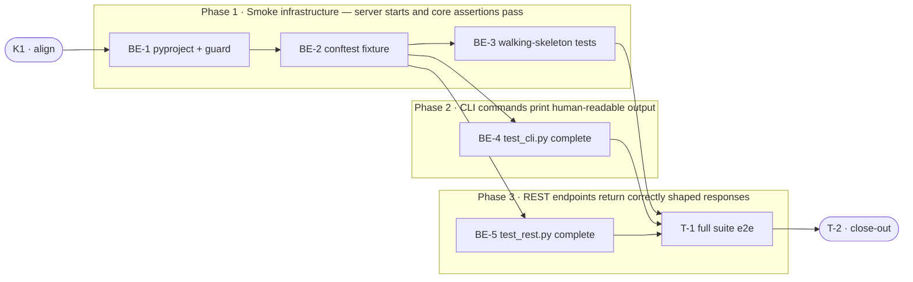

# SMOKE-01 · Live Smoke Test Suite — Task Breakdown

**How to read this file**
- This is the **order view** for `2026-07-15-010-live-smoke-test-team-plan.md` — every task is a single-role checkbox in execution order, opening with a dependency graph.
- **Phases are vertical slices**: each delivers a working end-to-end increment, not a horizontal layer. No separate "integrate" phase. Sliced with the **`vertical-slicer` skill**.
- Each task carries the **role tag at the end of its title line**, then sub-bullets: **layer · estimate** (decimal hours), **needs · completes**, and a **Tests** block. **needs** = predecessor tasks; **completes** = the scenario `S#` or contract `C#` (from the plan) it makes true.
- **Tests** are tagged by level. Unit and integration tests belong to the implementing dev (test-first); e2e and manual tests are the tester's tasks. The close-out task writes no tests.
- IDs (`BE-#`/`T-#`/`K#`) are this file's traceability thread; `S#`/`C#`/`Q#` are defined in the plan.
- **Rule:** edit your own tasks freely.

---

## Task Breakdown

Single-role tasks in execution order, grouped into **vertical slices**.

### Dependency graph

### Phase 0 · Kickoff *(prerequisite; the one cross-cutting step)*

- [x] **K1** — Align on the `SmokeServerProcess` contract and API-key format constraint #team
    - — · 0.5h
    - completes C1
    - Tests
    - Note: `ARCHON_SEARCH_API_KEY` passed to the subprocess **must** be a 64-char lowercase hex string — `key_manager.py:497` rejects any other format and the server auto-generates an unrelated key, breaking all authenticated endpoints. Use `secrets.token_hex(32)` in the fixture. Confirm this with the team before BE-2 starts.

### Phase 1 · Smoke infrastructure — server starts and core assertions pass *(walking skeleton: fixture spawns a real server, one CLI test and one REST test pass, teardown is clean)*

- [x] **BE-1** — `pyproject.toml` + `tests/smoke/__init__.py` + stub `tests/smoke/test_cli.py` with always-on guard `test_smoke_marker_in_pyproject` #backend-role
    - Frameworks & Drivers · 1.0h
    - needs K1 · completes C1
    - Tests
        - #unit_test — `test_smoke_marker_in_pyproject` — reads `pyproject.toml` via `tomllib`; asserts `any(m.startswith("smoke:") or m.startswith("smoke ") for m in markers)`, `"tests/smoke"` in `norecursedirs`, and `"not smoke"` in the addopts `-m` value; no `@pytest.mark.smoke` gate — always runs
    - Implementation note: mirror `tests/test_docker_smoke.py::test_docker_marker_in_pyproject` (lines 120–131) exactly for the marker guard pattern.

- [x] **BE-2** — `tests/smoke/conftest.py` session fixture: free-port binding, `secrets.token_hex(32)` API key, `subprocess.Popen` server spawn, health+ready poll (30 s), corpus pre-seed + job poll (60 s) + `doc_count > 0` assert, SIGTERM+SIGKILL teardown #backend-role
    - Frameworks & Drivers · 6.0h
    - needs BE-1 · completes S1, S14, S15, C1
    - Tests
        - #unit_test — `test_fixture_api_key_format` — `secrets.token_hex(32)` produces a 64-char all-lowercase hex string; validates the format assumption required by `key_manager.py:497`
        - #integration_test — `test_smoke_server_starts_and_seeds` — the `smoke_server` fixture (session-scoped) yields a server handle; `GET /health` returns 200; `GET /collections/smoke` returns `doc_count > 0` (S1)
        - #integration_test — `test_startup_failure_error_includes_stderr` — pre-bind the free port to force server bind failure; fixture raises `RuntimeError` with "server did not start" message that includes captured stderr (S15)
    - Implementation notes:
        - Port-0 binding: `sock = socket.socket(); sock.bind(('', 0)); port = sock.getsockname()[1]; sock.close()` then pass `ARCHON_SEARCH_PORT=str(port)`.
        - Corpus dir: `tmp_path_factory.mktemp("smoke", numbered=False)` — `numbered=False` required so basename is exactly `smoke` (becomes the collection name via `POST /collections/`).
        - Data dir: `tmp_path_factory.mktemp("smoke_data")` — separate from corpus dir.
        - Each corpus file must contain real prose sentences — empty files produce 0 chunks and cause S12 to fail for the wrong reason.
        - Health poll: `httpx.get(f"http://127.0.0.1:{port}/health", timeout=2)` in a loop (`while time.monotonic() < deadline`). `/health` is auth-exempt (`middleware_auth.py:23`).
        - After `/health` passes, poll `GET /ready` until `response.json()["ready"] == True` (field name confirmed: `ReadinessResponse.ready` in `schemas.py:50`). `/ready` returns 503 until storage is initialised.
        - Pre-seed: `POST /collections/ {"path": str(corpus_dir)}` → parse `job_id` from 202 response; poll `GET /jobs/{job_id}` until `status in {"DONE", "FAILED", "FAILED_EXPIRED", "CANCELLED"}`; fail fixture immediately with `job["error"]` if status ≠ `DONE`. Deadline: 60 s.
        - After DONE: `GET /collections/smoke` → assert `doc_count > 0`.
        - Teardown: `proc.terminate()` → `proc.wait(timeout=10)` → on `TimeoutExpired`: `proc.kill()` + `pytest.fail("server did not stop cleanly on SIGTERM")`.
        - Subprocess env: `{**os.environ, "ARCHON_SEARCH_PORT": str(port), "ARCHON_SEARCH_DATA_DIR": str(data_dir), "ARCHON_SEARCH_API_KEY": api_key, "FASTEMBED_CACHE_PATH": str(Path.home() / ".cache/fastembed"), "PYTEST_ADDOPTS": ""}`.
        - Module-level `pytestmark = pytest.mark.xdist_group("smoke_e2e")` in every test file.
        - `scope="session"` + `tmp_path_factory` (not `tmp_path`) — function-scoped `tmp_path` causes `ScopeMismatch` in a session fixture.

- [x] **BE-3** — Walking-skeleton test assertions: `tests/smoke/test_cli.py` — `--help` timing (S2); `tests/smoke/test_rest.py` — `GET /health` (S8) + S17 exclusion check #backend-role
    - Frameworks & Drivers · 2.0h
    - needs BE-2 · completes S2, S8, S17
    - Tests
        - #integration_test — `test_help_completes_within_2s` — `subprocess.run(["uv", "run", "archon-search", "--help"], capture_output=True, timeout=10)`; `elapsed < 2.0`; `returncode == 0`; `"CollectionMeta(" not in result.stdout`; `"[0." not in result.stdout` (S2, S16 partial)
        - #integration_test — `test_health_no_auth_returns_200` — `httpx.get(f"http://127.0.0.1:{port}/health")` (no `Authorization` header); `status_code == 200`; `body["status"] == "running"`; `"CollectionMeta(" not in response.text` (S8)
        - #integration_test — `test_smoke_excluded_from_default_run` — `subprocess.run(["uv", "run", "pytest", "--collect-only", "-q", "--no-header", "--no-cov", "-p", "no:xdist"], env={**os.environ, "PYTEST_ADDOPTS": ""}, capture_output=True, timeout=120)`; assert `"tests/smoke/" not in output` (path token, not bare `smoke` — avoids false-positive on `test_docker_smoke.py`) (S17)

### Phase 2 · CLI commands print human-readable output

- [x] **BE-4** — `tests/smoke/test_cli.py` — complete remaining CLI tests: `collection list` (S3), `collection info` xfail (S4), `config show` (S5), `maintenance run` error path (S6), `key list` (S7) #backend-role
    - Frameworks & Drivers · 4.0h
    - needs BE-2 · completes S3, S4, S5, S6, S7, S16
    - Tests
        - #integration_test — `test_collection_list_no_repr` — `subprocess.run(["uv", "run", "archon-search", "collection", "list"], env={**os.environ, "ARCHON_SEARCH_DATA_DIR": str(data_dir)}, ...)`; `elapsed < 5.0`; `returncode == 0`; `"CollectionMeta(" not in stdout`; `"[0." not in stdout` (S3, S16)
        - #integration_test — `test_collection_info_no_repr` — `@pytest.mark.xfail(strict=False, reason="bug-007: collection info prints raw repr")`; same subprocess pattern with `"smoke"` arg; `"CollectionMeta(" not in stdout`; exit 0 (S4)
        - #integration_test — `test_config_show_timing_and_format` — subprocess `archon-search config show`; `elapsed < 2.0`; `"[server]" in stdout`; `"CollectionMeta(" not in stdout`; `returncode == 0` (S5)
        - #integration_test — `test_maintenance_run_without_server` — subprocess `archon-search maintenance run --api-url http://127.0.0.1:{closed_port}` with `env={..., "ARCHON_SEARCH_DATA_DIR": str(data_dir), "ARCHON_SEARCH_API_KEY": api_key}`; `returncode == 1`; `"Error contacting server" in stderr` (S6)
        - #integration_test — `test_key_list_no_repr` — subprocess `archon-search key list --api-url {server_url} --api-key {api_key}`; `elapsed < 5.0`; `returncode == 0`; `"CollectionMeta(" not in stdout`; `"[0." not in stdout` (S7, S16)
    - Implementation notes:
        - `collection list` and `collection info` are direct-LanceDB commands (not HTTP) — they open LanceDB in-process via `create_pipeline`. Pass `ARCHON_SEARCH_DATA_DIR` pointing at the session fixture's data dir. Concurrent read alongside the running server is acceptable for smoke assertions.
        - S6 (`maintenance run`): find a guaranteed-closed port by binding, capturing the port, then closing before the subprocess starts. Pass `ARCHON_SEARCH_DATA_DIR` and `ARCHON_SEARCH_API_KEY` in env to prevent `load_or_generate_key()` writing to `~/.archon-search/`.
        - S4 assertion will flip to `xpass` when bug-007 is fixed — at that point remove the `xfail` decorator.

### Phase 3 · REST endpoints return correctly shaped responses within timing budgets

- [x] **BE-5** — `tests/smoke/test_rest.py` — complete remaining REST tests: `GET /ready` (S9), `GET /status` (S10), `GET /collections/` (S11), `GET /collections/smoke` (S12), `POST /search` (S13, S16) #backend-role
    - Frameworks & Drivers · 4.0h
    - needs BE-2 · completes S9, S10, S11, S12, S13, S16
    - Tests
        - #integration_test — `test_ready_returns_200` — `httpx.get(f".../ready")` (no auth); `status_code == 200`; `body["ready"] == True` (S9)
        - #integration_test — `test_status_returns_json_no_reprs` — `httpx.get(f".../status", headers=auth)`; `status_code == 200`; `response.json()` parses without error; `"CollectionMeta(" not in response.text`; `"[0." not in response.text` (S10, S16 partial)
        - #integration_test — `test_collections_list_has_at_least_one_entry` — `httpx.get(f".../collections/", headers=auth)`; `status_code == 200`; `isinstance(body, list)`; `len(body) >= 1` (S11)
        - #integration_test — `test_collection_detail_doc_count_positive` — `httpx.get(f".../collections/smoke", headers=auth)`; `status_code == 200`; `body["doc_count"] > 0`; `"CollectionMeta(" not in response.text` (S12)
        - #integration_test — `test_search_returns_results_within_5s` — `httpx.post(f".../search", json={"query": "test", "collection": "smoke"}, headers=auth)`; `elapsed < 5.0`; `status_code == 200`; `isinstance(body["results"], list)`; `"[0." not in response.text`; `"CollectionMeta(" not in response.text` (S13, S16)
    - Implementation notes:
        - Timing assertions: `t0 = time.monotonic()` before the call; `elapsed = time.monotonic() - t0` after. Gate S13 timing behind `@pytest.mark.skipif(os.environ.get("SMOKE_NO_TIMING") == "1", reason="timing disabled")` per the plan's accepted trade-off.
        - The 5 s budget for S13 assumes the fastembed model is warm. Add a 2–3 s grace sleep or issue a throwaway search after the `/ready` poll (during fixture setup) if the first real search consistently exceeds the budget on CI.
        - `POST /search` requires exactly one of `collection` or `collections` (validator at `routes_search.py:69`). Minimum body: `{"query": "test", "collection": "smoke"}`.
        - `GET /status` requires `Authorization: Bearer {api_key}` (`middleware_auth.py`). Use the `api_key` from the session fixture.

- [x] **T-1** — e2e: run full smoke suite on a real developer machine, confirm all tests pass or xfail correctly #tester-role
    - — · 2.0h
    - needs BE-3, BE-4, BE-5 · completes S1, S2, S3, S4, S5, S6, S7, S8, S9, S10, S11, S12, S13, S14, S15, S16, S17
    - Tests
        - #e2e_test — `test_full_smoke_suite_passes` — run `uv run pytest tests/smoke/ --no-cov -p no:xdist` (serial; avoids nested xdist) on a machine with fastembed model cache at `~/.cache/fastembed`; exit code 0; S4 (`test_collection_info_no_repr`) is `xfail` not `xpass`; no "server did not stop cleanly" line in captured output (S1–S17)

### Phase 4 · Close-out

- [ ] **T-2** — Project close-out & acceptance fact-check #tester-role
    - — · 4.0h
    - needs BE-1, BE-2, BE-3, BE-4, BE-5, T-1 · completes (acceptance gate)
    - Tests
    - Duties
        - Update all documentation per `2026-07-15-010-live-smoke-test-team-plan.md`'s "Documentation update" section: `pyproject.toml` (done by BE-1), `Documentation/Architecture/200_testing_strategy.md` (add `smoke` tier subsection + pyramid row), `CLAUDE.md` (add smoke run command + `xdist_group("smoke_e2e")` note), `Documentation/Architecture/500_development_workflows_and_conventions.md` (fix `-n auto` → `-n 4`; fix wrong marker exclusion claim; add smoke command), `contributing.md` (same fixes), `Documentation/quick_start.md` (same fixes).
        - Fix all build / compiler warnings, if any.
        - Run `uv run pytest` (default suite); fix every failing test, including any unrelated to this feature.
        - Validate every Acceptance criterion one-by-one from the plan with a fact check — no assumptions; confirm each is genuinely done:
            - `uv run pytest tests/smoke/ --no-cov` completes without failures on a machine with fastembed model cache.
            - `archon-search --help` completes within 2 seconds.
            - All in-scope CLI happy-path commands exit 0 and produce no `CollectionMeta(` repr.
            - All in-scope REST endpoints return expected status codes within timing budgets (5 s for reads).
            - `maintenance run` without a running server exits non-zero and surfaces "Error contacting server".
            - `uv run pytest` (default suite) continues to pass and does NOT spawn the smoke server.
            - Server process starts and stops cleanly within the fixture lifecycle; SIGKILL escalation is absent.

**Critical path:** K1 → BE-1 → BE-2 → BE-4 → T-1 → T-2 (or BE-5 instead of BE-4, tied at 17.5 h). BE-3 runs in parallel with BE-4 and BE-5 after BE-2 completes.

---

## Open questions

**Q1 — API key format (decided: Option A):** `ARCHON_SEARCH_API_KEY` passed to the server subprocess must be a 64-char lowercase hex string (`key_manager.py:497-498` rejects any other format and silently auto-generates an unrelated key, breaking all authenticated calls). **Decision:** use `api_key = secrets.token_hex(32)` in the session fixture. This deviates from the docker smoke pattern (`ARCHON_SEARCH_API_KEY=smoketest`) — the docker test only calls auth-exempt endpoints so the invalid key doesn't matter there. No plan change needed.
