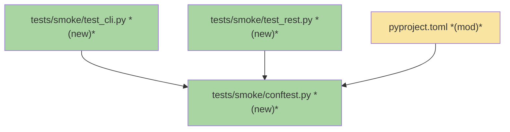
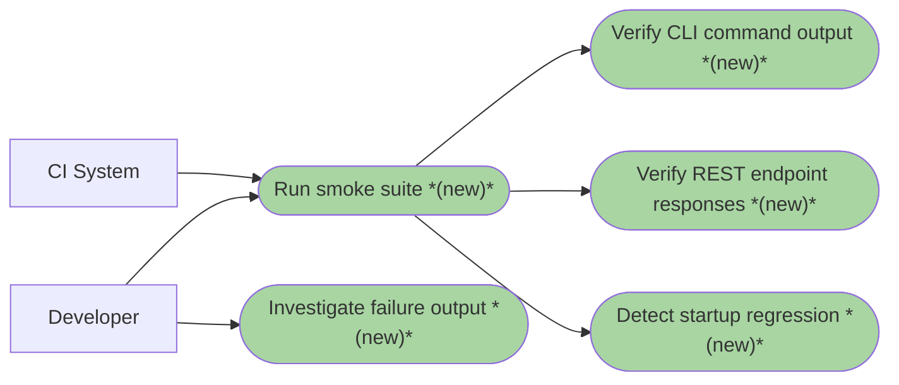

# SMOKE-01 · Live Smoke Test Suite — Team Plan

**How to read this file**
- **Architecture approach:** Clean Architecture (default). **Layers:** Presentation · Use Cases · Interface Adapters · Entities · Frameworks & Drivers. Dependencies point inward.
- The **Frontend, Backend, and Tester** sections are the depth view — each role's scope, grouped by layer.
- **Contracts** are logical: authored as a linked `.tsp` file (TypeSpec 1.13.0 available). This seam is internal (subprocess boundary), so no `openapi.yaml` is emitted.
- **Role tags** (`#frontend-role`, `#backend-role`, `#tester-role`) mark each role-owned section.
- IDs (`S#`, `C#`, `Q#`) are the traceability thread.
- **Tasks** are not in this file — task breakdown is a separate downstream step that consumes this plan.
- **Rule:** change a contract only by team agreement.

---

## Background

Bugs 001–010 were all found by a user hitting real problems, not by automated tests. The existing test suite uses `TestClient` (in-process HTTP, no real subprocess), which cannot detect CLI-layer bugs: slow startup, raw Python object output (`CollectionMeta(name=...)`), blocking terminal behaviour, and unhelpful error messages. No automated gate currently stands between a developer shipping a change and a user experiencing a bad CLI interaction.

---

## Goal

A repeatable smoke test suite in `tests/smoke/` that spawns a real `archon-search serve` subprocess, issues real CLI commands and HTTP requests against it, and asserts that each responds quickly, exits cleanly, and produces human-readable output. A failing smoke test means a user would have had a bad experience.

---

## Scope

### In Scope
- Session-scoped pytest fixture: `subprocess.Popen` server start, `GET /health` readiness poll, pre-seeded tiny collection (3–5 documents written to `tmp_path_factory` temp files), SIGTERM teardown.
- An always-on (no opt-in gate) guard test asserting the `smoke` marker is registered in `pyproject.toml`.
- CLI commands as subprocesses: `archon-search --help` (timing), `collection list`, `collection info`, `config show`, `key list`, `maintenance run` (error path without server).
- REST endpoints via `httpx`: `GET /health`, `GET /ready`, `GET /status`, `GET /collections`, `GET /collections/{name}`, `POST /search`.
- Output format assertions: no `CollectionMeta(` repr, no raw embedding vectors, no Python stack traces.
- `pyproject.toml` changes: add `tests/smoke` to `norecursedirs`; register `smoke` marker (required by `--strict-markers`); extend `-m` addopts filter to `"not live_benchmark and not smoke"` (dual guard — same pattern as `live_benchmark`).
- CI integration as a manually-triggered step or before every release — not on every PR.

### Out of Scope
- Ingest quality (recall, reranking accuracy) — covered by `tests/eval/`.
- Internal unit logic — covered by `tests/`.
- The wizard interactive flow — covered by unit tests in `tests/test_install.py`.
- Graph community building, full reindex, backup/restore — slow operations.
- Windows/container-specific behaviour — macOS/Linux dev target only.
- `collection add` REST-proxy path (bug-005 not yet merged) — tests the current in-process ingest path only.
- HyDE and RAG Fusion paths — require `ANTHROPIC_API_KEY`; out of scope per ADR-C4/C5 constraint.

---

## Acceptance criteria
- `uv run pytest tests/smoke/ --no-cov` completes without failures on a machine with the fastembed model cache populated.
- `archon-search --help` completes within 2 seconds.
- All in-scope CLI happy-path commands exit with code 0 and produce no `CollectionMeta(` repr in output.
- All in-scope REST endpoints return expected HTTP status codes within timing budgets (5 s for reads).
- `maintenance run` without a running server exits non-zero and surfaces "Error contacting server" in output.
- `uv run pytest` (default suite) continues to pass and does NOT spawn the smoke server.
- Server process starts and stops cleanly within the fixture lifecycle; teardown: SIGTERM is sent to the server subprocess; if the process does not exit within 10 s, the fixture escalates to SIGKILL and the test is marked failed (the plan treats SIGKILL escalation as a teardown failure, not a clean exit).

---

## What does NOT change
- All unit tests in `tests/` and integration tests in `tests/integration/`.
- The 85% coverage gate — smoke tests run separately with `--no-cov`.
- The `-n 4 --dist=loadgroup` default parallelism setting.
- Production code in `archon_search/` (unless `serve.py` gets a port-reporting mechanism — see Q5).
- All existing `routes_*.py`, `pipeline.py`, `store.py` behaviour.

---

## Known limitations / accepted trade-offs
- Timing assertions (2 s CLI, 5 s REST) are calibrated for developer hardware to catch gross regressions — not tight P99 bounds. On flaky CI, prefer increasing the ceiling (e.g. to 5 s for CLI) over skipping. **Never skip timing assertions as a flake workaround** — a disabled timing guard defeats the suite's regression-detection purpose. Gate timing tests behind `@pytest.mark.skipif(os.environ.get('SMOKE_NO_TIMING') == '1', ...)` with an explicit opt-out flag rather than a bare skip.
- Suite requires fastembed model cache (~2 GB ONNX model); first CI run on a cold machine will exceed the 30 s readiness timeout.
- Suite requires `uv` on the test machine (already required for development).
- The fastembed model cache (~2 GB) must be present at `~/.cache/fastembed` on the test machine; first run will trigger a model download.
- `collection info` format assertion (S4) is written as `@pytest.mark.xfail(strict=False)` — expected failure until bug-007 is fixed; makes the bug visible without blocking CI.
- `collection add` exercises the in-process ingest path; the REST-proxy path (bug-005) is deferred.
- Fixture seeds the collection via `POST /collections/ {path: str(corpus_dir)}` with real temp files on the host filesystem — no in-memory or inline document injection.
- `maintenance run` error message assertion (S6) is pinned to current bug behavior; must be updated when briefs 250/260 are implemented.
- Timing assertion for S13 (`POST /search`, 5 s) assumes the fastembed model is already loaded; on first request after a cold-cache start the budget may be exceeded.
- Teardown: `proc` is the `uv run` wrapper process; SIGTERM is sent to `uv`, which then propagates it to `archon-search serve`. If uvicorn handles SIGTERM cleanly (expected), `proc.wait(10)` returns in time. If not, the fixture escalates to SIGKILL and marks the test failed.

---

## Approach & architecture

Add a new `tests/smoke/` directory excluded from the default run (same pattern as `tests/eval/live_benchmark/`). A session-scoped pytest fixture in `tests/smoke/conftest.py` starts the server as a **raw subprocess** (`subprocess.Popen(["uv", "run", "archon-search", "serve", ...])`), using port-0 binding to get a free port without TOCTOU risk. This avoids requiring Docker on every developer machine and in CI. The existing `tests/test_docker_smoke.py` already covers the Docker-built-image path with `@pytest.mark.docker`.

Port selection: `sock = socket.socket(); sock.bind(('', 0)); port = sock.getsockname()[1]; sock.close()` — the server is then started with `ARCHON_SEARCH_PORT=<port>` env var.

### Architecture



_Scope limited to changed nodes only: 1-hop expansion (18 nodes total) exceeded the 15-node limit._

| Component | Change | Why |
|-----------|--------|-----|
| `tests/smoke/conftest.py` | new | Session fixture: subprocess spawn, health poll, pre-seed, teardown |
| `tests/smoke/test_cli.py` | new | Smoke assertions for all in-scope CLI commands |
| `tests/smoke/test_rest.py` | new | Smoke assertions for all in-scope REST endpoints |
| `pyproject.toml` | modified | Add `tests/smoke` to `norecursedirs`; register `smoke` marker |

**Layer map (and role mapping)**

| Layer | Role | Root paths |
|-------|------|-----------|
| Presentation | Backend | `archon_search/cli/` (serve.py, main.py, collection.py, config_cmd.py, maintenance_cmd.py, key_cmd.py, status.py), `archon_search/server/routes_*.py` |
| Use Cases | Backend | `archon_search/pipeline.py`, `archon_search/jobs/` |
| Interface Adapters | Backend | `archon_search/server/app.py`, `archon_search/server/schemas.py`, `archon_search/server/mcp.py` |
| Entities | Backend | `archon_search/graph_types.py`, `archon_search/types.py`, `archon_search/acl.py`, `archon_search/key_manager.py` |
| Frameworks & Drivers | Backend | `archon_search/store.py`, `archon_search/embedder.py`, `archon_search/reranker.py`, `tests/` (all test files) |

**What changes**
- `pyproject.toml`: add `"tests/smoke"` to `norecursedirs`; add `smoke` marker to `markers` list; extend `-m` addopts filter to `"not live_benchmark and not smoke"` (dual guard).
- New `tests/smoke/` directory: `__init__.py`, `conftest.py`, `test_cli.py`, `test_rest.py`.

**Key decisions (from the brief)**
- Raw subprocess (`uv run archon-search serve`), not Docker — avoids requiring Docker Desktop on every dev machine; `uv run` uses the checkout package so no installed-binary conflict; port-0 socket binding eliminates the TOCTOU race without Docker overhead. Docker image path is already covered by `tests/test_docker_smoke.py`.
- Fastembed model cache reused from host via `FASTEMBED_CACHE_PATH=~/.cache/fastembed` passed in the subprocess env — one download shared across runs; never re-downloaded per subprocess start.
- Real server, not mocked — shares one session-scoped subprocess across all smoke tests.
- Explicit string pattern assertions (`assertNotIn("CollectionMeta("`, `assertLess(elapsed, 5.0)`) — CI needs deterministic pass/fail.
- Excluded from default run: `norecursedirs = ["tests/smoke"]` (same dual-guard pattern as `live_benchmark`).
- `xdist_group("smoke_e2e")` on all smoke tests — serialises them on one worker; prevents concurrent server subprocess instances.

### Actors & Use Cases



### Flows

#### User Flow

_Skipped: this feature adds developer tooling (a test suite), not a product user-facing flow; no product user steps change._

#### Data Flow

_Skipped: the smoke test suite introduces no new data edges in the production pipeline; it exercises existing edges through standard HTTP and CLI calls._

#### Sequence

```mermaid
sequenceDiagram
  participant fixture as smoke_conftest
  participant serve as archon-search serve
  participant health as GET /health
  participant seed as POST /collections
  participant tests as test_cli / test_rest

  fixture->>serve: Popen(["uv", "run", "archon-search", "serve"], env={PORT, DATA_DIR, API_KEY, PYTEST_ADDOPTS=""})
  loop poll GET /health (30 s timeout)
    fixture->>health: GET /health (no auth)
    health-->>fixture: 200 {"status":"running"} | ConnectionError
  end
  fixture->>seed: POST /collections {path: str(corpus_dir)} — creates collection + enqueues ingest
  seed-->>fixture: job_id → poll GET /jobs/{id} until terminal status (DONE/FAILED/FAILED_EXPIRED/CANCELLED); fail fixture on non-DONE terminal
  fixture->>seed: GET /collections/smoke (assert doc_count > 0 — zero-doc ingest = fixture misconfiguration)
  Note over fixture,tests: tests run (serialised via xdist_group)
  fixture->>serve: proc.terminate() (SIGTERM)
  serve-->>fixture: proc.wait(10) succeeds (no SIGKILL escalation needed)
```

### Prior decisions

| Decision | Rationale | Constraint |
|----------|-----------|------------|
| fastembed for dense embeddings (ADR-02) | GPU-optional, pip-installable, ONNX runtime | Cold model load (~2 GB) may exceed the 30 s readiness timeout on first CI run; budget accordingly or pre-warm the model cache in CI setup |
| HyDE is opt-in; requires `ANTHROPIC_API_KEY` (ADR-C4) | Privacy-first; silent fallback | Smoke tests must not rely on `ANTHROPIC_API_KEY`; the root conftest clears it on every test; the subprocess `env=` dict must not inherit it for HyDE paths (out of scope) |
| RAG Fusion is opt-in; shares `ANTHROPIC_API_KEY` (ADR-C5) | Same rationale as HyDE | Same constraint as ADR-C4 |

### Contradictions

**Code vs. docs (pre-existing; not caused by this feature):**

1. `Documentation/Architecture/500_development_workflows_and_conventions.md` states the default suite uses `-n auto --dist=loadgroup`; `pyproject.toml:116` uses `-n 4`. Owner: doc needs updating.
2. `Documentation/Architecture/500_development_workflows_and_conventions.md`, `contributing.md`, and `Documentation/quick_start.md` claim that `live`, `eval`, `benchmark`, and `integration` markers are excluded from the default run; only `live_benchmark` is excluded — the other markers run by default and skip gracefully via infrastructure gates. Owner: doc needs updating (all three files).

---

## Contracts / seams

TypeSpec 1.13.0 is available. This feature has one seam (internal logical — subprocess boundary). No HTTP/API seam is defined because the smoke tests call existing REST endpoints whose shapes are already specified in `GET /openapi.json`.

**C1 — SmokeServerProcess** *(Frameworks & Drivers ↔ Frameworks & Drivers: test fixture ↔ subprocess)*

The pytest session fixture and the `archon-search serve` subprocess must agree on:
- **Startup:** `subprocess.Popen(["uv", "run", "archon-search", "serve"], env={..., "ARCHON_SEARCH_PORT": str(port), "ARCHON_SEARCH_DATA_DIR": str(data_dir), "ARCHON_SEARCH_API_KEY": key, "FASTEMBED_CACHE_PATH": str(Path.home() / ".cache/fastembed"), "PYTEST_ADDOPTS": ""})` where `data_dir = tmp_path_factory.mktemp("smoke_data")`. Port is obtained via port-0 socket binding before the subprocess starts — no TOCTOU. Note: Both corpus dir (`mktemp("smoke", numbered=False)`) and data dir (`mktemp("smoke_data")`) must come from `tmp_path_factory`, not `tmp_path` — `tmp_path` is function-scoped and causes `ScopeMismatch` in session fixtures.
- **Model cache:** `FASTEMBED_CACHE_PATH=~/.cache/fastembed` passed in subprocess env so fastembed weights are reused from the host and never re-downloaded per run.
- **Readiness:** Poll `GET /health` until 200 within 30 s (server is up). Then poll `GET /ready` until the `ready` field is `true` (storage initialized). Note: neither `/health` nor `/ready` guarantees the embedder/reranker are warm — the first `POST /search` (S13) may still hit a cold model load. Add a 2–3 s grace period after `/ready` returns true, or issue a throwaway search before the timed S13 assertion. `/health` is auth-exempt (`middleware_auth.py:23`).
- **Teardown:** `proc.terminate()` (SIGTERM) → `proc.wait(timeout=10)`. **Clean exit:** `wait()` returns within 10 s. **Dirty exit:** `wait()` raises `TimeoutExpired` → `proc.kill()` (SIGKILL) → fixture fails the suite with 'server did not stop cleanly on SIGTERM'. The teardown assertion is the ABSENCE of SIGKILL escalation, not a return-code allow-list (uv's own exit code is undefined in the subprocess chain).
- **Failure diagnostic:** stderr is always captured and surfaced on fixture failure.

→ See [`2026-07-15-010-smoke-server-process.tsp`](./2026-07-15-010-smoke-server-process.tsp) (validated clean: `tsp compile smoke-server-process.tsp --no-emit`)

---

## Data

The smoke test suite introduces no schema changes. `STORE_SCHEMA_VERSION = 1` (`store.py:138`) remains unchanged. The session fixture creates a tiny real collection by writing 3–5 small text files to `tmp_path_factory.mktemp("smoke", numbered=False)` (each file must contain a few sentences of real text — empty or whitespace-only files produce 0 chunks and mask the bug under test; the fixture should assert `doc_count > 0` immediately after job `DONE` to surface a zero-doc ingest as a fixture error, not an S12 failure) (Note: `numbered=False` is required so the basename is exactly `smoke`, which becomes the collection name) and ingesting them via `POST /collections/ {path: str(corpus_dir)}` + job polling (single call creates collection and enqueues the ingest job). Poll until terminal status (`status in {"DONE", "FAILED", "FAILED_EXPIRED", "CANCELLED"}`); fail the fixture immediately with the job's `error` field if status is not `DONE`.

_No ER diagram: no schema changes. Full schema documented in `Documentation/Architecture/130_data_architecture_and_persistence.md`._

---

## Scenarios #tester-role

Behavioural only. Cover happy, unhappy, edge, and non-functional paths.

| id | Scenario (Given / When / Then) |
|----|--------------------------------|
| **S1** | **Given** developer runs `uv run pytest tests/smoke/ --no-cov` · **When** the session fixture spawns `archon-search serve` with a temp data dir (`tmp_path_factory.mktemp("smoke_data")`), seeded API key, and free port via `ARCHON_SEARCH_PORT` · **Then** `GET /health` returns 200 within 30 seconds, then `GET /ready` is polled until `ready == true` (storage initialized), and the fixture yields a live server handle. Note: `/health` returns 200 unconditionally; `/ready` returning 200 does NOT guarantee the embedder is warm. |
| **S2** | **Given** a clean process · **When** `archon-search --help` is invoked as a subprocess · **Then** it exits with code 0 within 2 seconds |
| **S3** | **Given** the smoke server is running with a pre-seeded collection · **When** `archon-search collection list` is invoked as subprocess with `ARCHON_SEARCH_DATA_DIR` pointing at the temp data dir · **Then** output contains no `CollectionMeta(` repr, no stack trace, and exits with code 0 within 5 seconds (direct-LanceDB in-process, not via server HTTP) |
| **S4** | **Given** the smoke server has a pre-seeded collection named `smoke` · **When** `archon-search collection info smoke` is invoked as subprocess · **Then** output does NOT contain `CollectionMeta(` repr, exits with code 0, and completes within 5 seconds — `@pytest.mark.xfail(reason="bug-007: collection info prints raw repr", strict=False)` — `strict=False` keeps CI green while the bug exists AND surfaces the fix as an `xpass` (so the marker gets removed). Do NOT use `strict=True` which would fail CI the moment the bug is fixed. (direct-LanceDB in-process, not via server HTTP) |
| **S5** | **Given** a temp data dir · **When** `archon-search config show` is invoked as subprocess · **Then** output contains `[server]` section header, no raw Python objects, exits with code 0, and completes within 2 seconds |
| **S6** | **Given** no server is running on a specified closed port · **When** `archon-search maintenance run --api-url http://127.0.0.1:<closed_port>` is invoked with `env={..., "ARCHON_SEARCH_DATA_DIR": str(data_dir), "ARCHON_SEARCH_API_KEY": api_key}` (prevents `load_or_generate_key()` from writing to the real `~/.archon-search/`) · **Then** exit code is 1 and stderr contains "Error contacting server" — asserts current behaviour (errno still visible, bug-006 not yet fixed; test is green today). **Note: this assertion will break when briefs 250/260 land — update S6 to assert the new user-friendly message at that point.** |
| **S7** | **Given** the smoke server is running with a known API key · **When** `archon-search key list --api-url <server_url> --api-key <key>` is invoked · **Then** output contains no Python reprs, exits with code 0, and completes within 5 seconds |
| **S8** | **Given** the smoke server is running · **When** `GET /health` is called without an `Authorization` header · **Then** response status is 200 and body contains `"status": "running"` |
| **S9** | **Given** the smoke server is running and model is loaded · **When** `GET /ready` is called without an `Authorization` header · **Then** response status is 200 |
| **S10** | **Given** the smoke server is running · **When** `GET /status` is called with a valid `Authorization: Bearer <key>` header · **Then** response status is 200 and body is valid JSON with no Python reprs |
| **S11** | **Given** the smoke server has a pre-seeded collection · **When** `GET /collections/` is called with a valid Bearer token · **Then** response status is 200 and body is a JSON array with at least one entry |
| **S12** | **Given** the smoke server has a pre-seeded collection named `smoke` · **When** `GET /collections/smoke` is called with a valid Bearer token · **Then** response status is 200, body is JSON with no Python reprs, and `doc_count` is > 0 |
| **S13** | **Given** the smoke server has a pre-seeded collection with documents · **When** `POST /search` is called with `{"query": "test", "collection": "smoke"}` and a valid Bearer token · **Then** response status is 200, `results` is a JSON array, no raw Python reprs appear, and the call completes within 5 seconds |
| **S14** | **Given** the smoke server is running · **When** the session fixture sends SIGTERM at teardown · **Then** the server process stops within 10 s of SIGTERM without requiring SIGKILL escalation |
| **S15** | **Given** `archon-search serve` fails to start within 30 seconds (e.g., port already in use) · **When** the session fixture polls `/health` without success · **Then** the entire suite fails with a "server did not start" message that includes the captured stderr |
| **S16** | **Given** any smoke test runs · **When** the test asserts output format · **Then** no raw floating-point arrays appear (e.g., no `[0.123, -0.456, ...]` embedding vectors in any CLI or REST output) |
| **S17** | **Given** a developer runs the default `uv run pytest` (no path argument) · **When** the suite collects tests · **Then** the collected test list does NOT contain `tests/smoke/` as a path prefix and no `archon-search serve` subprocess is spawned. Subprocess env must include `PYTEST_ADDOPTS=""` and flags `--no-cov -p no:xdist` to avoid nested coverage/xdist overhead. Assert `'tests/smoke/' not in output` (path token, not bare `smoke` — avoids false-positive on `test_docker_smoke.py`). |

---

## Frontend — Presentation #frontend-role

N/A — no frontend work for this feature. `archon-search` is a pure backend CLI/server application. The only frontend-like asset (`archon_search/server/graph_viewer.html`) is not in scope for this feature.

---

## Backend — Entities · Use Cases · Adapters · Frameworks #backend-role

**Scope:** Implement the session fixture in `tests/smoke/conftest.py`, the CLI smoke tests in `tests/smoke/test_cli.py`, and the REST smoke tests in `tests/smoke/test_rest.py`. Update `pyproject.toml`. Writes both unit and integration tests for its tasks.

**Owns layers:** Entities, Use Cases, Interface Adapters, Frameworks & Drivers.

**Key patterns to follow:**
- Session fixture: `scope="session"`, `tmp_path_factory` for both corpus dir and data dir (not `tmp_path` — `ScopeMismatch` crash on session-scope). Use `corpus_dir = tmp_path_factory.mktemp("smoke", numbered=False)` (Note: `numbered=False` is required so the basename is exactly `smoke`, which becomes the collection name) and `data_dir = tmp_path_factory.mktemp("smoke_data")`.
- Subprocess invocation: `subprocess.Popen(["uv", "run", "archon-search", "serve"], env={**os.environ, "ARCHON_SEARCH_PORT": str(port), "ARCHON_SEARCH_DATA_DIR": str(data_dir), "ARCHON_SEARCH_API_KEY": api_key, "FASTEMBED_CACHE_PATH": str(Path.home() / ".cache/fastembed"), "PYTEST_ADDOPTS": ""})`. Port is obtained via port-0 binding before the subprocess is started — no TOCTOU race. Pass `FASTEMBED_CACHE_PATH=~/.cache/fastembed` in the subprocess env so tests reuse the host model cache.
- Health poll: `httpx.get(f"http://127.0.0.1:{host_port}/health", timeout=2)` in a loop until 200 or 30 s deadline. `/health` is auth-exempt (`middleware_auth.py:23`). Note: `/health` returns 200 unconditionally (regardless of model warm-up). After the health poll passes, poll `GET /ready` until `"ready"` field is `true` (not `storage_ok` — actual field name). Note: `/ready` returning 200 does NOT guarantee the embedder is warm — add a 2–3 s grace period or issue a throwaway search before the timed S13 assertion. The 5s budget for S13 assumes the fastembed model is warm.
- Pre-seeding: write 3–5 `*.txt` files to `corpus_dir = tmp_path_factory.mktemp("smoke", numbered=False)` on the host; each file must contain at least a few sentences of real text (not empty — empty files produce 0 chunks and cause S12 to fail for the wrong reason); pass the actual temp dir path via `POST /collections/ {path: str(corpus_dir)}` where the server reads the path from the host filesystem directly (no mounting in the subprocess model); poll `GET /jobs/{job_id}` until `status in {"DONE", "FAILED", "FAILED_EXPIRED", "CANCELLED"}` (all terminal states); fail the fixture immediately with the job's `error` field if status is not `DONE`; after DONE, assert `doc_count > 0` from `GET /collections/smoke` — a zero-doc result means the fixture is misconfigured, not that S12 is wrong. Add an explicit poll deadline of 60 s (separate from the /health readiness timeout).
- CLI tests: `subprocess.run(["uv", "run", "archon-search", command], env={**os.environ, "ARCHON_SEARCH_DATA_DIR": str(data_dir), ...}, timeout=budget, capture_output=True)`. `archon-search --help` can be invoked with only a minimal env (tests import overhead).
- Timing assertions: `time.monotonic()` before/after call; assert `elapsed < budget`.
- Output assertions: `assert "CollectionMeta(" not in result.stdout`. Note: `collection list` and `collection info` use direct LanceDB access (not HTTP) even when invoked inside the container.
- Note on CLI command architecture: `collection list` and `collection info` are direct-store commands (they open LanceDB in-process via `create_pipeline`), NOT HTTP clients. Invoking them as a subprocess with `ARCHON_SEARCH_DATA_DIR` pointing at the same temp data dir creates a concurrent LanceDB read connection alongside the server — this is acceptable for read-only smoke assertions but does NOT test the CLI-through-server path. HTTP-client CLI commands (e.g. `key list`, `maintenance run`, `status`) correctly test the CLI→server path.
- `xdist_group("smoke_e2e")` as module-level `pytestmark` in all test files.
- Teardown: `proc.terminate()` → `proc.wait(timeout=10)` → `proc.kill()` fallback.
- Existing analogue: `tests/test_docker_smoke.py` health-poll pattern and `xdist_group("docker")` usage.

**Done when**
- [ ] Session fixture in `tests/smoke/conftest.py` starts a real server, seeds data, and tears down cleanly — S1, S14, S15
- [ ] `archon-search --help` timing assertion passes — S2
- [ ] `collection list` output format asserted — S3
- [ ] `collection info` repr detection test written as `@pytest.mark.xfail(strict=False)` (expected failure until bug-007 lands; `strict=False` keeps CI green while the bug exists AND surfaces the fix as `xpass` so the marker gets removed) — S4
- [ ] `config show` timing and format asserted — S5
- [ ] `maintenance run` error path asserted — S6 (update assertion when brief-260/250 lands)
- [ ] `key list` output format asserted — S7
- [ ] `GET /health` (no auth) returns 200 — S8
- [ ] `GET /ready` (no auth) returns 200 — S9
- [ ] `GET /status` returns 200 JSON — S10
- [ ] `GET /collections/` returns 200 JSON array — S11
- [ ] `GET /collections/{name}` returns 200 JSON with `doc_count > 0` — S12
- [ ] `POST /search` returns 200 results within 5 s — S13
- [ ] No raw embedding vectors in any output — S16
- [ ] Default `uv run pytest` does not collect smoke tests — S17: automated exclusion check passes — `uv run pytest --collect-only -q` output does not contain `tests/smoke/` (path token, not bare `smoke`)
- [ ] `pyproject.toml` updated: `tests/smoke` in `norecursedirs`, `smoke` marker registered
- [ ] Always-on guard test `test_smoke_marker_in_pyproject` added to `tests/smoke/test_cli.py` or `tests/smoke/conftest.py` — asserts (a) `smoke` is in `pyproject.toml` markers list, (b) `tests/smoke` is in `pyproject.toml` norecursedirs, (c) `not smoke` appears in the addopts `-m` filter. Modelled on `tests/test_docker_smoke.py::test_docker_marker_in_pyproject`.

---

## Tester #tester-role

**Scope:** the tester owns **e2e and manual** tests plus project close-out. **Unit and integration** tests belong to the implementing dev, in each implementation task's `Tests` block.

This suite IS the new subprocess-based tier — it is what the tester verifies works end-to-end after implementation. Existing `@pytest.mark.integration` tests (TestClient-based) are dev-written and cover REST correctness; the smoke suite adds the real-subprocess tier for CLI-layer bugs.

**Allocation** — each scenario at the cheapest level that proves it *(unit + integration are dev-written; e2e/smoke + manual are the tester's tasks)*

| Scenario | Cheapest level | Notes |
|----------|----------------|-------|
| S1 — server starts and becomes healthy | **smoke** | Requires real subprocess; TestClient cannot prove startup |
| S2 — `--help` completes within 2 s | **smoke** | Wall-clock timing requires real process |
| S3 — `collection list` output format | **smoke** | Requires real CLI subprocess; CliRunner bypasses import overhead |
| S4 — `collection info` no repr | **smoke** | Same; test written to detect bug-007 |
| S5 — `config show` timing + format | **smoke** | Wall-clock timing requires real process |
| S6 — `maintenance run` without server | **smoke** | Exit code + error message format require real process |
| S7 — `key list` output format | **smoke** | Requires real subprocess |
| S8 — `GET /health` returns 200 | integration | Already covered; smoke adds real-server timing context |
| S9 — `GET /ready` returns 200 | integration | Already covered |
| S10 — `GET /status` returns 200 JSON | integration | Already covered |
| S11 — `GET /collections` returns list | integration | Already covered |
| S12 — `GET /collections/{name}` detail | integration | Already covered; smoke adds `doc_count > 0` pre-seed assertion |
| S13 — `POST /search` returns results | **smoke** | Timing budget (5 s) requires real server; result format checked |
| S14 — SIGTERM teardown | **smoke** | Requires real process lifecycle |
| S15 — server-start failure | **smoke** | Requires real process; fixture teardown path |
| S16 — no raw embedding vectors | **smoke** | Cross-cutting format check across all outputs |
| S17 — excluded from default run | **integration** | Automate via `subprocess.run(['uv', 'run', 'pytest', '--collect-only', '-q', '--no-header', '--no-cov', '-p', 'no:xdist'], env={**os.environ, 'PYTEST_ADDOPTS': ''}, ...)` and assert `'tests/smoke/' not in output` (path token, not bare `smoke` — avoids false-positive on `test_docker_smoke.py`). |

---

## Documentation update

Docs the feature touches. Works through this list at close-out.

- [ ] `pyproject.toml` — *new feature* (add `"tests/smoke"` to `norecursedirs`; add `"smoke: ..."` to `markers` list; update `-m` addopts filter)
- [ ] `Documentation/Architecture/200_testing_strategy.md` — *new feature* (add `smoke` tier subsection modelled on `live_benchmark`; add row to "Adding tests by failure mode" table; add `smoke` node to Mermaid pyramid)
- [ ] `CLAUDE.md` (project) — *new feature* (add `uv run pytest tests/smoke/ --no-cov` to Common commands; add note about `xdist_group("smoke_e2e")` serialisation requirement)
- [ ] `Documentation/Architecture/500_development_workflows_and_conventions.md` — *contradiction with code* (fix `-n auto` → `-n 4`; fix wrong marker exclusion claim; add smoke run command)
- [ ] `contributing.md` — *contradiction with code* (fix wrong marker exclusion claim; add smoke run command)
- [ ] `Documentation/quick_start.md` — *contradiction with code* (fix wrong marker exclusion claim; add smoke run command)

**Consulted (read-only)**
- `Documentation/Architecture/200_testing_strategy.md` — used to understand the `live_benchmark` dual-guard pattern that smoke follows
- `Documentation/Architecture/130_data_architecture_and_persistence.md` — confirmed no schema changes needed
- `Documentation/ADRs/02_fastembed_for_dense_embeddings.md` — model cold-load constraint
- `Documentation/ADRs/C4-hyde-external-llm-dependency.md` — API key constraint
- `Documentation/ADRs/C5-rag-fusion-external-llm-dependency.md` — API key constraint

---

## Open questions

All resolved. Status: `planned`.

**Resolved in this revision:**
- Brief Q2 (Does `archon-search serve` write its port to stdout?) — **No.** Resolved by port-0 socket binding: the fixture obtains a free port before starting the subprocess and passes it via `ARCHON_SEARCH_PORT`.
- Brief Q3 (Does `collection add` require the server?) — **No.** `collection.py:76–140` runs ingest in-process; bug-005 not landed.
- **Q3** (Port-discovery approach) — **Resolved.** Port-0 socket binding (`sock.bind(('', 0))` → `getsockname()[1]` → `sock.close()`) eliminates TOCTOU race without Docker.
- **Q2** (CI trigger) — **Resolved.** Run before every release or when explicitly asked; NOT on every PR.
- **Q4** (`collection info` assertion style) — **Resolved.** `@pytest.mark.xfail(strict=False)` — test detects bug-007; CI stays green while the bug exists and surfaces as `xpass` when fixed (prompting marker removal). `strict=True` was intentionally rejected: it would fail CI the moment bug-007 is fixed, inverting the intent.
- **Q5** (`maintenance run` error assertion) — **Resolved.** Assert current behaviour ("Error contacting server" with errno); test is green today. Update when briefs 250/260 land.
- **Q6** (file structure) — **Resolved.** Two files: `test_cli.py` + `test_rest.py`.
- **Q1** (pyproject.toml exclusion style) — **Resolved.** Dual guard: `norecursedirs = ["tests/smoke"]` + `-m "not live_benchmark and not smoke"` in addopts (same pattern as `live_benchmark`).
- **Q7** (subprocess vs Docker) — **Resolved.** Raw subprocess (`uv run archon-search serve`) — no Docker required; Docker path already covered by `tests/test_docker_smoke.py`.
- **Q8** (fastembed cache paths) — **Resolved.** Host: `~/.cache/fastembed`. Passed to subprocess as `FASTEMBED_CACHE_PATH=~/.cache/fastembed` env var.

---

## References

- **Brief:** [2026-07-15-010-live-smoke-test-brief.md](./2026-07-15-010-live-smoke-test-brief.md)
