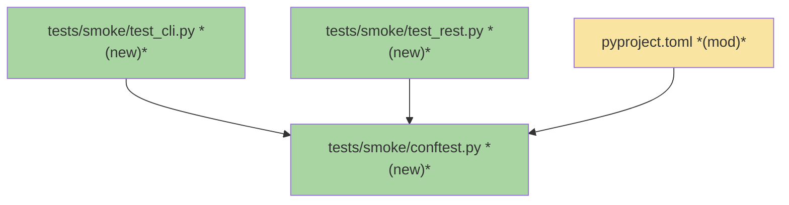
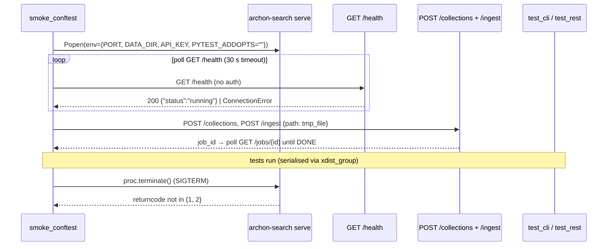

# SMOKE-01 · Live Smoke Test Suite — Team Plan

**How to read this file**
- **Architecture approach:** Clean Architecture (default). **Layers:** Presentation · Use Cases · Interface Adapters · Entities · Frameworks & Drivers. Dependencies point inward.
- The **Frontend, Backend, and Tester** sections are the depth view — each role's scope, grouped by layer.
- **Contracts** are logical: authored as a linked `.tsp` file (TypeSpec 1.13.0 available). This seam is internal (subprocess boundary), so no `openapi.yaml` is emitted.
- **Role tags** (`#frontend-role`, `#backend-role`, `#tester-role`) mark each role-owned section.
- IDs (`S#`, `C#`, `Q#`) are the traceability thread.
- **Tasks** are not in this file — task breakdown is a separate downstream step that consumes this plan.
- **Rule:** change a contract only by team agreement.

---

## Background

Bugs 001–010 were all found by a user hitting real problems, not by automated tests. The existing test suite uses `TestClient` (in-process HTTP, no real subprocess), which cannot detect CLI-layer bugs: slow startup, raw Python object output (`CollectionMeta(name=...)`), blocking terminal behaviour, and unhelpful error messages. No automated gate currently stands between a developer shipping a change and a user experiencing a bad CLI interaction.

---

## Goal

A repeatable smoke test suite in `tests/smoke/` that spawns a real `archon-search serve` subprocess, issues real CLI commands and HTTP requests against it, and asserts that each responds quickly, exits cleanly, and produces human-readable output. A failing smoke test means a user would have had a bad experience.

---

## Scope

### In Scope
- Session-scoped pytest fixture: `subprocess.Popen` server start, `GET /health` readiness poll, pre-seeded tiny collection (3–5 documents written to `tmp_path_factory` temp files), SIGTERM teardown.
- CLI commands as subprocesses: `archon-search --help` (timing), `collection list`, `collection info`, `config show`, `key list`, `maintenance run` (error path without server).
- REST endpoints via `httpx`: `GET /health`, `GET /ready`, `GET /status`, `GET /collections`, `GET /collections/{name}`, `POST /search`.
- Output format assertions: no `CollectionMeta(` repr, no raw embedding vectors, no Python stack traces.
- `pyproject.toml` changes: add `tests/smoke/` to `norecursedirs`; register `smoke` marker (required by `--strict-markers`); extend `-m` addopts filter to `"not live_benchmark and not smoke"` (dual guard — same pattern as `live_benchmark`).
- CI integration as a manually-triggered step or before every release — not on every PR.

### Out of Scope
- Ingest quality (recall, reranking accuracy) — covered by `tests/eval/`.
- Internal unit logic — covered by `tests/`.
- The wizard interactive flow — covered by unit tests in `tests/test_install.py`.
- Graph community building, full reindex, backup/restore — slow operations.
- Windows/container-specific behaviour — macOS/Linux dev target only.
- `collection add` REST-proxy path (bug-005 not yet merged) — tests the current in-process ingest path only.
- HyDE and RAG Fusion paths — require `ANTHROPIC_API_KEY`; out of scope per ADR-C4/C5 constraint.

---

## Acceptance criteria
- `uv run pytest tests/smoke/ --no-cov` completes without failures on a machine with the fastembed model cache populated.
- `archon-search --help` completes within 2 seconds.
- All in-scope CLI happy-path commands exit with code 0 and produce no `CollectionMeta(` repr in output.
- All in-scope REST endpoints return expected HTTP status codes within timing budgets (5 s for reads).
- `maintenance run` without a running server exits non-zero and surfaces "Error contacting server" in output.
- `uv run pytest` (default suite) continues to pass and does NOT spawn the smoke server.
- Server process starts and stops cleanly within the fixture lifecycle; teardown `returncode not in {1, 2}`.

---

## What does NOT change
- All unit tests in `tests/` and integration tests in `tests/integration/`.
- The 85% coverage gate — smoke tests run separately with `--no-cov`.
- The `-n 4 --dist=loadgroup` default parallelism setting.
- Production code in `archon_search/` (unless `serve.py` gets a port-reporting mechanism — see Q5).
- All existing `routes_*.py`, `pipeline.py`, `store.py` behaviour.

---

## Known limitations / accepted trade-offs
- Timing assertions (2 s CLI, 5 s REST) are calibrated for developer hardware; may flake on slow CI — mark `@pytest.mark.skip` with a note on flaky hardware rather than removing.
- Suite requires fastembed model cache (~2 GB ONNX model); first CI run on a cold machine will exceed the 30 s readiness timeout.
- Suite requires Docker on the test machine and in CI (Docker-in-Docker or a sidecar service).
- Docker container startup adds ~5–10 seconds over a raw subprocess; the 30 s readiness timeout already accounts for this.
- `collection info` format assertion (S4) is written as `@pytest.mark.xfail` — expected failure until bug-007 is fixed; makes the bug visible without blocking CI.
- `collection add` exercises the in-process ingest path; the REST-proxy path (bug-005) is deferred.
- No inline document ingest — `pipeline.ingest_documents` is a no-op; fixture must write temp files to a host temp dir and mount it into the container.

---

## Approach & architecture

Add a new `tests/smoke/` directory excluded from the default run (same pattern as `tests/eval/live_benchmark/`). A session-scoped pytest fixture in `tests/smoke/conftest.py` starts the server as a **Docker container** (`docker run`), eliminating conflicts with the locally-installed production binary. The fastembed model cache is mounted read-only from the host so models are downloaded once and shared across production, UAT, and dev container instances. Port mapping is handled by Docker (`-p <host_port>:8765`), removing the TOCTOU race that a raw-subprocess approach would have.

### Architecture

_Scope limited to changed nodes only: 1-hop expansion (18 nodes total) exceeded the 15-node limit._

| Component | Change | Why |
|-----------|--------|-----|
| `tests/smoke/conftest.py` | new | Session fixture: subprocess spawn, health poll, pre-seed, teardown |
| `tests/smoke/test_cli.py` | new | Smoke assertions for all in-scope CLI commands |
| `tests/smoke/test_rest.py` | new | Smoke assertions for all in-scope REST endpoints |
| `pyproject.toml` | modified | Add `tests/smoke/` to `norecursedirs`; register `smoke` marker |

**Layer map (and role mapping)**

| Layer | Role | Root paths |
|-------|------|-----------|
| Presentation | Backend | `archon_search/cli/` (serve.py, main.py, collection.py, config_cmd.py, maintenance_cmd.py, key_cmd.py, status.py), `archon_search/server/routes_*.py` |
| Use Cases | Backend | `archon_search/pipeline.py`, `archon_search/jobs/` |
| Interface Adapters | Backend | `archon_search/server/app.py`, `archon_search/server/schemas.py`, `archon_search/server/mcp.py` |
| Entities | Backend | `archon_search/graph_types.py`, `archon_search/types.py`, `archon_search/acl.py`, `archon_search/key_manager.py` |
| Frameworks & Drivers | Backend | `archon_search/store.py`, `archon_search/embedder.py`, `archon_search/reranker.py`, `tests/` (all test files) |

**What changes**
- `pyproject.toml`: add `"tests/smoke/"` to `norecursedirs`; add `smoke` marker to `markers` list; extend `-m` addopts filter to `"not live_benchmark and not smoke"` (dual guard).
- New `tests/smoke/` directory: `__init__.py`, `conftest.py`, `test_cli.py`, `test_rest.py`.

**Key decisions (from the brief)**
- Docker UAT container (`docker run`), not `TestClient` or raw subprocess — tests the real installed package, no conflict with the locally-installed production binary, and clean port mapping via Docker (`-p <host_port>:8765`).
- Fastembed model cache mounted read-only from the host (`-v <host_cache_path>:<container_cache_path>:ro`) — one download shared across production, UAT, and dev instances; never re-downloaded per container start.
- Real server, not mocked — shares one session-scoped Docker container across all smoke tests.
- Explicit string pattern assertions (`assertNotIn("CollectionMeta("`, `assertLess(elapsed, 5.0)`) — CI needs deterministic pass/fail.
- Excluded from default run: `norecursedirs = ["tests/smoke/"]` (same dual-guard pattern as `live_benchmark`).
- `xdist_group("smoke_e2e")` on all smoke tests — serialises them on one worker; prevents concurrent container instances.

### Actors & Use Cases

### Flows

#### User Flow

_Skipped: this feature adds developer tooling (a test suite), not a product user-facing flow; no product user steps change._

#### Data Flow

_Skipped: the smoke test suite introduces no new data edges in the production pipeline; it exercises existing edges through standard HTTP and CLI calls._

#### Sequence

### Prior decisions

| Decision | Rationale | Constraint |
|----------|-----------|------------|
| fastembed for dense embeddings (ADR-02) | GPU-optional, pip-installable, ONNX runtime | Cold model load (~2 GB) may exceed the 30 s readiness timeout on first CI run; budget accordingly or pre-warm the model cache in CI setup |
| HyDE is opt-in; requires `ANTHROPIC_API_KEY` (ADR-C4) | Privacy-first; silent fallback | Smoke tests must not rely on `ANTHROPIC_API_KEY`; the root conftest clears it on every test; the subprocess `env=` dict must not inherit it for HyDE paths (out of scope) |
| RAG Fusion is opt-in; shares `ANTHROPIC_API_KEY` (ADR-C5) | Same rationale as HyDE | Same constraint as ADR-C4 |

### Contradictions

**Code vs. docs (pre-existing; not caused by this feature):**

1. `Documentation/Architecture/500_development_workflows_and_conventions.md` states the default suite uses `-n auto --dist=loadgroup`; `pyproject.toml:116` uses `-n 4`. Owner: doc needs updating.
2. `Documentation/Architecture/500_development_workflows_and_conventions.md`, `contributing.md`, and `Documentation/quick_start.md` claim that `live`, `eval`, `benchmark`, and `integration` markers are excluded from the default run; only `live_benchmark` is excluded — the other markers run by default and skip gracefully via infrastructure gates. Owner: doc needs updating (all three files).

---

## Contracts / seams

TypeSpec 1.13.0 is available. This feature has one seam (internal logical — subprocess boundary). No HTTP/API seam is defined because the smoke tests call existing REST endpoints whose shapes are already specified in `GET /openapi.json`.

**C1 — SmokeServerProcess** *(Frameworks & Drivers ↔ Frameworks & Drivers: test fixture ↔ Docker container)*

The pytest session fixture and the Docker-containerised `archon-search serve` must agree on:
- **Startup:** `docker run --rm -p <host_port>:8765 -e ARCHON_SEARCH_API_KEY=<key> -v <corpus_dir>:/corpus:ro -v <model_cache>:<container_cache>:ro <image>`. Docker handles port binding — the fixture picks any free host port; no port-0/TOCTOU concern.
- **Model cache:** host model cache directory mounted read-only into the container so fastembed weights are never re-downloaded per run (see Q8 for the exact host and container paths).
- **Readiness:** `GET /health` (on the mapped host port) returns 200 within `timeoutSeconds` (30 s default). `/health` is auth-exempt (`middleware_auth.py:23`).
- **Teardown:** SIGTERM → 10 s wait → SIGKILL fallback; `--rm` flag ensures container removal. `returncode not in {1, 2}`.
- **Failure diagnostic:** stderr is always captured and surfaced on fixture failure.

→ See [`2026-07-15-010-smoke-server-process.tsp`](./2026-07-15-010-smoke-server-process.tsp) (validated clean: `tsp compile smoke-server-process.tsp --no-emit`)

---

## Data

The smoke test suite introduces no schema changes. `STORE_SCHEMA_VERSION = 1` (`store.py:138`) remains unchanged. The session fixture creates a tiny real collection by writing 3–5 small text files to `tmp_path_factory.mktemp("smoke_corpus")` and ingesting them via `POST /ingest {path: <dir>}` + job polling — not via inline `documents:` (which is a no-op in `pipeline.py`).

_No ER diagram: no schema changes. Full schema documented in `Documentation/Architecture/130_data_architecture_and_persistence.md`._

---

## Scenarios #tester-role

Behavioural only. Cover happy, unhappy, edge, and non-functional paths.

| id | Scenario (Given / When / Then) |
|----|--------------------------------|
| **S1** | **Given** developer runs `uv run pytest tests/smoke/ --no-cov` · **When** the session fixture spawns `archon-search serve` with a temp data dir, seeded API key, and free port via `ARCHON_SEARCH_PORT` · **Then** `GET /health` returns 200 within 30 seconds and the fixture yields a live server handle |
| **S2** | **Given** a clean process · **When** `archon-search --help` is invoked as a subprocess · **Then** it exits with code 0 within 2 seconds |
| **S3** | **Given** the smoke server is running with a pre-seeded collection · **When** `archon-search collection list` is invoked as subprocess with `ARCHON_SEARCH_DATA_DIR` pointing at the temp data dir · **Then** output contains no `CollectionMeta(` repr, no stack trace, and exits with code 0 within 5 seconds |
| **S4** | **Given** the smoke server has a pre-seeded collection named `smoke` · **When** `archon-search collection info smoke` is invoked as subprocess · **Then** output does NOT contain `CollectionMeta(` repr, exits with code 0, and completes within 5 seconds — `@pytest.mark.xfail(reason="bug-007: collection info prints raw repr", strict=True)` |
| **S5** | **Given** a temp data dir · **When** `archon-search config show` is invoked as subprocess · **Then** output contains `[server]` section header, no raw Python objects, exits with code 0, and completes within 2 seconds |
| **S6** | **Given** no server is running on a specified closed port · **When** `archon-search maintenance run --api-url http://127.0.0.1:<closed_port>` is invoked · **Then** exit code is 1 and stderr contains "Error contacting server" — asserts current behaviour (errno still visible, bug-006 not yet fixed; test is green today) |
| **S7** | **Given** the smoke server is running with a known API key · **When** `archon-search key list --api-url <server_url> --api-key <key>` is invoked · **Then** output contains no Python reprs, exits with code 0, and completes within 5 seconds |
| **S8** | **Given** the smoke server is running · **When** `GET /health` is called without an `Authorization` header · **Then** response status is 200 and body contains `"status": "running"` |
| **S9** | **Given** the smoke server is running and model is loaded · **When** `GET /ready` is called without an `Authorization` header · **Then** response status is 200 |
| **S10** | **Given** the smoke server is running · **When** `GET /status` is called with a valid `Authorization: Bearer <key>` header · **Then** response status is 200 and body is valid JSON with no Python reprs |
| **S11** | **Given** the smoke server has a pre-seeded collection · **When** `GET /collections` is called with a valid Bearer token · **Then** response status is 200 and body is a JSON array with at least one entry |
| **S12** | **Given** the smoke server has a pre-seeded collection named `smoke` · **When** `GET /collections/smoke` is called with a valid Bearer token · **Then** response status is 200, body is JSON with no Python reprs, and `doc_count` is > 0 |
| **S13** | **Given** the smoke server has a pre-seeded collection with documents · **When** `POST /search` is called with `{"query": "test", "collection": "smoke"}` and a valid Bearer token · **Then** response status is 200, `results` is a JSON array, no raw Python reprs appear, and the call completes within 5 seconds |
| **S14** | **Given** the smoke server is running · **When** the session fixture sends SIGTERM at teardown · **Then** the server process stops and `returncode not in {1, 2}` |
| **S15** | **Given** `archon-search serve` fails to start within 30 seconds (e.g., port already in use) · **When** the session fixture polls `/health` without success · **Then** the entire suite fails with a "server did not start" message that includes the captured stderr |
| **S16** | **Given** any smoke test runs · **When** the test asserts output format · **Then** no raw floating-point arrays appear (e.g., no `[0.123, -0.456, ...]` embedding vectors in any CLI or REST output) |
| **S17** | **Given** a developer runs the default `uv run pytest` (no path argument) · **When** the suite collects tests · **Then** `tests/smoke/` is NOT collected and no `archon-search serve` subprocess is spawned |

---

## Frontend — Presentation #frontend-role

N/A — no frontend work for this feature. `archon-search` is a pure backend CLI/server application. The only frontend-like asset (`archon_search/server/graph_viewer.html`) is not in scope for this feature.

---

## Backend — Entities · Use Cases · Adapters · Frameworks #backend-role

**Scope:** Implement the session fixture in `tests/smoke/conftest.py`, the CLI smoke tests in `tests/smoke/test_cli.py`, and the REST smoke tests in `tests/smoke/test_rest.py`. Update `pyproject.toml`. Writes both unit and integration tests for its tasks.

**Owns layers:** Entities, Use Cases, Interface Adapters, Frameworks & Drivers.

**Key patterns to follow:**
- Session fixture: `scope="session"`, `tmp_path_factory` for corpus dir (not `tmp_path` — `ScopeMismatch` crash on session-scope).
- Docker invocation: `subprocess.Popen(["docker", "run", "--rm", "-p", f"{host_port}:8765", "-e", f"ARCHON_SEARCH_API_KEY={api_key}", "-v", f"{corpus_dir}:/corpus:ro", "-v", f"{Path.home()}/.cache/fastembed:/data/fastembed-cache:ro", "archon-search:dev"])`. Port is a pre-selected free host port; Docker maps it to the container's fixed `8765` — no TOCTOU race (Docker owns the binding). Image is built locally from the dev checkout (`docker build -t archon-search:dev .`) — tests the current branch, not a published release (Q7). Host fastembed cache is `~/.cache/fastembed`; container path is `/data/fastembed-cache` (`FASTEMBED_CACHE_PATH` env in Dockerfile) (Q8).
- Health poll: `httpx.get(f"http://127.0.0.1:{host_port}/health", timeout=2)` in a loop until 200 or 30 s deadline. `/health` is auth-exempt (`middleware_auth.py:23`).
- Pre-seeding: write 3–5 `*.txt` files to `tmp_path_factory.mktemp("smoke_corpus")` on the host; mount that dir read-only into the container; `POST /collections/` + `POST /ingest {path: "/corpus"}` via HTTP; poll `GET /jobs/{job_id}` until `status == "DONE"`.
- CLI tests: run `docker exec <container_id> archon-search <command>` for CLI commands that read from the container's data dir; use `subprocess.run` with timeout for timing assertions. `archon-search --help` can be a bare subprocess (no container needed — tests import overhead).
- Timing assertions: `time.monotonic()` before/after call; assert `elapsed < budget`.
- Output assertions: `assert "CollectionMeta(" not in result.stdout`.
- `xdist_group("smoke_e2e")` as module-level `pytestmark` in all test files.
- Teardown: `proc.terminate()` → `proc.wait(timeout=10)` → `proc.kill()` fallback; Docker `--rm` ensures container cleanup even on force-kill.
- Existing analogue: `tests/test_docker_smoke.py` health-poll pattern and `xdist_group("docker")` usage.

**Done when**
- [ ] Session fixture in `tests/smoke/conftest.py` starts a real server, seeds data, and tears down cleanly — S1, S14, S15
- [ ] `archon-search --help` timing assertion passes — S2
- [ ] `collection list` output format asserted — S3
- [ ] `collection info` repr detection test written as `@pytest.mark.xfail(strict=True)` (expected failure until bug-007 lands) — S4
- [ ] `config show` timing and format asserted — S5
- [ ] `maintenance run` error path asserted — S6
- [ ] `key list` output format asserted — S7
- [ ] `GET /health` (no auth) returns 200 — S8
- [ ] `GET /ready` (no auth) returns 200 — S9
- [ ] `GET /status` returns 200 JSON — S10
- [ ] `GET /collections` returns 200 JSON array — S11
- [ ] `GET /collections/{name}` returns 200 JSON with `doc_count > 0` — S12
- [ ] `POST /search` returns 200 results within 5 s — S13
- [ ] No raw embedding vectors in any output — S16
- [ ] Default `uv run pytest` does not collect smoke tests — S17
- [ ] `pyproject.toml` updated: `tests/smoke/` in `norecursedirs`, `smoke` marker registered

---

## Tester #tester-role

**Scope:** the tester owns **e2e and manual** tests plus project close-out. **Unit and integration** tests belong to the implementing dev, in each implementation task's `Tests` block.

This suite IS the new subprocess-based tier — it is what the tester verifies works end-to-end after implementation. Existing `@pytest.mark.integration` tests (TestClient-based) are dev-written and cover REST correctness; the smoke suite adds the real-subprocess tier for CLI-layer bugs.

**Allocation** — each scenario at the cheapest level that proves it *(unit + integration are dev-written; e2e/smoke + manual are the tester's tasks)*

| Scenario | Cheapest level | Notes |
|----------|----------------|-------|
| S1 — server starts and becomes healthy | **smoke** | Requires real subprocess; TestClient cannot prove startup |
| S2 — `--help` completes within 2 s | **smoke** | Wall-clock timing requires real process |
| S3 — `collection list` output format | **smoke** | Requires real CLI subprocess; CliRunner bypasses import overhead |
| S4 — `collection info` no repr | **smoke** | Same; test written to detect bug-007 |
| S5 — `config show` timing + format | **smoke** | Wall-clock timing requires real process |
| S6 — `maintenance run` without server | **smoke** | Exit code + error message format require real process |
| S7 — `key list` output format | **smoke** | Requires real subprocess |
| S8 — `GET /health` returns 200 | integration | Already covered; smoke adds real-server timing context |
| S9 — `GET /ready` returns 200 | integration | Already covered |
| S10 — `GET /status` returns 200 JSON | integration | Already covered |
| S11 — `GET /collections` returns list | integration | Already covered |
| S12 — `GET /collections/{name}` detail | integration | Already covered; smoke adds `doc_count > 0` pre-seed assertion |
| S13 — `POST /search` returns results | **smoke** | Timing budget (5 s) requires real server; result format checked |
| S14 — SIGTERM teardown | **smoke** | Requires real process lifecycle |
| S15 — server-start failure | **smoke** | Requires real process; fixture teardown path |
| S16 — no raw embedding vectors | **smoke** | Cross-cutting format check across all outputs |
| S17 — excluded from default run | **manual** | Verify `uv run pytest` does not collect smoke; no subprocess spawned |

---

## Documentation update

Docs the feature touches. Works through this list at close-out.

- [ ] `pyproject.toml` — *new feature* (add `"tests/smoke/"` to `norecursedirs`; add `"smoke: ..."` to `markers` list; update `-m` addopts filter)
- [ ] `Documentation/Architecture/200_testing_strategy.md` — *new feature* (add `smoke` tier subsection modelled on `live_benchmark`; add row to "Adding tests by failure mode" table; add `smoke` node to Mermaid pyramid)
- [ ] `CLAUDE.md` (project) — *new feature* (add `uv run pytest tests/smoke/ --no-cov` to Common commands; add note about `xdist_group("smoke_e2e")` serialisation requirement)
- [ ] `Documentation/Architecture/500_development_workflows_and_conventions.md` — *contradiction with code* (fix `-n auto` → `-n 4`; fix wrong marker exclusion claim; add smoke run command)
- [ ] `contributing.md` — *contradiction with code* (fix wrong marker exclusion claim; add smoke run command)
- [ ] `Documentation/quick_start.md` — *contradiction with code* (fix wrong marker exclusion claim; add smoke run command)

**Consulted (read-only)**
- `Documentation/Architecture/200_testing_strategy.md` — used to understand the `live_benchmark` dual-guard pattern that smoke follows
- `Documentation/Architecture/130_data_architecture_and_persistence.md` — confirmed no schema changes needed
- `Documentation/ADRs/02_fastembed_for_dense_embeddings.md` — model cold-load constraint
- `Documentation/ADRs/C4-hyde-external-llm-dependency.md` — API key constraint
- `Documentation/ADRs/C5-rag-fusion-external-llm-dependency.md` — API key constraint

---

## Open questions

All resolved. Status: `planned`.

**Resolved in this revision:**
- Brief Q2 (Does `archon-search serve` write its port to stdout?) — **No.** Resolved by Docker: `-p <host>:8765` replaces port discovery entirely.
- Brief Q3 (Does `collection add` require the server?) — **No.** `collection.py:76–140` runs ingest in-process; bug-005 not landed.
- **Q3** (Port-discovery approach) — **Resolved.** Docker `-p` eliminates TOCTOU race.
- **Q2** (CI trigger) — **Resolved.** Run before every release or when explicitly asked; NOT on every PR.
- **Q4** (`collection info` assertion style) — **Resolved.** `@pytest.mark.xfail(strict=True)` — test detects bug-007; CI stays green.
- **Q5** (`maintenance run` error assertion) — **Resolved.** Assert current behaviour ("Error contacting server" with errno); test is green today.
- **Q6** (file structure) — **Resolved.** Two files: `test_cli.py` + `test_rest.py`.
- **Q1** (pyproject.toml exclusion style) — **Resolved.** Dual guard: `norecursedirs = ["tests/smoke/"]` + `-m "not live_benchmark and not smoke"` in addopts (same pattern as `live_benchmark`).
- **Q7** (Docker image) — **Resolved.** Locally-built dev image (`docker build -t archon-search:dev .`) — tests the current branch.
- **Q8** (fastembed cache paths) — **Resolved.** Host: `~/.cache/fastembed`. Container: `/data/fastembed-cache` (`FASTEMBED_CACHE_PATH` in Dockerfile). Volume mount: `-v ~/.cache/fastembed:/data/fastembed-cache:ro`.

---

## References

- **Brief:** [2026-07-15-010-live-smoke-test-brief.md](./2026-07-15-010-live-smoke-test-brief.md)
