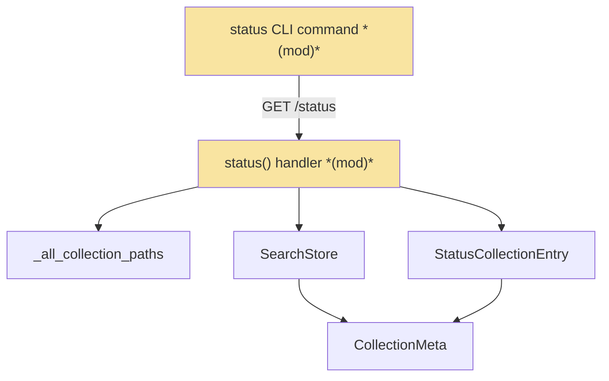
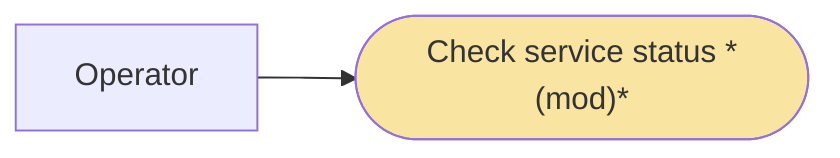
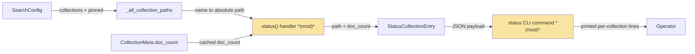
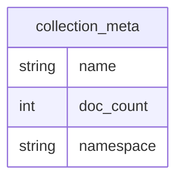

# SPD · Status Endpoint Returns Real Path and Document Count — Team Plan

**How to read this file**
- **Architecture approach:** Clean Architecture — the default fallback; no override skill was requested. **Layers:** Presentation · Use Cases · Interface Adapters · Entities · Frameworks & Drivers.
- The **Frontend, Backend, and Tester** sections are the **depth view** — each role's scope, grouped by layer.
- **Contracts** are logical here, authored as a linked TypeSpec `.tsp` HTTP service with an emitted `.openapi.yaml` (TypeSpec was available on the machine).
- **Role tags** (`#frontend-role`, `#backend-role`, `#tester-role`) mark each role-owned section.
- IDs (`S#` scenarios, `C#` contracts, `Q#` questions) are the traceability thread.
- **Tasks** are not in this file — task breakdown is a separate downstream step that consumes this plan.
- **Rule:** change a contract only by team agreement.

---

## Background

`GET /status` builds one `StatusCollectionEntry` per namespace-visible collection, but the constructor hardcodes `path=""` and `doc_count=0` (routes_status.py:118–119, with the comment "path not yet populated from store"). Both values are already available in the handler: the collection's `CollectionMeta` is loaded into `meta_by_name` before the loop, and the resolved path is one config-derived helper call away.

---

## Goal

`GET /status` returns, for each collection, its real **absolute** storage path (matching what `GET /collections/{name}` already shows) and its cached document count (`CollectionMeta.doc_count`), so operators get a truthful at-a-glance summary. No other behaviour changes.

---

## Scope

### In Scope
- Populate `path` in the `StatusCollectionEntry` construction from `_all_collection_paths(config)` (routes_collections.py:50), looked up by collection name.
- Populate `doc_count` from the already-loaded `col_meta.doc_count`.
- Path-not-found fallback: `""` plus a DEBUG log (once per collection name), never failing the whole status call. This is an expected steady state, not an edge case — see Known limitations.
- Render each collection's path and cached doc_count in the CLI `status` command output (cli/status.py) — so an operator running `archon-search status` sees the corrected values, not just API consumers (Q4B). Must be rendered **before** the `telemetry is None` early-return (cli/status.py:167-169), since telemetry is disabled by default and code placed after that return never executes on a default install.

### Out of Scope
- `chunk_count` and `description` gaps in `/status` and the collection routes (sibling bugs bug-024 / bug-025 — brief files not yet created).
- The `doc_count=0` hardcode in `list_collections` (routes_collections.py:111) — a different route, outside this brief's stated scope.
- Real-time recomputation of the document count (cached `meta.doc_count`; staleness accepted here — Q3A).

---

## Acceptance criteria
- A collection with N ingested documents shows its absolute storage path (when the collection's config-basename is unambiguous — see Q1) and `doc_count = N` (the cached meta value) in its `/status` entry.
- A collection with no documents shows `doc_count = 0` and its real path.
- A namespace-visible collection whose name is absent from `_all_collection_paths(config)` (ad-hoc-ingested, collision-resolved store name, or config-removed) shows `path = ""`, logs at DEBUG (once per name), and `GET /status` still returns `200` with all other fields intact.
- Per-namespace isolation is preserved: each caller sees only their namespace's collections, each with the correct path and count.
- `GET /status` performs no additional per-collection live document recount (no new latency).
- Running `archon-search status` prints, per collection, its path and cached document count — grouped with the other `_print_*` helpers, rendered **before** the `telemetry is None` early-return so it still prints when telemetry is disabled (the default).
- All tests pass with zero warnings.

---

## What does NOT change
- The `StatusCollectionEntry` Pydantic schema (schemas.py:93–110) — `path: str` and `doc_count: int = 0` fields already exist; only the handler's construction changes.
- The namespace scoping of `/status` (names come from store meta, filtered to `request.state.namespace`).
- Every other `StatusResponse` sub-object (backup, maintenance, graph, telemetry, …).
- `openapi.json` — the response schema is unchanged, so no regeneration is required.
- The existing CLI `status` output lines (running/PID/uptime, telemetry, graph GC, expansion-key warnings) — the per-collection lines are added alongside the other `_print_*` helpers (before the telemetry early-return), not replacing any existing line.

---

## Known limitations / accepted trade-offs
- `doc_count` is the **cached** `CollectionMeta.doc_count`, maintained **incrementally** on the hot path — `+distinct_doc_count` on ingest (`store.py` `_do_update_meta_on_add`, ~line 1406) and a blind `max(0, doc_count - 1)` decrement on delete (`_do_update_meta_on_del`, ~line 1515), with `recompute_collection_meta` reconciling it by full scan only on centroid-recompute / reindex. Because the decrement is blind (not verified against an actual full recount), the counter can drift and may lag a live recount. This is intentional (latency), but it is **not** consistent with `GET /collections/{name}`, which recounts live via `count_documents()` (see Q3). The divergence is not only staleness: it is also a **namespace-scoping** difference — `count_documents(collection)` (store.py:2565) takes no namespace parameter and counts the **whole table across all namespaces**, whereas the cached `meta.doc_count` is **per-namespace**. In multi-tenant deployments sharing a collection name across namespaces, the two numbers differ semantically, not just by lag.
- `path` is `""` for a namespace-visible collection with no matching config path entry. This is an **expected steady state**, not rare: it hits any collection ingested ad-hoc (CLI/API file ingest) outside configured roots, any collection whose store name was collision-resolved (`docs_2`, …, see Q1), or a collection whose config path was later removed. Because `/status` is a polled endpoint, the fallback logs at DEBUG (once per collection name), not WARNING — a per-call WARNING on a routine condition would be log spam.

---

## Approach & architecture

Two changes on the same seam: the `/status` route handler stops hardcoding two fields (reads a path from a reused config helper and a count from the `CollectionMeta` already loaded in the loop), and the CLI `status` command renders those two fields per collection in its output.

### Architecture

| Component | Change | Why |
|-----------|--------|-----|
| `status()` route handler (routes_status.py) | modified | Reads `path` from `_all_collection_paths` and `doc_count` from the loaded `CollectionMeta` instead of hardcoding `""` / `0` |
| `status` CLI command (cli/status.py) | modified | Renders each collection's path and doc_count from the `/status` payload (Q4B) — the previously-missing per-collection output |

**Layer map (and role mapping)**

| Layer | Role | Components |
|-------|------|-----------|
| Presentation | **Frontend** | `status` CLI command (cli/status.py) — the operator-facing surface that renders per-collection path + doc_count |
| Use Cases | Backend | (none new) |
| Interface Adapters | Backend | `status()` route handler (routes_status.py); `_all_collection_paths` helper (reused from routes_collections.py) |
| Entities | Backend | `CollectionMeta` (`doc_count` source — unchanged) |
| Frameworks & Drivers | Backend | `SearchStore` (meta already loaded — unchanged) |

**What changes**
- The `StatusCollectionEntry(...)` construction reads `paths.get(name, "")` for `path` and `col_meta.doc_count if col_meta else 0` for `doc_count`.
- `_all_collection_paths(config)` is called once before the loop and imported from `routes_collections` — the same cross-module import `mcp.py:1361` already uses.
- The CLI `status` command iterates `server_payload["collections"]` and prints each collection's name, path, and doc_count grouped with the other `_print_*` helpers (immediately after `_print_graph_gc_status`, cli/status.py:164), rendered **before** the `telemetry = server_payload.get("telemetry")` / `if telemetry is None: return` block at cli/status.py:166-169 — telemetry is disabled by default, so anything placed after that early-return would never print on a default install.

**Key decisions (from the brief + Q3/Q4 resolutions)**
- **Read cached meta, not recount live** (Q3A) — `col_meta.doc_count` is already in hand; a live recount would add latency for no material benefit, at the accepted cost of divergence from `GET /collections/{name}` — which is not only staleness but a namespace-scoping difference: `count_documents()` is table-wide/namespace-blind, `meta.doc_count` is per-namespace.
- **Absolute path** — matches `GET /collections/{name}` (routes_collections.py:344) and `list_collections` (routes_collections.py:109) for cross-endpoint consistency.
- **Fail soft on missing path** — fall back to `""` + a DEBUG log rather than 500 the whole status call. The lookup is a best-effort config-basename match (Q1): on a basename collision across configured paths, or for a collision-resolved store name (`docs_2`), it may return a wrong path or fall back to `""` — a known limitation, not a guarantee.
- **Deliver the operator experience** (Q4B) — extend the CLI so a human running `archon-search status` sees the corrected values, not only API consumers.

### Actors & Use Cases

### Flows

#### User Flow

_Skipped: no user-facing step is added, removed, or reordered — the operator still runs the single `archon-search status` step; only its output is enriched with per-collection path and count lines._

#### Data Flow

#### Sequence

_Skipped: the complete inter-component interaction for this feature is already captured by the data flow diagram above._

### Prior decisions

_No Architecture Decision Records constrain this change (the ADRs under `Documentation/ADRs/` cover LanceDB, fastembed, reranker, router, and telemetry — none touch the status response shape)._

### Contradictions

| Category | Contradiction | Owner |
|----------|---------------|-------|
| brief vs reality | Brief's Key Decision says `meta.doc_count` is "consistent with what other endpoints return." In reality `GET /collections/{name}` recounts **live** via `count_documents()` (routes_collections.py:364), which is **table-wide / namespace-blind** (`count_documents(self, collection)` takes no namespace parameter — store.py:2565), while `/status`'s cached `meta.doc_count` is **per-namespace**; `list_collections` separately hardcodes `doc_count=0` (routes_collections.py:111) — so `/status` will not match either, and the `/collections/{name}` divergence is semantic (scope), not only staleness. | resolved (Q3A) — cached count kept; the divergence is documented as an accepted trade-off, not fixed here |
| brief vs reality | Brief's Core Flow ("Operator runs `archon-search status` … each collection entry shows its real path and count") implies the CLI renders per-collection entries. The CLI `status` command (cli/status.py:132) renders only running/telemetry/graph — never per-collection path or doc_count. | resolved (Q4B) — the CLI `status` command is extended in this feature to render the per-collection lines |

---

## Contracts / seams

Boundaries where roles must agree. **Logical, not code.** Authored with **TypeSpec** (available) as an HTTP service, with an emitted OpenAPI document. Changing one requires team agreement.

**C1 — `GET /status` per-collection `path` + `doc_count`**  *(Interface Adapters ↔ HTTP client)*
Each `StatusCollectionEntry` promises: `path` is the collection's **absolute** resolved storage path (`""` only when the name is absent from `_all_collection_paths(config)`); `doc_count` is the **cached** `CollectionMeta.doc_count` for the caller's namespace (`0` when no meta row). The schema shape is unchanged — this contract fixes the *semantics* of the two previously-placeholder fields. — see [2026-07-15-100-status-path-doccount.tsp](./api-contracts/2026-07-15-100-status-path-doccount.tsp) and the emitted [2026-07-15-100-status-path-doccount.openapi.yaml](./api-contracts/2026-07-15-100-status-path-doccount.openapi.yaml).

---

## Data

The runtime store is LanceDB. This feature reads the existing `doc_count` column from the collection-metadata table (`_archon_collection_meta`, via `CollectionMeta`) — it adds **no** column, table, or migration.

**Migration notes**
- None. `STORE_SCHEMA_VERSION` is not bumped — no structural change to any schema.

---

## Scenarios #tester-role

Behavioural only — step-level detail is produced by the tasks downstream.

| id | Scenario (Given / When / Then) |
|----|--------------------------------|
| **S1** | **Given** a collection with N ingested documents, configured with a path whose basename uniquely matches the collection name · **When** `GET /status` · **Then** its entry shows the absolute storage path and `doc_count = N` (cached meta value) |
| **S2** | **Given** a namespace-visible collection with no documents yet, configured with a path whose basename uniquely matches the collection name · **When** `GET /status` · **Then** `doc_count = 0` and `path` is the real absolute path |
| **S3** | **Given** a namespace-visible collection whose name is absent from `_all_collection_paths(config)` (e.g. ad-hoc-ingested, or a collision-resolved store name) · **When** `GET /status` · **Then** `path = ""`, a DEBUG-level log is emitted (once per collection name — not WARNING, since this is a routine, polled-endpoint condition, not an error), and the call returns `200` with all other fields intact |
| **S4** | **Given** collections across two namespaces · **When** `GET /status` as namespace A · **Then** only A's collections appear, each with the correct path and cached count |
| **S5** | **Given** any `GET /status` call · **When** the response is built · **Then** no per-collection live document recount (`count_documents`) is issued — path comes from one config-derived dict, `doc_count` from the already-loaded meta |
| **S6** | **Given** the server reports collections with paths and counts · **When** the operator runs `archon-search status` · **Then** each collection's name, path, and doc_count is printed, rendered before the `telemetry is None` early-return so it also prints when telemetry is disabled on the server (the default) |
| **S7** | **Given** a collection whose entry has an empty path · **When** the operator runs `archon-search status` · **Then** that collection is still listed (empty path rendered without error) and the command exits cleanly |

---

## Frontend — Presentation #frontend-role

**Scope:** the operator-facing surface — the CLI `status` command (cli/status.py). Add a per-collection block that prints each collection's name, path, and cached doc_count from the `/status` payload. Render it grouped with the other `_print_*` helpers (immediately after `_print_graph_gc_status`, cli/status.py:164), **before** the `telemetry is None` early-return at cli/status.py:167-169 — telemetry is disabled by default, so placement after that return would make the block dead code on default installs. ("Frontend" here is the CLI presentation layer — this project has no web UI.) Writes both unit and integration tests for its tasks.
**Owns layer:** Presentation.

**Done when**
- [x] `archon-search status` prints each collection's name, path, and doc_count from the `/status` payload — S6
- [x] A collection with an empty path is still listed and the command exits cleanly (no crash on `""`) — S7
- [x] The existing status lines (running/PID/uptime, telemetry, graph GC, expansion warnings) are unchanged and still print — S6
- [x] The per-collection block prints even when telemetry is disabled on the server (placed before the `telemetry is None` early-return) — S6

---

## Backend — Entities · Use Cases · Adapters · Frameworks #backend-role

**Scope:** the `/status` route handler only — swap the two hardcoded fields for a reused path lookup and the cached meta count, with a soft fallback on a missing path. Writes both unit and integration tests for its tasks.
**Owns layers:** Interface Adapters (`status()` handler, reused `_all_collection_paths`), Entities (`CollectionMeta`, read-only).

**Done when**
- [x] Each entry's `path` is the absolute resolved path from `_all_collection_paths(config)`, looked up by name — S1, S2, S4
- [x] Each entry's `doc_count` is the cached `col_meta.doc_count` (`0` when no meta) — S1, S2, S4
- [x] A name missing from the path map yields `path=""` + a DEBUG-level log (once per collection name), and `/status` still returns `200` — S3
- [x] No live document recount is added to the status path — S5
- [x] Existing `/status` unit tests updated: happy-path S1/S2 tests use a new `_make_client_spd` helper (`tests/test_routes_status.py`) that registers a `config.collections` path (real `path` value); the pre-existing `_make_client_with_state` tests remain valid as fallback (`path == ""`) assertions, distinguished from the new happy-path tests — S1, S2

---

## Tester #tester-role

**Scope:** the tester owns **e2e and manual** tests plus the project close-out. **Unit and integration** tests belong to the implementing dev, in each implementation task's `Tests` block. The existing unit test `tests/test_routes_status.py:81` (`assert col["doc_count"] == 0`) must be updated by the backend dev as part of S1/S2.

**Test-coverage requirements (gaps found in review — binding on the implementing devs' task `Tests` blocks):**
- **S1/S2 happy path is currently untested by construction.** The shared unit-test helper `_make_client_with_state` (`tests/test_routes_status.py:26-50`) builds `config = SearchConfig()` with no `config.collections` set, so `_all_collection_paths(config)` returns `{}` and every existing `/status` unit test routes through the empty-path fallback — zero tests currently assert a real, non-empty `path` value. The S1/S2 unit tests **must** configure `config.collections` with a real path whose basename matches the collection name (so `_all_collection_paths` returns a non-empty map) before asserting the happy-path `path` value — otherwise the test vacuously exercises the fallback instead of the happy path.
- The integration harness `make_real_app` (`tests/integration/conftest.py`) similarly defaults to empty `config.collections`. S1/S4 integration tests must register the collection's path in the harness config before asserting a real `path` value, for the same reason.
- **S3** must add an explicit `caplog` assertion that the fallback log is emitted at the chosen level (DEBUG, per Fix B — not WARNING), not merely that `path == ""`.
- **S5** ("no live recount") must assert that `count_documents` (the live-recount method) is **not called** during `/status` — a mock/spy with `assert_not_called()`, not just an absence of observed side effects.
- The existing `/status` unit tests in `tests/test_routes_status.py` all currently pass through the empty-`config.collections` fallback; they remain valid as fallback-path assertions but must be distinguished from the new happy-path tests (which require a registered collection path).

**Allocation** — each scenario at the cheapest level that proves it *(unit + integration are dev-written; e2e + manual are the tester's tasks)*

| Scenario | Cheapest level |
|----------|----------------|
| S3 | unit |
| S5 | unit (mock/spy on `count_documents` with `assert_not_called()`) |
| S2 | unit + integration |
| S6 | unit (CliRunner + mocked `_fetch_server_status`) + manual (operator runs `archon-search status`, confirms real path + count on screen) |
| S1, S4 | integration (with a real collection path registered in `make_real_app`'s config) |
| S7 | unit only, by design — empty-path rendering is deterministic and needs no manual eyeball |

---

## Documentation update

Docs the feature touches — the tasks file's close-out task works through this list.

- [x] [2026-07-15-100-status-path-doccount-brief.md](./2026-07-15-100-status-path-doccount-brief.md) — *no change needed* (source brief)
- [x] [2026-07-15-100-status-path-doccount-team-plan.md](./2026-07-15-100-status-path-doccount-team-plan.md) — *new feature* (this file)
- [x] [600_api_reference_or_public_interface.md](../Architecture/600_api_reference_or_public_interface.md) — *new feature* — note that `StatusCollectionEntry.path` (absolute) and `doc_count` (cached meta) are now populated (§`GET /status`).
- [x] [03_running_the_server.md](../UserManual/03_running_the_server.md) — *new feature* — document the new per-collection path/doc_count lines in `archon-search status` output (extends the "`status` prints one of" list).

**Consulted (read-only)**
- [160_operational_readiness_monitoring_and_reliability.md](../Architecture/160_operational_readiness_monitoring_and_reliability.md) — status/health surface context; no change needed.

---

## Open questions

_All open questions are resolved — status is `planned`._

*Resolved in this revision:*
- **Q1** (brief: "does `_all_collection_paths` cover all namespaces?") — it is config-derived and **not** namespace-aware, so a single `_all_collection_paths(config)` call plus `.get(name, "")` per already-scoped name avoids a per-namespace call. But this is a **best-effort config-basename match, not a guarantee**: `_all_collection_paths` (routes_collections.py:50-58) keys its dict via `path_to_collection_name(p)` (sync.py:29-45), which derives the key from only `Path.name` (the last path component), lowercased+sanitized, and is explicitly "collision-unaware by design" (sync.py:39) — a different key space from the STORE-name uniqueness guard at routes_collections.py:166-168. Two configured paths sharing a basename (e.g. `/a/docs` and `/b/docs`) collapse to one key `docs` (last-write-wins), so `.get(name, "")` can return a **wrong** absolute path for the other collection. Collision resolution only happens in `SearchCollectionSync` (store names become `docs`, `docs_2`, …), so a collision-resolved store name (`docs_2`) won't even be in the config map and falls back to `""`. The lookup is correct only when configured-path basenames are unique and match store names; it is a known limitation, not a correctness guarantee.
- **Q2** (brief: "relative or absolute path?") — **absolute**, matching `GET /collections/{name}` (routes_collections.py:344) and `list_collections` (routes_collections.py:109).
- **Q3** (cached vs. live doc_count) — **Q3A: keep the cached `meta.doc_count`**. Status stays fast; the divergence from `GET /collections/{name}`'s live count — which is namespace-scoping, not just staleness (`count_documents()` is table-wide/namespace-blind; `meta.doc_count` is per-namespace) — is accepted and recorded under Known limitations. Aligning every endpoint on one count source is deferred as a possible follow-up.
- **Q4** (CLI rendering) — **Q4B: fix the API and extend the CLI**. The `archon-search status` command is updated to print each collection's path and doc_count, so the operator experience the brief describes is actually delivered — not just the API response.

---

## References

- **Brief:** [2026-07-15-100-status-path-doccount-brief.md](./2026-07-15-100-status-path-doccount-brief.md)
