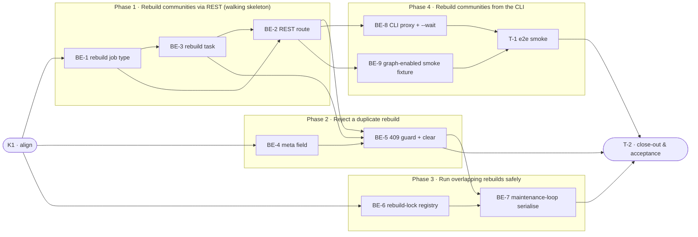

# GBC110 · Per-Collection Community Rebuild via REST API — Task Breakdown

**How to read this file**
- This is the **order view** for `2026-07-15-110-graph-build-communities-bypass-team-plan.md` — every task is a single-role checkbox in execution order, opening with a dependency graph.
- **Phases are vertical slices**: each delivers a working end-to-end increment, not a horizontal layer. No separate "integrate" phase. Sliced with the **`vertical-slicer` skill**.
- This is a **backend-only** feature — archon-search has no web UI, so there are **no `#frontend-role` tasks**. The CLI and REST API are Presentation-layer surfaces owned by the backend.
- Each task carries the **role tag at the end of its title line**, then sub-bullets: **layer · estimate** (decimal hours), **needs · completes**, and a **Tests** block. **needs** = predecessor tasks; **completes** = the scenario `S#` (from the plan) it makes true, or the contract `C#` (from the plan) it realises.
- **Tests** are tagged by level. **Unit and integration tests belong to the implementing (backend) dev** (test-first); **e2e and manual tests are the tester's tasks**. The close-out task writes no tests.
- IDs (`BE-#`/`T-#`/`K#`) are this file's traceability thread; `S#`/`C#`/`Q#` are defined in the plan.
- **Line-number caveat (from grounding):** the plan cites some `routes_collections.py` line numbers (e.g. `~646-651`, `~892-899`) that have since drifted (actual `670-675`, `915-924`). Reference **function/symbol names**, not absolute lines — that file is actively changing.
- **Rule:** edit your own tasks freely.

---

## References

- **Plan:** [2026-07-15-110-graph-build-communities-bypass-team-plan.md](./2026-07-15-110-graph-build-communities-bypass-team-plan.md) — the full team plan (contracts, scenarios, architecture, allocation). **Always read the plan before you start planning the next task** — it holds the context this file only cites (`S#`/`C#`/`Q#`).
- **Brief:** [2026-07-15-110-graph-build-communities-bypass-brief.md](./2026-07-15-110-graph-build-communities-bypass-brief.md) — the source feature brief behind the plan.

---

## Task Breakdown

Single-role tasks in execution order, grouped into **vertical slices**.

### Dependency graph

### Phase 0 · Kickoff *(prerequisite; the one cross-cutting step)*
- [x] **K1** — Agree the Contracts and Scenarios with the team #team
    - — · 1.0h
    - completes C1, C2, C3, C4
    - Tests

### Phase 1 · Rebuild communities via REST *(the walking skeleton: a REST client triggers a rebuild, the job runs to completion, and it is tracked in `/jobs` — carries the trackable-job data foundation)*
- [x] **BE-1** — Add `CommunityRebuildJob` (`types.py`, subclass `IngestJob`) and make it round-trip through `JobStore`: register a `"community_rebuild"` branch in `_write_atomic`'s isinstance cascade (before the final `else`) and in `_load`'s `job_type` dispatch, plus a `create_community_rebuild(collection, namespace)` factory via the shared `create_job` helper #backend-role
    - Interface Adapters *(also Entities: the new dataclass)* · 3.0h
    - needs K1 · completes C2
    - Tests
        - #unit_test — `test_community_rebuild_job_round_trips_through_store` — after write + reload it deserialises as `CommunityRebuildJob`, not a plain `IngestJob` (IC-4)
        - #unit_test — `test_write_atomic_tags_community_rebuild` — a `CommunityRebuildJob` is tagged `"community_rebuild"`, not folded into the `"ingest"` catch-all (Mo7)
        - #unit_test — `test_create_community_rebuild_creates_queued_job` — the factory creates a `QUEUED` job carrying `collection` + `namespace`
- [x] **BE-3** — Add the async rebuild task (mirroring `_migration_task`): construct a fresh `CommunityBuilder`, `await build(collection, ns)`, map success → `DONE` with `result={"communities_built": N}`, and `ValueError`/`ImportError`/`RuntimeError` → `FAILED` with the error string #backend-role
    - Use Cases · 3.0h
    - needs BE-1 · completes C4, S2, S8
    - Tests
        - #unit_test — `test_rebuild_task_success_sets_done_with_count` — success transitions the job to `DONE` with `{"communities_built": N}` (N=0 and N=1 both valid, IMod-2)
        - #unit_test — `test_rebuild_task_zero_nodes_sets_failed` — a zero-node collection (`ValueError`) → `FAILED` with the builder's message (S8)
        - #unit_test — `test_rebuild_task_missing_leidenalg_sets_failed` — missing `leidenalg` (`ImportError`) → `FAILED` with the install hint, no startup crash (Q6, S8)
        - #integration_test — `test_rebuild_job_reaches_done_visible_in_jobs` — the spawned task drives a real build to `DONE`, visible with its count in `GET /jobs/{id}` (S2)
- [x] **BE-2** — Add `POST /graph/{collection}/rebuild-communities` in `routes_graph.py` following the **migrate** route: validate graph-enabled (422, reuse the verbatim `routes_graph.py` detail) and collection-exists (404); read the new `app.state` deps (`job_store`, `search_store`, `_background_tasks`, `job_to_dict`, `JobStatus`); create the job, transition `QUEUED → RUNNING`, spawn the BE-3 task into `_background_tasks`, return `202` with the full `JobResponse` body. Rely **solely** on `APIKeyMiddleware` for auth — do **not** copy the graph-viewer `?token=` branch #backend-role
    - Presentation · 4.0h
    - needs BE-1, BE-3 · completes C1, S1, S5, S6, S10, S11, S14
    - Tests
        - #unit_test — `test_rebuild_route_returns_202_running_job` — returns `202` with a `JobResponse`-shaped body reporting `RUNNING` (not `PENDING`; migrate-shaped, S1)
        - #integration_test — `test_rebuild_route_404_unknown_collection` — unknown collection → `404`, error echoed (S6)
        - #integration_test — `test_rebuild_route_422_graph_disabled` — `graph.enabled=false` → `422` with the established `routes_graph.py` detail string (S5)
        - #integration_test — `test_rebuild_route_401_missing_token` — missing/invalid Bearer token → `401` via middleware (S10)
        - #unit_test — `test_rebuild_route_500_on_invalid_namespace_sentinel` — an `INVALID_NAMESPACE_SENTINEL` namespace → `500` (middleware-only; proves the `?token=` branch was not copied, S14)
        - #integration_test — `test_rebuild_targets_token_namespace_tables` — two tokens for different namespaces each rebuild their own namespace's graph tables (S11)

### Phase 2 · Reject a duplicate rebuild *(a second rebuild for a collection already rebuilding is refused; a collection wedged by a crash unwedges itself — carries the `community_rebuild_job_id` data foundation)*
- [x] **BE-4** — Add `community_rebuild_job_id: str | None = None` to `CollectionMeta` (`collection_meta.py` — **not** `types.py`); append a nullable `community_rebuild_job_id` column to `_meta_schema` (`store.py`); apply the `reindex_job_id` sentinel coercion (`or ""` on write in `update_collection_meta`, `or None` on read in `_row_to_meta`); thread the field through every `CollectionMeta(...)` construction site (grounding verified 13: `store.py`×9, `pipeline.py`×2, `routes_collections.py`×1, `router.py`×1 via `_ROUTING_FIELDS`) — **re-count at implementation time**. No migration, no `STORE_SCHEMA_VERSION` bump (Q8/IM-1); local dev stores must be recreated #backend-role
    - Entities *(also Frameworks & Drivers: the LanceDB `_meta_schema` column)* · 4.0h
    - needs K1 · completes C2
    - Tests
        - #unit_test — `test_collection_meta_persists_community_rebuild_job_id` — a set id survives write + reload through `update_collection_meta`/`_row_to_meta`
        - #unit_test — `test_community_rebuild_job_id_sentinel_coercion` — `None` ⇄ `""` coercion holds both directions (Mo3)
        - #integration_test — `test_meta_field_threaded_through_write_paths` — a meta written via the collection write paths and reloaded still carries the id (guards the multi-site threading)
- [ ] **BE-5** — Add the `409` duplicate guard to the route and the two clear mechanisms (mirroring reindex, CM-1): set `community_rebuild_job_id` on enqueue; the guard reads it, looks up the job, returns `409` `"community rebuild already in progress for this collection"` only when the job is active (`{RUNNING, QUEUED, PENDING}`), else lazily clears the stale id and proceeds; the BE-3 task actively clears the id on **every** terminal exit (DONE and FAILED), each clear wrapped in its own `try/except Exception` #backend-role
    - Presentation *(also Use Cases: the task-side active clear)* · 4.0h
    - needs BE-2, BE-3, BE-4 · completes C2, S7, S16
    - Tests
        - #unit_test — `test_second_rebuild_returns_409` — an active `community_rebuild_job_id` → `409`, no duplicate job created (S7)
        - #unit_test — `test_stale_job_id_cleared_and_proceeds` — a missing/terminal referenced job → id cleared, request proceeds to `202` (lazy clear)
        - #unit_test — `test_task_clears_job_id_on_every_terminal_exit` — the task clears the id on both DONE and FAILED, and a clear failure is swallowed
        - #integration_test — `test_crash_recovery_unwedges_via_lazy_clear` — a stale id pointing at a `FAILED` job (post-restart flip stand-in) → new request returns `202`, not `409`, and the id is cleared (S16)

### Phase 3 · Run overlapping rebuilds safely *(concurrent rebuilds — user-vs-GC and two builder instances — can never write the community table at the same time; a user request arriving mid-GC-rebuild still completes correctly)*
- [ ] **BE-6** — Add the module-level `_rebuild_locks: dict[tuple[str, str], asyncio.Lock]` registry + a lazy accessor in `community_builder.py`, and make `CommunityBuilder.build` resolve and acquire the `(namespace, collection)` lock for the whole build duration. Per-key locks are created **lazily on first access inside the running event loop** (mirroring `SearchStore.lock_for` / `SearchCollectionSync._get_lock`), never at import time — separate from `SearchStore.lock_for`, so it neither self-deadlocks the meta clear nor blocks ingest (C2-1/C2-2/C3) #backend-role
    - Use Cases · 4.0h
    - needs K1 · completes C3, C4, S9, S12
    - Tests
        - #unit_test — `test_two_builders_same_key_serialise` — two distinct `CommunityBuilder` instances on the same `(ns, collection)` serialise via the shared registry — **fails** against a per-instance lock (S9/S12, C2-4)
        - #unit_test — `test_rebuild_lock_independent_of_ingest_lock` — the rebuild lock and `SearchStore.lock_for` never contend; a rebuild does not block ingest (S9)
        - #unit_test — `test_rebuild_lock_created_lazily_in_running_loop` — the per-key lock is created on first access, not at import, avoiding cross-loop binding (C2-2)
        - #unit_test — `test_different_namespaces_do_not_serialise` — different `(ns, collection)` keys acquire independent locks (S11 lock-keying note)
- [ ] **BE-7** — Route `MaintenanceLoop._rebuild_communities_async` through the shared lock (it already calls `build()` on its own fresh `CommunityBuilder`; confirm it acquires no separate lock and now serialises via the registry), closing the GC-vs-user race and accepting the `202`-then-block trade-off (Mo4) #backend-role
    - Use Cases · 2.0h
    - needs BE-6, BE-5 · completes S15
    - Tests
        - #unit_test — `test_maintenance_loop_uses_shared_rebuild_lock` — the GC path's fresh builder serialises against the route path's builder via the shared registry (S12)
        - #integration_test — `test_user_request_during_gc_rebuild_returns_202_then_blocks` — a GC rebuild holding the lock (no `community_rebuild_job_id` set) → a user `POST` returns `202`, its task blocks until release, and both complete without corruption (S15)

### Phase 4 · Rebuild communities from the CLI *(the operator drives the same rebuild through `archon-search graph build-communities`, proxied over HTTP)*
- [ ] **BE-8** — Convert `cli/graph_cmd.py` `build-communities` from in-process to an HTTP proxy: drop `--config`, the `cfg.graph.enabled` pre-check, and the now-dead `CommunityBuilder`/`GraphStore`/`SearchStore` imports; add `--api-url`/`--api-key` reusing `cli/collection.py`'s `_resolve_api_key`/`_DEFAULT_API_URL`; POST to the endpoint and print `job_id`; `--wait` polls `GET /jobs/{id}` recognising all four terminal statuses (exit `0` on DONE, non-zero otherwise); catch `httpx.ConnectError` **specifically** → print `"Server is not running. Start it first with: archon-search start"` and exit non-zero; refresh the stale module docstring (`_archon_graph_{col}_communities` → `_archon_graph_{ns}__{col}_communities`) #backend-role
    - Presentation · 4.0h
    - needs BE-2 · completes S3, S4, S13
    - Tests
        - #unit_test — `test_cli_prints_job_id_without_wait` — without `--wait`, prints the `job_id` and exits `0`
        - #unit_test — `test_cli_wait_polls_until_done_exit_0` — `--wait` polls to `DONE` and exits `0` (S3 unit portion)
        - #unit_test — `test_cli_connect_error_prints_server_not_running` — a mocked `httpx.ConnectError` yields exactly the server-not-running message and a non-zero exit (S4)
        - #unit_test — `test_cli_wait_recognises_all_terminal_statuses` — `FAILED`/`CANCELLED`/`FAILED_EXPIRED` are all terminal, exit non-zero, never hang (S13)
- [ ] **BE-9** — Provide a graph-enabled smoke-server fixture for the S3 e2e test: write a `[graph] enabled=true` config into the isolated `data_dir` before the server starts and ensure the seeded corpus is graph-extracted (so `CommunityBuilder.build` has nodes to cluster), extending or adding alongside `smoke_server` in `tests/smoke/conftest.py`. This is dev-owned infrastructure even though the test that consumes it (T-1) is tester-owned (Q10 → Option A) #backend-role
    - Presentation *(test infrastructure: `tests/smoke/conftest.py`)* · 2.0h
    - needs BE-2 · completes (enables S3)
    - Tests
        - #integration_test — `test_smoke_server_graph_enabled_has_graph_data` — the graph-enabled smoke server starts and its seeded collection reports a non-empty graph (guards against a zero-node server that would make T-1 hit the S8 failure path instead of S3's happy path)
- [ ] **T-1** — e2e smoke: `graph build-communities <collection> --wait` against a real `archon-search serve` subprocess #tester-role
    - — · 2.0h
    - needs BE-8, BE-9 · completes S3
    - Tests
        - #e2e_test — `test_e2e_graph_build_communities_wait_against_server` — using the graph-enabled smoke server (BE-9; CLI-invocation modeled on `test_key_list_no_repr`), run `uv run archon-search graph build-communities <collection> --wait --api-url <base_url> --api-key <key>` as a subprocess and assert exit `0` with the job reaching `DONE` (S3). Guard with `importorskip("leidenalg")` (repo convention) so the test skips cleanly where the optional graph libraries are absent

### Phase 5 · Close-out
- [ ] **T-2** — Project close-out & acceptance fact-check #tester-role
    - — · 4.0h
    - needs all prior tasks · completes (acceptance gate)
    - Tests
    - Duties
        - Update all documentation per `2026-07-15-110-graph-build-communities-bypass-team-plan.md`'s "Documentation update" section: `600_api_reference_or_public_interface.md` (new endpoint + CLI proxy), `120_services_and_integration_architecture.md` (CLI-proxies-to-server rebuild path + new tracked job), `CLAUDE.md` (endpoint/job type + correct the `leidenalg` startup-extras wording, Q6), `graph_store.py` `write_communities` docstring (actual callers), and `cli/graph_cmd.py` module docstring (stale graph-table name).
        - Fix all build / compiler warnings, if any (note: no `-W error` gate is enforced — verify manually, Q11).
        - Run the full test suite (`uv run pytest`; smoke separately via `uv run pytest tests/smoke/ --no-cov`); fix every failing test, including any unrelated to this feature.
        - Validate every Acceptance criterion in the plan one-by-one with a fact check — no assumptions; confirm each is genuinely done.

**Critical path:** K1 → BE-1 → BE-3 → BE-2 → BE-5 → BE-7 → T-2 (≈21h). The CLI branch (BE-2 → BE-8/BE-9 → T-1) and the lock work (BE-6) run alongside; BE-4 starts in parallel with Phase 1 (needs only K1).

---

## Open questions

Continuing `Q#` numbering from the plan (plan's Q1–Q8 are all resolved). **All resolved — see resolutions below.**

- **Q9 (file location — RESOLVED, no-op)** — Grounding flagged a worry that the plan cites `CollectionMeta` as "in `types.py`". Verified false: the plan's every `types.py` reference is for `CommunityRebuildJob` (correct — job classes live there), and it never names a file for `CollectionMeta`. `CollectionMeta` is in `archon_search/collection_meta.py` and BE-4 already targets it. No plan or task change needed.
- **Q10 (smoke fixture for S3 — RESOLVED → Option A)** — The S3 e2e test needs a real server with the graph feature on and a non-empty graph (else `build` raises `ValueError` — the S8 failure path, not S3's happy path); the shared `smoke_server` runs graph-off by default (`GraphConfig.enabled = False`, `config.py:120`). **Resolution:** enable graph in a dedicated/extended smoke fixture (new task **BE-9**, dev-owned) and guard T-1 with `importorskip("leidenalg")` so it skips cleanly where the optional graph libraries are absent. Rejected: a second live server (memory/flakiness risk) and dropping the real-subprocess proof (this feature exists to stop the CLI corrupting data — proving the CLI path end-to-end once is worth the cost). *Affects: BE-9 (new), T-1.*
- **Q11 (no mechanical warnings gate — RESOLVED → Option A)** — The plan's "All tests pass with zero warnings" criterion has no enforcement (`filterwarnings = ["error"]` absent from `pyproject.toml`). **Resolution:** keep the manual check in close-out (T-2 re-runs the suite and confirms no warnings summary). Turning warnings into failures suite-wide would drag in the ~90 pre-existing warnings — out of scope for this feature; a narrowly-scoped strict setting can be a separate initiative later. *Affects: T-2 (already written this way).*
