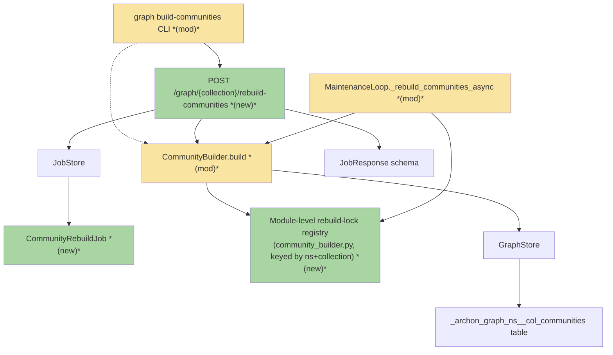
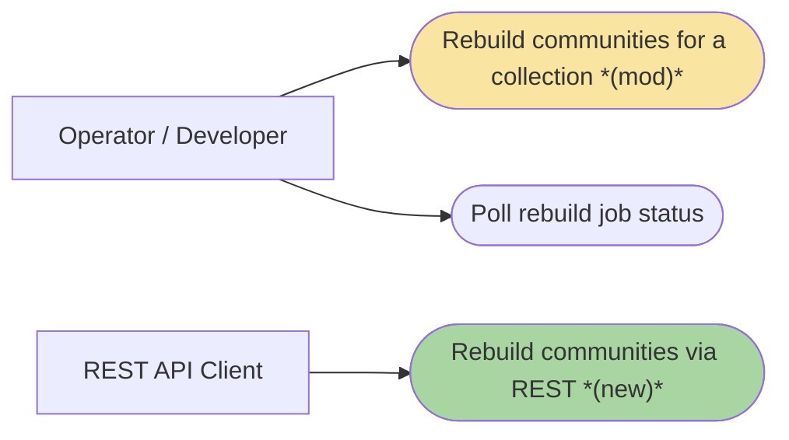
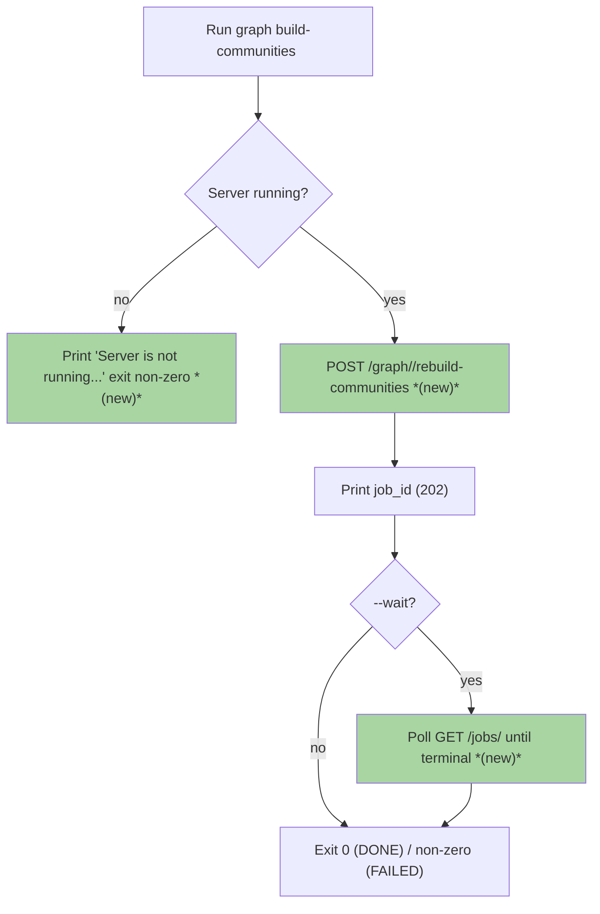
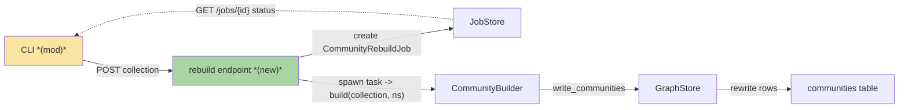
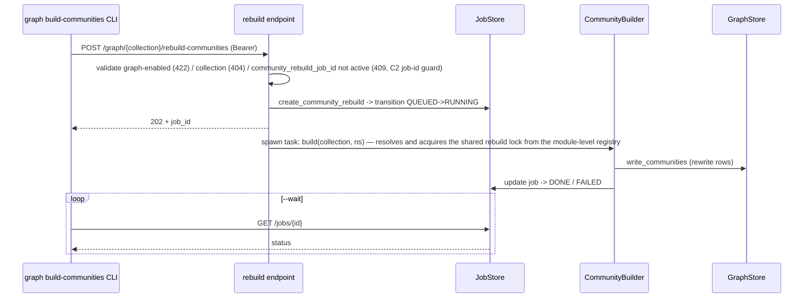
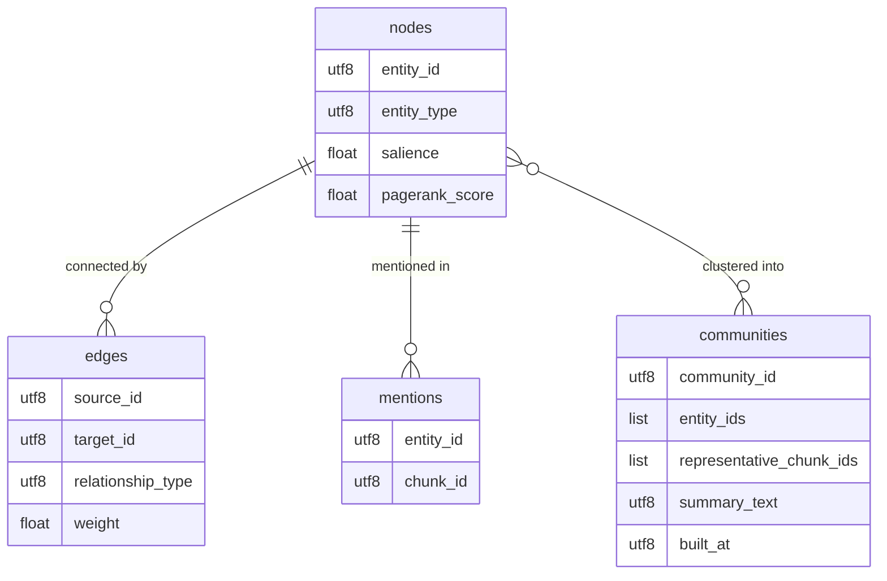

# GBC110 · Per-Collection Community Rebuild via REST API — Team Plan

**How to read this file**
- **Architecture approach:** Clean Architecture — the default; no override skill was requested. **Layers:** Presentation · Use Cases · Interface Adapters · Entities · Frameworks & Drivers.
- This is a **CLI + server** app (Python/FastAPI). The client↔server boundary is the **CLI ↔ REST** seam. There is no web frontend, so the **Frontend** role is **N/A**; the CLI is a Presentation-layer surface owned by the backend.
- The **Frontend, Backend, and Tester** sections are the **depth view** — each role's scope, grouped by layer.
- **Contracts** are logical, authored as linked **TypeSpec** `.tsp` files; the HTTP/API seam also emits a linked `openapi.yaml`.
- **Role tags** (`#frontend-role`, `#backend-role`, `#tester-role`) mark each role-owned section.
- IDs (`S#` scenarios, `C#` contracts, `Q#` questions) are the traceability thread.
- **Tasks** are not in this file — task breakdown is a separate downstream step that consumes this plan.
- **Rule:** change a contract only by team agreement.

---

## Background

Today `archon-search graph build-communities <collection>` runs **in-process** (`archon_search/cli/graph_cmd.py:64-87`): it opens `GraphStore`/`SearchStore` directly, calls `CommunityBuilder.build(collection, ns=DEFAULT_NAMESPACE)`, and writes the community table. When the server is also running, both processes write the same LanceDB files with no coordination — the graph community tables can corrupt, and the work is invisible to the server's `JobStore`, `/jobs`, and `/status`.

---

## Goal

Community rebuilds are triggered through the server. A new `POST /graph/{collection}/rebuild-communities` endpoint enqueues an async job (mirroring `POST /collections/{name}/migrate`) and returns `202 + job_id`; the CLI proxies to it (with a `--wait` flag), the server serialises concurrent rebuilds per collection via a **dedicated per-(namespace, collection) community-rebuild lock held in a module-level registry** (not the chunk-table ingest lock — see Q2), and the job is visible in `/jobs` (see C2-3: **not** `/status` — that surface cannot carry it).

---

## Scope

### In Scope
- New REST endpoint `POST /graph/{collection}/rebuild-communities` that enqueues a community-rebuild job and returns `202 + job_id`.
- A new trackable job type + `JobStore` factory (the maintenance-loop rebuild path is fire-and-forget and cannot be tracked).
- CLI `graph build-communities` updated to proxy to the endpoint instead of running in-process.
- `--wait` flag reusing the polling pattern from the migrate CLI.
- Clear error when the server is not running: `"Server is not running. Start it first with: archon-search start"`, exit non-zero. **(M4)** This is net-new behaviour — no existing CLI command emits this message today. The CLI **must** catch `httpx.ConnectError` specifically, not a broad `except httpx.HTTPError`, to distinguish "server down" (connection refused) from other HTTP errors (4xx/5xx responses, which use the existing `httpx.HTTPError` handling already present in `cli/collection.py`'s `_poll_migration_job`). A broad `except httpx.HTTPError` would swallow both cases identically and could not selectively print the server-not-running message.

### Out of Scope
- Bulk rebuild across all collections at once (use `archon-search maintenance run`).
- Changing Leiden parameters at call time (they come from `archon-search.toml`).
- In-process fallback mode (rejected — keeps the concurrent-write race alive).
- A `--namespace` CLI flag (tracked separately in `2026-07-15-130-graph-build-communities-namespace-brief.md`).

---

## Acceptance criteria
- `POST /graph/{collection}/rebuild-communities` with a valid Bearer token returns `202` and a `job_id` for a graph-enabled, existing collection.
- The enqueued job runs the Leiden rebuild and its status transitions to `DONE` (or `FAILED` with an error) and is visible in `GET /jobs/{id}` (C2-3: **not** `/status` — `StatusResponse` carries no generic jobs list; see Goal and Backend Done-when).
- The rebuild acquires a dedicated per-(namespace, collection) community-rebuild lock, held in a **module-level lock registry in `community_builder.py`** (separate from the ingest lock — see Q2/C3) so it never runs concurrently with **another rebuild** on the same collection+namespace, including a `MaintenanceLoop` GC-triggered rebuild; it does **not** block ingest on that collection (revised from the original "never concurrently with an ingest" wording — see Q2).
- A second rebuild request for a collection already rebuilding returns `409` with `"community rebuild already in progress for this collection"` — no duplicate job.
- Graph not enabled → `422`; the CLI surfaces the server's 422 detail string **from the response body** (CM-2 — the CLI's own local pre-check is removed by the proxy conversion; see S5). The new route follows the existing `routes_graph.py` convention verbatim, so that detail is `"graph inspection requires [graph] enabled=true in server config"` (the four existing graph-disabled guards, `routes_graph.py`, all emit this exact string). The brief's friendlier wording (`"Graph feature is not enabled…"`) is **deliberately not adopted** — a fifth, differently-worded graph-disabled message would break consistency with the four sibling routes; standardising all five on a friendlier string is an optional separate follow-up (C5-I-1).
- Unknown collection → `404`; the CLI echoes the error.
- `archon-search graph build-communities <collection>` proxies to the server and prints the `job_id`; with `--wait` it polls until `DONE`/`FAILED` and exits `0`/non-zero accordingly.
- Server not running → the CLI prints the standard message and exits non-zero, with no in-process fallback.
- The rebuild runs against the namespace derived from the Bearer token.
- All tests pass with zero warnings.

---

## What does NOT change
- `GraphStore.write_communities(...)` and the graph community-table schema — reused unchanged (the graph tables themselves need no migration; the collection-metadata record gains one tracking field — see Data).
- Bearer-token → namespace resolution in `middleware_auth.py` — reused; no middleware changes.
- Existing `GET /graph/*` inspection routes.

**Corrected — these ARE now touched (review finding IC-1/IC-2/IC-3, lock ownership corrected in C2-1):**
- `CommunityBuilder.build(collection, ns, *, seed)` (`archon_search/community_builder.py`, method `build`) is **no longer reused unchanged** — it now acquires a new dedicated per-(namespace, collection) community-rebuild lock for the duration of the build. **The lock itself is NOT an attribute of the `CommunityBuilder` instance.** `CommunityBuilder` is constructed fresh at every call site (verified: `archon_search/community_builder.py` module docstring example, `MaintenanceLoop._rebuild_communities_async` in `jobs/maintenance_loop.py`, `cli/graph_cmd.py`, `eval/runner.py` — each constructs its own `CommunityBuilder(...)`; `CommunityBuilder.__init__` holds no shared/class-level state; `grep CommunityBuilder archon_search/server/` finds no shared instance anywhere in the server). An instance-attribute lock would therefore be a different object per caller and serialise nothing. The lock instead lives in a **module-level registry in `community_builder.py`**, keyed by `(namespace, collection)`, with a module-level accessor function that `build()` calls. See C3/C4 and Q2.
- The `MaintenanceLoop` GC-triggered background rebuild path (`_rebuild_communities_async` in `archon_search/jobs/maintenance_loop.py`) is touched only insofar as it now goes through the same lock-acquiring `CommunityBuilder.build` — it currently acquires **no** per-collection lock at all (verified: no `lock_for`/lock acquisition anywhere in `_rebuild_communities_async` or `_spawn_rebuild_task`) before calling `builder.build()`. Without this fix, a GC-triggered rebuild and a user-triggered rebuild can write the same community table concurrently — the exact race this feature claims to close. Because the lock lives in the shared module-level registry (not on the `CommunityBuilder` instance), the fresh `CommunityBuilder` this path constructs still serialises correctly against the fresh `CommunityBuilder` the route constructs, as long as both resolve the same `(namespace, collection)` key.
- `SearchStore.lock_for(collection)` (`archon_search/store.py`, method `lock_for`) itself is **not** reused for the rebuild — see Q2 and C3 for why holding it caused a self-deadlock, and why a separate lock is used instead. `lock_for` remains unchanged code; it is simply no longer the lock this feature synchronises on.

---

## Known limitations / accepted trade-offs
- The CLI still targets `DEFAULT_NAMESPACE` (the server derives namespace from the token); a CLI `--namespace` flag is a separate brief.
- Progress reporting is status transitions only (`PENDING`/`RUNNING`/`DONE`/`FAILED`), no intra-Leiden progress — SSE streaming is a future iteration.
- Concurrency is reject-on-conflict (`409`), not queue-behind — one active rebuild per collection at a time.
- **GC-vs-user rebuild trade-off (Mo4, see Q2/C3):** a `MaintenanceLoop` GC-triggered rebuild does not set `CollectionMeta.community_rebuild_job_id` (only the user-triggered route does — that field exists solely for the route's `409` guard). Consequence: a user `POST` arriving while a GC-triggered rebuild is in flight sees no active `community_rebuild_job_id`, so it passes the `409` guard and returns `202` — then the rebuild task **blocks** on the shared module-level rebuild lock (C3) until the GC rebuild finishes. This is **correct** (the two rebuilds never write the community table concurrently — no corruption) but the user-visible experience is a slow `202`-then-block, not a fast `409` reject. Accepted because closing it would require either (a) tracking GC rebuilds in the same job-id guard, which the maintenance loop's fire-and-forget design does not support, or (b) probing the lock itself for the `409` decision, which reintroduces the race S9 was rewritten to rule out (see C3's closing note). See S15.
- **Lock-registry lifetime (Mo5, see Q2/C3):** the module-level `_rebuild_locks` registry in `community_builder.py` grows one entry per distinct `(namespace, collection)` ever rebuilt and has no eviction path — nothing pops an entry when a collection is dropped. This is a **conscious, accepted trade-off**, not an oversight: the set of real collections in any deployment is small and bounded, so the unbounded-but-slow-growing dict is not a practical leak. **Note the asymmetry with `SearchStore._collection_locks`** (`store.py`): that registry **does** evict — `drop_collection` (`store.py`, method `drop_collection`) explicitly does `self._collection_locks.pop(name, None)` after dropping the table. `_rebuild_locks` has no equivalent hook. If collection deletion/rename becomes frequent enough to matter, wiring an eviction call alongside `drop_collection`/`rename_collection` is the fix — out of scope here.

---

## Approach & architecture

Follow the **migrate endpoint** end-to-end as the template (`archon_search/server/routes_collections.py`, function `migrate_collection`): validate → create job → transition `QUEUED → RUNNING` before spawning the task → `asyncio.create_task` added to `app.state._background_tasks` → return `202`. The rebuild task calls `CommunityBuilder.build`, which now acquires a dedicated per-(namespace, collection) community-rebuild lock held in a **module-level registry in `community_builder.py`** (see Q2, C3, C4) — **not** the chunk-table ingest lock, and **not** an attribute of the `CommunityBuilder` instance (see C2-1 above and "ARE now touched") — for its duration. The CLI stops writing in-process and instead proxies over HTTP, reusing the migrate CLI's `--wait` polling.

### Architecture

_Scope limited to change neighbourhood: the affected area has ~23 components; shown are the changed nodes (CLI, endpoint, CommunityRebuildJob, the module-level rebuild-lock registry, `CommunityBuilder.build`, and the `MaintenanceLoop` rebuild path) plus their 1-hop neighbours. The dotted `CLI -.-> CommunityBuilder.build` edge marks the removed in-process call path. `RLOCK` is drawn as a standalone module-level node — both `CB` and `MAINT` point into it directly, because it is a shared registry, not a property hung off `CommunityBuilder`._

| Component | Change | Why |
|-----------|--------|-----|
| `POST /graph/{collection}/rebuild-communities` (route in `routes_graph.py`) | new | The REST entry point that enqueues the rebuild job |
| `CommunityRebuildJob` (in `types.py`) + `JobStore.create_community_rebuild` (in `jobs/store.py`) | new | A trackable job entry — the maintenance-loop rebuild path is fire-and-forget |
| Module-level community-rebuild lock registry (`_rebuild_locks: dict[tuple[str, str], asyncio.Lock]` in `community_builder.py`, with a module-level accessor `build()` calls) | new | Serialises writes to the community table across BOTH the user-triggered route and the `MaintenanceLoop` GC-triggered path. It must be module-level, not an instance attribute, because `CommunityBuilder` is constructed fresh at every call site (see C2-1 / "ARE now touched") — a per-instance lock would be a different object per caller and serialise nothing. It must also be separate from `SearchStore.lock_for` because that lock is also held by `update_collection_meta` — holding it across the rebuild would self-deadlock when clearing `community_rebuild_job_id` (IC-1/IC-3, see Q2) |
| `CommunityBuilder.build` (`community_builder.py`, method `build`) | modified | Acquires the shared module-level lock (via its accessor) around the build body — no longer "reused unchanged" |
| `MaintenanceLoop._rebuild_communities_async` (`jobs/maintenance_loop.py`) | modified | Currently acquires no lock before calling `builder.build()` (verified across the full method body); now serialises via the same shared module-level lock as the new route, because both paths call the same `CommunityBuilder.build`, which resolves the lock from the shared registry by `(namespace, collection)` |
| `graph build-communities` CLI (`cli/graph_cmd.py`) | modified | Switches from in-process `CommunityBuilder.build` to proxying the endpoint, adds `--wait` and the server-not-running error. **Flag-surface change (CM-2):** DROPS `--config` and the local `cfg.graph.enabled` pre-check (both present today, `cli/graph_cmd.py` lines 30-36 and 56-62); ADDS `--api-url` (default `http://localhost:8765`) and `--api-key` (falls back to `ARCHON_SEARCH_API_KEY` env var, then the key file via `_resolve_api_key`) — the same two flags the `migrate` CLI already uses (`cli/collection.py`, command `migrate_cmd`), reusing its `_resolve_api_key` resolution order |

**Layer map (and role mapping)**

| Layer | Role | Components |
|-------|------|-----------|
| Presentation | **Backend** (CLI + REST; no web UI) | `graph build-communities` CLI (`cli/graph_cmd.py`), new route in `server/routes_graph.py`, `JobResponse`/`ErrorDetail` (`server/schemas.py`) |
| Use Cases | Backend | `CommunityBuilder.build` (`community_builder.py`, **modified** — gains lock acquisition via the module-level rebuild-lock registry, which also lives in `community_builder.py`), the async rebuild task, `MaintenanceLoop._rebuild_communities_async` (**modified** — now serialises via the same lock) |
| Interface Adapters | Backend | `JobStore` (`jobs/store.py`), `middleware_auth` |
| Entities | Backend | `CommunityRebuildJob` (`types.py`), `Community` (`graph_types.py`), `GraphConfig`/`SearchConfig` (`config.py`) |
| Frameworks & Drivers | Backend | `GraphStore` (`graph_store.py`), LanceDB graph tables |

**Note on the lock's layer (C2-5):** the module-level rebuild-lock registry is **not** an Interface-Adapters or Frameworks & Drivers primitive — it is private module state inside `community_builder.py`, which is a Use-Cases-layer module, and it is accessed only from within `CommunityBuilder.build` (Use Cases) and `MaintenanceLoop._rebuild_communities_async` (Use Cases). It does not appear in the Interface Adapters row above; the C3/C4 contract text and this layer map agree on this placement.

**What changes**
- A new **Presentation** route in `routes_graph.py` validates (graph-enabled → 422, collection-missing → 404, already-running → 409), creates and transitions a job, spawns the rebuild task, and returns `202`.
- A new **Entity** (`CommunityRebuildJob`) and an **Interface-Adapter** factory (`JobStore.create_community_rebuild`) make the rebuild trackable in the existing job store.
- `CollectionMeta` gains a `community_rebuild_job_id` field (see Q8/IM-1 for the corrected no-migration rationale); the route sets it on enqueue and reads it to reject a duplicate with `409` (Q1). It is cleared via **two mechanisms mirroring reindex** (CM-1, see C2): actively, by the rebuild task on every terminal exit; and lazily, by the guard's read-path when the referenced job is found missing or terminal — the latter is what unwedges a collection after a server crash mid-rebuild (S16), since `JobStore._load`'s crash-status flip never touches `CollectionMeta`.
- **`CommunityBuilder.build` gains a new dedicated per-(namespace, collection) community-rebuild lock**, resolved from a **module-level lock registry in `community_builder.py`** (not an instance attribute — see C2-1) and acquired for the whole build duration (Q2). This is a **separate lock from `SearchStore.lock_for`** — see Q2 for why holding the ingest lock self-deadlocks on the `update_collection_meta` clear-guard write, and why this feature therefore does not block ingest.
- **`MaintenanceLoop._rebuild_communities_async` is touched**: it currently acquires no lock at all before calling `builder.build()` (verified across the full method body); after this change it serialises through the same module-level lock registry inside `CommunityBuilder.build` as the user-triggered route — because both paths construct their own fresh `CommunityBuilder` but resolve the lock from the same shared registry by `(namespace, collection)`, closing the GC-vs-user-rebuild race (IC-1/IC-2).
- The **CLI** stops touching the graph tables directly and proxies over HTTP with `--wait`.

**Key decisions (from the brief)**
- Add the REST endpoint rather than deprecating the CLI command — `maintenance run` is all-collections; per-collection control is justified.
- Server-side serialisation via a **new dedicated per-(namespace, collection) community-rebuild lock, held in a module-level registry in `community_builder.py`** — NOT the existing `SearchStore.lock_for` ingest lock (that lock is also acquired by `SearchStore.update_collection_meta`, which the rebuild route must call to clear `community_rebuild_job_id`; holding the same non-reentrant `asyncio.Lock` across both calls self-deadlocks), and NOT an attribute of the `CommunityBuilder` instance (a fresh instance is constructed at every call site — see C2-1). The in-process CLI path bypasses all locking today, so proxying is the only safe fix.
- Dependent on the broader CLI-proxies-to-server work (`2026-07-15-120-cli-server-proxy-brief.md`).

### Actors & Use Cases

### Flows

#### User Flow

#### Data Flow

#### Sequence

_Caption: the 409 in this flow comes from the C2 persisted job-id guard, not from probing any lock. The community-write serialisation itself is a dedicated per-(namespace, collection) rebuild lock, held in a **module-level registry in `community_builder.py`** and resolved inside `CommunityBuilder.build` (C3/C4) — it is a separate lock from `SearchStore.lock_for`, so this sequence never touches the ingest lock. The registry, not `CommunityBuilder.build` itself, is what makes this serialise across the fresh `CommunityBuilder` instances the route and `MaintenanceLoop` each construct (see C2-1)._

### Prior decisions

| Decision | Rationale | Constraint |
|----------|-----------|------------|
| Mount MCP on the REST port; propagate namespace via `request.state.namespace` set by `APIKeyMiddleware` (ADR-09) | Single port, single auth; a spike validated namespace propagation to every graph tool/route | The rebuild route must derive namespace from `request.state.namespace` (not a param); all `GraphStore` methods take `ns` as the **last** parameter; no middleware changes |

### Contradictions

| Category | Contradiction | Owner |
|----------|---------------|-------|
| brief vs. reality | The brief's edge case states `leidenalg` absence is caught as `ConfigError` **at startup**. Confirmed false: `_check_graph_deps` (`app.py`) checks **only `spacy`**, and `leidenalg`/`igraph` are imported lazily inside `CommunityBuilder` (the `leidenalg` import guard). So the request reaches the handler and the rebuild job `FAILED`s (Q6→A). | doc needs updating (fix the brief edge case + the `CLAUDE.md` graph-extras wording) |
| brief vs. reality | The brief's References listed the parent as `bug-008-cli-server-proxy-brief.md`; the actual file is `2026-07-15-120-cli-server-proxy-brief.md`. | doc needs updating (fixed in this revision, Q7) |

---

## Contracts / seams

Boundaries where roles must agree. **Logical, not code** — authored with **TypeSpec** (the HTTP/API seam also emits an `openapi.yaml`). Changing one requires team agreement.

**C1 — Rebuild request/response**  *(CLI ↔ server — HTTP/API seam)*
`POST /graph/{collection}/rebuild-communities` takes the collection as a path param and the namespace from the Bearer token (no body). On success it returns `202` with the body being the **full serialised job** in `JobResponse` shape (`job_id`, `status` = `RUNNING`, `collection`, `namespace`, `source`, `created_at`/`updated_at`, plus the other `JobResponse` fields with their defaults — `result`/`error`/`progress` null, `source_path`/`retry_count`/`kind`/etc. at their base-class defaults), matching how `POST /collections/{name}/migrate` returns `job_to_dict(running_job)` directly (`routes_collections.py`, function `migrate_collection`) rather than a trimmed shape. Errors: `401` unauthorized, `404` collection-not-found, `409` rebuild-already-in-progress, `422` graph-not-enabled. **Correction (IC-5):** earlier revisions of this contract said "reuses the existing `JobResponse`/`ErrorDetail` shapes" while defining an incompatible trimmed `JobAccepted` model in the `.tsp` — the `.tsp` now defines a `JobResponse`-shaped model instead, and the prose is fixed to match. **Mirror-drift note (C2-7):** the `JobResponse` model in the `.tsp` is a **point-in-time, field-for-field mirror** of `JobResponse` in `server/schemas.py` — TypeSpec cannot `$ref` a Python model, so this duplication is a deliberate, acknowledged snapshot that must be manually regenerated if `server/schemas.py`'s `JobResponse` changes (see the matching comment in the `.tsp` file itself). **Correction (M2):** `JobResponse.result` on the Python model (`server/schemas.py`, class `JobResponse`) is typed `str | dict | None`, not `dict | None` — the `.tsp` previously typed it `Record<unknown> | null`, dropping the `str` member and breaking the "field-for-field mirror" claim. It is now `string | Record<unknown> | null`, matching the Python type, and the generated `openapi.yaml` reflects this as an `anyOf: [string, object]` with `nullable: true`. **Server-not-running note (M4):** a `409`/`404`/`422`/`500` from this endpoint is a normal HTTP response the CLI's generic error handling covers; it is distinct from the server being unreachable at all (connection refused), which the CLI must detect via `httpx.ConnectError` specifically — see Scope and S4. — see [`2026-07-15-110-graph-build-communities-bypass.tsp`](./api-contracts/2026-07-15-110-graph-build-communities-bypass.tsp) + [`2026-07-15-110-graph-build-communities-bypass.openapi.yaml`](./api-contracts/2026-07-15-110-graph-build-communities-bypass.openapi.yaml).

**C2 — Trackable rebuild job + duplicate guard**  *(Presentation route ↔ Interface Adapters — internal logical seam)*
The route creates a `CommunityRebuildJob` via a new `JobStore.create_community_rebuild(collection, namespace)`, persisted in the same job store as ingest/migration jobs and surfaced by `GET /jobs/{id}` (**not** `/status` — C2-3: `StatusResponse` has no generic jobs list; its only job-derived field is `failed_expired_ingest_count`, which counts nothing but `FAILED_EXPIRED` `IngestJob` instances — see Goal and Backend Done-when). Needed because `MaintenanceLoop._spawn_rebuild_task` is fire-and-forget with no `job_id`. For the `409` duplicate guard (Q1), the route stores that `job_id` in `CollectionMeta.community_rebuild_job_id`. **The clear is TWO mechanisms, mirroring reindex exactly (CM-1) — both are required, neither alone is sufficient:**
1. **Active clear, in the async rebuild task, on every terminal exit (DONE and FAILED).** Mirroring `_reindex_task`'s pattern (`routes_jobs.py`): at each terminal branch the task re-fetches `CollectionMeta`, sets `community_rebuild_job_id = None`, and calls `update_collection_meta` — wrapped in its own `try/except Exception` (verified pattern at `routes_jobs.py:349-355`/`368-374`, e.g. `"_reindex_task: failed to clear reindex_job_id for job %s"`) so a clear failure logs and is swallowed, never propagating out of the task and crashing it.
2. **Lazy clear in the guard's read-path**, exercised on every new rebuild request. Mirroring the reindex `409` guard (`routes_collections.py` lines 646-651: `if meta.reindex_job_id is not None: existing_job = store.get(meta.reindex_job_id); if existing_job is not None and existing_job.status in {JobStatus.RUNNING, JobStatus.PENDING}: return 409; # else stale — job missing or terminal: meta.reindex_job_id = None` then proceed). The new route's guard must read `community_rebuild_job_id`, look up the referenced job, and if it is missing or in a terminal status, clear the stale id and proceed to create the new job — returning `409` only when a job is found and in an active status.

**Pinned "in progress" status set (CM-3):** the two existing precedents disagree — the reindex guard (`routes_collections.py` ~646-649) treats `{JobStatus.RUNNING, JobStatus.PENDING}` as active, while the migrate guard (`routes_collections.py` ~892-899, its own `reindex_job_id` conflict check) treats `{JobStatus.RUNNING, JobStatus.QUEUED, JobStatus.PENDING}` as active. This route transitions its job `QUEUED → RUNNING` *before* returning `202` — the same create-then-transition-before-spawn pattern `migrate_collection` uses (S1) — so, like migrate, it never dwells in `QUEUED` in steady state. The pinned set for this guard is **`{JobStatus.RUNNING}` plus, defensively, `{JobStatus.QUEUED, JobStatus.PENDING}`** for the narrow window between job creation and the transition call — matching the **migrate** guard's set (`{RUNNING, QUEUED, PENDING}`), since migrate is the closer precedent (same create→transition-before-spawn shape), not the reindex guard's `{RUNNING, PENDING}` (reindex creates at `PENDING` and never transitions before returning, per S1's contrast note).

**Why mechanism (2) is the only thing that unwedges a collection after a crash (CM-1):** `JobStore._load` (`jobs/store.py` ~line 20 `_CRASH_STATUSES = {JobStatus.RUNNING, JobStatus.CANCELLING}`, and ~line 260 `if job.status in _CRASH_STATUSES: job = dataclasses.replace(job, status=JobStatus.FAILED, error="process_restart")`) flips a crashed-mid-rebuild job from RUNNING to FAILED on the next server startup — but `_load` operates only on `JobStore`'s own JSON file; it has no reference to `CollectionMeta` (a separate store, `SearchStore`/LanceDB) and never touches `community_rebuild_job_id`. If mechanism (1) never ran (because the process was killed, not because the task returned normally), `community_rebuild_job_id` is left pointing at a job that is now FAILED. Only mechanism (2) — the guard's read-path lazily discovering the referenced job is terminal and clearing it — unwedges the collection on the next request. Without mechanism (2), a crash mid-rebuild would permanently 409 every future rebuild request for that collection. See S16.

`job.result` on `DONE` is `{"communities_built": N}` (Q3), matching migration's single-count shape. **Round-trip requirement (IC-4):** `JobStore` serialises/deserialises jobs by a `job_type` string tag dispatched via `isinstance` on write (`jobs/store.py`, method `_write_atomic`) and matched via string equality on read (`jobs/store.py`, method `_load`). `CommunityRebuildJob` **must** be registered in BOTH `_write_atomic`'s `isinstance(job, ...)` chain (write a `"community_rebuild"` tag) AND `_load`'s `job_type ==` dispatch chain (reconstruct `CommunityRebuildJob(**item)`) — if only one side is added, the job silently round-trips as a plain `IngestJob` after a server restart, losing its `collection`/`community_rebuild_job_id` semantics. **Ordering requirement (Mo7):** `_write_atomic`'s dispatch is an **ordered isinstance cascade** (`MigrationJob` → `ExportJob` → `ImportJob` → `ReindexJob` → `DeleteJob` → a final `else` that tags anything else as plain `"ingest"` — verified in `jobs/store.py`, method `_write_atomic`); `CommunityRebuildJob` subclasses `IngestJob` (`types.py`), the same base every sibling in that cascade subclasses. The new `elif isinstance(job, CommunityRebuildJob)` branch must be added among the other subclass-specific branches, **before** the cascade's final `else`, exactly as every existing sibling is — placing (or leaving) it after the catch-all is not syntactically possible for an `elif`, but a reviewer must confirm the branch is a distinct `elif isinstance(job, CommunityRebuildJob)` check and not folded into the generic `else`, or every `CommunityRebuildJob` would silently serialise with the base `"ingest"` tag and lose its type on the next restart. — see [`2026-07-15-110-graph-build-communities-bypass-job.tsp`](./2026-07-15-110-graph-build-communities-bypass-job.tsp).

**C3 — Per-(namespace, collection) rebuild serialisation**  *(Use Case internal, `CommunityBuilder.build` ↔ its caller — logical seam, REDESIGNED in cycle 1, lock-ownership corrected in cycle 2 — C2-1)*
**Corrected design (IC-1/IC-2/IC-3):** the previous design ("the rebuild task acquires and holds `SearchStore.lock_for(collection)`") is broken for three independent reasons, all verified against source:
1. `MaintenanceLoop._rebuild_communities_async` (`jobs/maintenance_loop.py`) acquires **no** per-collection lock at all before calling `builder.build()` — verified across the full method body. A design that only makes the new route hold `lock_for` leaves the GC-triggered path completely unserialised against it.
2. `CommunityBuilder.build` (`community_builder.py`, method `build`) itself acquires no lock; its community writes go through `GraphStore.write_communities` (`graph_store.py`), which uses a **separate LanceDB `AsyncConnection`** from `SearchStore`'s chunk-table connection — the ingest lock was never actually guarding the resource this feature writes to.
3. `SearchStore.update_collection_meta` (`store.py`, method `update_collection_meta`) itself acquires `self.lock_for(meta.name)` — the **same non-reentrant `asyncio.Lock`** keyed by collection name. The route must call `update_collection_meta` to clear `community_rebuild_job_id` on completion (C2); if the rebuild task is still holding that same lock at that point, the call **self-deadlocks** (an `asyncio.Lock` is not reentrant).

**Cycle-1 fix was still broken (C2-1):** cycle 1 replaced the ingest lock with "a dedicated per-(namespace, collection) community-rebuild lock, acquired inside `CommunityBuilder.build` ... a property of the resource." This framing is WRONG: `CommunityBuilder` is constructed **fresh at every call site** — verified at the module docstring example in `community_builder.py`, `MaintenanceLoop._rebuild_communities_async` (constructs its own builder, then calls `build()`), `cli/graph_cmd.py`, and `eval/runner.py`; `CommunityBuilder.__init__` holds no shared/class-level state; `grep CommunityBuilder archon_search/server/` finds no shared instance anywhere in the server. An instance attribute is therefore a **different lock object per caller** — it serialises nothing, and the user-vs-GC race this feature exists to close **survives**.

**Corrected fix:** the lock is a **module-level registry in `community_builder.py`** — `_rebuild_locks: dict[tuple[str, str], asyncio.Lock]` keyed by `(namespace, collection)` — with a module-level accessor function (precedents for the module-level-`asyncio.Lock` pattern: `routes_keys.py`'s `_rotate_lock`, `mcp.py`'s `_mcp_rotate_lock`, though both of those are created eagerly at import time — this registry must NOT be, see below). `CommunityBuilder.build` calls the module-level accessor to resolve and acquire the lock for its `(namespace, collection)` key; BOTH the new route's rebuild task and `MaintenanceLoop._rebuild_communities_async` go through `build()`, so they resolve the same lock object from the same registry regardless of which `CommunityBuilder` instance each constructs. Serialisation is therefore a property of the **shared module-level registry**, not of any one call site or any one `CommunityBuilder` instance. Because this lock is separate from `SearchStore.lock_for`:
- Clearing `community_rebuild_job_id` via `update_collection_meta` after the build completes no longer deadlocks (point 3 above is resolved — the two locks are independent).
- Document ingest on the collection is **not** blocked by a rebuild (this reverses the earlier Q2 answer — see Q2's updated resolution).
- The GC-triggered `MaintenanceLoop` path and the user-triggered route path both funnel through the same registry inside `build()`, so they can never write the community table concurrently (closes IC-1/IC-2).
- **Accepted consequence (Mo4):** the GC path never sets `CollectionMeta.community_rebuild_job_id` (only the route does, for its own `409` guard), so a user `POST` arriving mid-GC-rebuild passes the `409` guard and returns `202`, then blocks on this shared lock until the GC rebuild finishes — slow, not corrupting. See "Known limitations / accepted trade-offs" and S15.

**Lazy creation (C2-2):** the per-key lock in the registry MUST be created lazily, on first access, inside the running event loop — mirroring `SearchStore.lock_for` (`store.py`, method `lock_for`: `lock = self._collection_locks.get(collection); if lock is None: lock = asyncio.Lock(); ...`) and `SearchCollectionSync._get_lock` (`sync.py`, method `_get_lock`). It must NOT be created at import time (e.g. as a bare `_rebuild_locks: dict[...] = {}` is fine, but a lock instance itself must not be pre-populated or created at module load). An import-time `asyncio.Lock()` binds to whichever event loop is running when the module is first imported; if that happens outside a running loop, or under a different loop than the one a later caller runs on (e.g. the S9/S12 unit tests each running on their own loop, or `MaintenanceLoop`'s loop), later `await lock.acquire()` calls raise "got Future attached to a different loop" / "bound to a different event loop." The module-level dict itself (the registry) can exist at import time — only the `asyncio.Lock()` instances inside it must be lazily constructed on first access, exactly like `SearchStore.lock_for` and `SearchCollectionSync._get_lock` do for their own per-key locks.

**Lock key rationale (C2-8):** the key is `(namespace, collection)`, not `collection` alone. Graph tables are named per-`(ns, collection)` pair (`_archon_graph_{ns}__{col}_*`), so the rebuild-lock granularity matches the granularity of the resource it protects. This deliberately diverges from `SearchStore._collection_locks`, which is keyed by collection name only (`SearchStore` does not multiplex chunk tables by namespace the same way) — the two registries are independent lock spaces with different key shapes, by design, not by oversight.

The `409` "already rebuilding" signal still comes from the C2 persisted job-id guard, not from inspecting this lock (a lock-inspection based `409` would race — see S9's rewritten scenario).

**C4 — Community build**  *(task ↔ Use Case — no longer "reused unchanged", see C3)*
The task calls `CommunityBuilder.build(collection, ns, *, seed=None)`, which now resolves and acquires the C3 module-level rebuild lock (from the shared registry in `community_builder.py`, keyed by `(ns, collection)` — not an instance-held lock, see C2-1) for the duration of the build, and maps its outcome to the job: success → `DONE` with a community count; `ValueError`/`ImportError`/`RuntimeError` → `FAILED` with the error string. **Correction (Minor):** `OSError` is removed from this list — verified `community_builder.py` raises only `ImportError` (re-raised from the `leidenalg` import guard inside the lazy-import helper) and `ValueError` (raised in `build` when zero graph nodes exist); `RuntimeError` is not raised in `community_builder.py` itself but propagates from `GraphStore` I/O calls it awaits (`graph_store.py`). No `OSError` is raised anywhere on this path, explicitly or transitively through a documented raise. `ns` is always the **last** positional/keyword argument (ADR-09). Leiden clustering runs off the event loop via `asyncio.to_thread` (`community_builder.py`, function `_cluster_with_size_limit`); `MaintenanceLoop._rebuild_communities_async` additionally degrades CPU priority (`nice`) around its call into `build()` on Linux (`maintenance_loop.py`, using `os.setpriority`/`os.getpriority`) — this CPU-priority degradation is unaffected by the C3 lock redesign.

---

## Data

The project uses LanceDB. This feature reads the graph node/edge tables and **rewrites rows** in the community table — **no schema change, no migration**.

**Migration notes**
- **Graph tables:** no change. Tables are named `_archon_graph_{ns}__{col}_{nodes|edges|communities|mentions}`; the `communities` schema (`graph_store.py`) is static and `write_communities` overwrites rows within it.
- **Collection-metadata table:** Q1's `community_rebuild_job_id` adds a nullable column to `_meta_schema` (`store.py`, static method `_meta_schema`; the schema currently ends at `default_ttl_seconds`, no `community_rebuild_job_id` field exists yet). **No migration and no `STORE_SCHEMA_VERSION` bump** (Q8, decision kept) — but the rationale is corrected (IM-1):
  - **(a) Prominent, not buried:** writing a `community_rebuild_job_id` value through `update_collection_meta` (`store.py`, method `update_collection_meta`) hard-codes the row's column set — every field, including the new one, must be present as a dict key in the `table.add([...])` call. Against an `_meta_schema()` created **before** this column was added, that write **fails at write time** (schema mismatch on `add`), not gracefully. Any existing local dev store (created under the current schema) must be recreated after upgrading — this is not a cosmetic detail, it is an operational requirement for anyone with a pre-existing `~/.archon-search/` data dir.
  - **(b) Corrected precedent:** the earlier draft justified "no migration" by analogy — "typed like `reindex_job_id`, therefore no migration." This reasoning is **false**: `reindex_job_id` was itself added to `_meta_schema` via a registered `MigrationSpec` (`store.py`, method `migrate_per_collection_model`, `introduced_at=0`, applied at every startup per `_all_migrations`, `store.py`, static method `_all_migrations`). Citing `reindex_job_id` as a "no migration needed" precedent is backwards — its own addition **required** a migration. The "no migration" decision for `community_rebuild_job_id` stands on its own footing only: pre-release, no production data, no users to protect (Q8) — not on any precedent from `reindex_job_id`.
  - **(c) Threading requirement:** `CollectionMeta` is constructed or copied at **13 verified call sites** (verified 2026-07-16: `store.py` × 9, `pipeline.py` × 2, `server/routes_collections.py` × 1, `router.py` × 1 read-side reconstruction via `_ROUTING_FIELDS`) — every write-path site must explicitly carry `community_rebuild_job_id` through, or the guard silently loses persistence at that call site (the field defaults to `None` on any construction that omits it, which looks like "no active rebuild" even when one is running). **Verify the exact count and each site again at implementation time** — this is a grep-`CollectionMeta(` count, not a stable set of symbol names, and will drift as the codebase changes.
  - **(d) Sentinel coercion (Mo3):** `community_rebuild_job_id` must use the **same sentinel coercion `reindex_job_id` uses**, not a plain pass-through. Verified in `store.py`: on **write**, the LanceDB row dict coerces `None` to the empty string — `"reindex_job_id": meta.reindex_job_id or ""` (`store.py`, e.g. inside `update_collection_meta` and the migration-patch call sites); on **read**, `_row_to_meta` coerces the empty string back to `None` — `reindex_job_id=row.get("reindex_job_id") or None`. LanceDB's `utf8` column type has no native `NULL` distinct from `""` in this write path, so `community_rebuild_job_id` must be written as `meta.community_rebuild_job_id or ""` and read back as `row.get("community_rebuild_job_id") or None` at every site that threads it. Skipping this coercion (e.g. writing `None` directly, or reading `""` back as `""` instead of `None`) would make the `409` duplicate guard treat a cleared rebuild as still active, or vice versa — the guard would silently break.

**Entity model changes**
- `CollectionMeta` gains `community_rebuild_job_id: str | None = None`.
- `CommunityRebuildJob` is a new persisted structure in the JSON job store (not LanceDB); it must be registered in both `JobStore._write_atomic` and `JobStore._load`'s dispatch chains (C2, IC-4).

---

## Scenarios #tester-role

Behavioural only. Cover happy, unhappy, edge, and non-functional paths.

| id | Scenario (Given / When / Then) |
|----|--------------------------------|
| **S1 (pinned, Mo1)** | **Given** a running server, graph enabled, and an existing collection · **When** `POST /graph/{collection}/rebuild-communities` is sent with a valid token · **Then** it returns `202` with a `job_id` and status `RUNNING` — the job is created `QUEUED`, explicitly transitioned `QUEUED → RUNNING` (`job_store.transition(...)`), and only then is the rebuild task spawned, returning `job_to_dict(running_job)`. This follows the **migrate** route's pattern (`routes_collections.py`, function `migrate_collection`: creates via `create_migration` at `QUEUED`, calls `job_store.transition(migration_job.job_id, {JobStatus.QUEUED}, JobStatus.RUNNING)` before `asyncio.create_task`, returns `job_to_dict(running_job)`) — **not** the reindex route's pattern (`routes_collections.py`, function `reindex_collection`: creates via `create_reindex` at `PENDING` and returns `job_to_dict(job)` with **no** pre-transition, so its `202` body reports `PENDING`, not `RUNNING`). Do not copy reindex's shape for this scenario |
| **S2** | **Given** an accepted rebuild job · **When** the async task completes · **Then** the job transitions to `DONE` and is visible with a community count in `GET /jobs/{id}` (C2-3: **not** `/status` — `StatusResponse` has no generic jobs list) |
| **S3** | **Given** the server is running · **When** the user runs `graph build-communities <collection> --wait` · **Then** the CLI prints the `job_id`, polls until `DONE`, and exits `0` |
| **S4 (pinned, M4)** | **Given** no server is running (the HTTP call raises `httpx.ConnectError`) · **When** the user runs `graph build-communities <collection>` · **Then** the CLI prints `"Server is not running. Start it first with: archon-search start"` and exits non-zero, with no in-process fallback. The CLI must catch `httpx.ConnectError` **specifically** — not a broad `except httpx.HTTPError` — so this path is distinguishable from a non-2xx server response (404/409/422/500), which uses the existing generic HTTP-error handling. The unit test must assert that the `ConnectError` path yields exactly this message and a non-zero exit; a test written against a broad `HTTPError` catch would not discriminate "server down" from "server up but returned an error" and would pass even if the two were wrongly conflated |
| **S5 (reconciled, CM-2 / C5-I-1)** | **Given** `graph.enabled = false` on the **server** · **When** the CLI sends the rebuild request · **Then** the server's route returns `422` with the established `routes_graph.py` convention detail `"graph inspection requires [graph] enabled=true in server config"` **in the response body** (the exact string the four existing graph-disabled guards emit — verified in `routes_graph.py`; the brief's friendlier wording is deliberately not adopted, see Scope), and the CLI echoes that server-supplied message verbatim (generic `422`/error-body handling, the same path S6's `404` echo uses) — it is **not** a local CLI pre-check string. The proxy conversion **removes** the CLI's local `cfg.graph.enabled` check (`cli/graph_cmd.py`, the `if not cfg.graph.enabled` block, CM-2) entirely, since the CLI no longer loads server config; the server is now the sole source of this message |
| **S6** | **Given** an unknown collection · **When** the rebuild is requested · **Then** the server returns `404` and the CLI echoes the error |
| **S7** | **Given** a rebuild already in progress for a collection · **When** a second rebuild is requested for it · **Then** the server returns `409` `"community rebuild already in progress for this collection"` and no duplicate job is created |
| **S8** | **Given** a collection with **zero** graph nodes (`CommunityBuilder.build` raises `ValueError`, verified in the method body) or `leidenalg` missing (`ImportError`) · **When** the rebuild runs · **Then** the job transitions to `FAILED` with the error string, and `--wait` exits non-zero. **Distinguished from:** a collection with exactly 1 graph node, which is a **valid, non-failing** case — `build` returns a single synthetic community without running Leiden and the job reaches `DONE` with `{"communities_built": 1}`; and a collection with ≥2 nodes where Leiden produces zero groups, which is also **valid** — `DONE` with `{"communities_built": 0}` (IMod-2: only the genuinely-no-nodes case is `FAILED`) |
| **S9 (rewritten, IM-4; test discriminates instance vs. shared lock — C2-4)** | **Given** the redesigned C3 dedicated rebuild lock, held in a **module-level registry in `community_builder.py`** keyed by `(namespace, collection)`, separate from `SearchStore.lock_for` · **When** (a) an ingest and a rebuild run concurrently on the same collection, AND (b) **two separate `CommunityBuilder` instances are constructed on the same `(namespace, collection)` key** and both call `build()` concurrently · **Then** (a) the rebuild does **not** wait on or block the ingest (independent locks/registries), and (b) the two separate instances still serialise against each other via the shared module-level registry — proved as a **unit test directly on the shared rebuild lock** (two `build()`/lock-acquiring calls on two distinct `CommunityBuilder()` objects sharing a key, plus an independent `SearchStore` ingest-lock acquisition that never contends with either). This test **must fail** against a per-instance lock design and **pass** only against the shared module-level registry — it is not a `TestClient` concurrency test, which is unwritable under the single-threaded `asyncio` test harness |
| **S10** | **Given** a request with a missing or invalid Bearer token · **When** the rebuild is requested · **Then** the server returns `401` |
| **S11** | **Given** two tokens for different namespaces · **When** each triggers a rebuild for the same collection name · **Then** each rebuild targets its own namespace's graph tables (namespace derived from the token); **note (IMod-2/Minor):** because the C3 lock is keyed by `(namespace, collection)`, this also means the two rebuilds do **not** serialise against each other — only same-namespace, same-collection rebuilds do. A future namespace-aware refactor of the lock key must not accidentally collapse this to collection-only keying, which would reintroduce a cross-namespace race |
| **S12 (new, IM-4; discriminates shared vs. per-instance lock — C2-4)** | **Given** a user-triggered rebuild (via the route) and a GC-triggered rebuild (via `MaintenanceLoop`) on the **same** collection — each constructing its **own, separate `CommunityBuilder` instance** on the same `(namespace, collection)` key (exactly as production code does: the route's task and `MaintenanceLoop._rebuild_communities_async` each construct a fresh `CommunityBuilder`) · **When** both attempt to run concurrently · **Then** they cannot write the community table concurrently — proves the redesigned C3 lock is a **shared module-level registry**, not a per-instance lock: this test asserts serialisation across the two separate instances, which **fails** if the lock were an instance attribute (a different object per `CommunityBuilder()` call) and **passes** only when both resolve the same lock object from the shared registry by `(namespace, collection)` |
| **S13 (new, IM-4; citation corrected — Mo6)** | **Given** a rebuild job that ends in `FAILED`, `CANCELLED`, or `FAILED_EXPIRED` · **When** the CLI polls with `--wait` · **Then** it recognises all of `{DONE, FAILED, FAILED_EXPIRED, CANCELLED}` as terminal, exits non-zero for the non-`DONE` members, and never hangs. **Citation correction:** the CLI cannot import the server-internal `jobs/store.py` module-level constant `_TERMINAL_STATUSES` — it is a separate process reached only over HTTP. The CLI's authority is instead its own mirrored string-literal set, e.g. `_TERMINAL_STATUSES = {"DONE", "FAILED", "FAILED_EXPIRED", "CANCELLED"}` defined independently in `cli/collection.py` (and duplicated identically in `cli/backup_cmd.py`, `cli/export_cmd.py`) — the new `graph build-communities --wait` polling loop must define or reuse this same CLI-side set. Its contents happen to match the server's `jobs/store.py` `_TERMINAL_STATUSES` enum values, by convention, not by any shared import |
| **S14 (new, IM-4; auth path pinned — C2-9; allocation corrected — Mo2)** | **Given** a Bearer token whose namespace resolution is invalid (`middleware_auth.INVALID_NAMESPACE_SENTINEL`) · **When** the rebuild is requested · **Then** the server returns `500` — because the new route relies **solely on `APIKeyMiddleware`** for auth (verified: `middleware_auth.py`, the middleware's dispatch path returns `Response(status_code=500)` when the namespace-resolution result is `INVALID_NAMESPACE_SENTINEL`). The route **must NOT** copy `routes_graph.py`'s existing in-handler `?token=` validation branch (used only by the graph-viewer HTML route for embedding a raw token in a page) — that branch calls `validate_token_and_get_namespace` itself and returns `401` on the same sentinel value. If the new route accidentally reused that branch, S14's asserted `500` would become `401`. **Not reachable at integration level (Mo2):** `INVALID_NAMESPACE_SENTINEL` is returned only when `validate_token_and_get_namespace` resolves a namespace from the `namespaces: dict[str, str]` map (`middleware_auth.py`) and that resolved value fails `_validate_namespace` — i.e. the `namespaces` config map itself must already contain an invalid namespace string. A `TestClient` built via `make_real_app(...)`'s normal config/token setup cannot produce this without deliberately constructing that malformed map, which the normal config-write path guards against. This scenario is therefore **unit-level only**: construct `APIKeyMiddleware`/the route directly with a `namespaces` map crafted to yield the sentinel, bypassing normal config validation |
| **S15 (new, Mo4)** | **Given** a `MaintenanceLoop` GC-triggered rebuild already running for a collection (so the shared module-level rebuild lock, C3, is held, but `CollectionMeta.community_rebuild_job_id` is **not** set, since the GC path never sets it) · **When** a user sends `POST /graph/{collection}/rebuild-communities` for the same collection · **Then** the `409` job-id guard finds no active `community_rebuild_job_id` and the request is accepted with `202` — but the spawned rebuild task then **blocks** on the shared rebuild lock until the GC rebuild releases it, before it can itself acquire the lock and run. No corruption occurs (the lock still serialises the two writes), but the user observes a slow `202`-then-block rather than a fast `409` reject. This is the accepted trade-off from "Known limitations" — the test asserts the `202` and the eventual serialised completion, not a `409` |
| **S16 (new, CM-1)** | **Given** the server is killed mid-rebuild (a `CommunityRebuildJob` left `RUNNING` in the job store, and `CollectionMeta.community_rebuild_job_id` still pointing at it because mechanism (1)'s active clear never ran — the process died before the task's terminal branch executed) · **When** the server restarts (`JobStore._load` flips the job `RUNNING → FAILED` per `_CRASH_STATUSES`, `jobs/store.py` ~line 20/260 — verified this touches only the job store, not `CollectionMeta`) and a new `POST /graph/{collection}/rebuild-communities` is then sent for the same collection · **Then** the guard's lazy stale-clear branch (C2 mechanism 2) looks up `community_rebuild_job_id`, finds the referenced job in terminal status `FAILED`, clears the stale id on `CollectionMeta`, and proceeds — the request returns `202` with a new `job_id`, **not** a permanent `409`. **Allocation:** integration — the harness can simulate this directly (real `SearchStore`/`JobStore` via `make_real_app`): write a `CollectionMeta` with a stale `community_rebuild_job_id`, write/transition the referenced job to `FAILED` (standing in for the post-restart `_load` flip, which is exercised separately by `JobStore`'s own crash-recovery unit tests), then drive the route via `TestClient` and assert `202`. A true full-process restart is unit-level-only for `JobStore._load` and out of scope for this integration test to reproduce end-to-end |

---

## Frontend — Presentation #frontend-role

**N/A — no frontend work for this feature.** archon-search has no web UI; the user-facing surface is the CLI and REST API, both Presentation-layer components owned by the backend below.

---

## Backend — Presentation (CLI/REST) · Use Cases · Adapters · Entities · Frameworks #backend-role

**Scope:** the new REST route, the trackable job type + store factory (registered in both `JobStore` serialise/deserialise dispatch chains), the dedicated per-(namespace, collection) community-rebuild lock added as a **module-level registry in `community_builder.py`, resolved from within `CommunityBuilder.build`** — NOT an attribute of the `CommunityBuilder` instance (C2-1) — touching both the new route's call path and the existing `MaintenanceLoop._rebuild_communities_async` call path, the new `app.state` dependencies the `/graph` router must acquire (`job_store`, `search_store`, `_background_tasks`, `job_to_dict`, `JobStatus`, and the `transition` helper — see IM-3: today's `routes_graph.py` route handlers (`get_graph_view`, `get_graph_cross_collection`, `get_graph`, `get_graph_impact`) only read `pipeline`/`config`/`graph_store` off `app.state`, unlike `routes_collections.py`'s job-creating routes (`add_collection`, `reindex_collection`, `migrate_collection`), which additionally read `job_store`/`search_store`/`_background_tasks`), the `community_rebuild_job_id` threading across all 13 `CollectionMeta` construction sites (IM-1c), and the CLI proxy conversion — which includes **removing** `cli/graph_cmd.py`'s now-orphaned in-process imports (`CommunityBuilder`, `GraphStore`, `SearchStore`, all imported at module scope in `cli/graph_cmd.py`) once the in-process build path is deleted; leaving them in place after the CLI stops calling them in-process would be dead weight the linter/reviewer must otherwise catch by hand. **Flag-surface change (CM-2):** the proxy conversion DROPS the CLI's `--config` option and its local `cfg.graph.enabled` pre-check (both present today at `cli/graph_cmd.py` lines 30-36 and 56-62) — both become meaningless once the CLI no longer loads config or constructs `GraphStore`/`SearchStore`/`CommunityBuilder` in-process. It ADDS the same server-URL + API-key resolution the `migrate` CLI already uses: `--api-url` (default `http://localhost:8765`, `cli/collection.py` module constant `_DEFAULT_API_URL`) and `--api-key` (falls back to the `ARCHON_SEARCH_API_KEY` env var, then the on-disk key file, via `cli/collection.py`'s `_resolve_api_key` helper) — reuse or mirror `_resolve_api_key` rather than inventing a new resolution order. Writes both unit and integration tests for its tasks. **`/status` is explicitly out of scope for this feature (C2-3) — see Done-when below; the tracking surface is `GET /jobs/{id}` only.**
**Owns layers:** Presentation (CLI + REST), Use Cases, Interface Adapters, Entities, Frameworks & Drivers.

**Done when**
- [ ] `POST /graph/{collection}/rebuild-communities` returns `202 + job_id` (full `JobResponse`-shaped body, C1/IC-5) for a valid graph-enabled collection, following the migrate route pattern (validate → create job → transition RUNNING → spawn task → 202) — S1
- [ ] A `CommunityRebuildJob` + `JobStore.create_community_rebuild` make the rebuild visible in `GET /jobs/{id}` (C2-3: **not** `/status` — `StatusResponse` carries no generic jobs list, so it cannot surface a rebuild job regardless of any job-type filter change; `/jobs`-only tracking is the correct and sufficient surface, matching the brief's `archon-search jobs status <job_id>` CLI flow), reaching `DONE` (result `{"communities_built": N}`, `N=0` valid for an empty-but-clustered graph, `N=1` valid for the single-node synthetic-community case) or `FAILED` (only when zero graph nodes exist, or `leidenalg` is missing — IMod-2); a missing `leidenalg` library produces a `FAILED` job with the actionable install message, not a startup crash (Q6) — S2, S8
- [ ] `CommunityRebuildJob` is registered in **both** `JobStore._write_atomic`'s `isinstance` dispatch and `JobStore._load`'s `job_type` string dispatch (IC-4, `jobs/store.py`, methods `_write_atomic` and `_load`), with the new `isinstance(job, CommunityRebuildJob)` branch placed among `_write_atomic`'s other subclass-specific `elif` branches, before the final catch-all `else` (Mo7 — required because `CommunityRebuildJob` subclasses `IngestJob`, the same base the `else` branch tags as plain `"ingest"`) — a round-trip test restarts the store and confirms the job deserialises as `CommunityRebuildJob`, not a plain `IngestJob`
- [ ] A duplicate rebuild is rejected with `409` via a `community_rebuild_job_id` stored on `CollectionMeta` (set on enqueue), mirroring the reindex guard; the field is added to `_meta_schema` directly, no migration, with the corrected rationale (Q1, Q8, IM-1) — S7
- [ ] **Both clear mechanisms are implemented (CM-1, C2):** (a) the async rebuild task actively clears `community_rebuild_job_id` on every terminal exit (DONE and FAILED), each clear wrapped in its own `try/except Exception` so a clear failure logs and cannot crash the task (mirrors `_reindex_task`'s pattern, `routes_jobs.py`); (b) the route's `409` guard lazily clears a stale `community_rebuild_job_id` when the referenced job is missing or in a terminal status, then proceeds — mirroring the reindex guard's read-path (`routes_collections.py` ~646-651). Mechanism (b) is the only one that unwedges a collection after a server crash mid-rebuild, since `JobStore._load`'s crash-status flip (`jobs/store.py` `_CRASH_STATUSES`) never touches `CollectionMeta` — S16
- [ ] **Redesigned locking (Q2, C3, IC-1/IC-2/IC-3, ownership corrected — C2-1/C2-2):** the per-(namespace, collection) community-rebuild lock lives in a **module-level registry in `community_builder.py`** (`_rebuild_locks: dict[tuple[str, str], asyncio.Lock]`), NOT as an attribute of the `CommunityBuilder` instance — `CommunityBuilder` is constructed fresh at every call site, so an instance-attribute lock would serialise nothing. `CommunityBuilder.build` resolves and acquires the lock from this registry via a module-level accessor for its whole duration; the per-key lock is created **lazily on first access inside the running event loop** (mirroring `SearchStore.lock_for` and `SearchCollectionSync._get_lock`), never at import time, to avoid binding to the wrong `asyncio` event loop under the S9/S12 unit tests or `MaintenanceLoop`. This lock is used by BOTH the new route's rebuild task AND `MaintenanceLoop._rebuild_communities_async` (which today acquires no lock at all, verified across the full method body); it is a lock **separate from `SearchStore.lock_for`**, so (a) clearing `community_rebuild_job_id` via `update_collection_meta` after the build does not self-deadlock, and (b) document ingest on the collection is not blocked by a rebuild — S9, S12
- [ ] Validation returns `422` (graph disabled), `404` (unknown collection), `401` (bad token), `500` (invalid-namespace sentinel) with `ns` from `request.state.namespace` — S5, S6, S10, S11, S14
- [ ] The CLI proxies to the endpoint, prints the `job_id`, supports `--wait` polling that recognises all four terminal statuses (`DONE`/`FAILED`/`FAILED_EXPIRED`/`CANCELLED`), and prints the server-not-running message on connection failure — S3, S4, S13

---

## Tester #tester-role

**Scope:** the tester owns **e2e and manual** tests plus the project close-out. **Unit and integration** tests belong to the implementing dev, in each implementation task's `Tests` block.

**Allocation** — each scenario at the cheapest level that proves it *(unit + integration are dev-written; e2e + manual are the tester's tasks)*

| Scenario | Cheapest level |
|----------|----------------|
| S1, S2, S5, S6, S7, S8, S10, S11 | integration (real `SearchStore`/`GraphStore` + `TestClient` via `make_real_app(graph_enabled=True)`) |
| S4 | unit (mock `httpx.ConnectError` in the CLI) |
| S14 (reallocated, Mo2) | unit — `INVALID_NAMESPACE_SENTINEL` is not reachable via `TestClient`/`make_real_app`'s normal config/token setup; it requires constructing `APIKeyMiddleware` (or the route) directly with a `namespaces` map crafted to make `validate_token_and_get_namespace` return the sentinel, which the normal config-write path guards against |
| S3 | e2e (smoke — real `archon-search serve` subprocess; the only harness where CLI `httpx` → running server + `--wait` polling works) |
| S9 (rewritten, IM-4; C2-4) | unit — directly exercises the shared module-level rebuild-lock registry in `community_builder.py`: (a) concurrently acquiring the rebuild lock and the unrelated `SearchStore` ingest lock and asserting neither blocks the other; (b) constructs **two separate `CommunityBuilder` instances** on the same `(namespace, collection)` key and asserts they still serialise via the shared registry — a test that fails against a per-instance lock and passes only against the shared module-level registry. A `TestClient` concurrency test cannot express this under the single-threaded `asyncio` test harness |
| S12 (new, IM-4; C2-4) | unit — constructs **two separate `CommunityBuilder` instances** (simulating the route's task and `MaintenanceLoop`'s task, exactly as production code does) on the same `(namespace, collection)` key and asserts calls into their respective lock-acquiring `build()` paths serialise — this discriminates the shared module-level registry from a per-instance lock, which would not serialise two separate instances at all |
| S13 (new, IM-4) | unit (CLI `--wait` polling loop against a mocked `GET /jobs/{id}` returning each of `FAILED`/`CANCELLED`/`FAILED_EXPIRED`) |
| S15 (new, Mo4) | integration — spawn a `MaintenanceLoop`-style rebuild task holding the shared C3 lock without setting `community_rebuild_job_id`, then drive `POST /graph/{collection}/rebuild-communities` via `TestClient` and assert `202` followed by the second task blocking until the first releases the lock |
| S16 (new, CM-1) | integration — write a stale `community_rebuild_job_id` on `CollectionMeta` pointing at a job forced to `FAILED` (standing in for the post-restart `_load` flip), drive the route via `TestClient`, and assert `202` (not `409`) and that the stale id is cleared |

**Test-template pointers (IM-6)** — existing suites with directly analogous coverage to model new tests on:
- `tests/test_routes_collections.py` — the `migrate` route's `202`/`404`/`422` tests are the closest existing template for the new rebuild route's status-code coverage (S1, S5, S6, S7).
- `tests/server/test_routes_graph.py` — the `422` graph-disabled tests on existing `/graph/*` routes are the template for the new route's `422` case (S5).
- `test_cli_collection.py` — the `--wait` polling tests for the migrate/reindex CLI commands are the template for the new `graph build-communities --wait` polling loop (S3, S13).
- `tests/smoke/` — the real-subprocess `archon-search serve` smoke harness is the only place S3/S4's actual CLI-to-server HTTP round trip can be exercised end-to-end.

---

## Documentation update

Docs the feature touches — the tasks file's close-out task works through this list. Each file carries a reason.

- [ ] [2026-07-15-110-graph-build-communities-bypass-brief.md](./2026-07-15-110-graph-build-communities-bypass-brief.md) — *no change needed* (source brief)
- [ ] [2026-07-15-110-graph-build-communities-bypass-team-plan.md](./2026-07-15-110-graph-build-communities-bypass-team-plan.md) — *new feature* (this file)
- [ ] [600_api_reference_or_public_interface.md](../Architecture/600_api_reference_or_public_interface.md) — *new feature* — document `POST /graph/{collection}/rebuild-communities` and the CLI proxy change
- [ ] [120_services_and_integration_architecture.md](../Architecture/120_services_and_integration_architecture.md) — *new feature* — the CLI-proxies-to-server rebuild path and the new tracked job
- [ ] [CLAUDE.md](../../CLAUDE.md) — *contradiction with code* — note the endpoint + new job type in the graph/jobs sections; correct the `leidenalg` startup-extras wording (Q6)
- [ ] `graph_store.py`, `GraphStore.write_communities` docstring — *contradiction with code* — the docstring states the delete+add non-atomicity "is acceptable because `write_communities` is called exclusively from the `build-communities` CLI batch operation." After this feature, the primary callers are the new server route's rebuild task and `MaintenanceLoop._rebuild_communities_async` — the CLI no longer calls it in-process at all. Update the docstring to name the actual callers.
- [ ] `cli/graph_cmd.py` module docstring — *pre-existing inaccuracy, surfaced while this file is already in the modify-list* — its docstring (lines 7-8) references the pre-namespacing graph-table name `_archon_graph_{col}_communities`, not the current `_archon_graph_{ns}__{col}_communities` naming. Since the in-process build path (and this docstring's surrounding prose) is being deleted in this feature anyway, remove or refresh this line as part of the same edit rather than carrying the stale name forward into the proxying version of the file.

**Consulted (read-only)**
- [2026-07-15-120-cli-server-proxy-brief.md](./2026-07-15-120-cli-server-proxy-brief.md) — parent CLI-proxies-to-server architectural brief this depends on
- [2026-07-15-130-graph-build-communities-namespace-brief.md](./2026-07-15-130-graph-build-communities-namespace-brief.md) — the separate `--namespace` CLI work
- [160_operational_readiness_monitoring_and_reliability.md](../Architecture/160_operational_readiness_monitoring_and_reliability.md) — job store / `/jobs` / `/status` operational surface

---

## Open questions

Resolve before committing (status moves `draft → planned`).

_All open questions resolved — status is `planned`._

*Resolved in this revision:*
- *Q1 → A: detect the `409` via a persisted `CollectionMeta.community_rebuild_job_id`, mirroring the reindex guard (`routes_collections.py`, the reindex route's `reindex_job_id` guard) — never conflates ingest with rebuild. **"Survives restart" is true only because of the guard's lazy stale-clear branch (CM-1, C2):** `JobStore._load` flips a crash-interrupted RUNNING job to FAILED on restart but never touches `CollectionMeta`; it is the guard read-path — finding the referenced job missing or terminal and clearing the stale id before proceeding — that actually unwedges the collection after a crash, not the persistence of the id itself. See S16.*
- *Q8 → no migration (decision kept, rationale corrected — IM-1): the project is pre-release with no production data, so the `community_rebuild_job_id` column is added straight to `_meta_schema` — no `STORE_SCHEMA_VERSION` bump, no `MigrationSpec`; existing local dev stores are recreated (repo's no-backward-compatibility stance). **Correction:** the earlier note that this mirrors `reindex_job_id`'s "no migration" precedent was wrong — `reindex_job_id` was itself added via a registered `MigrationSpec` (`store.py`, method `migrate_per_collection_model`). The decision here stands only on the pre-release/no-users footing, not on that (false) precedent. Also: writing this column through `update_collection_meta` against a store whose `_meta_schema` predates the column fails at write time (`store.py`, method `update_collection_meta`) — recreating local dev stores after upgrade is required, not optional.*
- *Q2 → REVISED (superseded by review findings IC-1/IC-2/IC-3, see C3; lock-ownership corrected in the cycle-2 review — C2-1): holding `SearchStore.lock_for(collection)` — the same lock ingest uses — for the rebuild's whole duration self-deadlocks, because `update_collection_meta` (used to clear `community_rebuild_job_id` on completion) acquires that same non-reentrant lock, and it also leaves the `MaintenanceLoop` GC-triggered rebuild path (which acquires no lock today, verified across the full `_rebuild_communities_async` method body) completely unserialised against the new route. **New answer:** a dedicated per-(namespace, collection) community-rebuild lock, held in a **module-level registry in `community_builder.py`** (NOT an attribute of the `CommunityBuilder` instance — an instance-attribute lock would be a different object per call site, since `CommunityBuilder` is constructed fresh everywhere, and would serialise nothing), resolved and acquired from within `CommunityBuilder.build`, used by both the route's task and `MaintenanceLoop`'s rebuild path. The per-key lock is created lazily on first access inside the running event loop, never at import time. This is a separate lock from the ingest lock — as a direct consequence, **ingest on the collection is no longer blocked by a rebuild** (this reverses the original "ingests wait/503" answer). **Accepted consequence (Mo4):** because the GC path never sets `community_rebuild_job_id`, a user rebuild request arriving mid-GC-rebuild is accepted (`202`, not `409`) and then blocks on this shared lock until the GC rebuild finishes — see "Known limitations" and S15.*
- *Q3 → A: `job.result` on `DONE` is `{"communities_built": N}`, matching migration's single-count shape (N=0 valid for a clustered-but-empty result, N=1 valid for the single-node synthetic-community case — see IMod-2/S8).*
- *Q6 → A: `leidenalg` is **not** checked at startup (`_check_graph_deps` checks only `spacy`, in `app.py`); a missing library ends the rebuild as a `FAILED` job with the existing actionable message. Startup is left unchanged; the brief's edge-case wording is corrected (see Documentation update).*
- *Q7 → fixed: the brief now references the real parent, `2026-07-15-120-cli-server-proxy-brief.md`.*
- *Brief Q "does `_spawn_rebuild_task` return a trackable `job_id`?" → No — it is fire-and-forget (`jobs/maintenance_loop.py`, method `_spawn_rebuild_task`, no `JobStore` involvement). The endpoint needs its own job entry (C2).*
- *Brief Q "namespace param or derived from token?" → Derived from the Bearer token via `request.state.namespace`, consistent with every `GET /graph/*` route (ADR-09). No namespace param on the endpoint.*
- *Brief Q "which HTTP path?" → `POST /graph/{collection}/rebuild-communities`, matching the `/graph/{collection}/...` sub-path convention in `routes_graph.py` (e.g. `GET /graph/{collection}/impact/{symbol}`).*
- *Graph-not-enabled status → `422` (the established `routes_graph.py` convention), not `404`.*

---

## References

- **Brief:** [2026-07-15-110-graph-build-communities-bypass-brief.md](./2026-07-15-110-graph-build-communities-bypass-brief.md)
- **Tasks:** [2026-07-15-110-graph-build-communities-bypass-tasks.md](./2026-07-15-110-graph-build-communities-bypass-tasks.md)
