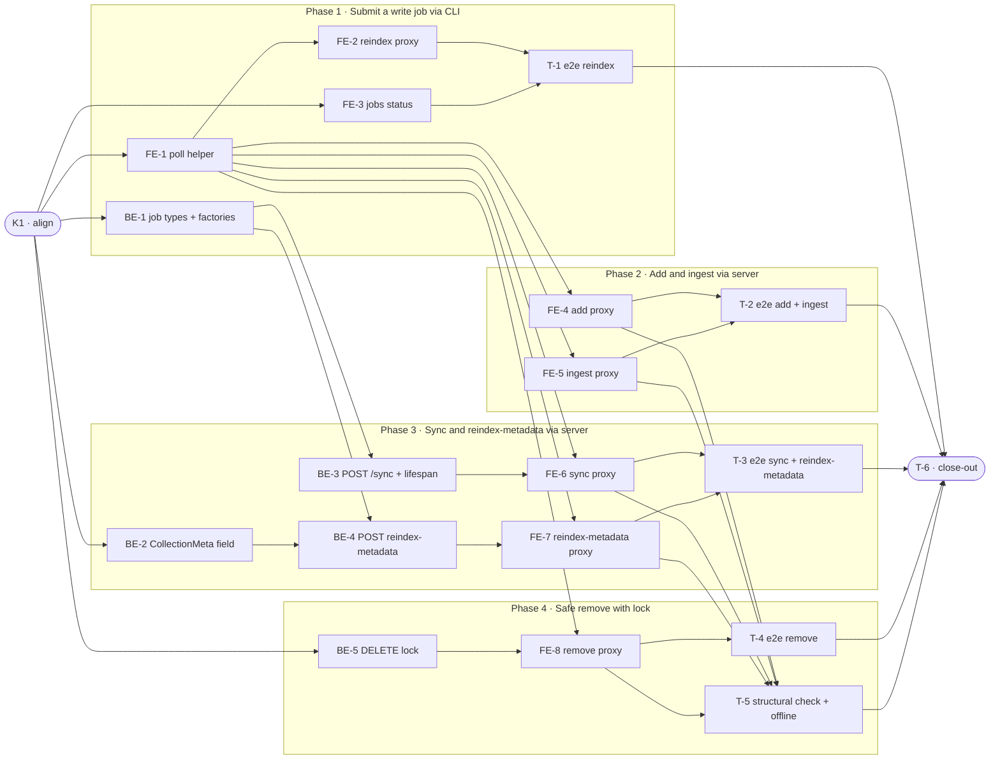

# CSP120 · CLI Write Operations Must Route Through the Server — Task Breakdown

**How to read this file**
- This is the **order view** for `2026-07-15-120-cli-server-proxy-team-plan.md` — every task is a single-role checkbox in execution order, opening with a dependency graph.
- **Phases are vertical slices**: each delivers a working end-to-end increment, not a horizontal layer. No separate "integrate" phase. Sliced with the **`vertical-slicer` skill**.
- Each task carries the **role tag at the end of its title line**, then sub-bullets: **layer · estimate** (decimal hours), **needs · completes**, and a **Tests** block. **needs** = predecessor tasks; **completes** = the scenario `S#` (from the plan) it makes true, or the contract `C#` (from the plan) it realises.
- **Tests** are tagged by level. **Unit and integration tests belong to the implementing dev** (test-first); **e2e and manual tests are the tester's tasks**. The close-out task writes no tests.
- IDs (`BE-#`/`FE-#`/`T-#`/`K#`) are this file's traceability thread; `S#`/`C#`/`Q#` are defined in the plan.
- **Rule:** edit your own tasks freely.

---

## References

- **Plan:** [2026-07-15-120-cli-server-proxy-team-plan.md](./2026-07-15-120-cli-server-proxy-team-plan.md) — the full team plan (contracts, scenarios, architecture, allocation). **Always read the plan before you start planning the next task** — it holds the context this file only cites (`S#`/`C#`/`Q#`).
- **Brief:** [2026-07-15-120-cli-server-proxy-brief.md](./2026-07-15-120-cli-server-proxy-brief.md) — the source feature brief behind the plan.

---

## Task Breakdown

Single-role tasks in execution order, grouped into **vertical slices**.

### Dependency graph

### Phase 0 · Kickoff

- [x] **K1** — Align team on contracts C1/C2/C3, confirm `JobKind` enum goes in `archon_search/types.py`, and confirm `SyncJob.collection = ""` decision #team
    - — · 1.0h
    - completes C1, C2, C3
    - Tests

### Phase 1 · Submit a write job via CLI *(walking skeleton: operator submits a reindex job; CLI → httpx → existing `POST /collections/{name}/reindex` → poll loop → DONE)*

- [x] **BE-1** — Add `JobKind(str, Enum)` + `SyncJob` + `MetadataReindexJob` dataclasses to `archon_search/types.py` (mirror `CommunityRebuildJob` at `types.py:100–101`); add `create_sync` / `create_metadata_reindex` factories to `archon_search/jobs/store.py` (mirror `create_community_rebuild` at `store.py:199–214`, status=`QUEUED`); extend both the `_write_atomic` discriminator ladder (`store.py:310–323`) and the `_load` discriminator ladder (`store.py:271–286`) with `"sync"` and `"metadata_reindex"` branches; convert `kind` string back to `JobKind` enum in `_load` (mirror `MigrationJob` at `store.py:281`) #backend-role
    - Entities + Frameworks & Drivers · 6.0h
    - needs K1 · completes S25, S26
    - Tests
        - #unit_test — `test_create_sync_job_starts_queued` — `job_store.create_sync()` returns `SyncJob` with `status=QUEUED` and `kind=JobKind.sync`
        - #unit_test — `test_create_metadata_reindex_job_starts_queued` — factory returns `MetadataReindexJob` with `status=QUEUED` and correct `collection`
        - #unit_test — `test_sync_job_kind_emitted_in_job_to_dict` — `job_to_dict(sync_job)["kind"] == JobKind.sync.value` (not None, not a bare string)
        - #unit_test — `test_sync_and_metadata_reindex_jobs_round_trip_through_store` — write via `_write_atomic`, read via `_load`; assert `type(loaded) is SyncJob` and `type(loaded) is MetadataReindexJob` respectively, never bare `IngestJob`; `loaded.kind` is a `JobKind` enum instance

- [x] **FE-1** — Extract shared `_poll_job(job_id, base_url, headers)` helper into `archon_search/cli/_helpers.py` (currently holds only `_get_service()`, lines 9–20); deduplicate `_poll_migration_job` (`collection.py:422–469`) and `_poll_rebuild_job` (`graph_cmd.py:87–131`); update both callers to use the shared helper #frontend-role
    - Presentation · 3.0h
    - needs K1 · completes S9, S12, S13, S18
    - Tests
        - #unit_test — `test_poll_job_exits_0_on_done` — poll terminates with exit 0 when status reaches DONE
        - #unit_test — `test_poll_job_exits_1_on_failed_and_cancelled` — exits 1 on FAILED; exits 1 on CANCELLED; exits 1 on FAILED_EXPIRED
        - #unit_test — `test_poll_job_prints_progress_each_interval` — prints progress fields each poll when present in the job response
        - #unit_test — `test_poll_job_keyboard_interrupt_exits_0` — `KeyboardInterrupt` during poll prints "Polling stopped — job continues on server", exits 0

- [x] **FE-2** — Convert `collection reindex` (`collection.py:472–564`) to httpx proxy: remove in-process body, add `--api-url`/`--api-key`/`--wait` options, POST to `POST /collections/{name}/reindex`, call `_poll_job` on `--wait`; follow `migrate_cmd` (`collection.py:305–420`) as the template; catch `httpx.ConnectError` before the broader `httpx.HTTPError` #frontend-role
    - Presentation · 2.0h
    - needs FE-1 · completes S4, S8, S10, S11, S21, S22
    - Tests
        - #unit_test — `test_reindex_submits_job_prints_id` — mocked 202 → job_id printed, exit 0
        - #unit_test — `test_reindex_wait_polls_to_done` — mocked poll sequence → completion marker, exit 0
        - #unit_test — `test_reindex_server_not_running` — `httpx.ConnectError` → "archon-search serve is not running. Start it first.", exit 1
        - #unit_test — `test_reindex_non202_prints_status_and_body` — 409/503 response → status + body on stderr, exit 1

- [x] **FE-3** — Create `archon_search/cli/jobs_cmd.py` with `jobs` Click group and `status <job_id>` subcommand (calls `GET /jobs/{job_id}` once via `routes_jobs.py:561–569`); register via `main.add_command(jobs)` in `main.py`; print `job_id`, `status`, `collection`, `created_at`, `progress` (if non-null), `error` (if FAILED/FAILED_EXPIRED); exit 0 for DONE and in-progress states (PENDING/QUEUED/RUNNING/CANCELLING); exit 1 for FAILED/FAILED_EXPIRED/CANCELLED/404 #frontend-role
    - Presentation · 3.0h
    - needs K1 · completes S24
    - Tests
        - [x] #unit_test — `test_jobs_status_done_exits_0` — DONE response → prints all status fields, exit 0
        - [x] #unit_test — `test_jobs_status_failed_exits_1` — FAILED → prints error field, exit 1; FAILED_EXPIRED → exit 1; CANCELLED → exit 1
        - [x] #unit_test — `test_jobs_status_in_progress_exits_0` — RUNNING/QUEUED/PENDING/CANCELLING → prints status, exit 0
        - [x] #unit_test — `test_jobs_status_404_exits_1` — 404 → "Job not found: {job_id}", exit 1

- [x] **T-1** — e2e: `collection reindex smoke --wait` against real `smoke_server`; verify CLI exits 0 and success markers in stdout; also run `jobs status <job_id>` on the completed job #tester-role
    - — · 2.0h
    - needs FE-2, FE-3 · completes S4
    - Tests
        - [x] #e2e_test — `test_e2e_collection_reindex_wait_against_server` — subprocess `collection reindex smoke --wait --api-url ... --api-key ...`, assert `returncode == 0`, "Job submitted:" in stdout, completion marker in stdout
        - [x] #e2e_test — `test_e2e_jobs_status_after_reindex` — parse job_id from prior stdout, run `jobs status <id>`, assert `returncode == 0`, status field in output

### Phase 2 · Add and ingest via server

- [x] **FE-4** — Convert `collection add` (`collection.py:73–140`) to httpx proxy: remove local `archon-search.toml` write, POST to `POST /collections/` (`AddCollectionRequest` body, `routes_collections.py:40–42`), print collection name from the 202 response `collection` field (not derived locally), add `--api-url`/`--api-key`/`--wait` #frontend-role
    - Presentation · 3.0h
    - needs FE-1 · completes S1, S2, S14
    - Tests
        - #unit_test — `test_add_submits_job_prints_id_and_server_collection_name` — mocked 202 with `collection` field → job_id + server-derived collection name printed, exit 0
        - #unit_test — `test_add_with_wait_polls_to_done` — mocked poll → completion, exit 0
        - #unit_test — `test_add_does_not_call_load_config` — verify `load_config` is never called after conversion
        - #unit_test — `test_add_409_collection_already_registered` — 409 → specific error message, exit 1

- [x] **FE-5** — Convert `ingest` (`ingest.py:25–115`) to httpx proxy: POST to `POST /ingest` (`routes_jobs.py:424–500`); derive collection name via `path_to_collection_name(path)` (from `archon_search/sync.py:29–45`) when `--collection` omitted; add `--api-url`/`--api-key`/`--wait` #frontend-role
    - Presentation · 2.0h
    - needs FE-1 · completes S6
    - Tests
        - #unit_test — `test_ingest_submits_job_with_explicit_collection` — `--collection` explicit → correct collection in request body, job_id printed, exit 0
        - #unit_test — `test_ingest_derives_collection_name_from_path_when_omitted` — omitting `--collection` calls `path_to_collection_name`; derived name sent in request body
        - #unit_test — `test_ingest_wait_polls_to_done` — mocked poll → completion, exit 0

- [x] **T-2** — e2e: `collection add <dir> --wait` and `ingest --path <file> --collection smoke --wait` against real `smoke_server`; seed with `tmp_path`; assert returncode=0, success markers, collection visible in `GET /collections/` #tester-role
    - — · 3.0h
    - needs FE-4, FE-5 · completes S1, S2, S6
    - Tests
        - [x] #e2e_test — `test_e2e_collection_add_wait_against_server` — create temp dir with a text doc, subprocess `collection add <dir> --wait`, assert `returncode == 0`, collection name (from stdout) appears in `GET /collections/`
        - [x] #e2e_test — `test_e2e_ingest_wait_against_server` — subprocess `ingest --path <file> --collection smoke --wait`, assert `returncode == 0`, completion marker in stdout

### Phase 3 · Sync and reindex-metadata via server *(two new server endpoints)*

- [x] **BE-2** — Add `metadata_reindex_job_id: str | None = None` to `CollectionMeta` (`collection_meta.py`, after `community_rebuild_job_id` at line 27); update all six `store.py` sites: `_meta_schema()` (nullable `pa.field`), `_row_to_meta()` (read with `or None`), `update_collection_meta()` (write with `or ""`), `_do_write_meta_unlocked()` (write with `or ""`), `update_description()` (copy from `existing`), and all `CollectionMeta(...)` constructor calls; no `STORE_SCHEMA_VERSION` bump (recreation-only, mirrors `community_rebuild_job_id` precedent) #backend-role
    - Entities + Frameworks & Drivers · 4.0h
    - needs K1 · completes S19 (prerequisite for 409 guard in BE-4)
    - Tests
        - [x] #unit_test — `test_collection_meta_metadata_reindex_job_id_defaults_none` — fresh `CollectionMeta()` has `metadata_reindex_job_id=None`
        - [x] #unit_test — `test_update_collection_meta_round_trips_metadata_reindex_job_id` — write with field set via `update_collection_meta`, read back via `_row_to_meta`, assert equality
        - [x] #integration_test — `test_metadata_reindex_job_id_persisted_across_store_connections` — write field via `update_collection_meta` on one `SearchStore` connection; open a fresh connection; reload via `get_collection_meta`; verify field survives (`tests/integration/conftest.py` helpers: `make_real_app`, `ingest_doc`)

- [x] **BE-3** — Create `archon_search/server/routes_sync.py` (mirror `routes_maintenance.py` file structure) with `POST /sync` handler + `_sync_task` coroutine; follow the `rebuild_communities` QUEUED→RUNNING pre-transition pattern (`routes_graph.py:193–237`); add `app.state.sync_lock = asyncio.Lock()` and `app.state.collection_sync = SearchCollectionSync(pipeline=..., state_store=..., pinned_collections=..., chunk_size=..., auto_reindex_on_chunk_size_change=...)` to `app.py` lifespan after `app.state.pipeline` (line ~644) and `app.state.state_store` (line ~612); register router in `app.include_router` block (lines ~687–701); use `except Exception` in `_sync_task` (not a narrow tuple — `sync()` can raise `OSError`/`KeyError`); release `sync_lock` in `_sync_task`'s `finally` block; update OpenAPI snapshot #backend-role
    - Use Cases + Interface Adapters · 7.0h
    - needs BE-1 · completes S7 (server side), S15, S23, C2
    - Tests
        - [x] #unit_test — `test_post_sync_returns_202_running` — stub app via `make_real_app` pattern; POST /sync → 202 + `JobResponse` with `status=RUNNING`
        - [x] #unit_test — `test_post_sync_409_on_concurrent_submit` — acquire `app.state.sync_lock` externally; POST /sync → 409
        - [x] #unit_test — `test_post_sync_requires_bearer_auth` — no token → 401
        - [x] #integration_test — `test_post_sync_dispatches_to_collection_sync_only` — spy on `app.state.collection_sync.sync`; POST /sync; drain background tasks; assert `sync` called once; assert `MaintenanceLoop` not instantiated by the handler (S15)
        - [x] #integration_test — `test_post_sync_task_failed_releases_lock_and_second_submit_succeeds` — mock `collection_sync.sync` to raise; drain background tasks; assert job=FAILED; assert second POST /sync returns 202 not 409 (S23)
        - [x] #integration_test — `test_post_sync_job_result_contains_all_sync_result_fields` — real sync over `tmp_path` collection; job DONE result contains `added`, `removed`, `unchanged`, `errors`, `skipped`, `updated`

- [x] **BE-4** — Add `POST /collections/{name}/reindex-metadata` to `routes_collections.py`; add `_reindex_metadata_task` coroutine; apply two-stage 404 guard: (1) `_all_collection_paths(config)` check, (2) `get_collection_meta()` returning valid meta (mirror `reindex_collection` at `routes_collections.py:661–666`); apply 409 guard via `meta.metadata_reindex_job_id` with lazy-stale-clear (mirror `community_rebuild_job_id` guard at `routes_graph.py:193–223`); forward `dry_run` / `normalize_timestamps` from request body to `SearchStore.reindex_metadata()`; use `except Exception` in `_reindex_metadata_task` (not a narrow tuple); job result carries all 5 `ReindexResult` fields (`store.py:35–42`); update OpenAPI snapshot #backend-role
    - Use Cases + Interface Adapters · 6.0h
    - needs BE-1, BE-2 · completes S5 (server side), S19, C3
    - Tests
        - #unit_test — `test_reindex_metadata_returns_202_running` — stub app; POST /collections/smoke/reindex-metadata → 202 + RUNNING `JobResponse`
        - #unit_test — `test_reindex_metadata_404_collection_not_in_config` — collection absent from `_all_collection_paths` → 404
        - #unit_test — `test_reindex_metadata_404_meta_row_absent` — collection in config but `get_collection_meta` returns None → 404
        - #unit_test — `test_reindex_metadata_409_duplicate_submission` — `meta.metadata_reindex_job_id` set to active job id → 409
        - #integration_test — `test_reindex_metadata_job_result_contains_all_fields` — real `SearchStore` via `make_real_app`; job DONE result has `processed`, `updated`, `skipped`, `ts_normalized`, `warnings` (S5 server side; S19 active guard end-to-end)

- [x] **FE-6** — Convert `sync` (`sync.py:15–47`) to httpx proxy: remove `SearchCollectionSync` construction and `sync_runner.sync()` call, POST to `POST /sync`, add `--api-url`/`--api-key`/`--wait` #frontend-role
    - Presentation · 2.0h
    - needs FE-1, BE-3 · completes S7 (CLI side)
    - Tests
        - #unit_test — `test_sync_submits_job_prints_id` — mocked 202 → job_id printed, exit 0
        - #unit_test — `test_sync_wait_polls_to_done` — mocked poll → completion, exit 0
        - #unit_test — `test_sync_server_not_running` — `httpx.ConnectError` → "archon-search serve is not running. Start it first.", exit 1

- [ ] **FE-7** — Convert `collection reindex-metadata` (`collection.py:238–302`) to httpx proxy: remove `pipeline.store.reindex_metadata()` call, POST to `POST /collections/{name}/reindex-metadata` with `{"dry_run": ..., "normalize_timestamps": ...}` body, forward existing `--dry-run`/`--normalize-timestamps` options, add `--api-url`/`--api-key`/`--wait` #frontend-role
    - Presentation · 2.0h
    - needs FE-1, BE-4 · completes S5 (CLI side)
    - Tests
        - #unit_test — `test_reindex_metadata_submits_job_prints_id` — mocked 202 → job_id printed, exit 0
        - #unit_test — `test_reindex_metadata_forwards_dry_run_flag_in_body` — `--dry-run` present → request body contains `"dry_run": true`
        - #unit_test — `test_reindex_metadata_wait_polls_to_done` — mocked poll → completion, exit 0

- [ ] **T-3** — e2e: `sync --wait` against `smoke_server` verifying all 6 `SyncResult` fields in job result (S7); `collection reindex-metadata smoke --wait` verifying all 5 `ReindexResult` fields in job result (S5) #tester-role
    - — · 3.0h
    - needs FE-6, FE-7 · completes S5, S7
    - Tests
        - #e2e_test — `test_e2e_sync_wait_all_result_fields_against_server` — subprocess `sync --wait`, assert `returncode == 0`; parse job_id from stdout; `GET /jobs/{id}` directly; assert result contains `added`, `removed`, `unchanged`, `errors`, `skipped`, `updated`
        - #e2e_test — `test_e2e_collection_reindex_metadata_wait_against_server` — subprocess `collection reindex-metadata smoke --wait`, assert `returncode == 0`; parse job_id; `GET /jobs/{id}`; assert result contains `processed`, `updated`, `skipped`, `ts_normalized`, `warnings`

### Phase 4 · Safe remove with lock

- [ ] **BE-5** — Add `acquire_collection_lock_or_503` call to `DELETE /collections/{name}` handler (`routes_collections.py:277–337`) before `drop_collection()` and `delete_collection_meta()`; follow the existing pattern at `routes_collections.py:228`; release the lock after drop completes #backend-role
    - Interface Adapters · 2.0h
    - needs K1 · completes S11 (server side — 503 from DELETE)
    - Tests
        - #unit_test — `test_delete_collection_503_when_lock_held` — mock lock timeout → 503 response
        - #unit_test — `test_delete_acquires_lock_before_drop` — spy on `acquire_collection_lock_or_503`; assert called before `drop_collection`
        - #integration_test — `test_delete_collection_succeeds_with_real_lock` — real `SearchStore` via `make_real_app`; DELETE → 200; collection absent in `GET /collections/`

- [ ] **FE-8** — Convert `collection remove` (`collection.py:143–205`) to httpx proxy: `DELETE /collections/{name}`, drop `--force` option, add `--api-url`/`--api-key`; handle 409 → "Cannot remove '{name}': collection is pinned-only. Un-pin it first." exit 1; handle 503 → "Cannot remove '{name}': the server has a write in progress on this collection. Retry after the active job completes." exit 1 #frontend-role
    - Presentation · 2.0h
    - needs FE-1, BE-5 · completes S3, S20
    - Tests
        - #unit_test — `test_remove_sends_delete_exits_0` — mocked 200 → exit 0
        - #unit_test — `test_remove_409_pinned_only_prints_correct_message` — 409 → pinned-only message, exit 1
        - #unit_test — `test_remove_503_lock_contention_prints_correct_message` — 503 → lock-contention message, exit 1
        - #unit_test — `test_remove_force_option_no_longer_exists` — `--force` absent from command options after conversion

- [ ] **T-4** — e2e: `collection remove <name>` against real `smoke_server`; verify synchronous 200 (no `--wait`), collection absent in `GET /collections/` afterwards #tester-role
    - — · 2.0h
    - needs FE-8 · completes S3
    - Tests
        - #e2e_test — `test_e2e_collection_remove_against_server` — add temp collection via `POST /collections/` REST call; subprocess `collection remove <name>`, assert `returncode == 0`; `GET /collections/` shows collection absent

- [ ] **T-5** — Structural single-writer check: open `collection.py`, `ingest.py`, `sync.py` and assert `SearchPipeline` and `SearchStore` are not imported in any CLI write-command module post-conversion (S16); manual offline check: stop the server, run `collection list` and `collection info`, verify both succeed (S17) #tester-role
    - — · 2.0h
    - needs FE-4, FE-5, FE-6, FE-7, FE-8 · completes S16, S17
    - Tests
        - #e2e_test — `test_cli_write_commands_contain_no_direct_store_imports` — read `archon_search/cli/collection.py`, `ingest.py`, `sync.py`; assert `"from archon_search.pipeline import SearchPipeline"` and `"from archon_search.store import SearchStore"` absent from each file; assert no `asyncio.run(` calls remaining in the write-command bodies
        - #manual_test — Offline list and info — stop the server, run `archon-search collection list` and `archon-search collection info <name>`, verify both succeed and produce output (non-automatable: requires stopping the shared session-scoped `smoke_server` subprocess, which would break other smoke tests running in the same session)

### Phase 5 · Close-out

- [ ] **T-6** — Project close-out & acceptance fact-check #tester-role
    - — · 4.0h
    - needs T-1, T-2, T-3, T-4, T-5 · completes (acceptance gate)
    - Tests
    - Duties
        - Update all documentation per `2026-07-15-120-cli-server-proxy-team-plan.md`'s "Documentation update" section: `2026-07-15-120-cli-server-proxy-brief.md` (Q-B resolution), `110_component_catalog_and_layer_breakdown.md` (stale `graph_cmd.py` description + all converted CLI commands), `04_ingestion_and_collections.md` (server-required UX, `--wait`/`--api-url`/`--api-key`, error messages), `600_api_reference_or_public_interface.md` (`POST /sync` + `POST /collections/{name}/reindex-metadata`), `120_services_and_integration_architecture.md` (generalise CLI-proxy section), `03_running_the_server.md` (write commands require server), `BREAKING.md` (server-required behaviour change + collection-name derivation change), `CLAUDE.md` (CLI section: all write commands are HTTP proxies; two new endpoints).
        - Fix all build/compiler warnings, if any.
        - Run the full test suite (`uv run pytest`) and fix every failing test, including any unrelated to this feature.
        - Validate every Acceptance criterion from the plan one-by-one with a fact check — no assumptions; confirm each is genuinely done.

**Critical path: K1 → BE-1 → BE-3 → FE-6 → T-3 → T-5 → T-6.** BE-2 and BE-5 are independent of BE-1 and can start from K1 in parallel; frontend Phases 1 and 2 (FE-1 → FE-2/FE-4/FE-5) run in parallel with Phase 3 backend work.
