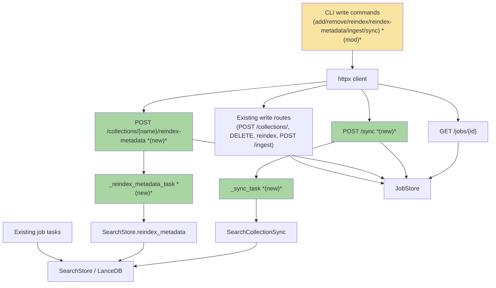
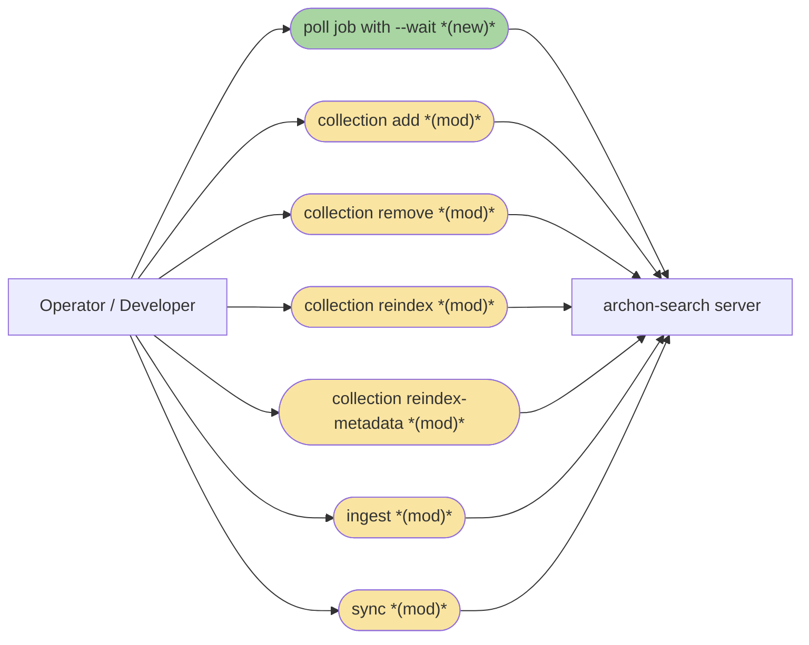
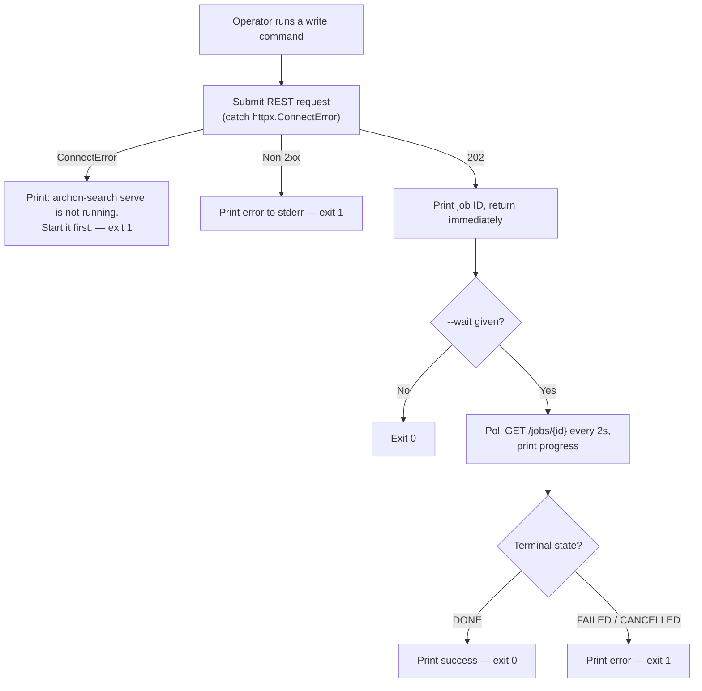
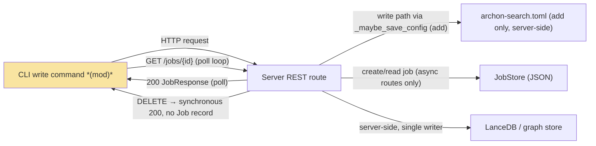
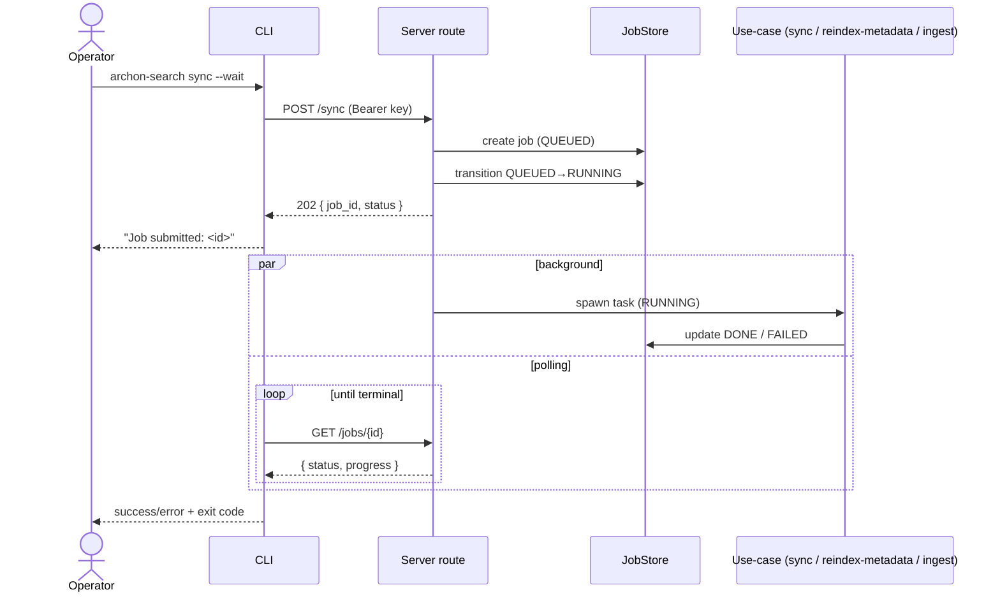

# CSP120 · CLI Write Operations Must Route Through the Server — Team Plan

**How to read this file**
- **Architecture approach:** Clean Architecture (default fallback — no override skill requested). **Layers:** Presentation · Use Cases · Interface Adapters · Entities · Frameworks & Drivers. This is a **client+server** feature: the CLI process is the client (Presentation), the FastAPI server is the backend; the client↔server REST surface is a contract.
- **Role mapping:** the CLI command layer (`archon_search/cli/`) is **Frontend**; the server routes, async-job use-cases, and stores are **Backend**. Tester is cross-cutting.
- The **Frontend, Backend, and Tester** sections are the **depth view** — each role's scope, grouped by layer.
- **Contracts** are logical: authored as TypeSpec `.tsp` (TypeSpec 1.13 detected) with an emitted `openapi.yaml` for the HTTP seam.
- **Role tags** (`#frontend-role`, `#backend-role`, `#tester-role`) mark each role-owned section.
- IDs (`S#`, `C#`, `Q#`) are the traceability thread.
- **Tasks** are not in this file — task breakdown is a separate downstream step that consumes this plan.
- **Rule:** change a contract only by team agreement.

---

## Background
Today, `collection add/remove/reindex/reindex-metadata`, `ingest`, and `sync` run the work **in-process** in the CLI, bypassing the running server: the terminal freezes for minutes, the operation appears in no `/jobs` or `/status` list, and the CLI and server can write the same LanceDB files concurrently with no coordination — silently corrupting the index. Two commands already prove the correct model: `collection migrate` (D3) and `graph build-communities` (GBC110) are HTTP proxies that submit an async job and poll `GET /jobs/{id}` with `--wait`.

---

## Goal
Every write operation from the CLI reaches the server via REST — the same way `migrate` works today. The terminal returns immediately with a job ID; progress is visible in `/jobs` and `/status`; the server's per-collection lock prevents concurrent writes between CLI-proxied jobs (ingest, reindex, community-rebuild) which all go through `SearchStore.lock_for` (note: the sync operation uses a separate `SearchCollectionSync._collection_locks` registry and serialises concurrent sync submissions via `app.state.sync_lock`; within a single sync run, per-batch interleaving with a concurrent ingest job is possible — the accepted v1 gap documented in Known Limitations); the ML model loads once (in the server), not twice. When the server is not running, write commands print a clear message and exit 1 — never an in-process fallback.

---

## Scope

### In Scope
- Convert to HTTP proxies (mirroring `migrate_cmd` / `graph_cmd`): `collection add`, `collection remove`, `collection reindex` (`POST /collections/{name}/reindex` already exists at `routes_collections.py:652` — pure mechanical proxy, no new server work required), `collection reindex-metadata`, `ingest`, `sync`.
- Build **two new server endpoints** the CLI needs: `POST /sync` (202 + job) and `POST /collections/{name}/reindex-metadata` (202 + job).
- All converted commands gain `--api-url`, `--api-key`, and (except `remove`) `--wait`, matching `migrate`'s signature.
- `collection add` no longer writes to `archon-search.toml` locally — `POST /collections/` already writes it server-side (`routes_collections.py:186–187`); the CLI's pre-write is removed to avoid duplicate entries.
- `archon-search jobs status <job_id>` (new `jobs` Click group + `status` subcommand) — a new CLI command required because the success message after every converted write command prints `Track progress with: archon-search jobs status <job_id>`; the command does not yet exist in any CLI file.
- Server-not-running detection: human-readable error + exit 1, no leaked errno, no fallback.

### Out of Scope
- In-process fallback / dual-path mode — deliberately excluded (keeps the race and invisible-job problems alive).
- Lock-file coordination (`.cli-ingest.lock`) — rejected in favour of this fix.
- Read-only `list` / `info` — stay **direct** by default (they don't write, don't race, must work offline); they gain `--api-url`/`--api-key` for parity only.
- Auto-starting the server when it is not running — a separate UX feature.
- `graph build-communities` — **already done** (GBC110); it is this plan's reference implementation, not work.

---

## Acceptance criteria
- Running any converted write command with the server up submits a job and prints `Job submitted: <job_id>. Track progress with: archon-search jobs status <job_id>` (or the command-specific equivalent), exiting 0 immediately. (see Frontend scope for verification status of `archon-search jobs status`).
- `--wait` polls `GET /jobs/{id}` until a terminal state, prints periodic progress, and exits 0 on `DONE` / non-zero on `FAILED`/`CANCELLED`.
- With the server down, a converted write command prints `archon-search serve is not running. Start it first.` (human-readable, no errno) and exits 1.
- `collection remove` performs a synchronous `DELETE /collections/{name}` (200), needs no `--wait`, and no longer needs `--force` (once the DELETE handler acquires the per-collection lock — Backend prerequisite).
- `POST /sync` triggers only `SearchCollectionSync.sync()` over the configured collections — not a full maintenance pass.
- `POST /collections/{name}/reindex-metadata` runs `SearchStore.reindex_metadata()` as a trackable job.
- Auth resolves `--api-key` > `ARCHON_SEARCH_API_KEY` > local key file.
- `list` / `info` still succeed with the server stopped.

---

## What does NOT change
- `graph build-communities` (GBC110) and `collection migrate` (D3) — already proxies; the templates for this work.
- Read-only `list` / `info` default to the direct LanceDB path and work offline.
- The async-job lifecycle, `JobStore` persistence, `JobStatus` enum, and core `job_to_dict()` response shape — `job_to_dict()` (`jobs/model.py:39,55`) already surfaces `kind` for any job via `getattr(job, 'kind', None)` and emits `k.value`; no change to `job_to_dict()` is needed (Backend Done-When item; the only task is adding a `kind` Enum attribute to new job dataclasses; do NOT add a separate `job_type` field — that name is the on-disk persistence discriminator).
- The LanceDB chunk/meta schema and `STORE_SCHEMA_VERSION` — no migration.
- `collection add`'s local `archon-search.toml` write is **removed** — the server's `POST /collections/` handler already calls `_maybe_save_config()` at `routes_collections.py:186–187`, making the CLI write redundant and causing duplicate entries.

---

## Known limitations / accepted trade-offs
- `collection add` registers the path in config even if the ingest job later fails — a stale "registered but not yet populated" entry is the accepted worst case **when the 202 response has already been sent** (the async ingest task failed in the background after the job was created and the 202 returned). In that post-202 async-failure case the user CANNOT recover by re-running `collection add`: the server will reject the second attempt with 409 ("collection already registered") because `_maybe_save_config()` already wrote the path during the first `POST /collections/` call. Recovery is via `collection reindex <name>` (re-runs the ingest on the already-registered collection) or waiting for the maintenance loop / triggering `POST /maintenance/trigger`. The "next startup sync reconciles it" means the maintenance loop will detect the populated-but-unindexed collection and re-ingest it — it does NOT mean the config entry is removed. For **synchronous failures** (stub-meta write failure → 500, ingest-lock timeout → 503, TOCTOU 409), `add_collection` rolls back both the config entry and the stub meta before returning the error response (`routes_collections.py:206–225`, `231–239`), so no stale entry persists and the user CAN re-run `collection add` cleanly after a synchronous error.
- `--wait` progress is line-by-line polling (2 s interval), not a live progress bar (a future iteration).
- `remove` is synchronous, so it has no job record in `/jobs` (it completes before returning) — consistent with `DELETE`'s existing 200 contract.
- `remove` drops `--force` only after the DELETE handler acquires the per-collection lock (see Backend "Done when"). Until that work lands, `--force` must remain to avoid a regression. **Implementation gate:** Frontend must NOT remove `--force` from `collection remove` until the Backend's `acquire_collection_lock_or_503` change to `DELETE /collections/{name}` has been merged and deployed. Merging `--force` removal before the lock lands reintroduces the concurrent-delete-vs-ingest race this feature fixes.
- **`POST /sync` is not namespace-scoped in v1**: the sync operation runs against all of the server's configured collections regardless of the caller's namespace. Per-collection namespace attribution would require a `CollectionMeta` lookup per configured path — deferred to a future iteration.
- **Sync-vs-ingest concurrency race (v1 accepted gap)**: `POST /sync` uses `SearchCollectionSync`'s own `_collection_locks` registry (`sync.py:102`, `_get_lock` at `sync.py:776–780`) — a **different lock** from `SearchStore.lock_for` used by ingest jobs (`store.py:1605`). The DROP step and INGEST steps in `sync()` are not fully serialised against a concurrent `POST /ingest` on the same collection — batch-level interleaving is possible. This is the same two-registry gap described in Q2. Accepted for v1; full serialisation requires unifying the two lock registries in a future iteration.
- **`SyncJob` poll-visibility is namespace-scoped**: `GET /jobs/{id}` enforces namespace isolation (`routes_jobs.py:567` — returns 404 if `job.namespace != request.state.namespace`). Since `POST /sync` syncs ALL configured collections regardless of namespace, operators in other namespaces whose collections were synced cannot poll the job ID — they receive 404. This is an accepted asymmetry in v1 (documented alongside the namespace-blind sync limitation above).
- **`sync --wait` exits 0 on DONE even if `SyncResult.errors` is non-empty**: a sync run that encounters per-collection errors still transitions to DONE (the sync operation completed); error details are in `result.errors` (list of per-collection error strings, visible via `archon-search jobs status <job_id>`). The `--wait` poll loop does not inspect `result.errors` — operators who want to fail-fast on any sync error must check `jobs status` post-completion or use the REST API directly.

---

## Approach & architecture

Convert six CLI commands from direct `SearchPipeline`/`SearchStore` calls into `httpx` proxies that reuse the existing `migrate_cmd`/`graph_cmd` scaffolding (`_resolve_api_key`, `_DEFAULT_API_URL`, `_POLL_INTERVAL_SECONDS`, `_TERMINAL_STATUSES`, the poll loop). Two server endpoints do not yet exist and must be built first, each following the established async-job route pattern.

### Architecture

_Scope limited to change neighbourhood: the six converted commands plus the two new routes/tasks and their one-hop use-case/store neighbours; unchanged existing routes and tasks are collapsed into single nodes._

| Component | Change | Why |
|-----------|--------|-----|
| CLI write commands (add/remove/reindex/reindex-metadata/ingest/sync) | modified | In-process work replaced by `httpx` proxy + poll, mirroring `migrate_cmd` |
| `POST /sync` route | new | No sync-trigger endpoint exists; `POST /maintenance/trigger` is unrelated |
| `POST /collections/{name}/reindex-metadata` route | new | No metadata-reindex endpoint exists |
| `_sync_task` | new | Async wrapper running `SearchCollectionSync.sync()` |
| `_reindex_metadata_task` | new | Async wrapper running `SearchStore.reindex_metadata()` |

**Layer map (and role mapping)**

| Layer | Role | Components |
|-------|------|-----------|
| Presentation | **Frontend** | CLI commands in `archon_search/cli/collection.py`, `ingest.py`, `sync.py`; shared helpers `_resolve_api_key` / poll loop |
| Interface Adapters | Backend | `routes_collections.py`, `routes_jobs.py`, new `POST /sync` + `POST /collections/{name}/reindex-metadata` handlers, auth middleware |
| Use Cases | Backend | `SearchCollectionSync.sync()`, `SearchStore.reindex_metadata()`, async job tasks (`_sync_task`, `_reindex_metadata_task`), `JobStore` lifecycle |
| Entities | Backend | `IngestJob`/`ReindexJob`/`CommunityRebuildJob` (+ any new job type), `JobStatus`, `CollectionMeta`, `SyncResult`, `SearchConfig` |
| Frameworks & Drivers | Backend | `JobStore` (JSON), `SearchStore`/LanceDB, `archon-search.toml`, `httpx`, Click |

**What changes**
- Six CLI commands lose their in-process `_run`/`asyncio.run` bodies and gain the proxy scaffold.
- Two new async-job routes + tasks are added server-side.
- `remove` drops `--force` once the DELETE handler acquires the per-collection lock (Backend prerequisite); it stays a synchronous 200.
- Shared proxy constants/helpers are reused (and ideally centralised) rather than re-defined per command.

**Implementation note — RESOLVED:** `POST /collections/` (`routes_collections.py:186–187`) **already calls `_maybe_save_config()` and writes to `archon-search.toml`** server-side. The CLI's planned pre-write would create a duplicate entry on every `collection add`. Resolution: **the CLI's local TOML write for `add` is removed**; the server's write (which already happens on every successful `POST /collections/`) is the single writer for config. The `archon-search.toml` entry for the new collection is created by the server handler, not the CLI. This changes the "What does NOT change" item — update: `collection add`'s local `archon-search.toml` write is REMOVED (the server's existing route already handles it). The accepted trade-off from Known Limitations (stale entry on ingest failure) still applies — the server's `_maybe_save_config()` runs before the ingest job completes.

**Key decisions (from the brief)**
- Require the server for all write operations — no dual path.
- `migrate_cmd` in `collection.py:305–419` is the exact template every converted command follows.
- Config write is server-side: `POST /collections/` already calls `_maybe_save_config()` (`routes_collections.py:186–187`); the CLI's pre-write is removed. (This supersedes the brief's Q-B decision — the brief's assumption that the CLI must write before submission was falsified by source inspection: the server already writes it.)
- Missing-server error is human-readable, not a raw `Connection refused`.

### Actors & Use Cases

### Flows

#### User Flow

#### Data Flow

_Removed edges: the CLI no longer writes LanceDB directly, and no longer writes `archon-search.toml` locally — all writes now flow through the server as the single writer._

#### Sequence

### Prior decisions

| Decision | Rationale | Constraint |
|----------|-----------|-----------|
| MCP HTTP mount & namespace propagation (ADR-09) | Established the FastAPI middleware chain and namespace threading via `request.state.namespace` | New endpoints (`POST /sync`, `POST /collections/{name}/reindex-metadata`) inherit `APIKeyMiddleware` auth and must resolve namespace from `request.state.namespace` |
| Durable state writes via fsync (ADR-06) | Persistent job/progress state must survive unclean shutdown | New job tasks must persist status/progress through `JobStore` (atomic writes via `_durable_io`); no ad-hoc file writes for job state |
| Per-collection embedder LRU cache (ADR-08) | Expensive model loads must not block the event loop or duplicate | The sync / reindex-metadata tasks must use the shared `EmbedderCache` and dispatch blocking work off the event loop; the model loads once, in the server |

### Contradictions

| Contradiction | Category | Owner |
|---|---|---|
| `Architecture/110` still describes `graph_cmd.py` as loading `GraphStore`/`SearchStore`/`CommunityBuilder` in-process, but GBC110 already made it a pure HTTP proxy (tests pass, commit shipped). | code vs. docs (doc is stale) | **doc needs updating** → Documentation update, *contradiction with code* |
| The brief lists `graph build-communities` as in-scope work to convert, but the code already proxies it (GBC110). | brief vs. reality | **open question** — resolved in this revision: treated as the reference implementation, not work (see Resolved). |
| `Architecture/110` line ~143 says `ingest.py` "submits an ingest job" (implies REST/async), but the code is currently in-process; this feature makes the doc's wording true. | code vs. docs (transitional) | **doc needs updating** → Documentation update, *new feature* (corrected when this ships) |

---

## Contracts / seams

Boundaries where the CLI (client) and server must agree. **Logical, not code.** TypeSpec 1.13 was detected, so the HTTP seam is authored as a TypeSpec HTTP service with an emitted OpenAPI document. Changing any of these requires team agreement.

**C1 — CLI ↔ server write & poll REST surface**  *(Presentation ↔ Interface Adapters, HTTP/API seam)*
The CLI POSTs each write operation and reads a job envelope back; `remove` is the one synchronous exception (`DELETE` → 200 `DeleteResponse`, no job). Every async route returns `202` + `JobResponse { job_id, status, collection, created_at, updated_at, progress?, result?, error? }`; `--wait` reads the same envelope from `GET /jobs/{id}` until `status` is terminal (`DONE`/`FAILED`/`FAILED_EXPIRED`/`CANCELLED`). Auth is a `Bearer` token on every request, resolved `--api-key` > env > key file. — see [cli-proxy.tsp](./api-contracts/cli-proxy.tsp) and [cli-proxy.openapi.yaml](./api-contracts/cli-proxy.openapi.yaml). Note: `cli-proxy.tsp` / `cli-proxy.openapi.yaml` model only the **CLI-consumed subset** of the actual `job_to_dict()` wire shape. The real server response contains 14 fields (including `namespace`, `source`, `source_path`, `retry_count`, `kind`, `output_path`, `archive_path`, `migrations_applied`, `backup_confirmed`). The contract artifact documents what the CLI reads; the authoritative full shape is `GET /openapi.json` on the live server. DELETE `/collections/{name}` error cases:
- 409 if the collection is pinned-only (see `routes_collections.py:304–311`); `remove` must handle 409 and print: `Cannot remove '{name}': collection is pinned-only. Un-pin it first.` — exit 1
- 503 if the collection lock is held by an in-flight write (see `acquire_collection_lock_or_503` pattern); `remove` must handle 503 and print: `Cannot remove '{name}': the server has a write in progress on this collection. Retry after the active job completes.` — exit 1

**C2 — `POST /sync` (new)**  *(Interface Adapters ↔ Use Cases, HTTP/API seam)*
No request body: the server syncs its own configured collections (`pinned_collections + collections`) via `SearchCollectionSync.sync()`, returning `202` + job. This is **semantically distinct** from `POST /maintenance/trigger` (which runs a full maintenance pass). Modelled in the C1 artefacts above. Note: `JobResponse.collection` is a required field but `POST /sync` spans all configured collections. The `SyncJob`'s `collection` field will be set to `""` (empty string) — consumers of `GET /jobs/{id}` must treat an empty `collection` as "whole-server sync." **Decision: `SyncJob.collection = ""`** (empty string, matching the existing `IngestJob.collection = ""` default in `types.py:36`). This is the authoritative value — do not use `"*"`.
- `SyncJob.result` on DONE: `{added: list[str], removed: list[str], unchanged: list[str], errors: list[str], skipped: list[str], updated: list[str]}` — all 6 fields from `SyncResult` at `sync.py:55–62`; `added` lists collection names added to the index; `removed` lists collections removed; `unchanged` lists collections with no changes detected; `errors` lists any per-collection error messages encountered during sync; `skipped` records collections skipped due to pinning/exclusion; `updated` records collections re-ingested due to detected changes.

**C3 — `POST /collections/{name}/reindex-metadata` (new)**  *(Interface Adapters ↔ Use Cases, HTTP/API seam)*
Body forwards the CLI flags (`dry_run`, `normalize_timestamps`); the server runs `SearchStore.reindex_metadata()` as a job, returning `202` + job whose `result` carries `{processed: int, updated: int, skipped: int, ts_normalized: int, warnings: list[str]}` — all 5 fields from `ReindexResult` at `store.py:35–42`. Modelled in the C1 artefacts above.
- 404 if the collection does not exist (two-check guard: config path list + meta record)
- 409 if a metadata-reindex is already in progress on this collection

---

## Data

_No relational database. Persistence is LanceDB (vector + FTS) plus a JSON `JobStore`; this feature adds **no** schema change and **no** migration — `STORE_SCHEMA_VERSION` is untouched. One persisted-state field is added: `CollectionMeta.metadata_reindex_job_id` (the reindex-metadata duplicate-submission guard, resolved Q2), mirroring the existing `reindex_job_id` / `community_rebuild_job_id` pattern; it is nullable and requires no migration. Two new in-memory/serialised job types (`SyncJob`, `MetadataReindexJob`, resolved Q1) join the existing `JobStore` discriminator set._

---

## Scenarios #tester-role

Behavioural only. Covers happy, unhappy, edge, and non-functional paths.

| id | Scenario (Given / When / Then) |
|----|--------------------------------|
| **S1** | **Given** the server is running · **When** `collection add <path>` runs without `--wait` · **Then** a job is submitted (the server's `POST /collections/` handler writes the path to `archon-search.toml` server-side), the job ID is printed, exit 0. |
| **S2** | **Given** the server is running · **When** `collection add <path> --wait` runs · **Then** the CLI polls to `DONE` and prints completion, exit 0. |
| **S3** | **Given** the server is running · **When** `collection remove <name>` runs · **Then** `DELETE` returns 200 synchronously, no job/`--wait`, exit 0. (unhappy paths: S20 pinned-only 409, S11 503 lock-contention after up to `INGEST_LOCK_TIMEOUT_S`-second wait) |
| **S4** | **Given** the server is running · **When** `collection reindex <name> --wait` runs · **Then** a reindex job is submitted and polled to a terminal state. |
| **S5** | **Given** the server is running · **When** `collection reindex-metadata <name> --wait` runs (forwarding `--dry-run`/`--normalize-timestamps`) · **Then** the new endpoint enqueues a job and the CLI polls to `DONE`. |
| **S6** | **Given** the server is running · **When** `ingest --path <path> --collection <name> --wait` runs · **Then** an ingest job is submitted and polled to a terminal state. |
| **S7** | **Given** a namespace-scoped operator calls `POST /sync` · **When** the job runs · **Then** it syncs ALL server-configured collections (namespace-scoped filtering is a known limitation in v1 — sync is namespace-blind by design); the job result on DONE contains all 6 `SyncResult` fields (C2): `added`, `removed`, `unchanged`, `errors`, `skipped`, `updated` (see C2 for the full schema at `sync.py:55–62`) | smoke (happy-path only; cross-namespace isolation is a known gap) |
| **S8** | **Given** the server is NOT running · **When** any converted write command runs · **Then** it prints `archon-search serve is not running. Start it first.`, exits 1, and does not leak the errno or attempt in-process work. |
| **S9** | **Given** `--api-key`, `ARCHON_SEARCH_API_KEY`, and a key file all present · **When** a command runs · **Then** the `--api-key` value wins; with it absent the env var wins; with both absent the key file is used. |
| **S10** | **Given** an invalid/expired key · **When** a command runs · **Then** the server's 401 detail is surfaced cleanly and the CLI exits 1. |
| **S11** | **Given** any converted write command · **When** the server returns **503** (lock contention — write in flight on that collection) · **Then** the CLI prints `'{name}': server has a write in progress. Retry after the active job completes.` — exit 1; note: 503 from write endpoints is a routine, retryable response (see `acquire_collection_lock_or_503` pattern), not an unexpected error; note: the 503 is returned after up to `INGEST_LOCK_TIMEOUT_S`-second wait (30.0 s), not immediately — the CLI call may appear to hang briefly during lock contention | unit |
| **S21** | **Given** any converted write command · **When** the server returns an unexpected status (404, 422, 5xx other than 503, or unknown) · **Then** the CLI prints the status code and body to stderr — exit 1 | unit |
| **S22** | **Given** `archon-search --api-url http://host:9000 collection reindex <name>` · **When** the command runs · **Then** the httpx client sends the request to `http://host:9000`, not the default URL; `--api-url` is threaded through to every converted command via shared `_resolve_api_url()` | unit |
| **S23** | **Given** `POST /sync` is called and `SearchCollectionSync.sync()` raises an uncaught exception · **When** the exception propagates · **Then** the job transitions to FAILED (`GET /jobs/{id}` for the first job returns `status == FAILED` with the exception captured in the `error` field) and `app.state.sync_lock` is released (verified by submitting a second `POST /sync` immediately after — it returns 202, not 409) | integration (integration; implementation note: mock `SearchCollectionSync.sync` to raise immediately; drain background tasks before asserting FAILED status and 202 on re-submit — background-task drain is essential or the assertions race the still-running coroutine) |
| **S12** | **Given** `--wait` and a job that ends `FAILED`/`CANCELLED`/`FAILED_EXPIRED` · **When** polling reaches that state · **Then** the CLI prints the error and exits non-zero (never hangs). |
| **S13** | **Given** `--wait` polling in progress · **When** the operator presses Ctrl-C · **Then** the CLI prints `Polling stopped — job continues on server` and exits 0. |
| **S14** | **Given** `collection add` · **When** the ingest submission fails · **Then** `routes_collections.py:186–187` already wrote the path to `archon-search.toml` during the `POST /collections/` call (before the async ingest task runs), leaving a reconcilable stale entry. |
| **S15** | **Given** `POST /sync` · **When** invoked · **Then** it runs only `SearchCollectionSync.sync()` — not FTS optimize / orphan cleanup / graph GC — distinct from `POST /maintenance/trigger`. |
| **S16** | **Given** a running server · **When** a large write is proxied · **Then** the server is the single writer (no CLI↔server LanceDB race). Note: "model loaded once" is not directly observable at any test level (`embedder.py` emits no model-load log); proof relies on the structural guarantee that the CLI makes only HTTP calls and contains no model-loading code after conversion. The single-writer invariant is verified by the per-collection lock (Backend prerequisite, see FIX-1/FIX-2). |
| **S17** | **Given** the server is stopped · **When** `collection list` / `collection info` run · **Then** they succeed via the direct path (offline still works). |
| **S18** | **Given** a long-running job with `--wait` · **When** polling · **Then** a progress line is printed periodically (≈2 s cadence), not silent until completion. |
| **S19** | **Given** a reindex-metadata job already in progress on a collection · **When** a duplicate is submitted · **Then** the server rejects it with 409 (via `metadata_reindex_job_id`); for `sync`, `app.state.sync_lock` returns 409 on concurrent submission — per-collection serialisation against concurrent ingest/reindex is handled internally by `ingest_chunks`'s `lock_for` acquire (not by `_sync_task`). |
| **S20** | **Given** `collection remove <name>` · **When** the collection is pinned-only · **Then** the server returns 409 and the CLI prints `Cannot remove '{name}': collection is pinned-only. Un-pin it first.` exit 1 | unit |
| **S24** | **Given** the server is running · **When** `archon-search jobs status <job_id>` is run for a job in state DONE, FAILED/FAILED_EXPIRED/CANCELLED, QUEUED/RUNNING/PENDING, or CANCELLING, or for an unknown job ID · **Then** the command prints job_id, status, collection, created_at, and (if present) progress/error; exits 0 for DONE and all in-progress states (QUEUED/RUNNING/PENDING/CANCELLING); exits 1 for FAILED/FAILED_EXPIRED/CANCELLED; prints "Job not found: {job_id}" and exits 1 on 404 | unit |
| **S25** | **Given** a `SyncJob` or `MetadataReindexJob` is created and the job reaches any state · **When** `GET /jobs/{id}` is called · **Then** the response includes `kind: "sync"` or `kind: "metadata_reindex"` respectively (not null, not absent) — verifying that `job_to_dict()` emits the `kind` attribute via `getattr(job, 'kind', None)` | unit |
| **S26** | **Given** a `SyncJob` or `MetadataReindexJob` is persisted by `JobStore` · **When** the server is restarted (simulated by loading the JSON from disk via `_load`) · **Then** the reloaded job is `type(job) is SyncJob` (resp. `MetadataReindexJob`) — not a bare `IngestJob` fallback — and `job.kind` is a `JobKind` enum instance (not a plain string), verifying that both the `_write_atomic` discriminator and the `_load` re-hydration branches are present | unit |

---

## Frontend — Presentation #frontend-role

**Scope:** Convert `collection add`, `collection remove`, `collection reindex`, `collection reindex-metadata` (`archon_search/cli/collection.py`), `ingest` (`archon_search/cli/ingest.py`), and `sync` (`archon_search/cli/sync.py`) from in-process execution into `httpx` proxies that mirror `migrate_cmd` / `graph_cmd`. Reuse (and ideally centralise) the shared scaffold `_resolve_api_key`, `_DEFAULT_API_URL`, `_POLL_INTERVAL_SECONDS`, `_TERMINAL_STATUSES`, and the poll loop. Writes both unit and integration tests for its tasks.
**Owns layer:** Presentation.

**Done when**
- [ ] Each converted command sends the correct REST request with a `Bearer` token and `--api-url`/`--api-key` options — S1, S4, S6, S7; `ingest` proxy: `archon-search ingest` uses `--path` and `--collection` as options (`ingest.py:26–29`), not a positional argument; the proxy must preserve `--collection` as required for populating `POST /ingest`'s required `collection` field (`routes_jobs.py:46`); if `--collection` is not given, derive the collection name client-side via `path_to_collection_name(path)` (same function at `sync.py:29`) rather than using the raw basename
- [ ] `remove` calls `DELETE /collections/{name}`, treats 200 as success, and no longer exposes `--force` — S3
- [ ] `--wait` is added to every converted command except `remove`, sharing one poll loop that recognises all terminal statuses and prints periodic progress — S2, S12, S18
- [ ] `collection add` does NOT write `archon-search.toml` locally — the server's `POST /collections/` handler writes it server-side; the CLI's old TOML write code is removed; the collection name is derived by `path_to_collection_name(resolved_path)` at `routes_collections.py:181` (imported from `archon_search.sync`) — this function lowercases, replaces non-alphanumeric runs with `_`, and strips leading/trailing `_` (e.g. `/data/My Docs/` → `my_docs`, not `My Docs`). The CLI must display the `collection` field from the 202 response envelope rather than deriving locally, to ensure the name shown matches what the server used for subsequent `reindex`/`remove` calls — S14
- [ ] `reindex-metadata` forwards `--dry-run` / `--normalize-timestamps` to the new endpoint; `--dry-run` uses the same fire-and-forget + `--wait` flow as a real run (no special-casing) — S5
- [ ] Server-not-running is caught as `httpx.ConnectError` and reported human-readably with exit 1, no errno leak, no fallback — S8
- [ ] Non-2xx and auth errors surface the server's status/detail on stderr and exit 1 — S10, S11
- [ ] Verify (do not re-implement) that Ctrl-C during `--wait` exits 0 with the "job continues on server" message — S13 (already implemented in the shared `KeyboardInterrupt` handler in `graph_cmd.py:116–118` and `collection.py:457–459`; the reused poll loop carries this behaviour for free; regression test only); the `--wait` poll loop must be extracted from `_poll_migration_job` (`collection.py:422–469`) and `_poll_rebuild_job` (`graph_cmd.py:87–131`) into a shared helper — these are currently two near-identical copies; the extraction is the first step before wiring in the new commands
- [ ] `list` / `info` keep the direct path as default and still work offline (parity flags accepted only) — S17
- [ ] `archon-search jobs status <job_id>` — one-shot status check (no continuous polling; use the submit command's `--wait` flag for blocking until done):
  - Calls `GET /jobs/{id}` once; prints: `job_id`, `status`, `collection`, `created_at`, `progress` (if non-null), `error` (if FAILED/FAILED_EXPIRED)
  - Exit codes: `0` for DONE, `0` for in-progress states (PENDING/QUEUED/RUNNING/CANCELLING — just prints current status; CANCELLING is an in-progress state and must exit 0), `1` for FAILED/FAILED_EXPIRED/CANCELLED
  - On 404: prints `Job not found: {job_id}` — exit 1
  - Supports `--api-url` and `--api-key` options (same resolver as all other converted commands)
  - Does NOT need its own `--wait` flag (single-command statuses are one-shot by convention)
  - Test: one unit test for each terminal state exit code; one unit test for 404 handling
  - Required because the success message prints `Track progress with: archon-search jobs status <job_id>`. Verified: this command does NOT exist in any CLI file (`cli/main.py` has no `jobs` group, `cli/collection.py` has no `jobs` subcommand). Must be added as a new `jobs` Click group with a `status` subcommand that calls `GET /jobs/{id}` with auth resolution matching the pattern in `_resolve_api_key`.

---

## Backend — Entities · Use Cases · Adapters · Frameworks #backend-role

**Scope:** Build the two missing server endpoints and their async tasks so the CLI has something to proxy to. Follow the established route patterns (`add_collection` for structure; `rebuild_communities` for the pre-transition-to-RUNNING + duplicate-guard pattern — do NOT follow `reindex_collection`'s pattern, which skips the pre-transition). Wire `SearchCollectionSync` and `SearchStore.reindex_metadata()` behind jobs, preserve all job-lifecycle invariants, and keep the OpenAPI contract current. Writes both unit and integration tests for its tasks.
**Owns layers:** Entities, Use Cases, Interface Adapters, Frameworks & Drivers.

**Done when**
- [ ] `POST /sync` exists, returns `202` + job, and enqueues a task that runs only `SearchCollectionSync.sync()` over the configured collections (distinct from maintenance); both endpoints read namespace from `request.state.namespace` (ADR-09); `POST /sync` syncs **all** of the server's configured collections regardless of caller namespace — namespace-scoped sync filtering is descoped from this feature because `SearchCollectionSync.sync()` is namespace-blind by design (`sync.py:106`) and `config.collections` (`config.py:236`) carries only filesystem paths with no namespace dimension (namespace lives in `CollectionMeta.namespace` in the store, not in config). Per-namespace sync isolation requires a `CollectionMeta` lookup per configured path and is deferred. Document in Known Limitations — S7 updated accordingly
- [ ] `_sync_task` acquires **no** per-collection lock before calling `sync()` — `sync()` → `_ingest_collection` → `ingest_chunks` already acquires `lock_for(collection)` internally (`store.py:1605`); an external pre-acquire would self-deadlock (non-reentrant asyncio.Lock). Only `app.state.sync_lock` (the global 409 guard) is involved: it must be **acquired in the route handler** (for the 409 check) and **released in `_sync_task`'s `finally` block** — NOT in the route handler before spawning the task; if released in the route handler before the task starts, a second `POST /sync` would succeed immediately and two sync jobs would run concurrently, defeating the guard. The lock must span the full task lifetime. (since `app.state.sync_lock` is an in-memory `asyncio.Lock` created during app lifespan, a server restart self-heals any stuck lock state — there is no persistent lock leak; the `finally` block covers all normal-exit and task-cancellation paths) `app.state.sync_lock: asyncio.Lock` (created during app lifespan, stored on `app.state` to be bound to the correct event loop — never create `asyncio.Lock` at module import time) prevents two concurrent whole-server sync jobs (returns `409` if the lock is already held)
- [ ] Both `POST /sync` and `POST /collections/{name}/reindex-metadata` follow the `rebuild_communities` route pattern: create the job → transition to RUNNING → return 202 (mirrors `routes_graph.py:209`). Do NOT follow `reindex_collection`'s pattern (`routes_collections.py:652–711`), which skips the pre-transition — use the rebuild pattern for consistency with the two new job types.
- [ ] New job factories `create_sync` and `create_metadata_reindex` in `jobs/store.py` must create jobs with **`JobStatus.QUEUED`** (matching `create_community_rebuild` at `store.py:208`) — NOT `JobStatus.PENDING` (which `create_reindex` uses at `store.py:81`). Using PENDING causes the `{JobStatus.QUEUED}→RUNNING` transition call to return `None`, producing a 500 error on every submit.
- [ ] `POST /sync` route lives in a new `archon_search/server/routes_sync.py` file following the pattern of `routes_maintenance.py` (another top-level route); register in `app.py` via `app.include_router(sync_router)` at the `include_router` block (`app.py:687–701`); `POST /collections/{name}/reindex-metadata` is added directly to the existing `routes_collections.py` router (already prefixed `/collections`) — no new router needed for that endpoint.
- [ ] `POST /collections/{name}/reindex-metadata` exists, returns `202` + job (a `MetadataReindexJob`), and enqueues a task running `SearchStore.reindex_metadata()` with `dry_run`/`normalize_timestamps` passed through; dry-run takes the identical path and only skips the writes; result is `{processed, updated, skipped, ts_normalized, warnings}` (all 5 fields of `ReindexResult` at `store.py:35–42`) either way; `_reindex_metadata_task` must **NOT** pre-acquire the per-collection lock — `SearchStore.reindex_metadata()` already acquires `lock_for(collection)` internally (`store.py:1777`) and the lock is non-reentrant; a route-level pre-acquire would self-deadlock — S5
- [ ] `POST /collections/{name}/reindex-metadata` must apply the same two-stage 404 guard as `reindex_collection` (`routes_collections.py:661–666`): check (1) collection is in `_all_collection_paths(config)` and (2) `get_collection_meta()` returns a valid meta — if either fails, return 404 immediately. Without this, an unknown collection causes an unhandled exception in `SearchStore.reindex_metadata()` → 500.
- [ ] Each new operation has its own job type (`SyncJob`, `MetadataReindexJob`) with a distinct `JobStore` discriminator, so `/jobs` shows what each is doing — S7, S5
- [ ] `jobs/store.py` persistence requires updates to **both** the write-side (`_write_atomic`, lines ~310–323) and the read-side (`_load`, lines ~271–286) isinstance/discriminator ladders for `SyncJob` and `MetadataReindexJob` — adding a job type to only the write side causes silent data-loss-on-restart: the `_load` fallback at line 286 (`else: IngestJob(**item)`) resurrects unrecognized jobs as bare `IngestJob` instances (silent data corruption). Both ladders must be updated atomically. Discriminator strings must follow the existing naming convention in the ladder (e.g. `"sync"` for `SyncJob`, `"metadata_reindex"` for `MetadataReindexJob`) — verify against the existing patterns (`"community_rebuild"`, `"migration"`, etc.) before implementing. **Re-hydration required in `_load` branches**: after reading the dict from disk, convert the `kind` string back to a `JobKind` enum before constructing the dataclass — `item['kind'] = JobKind(item['kind'])` — following the `MigrationJob` pattern at `jobs/store.py:281`. Without this, `kind` is a bare string after every server restart, and `GET /jobs/{id}` fails with `AttributeError` (bare str has no `.value`) → 500.
- [ ] `app.py` lifespan creates a `SearchCollectionSync` instance and stores it in `app.state.collection_sync` **after** `app.state.state_store` (app.py:612) and `app.state.pipeline` (app.py:644) are created — both are required constructor arguments; construction: `SearchCollectionSync(pipeline=app.state.pipeline, state_store=app.state.state_store, pinned_collections=app.state.config.pinned_collections, chunk_size=app.state.config.ingest.chunk_size, auto_reindex_on_chunk_size_change=app.state.config.ingest.auto_reindex_on_chunk_size_change)` — passing `state_store` and the config knobs ensures parity with the in-process CLI sync being replaced; omitting `state_store` silently disables resume-incomplete-sync and mtime-based file-change detection (those paths in `sync.py:186–256` are gated on `self._state_store is not None`). The maintenance loop does NOT instantiate it — the existing in-process `cli/sync.py` instantiation (which this plan removes) is the only prior example; `_sync_task` accesses it via `request.app.state.collection_sync` or as a closure argument following the `_migration_task` pattern
- [ ] Both new tasks never raise, persist `RUNNING → DONE/FAILED` durably via `JobStore`, use the shared `EmbedderCache` only if embedding is performed (`_sync_task` may embed if `sync()` triggers reindex; `_reindex_metadata_task` does NOT embed — `reindex_metadata()` only rewrites string metadata fields, making ADR-08 inapplicable to it), and don't block the event loop (ADR-06, ADR-08) — S12, S16; `_sync_task` must use `except Exception` (not a narrow tuple like `(ValueError, ImportError, RuntimeError)`) — `SearchCollectionSync.sync()` can raise I/O-class exceptions (`OSError`, `KeyError`) that would not be caught by the community-rebuild task's narrower tuple and would leave the job stuck at RUNNING; `_reindex_metadata_task` similarly requires `except Exception` — `SearchStore.reindex_metadata()` calls `open_table` at `store.py:1780` which can raise `OSError`-class exceptions on an unknown or race-dropped collection that a narrow tuple would not catch, also leaving the job stuck at RUNNING
- [ ] Both endpoints inherit `APIKeyMiddleware` auth and resolve namespace from `request.state.namespace` (ADR-09) — S9, S10
- [ ] Per-collection lock serialises server-side writes so a proxied write cannot race the watcher or another job — S16
- [ ] `DELETE /collections/{name}` acquires the per-collection lock via `acquire_collection_lock_or_503` before calling `drop_collection()` and `delete_collection_meta()` — on lock contention (another write in flight) this returns **503** after a blocking wait of up to `INGEST_LOCK_TIMEOUT_S` seconds (see `constants.py`) (matching the pattern at `routes_collections.py:228`). Since `remove` is synchronous with no `--wait`, the CLI must handle 503 from `remove` by printing: `Cannot remove '{name}': the server has a write in progress on this collection. Retry after the active job completes.` — exit 1. Note: the CLI's `remove` call may block for up to `INGEST_LOCK_TIMEOUT_S` seconds during lock contention before receiving the 503 — this is expected behavior of `acquire_collection_lock_or_503`, not a hang. This is a new 503 path — see C1 contract. This is the prerequisite that makes removing `--force` safe; without it, a concurrent `collection remove` can race an in-flight ingest on the same collection, exactly the corruption this feature fixes. **This must land before the Frontend task that removes `--force` from `collection remove`.** Implementation note: `drop_collection` (`store.py:444–445`) calls `self._collection_locks.pop(collection, None)`, removing the lock from the registry mid-operation. The lock object remains valid for the duration (asyncio.Lock holds through pop), so the existing acquire via `acquire_collection_lock_or_503` is safe — subsequent `lock_for(collection)` calls after DELETE would create a new orphan entry, but no such calls are expected after collection deletion.
- [ ] `reindex-metadata` rejects a duplicate submission with 409 via `CollectionMeta.metadata_reindex_job_id` (set on the collection **after** the job transitions to RUNNING, following the `routes_graph.py:202–223` pattern for `community_rebuild_job_id`; cleared when the job reaches a terminal state — DONE, FAILED, or CANCELLED — in the task's finally; lazily cleared when stale; Note: there is a narrow TOCTOU window between the guard check (reading `metadata_reindex_job_id is None`) and the meta write (after RUNNING transition) where two concurrent requests could both pass the guard if an `await` falls between check and write. This is accepted for v1; note: the active-statuses set must include QUEUED (following `rebuild_communities`'s `_REBUILD_ACTIVE_STATUSES` pattern, not `reindex_collection`'s `{RUNNING, PENDING}` guard — that guard only works for PENDING-starting jobs); it can be tightened by holding an in-memory per-collection serialisation lock at the route level if throughput demands it.); `sync` uses `app.state.sync_lock` (409 on concurrent submission); per-collection serialisation is handled internally by `ingest_chunks`'s `lock_for` — `_sync_task` must NOT pre-acquire `lock_for` (non-reentrant; would self-deadlock). Note: `lock_for` is acquired **per-batch** inside `ingest_chunks` at `store.py:1605`, not held across the entire sync operation — concurrent ingest interleaves batch-by-batch, preventing single-batch data corruption but not providing full sequential serialisation of the entire sync. This is acceptable for the v1 use case. — S19
- [ ] Do NOT extend `MigrationKind` (`types.py:76`) — it is a migration-specific `str,Enum` with values `IN_PLACE`, `REWRITE`, `EXPORT_REBUILD`; adding `sync`/`metadata_reindex` variants to it widens every migration job's legal state space. Instead, create a **new `JobKind(str, enum.Enum)` class** in `types.py` with at least: `sync = 'sync'`, `metadata_reindex = 'metadata_reindex'`. Do NOT add `migration = 'migration'` to `JobKind` — `MigrationJob.kind` is typed `MigrationKind`, `_load` hardcodes `MigrationKind(item["kind"])` at line 281, and the value spaces don't overlap; adopting `JobKind` for `MigrationJob` would silently corrupt existing on-disk migration jobs. `SyncJob.kind: JobKind = JobKind.sync` and `MetadataReindexJob.kind: JobKind = JobKind.metadata_reindex`. `job_to_dict()` (`jobs/model.py:55`) emits `k.value` — a `str,Enum` value serializes cleanly. `job_to_dict()` (`jobs/model.py:39,55`) already surfaces `kind` for any job that has the attribute via `getattr(job, 'kind', None)` — **do not modify `job_to_dict()`**. The only task is adding the `kind` attribute (using `JobKind`) to the `SyncJob` and `MetadataReindexJob` dataclasses in `types.py` (at `archon_search/types.py`, not `jobs/types.py`). `kind` must be an Enum instance (not a plain string) — `job_to_dict()` emits `k.value` at line 55, so a plain string `kind` raises `AttributeError → 500` on `GET /jobs/{id}`. Do NOT add a separate `job_type` field to the response, as `job_type` is already the on-disk persistence discriminator in `jobs/store.py:271,311–323`. Implementation constraint: `MetadataReindexJob` must NOT subclass `ReindexJob` — the isinstance ladder in `jobs/store.py:310–323` would misclassify it as a plain reindex job and corrupt the persistence type discriminator.
- [ ] `GET /openapi.json` reflects the two new endpoints; `BREAKING.md` records the server-required-for-writes behaviour change — (docs)

---

## Tester #tester-role

**Scope:** the tester owns **e2e and manual** tests plus the project close-out. **Unit and integration** tests belong to the implementing dev, in each implementation task's `Tests` block. The reference e2e pattern is `test_e2e_graph_build_communities_wait_against_server` in `tests/smoke/test_cli.py` (real `archon-search serve` subprocess via the `smoke_server` fixture, `xdist_group("smoke_e2e")` serialised).

**Allocation** — each scenario at the cheapest level that proves it *(unit + integration are dev-written; e2e + manual are the tester's tasks)*

| Scenario | Cheapest level |
|----------|----------------|
| S1 | unit |
| S2 | unit |
| S3 | unit |
| S4 | unit |
| S5 | e2e |
| S6 | unit |
| S7 | e2e |
| S8 | unit |
| S9 | unit |
| S10 | unit |
| S11 | unit |
| S12 | unit |
| S13 | unit (regression — already in shared loop) |
| S14 | unit |
| S15 | integration (white-box: positively assert that `POST /sync` dispatches to `SearchCollectionSync.sync()` via a spy/mock; the 'does NOT call MaintenanceLoop' assertion is structurally vacuous — `SearchCollectionSync` and `MaintenanceLoop` have no object-graph edge. Focus the test on: assert `app.state.collection_sync.sync` is called once; assert `MaintenanceLoop` is not instantiated or triggered by the route handler. Note: `_run_community_rebuild` does not exist — community rebuild is invoked inside `_run_graph_gc` via `_spawn_rebuild_task`; the 7 real `_run_*` functions in `maintenance_loop.py` are: `_run_fts_optimize`, `_run_orphan_cleanup`, `_run_expired_chunk_pruning`, `_run_graph_gc`, `_run_synonym_enrichment`, `_run_pagerank_recompute`, `_run_failed_ingest_retry`) |
| S16 | integration |
| S17 | manual |
| S18 | unit |
| S19 | integration |
| S20 | unit |
| S21 | unit |
| S22 | unit |
| S23 | integration (mock `SearchCollectionSync.sync` to raise immediately; drain background tasks before asserting FAILED status and 202 on re-submit — background-task drain is essential or the assertions race the still-running coroutine) |
| S24 | unit |
| S25 | unit |
| S26 | unit |

_Tester tasks (e2e + manual): S16 — integration test asserting that a converted CLI write command makes only HTTP calls (no `SearchPipeline` or `SearchStore` imports at the CLI layer), verifying the structural single-writer guarantee; S17 — manual offline check that `list`/`info` still work with the server stopped; plus one e2e smoke test per converted command's real submit+`--wait` happy path, following the graph reference test, once the endpoints exist. Note: S5 (reindex-metadata, new endpoint) and S7 (sync, new endpoint) are promoted from integration to e2e in the Tester's task list — the allocation table is updated accordingly._

---

## Documentation update

Docs the feature touches — the tasks file's close-out task works through this list. Each file carries a reason: *new feature* / *contradiction with code* / *no change needed*.

- [ ] [2026-07-15-120-cli-server-proxy-brief.md](./2026-07-15-120-cli-server-proxy-brief.md) — *contradiction fixed* (Q-B resolution corrected: CLI TOML write is removed, server handles it via _maybe_save_config() in POST /collections/)
- [ ] [2026-07-15-120-cli-server-proxy-team-plan.md](./2026-07-15-120-cli-server-proxy-team-plan.md) — *new feature* (this file)
- [ ] [110_component_catalog_and_layer_breakdown.md](../Architecture/110_component_catalog_and_layer_breakdown.md) — *contradiction with code* (stale `graph_cmd.py` in-process description; also update `ingest.py` and the other CLI commands to the proxy reality)
- [ ] [04_ingestion_and_collections.md](../UserManual/04_ingestion_and_collections.md) — *new feature* (rewrite `ingest`, `sync`, `collection add/remove/reindex/reindex-metadata` sections: server now required, `--wait`/`--api-url`/`--api-key`, new error message)
- [ ] [600_api_reference_or_public_interface.md](../Architecture/600_api_reference_or_public_interface.md) — *new feature* (add `POST /sync` and `POST /collections/{name}/reindex-metadata`)
- [ ] [120_services_and_integration_architecture.md](../Architecture/120_services_and_integration_architecture.md) — *new feature* (generalise the GBC110 CLI-proxy section to cover all converted commands)
- [ ] [03_running_the_server.md](../UserManual/03_running_the_server.md) — *new feature* (note write commands require the server; read-only stays offline)
- [ ] [BREAKING.md](../../BREAKING.md) — *new feature* (write CLI commands now require a running server — behaviour change; also: the `ingest` command's default collection-name derivation changes from `Path(path).stem` (file) / `Path(path).name` (directory) to `path_to_collection_name()` (lowercase, non-alphanumeric-runs-to-underscore) — a breaking change for users who relied on the old derived name for subsequent `reindex`/`remove`/`search` calls)
- [ ] [CLAUDE.md](../../CLAUDE.md) — *new feature* (CLI section: all write commands are HTTP proxies; two new endpoints)

**Consulted (read-only)**
- [D3-schema-migration-tooling-brief.md](../Completed/D3-schema-migration-tooling-brief.md) — `collection migrate` is the proxy template
- [2026-07-15-110-graph-build-communities-bypass-brief.md](./2026-07-15-110-graph-build-communities-bypass-brief.md) — GBC110, the completed reference implementation
- [2026-07-15-010-live-smoke-test-team-plan.md](./2026-07-15-010-live-smoke-test-team-plan.md) — smoke-suite architecture and contracts for the e2e tests

---

## Open questions

_All open questions are resolved — see below. Status is `planned`._

**Resolved in this revision**
- **Q1 — Each new operation gets its own job type (`SyncJob`, `MetadataReindexJob`).** The codebase's convention is one job type per operation (ingest, reindex, migrate, community-rebuild all have their own); this keeps `/jobs` and `/status` legible — a metadata refresh reads differently from a full rebuild — with only mechanical boilerplate (dataclass in `types.py`, a `store.create_*` factory, and serialize/deserialize discriminator branches in `jobs/store.py`). Reusing `IngestJob`/`ReindexJob` with a tag was rejected: it makes distinct operations indistinguishable in the job list and would overload the priority `source` field with operation identity. **Prerequisite:** `job_to_dict()` (`jobs/model.py:39,55`) already surfaces `kind` for any job via `getattr(job, 'kind', None)` and emits `k.value` — no change to `job_to_dict()` is needed. The legibility benefit only exists after adding a `kind` Enum attribute to the new job dataclasses — do NOT add a separate `job_type` field (that is the on-disk persistence discriminator in `jobs/store.py:271`). Add the `kind` attribute (using the new `JobKind` enum, NOT `MigrationKind` — see Backend Done-When) to `SyncJob` and `MetadataReindexJob` in `types.py`.
- **Q2 — Duplicate-submission handling differs by endpoint shape.** `reindex-metadata` acts on one named collection, so it gets a guard field (`CollectionMeta.metadata_reindex_job_id`) that returns `409` on a duplicate submission, mirroring the existing `reindex_job_id` / `community_rebuild_job_id` pattern exactly. `sync` spans all configured collections, so a per-collection guard does not fit — it requires a **new** sync-in-progress guard. `SearchCollectionSync` maintains its own `self._collection_locks` registry (`sync.py:102`) **separate** from `SearchStore.lock_for` — these two registries do not coordinate, so a `POST /sync` job and a concurrent `POST /ingest` job on the same collection are NOT serialised against each other by any existing lock; **however**, `_sync_task` must NOT acquire `SearchStore.lock_for(collection)` directly — `sync()` → `_ingest_collection` → `ingest_chunks` already acquires it internally, and asyncio.Lock is non-reentrant (an external pre-acquire would self-deadlock). Per-collection serialisation is therefore provided by the internal `ingest_chunks` acquire. For a global 409 guard, `app.state.sync_lock` (a per-app-instance `asyncio.Lock` created during lifespan) prevents two concurrent sync jobs on the same server — serialised by this lock for simplicity (a per-namespace sync lock can be added if throughput demands it). Namespace-scoped sync filtering is descoped — see Known Limitations.
- **Q3 — `reindex-metadata --dry-run` runs the identical path as a real run; the only difference is the server writes nothing.** Same async-job flow (fire-and-forget by default, `--wait` to view the counts in the job `result`), same task, same code path — dry-run is **not** special-cased in the CLI (no inline response, no auto-wait) and is not a separate endpoint. The server's `reindex_metadata()` already takes `dry_run`; the task simply passes it through and skips the mutation, reporting `{processed, updated, ts_normalized, warnings}` either way. One path, one behaviour.
- **`reindex-metadata` and `sync` are async (`202` + job).** The brief requires `--wait` on every converted command, which only makes sense against a job; both endpoints therefore follow the async-job pattern.
- **`POST /sync` takes no body** and syncs the server's configured collections (`pinned_collections + collections`), mirroring the current in-process CLI `sync`.
- **`remove` stays synchronous** (`DELETE` → 200, no `--wait`); **`--force` is dropped** once the DELETE handler acquires the per-collection lock (Backend prerequisite — see Done when list).
- **`graph build-communities` is already complete (GBC110)** — it is the reference implementation, not work in this plan (brief-vs-reality contradiction resolved).

---

## References

- **Brief:** [2026-07-15-120-cli-server-proxy-brief.md](./2026-07-15-120-cli-server-proxy-brief.md)
- **Tasks:** [2026-07-15-120-cli-server-proxy-tasks.md](./2026-07-15-120-cli-server-proxy-tasks.md)
