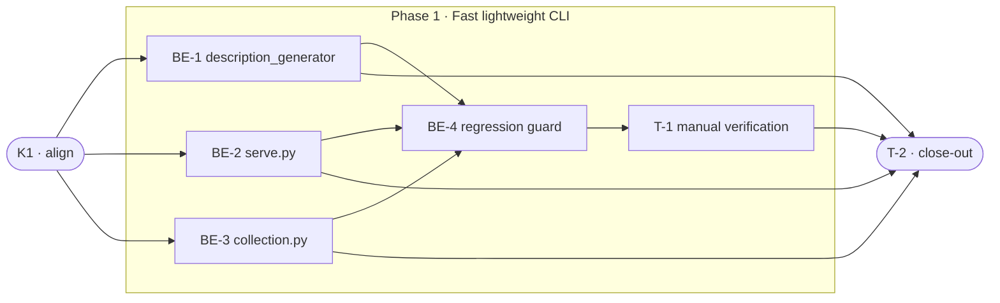

# 2026-07-15-190 · CLI Startup Latency — Task Breakdown

**How to read this file**
- This is the **order view** for [2026-07-15-190-cli-startup-latency-team-plan.md](./2026-07-15-190-cli-startup-latency-team-plan.md) — every task is a single-role checkbox in execution order, opening with a dependency graph.
- **Phases are vertical slices**, each delivering a working end-to-end increment. Sliced with the **`vertical-slicer` skill** (vertical-slicing.md applied).
- Each task carries the **role tag at the end of its title line**, then sub-bullets: **layer · estimate** (decimal hours), **needs · completes**, and a **Tests** block.
- **Unit and integration tests belong to the implementing dev** (test-first); **e2e and manual tests are the tester's tasks**. Close-out writes no tests.
- IDs (`BE-#`/`T-#`/`K1`) are this file's traceability thread; `S#`/`C#`/`Q#` are defined in the plan.
- **Rule:** edit your own tasks freely; change a contract only by team agreement.

---

## References

- **Plan:** [2026-07-15-190-cli-startup-latency-team-plan.md](./2026-07-15-190-cli-startup-latency-team-plan.md) — the full team plan (contracts, scenarios, architecture, allocation). **Always read the plan before you start planning the next task** — it holds the context this file only cites (`S#`/`C#`/`Q#`).
- **Brief:** [2026-07-15-190-cli-startup-latency-brief.md](./2026-07-15-190-cli-startup-latency-brief.md) — the source feature brief behind the plan.

---

## Task Breakdown

Single-role tasks in execution order, grouped into **vertical slices**. Frontend is **N/A** (headless CLI; no GUI components exist). All layers are owned by the backend role.

### Dependency graph

### Phase 0 · Kickoff *(prerequisite; the one cross-cutting step)*

- [x] **K1** — Agree the Contracts and Scenarios with the team #team
    - — · 0.5h
    - completes C1, C2, C3
    - Tests

---

### Phase 1 · Fast lightweight CLI *(walking skeleton: lightweight commands no longer import the ML/agent stack; full suite green)*

- [x] **BE-1** — Move `claude_agent_sdk` import into `_call_haiku()` in [archon_search/description_generator.py](../../archon_search/description_generator.py) and retarget 2 test patches #backend-role
    - Interface Adapters · 2.0h
    - needs K1 · completes S4, S5, S9, C3
    - Tests
        - #unit_test — `test_sdk_not_a_module_attribute` — assert `not hasattr(description_generator, "ClaudeSDKClient")` after import; proves C3 (module attribute ceases to exist after the move)
        - #unit_test — `test_imports_cleanly_with_sdk_absent` — `monkeypatch.setitem(sys.modules, "claude_agent_sdk", None)` + restore in `finally`; import `archon_search.description_generator`; assert no `ImportError` raised (S5; uses xdist-safe setitem pattern from learnings)
        - #integration_test — `test_call_haiku_imports_sdk_inside_function` — patch `claude_agent_sdk.ClaudeSDKClient` (retargeted from `archon_search.description_generator.ClaudeSDKClient` per [tests/test_description_generator.py](../../tests/test_description_generator.py):35,73); call `_call_haiku()`; assert patched client was constructed and called (S4)

- [ ] **BE-2** — Move `run_server` import into `serve()` in [archon_search/cli/serve.py](../../archon_search/cli/serve.py) and retarget 11 patches in [tests/test_cli_serve.py](../../tests/test_cli_serve.py) #backend-role
    - Presentation · 3.0h
    - needs K1 · completes S2, S9, S10, C1
    - Tests
        - #integration_test — `test_serve_invokes_run_server_with_config` — CliRunner invoke `serve`, patch `archon_search.server.app.run_server` (retargeted from `archon_search.cli.serve.run_server`, 11 sites); assert `run_server` called once with loaded config; assert server module namespace no longer exposes `run_server` at import time (S2, C1)
        - #integration_test — `test_serve_output_and_exit_code_unchanged` — invoke `serve` via CliRunner with mocked `run_server`; assert stdout, stderr, and exit code are identical to pre-change baseline (S10)

- [ ] **BE-3** — Move `create_pipeline` import into `list_cmd._run()` and `info._run()` in [archon_search/cli/collection.py](../../archon_search/cli/collection.py) #backend-role
    - Presentation · 1.0h
    - needs K1 · completes S3, S10, C2
    - Tests
        - #integration_test — `test_list_cmd_builds_pipeline_in_process` — invoke `list_cmd` via CliRunner; confirm `create_pipeline` is called inside the command body and produces correct output (no patch retarget needed — [tests/test_cli_collection.py](../../tests/test_cli_collection.py) patches only `httpx.*`) (S3)
        - #integration_test — `test_info_builds_pipeline_in_process` — same for `info._run()` at [archon_search/cli/collection.py](../../archon_search/cli/collection.py):195; assert identical output to pre-change (S3, S10)

- [ ] **BE-4** — Add import-boundary regression guard in `tests/test_cli_startup_latency.py` (new file) #backend-role
    - Presentation · 2.0h
    - needs BE-1, BE-2, BE-3 · completes S1, S6, S8, S11
    - Tests
        - #unit_test — `test_lightweight_cmd_no_claude_agent_sdk` — spawn subprocess running `archon-search config show` with isolated `ARCHON_SEARCH_DATA_DIR` and `ARCHON_SEARCH_CONFIG` env vars; print `sys.modules` keys to stdout; parse output; assert `"claude_agent_sdk"` is absent (S1, S6; subprocess-only — in-process CliRunner shares sys.modules with test runner per plan Q4)
        - #unit_test — `test_lightweight_cmd_no_fastembed` — same subprocess; assert `"fastembed"` is absent from `sys.modules` output (S1; `mcp` is NOT guarded — it enters only via `server/mcp.py` lazy mount, never at CLI import-time; see plan Q4 and learnings 2026-07-18)

- [ ] **T-1** — Manual: cold-cache heavy command + 0.2s timing measurement #tester-role
    - — · 2.0h
    - needs BE-1, BE-2, BE-3, BE-4 · completes S7, S11
    - Tests
        - #manual_test — Cold-cache heavy command — on a fresh system set `FASTEMBED_CACHE_PATH` to an empty temp dir; run `archon-search serve`; verify the server starts and the fastembed model downloads on demand without crashing; verify no heavy import happens before the serve command body executes (non-automatable: requires live network and first-model-download timing variance makes a CI assertion unreliable)
        - #manual_test — Lightweight command timing — run `archon-search config show` five times on a fresh interpreter (direct invocation, not via `uv run`); measure median wall time; confirm median approaches `< 0.2s`; document the measurement result (non-automatable: `uv run` spawn overhead makes a hard `< 0.2s` automated assertion flaky per plan Q2 and learnings 2026-07-16 smoke timing entries)

---

### Phase 2 · Close-out

- [ ] **T-2** — Project close-out & acceptance fact-check #tester-role
    - — · 4.0h
    - needs BE-1, BE-2, BE-3, BE-4, T-1 · completes (acceptance gate)
    - Tests
    - Duties
        - Update all documentation per [2026-07-15-190-cli-startup-latency-team-plan.md](./2026-07-15-190-cli-startup-latency-team-plan.md)'s "Documentation update" section — brief stale-line corrections, [Documentation/Architecture/110_component_catalog_and_layer_breakdown.md](../Architecture/110_component_catalog_and_layer_breakdown.md) (lazy-import timing note for `serve`/`collection`/`description_generator`), [Documentation/Architecture/210_performance_and_scalability.md](../Architecture/210_performance_and_scalability.md) (CLI startup budget + regression guard), [Documentation/Architecture/530_technical_debt_refactoring_roadmap.md](../Architecture/530_technical_debt_refactoring_roadmap.md) (register deferred lazy chunker init if not fixed), and sibling brief corrections ([2026-07-15-200-graph-imports-startup-brief.md](./2026-07-15-200-graph-imports-startup-brief.md), [2026-07-15-210-cli-store-commands-slow-brief.md](./2026-07-15-210-cli-store-commands-slow-brief.md)) per the plan's Documentation update checklist.
        - Fix all build / compiler warnings, if any.
        - Run the full test suite (`uv run pytest`); fix every failing test, including any unrelated to this feature.
        - Validate every Acceptance criterion one-by-one from the plan with a fact check — no assumptions; confirm each is genuinely done.

---

**Critical path:** K1 → BE-2 (11 patch retargets, heaviest) → BE-4 → T-1 → T-2. BE-1 and BE-3 run in parallel with BE-2 and land before BE-4.
