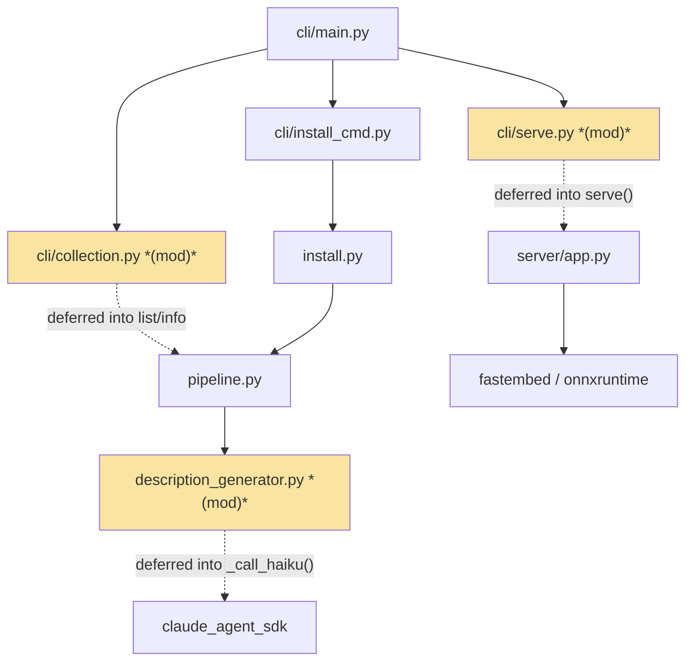
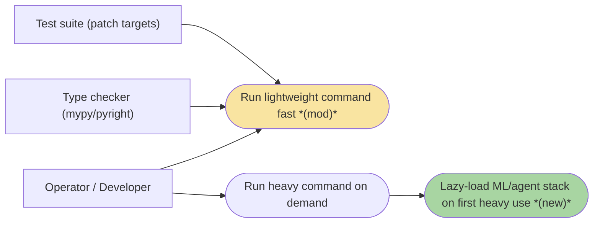

# 2026-07-15-190 · CLI Startup Latency — Team Plan

**How to read this file**
- **Architecture approach:** Clean Architecture. **Layers:** Presentation · Use Cases · Interface Adapters · Entities · Frameworks & Drivers. This is a headless Python CLI + server tool — there is no web/GUI frontend. The **Presentation layer is the Click CLI** (`archon_search/cli/`); every layer is backend.
- The **Frontend, Backend, and Tester** sections are the **depth view** — each role's scope, grouped by layer. Frontend is **N/A** for this feature (no GUI), but the section is kept and marked.
- **Contracts** are logical. **TypeSpec 1.13.0 is available**, but this feature has **no HTTP/API seam and no internal interface-signature change** — imports are relocated inside function bodies, not re-shaped — so no `.tsp` file is authored (see Contracts / seams for the rationale).
- **Role tags** (`#frontend-role`, `#backend-role`, `#tester-role`) mark each role-owned section.
- IDs (`S#` scenarios, `C#` contracts, `Q#` questions) are the traceability thread.
- **Tasks** are not in this file — task breakdown is a separate downstream step that consumes this plan.
- **Rule:** change a contract only by team agreement.

---

## Background

Every `archon-search` command — including lightweight ones like `config show`, `status`, and `key list` — pays a fixed import-time cost at startup because the CLI entry point eagerly loads modules that pull the ML/agent stack (`fastembed`/`onnxruntime` via `server.app`, and `claude_agent_sdk` + `mcp` via `pipeline` → `description_generator`), even when the invoked command never needs them.

---

## Goal

After this feature ships: lightweight commands (`config show`, `config get`, `status`, `stop`, `key list`) no longer trigger the `claude_agent_sdk`/`mcp` import on startup, and the `serve` path no longer pulls `fastembed` until the server actually runs. Heavy commands (`serve`, `collection add`, `ingest`, `install`) are unchanged — they still load the ML stack, but only when actually invoked. No CLI output, flag, or behaviour changes.

---

## Scope

### In Scope
- Move `from archon_search.server.app import run_server` from module level (`cli/serve.py:25`) into the `serve()` command body.
- Move `from archon_search.pipeline import create_pipeline` from module level (`cli/collection.py:15`) into the two command bodies that use it (`list_cmd._run()` at line 49, `info._run()` at line 195).
- Move `from claude_agent_sdk import ClaudeAgentOptions, ClaudeSDKClient, ResultMessage` from module level (`description_generator.py:9`) into `_call_haiku()` (line 100) — the single highest-leverage change; it removes the SDK/`mcp` cost from **every** pipeline importer, not only the CLI.
- Re-target the tests that patch the relocated module attributes so the suite stays green (see Backend section).
- Follow the repo's established in-function lazy-import convention (`# noqa: PLC0415`) and add `if TYPE_CHECKING:` guards **only** where a type checker flags an unresolved annotation after the move.

### Out of Scope
- Making `serve` / `collection add` / `install` faster — those commands need the ML stack; that is a separate concern.
- Lazy-initialising chunkers inside `SearchPipeline` (the GPT-2 tokenizer runtime cost) — deferred to the bug-003 companion.
- A separate lightweight entry point — adds maintenance burden with no gain once imports are lazy.
- Changing any CLI output, flags, or behaviour.
- Deferring `cli/main.py:5-19` eager subcommand imports (Click needs every command registered at group-build time) — see Known limitations and **Q1**.

### Corrected out of the brief's original scope (verified stale)
- `cli/ingest.py` — the brief lists a `create_pipeline` import to move here; **it does not exist**. `ingest.py` has been a pure `httpx` proxy since the CSP120 refactor. No edit is needed; its transitive cost is inherited from `cli/collection.py` and disappears when that file is fixed.
- `cli/install_cmd.py` `SearchInstaller` import (line 11) is **cheap**; the transitive heavy cost is `install.py:31`'s eager `create_pipeline`, which is eliminated by the `description_generator` fix without editing `install.py` — see **Q3**.

---

## Acceptance criteria
- The `serve` command still starts the server correctly and still loads `fastembed`/`server.app` when invoked.
- `collection list` and `collection info` still build a pipeline in-process and produce identical output.
- `description_generator.generate_description` still calls Haiku correctly with the SDK imported inside `_call_haiku`.
- `description_generator.py` still imports cleanly with `claude_agent_sdk` uninstalled (optional-dependency invariant preserved — the SDK import fires only inside the function).
- No CLI stdout/stderr text or exit code changes for any command before/after.
- All relocated-import patch targets are re-pointed; the full suite passes with zero warnings.
- Coverage stays ≥ 85%.
- An import-boundary test in the default suite (not smoke) spawns a subprocess running a lightweight command and asserts that `claude_agent_sdk` and `fastembed` are absent from `sys.modules` (the sole automated proof; see Q4).

---

## What does NOT change
- CLI output, flags, exit codes, and error shape (`click.echo(f"Error: {exc}", err=True)` + `SystemExit(1)`).
- `cli/main.py:5-19` eager subcommand imports — Click needs every command registered at group-build time (`main.add_command(...)`). The fix works by making each subcommand **module** cheap to import, not by deferring the subcommand imports themselves.
- The serve path's behaviour — `serve`/`collection add`/`ingest`/`install` still load the ML stack on demand.
- `fastembed`/`onnxruntime` and the GPT-2 tokenizer. Note: `embedder.py`, `reranker.py`, and `chunker.py` do not import `fastembed` at module level (lazy). However, `model_validation.py:17` **does** import `fastembed` at module level, and `server/app.py:33` imports `model_validation` — so the `serve.py` fix (deferring `run_server`) is what defers this fastembed import, not any pre-existing laziness.
- The `description_generator` no-raw-query / telemetry invariants. Note: the SDK import cost (~0.16s first-call only) now falls inside `generate_description`'s `asyncio.wait_for(..., timeout=30s)` window rather than at module-load time — still well within the timeout, but "import-timing only" is not strictly accurate for the first `_call_haiku` invocation.
- `install.py:31`'s `create_pipeline` import (recommended untouched — see **Q3**).
- Any data schema, config file, or state file — this feature has zero data-layer impact.

---

## Known limitations / accepted trade-offs
- **Partial win vs. the "1.4s → 0.2s" headline.** The measured CLI import-time cost this feature removes is `claude_agent_sdk` (~0.16s, universal) plus `fastembed` (~0.20s, serve-path only). Note: `mcp` enters only via `server/mcp.py` (lazy mount) — it was never present in CLI import-time `sys.modules` before or after this feature. The remaining gap to 0.2s is the Python interpreter + Click startup floor and — for store-reading commands — the ~900ms `lancedb` first-import floor (documented in the sibling 210 brief), neither of which this feature touches. See **Q2**.
- **`main.py` eager subcommand imports remain.** Because every subcommand module is imported at group-build time, a lightweight command still *loads* the (now-cheap) subcommand modules. The <0.2s target for store-free commands is reachable only once every subcommand module is import-clean — this feature makes the three named modules cheap, which is the dominant remaining cost after the interpreter floor. Deferring the Click group itself is explicitly rejected by the brief.
- **`install`/`wizard` latency** is only partially improved (the SDK cost is removed via the `description_generator` fix; `install.py`'s own config/platform/tomlkit imports remain). These are heavy commands, so this is acceptable.

---

## Approach & architecture

The change is a pure **import-graph relocation**: three module-level heavy imports move into the function bodies that actually use them, deferring *when* the ML/agent stack loads without changing *what* any component does or *which* layer depends on which. Dependency direction (Presentation → Use Cases → Interface Adapters → Frameworks & Drivers) is unchanged; only the load timing shifts.

### Architecture

| Component | Change | Why |
|-----------|--------|-----|
| [cli/serve.py](../../archon_search/cli/serve.py) | modified | `run_server` import moves into `serve()` — the only path pulling `fastembed` into the CLI |
| [cli/collection.py](../../archon_search/cli/collection.py) | modified | `create_pipeline` import moves into `list_cmd`/`info` — the only two offline store-reading commands |
| [description_generator.py](../../archon_search/description_generator.py) | modified | `claude_agent_sdk` import moves into `_call_haiku()` — removes the SDK cost from every pipeline importer at the source |

**Layer map (and role mapping)**

| Layer | Role | Components |
|-------|------|-----------|
| Presentation | **Backend** (CLI — no GUI) | [cli/serve.py](../../archon_search/cli/serve.py), [cli/collection.py](../../archon_search/cli/collection.py), [cli/install_cmd.py](../../archon_search/cli/install_cmd.py), [cli/main.py](../../archon_search/cli/main.py) |
| Use Cases | Backend | [pipeline.py](../../archon_search/pipeline.py) (`create_pipeline`) |
| Interface Adapters | Backend | [description_generator.py](../../archon_search/description_generator.py), [install.py](../../archon_search/install.py) |
| Entities | Backend | *(unchanged — no entity touched)* |
| Frameworks & Drivers | Backend | [server/app.py](../../archon_search/server/app.py) (`run_server`), `claude_agent_sdk`, `fastembed`/`onnxruntime` |

**What changes**
- [cli/serve.py](../../archon_search/cli/serve.py) — `run_server` import relocated into `serve()`; defers the fastembed load chain (`server/app.py:33` → `model_validation.py:17`'s module-level `from fastembed import TextEmbedding`).
- [cli/collection.py](../../archon_search/cli/collection.py) — `create_pipeline` import relocated into `list_cmd._run()` and `info._run()`.
- [description_generator.py](../../archon_search/description_generator.py) — `claude_agent_sdk` import relocated into `_call_haiku()`; removes the SDK import cost for **all** pipeline consumers (CLI *and* server paths).
- Tests that patch the relocated symbols at module scope are re-targeted to the origin module.

**Key decisions (from the brief, fixed for v1)**
- **Lazy imports over a lazy-loading Click group** — a 1–2 line, fully-reversible change per file that targets the measured hot paths directly, matching the repo's existing `# noqa: PLC0415` lazy-import convention (`rag_fusion.py`, `llm_enrichment_client.py`, `_helpers._get_service()`).
- **Fix `description_generator.py` at the source** — the SDK import fires on every pipeline import, not just on serve; fixing it once eliminates the cost for all callers.
- **Do not move `install.py:31`** (recommended) — the `description_generator` fix already removes its heavy cost, and moving it would break 6 `tests/test_install.py` patches for a marginal gain (**Q3**).
- **Preserve the optional-dependency invariant** (ADR C4/C5) — the edited module must remain importable with the SDK absent; the SDK import fires only inside the LLM-backed function.

### Actors & Use Cases

### Flows

#### User Flow

_Skipped: no user-facing step is added, removed, or reordered. The brief states there is no user-visible flow change — the only observable difference is that lightweight commands print output sooner._

#### Data Flow

_Skipped: no data edge changes. This feature touches only the Python import graph (when a module is first imported), not persistence, API calls, or migrations. Zero database/state impact (see Data)._

#### Sequence

_Skipped: no multi-step inter-component message exchange is introduced. The change is a load-timing shift of existing imports; the deferral relationships are fully captured in the Architecture diagram above (dotted "deferred into ..." edges)._

### Prior decisions

No ADR governs CLI startup latency, lazy imports, or CLI command structure. The relevant ADRs are all `accepted` and **supportive, not constraining** — only the optional-dependency invariant (ADR C4/C5) imposes a condition the plan must honour, so it is the sole entry below.

| Decision | Rationale | Constraint |
|---|---|---|
| HyDE / RAG Fusion gate the LLM SDK as an optional dependency, lazy-imported inside functions (ADR C4, C5) | An LLM SDK "must not become a required installation" and must stay off the import hot path; missing package → clear error, not a crash | An LLM SDK import must never fire on a code path a user who has not opted into that feature will hit. Moving `claude_agent_sdk` into `_call_haiku()` honours this; the plan must verify `description_generator.py` still imports with the SDK uninstalled |

_ADRs 02, 03, 08 (fastembed / reranker / EmbedderCache lazy model-weight loading) corroborate the feature's premise but carry `constraint: none` — they govern runtime weight loading, not import time — so they are omitted from the constraint table above._

### Contradictions

**Code vs. docs**

| Contradiction | Code says | Doc says | Owner |
|---|---|---|---|
| `cli/ingest.py` pipeline import | `ingest.py` is a pure `httpx` proxy with no `create_pipeline` import (CSP120 refactor) | Brief In-Scope (line 21) + References (line 55): "move `create_pipeline` inside `cli/ingest.py:16`" | brief is stale — drop `ingest.py` from scope |
| `collection.py` import line | `create_pipeline` at [cli/collection.py](../../archon_search/cli/collection.py) **line 15** | Brief (line 20/54): line 18 | brief is stale — use line 15 |
| Heavy cost for `install_cmd` | Transitive via [install.py](../../archon_search/install.py) line 31 (`create_pipeline`); `SearchInstaller` import at `install_cmd.py:11` is cheap | Brief (line 22): move "`SearchInstaller` (or equivalent heavy import)" in `install_cmd.py` | brief under-specifies — real fix is the `description_generator` source fix; `install.py:31` untouched (**Q3**) |

*Action:* These are stale brief line-references, not code bugs. The plan uses the verified reality above; no source doc requires correction beyond the brief itself. The Documentation update section lists the docs to touch on landing.

**Brief vs. reality**

_No unresolved brief-vs-code contradiction beyond the stale line references above — every corrected fact was independently verified by the structured-output, backend, contracts, docs, scenarios, and tester investigations._

---

## Contracts / seams

Boundaries where roles must agree. **Logical, not code.** Changing one requires team agreement.

**TypeSpec note:** TypeSpec 1.13.0 is available, but **no `.tsp` contract is authored for this feature.** Every seam below is an in-process Python import boundary being relocated *inside a function body* — no interface signature, data model, REST route, or MCP tool changes. `run_server`, `create_pipeline`, `generate_description`, and `_call_haiku` keep their exact signatures; `BREAKING.md` and `openapi.json` are unaffected. A `.tsp` file would describe a wire/interface shape that does not change, so contracts here are stated logically only.

**C1 — `serve()` → `run_server`**  *(Presentation ↔ Frameworks & Drivers)*
`cli/serve.py`'s `serve()` calls `run_server(config)` from `server.app`. After the move, the import resolves inside the function body at call time. The promise both sides keep: `run_server`'s signature and behaviour are unchanged; only the module-attribute `cli.serve.run_server` ceases to exist (patch target moves to `server.app.run_server`).

**C2 — `list_cmd`/`info` → `create_pipeline`**  *(Presentation ↔ Use Cases)*
`cli/collection.py`'s two offline read commands call `create_pipeline(cfg)` from `pipeline`. The import moves into both bodies. `create_pipeline`'s factory signature is unchanged; no test patches `cli.collection.create_pipeline`, so this seam is patch-safe.

**C3 — `_call_haiku()` → `claude_agent_sdk`**  *(Interface Adapters ↔ Frameworks & Drivers)*
`description_generator._call_haiku()` instantiates `ClaudeSDKClient`/`ClaudeAgentOptions`/`ResultMessage` from `claude_agent_sdk`. The import moves inside `_call_haiku`. Promise: the module remains importable with the SDK absent (optional-dependency invariant), and the SDK fires only when description generation actually runs. The module attribute `description_generator.ClaudeSDKClient` ceases to exist (patch target moves to `claude_agent_sdk.ClaudeSDKClient`).

---

## Data

_This feature has **zero** database, schema, config-file, or state-file impact. The only "data" involved is the Python module import graph — *when* a module is first imported, not *what* it stores. No table, collection, LanceDB schema, `STORE_SCHEMA_VERSION` bump, `MigrationSpec`, config key, or state file is touched. Data section skipped._

---

## Scenarios #tester-role

Behavioural only — step-level detail is produced by the tasks downstream. Covers happy, unhappy, edge, and non-functional paths.

| id | Scenario (Given / When / Then) |
|----|--------------------------------|
| **S1** | **Given** a warm model cache · **When** the user runs a lightweight command (`config show`, `config get`, `status`, `stop`, `key list`) · **Then** it produces its normal output and `claude_agent_sdk` is absent from `sys.modules` for that command |
| **S2** | **Given** the `serve` command · **When** the user runs `archon-search serve` · **Then** the server starts correctly and `run_server` is invoked with the loaded config (ML stack loads on demand, unchanged) |
| **S3** | **Given** `collection list` / `collection info` with a non-empty store · **When** the user runs them offline · **Then** they build a pipeline in-process (the `create_pipeline()` call must complete, not short-circuit on an empty store) and produce byte-identical output to before the change |
| **S4** | **Given** description generation is triggered (ingest / routing backfill) · **When** `_call_haiku` runs · **Then** it imports the SDK inside the function and calls Haiku exactly as before |
| **S5** | **Given** `claude_agent_sdk` is NOT installed · **When** `description_generator` is imported · **Then** the module imports cleanly (no ImportError); the SDK error surfaces only if `_call_haiku` is actually called |
| **S6** | **Given** a first install with no model cache · **When** a lightweight command runs · **Then** it completes without triggering any model/tokenizer download or SDK import |
| **S7** | **Given** the same first-install cold state · **When** a heavy command (`serve`/`collection add`) runs · **Then** the ML stack loads on demand and any first-use model download happens then, not at startup — *smoke/manual only; excluded from the default CI suite* |
| **S8** | **Given** the moved imports · **When** the type checker (mypy/pyright) runs on the edited files · **Then** it resolves all symbols with no new unresolved-name errors (via `TYPE_CHECKING` guards only if flagged) |
| **S9** | **Given** the tests that patched the relocated module attributes · **When** the suite runs after re-targeting · **Then** all pass with no `AttributeError` on the patch targets and zero warnings |
| **S10** | **Given** every lightweight command · **When** each runs · **Then** stdout, stderr, and exit code are identical to the pre-change behaviour (no output/flag/behaviour drift) |
| **S11** | **Given** a fresh interpreter · **When** a lightweight command is invoked as a subprocess · **Then** `claude_agent_sdk` and `fastembed` are absent from `sys.modules` (automated proof via the Q4 regression guard); manual median-of-N timing measurement should approach `< 0.2s` (see Q2) |

---

## Frontend — Presentation (GUI) #frontend-role

**N/A — no frontend work for this feature.** This is a headless CLI + server tool with no web/GUI frontend (no `*.tsx`/`*.jsx`/`*.vue`/`*.svelte` anywhere in the source tree). The Clean-Architecture Presentation layer here is the Click CLI, which is owned by the Backend section below. The one HTML asset in the repo ([server/graph_viewer.html](../../archon_search/server/graph_viewer.html)) is a server-served graph viewer, unrelated to this feature.

---

## Backend — Presentation (CLI) · Use Cases · Interface Adapters · Frameworks #backend-role

**Scope:** the three import relocations and the mandatory test-patch re-targeting they force. Writes both unit and integration tests for its tasks.
**Owns layers:** Presentation (CLI), Use Cases, Interface Adapters, Frameworks & Drivers.

**Exact edits**
- [cli/serve.py](../../archon_search/cli/serve.py) — move `from archon_search.server.app import run_server` (line 25) into the `serve()` body (used once at `run_server(config)`), annotated `# noqa: PLC0415`. Keep `logging`, `os`, `Path`, `click`, and `from archon_search.config import ConfigError, load_config` at module level.
- [cli/collection.py](../../archon_search/cli/collection.py) — move `from archon_search.pipeline import create_pipeline` (line 15) into `list_cmd._run()` (call site line 49) and `info._run()` (call site line 195), annotated `# noqa: PLC0415`. Keep `_poll_job`, `load_config`, `load_or_generate_key`, `httpx`, `click`, and the re-exported `_DEFAULT_API_URL`/`_resolve_api_key` at module level.
- [description_generator.py](../../archon_search/description_generator.py) — move `from claude_agent_sdk import ClaudeAgentOptions, ClaudeSDKClient, ResultMessage` (line 9) into `_call_haiku()` (line 100; all three symbols used at lines 102/103/121), annotated `# noqa: PLC0415`. Keep `asyncio`, `logging`, `os`, `random`, and `constants.DEFAULT_FAST_MODEL` at module level.
- **Recommended: leave [install.py](../../archon_search/install.py) line 31 untouched** — the `description_generator` fix already removes its heavy transitive SDK cost; moving it breaks 6 `tests/test_install.py` patches for a marginal gain (**Q3**).

**Lazy-import pattern to follow**
Match the repo's established in-function convention: `from <module> import <name>  # noqa: PLC0415` inside the function body, mirroring `rag_fusion.py` and `llm_enrichment_client.py`. Note: `_get_service()` in [cli/_helpers.py](../../archon_search/cli/_helpers.py) also uses in-function imports but without the `# noqa: PLC0415` annotation — both styles exist in the codebase; use the annotated form for consistency with `rag_fusion.py`/`llm_enrichment_client.py`. Do **not** invent a wrapper/helper; do **not** introduce a lazy Click group.

**TYPE_CHECKING guard pattern**
There is currently **no** `TYPE_CHECKING` block anywhere in `archon_search/cli/`. The canonical repo shape is `pipeline.py:15,38-40` (`from typing import TYPE_CHECKING`, then an `if TYPE_CHECKING:` block for annotation-only imports). For this task the relocated symbols (`run_server`, `create_pipeline`, the SDK symbols) are **call targets, not annotations**, so a guard is likely **unnecessary**. Add one **only** if the repo's type checker flags an unresolved annotation after the move — do not add speculatively.

**Test patch re-targets required (mandatory, same PR)**
- [tests/test_cli_serve.py](../../tests/test_cli_serve.py) — ~11 sites patch `archon_search.cli.serve.run_server`; re-target to `archon_search.server.app.run_server`. Highest-volume retarget.
- [tests/test_description_generator.py](../../tests/test_description_generator.py) — lines 35, 73 patch `archon_search.description_generator.ClaudeSDKClient`; re-target to `claude_agent_sdk.ClaudeSDKClient` (only `ClaudeSDKClient` is patched; `ClaudeAgentOptions`/`ResultMessage` are not).
- [tests/test_cli_collection.py](../../tests/test_cli_collection.py) — patches only `httpx.*`, never `create_pipeline`; **no change needed** (the collection move is patch-safe).
- If — and only if — `install.py:31` is moved (not recommended): [tests/test_install.py](../../tests/test_install.py) lines 497/515/531/556/579/628 (`archon_search.install.create_pipeline`) and [tests/test_install_cmd.py](../../tests/test_install_cmd.py) lines 25/37/50 (`archon_search.cli.install_cmd.SearchInstaller`) must re-target. Leaving `install.py:31` alone keeps all of these valid.

**Done when**
- [ ] Lightweight commands no longer import `claude_agent_sdk` (assert absent from `sys.modules`) — S1, S6
- [ ] `serve` still starts the server and invokes `run_server(config)` unchanged — S2
- [ ] `collection list`/`info` build a pipeline in-process with identical output — S3
- [ ] `_call_haiku` imports and calls the SDK inside the function, behaviour unchanged — S4
- [ ] `description_generator.ClaudeSDKClient`, `description_generator.ClaudeAgentOptions`, and `description_generator.ResultMessage` are no longer accessible as module attributes (assert `not hasattr(description_generator, "ClaudeSDKClient")` etc.) — C3
- [ ] `description_generator` imports cleanly with the SDK uninstalled — S5
- [ ] Heavy commands load the ML stack on demand on a cold cache — S7 *(smoke/manual only; not a default CI gate)*
- [ ] Type checker resolves all symbols with no new errors — S8
- [ ] All relocated-import patch targets are re-pointed; suite green, zero warnings — S9
- [ ] No stdout/stderr/exit-code drift for any command — S10
- [ ] Import-time CI regression guard added (subprocess asserts `claude_agent_sdk` and `fastembed` absent from `sys.modules` after a lightweight command; in-process CliRunner is insufficient) — Q4

---

## Tester #tester-role

**Scope:** the tester owns **e2e and manual** tests plus the project close-out. **Unit and integration** tests (CliRunner behaviour tests, `sys.modules` assertions, patch re-targeting, `description_generator` tests) belong to the implementing dev, in each implementation task's `Tests` block.

The smoke suite ([tests/smoke/test_cli.py](../../tests/smoke/test_cli.py)) already spawns a **real** `archon-search` subprocess and already contains fresh-interpreter timing tests (`test_config_show_timing_and_format`, `test_help_completes_within_2s`) — the exact pattern the startup-latency proof needs. A `uv run archon-search`-based hard `< 0.2s` assertion is likely flaky because `uv run` adds its own spawn overhead; the recommended automated gate is a bare-import assertion or a `sys.modules`-absence check, with the exact 0.2s end-to-end figure kept as a manual measurement (see **Q2**).

**Allocation** — each scenario at the cheapest level that proves it *(unit + integration are dev-written; e2e + manual are the tester's tasks)*

| Scenario | Cheapest level |
|----------|----------------|
| S1, S5, S6 | unit (`sys.modules`-absence assertion via subprocess for S1/S6; CliRunner for S5's uninstalled-SDK import test) |
| S8, S9 | unit (type-check step + re-targeted patch tests) |
| S2, S3, S4 | integration (CliRunner + mocked `run_server` / in-process pipeline; `_call_haiku` with patched SDK) |
| S10 | integration (stdout/stderr/exit-code equality across commands) |
| S7 | e2e (smoke subprocess on cold cache) — *not a default CI gate; manual verification acceptable* |
| S11 | e2e (smoke subprocess timing) + manual (exact 0.2s median-of-N measurement) |

**S5 implementation note:** The `sys.modules`-isolation test for `description_generator` must use `monkeypatch.setitem(sys.modules, "claude_agent_sdk", None)` + restore in `finally` (not a bare `delitem` + `importlib.reload`) to avoid poisoning sibling xdist workers. See `learnings.md` xdist stub isolation entry.

---

## Documentation update

Docs the feature touches — the tasks file's close-out task works through this list. Each carries a reason.

- [x] [2026-07-15-190-cli-startup-latency-brief.md](./2026-07-15-190-cli-startup-latency-brief.md) — *contradiction with code* — correct the stale line references (`collection.py:15` not 18; drop the `ingest.py` bullet; clarify the `install.py:31` vs `install_cmd.py:11` cost)
- [x] [2026-07-15-190-cli-startup-latency-team-plan.md](./2026-07-15-190-cli-startup-latency-team-plan.md) — *new feature* (this file)
- [x] [110_component_catalog_and_layer_breakdown.md](../Architecture/110_component_catalog_and_layer_breakdown.md) — *new feature* — CLI section (lines 134–147): note the lazy-import timing for `serve`/`collection`/`description_generator` if newly described
- [x] [210_performance_and_scalability.md](../Architecture/210_performance_and_scalability.md) — *new feature* — currently silent on CLI startup; add the CLI startup budget / any import-time regression guard here
- [x] [530_technical_debt_refactoring_roadmap.md](../Architecture/530_technical_debt_refactoring_roadmap.md) — *new feature* — register the deferred "lazy chunker init in `SearchPipeline`" (bug-003 companion) if not fixed now
- [x] [2026-07-15-200-graph-imports-startup-brief.md](./2026-07-15-200-graph-imports-startup-brief.md) — *contradiction with code* — reconcile: its "optional step 2" is already done (GBC110 removed the `graph_cmd.py` heavy imports); state merge order vs. 190
- [x] [2026-07-15-210-cli-store-commands-slow-brief.md](./2026-07-15-210-cli-store-commands-slow-brief.md) — *no change needed* — shares the `pipeline.py:25` fix from the other end; note the overlap and the ~900ms lancedb floor

**Consulted (read-only)**
- [500_development_workflows_and_conventions.md](../Architecture/500_development_workflows_and_conventions.md) — entry point `archon_search.cli.main:main`; package-vs-distribution naming
- [07_description_embedding_hybrid_routing.md](../ADRs/07_description_embedding_hybrid_routing.md) — confirms `description_generator` runs only on the ingest/routing path, not read-only CLI commands
- [quick_start.md](../quick_start.md), [README.md](../../README.md) — CLI command inventory; no latency content

---

## Open questions

All resolved 2026-07-18. Status moved `draft → planned`.

| id | Area | Decision |
|----|------|----------|
| **Q1** | architecture / scope | **Accept the partial win.** The three targeted edits remove the two measured costs (SDK ~0.16s, fastembed ~0.20s). A `LazyGroup` was explicitly rejected by the brief; after the edits the subcommand modules are cheap, so deferring their load saves noise, not cost. No `LazyGroup` in scope. |
| **Q2** | tests / metric | **`sys.modules`-absence assertion (automated, authoritative) + manual median-of-N measurement targeting `< 0.2s`.** Drop the `< 0.3s` subprocess timing gate — the repo's existing `< 2.0s` smoke gate already flaked to 3.31s under xdist worker load; a `< 0.3s` gate is 7× tighter and will produce CI flake. The `sys.modules`-absence assertion is the only reliable automated proof. Tester owns S11 manual measurement; implementing dev owns S1/S6 absence assertions. |
| **Q3** | scope | **Leave `install.py:31` untouched.** The `description_generator` fix already removes its heavy transitive SDK cost. Editing it breaks 6 `tests/test_install.py` patches for zero additional user-visible improvement. |
| **Q4** | tests | **Add the import-time CI regression guard in this PR.** Owner: implementing dev. Location: default suite (not smoke). Mechanism: spawn a subprocess (in-process CliRunner shares `sys.modules` with the test runner and cannot reliably prove absence) running a lightweight command, then assert that `claude_agent_sdk` and `fastembed` are both absent from `sys.modules`. Note: `mcp` is NOT in the guard — it enters only via `server/mcp.py` (lazy `fastmcp` mount), not via `claude_agent_sdk`; it was never present in CLI import-time `sys.modules` before or after this feature. Note: `tests/test_import_boundary.py` is an AST namespace lint (checks for `archon.` imports), NOT a `sys.modules`-inspection guard — do not mirror its style; write the guard from scratch. A startup-latency improvement without a regression guard covering both deferred modules is half done. |
| **Q5** | scope / process | **Ship 190 alone; 200 and 210 ship separately in their own PRs.** Note: 200's reference to `bug-004-cli-startup-latency-brief.md` is a stale legacy ID — that document is brief 190 renumbered; no missing doc exists. |
| **Q6** | tests | **No `TYPE_CHECKING` guards speculatively.** All relocated symbols (`run_server`, `create_pipeline`, `ClaudeSDKClient`) are call targets, not annotations. Add a guard only if the type checker flags a specific unresolved name after the move. Action item for implementing dev: confirm whether mypy/pyright runs in CI for the edited files before closing the task. |
| **Q7** | tests | **Run `grep -r "cli\.serve\.run_server\|description_generator\.ClaudeSDKClient\|cli\.collection\.create_pipeline\|description_generator\.ClaudeAgentOptions\|description_generator\.ResultMessage" tests/` as the first implementation step** to confirm the patch-target list is complete across all subdirectories. Expected results: `tests/test_cli_serve.py` — 11 hits for `run_server`; `tests/test_description_generator.py` — 2 hits for `ClaudeSDKClient`; `tests/integration/` — 0 hits; `tests/smoke/` — 0 hits; all `create_pipeline`/`ClaudeAgentOptions`/`ResultMessage` patterns — 0 hits. Any non-zero count on the zero-expected patterns means an additional retarget is needed. |

*Resolved during planning: the brief's three original open questions — (a) `install_cmd.py` import path (line 42): heavy cost is transitive via `install.py:31`, `SearchInstaller` at `install_cmd.py:11` is cheap; (b) other CLI modules eagerly importing pipeline/server.app (line 43): exactly two — `serve.py:25` and `collection.py:15`, all others are proxies; (c) does moving the SDK import break a test (line 44): yes — `tests/test_description_generator.py:35,73` must re-target to `claude_agent_sdk.ClaudeSDKClient`.*

---

## References

- **Brief:** [2026-07-15-190-cli-startup-latency-brief.md](./2026-07-15-190-cli-startup-latency-brief.md)
- **Tasks:** [2026-07-15-190-cli-startup-latency-tasks.md](./2026-07-15-190-cli-startup-latency-tasks.md)
