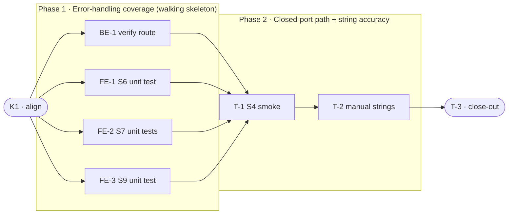

# 220 · Non-Blocking Collection Add — Task Breakdown

**How to read this file**
- This is the **order view** for [2026-07-15-220-collection-add-async-team-plan.md](./2026-07-15-220-collection-add-async-team-plan.md) — every task is a single-role checkbox in execution order, opening with a dependency graph.
- **Phases are vertical slices**: each delivers a working end-to-end increment (new passing tests or confirmed behavior), not a horizontal layer. No separate "integrate" phase. Sliced with the **`vertical-slicer` skill** (installed).
- **This is a verification/gap-closing plan.** The feature shipped in CSP120 (`8c36a6f7`). No production code changes. All tasks are either test additions or read-and-confirm verifications.
- Each task carries the **role tag at the end of its title line**, then sub-bullets: **layer · estimate** (decimal hours), **needs · completes**, and a **Tests** block.
- **Unit and integration tests belong to the implementing dev** (test-first); **e2e and manual tests are the tester's tasks**.
- IDs (`BE-#`/`FE-#`/`T-#`/`K#`) are this file's traceability thread; `S#`/`C#`/`Q#` are defined in the plan.

---

## References

- **Plan:** [2026-07-15-220-collection-add-async-team-plan.md](./2026-07-15-220-collection-add-async-team-plan.md) — the full team plan (contracts, scenarios, architecture, allocation). **Always read the plan before you start planning the next task** — it holds the context this file only cites (`S#`/`C#`/`Q#`).
- **Brief:** [2026-07-15-220-collection-add-async-brief.md](./2026-07-15-220-collection-add-async-brief.md) — the source feature brief; already updated to reflect CSP120 (status: shipped).

---

## Task Breakdown

Single-role tasks in execution order, grouped into **vertical slices**.

### Dependency graph

### Phase 0 · Kickoff *(prerequisite; the one cross-cutting step)*

- [x] **K1** — Confirm C1 contract matches shipped code, all Contradictions resolved, and `openapi.json` snapshot is drift-free #team
    - — · 0.5h
    - completes C1
    - Tests

### Phase 1 · Error-handling coverage *(walking skeleton: fills the three missing unit tests that close S6/S7/S9 end-to-end; carries the BE route verification)*

- [x] **BE-1** — Verify `add_collection` route against Backend Done-when checklist: `202` + `JobResponse`, server-derived name, `_maybe_save_config`, no `collection_name` in `AddCollectionRequest`, `openapi.json` 202/400/401/409/503/422 confirmed, `BREAKING.md` drift-free #backend-role
    - Interface Adapters · 1.0h
    - needs K1 · completes S1, S3, S8
    - Tests
        - #unit_test — `test_add_collection_request_has_no_collection_name_field` — assert `AddCollectionRequest` fields are exactly `path` and `embedding_model` (no `collection_name`) in [archon_search/server/routes_collections.py](../../archon_search/server/routes_collections.py)

- [x] **FE-1** — Add `test_add_400_bad_path_exits_1` in [tests/test_cli_collection.py](../../tests/test_cli_collection.py) — mock `httpx.post` returning `status_code=400`; asserts exit 1 via the non-202 branch at [archon_search/cli/collection.py](../../archon_search/cli/collection.py):114 (currently untested — existing `test_add_generic_http_error_exits_1` hits the `httpx.HTTPError` transport path at :102, not the status-response branch) #frontend-role
    - Presentation · 0.5h
    - needs K1 · completes S6
    - Tests
        - #unit_test — `test_add_400_bad_path_exits_1` — `patch("archon_search.cli.collection.httpx.post", return_value=MagicMock(status_code=400, text="unsafe path"))`, invoke `collection add /some/path --api-key test-key`, assert `result.exit_code == 1` and `"server returned 400"` in output

- [ ] **FE-2** — Add `_resolve_api_key` precedence tests in [tests/test_cli_collection.py](../../tests/test_cli_collection.py) — covers all three branches of `_resolve_api_key` at [archon_search/cli/collection.py](../../archon_search/cli/collection.py):19–27 (currently zero tests for this function) #frontend-role
    - Presentation · 1.0h
    - needs K1 · completes S7
    - Tests
        - #unit_test — `test_resolve_api_key_arg_priority` — call `_resolve_api_key("explicit-key")` with env var set; assert returns `"explicit-key"` (arg wins)
        - #unit_test — `test_resolve_api_key_env_fallback` — call `_resolve_api_key(None)` with `ARCHON_SEARCH_API_KEY="env-key"` set via monkeypatch/environ; assert returns `"env-key"`
        - #unit_test — `test_resolve_api_key_file_fallback` — call `_resolve_api_key(None)` with env unset; patch `archon_search.cli.collection.load_or_generate_key` to return `("file-key", None)`; assert returns `"file-key"`

- [ ] **FE-3** — Add `test_add_with_wait_exits_1_on_failed` in [tests/test_cli_collection.py](../../tests/test_cli_collection.py) — mirrors `test_migrate_cli_wait_exits_1_on_failed` at :441 but for the `add` command; covers the S9 path not tested through `add --wait` end-to-end (only `_poll_job` helper is tested in isolation) #frontend-role
    - Presentation · 0.5h
    - needs K1 · completes S9
    - Tests
        - #unit_test — `test_add_with_wait_exits_1_on_failed` — mock POST→202, then `_helpers.httpx.get` side-effect `[RUNNING, FAILED]`; invoke `collection add /path --wait --api-key test-key`; assert `result.exit_code == 1` and no "ingested successfully" in output

### Phase 2 · Closed-port path + string accuracy *(confirms server-not-running behavior via real subprocess; verifies approved wording)*

- [ ] **T-1** — Add `test_add_without_server` in [tests/smoke/test_cli.py](../../tests/smoke/test_cli.py) — closed-port negative smoke test using socket-hold pattern #tester-role
    - — · 2.0h
    - needs BE-1, FE-1, FE-2, FE-3 · completes S4
    - Tests
        - #e2e_test — `test_add_without_server` — bind `sock = socket.socket(AF_INET, SOCK_STREAM); sock.bind(("127.0.0.1", 0))`, record `dead_port = sock.getsockname()[1]`, **keep sock bound** while subprocess runs (hold-while-running, not close-then-connect), then `sock.close()` after; invoke `uv run archon-search collection add /some/path --api-url http://127.0.0.1:{dead_port} --api-key {smoke_server.api_key}`; assert `returncode == 1` and `"archon-search serve is not running. Start it first."` in `result.stderr`; takes `smoke_server` fixture to inherit `xdist_group("smoke_e2e")` serialisation

- [ ] **T-2** — Manual: verify 6 user-visible strings from `collection add` against the wording approved in Q2/Q3 resolution #tester-role
    - — · 0.5h
    - needs T-1 · completes S1, S2, S3, S5
    - Tests
        - #e2e_test — `test_e2e_collection_add_progress_hint` — extend or companion `test_e2e_collection_add_wait_against_server` to assert `"Track progress with: archon-search jobs status"` appears in stdout (string 2 at [archon_search/cli/collection.py](../../archon_search/cli/collection.py):122 — the only approved string not yet asserted by the existing smoke test)
        - #manual_test — Strings 1–6 wording check — verify the six strings from the plan's Tester section against the live CLI output: (1) `"Add collection job submitted: {id}. Collection: '{name}'"` at :121; (2) `"Track progress with: archon-search jobs status {id}"` at :122; (3) `"Collection '{name}' ingested successfully."` at :127; (4) `"archon-search serve is not running. Start it first."` at :98 (stderr); (5) `"Error: {detail}"` at :111 (stderr, 409 case); (6) `"Polling stopped — job continues on server"` at [archon_search/cli/_helpers.py](../../archon_search/cli/_helpers.py):60 (non-automatable: requires timed SIGINT to a polling subprocess, brittle in smoke context)

### Phase 3 · Close-out

- [ ] **T-3** — Project close-out & acceptance fact-check #tester-role
    - — · 3.0h
    - needs T-1, T-2 · completes (acceptance gate)
    - Tests
    - Duties
        - Update all documentation per [2026-07-15-220-collection-add-async-team-plan.md](./2026-07-15-220-collection-add-async-team-plan.md)'s "Documentation update" section — verify the brief is archived as shipped, confirm four architecture docs still match the code (no update needed per the plan, but verify); update plan `status: done`.
        - Fix all build / compiler warnings, if any.
        - Run the full test suite; fix every failing test, including any unrelated to this feature.
        - Validate every Acceptance criterion one-by-one (from the plan) with a fact check — no assumptions; confirm each is genuinely done.

**Critical path:** K1 → FE-2 (1.0h) → T-1 (2.0h) → T-2 (0.5h) → T-3 (3.0h). `BE-1`, `FE-1`, and `FE-3` run alongside `FE-2` and do not extend the critical path.

---

## Open questions

*(None — all Q# questions from the plan are resolved. If an open question surfaces during implementation, add it here with a Q# continuing from the plan's last Q6.)*
