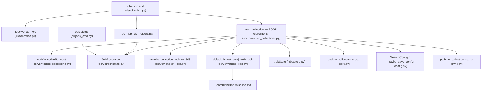
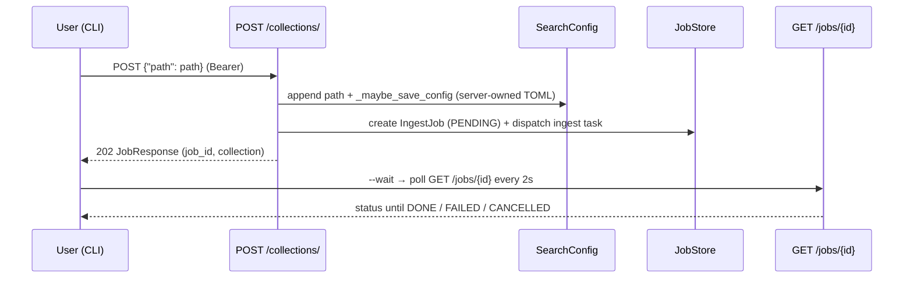

# 2026-07-15-220 · Non-Blocking Collection Add — Team Plan

**How to read this file**
- **Architecture approach:** Clean Architecture. **Layers:** Presentation · Use Cases · Interface Adapters · Entities · Frameworks & Drivers. Role mapping: Presentation (CLI) → **frontend**; Use Cases / Interface Adapters / Entities / Frameworks & Drivers → **backend**.
- The **Frontend, Backend, and Tester** sections are the **depth view** — each role's scope, grouped by layer.
- **Contracts** are logical, authored as linked `.tsp` files (TypeSpec 1.13.0 is available); the HTTP/API seam also emits a linked `openapi.yaml`.
- **Role tags** (`#frontend-role`, `#backend-role`, `#tester-role`) mark each role-owned section.
- IDs (`S#` scenarios, `C#` contracts, `Q#` questions) are the traceability thread.
- **Tasks** are not in this file — task breakdown is a separate downstream step that consumes this plan.
- **Rule:** change a contract only by team agreement.

> **READ THIS FIRST — the feature is already implemented.** All nine investigation agents independently confirmed that the feature this brief describes shipped under **CSP120, commit `8c36a6f7`** ("feat(cli): convert collection add to httpx proxy — FE-4"). `collection add` is already a pure `httpx` proxy to `POST /collections/` that returns `202` + a job ID with `--wait` polling via the shared `_poll_job` helper; `jobs status` already exists; all four affected documentation files are already updated. **This is therefore a verification/gap-closing plan, not a green-field build.** The brief predates the merge and is stale in several specifics — those are collected in [Contradictions](#contradictions), not treated as work. Do **not** plan a rewrite; a client-side TOML write, in particular, would *regress* the CSP120 architecture.

---

## Background

Before CSP120, `archon-search collection add <path>` ran the ingest pipeline **in-process**: it froze the terminal for minutes on a large directory, with no progress, no clean cancel, and no visibility. The brief (bug-005) was written to fix that. By the time this plan was drafted, CSP120 had already delivered the fix.

---

## Goal

`collection add` returns immediately with a job ID after submitting ingestion to the running server; the user tracks progress with `--wait` or `archon-search jobs status <id>` / `GET /jobs/{id}`; the terminal is never frozen. **This goal is already met on `main`.** The goal of *this plan* is to verify that the shipped code satisfies the brief and to close the residual gaps enumerated below.

---

## Scope

### In Scope
- **Verify** the shipped `collection add` matches the brief's Core Flow, In-Scope items, and Edge Cases (server-derived name, `--wait`, `--api-url`/`--api-key`, `_resolve_api_key`, Ctrl-C handling, exit codes).
- **Reconcile** the three brief-vs-reality contradictions (409-vs-200 duplicate semantics; server-owned vs CLI-owned TOML write; connect-error message wording) — decide brief-follows-code or code-follows-brief for each.
- **Confirm** the four affected documentation files still match the code (docs agent reports they already do), and update the **brief itself** to reflect the shipped design (or close it).
- **Add** the thin remaining test value the tester identified: a smoke negative test for `add` against a closed port, and a manual verification checklist for user-visible strings.

### Out of Scope
- Re-implementing async add, `--wait`, `_poll_job`, or `jobs status` — all already shipped and tested.
- Re-adding any CLI-side TOML write (would regress CSP120; the server owns the TOML write).
- `collection add --no-server` in-process fallback (brief Future Iterations; tied to Issue 8).
- `archon-search jobs list` (brief Future Iterations; only `jobs status` exists today).
- onnxruntime execution-provider warnings (harmless macOS ARM messages; no action).

---

## Acceptance criteria
- `collection add <path>` POSTs `{"path": path}` (only) to `POST /collections/` with `Authorization: Bearer <key>`, prints the job ID + server-derived collection name, and exits `0` without blocking — verified.
- `--wait` polls `GET /jobs/{id}` to a terminal status via `_poll_job` and prints completion — verified.
- Ctrl-C during `--wait` prints "Polling stopped — job continues on server" and leaves the server job running — verified.
- Server not running → clear message + exit `1`; no in-process fallback — verified.
- Duplicate collection → the decided semantics (currently `409` + exit 1) hold, and the brief + tests agree with the decision.
- API key resolves via `--api-key` → `ARCHON_SEARCH_API_KEY` → key file — verified.
- The three contradictions are each resolved with an explicit brief-follows-code or code-follows-brief decision (see [Open questions](#open-questions)).
- The brief is updated (or archived) so it no longer asserts a CLI-side TOML write, a `200` duplicate path, or an unshipped error string.
- All tests pass with zero warnings (existing suite is already green).

---

## What does NOT change
- The server-owned TOML write: `POST /collections/` appends to `config.collections` and persists via `_maybe_save_config`, with rollback on any downstream failure. The CLI never writes TOML.
- Server-side name derivation: `path_to_collection_name(resolved)`; no `collection_name` override in the request body.
- The single-port, Bearer-auth, server-derived-namespace model (ADR-09).
- The shared `_poll_job` helper and the `_TERMINAL_STATUSES` set.
- `AddCollectionRequest`, `JobResponse`, `IngestJob`, `CollectionMeta` — all already async-ready.
- Read-only commands (`collection list`, `collection info`) keep their direct-store offline path.

---

## Known limitations / accepted trade-offs
- Duplicate collection is surfaced as an error (`409` → exit 1), **not** an idempotent `200` "already up to date" — unless Q2 decides otherwise. `409` is the semantically correct signal and the CLI already handles it.
- No distinct CLI messages for `400` / `422` / `500` — they fall through the generic non-`202` branch. The brief does not require distinct handling; accepted as-is.
- The name is always server-derived; a caller cannot pin a collection name.

---

## Approach & architecture

The async proxy is already in place: the CLI is a thin `httpx` client (Presentation), the server owns config persistence, name derivation, locking, job creation, and ingest dispatch (Interface Adapters → Use Cases → Frameworks & Drivers). This plan changes **no components**; it verifies the shipped set and reconciles the brief.

### Architecture

_All components are `status: exists` — the change set is empty because the feature already shipped (CSP120, `8c36a6f7`). No new/modified/removed colouring applies; the diagram documents the shipped topology for verification. Scope limited to the change neighbourhood of `collection add` and `POST /collections/`._

| Component | Change | Why |
|-----------|--------|-----|
| `collection add` (`cli/collection.py`) | exists (verify) | Already the `httpx` proxy: POST `{"path": path}`, print job id + name, `--wait` → `_poll_job`. |
| `add_collection` — `POST /collections/` (`server/routes_collections.py`) | exists (verify) | Already `202` + `JobResponse`; derives name, writes TOML server-side, locks, enqueues job, dispatches ingest. |
| `_poll_job` (`cli/_helpers.py`) | exists (verify) | Shared poll loop; supersedes the brief's `_poll_migration_job`. |
| `jobs status` (`cli/jobs_cmd.py`) | exists (verify) | One-shot status command already present. |
| `AddCollectionRequest` / `JobResponse` | exists (verify) | Request body has `path` + optional `embedding_model`; no `collection_name`. |

**Layer map (and role mapping)**

| Layer | Role | Components |
|-------|------|-----------|
| Presentation | **Frontend** (CLI) | `collection add`, `_resolve_api_key`, `_poll_job`, `jobs status` |
| Use Cases | Backend | `_default_ingest_task[_with_lock]`, `JobStore`, `SearchPipeline`, `path_to_collection_name`, `validate_ingest_path` |
| Interface Adapters | Backend | `add_collection` (route), `acquire_collection_lock_or_503`, `job_to_dict` |
| Entities | Backend | `IngestJob` / `JobStatus`, `CollectionMeta` |
| Frameworks & Drivers | Backend | `AddCollectionRequest`, `JobResponse`, `SearchConfig` / `_maybe_save_config`, `SearchStore.update_collection_meta` |

**What changes**
- No component changes. The verification confirms the shipped behaviour; the reconciliation edits the **brief** (and possibly one error string / one duplicate-semantics decision, pending Q2/Q3).

**Key decisions (already made in CSP120, fixed for this plan)**
- The CLI is a **pure proxy** — no in-process ingest, no CLI-side TOML write (enforced by `test_add_does_not_call_load_config` and the `test_cli_write_commands_contain_no_direct_store_imports` structural guard).
- The **server owns** config persistence, name derivation, locking, and job lifecycle.
- Duplicate collections are `409`, not `200`.

### Actors & Use Cases

_Skipped: no actor or use case is new, changed, or removed — the actors (developer/operator, server ingest runner) and use cases (submit add job, `--wait` poll, check job status, handle duplicate, handle server-not-running) all already exist as shipped behaviour._

### Flows

#### User Flow

_Skipped: no user-facing step is added, removed, or reordered — the shipped flow already matches the brief's Core Flow (run → immediate job id → optional `--wait`)._

#### Data Flow

_Skipped: no data edge changes — the server-side TOML write, stub-meta write, and job persistence all already exist; this plan adds no persistence or API edge._

#### Sequence

_The add→persist→enqueue→poll interaction is a real multi-component, multi-step flow; it is documented here for verification even though no step changes._

### Prior decisions

| Decision | Rationale | Constraint |
|---|---|---|
| Mount MCP at `/mcp` on the single REST FastAPI app; centralise auth + per-request namespace resolution (ADR-09) | Avoids a second process/port; keeps auth and namespace resolution in one middleware | The CLI's `POST /collections/` call and `GET /jobs/{id}` poll MUST use `Authorization: Bearer <key>`; namespace is server-derived from the token — the CLI never sends a namespace. No new port/header/auth path. |
| Route all durable state writes under `~/.archon-search/` through `_durable_io.py`; a CI lint gate fails raw writes (ADR-06) | `os.replace()` is atomic but not durable; an unclean shutdown could lose a "successful" write | The TOML write is now **server-side** (`_maybe_save_config` → `save_config`). The CLI adds no durable-write site. Any change to the server's config-write path must remain routed through the durable helper or it fails `tests/test_no_raw_durable_writes.py`. |

### Contradictions

The brief predates CSP120 and is stale in three specifics. These are **reconciliation items, not work items** — each needs a decision (Q2–Q4), then the brief (and, if code-follows-brief is chosen, the code/tests) is updated.

**Brief vs. reality**

| Contradiction | Brief assumes | Reality (code) | Owner |
|---|---|---|---|
| TOML write ownership | CLI writes the path to `archon-search.toml` before the REST call ("Core Flow" step 2, "In Scope", "Key Decisions") | The **server** writes it: `config.collections.append(resolved)` + `_maybe_save_config` in `add_collection`, with rollback. The CLI never touches TOML. | brief needs updating (code is correct; re-adding CLI write would regress CSP120) |
| Duplicate-collection response | `POST /collections/` returns `200` "already indexed"; CLI prints "Collection already up to date" | Server returns `409` (duplicate path/name/TOCTOU); CLI prints the detail and exits 1. There is no `200` path. | open question (Q2) — recommend brief-follows-code (`409` is correct) |
| Connect-error message | `"Server is not running. Start it first: archon-search start"` | `"archon-search serve is not running. Start it first."` | open question (Q3) — cosmetic; see note below |

*Note on Q3:* the findings claimed `archon-search start` does not exist. **That is wrong** — both `start` (registers/starts the launchd/systemd service, `cli/start.py`) and `serve` (foreground run, `cli/serve.py`) exist and are distinct. So the brief's error string references a real command; the mismatch is purely which command to point the user at, not a phantom command. Recommend brief-follows-code for consistency with the rest of the CLI, but this is a wording call, not a correctness one.

---

## Contracts / seams

Boundaries where roles must agree. TypeSpec 1.13.0 is available, so the HTTP/API seam is authored as a TypeSpec HTTP service with an emitted `openapi.yaml`. Changing one requires team agreement.

**C1 — `POST /collections/` (add collection async)**  *(Presentation ↔ Interface Adapters, over HTTP)*
The CLI sends `AddCollectionRequest = {path, embedding_model?}` with a Bearer token; **no `collection_name`** (server derives it via `path_to_collection_name`). The server responds `202` + `JobResponse` (CLI reads `job_id` + `collection`), or an error: `400` unsafe path · `401` bad token · `409` duplicate path/name/TOCTOU · `422` bad `embedding_model` · `503` store busy (`{"error": "store_busy"}` + `Retry-After` header) · `500` internal. **There is no `200` path** — this is the feature's one contract decision (see Q2). The `--wait` loop polls `GET /jobs/{id}` (`200` `JobResponse` · `401`/`404` error). — see [`2026-07-15-220-collection-add-async.tsp`](./api-contracts/2026-07-15-220-collection-add-async.tsp) and the emitted [`2026-07-15-220-collection-add-async.openapi.yaml`](./api-contracts/2026-07-15-220-collection-add-async.openapi.yaml).

> This full-status-code contract is authored specifically for this feature. The sibling [`cli-proxy.tsp`](./api-contracts/cli-proxy.tsp) models the shared CLI-proxy family but only the `202` happy path for `POST /collections/`; the duplicate-semantics decision that this feature hinges on needs every emitted status modelled.

---

## Data

_No database schema change — this feature is a CLI↔server API surface; no LanceDB `_schema()`/`_meta_schema()` change and no `STORE_SCHEMA_VERSION` bump. The ER diagram is skipped. The relevant data shapes are the API/Pydantic and job-entity models below (all already present on `main`)._

**Models on the contract boundary (no change)**
- `AddCollectionRequest` (`server/routes_collections.py`) — `{path: str, embedding_model: str | None = None}`. No `collection_name`.
- `JobResponse` (`server/schemas.py`) — `job_id`, `status`, `created_at`, `updated_at`, `result`, `error`, `namespace`, `progress`, `source`, `source_path`, `collection`, `retry_count`, plus nullable migration-only fields. CLI reads `job_id` + `collection`.
- `ErrorDetail` (`server/schemas.py`) — `{detail: str}` for `401`/`404`/`409`/`422` bodies.

**Entity models (no change)**
- `IngestJob` / `JobStatus` (`types.py`) — add creates a plain `IngestJob` in `PENDING` via `JobStore.create`; terminal set `{DONE, FAILED, FAILED_EXPIRED, CANCELLED}`.
- `CollectionMeta` (`collection_meta.py`) — a stub is written during add via `update_collection_meta` with `schema_version=STORE_SCHEMA_VERSION` (to the LanceDB meta table, not TOML).

---

## Scenarios #tester-role

Because the feature is implemented, these are **verification scenarios** — the shipped behaviour, exercised to confirm it. Behavioural only; step-level detail is produced by the tasks that consume this plan.

| id | Scenario (Given / When / Then) |
|----|--------------------------------|
| **S1** | **Given** a running server and a valid path · **When** `collection add <path>` runs · **Then** it POSTs `{"path": path}` with a Bearer header, prints the job id + server-derived collection name, and exits `0` immediately (no block) |
| **S2** | **Given** a submitted add job · **When** `collection add <path> --wait` runs · **Then** it polls `GET /jobs/{id}` to DONE via `_poll_job` and prints "ingested successfully." |
| **S3** | **Given** a path/name already registered · **When** `collection add` runs · **Then** the server returns `409` and the CLI prints the detail and exits `1` (per current semantics; revisit if Q2 chooses `200`) |
| **S4** | **Given** no running server · **When** `collection add` runs · **Then** the CLI prints the not-running message and exits `1` with no in-process fallback |
| **S5** | **Given** `collection add --wait` mid-poll · **When** the user presses Ctrl-C · **Then** the CLI prints "Polling stopped — job continues on server" and the server job keeps running |
| **S6** | **Given** an unsafe or invalid path · **When** `collection add` runs · **Then** the server returns `400` and the CLI exits `1` (generic non-`202` branch) |
| **S7** | **Given** `--api-key`, `ARCHON_SEARCH_API_KEY`, and a key file · **When** `collection add` runs · **Then** the key resolves in that precedence order via `_resolve_api_key` |
| **S8** | **Given** the server holds the per-collection lock (busy) · **When** `collection add` runs · **Then** the server returns `503` with `Retry-After` and the CLI prints an error and exits `1` |

---

## Frontend — Presentation (CLI) #frontend-role

**Scope:** the CLI surface only — confirm the shipped `collection add` matches the brief; confirm any missing unit coverage; sign off (or flag) the three brief-vs-reality discrepancies. **No rewrite** — the command already IS the proxy the brief describes.
**Owns layer:** Presentation.

**Done when**
- [ ] `collection add` verified as a pure `httpx` proxy: POST `{"path": path}` + Bearer, immediate exit, job id + server-derived name printed — S1
- [ ] `--wait` verified to poll via `_poll_job` and print completion; Ctrl-C leaves the job running — S2, S5
- [ ] Server-not-running, `409`, `503`, and generic-error paths verified to exit `1` with the right message — S3, S4, S6, S8
- [ ] `_resolve_api_key` precedence verified — S7
- [ ] The three discrepancies (409-vs-200, TOML ownership, error wording) are confirmed acceptable or a code change is agreed — Q2, Q3, [Contradictions](#contradictions)

---

## Backend — Entities · Use Cases · Adapters · Frameworks #backend-role

**Scope:** the `POST /collections/` route, job infrastructure, name derivation, locking, and config persistence — all already implemented. Verify they satisfy the brief and confirm the three discrepancies are intentional design decisions. Only if Q2 chooses `200` does a server code change enter scope. Writes both unit and integration tests for any change it makes.
**Owns layers:** Entities, Use Cases, Interface Adapters, Frameworks & Drivers.

**Done when**
- [ ] `add_collection` verified: `202` + `JobResponse`, server-derived name, server-owned TOML write with rollback, stub-meta write, lock acquire, job create, ingest dispatch — S1, S3, S6, S8
- [ ] `409` duplicate semantics confirmed as the intended contract (or changed to `200` if Q2 decides so, with route test + CLI update) — S3, Q2
- [ ] Server-owned TOML write confirmed as intended (CLI writes nothing); ADR-06 durable-write routing intact — [Contradictions](#contradictions)
- [ ] `AddCollectionRequest` confirmed to have no `collection_name` override; name always server-derived — Q4
- [ ] `openapi.json` snapshot / `BREAKING.md` confirmed to match the shipped `POST /collections/` contract (`202`, no `collection_name`) — Q1

---

## Tester #tester-role

**Scope:** the tester owns **e2e and manual** tests plus the project close-out. **Unit and integration** tests belong to the implementing dev, in each implementation task's `Tests` block. Most e2e coverage already exists (`test_e2e_collection_add_wait_against_server` in the smoke suite); the genuinely new tester value is a closed-port negative smoke test and a manual string checklist.

**Allocation** — each scenario at the cheapest level that proves it *(unit + integration are dev-written; e2e + manual are the tester's tasks)*

| Scenario | Cheapest level | Status |
|----------|----------------|--------|
| S1 | integration + e2e | e2e exists (`test_e2e_collection_add_wait_against_server`) |
| S2 | unit + e2e | unit exists (`test_add_with_wait_polls_to_done`); e2e exists |
| S3 | unit | exists (`test_add_409_collection_already_registered`) |
| S4 | unit + **smoke (new, tester)** | unit exists (`test_add_server_not_running_exits_1`); **new** closed-port smoke negative test is the tester's task |
| S5 | unit | exists (`test_poll_job_helper.py`, KeyboardInterrupt) |
| S6 | unit | generic non-`202` branch (add if absent) |
| S7 | unit | `_resolve_api_key` precedence |
| S8 | unit | exists (`test_add_503_prints_error_exits_1`) |
| — | **manual (tester)** | Manual checklist confirming user-visible strings once Q2/Q3 wording is decided |

---

## Documentation update

Docs the feature touches — the tasks file's close-out task works through this list. The docs agent confirmed all four already match the shipped code; the real remaining doc action is the **brief** itself.

- [ ] [2026-07-15-220-collection-add-async-brief.md](./2026-07-15-220-collection-add-async-brief.md) — *contradiction with code* — update (or archive as "shipped in CSP120"): strike the CLI-side TOML write, the `200` "already up to date" path, and align the error-string reference to the resolved wording
- [ ] [2026-07-15-220-collection-add-async-team-plan.md](./2026-07-15-220-collection-add-async-team-plan.md) — *new* (this file)
- [ ] [Documentation/UserManual/04_ingestion_and_collections.md](../UserManual/04_ingestion_and_collections.md) — *no change needed* — already documents async `add`, `--wait`, server-owned TOML, and "requires `archon-search serve`"
- [ ] [Documentation/Architecture/110_component_catalog_and_layer_breakdown.md](../Architecture/110_component_catalog_and_layer_breakdown.md) — *no change needed* — CLI row already reflects the CSP120 proxy
- [ ] [Documentation/Architecture/120_services_and_integration_architecture.md](../Architecture/120_services_and_integration_architecture.md) — *no change needed* — proxy pattern + server-owned TOML already documented
- [ ] [Documentation/Architecture/600_api_reference_or_public_interface.md](../Architecture/600_api_reference_or_public_interface.md) — *no change needed* — `POST /collections/` and CLI `collection add` already documented (CSP120 FE-4)

**Consulted (read-only)**
- [CLAUDE.md](../../CLAUDE.md) — CSP120 CLI section confirms `collection add` proxies `POST /collections/` and `jobs status` exists
- [README.md](../../README.md) — no `collection add` / CLI-write-command section (not authoritative for this feature)

---

## Open questions

*All questions resolved. Status: `planned`.*

**Remaining action (Q6):** Add a closed-port negative smoke test for `collection add` — the tester's task. Modelled on the existing `maintenance run` negative smoke test. The error string to assert is confirmed as `"archon-search serve is not running. Start it first."` (Q3 resolved).

*Resolved in this revision (2026-07-19):*
- **Q1 — openapi.json / BREAKING.md drift?** No drift. Confirmed: `openapi.json` already lists `202/400/401/409/503/422` for `POST /collections/` with no `collection_name`; `BREAKING.md` lines 32–33 already document the CSP120 behavior correctly.
- **Q2 — `409` vs `200` for duplicate collections?** **`409` is authoritative (brief-follows-code).** A duplicate add is a mistake, not an intended re-run; `409` surfaces it clearly. The brief's `200` path was a pre-implementation assumption. Brief updated.
- **Q3 — connect-error message wording?** **Keep the shipped wording** — `"archon-search serve is not running. Start it first."` — for consistency with all other proxying commands. Brief updated.
- **Q4 — `collection_name` override?** **Server-derived name is final.** `AddCollectionRequest` has `path` + optional `embedding_model` only; no `collection_name`. Brief confirmed.
- **Q5 — close/archive the brief?** **Yes.** Brief marked shipped (CSP120 `8c36a6f7`) and the three contradictions corrected. The brief is now an accurate archival record.
- *Brief OQ "does `POST /collections/` accept a `collection_name` override?"* — **No.** `AddCollectionRequest` has only `path` + optional `embedding_model`; name is always server-derived (see [C1](#contracts--seams)).
- *Brief OQ "should the TOML write move inside the server?"* — **Already done.** The server owns the write via `_maybe_save_config`; the CLI writes no TOML (see [Contradictions](#contradictions)).
- *Brief OQ "race if the user Ctrl-Cs between the TOML write and the REST call?"* — **Moot.** There is no client-side TOML write; the server writes TOML and enqueues the job atomically within one request.
- *Findings claim that `archon-search start` does not exist* — **Incorrect.** Verified in `cli/main.py` / `cli/start.py`: `start` and `serve` both exist and are distinct (see the note under [Contradictions](#contradictions)).

---

## References

- **Brief:** [2026-07-15-220-collection-add-async-brief.md](./2026-07-15-220-collection-add-async-brief.md)
- **Contract (TypeSpec):** [api-contracts/2026-07-15-220-collection-add-async.tsp](./api-contracts/2026-07-15-220-collection-add-async.tsp)
- **Contract (OpenAPI):** [api-contracts/2026-07-15-220-collection-add-async.openapi.yaml](./api-contracts/2026-07-15-220-collection-add-async.openapi.yaml)
