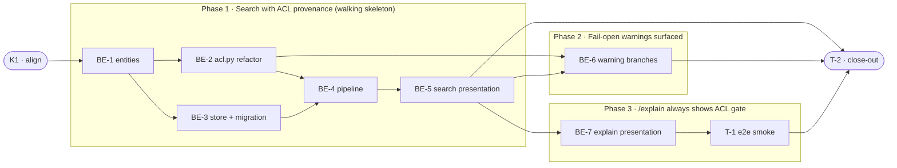

# g15 · Permission-Aware Search Snippets — Task Breakdown

**How to read this file**
- This is the **order view** for [2026-07-15-360-permission-aware-search-snippets-team-plan.md](./2026-07-15-360-permission-aware-search-snippets-team-plan.md) — every task is a single-role checkbox in execution order, opening with a dependency graph.
- **Phases are vertical slices** set with the **`vertical-slicer` skill**: each delivers a working end-to-end increment (data/model → logic → adapter → presentation → its tests), not a horizontal layer. No separate "integrate" phase.
- Each task carries the **role tag at the end of its title line**, then sub-bullets: **layer · estimate** (decimal hours), **needs · completes**, and a **Tests** block. **needs** = predecessor tasks; **completes** = the scenario `S#` or contract `C#` (from the plan) it makes true.
- **Tests** are tagged by level. **Unit and integration tests belong to the implementing dev** (test-first); **e2e and manual tests are the tester's tasks**. The close-out task writes no tests.
- IDs (`BE-#`/`T-#`/`K#`) are this file's traceability thread; `S#`/`C#`/`Q#` are defined in the plan.
- **Rule:** edit your own tasks freely.

---

## References

- **Plan:** [2026-07-15-360-permission-aware-search-snippets-team-plan.md](./2026-07-15-360-permission-aware-search-snippets-team-plan.md) — the full team plan (contracts, scenarios, architecture, allocation). **Always read the plan before you start planning the next task** — it holds the context this file only cites (`S#`/`C#`/`Q#`).
- **Brief:** [2026-07-15-360-permission-aware-search-snippets-brief.md](./2026-07-15-360-permission-aware-search-snippets-brief.md) — the source feature brief behind the plan.

---

## Task Breakdown

Single-role tasks in execution order, grouped into **vertical slices**.

### Dependency graph

### Phase 0 · Kickoff *(prerequisite; the one cross-cutting step)*

- [x] **K1** — Agree the Contracts and Scenarios with the team #team
    - — · 0.5h
    - completes C1, C2, C3, C4, C5, C6
    - Tests

### Phase 1 · Search with ACL provenance *(walking skeleton: ingest a doc, search with `acl_context=true`, get `acl_gate` with correct source — end-to-end through all layers)*

- [x] **BE-1** — Add `acl_source`, `acl_sidecar_path`, `acl_warning` fields to `ChunkRecord`, `SearchResult`, `ScoredSearchCandidate` #backend-role
    - Entities · 1.5h
    - needs K1 · completes C5
    - Tests
        - [x] #unit_test — `test_chunk_record_has_provenance_fields` — `ChunkRecord` accepts and stores all three provenance fields; `acl_warning` defaults to `[]` via `field(default_factory=list)`, never bare `= []`
        - [x] #unit_test — `test_search_result_has_provenance_fields` — `SearchResult` carries the three fields with correct defaults
        - [x] #unit_test — `test_scored_candidate_has_provenance_fields` — `ScoredSearchCandidate` carries the three fields with correct defaults

- [x] **BE-2** — Refactor `acl.py`: add `AclResolutionResult` dataclass; change `resolve_acl()` to return it; change `read_acl_sidecar()` to include `source` and `sidecar_path` in its return; change `parse_acl_value()` to return `(acl, warnings)`; wire the both-present shadowing warning into `AclResolutionResult.warnings` #backend-role
    - Interface Adapters · 3.0h
    - needs BE-1 · completes C4, S4, S4f
    - Tests
        - #unit_test — `test_aclresult_dataclass_fields` — `AclResolutionResult` has `acl`, `source`, `sidecar_path`, `warnings`
        - #unit_test — `test_resolve_acl_frontmatter_returns_source` — front-matter ACL yields `source='frontmatter'`, `sidecar_path=None`
        - #unit_test — `test_resolve_acl_sidecar_returns_source_and_path` — sidecar ACL yields `source='sidecar'`, `sidecar_path` set to the absolute sidecar path
        - #unit_test — `test_resolve_acl_no_rule_returns_none_source` — no front-matter key and no sidecar yields `source=None`
        - #unit_test — `test_resolve_acl_shadowing_warning` — both front-matter and sidecar present → `source='frontmatter'`, `sidecar_path=None`, `warnings` non-empty (S4f)
        - #unit_test — `test_sidecar_too_large_warning_surfaced` — sidecar exceeding 64 KB yields non-empty `warnings` propagated into `AclResolutionResult` (S4)
        - #unit_test — `test_parse_acl_value_returns_tuple` — `parse_acl_value()` now returns `(list | None, list[str])` in all branches

- [x] **BE-3** — Add three nullable columns to `_schema()`; implement `migrate_acl_provenance()`; wire it into `_run_startup_migrations()` and `_all_migrations()`; update `_do_ingest` with `has_acl_provenance_cols` guard; update `_hybrid_search_with_trace` candidate builder to read the three columns from LanceDB rows #backend-role
    - Frameworks & Drivers · 3.0h
    - needs BE-1 · completes C6, S10, S11, S12
    - Tests
        - [x] #unit_test — `test_schema_contains_acl_provenance_fields` — `_schema()` includes `acl_source` (utf8 nullable), `acl_sidecar_path` (utf8 nullable), `acl_warning` (list<utf8> nullable)
        - [x] #integration_test — `test_migrate_acl_provenance_idempotent` — running migration twice on a real LanceDB collection leaves columns present exactly once and does not raise (S10)
        - [x] #integration_test — `test_do_ingest_guard_drops_provenance_on_unmigrated_table` — `_do_ingest` on a table lacking provenance columns logs WARNING and does not crash; ingest succeeds (S11)
        - [x] #integration_test — `test_startup_migration_runs_on_server_start` — `make_real_app` lifespan triggers migration; old rows survive with `acl_source=null`; new ingest populates columns (S12)
        - [x] #integration_test — `test_candidate_builder_reads_provenance_from_row` — `ScoredSearchCandidate` built from a row with provenance values carries them; pre-migration null row yields `None`/`[]` without error

- [x] **BE-4** — Update `pipeline.py` `ingest_file` (line 457) to handle `AclResolutionResult`: set `acl_source`, `acl_sidecar_path`, `acl_warning` on every `ChunkRecord`; synthesize `source='collection_default'` when no rule was configured; relativize `acl_sidecar_path` to `collection_root` or fall back to basename; update `_candidate_to_search_result` to propagate the three provenance fields into `SearchResult` #backend-role
    - Use Cases · 3.0h
    - needs BE-2, BE-3 · completes S1, S2, S3, S8, S9, S14
    - Tests
        - #unit_test — `test_ingest_sets_frontmatter_source` — `ChunkRecord` carries `acl_source='frontmatter'` after ingesting a doc with `_acl:` front-matter
        - #unit_test — `test_ingest_sets_sidecar_source` — `ChunkRecord` carries `acl_source='sidecar'` and non-None `acl_sidecar_path` after ingesting a doc with a `.acl` sidecar
        - #unit_test — `test_ingest_sets_collection_default` — `ChunkRecord` carries `acl_source='collection_default'` when neither front-matter key nor sidecar file exists
        - #unit_test — `test_sidecar_path_relative_to_collection_root` — when `collection_root` is set, `acl_sidecar_path` is relative (no leading `/`); when `collection_root=None`, path is basename only and `acl_warning` contains truncation notice (S14)
        - #unit_test — `test_candidate_to_search_result_propagates_provenance` — `_candidate_to_search_result` copies all three provenance fields from `ScoredSearchCandidate` to `SearchResult`
        - #integration_test — `test_ingest_sidecar_then_search_provenance_round_trip` — ingest a doc with sidecar, search, confirm `SearchResult` carries correct provenance; `acl_sidecar_path` is not an absolute path (S1)
        - #integration_test — `test_pre_g15_chunk_source_null` — a chunk written without provenance columns returns `acl_source=None` from search, no error (S8)
        - #integration_test — `test_multi_collection_each_result_has_own_gate` — multi-collection search; each result carries its own provenance (S9)

- [x] **BE-5** — Add `AclGateSchema` to `archon_search/server/schemas.py`; add `acl_context: bool = False` to `SearchRequest` in `routes_search.py`; add `acl_gate: AclGateSchema | None = None` to `SearchResultSchema`; build `acl_gate` conditionally from `SearchResult` provenance when `acl_context=true` in the search handler; regenerate OpenAPI snapshot #backend-role
    - Presentation · 3.0h
    - needs BE-4 · completes C1, C3, S5, S7, S13
    - Tests
        - [x] #unit_test — `test_acl_gate_schema_fields` — `AclGateSchema` has `allowed_principals`, `source`, `sidecar_path`, `warnings`; `warnings` is always a non-null list; `source` is `Literal["frontmatter","sidecar","collection_default"] | None`
        - [x] #unit_test — `test_search_request_acl_context_default_false` — `SearchRequest` without `acl_context` defaults to `False`
        - [x] #unit_test — `test_search_result_schema_acl_gate_absent_by_default` — `SearchResultSchema.acl_gate` is `None` when `acl_context=False` (S5)
        - [x] #integration_test — `test_search_acl_context_false_no_gate` — `POST /search` without `acl_context` returns no `acl_gate`; response byte-for-byte compatible with pre-G15 (S5)
        - [x] #integration_test — `test_search_acl_context_true_has_gate` — `POST /search` with `acl_context=true` returns `acl_gate` on every result with all four fields present
        - [x] #integration_test — `test_acl_context_and_include_metadata_independent` — `acl_context=true` with `include_metadata=false` still returns `acl_gate`; `metadata` field absent (S13)
        - [x] #integration_test — `test_excluded_chunks_absent_with_acl_context` — chunks the caller cannot see are absent from results even when `acl_context=true` (S7)
        - [x] #unit_test — `test_openapi_snapshot_updated` — `test_openapi_snapshot.py` passes after regenerating with `--update-openapi-snapshot`

### Phase 2 · Fail-open warnings surfaced *(any caller can now see exactly why a chunk fell open)*

- [ ] **BE-6** — Refactor `parse_acl_value()` to return non-empty `warnings` for every remaining fail-open branch: invalid type (bool/other), non-string list elements, invalid namespace names, deny-all mixed with only invalid entries; refactor `read_acl_sidecar()` to return non-empty `warnings` for: symlink, UTF-8 decode failure, invalid namespace names in sidecar file #backend-role
    - Interface Adapters · 3.0h
    - needs BE-2, BE-5 · completes S4a, S4b, S4c, S4d, S4e
    - Tests
        - #unit_test — `test_parse_acl_bool_returns_warning` — `parse_acl_value` with a `bool` value returns `(None, [non-empty warning])` (S4a/S4e)
        - #unit_test — `test_parse_acl_other_type_returns_warning` — `parse_acl_value` with e.g. an int returns `(None, [non-empty warning])` (S4a)
        - #unit_test — `test_parse_acl_non_string_elements_returns_warning` — list with non-string elements returns warning
        - #unit_test — `test_parse_acl_invalid_namespace_names_returns_warning` — list with invalid namespace names returns warning
        - #unit_test — `test_parse_acl_deny_all_mixed_invalid_returns_warning` — deny-all plus invalid entries → `(None, [non-empty warning])` (S4d)
        - #unit_test — `test_read_sidecar_symlink_returns_warning` — symlink sidecar yields `(None, [non-empty warning])` (S4b)
        - #unit_test — `test_read_sidecar_utf8_failure_returns_warning` — non-UTF-8 sidecar bytes yield `(None, [non-empty warning])` (S4c)
        - #unit_test — `test_read_sidecar_invalid_namespace_returns_warning` — sidecar with invalid namespace line yields warning
        - #integration_test — `test_search_acl_gate_warnings_surfaced_for_invalid_frontmatter` — ingest a doc with invalid-type `_acl`, search with `acl_context=true`; `acl_gate.warnings` non-empty (S4e)
        - #integration_test — `test_search_acl_gate_warnings_surfaced_for_symlink_sidecar` — ingest a doc with a symlinked sidecar; `acl_gate.warnings` non-empty (S4b)
        - #integration_test — `test_search_acl_gate_warnings_deny_all_mixed_invalid` — ingest a doc whose sidecar has deny-all mixed with invalid entries; `acl_gate.warnings` non-empty (S4d)

### Phase 3 · `/explain` always shows ACL gate *(explain callers always get full ACL provenance without a flag)*

- [ ] **BE-7** — Add `acl_gate: AclGateSchema` (non-nullable) to `ExplainResult` in `routes_explain.py`; update `ExplainResult.from_candidate()` to build `AclGateSchema` unconditionally from `ScoredSearchCandidate` provenance fields; confirm `ExplainNearMiss` does not carry `acl_gate` (`extra="forbid"` already enforced); regenerate OpenAPI snapshot #backend-role
    - Presentation · 2.0h
    - needs BE-5 · completes C2, S6, S7a
    - Tests
        - #unit_test — `test_explain_result_has_acl_gate` — `ExplainResult` carries `acl_gate` (non-nullable); `ExplainNearMiss` does not
        - #unit_test — `test_explain_result_from_candidate_builds_gate` — `ExplainResult.from_candidate()` populates all `AclGateSchema` fields from candidate provenance
        - #integration_test — `test_explain_acl_gate_unconditional` — `POST /explain` returns `acl_gate` on every `ExplainResult` with no flag required; `ExplainNearMiss` items carry no `acl_gate` (S6)
        - #integration_test — `test_explain_excluded_chunks_absent` — chunks the caller cannot see are absent from `ExplainResult` and `ExplainNearMiss` when `POST /explain` is called (S7a)
        - #unit_test — `test_openapi_snapshot_updated_explain` — `test_openapi_snapshot.py` passes after regenerating with `--update-openapi-snapshot`

- [ ] **T-1** — e2e smoke: `POST /explain` always returns `acl_gate` on every `ExplainResult`; `ExplainNearMiss` items do not carry it #tester-role
    - — · 1.5h
    - needs BE-7 · completes S6
    - Tests
        - #e2e_test — `test_e2e_explain_acl_gate_always_present` — via real `archon-search serve` subprocess: ingest a doc, call `POST /explain`, assert every result in `results[]` has `acl_gate` with all four fields; assert no item in `near_misses[]` has an `acl_gate` key

### Phase 4 · Close-out

- [ ] **T-2** — Project close-out & acceptance fact-check #tester-role
    - — · 4.0h
    - needs BE-1, BE-2, BE-3, BE-4, BE-5, BE-6, BE-7, T-1 · completes (acceptance gate)
    - Tests
    - Duties
        - Update all documentation per [2026-07-15-360-permission-aware-search-snippets-team-plan.md](./2026-07-15-360-permission-aware-search-snippets-team-plan.md)'s "Documentation update" section — [150_security_and_privacy_architecture.md](../Architecture/150_security_and_privacy_architecture.md), [600_api_reference_or_public_interface.md](../Architecture/600_api_reference_or_public_interface.md), [03_world_class_roadmap.md](./03_world_class_roadmap.md) (three-way source enum), [CLAUDE.md](../../CLAUDE.md) (acl_gate + migrate_acl_provenance); confirm [BREAKING.md](../../BREAKING.md) needs no entry.
        - Fix all build / compiler warnings, if any.
        - Run the full test suite (`uv run pytest`); fix every failing test, including any unrelated to this feature.
        - Validate every Acceptance criterion one-by-one (from the plan) with a fact check — no assumptions; confirm each is genuinely done.

**Critical path:** K1 → BE-1 → BE-2 → BE-4 → BE-5 → BE-7 → T-1 → T-2. BE-3 runs in parallel with BE-2 (both need BE-1 only). BE-6 runs in parallel with BE-7 and T-1.
