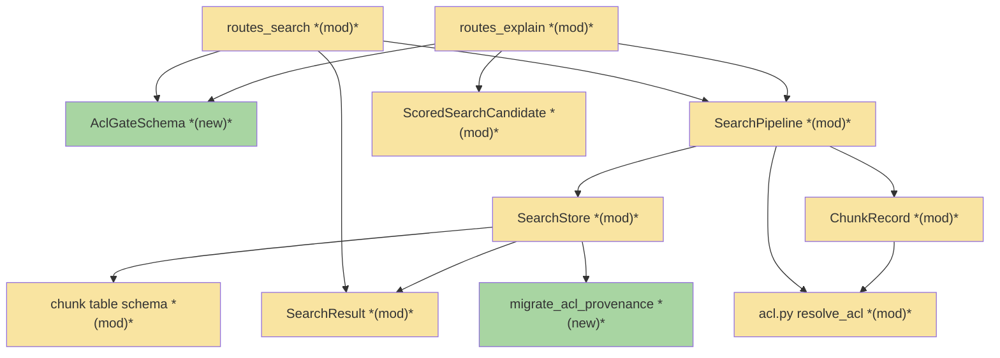
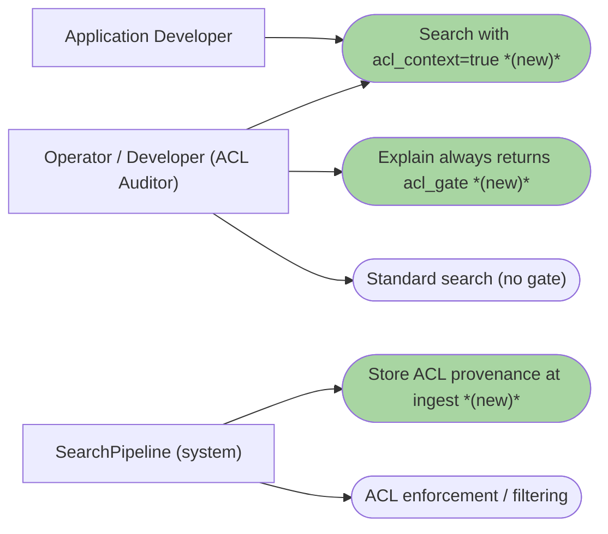
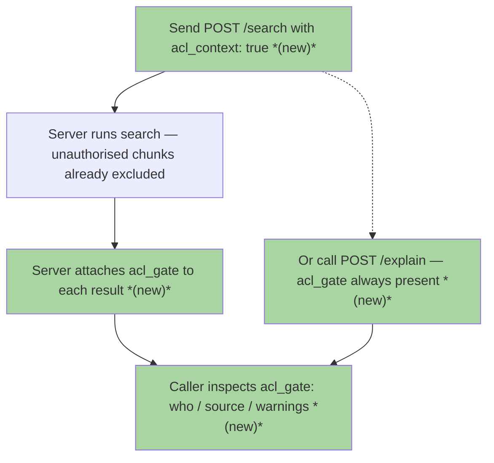
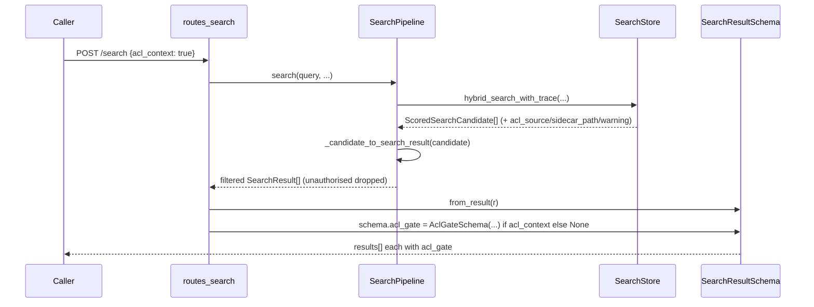
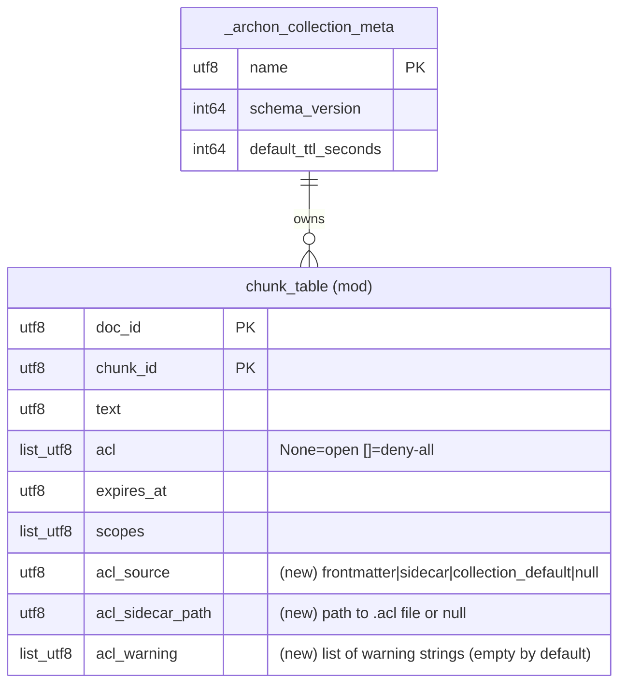

# g15 · Permission-Aware Search Snippets — Team Plan

**How to read this file**
- **Architecture approach:** Clean Architecture. **Layers:** Presentation · Use Cases · Interface Adapters · Entities · Frameworks & Drivers. Dependencies point inward.
- **Contract tooling:** TypeSpec **1.13.0** is available. HTTP/API seams are authored as TypeSpec HTTP services under [api-contracts/](./api-contracts/) and emit an `openapi.yaml`; internal logical seams are authored as core-construct `.tsp` beside this plan.
- This is a **pure backend** feature — there is no frontend. The Frontend section is marked N/A.
- The **Backend and Tester** sections are the **depth view** — each role's scope, grouped by layer.
- **Role tags** (`#backend-role`, `#tester-role`) mark each role-owned section.
- IDs (`S#` scenarios, `C#` contracts, `Q#` questions) are the traceability thread.
- **Tasks** are not in this file — task breakdown is a separate downstream step that consumes this plan.
- **Rule:** change a contract only by team agreement.

---

## Background

Every search result already carries the raw `acl` list (allowed namespace names), but nothing tells a caller *where* that rule came from or *whether it failed to load*. An intentionally-open chunk and a chunk that fell open because its `.acl` sidecar was too large look identical on the wire.

---

## Goal

After this ships: a caller adds `acl_context: true` to `POST /search` and every returned result carries an `acl_gate` object — `allowed_principals`, `source`, `sidecar_path`, `warnings`. `POST /explain` includes `acl_gate` on every result unconditionally. Provenance is captured at ingest into three new nullable per-chunk columns. Chunks the caller cannot see stay excluded exactly as before.

---

## Scope

### In Scope
- `acl_context: bool` (default `false`) on `POST /search`.
- `acl_gate` on every search result when `acl_context=true`: `allowed_principals: list[str] | null`, `source: "frontmatter" | "sidecar" | "collection_default" | null`, `sidecar_path: str | null` (relative to `collection_root` when available, otherwise basename-only; see Q3), `warnings: list[str]`.
- `acl_gate` added unconditionally to `POST /explain` `ExplainResult`; **not** added to `ExplainNearMiss` (near-misses are ranking rejects, not ACL rejects).
- `acl_context` and `include_metadata` are independent flags; `include_metadata=false` does not suppress `acl_gate`.
- Three new nullable per-chunk columns captured at ingest: `acl_source` (`utf8`), `acl_sidecar_path` (`utf8`), `acl_warning` (`list<utf8>`).
- `resolve_acl()` extended to return a named `AclResolutionResult` dataclass (`acl`, `source`, `sidecar_path`, `warnings`). The 'both front-matter and sidecar present' case (`acl.py:251`) — front-matter wins, sidecar shadowed — IS surfaced into `acl_gate.warnings` (the resolver already touches this code; the sidecar's existence is audit-relevant). `source` stays `'frontmatter'`, `sidecar_path` stays `null` (the shadow sidecar was not used).
- `parse_acl_value` and `read_acl_sidecar` refactored to surface **all** fail-open cases as structured warnings — covers ALL `logger.warning`-then-fail-open branches including: sidecar-too-large, invalid type, mixed deny-all, symlink, UTF-8 decode, non-string list elements, invalid namespace names, and deny-all-mixed-with-invalid. Every `logger.warning` call in those functions that results in a fail-open becomes a returned warning.
- Three new columns added via `migrate_acl_provenance`, added to the hardcoded `_run_startup_migrations()` call list (mirrors `migrate_acl`'s startup-application pattern); `introduced_at=0` in `_all_migrations()` is a catalog record only; no `STORE_SCHEMA_VERSION` bump.
- Tests for sidecar, front-matter, collection-default, and all warning cases; confirm excluded chunks stay excluded even with `acl_context=true`.

### Out of Scope
- Filtering search results by ACL source or warning (belongs to future ACL policy feature E6).
- Admin-only view of principals — no privileged tier exists in the current auth model.
- MCP `search` tool support for `acl_context` — deferred to a follow-up.
- Backfill of the three columns for pre-G15 chunks — re-indexing is the only path.

---

## Acceptance criteria
- `POST /search` accepts `acl_context: bool` (default `false`); default runs are byte-for-byte unchanged (no `acl_gate` emitted).
- With `acl_context=true`, every result carries `acl_gate` with the four fields.
- `POST /explain` always carries `acl_gate` on `ExplainResult`, with no flag; `ExplainNearMiss` does not carry `acl_gate`.
- `acl_context=true` and `include_metadata=false` are independent; `acl_gate` is returned regardless of `include_metadata`.
- `acl_gate.source` is one of `"frontmatter"`, `"sidecar"`, or `"collection_default"` (three-way enum) and is correct for each case.
- `acl_gate.warnings` is a list; non-empty for any fail-open case — covers ALL `logger.warning`-then-fail-open branches in `parse_acl_value` and `read_acl_sidecar`: sidecar-too-large, invalid type, mixed deny-all, symlink, UTF-8 decode, non-string list elements, invalid namespace names, and deny-all-mixed-with-invalid.
- `acl_gate.warnings` is non-empty when both front-matter `_acl` and an `.acl` sidecar exist simultaneously (shadowing case); `source` is `'frontmatter'` and `sidecar_path` is `null` in that case.
- `acl_gate.sidecar_path`: when `collection_root` is available, it is relative to `collection_root` (no absolute prefix); when not available (REST/MCP ingest paths), it is the basename only. Never an absolute path.
- Chunks the caller cannot see remain excluded from results even when `acl_context=true`.
- Pre-G15 chunks return `acl_gate` with `source: null` (schema consistent; provenance unknown).
- Three new columns are added per-collection at server startup with no global `STORE_SCHEMA_VERSION` bump.
- All tests pass; store SQL uses `_where_eq`/`_where_in` (no f-strings).
- `allowed_principals` in `acl_gate` is visible to any authenticated caller with `acl_context=true` — this intentionally exposes who else can access a chunk. In multi-tenant deployments, this leaks cross-tenant principal names. Documented accepted trade-off; no privilege gate in current auth model.

---

## What does NOT change
- The raw `acl` field already on every `SearchResultSchema` / `ExplainResult` — unchanged and still present.
- `apply_acl_filter` exclusion behaviour — deny-all and unauthorised chunks are dropped before `acl_gate` is ever constructed.
- The pool-wide `acl_filtered: bool` flag on `SearchResponse` / `ExplainResponse`.
- Fail-open ACL semantics in `resolve_acl` (`None` on any parse error).
- MCP `search` tool — no `acl_context`, no `acl_gate`.
- The `_archon_collection_meta` table — the three new columns are chunk-table-only.

---

## Known limitations / accepted trade-offs
- Pre-G15 chunks permanently show `null` provenance; only re-indexing populates them.
- `allowed_principals` returns the full allow-list (who else has access) — intentional for audit; leaks namespace names in a shared multi-tenant deployment (documented future concern, not addressed here).

---

## Approach & architecture

The feature threads a provenance triple (`acl_source`, `acl_sidecar_path`, `acl_warning`) from ingest-time ACL resolution through the persistence layer and back out as an `acl_gate` audit object on the wire. Every seam falls on a Clean Architecture layer boundary; no reverse dependency is introduced.

### Architecture

_Scope limited to change neighbourhood: the full component set exceeds 15 nodes; unchanged peers (`SearchRequest`, `SearchResultSchema`, `ExplainResult`, `ExplainNearMiss`, `filters.py`, `mcp.py`) are elided. All shown nodes are changed except where they anchor a changed edge._

| Component | Change | Why |
|-----------|--------|-----|
| `AclGateSchema` | new | Pydantic model for the `acl_gate` sub-object; referenced by both search and explain schemas |
| `migrate_acl_provenance` | new | Idempotent `add_columns` migration for the three nullable columns on each chunk table |
| `routes_search` | modified | Add `acl_context` to `SearchRequest`; build `acl_gate` per result when flag set |
| `routes_explain` | modified | Add `acl_gate` unconditionally to `ExplainResult`; `ExplainNearMiss` does not carry `acl_gate` |
| `SearchPipeline` | modified | Set provenance on `ChunkRecord` at ingest; propagate it through candidate→result conversion |
| `acl.py` (`resolve_acl`) | modified | Return `source` + `sidecar_path` alongside `(acl_entries, warnings)` |
| `SearchStore` | modified | Add three columns to `_schema()`; write them in `_do_ingest`; read them in result builders |
| `SearchResult` / `ChunkRecord` / `ScoredSearchCandidate` | modified | Gain `acl_source`, `acl_sidecar_path`, `acl_warning` |
| chunk table schema | modified | Three new nullable `utf8` columns |

**Layer map (and role mapping)**

| Layer | Role | Components |
|-------|------|-----------|
| Presentation | **Backend** | `routes_search`, `routes_explain`, `AclGateSchema` |
| Use Cases | Backend | `SearchPipeline` (ingest capture, search/explain paths) |
| Interface Adapters | Backend | `acl.py` (`resolve_acl`, `read_acl_sidecar`) |
| Entities | Backend | `SearchResult`, `ChunkRecord`, `ScoredSearchCandidate` |
| Frameworks & Drivers | Backend | `SearchStore`, `migrate_acl_provenance`, LanceDB chunk table |

**What changes**
- `resolve_acl()` returns a named result carrying `source` and `sidecar_path` (Interface Adapter).
- `SearchPipeline.ingest_file()` sets the three provenance fields on every `ChunkRecord` (Use Case).
- `SearchStore` persists and reads three new nullable columns; `_do_ingest` guards the write with a `has_acl_provenance_cols` check (same write-guard pattern as `has_ttl_cols`) (Frameworks & Drivers).
- The route layer builds `acl_gate` from provenance fields — conditionally on `/search`, always on `/explain` (Presentation).

**Key decisions (from the brief)**
- Store provenance at ingest, not re-derive at query time — the sidecar file may be gone by search time.
- Always return `acl_gate` when the flag is set — `source: "collection_default"` makes open-by-default explicit vs. `source: null` (pre-G15, unknown).
- Return the full `allowed_principals` list — intentional for audit.
- Per-chunk `acl_warning` — distinguishes "intentionally open" from "open because the rule failed to load".

### Actors & Use Cases

### Flows

#### User Flow

#### Data Flow

```mermaid
flowchart LR
  classDef newNode fill:#a8d5a2;
  classDef modNode fill:#f9e4a1;
  classDef rmNode fill:#f4a4a4;

  ING["ingest_file *(mod)*"]
  ACL["resolve_acl *(mod)*"]
  CR["ChunkRecord *(mod)*"]
  TBL["chunk table *(mod)*"]
  SS["SearchStore *(mod)*"]
  SC["ScoredSearchCandidate *(mod)*"]
  SR["SearchResult *(mod)*"]
  RS["routes_search *(mod)*"]
  AGS["acl_gate *(new)*"]

  ING -- "resolve" --> ACL
  ACL -- "acl, source, sidecar_path, warnings" --> ING
  ING -- "set provenance" --> CR
  CR -- "write 3 columns" --> TBL
  TBL -. "read on search" .-> SS
  SS -- "populate provenance on candidates" --> SC
  SC -- "_candidate_to_search_result" --> SR
  SR -- "map fields" --> RS
  RS -- "build" --> AGS

  class ING modNode;
  class ACL modNode;
  class CR modNode;
  class TBL modNode;
  class SS modNode;
  class SC modNode;
  class SR modNode;
  class RS modNode;
  class AGS newNode;
```

#### Sequence

> **Note:** This diagram shows the `/search` path only; the `/explain` path is analogous but builds `AclGateSchema` unconditionally without the `acl_context` flag check.

### Prior decisions

| Decision | Rationale | Constraint |
|---|---|---|
| Use LanceDB as the local vector store (ADR-01) | Zero-deployment, file-backed; `migrate_acl` is the precedent for idempotent per-collection column adds | G15 follows lazy-startup migration: auto-applied at server startup via `_run_startup_migrations()` hardcoded call (same as `migrate_acl`); `introduced_at=0` is catalog-only. Columns are purely additive (null = unknown for pre-G15 rows). No `STORE_SCHEMA_VERSION` bump |
| Opt-in local telemetry, no raw query (ADR-05) | Structural privacy guarantee | `acl_gate` fields carry no query text and are safe to log; `allowed_principals` (namespace names) are not raised to raw-query sensitivity — no change to telemetry factory methods |

### Contradictions

**Code vs. docs**

| Contradiction | Code says | Doc says | Owner |
|---|---|---|---|
| `source` enum cardinality | `resolve_acl` (`acl.py:249-259`) distinguishes front-matter from sidecar in its control flow (three-way is derivable) | [03_world_class_roadmap.md](./03_world_class_roadmap.md) uses two-way `"sidecar"` covering both | doc needs updating |

*Resolved (Q2):* three-way enum (`frontmatter | sidecar | collection_default`) is correct and will be implemented. The roadmap acceptance line must be updated to match — see Documentation update.

**Brief vs. reality**

| Contradiction | Brief assumes | Reality | Owner |
|---|---|---|---|
| `acl_warning` captures all ACL load problems | Per-chunk warning records "any problems that occurred when loading the access rule" | Only the sidecar-too-large case reaches `resolve_acl`'s returned `warnings`; invalid types, mixed deny-all, symlink, and UTF-8 failures are `logger.warning`-only and never returned | in-scope work |

*Resolved (Q7):* `parse_acl_value` and `read_acl_sidecar` will be refactored to surface all fail-open cases as structured return values rather than logger-only calls. This is in scope for G15 — the warning field must cover all cases or it actively misleads auditors.

---

## Contracts / seams

Boundaries where the change must stay coherent. **Logical, not code.** Authored with TypeSpec (available): the HTTP/API seams are one TypeSpec HTTP service that emits an `openapi.yaml`; the internal seams are core-construct `.tsp` validated with `--no-emit`. Changing a contract requires team agreement.

**C1 — `POST /search` request/response**  *(Caller ↔ Presentation, HTTP/API)*
`SearchRequest` gains `acl_context: bool = false`. `SearchResultSchema` gains `acl_gate: AclGateSchema | null` (null unless flag set). Backward-compatible additive change. — see [2026-07-15-360-permission-aware-search-snippets.tsp](./api-contracts/2026-07-15-360-permission-aware-search-snippets.tsp) + [2026-07-15-360-permission-aware-search-snippets.openapi.yaml](./api-contracts/2026-07-15-360-permission-aware-search-snippets.openapi.yaml)

**C2 — `POST /explain` request/response**  *(Caller ↔ Presentation, HTTP/API)*
`ExplainResult` gains `acl_gate: AclGateSchema`, always present, no flag. `ExplainNearMiss` does **not** carry `acl_gate` — near-misses are ranking rejects, not access-controlled results. `extra="forbid"` means the field is an explicit addition. The `/explain` path applies `apply_acl_filter` on candidates before `ExplainResult` assembly, same as `/search` — exclusion is inherited (verified: `_explain_standard` at `pipeline.py:2523` and the RAG-fusion explain path at `pipeline.py:1987` both call `apply_acl_filter` before slicing `top_results`/`near_misses`). Add an S-level test asserting excluded chunks are absent from `/explain` results (extends S7 to cover the explain path) — see scenario S7a. — same `.tsp` + `openapi.yaml` as C1.

**C3 — `AclGateSchema` model**  *(Presentation, HTTP/API)*
New Pydantic model, placed in [schemas.py](../../archon_search/server/schemas.py) as a shared leaf model. Note: `SearchResultSchema` lives in `routes_search.py` and `ExplainResult` in `routes_explain.py`; both routes must add `from archon_search.server.schemas import AclGateSchema` to gain the type. Fields: `allowed_principals: list[str] | None`, `source: Literal["frontmatter","sidecar","collection_default"] | None`, `sidecar_path: str | None` (relative to `collection_root` when available, otherwise basename-only; see Q3), `warnings: list[str]` (pre-G15 rows write null for `acl_warning` in LanceDB; store result-builders must coerce null → `[]` when reading, same pattern as `scopes` column; `AclGateSchema.warnings` is always non-null on the wire; must not use bare `= []` in dataclasses — use `field(default_factory=list)`; Pydantic schema uses `Field(default_factory=list)`). — modelled as `AclGate` in the C1/C2 `.tsp`.

**C4 — `resolve_acl()` return type**  *(Interface Adapter, internal)*
Three function signatures change (all in `acl.py`):
1. `parse_acl_value(raw, doc_path)` → currently returns `list[str] | None`; after refactor returns `(list[str] | None, list[str])` (acl_entries, warnings). This is the load-bearing change — 6 fail-open branches live here. Verify via grep that `parse_acl_value` is only called from within `resolve_acl` before proceeding — if it has other callers, all must be updated. Current expected: called only at `acl.py:257` inside `resolve_acl`.
2. `read_acl_sidecar(doc_path)` → already returns `(list[str] | None, list[str])`; gains `source` and `sidecar_path` in the result. Actual signature is `read_acl_sidecar(doc_path: Path)` — one parameter only, no `data_dir`.
3. `resolve_acl(doc_path, front_matter_acl)` → widens to return `AclResolutionResult(acl, source, sidecar_path, warnings)`. Actual signature is `resolve_acl(doc_path: Path, front_matter_acl: Any)` — two parameters only, no `data_dir`. Must thread `parse_acl_value`'s returned warnings through both paths: front-matter branch (`acl.py:257`) currently hard-codes `warnings=[]` — must be replaced with the warnings `parse_acl_value` returns; sidecar branch already propagates warnings.
4. The both-present shadowing branch at `acl.py:251` (front-matter and sidecar both exist; front-matter wins) must ALSO append its warning to `AclResolutionResult.warnings`. This warning is generated by `resolve_acl` itself — NOT by `parse_acl_value` — so it is NOT covered by the `parse_acl_value` threading step. `resolve_acl` must append it to the collected warnings before returning. `source` stays `'frontmatter'`, `sidecar_path` stays `null` (the shadow sidecar was not used).
Note: `source` must be set independently of the acl value — fail-open branches that return `acl=None` still set `source='frontmatter'` or `source='sidecar'` (plus non-empty warnings) to distinguish 'rule was present but failed' from `source='collection_default'` (no rule at all). The `collection_root`-based relativization of `acl_sidecar_path` (see Q3) happens in `pipeline.py` at the `resolve_acl` call site (which already has `collection_root` as a parameter), NOT inside `resolve_acl` itself — this keeps `resolve_acl` corpus-layout-agnostic. `resolve_acl` returns the absolute sidecar path; `pipeline.py` performs the `relative_to` / basename fallback before writing to `ChunkRecord`.
Single production call site: `pipeline.py:457`. — see [2026-07-15-360-permission-aware-search-snippets-internal-seams.tsp](./2026-07-15-360-permission-aware-search-snippets-internal-seams.tsp) (`AclResolutionResult`).

**C5 — Provenance fields on the three dataclasses**  *(Entities, internal)*
`SearchResult`, `ChunkRecord`, `ScoredSearchCandidate` each gain `acl_source: str | None`, `acl_sidecar_path: str | None`, `acl_warning: list[str]` (default `field(default_factory=list)` — must not use bare `= []` in dataclasses), propagated through `_candidate_to_search_result()`. Note: provenance fields are read from LanceDB rows in the store's candidate-builder code (inside `hybrid_search_with_trace`), then copied through `_candidate_to_search_result()`. The store-side read sites (`store.py` candidate construction from rows) are the load-bearing seam and must be modified to read the three columns. The store-side candidate-builder code (the row-to-`ScoredSearchCandidate` conversion inside `hybrid_search_with_trace`) is the actual read site — it must read `row.get('acl_source')`, `row.get('acl_sidecar_path')`, `row.get('acl_warning')` with null-safety, and set them on each `ScoredSearchCandidate`. Pre-migration rows and rows with null values must yield `None`/`[]` without error. — same internal-seams `.tsp` (`AclProvenanceFields`).

**C6 — LanceDB chunk-table columns + migration**  *(Frameworks & Drivers, internal — persistence)*
Two nullable `utf8` columns (`acl_source`, `acl_sidecar_path`) and one nullable `list<utf8>` column (`acl_warning`) added via `migrate_acl_provenance` — an idempotent `IN_PLACE add_columns` migration. Migration is added to `_run_startup_migrations()` (hardcoded startup list, mirrors `migrate_acl`). NOT driven by `introduced_at` alone — `introduced_at=0` is a catalog record only. No `STORE_SCHEMA_VERSION` bump. Guarded in `_do_ingest` like the `has_ttl_cols` write-guard pattern. — same internal-seams `.tsp` (`ChunkTableAclColumns`, `ChunkStore`).

---

## Data

**Migration notes**
- Add `acl_source` (`pa.utf8()`, nullable), `acl_sidecar_path` (`pa.utf8()`, nullable), `acl_warning` (`pa.list_(pa.utf8())`, nullable) to each per-collection chunk table via `migrate_acl_provenance` (`IN_PLACE` `add_columns`, idempotent).
- Add `migrate_acl_provenance` to the hardcoded `_run_startup_migrations()` call list in `store.py` (same pattern as `migrate_acl`). The `introduced_at=0` entry in `_all_migrations()` is a catalog record only; startup application requires the explicit hardcoded call.
- Chunk-table-only change → `STORE_SCHEMA_VERSION` does **not** bump (per the CLAUDE.md invariant).
- Pre-G15 rows read `null` for all three; no backfill.
- `_archon_collection_meta` is unchanged.

**Entity model changes**
- `ChunkRecord`, `SearchResult`, `ScoredSearchCandidate` each gain `acl_source: str | None`, `acl_sidecar_path: str | None`, `acl_warning: list[str]` (default `field(default_factory=list)` — must not use bare `= []` in dataclasses).
- `_do_ingest` writes the three columns only when the schema has them (guarded like `has_ttl_cols` write-guard pattern).
- `acl_sidecar_path` is stored relative to `collection_root` when available (stripped via `Path(sidecar_path).relative_to(collection_root)` at ingest time). When `collection_root` is `None` (REST/MCP ingest paths — the majority) or when `relative_to` raises, fall back to basename-only: `try: rel = Path(sidecar).relative_to(collection_root) except (ValueError, TypeError): rel = Path(sidecar).name` and append a truncation notice to `acl_warning`. Note: both `ValueError` (sidecar outside corpus root) and `TypeError` (`collection_root=None`) must be caught — the TypeError case is the normal outcome for REST/MCP ingests, not an edge case. For watcher/sync ingests where `collection_root` is set, the relative path guarantee applies.
- `acl_source='collection_default'` is synthesized in `pipeline.py` at the `ingest_file` call site when `resolve_acl` returns no ACL configured (None acl + no source). It is NOT a branch of `resolve_acl` itself.

---

## Scenarios #tester-role

Behavioural only — step-level detail comes from the tasks. Covers happy, unhappy, edge, and non-functional paths.

| id | Scenario (Given / When / Then) |
|----|--------------------------------|
| **S1** | **Given** a doc ingested with an `.acl` sidecar · **When** searched with `acl_context=true` · **Then** its result carries `acl_gate` with `source="sidecar"`, `sidecar_path` set, correct `allowed_principals`, and `sidecar_path` does not begin with `/` and does not equal the absolute filesystem path |
| **S2** | **Given** a doc ingested with `_acl:` front-matter · **When** searched with `acl_context=true` · **Then** `acl_gate.source="frontmatter"`, `sidecar_path=null` |
| **S3** | **Given** a plain doc with no ACL · **When** searched with `acl_context=true` · **Then** `acl_gate.source="collection_default"`, `allowed_principals=null`, `warnings=[]` |
| **S4** | **Given** a doc whose `.acl` sidecar exceeded 64 KB (fell open) · **When** searched with `acl_context=true` · **Then** `acl_gate.warnings` is non-empty |
| **S4a** | **Given** a doc with an `.acl` sidecar containing an invalid ACL type (e.g. bool) · **When** searched with `acl_context=true` · **Then** `acl_gate.warnings` is non-empty |
| **S4b** | **Given** a doc with a symlinked `.acl` sidecar · **When** searched with `acl_context=true` · **Then** `acl_gate.warnings` is non-empty |
| **S4c** | **Given** a doc with an `.acl` sidecar with a UTF-8 decode failure · **When** searched with `acl_context=true` · **Then** `acl_gate.warnings` is non-empty |
| **S4d** | **Given** a doc with an `.acl` sidecar containing only deny-all entries mixed with invalid entries (all entries invalid → deny-all with no valid principals, fail-open branch) · **When** searched with `acl_context=true` · **Then** `acl_gate.warnings` is non-empty |
| **S4e** | **Given** a doc with `_acl:` front-matter containing an invalid type (fail-open) · **When** searched with `acl_context=true` · **Then** `acl_gate.source='frontmatter'`, `acl_gate.warnings` non-empty |
| **S4f** | **Given** a doc with BOTH `_acl:` front-matter AND an `.acl` sidecar file · **When** searched with `acl_context=true` · **Then** `acl_gate.source='frontmatter'`, `sidecar_path=null`, `warnings` non-empty (shadowing warning present) |
| **S5** | **Given** any search · **When** `acl_context` omitted (default false) · **Then** no `acl_gate` on any result; response otherwise unchanged |
| **S6** | **Given** any `/explain` call · **When** run with no flag · **Then** every result carries `acl_gate` |
| **S7** | **Given** chunks the caller's namespace cannot see · **When** searched with `acl_context=true` · **Then** those chunks are absent from results (never gated) |
| **S7a** | **Given** chunks the caller's namespace cannot see · **When** `POST /explain` is called · **Then** those chunks are absent from `ExplainResult`s and `ExplainNearMiss`es |
| **S8** | **Given** a chunk indexed before G15 (no provenance columns) · **When** searched with `acl_context=true` · **Then** `acl_gate.source=null`, schema still consistent, `acl_gate.warnings` equals `[]` (not `null` — coerced from null column), no error |
| **S9** | **Given** a multi-collection search · **When** run with `acl_context=true` · **Then** each result carries its own `acl_gate`; pool-wide `acl_filtered` unchanged |
| **S10** | **Given** a collection whose chunk table lacks the three columns · **When** the migration path runs · **Then** the columns are added idempotently and re-running is a no-op |
| **S11** | **Given** an ingest into a not-yet-migrated collection · **When** `_do_ingest` runs · **Then** provenance is silently dropped with a WARNING, ingest does not crash, and the WARNING log message is emitted (verifiable via `caplog`) |
| **S12** | **Given** an operator upgrades a server with an existing on-disk database · **When** the server starts and a search runs · **Then** old chunks return `source:null` and survive; new ingests populate the three fields. Can be tested via an integration test: write rows to a pre-migration schema table, then open with new code and assert migration ran, old rows survive with `source:null`, new ingests populate columns. Integration test must explicitly call `await store._run_startup_migrations()` (or use `make_real_app` to run the full lifespan) after setting up the pre-migration schema — bare `SearchStore(...)` construction does NOT trigger startup migrations. |
| **S13** | **Given** a search with `acl_context=true` AND `include_metadata=false` · **When** the response returns · **Then** `acl_gate` is present on every result AND the metadata field is absent (flags are independent) |
| **S14** | **Given** a doc ingested via REST (no `collection_root`) with an `.acl` sidecar · **When** searched with `acl_context=true` · **Then** `acl_sidecar_path` is the basename only (no path separator), ingest does not crash, `warnings` contains the truncation notice |

---

## Frontend — Presentation #frontend-role

N/A — no frontend work for this feature. `archon-search` is a backend-only Python server; the sole HTML surface (`graph_viewer.html`) is unrelated to G15.

---

## Backend — Entities · Use Cases · Adapters · Frameworks #backend-role

**Scope:** all of it — extend `resolve_acl`, add provenance to the three dataclasses, add and migrate three chunk-table columns, capture provenance at ingest, build `acl_gate` on `/search` (flagged) and `/explain` (always). Writes both unit and integration tests for its tasks.
**Owns layers:** Presentation, Use Cases, Interface Adapters, Entities, Frameworks & Drivers.

**Done when**
- [ ] `resolve_acl()` returns `source` and `sidecar_path` alongside acl+warnings; the single call site is updated — S1, S2, S3
- [ ] `SearchResult`, `ChunkRecord`, `ScoredSearchCandidate` carry the three provenance fields end-to-end — S1, S9
- [ ] Three nullable columns added to `_schema()`; `migrate_acl_provenance` adds them idempotently per collection — S10, S11, S12
- [ ] `ingest_file` sets provenance on every chunk record; `_do_ingest` writes columns guarded with a `has_acl_provenance_cols` check (same write-guard pattern as `has_ttl_cols`) — S1, S4, S11
- [ ] `parse_acl_value` and `read_acl_sidecar` surface all fail-open cases as structured warnings — S4, S4a, S4b, S4c, S4d
- [ ] `acl_gate.warnings` includes the shadowing warning when both front-matter and sidecar exist — S4f
- [ ] `AclGateSchema` exists; `SearchRequest.acl_context` and `SearchResultSchema.acl_gate` added; gate built only when flag set; `acl_context=true` and `include_metadata=false` are independent — S1, S3, S5, S13
- [ ] `/explain` always populates `acl_gate` on `ExplainResult`; `ExplainNearMiss` does not carry it; `extra="forbid"` fields declared explicitly — S6
- [ ] Excluded chunks stay excluded; pre-G15 chunks return `source:null` — S7, S7a, S8
- [ ] Store reads use `_where_eq`/`_where_in`, no f-strings
- [ ] OpenAPI snapshot regenerated and `test_openapi_snapshot.py` passes

---

## Tester #tester-role

**Scope:** the tester owns **e2e (smoke) and manual** tests plus the project close-out. **Unit and integration** tests belong to the implementing dev, in each task's `Tests` block.

**Allocation** — each scenario at the cheapest level that proves it *(unit + integration are dev-written; e2e + manual are the tester's tasks)*

| Scenario | Cheapest level |
|----------|----------------|
| S5 | unit + integration |
| S3, S8, S10, S11 | integration |
| S1, S2, S4, S7, S9 | integration |
| S4a, S4b, S4c, S4d, S4e, S4f, S14 | integration |
| S7a | integration |
| S13 | unit + integration |
| S6 | integration + e2e (smoke) |
| S12 | integration |

---

## Documentation update

Docs the feature touches — the tasks file's close-out task works through this list. Real files only.

- [ ] [2026-07-15-360-permission-aware-search-snippets-brief.md](./2026-07-15-360-permission-aware-search-snippets-brief.md) — *no change needed* (source brief)
- [ ] [2026-07-15-360-permission-aware-search-snippets-team-plan.md](./2026-07-15-360-permission-aware-search-snippets-team-plan.md) — *new feature* (this file)
- [ ] [150_security_and_privacy_architecture.md](../Architecture/150_security_and_privacy_architecture.md) — *new feature* — document `acl_source`/`acl_sidecar_path`/`acl_warning` columns and `acl_gate` provenance semantics
- [ ] [600_api_reference_or_public_interface.md](../Architecture/600_api_reference_or_public_interface.md) — *new feature* — add `acl_context` to `SearchRequest`, `acl_gate` to search + explain result schemas
- [ ] [03_world_class_roadmap.md](./03_world_class_roadmap.md) — *contradiction with code* — reconcile the two-way vs. three-way `source` enum in the G15 acceptance line (see Contradictions)
- [ ] [CLAUDE.md](../../CLAUDE.md) — *new feature* — note the `acl_gate` capability and the `migrate_acl_provenance` migration in the store / pipeline sections
- [ ] [BREAKING.md](../../BREAKING.md) — *no change needed* — G15 is additive (backward-compatible); confirm no entry required at close-out
- [ ] OpenAPI snapshot — regenerate `tests/server/openapi_snapshot.json` after adding `AclGateSchema`, `acl_context` to `SearchRequest`, and `acl_gate` to search/explain schemas: `uv run --python 3.12 pytest tests/server/test_openapi_snapshot.py --update-openapi-snapshot --no-cov -n0`

**Consulted (read-only)**
- [A4-explain-endpoint-brief.md](../Completed/A4-explain-endpoint-brief.md) / [A4-explain-endpoint-plan.md](../Completed/A4-explain-endpoint-plan.md) — explain-endpoint design; confirms `ExplainResponse` exists with `extra="forbid"`
- [e0b-silent-failure-transparency-brief.md](../Completed/e0b-silent-failure-transparency-brief.md) — L14 sidecar-warning pattern feeding `acl_warning`
- [B3-server-side-multi-collection-search-brief.md](../Completed/B3-server-side-multi-collection-search-brief.md) — multi-collection ACL filtering and `acl_filtered`
- [01_lancedb_as_local_vector_store.md](../ADRs/01_lancedb_as_local_vector_store.md) / [05_opt_in_local_telemetry_no_raw_query.md](../ADRs/05_opt_in_local_telemetry_no_raw_query.md) — migration + telemetry constraints

---

## Open questions

All questions resolved. Status: `in-progress`.

| id | Area | Decision |
|----|------|----------|
| **Q1** | architecture / data | **Lazy-startup migration** — Add `migrate_acl_provenance` to the hardcoded `_run_startup_migrations()` call list (mirrors `migrate_acl`'s startup-application pattern). Also add to `_all_migrations()` with `introduced_at=0` as a catalog record, same as `migrate_acl`. NOTE: `introduced_at` here is a catalog marker for record-keeping only — startup application is driven by the explicit hardcoded call in `_run_startup_migrations()`, not by `introduced_at`. Columns are purely additive; null = unknown for pre-G15 rows. No `STORE_SCHEMA_VERSION` bump (chunk-table-only exception). No operator action required. |
| **Q2** | feature | **Three-way `source` enum** (`"frontmatter" \| "sidecar" \| "collection_default"`). `resolve_acl` distinguishes `frontmatter` vs `sidecar` in control flow. `collection_default` is NOT a branch of `resolve_acl` — it must be synthesized in `pipeline.py` at the `ingest_file` call site. Rule for `collection_default` synthesis: set `source='collection_default'` **if and only if** no front-matter `_acl` key was present AND no `.acl` sidecar file existed — i.e. no rule was configured at all. If a rule source existed (front-matter key present OR sidecar file existed), set `source='frontmatter'` or `source='sidecar'` respectively, regardless of whether acl parsing succeeded or failed (fail-open cases retain their source type and add warnings when they fail open). This rule is keyed on rule-source *presence*, not on the final acl value or warning emptiness. Fail-open cases (frontmatter/sidecar present but invalid) therefore retain the original `source` value (`'frontmatter'` or `'sidecar'`) with a non-empty `warnings` list — this correctly distinguishes 'intentionally open' (`collection_default`) from 'open because the rule failed' (`frontmatter`/`sidecar` + warnings). Roadmap doc updated accordingly (see Documentation update). |
| **Q3** | security | **Relative to `collection_root` when available; basename-only when `collection_root` is `None` (REST/MCP ingest paths) or when `relative_to` raises.** Implementation: `try: rel = Path(sidecar).relative_to(collection_root) except (ValueError, TypeError): rel = Path(sidecar).name; acl_warning.append('acl_sidecar_path truncated to filename: sidecar outside collection_root or collection_root unavailable')`. Note: for REST/MCP ingests (the majority), `collection_root=None` → `acl_sidecar_path` will be the filename only. This is expected and documented. The relative-path guarantee only applies to watcher/sync ingests where `collection_root` is set. Absolute path is never written to storage or returned on the wire. |
| **Q4** | architecture | **Named `AclResolutionResult` dataclass** (`acl`, `source`, `sidecar_path`, `warnings`). Prevents positional bugs; easy to extend without breaking all call sites. |
| **Q5** | data | **`list<utf8>` column** (`pa.list_(pa.utf8())`). Covers multiple concurrent warnings per chunk; changing from scalar to list later would require a migration. |
| **Q6** | feature | **`ExplainResult` only; not `ExplainNearMiss`.** Near-misses are ranking rejects, not ACL rejects — adding `acl_gate` to them would conflate two distinct reasons a chunk doesn't appear. |
| **Q7** | feature / tests | **All fail-open cases.** `parse_acl_value` and `read_acl_sidecar` are refactored to return structured warnings for every case: sidecar-too-large, invalid type, mixed deny-all, symlink, UTF-8 decode, non-string list elements, invalid namespace names, and deny-all-mixed-with-invalid. The complete set of fail-open branches is defined by the actual `logger.warning` calls in `parse_acl_value` and `read_acl_sidecar` — not a static list. All must surface as returned warnings. Clarification: not all deny-all-related warnings are fail-open. Three `parse_acl_value` branches mention deny-all: (a) deny-all mixed with valid rules → valid rules enforced, ACL is honored (NOT fail-open, NOT in warning surface); (b) deny-all mixed with only invalid entries → `None` returned (fail-open → warning surfaced); (c) sole deny-all reserved word → `[]` returned (deny-all enforced, NOT fail-open, NOT in warning surface). Only branch (b) falls under the Q7 warning-surfacing rule. |
| **Q8** | feature | **Independent flags.** `acl_gate` is always returned when `acl_context=true`, regardless of `include_metadata`. The two flags control different parts of the response. |

*Also resolved: brief open question 4 (does `/explain` already have a Pydantic schema?) — `ExplainResponse` exists in `routes_explain.py:304` with `extra="forbid"`; G15 adds `acl_gate` to `ExplainResult` as an explicit field (C2).*

---

## References

- **Brief:** [2026-07-15-360-permission-aware-search-snippets-brief.md](./2026-07-15-360-permission-aware-search-snippets-brief.md)
- **Tasks:** [2026-07-15-360-permission-aware-search-snippets-tasks.md](./2026-07-15-360-permission-aware-search-snippets-tasks.md)
