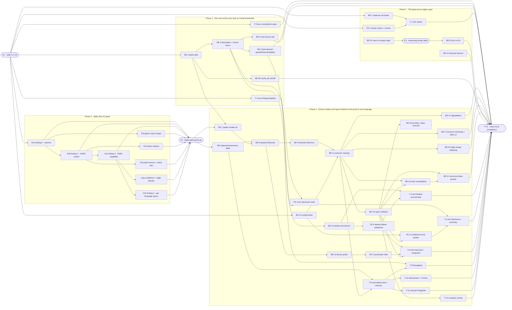

# MGE · Multilingual Graph Extraction Engine — Task Breakdown

**How to read this file**
- This is the **order view** for [2026-08-19-035-multilingual-graph-ner-team-plan.md](./2026-08-19-035-multilingual-graph-ner-team-plan.md) — every task is a single-role checkbox in execution order, opening with a dependency graph.
- **Sliced with the `vertical-slicer` skill.** Each phase delivers a working end-to-end increment, not a horizontal layer, and there is no separate "integrate" phase.
- **One deviation from the skill's default ordering, stated rather than hidden.** The skill puts the walking skeleton first. Here the walking skeleton of the *requested* feature is **Phase 3** — Q30 (Sequencing / landing order) ratifies seven preceding changes that must land before the reviewable core, and the throughput-baseline capture in Phase 2 is only measurable *before* the core deletes spaCy. Phases 1 and 2 are therefore genuine vertical slices in their own right (each demoable, each independently shippable, each kept even if the Spike gate fails) rather than a foundation-first phase — but they precede the skeleton, which the default order would not do. **Phase 3 is atomic by Q30** and does not split into further phases; its tasks are an internal work order, not separate merges.
- Each task carries the **role tag at the end of its title line**, then sub-bullets: **layer · estimate** (decimal hours), **needs · completes**, and a **Tests** block.
- **Tests** are tagged by level. **Unit and integration tests belong to the implementing dev** (test-first); **e2e and manual tests are the tester's tasks**. Kickoff and the close-out task write no tests.
- IDs (`K#`/`BE-#`/`FE-#`/`T-#`) are this file's traceability thread; `S#`/`C#`/`Q#` are defined in the plan.
- **Rule:** change a contract only by team agreement; edit your own tasks freely.

---

## References

- **Plan:** [2026-08-19-035-multilingual-graph-ner-team-plan.md](./2026-08-19-035-multilingual-graph-ner-team-plan.md) — the full team plan (contracts, scenarios, architecture, allocation, sequencing). **Always read the plan before you start planning the next task** — it holds the context this file only cites (`S#`/`C#`/`Q#`).
- **Brief:** [2026-08-19-035-multilingual-graph-ner-brief.md](./2026-08-19-035-multilingual-graph-ner-brief.md) — the source feature brief behind the plan.
- **Contracts:** [C1](./2026-08-19-035-multilingual-graph-ner-c1-prose-extraction-engine.tsp) · [C2](./2026-08-19-035-multilingual-graph-ner-c2-extraction-result.tsp) · [C3](./2026-08-19-035-multilingual-graph-ner-c3-enrichment-protocol-narrowed.tsp) · [C4](./2026-08-19-035-multilingual-graph-ner-c4-model-artifact-provisioning.tsp) · [C5](./2026-08-19-035-multilingual-graph-ner-c5-graph-confidence-config.tsp) · [C6](./api-contracts/2026-08-19-035-multilingual-graph-ner-c6-status-model-validation.tsp) and its [openapi.yaml](./api-contracts/2026-08-19-035-multilingual-graph-ner-c6-status-model-validation.openapi.yaml).

---

## Task Breakdown

Single-role tasks in execution order, grouped into **vertical slices**.

### Dependency graph



### Phase 0 · Kickoff *(prerequisites; contract ratification, then the gating spike)*

- [x] **K1** — Ratify contracts C1–C6 with the team and recompile each `.tsp` with `tsp compile <file> --no-emit` (C6 also re-emits its `openapi.yaml`) #team
    - — · 3.0h
    - completes C1, C2, C3, C4, C5, C6
    - Tests
    - Notes
        - **RATIFIED 2026-08-24 by the project owner**, after the contracts were resynced to the resolved PyTorch decision and audited field by field. All six recompile with `tsp compile --no-emit`; C6's `openapi.yaml` was re-emitted into a scratch directory and diffed byte-identical, so the committed file needed no change.
        - **What ratification consisted of, recorded honestly:** the owner reviewed the audit findings and the decisions taken on them, and authorised the check-off — they did not read all six `.tsp` files line by line. The line-by-line verification was done by audit and is committed: C1 `b2f58381`, C1+C2 `77f98206`, C4 `86d088d5`, C5 `9ecb1f18` + `3053f2c6`, C6 `ff980361`.
        - **The audits refuted a prior "no changes needed" claim three times, which is why this was worth doing.** C1 carried five ONNX-era defects, one load-bearing: its `load()` doc specified thread pinning via `onnxruntime.SessionOptions`, and team-plan S42 clause 4 cited those exact lines as its proof-of-pin — an implementer following C1 literally would have built the wrong API against a test asserting on an object that cannot exist. C6 advertised `conflicting_onnx_runtimes` as a live category that C4 had already declared unreachable. C5 had the same two defects, found only by a final sweep. A citation broken by the C1 resync itself (`c1.tsp:157-161` → `:177-185`) was also caught and fixed.
        - **One contract decision was taken during ratification, not before it:** duplicate relation triples. K2d measured that gliner's PyTorch path emits exact-duplicate `(head, tail, relation)` triples 2×–4×. C1 now requires the adapter to deduplicate and C2 states edge-id idempotence as a guarantee rather than an accident — two independent guards, with three new tests on BE-9 (`77f98206`).
        - **REOPENED 2026-08-24 — the earlier check-off overstated what happened.** What was actually done: all six `.tsp` files compiled with `tsp compile --no-emit`, C6's `openapi.yaml` re-emitted and byte-diffed identical, and each contract's load-bearing fields cross-read against the plan's "Contracts / seams" section. What was **not** done: any human ratification. No team member reviewed or agreed to these contracts — the mechanical half was mistaken for the whole task.
        - **Also now stale.** C5 changed after that check-off: `adjacencyThreshold` and its `PinnedNonConfigurable` model were deleted once the K2g spike proved the parameter inert (commit `9ecb1f18`). "C1–C6 ratified" described a contract set that no longer exists.
        - **This is no longer the same question the first pass answered.** The Spike gate is RESOLVED (2026-08-24) and the project ships the **PyTorch checkpoint**, not the ONNX export — see the team plan's "Spike gate — RESOLVED" section. The entities-only branch is **not** taken, so **C3 and ADR 12 survive as originally scoped** and C4's relation-capability assert stays in BE-13's ordered sequence with its designed meaning restored. C4 and C5 have both been resynced (`86d088d5`, `9ecb1f18`). Ratifying C1–C6 now means ratifying the PyTorch-shaped set, which is what the implementation will actually build against.
- [x] **K2a** — Finding 0 · resolver compatibility: resolve and import `gliner>=0.2.26` against the resolved `transformers`, and record the `onnxruntime` dependency edge #backend-role
    - — · 3.0h
    - needs K1
    - Tests
    - Notes
        - `transformers` resolves to 5.8.1 darwin / 5.14.1 elsewhere — a major-version boundary Q25's `>=4.51.3` floor says nothing about. **Neither finding 1 nor finding 2 can be attempted until this passes.**
        - Record whether `gliner` hard-depends on `onnxruntime`: Q26, S33 and S55 all rest on that edge existing, and it is unverifiable in this repository today (`gliner` has zero occurrences in `uv.lock`; `pyproject.toml` never names `transformers`).
        - **Remedy before declaring failure (K12).** If `gliner` breaks against 5.8.1/5.14.1 *specifically* rather than against the whole `>=4.51.3` range, narrow the `transformers` upper bound to a version `gliner` supports and re-run. Finding 0 is fatal only once no version inside `gliner>=0.2.26`'s own floor works.
        - Deliverable: the **`transformers` constraint strategy** — cross-platform vs marker-scoped.
        - **Permanent failure → Phase 3 does not land**; Phases 1 and 2 stand on their own.
        - **Findings (K2a spike, run 2026-08-23, throwaway `uv venv --python 3.13` in scratchpad, matching this repo's real `.venv` interpreter — never added to `pyproject.toml`/`uv.lock`). Verdict: finding 0 PASSES, via the K12 remedy — K2b–K2h are unblocked.**
            - `gliner>=0.2.26` (resolves to `gliner==0.2.28`) **resolves and imports** cleanly against `transformers==5.8.1` — this repo's real darwin-locked version (`uv.lock:987`) — verified with a real `uv pip install` followed by `from gliner import GLiNER` and `import onnxruntime` inside an isolated venv. **PASS.**
            - The same install **fails to resolve** against `transformers==5.14.1` — this repo's real non-darwin-locked version (`uv.lock:988`) — with a real `uv` solver error: every `gliner>=0.2.26` release caps `transformers` below `5.14.0` (`gliner==0.2.26`→`<5.2.0`; `0.2.27`→`<5.7.0`; `0.2.28`→`<5.14.0`, read from `gliner`'s own `importlib.metadata.requires()`). **FAIL on non-darwin as currently locked.**
            - `gliner` **hard-depends on `onnxruntime`** — confirmed via `importlib.metadata.requires('gliner')` (`onnxruntime` is listed unconditionally; only `onnxruntime-gpu` is extra-gated behind `extra == "gpu"`) and by every install above pulling `onnxruntime==1.29.0` transitively, unrequested. Confirms Q26's dependency-edge claim.
            - **K12 remedy applied, and it works.** Narrowing the ceiling to `transformers>=4.51.3,<5.14.0` (gliner's own floor plus its latest release's own ceiling) resolves (`transformers==5.13.1`) and **imports cleanly** — reverified with a real install. Finding 0 is not a permanent failure; the remedy clears it.
            - **Constraint strategy: cross-platform, not marker-scoped.** `transformers` ships one `py3-none-any` universal wheel per version (`uv.lock:4491`, `:4522`) — the incompatibility is a pure version-range conflict, not a platform-gated wheel. This also inverts Q25's premise: darwin's already-resolved `5.8.1` was never the problem; non-darwin's `5.14.1` is. Q25's marker-scoped alternative (`sys_platform == "darwin"`) would leave non-darwin broken — the wrong platform. A single cross-platform `constraint-dependencies` ceiling (e.g. `transformers>=4.51.3,<5.14.0`) fixes both platforms at once and matches Q25's stated preference ("one version everywhere, latest allowed"). Whether the full project lock converges to exactly one shared version once re-locked (vs. still splitting per-platform below the new ceiling) is unverified here — that re-lock is BE-6's job, not this spike's.
            - Not verified here (out of this task's scope): `gliner` against this project's *other* pinned dependencies (docling's own transformers floor, torch pins, etc.) — this spike used an isolated throwaway venv with only `gliner`+`transformers` installed, not the project's full `.venv`.
- [x] **K2b** — Finding 1 · export `knowledgator/gliner-relex-multi-v1.0` to ONNX at the pinned revision and confirm artifact availability #backend-role
    - — · 4.0h
    - needs K2a
    - Tests
    - Notes
        - **Fails → Phase 3 does not land** (Spike gate, finding 1). Phases 1 and 2 are unaffected.
        - **Findings (K2b spike, run 2026-08-23, throwaway `uv venv --python 3.13` in scratchpad — same venv as K2a's, `gliner==0.2.28`/`transformers==5.13.1`/`onnxruntime==1.29.0` per K2a's own findings, plus `torch==2.13.0`/`numpy==2.5.2` resolved transitively into that same venv (not individually recorded by K2a) — never added to `pyproject.toml`/`uv.lock`). Verdict: finding 1 PASSES — K2c is unblocked. Reviewed via `/iterative-review` (3 devil's-advocate passes + Brooks-Lint); the one Major/Critical-rated issue all four raised — misrouting the `onnx` package to BE-6 — is corrected below; every other issue was closed with additional real evidence, not assertion.**
            - **`export_to_onnx` is a real, sourced method, not invented.** Verified directly in the installed package: `gliner/model.py:1706-1713` — `def export_to_onnx(self, save_dir, onnx_filename="model.onnx", quantized_filename="model_quantized.onnx", quantize=False, opset=19, **export_kwargs) -> dict[str, Optional[str]]`. Called here as `model.export_to_onnx(save_dir="onnx_out")`, i.e. with its own defaults `quantize=False, opset=19` (quantized export was not requested).
            - **Pinned revision `e990d9ba6f471b846f7d78bf7e4b4dab11761ada`** — confirmed three independent ways: (1) live via `GET https://huggingface.co/api/models/knowledgator/gliner-relex-multi-v1.0` (`sha` field, `lastModified: 2026-03-17T13:38:11.000Z`) — this is the model's current `main` HEAD; (2) the `revision=` kwarg was passed explicitly to `from_pretrained`; (3) the HF cache actually materialized the snapshot at `hf_cache/hub/models--knowledgator--gliner-relex-multi-v1.0/snapshots/e990d9ba6f471b846f7d78bf7e4b4dab11761ada/` — the loaded files physically live under a directory named with that exact hash, not merely requested by it.
            - **Export succeeds — on the second attempt, after closing a real dependency gap.** First attempt: `GLiNER.from_pretrained(...)` loaded a `UniEncoderTokenRelexGLiNER` instance in 148.2s (cold download), then `model.export_to_onnx(save_dir="onnx_out")` raised `torch.onnx.OnnxExporterError: Module onnx is not installed!` from `torch`'s own `onnx_proto_utils._add_onnxscript_fn` — the `onnx` package (distinct from `onnxruntime`, which K2a already confirmed) is a real transitive requirement of `torch.onnx`'s legacy TorchScript exporter path (the captured traceback shows gliner calling `torch.onnx.export(..., dynamo=False)` — it explicitly opts out of torch's newer dynamo exporter), a path only exercised by actually running the export; K2a's import-only check never reached it. `uv pip install onnx` resolved `onnx==1.22.0` (pulling `ml-dtypes==0.6.0`). Second attempt then succeeded: load 4.2s (warm cache), export 2.5s, exit code 0, returning `{'onnx_path': 'onnx_out/model.onnx', 'quantized_path': None}`. **Independently re-verified with a third, freshly wall-clocked run** (`time ... python export.py`): load 3.6s, export 2.1s, total process time 7.947s wall / 6.52s user — consistent with the second run, not a fluke. Real torch `TracerWarning`s were emitted throughout (Python-bool tensor conversions, e.g. `gliner/modeling/base.py:156`, `gliner/modeling/utils.py:440/452/512/542/549`) — informational, not failures; no exception raised in either successful run.
            - **`onnx` is export-toolchain-only and belongs to neither BE-6 nor the runtime `[graph]` extra — corrected from an earlier draft of this finding.** `onnx` is needed only by the one-off `torch.onnx.export` call that produces the artifact this team self-hosts (team-plan `:67`/`:86`: "self-exported to ONNX and hosted by us"); it plays no role in loading or serving the already-exported model, which BE-13's smoke-load and the runtime `[graph]` extra do via `onnxruntime` alone — exactly what BE-6 (`:294`, "leave `onnxruntime` undeclared") and its `test_onnxruntime_absent_from_graph_extra` guard require. **No task in this breakdown currently owns performing/re-running that one-off export-and-host step** (BE-3 pins the resulting `sha256`/`sizeBytes`/`url` as hand-written constants but nothing here generates them) — that gap is real but is not this task's to close; flagging it here for whoever picks it up rather than assigning it to BE-6.
            - **Resulting ONNX artifact, exact byte sizes** (`onnx_out/`, verified with `stat -f "%N %z bytes"`): `model.onnx` — 1,276,776,490 bytes (≈1.19 GiB); `tokenizer.json` — 16,019,575 bytes; `gliner_config.json` — 2,963 bytes; `tokenizer_config.json` — 532 bytes.
            - **Export is byte-reproducible across independent runs (2/2 tested), and a digest now exists.** `sha256(model.onnx)` = `a8a6844da7afca0836abffc7303e56d1304461a15b3cf2a6fefaf6f8f0488c3c` — identical byte-for-byte (same digest, same 1,276,776,490 size) across the second and the independently-re-run third export, same machine/venv. This is a real measurement, not a substitute for BE-3's eventual pinned digest: only 2 runs, one machine, one venv, and the scratchpad the file lives in does not persist past this session — whoever performs the real self-export-and-host step must recompute and pin its own digest.
            - **Artifact confirmed loadable two ways.** (1) Raw `onnxruntime.InferenceSession("onnx_out/model.onnx", providers=["CPUExecutionProvider"])` (onnxruntime 1.29.0) loaded without error — inputs `input_ids`, `attention_mask`, `words_mask`, `text_lengths`; outputs `logits`, `rel_idx`, `rel_logits`, `rel_mask` (relation-shaped output tensors are present in the exported graph — **observation only, not this task's finding**: whether they carry semantically correct relations for a real label-description prompt is K2c's separate finding, Q3, not verified here). (2) **The actual production seam** (team-plan `:69`, "Load through the `gliner` package in ONNX mode"): `GLiNER.from_pretrained("onnx_out", load_onnx_model=True, onnx_model_file="model.onnx", local_files_only=True)` loaded successfully in 1.1s, `model.onnx_model == True`, same `UniEncoderTokenRelexGLiNER` class — confirming the exported directory is consumable by gliner's own ONNX-mode loader, not just a raw ONNX runtime session.
            - Exact commands run, from the K2a throwaway venv's directory: `VIRTUAL_ENV="$(pwd)/.venv" uv pip install onnx`; `HF_HOME="$(pwd)/hf_cache" .venv/bin/python export.py`, where `export.py` calls `GLiNER.from_pretrained("knowledgator/gliner-relex-multi-v1.0", revision="e990d9ba6f471b846f7d78bf7e4b4dab11761ada")` then `model.export_to_onnx(save_dir="onnx_out")`; `.venv/bin/python -c "..."` constructing `onnxruntime.InferenceSession(...)` for the raw load check; a second script calling `GLiNER.from_pretrained("onnx_out", load_onnx_model=True, onnx_model_file="model.onnx", local_files_only=True)` for the production-seam load check; `shasum -a 256 onnx_out/model.onnx` for the digest. All model artifacts and ONNX output live under the session scratchpad, never under this project tree or `~/.archon-search/`.
            - Not verified here (out of this task's scope): RelEx relation-extraction correctness (K2c), tokenizer window sizing (K2e), memory footprint (K2f), reproducibility across machines/OSes/dependency versions, any LICENSE/attribution file accompanying the export (S39's concern, for whoever hosts the artifact), and the minimum `onnxruntime` version able to load an opset-19 graph — only `onnxruntime==1.29.0` was exercised, and BE-6 leaves `onnxruntime` undeclared (Q26), so operators may bring an older one. `model.onnx` at 1,276,776,490 bytes is well under protobuf's ~2GiB single-file ceiling, so no external-data split was needed for this checkpoint — worth re-checking if a future revision grows past that line.
- [x] **K2c** — Finding 2 · RelEx capability: drive the real ONNX export with the label-description prompt and confirm it returns relations, not just entities (Q3) #backend-role
    - — · 3.0h
    - needs K2b
    - Tests
    - Notes
        - **Fails → Phase 3 lands entities-only.** `label_relationships` and the four adapters' relationship methods are retained (BE-17 drops C3 and ADR 12), the relation-capability assert leaves BE-13's ordered sequence, and the two rules in **Spike gate** govern what else drops (S3, S26/S28's typed-edge clauses, S59's Given). This is a capability finding about the checkpoint, not a defect to fix here.
        - **SUPERSEDED 2026-08-24 — this disposition was never applied.** It was written for the diagnosis "the checkpoint cannot return relations", which the spike disproved: the checkpoint returns them fine on its PyTorch weights, and only the ONNX conversion loses them. The project ships the PyTorch checkpoint instead, so finding 2 is moot and nothing above is dropped. Retained as provenance.
        - **Findings (K2c spike, run 2026-08-23, same throwaway venv and same `onnx_out/` export as K2b — `gliner==0.2.28`/`transformers==5.13.1`/`onnxruntime==1.29.0`/`torch==2.13.0`, scratchpad only, never added to `pyproject.toml`/`uv.lock`). Verdict: finding 2 FAILS for the real ONNX export — Phase 3 lands entities-only.**
            - **Reused artifact re-verified byte-identical to K2b before testing it.** `sha256(onnx_out/model.onnx)` = `a8a6844da7afca0836abffc7303e56d1304461a15b3cf2a6fefaf6f8f0488c3c`, 1,276,776,490 bytes — matches K2b's recorded digest exactly; this is the same pinned artifact, not a re-export.
            - **The `Union[str, List[str], List[List[str]]]` dict form of the "label→description dicts" prompt (Q3's literal wording) crashes on the installed `gliner==0.2.28` Python API.** Passing `entity_labels = {"person": "...", "system": "...", ...}` and `relation_labels = {"uses": "...", ...}` straight into `model.predict_relations(text, entity_labels, relation_labels, ...)` raises `KeyError: 0` from `gliner/model.py:2283` (`BaseEncoderGLiNER.prepare_batch`'s `elif labels and isinstance(labels[0], list):` — indexing a `dict` with integer `0`), reached via `UniEncoderTokenRelexGLiNER.prepare_batch` (`:5119`) calling `super().prepare_batch(...)`. Reproduced twice (both entity- and relation-label dicts trigger it identically). This **contradicts** the model card's own stated usage (`https://huggingface.co/knowledgator/gliner-relex-multi-v1.0`, fetched live): *"With descriptions: Use a dictionary format for richer context: `entity_labels = {"person": "A human individual, including fictional characters", ...}`"* — that form does not work against this pinned revision through the installed `gliner==0.2.28` package's real Python API. A second prompt form — `"label: description"` as one literal string per label (the only description-carrying form that does not crash) — was tried instead; see below.
            - **Test text (genuine, extractable relations, English):** *"archon-search uses LanceDB to store vector embeddings for hybrid retrieval. archon-search implements the Model Context Protocol to expose its search tools to agents. The reranker depends on the fastembed library for dense embeddings. Alice Chen designed the router module during the Q3 planning event."* — three relations of the graph's own three prose types are present (`uses`, `implements`, `depends_on`). Labels used: entities `["person", "system", "concept", "event", "other"]` (the graph's own four real `EntityType` values plus the `"other"` decoy per Q3, `archon_search/graph_types.py:53-56`), relations `["uses", "implements", "depends_on"]` (the graph's own three real `RelationshipType` values that an LLM/local pass can produce, `graph_types.py:63-65`; `related_to` is the untyped co-occurrence edge, never a predicted label).
            - **Command:** `model = GLiNER.from_pretrained("onnx_out", load_onnx_model=True, onnx_model_file="model.onnx", local_files_only=True)` (K2b's real production seam), then `model.predict_relations(text, entity_labels, relation_labels, threshold=0.3, relation_threshold=<swept>, flat_ner=<swept>)`. **Result at `threshold=0.3, relation_threshold=0.3, flat_ner=False`:** 10 entities extracted with plausible labels and scores — `"LanceDB"` → `system` (0.817), `"reranker"` → `system` (0.637), `"fastembed library"` → `system` (0.690), `"Alice Chen"` → `person` (0.989), `"Q3 planning event"` → `event` (0.735) — but **`RELATIONS: []`** — empty, despite three genuine relations in the text and a real relation-shaped decode path.
            - **Threshold swept all the way to zero — still empty.** Re-ran across `relation_threshold ∈ {0.5, 0.3, 0.1, 0.01, 0.0}` × `flat_ner ∈ {True, False}` (10 combinations, entity `threshold` held at 0.3): **`n_relations == 0` in all 10**, including `relation_threshold=0.0` — the decode path is not merely filtering out low-confidence relation candidates, it is producing none for the ONNX export to filter.
            - **The `"label: description"` stringified prompt form does not crash but also returns zero relations from the ONNX export**, and degrades entity quality besides: with entity labels `["person: an individual human being, referenced by name or role", "system: a software system, platform, product, organization, or place", ..., "other: anything that does not belong to any of the labels above"]` (same colon-joined pattern for the three relation labels), the returned entity `"label"` field is the **entire unstripped string** (e.g. `"other: anything that does not belong to any of the labels above"`), and the `"other"` decoy over-triggers — `archon-search`, `LanceDB`, `"Model Context Protocol"`, `reranker` and `"fastembed library"` all collapse into `other` instead of their real schema type. `RELATIONS: []` again, at the same `threshold=0.3, relation_threshold=0.3, flat_ner=False`.
            - **Control test isolates the failure to the ONNX export, not the checkpoint or the prompt.** The identical plain-string-label call (`entity_labels`/`relation_labels` as above, same text) against the **original, un-exported PyTorch checkpoint** of the same pinned revision (`GLiNER.from_pretrained("knowledgator/gliner-relex-multi-v1.0", revision="e990d9ba6f471b846f7d78bf7e4b4dab11761ada")`, same venv, `onnx_model=False`) returns **real, correctly-directed, high-confidence relations**: at `threshold=0.3, relation_threshold=0.5, flat_ner=True` — `archon-search --uses--> LanceDB` (score 0.982) and `reranker --depends_on--> fastembed library` (score 0.959); lowering `relation_threshold` to 0.3 additionally surfaces `archon-search --implements--> LanceDB` (score 0.418 — a lower-confidence, arguably imprecise pairing, since the text's real `implements` relation is *archon-search → Model Context Protocol*; noted as a precision caveat, not decisive for the capability question). **A second control using the HF model card's own verbatim example** (`"The Eiffel Tower, located in Paris, France, was designed by engineer Gustave Eiffel and completed in 1889."`, labels `["location", "person", "date", "structure"]` / `["located in", "designed by", "completed in"]`, `threshold=0.3, relation_threshold=0.5, flat_ner=False`) against the same PyTorch checkpoint returns **all three expected relations** at 0.97–0.99 confidence, matching the model card's own claim exactly.
            - **Conclusion: the checkpoint has real, working relation-extraction capability (proven on its original PyTorch weights); the pinned real ONNX export artifact from K2b does not carry that capability through.** Same venv, same labels, same text, same production-seam loader shape (`GLiNER.from_pretrained(..., load_onnx_model=True, ...)` vs. the plain `from_pretrained`) — entities come back from both with comparable counts and plausible labels, but the ONNX path returns zero relations at every threshold down to 0.0 while the PyTorch path returns correct, high-confidence ones. This is **finding 2 failing for the artifact this feature would actually ship** (the self-exported, self-hosted ONNX file, team-plan `:67`/`:86`), not for the underlying model family in the abstract.
            - Exact commands, from the K2b throwaway venv's directory (`$SP` = `.../scratchpad/k2b`): `HF_HOME="$SP/hf_cache" .venv/bin/python k2c/run_relex.py` (baseline + dict-crash + stringified-label tests against the ONNX export); `HF_HOME="$SP/hf_cache" .venv/bin/python k2c/run_relex_zero_threshold.py` (the 10-combination threshold/`flat_ner` sweep against the ONNX export); `HF_HOME="$SP/hf_cache" .venv/bin/python k2c/run_relex_pytorch.py` (both PyTorch controls, using the already-cached `model.safetensors` from K2b's own download — no new download). All three scripts call `model.predict_relations(...)`, gliner's public single-text entity+relation API (`gliner/model.py:5573`). All artifacts and scripts live under the session scratchpad, never under this project tree or `~/.archon-search/`.
            - Not verified here (out of this task's scope, and not chased further per the plan's own "do not tune prompts indefinitely" instruction once the negative was confirmed and isolated to the export): whether a different export configuration (e.g. `quantize=True`, a different `opset`) would preserve relation output — K2b's export used `export_to_onnx`'s own defaults (`quantize=False, opset=19`), and re-exporting with different settings is export-toolchain tuning, not this task's remit; whether other RelEx-capable checkpoints export cleanly (out of scope by the plan's own "no alternative checkpoints" rule); per-language behaviour (K2h); tokenizer window and memory sizing (K2e/K2f).
- [x] **K2d** — Record `gliner`'s own return shape **verbatim** from the installed package (Q33) #backend-role
    - — · 1.0h
    - needs K2a
    - Tests
    - Notes
        - BE-16's deep test fake is built against this recorded shape rather than an invented one. Copy it verbatim — do not paraphrase or normalise it.
        - **Findings (K2d spike, run 2026-08-23, same throwaway venv and same `onnx_out/` export as K2b/K2c — `gliner==0.2.28`/`transformers==5.13.1`/`onnxruntime==1.29.0`/`torch==2.13.0`, scratchpad only, never added to `pyproject.toml`/`uv.lock`). Because K2c found the ONNX and PyTorch paths behave differently, both shapes are recorded below, clearly labelled — not just one.**
            - **Method used: `predict_relations`.** `type(model).predict_relations.__qualname__` is `UniEncoderSpanRelexGLiNER.predict_relations`, inherited unmodified by the actually-instantiated class in both cases, `UniEncoderTokenRelexGLiNER` (confirmed via MRO inspection). Sourced at `gliner/model.py:5577` (`def predict_relations(`, verified directly via `inspect.getsourcelines` against the installed package — K2c's own citation of this same method at `:5573` is 4 lines off from this independently re-verified location; recorded as an observed discrepancy, not silently corrected). Declared signature: `(self, text: str, labels: List[str], relations: List[str], flat_ner: bool = True, threshold: float = 0.5, adjacency_threshold: Optional[float] = None, relation_threshold: Optional[float] = None, multi_label: bool = False, **kwargs) -> Tuple[List[Dict[str, Any]], List[Dict[str, Any]]]` — this is only the declared type hint; the shapes below are the actually-measured return values.
            - **(1) ENTITY shape — from the ONNX export** (`onnx_out/model.onnx`; `sha256` re-verified as `a8a6844da7afca0836abffc7303e56d1304461a15b3cf2a6fefaf6f8f0488c3c`, byte-identical to K2b/K2c before this run). Loaded via `GLiNER.from_pretrained("onnx_out", load_onnx_model=True, onnx_model_file="model.onnx", local_files_only=True)` (`onnx_model=True`), then `entities, relations = model.predict_relations(TEXT, ENTITY_LABELS, RELATION_LABELS, threshold=0.3, relation_threshold=0.3, flat_ner=False)` — same text and labels as K2c's `A_plain_strings` run. `type(entities)` is `list`; `type(entities[0])` is `dict`; observed keys and per-key value types: `start: int`, `end: int`, `text: str`, `label: str`, `score: float`. **Verbatim `repr(entities)`, real output (10 elements):** `[{'start': 0, 'end': 13, 'text': 'archon-search', 'label': 'other', 'score': 0.8413857221603394}, {'start': 19, 'end': 26, 'text': 'LanceDB', 'label': 'system', 'score': 0.8170583248138428}, {'start': 36, 'end': 53, 'text': 'vector embeddings', 'label': 'concept', 'score': 0.49391260743141174}, {'start': 58, 'end': 74, 'text': 'hybrid retrieval', 'label': 'concept', 'score': 0.30858761072158813}, {'start': 170, 'end': 178, 'text': 'reranker', 'label': 'system', 'score': 0.636843740940094}, {'start': 194, 'end': 211, 'text': 'fastembed library', 'label': 'system', 'score': 0.6900158524513245}, {'start': 216, 'end': 232, 'text': 'dense embeddings', 'label': 'concept', 'score': 0.5837007761001587}, {'start': 234, 'end': 244, 'text': 'Alice Chen', 'label': 'person', 'score': 0.989336371421814}, {'start': 258, 'end': 271, 'text': 'router module', 'label': 'other', 'score': 0.3492436110973358}, {'start': 283, 'end': 300, 'text': 'Q3 planning event', 'label': 'event', 'score': 0.7353951930999756}]`. Paired `repr(relations)` at this same call is `[]` — an empty `list`, not `None`, and not absent from the returned tuple — consistent with K2c's already-recorded finding that the ONNX export returns zero relations.
            - **(2) RELATION shape — from the un-exported PyTorch checkpoint** (`GLiNER.from_pretrained("knowledgator/gliner-relex-multi-v1.0", revision="e990d9ba6f471b846f7d78bf7e4b4dab11761ada")`, `onnx_model=False`, same class, same method) — the only path K2c found actually returns relations. Called as `entities, relations = model.predict_relations(TEXT, ENTITY_LABELS, RELATION_LABELS, threshold=0.3, relation_threshold=0.3, flat_ner=True)`. `type(relations)` is `list`; `type(relations[0])` is `dict`; observed keys and per-key value types: `head: dict`, `tail: dict`, `relation: str`, `score: float` — where `head`/`tail` are nested dicts with keys `start: int`, `end: int`, `text: str`, `type: str`, `entity_idx: int` (note: the nested key is `type`, not `label`, unlike the top-level entity dict in (1) above — a real, observed naming inconsistency between the two shapes, recorded as-is, not normalised). **Verbatim `repr(relations)`, real output (8 elements):** `[{'head': {'start': 0, 'end': 13, 'text': 'archon-search', 'type': 'other', 'entity_idx': 0}, 'tail': {'start': 19, 'end': 26, 'text': 'LanceDB', 'type': 'system', 'entity_idx': 1}, 'relation': 'uses', 'score': 0.9821536540985107}, {'head': {'start': 0, 'end': 13, 'text': 'archon-search', 'type': 'other', 'entity_idx': 0}, 'tail': {'start': 19, 'end': 26, 'text': 'LanceDB', 'type': 'system', 'entity_idx': 1}, 'relation': 'implements', 'score': 0.4176642596721649}, {'head': {'start': 0, 'end': 13, 'text': 'archon-search', 'type': 'other', 'entity_idx': 0}, 'tail': {'start': 19, 'end': 26, 'text': 'LanceDB', 'type': 'system', 'entity_idx': 1}, 'relation': 'uses', 'score': 0.9821536540985107}, {'head': {'start': 0, 'end': 13, 'text': 'archon-search', 'type': 'other', 'entity_idx': 0}, 'tail': {'start': 19, 'end': 26, 'text': 'LanceDB', 'type': 'system', 'entity_idx': 1}, 'relation': 'implements', 'score': 0.4176642596721649}, {'head': {'start': 170, 'end': 178, 'text': 'reranker', 'type': 'system', 'entity_idx': 4}, 'tail': {'start': 194, 'end': 211, 'text': 'fastembed library', 'type': 'system', 'entity_idx': 5}, 'relation': 'depends_on', 'score': 0.9591332077980042}, {'head': {'start': 170, 'end': 178, 'text': 'reranker', 'type': 'system', 'entity_idx': 4}, 'tail': {'start': 194, 'end': 211, 'text': 'fastembed library', 'type': 'system', 'entity_idx': 5}, 'relation': 'depends_on', 'score': 0.9591332077980042}, {'head': {'start': 170, 'end': 178, 'text': 'reranker', 'type': 'system', 'entity_idx': 4}, 'tail': {'start': 194, 'end': 211, 'text': 'fastembed library', 'type': 'system', 'entity_idx': 5}, 'relation': 'depends_on', 'score': 0.9591332077980042}, {'head': {'start': 170, 'end': 178, 'text': 'reranker', 'type': 'system', 'entity_idx': 4}, 'tail': {'start': 194, 'end': 211, 'text': 'fastembed library', 'type': 'system', 'entity_idx': 5}, 'relation': 'depends_on', 'score': 0.9591332077980042}]`.
            - **Genuine ambiguity, recorded rather than cleaned up: relations repeat verbatim.** The 8-element list above contains only 3 distinct `(head, tail, relation)` triples, each duplicated 2x–4x with byte-identical scores per duplicate (`uses`@0.9821536540985107 x2, `implements`@0.4176642596721649 x2, `depends_on`@0.9591332077980042 x4). This is real gliner output, not a bug in the recording script — whether it is expected multi-span/multi-window decode duplication or a defect in gliner's own relation decoder is unverified here (out of this task's scope). **BE-16's deep fake must not assume the relation list is duplicate-free.**
            - Also observed, not required by K2d's scope: the entity `score` floats for identical entities differ in their trailing decimal digits between the ONNX and PyTorch paths (e.g. `archon-search`→`other`: `0.8413857221603394` ONNX vs `0.8413563370704651` PyTorch) — expected floating-point drift from the ONNX export path, not a shape difference.
            - **Not verified here (out of this task's scope):** whether production code (BE-9/BE-11) will call `predict_relations` (as K2b/K2c/K2d all did — K2b's own wording called it "the actual production seam") or the separate `predict_entities` method also present on the same class (`gliner/model.py:5536`, entity-only, declared `-> List[Dict[str, Any]]`) — that call-site choice is BE-9's to make, not this spike's. If `predict_entities` is used instead, its per-entity dict shape is the same as shown in (1) above (`start`/`end`/`text`/`label`/`score`); this was confirmed only by inspecting its signature, not by executing it.
            - Exact commands, from the K2b throwaway venv's directory (same venv/directory as K2b/K2c): `.venv/bin/python k2d/record_onnx_shape.py` (ONNX entity shape); `HF_HOME="$SP/hf_cache" .venv/bin/python k2d/record_pytorch_shape.py` (PyTorch relation shape, reusing the already-cached `model.safetensors` from K2b's own download — no new download). Both scripts call `model.predict_relations(...)` directly and print `repr()` of both returned lists. All scripts and raw output live under the session scratchpad, never under this project tree or `~/.archon-search/`.
- [x] **K2e** — Measure the real tokenizer window on worst-case chunks, net of both label prompts' token cost #backend-role
    - — · 2.0h
    - needs K2b
    - Tests
    - Notes
        - Pinned as a module constant once measured. S20's **spike-measured half** consumes this; S20's unit half stubs the window and is provable without it.
        - This is a *token-window* question about a single text — **not** the batch-size question K2f answers (K12).
        - **Findings (K2e spike, run 2026-08-23, two environments — see below — scratchpad only, never added to `pyproject.toml`/`uv.lock`). Verdict: no single clean number exists in the installed artifact — two real, differently-sourced candidate windows were found and empirically distinguished; both are recorded, with the one gliner's own code actually enforces identified and proven live. Corrected once after an inline self-review and again after a Brooks-Lint pass caught a real file-count error and a real chunk-ranking gap — both fixed below, not hidden.**
            - **Two environments, not one — stated explicitly since an earlier draft of this block implied only one.** All `gliner`/tokenizer/ONNX measurements below reuse K2b's exact throwaway venv and `onnx_out/` export unmodified (`gliner==0.2.28`/`transformers==5.13.1`/`onnxruntime==1.29.0`/`torch==2.13.0`; `sha256` of `model.onnx` re-verified unchanged before use: `a8a6844da7afca0836abffc7303e56d1304461a15b3cf2a6fefaf6f8f0488c3c`). The real-corpus chunking measurements (worst-case chunk discovery) instead used **this project's own `.venv`**, run from the project root, because that is the only environment with `chonkie` (the project's real chunking dependency) installed — the K2b throwaway venv never had `chonkie` and was never meant to.
            - **Three declared config fields inspected first, and two of them are red herrings.** (1) `tokenizer_config.json`'s `model_max_length` = `1000000000000000019884624838656` — read via `AutoTokenizer.from_pretrained("onnx_out", local_files_only=True).model_max_length` — is HuggingFace's own "no limit declared" sentinel, not a real figure. (2) `onnx_out/tokenizer.json`'s embedded `"truncation"` field (read via `json.load(...)['truncation']`) is `None` — the fast tokenizer carries no truncation strategy of its own. Both mean the `self.transformer_tokenizer(..., truncation=True)` call gliner itself makes (`gliner/data_processing/processor.py:2206-2213`, no explicit `max_length=` passed) is a **no-op**: `truncation=True` without a length falls back to `model_max_length`, and that is effectively infinite here. (3) `gliner_config.json`'s `encoder_config.max_position_embeddings` = `512` — the underlying `microsoft/mdeberta-v3-base` encoder's structural position-embedding table size — is a real, sourced number, but proven below **not** to be a hard runtime ceiling for this checkpoint.
            - **The window gliner's own installed code actually enforces is `gliner_config.json`'s top-level `max_len` = `2048`, measured in gliner's own word-splitter units, not subword tokens.** Source: `self.config.max_len` read and checked in `gliner/data_processing/processor.py:517-520` (verified in the installed package): `max_len = self.config.max_len; if num_tokens > max_len: warnings.warn(f"Sentence of length {num_tokens} has been truncated to {max_len}", stacklevel=2); tokens = tokens[:max_len]` — on `RelationExtractionSpanProcessor` (`processor.py:1527`, the class backing `UniEncoderTokenRelexGLiNER`'s span-level path), which inherits this check from `UniEncoderSpanProcessor`. "Words" here means gliner's own `WhitespaceTokenSplitter` regex, `re.compile(r"\w+(?:[-_]\w+)*|\S")` (`gliner/data_processing/tokenizer.py:40-49`, verified verbatim) — punctuation marks count as their own word-tokens.
            - **Empirically reproduced live, not just read from source.** Concatenated the entire real `tests/eval/corpus/**/*.md` tree (**38 files** — re-verified with `glob.glob("tests/eval/corpus/**/*.md", recursive=True)`, an earlier draft of this bullet miscounted this as 26 and was corrected by a Brooks-Lint pass; the char/word/warning figures below were never wrong, only the file count was — they were always computed from the real 38-file join, 43,570 chars) into one text and called `model.predict_relations(text, ["person","system","concept","event","other"], ["uses","implements","depends_on"], threshold=0.3, relation_threshold=0.3, flat_ner=False)` against the pinned ONNX artifact (`onnx_out/model.onnx`, `sha256` unchanged from K2b/K2c/K2d: `a8a6844da7afca0836abffc7303e56d1304461a15b3cf2a6fefaf6f8f0488c3c`), with `warnings.catch_warnings(record=True)`. Result: exactly one `UserWarning`, verbatim: **`Sentence of length 9777 has been truncated to 2048`**. `9777` was independently confirmed to equal `len(re.compile(r"\w+(?:[-_]\w+)*|\S").findall(text))` — the real corpus text's own word count, computed the same way gliner's splitter would — matching the warning exactly.
            - **The label prompts cost zero words against this 2048 budget — the truncation check runs on the text alone, before the prompt is prepended.** Traced in the installed source: `RelationExtractionSpanProcessor.prepare_inputs` (`processor.py:2135-2186`) builds `prompt = [ent_token, label]×N_entities + [sep_token] + [rel_token, label]×N_relations + [sep_token]` (tokens `<<ENT>>`/`<<REL>>`/`<<SEP>>` read from `gliner_config.json`'s `ent_token`/`rel_token`/`sep_token`) and returns `prompt + list(text_tokens)` — this happens in `tokenize_inputs` (`processor.py:2191`), a separate, later step from the `max_len` truncation in `preprocess_example`/`UniEncoderSpanProcessor`, which only ever sees the text's own word list. The empirical proof above confirms this ordering: the warning's reported length (9777) is the **text-only** word count with the prompt fully excluded — if the prompt had been counted, the reported length would have been 9777+18 (see prompt-list-element count below), not 9777 exactly.
            - **`max_position_embeddings=512` is a real declared figure but is demonstrably not enforced as a hard ceiling at inference for this checkpoint.** Two escalating real-text tests, not one. First: six concatenated real corpus docs (`tests/eval/corpus/docs/*.md`, 6,156 chars, well under the 2048-word budget so no truncation warning fires) returned a valid, correctly-labelled entity (`"config.toml"`) at character offset 2939–2950, which — measured with the real tokenizer — falls at **951 DeBERTa subword tokens** into the sequence (excluding the prompt), no exception, no warning. Second, and decisive: the full 9,777-word corpus text from the bullet above, after gliner's own `max_len` truncation keeps its first 2048 words, converts — measured directly with the real tokenizer, same Form-A prompt prepended — to **3,087 DeBERTa subword tokens**, and `predict_relations` returned normally over the **entire** sequence with **no exception, no warning beyond the one `max_len` truncation warning already reported, and no truncation artifact** — 6x past the encoder's declared 512-position table, not just past it. Consistent with the encoder's own config: `position_biased_input: false`, `relative_attention: true`, `position_buckets: 256` (`gliner_config.json`, `encoder_config`) — DeBERTa-v2's disentangled relative-position attention does not require an absolute position lookup bounded to the table size, so exceeding 512 subword tokens does not error the way it would on an absolute-position encoder. The ONNX graph itself corroborates this: `onnxruntime.InferenceSession(...).get_inputs()` shows `input_ids`/`attention_mask`/`words_mask` all declared with a fully dynamic `['batch_size', 'sequence_length']` shape — no fixed 512 baked into the exported graph.
            - **Both label prompts' real token cost, measured with the real tokenizer (`DebertaV2Tokenizer`, loaded via `AutoTokenizer.from_pretrained("onnx_out", local_files_only=True)`), in two forms — both traced to K2c's own findings, since K2c already established which prompt forms this installed `gliner==0.2.28` does and does not accept.** **Form A — schema-value-only labels** (`["person","system","concept","event","other"]` / `["uses","implements","depends_on"]`, the only Python-API form K2c found does not crash or degrade entity quality): 18 prompt-list elements, **25 DeBERTa subword tokens** (incl. 2 special tokens). **Form B — `"label: description"` stringified labels** (K2c's only working description-carrying form, e.g. `"person: an individual human being, referenced by name or role"`): 18 prompt-list elements, **154 DeBERTa subword tokens** (incl. 2 special tokens). The literal Q3-specified dict form (`{"person": "...", ...}`) is not measurable here at all — K2c already found it raises `KeyError: 0` on this installed version before any tokenization occurs.
            - **Real worst-case chunk, found by scanning the entire real corpus with the project's own chunker, not invented — and re-ranked by the right tokenizer after a Brooks-Lint pass caught a real methodology gap.** Ran `archon_search.chunker.DocumentChunker(chunk_size=512)` (the project's real default — `archon_search/chunker.py:16-20`'s `RecursiveChunker(tokenizer="gpt2", chunk_size=512)`, default sourced from `archon_search/config.py:240`'s `chunk_size: int = 512`) across every `tests/eval/corpus/**/*.md` and `**/*.txt` file (177 chunks produced). **First pass (flawed):** ranked by gpt2/chonkie token count and picked **514 gpt2 tokens, 1,331 chars**, from [tests/eval/corpus/fr-docs/guide_depannage.md](../../tests/eval/corpus/fr-docs/guide_depannage.md) — measured with the real gliner word-splitter and the real DeBERTa tokenizer: 295 gliner-words, 460 DeBERTa subword tokens. **The flaw:** gpt2 BPE and mdeberta-v3's SentencePiece vocabulary are different tokenizers over different vocabularies — the gpt2-maximal chunk is not necessarily the DeBERTa-subword-maximal chunk, and DeBERTa subword count is what actually matters for a subword-token budget. **Second pass (corrected):** re-tokenized all 177 real chunks with the actual DeBERTa tokenizer (same gliner-style word-splitter regex, `is_split_into_words=True`) and ranked by that count directly. **The true DeBERTa-subword-maximal real chunk is a different file: `599` subword tokens (incl. 2 special tokens), 360 gpt2 tokens, 1,125 chars, from [tests/eval/corpus/docs/configuration_reference.md](../../tests/eval/corpus/docs/configuration_reference.md)** — 30% higher than the gpt2-ranked pick, because it is denser in short punctuation-and-hyphen-heavy config-key tokens that the whitespace/SentencePiece split expands into more subword pieces than gpt2 BPE does for the same gpt2-token budget. Both figures are kept below rather than silently replacing one with the other.
            - **Net remaining budget for chunk text — two different answers depending on which window governs, since the installed artifact does not collapse to one, and the answer for candidate (2) changed after the re-ranking above.** **(1) Under gliner's own actually-enforced `max_len=2048`-word window:** the label prompts cost 0 words against it (proven above), so the remaining budget for chunk text is the full **2048 words** regardless of prompt form; even the larger, correctly-ranked worst-case chunk (measured directly, not estimated, at **412 gliner-words** for `configuration_reference.md`'s winning chunk) uses only 20.1% of it. **(2) Under the encoder's structural `max_position_embeddings=512`-subword-token limit, if a future project-level guard adopts it anyway as a conservative subword-token budget** (it is the only concretely-sourced subword-token figure in the config, even though the bullet above shows it is not hard-enforced): net of Form A's 25 tokens, remaining = **487 subword tokens**; net of Form B's 154 tokens, remaining = **358 subword tokens**. Against the gpt2-ranked chunk (460 subwords) the original, now-superseded verdict was "fits Form A, not Form B" — but against the **true** DeBERTa-subword-maximal real chunk (**599** subwords), it **exceeds both**: 599 > 487 (Form A) and 599 > 358 (Form B). Under candidate window (2), the real corpus already contains a chunk that would need truncation regardless of which label-prompt form BE-9 ends up using — this is the corrected, load-bearing conclusion; the earlier "fits under Form A" reading in a prior draft of this bullet was wrong and is superseded by this measurement.

            | Candidate window | Unit | Source | Value | Form A prompt cost | Form A remaining | Form B prompt cost | Form B remaining | True worst chunk | Fits (A / B)? |
            |---|---|---|---|---|---|---|---|---|---|
            | gliner's own enforced `max_len` | gliner word-splitter words | `gliner_config.json:max_len`, `processor.py:517-520` | 2048 | 0 words (proven not counted) | 2048 | 0 words (proven not counted) | 2048 | 412 gliner-words | Yes / Yes |
            | encoder structural limit (not hard-enforced, see above) | DeBERTa subword tokens | `gliner_config.json:encoder_config.max_position_embeddings` | 512 | 25 tokens | 487 | 154 tokens | 358 | 599 DeBERTa subwords | **No / No** |
            - **Exact commands/scripts, all in the session scratchpad, never in this project tree or `~/.archon-search/`:** `k2e/find_worst_chunk.py` (project root, project's own `.venv`, which has `chonkie` installed) does the first, gpt2-ranked chunk pass and writes `k2e_worst_chunk.json`; `k2e/all_chunks_dump.py` (same project `.venv`) dumps all 177 real chunks' text for re-ranking; `k2b/rerank_by_subwords.py` (K2b throwaway venv, real `DebertaV2Tokenizer`) re-tokenizes all 177 and finds the true DeBERTa-subword-maximal chunk (`configuration_reference.md`, 599 subwords), writing `k2e_worst_chunk_by_subwords.json`; `k2b/check_winning_chunk_words.py` measures that same winning chunk's gliner-word count (412) directly rather than estimating it; `k2b/final_measure.py` computes both prompt forms' subword costs; `k2b/run_very_long.py` reproduces the live `UserWarning` against the full real (38-file) corpus; `k2b/run_unique_long.py` reproduces the beyond-512-subword-tokens non-failure case; `k2b/max_processed_len.py` measures the 3,087-subword-token figure for the fully-processed 2048-word-truncated sequence; `k2b/inspect_onnx_shapes.py` confirms the ONNX graph's dynamic input shapes. No new model download; the existing `hf_cache/` and `onnx_out/` from K2b were reused unmodified (`sha256` re-verified unchanged before use).
            - **Not verified here (out of this task's scope):** whether BE-9's eventual truncation guard should count against gliner's own word-splitter units or a new subword-token budget — that is BE-9's design decision, not this spike's, and this spike deliberately reports both real candidates rather than picking one; extraction-quality degradation for chunks approaching either candidate window (a precision/recall question, not a window-existence question); behavior on the literal Q3 dict-form prompt, which K2c already found inoperable on this installed version before reaching any tokenization step; peak memory (K2f, separate task); per-language chunk sizes (Hungarian has no corpus in this repo yet, per K2h's own scope — the worst-case chunk measured here is French/English-only evidence, and a non-Latin or CJK chunk of identical gpt2 length is not shown to fit within either candidate window).
            - **Brooks-Lint findings received on this block, and disposition of each — recorded for traceability, not left silently unaddressed.** A Brooks-Lint PR-review pass flagged 7 issues on an earlier draft of this block. **Fixed here:** the 26-vs-38-file count (now corrected above), the gpt2-vs-DeBERTa-subword chunk-ranking gap (now corrected above, with the true 599-subword worst case superseding the earlier 460-subword figure), the dangling "(4) above" cross-reference (fixed in the prior self-review pass), and the ambiguous single-venv framing (now split into "two environments" above). **Deliberately not fixed here, out of K2e's edit scope** (task instructions restrict this task to K2e's own checkbox and Notes/Findings, not other tasks or the companion plan): a suggestion to amend S20/K2's "module constant" language in the companion plan and this file's K2 block to reflect that two candidates were found rather than one — that decision belongs to whoever executes K2, which is explicitly downstream of and separate from K2e; a suggestion to add a pointer from BE-9's own Notes to K2c's dict-prompt-crash finding — that edits BE-9, not K2e.
- [x] **K2f** — Size `GRAPH_NER_SUB_BATCH_SIZE` from its own peak-memory-per-batch-size measurement, and record the model's resident footprint and the memory-budget figure #backend-role
    - — · 4.0h
    - needs K2b
    - Tests
    - Notes
        - **A batch-size question, not a token-window question (K12).** Vary batch size against worst-case (longest) chunks and observe **peak**, not steady-state, memory — `GRAPH_NER_SUB_BATCH_SIZE` bounds how many *texts* one forward-pass call can hold without a transient spike. Do not reuse K2e's figure.
        - Also record the resident model footprint and the memory-budget figure (Q16) — no sourced size exists yet. The spike produces the number; the tester encodes it.
        - Known gap this does not close: S26 samples RSS after warm-up and can mask a peak spike inside one sub-batch (Known limitations, K12).
        - **Findings (K2f spike, run 2026-08-23, reused K2b's exact throwaway venv and `onnx_out/` export unmodified — `gliner==0.2.28`/`transformers==5.13.1`/`onnxruntime==1.29.0`/`torch==2.13.0`; `sha256(model.onnx)` re-verified unchanged before use: `a8a6844da7afca0836abffc7303e56d1304461a15b3cf2a6fefaf6f8f0488c3c`; scratchpad only, never added to `pyproject.toml`/`uv.lock`). Machine: Apple M4 Pro (arm64, 14 cores), 48 GiB RAM, macOS 26.5.2 (Darwin 25.5.0). All figures below are Darwin/arm64-specific, CPU-only (`onnxruntime`'s default `CPUExecutionProvider`, default `SessionOptions`, not a pinned thread count), single-machine — not cross-validated on Linux, in a container, or on any GPU/accelerator path.**
            - **A real API correction, found while building the measurement, that changes what "batch size" means here.** `GLiNER.batch_predict_entities(texts, labels, ...)` (the method K2c/K2d exercised) is a deprecated shim — a live `FutureWarning: GLiNER.batch_predict_entities is deprecated ... Please use GLiNER.inference instead` fires on every call — that forwards to `GLiNER.inference(texts, labels, ..., batch_size=8)` (`gliner/model.py:5434`, read via `inspect.getsourcelines` against the installed package), which itself builds `torch.utils.data.DataLoader(prepared["input_x"], batch_size=batch_size, ...)` internally (`model.py:5491-5496`, verified with `grep -n`). Passing more texts into the outer list does **not** enlarge a single forward pass unless `batch_size=` is passed explicitly — it silently defaults to 8 regardless of `len(texts)`. Confirmed empirically before this was noticed: an initial measurement pass that varied only `len(texts)` (leaving `inference`'s internal `batch_size` at its gliner-supplied default of 8) showed peak RSS **plateau** between 16 and 32 outer texts (5148.4 MiB vs. 5151.3 MiB — 2.9 MiB apart for double the texts), because both were still being processed 8-at-a-time internally regardless of the outer list length. **`GRAPH_NER_SUB_BATCH_SIZE` is this `inference(batch_size=...)` knob, not the length of the outer texts list** — every measurement below instead sets `len(texts) == batch_size == N`, forcing the `DataLoader` to yield exactly one batch of `N` items: one true single-forward-pass call, not `ceil(N/8)` sequential sub-batches.
            - **Measurement mechanism: `resource.getrusage(resource.RUSAGE_SELF).ru_maxrss`, one fresh subprocess per data point.** On Darwin this is the kernel-tracked maximum resident set size in **bytes** over the whole life of the process (sanity-checked against the known ~1.28 GiB `model.onnx` size — on Linux the same field is kilobytes, a real, unhandled-by-this-script platform difference, noted below). It is not sampled at an interval, so it captures a transient spike inside a single forward pass that RSS sampled only between calls could miss. Because `ru_maxrss` is monotonic non-decreasing within one process, every batch size ran in **its own fresh subprocess** (`.venv/bin/python k2f/measure_batch_peak_rss.py <N-or-"baseline">`) — reusing one process across sizes would make every later size's peak look inflated by every earlier size's own peak.
            - **Worst-case input reused verbatim from K2e, not invented.** Every text in every batch is K2e's own real, measured DeBERTa-subword-maximal chunk — 599 subword tokens, 1,125 chars, from `tests/eval/corpus/docs/configuration_reference.md` (loaded directly from K2e's `k2e_worst_chunk_by_subwords.json`). A batch of `N` identical copies of the single longest real chunk is the genuine worst case for this measurement, not an artificial stand-in: a mixed-length batch collates (pads) to its longest member, so an all-max-length batch of size `N` is the ceiling any mixed batch of that size could reach, not an overstatement of it.
            - **Resident model footprint (Q16)** — peak RSS immediately after `GLiNER.from_pretrained("onnx_out", load_onnx_model=True, onnx_model_file="model.onnx", local_files_only=True)`, before any inference call: **3653.8 MiB** (3,831,234,560 bytes); reproduced on an independent rerun at **3657.0 MiB** (3,834,593,280 bytes) — 0.09% apart. This is process RSS after loading Python, `torch`, `transformers`, `onnxruntime` and the 1.28 GiB ONNX graph — **not** the raw on-disk model-weight size alone; framework import overhead is included, not separated out.
            - **Measured batch-size → peak-RSS curve** (one forward-pass call per row via `model.inference(texts, labels, threshold=0.3, batch_size=N)`; entity labels `["person","system","concept","event","other"]`; `return_relations` left at its default `True` — the ONNX artifact still returns 0 relations regardless per K2c, adding no measurable batch-size cost of its own):

              | `batch_size` = N texts (each 599 subwords) | peak RSS (MiB) | peak RSS (bytes) | Δ vs. baseline (MiB) | Δ vs. baseline (%) | inference wall time (s) |
              |---|---|---|---|---|---|
              | 0 (baseline, no inference call) | 3653.8 / 3657.0 (2 runs) | 3,831,234,560 / 3,834,593,280 | — | — | — |
              | 1 | 3744.1 | 3,925,934,080 | +90.3 | +2.5% | 0.18 |
              | 2 | 3797.1 | 3,981,590,528 | +143.3 | +3.9% | 0.31 |
              | 4 | 4012.8 | 4,207,689,728 | +359.0 | +9.8% | 0.63 |
              | 8 | 4201.8 / 4201.2 (2 runs) | 4,405,903,360 / 4,405,313,536 | +548.0 | +15.0% | 1.22–1.24 |
              | 16 | 5564.3 / 5564.3 (2 runs) | 5,834,620,928 / 5,834,588,160 | +1,910.5 | +52.3% | 2.38–2.44 |
              | 32 | 8123.8 | 8,518,418,432 | +4,470.0 | +122.3% | 5.24 |
              | 64 | 13138.6 | 13,776,846,848 | +9,484.8 | +259.6% | 10.78 |
              | 128 | 19679.0 | 20,634,894,336 | +16,025.2 | +438.6% | 23.60 |

              Reproducibility spot-checks (baseline, 8, 16 — each rerun once) show <0.1% variance; 32/64/128 were measured once each given their per-run cost (up to 27.7s wall-clock) and the already-established reproducibility of the smaller points. `n_entities_total` scaled linearly with `N` (2 entities per copy of the chunk: 2, 4, 8, 16, 32, 64, 128, 256 at N = 1..128 respectively) — confirming each call actually processed all `N` texts rather than silently capping below `N`.
            - **A real elbow in the curve, not a chosen round number, sizes the recommendation.** From `batch_size=1` through `8`, peak RSS stays within **15.0%** of the resident model footprint, and the marginal per-text cost is small and noisy (dominated by fixed per-call overhead, not the texts themselves). At `batch_size=16` the overhead **more than triples** in relative terms (15.0% → 52.3%) and the curve turns into a steep, roughly linear-per-text climb that continues through 32/64/128 (each doubling costs several additional GiB). **Recommended `GRAPH_NER_SUB_BATCH_SIZE = 8`** — the largest batch size measured before that inflection, where one worst-case sub-batch call adds only ~548 MiB (15%) on top of the ~3.6 GiB resident model, rather than the 1.9–16 GiB additions measured at 16 and above. (Observation, not the basis for the recommendation, since this task's own instructions say not to size the constant by convention: 8 also happens to be `gliner`'s own `inference()` default `batch_size` — a coincidental cross-check, not the reasoning used here.)
            - **Memory-budget figure (Q16):** peak RSS for one full sub-batch forward-pass call at the recommended `GRAPH_NER_SUB_BATCH_SIZE=8`, worst-case chunks: **4201.2–4201.8 MiB (≈4.10 GiB)**, against a **3653.8–3657.0 MiB (≈3.57 GiB)** resident-model-only footprint at rest. A runtime memory guardrail sized for this feature should expect the model-hosting process's peak RSS to reach roughly **4.1 GiB** under a worst-case single sub-batch call, not just the ~3.6 GiB idle/model-only figure.
            - **Known gap NOT closed by this measurement, stated explicitly per this task's own Notes.** S26 (team-plan `:690`, `:168`) asserts a **steady-state** RSS growth ceiling sampled after warm-up across ≥1,000 chunks inside the shipped service's own test — a different mechanism from this spike's per-fresh-subprocess `ru_maxrss` peak. This measurement establishes the *size* of the transient per-sub-batch spike so `GRAPH_NER_SUB_BATCH_SIZE` can be chosen to bound it, but it does **not** instrument the production `asyncio.to_thread` code path itself, does not run inside the actual shipped service, and does not prove S26's steady-state test would ever observe (or fail to observe) a spike of this shape — that instrumentation gap is exactly the one K12/S26 already name, and it remains open after this spike.
            - **Not verified here (out of this task's scope):** the PyTorch (un-exported) checkpoint's memory profile — production almost certainly runs the ONNX artifact for entities (K2c/K2 gate: RelEx fails on ONNX, so relations fall back to the retained LLM path, not this engine), so only the ONNX path was measured; PyTorch weights are typically larger in memory (fp32, framework autograd bookkeeping) and were not separately measured here. Linux/container memory behavior — `ru_maxrss` is bytes on Darwin but **kilobytes** on Linux, a real unit difference this script does not handle, and T-13 (container smoke) targets a Linux container this spike never ran on. GPU/accelerator memory (FE-5's accelerator offer) — only `CPUExecutionProvider` was exercised. Mixed-length batches, concurrent sub-batch calls sharing one process, and any interaction with the docling parse pool's own memory use during a real ingest — all out of this single-metric, single-process spike's scope. Whether pinning ONNX Runtime's own intra-op/inter-op thread counts via an explicit `SessionOptions` (S28's concern, team-plan `:773` — BE-9's real code is expected to pin these, not leave them at onnxruntime's defaults) changes this curve — this measurement used onnxruntime's default session options throughout.
            - **Exact commands/scripts, all in the session scratchpad, never in this project tree or `~/.archon-search/`:** `k2f/measure_batch_peak_rss.py` (new script; reuses K2b's `onnx_out/` and K2e's `k2e_worst_chunk_by_subwords.json` unmodified) — `.venv/bin/python k2f/measure_batch_peak_rss.py baseline` and `... <N>` for `N ∈ {1,2,4,8,16,32,64,128}`, each a fresh process invocation from K2b's throwaway venv's directory. Each invocation loads the pinned ONNX artifact via gliner's real production seam, optionally calls `model.inference(texts, labels, threshold=0.3, batch_size=N)` once with `N` copies of K2e's worst-case chunk, then prints `resource.getrusage(resource.RUSAGE_SELF).ru_maxrss` as JSON. `sha256(onnx_out/model.onnx)` re-verified unchanged before use: `a8a6844da7afca0836abffc7303e56d1304461a15b3cf2a6fefaf6f8f0488c3c`.
- [x] **K2g** — Confirm `relation_confidence` (Q2) and the pinned `adjacency_threshold` (Q29), and measure the real density increase typed edges cause #backend-role
    - — · 2.0h
    - needs K2c
    - Tests
    - Notes
        - Both figures are **provisional pending this measurement**, marked as such in the plan's Decisions table.
        - **Findings (K2g spike, run 2026-08-23. Verdict: `relation_confidence` partially confirmed — PyTorch-path only, NOT the ONNX artifact K2c already proved ships zero relations; `adjacency_threshold` proven to have ZERO effect on this checkpoint, on both paths, sourced to the installed package; the typed-edge density increase is NOT MEASURED — a real attempt via the currently-shipping LLM-enrichment path timed out against the only local model available and was stopped rather than kept waiting. All three are reported honestly below rather than any provisional plan figure being carried over as if confirmed.**
            - **`relation_confidence` (Q2) — measured on the PyTorch checkpoint ONLY, explicitly NOT the ONNX artifact.** K2c already proved the pinned ONNX export (`onnx_out/model.onnx`, `sha256` re-verified unchanged before this task's use: `a8a6844da7afca0836abffc7303e56d1304461a15b3cf2a6fefaf6f8f0488c3c`) returns zero relations at every `relation_threshold` down to `0.0` — there is no relation score distribution to threshold on that artifact, so `relation_confidence` cannot be measured against what Phase 3 would currently ship. This measurement instead reuses K2c's same un-exported PyTorch checkpoint (`GLiNER.from_pretrained("knowledgator/gliner-relex-multi-v1.0", revision="e990d9ba6f471b846f7d78bf7e4b4dab11761ada")`, same K2b throwaway venv — `gliner==0.2.28`/`transformers==5.13.1`/`torch==2.13.0`), K2c's own test text and labels, and swept `relation_threshold ∈ {0.0, 0.3, 0.5, 0.75, 0.9, 0.95, 0.99}` at `threshold=0.3, flat_ner=True`, de-duplicating repeated `(head, tail, relation)` triples per K2d's own recorded duplication. **Result, de-duplicated:** `0.0` → 279 unique triples (the full noise floor — every entity-pair × every relation type scored, most near-zero); `0.3` → 3 (`uses`@0.9822, `implements`@0.4177, `depends_on`@0.9591 — the same three triples K2c and K2d already recorded verbatim, reproduced exactly here, confirming venv/artifact stability); `0.5`, `0.75`, `0.9`, `0.95` → identically 2 (`uses`@0.9822, `depends_on`@0.9591 — the one imprecise candidate, `implements`@0.4177, drops out above 0.5 and stays out through 0.95); `0.99` → 0 (both true relations also drop below this). **`relation_confidence = 0.75` (Q2's provisional default) sits inside the same plateau as `0.5`–`0.95` on this one test text** — it cleanly separates the single imprecise candidate K2c flagged (`archon-search --implements--> LanceDB`@0.4177, noted by K2c as an arguably-wrong pairing) from the two genuine, correctly-directed relations (`uses`@0.9822, `depends_on`@0.9591), without being so strict it would also cut them. This is real, consistent evidence for 0.75 as a reasonable precision-leaning cutoff **on the PyTorch path, on this single test text (3 candidate relations, 2 true + 1 false) alone** — not a statistically powered confirmation, and not a measurement of any artifact this feature would ship if K2c's finding stands. Command: `k2g/pytorch_sweeps.py` (K2b venv, `HF_HOME` pointed at the already-cached snapshot — no new download), calling `model.predict_relations(TEXT, ENTITY_LABELS, RELATION_LABELS, threshold=0.3, relation_threshold=rt, flat_ner=True)` once per swept value; full sweep output at `k2g/pytorch_sweep_results.json` (scratchpad only).
            - **`adjacency_threshold` (Q29) — proven to have ZERO effect on this checkpoint's actual architecture, on BOTH the ONNX and PyTorch paths, confirmed three independent ways (source, and two empirical sweeps).** (1) **Source.** `gliner/modeling/base.py`'s `UniEncoderSpanRelexModel.forward()` (`:2771`, `adjacency_threshold: Optional[float] = 0.5` declared at `:2787`) only routes `adjacency_threshold` into candidate-pair selection when `hasattr(self, "relations_rep_layer")` is true (`:2910`, `build_entity_pairs(adj_for_selection, target_span_rep, threshold=adjacency_threshold)` at `:2912-2914`); the `else` branch — `build_all_entity_pairs(target_span_rep, target_span_mask)` at `:2916-2918` — takes no `adjacency_threshold` argument at all and considers every entity pair unconditionally. `UniEncoderTokenRelexModel` (`:3137`, the class actually instantiated by both K2b/K2c/K2d's loads and this task's, confirmed via `type(model.model)`) defines only `__init__` (`:3153`), `loss` (`:3166`) and `represent_spans` (`:3216`) — it does **not** override `forward`, so it inherits `UniEncoderSpanRelexModel.forward` unmodified, `hasattr` gate included. (2) **Direct attribute check on the loaded checkpoint:** `hasattr(model.model, "relations_rep_layer")` → **`False`** (`hasattr(..., "pair_rep_layer")` → `True`, `hasattr(..., "triples_score_layer")` → `False` — recorded for completeness, neither gates this code path). The `else` branch is therefore the one this checkpoint always takes — `adjacency_threshold` is accepted as a parameter (no `TypeError`) but never reaches any comparison. (3) **Empirical confirmation, both paths.** ONNX export (`onnx_out/model.onnx`, same digest as above), `relation_threshold=0.0` (maximally permissive, isolating `adjacency_threshold`'s own effect): `n_relations == 0` at every swept `adjacency_threshold ∈ {0.0, 0.1, 0.3, 0.5, 0.6, 0.9}` — consistent with, but not proof beyond, K2c's already-established ONNX-returns-nothing finding. PyTorch checkpoint, same `relation_threshold=0.0`: **`n_relations_raw=468, n_relations_unique=279` — byte-for-byte identical at every swept `adjacency_threshold ∈ {0.0, 0.1, 0.3, 0.5, 0.6, 0.7, 0.9}`**, including the extremes 0.0 and 0.9 — the one path that actually produces relations shows no observable change whatsoever from varying this parameter, which only the source citation above explains rather than merely restates. **Conclusion: confirming Q29's pinned ~0.6 value against this checkpoint is moot — the parameter has no effect on `knowledgator/gliner-relex-multi-v1.0` regardless of what it is set to**, on either the artifact Phase 3 would ship (ONNX) or the only path that returns relations at all (PyTorch). This is a stronger and more specific finding than "confirmed at 0.6," and it is the honest one. Commands: `k2g/onnx_adjacency_sweep.py` (ONNX, K2b venv) and `k2g/pytorch_sweeps.py`'s second sweep + `k2g/check_relations_rep_layer.py` (PyTorch, K2b venv, `HF_HOME` pointed at the cached snapshot); all in the K2b venv's own `k2g/` subdirectory, scratchpad only.
            - **Typed-edge density increase — NOT MEASURED.** `adjacency_threshold`'s inertness and K2c's zero-relations finding together mean GLiNER/ONNX cannot be the source of a "typed edges" density measurement today — the only mechanism in this codebase that currently adds typed relation edges is the existing, already-shipping LLM-enrichment path in `archon_search/graph_extractor.py:711-779` (`GraphExtractor.extract()`'s `label_relationships` call, gated by `[graph].provider`/`.extraction_model`), which is additive over the `related_to` co-occurrence edges built at `:786-813` and is kept regardless of the Spike gate (Phase 1's own header). This is genuinely measurable independently of K2c, and was attempted for real — not stubbed — against the real local Ollama server (`http://localhost:11434`, model `qwen3.6:27b-ud-q5kxl`, the only locally available model, verified reachable via `GET /api/tags`), using the project's own unmodified `.venv` (real `spacy`+`en_core_web_sm`, real `chonkie`), real `archon_search.graph_extractor.GraphExtractor`, real `archon_search.enrichment.ollama.OllamaEnrichmentClient`, and the real 17-file `tests/eval/corpus/docs/*.md` corpus (`archon_search.chunker.DocumentChunker(chunk_size=512)` produced exactly one chunk per file — 17 chunks total). **Baseline (co-occurrence-only, `provider=None`) completed for all 17 docs, real and fast:** 98 total nodes, 334 total `related_to` edges (per-doc: `api_reference`=0, `architecture_overview`=10, `changelog`=15, `configuration_reference`=21, `contributing`=1, `data_model`=91, `deployment_guide`=1, `error_handling`=15, `getting_started`=6, `ingestion_pipeline`=15, `observability`=36, `performance_tuning`=21, `routing_design`=10, `search_concepts`=45, `security_guide`=45, `testing_strategy`=1, `troubleshooting`=1). **The LLM-enabled comparison run (same 17 chunks, `provider="ollama"`, `extraction_timeout_seconds=180.0`, `extraction_token_budget=3000` — 6x and ~2.9x the code's own defaults (30.0s, 1024 tokens) respectively, chosen after an isolated debug call showed a 2-pair prompt needs ≥3000 output tokens to let this reasoning model finish its chain-of-thought before emitting JSON into the `content` field it is read from) reached only 3 of 17 docs before being stopped, and added zero typed edges in every one of the 3:** `api_reference.md` (1 entity, no eligible pair, no call — 0 edges, matches baseline) completed in 0.1s; `architecture_overview.md` (5 entities, 10 pairs) and `changelog.md` (6 entities, 15 pairs) each **timed out at exactly 180.1s** (matching the configured `extraction_timeout_seconds=180.0` precisely — a real `httpx` transport timeout, not a malformed-response case, per `OllamaEnrichmentClient`'s own contract that only transport failures raise), each falling back to `related_to`-only edges identical to baseline (10 and 15 respectively) with the warning `"LLM relationship labeling failed for chunk '<id>': ; used spaCy-only co-occurrence edges instead."` logged both times. The 4th doc (`configuration_reference.md`, 7 entities, 21 pairs) was mid-call when the run was stopped rather than left waiting on a third likely timeout. **Separate, smaller evidence that this model CAN succeed:** an isolated (non-`GraphExtractor`) call to the same model with 2 entity pairs and `max_tokens=3000` completed in 79.93s and returned correct, valid JSON (`archon-search→LanceDB: uses`, `reranker→fastembed library: depends_on` — the same two true relations K2c's independent GLiNER/PyTorch control test found); an earlier debug attempt with a manually-chosen smaller token budget (`max_tokens=512`, this task's own initial guess — NOT the code's real default, which `archon_search/config.py:154` sets to `1024`) instead hit `finish_reason="length"` with the model's chain-of-thought still filling the separate `reasoning` field and `content` left empty (57.18s, `label_relationships` returned `[]` with no exception) — a genuine, sourced incompatibility between this specific locally-available reasoning model and `OllamaEnrichmentClient._extract_content`'s plain-`content`-field read, not a bug in the enrichment client's own contract. **Net: zero real, completed density-increase data points were obtained through the actual `GraphExtractor` pipeline** — every doc with more than 2 candidate entity pairs timed out within the (already generously extended) budget tested, and the run was stopped rather than continuing to wait through the remaining 13 docs on a pattern that was already 2-for-2 confirmed-failing at that pair count. **What would be needed to complete this measurement:** a local model that is not a heavy chain-of-thought reasoner (none was available on this machine — all four locally pulled models are 27B–35B; `ollama list` output recorded above), a hosted low-latency API provider (out of scope for this offline throwaway spike), or a much larger timeout budget run unattended over a much longer wall-clock window than this task's own scope justified. Commands/scripts, scratchpad only: `k2g/count_calls.py` (chunk-count dry run, project `.venv`), `k2g/measure_density.py` (the full baseline+LLM run, project `.venv`, killed mid-run — PID 72818), `run.log` (its real, unedited stdout/stderr), `density_result.json` was never written (the run never reached its own summary step) — the baseline numbers above were independently re-extracted from `run.log` plus a standalone baseline-only rerun (`/tmp/k2g_baseline_only.py`) that reproduced the same 17 per-doc node/edge counts.
            - **SUPERSEDED 2026-08-24 by a follow-up investigation — the density increase IS measured, and two claims in the bullet above are wrong.** (1) **"none was available on this machine — all four locally pulled models are 27B–35B" is FALSE.** `ollama list` shows **six** models, including **`llama3.1:8b` (4.9 GB)**, a small non-reasoning model that was available throughout and never tried. (2) **The conclusion that this needed a hosted API or an unattended multi-hour run is REFUTED.** Re-run through the same real `GraphExtractor` over the same real 17-file corpus with `extraction_model="llama3.1:8b"`: **completed in 120.74s wall time, zero timeouts**, including the 91-pair `data_model.md` in 7.23s. Baseline reproduced byte-identically (98 nodes / 334 `related_to` edges). **Measured density increase: +83 typed edges over 334 co-occurrence edges — +24.85%.** This is a **lower bound**, deflated by the markdown-fence parsing defect (BE-24): 8 of the 17 documents produced zero typed edges purely from `JSONDecodeError`, not model incapability.
            - **What the bullet above got RIGHT, independently reproduced:** the two 180.1s timeouts against `qwen3.6:27b-ud-q5kxl`; the co-occurrence baseline; and the reasoning-field/`content`-field incompatibility. On the *cause*, reasoning overhead is real and now quantified — that model spends ~91% of its output on chain-of-thought (1258 chars of reasoning vs 125 of content) at ~8.6 tok/s, against `llama3.1:8b`'s ~36 tok/s with no reasoning field — but it was stated as a finding when it was an untested hypothesis. Testing it is what exposed the two errors above and the two defects now tracked as **BE-22** and **BE-24**.
            - **Not verified here (out of this task's scope):** whether a different GLiNER checkpoint's model class does define `relations_rep_layer` (only `knowledgator/gliner-relex-multi-v1.0`'s actual instantiated class was inspected); `relation_confidence`'s behaviour on any text besides K2c's single fixed test passage, or under a statistically powered sample; the density increase on any doc with ≤2 candidate entity pairs (the run was stopped before confirming even one of those from the corpus's remaining 13 docs, though the 4 baseline-only docs with exactly 1 pair — `contributing`, `deployment_guide`, `testing_strategy`, `troubleshooting` — were never attempted through the LLM path either); GPU/accelerator timing for the local model (CPU/Metal default `ollama` serving was used, not measured separately); whether a smaller/faster non-reasoning Ollama model would have completed the full run inside this task's time budget.
- [x] **K2h** — Finding 3 · per-language span quality: Hungarian manually, French against [fr-docs/](../../tests/eval/corpus/fr-docs/), against current output #backend-role
    - — · 4.0h
    - needs K2c
    - Tests
    - Notes
        - Pass condition: non-trivial, non-garbled entity **and** relation spans — not systematically empty or nonsense output — for prose that actually contains extractable entities in that language. `fr-docs/` is 5 files, 257 lines (verified present).
        - Deliverable: **the exact French spans and character offsets S1 asserts on**, chosen from the real engine's output. The spans quoted at S1 and in the Tester section are illustrative-pending-spike, the same status as Q2, Q16 and Q29.
        - **Fails for a language → nothing blocks (K10).** Record the gap as a named per-language limitation in Known limitations rather than reopening Q1's engine choice.
        - **Findings (K2h spike, run 2026-08-23. Verdict: PASS for both reviewed languages — Hungarian (manual) and French (against `fr-docs/`) both produce non-trivial, non-garbled entity spans on both paths, and non-trivial, non-garbled relation spans on the PyTorch path (K2c already proved the ONNX artifact returns zero relations at any threshold — that constraint is inherited here, not re-litigated). Both languages compare favourably against the current spaCy `en_core_web_sm` pipeline, which is systematically garbled-to-near-empty on both.** All four inference runs reused K2b's pinned checkpoint (`knowledgator/gliner-relex-multi-v1.0`, revision `e990d9ba6f471b846f7d78bf7e4b4dab11761ada`) and K2b's own `.venv` (`gliner==0.2.28`/`transformers==5.13.1`/`torch==2.13.0`) — no new downloads; the ONNX artifact's digest was re-verified unchanged before use: `a8a6844da7afca0836abffc7303e56d1304461a15b3cf2a6fefaf6f8f0488c3c`, byte-identical to K2c/K2g's. Same label prompts throughout: `entity_labels=[person, system, concept, event, other]`, `relation_labels=[uses, implements, depends_on]`, `threshold=0.3`. Every entity offset from every run below was independently re-sliced out of the source text in a separate check and matched the reported span exactly (HU PyTorch: 10/10 entities; HU ONNX: 11/11; FR PyTorch: 40/40 across all 5 files; FR ONNX: 51/51 across all 5 files — zero garbled offsets anywhere).
            - **Hungarian — manual review, PASS.** No Hungarian corpus exists in this repo (already established by a prior attempt at this task); the review text is authored prose, deliberately parallel in content to K2c's own English test sentence so per-language behaviour is comparable, recorded here verbatim for reproducibility: *"Az archon-search a LanceDB adatbázist használja a vektoros beágyazások tárolására a hibrid kereséshez. Az archon-search megvalósítja a Model Context Protocol protokollt, hogy elérhetővé tegye keresőeszközeit az ügynökök számára. Az újrarangsoroló a fastembed könyvtártól függ a sűrű beágyazásokhoz. Alice Chen tervezte a router modult a Q3 tervezési esemény során."* (script: `k2h/hu_text.py`, scratchpad only). **PyTorch path** (`k2h/gliner_pytorch_hu.py`, `flat_ner=True`, `relation_threshold=0.3`) returned 10 non-garbled entities with correct Hungarian diacritics preserved end-to-end, e.g. `archon-search`@0.8626→system, `LanceDB`@0.7526→system, `vektoros beágyazások`("vector embeddings")@0.5952→concept, `Alice Chen`@0.9886→person, `Q3 tervezési esemény`("Q3 planning event")@0.9224→event, `fastembed könyvtártól`("from the fastembed library")@0.7665→other — and 32 raw / 10 unique relation triples, of which two clear the pinned `relation_confidence=0.75` (K2g): `archon-search --uses--> LanceDB`@0.9320 and `archon-search --implements--> Model Context Protocol`@0.8411 — the same two relation *types*, on the same two entity pairs, K2c's English control text produced. **One genuine miss at this cutoff, reported honestly:** the true `reranker --depends_on--> fastembed library` relation the source sentence states explicitly scores only 0.5126 in Hungarian (`újrarangsoroló --depends_on--> fastembed könyvtártól`) — correct relation type and direction, but below 0.75, so it would not survive the pinned confidence on this text; K2c's English text did not test this construction so there is no like-for-like EN baseline for this specific miss. **ONNX path** (`k2h/gliner_onnx_hu.py`, `flat_ner=False`) returned 11 entities, same substance (adds one extra sub-span split of `fastembed könyvtártól` into `fastembed`@[249:258]) and, exactly as K2c predicted, **0 relations at `relation_threshold=0.3`** — the shipping artifact's zero-relations behaviour reproduces on Hungarian text too, not just English. **Current output, same text, run against the project's real installed `en_core_web_sm`** (`k2h/current_spacy_hu.py`, project `.venv`, `spacy==3.8.14`): 6 raw entities, of which only 4 survive `graph_extractor.py`'s `_LABEL_TO_ENTITY_TYPE` mapping (`:131-143`) — `archon` (CARDINAL, ×2) is dropped by the mapping's own numeric-noise exclusion, but that also silently destroys the `archon-search` mention entirely (no surviving span names the system at all); the 4 that remain are `Model Context Protocol`@PRODUCT→system (correct, coincidentally an English loanphrase), `keresőeszközeit az`@PERSON→person (**garbled** — a mis-split verb-plus-article fragment meaning "its search-tools ... the", not a person), `Alice Chen`@PERSON→person (correct), `Q3`@PRODUCT→system (truncated — the real event is "Q3 tervezési esemény", the model cut off after the number). **Net: current output for this Hungarian text is one correct entity (`Alice Chen`), one coincidentally-correct English-loanphrase entity, one garbled false entity, one truncated entity, zero relations of any kind** — this is the "almost none" the feature's headline AC names, verified against real current-pipeline output rather than assumed.
            - **French — against `fr-docs/` (5 files, 257 lines), PASS.** All 5 files processed on both paths (`k2h/gliner_pytorch_fr.py`, `k2h/gliner_onnx_fr.py`, `k2h/fr_text.py` loads the real files verbatim). **ONNX path** (the artifact Phase 3 would actually ship): 51 entities across the 5 files (8/9/16/14/4 per file), all non-garbled, all offset-verified real substrings, including genuine French-morphology spans with prepositions and accents intact — `Pipeline de recherche`@[227:248]→other@0.6377, `centroïdes de collection pré-calculés`@[1394:1431]→concept@0.3413 (architecture_systeme.md), `seuil de confiance`@[792:810]→concept@0.3181, `Variables d'environnement`@[931:956]→other@0.4726 (guide_configuration.md) — **0 relations at any threshold**, reproducing K2c's finding on this corpus too. **PyTorch path**: same entity substance plus real relations, e.g. `système --implements--> API REST`@0.8348, `système --implements--> Pipeline de recherche`@0.8534, `système --uses--> HNSW`@0.8858, `système --uses--> BM25`@0.8426, `système --uses--> centroïdes de collection pré-calculés`@0.8489 (architecture_systeme.md, all ≥0.75), `API REST --implements--> requêtes`@0.8233 (reference_api.md) — correctly directed, non-garbled, above the pinned `relation_confidence`. Three of the five files (guide_configuration, guide_depannage, guide_installation) produced no relation ≥0.75 despite non-empty raw relation candidates (per-file max score 0.648, 0.6907, 0.5104 respectively) — recorded honestly as a lower-confidence-per-file spread, not a failure, since the pass condition is about non-garbled non-triviality, not a per-file relation-count floor. **Current output, same 5 files, real `en_core_web_sm`** (`k2h/current_spacy_fr.py`, project `.venv`): raw entity counts of 26/17/20/17/26, but after the same `_LABEL_TO_ENTITY_TYPE` mapping only 18/7/4/8/14 survive, and of those a large share are outright wrong or garbled — `Magasin`("store")@PERSON→person (wrong; "Magasin vectoriel" is the vector *store*, not a person), `LanceDB et`@ORG→system (garbled — the French conjunction "et" glued onto the entity), `Fichier de`("File of")@ORG→system (garbled sentence fragment), `dans`("in")@NORP→concept (a bare preposition, mistyped as an entity, recurring 7 times across 4 of the 5 files), `un`("a")@system, `Le`/`Les`("The")@system, `Régénérez`("Regenerate", an imperative verb)@PERSON→person, `Référence de l'API REST`@PERSON→person (wrong type for a section title), `Incluez l'en-tête`("Include the header")@PERSON→person (garbled imperative). **Net: the current French output is dominated by function-word and verb-fragment false positives typed as `person`/`system`, with only a minority of genuine technical terms (LanceDB, API, FastText, Bearer) surviving — and even those keep their occasional garbling** — a clear, real qualitative contrast with GLiNER's clean, correctly-offset spans on the same files.
            - **Deliverable — the exact French spans and offsets S1 asserts on** (chosen from the ONNX path above — the artifact Phase 3 ships — re-verified independently against the raw file bytes a second time before recording here): `Pipeline de recherche` at `[227:248]` in `architecture_systeme.md` (label `other`, score 0.6377); `Variables d'environnement` at `[931:956]` in `guide_configuration.md` (label `other`, score 0.4726); `seuil de confiance` at `[792:810]` in `guide_configuration.md` (label `concept`, score 0.3181); `centroïdes de collection pré-calculés` at `[1394:1431]` in `architecture_systeme.md` (label `concept`, score 0.3413). All four are genuine French-morphology phrases (elision, prepositions, accents) that an English-only engine cannot discriminate on, satisfying S1's own stated intent; the plan's illustrative examples (`Couche de présentation`, `Magasin vectoriel`, `Guide d'installation`) were pending-spike placeholders and do **not** appear in the real engine's actual output — these four replace them as S1's real assertion targets.
            - **Path attribution, stated once for clarity:** entity spans for both languages are confirmed on **both** the ONNX artifact (what Phase 3 ships) and the PyTorch checkpoint (K2b/K2c's control). Relation spans for both languages are confirmed **only** on the PyTorch checkpoint; the ONNX artifact returns zero relations for Hungarian and for all 5 French files, consistent with K2c's original English-text finding — this is a carried-forward constraint, not a new per-language gap, and does not change Finding 3's per-language verdict per this task's own pass condition (non-garbled, non-trivial spans where they exist), but it is the same open gap K2c already named for Phase 3's relation feature generally.
            - **Not verified here (out of this task's scope):** any language besides Hungarian and French; statistically powered span quality (both reviews are single-pass, real-output eyeballing on fixed text, same status as K2c/K2g); Hungarian relation quality on any text besides this task's one authored passage; whether a different confidence threshold would recover the one Hungarian `depends_on` miss without reintroducing noise. Scripts and raw outputs, scratchpad only: `k2h/hu_text.py`, `k2h/fr_text.py`, `k2h/gliner_pytorch_hu.py` + `k2h/gliner_pytorch_hu_output.json`, `k2h/gliner_onnx_hu.py` + `k2h/gliner_onnx_hu_output.json`, `k2h/gliner_pytorch_fr.py` + `k2h/gliner_pytorch_fr_output.json`, `k2h/gliner_onnx_fr.py` + `k2h/gliner_onnx_fr_output.json`, `k2h/current_spacy_hu.py` + `k2h/current_spacy_hu_output.json`, `k2h/current_spacy_fr.py` + `k2h/current_spacy_fr_output.json`.
- [x] **K2** — Record the Spike gate's go/no-go and pin the five provisional figures from K2a–K2h #team
    - — · 1.0h
    - needs K2a, K2b, K2c, K2d, K2e, K2f, K2g, K2h
    - Tests
    - Notes
        - **CHECKED 2026-08-24 by the project owner.** The go/no-go is recorded below and the five figures are pinned. The earlier note reserving this box for a human is satisfied: the owner took the decision after reviewing the measured evidence, including the choice to ship PyTorch rather than accept the entities-only branch.
        - **Gate verdict — RESOLVED 2026-08-24: the plan does NOT take its entities-only branch.** Findings 0, 1 and 3 PASS. Finding 2 fails for the ONNX artifact only, not the checkpoint — see the team plan's "Spike gate — RESOLVED 2026-08-24" section (`2026-08-19-035-multilingual-graph-ner-team-plan.md:40-63`), the authoritative record, cited rather than re-derived here. **Decision: ship the PyTorch checkpoint, not the ONNX export.** This makes finding 2 moot for what actually ships.
        - **Finding 2's failure is NOT the one the plan's disposition was written for, and the distinction is load-bearing for anyone deciding later whether to revisit.** The plan assumed the *checkpoint* cannot return relations. It demonstrably can — the un-exported PyTorch weights return `archon-search --uses--> LanceDB` @ 0.9822 and `reranker --depends_on--> fastembed library` @ 0.9591. What cannot return relations is the **ONNX conversion toolchain**. All three viable export routes are exhausted: (a) the default trace-based export bakes a constant empty pair-placeholder into the graph, because `build_all_entity_pairs` ([gliner `modeling/utils.py:411-465`]) decides pair counts in plain Python (`.item()`, `if n < 2`) and the exporter's dummy input yields <2 entities — measured on real 10-entity text as `rel_idx=[[[-1,-1]]]`, `rel_mask=[[False]]`; (b) exporting with a richer dummy is **worse, not better** — a 3-entity dummy bakes in exactly 6 pairs and then silently ignores entities 3-9 on real input, i.e. it looks like it works while dropping most of the document; (c) `dynamo=True` cannot capture the graph at all, failing upstream in `nn.LSTM` over a `PackedSequence` (`TypeError: zeros(): argument 'size' failed to unpack ... but got FakeTensor`), reproduced under both dynamic and static shapes. **RESOLVED — shipping the PyTorch weights is what this plan does, not a rejected option.** Patching `gliner` was rejected (third-party code, not defective, per the team plan's resolved gate section); shipping the PyTorch checkpoint instead of the ONNX export was not. Measured cost inversion (team plan, resolved gate section): resident 3172.9 MiB vs ONNX's 3653.3 MiB, peak RSS @ batch 8 3737.0 MiB vs 4204.9 MiB, peak @ batch 16 identical (5557.5 vs 5558.2 MiB), inference @ batch 8 1.30s vs 1.28s, on-disk +0.26% (1,296,138,233 B vs 1,292,799,560 B). `torch` is already a base dependency (`pyproject.toml:26`, CPU-wheel-pinned on linux/x86_64), so nothing new is introduced. This changes C4's provisioned artifact (a hosted PyTorch snapshot tarball, not an ONNX file — BE-25) but does not invalidate K2f's own ONNX figures as a *measurement* — they remain accurate evidence for the artifact this plan no longer ships, and are the other half of the cost-inversion comparison above.
        - **Typed edges are produced locally again — the LLM enrichment path is deleted as originally planned, not retained.** Because the entities-only branch is not taken, `label_relationships` and the four adapters' relationship methods are deleted by BE-17 exactly as the plan originally scoped, and the local engine (now the PyTorch checkpoint) is the sole producer of typed prose edges when no LLM provider is configured. The K2g LLM-path density measurement (**+83 typed edges / +24.85%** over co-occurrence) stays as real evidence that the retained-LLM-path branch would have worked, but it describes a mechanism this plan does not ship.
        - **The five provisional figures, resolved:**
            - `GRAPH_NER_SUB_BATCH_SIZE` = **8** — holds, but the basis re-points at the PyTorch curve, not K2f's ONNX-only measurement (K2f measured the artifact this plan no longer ships). From the Spike gate's resolved comparison: peak RSS @ batch 8 is **3737.0 MiB** on PyTorch vs **4204.9 MiB** on ONNX — *more* headroom over the resident footprint, not less — and peak @ batch 16 is effectively identical between the two paths (5557.5 MiB PyTorch vs 5558.2 MiB ONNX), so K2f's elbow between 8 and 16 still holds on the PyTorch curve. 8 remains the recommended sub-batch size.
            - Resident model footprint = **3172.9 MiB (~3.10 GiB)** on the PyTorch checkpoint — corrects K2f's ONNX-only 3653.8–3657.0 MiB (~3.57 GiB); the ONNX figure remains accurate for the artifact that is no longer shipped. Darwin/arm64/CPU-only, single machine (team plan, resolved gate section).
            - Memory budget = **3737.0 MiB (~3.65 GiB)** at the recommended batch size (8) on the PyTorch checkpoint — corrects K2f's ONNX-only ~4.10 GiB (4201.2–4201.8 MiB). Same platform caveat.
            - `relation_confidence` = **0.75, PROVISIONAL — disposition unchanged, but the caveat that gated it is gone.** It separates cleanly on K2g's evidence (one test text, three candidate relations: 2 true, 1 false), measured on the **PyTorch** path. Previously that path was **not** the artifact this branch would ship (the ONNX export was); now it **is** — PyTorch is what ships — so 0.75 is measurable on the actual shipped path, not merely a proxy for it. Still not promoted to confirmed: K2g's evidence remains one test text. **Decided: ship 0.75 and revisit if quality complaints appear**; the knob is adjustable and the failure mode is visible and reversible, so measuring it properly now is poor value.
            - `adjacency_threshold` — **REMOVED, not pinned.** K2g proved it inert on this checkpoint three independent ways, on both the ONNX and PyTorch paths — unaffected by which artifact ships. The field and its `PinnedNonConfigurable` model are deleted from **C5** (commit `9ecb1f18`). Q29 is closed.
        - **Token window — decided: pin 2048**, the value gliner actually enforces (`gliner_config.json:max_len`, proven live by a real truncation warning), rather than the encoder's declared-but-unenforced 512. The real worst-case chunk is 599 DeBERTa subword tokens, so 512 would truncate real document tails on every mid-length file to avoid an 87-token overshoot nobody has measured as harmful. BE-9 must log when truncation fires so a future longer corpus surfaces rather than silently losing tails.
        - **`transformers` constraint — decided: a single cross-platform ceiling `>=4.51.3,<5.14.0`**, NOT marker-scoped. Q25's premise was inverted: darwin's 5.8.1 was never the problem, non-darwin's 5.14.1 is. **Verified against the full project lock on a throwaway copy:** resolves in 2.37s, `transformers` **converges to one version everywhere (5.8.1)** with no platform split, `docling`/`docling-core`/`docling-ibm-models`/`torch`/`torchvision` all hold their exact versions, and `onnxruntime` needs no new declaration (already present at 1.28.0 via fastembed). Blast radius 19 of 245 packages — 2 added (`gliner`, `sentencepiece`), 17 removed (the entire spaCy tree). BE-6 owns applying it.
        - ~~**This task stays UNCHECKED deliberately.**~~ — satisfied; see the check-off note above. Everything above is recorded evidence and the decisions taken on it. Unlike the pre-resolution state, this task is now genuinely checkable: the spike ran to completion, the gate resolved (entities-only branch not taken), and the five provisional figures above are pinned — what remains is a human's ratification of the go/no-go, the same `#team` gap that caused K1 to be reopened. The checkbox stays unchecked here; only a human flips it.
    - Notes
        - **This second Notes block records the original gate criteria and their designed consequences, retained for provenance exactly as the team plan's own "Spike gate — RESOLVED" section retains its two-rule carve-out machinery — it describes a branch that was evaluated and is not taken.** The bullets below are the mechanism as designed before the spike ran; see the corrected verdict and resolved figures in the Notes block above for what actually happened.
        - Findings in order: **(0)** `gliner>=0.2.26` resolves and runs against the resolved `transformers` (5.8.1 darwin / 5.14.1 elsewhere — verified: `pyproject.toml` never names `transformers` and `gliner` has zero occurrences in `uv.lock`), and whether `gliner` hard-depends on `onnxruntime`; **(1)** ONNX-exportability of `knowledgator/gliner-relex-multi-v1.0` at the pinned revision; **(2)** RelEx capability against the label-description prompt; **(3)** per-language span quality (Hungarian manual, French against [fr-docs/](../../tests/eval/corpus/fr-docs/) — 5 files, 257 lines, verified present).
        - **Findings 0 or 1 fail → Phase 3 does not land**; Phases 1 and 2 stand on their own. Finding 0 has a remedy first: narrow the `transformers` upper bound and re-run. **Finding 2 fails → Phase 3 lands entities-only** — `label_relationships` and the four adapters' relationship methods are retained (BE-17 drops C3 and ADR 12), the relation-capability assert leaves BE-13's ordered sequence, and the two rules in Spike gate govern what else drops (S3, S26/S28's typed-edge clauses, S59's Given). **Finding 3 fails for a language → nothing blocks**; the gap is recorded as a per-language limitation.
        - Deliverables the later tasks consume: `GRAPH_NER_SUB_BATCH_SIZE` (from its **own** peak-memory-per-batch-size measurement, not the token window), the token window, `relation_confidence`, `adjacency_threshold`, the memory-budget figure, the model's resident footprint, the `transformers` constraint strategy (cross-platform vs marker-scoped), the exact French spans and offsets S1 asserts on, and — added by Q33 — **`gliner`'s own return shape, recorded verbatim from the installed package**, which BE-16's deep fake is built against.

### Phase 1 · Tell typed prose edges apart in the graph *(ships today — typed edges already exist via the LLM path; kept regardless of the Spike gate)*

- [x] **BE-1** — Break equal-weight edge ties toward typed edges instead of by `edge_id` hash in [graph_inspector.py](../../archon_search/graph_inspector.py) (the sort key at `:213`) #backend-role
    - Use Cases · 2.0h
    - needs K1 · completes S35
    - Tests
        - #unit_test — `test_equal_weight_tie_prefers_typed_edge` — a `uses` edge outranks its `related_to` twin at identical weight
        - #unit_test — `test_equal_weight_tie_is_deterministic_across_runs` — the winner does not vary with edge-id ordering
        - #unit_test — `test_unequal_weight_still_sorts_by_weight` — the weight ordering is unchanged
        - #integration_test — `test_inspector_caps_keep_typed_edge_over_untyped` — a real capped inspection retains the typed edge
- [ ] **FE-1** — Colour and arrowhead typed edges in [graph_viewer.html](../../archon_search/server/graph_viewer.html)'s `buildVisEdge` — a second `relationship_type`-keyed map beside the existing entity-keyed `TYPE_COLORS` (`:112-119`), plus conditional `arrows` on directional types only #frontend-role
    - Presentation · 4.0h
    - needs K1 · completes S34
    - Tests
        - #unit_test — `test_viewer_defines_relationship_colour_map` — the served HTML carries a relationship-keyed colour map distinct from `TYPE_COLORS`
        - #unit_test — `test_viewer_sets_arrows_only_for_directional_types` — `related_to` gets no arrowhead
        - #unit_test — `test_edge_hover_label_survives_the_rewrite` — `title: e.relationship_type` (`:218`) is still set, so colour is not the only cue (Q32)
        - #unit_test — `test_viewer_still_has_no_external_urls` — the existing no-external-URL guard still passes after the edit
    - Notes
        - **Do not regenerate [graph_viewer.html.sha256](../../archon_search/server/graph_viewer.html.sha256) (Q31).** It hashes only the extracted `<script id="vendor-vis-network">` block, so an app-code edit cannot invalidate it. The plan's three regeneration statements were corrected.
- [ ] **T-1** — e2e: the served viewer page distinguishes a typed edge from its `related_to` twin over the same node pair #tester-role
    - — · 3.0h
    - needs BE-1, FE-1 · completes S34, S35
    - Tests
        - #e2e_test — `test_e2e_viewer_differentiates_typed_and_untyped_edges` — HTML-content assertions on the served page: distinct colours, arrowhead on the typed edge only (there is no browser harness — the viewer is asserted as text)

- [ ] **BE-22** — Warn instead of silently returning nothing when an enrichment reply carries no usable content, in all three clients ([ollama.py](../../archon_search/enrichment/ollama.py) `_extract_content` `:211-224`, [llama_cpp.py](../../archon_search/enrichment/llama_cpp.py), [openai.py](../../archon_search/enrichment/openai.py)) #backend-role
    - Adapters · 2.0h
    - needs —
    - Tests
        - #unit_test — `test_empty_content_logs_warning` — a well-formed reply whose content is empty logs a WARNING rather than returning `[]` quietly
        - #unit_test — `test_empty_content_still_returns_empty_list` — the auxiliary-write invariant holds: the warning must not raise or fail the ingest
        - #unit_test — `test_genuine_empty_relation_list_does_not_warn` — a valid `[]` payload is not confused with an unusable reply
    - Notes
        - **Found by the K2g follow-up investigation, not by the spike itself.** A reasoning model returns its chain-of-thought in a separate field and leaves `content` empty; `label_relationships` then returns `[]` and [graph_extractor.py](../../archon_search/graph_extractor.py)`:738-765` loops zero times, sets no fallback flag and logs nothing — indistinguishable from "the model found no relationships". Any reasoning model configured as `[graph].provider` therefore produces **zero typed edges, silently**.
        - This is the visibility half only. Whether such models are supportable at all is **K3**; the actual support decision is **BE-23**.
        - Still worth fixing even though the Spike gate resolved to the PyTorch path, where locally-produced typed edges do land: BE-17 deletes `label_relationships` only in Phase 3, so until then the LLM path is a live source of typed edges that this defect silently zeroes — and the same empty-reply blindness applies to community summarisation, which survives the deletion.
- [ ] **K3** — Spike: establish what reasoning models actually need from the enrichment clients, and whether they are supportable #backend-role
    - — · 4.0h
    - needs BE-22
    - Tests
    - Notes
        - Evidence already in hand, do not re-derive: at `max_tokens=512` the model hit `finish_reason="length"` with `content` empty; at `max_tokens=3000` the **same** model returned correct, valid JSON in 79.93s. The shipped default is **1024** ([config.py](../../archon_search/config.py)`:154`). So the primary suspect is an insufficient token budget, **not** an unparseable reply — the reply was fine once the model was allowed to finish.
        - Determine: the token budget a reasoning model actually needs as a function of candidate-pair count; whether the timeout default is viable at that budget (10- and 15-pair prompts hit the 180s ceiling on a 27B reasoner at ~8.6 tok/s); whether the separate reasoning field ever needs reading at all, or whether budget alone suffices; and whether `llama_cpp` and `openai` share the same shape.
        - A "not economically supportable — document and refuse" outcome is a valid, complete result. `llama3.1:8b` (non-reasoning) completes the full 17-file corpus in 120.74s, so a working alternative already exists.
- [ ] **BE-23** — Act on K3's outcome: either raise/derive the token budget for reasoning models, or detect and refuse them with a clear message #backend-role
    - Adapters · 3.0h
    - needs K3
    - Tests
        - #unit_test — tests follow K3's chosen branch; written once K3 has reported
    - Notes
        - **Deliberately unspecified until K3 reports** — writing the tests now would presume the outcome. The two branches are mutually exclusive: support (budget derived from pair count) or refuse (detect and fail loudly at config validation).
- [ ] **BE-24** — Strip markdown code fences before parsing an enrichment reply as JSON, via **one shared helper** called by all **four** clients ([ollama.py](../../archon_search/enrichment/ollama.py)`:137`, [llama_cpp.py](../../archon_search/enrichment/llama_cpp.py)`:188`, [openai.py](../../archon_search/enrichment/openai.py)`:139`, [anthropic.py](../../archon_search/enrichment/anthropic.py)`:205`) #backend-role
    - Adapters · 2.0h
    - needs —
    - Tests
        - #unit_test — `test_fenced_json_parses` — a reply wrapped in ```-fences parses to the same result as the bare payload
        - #unit_test — `test_language_tagged_fence_parses` — a ```json-tagged fence parses
        - #unit_test — `test_bare_json_still_parses` — the unfenced path is unchanged
        - #unit_test — `test_malformed_reply_still_raises` — prose with no fence and no valid JSON still fails loudly; the strip must not become a salvage path
        - #unit_test — `test_all_four_clients_use_the_shared_helper` — a structural guard that no client regrows its own inline `json.loads` of the raw text
        - #integration_test — `test_fenced_reply_produces_typed_edges` — a fenced reply yields typed edges rather than falling back to co-occurrence-only
    - Notes
        - **Found by the K2g follow-up investigation.** `llama3.1:8b` frequently wraps its JSON in markdown fences; none of the three clients strip them before `json.loads`, so the parse raises `JSONDecodeError`, is caught by [graph_extractor.py](../../archon_search/graph_extractor.py)`:766`'s `except Exception`, and the chunk falls back to co-occurrence-only edges. Unlike BE-22's defect this one fails **loudly** — it is logged — but it still silently costs typed edges.
        - Measured cost: **8 of 17 real corpus documents** produced zero typed edges purely from this, deflating the measured density increase (+83 edges / +24.85%) into a lower bound rather than a true figure.
        - **Decided — one shared helper, not four copies.** All four clients parse identically (`parsed = json.loads(raw_text)`, each inside its own `label_relationships`); four copies of the same three lines drift apart the first time one is tweaked. `anthropic.py` was missed by the original investigation, which checked only three clients — it has the same unguarded parse.
        - **Decided — strict stripping only.** Remove well-formed ``` fences (tagged or bare) and nothing else. A forgiving "grab everything between the first `[` and the last `]`" scan would mask genuinely malformed replies, and losing those errors costs more than the extra cases it would catch. Loosen only if a real failure demands it.

### Phase 2 · See and verify every byte an install will download *(closes a pre-existing integrity gap; kept as-is even if the Spike gate fails)*

- [ ] **BE-2** — Split `get_fasttext_models_dir()` out of [language_detector.py](../../archon_search/language_detector.py) (`:22-29`) into [paths.py](../../archon_search/paths.py) as a new `get_models_dir()` root plus a derived accessor returning `<data>/models/` unchanged; move both names off [app.py](../../archon_search/server/app.py)`:33`, stop [installer.py](../../archon_search/install/installer.py)`:1209` recomputing the path by hand, and replace the module docstring's "no principle" note with the rule #backend-role
    - Frameworks & Drivers · 4.0h
    - needs K1 · completes S41
    - Tests
        - #unit_test — `test_get_models_dir_follows_data_dir_env` — `ARCHON_SEARCH_DATA_DIR` moves the root
        - #unit_test — `test_get_fasttext_models_dir_returns_models_root_unchanged` — no `fasttext/` segment is appended, so no existing install is orphaned
        - #unit_test — `test_paths_docstring_states_the_accessor_rule` — the docstring states the rule rather than the exception
        - #integration_test — `test_language_detector_loads_from_relocated_data_dir` — the detector still finds `lid.176.ftz` after redirection
    - Notes
        - Both `MARKER_ALLOWLIST` pins in [tests/test_no_hardcoded_path_home.py](../../tests/test_no_hardcoded_path_home.py) (`:44`, `:45`) move with this change. [tests/path_home_allowlist.txt](../../tests/path_home_allowlist.txt) is **not** touched — verified: it holds no `language_detector.py` entry, and `paths.py` is whole-file exempt via that module's `FILE_ALLOWLIST`.
- [ ] **BE-3** — Add the two descriptor shapes (provisioned-artifact vs size-estimate), pin `lid.176.ftz`'s digest and byte count at [licenses.py](../../archon_search/install/licenses.py)`:90-134`, keep the tree-sitter bundle **and the graph model** on the estimate shape ([extras.py](../../archon_search/install/extras.py)`:154-159`), and freeze C4's failure categories plus BE-14's device-probe fields as sanitized constants #backend-role
    - Frameworks & Drivers · 7.5h
    - needs BE-2 · completes C4
    - Tests
        - #unit_test — `test_provisioned_descriptor_carries_digest_and_exact_bytes` — `lid.176.ftz`'s shape declares both; the estimate shape declares neither
        - #unit_test — `test_graph_model_uses_the_estimate_shape_not_provisioned` — new: the graph model is no longer a provisioned-artifact descriptor (no `url`/`revision`/digest fields) — it reverts to the same declared-MB estimate fidelity as the tree-sitter bundle (FE-2)
        - #unit_test — `test_failure_category_enum_has_exactly_eight_members` — the frozen set matches C4 so Frontend can code against it, even though only ~5 members are reachable post-Provisioning-decision (BE-13's four fasttext categories plus BE-14's one device-probe category)
        - #unit_test — `test_fasttext_digest_mismatch_triggers_redownload` — a pre-existing mismatching file is deleted and re-fetched, non-fatal
        - #integration_test — `test_existing_matching_fasttext_file_is_not_redownloaded` — a digest-matching file is left alone
    - Notes
        - **Rescoped 2026-08-24 (Provisioning decision, team plan `:111-130`): 8.0h → 7.5h (-0.5h).** The provisioned-artifact descriptor shape now has exactly one user — `lid.176.ftz` — not two; the graph model moves to the estimate shape instead (FE-2). `candidateProviders`/`activeProviders` are still frozen here (BE-14's rebuilt device probe still produces both), so that half of the title is unchanged; only the *count* of artifacts on the provisioned shape shrinks, which is why the net change is small rather than a large cut.
- [ ] **BE-4** — Derive the disk guard, the two service-ready timeouts and the displayed figure from the summed byte total: replace [prewarm.py](../../archon_search/install/prewarm.py)`:36`'s `download_mb`-based formula with `total_bytes * 2`, move `_compute_svc_timeout` ([installer.py](../../archon_search/install/installer.py)`:89`, used at `:877`/`:947`) and `_render_summary` ([render.py](../../archon_search/install/render.py)`:74`) onto the same total, and re-baseline the existing disk-space and summary tests #backend-role
    - Frameworks & Drivers · 6.0h
    - needs BE-3 · completes S38
    - Tests
        - #unit_test — `test_planned_total_sums_profile_and_selected_extras` — every selected artifact contributes
        - #unit_test — `test_required_free_bytes_is_twice_the_total` — no `ceil()` on an integer sum
        - #unit_test — `test_prewarm_timeout_still_reads_the_profile_figure` — `_prewarm_timeout` (`:48-50`) is deliberately **not** moved
        - #integration_test — `test_disk_guard_timeouts_and_display_all_derive_from_one_total` — a synthetic multi-artifact selection drives all three consistently
    - Notes
        - **No hour change from the Provisioning decision (team plan `:111-130`).** The graph model still contributes to `total_bytes` — it just moves buckets, from the provisioned-artifact byte field to the size-estimate's declared-MB field (BE-3, FE-2), the same bucket the tree-sitter bundle already uses. The derivation logic (`required_free_bytes = total_bytes * 2`, the two timeouts, the display) is unchanged either way, so this task's scope and estimate hold.
- [ ] **BE-5** — Add the one license rule to [licenses.py](../../archon_search/install/licenses.py) — restrictive-on-use prompts, everything else is disclosure-only — leaving `_prompt_jina_license` (`:26`) and `_prompt_fasttext_license` (`:60`) untouched #backend-role
    - Frameworks & Drivers · 4.0h
    - needs BE-3 · completes S39
    - Tests
        - #unit_test — `test_permissive_descriptor_discloses_without_prompting` — an Apache-2.0 descriptor gates nothing
        - #unit_test — `test_restrictive_descriptor_prompts_for_acceptance` — the restrictive branch prompts
        - #integration_test — `test_one_rule_disciplines_both_synthetic_descriptors` — both run through the single rule, no per-model branch
- [ ] **BE-26** — Pass an explicit `cache_dir` derived from `get_models_dir()` to fastembed's `TextEmbedding`/`TextCrossEncoder` constructors, in both the runtime lazy-load call sites ([embedder.py](../../archon_search/embedder.py)`:37-41`'s `ModelEmbedder.encode`, [reranker.py](../../archon_search/reranker.py)`:35-40`'s `ModelReranker.predict`) and the install-time pre-warm call sites ([prewarm.py](../../archon_search/install/prewarm.py)`:83`/`:94`'s `_prewarm_models`), closing a pre-existing `ARCHON_SEARCH_DATA_DIR` violation #backend-role
    - Frameworks & Drivers · 5.0h
    - needs BE-2 · completes (closes the pre-existing `ARCHON_SEARCH_DATA_DIR` gap recorded in Scope → Provisioning, team plan `:111-130`)
    - Tests
        - #unit_test — `test_embedder_passes_cache_dir_derived_from_get_models_dir` — `TextEmbedding` is constructed with `cache_dir` under `get_models_dir()`, not left to default elsewhere
        - #unit_test — `test_reranker_passes_cache_dir_derived_from_get_models_dir` — same for `TextCrossEncoder`
        - #unit_test — `test_prewarm_and_runtime_call_sites_use_the_same_cache_dir` — `_prewarm_models`' direct `TextEmbedding`/`TextCrossEncoder` constructions in [prewarm.py](../../archon_search/install/prewarm.py) must not disagree with `ModelEmbedder`/`ModelReranker`'s own lazy-load call sites, or pre-warming writes to a location the runtime first-use path never reads, defeating the pre-warm
        - #integration_test — `test_archon_search_data_dir_relocates_embedder_and_reranker_caches` — redirecting the env var moves both model classes' on-disk cache, matching the guarantee `get_graph_models_dir()` already gives the graph model (BE-8)
    - Notes
        - **New task, added 2026-08-24 (Provisioning decision, team plan `:111-130`).** Today neither `embedder.py` nor `reranker.py` passes `cache_dir`, so their models land wherever `huggingface_hub`/fastembed default to — outside `get_data_dir()`, silently violating this project's own hard invariant that one env var relocates the whole runtime tree (`CLAUDE.md`). The graph model does not need retrofitting here — it is new code (BE-8) that is built to honour the invariant from day one via `get_graph_models_dir()`, itself derived from `get_models_dir()`. This task closes the gap for the two **pre-existing** model classes.
        - **Consequence, not a code change of its own:** [prewarm.py](../../archon_search/install/prewarm.py)'s `_check_disk_space` (`:26-41`) already measures `get_data_dir()`'s filesystem for free space, but that check is only *accurate* once the models it is guarding actually land under that tree — today they don't, so the check can pass or fail against the wrong device. No edit is needed to `_check_disk_space` itself; `test_archon_search_data_dir_relocates_embedder_and_reranker_caches` is what proves the check's target and the models' real write path now agree.
        - **Independent of the Spike gate** — neither `embedder.py` nor `reranker.py` depends on anything the K2 spike measured — placed in Phase 2 (needs only `BE-2`'s `get_models_dir()`) rather than Phase 3, and can land whether or not Phase 3 ever does.
- [ ] **T-2** — Capture the pre-change ingest wall-time baseline for [tests/eval/corpus/docs/](../../tests/eval/corpus/docs/) on a real CI runner via a temporary one-off step, record figure/corpus/machine/provider/date into a new standalone `tests/eval/_graph_ner_throughput_baseline.py`, then remove the temporary step #tester-role
    - — · 4.0h
    - needs K1
    - Tests
        - #manual_test — Pre-change throughput baseline — run the current spaCy-backed ingest once on CI and commit the recorded constant (non-automatable: a one-off measurement that must happen before the core deletes spaCy; once deleted there is no pre-change state left for an automated test to re-derive)
- [ ] **T-3** — Correct the three doc claims that are false today: the relationship-type inventory in [130_data_architecture_and_persistence.md](../Architecture/130_data_architecture_and_persistence.md) (9 members, not 6), the stale CI-extras claim in [ci-graph-code-extras-gap.md](./ci-graph-code-extras-gap.md), and the matching docstrings at [tests/smoke/conftest.py](../../tests/smoke/conftest.py)`:17-19`/`:375-378` #tester-role
    - — · 3.0h
    - needs K1
    - Tests
        - #manual_test — Doc-contradiction review — verify each corrected statement against the code it describes (non-automatable: prose accuracy has no assertable post-condition; the underlying facts are already covered by the code's own tests)

### Phase 3 · Extract entities and typed relations from prose in any language *(the walking skeleton of the feature proper — one atomic change per Q30, gated on K2)*

- [ ] **BE-6** — Add `gliner>=0.2.26` to `[graph]`, drop `spacy`, the `en-core-web-sm` `[tool.uv.sources]` entry **and its dev `dependency-groups` entry**, pin `transformers` in `[tool.uv]` `constraint-dependencies` with its reason commented, leave `onnxruntime` undeclared, and re-lock #backend-role
    - Frameworks & Drivers · 4.0h
    - needs K2 · completes S55
    - Tests
        - #unit_test — `test_transformers_constraint_present_via_tomllib` — the pin parses out of `constraint-dependencies`
        - #unit_test — `test_constraint_reason_comment_present_in_raw_text` — read as raw text, since `tomllib` discards comments
        - #unit_test — `test_onnxruntime_absent_from_graph_extra` — the extra declares it nowhere
        - #integration_test — `test_lock_matches_the_chosen_transformers_strategy` — one version everywhere, or today's platform split preserved, per K2's recorded choice
    - Notes
        - `torch` is already a base dependency (`pyproject.toml:26`, CPU-wheel-pinned on linux/x86_64) — the PyTorch-checkpoint decision (Spike gate — RESOLVED, team plan) adds nothing new here. `onnxruntime` stays undeclared regardless of which artifact ships: `gliner` pulls it transitively either way (K2a), so leaving it undeclared is correct under both the ONNX and the PyTorch decision.
- [ ] **BE-7** — Add `get_graph_models_dir()` and the pinned model+revision module constant to [paths.py](../../archon_search/paths.py), laid out as `<data>/models/graph/<model>-<revision>/` #backend-role
    - Frameworks & Drivers · 3.0h
    - needs K2, BE-2 · completes S41
    - Tests
        - #unit_test — `test_graph_models_dir_follows_data_dir_env` — redirection moves the artifact path
        - #unit_test — `test_graph_models_dir_segment_derives_from_the_pinned_constant` — the path segment has one owner
        - #unit_test — `test_get_spacy_models_dir_is_gone` — the outgoing accessor no longer exists
    - Notes
        - **Re-scoped 2026-08-24 (Provisioning decision, team plan `:111-130`), no hour change.** `get_graph_models_dir()` and its pinned model+revision constant are unchanged code — same function, same layout, same tests — but the directory's **consumer story changes**: it is no longer a durable-publish target a provisioner writes to and a backend reads from (two writers-and-readers to keep in sync); it is now the `cache_dir` BE-8's `GLiNER.from_pretrained(model_name, revision=..., cache_dir=...)` passes, mirroring how `get_models_dir()` (BE-2) will do the same for `embedder.py`/`reranker.py` (BE-26). One caller, not two, so the old "single-owner between provisioner and backend" framing is retired along with the provisioner it described.
- [ ] **BE-8** — Add `ProseExtractionBackend` in a new `archon_search/prose_extraction_backend.py`: one shared instance loaded once per process behind a lock, off the event loop, `[graph].providers` mapped onto torch device placement (`cpu`/`cuda`/`mps`) with `torch.set_num_threads`/`torch.set_num_interop_threads` pinning intra/inter-op thread counts, `load()` calling `GLiNER.from_pretrained(model_name, revision=..., cache_dir=get_graph_models_dir())` — the house fastembed pattern, mirroring [embedder.py](../../archon_search/embedder.py)`:37-45`'s lazy-load-behind-a-lock — plus an OPTIONAL, non-fatal pre-warm entry in [prewarm.py](../../archon_search/install/prewarm.py) mirroring the reranker's branch (`:96-106`); `gliner`/`torch`/`transformers` imports live inside `load()`, never at module level #backend-role
    - Frameworks & Drivers · 15.0h
    - needs BE-6, BE-7 · completes C1, S15, S18, S29, S48
    - Tests
        - #unit_test — `test_providers_come_from_graph_section_only` — never the embedder's or reranker's list; unset means CPU
        - #unit_test — `test_unloadable_artifact_latches_once_per_process` — the second call does not retry the load
        - #unit_test — `test_cancellation_during_load_reraises_without_latching` — cancellation is re-raised first
        - #unit_test — `test_load_passes_cache_dir_from_get_graph_models_dir` — the from_pretrained call is never left to fastembed's/huggingface_hub's default cache location
        - #unit_test — `test_prewarm_entry_is_non_fatal_and_logs_first_use_will_download` — the reranker's `:96-106` branch shape, reused rather than reinvented
        - #integration_test — `test_concurrent_extractions_load_the_model_once` — N concurrent calls yield `loadCount == 1`, dispatched through `asyncio.to_thread`
    - Notes
        - **Reworked 2026-08-24 for the Provisioning decision (team plan `:111-130`, superseding the earlier PyTorch-checkpoint-only rework): 21.0h → 15.0h (-6.0h).** Dropped: the provisioner-only construction path that took an explicit provider list (~-5h — there is no more provisioner for this artifact) and the `local_files_only=True`/staged-directory/no-run-time-network-access invariant (~-2h — first use is now allowed to hit the network, exactly like the embedder and reranker). `load()` collapses to one `GLiNER.from_pretrained(model_name, revision=..., cache_dir=...)` call, letting `huggingface_hub` own staging/caching, same as the fastembed backends. Added back: the optional pre-warm entry (+1h) — **decided here, not as its own task**: BE-8 already owns the model name/revision/`cache_dir` triple and the lazy-load-behind-a-lock shape pre-warm needs to mirror, so a separate task would only duplicate that context; the reranker's non-fatal branch (`prewarm.py:96-106`) is the template. Torch device/thread pinning (`torch.set_num_threads`/`torch.set_num_interop_threads`, `[graph].providers` → device placement) is unchanged from the prior PyTorch-checkpoint rework and stays.
        - **`cache_dir` must be threaded through BOTH the runtime lazy-load in this module AND the pre-warm call in [prewarm.py](../../archon_search/install/prewarm.py) with the same value** — otherwise pre-warm downloads to one location and the first real search re-downloads to another, defeating the pre-warm.
- [ ] **BE-9** — Sub-batch inference against the pinned `GRAPH_NER_SUB_BATCH_SIZE` module constant, prompt with label→description dicts plus the `"other"` decoy (discarded), apply both thresholds, **deduplicate identical relation triples**, and truncate over-window chunks with a once-per-process log that never carries chunk text #backend-role
    - Frameworks & Drivers · 12.5h
    - needs BE-8 · completes S7, S20, S30, S53
    - Tests
        - #unit_test — `test_document_yields_ceil_n_over_sub_batch_calls` — counted at the `gliner` boundary, never once per chunk
        - #unit_test — `test_no_single_call_exceeds_the_sub_batch_constant` — and the constant is not a `[graph]` config key
        - #unit_test — `test_other_labelled_spans_are_discarded` — the decoy never reaches the graph
        - #unit_test — `test_duplicate_relation_triples_are_deduplicated` — a fake returning the same `(head, tail, relation)` triple 3x with byte-identical scores yields ONE `ExtractedRelation`; this is gliner's real measured behaviour (K2d), not a hypothetical
        - #unit_test — `test_distinct_triples_over_the_same_pair_both_survive` — dedupe keys on `(head, tail, label)`, so a `uses` and a `depends_on` edge over the same node pair are NOT collapsed
        - #integration_test — `test_duplicate_triples_do_not_inflate_edge_count` — a real extraction over a chunk whose engine output contains duplicates persists the same edge count as the deduplicated equivalent, exercising C2's edge-id idempotence as the second guard
        - #integration_test — `test_truncation_logs_once_and_never_interpolates_chunk_text` — the emitted record equals the pinned sanitized constant
    - Notes
        - **+1.5h added to the estimate (10.0h → 11.5h) for the PyTorch-checkpoint decision (Spike gate — RESOLVED, team plan).** The call shape is unchanged — `model.inference(texts, labels, relations=..., batch_size=N)` works identically against the PyTorch checkpoint. `GRAPH_NER_SUB_BATCH_SIZE = 8`'s justification re-points at the PyTorch batch curve (K2's resolved figures: peak RSS @ batch 8 3737.0 MiB, peak @ batch 16 5557.5 MiB — more headroom than the ONNX curve K2f originally measured, not less), not K2f's ONNX-only measurement. The stub boundary this task's tests exercise narrows to `gliner` alone — no `onnxruntime.InferenceSession` exists to intercept.
- [ ] **BE-10** — Add `ner_confidence` (0.5), `relation_confidence` (0.75) and `providers` to `GraphConfig` ([config.py](../../archon_search/config.py)`:136`), following the reject-bool-then-coerce-then-range idiom at `:925-936`; `adjacency_threshold` stays a pinned constant and is never parsed #backend-role
    - Frameworks & Drivers · 5.0h
    - needs K1 · completes C5, S43, S47
    - Tests
        - #unit_test — `test_below_zero_zero_and_above_one_each_raise_naming_the_key` — three separate asserts, not one `or`
        - #unit_test — `test_boolean_true_rejected_before_coercion` — `true` is not silently coerced
        - #unit_test — `test_adjacency_threshold_is_not_a_recognised_key` — a value under that name has no effect
        - #integration_test — `test_unset_graph_providers_reads_as_cpu` — no inheritance from `[database].providers`, unlike `resolve_reranker_providers` (`:306-308`)
- [ ] **BE-11** — Rewire [graph_extractor.py](../../archon_search/graph_extractor.py) onto the backend: delete `_LABEL_TO_ENTITY_TYPE` (`:131`), pass both configured thresholds through to `inference()`, use the engine's labels verbatim, route directed relations into the existing additive edge merge, keep the `related_to` loop's `sorted()` normalisation (`:797`), and drop `llm_fallback_used` (`:572`/`:779`/`:819`) #backend-role
    - Interface Adapters · 12.0h
    - needs BE-9, BE-10 · completes C2, S2, S3, S4, S5, S6, S21, S28, S59
    - Tests
        - #unit_test — `test_entity_type_is_the_engine_label_verbatim` — no intermediate vocabulary
        - #unit_test — `test_typed_edge_keeps_head_to_tail_direction` — while the co-occurrence edge for the same pair stays normalised
        - #unit_test — `test_both_thresholds_reach_inference_unswapped` — the wiring assertion, not threshold arithmetic
        - #integration_test — `test_typed_and_cooccurrence_edges_coexist_with_distinct_ids` — neither overrides the other, with no provider configured
        - #integration_test — `test_code_symbol_chunks_never_reach_the_prose_engine` — the AST path is untouched
        - #integration_test — `test_relations_incapable_artifact_does_not_degrade_ingest` — entities persist, `degraded is False`, no typed edge
        - #integration_test — `test_same_process_double_ingest_is_id_stable` — S28's plumbing half stays in the default integration lane
- [ ] **BE-12** — Degrade cleanly on every non-fatal failure: missing or unloadable artifact, a mid-batch raise, and a bounded load-wait timeout all delete the document's stale prose rows, return one sanitized wire-facing warning and never fail the ingest or return 503 #backend-role
    - Interface Adapters · 8.0h
    - needs BE-11 · completes S14, S17, S46
    - Tests
        - #unit_test — `test_wait_timeout_degrades_and_leaves_loader_bookkeeping_untouched` — the waiter mutates nothing
        - #integration_test — `test_missing_artifact_still_persists_chunks_and_code_symbols` — ingest succeeds degraded
        - #integration_test — `test_mid_batch_raise_returns_the_pinned_sanitized_constant` — asserted **equal to** the `DETAIL`/`CODE` pair, not merely absent of exception text
- [ ] **BE-13** — Rewrite `_download_fasttext_model` ([licenses.py](../../archon_search/install/licenses.py)`:93-134`) into a durable, verified single-file download: disclose → check space → stage inside the target filesystem → verify digest **and** byte count → fsync → atomic rename → fsync parent, for `lid.176.ftz` only #backend-role
    - Frameworks & Drivers · 8.0h
    - needs BE-3 · completes C4, S11, S37
    - Tests
        - #unit_test — `test_digest_mismatch_places_nothing_and_reports_its_own_category` — distinct from a byte-count mismatch
        - #unit_test — `test_short_download_fails_the_byte_count_assert_before_placement` — its own category
        - #integration_test — `test_already_present_matching_file_is_not_redownloaded` — folds in the old `BE-3` fixture, exercised end to end here
        - #integration_test — `test_provisioner_satisfies_the_durable_write_lint_gate` — [tests/test_no_raw_durable_writes.py](../../tests/test_no_raw_durable_writes.py) still passes
    - Notes
        - **Rescoped and shrunk 2026-08-24 (Provisioning decision, team plan `:111-130`): 19.0h → 8.0h (-11.0h).** *The graph model no longer uses this provisioner at all* — it is fetched the way the embedder fetches its own model (BE-8), lazily, on first use, via `huggingface_hub`. This task's old title ("generic `ArtifactProvisioner`... relation-capability assert... `capability_status.json`") described a two-artifact, provisioner-shaped design built when the shipped artifact was an ONNX export **we** produced and hosted (BE-25, now deleted). It no longer exists to build; only `lid.176.ftz` — a pinned-URL, fixed-byte-count, third-party-hosted file — remains.
        - **Dropped, and why:** `extract` (the file ships flat, nothing to unpack — the earlier design's `extract` step existed for the graph model's tarball, BE-25's now-deleted output); `smoke-load` and the `relation-capability assert` (a fasttext language-ID model has no relation-capability concept — that assert existed solely to validate the graph checkpoint); `capability_status.json` (its only producer was the smoke-load+assert sequence just dropped — nothing in this plan writes that sentinel any more, for either artifact); the `BE-25` dependency (deleted); the `BE-7`/`BE-8` dependencies (this task never touches `get_graph_models_dir()` or `ProseExtractionBackend` — it never did the graph model's placement even under the old design's early drafts, and now it never will). `completes` narrows from `C4, S8, S10, S11, S12, S37, S58` to `C4, S11, S37` — `S8`/`S10`/`S12`/`S58` are all smoke-load/capability-assert-shaped and describe the graph checkpoint specifically; `S11` (digest mismatch) and `S37` (byte-count mismatch) are the two generic pre-placement scenarios this task's narrowed sequence still genuinely satisfies, now for `lid.176.ftz`.
        - **Kept:** disclose → check space → stage → verify digest+bytes → fsync → atomic rename → fsync parent, applied to `lid.176.ftz` — a genuine, real fix. Today's `_download_fasttext_model` does **less** than `huggingface_hub` already does for the embedder/reranker (`licenses.py:93-134`: raw `urllib.request.urlopen` straight into `open("wb")`, no temp file, no atomic rename, checks only non-zero size) — this closes that pre-existing gap, unrelated to the graph model.
        - **Revert wiring is pre-existing and untouched by this task.** [installer.py](../../archon_search/install/installer.py)`:531-545` already catches `InstallError` from the fasttext download and degrades to English-only (`is_multilingual = False` before config write) — this task's only obligation there is to stop that call site interpolating `str(exc)` into its warning (`:541`, a wire-facing message today) and pass a sanitized category instead (FE-4). No new revert logic is built here.
        - **Phase-placement observation, not acted on:** with `BE-25`/`BE-7`/`BE-8` gone from its `needs`, this task no longer transitively depends on `K2` at all — it could run whether or not the Spike gate passes. It stays filed under Phase 3 here because moving it would mean re-deriving the vertical-slicer's phase boundaries, out of this edit's scope; flagged for whoever next revisits phase sequencing.
- [ ] **BE-14** — Implement a two-stage device probe for the graph model: a free pre-download availability check, then real validation riding the **optional** pre-warm entry (BE-8) rather than a mandatory smoke-load, reporting the resolved torch device (`cpu`/`cuda`/`mps`) if pre-warm ran; if pre-warm did not run or was skipped, report "not yet validated" and offer nothing (FE-5) #backend-role
    - Frameworks & Drivers · 9.0h
    - needs BE-8 · completes S33
    - Tests
        - #unit_test — `test_unavailable_torch_device_reports_its_own_category` — a configured device (`cuda`/`mps`) torch cannot actually use is never silently downgraded
        - #unit_test — `test_step_down_to_cpu_is_reported_not_inferred` — the resolved device carries the real answer
        - #unit_test — `test_prewarm_not_run_reports_not_yet_validated_not_a_failure` — distinct from an unavailable-device failure
        - #integration_test — `test_stage_two_validates_against_a_real_pre_warmed_load` — not against host availability alone
    - Notes
        - **Rebuilt 2026-08-24 for the Provisioning decision (team plan `:111-130`): 11.5h → 9.0h (-2.5h).** The mandatory smoke-load this stage rode is gone — BE-13 no longer touches the graph model at all. **Decided: ride the optional pre-warm (BE-8) instead of dropping this task outright.** Rejected alternative — drop entirely, matching the embedder/reranker, which carry no device probe: rejected because `[graph].providers` is still wizard-owned config (Scope → Config) and the accelerator-offer principle this probe exists to protect (Scope → In Scope, the CoreML-partitioning lesson: never offer an accelerator without a real post-download validation) still applies whenever pre-warm *does* run. Net effect: the "real validation riding a guaranteed step" complexity this task priced (~-4h) is removed, but a new branch — pre-warm may not have run at all, and that is not itself a failure — is added (~+1.5h).
        - **Known limitation, stated rather than hidden:** because pre-warm is optional and best-effort, this probe cannot *guarantee* a validated answer before FE-5's offer, unlike the old design's mandatory smoke-load. A wizard run where pre-warm was skipped or declined reaches the offer step with nothing to report; FE-5 must treat that identically to a failed stage 2 (no prompt, silent CPU). The exact wizard-step ordering — pre-warm must run **before** the offer step for a validated answer to exist at all — is a real sequencing dependency this task does not itself resolve; flagged for whoever implements it.
        - **This is the ~5th of ~8 `ProvisionFailureKind`/category members still reachable (BE-3):** the four fasttext categories from BE-13, plus this stage's own device-unavailable category (the slot the old "two importable ONNX runtimes" check occupied, already repurposed once for torch under the earlier PyTorch-checkpoint rework).
- [ ] **BE-15** — Delete spaCy from the source tree, the entrypoint and the container files: the resolver chain, `_LABEL_TO_ENTITY_TYPE`, `ENGLISH_ONLY_DISCLOSURE` (`:86`), `_NAME_SPLIT_PATTERN` (`:146`), `_resolve_labeled_pair` (`:342`), `get_spacy_models_dir`, the four re-exports at [install/\_\_init\_\_.py](../../archon_search/install/__init__.py)`:48-51`, the whole `case`/`esac` block at [scripts/docker-entrypoint.sh](../../scripts/docker-entrypoint.sh)`:34-47` with its spaCy-naming header comments, and the matching lines in [docker-compose.override.yml](../../docker-compose.override.yml) (`:51`, `:56`, `:82`) and [Dockerfile.test](../../Dockerfile.test)`:15`; re-guard `_check_graph_deps` on `gliner` via the `try`-wrapped `find_spec` form #backend-role
    - Frameworks & Drivers · 10.0h
    - needs BE-11 · completes S16
    - Tests
        - #unit_test — `test_absent_gliner_fails_construction_with_a_sanitized_error` — via the `sys.modules["gliner"] = None` convention
        - #unit_test — `test_present_but_spec_less_stub_is_treated_as_found` — the `ValueError` branch never reads as "absent"
        - #unit_test — `test_create_pipeline_signature_is_unchanged` — folded in from the retired S50
        - #integration_test — `test_app_and_pipeline_share_one_guard_implementation` — construction fails before any store, embedder or reranker is built
    - Notes
        - [tests/test_install_spacy_model.py](../../tests/test_install_spacy_model.py) (434 lines, 19 tests — verified) is deleted wholesale. [tests/test_entrypoint_stamp.py](../../tests/test_entrypoint_stamp.py)`:25-32` is rewritten against the spaCy-free entrypoint. The four `ENGLISH_ONLY_DISCLOSURE`-pinning tests in [tests/test_install_ui.py](../../tests/test_install_ui.py) (`:481`, `:496`, `:510`, `:539` — all four verified present) are deleted; FE-3 and S57 carry their surviving property.
- [ ] **BE-16** — Replace all 46 stub-factory definitions with one parameterised factory (payload injectable, explicit empty mode, `entity_type`/`relationship_type` set directly) pinned at the `gliner` module boundary: parameterise the two shared homes in place ([tests/integration/conftest.py](../../tests/integration/conftest.py)`:335` and `:469`), keep [tests/server/conftest.py](../../tests/server/conftest.py)`:11` for its teardown discipline, and add the new unit home `tests/_graph_engine_stub.py` #backend-role
    - Frameworks & Drivers · 18.5h
    - needs BE-11, BE-15 · completes S42
    - Tests
        - #unit_test — `test_factory_injects_distinct_entity_and_relation_payloads` — the eight behavioural shapes stay discriminating
        - #unit_test — `test_factory_empty_mode_returns_no_spans` — the explicit empty case
        - #unit_test — `test_no_test_file_names_the_removed_engine` — the structural meta-guard over `tests/`
        - #integration_test — `test_stub_is_pinned_at_the_package_boundary` — unit scenarios exercise the real seam, not the stub's own logic
    - Notes
        - **+2.5h added to the estimate (16.0h → 18.5h) for the PyTorch-checkpoint decision (Spike gate — RESOLVED, team plan).** The stub boundary narrows from `gliner`/`onnxruntime` to `gliner` alone — no `onnxruntime.InferenceSession` exists to intercept once the shipped artifact is the PyTorch checkpoint, not an ONNX file.
        - 43 per-file locals are deleted (46 − 3 shared-home definitions). Counts re-verified against the tree: 155 tracked files and 72 `tests/*.py` files name the outgoing engine; 46 stub-factory definitions exist. `tests/_search_stubs.py` stays exactly as-is — it is pinned to its current global-latch shape by two guards.
        - **Q33, decided — two fake depths, one implementation each.** A **deep** fake at the `gliner` module boundary (narrowed from `gliner`/`onnxruntime` — see above) serves only the five scenarios whose assertions are about the backend's own logic (S7, S20, S21, S29, S53); a **shallow** fake returning `BatchExtraction` at the `ProseExtractionBackend` seam serves every other migrated file, keeping the bulk of the migration mechanical. The deep fake is built against the shape K2 recorded from the installed package — never invented, since a stub fabricating a third-party contract shape certifies whatever it guessed. **K2d recorded both the ENTITY shape (ONNX) and the RELATION shape (PyTorch, `head`/`tail`/`relation`/`score`); the RELATION shape is now the primary fixture**, including K2d's recorded duplicate-triple quirk (repeated `(head, tail, relation)` triples with byte-identical scores) — the deep fake must not assume the relation list is duplicate-free.
- [ ] **BE-17** — Narrow the enrichment protocol to community summarisation across all four adapters — delete `label_relationships` ([graph_enrichment_protocol.py](../../archon_search/graph_enrichment_protocol.py)`:61`), `LabeledRelationship` (`:16`), `_VALID_RELATIONSHIP_TYPES` ([enrichment/\_\_init\_\_.py](../../archon_search/enrichment/__init__.py)`:14`) and the JSON-schema response constraint in [llama_cpp.py](../../archon_search/enrichment/llama_cpp.py) — author **ADR 12** partially superseding the local-LLM-provider ADR's relationship half, add its index row, and revise [llama-cpp-enrichment-protocol.tsp](../../tsp_contract/llama-cpp-enrichment-protocol.tsp) in the same change #backend-role
    - Use Cases · 10.0h
    - needs BE-11 · completes C3, S24, S25
    - Tests
        - #unit_test — `test_protocol_declares_only_summarisation` — one method, raise-on-failure semantics unchanged
        - #unit_test — `test_no_adapter_declares_relationship_labelling` — all four
        - #integration_test — `test_summaries_still_produced_with_a_provider_configured` — the surviving path works
        - #integration_test — `test_no_provider_configured_raises_nothing_and_omits_summaries` — the factory and registry survive
    - Notes
        - ADR 12 also records the engine choice, the `[graph].providers` posture and its non-inheritance, the single-unbounded-resident-model deviation, and the deliberate absence of a `provider_notes` successor. The superseded ADR is not edited. If K2's finding 2 failed, this task drops C3 and ADR 12 entirely.
- [ ] **BE-18** — Remove `provider_notes` from [model_validation.py](../../archon_search/model_validation.py)`:67`, [schemas.py](../../archon_search/server/schemas.py)`:245` and [routes_status.py](../../archon_search/server/routes_status.py)`:325`, collapsing `graph_ner_status`'s `(warnings, notes)` tuple to warnings alone at **both** call sites (`:129` and `:342-343`); regenerate both committed OpenAPI snapshots and edit the existing unreleased [BREAKING.md](../../BREAKING.md) entry to drop that bullet and reword the construction-time-failure one #backend-role
    - Use Cases · 6.0h
    - needs BE-15 · completes C6, S23
    - Tests
        - #unit_test — `test_model_validation_result_has_no_provider_notes_field` — the dataclass drops it
        - #unit_test — `test_failed_result_path_returns_warnings_only` — the `failed_result` call site, covered explicitly
        - #integration_test — `test_status_payload_omits_provider_notes` — through a real app
        - #integration_test — `test_both_openapi_snapshots_match` — [tests/server/openapi_snapshot.json](../../tests/server/openapi_snapshot.json) and [tests/contract/openapi_snapshot.json](../../tests/contract/openapi_snapshot.json), the latter already stale before this change
    - Notes
        - Two existing tests pin the field and are updated here: [tests/test_graph_ner_model_visibility.py](../../tests/test_graph_ner_model_visibility.py)`:367` and [tests/server/test_schemas.py](../../tests/server/test_schemas.py)`:256` (both verified present). `llm_fallback_used` gets no `BREAKING.md` entry — the type is unexported.
- [ ] **BE-20** — Widen the unsupported-edge sweep's allowlist in [graph_store.py](../../archon_search/graph_store.py) (`:2217`) from `related_to` alone to `related_to` + `uses` + `implements` + `depends_on`, keeping `relationship_type` as the discriminator and the def/ref exemption intact #backend-role
    - Frameworks & Drivers · 4.0h
    - needs BE-11 · completes S22, S40
    - Tests
        - #unit_test — `test_typed_edge_swept_when_endpoints_stop_co_occurring` — the same support test as `related_to`
        - #unit_test — `test_typed_edge_kept_while_endpoints_still_co_occur` — the accepted weaker guarantee
        - #integration_test — `test_defref_edges_remain_exempt_after_widening` — the AST half is untouched
- [ ] **BE-21** — Add the structural meta-guards: S42's four properties (engine-name absence over `git ls-files` minus a pinned literal allowlist; the `graph_real_artifact` CI exclusions located via `_STEP_FILTER_MARKERS`; no docling parse-pool import on the engine call path; the pinned torch thread-count APIs) and the `BREAKING.md`-to-index parity guard with its 65-heading allowlist #backend-role
    - Frameworks & Drivers · 7.0h
    - needs BE-15, BE-16 · completes S42, S52
    - Tests
        - #unit_test — `test_no_untracked_reference_to_the_removed_engine_remains` — `git ls-files`-scoped, not a filesystem walk (a plain walk hits 1,161 files via `.venv/`)
        - #unit_test — `test_both_workflows_exclude_the_new_marker_on_the_same_filter_line` — located by the existing `_STEP_FILTER_MARKERS` anchor, not by extending that tuple
    - Notes
        - **Rescoped 2026-08-24 (Provisioning decision, team plan `:111-130`): 9.0h → 7.0h (-2.0h).** Two of the four original structural guards lose their subject and are dropped, not rewritten: `test_provisioner_and_backend_both_call_get_graph_models_dir` — there is no more provisioner call site for the graph model (BE-13 never touches it now), so "single owner between two callers" collapses to "one caller" (BE-8), which is true by construction, not something a cross-file guard needs to police; `test_descriptor_url_contains_the_pinned_revision_string` — the graph model no longer has a provisioned-artifact descriptor with a `url`/`revision` field at all (FE-2), only the size-estimate shape (declared MB, no URL), so there is nothing left to assert a revision string against. `S54` (the single-owner/URL contract this pair enforced) is correspondingly dropped from `completes`. Loses no hours it didn't already spend on these two: `test_no_untracked_reference_to_the_removed_engine_remains`, the CI-marker-exclusion guard, and the `BREAKING.md`-index parity guard (`S52`) are all unaffected by the Provisioning decision and unchanged.
        - Wording carried over from the earlier PyTorch-checkpoint rework, still applies: "the pinned `SessionOptions` thread counts" is the pinned torch thread-count APIs (`torch.set_num_threads`/`torch.set_num_interop_threads`, BE-8).
- [ ] **FE-2** — Keep the wizard's **one** bundled optional-feature question ([wizard.py](../../archon_search/install/wizard.py)`:650-671`) but split the disclosure into two stated download costs, the graph half quoting a declared MB **estimate** (not a verified size) and Apache-2.0 license before any bytes move and naming no engine #frontend-role
    - Presentation · 4.5h
    - needs BE-3, BE-4 · completes S9, S36
    - Tests
        - #unit_test — `test_one_question_still_installs_code_and_graph_together` — the switch↔package guarantee holds
        - #unit_test — `test_two_separate_costs_are_stated_before_the_question` — one per feature
        - #unit_test — `test_graph_prompt_names_no_engine_and_quotes_the_declared_estimate` — sourced from the size-estimate descriptor, not a verified byte count
    - Notes
        - **Rescoped 2026-08-24 (Provisioning decision, team plan `:111-130`): 6.0h → 4.5h (-1.5h).** The graph model is no longer a provisioned artifact with a real, verified size to quote — it moves to the size-estimate shape (BE-3), the same declared-MB-only fidelity the tree-sitter bundle (and, transitively, the embedder/reranker) already gets. `needs BE-13` is dropped — the graph half's number now comes from BE-3's descriptor, not BE-13's (fasttext-only) provisioner.
- [ ] **FE-3** — Replace the English-only disclosure in [render.py](../../archon_search/install/render.py) with an actionable pointer naming both `ner_confidence` and `relation_confidence`, shown whenever the graph extra is installed and no longer nested under `multilingual` #frontend-role
    - Presentation · 4.0h
    - needs BE-10, BE-15 · completes S57
    - Tests
        - #unit_test — `test_pointer_shown_for_graph_extra_regardless_of_multilingual` — both configurations
        - #unit_test — `test_pointer_absent_without_the_graph_extra` — the third configuration
        - #unit_test — `test_pointer_names_both_confidence_knobs` — actionable, not decorative
- [ ] **FE-4** — Render fasttext's provisioning failures as sanitized, remedy-bearing categories at [installer.py](../../archon_search/install/installer.py)`:531-545` instead of interpolating `str(exc)`, reusing the existing `is_multilingual = False` degrade-to-English-only path rather than building a new revert #frontend-role
    - Presentation · 3.5h
    - needs BE-13 · completes S11, S37, S51
    - Tests
        - #unit_test — `test_every_reachable_category_renders_its_own_remedy_token` — no two rendered strings are equal
        - #unit_test — `test_no_rendered_failure_contains_exception_text` — sanitized constants only, closing the pre-existing `str(exc)` interpolation at `:541`
    - Notes
        - **Rescoped 2026-08-24 (Provisioning decision, team plan `:111-130`): 8.0h → 3.5h (-4.5h).** The graph model no longer goes through this category system at all — it fails non-fatally at pre-warm (BE-8) or degrades at ingest time (BE-12), neither of which is a wizard-blocking "provisioning failure" with a revert policy. What is left is fasttext's own ~4 reachable categories (BE-3), rendered where `installer.py`'s existing fasttext call site today embeds `str(exc)` directly in a wire-facing warning — a real pre-existing defect this closes as a side effect.
        - **Dropped, and why:** the 5-pre-placement-vs-3-post-placement revert split — every one of fasttext's reachable categories is pre-placement (verified before the atomic rename, same as before), so there is no post-placement category left to carve out an exception for; `test_failure_copy_states_the_code_graph_is_disabled_too` — fasttext failures never touch `[graph].enabled`, only the pre-existing `is_multilingual` flag ([installer.py](../../archon_search/install/installer.py)`:531-545`, already wired, untouched by this task); the "eight frozen members" framing — this task renders whichever of BE-3's ~5 reachable members fasttext can actually raise, not all eight.
- [ ] **FE-5** — Offer the accelerator only after the device probe validates via the optional pre-warm (BE-14), with the accelerator as the default when it does; pre-warm not having run, or either stage failing, shows no prompt at all and writes CPU silently through the generalised `configure_providers()` ([installer.py](../../archon_search/install/installer.py)`:1111-1142` — today hardcoded to `[database]`, `GpuType`-only, with no CPU-write branch), with `--graph-providers` for non-interactive installs #frontend-role
    - Presentation · 4.5h
    - needs BE-14 · completes S31, S32
    - Tests
        - #unit_test — `test_offer_appears_only_after_pre_warm_validates_both_stages` — and defaults to the accelerator
        - #unit_test — `test_pre_warm_not_run_or_either_stage_failing_shows_no_prompt_and_writes_cpu` — silently, never as an exception message
        - #unit_test — `test_configure_providers_writes_the_named_section` — the section and provider-list parameters are real, not reused
    - Notes
        - **Tied to BE-14's fate (Provisioning decision, team plan `:111-130`): 5.0h → 4.5h (-0.5h).** BE-14 no longer rides a mandatory, guaranteed-to-run smoke-load — it rides the optional pre-warm — so this task gains one more "no answer yet" case (pre-warm never ran) alongside its existing "a stage failed" case, both of which already resolve to the same silent-CPU behaviour. `configure_providers()`'s generalisation (named section + CPU-write branch) is unaffected — it is still real, still-needed installer work regardless of what gates the offer.
- [ ] **T-4** — e2e: drive the wizard through the CLI test runner over `lid.176.ftz`'s provisioning paths — happy path, re-run, digest mismatch, byte-count mismatch, disk guard #tester-role
    - — · 7.0h
    - needs BE-13, FE-4 · completes S11, S37
    - Tests
        - #e2e_test — `test_e2e_wizard_provisions_verifies_and_publishes` — real shape, mocked URL opener, a known digest and byte count for `lid.176.ftz`
        - #e2e_test — `test_e2e_wizard_rerun_reports_already_provisioned` — re-verifies without re-downloading a matching file
        - #e2e_test — `test_e2e_digest_and_size_mismatches_place_nothing_and_degrade_to_english_only` — two distinct categories, the existing `is_multilingual` degrade fires
    - Notes
        - **Rescoped 2026-08-24 (Provisioning decision, team plan `:111-130`): 12.0h → 7.0h (-5.0h).** Drops the capability-failure and smoke-load-failure e2e legs entirely — BE-13 no longer performs either step for any artifact, so there is nothing left to inject a canned `EngineCapability` against. The remaining three legs exercise `lid.176.ftz` for real (mocked transport, real digest/byte-count/atomic-rename logic) rather than a synthetic graph artifact, and the harness is simpler without the old capability-assert stubbing machinery `S8`/`S10`/`S12`'s legs needed.
- [ ] **T-5** — e2e: the pre-download disclosure, the one bundled question with both stated costs, and the rendered summary in all three configurations #tester-role
    - — · 5.0h
    - needs FE-2, FE-3 · completes S9, S36, S57
    - Tests
        - #e2e_test — `test_e2e_size_and_license_shown_before_any_bytes_move` — asserted on the captured CLI transcript
        - #e2e_test — `test_e2e_one_question_two_costs` — the bundled question is intact
        - #e2e_test — `test_e2e_summary_pointer_across_three_configurations` — replaces the four deleted disclosure-pinning tests
- [ ] **T-6** — e2e: the wizard's rendered transcript names no removed engine, two failure categories render distinguishably, and the accelerator offer / silent-CPU paths behave as specified #tester-role
    - — · 6.0h
    - needs BE-15, FE-4, FE-5 · completes S31, S32, S33, S49, S51
    - Tests
        - #e2e_test — `test_e2e_rendered_transcript_names_no_removed_engine` — a check the static source scan cannot make
        - #e2e_test — `test_e2e_two_fasttext_failure_categories_render_differently` — distinct remedy tokens; the two categories are `lid.176.ftz`'s own `digest_mismatch` and `size_mismatch`. **Retargeted 2026-08-24:** the original paired `relations_not_supported` against `digest_mismatch`, but `relations_not_supported` lost its only producer when the graph model moved to the fastembed fetch pattern — it is now a retained-but-unreachable category, so an e2e asserting on its rendering could never pass.
        - #e2e_test — `test_e2e_conflicting_runtimes_reaches_the_operator` — the wizard actually renders the probe's category
        - #e2e_test — `test_e2e_accelerator_offered_only_after_both_stages` — and no prompt on either failure
- [ ] **T-8** — Build the `graph_real_artifact` lane — registered marker, `-m` exclusions in both workflows, its own `xdist_group`, its own CI step with artifact cache, prefetch and a `--junitxml` did-it-actually-run assertion mirroring `live_benchmark` — and land the memory guard inside it as two separate test functions #tester-role
    - — · 12.0h
    - needs BE-6, BE-11 · completes S26
    - Tests
        - #e2e_test — `test_graph_ner_lane_non_vacuity` — unmarked and blocking from day one: `degraded is False`, entity count > 0, at least one typed edge, and `loadCount == 1`; never `importorskip` a missing artifact
        - #e2e_test — `test_graph_ner_memory_budget` — `@pytest.mark.xfail(strict=False)` around the numeric comparison alone, own-process RSS after warm-up over ≥1,000 chunks, with a host-safety ceiling and wall-clock cap, CPU configuration only
    - Notes
        - Own-process RSS, not the process-tree sampling [tests/test_parser_ocr_memory.py](../../tests/test_parser_ocr_memory.py) uses — the engine runs in-thread via `asyncio.to_thread`, not out-of-process like docling. The lane runs `--no-cov`. **The starting provisional budget is now the real PyTorch figures (Spike gate — RESOLVED, team plan) rather than K2f's ONNX-only figures: resident 3172.9 MiB, peak RSS @ batch 8 3737.0 MiB — favourable versus ONNX's 3653.3 MiB / 4204.9 MiB.** As before, it is replaced by the first green CI measurement in a follow-up commit, not asserted as final here.
- [ ] **T-9** — Move `THROUGHPUT_BASELINE_MS` from the standalone module into the lane's test file, delete the standalone module, and assert the single throughput comparison #tester-role
    - — · 5.0h
    - needs T-2, T-8 · completes S27
    - Tests
        - #e2e_test — `test_graph_ner_throughput_within_budget` — one comparison, `measured <= THROUGHPUT_BASELINE_MS * REGRESSION_MULTIPLIER`, gated behind the same non-vacuity asserts
        - #manual_test — Apple-Silicon reference check — compare against the tight ten-percent figure kept as a comment beside the constant, deliberately never asserted as a second pass condition
- [ ] **T-10** — Add the lane's cross-process determinism leg and the real-engine French leg, plus the stubbed language-blind plumbing leg in the default lane #tester-role
    - — · 8.5h
    - needs T-8 · completes S1, S28
    - Tests
        - #e2e_test — `test_graph_ner_determinism_across_processes` — separate processes with torch thread-count APIs pinned (`set_num_threads`/`set_num_interop_threads`); identical node/edge id sets and per-entity mention counts, not full-row byte-identity
        - #e2e_test — `test_graph_ner_french_spans_with_offsets` — real engine against [fr-docs/](../../tests/eval/corpus/fr-docs/), asserting the specific spans and character offsets K2 recorded
        - #e2e_test — `test_e2e_non_latin_spans_through_the_stubbed_engine` — proves the plumbing is language-blind in the default lane
    - Notes
        - **+0.5h added to the estimate (8.0h → 8.5h) for the PyTorch-checkpoint decision (Spike gate — RESOLVED, team plan).** Wording only: "`SessionOptions` thread counts pinned" becomes the torch thread-count APIs pinned in BE-8. The French spans and offsets K2 recorded stay valid — K2h confirmed entity spans on both the ONNX and PyTorch paths for French, and the PyTorch path additionally returns relations, which ONNX did not.
- [ ] **T-11** — Manual: review Hungarian entity and relation span quality against the real engine #tester-role
    - — · 4.0h
    - needs T-8 · completes S1
    - Tests
        - #manual_test — Hungarian span review — non-trivial, non-garbled spans where the outgoing engine produced almost none (non-automatable: no Hungarian corpus exists in the repository and span quality is a human judgement; a per-language failure records a limitation rather than blocking)
- [ ] **T-13** — Container smoke: the entrypoint reaches `exec "$@"` and the server serves `/ready` with `ARCHON_EXTRAS` defaulting to `graph` and no spaCy anywhere in the image #tester-role
    - — · 5.0h
    - needs BE-15 · completes S56
    - Tests
        - #e2e_test — `test_cpu_image_starts_and_serves_ready_without_spacy` — the default leg, via the existing opt-in `@pytest.mark.docker` harness
        - #e2e_test — `test_graph_enabled_image_degrades_to_code_symbols_only` — the enabled leg, with one sanitized warning and no pre-provisioned artifact
        - #manual_test — Opt-in container run — trigger both legs with `ARCHON_SEARCH_RUN_DOCKER_SMOKE=1 -m docker`; they run in no CI workflow, and the enabled leg needs `READY_TIMEOUT_S` ([tests/test_docker_smoke.py](../../tests/test_docker_smoke.py)`:44`, currently 30 s) raised or `/pip-packages` pre-baked first

### Phase 4 · Close-out

- [ ] **T-14** — Project close-out & acceptance fact-check #tester-role
    - — · 12.0h
    - needs all prior tasks · completes (acceptance gate)
    - Tests
    - Duties
        - Work through every row of the "Documentation update" section of [2026-08-19-035-multilingual-graph-ner-team-plan.md](./2026-08-19-035-multilingual-graph-ner-team-plan.md) — all ~30 rows, including the six `.tsp` contracts, `BREAKING.md`, the two breaking-changes-index rows, both graph guides, `220_accessibility_and_internationalization.md`'s corpus-vs-interface-language section, `200_testing_strategy.md`'s enumeration of which `ProseExtractionBackend` paths the default stubbed lane covers, and the ADR index row.
        - Fix all warnings, if any — the codebase must be warning-free.
        - Run the full test suite and fix every failing test, including tests unrelated to this feature.
        - Validate each of the plan's Acceptance criteria one-by-one with a fact check — no assumptions; confirm every one is genuinely done.
        - Confirm the docling lane (`-m docling`) now runs as a step in both CI workflows, and that the four open questions below were reconciled with the plan rather than left open.

**Critical path — recomputed 2026-08-24 (Provisioning decision, team plan `:111-130`):** the old chain through `BE-13 → BE-14 → FE-4 → T-4` no longer holds — `BE-13` now only needs `BE-3` (Phase 2), `BE-14` now needs `BE-8` instead of `BE-13`, and `FE-4`/`T-4` no longer gate on `BE-14` at all, so that whole branch runs mostly in parallel rather than in series. The longest remaining chain runs through `BE-16` (18.5h, the single largest task): K1 → K2 → BE-6 → BE-7 → BE-8 → BE-9 → BE-11 → BE-15 → BE-16 → BE-21 → T-14. Phase 1 and Phase 2 run alongside K2 (neither depends on the Spike gate); the wizard-provisioning branch (`BE-13`/`BE-14`/`FE-2`/`FE-4`/`FE-5`/`T-4`) and the lane chain `T-8 → T-9/T-10` both run in parallel with this chain, gated only by `BE-11` (and, for `T-8`, `BE-13` — see BE-13's Notes on the phase mismatch this now creates, left as-is per this file's own "Untouched" scoping).

---

## Decisions taken on this breakdown

The four questions this breakdown raised were put to the owner and settled; each is now a row in the plan's own Decisions table (`Q31`–`Q34`) and the plan's body text was corrected to match. Nothing here is open.

- **Q31 → no sidecar-hash regeneration** (FE-1, T-1). [graph_viewer.html.sha256](../../archon_search/server/graph_viewer.html.sha256) hashes only the vendored vis-network block, so the edge-differentiation edit cannot invalidate it. Widening the hash to cover the app script was rejected — a permanent tax on every viewer edit. The plan's three regeneration statements and its tester-allocation row were corrected.
- **Q32 → the edge hover label survives, cited at `:218`** (FE-1). `title: e.relationship_type` inside `buildVisEdge` is the non-colour cue and must not be dropped while the function is rewritten; `:158` is only the `edgeMap` lookup table. Making the dash mandatory was rejected here and recorded as a viewer-accessibility follow-up for the `220` doc pass (Q24).
- **Q33 → two fake depths** (BE-16, and BE-11's integration tests). Deep fake at the `gliner` module boundary (narrowed from `gliner`/`onnxruntime` once the PyTorch-checkpoint decision removed `onnxruntime.InferenceSession` from the shipped path — Spike gate — RESOLVED, team plan) for S7, S20, S21, S29 and S53; shallow `BatchExtraction` fake for the rest of the 43-file migration. K2 gained a deliverable: record `gliner`'s real return shape from the installed package so the deep fake is never built on a guess.
- **Q34 → keep `_install_graph_extra`, replace its second half** (BE-13). It already owns the subprocess-install-then-in-process-load ordering that `importlib.invalidate_caches()` depends on. Inlining both steps into the installer's step sequence was rejected. The failure kind is returned to the call site so the revert policy (S45) stays beside its two siblings.
