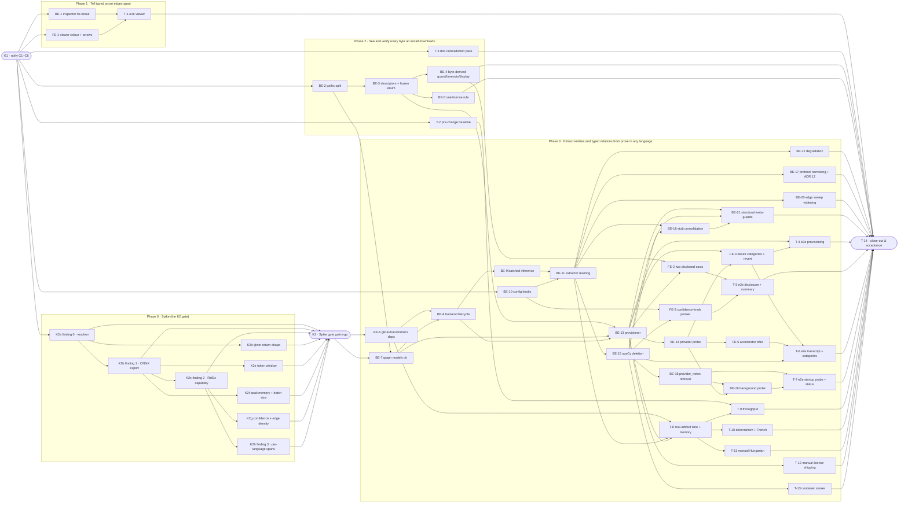

# MGE · Multilingual Graph Extraction Engine — Task Breakdown

**How to read this file**
- This is the **order view** for [2026-08-19-035-multilingual-graph-ner-team-plan.md](./2026-08-19-035-multilingual-graph-ner-team-plan.md) — every task is a single-role checkbox in execution order, opening with a dependency graph.
- **Sliced with the `vertical-slicer` skill.** Each phase delivers a working end-to-end increment, not a horizontal layer, and there is no separate "integrate" phase.
- **One deviation from the skill's default ordering, stated rather than hidden.** The skill puts the walking skeleton first. Here the walking skeleton of the *requested* feature is **Phase 3** — Q30 (Sequencing / landing order) ratifies seven preceding changes that must land before the reviewable core, and the throughput-baseline capture in Phase 2 is only measurable *before* the core deletes spaCy. Phases 1 and 2 are therefore genuine vertical slices in their own right (each demoable, each independently shippable, each kept even if the Spike gate fails) rather than a foundation-first phase — but they precede the skeleton, which the default order would not do. **Phase 3 is atomic by Q30** and does not split into further phases; its tasks are an internal work order, not separate merges.
- Each task carries the **role tag at the end of its title line**, then sub-bullets: **layer · estimate** (decimal hours), **needs · completes**, and a **Tests** block.
- **Tests** are tagged by level. **Unit and integration tests belong to the implementing dev** (test-first); **e2e and manual tests are the tester's tasks**. Kickoff and the close-out task write no tests.
- IDs (`K#`/`BE-#`/`FE-#`/`T-#`) are this file's traceability thread; `S#`/`C#`/`Q#` are defined in the plan.
- **Rule:** change a contract only by team agreement; edit your own tasks freely.

---

## References

- **Plan:** [2026-08-19-035-multilingual-graph-ner-team-plan.md](./2026-08-19-035-multilingual-graph-ner-team-plan.md) — the full team plan (contracts, scenarios, architecture, allocation, sequencing). **Always read the plan before you start planning the next task** — it holds the context this file only cites (`S#`/`C#`/`Q#`).
- **Brief:** [2026-08-19-035-multilingual-graph-ner-brief.md](./2026-08-19-035-multilingual-graph-ner-brief.md) — the source feature brief behind the plan.
- **Contracts:** [C1](./2026-08-19-035-multilingual-graph-ner-c1-prose-extraction-engine.tsp) · [C2](./2026-08-19-035-multilingual-graph-ner-c2-extraction-result.tsp) · [C3](./2026-08-19-035-multilingual-graph-ner-c3-enrichment-protocol-narrowed.tsp) · [C4](./2026-08-19-035-multilingual-graph-ner-c4-model-artifact-provisioning.tsp) · [C5](./2026-08-19-035-multilingual-graph-ner-c5-graph-confidence-config.tsp) · [C6](./api-contracts/2026-08-19-035-multilingual-graph-ner-c6-status-model-validation.tsp) and its [openapi.yaml](./api-contracts/2026-08-19-035-multilingual-graph-ner-c6-status-model-validation.openapi.yaml).

---

## Task Breakdown

Single-role tasks in execution order, grouped into **vertical slices**.

### Dependency graph

### Phase 0 · Kickoff *(prerequisites; contract ratification, then the gating spike)*

- [x] **K1** — Ratify contracts C1–C6 with the team and recompile each `.tsp` with `tsp compile <file> --no-emit` (C6 also re-emits its `openapi.yaml`) #team
    - — · 3.0h
    - completes C1, C2, C3, C4, C5, C6
    - Tests
- [x] **K2a** — Finding 0 · resolver compatibility: resolve and import `gliner>=0.2.26` against the resolved `transformers`, and record the `onnxruntime` dependency edge #backend-role
    - — · 3.0h
    - needs K1
    - Tests
    - Notes
        - `transformers` resolves to 5.8.1 darwin / 5.14.1 elsewhere — a major-version boundary Q25's `>=4.51.3` floor says nothing about. **Neither finding 1 nor finding 2 can be attempted until this passes.**
        - Record whether `gliner` hard-depends on `onnxruntime`: Q26, S33 and S55 all rest on that edge existing, and it is unverifiable in this repository today (`gliner` has zero occurrences in `uv.lock`; `pyproject.toml` never names `transformers`).
        - **Remedy before declaring failure (K12).** If `gliner` breaks against 5.8.1/5.14.1 *specifically* rather than against the whole `>=4.51.3` range, narrow the `transformers` upper bound to a version `gliner` supports and re-run. Finding 0 is fatal only once no version inside `gliner>=0.2.26`'s own floor works.
        - Deliverable: the **`transformers` constraint strategy** — cross-platform vs marker-scoped.
        - **Permanent failure → Phase 3 does not land**; Phases 1 and 2 stand on their own.
        - **Findings (K2a spike, run 2026-08-23, throwaway `uv venv --python 3.13` in scratchpad, matching this repo's real `.venv` interpreter — never added to `pyproject.toml`/`uv.lock`). Verdict: finding 0 PASSES, via the K12 remedy — K2b–K2h are unblocked.**
            - `gliner>=0.2.26` (resolves to `gliner==0.2.28`) **resolves and imports** cleanly against `transformers==5.8.1` — this repo's real darwin-locked version (`uv.lock:987`) — verified with a real `uv pip install` followed by `from gliner import GLiNER` and `import onnxruntime` inside an isolated venv. **PASS.**
            - The same install **fails to resolve** against `transformers==5.14.1` — this repo's real non-darwin-locked version (`uv.lock:988`) — with a real `uv` solver error: every `gliner>=0.2.26` release caps `transformers` below `5.14.0` (`gliner==0.2.26`→`<5.2.0`; `0.2.27`→`<5.7.0`; `0.2.28`→`<5.14.0`, read from `gliner`'s own `importlib.metadata.requires()`). **FAIL on non-darwin as currently locked.**
            - `gliner` **hard-depends on `onnxruntime`** — confirmed via `importlib.metadata.requires('gliner')` (`onnxruntime` is listed unconditionally; only `onnxruntime-gpu` is extra-gated behind `extra == "gpu"`) and by every install above pulling `onnxruntime==1.29.0` transitively, unrequested. Confirms Q26's dependency-edge claim.
            - **K12 remedy applied, and it works.** Narrowing the ceiling to `transformers>=4.51.3,<5.14.0` (gliner's own floor plus its latest release's own ceiling) resolves (`transformers==5.13.1`) and **imports cleanly** — reverified with a real install. Finding 0 is not a permanent failure; the remedy clears it.
            - **Constraint strategy: cross-platform, not marker-scoped.** `transformers` ships one `py3-none-any` universal wheel per version (`uv.lock:4491`, `:4522`) — the incompatibility is a pure version-range conflict, not a platform-gated wheel. This also inverts Q25's premise: darwin's already-resolved `5.8.1` was never the problem; non-darwin's `5.14.1` is. Q25's marker-scoped alternative (`sys_platform == "darwin"`) would leave non-darwin broken — the wrong platform. A single cross-platform `constraint-dependencies` ceiling (e.g. `transformers>=4.51.3,<5.14.0`) fixes both platforms at once and matches Q25's stated preference ("one version everywhere, latest allowed"). Whether the full project lock converges to exactly one shared version once re-locked (vs. still splitting per-platform below the new ceiling) is unverified here — that re-lock is BE-6's job, not this spike's.
            - Not verified here (out of this task's scope): `gliner` against this project's *other* pinned dependencies (docling's own transformers floor, torch pins, etc.) — this spike used an isolated throwaway venv with only `gliner`+`transformers` installed, not the project's full `.venv`.
- [x] **K2b** — Finding 1 · export `knowledgator/gliner-relex-multi-v1.0` to ONNX at the pinned revision and confirm artifact availability #backend-role
    - — · 4.0h
    - needs K2a
    - Tests
    - Notes
        - **Fails → Phase 3 does not land** (Spike gate, finding 1). Phases 1 and 2 are unaffected.
        - **Findings (K2b spike, run 2026-08-23, throwaway `uv venv --python 3.13` in scratchpad — same venv as K2a's, `gliner==0.2.28`/`transformers==5.13.1`/`onnxruntime==1.29.0` per K2a's own findings, plus `torch==2.13.0`/`numpy==2.5.2` resolved transitively into that same venv (not individually recorded by K2a) — never added to `pyproject.toml`/`uv.lock`). Verdict: finding 1 PASSES — K2c is unblocked. Reviewed via `/iterative-review` (3 devil's-advocate passes + Brooks-Lint); the one Major/Critical-rated issue all four raised — misrouting the `onnx` package to BE-6 — is corrected below; every other issue was closed with additional real evidence, not assertion.**
            - **`export_to_onnx` is a real, sourced method, not invented.** Verified directly in the installed package: `gliner/model.py:1706-1713` — `def export_to_onnx(self, save_dir, onnx_filename="model.onnx", quantized_filename="model_quantized.onnx", quantize=False, opset=19, **export_kwargs) -> dict[str, Optional[str]]`. Called here as `model.export_to_onnx(save_dir="onnx_out")`, i.e. with its own defaults `quantize=False, opset=19` (quantized export was not requested).
            - **Pinned revision `e990d9ba6f471b846f7d78bf7e4b4dab11761ada`** — confirmed three independent ways: (1) live via `GET https://huggingface.co/api/models/knowledgator/gliner-relex-multi-v1.0` (`sha` field, `lastModified: 2026-03-17T13:38:11.000Z`) — this is the model's current `main` HEAD; (2) the `revision=` kwarg was passed explicitly to `from_pretrained`; (3) the HF cache actually materialized the snapshot at `hf_cache/hub/models--knowledgator--gliner-relex-multi-v1.0/snapshots/e990d9ba6f471b846f7d78bf7e4b4dab11761ada/` — the loaded files physically live under a directory named with that exact hash, not merely requested by it.
            - **Export succeeds — on the second attempt, after closing a real dependency gap.** First attempt: `GLiNER.from_pretrained(...)` loaded a `UniEncoderTokenRelexGLiNER` instance in 148.2s (cold download), then `model.export_to_onnx(save_dir="onnx_out")` raised `torch.onnx.OnnxExporterError: Module onnx is not installed!` from `torch`'s own `onnx_proto_utils._add_onnxscript_fn` — the `onnx` package (distinct from `onnxruntime`, which K2a already confirmed) is a real transitive requirement of `torch.onnx`'s legacy TorchScript exporter path (the captured traceback shows gliner calling `torch.onnx.export(..., dynamo=False)` — it explicitly opts out of torch's newer dynamo exporter), a path only exercised by actually running the export; K2a's import-only check never reached it. `uv pip install onnx` resolved `onnx==1.22.0` (pulling `ml-dtypes==0.6.0`). Second attempt then succeeded: load 4.2s (warm cache), export 2.5s, exit code 0, returning `{'onnx_path': 'onnx_out/model.onnx', 'quantized_path': None}`. **Independently re-verified with a third, freshly wall-clocked run** (`time ... python export.py`): load 3.6s, export 2.1s, total process time 7.947s wall / 6.52s user — consistent with the second run, not a fluke. Real torch `TracerWarning`s were emitted throughout (Python-bool tensor conversions, e.g. `gliner/modeling/base.py:156`, `gliner/modeling/utils.py:440/452/512/542/549`) — informational, not failures; no exception raised in either successful run.
            - **`onnx` is export-toolchain-only and belongs to neither BE-6 nor the runtime `[graph]` extra — corrected from an earlier draft of this finding.** `onnx` is needed only by the one-off `torch.onnx.export` call that produces the artifact this team self-hosts (team-plan `:67`/`:86`: "self-exported to ONNX and hosted by us"); it plays no role in loading or serving the already-exported model, which BE-13's smoke-load and the runtime `[graph]` extra do via `onnxruntime` alone — exactly what BE-6 (`:294`, "leave `onnxruntime` undeclared") and its `test_onnxruntime_absent_from_graph_extra` guard require. **No task in this breakdown currently owns performing/re-running that one-off export-and-host step** (BE-3 pins the resulting `sha256`/`sizeBytes`/`url` as hand-written constants but nothing here generates them) — that gap is real but is not this task's to close; flagging it here for whoever picks it up rather than assigning it to BE-6.
            - **Resulting ONNX artifact, exact byte sizes** (`onnx_out/`, verified with `stat -f "%N %z bytes"`): `model.onnx` — 1,276,776,490 bytes (≈1.19 GiB); `tokenizer.json` — 16,019,575 bytes; `gliner_config.json` — 2,963 bytes; `tokenizer_config.json` — 532 bytes.
            - **Export is byte-reproducible across independent runs (2/2 tested), and a digest now exists.** `sha256(model.onnx)` = `a8a6844da7afca0836abffc7303e56d1304461a15b3cf2a6fefaf6f8f0488c3c` — identical byte-for-byte (same digest, same 1,276,776,490 size) across the second and the independently-re-run third export, same machine/venv. This is a real measurement, not a substitute for BE-3's eventual pinned digest: only 2 runs, one machine, one venv, and the scratchpad the file lives in does not persist past this session — whoever performs the real self-export-and-host step must recompute and pin its own digest.
            - **Artifact confirmed loadable two ways.** (1) Raw `onnxruntime.InferenceSession("onnx_out/model.onnx", providers=["CPUExecutionProvider"])` (onnxruntime 1.29.0) loaded without error — inputs `input_ids`, `attention_mask`, `words_mask`, `text_lengths`; outputs `logits`, `rel_idx`, `rel_logits`, `rel_mask` (relation-shaped output tensors are present in the exported graph — **observation only, not this task's finding**: whether they carry semantically correct relations for a real label-description prompt is K2c's separate finding, Q3, not verified here). (2) **The actual production seam** (team-plan `:69`, "Load through the `gliner` package in ONNX mode"): `GLiNER.from_pretrained("onnx_out", load_onnx_model=True, onnx_model_file="model.onnx", local_files_only=True)` loaded successfully in 1.1s, `model.onnx_model == True`, same `UniEncoderTokenRelexGLiNER` class — confirming the exported directory is consumable by gliner's own ONNX-mode loader, not just a raw ONNX runtime session.
            - Exact commands run, from the K2a throwaway venv's directory: `VIRTUAL_ENV="$(pwd)/.venv" uv pip install onnx`; `HF_HOME="$(pwd)/hf_cache" .venv/bin/python export.py`, where `export.py` calls `GLiNER.from_pretrained("knowledgator/gliner-relex-multi-v1.0", revision="e990d9ba6f471b846f7d78bf7e4b4dab11761ada")` then `model.export_to_onnx(save_dir="onnx_out")`; `.venv/bin/python -c "..."` constructing `onnxruntime.InferenceSession(...)` for the raw load check; a second script calling `GLiNER.from_pretrained("onnx_out", load_onnx_model=True, onnx_model_file="model.onnx", local_files_only=True)` for the production-seam load check; `shasum -a 256 onnx_out/model.onnx` for the digest. All model artifacts and ONNX output live under the session scratchpad, never under this project tree or `~/.archon-search/`.
            - Not verified here (out of this task's scope): RelEx relation-extraction correctness (K2c), tokenizer window sizing (K2e), memory footprint (K2f), reproducibility across machines/OSes/dependency versions, any LICENSE/attribution file accompanying the export (S39's concern, for whoever hosts the artifact), and the minimum `onnxruntime` version able to load an opset-19 graph — only `onnxruntime==1.29.0` was exercised, and BE-6 leaves `onnxruntime` undeclared (Q26), so operators may bring an older one. `model.onnx` at 1,276,776,490 bytes is well under protobuf's ~2GiB single-file ceiling, so no external-data split was needed for this checkpoint — worth re-checking if a future revision grows past that line.
- [x] **K2c** — Finding 2 · RelEx capability: drive the real ONNX export with the label-description prompt and confirm it returns relations, not just entities (Q3) #backend-role
    - — · 3.0h
    - needs K2b
    - Tests
    - Notes
        - **Fails → Phase 3 lands entities-only.** `label_relationships` and the four adapters' relationship methods are retained (BE-17 drops C3 and ADR 12), the relation-capability assert leaves BE-13's ordered sequence, and the two rules in **Spike gate** govern what else drops (S3, S26/S28's typed-edge clauses, S59's Given). This is a capability finding about the checkpoint, not a defect to fix here.
        - **Findings (K2c spike, run 2026-08-23, same throwaway venv and same `onnx_out/` export as K2b — `gliner==0.2.28`/`transformers==5.13.1`/`onnxruntime==1.29.0`/`torch==2.13.0`, scratchpad only, never added to `pyproject.toml`/`uv.lock`). Verdict: finding 2 FAILS for the real ONNX export — Phase 3 lands entities-only.**
            - **Reused artifact re-verified byte-identical to K2b before testing it.** `sha256(onnx_out/model.onnx)` = `a8a6844da7afca0836abffc7303e56d1304461a15b3cf2a6fefaf6f8f0488c3c`, 1,276,776,490 bytes — matches K2b's recorded digest exactly; this is the same pinned artifact, not a re-export.
            - **The `Union[str, List[str], List[List[str]]]` dict form of the "label→description dicts" prompt (Q3's literal wording) crashes on the installed `gliner==0.2.28` Python API.** Passing `entity_labels = {"person": "...", "system": "...", ...}` and `relation_labels = {"uses": "...", ...}` straight into `model.predict_relations(text, entity_labels, relation_labels, ...)` raises `KeyError: 0` from `gliner/model.py:2283` (`BaseEncoderGLiNER.prepare_batch`'s `elif labels and isinstance(labels[0], list):` — indexing a `dict` with integer `0`), reached via `UniEncoderTokenRelexGLiNER.prepare_batch` (`:5119`) calling `super().prepare_batch(...)`. Reproduced twice (both entity- and relation-label dicts trigger it identically). This **contradicts** the model card's own stated usage (`https://huggingface.co/knowledgator/gliner-relex-multi-v1.0`, fetched live): *"With descriptions: Use a dictionary format for richer context: `entity_labels = {"person": "A human individual, including fictional characters", ...}`"* — that form does not work against this pinned revision through the installed `gliner==0.2.28` package's real Python API. A second prompt form — `"label: description"` as one literal string per label (the only description-carrying form that does not crash) — was tried instead; see below.
            - **Test text (genuine, extractable relations, English):** *"archon-search uses LanceDB to store vector embeddings for hybrid retrieval. archon-search implements the Model Context Protocol to expose its search tools to agents. The reranker depends on the fastembed library for dense embeddings. Alice Chen designed the router module during the Q3 planning event."* — three relations of the graph's own three prose types are present (`uses`, `implements`, `depends_on`). Labels used: entities `["person", "system", "concept", "event", "other"]` (the graph's own four real `EntityType` values plus the `"other"` decoy per Q3, `archon_search/graph_types.py:53-56`), relations `["uses", "implements", "depends_on"]` (the graph's own three real `RelationshipType` values that an LLM/local pass can produce, `graph_types.py:63-65`; `related_to` is the untyped co-occurrence edge, never a predicted label).
            - **Command:** `model = GLiNER.from_pretrained("onnx_out", load_onnx_model=True, onnx_model_file="model.onnx", local_files_only=True)` (K2b's real production seam), then `model.predict_relations(text, entity_labels, relation_labels, threshold=0.3, relation_threshold=<swept>, flat_ner=<swept>)`. **Result at `threshold=0.3, relation_threshold=0.3, flat_ner=False`:** 10 entities extracted with plausible labels and scores — `"LanceDB"` → `system` (0.817), `"reranker"` → `system` (0.637), `"fastembed library"` → `system` (0.690), `"Alice Chen"` → `person` (0.989), `"Q3 planning event"` → `event` (0.735) — but **`RELATIONS: []`** — empty, despite three genuine relations in the text and a real relation-shaped decode path.
            - **Threshold swept all the way to zero — still empty.** Re-ran across `relation_threshold ∈ {0.5, 0.3, 0.1, 0.01, 0.0}` × `flat_ner ∈ {True, False}` (10 combinations, entity `threshold` held at 0.3): **`n_relations == 0` in all 10**, including `relation_threshold=0.0` — the decode path is not merely filtering out low-confidence relation candidates, it is producing none for the ONNX export to filter.
            - **The `"label: description"` stringified prompt form does not crash but also returns zero relations from the ONNX export**, and degrades entity quality besides: with entity labels `["person: an individual human being, referenced by name or role", "system: a software system, platform, product, organization, or place", ..., "other: anything that does not belong to any of the labels above"]` (same colon-joined pattern for the three relation labels), the returned entity `"label"` field is the **entire unstripped string** (e.g. `"other: anything that does not belong to any of the labels above"`), and the `"other"` decoy over-triggers — `archon-search`, `LanceDB`, `"Model Context Protocol"`, `reranker` and `"fastembed library"` all collapse into `other` instead of their real schema type. `RELATIONS: []` again, at the same `threshold=0.3, relation_threshold=0.3, flat_ner=False`.
            - **Control test isolates the failure to the ONNX export, not the checkpoint or the prompt.** The identical plain-string-label call (`entity_labels`/`relation_labels` as above, same text) against the **original, un-exported PyTorch checkpoint** of the same pinned revision (`GLiNER.from_pretrained("knowledgator/gliner-relex-multi-v1.0", revision="e990d9ba6f471b846f7d78bf7e4b4dab11761ada")`, same venv, `onnx_model=False`) returns **real, correctly-directed, high-confidence relations**: at `threshold=0.3, relation_threshold=0.5, flat_ner=True` — `archon-search --uses--> LanceDB` (score 0.982) and `reranker --depends_on--> fastembed library` (score 0.959); lowering `relation_threshold` to 0.3 additionally surfaces `archon-search --implements--> LanceDB` (score 0.418 — a lower-confidence, arguably imprecise pairing, since the text's real `implements` relation is *archon-search → Model Context Protocol*; noted as a precision caveat, not decisive for the capability question). **A second control using the HF model card's own verbatim example** (`"The Eiffel Tower, located in Paris, France, was designed by engineer Gustave Eiffel and completed in 1889."`, labels `["location", "person", "date", "structure"]` / `["located in", "designed by", "completed in"]`, `threshold=0.3, relation_threshold=0.5, flat_ner=False`) against the same PyTorch checkpoint returns **all three expected relations** at 0.97–0.99 confidence, matching the model card's own claim exactly.
            - **Conclusion: the checkpoint has real, working relation-extraction capability (proven on its original PyTorch weights); the pinned real ONNX export artifact from K2b does not carry that capability through.** Same venv, same labels, same text, same production-seam loader shape (`GLiNER.from_pretrained(..., load_onnx_model=True, ...)` vs. the plain `from_pretrained`) — entities come back from both with comparable counts and plausible labels, but the ONNX path returns zero relations at every threshold down to 0.0 while the PyTorch path returns correct, high-confidence ones. This is **finding 2 failing for the artifact this feature would actually ship** (the self-exported, self-hosted ONNX file, team-plan `:67`/`:86`), not for the underlying model family in the abstract.
            - Exact commands, from the K2b throwaway venv's directory (`$SP` = `.../scratchpad/k2b`): `HF_HOME="$SP/hf_cache" .venv/bin/python k2c/run_relex.py` (baseline + dict-crash + stringified-label tests against the ONNX export); `HF_HOME="$SP/hf_cache" .venv/bin/python k2c/run_relex_zero_threshold.py` (the 10-combination threshold/`flat_ner` sweep against the ONNX export); `HF_HOME="$SP/hf_cache" .venv/bin/python k2c/run_relex_pytorch.py` (both PyTorch controls, using the already-cached `model.safetensors` from K2b's own download — no new download). All three scripts call `model.predict_relations(...)`, gliner's public single-text entity+relation API (`gliner/model.py:5573`). All artifacts and scripts live under the session scratchpad, never under this project tree or `~/.archon-search/`.
            - Not verified here (out of this task's scope, and not chased further per the plan's own "do not tune prompts indefinitely" instruction once the negative was confirmed and isolated to the export): whether a different export configuration (e.g. `quantize=True`, a different `opset`) would preserve relation output — K2b's export used `export_to_onnx`'s own defaults (`quantize=False, opset=19`), and re-exporting with different settings is export-toolchain tuning, not this task's remit; whether other RelEx-capable checkpoints export cleanly (out of scope by the plan's own "no alternative checkpoints" rule); per-language behaviour (K2h); tokenizer window and memory sizing (K2e/K2f).
- [x] **K2d** — Record `gliner`'s own return shape **verbatim** from the installed package (Q33) #backend-role
    - — · 1.0h
    - needs K2a
    - Tests
    - Notes
        - BE-16's deep test fake is built against this recorded shape rather than an invented one. Copy it verbatim — do not paraphrase or normalise it.
        - **Findings (K2d spike, run 2026-08-23, same throwaway venv and same `onnx_out/` export as K2b/K2c — `gliner==0.2.28`/`transformers==5.13.1`/`onnxruntime==1.29.0`/`torch==2.13.0`, scratchpad only, never added to `pyproject.toml`/`uv.lock`). Because K2c found the ONNX and PyTorch paths behave differently, both shapes are recorded below, clearly labelled — not just one.**
            - **Method used: `predict_relations`.** `type(model).predict_relations.__qualname__` is `UniEncoderSpanRelexGLiNER.predict_relations`, inherited unmodified by the actually-instantiated class in both cases, `UniEncoderTokenRelexGLiNER` (confirmed via MRO inspection). Sourced at `gliner/model.py:5577` (`def predict_relations(`, verified directly via `inspect.getsourcelines` against the installed package — K2c's own citation of this same method at `:5573` is 4 lines off from this independently re-verified location; recorded as an observed discrepancy, not silently corrected). Declared signature: `(self, text: str, labels: List[str], relations: List[str], flat_ner: bool = True, threshold: float = 0.5, adjacency_threshold: Optional[float] = None, relation_threshold: Optional[float] = None, multi_label: bool = False, **kwargs) -> Tuple[List[Dict[str, Any]], List[Dict[str, Any]]]` — this is only the declared type hint; the shapes below are the actually-measured return values.
            - **(1) ENTITY shape — from the ONNX export** (`onnx_out/model.onnx`; `sha256` re-verified as `a8a6844da7afca0836abffc7303e56d1304461a15b3cf2a6fefaf6f8f0488c3c`, byte-identical to K2b/K2c before this run). Loaded via `GLiNER.from_pretrained("onnx_out", load_onnx_model=True, onnx_model_file="model.onnx", local_files_only=True)` (`onnx_model=True`), then `entities, relations = model.predict_relations(TEXT, ENTITY_LABELS, RELATION_LABELS, threshold=0.3, relation_threshold=0.3, flat_ner=False)` — same text and labels as K2c's `A_plain_strings` run. `type(entities)` is `list`; `type(entities[0])` is `dict`; observed keys and per-key value types: `start: int`, `end: int`, `text: str`, `label: str`, `score: float`. **Verbatim `repr(entities)`, real output (10 elements):** `[{'start': 0, 'end': 13, 'text': 'archon-search', 'label': 'other', 'score': 0.8413857221603394}, {'start': 19, 'end': 26, 'text': 'LanceDB', 'label': 'system', 'score': 0.8170583248138428}, {'start': 36, 'end': 53, 'text': 'vector embeddings', 'label': 'concept', 'score': 0.49391260743141174}, {'start': 58, 'end': 74, 'text': 'hybrid retrieval', 'label': 'concept', 'score': 0.30858761072158813}, {'start': 170, 'end': 178, 'text': 'reranker', 'label': 'system', 'score': 0.636843740940094}, {'start': 194, 'end': 211, 'text': 'fastembed library', 'label': 'system', 'score': 0.6900158524513245}, {'start': 216, 'end': 232, 'text': 'dense embeddings', 'label': 'concept', 'score': 0.5837007761001587}, {'start': 234, 'end': 244, 'text': 'Alice Chen', 'label': 'person', 'score': 0.989336371421814}, {'start': 258, 'end': 271, 'text': 'router module', 'label': 'other', 'score': 0.3492436110973358}, {'start': 283, 'end': 300, 'text': 'Q3 planning event', 'label': 'event', 'score': 0.7353951930999756}]`. Paired `repr(relations)` at this same call is `[]` — an empty `list`, not `None`, and not absent from the returned tuple — consistent with K2c's already-recorded finding that the ONNX export returns zero relations.
            - **(2) RELATION shape — from the un-exported PyTorch checkpoint** (`GLiNER.from_pretrained("knowledgator/gliner-relex-multi-v1.0", revision="e990d9ba6f471b846f7d78bf7e4b4dab11761ada")`, `onnx_model=False`, same class, same method) — the only path K2c found actually returns relations. Called as `entities, relations = model.predict_relations(TEXT, ENTITY_LABELS, RELATION_LABELS, threshold=0.3, relation_threshold=0.3, flat_ner=True)`. `type(relations)` is `list`; `type(relations[0])` is `dict`; observed keys and per-key value types: `head: dict`, `tail: dict`, `relation: str`, `score: float` — where `head`/`tail` are nested dicts with keys `start: int`, `end: int`, `text: str`, `type: str`, `entity_idx: int` (note: the nested key is `type`, not `label`, unlike the top-level entity dict in (1) above — a real, observed naming inconsistency between the two shapes, recorded as-is, not normalised). **Verbatim `repr(relations)`, real output (8 elements):** `[{'head': {'start': 0, 'end': 13, 'text': 'archon-search', 'type': 'other', 'entity_idx': 0}, 'tail': {'start': 19, 'end': 26, 'text': 'LanceDB', 'type': 'system', 'entity_idx': 1}, 'relation': 'uses', 'score': 0.9821536540985107}, {'head': {'start': 0, 'end': 13, 'text': 'archon-search', 'type': 'other', 'entity_idx': 0}, 'tail': {'start': 19, 'end': 26, 'text': 'LanceDB', 'type': 'system', 'entity_idx': 1}, 'relation': 'implements', 'score': 0.4176642596721649}, {'head': {'start': 0, 'end': 13, 'text': 'archon-search', 'type': 'other', 'entity_idx': 0}, 'tail': {'start': 19, 'end': 26, 'text': 'LanceDB', 'type': 'system', 'entity_idx': 1}, 'relation': 'uses', 'score': 0.9821536540985107}, {'head': {'start': 0, 'end': 13, 'text': 'archon-search', 'type': 'other', 'entity_idx': 0}, 'tail': {'start': 19, 'end': 26, 'text': 'LanceDB', 'type': 'system', 'entity_idx': 1}, 'relation': 'implements', 'score': 0.4176642596721649}, {'head': {'start': 170, 'end': 178, 'text': 'reranker', 'type': 'system', 'entity_idx': 4}, 'tail': {'start': 194, 'end': 211, 'text': 'fastembed library', 'type': 'system', 'entity_idx': 5}, 'relation': 'depends_on', 'score': 0.9591332077980042}, {'head': {'start': 170, 'end': 178, 'text': 'reranker', 'type': 'system', 'entity_idx': 4}, 'tail': {'start': 194, 'end': 211, 'text': 'fastembed library', 'type': 'system', 'entity_idx': 5}, 'relation': 'depends_on', 'score': 0.9591332077980042}, {'head': {'start': 170, 'end': 178, 'text': 'reranker', 'type': 'system', 'entity_idx': 4}, 'tail': {'start': 194, 'end': 211, 'text': 'fastembed library', 'type': 'system', 'entity_idx': 5}, 'relation': 'depends_on', 'score': 0.9591332077980042}, {'head': {'start': 170, 'end': 178, 'text': 'reranker', 'type': 'system', 'entity_idx': 4}, 'tail': {'start': 194, 'end': 211, 'text': 'fastembed library', 'type': 'system', 'entity_idx': 5}, 'relation': 'depends_on', 'score': 0.9591332077980042}]`.
            - **Genuine ambiguity, recorded rather than cleaned up: relations repeat verbatim.** The 8-element list above contains only 3 distinct `(head, tail, relation)` triples, each duplicated 2x–4x with byte-identical scores per duplicate (`uses`@0.9821536540985107 x2, `implements`@0.4176642596721649 x2, `depends_on`@0.9591332077980042 x4). This is real gliner output, not a bug in the recording script — whether it is expected multi-span/multi-window decode duplication or a defect in gliner's own relation decoder is unverified here (out of this task's scope). **BE-16's deep fake must not assume the relation list is duplicate-free.**
            - Also observed, not required by K2d's scope: the entity `score` floats for identical entities differ in their trailing decimal digits between the ONNX and PyTorch paths (e.g. `archon-search`→`other`: `0.8413857221603394` ONNX vs `0.8413563370704651` PyTorch) — expected floating-point drift from the ONNX export path, not a shape difference.
            - **Not verified here (out of this task's scope):** whether production code (BE-9/BE-11) will call `predict_relations` (as K2b/K2c/K2d all did — K2b's own wording called it "the actual production seam") or the separate `predict_entities` method also present on the same class (`gliner/model.py:5536`, entity-only, declared `-> List[Dict[str, Any]]`) — that call-site choice is BE-9's to make, not this spike's. If `predict_entities` is used instead, its per-entity dict shape is the same as shown in (1) above (`start`/`end`/`text`/`label`/`score`); this was confirmed only by inspecting its signature, not by executing it.
            - Exact commands, from the K2b throwaway venv's directory (same venv/directory as K2b/K2c): `.venv/bin/python k2d/record_onnx_shape.py` (ONNX entity shape); `HF_HOME="$SP/hf_cache" .venv/bin/python k2d/record_pytorch_shape.py` (PyTorch relation shape, reusing the already-cached `model.safetensors` from K2b's own download — no new download). Both scripts call `model.predict_relations(...)` directly and print `repr()` of both returned lists. All scripts and raw output live under the session scratchpad, never under this project tree or `~/.archon-search/`.
- [x] **K2e** — Measure the real tokenizer window on worst-case chunks, net of both label prompts' token cost #backend-role
    - — · 2.0h
    - needs K2b
    - Tests
    - Notes
        - Pinned as a module constant once measured. S20's **spike-measured half** consumes this; S20's unit half stubs the window and is provable without it.
        - This is a *token-window* question about a single text — **not** the batch-size question K2f answers (K12).
        - **Findings (K2e spike, run 2026-08-23, two environments — see below — scratchpad only, never added to `pyproject.toml`/`uv.lock`). Verdict: no single clean number exists in the installed artifact — two real, differently-sourced candidate windows were found and empirically distinguished; both are recorded, with the one gliner's own code actually enforces identified and proven live. Corrected once after an inline self-review and again after a Brooks-Lint pass caught a real file-count error and a real chunk-ranking gap — both fixed below, not hidden.**
            - **Two environments, not one — stated explicitly since an earlier draft of this block implied only one.** All `gliner`/tokenizer/ONNX measurements below reuse K2b's exact throwaway venv and `onnx_out/` export unmodified (`gliner==0.2.28`/`transformers==5.13.1`/`onnxruntime==1.29.0`/`torch==2.13.0`; `sha256` of `model.onnx` re-verified unchanged before use: `a8a6844da7afca0836abffc7303e56d1304461a15b3cf2a6fefaf6f8f0488c3c`). The real-corpus chunking measurements (worst-case chunk discovery) instead used **this project's own `.venv`**, run from the project root, because that is the only environment with `chonkie` (the project's real chunking dependency) installed — the K2b throwaway venv never had `chonkie` and was never meant to.
            - **Three declared config fields inspected first, and two of them are red herrings.** (1) `tokenizer_config.json`'s `model_max_length` = `1000000000000000019884624838656` — read via `AutoTokenizer.from_pretrained("onnx_out", local_files_only=True).model_max_length` — is HuggingFace's own "no limit declared" sentinel, not a real figure. (2) `onnx_out/tokenizer.json`'s embedded `"truncation"` field (read via `json.load(...)['truncation']`) is `None` — the fast tokenizer carries no truncation strategy of its own. Both mean the `self.transformer_tokenizer(..., truncation=True)` call gliner itself makes (`gliner/data_processing/processor.py:2206-2213`, no explicit `max_length=` passed) is a **no-op**: `truncation=True` without a length falls back to `model_max_length`, and that is effectively infinite here. (3) `gliner_config.json`'s `encoder_config.max_position_embeddings` = `512` — the underlying `microsoft/mdeberta-v3-base` encoder's structural position-embedding table size — is a real, sourced number, but proven below **not** to be a hard runtime ceiling for this checkpoint.
            - **The window gliner's own installed code actually enforces is `gliner_config.json`'s top-level `max_len` = `2048`, measured in gliner's own word-splitter units, not subword tokens.** Source: `self.config.max_len` read and checked in `gliner/data_processing/processor.py:517-520` (verified in the installed package): `max_len = self.config.max_len; if num_tokens > max_len: warnings.warn(f"Sentence of length {num_tokens} has been truncated to {max_len}", stacklevel=2); tokens = tokens[:max_len]` — on `RelationExtractionSpanProcessor` (`processor.py:1527`, the class backing `UniEncoderTokenRelexGLiNER`'s span-level path), which inherits this check from `UniEncoderSpanProcessor`. "Words" here means gliner's own `WhitespaceTokenSplitter` regex, `re.compile(r"\w+(?:[-_]\w+)*|\S")` (`gliner/data_processing/tokenizer.py:40-49`, verified verbatim) — punctuation marks count as their own word-tokens.
            - **Empirically reproduced live, not just read from source.** Concatenated the entire real `tests/eval/corpus/**/*.md` tree (**38 files** — re-verified with `glob.glob("tests/eval/corpus/**/*.md", recursive=True)`, an earlier draft of this bullet miscounted this as 26 and was corrected by a Brooks-Lint pass; the char/word/warning figures below were never wrong, only the file count was — they were always computed from the real 38-file join, 43,570 chars) into one text and called `model.predict_relations(text, ["person","system","concept","event","other"], ["uses","implements","depends_on"], threshold=0.3, relation_threshold=0.3, flat_ner=False)` against the pinned ONNX artifact (`onnx_out/model.onnx`, `sha256` unchanged from K2b/K2c/K2d: `a8a6844da7afca0836abffc7303e56d1304461a15b3cf2a6fefaf6f8f0488c3c`), with `warnings.catch_warnings(record=True)`. Result: exactly one `UserWarning`, verbatim: **`Sentence of length 9777 has been truncated to 2048`**. `9777` was independently confirmed to equal `len(re.compile(r"\w+(?:[-_]\w+)*|\S").findall(text))` — the real corpus text's own word count, computed the same way gliner's splitter would — matching the warning exactly.
            - **The label prompts cost zero words against this 2048 budget — the truncation check runs on the text alone, before the prompt is prepended.** Traced in the installed source: `RelationExtractionSpanProcessor.prepare_inputs` (`processor.py:2135-2186`) builds `prompt = [ent_token, label]×N_entities + [sep_token] + [rel_token, label]×N_relations + [sep_token]` (tokens `<<ENT>>`/`<<REL>>`/`<<SEP>>` read from `gliner_config.json`'s `ent_token`/`rel_token`/`sep_token`) and returns `prompt + list(text_tokens)` — this happens in `tokenize_inputs` (`processor.py:2191`), a separate, later step from the `max_len` truncation in `preprocess_example`/`UniEncoderSpanProcessor`, which only ever sees the text's own word list. The empirical proof above confirms this ordering: the warning's reported length (9777) is the **text-only** word count with the prompt fully excluded — if the prompt had been counted, the reported length would have been 9777+18 (see prompt-list-element count below), not 9777 exactly.
            - **`max_position_embeddings=512` is a real declared figure but is demonstrably not enforced as a hard ceiling at inference for this checkpoint.** Two escalating real-text tests, not one. First: six concatenated real corpus docs (`tests/eval/corpus/docs/*.md`, 6,156 chars, well under the 2048-word budget so no truncation warning fires) returned a valid, correctly-labelled entity (`"config.toml"`) at character offset 2939–2950, which — measured with the real tokenizer — falls at **951 DeBERTa subword tokens** into the sequence (excluding the prompt), no exception, no warning. Second, and decisive: the full 9,777-word corpus text from the bullet above, after gliner's own `max_len` truncation keeps its first 2048 words, converts — measured directly with the real tokenizer, same Form-A prompt prepended — to **3,087 DeBERTa subword tokens**, and `predict_relations` returned normally over the **entire** sequence with **no exception, no warning beyond the one `max_len` truncation warning already reported, and no truncation artifact** — 6x past the encoder's declared 512-position table, not just past it. Consistent with the encoder's own config: `position_biased_input: false`, `relative_attention: true`, `position_buckets: 256` (`gliner_config.json`, `encoder_config`) — DeBERTa-v2's disentangled relative-position attention does not require an absolute position lookup bounded to the table size, so exceeding 512 subword tokens does not error the way it would on an absolute-position encoder. The ONNX graph itself corroborates this: `onnxruntime.InferenceSession(...).get_inputs()` shows `input_ids`/`attention_mask`/`words_mask` all declared with a fully dynamic `['batch_size', 'sequence_length']` shape — no fixed 512 baked into the exported graph.
            - **Both label prompts' real token cost, measured with the real tokenizer (`DebertaV2Tokenizer`, loaded via `AutoTokenizer.from_pretrained("onnx_out", local_files_only=True)`), in two forms — both traced to K2c's own findings, since K2c already established which prompt forms this installed `gliner==0.2.28` does and does not accept.** **Form A — schema-value-only labels** (`["person","system","concept","event","other"]` / `["uses","implements","depends_on"]`, the only Python-API form K2c found does not crash or degrade entity quality): 18 prompt-list elements, **25 DeBERTa subword tokens** (incl. 2 special tokens). **Form B — `"label: description"` stringified labels** (K2c's only working description-carrying form, e.g. `"person: an individual human being, referenced by name or role"`): 18 prompt-list elements, **154 DeBERTa subword tokens** (incl. 2 special tokens). The literal Q3-specified dict form (`{"person": "...", ...}`) is not measurable here at all — K2c already found it raises `KeyError: 0` on this installed version before any tokenization occurs.
            - **Real worst-case chunk, found by scanning the entire real corpus with the project's own chunker, not invented — and re-ranked by the right tokenizer after a Brooks-Lint pass caught a real methodology gap.** Ran `archon_search.chunker.DocumentChunker(chunk_size=512)` (the project's real default — `archon_search/chunker.py:16-20`'s `RecursiveChunker(tokenizer="gpt2", chunk_size=512)`, default sourced from `archon_search/config.py:240`'s `chunk_size: int = 512`) across every `tests/eval/corpus/**/*.md` and `**/*.txt` file (177 chunks produced). **First pass (flawed):** ranked by gpt2/chonkie token count and picked **514 gpt2 tokens, 1,331 chars**, from [tests/eval/corpus/fr-docs/guide_depannage.md](../../tests/eval/corpus/fr-docs/guide_depannage.md) — measured with the real gliner word-splitter and the real DeBERTa tokenizer: 295 gliner-words, 460 DeBERTa subword tokens. **The flaw:** gpt2 BPE and mdeberta-v3's SentencePiece vocabulary are different tokenizers over different vocabularies — the gpt2-maximal chunk is not necessarily the DeBERTa-subword-maximal chunk, and DeBERTa subword count is what actually matters for a subword-token budget. **Second pass (corrected):** re-tokenized all 177 real chunks with the actual DeBERTa tokenizer (same gliner-style word-splitter regex, `is_split_into_words=True`) and ranked by that count directly. **The true DeBERTa-subword-maximal real chunk is a different file: `599` subword tokens (incl. 2 special tokens), 360 gpt2 tokens, 1,125 chars, from [tests/eval/corpus/docs/configuration_reference.md](../../tests/eval/corpus/docs/configuration_reference.md)** — 30% higher than the gpt2-ranked pick, because it is denser in short punctuation-and-hyphen-heavy config-key tokens that the whitespace/SentencePiece split expands into more subword pieces than gpt2 BPE does for the same gpt2-token budget. Both figures are kept below rather than silently replacing one with the other.
            - **Net remaining budget for chunk text — two different answers depending on which window governs, since the installed artifact does not collapse to one, and the answer for candidate (2) changed after the re-ranking above.** **(1) Under gliner's own actually-enforced `max_len=2048`-word window:** the label prompts cost 0 words against it (proven above), so the remaining budget for chunk text is the full **2048 words** regardless of prompt form; even the larger, correctly-ranked worst-case chunk (measured directly, not estimated, at **412 gliner-words** for `configuration_reference.md`'s winning chunk) uses only 20.1% of it. **(2) Under the encoder's structural `max_position_embeddings=512`-subword-token limit, if a future project-level guard adopts it anyway as a conservative subword-token budget** (it is the only concretely-sourced subword-token figure in the config, even though the bullet above shows it is not hard-enforced): net of Form A's 25 tokens, remaining = **487 subword tokens**; net of Form B's 154 tokens, remaining = **358 subword tokens**. Against the gpt2-ranked chunk (460 subwords) the original, now-superseded verdict was "fits Form A, not Form B" — but against the **true** DeBERTa-subword-maximal real chunk (**599** subwords), it **exceeds both**: 599 > 487 (Form A) and 599 > 358 (Form B). Under candidate window (2), the real corpus already contains a chunk that would need truncation regardless of which label-prompt form BE-9 ends up using — this is the corrected, load-bearing conclusion; the earlier "fits under Form A" reading in a prior draft of this bullet was wrong and is superseded by this measurement.

            | Candidate window | Unit | Source | Value | Form A prompt cost | Form A remaining | Form B prompt cost | Form B remaining | True worst chunk | Fits (A / B)? |
            |---|---|---|---|---|---|---|---|---|---|
            | gliner's own enforced `max_len` | gliner word-splitter words | `gliner_config.json:max_len`, `processor.py:517-520` | 2048 | 0 words (proven not counted) | 2048 | 0 words (proven not counted) | 2048 | 412 gliner-words | Yes / Yes |
            | encoder structural limit (not hard-enforced, see above) | DeBERTa subword tokens | `gliner_config.json:encoder_config.max_position_embeddings` | 512 | 25 tokens | 487 | 154 tokens | 358 | 599 DeBERTa subwords | **No / No** |
            - **Exact commands/scripts, all in the session scratchpad, never in this project tree or `~/.archon-search/`:** `k2e/find_worst_chunk.py` (project root, project's own `.venv`, which has `chonkie` installed) does the first, gpt2-ranked chunk pass and writes `k2e_worst_chunk.json`; `k2e/all_chunks_dump.py` (same project `.venv`) dumps all 177 real chunks' text for re-ranking; `k2b/rerank_by_subwords.py` (K2b throwaway venv, real `DebertaV2Tokenizer`) re-tokenizes all 177 and finds the true DeBERTa-subword-maximal chunk (`configuration_reference.md`, 599 subwords), writing `k2e_worst_chunk_by_subwords.json`; `k2b/check_winning_chunk_words.py` measures that same winning chunk's gliner-word count (412) directly rather than estimating it; `k2b/final_measure.py` computes both prompt forms' subword costs; `k2b/run_very_long.py` reproduces the live `UserWarning` against the full real (38-file) corpus; `k2b/run_unique_long.py` reproduces the beyond-512-subword-tokens non-failure case; `k2b/max_processed_len.py` measures the 3,087-subword-token figure for the fully-processed 2048-word-truncated sequence; `k2b/inspect_onnx_shapes.py` confirms the ONNX graph's dynamic input shapes. No new model download; the existing `hf_cache/` and `onnx_out/` from K2b were reused unmodified (`sha256` re-verified unchanged before use).
            - **Not verified here (out of this task's scope):** whether BE-9's eventual truncation guard should count against gliner's own word-splitter units or a new subword-token budget — that is BE-9's design decision, not this spike's, and this spike deliberately reports both real candidates rather than picking one; extraction-quality degradation for chunks approaching either candidate window (a precision/recall question, not a window-existence question); behavior on the literal Q3 dict-form prompt, which K2c already found inoperable on this installed version before reaching any tokenization step; peak memory (K2f, separate task); per-language chunk sizes (Hungarian has no corpus in this repo yet, per K2h's own scope — the worst-case chunk measured here is French/English-only evidence, and a non-Latin or CJK chunk of identical gpt2 length is not shown to fit within either candidate window).
            - **Brooks-Lint findings received on this block, and disposition of each — recorded for traceability, not left silently unaddressed.** A Brooks-Lint PR-review pass flagged 7 issues on an earlier draft of this block. **Fixed here:** the 26-vs-38-file count (now corrected above), the gpt2-vs-DeBERTa-subword chunk-ranking gap (now corrected above, with the true 599-subword worst case superseding the earlier 460-subword figure), the dangling "(4) above" cross-reference (fixed in the prior self-review pass), and the ambiguous single-venv framing (now split into "two environments" above). **Deliberately not fixed here, out of K2e's edit scope** (task instructions restrict this task to K2e's own checkbox and Notes/Findings, not other tasks or the companion plan): a suggestion to amend S20/K2's "module constant" language in the companion plan and this file's K2 block to reflect that two candidates were found rather than one — that decision belongs to whoever executes K2, which is explicitly downstream of and separate from K2e; a suggestion to add a pointer from BE-9's own Notes to K2c's dict-prompt-crash finding — that edits BE-9, not K2e.
- [ ] **K2f** — Size `GRAPH_NER_SUB_BATCH_SIZE` from its own peak-memory-per-batch-size measurement, and record the model's resident footprint and the memory-budget figure #backend-role
    - — · 4.0h
    - needs K2b
    - Tests
    - Notes
        - **A batch-size question, not a token-window question (K12).** Vary batch size against worst-case (longest) chunks and observe **peak**, not steady-state, memory — `GRAPH_NER_SUB_BATCH_SIZE` bounds how many *texts* one forward-pass call can hold without a transient spike. Do not reuse K2e's figure.
        - Also record the resident model footprint and the memory-budget figure (Q16) — no sourced size exists yet. The spike produces the number; the tester encodes it.
        - Known gap this does not close: S26 samples RSS after warm-up and can mask a peak spike inside one sub-batch (Known limitations, K12).
- [ ] **K2g** — Confirm `relation_confidence` (Q2) and the pinned `adjacency_threshold` (Q29), and measure the real density increase typed edges cause #backend-role
    - — · 2.0h
    - needs K2c
    - Tests
    - Notes
        - Both figures are **provisional pending this measurement**, marked as such in the plan's Decisions table.
- [ ] **K2h** — Finding 3 · per-language span quality: Hungarian manually, French against [fr-docs/](../../tests/eval/corpus/fr-docs/), against current output #backend-role
    - — · 4.0h
    - needs K2c
    - Tests
    - Notes
        - Pass condition: non-trivial, non-garbled entity **and** relation spans — not systematically empty or nonsense output — for prose that actually contains extractable entities in that language. `fr-docs/` is 5 files, 257 lines (verified present).
        - Deliverable: **the exact French spans and character offsets S1 asserts on**, chosen from the real engine's output. The spans quoted at S1 and in the Tester section are illustrative-pending-spike, the same status as Q2, Q16 and Q29.
        - **Fails for a language → nothing blocks (K10).** Record the gap as a named per-language limitation in Known limitations rather than reopening Q1's engine choice.
- [ ] **K2** — Record the Spike gate's go/no-go and pin the five provisional figures from K2a–K2h #team
    - — · 1.0h
    - needs K2a, K2b, K2c, K2d, K2e, K2f, K2g, K2h
    - Tests
    - Notes
        - Findings in order: **(0)** `gliner>=0.2.26` resolves and runs against the resolved `transformers` (5.8.1 darwin / 5.14.1 elsewhere — verified: `pyproject.toml` never names `transformers` and `gliner` has zero occurrences in `uv.lock`), and whether `gliner` hard-depends on `onnxruntime`; **(1)** ONNX-exportability of `knowledgator/gliner-relex-multi-v1.0` at the pinned revision; **(2)** RelEx capability against the label-description prompt; **(3)** per-language span quality (Hungarian manual, French against [fr-docs/](../../tests/eval/corpus/fr-docs/) — 5 files, 257 lines, verified present).
        - **Findings 0 or 1 fail → Phase 3 does not land**; Phases 1 and 2 stand on their own. Finding 0 has a remedy first: narrow the `transformers` upper bound and re-run. **Finding 2 fails → Phase 3 lands entities-only** — `label_relationships` and the four adapters' relationship methods are retained (BE-17 drops C3 and ADR 12), the relation-capability assert leaves BE-13's ordered sequence, and the two rules in Spike gate govern what else drops (S3, S26/S28's typed-edge clauses, S59's Given). **Finding 3 fails for a language → nothing blocks**; the gap is recorded as a per-language limitation.
        - Deliverables the later tasks consume: `GRAPH_NER_SUB_BATCH_SIZE` (from its **own** peak-memory-per-batch-size measurement, not the token window), the token window, `relation_confidence`, `adjacency_threshold`, the memory-budget figure, the model's resident footprint, the `transformers` constraint strategy (cross-platform vs marker-scoped), the exact French spans and offsets S1 asserts on, and — added by Q33 — **`gliner`'s own return shape, recorded verbatim from the installed package**, which BE-16's deep fake is built against.

### Phase 1 · Tell typed prose edges apart in the graph *(ships today — typed edges already exist via the LLM path; kept regardless of the Spike gate)*

- [ ] **BE-1** — Break equal-weight edge ties toward typed edges instead of by `edge_id` hash in [graph_inspector.py](../../archon_search/graph_inspector.py) (the sort key at `:213`) #backend-role
    - Use Cases · 2.0h
    - needs K1 · completes S35
    - Tests
        - #unit_test — `test_equal_weight_tie_prefers_typed_edge` — a `uses` edge outranks its `related_to` twin at identical weight
        - #unit_test — `test_equal_weight_tie_is_deterministic_across_runs` — the winner does not vary with edge-id ordering
        - #unit_test — `test_unequal_weight_still_sorts_by_weight` — the weight ordering is unchanged
        - #integration_test — `test_inspector_caps_keep_typed_edge_over_untyped` — a real capped inspection retains the typed edge
- [ ] **FE-1** — Colour and arrowhead typed edges in [graph_viewer.html](../../archon_search/server/graph_viewer.html)'s `buildVisEdge` — a second `relationship_type`-keyed map beside the existing entity-keyed `TYPE_COLORS` (`:112-119`), plus conditional `arrows` on directional types only #frontend-role
    - Presentation · 4.0h
    - needs K1 · completes S34
    - Tests
        - #unit_test — `test_viewer_defines_relationship_colour_map` — the served HTML carries a relationship-keyed colour map distinct from `TYPE_COLORS`
        - #unit_test — `test_viewer_sets_arrows_only_for_directional_types` — `related_to` gets no arrowhead
        - #unit_test — `test_edge_hover_label_survives_the_rewrite` — `title: e.relationship_type` (`:218`) is still set, so colour is not the only cue (Q32)
        - #unit_test — `test_viewer_still_has_no_external_urls` — the existing no-external-URL guard still passes after the edit
    - Notes
        - **Do not regenerate [graph_viewer.html.sha256](../../archon_search/server/graph_viewer.html.sha256) (Q31).** It hashes only the extracted `<script id="vendor-vis-network">` block, so an app-code edit cannot invalidate it. The plan's three regeneration statements were corrected.
- [ ] **T-1** — e2e: the served viewer page distinguishes a typed edge from its `related_to` twin over the same node pair #tester-role
    - — · 3.0h
    - needs BE-1, FE-1 · completes S34, S35
    - Tests
        - #e2e_test — `test_e2e_viewer_differentiates_typed_and_untyped_edges` — HTML-content assertions on the served page: distinct colours, arrowhead on the typed edge only (there is no browser harness — the viewer is asserted as text)

### Phase 2 · See and verify every byte an install will download *(closes a pre-existing integrity gap; kept as-is even if the Spike gate fails)*

- [ ] **BE-2** — Split `get_fasttext_models_dir()` out of [language_detector.py](../../archon_search/language_detector.py) (`:22-29`) into [paths.py](../../archon_search/paths.py) as a new `get_models_dir()` root plus a derived accessor returning `<data>/models/` unchanged; move both names off [app.py](../../archon_search/server/app.py)`:33`, stop [installer.py](../../archon_search/install/installer.py)`:1209` recomputing the path by hand, and replace the module docstring's "no principle" note with the rule #backend-role
    - Frameworks & Drivers · 4.0h
    - needs K1 · completes S41
    - Tests
        - #unit_test — `test_get_models_dir_follows_data_dir_env` — `ARCHON_SEARCH_DATA_DIR` moves the root
        - #unit_test — `test_get_fasttext_models_dir_returns_models_root_unchanged` — no `fasttext/` segment is appended, so no existing install is orphaned
        - #unit_test — `test_paths_docstring_states_the_accessor_rule` — the docstring states the rule rather than the exception
        - #integration_test — `test_language_detector_loads_from_relocated_data_dir` — the detector still finds `lid.176.ftz` after redirection
    - Notes
        - Both `MARKER_ALLOWLIST` pins in [tests/test_no_hardcoded_path_home.py](../../tests/test_no_hardcoded_path_home.py) (`:44`, `:45`) move with this change. [tests/path_home_allowlist.txt](../../tests/path_home_allowlist.txt) is **not** touched — verified: it holds no `language_detector.py` entry, and `paths.py` is whole-file exempt via that module's `FILE_ALLOWLIST`.
- [ ] **BE-3** — Add the two descriptor shapes (provisioned-artifact vs size-estimate), pin `lid.176.ftz`'s digest and byte count at [licenses.py](../../archon_search/install/licenses.py)`:90-134`, keep the tree-sitter bundle on the estimate shape ([extras.py](../../archon_search/install/extras.py)`:154-159`), and freeze C4's eight failure categories plus the probe's `candidateProviders`/`activeProviders` fields as sanitized constants #backend-role
    - Frameworks & Drivers · 8.0h
    - needs BE-2 · completes C4
    - Tests
        - #unit_test — `test_provisioned_descriptor_carries_digest_and_exact_bytes` — the graph-model shape declares both; the estimate shape declares neither
        - #unit_test — `test_failure_category_enum_has_exactly_eight_members` — the frozen set matches C4 so Frontend can code against it
        - #unit_test — `test_fasttext_digest_mismatch_triggers_redownload` — a pre-existing mismatching file is deleted and re-fetched, non-fatal
        - #integration_test — `test_existing_matching_fasttext_file_is_not_redownloaded` — a digest-matching file is left alone
- [ ] **BE-4** — Derive the disk guard, the two service-ready timeouts and the displayed figure from the summed byte total: replace [prewarm.py](../../archon_search/install/prewarm.py)`:36`'s `download_mb`-based formula with `total_bytes * 2`, move `_compute_svc_timeout` ([installer.py](../../archon_search/install/installer.py)`:89`, used at `:877`/`:947`) and `_render_summary` ([render.py](../../archon_search/install/render.py)`:74`) onto the same total, and re-baseline the existing disk-space and summary tests #backend-role
    - Frameworks & Drivers · 6.0h
    - needs BE-3 · completes S38
    - Tests
        - #unit_test — `test_planned_total_sums_profile_and_selected_extras` — every selected artifact contributes
        - #unit_test — `test_required_free_bytes_is_twice_the_total` — no `ceil()` on an integer sum
        - #unit_test — `test_prewarm_timeout_still_reads_the_profile_figure` — `_prewarm_timeout` (`:48-50`) is deliberately **not** moved
        - #integration_test — `test_disk_guard_timeouts_and_display_all_derive_from_one_total` — a synthetic multi-artifact selection drives all three consistently
- [ ] **BE-5** — Add the one license rule to [licenses.py](../../archon_search/install/licenses.py) — restrictive-on-use prompts, everything else is disclosure-only — leaving `_prompt_jina_license` (`:26`) and `_prompt_fasttext_license` (`:60`) untouched #backend-role
    - Frameworks & Drivers · 4.0h
    - needs BE-3 · completes S39
    - Tests
        - #unit_test — `test_permissive_descriptor_discloses_without_prompting` — an Apache-2.0 descriptor gates nothing
        - #unit_test — `test_restrictive_descriptor_prompts_for_acceptance` — the restrictive branch prompts
        - #integration_test — `test_one_rule_disciplines_both_synthetic_descriptors` — both run through the single rule, no per-model branch
- [ ] **T-2** — Capture the pre-change ingest wall-time baseline for [tests/eval/corpus/docs/](../../tests/eval/corpus/docs/) on a real CI runner via a temporary one-off step, record figure/corpus/machine/provider/date into a new standalone `tests/eval/_graph_ner_throughput_baseline.py`, then remove the temporary step #tester-role
    - — · 4.0h
    - needs K1
    - Tests
        - #manual_test — Pre-change throughput baseline — run the current spaCy-backed ingest once on CI and commit the recorded constant (non-automatable: a one-off measurement that must happen before the core deletes spaCy; once deleted there is no pre-change state left for an automated test to re-derive)
- [ ] **T-3** — Correct the three doc claims that are false today: the relationship-type inventory in [130_data_architecture_and_persistence.md](../Architecture/130_data_architecture_and_persistence.md) (9 members, not 6), the stale CI-extras claim in [ci-graph-code-extras-gap.md](./ci-graph-code-extras-gap.md), and the matching docstrings at [tests/smoke/conftest.py](../../tests/smoke/conftest.py)`:17-19`/`:375-378` #tester-role
    - — · 3.0h
    - needs K1
    - Tests
        - #manual_test — Doc-contradiction review — verify each corrected statement against the code it describes (non-automatable: prose accuracy has no assertable post-condition; the underlying facts are already covered by the code's own tests)

### Phase 3 · Extract entities and typed relations from prose in any language *(the walking skeleton of the feature proper — one atomic change per Q30, gated on K2)*

- [ ] **BE-6** — Add `gliner>=0.2.26` to `[graph]`, drop `spacy` and the `en-core-web-sm` `[tool.uv.sources]` entry, pin `transformers` in `[tool.uv]` `constraint-dependencies` with its reason commented, leave `onnxruntime` undeclared, and re-lock #backend-role
    - Frameworks & Drivers · 4.0h
    - needs K2 · completes S55
    - Tests
        - #unit_test — `test_transformers_constraint_present_via_tomllib` — the pin parses out of `constraint-dependencies`
        - #unit_test — `test_constraint_reason_comment_present_in_raw_text` — read as raw text, since `tomllib` discards comments
        - #unit_test — `test_onnxruntime_absent_from_graph_extra` — the extra declares it nowhere
        - #integration_test — `test_lock_matches_the_chosen_transformers_strategy` — one version everywhere, or today's platform split preserved, per K2's recorded choice
- [ ] **BE-7** — Add `get_graph_models_dir()` and the pinned model+revision module constant to [paths.py](../../archon_search/paths.py), laid out as `<data>/models/graph/<model>-<revision>/` #backend-role
    - Frameworks & Drivers · 3.0h
    - needs K2, BE-2 · completes S41
    - Tests
        - #unit_test — `test_graph_models_dir_follows_data_dir_env` — redirection moves the artifact path
        - #unit_test — `test_graph_models_dir_segment_derives_from_the_pinned_constant` — the path segment has one owner
        - #unit_test — `test_get_spacy_models_dir_is_gone` — the outgoing accessor no longer exists
- [ ] **BE-8** — Add `ProseExtractionBackend` in a new `archon_search/prose_extraction_backend.py`: one shared instance loaded once per process behind a lock, off the event loop, session options from `[graph].providers` with pinned intra/inter-op thread counts, plus the provisioner-only construction path that takes an explicit provider list; `gliner`/`torch`/`transformers` imports live inside `load()`, never at module level #backend-role
    - Frameworks & Drivers · 16.0h
    - needs BE-6, BE-7 · completes C1, S15, S18, S29, S48
    - Tests
        - #unit_test — `test_providers_come_from_graph_section_only` — never the embedder's or reranker's list; unset means CPU
        - #unit_test — `test_unloadable_artifact_latches_once_per_process` — the second call does not retry the load
        - #unit_test — `test_cancellation_during_load_reraises_without_latching` — cancellation is re-raised first
        - #integration_test — `test_concurrent_extractions_load_the_model_once` — N concurrent calls yield `loadCount == 1`, dispatched through `asyncio.to_thread`
- [ ] **BE-9** — Sub-batch inference against the pinned `GRAPH_NER_SUB_BATCH_SIZE` module constant, prompt with label→description dicts plus the `"other"` decoy (discarded), apply both thresholds, and truncate over-window chunks with a once-per-process log that never carries chunk text #backend-role
    - Frameworks & Drivers · 10.0h
    - needs BE-8 · completes S7, S20, S30, S53
    - Tests
        - #unit_test — `test_document_yields_ceil_n_over_sub_batch_calls` — counted at the `gliner`/`onnxruntime` boundary, never once per chunk
        - #unit_test — `test_no_single_call_exceeds_the_sub_batch_constant` — and the constant is not a `[graph]` config key
        - #unit_test — `test_other_labelled_spans_are_discarded` — the decoy never reaches the graph
        - #integration_test — `test_truncation_logs_once_and_never_interpolates_chunk_text` — the emitted record equals the pinned sanitized constant
- [ ] **BE-10** — Add `ner_confidence` (0.5), `relation_confidence` (0.75) and `providers` to `GraphConfig` ([config.py](../../archon_search/config.py)`:136`), following the reject-bool-then-coerce-then-range idiom at `:925-936`; `adjacency_threshold` stays a pinned constant and is never parsed #backend-role
    - Frameworks & Drivers · 5.0h
    - needs K1 · completes C5, S43, S47
    - Tests
        - #unit_test — `test_below_zero_zero_and_above_one_each_raise_naming_the_key` — three separate asserts, not one `or`
        - #unit_test — `test_boolean_true_rejected_before_coercion` — `true` is not silently coerced
        - #unit_test — `test_adjacency_threshold_is_not_a_recognised_key` — a value under that name has no effect
        - #integration_test — `test_unset_graph_providers_reads_as_cpu` — no inheritance from `[database].providers`, unlike `resolve_reranker_providers` (`:306-308`)
- [ ] **BE-11** — Rewire [graph_extractor.py](../../archon_search/graph_extractor.py) onto the backend: delete `_LABEL_TO_ENTITY_TYPE` (`:131`), pass both configured thresholds through to `inference()`, use the engine's labels verbatim, route directed relations into the existing additive edge merge, keep the `related_to` loop's `sorted()` normalisation (`:797`), and drop `llm_fallback_used` (`:572`/`:779`/`:819`) #backend-role
    - Interface Adapters · 12.0h
    - needs BE-9, BE-10 · completes C2, S2, S3, S4, S5, S6, S21, S28, S59
    - Tests
        - #unit_test — `test_entity_type_is_the_engine_label_verbatim` — no intermediate vocabulary
        - #unit_test — `test_typed_edge_keeps_head_to_tail_direction` — while the co-occurrence edge for the same pair stays normalised
        - #unit_test — `test_both_thresholds_reach_inference_unswapped` — the wiring assertion, not threshold arithmetic
        - #integration_test — `test_typed_and_cooccurrence_edges_coexist_with_distinct_ids` — neither overrides the other, with no provider configured
        - #integration_test — `test_code_symbol_chunks_never_reach_the_prose_engine` — the AST path is untouched
        - #integration_test — `test_relations_incapable_artifact_does_not_degrade_ingest` — entities persist, `degraded is False`, no typed edge
        - #integration_test — `test_same_process_double_ingest_is_id_stable` — S28's plumbing half stays in the default integration lane
- [ ] **BE-12** — Degrade cleanly on every non-fatal failure: missing or unloadable artifact, a mid-batch raise, and a bounded load-wait timeout all delete the document's stale prose rows, return one sanitized wire-facing warning and never fail the ingest or return 503 #backend-role
    - Interface Adapters · 8.0h
    - needs BE-11 · completes S14, S17, S46
    - Tests
        - #unit_test — `test_wait_timeout_degrades_and_leaves_loader_bookkeeping_untouched` — the waiter mutates nothing
        - #integration_test — `test_missing_artifact_still_persists_chunks_and_code_symbols` — ingest succeeds degraded
        - #integration_test — `test_mid_batch_raise_returns_the_pinned_sanitized_constant` — asserted **equal to** the `DETAIL`/`CODE` pair, not merely absent of exception text
- [ ] **BE-13** — Add the generic `ArtifactProvisioner` to the installer package: disclose → check space → stage inside the target filesystem → verify digest **and** byte count → extract → fsync → atomic rename under `get_graph_models_dir()` → fsync parent → smoke-load → relation-capability assert, writing `capability_status.json` beside the artifact on every call that reaches the post-placement steps; `importlib.invalidate_caches()` runs between the subprocess `pip install` and the first in-process `import gliner` #backend-role
    - Frameworks & Drivers · 16.0h
    - needs BE-3, BE-7, BE-8 · completes C4, S8, S10, S11, S12, S37, S58
    - Tests
        - #unit_test — `test_digest_mismatch_places_nothing_and_reports_its_own_category` — distinct from a byte-count mismatch
        - #unit_test — `test_short_download_fails_the_byte_count_assert_before_placement` — its own category
        - #unit_test — `test_capability_status_records_failure_kind_and_active_providers` — the sentinel's declared schema
        - #integration_test — `test_already_present_artifact_is_reverified_and_sentinel_rewritten` — no re-download, but the assert re-runs so a recorded failure can clear
        - #integration_test — `test_smoke_load_failure_leaves_the_placed_tree_in_place` — records `smoke_load_failed`, never reports success
        - #integration_test — `test_provisioner_satisfies_the_durable_write_lint_gate` — [tests/test_no_raw_durable_writes.py](../../tests/test_no_raw_durable_writes.py) still passes
    - Notes
        - The installer may import `prose_extraction_backend.py` directly but must never import `graph_extractor.py`. **Q34, decided:** `_install_graph_extra` ([extras.py](../../archon_search/install/extras.py)`:324`) is **kept and its second half replaced** — `_install_extra("archon-search[graph]")` stays, `_download_spacy_model` becomes an `ArtifactProvisioner` call, and `importlib.invalidate_caches()` sits between them (this function already owns that ordering). The failure **kind** is returned to the call site ([installer.py](../../archon_search/install/installer.py)`:799-806`) rather than swallowed, so the revert can fire for five categories and not three (S45); the switch-off policy stays at the call site beside its two siblings.
- [ ] **BE-14** — Implement the two-stage provider probe: a free pre-download availability check, then real validation riding the mandatory smoke-load, reporting the resolved `activeProviders`; two importable ONNX runtimes is its own sanitized category, never a swallowed exception #backend-role
    - Frameworks & Drivers · 8.0h
    - needs BE-13 · completes S33
    - Tests
        - #unit_test — `test_both_onnx_runtimes_importable_reports_its_own_category` — the ambiguity is never resolved by picking one
        - #unit_test — `test_step_down_to_cpu_is_reported_not_inferred` — `activeProviders` carries the real answer
        - #integration_test — `test_stage_two_validates_against_the_real_placed_artifact` — not against host availability alone
- [ ] **BE-15** — Delete spaCy from the source tree, the entrypoint and the container files: the resolver chain, `_LABEL_TO_ENTITY_TYPE`, `ENGLISH_ONLY_DISCLOSURE` (`:86`), `_NAME_SPLIT_PATTERN` (`:146`), `_resolve_labeled_pair` (`:342`), `get_spacy_models_dir`, the four re-exports at [install/\_\_init\_\_.py](../../archon_search/install/__init__.py)`:48-51`, the whole `case`/`esac` block at [scripts/docker-entrypoint.sh](../../scripts/docker-entrypoint.sh)`:34-47` with its spaCy-naming header comments, and the matching lines in [docker-compose.override.yml](../../docker-compose.override.yml) (`:51`, `:56`, `:82`) and [Dockerfile.test](../../Dockerfile.test)`:15`; re-guard `_check_graph_deps` on `gliner` via the `try`-wrapped `find_spec` form #backend-role
    - Frameworks & Drivers · 10.0h
    - needs BE-11 · completes S16
    - Tests
        - #unit_test — `test_absent_gliner_fails_construction_with_a_sanitized_error` — via the `sys.modules["gliner"] = None` convention
        - #unit_test — `test_present_but_spec_less_stub_is_treated_as_found` — the `ValueError` branch never reads as "absent"
        - #unit_test — `test_create_pipeline_signature_is_unchanged` — folded in from the retired S50
        - #integration_test — `test_app_and_pipeline_share_one_guard_implementation` — construction fails before any store, embedder or reranker is built
    - Notes
        - [tests/test_install_spacy_model.py](../../tests/test_install_spacy_model.py) (434 lines, 19 tests — verified) is deleted wholesale. [tests/test_entrypoint_stamp.py](../../tests/test_entrypoint_stamp.py)`:25-32` is rewritten against the spaCy-free entrypoint. The four `ENGLISH_ONLY_DISCLOSURE`-pinning tests in [tests/test_install_ui.py](../../tests/test_install_ui.py) (`:481`, `:496`, `:510`, `:539` — all four verified present) are deleted; FE-3 and S57 carry their surviving property.
- [ ] **BE-16** — Replace all 46 stub-factory definitions with one parameterised factory (payload injectable, explicit empty mode, `entity_type`/`relationship_type` set directly) pinned at the `gliner`/`onnxruntime` module boundary: parameterise the two shared homes in place ([tests/integration/conftest.py](../../tests/integration/conftest.py)`:335` and `:469`), keep [tests/server/conftest.py](../../tests/server/conftest.py)`:11` for its teardown discipline, and add the new unit home `tests/_graph_engine_stub.py` #backend-role
    - Frameworks & Drivers · 16.0h
    - needs BE-11, BE-15 · completes S42
    - Tests
        - #unit_test — `test_factory_injects_distinct_entity_and_relation_payloads` — the eight behavioural shapes stay discriminating
        - #unit_test — `test_factory_empty_mode_returns_no_spans` — the explicit empty case
        - #unit_test — `test_no_test_file_names_the_removed_engine` — the structural meta-guard over `tests/`
        - #integration_test — `test_stub_is_pinned_at_the_package_boundary` — unit scenarios exercise the real seam, not the stub's own logic
    - Notes
        - 43 per-file locals are deleted (46 − 3 shared-home definitions). Counts re-verified against the tree: 155 tracked files and 72 `tests/*.py` files name the outgoing engine; 46 stub-factory definitions exist. `tests/_search_stubs.py` stays exactly as-is — it is pinned to its current global-latch shape by two guards.
        - **Q33, decided — two fake depths, one implementation each.** A **deep** fake at the `gliner`/`onnxruntime` boundary serves only the five scenarios whose assertions are about the backend's own logic (S7, S20, S21, S29, S53); a **shallow** fake returning `BatchExtraction` at the `ProseExtractionBackend` seam serves every other migrated file, keeping the bulk of the migration mechanical. The deep fake is built against the shape K2 recorded from the installed package — never invented, since a stub fabricating a third-party contract shape certifies whatever it guessed.
- [ ] **BE-17** — Narrow the enrichment protocol to community summarisation across all four adapters — delete `label_relationships` ([graph_enrichment_protocol.py](../../archon_search/graph_enrichment_protocol.py)`:61`), `LabeledRelationship` (`:16`), `_VALID_RELATIONSHIP_TYPES` ([enrichment/\_\_init\_\_.py](../../archon_search/enrichment/__init__.py)`:14`) and the JSON-schema response constraint in [llama_cpp.py](../../archon_search/enrichment/llama_cpp.py) — author **ADR 12** partially superseding the local-LLM-provider ADR's relationship half, add its index row, and revise [llama-cpp-enrichment-protocol.tsp](../../tsp_contract/llama-cpp-enrichment-protocol.tsp) in the same change #backend-role
    - Use Cases · 10.0h
    - needs BE-11 · completes C3, S24, S25
    - Tests
        - #unit_test — `test_protocol_declares_only_summarisation` — one method, raise-on-failure semantics unchanged
        - #unit_test — `test_no_adapter_declares_relationship_labelling` — all four
        - #integration_test — `test_summaries_still_produced_with_a_provider_configured` — the surviving path works
        - #integration_test — `test_no_provider_configured_raises_nothing_and_omits_summaries` — the factory and registry survive
    - Notes
        - ADR 12 also records the engine choice, the `[graph].providers` posture and its non-inheritance, the single-unbounded-resident-model deviation, and the deliberate absence of a `provider_notes` successor. The superseded ADR is not edited. If K2's finding 2 failed, this task drops C3 and ADR 12 entirely.
- [ ] **BE-18** — Remove `provider_notes` from [model_validation.py](../../archon_search/model_validation.py)`:67`, [schemas.py](../../archon_search/server/schemas.py)`:245` and [routes_status.py](../../archon_search/server/routes_status.py)`:325`, collapsing `graph_ner_status`'s `(warnings, notes)` tuple to warnings alone at **both** call sites (`:129` and `:342-343`); regenerate both committed OpenAPI snapshots and edit the existing unreleased [BREAKING.md](../../BREAKING.md) entry to drop that bullet and reword the construction-time-failure one #backend-role
    - Use Cases · 6.0h
    - needs BE-15 · completes C6, S23
    - Tests
        - #unit_test — `test_model_validation_result_has_no_provider_notes_field` — the dataclass drops it
        - #unit_test — `test_failed_result_path_returns_warnings_only` — the `failed_result` call site, covered explicitly
        - #integration_test — `test_status_payload_omits_provider_notes` — through a real app
        - #integration_test — `test_both_openapi_snapshots_match` — [tests/server/openapi_snapshot.json](../../tests/server/openapi_snapshot.json) and [tests/contract/openapi_snapshot.json](../../tests/contract/openapi_snapshot.json), the latter already stale before this change
    - Notes
        - Two existing tests pin the field and are updated here: [tests/test_graph_ner_model_visibility.py](../../tests/test_graph_ner_model_visibility.py)`:367` and [tests/server/test_schemas.py](../../tests/server/test_schemas.py)`:256` (both verified present). `llm_fallback_used` gets no `BREAKING.md` entry — the type is unexported.
- [ ] **BE-19** — Make the background validation probe read `capability_status.json` and surface one actionable `provider_warnings` entry per recorded `failureKind`, plus the execution-provider step-down category from the directional `activeProviders` comparison — a layout/metadata check only, never a forward pass, never blocking the socket bind, never raising #backend-role
    - Use Cases · 8.0h
    - needs BE-14, BE-18 · completes S13
    - Tests
        - #unit_test — `test_each_failure_kind_renders_a_distinct_category` — `relations_not_supported`, `smoke_load_failed` and `conflicting_onnx_runtimes` share no remedy token
        - #unit_test — `test_step_down_fires_only_when_recorded_is_below_configured` — the operator-declined case fires nothing
        - #unit_test — `test_probe_never_raises_on_a_malformed_sentinel` — it degrades to a warning
        - #integration_test — `test_probe_is_dispatched_via_create_task_into_background_tasks` — the socket-bind guarantee, asserted structurally
- [ ] **BE-20** — Widen the unsupported-edge sweep's allowlist in [graph_store.py](../../archon_search/graph_store.py) (`:2217`) from `related_to` alone to `related_to` + `uses` + `implements` + `depends_on`, keeping `relationship_type` as the discriminator and the def/ref exemption intact #backend-role
    - Frameworks & Drivers · 4.0h
    - needs BE-11 · completes S22, S40
    - Tests
        - #unit_test — `test_typed_edge_swept_when_endpoints_stop_co_occurring` — the same support test as `related_to`
        - #unit_test — `test_typed_edge_kept_while_endpoints_still_co_occur` — the accepted weaker guarantee
        - #integration_test — `test_defref_edges_remain_exempt_after_widening` — the AST half is untouched
- [ ] **BE-21** — Add the structural meta-guards: S42's four properties (engine-name absence over `git ls-files` minus a pinned literal allowlist; the `graph_real_artifact` CI exclusions located via `_STEP_FILTER_MARKERS`; no docling parse-pool import on the engine call path; the pinned `SessionOptions` thread counts), the single-owner path/URL assertions, and the `BREAKING.md`-to-index parity guard with its 65-heading allowlist #backend-role
    - Frameworks & Drivers · 8.0h
    - needs BE-13, BE-15, BE-16 · completes S42, S52, S54
    - Tests
        - #unit_test — `test_no_untracked_reference_to_the_removed_engine_remains` — `git ls-files`-scoped, not a filesystem walk (a plain walk hits 1,161 files via `.venv/`)
        - #unit_test — `test_both_workflows_exclude_the_new_marker_on_the_same_filter_line` — located by the existing `_STEP_FILTER_MARKERS` anchor, not by extending that tuple
        - #unit_test — `test_provisioner_and_backend_both_call_get_graph_models_dir` — neither builds a `models/graph/...` literal
        - #unit_test — `test_descriptor_url_contains_the_pinned_revision_string` — a revision bump cannot silently keep the old artifact
- [ ] **FE-2** — Keep the wizard's **one** bundled optional-feature question ([wizard.py](../../archon_search/install/wizard.py)`:650-671`) but split the disclosure into two stated download costs, the graph half quoting the artifact's real size and Apache-2.0 license before any bytes move and naming no engine #frontend-role
    - Presentation · 6.0h
    - needs BE-4, BE-13 · completes S9, S36
    - Tests
        - #unit_test — `test_one_question_still_installs_code_and_graph_together` — the switch↔package guarantee holds
        - #unit_test — `test_two_separate_costs_are_stated_before_the_question` — one per feature
        - #unit_test — `test_graph_prompt_names_no_engine_and_quotes_the_real_size` — sourced from the descriptor
- [ ] **FE-3** — Replace the English-only disclosure in [render.py](../../archon_search/install/render.py) with an actionable pointer naming both `ner_confidence` and `relation_confidence`, shown whenever the graph extra is installed and no longer nested under `multilingual` #frontend-role
    - Presentation · 4.0h
    - needs BE-10, BE-15 · completes S57
    - Tests
        - #unit_test — `test_pointer_shown_for_graph_extra_regardless_of_multilingual` — both configurations
        - #unit_test — `test_pointer_absent_without_the_graph_extra` — the third configuration
        - #unit_test — `test_pointer_names_both_confidence_knobs` — actionable, not decorative
- [ ] **FE-4** — Render every provisioning failure as its own sanitized, remedy-bearing category from C4's eight frozen members, and revert `[graph].enabled` only for the five pre-placement categories — with the failure copy stating that a revert disables the code-symbol/def-ref graph too #frontend-role
    - Presentation · 8.0h
    - needs BE-13, BE-14 · completes S11, S12, S19, S37, S45, S51, S58
    - Tests
        - #unit_test — `test_every_frozen_category_renders_its_own_remedy_token` — no two rendered strings are equal
        - #unit_test — `test_revert_fires_for_the_five_pre_placement_categories_only` — not for `smoke_load_failed`, `relations_not_supported` or `conflicting_onnx_runtimes`
        - #unit_test — `test_failure_copy_states_the_code_graph_is_disabled_too` — the coupling is disclosed
        - #unit_test — `test_no_rendered_failure_contains_exception_text` — sanitized constants only
- [ ] **FE-5** — Offer the accelerator only after both probe stages pass, with the accelerator as the default; either stage failing shows no prompt at all and writes CPU silently through the generalised `configure_providers()` ([installer.py](../../archon_search/install/installer.py)`:1111-1142` — today hardcoded to `[database]`, `GpuType`-only, with no CPU-write branch), with `--graph-providers` for non-interactive installs #frontend-role
    - Presentation · 5.0h
    - needs BE-14 · completes S31, S32
    - Tests
        - #unit_test — `test_offer_appears_only_after_both_stages_pass` — and defaults to the accelerator
        - #unit_test — `test_either_stage_failing_shows_no_prompt_and_writes_cpu` — silently, never as an exception message
        - #unit_test — `test_configure_providers_writes_the_named_section` — the section and provider-list parameters are real, not reused
- [ ] **T-4** — e2e: drive the wizard through the CLI test runner over the provisioning paths — happy path, re-run, digest mismatch, byte-count mismatch, capability failure, smoke-load failure, disk guard and the revert policy #tester-role
    - — · 12.0h
    - needs BE-13, FE-4 · completes S8, S10, S11, S12, S19, S37, S45, S58
    - Tests
        - #e2e_test — `test_e2e_wizard_provisions_verifies_and_publishes` — synthetic artifact with a known digest and byte count, URL opener mocked, smoke-load injected to return `relationsSupported: true`
        - #e2e_test — `test_e2e_wizard_rerun_reports_already_provisioned` — re-verifies and rewrites the sentinel without re-downloading
        - #e2e_test — `test_e2e_digest_and_size_mismatches_place_nothing_and_revert` — two distinct categories, `[graph].enabled` reverted
        - #e2e_test — `test_e2e_capability_and_smoke_load_failures_do_not_revert` — injected to fail; the placed tree stays
- [ ] **T-5** — e2e: the pre-download disclosure, the one bundled question with both stated costs, and the rendered summary in all three configurations #tester-role
    - — · 5.0h
    - needs FE-2, FE-3 · completes S9, S36, S57
    - Tests
        - #e2e_test — `test_e2e_size_and_license_shown_before_any_bytes_move` — asserted on the captured CLI transcript
        - #e2e_test — `test_e2e_one_question_two_costs` — the bundled question is intact
        - #e2e_test — `test_e2e_summary_pointer_across_three_configurations` — replaces the four deleted disclosure-pinning tests
- [ ] **T-6** — e2e: the wizard's rendered transcript names no removed engine, two failure categories render distinguishably, and the accelerator offer / silent-CPU paths behave as specified #tester-role
    - — · 6.0h
    - needs BE-15, FE-4, FE-5 · completes S31, S32, S33, S49, S51
    - Tests
        - #e2e_test — `test_e2e_rendered_transcript_names_no_removed_engine` — a check the static source scan cannot make
        - #e2e_test — `test_e2e_relations_not_supported_and_digest_mismatch_render_differently` — distinct remedy tokens
        - #e2e_test — `test_e2e_conflicting_runtimes_reaches_the_operator` — the wizard actually renders the probe's category
        - #e2e_test — `test_e2e_accelerator_offered_only_after_both_stages` — and no prompt on either failure
- [ ] **T-7** — e2e: start a real app against each sentinel state and assert the probe's warnings, plus the status payload without `provider_notes` #tester-role
    - — · 6.0h
    - needs BE-18, BE-19 · completes S13, S23
    - Tests
        - #e2e_test — `test_e2e_each_failure_kind_surfaces_a_distinct_warning` — three sentinels, no forward pass re-run
        - #e2e_test — `test_e2e_provider_step_down_fires_and_matching_providers_do_not` — the fourth and fifth sentinels
        - #e2e_test — `test_e2e_status_carries_no_provider_notes` — through `GET /status` on a real app
- [ ] **T-8** — Build the `graph_real_artifact` lane — registered marker, `-m` exclusions in both workflows, its own `xdist_group`, its own CI step with artifact cache, prefetch and a `--junitxml` did-it-actually-run assertion mirroring `live_benchmark` — and land the memory guard inside it as two separate test functions #tester-role
    - — · 12.0h
    - needs BE-6, BE-11, BE-13 · completes S26
    - Tests
        - #e2e_test — `test_graph_ner_lane_non_vacuity` — unmarked and blocking from day one: `degraded is False`, entity count > 0, at least one typed edge, and `loadCount == 1`; never `importorskip` a missing artifact
        - #e2e_test — `test_graph_ner_memory_budget` — `@pytest.mark.xfail(strict=False)` around the numeric comparison alone, own-process RSS after warm-up over ≥1,000 chunks, with a host-safety ceiling and wall-clock cap, CPU configuration only
    - Notes
        - Own-process RSS, not the process-tree sampling [tests/test_parser_ocr_memory.py](../../tests/test_parser_ocr_memory.py) uses — the engine runs in-thread via `asyncio.to_thread`, not out-of-process like docling. The lane runs `--no-cov`. The budget starts provisional from K2 and is replaced by the first green CI measurement in a follow-up commit.
- [ ] **T-9** — Move `THROUGHPUT_BASELINE_MS` from the standalone module into the lane's test file, delete the standalone module, and assert the single throughput comparison #tester-role
    - — · 5.0h
    - needs T-2, T-8 · completes S27
    - Tests
        - #e2e_test — `test_graph_ner_throughput_within_budget` — one comparison, `measured <= THROUGHPUT_BASELINE_MS * REGRESSION_MULTIPLIER`, gated behind the same non-vacuity asserts
        - #manual_test — Apple-Silicon reference check — compare against the tight ten-percent figure kept as a comment beside the constant, deliberately never asserted as a second pass condition
- [ ] **T-10** — Add the lane's cross-process determinism leg and the real-engine French leg, plus the stubbed language-blind plumbing leg in the default lane #tester-role
    - — · 8.0h
    - needs T-8 · completes S1, S28
    - Tests
        - #e2e_test — `test_graph_ner_determinism_across_processes` — separate processes with `SessionOptions` thread counts pinned; identical node/edge id sets and per-entity mention counts, not full-row byte-identity
        - #e2e_test — `test_graph_ner_french_spans_with_offsets` — real engine against [fr-docs/](../../tests/eval/corpus/fr-docs/), asserting the specific spans and character offsets K2 recorded
        - #e2e_test — `test_e2e_non_latin_spans_through_the_stubbed_engine` — proves the plumbing is language-blind in the default lane
- [ ] **T-11** — Manual: review Hungarian entity and relation span quality against the real engine #tester-role
    - — · 4.0h
    - needs T-8 · completes S1
    - Tests
        - #manual_test — Hungarian span review — non-trivial, non-garbled spans where the outgoing engine produced almost none (non-automatable: no Hungarian corpus exists in the repository and span quality is a human judgement; a per-language failure records a limitation rather than blocking)
- [ ] **T-12** — Manual: confirm a placed permissive artifact really ships its LICENSE and attribution #tester-role
    - — · 2.0h
    - needs BE-13 · completes S39
    - Tests
        - #manual_test — Placed-artifact license check — inspect the published tree for its LICENSE and attribution files (non-automatable: no test in the repository performs a real model download — every download test mocks the URL opener, so no automated run ever produces a genuinely placed artifact)
- [ ] **T-13** — Container smoke: the entrypoint reaches `exec "$@"` and the server serves `/ready` with `ARCHON_EXTRAS` defaulting to `graph` and no spaCy anywhere in the image #tester-role
    - — · 5.0h
    - needs BE-15 · completes S56
    - Tests
        - #e2e_test — `test_cpu_image_starts_and_serves_ready_without_spacy` — the default leg, via the existing opt-in `@pytest.mark.docker` harness
        - #e2e_test — `test_graph_enabled_image_degrades_to_code_symbols_only` — the enabled leg, with one sanitized warning and no pre-provisioned artifact
        - #manual_test — Opt-in container run — trigger both legs with `ARCHON_SEARCH_RUN_DOCKER_SMOKE=1 -m docker`; they run in no CI workflow, and the enabled leg needs `READY_TIMEOUT_S` ([tests/test_docker_smoke.py](../../tests/test_docker_smoke.py)`:44`, currently 30 s) raised or `/pip-packages` pre-baked first

### Phase 4 · Close-out

- [ ] **T-14** — Project close-out & acceptance fact-check #tester-role
    - — · 12.0h
    - needs all prior tasks · completes (acceptance gate)
    - Tests
    - Duties
        - Work through every row of the "Documentation update" section of [2026-08-19-035-multilingual-graph-ner-team-plan.md](./2026-08-19-035-multilingual-graph-ner-team-plan.md) — all ~30 rows, including the six `.tsp` contracts, `BREAKING.md`, the two breaking-changes-index rows, both graph guides, `220_accessibility_and_internationalization.md`'s corpus-vs-interface-language section, `200_testing_strategy.md`'s enumeration of which `ProseExtractionBackend` paths the default stubbed lane covers, and the ADR index row.
        - Fix all warnings, if any — the codebase must be warning-free.
        - Run the full test suite and fix every failing test, including tests unrelated to this feature.
        - Validate each of the plan's Acceptance criteria one-by-one with a fact check — no assumptions; confirm every one is genuinely done.
        - Confirm the docling lane (`-m docling`) now runs as a step in both CI workflows, and that the four open questions below were reconciled with the plan rather than left open.

**Critical path:** K1 → K2 → BE-6 → BE-7 → BE-8 → BE-9 → BE-11 → BE-13 → BE-14 → FE-4 → T-4 → T-14. Phase 1 and Phase 2 run alongside K2 (neither depends on the Spike gate); the lane chain T-8 → T-9/T-10 runs in parallel with the wizard chain once BE-13 lands.

---

## Decisions taken on this breakdown

The four questions this breakdown raised were put to the owner and settled; each is now a row in the plan's own Decisions table (`Q31`–`Q34`) and the plan's body text was corrected to match. Nothing here is open.

- **Q31 → no sidecar-hash regeneration** (FE-1, T-1). [graph_viewer.html.sha256](../../archon_search/server/graph_viewer.html.sha256) hashes only the vendored vis-network block, so the edge-differentiation edit cannot invalidate it. Widening the hash to cover the app script was rejected — a permanent tax on every viewer edit. The plan's three regeneration statements and its tester-allocation row were corrected.
- **Q32 → the edge hover label survives, cited at `:218`** (FE-1). `title: e.relationship_type` inside `buildVisEdge` is the non-colour cue and must not be dropped while the function is rewritten; `:158` is only the `edgeMap` lookup table. Making the dash mandatory was rejected here and recorded as a viewer-accessibility follow-up for the `220` doc pass (Q24).
- **Q33 → two fake depths** (BE-16, and BE-11's integration tests). Deep fake at the `gliner`/`onnxruntime` boundary for S7, S20, S21, S29 and S53; shallow `BatchExtraction` fake for the rest of the 43-file migration. K2 gained a deliverable: record `gliner`'s real return shape from the installed package so the deep fake is never built on a guess.
- **Q34 → keep `_install_graph_extra`, replace its second half** (BE-13). It already owns the subprocess-install-then-in-process-load ordering that `importlib.invalidate_caches()` depends on. Inlining both steps into the installer's step sequence was rejected. The failure kind is returned to the call site so the revert policy (S45) stays beside its two siblings.
