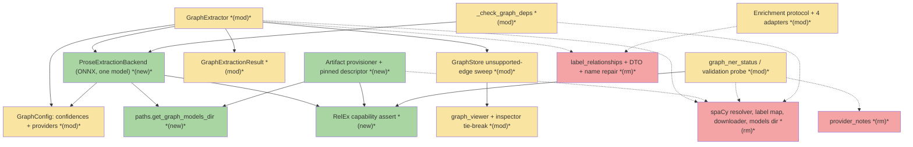
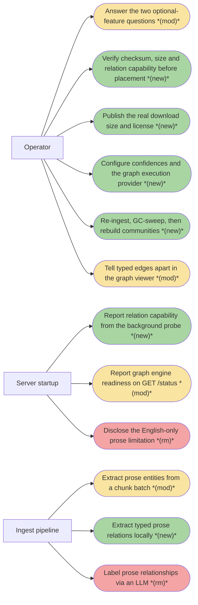
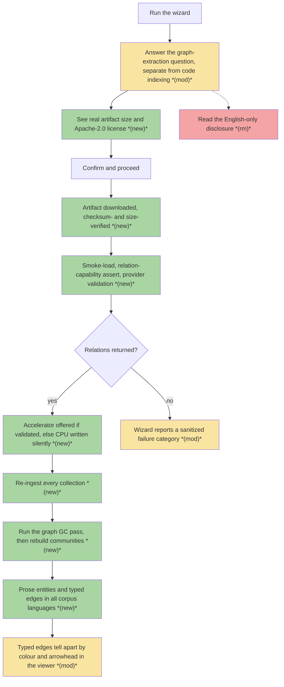
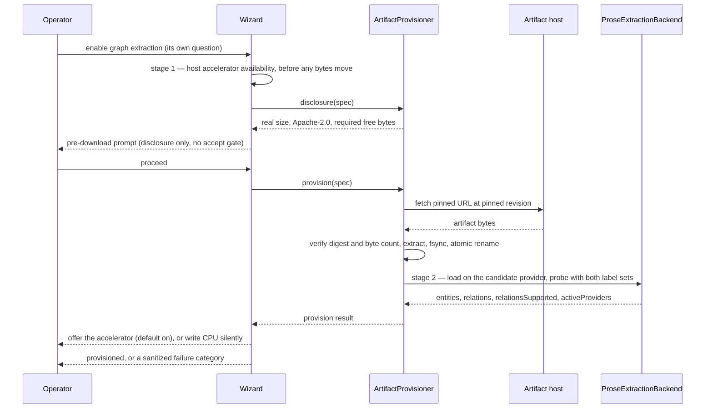
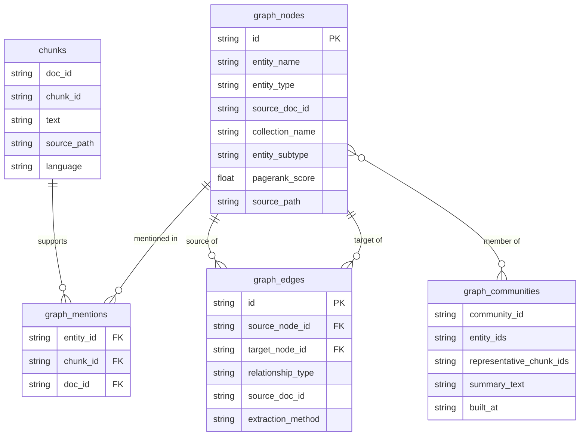

# MGE · Multilingual Graph Extraction Engine — Team Plan

**How to read this file**
- **Architecture approach:** Clean Architecture — the default; no override skill was requested. **Layers:** Presentation · Use Cases · Interface Adapters · Entities · Frameworks & Drivers. Note that [540_code_and_architecture_quality_audit.md](../Architecture/540_code_and_architecture_quality_audit.md) records the runtime as *annotated* rather than *enforced* Clean Architecture — layers come from per-module docstrings and [110_component_catalog_and_layer_breakdown.md](../Architecture/110_component_catalog_and_layer_breakdown.md), not from an import lint.
- **Deployment tier:** client+server, one deployable. A single FastAPI process serves REST, MCP at `/mcp`, and the optional OpenAI shim at `/v1`. There is no separate frontend build.
- The **Frontend, Backend, and Tester** sections are the **depth view** — each role's scope, grouped by layer.
- **Contracts** are authored as **TypeSpec** `.tsp` files beside this plan; the one HTTP/API seam additionally emits a linked `openapi.yaml`.
- **Role tags** (`#frontend-role`, `#backend-role`, `#tester-role`) mark each role-owned section — filter a tag (e.g. in Obsidian) to see one role's whole scope.
- IDs (`S#` scenarios, `C#` contracts, `Q#` decisions) are the traceability thread; search the file for an ID to find where it's defined. `Q#` ids are stable — they kept their numbering when the Open-questions table became the **Decisions** table, so a reference from the brief or from review notes still resolves.
- **Tasks** are not in this file — task breakdown is a separate downstream step that consumes this plan.
- **Rule:** change a contract only by team agreement.

---

## Background

Prose entity extraction runs a single English statistical model. `GraphExtractor` loads it once per process and calls it **one text at a time**, then force-fits its news-corpus label set onto the graph's own entity types through a lossy mapping table — GPE, LOC, FAC, ORG and PRODUCT all collapse to `system`, and anything outside that taxonomy is dropped. There is no official Hungarian model, so per-language routing cannot close the gap either.

Every prose edge the graph builds on its own is an untyped `related_to` co-occurrence edge. The three meaningful prose types (`uses`, `implements`, `depends_on`) exist only when an LLM enrichment AND-gate is open — provider *and* extraction model *and* a built client — one HTTP call per chunk. An air-gapped or provider-less deployment gets no typed prose edges at all, in any language. The code-symbol half of the graph is unaffected: it comes from the AST path, is language-independent, and already emits typed edges without an LLM.

---

## Goal

After this ships, an operator runs the wizard, sees the real download size and license of a pinned model artifact before any bytes move, and gets an artifact that is checksum-verified, atomically placed, smoke-loaded and **asserted to actually return relations**. Ingest then runs one batched, in-process, network-free forward pass per batch of prose chunks and emits the graph's own entity types and its own prose relation types directly — in every corpus language, with no provider configured and no mapping table in between. spaCy is gone from the source tree, the dependency set, the wizard, the status surface and the docs; the LLM relationship-labelling half of the enrichment protocol is gone with it. Operators re-ingest.

---

## Scope

### In Scope

**Engine**
- An engine adapter behind the existing per-batch NER seam inside [graph_extractor.py](../../archon_search/graph_extractor.py), emitting `EntityType` **and** `RelationshipType` values directly. `_LABEL_TO_ENTITY_TYPE` deleted.
- **One checkpoint: `knowledgator/gliner-relex-multi-v1.0`** — multilingual, relation-capable, self-exported to ONNX and hosted by us, driven through `gliner>=0.2.26` (Q1). There is no second model anywhere in this plan.
- Call the combined entity+relation inference entry point, never the entities-only one — the entities-only method cannot return relations, and switching later means re-plumbing the seam.
- Load through the `gliner` package in ONNX mode from [paths.py](../../archon_search/paths.py)'s `get_graph_models_dir()`, with our own session options, a pinned revision, and no run-time network access.
- **Batched inference.** The current seam runs one text per call, which is correct for a statistical model and wasteful for a transformer. This is how the throughput guardrail is met, not an optimisation for later.
- **Execution provider is configurable, defaulting to CPU** (Q7) — the graph engine gets its own `[graph].providers` setting, following the split-providers ADR rather than departing from it. The CoreML partitioning lesson from [2026-08-19-040-double-embedder-load-startup-brief.md](./2026-08-19-040-double-embedder-load-startup-brief.md) is why an accelerator is only ever offered after a real post-download validation against the real artifact.
- Flat (non-nested) spans and single-label spans pinned, with the reason recorded in code so neither is "improved" later. The relation **adjacency threshold** is likewise a pinned constant at the model card's midpoint, not a knob (Q29).
- **Label-description prompting** (Q3): each prompted label carries a one-line description, and an `"other"` decoy label absorbs spans that belong to none of the four real types and is then discarded. Schema values are what gets stored; the descriptions are what disambiguate `depends_on` and stop `concept` over-extracting.
- One shared engine instance, loaded once per process behind a lock — no LRU, no size knob (Q8). The bounded-waiter shape is kept but its disposition is inverted: a wait timeout **degrades the document**, it never 503s an ingest.

**Config**
- `[graph].ner_confidence` (default `0.5`) and `[graph].relation_confidence` (default `0.75`) — two float knobs documented in [archon-search.toml.example](../../archon-search.toml.example) beside `leiden_resolution` / `max_community_size`. Neither is wizard-prompted; graph tuning knobs never are (Q2).
- `[graph].providers` — the graph engine's own execution-provider list, **wizard-owned**, with `--graph-providers` for non-interactive installs, written through the existing `configure_providers()` pattern in [installer.py](../../archon_search/install/installer.py) (Q7).

**Paths**
- `get_graph_models_dir()` lands in [paths.py](../../archon_search/paths.py), role-named rather than vendor-named, laid out as `<data>/models/graph/<model>-<revision>/` (Q6).
- `get_fasttext_models_dir()` **moves** from [language_detector.py](../../archon_search/language_detector.py) into [paths.py](../../archon_search/paths.py) in the same change: [installer.py](../../archon_search/install/installer.py) stops recomputing `get_data_dir() / "models"` by hand, and [app.py](../../archon_search/server/app.py) drops its eager `language_detector` import. The paths-module docstring's "there is no principle" note is replaced with one: **every model-artifact directory accessor lives in `paths.py`** (Q6).

**Provisioning**
- A generic model-artifact provisioner in the installer package: name → pinned URL + revision → **checksum + byte-count** → extract → durable publish → smoke-load → **relation-capability assert**. This does not exist today; the existing step in [extras.py](../../archon_search/install/extras.py) is wheel-shaped end to end and verifies no digest. It is critical path — with spaCy gone there is no fallback engine.
- The artifact's **real size is pinned in the descriptor, generated from the artifact we host, and asserted against bytes received exactly like the checksum** (Q12). The install-time planned-download total is computed from the profile plus the selected extras and feeds the disk guard, both timeouts and the display from one field. The tree-sitter bundle and `lid.176.ftz` get the same descriptor treatment, which closes the existing undercount.
- **One license rule in [licenses.py](../../archon_search/install/licenses.py)** replaces the per-model ad-hoc gates: restrictive-on-use licenses prompt for acceptance, everything else is disclosed and gates nothing (Q15). The pinned artifact is Apache-2.0, so it is disclosure-only. Because we redistribute the ONNX export we host, its LICENSE and attribution ship with the placed artifact.

**Deletions**
- Full spaCy removal across [graph_extractor.py](../../archon_search/graph_extractor.py), [paths.py](../../archon_search/paths.py), [extras.py](../../archon_search/install/extras.py), [__init__.py](../../archon_search/install/__init__.py) (four re-exported public symbols), [wizard.py](../../archon_search/install/wizard.py), [config_writer.py](../../archon_search/install/config_writer.py), [render.py](../../archon_search/install/render.py), [model_validation.py](../../archon_search/model_validation.py), [pipeline.py](../../archon_search/pipeline.py), [app.py](../../archon_search/server/app.py), plus docstrings in [graph_types.py](../../archon_search/graph_types.py), [defref_extractor.py](../../archon_search/defref_extractor.py), [backends.py](../../archon_search/eval/backends.py) and [_durable_io.py](../../archon_search/_durable_io.py). [pyproject.toml](../../pyproject.toml) drops `spacy` from the `[graph]` extra and `en-core-web-sm` (plus its `[tool.uv.sources]` entry) from the dev group; `[graph]` gains `gliner`.
- LLM relationship-labelling removal — precise, not total: the protocol method and its DTO in [graph_enrichment_protocol.py](../../archon_search/graph_enrichment_protocol.py), the method on all four adapters under [enrichment/](../../archon_search/enrichment/), the JSON-schema response-format constraint built for it in [llama_cpp.py](../../archon_search/enrichment/llama_cpp.py), the narrowed-subset constant in [enrichment/__init__.py](../../archon_search/enrichment/__init__.py), the extractor's AND-gate and per-chunk call site, the LLM name-repair helper, and the `llm_fallback_used` / `llm_edges` plumbing that exists only to serve it. The live contract [llama-cpp-enrichment-protocol.tsp](../../tsp_contract/llama-cpp-enrichment-protocol.tsp) is revised in the same change.
- Removal of `provider_notes` from `GET /status` → `model_validation`, plus a mandatory [BREAKING.md](../../BREAKING.md) entry. **No replacement channel** is introduced; the absence is recorded as deliberate in the new ADR (Q10).
- **`_NAME_SPLIT_PATTERN` and `_resolve_labeled_pair` are deleted outright**, together with their test at [test_graph_extractor.py](../../tests/test_graph_extractor.py) lines 360–380 (Q27). They go with the LLM path they served, and nothing equivalent is reintroduced for the new engine: it returns real substrings with character offsets, so the merged-compound-name failure the helper repaired cannot occur. The spike's per-language span review is the check that this holds.
- **`ENGLISH_ONLY_DISCLOSURE` is deleted from [graph_extractor.py](../../archon_search/graph_extractor.py)**, along with the coupling test in [test_install_ui.py](../../tests/test_install_ui.py) that pins the wizard's copy to it (Q19). With no second copy left, there is nothing to drift. The wizard bullet is replaced with an actionable pointer to the two confidence knobs, shown whenever the graph is enabled — the `if multilingual` nesting goes too, since corpus language is not a function of that flag.

**Dependencies**
- `[graph]` gains `gliner>=0.2.26` and drops `spacy`. **`onnxruntime` is deliberately NOT declared** in the extra (Q26): `gliner` hard-depends on it, and declaring it risks conflicting with [installer.py](../../archon_search/install/installer.py)'s CUDA path, which swaps in `onnxruntime-gpu`. We import it directly (we need `SessionOptions` for Q7) behind the existing lazy-helper pattern in [model_validation.py](../../archon_search/model_validation.py), with the reason written next to the helper.
- **`transformers` is pinned as a uv resolver *constraint*, not a dependency** — we never import it: `transformers>=4.51.3,<5.9.0` in `[tool.uv]` `constraint-dependencies` (Q25). One version everywhere, latest allowed within the range, with the reason commented next to it. The ceiling is docling's darwin cap; the floor comes from `gliner`. It resolves to `5.8.1` today and auto-updates inside the range. Today the lock resolves **two** versions under different platform markers (`5.8.1` on darwin, `5.14.1` elsewhere), so this constraint is a step-down for non-macOS on a **base** dependency — which is why the `docling` lane must run in CI for this change and on dependency updates.

**Viewer** *(Q22, Q23)*
- Minimal differentiation in [graph_viewer.html](../../archon_search/server/graph_viewer.html): colour/dash by `relationship_type`, and arrowheads on directional edges only. Roughly five to eight lines. [graph_viewer.html.sha256](../../archon_search/server/graph_viewer.html.sha256) is regenerated and [test_e2j_fe1_graph_viewer_html.py](../../tests/server/test_e2j_fe1_graph_viewer_html.py) updated with it.
- A one-line tie-break change in [graph_inspector.py](../../archon_search/graph_inspector.py): break equal-weight ties in favour of typed edges instead of by `edge_id` hash. Edge weight is endpoint-derived, so a typed edge and its untyped twin tie exactly and the hash decides arbitrarily today.

**Verification**
- Memory, throughput and determinism regression guards (see Acceptance criteria and the Tester section).
- A spike, run **before** implementation: ONNX export and artifact availability for the chosen checkpoint, tokenizer-window measurement on worst-case chunks, confirmation of the pinned adjacency threshold, the real density increase typed edges cause, and a per-language eyeball comparison of entities and relations (including span offsets) against current output. The spike produces the memory budget number; the tester encodes it.

### Out of Scope
- **Deleting the LLM enricher.** Community summarisation is a separate method on the same protocol and survives, as do `[graph].provider`, `[graph].extraction_model`, and the timeout / rate-limit / token-budget fields. Only the relationship half goes.
- **Per-language model routing — rejected.** Node identity hashes `entity_type + name`, so mixed engines split one real-world entity across languages.
- **A `spacy | gliner` engine choice — rejected.** A supported second engine means spaCy can never be deleted and the lossy mapping table survives forever.
- **Data migration / dual-engine transition — rejected.** No production users exist; re-ingest is the whole story.
- **A hand-labeled quality benchmark — dropped.** The swap is committed, so a quality gate cannot change the outcome; the eval harness is retrieval-scoped (recall@k / MRR / nDCG) with no span-level scoring concept.
- **New relationship types.** The engine is prompted with the existing three prose types; code-symbol types stay AST-derived and `synonym_of` stays with the synonym detector.
- Community and PageRank machinery; non-prose chunks; nested or multi-label entity spans.
- **A second checkpoint.** Settled at one (Q1). Nothing in the plan branches on a two-model outcome.
- **An `extraction_method` tag on typed prose edges — rejected.** The GC sweep discriminates on `relationship_type` instead (Q4); a new tag would collide with the def/ref tag precedence the sweep already applies.
- **`adjacency_threshold` as a config knob — rejected.** Pinned constant (Q29); promotion needs evidence the eval harness cannot currently produce.
- **Re-tuning the viewer's node/edge caps.** They are already `[graph]` config, the spike measures the real density increase, and re-tuning is a config change if it turns out to be needed (Q23). Beyond the minimal differentiation above, the viewer's interaction model, legend and relationship-type filter stay out. A separate preexisting defect is noted, not fixed here: the client-side `maxNodes` / `maxEdges` constants in [graph_viewer.html](../../archon_search/server/graph_viewer.html) are assigned and never read.

---

## Acceptance criteria
- Prose chunks in any corpus language produce entity nodes and mentions; a Hungarian sample produces non-trivial output where it produces almost none today.
- Every prose node's `entity_type` comes straight from the engine's label set; no intermediate label vocabulary and no mapping table exist in the source tree.
- Typed prose edges (`uses`, `implements`, `depends_on`) are written with **no provider configured and no network access**.
- Typed edges merge additively alongside `related_to` edges for the same node pair; distinct relationship types yield distinct stable edge ids, so nothing is overridden.
- Typed edges are directed (`head` → source, `tail` → target) and are **not** lexicographically normalised; the `related_to` path keeps its normalisation.
- Chunks carrying a code-symbol type never reach the prose engine; AST-derived edges are byte-identical to today.
- The engine is invoked once per batch of texts, not once per text.
- The wizard discloses the artifact's real size and license before download, verifies the checksum **and the byte count**, publishes durably, smoke-loads, and **fails if relations do not come back**.
- The install-time planned-download total covers the profile and every selected extra, and the disk guard, both timeouts and the display all read that one number.
- The **background model-validation probe** reports relation-extraction capability. It never blocks the listening socket, never raises, and a failed assert degrades to one actionable `provider_warnings` entry rather than failing startup.
- A missing or unusable artifact degrades to code-symbol-only extraction with one sanitized wire-facing warning, never fails an ingest, and never latches on cancellation. A load-wait timeout degrades the document too — it never returns 503.
- `[graph].ner_confidence` and `[graph].relation_confidence` parse, range-validate, and are documented together with their interaction. `[graph].providers` parses and is written by the wizard only after the post-download validation passes; an unwritten field means CPU.
- The wizard asks **two** separate optional-feature questions — code indexing and graph extraction — each stating its own download cost, and each still sets its switch and its package together.
- Two importable ONNX runtimes is reported as a probe failure, not swallowed.
- The viewer distinguishes relationship types by colour or dash and draws arrowheads on directional edges only; the committed viewer hash matches.
- `GET /status` → `model_validation` no longer carries `provider_notes`; the committed OpenAPI snapshot matches and [BREAKING.md](../../BREAKING.md) records the removal.
- No `spacy` / `en_core_web_sm` reference remains in [archon_search/](../../archon_search/), [pyproject.toml](../../pyproject.toml), the wizard copy, the live documentation set, **or any test file** — the last enforced by a structural meta-guard, not by review.
- Re-ingest followed by the graph GC pass leaves no unsupported edge of **any** mention-derived type: the sweep's allowlist covers `related_to`, `uses`, `implements` and `depends_on`.
- Every model-artifact directory accessor lives in [paths.py](../../archon_search/paths.py), and the module docstring states that as a rule rather than as an exception.
- Steady-state memory addition is flat across ≥1,000 prose chunks; total ingest wall time regresses within the declared budget; repeated runs are byte-identical for both entities and relations.
- The full suite passes with zero warnings and coverage at or above the configured floor.

---

## What does NOT change
- `GraphExtractor.extract` — its signature, its per-document call site, and everything downstream of it in the ingest hook.
- The graph tables and their columns. `entity_type` and `relationship_type` are stored as plain strings, so a shift in the *distribution* of values needs no storage change. `STORE_SCHEMA_VERSION` does not move and no `MigrationSpec` is added — the bump policy is triggered only by structural changes to the chunk-table or collection-metadata schemas, neither of which this feature touches.
- The additive edge-merge semantics, and the stable entity/edge id functions in [graph_types.py](../../archon_search/graph_types.py).
- `EntityType` and `RelationshipType` remain closed enums with exactly their current members.
- The degradation contract: `degraded` still triggers deletion of the document's graph rows before rewrite; a not-importable *package* is still the only fatal case; auxiliary graph writes still never fail an ingest.
- The once-per-process latch discipline, and the re-raise-never-latch treatment of cancellation during model load.
- Community summarisation, `[graph].provider`, `[graph].extraction_model`, the enrichment factory and the provider registry.
- The code-symbol AST path, the synonym detector, alias loading, PageRank, Leiden community building.
- `GET /graph/{collection}` node/edge response shapes — `entity_type` and `relationship_type` are already free strings on the wire.
- MCP tool schemas — `provider_notes` was never exposed there.

---

## Known limitations / accepted trade-offs
- **No fallback engine.** Today a missing model degrades to code-symbol-only extraction. That path is retained verbatim, but it is now the only safety net.
- **One resident transformer, and its memory is a single number.** `knowledgator/gliner-relex-multi-v1.0` satisfies all three constraints — multilingual, relation-capable, ONNX-exportable — so the two-model branch the brief hedged against does not arise (Q1). The memory guardrail therefore polices one budget rather than a one-versus-two fork, and it no longer doubles as a go/no-go on the engine choice: the choice is made. Its remaining job is to catch growth and to validate that in-process `asyncio.to_thread` execution is the right host for the model (Q16). If it fails, the escalation is a dedicated never-recycled worker — **not** the docling parse pool, which recycles every twenty-five files and would reload a ~1.28 GB model roughly forty times per thousand files.
- **A deliberate deviation from the house model-memory pattern.** The established shape for resident models is bounded + LRU + lazy + off-the-event-loop with the bound as a config knob. This feature adds one unbounded, uncached, permanently-resident model (Q8). Stated, not hidden — and precisely what the memory guardrail polices.
- **The memory and throughput guardrails bind the CPU configuration only.** An accelerator is allowed via `[graph].providers` but is unmeasured, and the guardrail wording must say so rather than implying the budget covers every configuration (Q7, Q18).
- **Truncation over splitting.** Chunks exceeding the model window are truncated and the event is logged once per process. Chunk boundaries are already arbitrary; a second boundary policy inside the extractor is complexity for a case the spike must show is rare.
- **Extraction confidence does not feed salience.** Salience is already derived three ways from mentions; extraction confidence is a different quantity and would muddy a working signal.
- **Removing `provider_notes` removes the only channel for permanent, unactionable disclosures, and nothing replaces it** (Q10). Anything permanent placed in `provider_warnings` instead would pin `GET /ready` to `warn` for the life of the deployment, so nothing permanent goes there. The absence is recorded in the new ADR so a later reader restores it deliberately or not at all.
- **Re-ingest alone does not clean up.** Changing an entity's type re-keys its node, and the write path is a pure upsert. Stale nodes only disappear once the graph GC pass runs; communities then need a rebuild. The release note must state the order **and** name the two settings that would silently make the pass a no-op: `[maintenance].graph_gc` and `[graph].gc_rebuild_communities` (Q13).
- **The viewer gets differentiation, not a redesign** (Q22). Colour/dash by type plus arrowheads on directional edges is the whole change; a legend, a relationship-type filter and any re-tuned caps stay out. Density will rise and the truncation banner will be seen more often; the caps are already config, so the response to that is a config change, not code (Q23).

---

## Approach & architecture

The swap lands entirely behind the existing extraction seam. The **Interface Adapters** layer keeps `GraphExtractor` as the orchestration point but delegates model lifecycle, session options, batching and threshold handling to a new **Frameworks & Drivers**-facing backend — the same Protocol-backed shape the embedder and reranker already use, rather than growing the extractor into a god class. **One** model lives behind that backend, not two (Q1), so the backend has no checkpoint-routing responsibility and no per-checkpoint fan-out. The **Use Cases** layer loses one protocol method; **Entities** lose one field and gain re-anchored docstrings; **Presentation** loses a wire field and gains a size/license disclosure, a second optional-feature question and an execution-provider offer. **Frameworks & Drivers** additionally gains a role-named artifact-directory accessor in [paths.py](../../archon_search/paths.py) and a widened edge sweep in [graph_store.py](../../archon_search/graph_store.py).

### Architecture

_Scope limited to changed nodes only: the affected area contains roughly ninety components and their one-hop neighbourhood still exceeds the node limit, so the diagram shows the change set alone, collapsed to fifteen nodes — the four spaCy provisioning pieces share one removed node, and the enrichment protocol shares one node with its four adapters. Removed components' last known connections are drawn as dotted edges. Unchanged anchors omitted from the diagram but load-bearing: `SearchPipeline` (sole caller of `extract`), `DefRefExtractor` (the LLM-free typed-edge precedent), `CommunityBuilder` (the surviving enrichment consumer), `EnrichmentClientFactory`, `language_detector` (whose path accessor moves into `paths.py` unchanged in behaviour), and the four `_archon_graph_*` tables._

| Component | Change | Why |
|-----------|--------|-----|
| `ProseExtractionBackend` (ONNX engine adapter) | new | Owns load of the **single** pinned checkpoint, session options built from `[graph].providers`, batching, label-description prompts with the `other` decoy, thresholds and truncation; returns entities **and** directed relations in one forward pass. One instance per process behind a lock; a wait timeout degrades rather than 503s |
| `RelEx capability assert` | new | Structural guard against the silent-degradation hazard — a checkpoint without relation heads accepts the labels and returns nothing. Runs at provision time (where it also carries the accelerator validation) and again inside the **background** validation probe |
| `Artifact provisioner + pinned descriptor` | new | Generic name → URL → revision → checksum **+ byte count** → extract → durable publish → smoke-load → capability assert. The descriptor's size is generated from the hosted artifact and asserted like the digest; the license disposition comes from the one rule in [licenses.py](../../archon_search/install/licenses.py) |
| `paths.get_graph_models_dir` | new | Role-named accessor for `<data>/models/graph/<model>-<revision>/`. Lands together with the **move** of `get_fasttext_models_dir()` into the same module, which turns the docstring's "no principle" note into a rule |
| `GraphExtractor` | modified | Delegates to the new backend; drops the label map, the AND-gate, the per-chunk LLM call and the name-repair helper; routes typed relations into the existing additive edge merge |
| `GraphExtractionResult` | modified | Loses `llm_fallback_used`; `degraded` / `fatal_error` docstrings re-anchored from spaCy to the new package and artifact |
| `GraphConfig` | modified | Gains `ner_confidence` and `relation_confidence` with the sibling range-validated float idiom, plus `providers` — the graph engine's own execution-provider list |
| `Enrichment protocol + 4 adapters` | modified | The protocol narrows to community summarisation only; each adapter drops the relationship-labelling method, its DTO import, and (for the local one) the JSON-schema response constraint |
| `graph_ner_status` / validation probe | modified | Reports the new artifact's state; the `(warnings, notes)` tuple collapses to warnings alone; the capability report rides the existing **background** probe, so nothing new blocks the socket bind |
| `_check_graph_deps` | modified | Guards on the new package rather than spaCy; must keep sharing one implementation with the pipeline-side guard |
| `GraphStore` unsupported-edge sweep | modified | Allowlist widens from `related_to` alone to `related_to` + `uses` + `implements` + `depends_on`, so mention-derived typed prose edges are swept when their support disappears. Discrimination stays on `relationship_type`; no `extraction_method` tag is introduced |
| `graph_viewer` + inspector tie-break | modified | Colour/dash by `relationship_type` and arrowheads on directional edges only (~5–8 lines), with the committed hash regenerated. One line in [graph_inspector.py](../../archon_search/graph_inspector.py) breaks equal-weight ties toward typed edges instead of by `edge_id` hash |
| `spaCy resolver, label map, downloader, models dir` | removed | Resolver chain, compatibility filtering, the unavailable exception, the label map, the English-only disclosure constants, the compatibility-table → wheel URL → unzip → layout-assert download with no digest anywhere, and `get_spacy_models_dir` — all superseded by the generic provisioner and the new accessor |
| `label_relationships` + DTO + name repair | removed | The protocol method, its DTO, the narrowed-subset constant, the JSON-schema constraint built for it, and `_NAME_SPLIT_PATTERN` / `_resolve_labeled_pair`, which existed only to repair its output |
| `provider_notes` | removed | Its only producer was the English-only disclosure; a permanently-empty wire field is dead surface, and no replacement channel is introduced. REST contract change |

**Layer map (and role mapping)**

| Layer | Role | Components |
|-------|------|-----------|
| Presentation | **Frontend** (wizard CLI, HTTP status surface, graph viewer page) | the two wizard optional-feature prompts, the execution-provider offer, wizard summary renderer, `_build_model_validation_status`, `routes_status`, `routes_ready`, `graph_viewer.html` |
| Use Cases | Backend | `SearchPipeline`, `LLMEnrichmentClientProtocol`, `graph_ner_status`, `CommunityBuilder`, `GraphStoreProtocol`, `GraphInspector` |
| Interface Adapters | Backend | `GraphExtractor`, `ProseExtractionBackend`, `RelEx capability assert`, `DefRefExtractor`, the four enrichment adapters, `EnrichmentClientFactory` |
| Entities | Backend | `EntityType`, `RelationshipType`, `ChunkInput`, `GraphNode`, `GraphEdge`, `GraphMention`, `GraphExtractionResult`, `make_stable_entity_id`, `make_stable_edge_id` |
| Frameworks & Drivers | Backend | `GraphStore` and the `_archon_graph_*` tables, `GraphConfig`, the artifact provisioner and its license rule, the `paths.py` model-artifact accessors, `_check_graph_deps`, `_install_graph_extra` |

**What changes**
- The per-text NER seam becomes a **per-batch** seam whose return type carries entities **and** directed relations. This is a signature change, not just a body change — the brief calls the seam unchanged, which is true of `extract` but not of the adapter beneath it.
- Model lifecycle moves out of the extractor into a **Protocol-backed backend**, matching the embedder/reranker shape: lazy load, one load per process, off the event loop, latched failure, cancellation re-raised.
- The extractor's typed-edge source changes from an HTTP call behind an AND-gate to the same local forward pass that produced the entities. The additive merge into the edge dictionary is reused verbatim.
- Provisioning gains a **checksum**, a **byte-count assert** and a **capability assert**, and loses its compatibility-table round trip. The durable staging → fsync → atomic rename → fsync-parent sequence is carried over verbatim.
- The wizard's pre-download prompt gains the artifact's real size and license, and the whole install's planned-download total is computed once from the descriptors so the disk-space guard, both timeouts and the display agree (Q12).
- The wizard splits its one optional-feature question in two — code indexing and graph extraction, each with its own stated cost — while each still writes its switch and installs its package together, so the broken-config guarantee survives (Q14).
- The status surface loses `provider_notes` and gains actionable graph-engine categories in `provider_warnings`, all produced by the background probe.
- The unsupported-edge sweep in [graph_store.py](../../archon_search/graph_store.py) widens its allowlist, and the graph viewer gains type differentiation and arrowheads. Both are downstream of `extract` and were assumed unchanged by the brief.

**Key decisions**
- **One multilingual, relation-capable, ONNX engine** — chosen over a coarse multilingual statistical model, per-language routing, and LLM extraction. Settled on `knowledgator/gliner-relex-multi-v1.0`, self-exported and self-hosted (Q1). The brief's two-model contingency does not apply and nothing in this plan branches on it.
- **Unconditional replacement.** No config flag, no migration, no dual-engine period, no eval gate on adoption. Everyone re-ingests.
- **Relations ship in this brief, not a successor.** The capability comes from the same forward pass; deferring it would mean re-opening the same seam and re-running the same spike.
- **Direct-to-schema labels** for both entities and relations, each carrying a one-line description and backed by an `"other"` decoy — the biggest single quality lever, independent of the language question (Q3).
- **The `gliner` package runs the model, not raw ONNX runtime calls.** Its heavy transitive dependencies are already resolved; reimplementing span decoding and relation adjacency reconstruction would buy nothing and fail silently when subtly wrong. `onnxruntime` still gets imported directly for `SessionOptions`, but is not declared as a dependency (Q26).
- **Confidence thresholds are config knobs**, not constants — the engine scores every span and every relation, so these dials are new surface either way. The adjacency threshold is the counter-example and stays a constant (Q29).
- **The execution provider is a `[graph]` setting, not a hardcoded pin** (Q7) — this feature follows the split-providers ADR rather than deviating from it, with CPU as the silent default whenever the two-stage probe does not clear an accelerator.
- **`provider_notes` is removed, not kept empty, and nothing replaces it.**

### Actors & Use Cases

_Scope limited to change neighbourhood: the affected area has nine actors and twenty-four use cases, so the map shows the twelve use cases this feature adds, changes or removes and the three actors that drive them. The provision-time gates share one node because they are one ordered, non-skippable sequence, and the viewer use case hangs off the Operator rather than adding a fourth actor. Actors omitted as unaffected: API/MCP clients, the maintenance loop, the artifact host, the outgoing model host, and the LLM enrichment provider (which retains its summarisation role). Use cases omitted as unchanged: code-symbol and AST extraction, co-occurrence edge building, graph persistence, community building, synonym detection, graph-mode search, inspection and impact, and orphan collection._

### Flows

#### User Flow

#### Data Flow

```mermaid
flowchart LR
  classDef newNode fill:#a8d5a2;
  classDef modNode fill:#f9e4a1;
  classDef rmNode fill:#f4a4a4;

  HOST["Pinned artifact host (ours)"]
  PROV["Artifact provisioner *(new)*"]
  DD["get_graph_models_dir artifact *(new)*"]
  GE["GraphExtractor *(mod)*"]
  GLE["ProseExtractionBackend *(new)*"]
  GS["GraphStore + edge sweep *(mod)*"]
  VW["graph_viewer *(mod)*"]
  LLM["LLM enrichment provider *(mod)*"]
  ST["Status surface *(mod)*"]

  HOST -- "pinned bytes at a pinned revision" --> PROV
  PROV -- "verified digest and size, fsync, atomic rename" --> DD
  DD -. "load once per process" .-> GLE
  GE -- "batch of prose texts plus described label sets" --> GLE
  GLE -- "entities with offsets, directed relations" --> GE
  GE -- "nodes, mentions, related_to plus typed edges" --> GS
  GS -- "typed edges, differentiated by type and direction" --> VW
  GE -. "per-chunk relationship-labelling call (removed)" .-> LLM
  GLE -- "capability, providers, artifact identity" --> ST

  class PROV newNode;
  class DD newNode;
  class GLE newNode;
  class GE modNode;
  class GS modNode;
  class VW modNode;
  class LLM modNode;
  class ST modNode;
```

#### Sequence

_The ingest-time interaction is already captured by the data flow above; this sequence covers the provisioning path, whose ordering is load-bearing — the disclosure precedes any fetch, the digest and size gates precede placement, and the capability assert precedes reporting success. The two provider probes are drawn where they actually run (Q7): stage 1 is a free pre-download availability check, and stage 2 is not an extra step at all — it rides the smoke-load and capability assert that are mandatory anyway. The accelerator is offered only after stage 2 passes; either stage failing means no prompt and a silent CPU write._

### Prior decisions

| Decision | Rationale | Constraint |
|---|---|---|
| LanceDB as the local vector store; no external database process | Zero external services so the tool ships as a pip-installable package and runs on a laptop | Reinforces the in-process, serverless, deterministic goal. Typed relation edges land in the existing graph tables unchanged — no storage-side constraint |
| fastembed as the embedding and reranker runtime, honouring a configured ONNX provider list | Pip-installable, no-GPU install; one library for both roles; avoid a full training stack at runtime | Bounds model selection to what fastembed exposes. This feature adds a **second** ONNX runtime outside that boundary and needs its own lazy-load, provider selection and warm-up story. The ADR's "no PyTorch at runtime" consequence is already stale — the base dependency set declares it |
| Telemetry is opt-in, local-only, and structurally cannot record raw query strings | A local tool indexing sensitive content must not create a durable record of user intent; the guarantee is structural, not a review-time check | New log sites (truncation latch, provisioning capability failure, startup probe) must not log chunk text verbatim, and no telemetry factory may gain a text parameter |
| All durable state writes route through the atomic-write helpers, enforced by a CI lint gate | An atomic rename gives no durability guarantee; an unclean shutdown mid-write can lose state reported as written | **Hard, and on the critical path.** The new provisioner must satisfy the lint gate. A streamed download to an open file handle is not matched by the gate, so a multi-hundred-MB artifact need not be held in memory — but staging, fsync of the tree, atomic rename and fsync of the parent are mandatory |
| Per-collection embedder LRU cache: bounded, lazy, deduplicated, loaded off the event loop | A loaded ONNX model is 100 MB to several hundred MB; peak memory must be bounded regardless of how many models are configured | The house pattern is bounded + LRU + lazy + off-the-loop with the bound as a config knob. This feature adds **one** permanently-resident model with no cache, no eviction and no knob (Q8) — a deliberate deviation the plan states explicitly, and a narrower one than the brief's two-model hedge implied. Two mechanics stay mandatory: load off the event loop, and a failed eager load must not abort startup |
| MCP mounted at `/mcp` on the same app, same process, same port; `/mcp` absent from the OpenAPI schema | A spike proved mount, round-trip, namespace propagation and lifespan delegation all worked; a second port was unnecessary | Bounds the blast radius of the `provider_notes` removal to REST only — the field never appeared in the MCP schemas or in any live contract file |
| Split ONNX execution-provider configuration per model role, probed at install time and surfaced when degraded | Some Apple Silicon configurations load the cross-encoder under a GPU provider but fail at inference while the embedder succeeds | **This feature FOLLOWS this ADR rather than departing from it** (Q7). The graph engine becomes a third configurable role with its own `[graph].providers`, written through the same `configure_providers()` pattern and validated by the same post-download re-probe shape. What the earlier draft called a hardcoded CPU pin is now CPU-as-default-when-unvalidated — which is what the ADR's own probe-then-degrade discipline produces |
| Bound the embedder-cache waiter with a timeout, raise a typed not-ready error, map it to 503 | A model load can wedge on a stalled disk, a corrupt ONNX file, or a hanging fetch; an unbounded wait parks every concurrent request with no diagnostic | Inherited in **shape but not in disposition** (Q8). The shared-instance load keeps a bounded wait and never lets a waiter mutate loader bookkeeping — but a timeout here degrades the document rather than raising a 503, because graph extraction is an auxiliary write and the house invariant is that an auxiliary write never fails its primary operation. "A corrupt ONNX file" is a larger risk here than for a cached small model, which is exactly why the outcome must be degradation and not a failed ingest |
| HyDE uses a remote LLM, gated twice, always falling back, with a CI guard forbidding verbatim query logging | The recall improvement is well documented; the privacy cost is acceptable only because it is opt-in, key-provisioned, always falls back and is documented | Two things to lean on: the rejection of a *local generative* model for HyDE v1 does not bind a *discriminative* local extraction encoder on the ingest path, so this feature does not reverse it — say so explicitly. And the CI-guard-as-structural-invariant pattern is the house form for the mandatory relation-capability assert |
| RAG fusion is an external-LLM feature, off by default, with air-gapped deployments told to keep it off | Rule-based decomposition cannot generate semantically distinct facet reformulations | Establishes "air-gapped deployment" as a first-class, named operating mode the project already designs around — exactly the constituency this feature's local typed relations serve |
| Ship a local LLM provider and wire graph enrichment for the first time: four adapters behind one protocol carrying **both** community summarisation and relationship labelling; `[graph].provider` is the enrichment gate and defaults to unset | Operators wanted graph enrichment to work rather than silently degrade, and wanted parity with the zero-transmission story; an unset provider preserves the air-gap guarantee | **The most binding prior decision — this feature partially reverses it.** ADRs are append-only here, so **ADR 12** partially supersedes its relationship-labelling half; the superseded ADR itself must not be edited. Confirmed (Q5): one ADR, number `12`, snake_case filename, owned by the backend implementer and landing in the **same change** as the protocol narrowing, with its row added to the ADR index. It also records the engine choice, the provider posture and the deliberate absence of a `provider_notes` successor. The enrichment gate survives but narrows to community summarisation alone. The provider registry and its sync guard are unaffected. The live enrichment contract file declaring the labelling method must be revised in the same change |

_All fourteen ADRs in the repository carry an accepted status; the three with no constraint on this feature (cross-encoder reranking, centroid pre-ranking, description-embedding hybrid routing) are omitted._

### Contradictions

**Code vs. docs**

| Contradiction | Code says | Doc says | Owner |
|---|---|---|---|
| Relationship-type inventory | `RelationshipType` defines **nine** members, including the three prose types this feature makes primary | [130_data_architecture_and_persistence.md](../Architecture/130_data_architecture_and_persistence.md) enumerates **six** values for the edges table | doc needs updating |
| `ModelValidationResult` field list | `provider_notes` exists on the dataclass and is populated on both return paths | [110_component_catalog_and_layer_breakdown.md](../Architecture/110_component_catalog_and_layer_breakdown.md) lists the fields without it | doc needs updating |
| Breaking-changes index completeness | [BREAKING.md](../../BREAKING.md) carries an unreleased entry introducing `provider_notes` and the graph-NER warning category | [03_breaking_changes_index.md](../MigrationGuide/03_breaking_changes_index.md) states its own principle that every entry including unreleased ones gets a row, then carries no row for it; last reviewed months earlier | doc needs updating |
| Breaking-changes list in the developer guide | Same unreleased entry present | [07_versioning_and_breaking_changes.md](../DeveloperGuide/07_versioning_and_breaking_changes.md) claims its list is verified against the file and omits the same entry | doc needs updating |
| Live enrichment contract | The protocol still declares relationship labelling today, and this feature deletes it | [llama-cpp-enrichment-protocol.tsp](../../tsp_contract/llama-cpp-enrichment-protocol.tsp) declares the method, its DTO and a narrowed relationship enum, and states entity names are extracted by spaCy | doc needs updating |
| Corpus-language coverage | Prose extraction becomes language-blind; nothing about the engine is English-specific after this change | Four live statements still say prose extraction is English-only: [65_graph_search.md](../UserManual/65_graph_search.md) line 55, [60_graph_operations.md](../OperatorGuide/60_graph_operations.md) line 99, [90_incident_runbook.md](../OperatorGuide/90_incident_runbook.md) line 116, [20_wizard.md](../UserManual/20_wizard.md) lines 209–210 | doc needs updating (Q24) |
| `provider_notes` vs `provider_warnings` | The English-only disclosure lives in `provider_notes`, which `checks.models` does not grade | [60_graph_operations.md](../OperatorGuide/60_graph_operations.md) line 99 says `provider_warnings` carries it too — wrong today, independent of this feature, and fixed as part of the same doc pass (Q10) | doc needs updating |
| CI extras coverage | [ci-graph-code-extras-gap.md](./ci-graph-code-extras-gap.md) records that `[graph]` and `[code]` are never installed in CI, so every gated test skips | **Stale.** [pyproject.toml](../../pyproject.toml) line 77 pulls `archon-search[multilingual,hyde,rag_fusion,ollama,openai-provider,graph,code]` into the `dev` dependency group, and CI runs `uv sync --dev`. The extras ARE installed. Four places repeat the stale claim: that gap file, this plan (corrected below), and [tests/smoke/conftest.py](../../tests/smoke/conftest.py) lines 17–19 and 375–378 | doc needs updating (Q20) |

*Action:* all eight go into Documentation update with reason *contradiction with code*. The `provider_notes` row is a special case — the removal makes the component-catalog omission accidentally correct, but the same file's extraction paragraph is spaCy-specific and must be rewritten regardless.

**Brief vs. reality**

| Contradiction | Brief assumes | Reality | Owner |
|---|---|---|---|
| Blast radius | Three test files and five documentation files | **Sixty-seven** test files name the outgoing engine, and the coupling is fixture-shaped — three shared stub factories feed every graph integration and smoke test. Around twenty documentation files name it. Resolved as scope, not as a question (Q17): one shared stub in `tests/conftest.py` replaces all thirty definitions, dev-owned, in the same change as the swap | backend |
| Downstream is unchanged | "The extract seam and everything downstream unchanged" | Two downstream components change. The unsupported-edge sweep in [graph_store.py](../../archon_search/graph_store.py) is scoped to `related_to` only and must widen (Q4), and the viewer draws parallel identically-styled edges with the direction discarded at render (Q22). `extract` itself is genuinely unchanged | backend, frontend |

*Resolved by the decision pass and moved out of this section:* the brief's premise that the name-splitting pattern is tuned for statistical-NER span text (it never touched that path; it is deleted outright with the LLM helper — Q27); the transformer-library resolution question (one uv resolver constraint, `>=4.51.3,<5.9.0`, satisfying both platform branches — Q25); and the schema question (zero persisted-schema changes, no version bump, no migration spec — see Data).

---

## Contracts / seams

Boundaries where roles must agree. **Logical, not code** — authored as **TypeSpec**, since it is available on this machine. Five internal logical seams are core-construct `.tsp` files beside this plan, each validated with `tsp compile <file> --no-emit`; the one HTTP/API seam is a TypeSpec HTTP service that also emits an OpenAPI document. Changing one requires team agreement.

**C1 — Prose extraction engine**  *(Interface Adapters ↔ Frameworks & Drivers)*
One call per **batch** of prose texts, prompted with the graph's own entity labels and its own prose relation labels — each paired with a one-line description, plus an `"other"` decoy entity label whose spans are discarded (Q3) — returning threshold-filtered entities (with character offsets, as real substrings) and **directed** relations plus two structural flags: whether the checkpoint actually supports relation extraction, and whether any input was truncated at the model window. Load happens once per process, behind a lock, off the event loop, and never inside the awaited part of lifespan startup; session options come from `[graph].providers` and the resolved providers are reported back. Code-symbol chunks never reach this seam. The relation adjacency threshold is a pinned constant, not a parameter (Q29). — see [2026-08-19-035-multilingual-graph-ner-c1-prose-extraction-engine.tsp](./2026-08-19-035-multilingual-graph-ner-c1-prose-extraction-engine.tsp)

**C2 — Graph extraction result and the degradation contract**  *(Use Cases ↔ Interface Adapters)*
`extract` keeps its shape. The aggregate loses `llm_fallback_used`. `degraded` still means "the prose half could not run" and still causes the caller to delete the document's graph rows before rewriting; `fatal_error` still means, and only means, "the extraction package is not importable" — a missing or unusable *artifact* is degradation, never a fatal abort, and neither is a load-wait timeout (Q8). Warnings remain sanitized constants; no exception message ever reaches them. The relation-capability check is **not** on this seam: it rides the background validation probe (Q9). `extraction_method` stays unset on typed prose edges; the GC sweep discriminates on `relationship_type` instead (Q4). — see [2026-08-19-035-multilingual-graph-ner-c2-extraction-result.tsp](./2026-08-19-035-multilingual-graph-ner-c2-extraction-result.tsp)

**C3 — Enrichment protocol, narrowed**  *(Use Cases ↔ Interface Adapters)*
The protocol keeps exactly one method — community summarisation — with its raise-on-failure semantics unchanged. The relationship-labelling method, its DTO, the narrowed relationship enum and the JSON-schema response constraint are removed from the protocol and from all four adapters. The factory, the provider registry and every `[graph]` provider field survive, now gating summarisation alone. This supersedes the relationship half of the live enrichment contract. — see [2026-08-19-035-multilingual-graph-ner-c3-enrichment-protocol-narrowed.tsp](./2026-08-19-035-multilingual-graph-ner-c3-enrichment-protocol-narrowed.tsp)

**C4 — Model-artifact provisioning**  *(Presentation ↔ Frameworks & Drivers)*
An artifact is pinned by name, URL, revision, digest, exact byte size, license and license disposition. The size is **generated** from the artifact we host and **asserted** against the bytes received, exactly like the digest (Q12); the install-time planned-download total sums the profile's artifacts and every selected extra's, and that one number feeds the disk guard, both timeouts and the display. The license disposition comes from a single rule now living in [licenses.py](../../archon_search/install/licenses.py) — restrictive-on-use prompts, everything else is disclosure-only (Q15). Provisioning is ordered and no step may be skipped: disclose size and license, check free space, download to staging inside the target filesystem, verify the digest and the byte count, extract, fsync the tree, publish by atomic rename under `get_graph_models_dir()`, fsync the parent, smoke-load (which is also where the per-artifact layout assert runs), then assert relations come back. Presence is never trusted — an already-present artifact is re-verified by smoke-load and re-provisioned if it fails. Failure is reported as a sanitized category, never an exception message, and is non-fatal to the wizard run; two importable ONNX runtimes is one such category, never a swallowed exception (Q26). The installer package must not import the graph layer, so the artifact constants live on the installer side. — see [2026-08-19-035-multilingual-graph-ner-c4-model-artifact-provisioning.tsp](./2026-08-19-035-multilingual-graph-ner-c4-model-artifact-provisioning.tsp)

**C5 — `[graph]` engine settings: confidences and providers**  *(Frameworks & Drivers ↔ Interface Adapters)*
Two floats in the half-open range above zero and up to one — defaulting to `0.5` and `0.75` (Q2) — each rejecting a boolean before coercion and raising a sanitized configuration error naming the offending key. Neither confidence knob is wizard-prompted. Their interaction is contractual, not incidental: relations reference spans that already cleared the entity threshold, so raising the entity threshold starves the relation threshold — both must be documented in the same place. Alongside them, `[graph].providers` is the graph engine's own execution-provider list and **is** wizard-owned (Q7): a free pre-download availability check gates whether an accelerator is even a candidate, and the mandatory post-download smoke-load doubles as its real validation. Only after both pass does the wizard offer the accelerator, with the accelerator as the default; either failing means no prompt and a silent CPU write. `--graph-providers` covers non-interactive installs. The relation adjacency threshold is deliberately not here (Q29). — see [2026-08-19-035-multilingual-graph-ner-c5-graph-confidence-config.tsp](./2026-08-19-035-multilingual-graph-ner-c5-graph-confidence-config.tsp)

**C6 — `GET /status` → `model_validation`**  *(HTTP/API seam — Presentation ↔ clients)*
`provider_notes` is removed and **nothing replaces it** — the absence is recorded as deliberate in ADR 12 (Q10). `provider_warnings` keeps its shape and its load-bearing grading semantics — `GET /ready` → `checks.models` is graded on it alone, so only **actionable** strings may go there. A failed relation-capability assert is actionable and belongs there, as does a graph execution-provider step-down; a permanent, unactionable property does not, and after this change there is no channel for one. Every graph-engine entry is produced by the **background** validation probe (Q9), so nothing here blocks the socket bind or raises. `embedder_ok`, `reranker_ok`, `llama_cpp_ok` and `validated_at` are unchanged. Removal is a REST contract change and requires a [BREAKING.md](../../BREAKING.md) entry; the committed OpenAPI snapshot is the artefact that must be regenerated. — see [2026-08-19-035-multilingual-graph-ner-c6-status-model-validation.tsp](./api-contracts/2026-08-19-035-multilingual-graph-ner-c6-status-model-validation.tsp) and [2026-08-19-035-multilingual-graph-ner-c6-status-model-validation.openapi.yaml](./api-contracts/2026-08-19-035-multilingual-graph-ner-c6-status-model-validation.openapi.yaml)

---

## Data

The project has no relational database. Persistence is an embedded columnar store whose schemas are declared in Python; there is no ORM and no migration framework. **This feature makes zero persisted-schema changes** — no column is added, removed or retyped in any table, and the graph tables already carry every column the new engine's output needs. Entity and relationship types are stored as plain strings, so a shift in the distribution of values needs no storage change.

_Entity names above are logical; the real graph tables are named per namespace and collection, and namespace/collection names may not contain a double underscore precisely to guard that name format. No entity carries a change suffix — nothing in this schema changes._

**Migration notes**
- **No schema-version bump and no migration spec.** The bump policy is triggered only by structural changes to the chunk-table or collection-metadata schemas; the graph tables sit in a separate, unversioned regime whose additive column changes are inline and guarded, and none is needed here.
- **The migration is a data migration performed by operators, not by code.** Deleting the label mapping reassigns entity types, and node identity hashes the type — so the same real-world name mints a **new** node row rather than updating the old one.
- **Re-ingest alone is not sufficient.** The write path is a pure upsert and never deletes; the per-document delete only removes edges by source document and code-symbol nodes, deliberately leaving shared entity nodes to mention-based garbage collection. Re-ingest replaces a document's mentions, so a stale node loses its support and becomes collectable — but only once the orphan sweep actually runs.
- **The documented order is: re-ingest every collection → `POST /maintenance/trigger` (CLI: `archon-search maintenance run --wait`) → communities rebuilt.** That is the sequence that already exists; **no new API is added** (Q13). The GC pass flags community invalidation whenever nodes or edges were removed. The brief's release note ("operators re-ingest") is necessary but not sufficient: the release note must state the order **and** name the two settings that would silently turn the pass into a no-op — `[maintenance].graph_gc` and `[graph].gc_rebuild_communities`.
- **The unsupported-edge sweep widens** (Q4). Its allowlist in [graph_store.py](../../archon_search/graph_store.py) currently skips every edge whose `relationship_type` is not `related_to`, on the justification that the co-occurrence loop is that type's only producer. It gains `uses`, `implements` and `depends_on`, which are equally mention-derived. The discriminator stays `relationship_type` and **no `extraction_method` tag is introduced** — a new tag would have to be reconciled against the existing def/ref tag precedence for no gain. The def/ref exemption and the orphan/exempt short-circuits are untouched.

**Entity model changes** (in-memory only, never persisted)
- `GraphExtractionResult` loses `llm_fallback_used`. The field has zero production consumers — it is written in three places in the extractor and read only by tests and one archived contract — so removal is test churn, not a wire change. Decided (Q11): **deleted, with no [BREAKING.md](../../BREAKING.md) entry**, because the type is not exported. `create_pipeline`'s public signature is **unchanged**; its changed construction-time failure *does* get an entry, filed as one entry with two bullets alongside the `provider_notes` removal.
- `LabeledRelationship` is deleted. It was a transient DTO, never persisted.
- `_NAME_SPLIT_PATTERN` and `_resolve_labeled_pair` are deleted with it (Q27), so nothing between the engine's span text and `entity_name` remains. Node identity is therefore a pure function of the engine's own substring plus its label — which is the whole reason the decision could not be deferred.
- `degraded`, `fatal_error`, `ChunkInput.symbol_type` and `GraphEdge.extraction_method` docstrings all name spaCy explicitly and must be re-anchored — docstring-only edits, no field changes.
- `GraphConfig` gains two float fields and one optional string-list field.

---

## Scenarios #tester-role

Behavioural only — step-level detail is produced downstream. Happy, unhappy, edge and non-functional paths.

| id | Scenario (Given / When / Then) |
|----|--------------------------------|
| **S1** | **Given** a corpus of non-English prose (Hungarian) · **When** it is ingested with the graph enabled · **Then** entity nodes and mentions are created from that prose, where today it contributes almost none |
| **S2** | **Given** prose naming a person, a system and a concept · **When** extraction runs · **Then** each node carries the engine's own label as its entity type, with no intermediate vocabulary and no mapping table anywhere in the source tree |
| **S3** | **Given** no enrichment provider configured and no network reachable · **When** prose chunks are ingested · **Then** typed edges (`uses`, `implements`, `depends_on`) are written |
| **S4** | **Given** a chunk that yields both a typed relation and a co-occurrence pair over the same two entities · **When** edges are persisted · **Then** both edges exist with distinct stable ids and neither overrides the other |
| **S5** | **Given** a relation asserted from head to tail · **When** the edge is written · **Then** source and target follow head and tail with no lexicographic normalisation, while the co-occurrence edge for the same pair stays normalised |
| **S6** | **Given** chunks carrying a code-symbol type · **When** extraction runs · **Then** they never reach the prose engine and the AST-derived typed edges are unchanged |
| **S7** | **Given** a document of many prose chunks · **When** extraction runs · **Then** the engine is invoked once per batch, not once per chunk |
| **S8** | **Given** the wizard with graph indexing enabled · **When** provisioning runs · **Then** the pinned artifact is downloaded, digest-verified, published by atomic rename after fsync, smoke-loaded, and reported provisioned |
| **S9** | **Given** the pre-download prompt · **When** the operator is asked to proceed · **Then** the artifact's real size and license appear before any bytes are fetched |
| **S10** | **Given** a usable artifact already present · **When** the wizard re-runs · **Then** it re-verifies by smoke-load and reports already-provisioned without re-downloading |
| **S11** | **Given** a download whose digest does not match the pin · **When** provisioning runs · **Then** nothing is placed, a sanitized failure category is reported, and the wizard continues |
| **S12** | **Given** a checkpoint that accepts relation labels but returns no relations · **When** the wizard's capability assert runs · **Then** provisioning fails loudly and never reports success |
| **S13** | **Given** a provisioned artifact whose forward pass returns no relations · **When** the server starts · **Then** an actionable warning appears in `provider_warnings` and the listening socket still binds promptly |
| **S14** | **Given** the graph enabled and no artifact present · **When** a document with prose chunks is ingested · **Then** the ingest succeeds, chunks persist, code-symbol nodes are written, the result is degraded so the document's stale prose rows are deleted, and one sanitized wire-facing warning is returned |
| **S15** | **Given** a present but unloadable artifact · **When** the engine loads · **Then** the failure is logged and latched once per process, and every subsequent ingest degrades without retrying the load |
| **S16** | **Given** the graph enabled and the extraction package not importable · **When** the app or the pipeline is constructed · **Then** construction fails with a sanitized configuration error before any store, embedder or reranker is built |
| **S17** | **Given** the forward pass raises mid-batch · **When** extraction runs · **Then** chunks still persist, the graph result is degraded, and no exception text reaches any wire-facing field |
| **S18** | **Given** the model load is cancelled · **When** the cancellation propagates · **Then** it is re-raised and no unavailability latch is set for the process lifetime |
| **S19** | **Given** free space below the artifact's requirement · **When** the wizard's disk guard runs · **Then** it fails before download and graph enablement is reverted |
| **S20** | **Given** a chunk longer than the model window once both label prompts are counted · **When** extraction runs · **Then** the text is truncated at the window and the event is logged exactly once per process |
| **S21** | **Given** the entity threshold raised above the relation threshold · **When** extraction runs · **Then** relations over discarded spans are absent, and the documented interaction between the two knobs holds |
| **S22** | **Given** a collection whose graph was built by the previous engine · **When** every document is re-ingested and the graph GC pass runs · **Then** no node and no edge remains without a supporting mention |
| **S23** | **Given** a running server · **When** `GET /status` is read · **Then** `model_validation` carries no `provider_notes` field and the committed OpenAPI snapshot matches |
| **S24** | **Given** an enrichment provider configured · **When** communities are rebuilt · **Then** abstractive summaries are still produced through the surviving protocol method |
| **S25** | **Given** no enrichment provider configured · **When** the server starts and communities are rebuilt · **Then** no configuration error is raised and summaries are simply absent |
| **S26** | **Given** at least a thousand prose chunks ingested in one process · **When** steady-state resident memory is sampled after a warm-up · **Then** the addition stays within the declared budget with no upward trend |
| **S27** | **Given** the reference corpus replay on the reference machine with the CPU execution provider · **When** total ingest wall time is compared against the pre-change baseline · **Then** the regression is within the declared budget |
| **S28** | **Given** the same corpus ingested twice into fresh data directories · **When** the persisted node and edge sets are compared · **Then** they are identical for both entities and relations |
| **S29** | **Given** the engine loads · **When** its execution providers are inspected · **Then** they come from `[graph].providers` alone — defaulting to CPU when that field was never written — and never from the embedder's or the reranker's provider list |
| **S30** | **Given** the truncation latch, the provisioning capability assert and the startup probe all log · **When** their output and the telemetry surface are inspected · **Then** no chunk text appears and no telemetry factory accepts corpus text |
| **S31** | **Given** a host with a usable accelerator · **When** the wizard runs · **Then** the availability pre-check happens before any bytes move, the post-download smoke-load validates the accelerator against the real artifact, and only then is the operator offered the accelerator with it as the default — and stepping down to CPU writes CPU |
| **S32** | **Given** a host with no accelerator, or one whose post-download validation fails · **When** the wizard runs · **Then** no provider prompt is shown at all and CPU is written silently, with the failure never surfacing as an exception message |
| **S33** | **Given** both `onnxruntime` and `onnxruntime-gpu` importable in the same environment · **When** the provider probe runs · **Then** it reports a distinct sanitized failure category rather than swallowing the ambiguity or picking a runtime |
| **S34** | **Given** a graph containing a typed edge and a `related_to` edge over the same node pair · **When** the viewer renders them · **Then** they are visually distinguishable by colour or dash, the typed edge carries an arrowhead in its asserted direction, and the `related_to` edge does not |
| **S35** | **Given** a typed edge and an untyped edge whose weights are exactly equal · **When** the inspector caps and sorts edges · **Then** the typed edge is kept in preference to the untyped one, deterministically, instead of the `edge_id` hash deciding |
| **S36** | **Given** the wizard's optional-feature step · **When** the operator answers · **Then** code indexing and graph extraction are two separate questions, each stating its own download cost, and answering yes to either still sets that feature's switch and installs its package together |
| **S37** | **Given** an artifact download that returns fewer bytes than the pinned descriptor declares · **When** provisioning runs · **Then** the byte-count assert fails before placement with a category distinct from a digest mismatch |
| **S38** | **Given** an install selecting a profile plus the graph and code extras · **When** the planned-download total is computed · **Then** it covers every artifact in that selection, and the disk guard, both timeouts and the displayed figure all read that one number |
| **S39** | **Given** an Apache-2.0 artifact and a restrictive-on-use artifact · **When** each is provisioned · **Then** the permissive one is disclosed without any accept prompt while the restrictive one prompts, from one rule rather than per-model branches — and the placed permissive artifact ships its LICENSE and attribution |
| **S40** | **Given** a document re-ingested so a typed prose edge loses its supporting mentions · **When** the graph GC pass runs · **Then** that edge is swept, exactly as a `related_to` edge would be, while def/ref edges remain exempt |
| **S41** | **Given** the model artifact directory is resolved · **When** `ARCHON_SEARCH_DATA_DIR` is redirected · **Then** both the graph artifact path and the fasttext model path move with it from accessors in [paths.py](../../archon_search/paths.py), and no module recomputes `<data>/models` by hand |
| **S42** | **Given** the whole test suite · **When** it is scanned structurally · **Then** no test file names the removed engine, and the new heavyweight marker is both excluded from the default run and pinned to its own serialisation group |

---

## Frontend — Presentation (wizard CLI · HTTP status surface · graph viewer) #frontend-role

**There is no build-tooling frontend in this project.** The repository has no web build, no bundler and no package manifest for a client. The Presentation surface is the **wizard CLI**, the **HTTP status surface**, and — newly in scope (Q22) — the **self-contained graph viewer page**, which is served as a single static HTML file with an inline script and a committed hash. The earlier draft declared the viewer out of scope; that is reversed. What stays out is a viewer redesign: no legend, no relationship-type filter, no re-tuned caps (Q23).

**Scope:** the operator-facing copy and structure of the wizard's **two** optional-feature questions, the execution-provider offer, the summary and the failure messages; the pre-download size and license disclosure; the shape of the `model_validation` sub-object on the status route; and the minimal edge differentiation in the viewer. Not the provisioning mechanics themselves (Backend, C4), and not the inspector's tie-break (Backend) — only what the operator is shown, when, and in what order.
**Owns layer:** Presentation.

**Done when**
- [ ] The wizard asks **two** questions — code indexing and graph extraction — each stating its own real download cost, with the graph prompt naming no engine and quoting the artifact's real size, and each still setting its switch and installing its package together so a half-configured install is still impossible — S36, S9
- [ ] The graph prompt states the artifact's real download size and its Apache-2.0 license before any bytes move, and no longer advertises a size that excludes the model — S9
- [ ] The English-only prose disclosure is **gone**, replaced by an actionable pointer to `ner_confidence` and `relation_confidence` shown whenever the graph is enabled — no `if multilingual` nesting, since corpus language is not a function of that flag — S9
- [ ] Provisioning failures render as sanitized, remedy-bearing categories — digest mismatch, size mismatch, capability not confirmed, insufficient disk, conflicting ONNX runtimes — never as an exception message — S11, S12, S19, S33, S37
- [ ] A relation-capability failure renders distinguishably from a missing-artifact failure, because the operator remedies differ — S12, S13
- [ ] The accelerator is offered only after the post-download validation passes, with the accelerator as the default; a failure at either probe stage shows **no** prompt and writes CPU silently — S31, S32
- [ ] `GET /status` → `model_validation` no longer exposes `provider_notes`, and the graph-engine categories that remain in `provider_warnings` are actionable — S13, S23
- [ ] The wizard's re-run path reports already-provisioned without re-downloading, and its abort/revert path still reverts graph enablement — S10, S19
- [ ] The viewer distinguishes relationship types by colour or dash and draws arrowheads on directional edges only — roughly five to eight lines in [graph_viewer.html](../../archon_search/server/graph_viewer.html), with [graph_viewer.html.sha256](../../archon_search/server/graph_viewer.html.sha256) regenerated and [test_e2j_fe1_graph_viewer_html.py](../../tests/server/test_e2j_fe1_graph_viewer_html.py) updated — S34
- [ ] No operator-facing string in the wizard, the status surface or the viewer names the outgoing engine or its model — S23

---

## Backend — Entities · Use Cases · Adapters · Frameworks #backend-role

**Scope:** the engine adapter and its model lifecycle; the extractor's rewiring onto it; the deletion of the spaCy resolver surface, the LLM relationship-labelling path and the name-repair helper; the config knobs and the `[graph].providers` plumbing; the two `paths.py` accessors; the generic artifact provisioner, its size and license rules and its durability guarantees; the capability report on the background probe; the widened edge sweep; the inspector tie-break; the shared test-stub replacement; and the `provider_notes` removal with its compatibility entry. Writes both unit and integration tests for its tasks.
**Owns layers:** Entities, Use Cases, Interface Adapters, Frameworks & Drivers.

**Done when**
- [ ] Prose in any corpus language yields entity nodes and mentions, with the engine's own labels used verbatim as entity types, spans returned as real substrings with offsets, and `"other"`-labelled spans discarded — S1, S2
- [ ] Typed prose relations are produced locally, with no provider and no network, and merge additively alongside co-occurrence edges without collision — S3, S4
- [ ] Typed edges preserve direction; co-occurrence edges keep their normalisation — S5
- [ ] Code-symbol chunks bypass the engine and the AST path is untouched — S6
- [ ] The engine is called once per batch, and the single shared instance loads once per process, off the event loop, behind a lock, with a bounded wait whose timeout **degrades the document** rather than returning 503 — S7
- [ ] A missing, corrupt or unloadable artifact degrades cleanly, latches once, deletes the document's stale prose rows, and never fails an ingest — S14, S15, S17
- [ ] A not-importable extraction package still fails construction, from **one** shared implementation used by both the app guard and the pipeline guard — S16
- [ ] Cancellation during load is re-raised and never latched — S18
- [ ] Chunks over the model window are truncated with a once-per-process log; the extractor never emits chunk text into a log, a warning, or telemetry — S20, S30
- [ ] Both confidence knobs parse, range-validate, reject booleans, and are documented together with their interaction; `[graph].providers` parses and an unwritten field reads as CPU — S21, S31
- [ ] The provisioner verifies the digest **and the byte count** before placement, publishes durably through the atomic-write helpers under `get_graph_models_dir()`, re-verifies an already-present artifact, and asserts relation capability before reporting success — S8, S10, S11, S12, S37
- [ ] The planned-download total is computed once from the pinned descriptors for the whole selection, and the disk guard, both timeouts and the wizard display all read it — S38
- [ ] The license rule lives once in [licenses.py](../../archon_search/install/licenses.py) — restrictive-on-use prompts, everything else discloses — and the placed artifact carries its LICENSE and attribution — S39
- [ ] The two-stage provider probe is implemented where it belongs: availability before download, real validation riding the mandatory smoke-load; two importable ONNX runtimes is a reported failure, not a swallowed exception — S31, S32, S33
- [ ] The capability report rides the **background** validation probe: it never blocks the socket bind, never raises, and a failed assert degrades to one actionable `provider_warnings` entry — S13
- [ ] The enrichment protocol narrows to community summarisation across all four adapters, and summarisation still works — with a configured provider and without one — S24, S25
- [ ] `provider_notes` is gone from the dataclass, the wire schema and the route, the snapshot is regenerated, and one compatibility entry covers both it and the changed construction-time failure; `llm_fallback_used` is deleted **without** an entry, and `create_pipeline`'s signature does not move — S23
- [ ] The unsupported-edge sweep's allowlist covers `related_to`, `uses`, `implements` and `depends_on`; the discriminator stays `relationship_type`, no `extraction_method` tag is added, and the def/ref exemption still holds — S22, S40
- [ ] Equal-weight edge ties in [graph_inspector.py](../../archon_search/graph_inspector.py) resolve in favour of typed edges rather than by `edge_id` hash — S35
- [ ] `get_graph_models_dir()` and the moved `get_fasttext_models_dir()` both live in [paths.py](../../archon_search/paths.py); [installer.py](../../archon_search/install/installer.py) stops recomputing `<data>/models`, [app.py](../../archon_search/server/app.py) drops its eager `language_detector` import, and the module docstring states the rule instead of the exception — S41
- [ ] The engine runs in-process off `asyncio.to_thread`, explicitly **not** in the docling parse pool, and no new `Path.home()` call site is introduced — S29, S41
- [ ] `transformers` is constrained once in `[tool.uv]` `constraint-dependencies` with its reason commented; `onnxruntime` stays undeclared and lazily imported with its reason written beside the helper
- [ ] One shared engine stub in `tests/conftest.py` replaces all thirty definitions across the suite, and a structural meta-guard fails the build if any test file names the removed engine — S42
- [ ] **ADR 12** partially supersedes the enrichment ADR's relationship-labelling half in the same change as the protocol narrowing, records the engine choice, the provider posture and the deliberate absence of a `provider_notes` successor, and adds its row to the ADR index; the superseded ADR is not edited

---

## Tester #tester-role

**Scope:** the tester owns **e2e and manual** tests plus the project close-out. **Unit and integration** tests belong to the implementing dev, in each implementation task's `Tests` block.

Two harness facts shape everything below. There is **no browser e2e harness** in this repository — no Playwright, Selenium or Cypress — so "e2e" here means a CLI subprocess, an HTTP/MCP round trip through a real app, or a wizard run driven through the CLI test runner. **The viewer is therefore asserted as text**, through the existing committed-hash and HTML-content test, not through a rendered page. And **no test in the repository performs a real model download**: every download test mocks the URL opener. The provisioning *logic* is fully automatable against a synthetic artifact with a known digest and a known byte count; the network transfer, its real size and its wall time are manual.

**Correction to a stale premise.** Earlier drafts of this plan said the graph extra is never installed in CI. **That is wrong.** [pyproject.toml](../../pyproject.toml) line 77 pulls `archon-search[...,graph,code]` into the `dev` dependency group and CI runs `uv sync --dev`, so the extra **is** installed on every run. Three other places repeat the stale claim and are corrected in the same change: [ci-graph-code-extras-gap.md](./ci-graph-code-extras-gap.md), and [tests/smoke/conftest.py](../../tests/smoke/conftest.py) lines 17–19 and 375–378. The practical consequence is the opposite of what the draft assumed: new package-gated guards **will** run in CI by default, so the design question is budget and isolation, not reachability.

Four constraints the tester must design around:

- **Lane** (Q18). The memory and real-artifact determinism guards get a **new registered marker** with its own `-m` exclusion, its own `xdist_group`, and **both** structural meta-guards mirroring the existing `docling` lane — one asserting the marker is excluded from `addopts`, one asserting every test carrying it is pinned to its serialisation group. Not the smoke lane, not the docling lane. Determinism **splits**: the plumbing half stays in the default integration lane; only the model-decoding half moves to the new lane.
- **Budget.** Derived from the spike's measurement plus headroom for growth, measured post-warm-up, and paired with a host-safety ceiling and a wall-clock cap in the shape of [test_parser_ocr_memory.py](../../tests/test_parser_ocr_memory.py). The spike produces the number; the tester encodes it. The budget binds the **CPU** configuration only — an accelerator is permitted but unmeasured, and the guard's wording must say so.
- **CI** (Q20). The new lane runs as its **own CI step** with an artifact cache and prefetch, plus a did-it-actually-run `--junitxml` assertion mirroring the benchmark step in [archon-search-pr.yml](../../.github/workflows/archon-search-pr.yml). Only memory and real-artifact determinism run there. The growth budget is set from a real CI run, not from a laptop. Separately, the `docling` lane — which runs in **no** workflow today — must run for this change and on dependency updates, because the `transformers` constraint lands on a base dependency.
- **Fixtures** (Q17). The shared engine stubs are dev-owned: one stub in `tests/conftest.py` replaces all thirty definitions (two shared factories in [tests/integration/conftest.py](../../tests/integration/conftest.py) feeding eleven files, one importable duplicate across two files, nineteen local `_install_spacy_stub` definitions and eight `_install_spacy_stub_no_entities` ones), landing in the **same** change as the swap, with a structural meta-guard forbidding any test file from naming the removed engine. The tester's e2e sequences directly behind it.

**Corpus** (Q21). A non-English corpus **already exists**: [tests/eval/corpus/fr-docs/](../../tests/eval/corpus/fr-docs/) holds five real French documents with [LICENSE-DATASETS](../../tests/eval/LICENSE-DATASETS) present. The graph tests point at it. Hungarian stays manual/spike-only. Throughput is gated as a threshold entry with the waiver policy and **two numbers**: a loose ceiling enforced on CI and set from real CI runs, and a tight ten-percent Apple-Silicon figure documented as a manual reference check. Note a silent-skip hole while doing this: [tests/eval/conftest.py](../../tests/eval/conftest.py) lines 51–59 skips locally when `--thresholds-path` is absent, so a gated test can pass by never running.

**Smoke fixture** (Q28). The graph smoke fixture gains a **non-English document**, and its sanity assertion tightens from `edge_count >= 1` — which passes on co-occurrence alone, the exact silent-no-op failure — to **at least one typed, non-co-occurrence edge**. Its guard at [tests/smoke/conftest.py](../../tests/smoke/conftest.py) line 390 must skip on a **missing artifact** as well as a missing package; today it only `importorskip`s the package, so an installed package with no artifact would fail the fixture instead of skipping.

**Allocation** — each scenario at the cheapest level that proves it *(unit + integration are dev-written; e2e + manual are the tester's tasks)*

| Scenario | Cheapest level |
|----------|----------------|
| S2, S5, S7, S20, S21, S29, S30, S35 | unit |
| S3, S4, S6, S14, S15, S16, S17, S18, S22, S23, S24, S25, S33, S40, S41 | integration |
| S1 | e2e (stubbed engine returning non-Latin spans — proves the plumbing is language-blind) **+ e2e on [fr-docs/](../../tests/eval/corpus/fr-docs/)** (real non-English documents already in the repository) **+ manual** (Hungarian quality; no Hungarian corpus exists) |
| S8, S10, S11, S12, S19, S37 | e2e (wizard driven through the CLI test runner, URL opener mocked, synthetic artifact with a known digest and byte count) |
| S9, S36 | e2e (wizard render assertions + CLI output; both questions and both stated costs) |
| S13 | e2e (startup with a stub that omits relations; assert the warning, that the probe does not raise, and that the socket binds) |
| S31, S32 | e2e (wizard with the availability check and the post-download validation stubbed to each outcome; assert the offer appears only after both pass, and that failure prompts nothing and writes CPU) |
| S34 | e2e (HTML-content assertions on the served viewer page + regenerated committed hash — there is no browser harness) |
| S38 | integration (planned-download total over a synthetic multi-artifact selection; assert the disk guard, both timeouts and the rendered figure read the same number) |
| S39 | integration (one permissive and one restrictive descriptor through the single rule) **+ manual** (that the placed artifact really carries its LICENSE and attribution) |
| S42 | unit — structural meta-guards, in the shape of the existing `docling` pair |
| S26 | e2e — **new opt-in real-artifact lane**, tester-owned, running as its own CI step: process-tree resident-memory sampling via the shell, warm-up excluded from the baseline, a named budget constant from a CI run, a host-safety ceiling and a wall-clock cap. CPU configuration only |
| S27 | **manual** (the reference corpus is not committed) — automatable proxy: a graph-enabled variant of the existing single-file ingest-latency guard with its own threshold entry, gated on the loose CI ceiling with the tight Apple-Silicon figure documented beside it |
| S28 | integration (plumbing determinism: ingest twice, assert identical node and edge id sets) **+ the new real-artifact lane** (the model's own decoding) |

---

## Documentation update

Docs the feature touches — the tasks file's close-out task works through this list.

- [ ] [2026-08-19-035-multilingual-graph-ner-brief.md](./2026-08-19-035-multilingual-graph-ner-brief.md) — *no change needed* (source brief)
- [ ] [2026-08-19-035-multilingual-graph-ner-team-plan.md](./2026-08-19-035-multilingual-graph-ner-team-plan.md) — *new feature* (this file)
- [ ] [BREAKING.md](../../BREAKING.md) — *new feature* — **one** entry with two bullets: the `provider_notes` removal and the changed construction-time failure. `llm_fallback_used` gets **no** entry (the type is unexported) and `create_pipeline`'s signature does not move (Q11). The existing unreleased entry is superseded, not edited. The release note must state the re-ingest → maintenance-trigger → community-rebuild order and name `[maintenance].graph_gc` and `[graph].gc_rebuild_communities` as the settings that would make the pass a no-op (Q13)
- [ ] [archon-search.toml.example](../../archon-search.toml.example) — *new feature* — replace the spaCy provisioning paragraph; document both confidence knobs (`0.5` / `0.75`) and their interaction beside the community-tuning knobs; document `[graph].providers` and that the wizard writes it; correct the extraction-model comment, which currently claims it also labels relationships
- [ ] [60_graph_operations.md](../OperatorGuide/60_graph_operations.md) — *new feature* + *contradiction with code* — the deepest surface: extras table, provisioning section, the air-gapped manual-placement recipe (rewrite, not edit — there is no ONNX analogue), the co-occurrence/GC section (now covering four relationship types), the post-upgrade ordering, and the LLM-enrichment section, which must stop describing typed edges as an enrichment feature. **Line 99 is doubly wrong:** it states the English-only limitation, which this feature removes (Q24), *and* claims `provider_warnings` carries the disclosure — it does not, and never did; only `provider_notes` did (Q10). Add a cross-reference to the new corpus-vs-interface-language section in `220`
- [ ] [20_monitoring_and_alerts.md](../OperatorGuide/20_monitoring_and_alerts.md) — *new feature* — the `provider_warnings` description and the alert-table exception row keyed on the old model name
- [ ] [90_incident_runbook.md](../OperatorGuide/90_incident_runbook.md) — *new feature* + *contradiction with code* — the ready-warn triage sources and the "code symbols but no prose entities" symptom entry. Line 116 names the old model, its two remedies and the `provider_notes` channel that no longer exists, and repeats the English-only claim (Q24); it gains the new graph-engine warning categories instead, including the execution-provider step-down
- [ ] [80_capacity_and_performance.md](../OperatorGuide/80_capacity_and_performance.md) — *new feature* — the extraction capacity row, which describes a statistical model in a worker thread
- [ ] [110_component_catalog_and_layer_breakdown.md](../Architecture/110_component_catalog_and_layer_breakdown.md) — *contradiction with code* — the extractor's whole paragraph is engine-specific; the enrichment-protocol row documents both halves; the model-validation row omits `provider_notes`; a row is needed for the new engine module
- [ ] [130_data_architecture_and_persistence.md](../Architecture/130_data_architecture_and_persistence.md) — *contradiction with code* — the relationship-type value list is incomplete for exactly the three types this feature makes primary; also the data-dir model row, the durable-write registry entry, and the extraction-method semantics note
- [ ] [03_breaking_changes_index.md](../MigrationGuide/03_breaking_changes_index.md) — *contradiction with code* — missing a row for the existing unreleased entry, against its own stated principle; this feature adds a second missing row
- [ ] [07_versioning_and_breaking_changes.md](../DeveloperGuide/07_versioning_and_breaking_changes.md) — *contradiction with code* — claims its entry list is verified and omits the same entry
- [ ] [llama-cpp-enrichment-protocol.tsp](../../tsp_contract/llama-cpp-enrichment-protocol.tsp) — *contradiction with code* — declares the relationship-labelling method, its DTO, the narrowed relationship enum and a privacy note naming the outgoing engine; superseded by C3
- [ ] [600_api_reference_or_public_interface.md](../Architecture/600_api_reference_or_public_interface.md) — *new feature* — remove the `provider_notes` row; update the `provider_warnings` description and the ready-warn semantics
- [ ] [100_system_architecture_overview.md](../Architecture/100_system_architecture_overview.md) — *new feature* — the pipeline overview names the outgoing engine
- [ ] [210_performance_and_scalability.md](../Architecture/210_performance_and_scalability.md) — *new feature* — no graph-extraction throughput guard and no memory guard is listed today; both arrive here
- [ ] [200_testing_strategy.md](../Architecture/200_testing_strategy.md) — *new feature* — the new marker, its `-m` exclusion, its `xdist_group`, both structural meta-guards, and the per-worker memory budget note; state explicitly that the budget binds the CPU configuration only. Also record that the graph extra **is** installed in CI via the dev group, correcting the long-standing assumption to the contrary
- [ ] [220_accessibility_and_internationalization.md](../Architecture/220_accessibility_and_internationalization.md) — *new feature* — **extend it with the corpus-language vs interface-language distinction** (Q24): the interface stays English by design; the corpus is unrestricted, with quality varying by language. This is where the posture is recorded at architecture level, and the two graph guides cross-reference it. Its own review was due 2026-08-20, so the pass is due regardless
- [ ] [530_technical_debt_refactoring_roadmap.md](../Architecture/530_technical_debt_refactoring_roadmap.md) — *new feature* — record the one deliberate deviation that survives the decision pass (a single unbounded, uncached, permanently-resident model) and the two preexisting defects this feature surfaces but does not fix: the dead client-side `maxNodes` / `maxEdges` constants in [graph_viewer.html](../../archon_search/server/graph_viewer.html), and the silent-skip hole at [tests/eval/conftest.py](../../tests/eval/conftest.py) lines 51–59. The hardcoded-execution-provider item is **not** debt — Q7 made it a configurable setting
- [ ] [990_documentation_index_and_contribution_guide.md](../Architecture/990_documentation_index_and_contribution_guide.md) — *new feature* — the index must gain the new ADR row; updating it is stated policy, not convention
- [ ] **ADR 12** (snake_case filename, next free number) — *new feature* — partially supersedes the local-LLM-provider ADR's relationship-labelling half, and records the engine choice, the `[graph].providers` posture and its two-stage probe, the single-unbounded-resident-model deviation, and the **deliberate absence** of a `provider_notes` successor channel. Owned by the backend implementer, landing in the same change as the protocol narrowing. The superseded ADR must not be edited
- [ ] [10_installation.md](../UserManual/10_installation.md) — *new feature* — extras table, startup-failure vs degrade distinction, not-on-PyPI rationale, data-dir layout row
- [ ] [20_wizard.md](../UserManual/20_wizard.md) — *new feature* + *contradiction with code* — the **two** optional-feature questions and their separate costs, the provisioning explanation, the failure copy, the execution-provider offer, and the step-9 output transcript. Lines 209–210 carry the English-only note verbatim and must go (Q24)
- [ ] [30_configuration.md](../UserManual/30_configuration.md) — *new feature* — the prose-extraction prerequisite, the `[graph].enabled` row, and the provider row, which claims it also labels relationships
- [ ] [65_graph_search.md](../UserManual/65_graph_search.md) — *new feature* + *contradiction with code* — install steps, the hard-startup-requirement statement, the extraction description, both degraded wordings, and the hover-tooltip sentence, which is superseded by the viewer's colour/dash and arrowhead differentiation. Line 55 states the English-only limitation and points at `provider_notes`; both disappear (Q24, Q10). Cross-reference the new `220` section
- [ ] [70_code_graph_and_impact.md](../UserManual/70_code_graph_and_impact.md) — *new feature* — restates the package-absent configuration error
- [ ] [160_troubleshooting.md](../UserManual/160_troubleshooting.md) — *new feature* — two dedicated symptom sections, both engine-specific
- [ ] [docker-test-runner.md](../docker-test-runner.md) — *new feature* — the compose services and the documented bootstrap run a model-download command that will no longer exist; also the "why the graph extra" section and the cache guidance keyed on the old download cost. The real compose override file changes with it
- [ ] [03_world_class_roadmap.md](./03_world_class_roadmap.md) — *new feature* — the shipped-GraphRAG entry names the outgoing engine; the LLM-enrichment entry is half-deleted by this feature
- [ ] [ci-graph-code-extras-gap.md](./ci-graph-code-extras-gap.md) — *contradiction with code* — **the gap it records is closed and its central claim is now false.** `uv sync --dev` pulls both extras via [pyproject.toml](../../pyproject.toml) line 77, so no test gated on them skips in CI. The file is corrected or retired, not extended
- [ ] [tests/smoke/conftest.py](../../tests/smoke/conftest.py) — *contradiction with code* — docstrings at lines 17–19 and 375–378 both assert the graph extra is not in the `dev` group. Both are wrong and are corrected alongside the fixture's new non-English document, its tightened typed-edge assertion, and its missing-artifact skip (Q28)
- [ ] [pyproject.toml](../../pyproject.toml) — *new feature* — the `transformers` constraint in `[tool.uv]` `constraint-dependencies` with the reason commented next to it, `gliner>=0.2.26` in `[graph]`, and the removal of `spacy` plus the `en-core-web-sm` `[tool.uv.sources]` entry (Q25)
- [ ] [archon-search-pr.yml](../../.github/workflows/archon-search-pr.yml) — *new feature* — the new lane's own step with artifact cache, prefetch and a did-it-actually-run junitxml assertion, plus running the `docling` lane for this change and on dependency updates (Q20, Q25)

**Consulted (read-only)**
- [CLAUDE.md](../../CLAUDE.md) — the hard invariants this plan is written against: authoritative OpenAPI, mandatory compatibility entry, auxiliary writes never fail a primary operation, one data-directory accessor, lifespan never awaits slow work, no exception text in wire-facing fields
- [tests/CLAUDE.md](../../tests/CLAUDE.md) — suite layout and the mandatory-parallelism rule that shapes every heavyweight guard
- [540_code_and_architecture_quality_audit.md](../Architecture/540_code_and_architecture_quality_audit.md) — records that Clean Architecture here is annotated, not enforced
- [150_security_and_privacy_architecture.md](../Architecture/150_security_and_privacy_architecture.md) — air-gapped and data-residency guidance, written for provider selection
- [2026-08-19-000-oom-crash-incident-report.md](./2026-08-19-000-oom-crash-incident-report.md) — the incident the memory guardrail descends from
- [2026-08-19-030-graph-spacy-download-retry-and-ingest-abort-brief.md](./2026-08-19-030-graph-spacy-download-retry-and-ingest-abort-brief.md) — the decision trail, the engine comparison, and the provisioning path this feature deletes
- [2026-08-19-040-double-embedder-load-startup-brief.md](./2026-08-19-040-double-embedder-load-startup-brief.md) — the execution-provider partitioning lesson behind CPU-as-default and behind validating an accelerator against the real artifact rather than against host availability alone
- [2026-08-19-070-fasttext-numpy2-language-detection-brief.md](./2026-08-19-070-fasttext-numpy2-language-detection-brief.md) — why every chunk's language field is empty, so test fixtures must be selected by hand
- [llama-cpp-local-provider-team-plan.md](./llama-cpp-local-provider-team-plan.md) — the enrichment provider contract this feature narrows
- [00_index.md](../OperatorGuide/00_index.md), [00_index.md](../UserManual/00_index.md) — index rows pointing at the two graph guides
- [README.md](../../README.md), [ONBOARDING.md](../../ONBOARDING.md), [contributing.md](../../contributing.md), [quick_start.md](../quick_start.md), [product_guide.md](../product_guide.md) — checked; none mentions the engine, its model or the removed field

---

## Decisions

Every question this plan opened is resolved; the ids are stable and carry their original numbering. Q29 was raised and settled during the decision pass. Body sections above are the normative text — this table is the index.

| id | Area | Decision |
|----|------|----------|
| **Q1** | feature / spike | **One** checkpoint: `knowledgator/gliner-relex-multi-v1.0`, self-exported to ONNX and hosted by us, driven through `gliner>=0.2.26`. The brief's two-model contingency is closed; nothing in the plan branches on it. |
| **Q2** | feature / spike | `ner_confidence = 0.5`, `relation_confidence = 0.75` — inside the model card's ranges, leaning to precision, with the relation knob deliberately stricter. |
| **Q3** | feature / spike | Store the schema values, but prompt with **label→description dicts** plus an `"other"` decoy entity label whose spans are discarded. Settled before the spike, not by it. |
| **Q4** | architecture | Widen the unsupported-edge sweep's allowlist from `related_to` alone to `related_to` + `uses` + `implements` + `depends_on`. Discriminator stays `relationship_type`; **no** `extraction_method` tag. |
| **Q5** | architecture | One ADR, number **12**, snake_case filename, partially superseding the enrichment ADR's relationship-labelling half. Owned by the backend implementer, landing in the same change as the protocol narrowing, with its row added to the ADR index. |
| **Q6** | architecture | `get_graph_models_dir()` in [paths.py](../../archon_search/paths.py) → `<data>/models/graph/<model>-<revision>/`, role-named not vendor-named, with the layout assert running inside the smoke-load. **Added scope:** move `get_fasttext_models_dir()` there too, stop [installer.py](../../archon_search/install/installer.py) recomputing the path, drop [app.py](../../archon_search/server/app.py)'s eager `language_detector` import, and replace the docstring's "no principle" note with the rule that every model-artifact accessor lives in `paths.py`. |
| **Q7** | architecture | The graph engine gets its **own** `[graph].providers` setting, wizard-owned, via a **two-stage probe**: a free pre-download availability check, then real validation riding the mandatory smoke-load against the real artifact. Offer comes only after stage 2, with the accelerator as the default; either stage failing means no prompt and a silent CPU write. `--graph-providers` for non-interactive installs, written through `configure_providers()`. Guardrails bind CPU; accelerator is allowed but unmeasured and the wording must say so. This makes the feature **follow** ADR-10 rather than depart from it. |
| **Q8** | architecture | A single instance, loaded once per process behind a lock. No LRU, no size knob. The ADR-11 bounded-wait shape is kept but its disposition is **inverted**: a timeout degrades the document, never 503s the ingest. |
| **Q9** | architecture | The relation-capability check surfaces through the existing **background** model-validation probe — never blocking the socket, never raising, degrading to one actionable `provider_warnings` entry. That resolves the brief's assert-versus-degrade conflict in favour of degrade. |
| **Q10** | architecture | Remove `provider_notes` with **no** replacement channel; the absence is recorded as deliberate in ADR 12. Also fixes a live doc bug: [60_graph_operations.md](../OperatorGuide/60_graph_operations.md) line 99 wrongly says `provider_warnings` carries the disclosure. |
| **Q11** | contracts | Delete `llm_fallback_used` with **no** [BREAKING.md](../../BREAKING.md) entry — the type is not exported. `create_pipeline`'s signature is unchanged; its changed construction-time failure *does* get an entry, filed as one entry with two bullets alongside the `provider_notes` removal. |
| **Q12** | architecture | Compute the planned-download total at install time over the profile plus selected extras; it feeds the disk guard, both timeouts and the display. Size is **pinned in the artifact descriptor**, **generated** from the artifact we host, and **asserted** against bytes received like the checksum — never hand-typed, never fetched at run time, never read off a model card. Same treatment for the tree-sitter bundle and `lid.176.ftz`, closing the existing undercount. |
| **Q13** | feature | Document the sequence that already exists — re-index all collections → `POST /maintenance/trigger` (CLI `archon-search maintenance run --wait`). **No new API.** The release note states the order and names `[maintenance].graph_gc` and `[graph].gc_rebuild_communities` as the settings that would make the pass a no-op. |
| **Q14** | architecture | Split the wizard's optional-feature step into **two** questions — code indexing and graph extraction — each stating its own cost. Each still sets switch and package together, so the broken-config guarantee survives. Prompt text rewritten: no engine name, real size. |
| **Q15** | architecture | No accept prompt: the artifact is Apache-2.0. A **rule** goes into [licenses.py](../../archon_search/install/licenses.py) — restrictive-on-use prompts, everything else is disclosure-only. Because we redistribute the export we host, LICENSE and attribution ship with the artifact. |
| **Q16** | architecture | Keep `asyncio.to_thread` in-process. Explicitly **not** the docling parse pool, which recycles every twenty-five files and would reload a ~1.28 GB model roughly forty times per thousand. If the memory guardrail fails, escalate to a dedicated never-recycled worker. |
| **Q17** | tests | **One** shared engine stub in `tests/conftest.py` replaces all thirty definitions across the suite (2 shared factories → 11 files; 1 importable duplicate → 3 files; 19 local `_install_spacy_stub`; 8 local `_install_spacy_stub_no_entities`; 67 files name the engine), plus a structural meta-guard forbidding any test file from naming it. Dev-owned, same change as the swap; the tester's e2e sequences directly behind. |
| **Q18** | tests | A **new** registered marker with its own `-m` exclusion, its own `xdist_group` and **both** structural meta-guards, mirroring the `docling` lane. Not smoke, not docling. Budget from the spike plus growth headroom, measured post-warm-up, with a host-safety ceiling and a wall-clock cap. Determinism **splits**: plumbing stays in the default integration lane, model decoding moves to the new one. |
| **Q19** | feature | Replace the English-only bullet with an actionable pointer to the two confidence knobs, shown whenever the graph is enabled — the `if multilingual` nesting goes. Delete the extractor-side `ENGLISH_ONLY_DISCLOSURE` constant **and** its coupling test, so no second copy remains to drift. |
| **Q20** | tests | Cache and prefetch the artifact, and run the new lane as its **own** CI step with a did-it-actually-run junitxml assertion. Growth budget set from a CI run, not a laptop. Only memory and real-artifact determinism run there. **Also corrects four stale "CI lacks the graph extra" claims** — CI *does* install it via the dev group ([pyproject.toml](../../pyproject.toml) line 77). |
| **Q21** | tests | A threshold entry with the waiver policy and **two numbers**: a loose ceiling enforced on CI from real CI runs, and a tight ten-percent Apple-Silicon figure documented as a manual reference check. The non-English corpus **already exists** — [tests/eval/corpus/fr-docs/](../../tests/eval/corpus/fr-docs/), five real French documents with [LICENSE-DATASETS](../../tests/eval/LICENSE-DATASETS) — so the graph tests point at it. Hungarian stays manual. A silent-skip hole at [tests/eval/conftest.py](../../tests/eval/conftest.py) lines 51–59 is noted. |
| **Q22** | frontend | The viewer is **in scope**, minimally: colour/dash by `relationship_type` and arrowheads on directional edges only, ~5–8 lines, with the committed hash and its test regenerated. A preexisting defect is recorded, not fixed: the client-side `maxNodes` / `maxEdges` constants are dead. |
| **Q23** | frontend | Leave the node/edge caps alone — they are already `[graph]` config; the spike measures the real density increase and re-tuning is a config change if needed. **Plus one line:** break equal-weight edge ties in favour of typed edges instead of by `edge_id` hash in [graph_inspector.py](../../archon_search/graph_inspector.py). Weight is endpoint-derived, so a typed edge and its untyped twin tie exactly. |
| **Q24** | docs | Extend [220_accessibility_and_internationalization.md](../Architecture/220_accessibility_and_internationalization.md) with the corpus-language vs interface-language distinction — interface English by design, corpus unrestricted with quality varying — and cross-reference it from the graph guides. Four now-false statements are updated or deleted: [65_graph_search.md](../UserManual/65_graph_search.md) line 55, [60_graph_operations.md](../OperatorGuide/60_graph_operations.md) line 99, [90_incident_runbook.md](../OperatorGuide/90_incident_runbook.md) line 116, [20_wizard.md](../UserManual/20_wizard.md) lines 209–210. |
| **Q25** | dependencies | **One** version everywhere, latest allowed: pin `transformers>=4.51.3,<5.9.0` as a uv **constraint** in `[tool.uv]` `constraint-dependencies`, not as a dependency — we never import it. Ceiling is docling's darwin cap, floor comes from `gliner`; resolves to `5.8.1` today and auto-updates inside the range, with the reason commented next to it. Because the step-down lands on a **base** dependency, the `docling` lane — which runs in no workflow today — must run for this change and on dependency updates. |
| **Q26** | dependencies | Do **not** declare `onnxruntime` in the `[graph]` extra: `gliner` hard-depends on it, and declaring it risks conflicting with the CUDA path in [installer.py](../../archon_search/install/installer.py) that swaps in `onnxruntime-gpu`. Import it directly (we need `SessionOptions` for Q7) behind the existing lazy-helper pattern, with the reason written beside the helper. The post-download probe treats "both runtimes installed" as a probe **failure**, not a swallowed exception. |
| **Q27** | architecture | Delete `_NAME_SPLIT_PATTERN`, `_resolve_labeled_pair` and their test with the LLM path. Reintroduce nothing: the new engine returns real substrings with offsets, so the compound-name failure the helper repaired does not exist. The spike's per-language span review is the check. |
| **Q28** | tests | The graph smoke fixture gains a **non-English** document, and its sanity assertion becomes "at least one typed, non-co-occurrence edge" — `edge_count >= 1` passes on co-occurrence alone, which is exactly the silent-no-op failure. Its guard at [tests/smoke/conftest.py](../../tests/smoke/conftest.py) line 390 must skip on a **missing artifact** too, not only a missing package. |
| **Q29** | architecture | *(raised and settled during the decision pass)* Pin `adjacency_threshold` as a **constant** at the model card's midpoint (~0.6), with the reason in code. Not a config knob: the effect is indirect and unmeasurable without span-level scoring the eval harness does not have. The spike confirms the value; promotion to a setting requires evidence. |

**Open questions: none.** Every id above is resolved and the status is `planned`. Two items are deliberately deferred *outside* this feature rather than left open inside it: converting the fasttext CC-BY-SA gate from a prompt to disclosure-only under the new licence rule (a follow-up for the owner to file, not scoped here), and re-tuning the viewer's node/edge caps, which is a config change if the spike's density measurement calls for one.

---

## References

- **Brief:** [2026-08-19-035-multilingual-graph-ner-brief.md](./2026-08-19-035-multilingual-graph-ner-brief.md)
