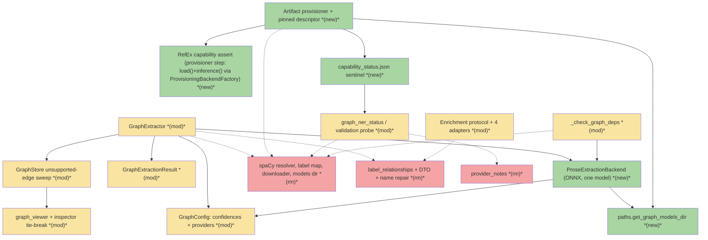
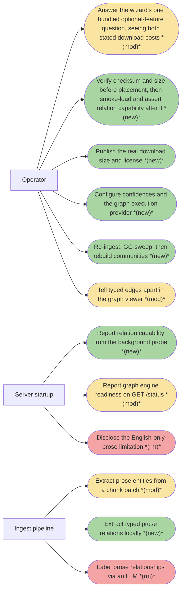
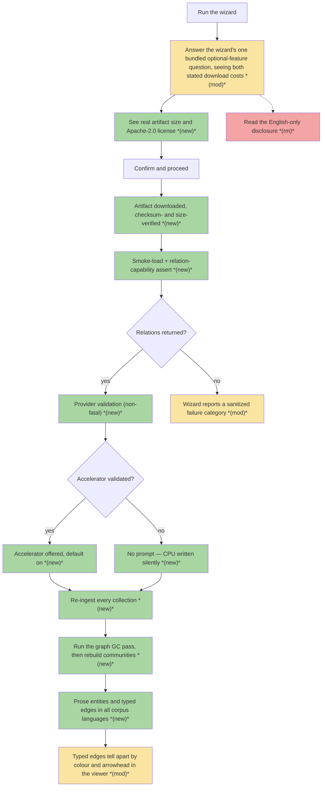
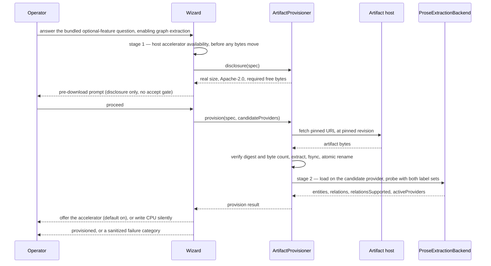
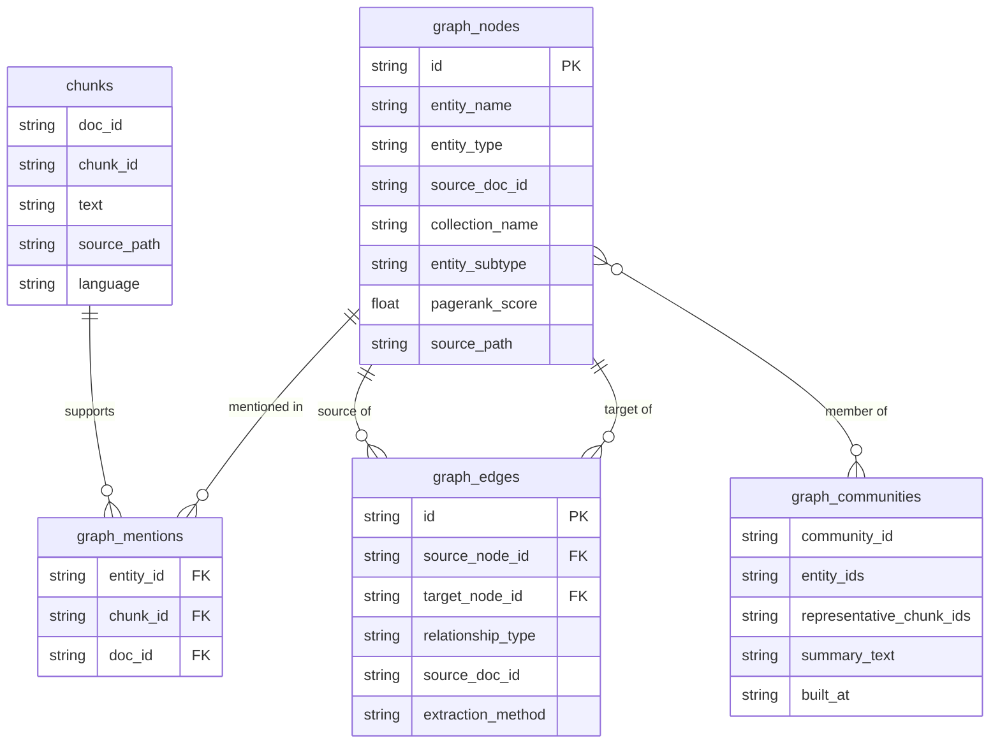

# MGE · Multilingual Graph Extraction Engine — Team Plan

**How to read this file**
- **Architecture approach:** Clean Architecture — the default; no override skill was requested. **Layers:** Presentation · Use Cases · Interface Adapters · Entities · Frameworks & Drivers. Note that [540_code_and_architecture_quality_audit.md](../Architecture/540_code_and_architecture_quality_audit.md) records the runtime as *annotated* rather than *enforced* Clean Architecture — layers come from per-module docstrings and [110_component_catalog_and_layer_breakdown.md](../Architecture/110_component_catalog_and_layer_breakdown.md), not from an import lint.
- **Deployment tier:** client+server, one deployable. A single FastAPI process serves REST, MCP at `/mcp`, and the optional OpenAI shim at `/v1`. There is no separate frontend build.
- The **Frontend, Backend, and Tester** sections are the **depth view** — each role's scope, grouped by layer.
- **Contracts** are authored as **TypeSpec** `.tsp` files beside this plan; the one HTTP/API seam additionally emits a linked `openapi.yaml`.
- **Role tags** (`#frontend-role`, `#backend-role`, `#tester-role`) mark each role-owned section — filter a tag (e.g. in Obsidian) to see one role's whole scope.
- IDs (`S#` scenarios, `C#` contracts, `Q#` decisions) are the traceability thread; search the file for an ID to find where it's defined. `Q#` ids are stable — they kept their numbering when the Open-questions table became the **Decisions** table, so a reference from the brief or from review notes still resolves.
- **Tasks** are not in this file — task breakdown is a separate downstream step that consumes this plan.
- **Rule:** change a contract only by team agreement.

---

## Background

Prose entity extraction runs a single English statistical model. `GraphExtractor` loads it once per process and calls it **one text at a time**, then force-fits its news-corpus label set onto the graph's own entity types through a lossy mapping table — GPE, LOC, FAC, ORG and PRODUCT all collapse to `system`, and anything outside that taxonomy is dropped. There is no official Hungarian model, so per-language routing cannot close the gap either.

Every prose edge the graph builds on its own is an untyped `related_to` co-occurrence edge. The three meaningful prose types (`uses`, `implements`, `depends_on`) exist only when an LLM enrichment AND-gate is open — provider *and* extraction model *and* a built client — one HTTP call per chunk. An air-gapped or provider-less deployment gets no typed prose edges at all, in any language. The code-symbol half of the graph is unaffected: it comes from the AST path, is language-independent, and already emits typed edges without an LLM.

---

## Goal

After this ships, an operator runs the wizard, sees the real download size and license of a pinned model artifact before any bytes move, and gets an artifact that is checksum-verified, atomically placed, smoke-loaded and **asserted to actually return relations**. Ingest then runs one batched, in-process, network-free forward pass per batch of prose chunks and emits the graph's own entity types and its own prose relation types directly — in every corpus language, with no provider configured and no mapping table in between. spaCy is gone from the source tree, the dependency set, the wizard, the status surface and the docs; the LLM relationship-labelling half of the enrichment protocol is gone with it. Operators re-ingest.

---

## Spike gate — RESOLVED 2026-08-24

**Outcome: the spike ran (K2a–K2h). Findings 0, 1 and 3 pass. Finding 2 fails — but only for the ONNX artifact, and the resolution is to ship the PyTorch checkpoint instead, which makes finding 2 moot. The entities-only branch described below is therefore NOT taken.**

**What finding 2 actually established, stated precisely because the disposition below was written for a different diagnosis.** The checkpoint is fully relation-capable: its un-exported PyTorch weights return `archon-search --uses--> LanceDB` @ 0.9822 and `reranker --depends_on--> fastembed library` @ 0.9591. What cannot carry relations is the **ONNX conversion**, and the cause is structural, not a bug in `gliner`. GLiNER builds relation pairs with plain Python data-dependent control flow (`.item()`, a `for` loop, `if n < 2`, an `if N == 0` constant-placeholder branch — `gliner/modeling/utils.py:411-465`); trace-based `torch.onnx.export(dynamo=False)` executes the forward pass once on a dummy input and freezes whichever branch it took. Measured on real 10-entity text the exported graph returns `rel_idx=[[[-1,-1]]]`, `rel_mask=[[False]]` — a constant, at every threshold.

**All three ONNX routes are exhausted, and one of them is a trap worth recording.** (a) The default trace bakes in an empty placeholder. (b) Exporting with a *richer* dummy input is **worse than the bug**: a 3-entity dummy bakes in exactly 6 pairs and then silently ignores entities 3–9 on real input — it looks like it works while dropping most of the document. (c) `dynamo=True` cannot capture the graph at all, failing upstream in `nn.LSTM` over a `PackedSequence` (`gliner/modeling/layers.py:69`), reproduced under both dynamic and static shapes.

**A different checkpoint is not an escape hatch.** The `if`-branch that `relations_rep_layer`-bearing checkpoints take (`build_entity_pairs`, `utils.py:326-408`) carries the identical untraceable pattern — a Python loop, data-dependent boolean-mask indexing, and its own `if N == 0` branch — so **no gliner checkpoint of any configuration can export relations through a trace-based export**. `gliner-relex-multi-v1.0` is also the only *multilingual* relation-capable checkpoint in the family (`base-v1.0`, `large-v0.5`, `large-v1.0` are English-only). The one non-gliner candidate found, `Babelscape/mrebel-large`, is CC BY-NC-SA (non-commercial) against this project's MIT licence, is a different architecture (seq2seq triplet generation, Wikidata relation labels rather than the closed `uses`/`implements`/`depends_on` schema), and would discard C1 and Q1 rather than extend them.

**Decision: ship the PyTorch checkpoint, not the ONNX export.** Patching `gliner` was rejected — it is third-party code and it is not defective; the PyTorch path uses the library exactly as designed, with zero modification. The measured cost inverts the assumption that drove the original ONNX choice:

| | ONNX | PyTorch |
|---|---|---|
| Resident after load | 3653.3 MiB | **3172.9 MiB** |
| Peak RSS @ batch 8 | 4204.9 MiB | **3737.0 MiB** |
| Peak RSS @ batch 16 | 5558.2 MiB | 5557.5 MiB |
| Inference @ batch 8 | 1.28s | 1.30s |
| On-disk | 1,292,799,560 B | 1,296,138,233 B (+0.26%) |
| Relations returned | **0** | real, 0.96–0.98 |

Memory is **lower**, not higher, at rest and at `GRAPH_NER_SUB_BATCH_SIZE=8`; latency and download size are a wash. The real costs are a one-time ~2.6s slower process load (5.6s vs 2.9s warm-cache) and a genuinely different accelerator story — ONNX Runtime execution providers give way to torch device placement (`cpu`/`cuda`/`mps`), which is the one substantive redesign, landing in BE-8, BE-14 and FE-5. `torch` is already a base dependency (`pyproject.toml:26`, CPU-wheel-pinned on linux/x86_64), so nothing new is introduced. Incremental rework: **~15–24h on top of Phase 3's planned backend work.**

**Consequence for everything below: the entities-only disposition is NOT taken.** C3 and ADR 12 survive as originally scoped, S3 and S59's Given stand, `label_relationships` is deleted by BE-17 as originally planned, and the relation-capability assert reverts to its designed meaning — a genuine correctness check for a bad revision or corrupted download, not a permanent universal failure. The two-rule carve-out machinery below is retained as a historical record of a branch that was evaluated and not taken; **it governs nothing.**

---

### Original gate criteria (retained for provenance)

The spike (Scope → Verification, below) runs **before** any deletion in this plan and must clear three findings, in order:
0. **Resolver compatibility** — `gliner>=0.2.26` resolves and runs at all against `transformers` 5.8.1, a major-version boundary Q25's `>=4.51.3` floor says nothing about. If this fails, neither finding below can even be attempted. **The spike must also record whether `gliner` hard-depends on `onnxruntime`** — Q26's dependency claim is unverifiable in this repository today (`gliner` has zero occurrences in `uv.lock`; `pyproject.toml` never names it), and Q26, S33 and S55 all rest on that edge existing.
1. **ONNX-exportability** — `knowledgator/gliner-relex-multi-v1.0` actually exports to ONNX at the pinned revision.
2. **RelEx capability** — the real ONNX export returns relations, not just entities, against the label-description prompt (Q3).

**A fourth finding, gated separately, with a narrower disposition on failure (K10):** the feature's headline AC ("a Hungarian sample produces non-trivial output where it produces almost none today") had no gated evidence — the spike already runs a per-language span review (Scope → Verification) but nothing tied its outcome to a pass/fail condition. **Finding 3 — multilingual span quality.** Pass condition: for each reviewed language (Hungarian, manual; French, against [fr-docs/](../../tests/eval/corpus/fr-docs/)), the review shows non-trivial, non-garbled entity and relation spans — not systematically empty or nonsense output — for prose actually containing extractable entities in that language. Unlike findings 0–2, a per-language failure here does **not** block the feature: the checkpoint still works in general, so a language that fails this finding ships with its quality gap recorded as a new per-language limitation in Known limitations, named explicitly, rather than reopening Q1's engine choice.

**The two ways findings 0–2 can fail lead to different outcomes, not one shared fallback:**
- **If finding 0 or 1 fails**, there is no working engine at all: the feature does not land. None of Scope → Deletions executes, and the seven preceding changes in Sequencing / landing order (below Contracts / seams) stand on their own regardless — none of them touches spaCy, `gliner`, or the graph model. **Finding 0 has a remedy short of failing outright, not acknowledged by "does not land" alone (K12):** if `gliner` fails against today's resolved `transformers` 5.8.1/5.14.1 specifically — rather than being incompatible with the whole `>=4.51.3` range — the remedy is to narrow the `transformers` constraint's upper bound to a version `gliner` does support (Scope → Dependencies, Q25) and re-run finding 0 against that narrower constraint before declaring the feature dead. Finding 0 is fatal only once no version inside the floor `gliner>=0.2.26` itself requires works — a narrower `transformers` ceiling is a remedy to try first, not evidence the finding already failed permanently.
- **If finding 2 fails** (entities work, relations do not), this plan **repurposes** the brief's named fallback (`2026-08-19-035-multilingual-graph-ner-brief.md:189-191`) for a trigger the brief did not anticipate: the brief's fallback was written for its memory-guardrail rejecting a two-model load (brief:186-191), a branch Q1 already closed. Reused here for a spike-failure trigger instead: `label_relationships`, its DTO, and the four enrichment adapters' relationship methods are retained (brief:189's entities-only half); C3 and ADR 12 do not land. **The one-line rule for what drops: a scenario drops only if its assertion has no producer once `label_relationships` is retained** — not merely "asserts a typed prose edge," since the retained LLM path still produces typed edges when a provider is configured. Applying that rule: **S3 drops** (it asserts typed edges with *no provider configured*, which only the new engine's local pass can produce; the retained LLM path needs a provider). **S5 does NOT drop** — its assertion (a relation preserves head/tail direction with no lexicographic normalisation) has a producer once `label_relationships` is retained: the retained LLM path writes the edge in asserted order with no `sorted()` (`graph_extractor.py:755-765`), while both `sorted()` sites on the extractor's pair paths do normalise — the LLM candidate-pair loop (`:728`) and the `related_to` co-occurrence loop (`:797`). An earlier pass dropped S5 on a "no provider configured" clause that S5's own Given does not state; the rule above does not support dropping it, so it stays, retargeted at the retained LLM path. **S26's and S28's typed-edge clauses drop** (their non-vacuity checks assert a typed edge exists without configuring a provider — the same gap as S3); **the Q28 smoke-tightening drops** (it specifically validates the *new* engine's typed output). **S11, S34 and S40 do NOT drop** — S11 is a digest-mismatch scenario asserting nothing about relations, and the branch still provisions the entity-only artifact, so the digest gate stays mandatory; S34 (viewer differentiation) and S40 (widened GC sweep) both depend on typed edges from the retained **LLM** path, which this branch keeps running, not from the new engine. **Q4's sweep widening (S22, S40) lands under finding 2 regardless** — the LLM path still produces `uses`/`implements`/`depends_on` edges for the sweep to act on. `gliner` still gives multilingual entity extraction, so **spaCy is deleted as planned** — the Goal (above) lands minus locally-produced relations, with the LLM relationship-labelling path standing in for them wherever a provider is configured.

**C4's relation-capability assert is what this branch does with the checkpoint, stated explicitly, not left implicit.** Finding 2 failing means the pinned checkpoint accepts the relation labels and returns none — exactly S12's checkpoint. C4's ordered provisioning sequence makes that assert non-skippable and its failure category (`relations_not_supported`) a hard `failed` outcome (Scope → Provisioning, above; C4, below Contracts / seams) — so if the assert stayed in the sequence on this branch, every wizard run would hit it, fail, and never report success, which is not what "the Goal lands minus locally-produced relations" means. **Decided: the assert is dropped from the ordered sequence on this branch, and `relations_not_supported` becomes a non-member of the frozen failure-category enum there** — the checkpoint's inability to return relations is already established by the spike itself; a per-installation assert exists to catch that failure mode when it is *not* already known, not to re-confirm what the spike gate has already found true for every installation of this checkpoint. What this disposition drops or reshapes is governed by two rules, not an enumerated list — a list has been wrong in three consecutive review cycles and broke again inside the cycle that wrote it, because a rule stays correct as the plan grows and an enumeration goes stale the next time a scenario or clause is added anywhere near it. **Rule 1 (scenarios):** a scenario drops only if its assertion has no producer once `label_relationships` is retained (stated above). **Rule 2 (everything else):** anything in this plan or its contracts whose subject is the relation-capability assert or the `relations_not_supported` category — clause, Done-when bullet, use case, diagram node or edge, component row or contract field — is dropped on this branch. Three things neither rule reaches, named explicitly because they are not derivable from either: how an already-landed frozen enum is narrowed has no stated procedure — the pinned-descriptor preceding change (Sequencing / landing order, below Contracts / seams) may already have shipped C4's eight-member enum before this branch is taken, and narrowing it here has no described mechanism; `conflicting_onnx_runtimes` is unaffected by any of this — it is a two-stage provider-probe finding, not a relation-capability finding, and applies regardless of which branch ships; and C2's degradation clause — `degraded` does **not** cover a loadable, relations-incapable artifact (C2, S59's Then) — is **retained** on this branch, re-anchored from the recorded `relations_not_supported` category onto the plain `EngineCapability.relationsSupported: false` state, because on this branch that state is the checkpoint's universal steady state, not an exceptional one; S59's Given, which cites the recorded category itself rather than the plain state, still drops under Rule 2 unchanged.

Every deletion below is therefore sequenced **after** the spike clears all three findings, not alongside it — including the `provider_notes` removal (Scope → Deletions): although it is a wire-contract change, its only producer is the English-only disclosure, which dies with spaCy — so it lands **inside** the reviewable core, not as a preceding change (K6; Sequencing / landing order, below Contracts / seams) — "planned" describes the mechanism, not every number in it.

Five figures below are **provisional** pending the spike's measurement, not settled by this decision pass: Q2's `relation_confidence`, Q16's memory-budget figure, Q29's `adjacency_threshold`, the resident model's memory footprint (no sourced size exists yet — see Q16), and the **`GRAPH_NER_SUB_BATCH_SIZE`** module constant (Scope → Engine) that bounds a single forward pass. **Sized by its own peak-memory-per-batch-size measurement, not reused from the tokenizer-window figure (K12)** — the tokenizer window bounds how many tokens fit in one *text*; `GRAPH_NER_SUB_BATCH_SIZE` bounds how many *texts* one forward-pass call can safely hold without a transient memory spike, which the spike measures separately by varying batch size against worst-case (longest) chunks and observing peak, not steady-state, memory. Each is marked in the Decisions table.

---

## Scope

### In Scope

**Engine**
- An engine adapter, **`ProseExtractionBackend`, in a new module `archon_search/prose_extraction_backend.py`**, behind the existing per-batch NER seam `GraphExtractor` (`graph_extractor.py`) delegates to, emitting `EntityType` **and** `RelationshipType` values directly. `_LABEL_TO_ENTITY_TYPE` deleted.
- **One checkpoint: `knowledgator/gliner-relex-multi-v1.0`** — multilingual, relation-capable, self-exported to ONNX and hosted by us, driven through `gliner>=0.2.26` (Q1). There is no second model anywhere in this plan.
- Call the combined entity+relation inference entry point, never the entities-only one — the entities-only method cannot return relations, and switching later means re-plumbing the seam.
- Load through the `gliner` package in ONNX mode from [paths.py](../../archon_search/paths.py)'s `get_graph_models_dir()`, with our own session options, a pinned revision, and no run-time network access.
- **Batched inference.** The current seam already takes a list of texts per call (`_run_ner_sync(self, nlp, texts: list[str])`, `graph_extractor.py:454-458`) but *infers* one text at a time internally (`:465-469`) — only the inference behaviour and the return type change, not the input side. Calls are sub-batched internally against a pinned module constant, **`GRAPH_NER_SUB_BATCH_SIZE`** (provisional pending the spike, Spike gate above Scope), so a single large document cannot become one unbounded forward pass. This is how the throughput guardrail is met, not an optimisation for later.
- **Execution provider is configurable, defaulting to CPU** (Q7) — the graph engine gets its own `[graph].providers` setting, following the split-providers ADR rather than departing from it. The CoreML partitioning lesson from [2026-08-19-040-double-embedder-load-startup-brief.md](./2026-08-19-040-double-embedder-load-startup-brief.md) is why an accelerator is only ever offered after a real post-download validation against the real artifact.
- Flat (non-nested) spans and single-label spans pinned, with the reason recorded in code so neither is "improved" later. The relation **adjacency threshold** is likewise a pinned constant at the model card's midpoint, not a knob (Q29).
- **Label-description prompting** (Q3): each prompted label carries a one-line description, and an `"other"` decoy label absorbs spans that belong to none of the four real types and is then discarded. Schema values are what gets stored; the descriptions are what disambiguate `depends_on` and stop `concept` over-extracting. (**Superseded — see Q3**: no decoy, and only the *entity* labels carry descriptions; relation labels are prompted bare.)
- One shared engine instance, loaded once per process behind a lock — no LRU, no size knob (Q8). The bounded-waiter shape is kept but its disposition is inverted: a wait timeout **degrades the document**, it never 503s an ingest.

**Config**
- `[graph].ner_confidence` (default `0.5`) and `[graph].relation_confidence` (default `0.75`) — two float knobs documented in [archon-search.toml.example](../../archon-search.toml.example) beside `leiden_resolution` / `max_community_size`. Neither is wizard-prompted; graph tuning knobs never are (Q2).
- `[graph].providers` — the graph engine's own execution-provider list, **wizard-owned**, with `--graph-providers` for non-interactive installs, written through a **generalised** `configure_providers()` in [installer.py](../../archon_search/install/installer.py) — today it is hardcoded to the `[database]` section and takes only a `GpuType`, with no section parameter and no CPU-write branch (`installer.py:1111-1142`); this feature adds both, real installer work rather than reuse of an existing pattern (Q7).

**Paths**
- `get_graph_models_dir()` lands in [paths.py](../../archon_search/paths.py), role-named rather than vendor-named, laid out as `<data>/models/graph/<model>-<revision>/` (Q6). The pinned model+revision is a module constant in the same file — the single source both C4's descriptor and `ProseExtractionBackend`'s load path derive from (see Acceptance criteria, above).
- `get_fasttext_models_dir()` **splits** (not merely moves — aligning this bullet with Q6 and the Sequencing table, minor) from [language_detector.py](../../archon_search/language_detector.py) into [paths.py](../../archon_search/paths.py) **as a separate preceding change** (Sequencing / landing order, below): a new **`get_models_dir()`** lands as the shared models root (`<data>/models/`, the value the existing name already returned, `language_detector.py:22-29` — `get_data_dir() / "models"`), with `get_fasttext_models_dir()` derived from it. **Stated explicitly, not left implicit (M13): `get_fasttext_models_dir()` continues to return `<data>/models/` unchanged after the split — only its home moves, to `get_models_dir()` with no subdirectory appended.** This is the behaviour-preserving reading the architecture-diagram caption already assumes (`:252`, "unchanged in behaviour") and it is what keeps the pinned-descriptor preceding change's "one-time re-download for affected installs" claim (Sequencing, below) true — a `fasttext/` subdirectory instead would orphan every existing install's on-disk `lid.176.ftz` and turn that one-time re-download into a re-download for every install. It touches only the existing fasttext artifact and does not depend on the engine swap: [installer.py](../../archon_search/install/installer.py) stops recomputing `get_data_dir() / "models"` by hand, and [app.py](../../archon_search/server/app.py) drops its eager `language_detector` import. The paths-module docstring's "there is no principle" note is replaced with one: **every model-artifact directory accessor lives in `paths.py`** (Q6).

**Provisioning** — *decided 2026-08-24: the graph model is fetched the way the existing embedder already fetches its own model. The bespoke provisioner below no longer applies to it.*

- **The graph model uses the house fastembed pattern, not a bespoke provisioner.** `gliner` loads it with `GLiNER.from_pretrained(model_name, revision=...)` and `huggingface_hub` fetches it on first use — the literal mirror of [embedder.py](../../archon_search/embedder.py)`:37-45`'s lazy-load-behind-a-lock and [reranker.py](../../archon_search/reranker.py)`:35-48`. Install time gets an OPTIONAL pre-warm entry in [prewarm.py](../../archon_search/install/prewarm.py) mirroring the reranker's **non-fatal** branch (`:96-106`, "the model will be downloaded on first search") — a slow first use is not an install failure.
- **Why the elaborate provisioner below was designed, and why it no longer applies here.** It was written when the artifact was an ONNX export **we produced ourselves** — it existed nowhere else, so we had to host it and therefore had to verify it. The spike resolved to shipping the PyTorch checkpoint (Spike gate — RESOLVED, above), whose files already exist on HuggingFace at a pinned revision. There is nothing for us to build, host, or hand-verify. Everything below now scopes to **`lid.176.ftz` alone**.
- **What integrity checking we get, and what we accept losing — measured, not assumed.** `huggingface_hub` 1.26.0 asserts the received byte count against the HEAD-declared `expected_size` (`file_download.py:421-473`), writes through a per-process unique `.incomplete` temp file then `os.replace` (`:1886-1955`), runs its own free-space check before writing (`:731-748`), and content-addresses the cache blob by etag. It does **not** recompute the hash of the received bytes — only the etag string's shape is validated (`:1400`). **Accepted: a same-size corruption is not caught.** This is strictly weaker than the digest-plus-byte-count assert designed below, and it is exactly the bar the embedder and reranker already run at in production (`fastembed/common/model_management.py` calls `snapshot_download` with no verification of its own). We are matching the existing bar, not going under it.
- **The fasttext half is a genuine improvement and survives unchanged.** Today's `_download_fasttext_model` ([licenses.py](../../archon_search/install/licenses.py)`:96-134`) does **less** than `huggingface_hub`: raw `urllib.request.urlopen` straight into `open("wb")`, no temp file, no atomic rename, and its only check is that the result is not zero bytes. Phase 2's digest and byte-count work closes a real pre-existing gap that predates this feature and has nothing to do with the graph model.
- **`ARCHON_SEARCH_DATA_DIR` is honoured explicitly, closing a pre-existing silent violation across ALL THREE model classes (decided 2026-08-24).** Neither `embedder.py` nor `reranker.py` passes a `cache_dir` today, so their models land wherever `huggingface_hub` defaults to — outside `get_data_dir()`, silently breaking this project's own hard invariant that one env var relocates the whole runtime tree (`CLAUDE.md`). Adding a third, ~1.24 GiB model to that violation would turn a known nuisance into a real operational fault: an operator relocating the runtime tree onto another disk would leave the models behind, and `prewarm.py:_check_disk_space` (`:26-41`) would keep measuring `get_data_dir()`'s filesystem while the bytes land elsewhere. **Decided: pass an explicit cache directory derived from `get_models_dir()` for the graph model AND retrofit the same for the embedder and reranker**, so the invariant actually holds for all three rather than for none.

---

*The provisioner below now governs `lid.176.ftz` only. Retained for that artifact and as provenance for the graph-model design that was not taken.*

- A generic model-artifact provisioner in the installer package: name → pinned URL + revision → **checksum + byte-count** → extract → durable publish → smoke-load → **relation-capability assert**. This does not exist today; the existing step in [extras.py](../../archon_search/install/extras.py) is wheel-shaped end to end and verifies no digest. It is critical path — once the Spike gate clears and spaCy is gone, there is no fallback engine. **Migration path, decided (Q34):** `_install_graph_extra` (`extras.py:324`) is **kept and its second half replaced** — the `_install_extra("archon-search[graph]")` call stays, `_download_spacy_model(models_dir)` becomes a call into `ArtifactProvisioner`, and `importlib.invalidate_caches()` sits between them, since this function is the one place that already owns the subprocess-install-then-in-process-load ordering that step depends on. It is **not** deleted in favour of inlining both steps into `installer.py`'s step sequence: that would break the shape it shares with `_install_code_extra` / `_install_multilingual_extra` and re-establish the ordering by hand for no behavioural gain. Its docstring is rewritten from the spaCy wheel fetch to verified artifact provisioning. The failure **kind** is returned to the call site (`installer.py:799-806`) rather than swallowed — today the revert fires on any `InstallError`, and S45 needs it to fire for five categories and not three, so the switch-off policy stays at the call site beside its two siblings.
- The artifact's **real size is pinned in the descriptor, generated from the artifact we host, and asserted against bytes received exactly like the checksum** (Q12). The install-time planned-download total is computed from the profile plus the selected extras and feeds the disk guard, the service-ready timeouts and the display — three consumers reading three different derived quantities, not one shared field. **Two descriptor shapes, not one**, because "one number" otherwise conflates three different quantities (Q12): a **provisioned-artifact** descriptor (URL, revision, digest, exact bytes, ordered assert sequence) for the graph model and `lid.176.ftz` — both pinned URLs with a fixed byte count — and a **size-estimate** descriptor (declared MB only, no digest, no placement) for the tree-sitter bundle, which is ten `pip`/`uv`-resolved wheels (`extras.py:154-159`, `pyproject.toml:48-57`) with no pinned URL and no stable byte count across platforms. Three named quantities, each read by a different consumer: **`size_bytes`** (per provisioned artifact, asserted against the transfer, from the provisioned-artifact descriptor — matches `ArtifactSpec.sizeBytes` in `c4.tsp` — cited by symbol, not line); **`declared_mb`** (per pip-installed extra, display only, from the size-estimate descriptor); and **`required_free_bytes = total_bytes * 2`** (the disk guard's headroom factor, summing every selected artifact's bytes — no `ceil()`: `total_bytes` is already an integer sum of `int64`/`int32` fields, so rounding up a whole number is a no-op). `prewarm.py:36` **changes** — its `required_bytes = download_mb * 1024 * 1024 * 2` is replaced by `total_bytes * 2` (no `ceil()` — the summed byte total is already an integer), not fed an exact byte count through the old MB-based formula. The service-ready timeouts (the two `_wait_for_service` call sites, `installer.py:877`, `:947`, via `_compute_svc_timeout` at `:89-100`) and the wizard's displayed figure are both *derived* from the byte total, not equal to any single descriptor field, and the ordered assert sequence in C4 reads `size_bytes` directly.
- **One license rule in [licenses.py](../../archon_search/install/licenses.py)** governs newly-provisioned artifacts: restrictive-on-use licenses prompt for acceptance, everything else is disclosed and gates nothing (Q15). The pinned artifact is Apache-2.0, so it is disclosure-only. Because we redistribute the ONNX export we host, its LICENSE and attribution ship with the placed artifact. **The two legacy gates in `licenses.py` — the Jina reranker prompt (`_prompt_jina_license`) and the fasttext prompt (`_prompt_fasttext_license`) — are untouched and converge later**, not replaced by this rule: after this change `licenses.py` holds three mechanisms, not one. Converting the fasttext CC-BY-SA gate to disclosure-only under the new rule is a follow-up for its owner to file, not scoped here.

**Deletions**
- Full spaCy removal across [graph_extractor.py](../../archon_search/graph_extractor.py), [paths.py](../../archon_search/paths.py), [extras.py](../../archon_search/install/extras.py), [__init__.py](../../archon_search/install/__init__.py) (four re-exported symbols — three public constants, `SPACY_COMPATIBILITY_URL`, `SPACY_MODEL_NAME`, `SPACY_MODEL_WHEEL_URL`, and one private helper, `_download_spacy_model`; dropped with **no** [BREAKING.md](../../BREAKING.md) entry — they are spaCy-specific implementation details, never documented as part of the public surface in [600_api_reference_or_public_interface.md](../Architecture/600_api_reference_or_public_interface.md), and one was already private), [wizard.py](../../archon_search/install/wizard.py), [config_writer.py](../../archon_search/install/config_writer.py), [render.py](../../archon_search/install/render.py), [model_validation.py](../../archon_search/model_validation.py), [pipeline.py](../../archon_search/pipeline.py), [app.py](../../archon_search/server/app.py), plus docstrings in [graph_types.py](../../archon_search/graph_types.py), [defref_extractor.py](../../archon_search/defref_extractor.py), [backends.py](../../archon_search/eval/backends.py) and [_durable_io.py](../../archon_search/_durable_io.py). [pyproject.toml](../../pyproject.toml) drops `spacy` from the `[graph]` extra and `en-core-web-sm` (plus its `[tool.uv.sources]` entry) from the dev group; `[graph]` gains `gliner`.
- **A third test-side inventory category: modules deleted or rewritten outright, not stub-migrated** (M11 — the blast radius at Q17/Fixtures, below, only accounts for stub-factory swaps; some of the 72 files test the code this bullet deletes, not a stub). [tests/test_install_spacy_model.py](../../tests/test_install_spacy_model.py) — 434 lines, 19 tests, docstring: "Tests for the wizard's spaCy model provisioning … exercise the real version-pin, unzip, place and smoke-load logic" — is the test suite for `_download_spacy_model` and the compatibility-table round trip this same bullet deletes; it is **deleted wholesale**, not migrated. [tests/test_entrypoint_stamp.py](../../tests/test_entrypoint_stamp.py):25-32, whose fake `python3` shim stubs exactly the two commands the entrypoint deletion above removes (`import en_core_web_sm`, `-m spacy download`), is **rewritten** against the spaCy-free entrypoint.
- **The shipping container's own spaCy-download step, which the earlier draft never touched.** [scripts/docker-entrypoint.sh](../../scripts/docker-entrypoint.sh)'s `case ",${EXTRAS}," in … esac` block, **the whole block, `:34-47`, not merely its `*,graph,*)` branch (`:34-43`)** — deleting only `:34-43` orphans the `*)` default branch and `esac` at `:44-47`, a shell syntax error under `set -e` (`:6`), which is exactly the failure mode this bullet exists to prevent — runs `python3 -m spacy download en_core_web_sm` whenever `ARCHON_EXTRAS` includes `graph` — on by default (`:12`, `EXTRAS="${ARCHON_EXTRAS-graph,code,multilingual}"`) — so once `spacy` is gone from `[graph]`, that command exits non-zero and the entrypoint aborts before `exec "$@"` (`:50`) is ever reached: the container does not start. The whole `:34-47` block is deleted outright, **and so is the header comment naming spaCy** (`:2` "Installs optional extras and the spaCy model into…", `:4` "`ponytail:` PIP_TARGET propagates into spacy's internal pip call…", both rewritten to describe the spaCy-free entrypoint), along with the matching `uv run python -m spacy download en_core_web_sm --quiet` steps in [docker-compose.override.yml](../../docker-compose.override.yml):51 and `:82` (the `archon-dev` test-runner and `archon-dev-shell` services), **the comment at `:56`** ("First start runs `uv sync` + spaCy download once, then stays alive."), and the download-persistence comment at [Dockerfile.test](../../Dockerfile.test):15. **Decided: wizard-provisioned only, not container-invoked.** The container does not call the new provisioner in its place — doing so headlessly would need a non-interactive CLI entrypoint into `ArtifactProvisioner` that no role scopes here, and the entrypoint today never calls into `installer.py` at all (it is a raw `pip install --target` plus a hand-rolled model download, not a wizard run). A container built from this Dockerfile therefore ships with no pre-provisioned graph artifact and runs prose graph extraction permanently degraded (code-symbol-only, one warning) until an operator provisions the artifact separately — e.g. by running the host wizard once and mounting or copying its `get_graph_models_dir()` output into the container's data-directory volume. Recorded as a new accepted trade-off (Known limitations); a headless provisioning path for containers is a follow-up, out of scope for this feature.
- LLM relationship-labelling removal — precise, not total: the protocol method and its DTO in [graph_enrichment_protocol.py](../../archon_search/graph_enrichment_protocol.py), the method on all four adapters under [enrichment/](../../archon_search/enrichment/), the JSON-schema response-format constraint built for it in [llama_cpp.py](../../archon_search/enrichment/llama_cpp.py), the narrowed-subset constant in [enrichment/__init__.py](../../archon_search/enrichment/__init__.py), the extractor's AND-gate and per-chunk call site, the LLM name-repair helper, and the `llm_fallback_used` / `llm_edges` plumbing that exists only to serve it. The live contract [llama-cpp-enrichment-protocol.tsp](../../tsp_contract/llama-cpp-enrichment-protocol.tsp) is revised in the same change.
- Removal of `provider_notes` from `GET /status` → `model_validation`. **Lands inside the reviewable core, not as a preceding change** (K6, reversing an earlier sequencing call): `provider_notes`'s only producer is `graph_ner_status`'s `(warnings, notes)` tuple (`model_validation.py`), whose `notes` half is populated solely by `ENGLISH_ONLY_DISCLOSURE` — a spaCy-era constant this feature deletes. Removing the field forces that tuple to collapse to `warnings` alone at **both** call sites — `failed_result` (`model_validation.py:112-129`) and `validate_models_async` (`:327`, `:342-343`) — so the removal is genuinely coupled to the engine swap, not an independent wire-contract change. **The existing unreleased [BREAKING.md](../../BREAKING.md) entry that introduced `provider_notes` is edited to drop that bullet**, not superseded by a new one — `provider_notes` never shipped in a released version, so a release note announcing an additive field and a second one removing it would be self-contradictory, and append-only is an **ADR** rule per `CLAUDE.md`, not a `BREAKING.md` rule. The same entry keeps its `graph_ner_status` bullets and gains the changed construction-time failure (Q11). **No replacement channel** is introduced; the absence is recorded as deliberate in the new ADR (Q10). **Two existing tests pin the field and are updated in this change** (K11): [tests/test_graph_ner_model_visibility.py:367](../../tests/test_graph_ner_model_visibility.py) `test_status_surfaces_notes_separately_from_warnings`, and [tests/server/test_schemas.py:256](../../tests/server/test_schemas.py) `test_model_validation_status_all_null` (asserts `status.provider_notes == []`).
- **`_NAME_SPLIT_PATTERN` and `_resolve_labeled_pair` are deleted outright**, together with their tests at [test_graph_extractor.py](../../tests/test_graph_extractor.py) lines 360–418 — `test_resolve_labeled_pair_recovers_merged_source_name` (360–380) and `test_graph_extractor_recovers_garbled_relationship_entity_name` (383–418), which exercises the same helper through `extract()` and dies with it too (Q27). They go with the LLM path they served, and nothing equivalent is reintroduced for the new engine: it returns real substrings with character offsets, so the merged-compound-name failure the helper repaired cannot occur. The spike's per-language span review is the check that this holds.
- **`ENGLISH_ONLY_DISCLOSURE` is deleted from [graph_extractor.py](../../archon_search/graph_extractor.py)**, along with **four** tests in [test_install_ui.py](../../tests/test_install_ui.py) that pin it or the wizard's copy of it (M11 — an earlier draft named only one): `:481` `test_render_summary_graph_multilingual_discloses_english_only` (deleted — asserts `"English-only" in output`, `:492`); `:496` `test_render_summary_graph_english_omits_disclosure` (deleted — asserts `"English-only" not in output`, `:507`); `:510-536` `test_wizard_summary_and_extractor_share_the_english_only_phrase` (deleted — breaks at import the moment `ENGLISH_ONLY_DISCLOSURE` is gone; asserts *phrase coupling* between the constant and the rendered summary, `:527-536`, not the `multilingual`-gating property); `:539` `test_render_summary_multilingual_without_graph_omits_disclosure` (deleted, like the other three — its property, that the disclosure is absent when the graph extra is not installed, is preserved by S57's third leg, below, rather than by a rewritten copy of this test). With no second copy left, there is nothing to drift. The wizard bullet is replaced with an actionable pointer to the two confidence knobs, shown whenever the graph is enabled — the `if multilingual` nesting goes too, since corpus language is not a function of that flag.

**Dependencies**
- `[graph]` gains `gliner>=0.2.26` and drops `spacy`. **`onnxruntime` is deliberately NOT declared** in the extra (Q26): `gliner` hard-depends on it, and declaring it risks conflicting with [installer.py](../../archon_search/install/installer.py)'s CUDA path, which swaps in `onnxruntime-gpu`. We import it directly (we need `SessionOptions` for Q7) behind the existing lazy-helper pattern in [model_validation.py](../../archon_search/model_validation.py), with the reason written next to the helper. **No source-side fix for the two-importable-runtimes hazard is attempted by this feature — this reverses a cycle-1 decision** (Q26): three review cycles running, every placement tried for a CUDA-branch `onnxruntime` uninstall has turned out to be dead, mis-ordered, or reinstalled transitively by the very extra install it follows. `install_deps` has no production caller — declared four times (`installer.py:123`, `:378`, `:990`, `:1086`) and invoked only from `tests/test_install.py` — so a guard placed there protects nothing; and `_install_graph_extra` (`installer.py:801`, `extras.py:324`) runs *before* `_install_multilingual_extra` and `_install_query_expansion_extras`, both of which can reinstall `gliner`'s `onnxruntime` dependency afterward, so even a correctly-placed uninstall there is not the last package operation. Closing this at the source would require reviving the dead `install_deps` CUDA path **and** covering the two container paths that provision the same conflict outside any wizard run (see Known limitations, below) — both are **out of scope for this feature**. Instead, the two-stage provider probe (Q7, S33) detects the conflict at load time and reports it as a sanitized failure category, never a swallowed exception; the residual exposure this leaves is recorded as an accepted trade-off in Known limitations. `install_deps` and `check_deps` are pre-existing dead code, noted as such in the tech-debt entry (Documentation update, below) rather than built upon.
- **`transformers` is pinned as a uv resolver *constraint*, not a dependency** — we never import it: `transformers>=4.51.3,<5.14.0` in `[tool.uv]` `constraint-dependencies` (Q25). One version everywhere, latest allowed within the range, with the reason commented next to it. **Provenance is unverified and must be established by the spike, not asserted here**: `pyproject.toml` never names `transformers` today, and `uv.lock` stores resolved dependency names, not requirement specifiers, so neither the docling-cap claim nor the `gliner`-floor claim can be substantiated from the lockfile alone (`gliner` has zero occurrences in `uv.lock`). The spike's first output is whether `gliner>=0.2.26` resolves and runs against `transformers` 5.8.1 at all — a major-version boundary the `>=4.51.3` floor says nothing about — with the bound's provenance recorded (e.g. `uv tree --package transformers` or the docling METADATA line) before the constraint is written. It resolves to `5.8.1` today and auto-updates inside the range. Today the lock resolves **two** versions under different platform markers (`5.8.1` on darwin, `5.14.1` elsewhere, `uv.lock:987-988`, `:1015-1016`), so a single cross-platform constraint is a step-down for non-macOS on a **base** dependency — which is why the `docling` lane must run in CI for this change and on dependency updates. **Resolved by the spike (K2a): the cross-platform constraint is correct and the marker-scoped alternative is wrong, because Q25's premise was inverted.** darwin's already-resolved 5.8.1 was never the problem; it is non-darwin's 5.14.1 that `gliner` cannot resolve against, so `transformers<5.9.0; sys_platform == "darwin"` would pin the platform that already worked and leave the broken one broken. `transformers` also ships one universal `py3-none-any` wheel per version, so the incompatibility is a pure version-range conflict with nothing for a platform marker to select. **Verified against the full project lock on a throwaway copy: the cross-platform ceiling resolves in 2.37s and `transformers` converges to a single version everywhere (5.8.1) with no platform split; `docling`, `docling-core`, `docling-ibm-models`, `torch` and `torchvision` all hold their exact versions; `onnxruntime` needs no new declaration.**

**Viewer** *(Q22, Q23)*
- Minimal differentiation in [graph_viewer.html](../../archon_search/server/graph_viewer.html): colour/dash by `relationship_type`, and arrowheads on directional edges only. Roughly ten to fifteen lines (a second relationship-keyed colour map, a per-edge lookup and conditional `arrows`, beyond the existing 7-line `TYPE_COLORS` map plus `DEFAULT_COLOR`, `graph_viewer.html:112-119`). **No hash regeneration is required (Q31, decided):** [graph_viewer.html.sha256](../../archon_search/server/graph_viewer.html.sha256) covers **only** the extracted `<script id="vendor-vis-network">` block, not the app code — [test_e2j_fe1_graph_viewer_html.py](../../tests/server/test_e2j_fe1_graph_viewer_html.py) hashes `_extract_vendor_js(html)` (`:84-92`), so editing `buildVisEdge` cannot invalidate the sidecar. Widening the hash to cover the app script was considered and rejected: it would tax every future viewer edit with a regeneration step and conflate "our code changed" with "the vendored library changed".
- A one-line tie-break change in [graph_inspector.py](../../archon_search/graph_inspector.py): break equal-weight ties in favour of typed edges instead of by `edge_id` hash. Edge weight is endpoint-derived, so a typed edge and its untyped twin tie exactly and the hash decides arbitrarily today.

**Verification**
- Memory, throughput and determinism regression guards (see Acceptance criteria and the Tester section).
- A spike, run **before** implementation: ONNX export and artifact availability for the chosen checkpoint, tokenizer-window measurement on worst-case chunks, **a separate peak-memory-per-batch-size measurement on the same worst-case chunks that sizes `GRAPH_NER_SUB_BATCH_SIZE` (K12 — a batch-size question, not a token-window question)**, confirmation of the pinned adjacency threshold, the real density increase typed edges cause, a **verbatim record of `gliner`'s own return shape** from the installed package — the deep test fake is built against it rather than an invented shape (Q33) — and a per-language eyeball comparison of entities and relations (including span offsets) against current output. **One deliverable of that comparison is the exact French spans and character offsets S1 will assert on**, chosen from the real engine's output against [fr-docs/](../../tests/eval/corpus/fr-docs/) — the example spans quoted at S1 and in the Tester section are illustrative-pending-spike, the same status as Q2, Q16 and Q29. The spike produces the memory budget number; the tester encodes it. See **Spike gate** above Scope for the go/no-go criteria and what happens if any finding fails.

### Out of Scope
- **Deleting the LLM enricher.** Community summarisation is a separate method on the same protocol and survives, as do `[graph].provider`, `[graph].extraction_model`, and the timeout / rate-limit / token-budget fields. Only the relationship half goes.
- **Per-language model routing — rejected.** Node identity hashes `entity_type + name`, so mixed engines split one real-world entity across languages.
- **A `spacy | gliner` engine choice — rejected.** A supported second engine means spaCy can never be deleted and the lossy mapping table survives forever.
- **Data migration / dual-engine transition — rejected.** No production users exist; re-ingest is the whole story.
- **A hand-labeled quality benchmark — dropped.** The swap is committed, so a quality gate cannot change the outcome; the eval harness is retrieval-scoped (recall@k / MRR / nDCG) with no span-level scoring concept.
- **New relationship types.** The engine is prompted with the existing three prose types; code-symbol types stay AST-derived and `synonym_of` stays with the synonym detector.
- Community and PageRank machinery; non-prose chunks; nested or multi-label entity spans.
- **A second checkpoint.** Settled at one (Q1). Nothing in the plan branches on a two-model outcome.
- **An `extraction_method` tag on typed prose edges — rejected.** The GC sweep discriminates on `relationship_type` instead (Q4); a new tag would collide with the def/ref tag precedence the sweep already applies.
- **`adjacency_threshold` as a config knob — rejected.** Pinned constant (Q29); promotion needs evidence the eval harness cannot currently produce.
- **Re-tuning the viewer's node/edge caps.** They are already `[graph]` config, the spike measures the real density increase, and re-tuning is a config change if it turns out to be needed (Q23). Beyond the minimal differentiation above, the viewer's interaction model, legend and relationship-type filter stay out. A separate preexisting defect is noted, not fixed here: the client-side `maxNodes` / `maxEdges` constants in [graph_viewer.html](../../archon_search/server/graph_viewer.html) are assigned and never read.

---

## Acceptance criteria
- Prose chunks in any corpus language produce entity nodes and mentions; a Hungarian sample produces non-trivial output where it produces almost none today.
- Every prose node's `entity_type` comes straight from the engine's label set; no intermediate label vocabulary and no mapping table exist in the source tree.
- Typed prose edges (`uses`, `implements`, `depends_on`) are written with **no provider configured and no network access**.
- Typed edges merge additively alongside `related_to` edges for the same node pair; distinct relationship types yield distinct stable edge ids, so nothing is overridden.
- Typed edges are directed (`head` → source, `tail` → target) and are **not** lexicographically normalised; the `related_to` path keeps its normalisation.
- Chunks carrying a code-symbol type never reach the prose engine; the AST path is untouched, evidenced by the existing def/ref tests passing unmodified (no golden pre-change baseline is captured, so "byte-identical" is not independently asserted).
- The engine is invoked once per batch of texts, not once per text; the batch itself is bounded by a pinned internal sub-batching constant, so a single large document cannot become one unbounded forward pass.
- The wizard discloses the artifact's real size and license before download, verifies the checksum **and the byte count**, publishes durably, smoke-loads, and **fails if relations do not come back**.
- The install-time planned-download total covers the profile and every selected extra, and the disk guard, the service-ready timeouts and the display are all derived from it (three distinct quantities, not one shared field — Scope → Provisioning).
- The **background model-validation probe** reports the artifact's presence and layout (not a full relation-extraction forward pass — see Q9); it never blocks the listening socket, never raises, and a failed assert degrades to one actionable `provider_warnings` entry rather than failing startup. The real relation-capability assert runs at provision time (C4), where a full load is mandatory anyway.
- A missing or unusable artifact degrades to code-symbol-only extraction with one sanitized wire-facing warning, never fails an ingest, and never latches on cancellation. A load-wait timeout degrades the document too — it never returns 503. **An artifact that loads but whose recorded capability assert is `relations_not_supported` does NOT degrade the document** (K9): it is not "missing or unusable" — the load succeeds and entities still come back — so ingest proceeds entities-only, simply producing no typed relations, rather than discarding entity extraction too. `degraded` stays reserved for "the prose half could not run at all"; a relations-incapable-but-loadable artifact is a narrower case the extractor does not special-case at ingest time — it just calls `inference()` and persists whatever entities and (empty) relations come back, exactly as if the model asserted zero relations for that text.
- `[graph].ner_confidence` and `[graph].relation_confidence` parse, range-validate, and are documented together with their interaction. `[graph].providers` parses and is written by the wizard only after the post-download validation passes; an unwritten field means CPU.
- The wizard asks **one** bundled optional-feature question — code indexing and graph extraction install together, as today — but discloses **two** separate download costs within it, so the operator sees what each half costs before either is installed.
- Two importable ONNX runtimes is reported as a probe failure, not swallowed.
- The viewer distinguishes relationship types **by colour** (dash optional) and draws arrowheads on directional edges only; the edge hover label naming `relationship_type` survives the rewrite (Q32). The committed sidecar hash is unaffected — it covers the vendored vis-network block alone (Q31).
- `GET /status` → `model_validation` no longer carries `provider_notes`; **both** committed OpenAPI snapshots ([tests/server/openapi_snapshot.json](../../tests/server/openapi_snapshot.json) and [tests/contract/openapi_snapshot.json](../../tests/contract/openapi_snapshot.json)) match and [BREAKING.md](../../BREAKING.md) records the removal — **the whole criterion is review-enforced, S52 included: the edited entry's heading is one of the 65 pre-existing headings on S52's own allowlist (S52, below), so S52 fires on nothing this feature does — it is a regression guard against future unindexed headings, not a guard on this entry's content.**
- No `spacy` / `en_core_web_sm` reference remains anywhere in the repository root minus a pinned allowlist — [archon_search/](../../archon_search/), [pyproject.toml](../../pyproject.toml), the wizard copy, the live documentation set, **every test file**, **and the container scripts** ([scripts/docker-entrypoint.sh](../../scripts/docker-entrypoint.sh), [docker-compose.override.yml](../../docker-compose.override.yml), [Dockerfile.test](../../Dockerfile.test) — `Dockerfile` itself carries no `spacy`/`en_core_web_sm` reference today and needs no edit, so it is not named here even though S42's scan target still covers it), which an earlier enumerated scan scope missed entirely (K2) — the last enforced by a structural meta-guard, not by review.
- Re-ingest followed by the graph GC pass sweeps a mention-derived typed edge (`uses`, `implements`, `depends_on`) exactly when its endpoints stop **co-occurring in any chunk** — the same support test the sweep already applies to `related_to`. This is a weaker guarantee than "no unsupported edge of any mention-derived type": a typed edge whose endpoints still co-occur but whose relation the model no longer asserts (text edit, threshold change, model revision) is not collectable — see Known limitations.
- Every model-artifact directory accessor lives in [paths.py](../../archon_search/paths.py) — including the shared **`get_models_dir()`** root that `get_fasttext_models_dir()` now derives from (minor, carried in from Q6) — and the module docstring states that as a rule rather than as an exception. The pinned model+revision has a single owner — a module constant in [paths.py](../../archon_search/paths.py) — and the two path-shaped sites that need it derive from that one constant: the provisioner's publish path and the backend's load path, so a revision bump cannot update one without the other (S54). **That guarantee covers the revision element only** (K8): the descriptor's `revision` field is populated from the same constant, but its `url`, `sha256` and `sizeBytes` fields are separate hand-pinned values, not derived from it — bumping the revision constant alone does not, by construction, move the URL to the new revision's artifact. S54 additionally asserts the descriptor's `url` structurally contains the pinned revision string, so a revision bump that forgets to update the URL fails a test rather than silently downloading and smoke-loading the *previous* checkpoint into a directory named after the new one. The capability-assert sentinel file (`capability_status.json`, Data, below) written by the provisioner and read by the background probe likewise derives its **directory** from `get_graph_models_dir()`, so the two sides cannot disagree on where that directory lives; the shared literal filename itself is not test-coupled between writer and reader (S54 scans the writer side only) — review-enforced only, the same disclosure the `importlib.invalidate_caches()` gap above already carries.
- Steady-state memory addition stays below the declared budget after warm-up across ≥1,000 prose chunks (a budget on growth, not a literal zero-trend assertion); total ingest wall time regresses within the declared budget; repeated runs produce identical persisted node and edge id sets and identical per-entity mention counts for both entities and relations (not full-row byte-identity — `pagerank_score` and last-writer-stamped fields are expected to vary).
- The full suite passes with coverage at or above the configured floor.

---

## What does NOT change
- `GraphExtractor.extract` — its signature and its per-document call site in the ingest hook. (Not everything downstream: the unsupported-edge sweep in [graph_store.py](../../archon_search/graph_store.py) widens (Q4) and the viewer gains differentiation (Q22) — see Contradictions → Brief vs. reality below.)
- The graph tables and their columns. `entity_type` and `relationship_type` are stored as plain strings, so a shift in the *distribution* of values needs no storage change. `STORE_SCHEMA_VERSION` does not move and no `MigrationSpec` is added — the bump policy is triggered only by structural changes to the chunk-table or collection-metadata schemas, neither of which this feature touches.
- The additive edge-merge semantics, and the stable entity/edge id functions in [graph_types.py](../../archon_search/graph_types.py).
- `EntityType` and `RelationshipType` remain closed enums with exactly their current members.
- The degradation contract: `degraded` still triggers deletion of the document's graph rows before rewrite; a not-importable *package* is still the only fatal case; auxiliary graph writes still never fail an ingest.
- The once-per-process latch discipline, and the re-raise-never-latch treatment of cancellation during model load.
- Community summarisation, `[graph].provider`, `[graph].extraction_model`, the enrichment factory and the provider registry.
- The code-symbol AST path, the synonym detector, alias loading, PageRank, Leiden community building.
- `GET /graph/{collection}` node/edge response shapes — `entity_type` and `relationship_type` are already free strings on the wire.
- MCP tool schemas — `provider_notes` was never exposed there.

---

## Known limitations / accepted trade-offs
- **The graph model's bytes are not cryptographically re-verified after download (accepted 2026-08-24).** `huggingface_hub` checks the received byte count and writes atomically, but never recomputes a hash over the received bytes (`file_download.py:1400` validates the etag's *shape* only), so a same-size corruption passes silently. The digest-plus-byte-count assert designed for the bespoke provisioner would have caught it. Accepted because it is the exact bar the embedder and reranker already run at, and because the artifact is no longer one we produce. Revisit if a corruption is ever observed in the field.
- **Install now depends on HuggingFace serving the pinned revision.** There is no self-hosted fallback by design — we no longer redistribute the checkpoint. A HuggingFace outage, or withdrawal of `knowledgator/gliner-relex-multi-v1.0`, makes a fresh install unable to obtain the graph model. Existing installs are unaffected: the model is cached after first fetch, and pre-warm failure is non-fatal.
- **A fallback engine is gated, not absent — and which fallback applies depends on which gate finding fails.** Today a missing model degrades to code-symbol-only extraction; that path is retained verbatim regardless of outcome. If the Spike gate's resolver-compatibility or ONNX-exportability finding fails, there is no engine at all: the feature does not land, and only the seven preceding changes in Sequencing land. If only the RelEx-capability finding fails, spaCy is still deleted (entities work) and the LLM relationship-labelling path stays instead of being deleted — the brief's named fallback (`2026-08-19-035-multilingual-graph-ner-brief.md:189-191`), repurposed for a spike-failure trigger rather than the brief's original two-model-guardrail trigger, which Q1 already closed. Everything below this line describes the all-findings-cleared outcome; Scope → Deletions does not execute until the gate clears in full.
- **One resident transformer, and its memory is a single number.** `knowledgator/gliner-relex-multi-v1.0` satisfies all three constraints — multilingual, relation-capable, ONNX-exportable — so the two-model branch the brief hedged against does not arise (Q1). The memory guardrail therefore polices one budget rather than a one-versus-two fork, and it no longer doubles as a go/no-go on the engine choice: the choice is made. Its remaining job is to catch growth and to validate that in-process `asyncio.to_thread` execution is the right host for the model (Q16). If it fails, the escalation is a dedicated never-recycled worker — **not** the docling parse pool, which recycles every twenty-five files at the **default** `[ingest].max_tasks_per_child` (`archon_search/constants.py:62`, `config.py:123` — a changed default changes the reload cadence) and would reload the resident model repeatedly per thousand files at that cadence. The model's resident size itself is **provisional** — no sourced figure exists yet; the brief's only "1.28" is `onnxruntime` 1.28.0, a package version, not a model size (`2026-08-19-035-multilingual-graph-ner-brief.md:195`) — pending the spike (Spike gate, above Scope).
- **A deliberate deviation from the house model-memory pattern.** The established shape for resident models is bounded + LRU + lazy + off-the-event-loop with the bound as a config knob. This feature adds one unbounded, uncached, permanently-resident model (Q8). Stated, not hidden — and precisely what the memory guardrail polices.
- **S26 is a steady-state growth ceiling; peak (transient) memory during a single sub-batch forward pass is not separately guarded** (K12). `GRAPH_NER_SUB_BATCH_SIZE` is sized to bound that transient peak (via the spike's own peak-memory-per-batch-size measurement, Scope → Verification), but no scenario asserts the peak actually stays under a ceiling during a single call — S26 samples RSS after warm-up across ≥1,000 chunks, which can mask a peak spike inside one sub-batch that steady-state sampling never catches between calls.
- **The memory and throughput guardrails bind the CPU configuration only.** An accelerator is allowed via `[graph].providers` but is unmeasured, and the guardrail wording must say so rather than implying the budget covers every configuration (Q7, Q18).
- **A language that fails the Spike gate's finding 3 (multilingual span quality) ships with a recorded per-language quality gap, not a blocked feature** (K10). The engine still works in general; a specific language's non-trivial-output pass condition failing narrows this feature's benefit for that language rather than reopening Q1's engine choice or the Goal above.
- **Truncation over splitting.** Chunks exceeding the model window are truncated and the event is logged once per process. Chunk boundaries are already arbitrary; a second boundary policy inside the extractor is complexity for a case the spike must show is rare.
- **Extraction confidence does not feed salience.** Salience is already derived three ways from mentions; extraction confidence is a different quantity and would muddy a working signal.
- **Removing `provider_notes` removes the only channel for permanent, unactionable disclosures, and nothing replaces it** (Q10). Anything permanent placed in `provider_warnings` instead would pin `GET /ready` to `warn` for the life of the deployment, so nothing permanent **and unactionable** goes there. The absence is recorded in the new ADR so a later reader restores it deliberately or not at all.
- **Re-ingest alone does not clean up.** Changing an entity's type re-keys its node, and the write path is a pure upsert. Stale nodes only disappear once the graph GC pass runs; communities then need a rebuild. The release note must state the order **and** name the two settings that would silently make the pass a no-op: `[maintenance].graph_gc` and `[graph].gc_rebuild_communities` (Q13).
- **The viewer gets differentiation, not a redesign** (Q22). Colour/dash by type plus arrowheads on directional edges is the whole change; a legend, a relationship-type filter and any re-tuned caps stay out. Density will rise and the truncation banner will be seen more often; the caps are already config, so the response to that is a config change, not code (Q23).
- **A typed edge whose endpoints still co-occur but whose relation is no longer asserted is not collectable** (Q4). The widened sweep's support test is co-mention of the two endpoints — the same test that already scopes it to `related_to` — so it only sweeps a typed edge once its endpoints stop sharing any chunk. A text edit, a threshold change or a model revision that makes the model stop asserting the relation, while the two entities still co-occur, leaves the stale typed edge in place forever. There is no per-relation support ledger, and Q4's rejection of an `extraction_method` tag is sound but does not supply one.
- **Reverting `[graph].enabled` on a provisioning failure disables the code-symbol/def-ref graph too, not only prose extraction** — `pipeline.py:802-808` and `:3605-3612` gate `DefRefExtractor`/`GraphStore`/`GraphExpander` on that same flag, exactly the coupling Approach & architecture → What changes cites to reject splitting the wizard's optional-feature question (Q14). S45 accepts this cost for a download-failed, digest-mismatch, size-mismatch, extract-failed or insufficient-disk failure — the five categories where no artifact was placed at all — and requires the wizard's failure copy to say so; it deliberately does **not** revert for a `smoke_load_failed`, `relations_not_supported` or `conflicting_onnx_runtimes` failure — the three post-placement categories, where a placed tree already exists (so S13's startup probe can still report it and the code graph keeps working; conflicting-ONNX-runtimes is additionally an environment fault fixable without re-provisioning).
- **Two importable ONNX runtimes on a CUDA host is detected, not closed at the source, and this reverses a cycle-1 decision** (Q26). The probe (S33) reports the conflict as a sanitized failure category, but nothing in this feature stops it from occurring: a real CUDA wizard install still ends with both `onnxruntime` and `onnxruntime-gpu` importable, because closing it would require reviving `install_deps`'s dead CUDA branch (no production caller today) and reordering it ahead of `_install_multilingual_extra` / `_install_query_expansion_extras`, both of which can reinstall `onnxruntime` transitively after any uninstall step. Out of scope for this feature. **Two container paths hit the same conflict with no wizard run at all**: the published `:gpu` image's [Dockerfile](../../Dockerfile):105-113 (`case "${BASE_IMAGE}" in *nvidia/cuda*)` → `pip uninstall -y onnxruntime; pip install onnxruntime-gpu`, at bake time) and [scripts/docker-entrypoint.sh](../../scripts/docker-entrypoint.sh):25 (the first-start `pip install --target /pip-packages ".[graph,code,multilingual]"`, which resolves `onnxruntime` back into `/pip-packages`) followed by `:32`'s `export PYTHONPATH="/pip-packages…"` — both runtimes are then importable by default in that image, with no probe to even report it. Since S45 deliberately does not revert `[graph].enabled` for the conflicting-runtimes category, **an operator who has set `[graph].enabled = true`** on that image runs permanently degraded to code-symbol-only prose extraction with one warning, indefinitely, unless they intervene by hand. `[graph].enabled` defaults to `false` (`config.py:137`), so a default `:gpu` image with the graph feature never turned on runs no graph extraction at all and emits no warning — the conflict exists in the environment regardless, but it is inert until an operator opts in. Affects: CUDA wizard installs and every published `:gpu` container image whose operator has enabled `[graph]`.
- **A container built from this repo's Dockerfile ships with no pre-provisioned graph artifact.** The new provisioner is wizard-only; [scripts/docker-entrypoint.sh](../../scripts/docker-entrypoint.sh)'s deleted spaCy-download step is not replaced by an equivalent call into `ArtifactProvisioner`, because that would need a non-interactive CLI entrypoint this feature does not scope. **This describes a container whose operator has set `[graph].enabled = true`** — `[graph].enabled` defaults to `false` (`config.py:137`) and `graph_ner_status` returns `[]` when it is disabled (`model_validation.py:134`), so a default container runs no graph extraction of any kind and emits no warning; the degradation and the warning below both require the operator to have opted in first. For that operator, prose graph extraction runs permanently degraded (code-symbol-only, one warning) inside the container until they provision the artifact on the host and mount or copy it into the container's data-directory volume. Affects: every container deployment whose operator has enabled `[graph]`, not only the CUDA/`:gpu` case above.
- **Neither of the two warnings above violates Q10's rule that nothing permanent and unactionable goes into `provider_warnings`**, even though both persist for as long as the operator does not act. Q10 rules out an entry with no remedy at all; both of these name one — host-provision-and-mount for the missing-artifact case, fixing the runtime install for the conflicting-runtimes case — so `checks.models` sitting at `warn` until the operator exercises that remedy is the intended, actionable behaviour Q10 already describes, not a reversal of it.
- **A graph execution-provider step-down is detected only at provision time, not at load time.** The background probe compares the sentinel's recorded `activeProviders` (written once, during `provision()`) against configured `[graph].providers`; it fires only when the recorded set is a step *down* from what is configured, never on the operator's own choice to decline the accelerator (Q7, C5). A step-down that first appears later — the driver disappears, the runtime is swapped — changes `EngineCapability.activeProviders` at the next model load (C1), but nothing routes that value anywhere the probe can read it (Q9 forbids the probe from loading the model itself), so a post-install regression of this kind is not surfaced until the wizard is re-run.

---

## Approach & architecture

The swap lands entirely behind the existing extraction seam. The **Interface Adapters** layer keeps `GraphExtractor` as the orchestration point but delegates model lifecycle, session options, batching and threshold handling to a new **Frameworks & Drivers**-facing backend — the same Protocol-backed shape the embedder and reranker already use, rather than growing the extractor into a god class. **One** model lives behind that backend, not two (Q1), so the backend has no checkpoint-routing responsibility and no per-checkpoint fan-out. The **Use Cases** layer loses one protocol method; **Entities** lose one field and gain re-anchored docstrings; **Presentation** loses a wire field and gains a size/license disclosure, a second stated download cost within the existing bundled optional-feature question, and an execution-provider offer. **Frameworks & Drivers** additionally gains a role-named artifact-directory accessor in [paths.py](../../archon_search/paths.py) and a widened edge sweep in [graph_store.py](../../archon_search/graph_store.py).

### Architecture

_Scope limited to changed nodes only: the affected area contains roughly ninety components and their one-hop neighbourhood still exceeds the node limit, so the diagram shows the change set alone, collapsed to sixteen nodes — the four spaCy provisioning pieces share one removed node, and the enrichment protocol shares one node with its four adapters. Removed components' last known connections are drawn as dotted edges. Unchanged anchors omitted from the diagram but load-bearing: `SearchPipeline` (sole caller of `extract`), `DefRefExtractor` (the LLM-free typed-edge precedent), `CommunityBuilder` (the surviving enrichment consumer), `EnrichmentClientFactory`, `language_detector` (whose path accessor splits into `paths.py`'s new `get_models_dir()` plus a derived `get_fasttext_models_dir()`, unchanged in behaviour), and the four `_archon_graph_*` tables._

| Component | Change | Why |
|-----------|--------|-----|
| `ProseExtractionBackend` (ONNX engine adapter) | new | Owns load of the **single** pinned checkpoint, session options built from `[graph].providers`, batching, label-description prompts with the `other` decoy (**superseded — see Q3**: no decoy, and relation labels are prompted bare), thresholds and truncation; returns entities **and** directed relations in one forward pass. One instance per process behind a lock; a wait timeout degrades rather than 503s |
| `RelEx capability assert` | new | Structural guard against the silent-degradation hazard — a checkpoint without relation heads accepts the labels and returns nothing. Runs once, at provision time (where it also carries the accelerator validation); the background probe reports its recorded outcome without re-running it (Q9) |
| `Artifact provisioner + pinned descriptor` | new | Generic name → URL → revision → checksum **+ byte count** → extract → durable publish → smoke-load → capability assert. The descriptor's size is generated from the hosted artifact and asserted like the digest; the license disposition comes from the one rule in [licenses.py](../../archon_search/install/licenses.py) |
| `paths.get_graph_models_dir` | new | Role-named accessor for `<data>/models/graph/<model>-<revision>/`. Lands together with the **split** of `get_fasttext_models_dir()` into a new `get_models_dir()` (the shared models root) plus a derived `get_fasttext_models_dir()`, both into the same module, which turns the docstring's "no principle" note into a rule |
| `GraphExtractor` | modified | Delegates to the new backend; drops the label map, the AND-gate, the per-chunk LLM call and the name-repair helper; routes typed relations into the existing additive edge merge |
| `GraphExtractionResult` | modified | Loses `llm_fallback_used`; `degraded` / `fatal_error` docstrings re-anchored from spaCy to the new package and artifact |
| `GraphConfig` | modified | Gains `ner_confidence` and `relation_confidence` with the sibling range-validated float idiom, plus `providers` — the graph engine's own execution-provider list |
| `Enrichment protocol + 4 adapters` | modified | The protocol narrows to community summarisation only; each adapter drops the relationship-labelling method, its DTO import, and (for the local one) the JSON-schema response constraint |
| `graph_ner_status` / validation probe | modified | Reports the new artifact's state; the `(warnings, notes)` tuple collapses to warnings alone at **both** call sites — `failed_result` (`model_validation.py:112-129`) and `validate_models_async` (`:327, 342-343`), not the latter alone; the capability report rides the existing **background** probe, so nothing new blocks the socket bind |
| `_check_graph_deps` | modified | Guards on the new package rather than spaCy; must keep sharing one implementation with the pipeline-side guard. **Specified as `importlib.util.find_spec("gliner") is None`**, not a real `import` — today's guard does a real `import spacy` (`graph_extractor.py:320-325`) so that `sys.modules["spacy"] = None` (the test-stub convention for absence) raises `ModuleNotFoundError`; `gliner` pulls `torch` and `transformers` transitively (unverified in this repository, like the `onnxruntime` dependency edge — Spike gate finding 0 above Scope — since `gliner` has zero occurrences in `uv.lock`; asserted here on the package's public dependency declaration, minor), so a real import there is a multi-second cold cost inside `create_app`'s synchronous body (`app.py:507`, before lifespan) — it does not violate the lifespan-never-awaits-slow-work invariant (it runs before lifespan), but delays the bind by the same mechanism. **The bare `find_spec(...) is None` form raises `ValueError` against a module-object stub already sitting in `sys.modules` without a proper `__spec__`** (K10, verified: `find_spec` only returns a clean `None` when the name is entirely absent from `sys.modules`; a present-but-`__spec__`-less entry — the shape a "package present" test stub takes — raises instead), which would make S16 unprovable and construction fail unsanitized. **Fix, specified here rather than left to the implementer:** the guard is wrapped as `try: absent = importlib.util.find_spec("gliner") is None; except ValueError: absent = False` — a `ValueError` only occurs when `sys.modules` already holds *something* under that name, which means the package was reachable, so it is treated the same as "found," never as "absent." S16's absence case stays provable with the clean convention (`sys.modules["gliner"] = None`, which returns `None` with no exception); the stub convention changes with the guard, in scope since Q17 already replaces every stub |
| `GraphStore` unsupported-edge sweep | modified | Allowlist widens from `related_to` alone to `related_to` + `uses` + `implements` + `depends_on`, so mention-derived typed prose edges are swept when their support disappears. Discrimination stays on `relationship_type`; no `extraction_method` tag is introduced |
| `graph_viewer` + inspector tie-break | modified | Colour/dash by `relationship_type` and arrowheads on directional edges only (~10–15 lines); the committed sidecar hash is **not** regenerated — it covers the vendored block alone (Q31). One line in [graph_inspector.py](../../archon_search/graph_inspector.py) breaks equal-weight ties toward typed edges instead of by `edge_id` hash |
| `spaCy resolver, label map, downloader, models dir` | removed | Resolver chain, compatibility filtering, the unavailable exception, the label map, the English-only disclosure constants, the compatibility-table → wheel URL → unzip → layout-assert download with no digest anywhere, and `get_spacy_models_dir` — all superseded by the generic provisioner and the new accessor |
| `label_relationships` + DTO + name repair | removed | The protocol method, its DTO, the narrowed-subset constant, the JSON-schema constraint built for it, and `_NAME_SPLIT_PATTERN` / `_resolve_labeled_pair`, which existed only to repair its output |
| `provider_notes` | removed | Its only producer was the English-only disclosure; a permanently-empty wire field is dead surface, and no replacement channel is introduced. REST contract change |

**Layer map (and role mapping)**

| Layer | Role | Components |
|-------|------|-----------|
| Presentation | **Frontend** (wizard CLI, HTTP status surface, graph viewer page) | the wizard's one bundled optional-feature prompt (disclosing two costs), the execution-provider offer, wizard summary renderer, `_build_model_validation_status`, `routes_status`, `routes_ready`, `graph_viewer.html` |
| Use Cases | Backend | `SearchPipeline`, `LLMEnrichmentClientProtocol`, `graph_ner_status`, `CommunityBuilder`, `GraphStoreProtocol`, `GraphInspector` |
| Interface Adapters | Backend | `GraphExtractor`, `DefRefExtractor`, the four enrichment adapters, `EnrichmentClientFactory` |
| Entities | Backend | `EntityType`, `RelationshipType`, `ChunkInput`, `GraphNode`, `GraphEdge`, `GraphMention`, `GraphExtractionResult`, `make_stable_entity_id`, `make_stable_edge_id` |
| Frameworks & Drivers | Backend | `GraphStore` and the `_archon_graph_*` tables, `GraphConfig`, **`ProseExtractionBackend`** (`archon_search/prose_extraction_backend.py`); the **`RelEx capability assert`** is performed by the provisioner against it, via `load()`/`inference()` driven through `ProvisioningBackendFactory` (the `ProvisioningBackendFactory` interface in `c1.tsp` — cited by symbol, not line), not a method the backend itself declares (M3: matches the Approach paragraph, C1's header and `c1.tsp:3`, all of which already place the backend here), the artifact provisioner and its license rule, the `paths.py` model-artifact accessors, `_check_graph_deps` (a thin delegation, from `server/app.py`, to the shared implementation in `graph_extractor.py` — `app.py:461` `from archon_search.graph_extractor import ensure_spacy_importable` — it is that shared implementation being layered here, not the call site's own module), `_install_graph_extra` |

**What changes**
- The NER seam's return type carries entities **and** directed relations, plus two structural flags. The input side is **unchanged** — `_run_ner_sync(self, nlp, texts: list[str])` already takes a list of texts per document (`graph_extractor.py:454-458`); only the return type and the per-batch *inference* behaviour behind it change. The brief calls the seam unchanged, which holds for `extract` and for the input side of the adapter beneath it; it does not hold for the return type.
- Model lifecycle moves out of the extractor into a **Protocol-backed backend**, matching the embedder/reranker shape: lazy load, one load per process, off the event loop, latched failure, cancellation re-raised.
- The extractor's typed-edge source changes from an HTTP call behind an AND-gate to the same local forward pass that produced the entities. The additive merge into the edge dictionary is reused verbatim.
- Provisioning gains a **checksum**, a **byte-count assert** and a **capability assert**, and loses its compatibility-table round trip. The durable staging → fsync → atomic rename → fsync-parent sequence is carried over verbatim — **but "verbatim" does not, by itself, cover `importlib.invalidate_caches()` (minor)**: `_install_graph_extra` `pip install`s the `[graph]` extra via subprocess before the in-process smoke-load imports `gliner` for the first time in the same interpreter, so the import-system finder cache (populated at interpreter startup, before `gliner` existed on disk) must be invalidated between the subprocess install and the smoke-load's import, or the freshly-installed package is invisible to `find_spec`/`import` in that same process. **No automated lane exercises this**: every e2e leg that touches the smoke-load runs against a synthetic artifact and stubs the capability-assert step outright (Tester → harness facts, below), so none of them performs a real `pip install` followed by a real `import gliner` in the same process. It is review-enforced instead — the same disclosure S56 and the smoke fixture already carry (Tester → Lane, Q28).
- The wizard's pre-download prompt gains the artifact's real size and license, and the whole install's planned-download total is computed once from the descriptors so the disk-space guard, the service-ready timeouts and the display are all derived consistently from it (Q12).
- The wizard keeps its **one** bundled optional-feature question — code indexing and graph extraction still install together — and splits only the **disclosure**: two stated download costs shown before the operator answers, rather than one combined figure (Q14). A separate gate that let an operator take code indexing without graph extraction was considered and rejected (see Q14): the code-symbol / def-ref half of the graph is gated on `graph.enabled`, not on the `[code]` extra (`pipeline.py:802-808`, `:3605-3612`), so splitting the *question* would silently disable def/ref edges for anyone who answered yes to code and no to graph, with no error and no warning. Splitting only the disclosure keeps the existing switch↔package guarantee intact without opening that hole.
- The status surface loses `provider_notes` and gains actionable graph-engine categories in `provider_warnings`, all produced by the background probe.
- The unsupported-edge sweep in [graph_store.py](../../archon_search/graph_store.py) widens its allowlist, and the graph viewer gains type differentiation and arrowheads. Both are downstream of `extract` and were assumed unchanged by the brief.

**Key decisions**
- **One multilingual, relation-capable, ONNX engine** — chosen over a coarse multilingual statistical model, per-language routing, and LLM extraction. Settled on `knowledgator/gliner-relex-multi-v1.0`, self-exported and self-hosted (Q1). The brief's two-model contingency does not apply and nothing in this plan branches on it.
- **Unconditional replacement, once the Spike gate clears.** No config flag, no migration, no dual-engine period, no eval gate on adoption. Everyone re-ingests.
- **Relations ship in this brief, not a successor.** The capability comes from the same forward pass; deferring it would mean re-opening the same seam and re-running the same spike.
- **Direct-to-schema labels** for both entities and relations, each carrying a one-line description and backed by an `"other"` decoy — the biggest single quality lever, independent of the language question (Q3). (**Superseded — see Q3**: no decoy; relation labels are prompted bare.)
- **The `gliner` package runs the model, not raw ONNX runtime calls.** Its heavy transitive dependencies are already resolved; reimplementing span decoding and relation adjacency reconstruction would buy nothing and fail silently when subtly wrong. `onnxruntime` still gets imported directly for `SessionOptions`, but is not declared as a dependency (Q26).
- **Confidence thresholds are config knobs**, not constants — the engine scores every span and every relation, so these dials are new surface either way. The adjacency threshold is the counter-example and stays a constant (Q29).
- **The execution provider is a `[graph]` setting, not a hardcoded pin** (Q7) — this feature follows the split-providers ADR rather than deviating from it, with CPU as the silent default whenever the two-stage probe does not clear an accelerator.
- **`provider_notes` is removed, not kept empty, and nothing replaces it.**

### Actors & Use Cases

_Scope limited to change neighbourhood: the affected area has nine actors and twenty-four use cases, so the map shows the twelve use cases this feature adds, changes or removes and the three actors that drive them. The provision-time gates share one node because they are one ordered, non-skippable sequence, and the viewer use case hangs off the Operator rather than adding a fourth actor. Actors omitted as unaffected: API/MCP clients, the maintenance loop, the artifact host, the outgoing model host, and the LLM enrichment provider (which retains its summarisation role). Use cases omitted as unchanged: code-symbol and AST extraction, co-occurrence edge building, graph persistence, community building, synonym detection, graph-mode search, inspection and impact, and orphan collection. **UC3's number is likewise reserved by an existing, unaffected use case in the wider 24-use-case system, not skipped by omission (minor)** — this diagram's own ids run UC1–UC13 with UC3 absent for that reason, matching the twelve nodes drawn._

### Flows

#### User Flow

#### Data Flow

```mermaid
flowchart LR
  classDef newNode fill:#a8d5a2;
  classDef modNode fill:#f9e4a1;
  classDef rmNode fill:#f4a4a4;

  HOST["Pinned artifact host (ours)"]
  PROV["Artifact provisioner *(new)*"]
  DD["get_graph_models_dir artifact *(new)*"]
  CST["capability_status.json sentinel *(new)*"]
  GE["GraphExtractor *(mod)*"]
  GLE["ProseExtractionBackend *(new)*"]
  GS["GraphStore + edge sweep *(mod)*"]
  VW["graph_viewer *(mod)*"]
  LLM["LLM enrichment provider *(mod)*"]
  ST["Status surface *(mod)*"]

  HOST -- "pinned bytes at a pinned revision" --> PROV
  PROV -- "verified digest and size, fsync, atomic rename" --> DD
  DD -. "load once per process" .-> GLE
  GE -- "batch of prose texts plus described label sets" --> GLE
  GLE -- "entities with offsets, directed relations" --> GE
  GE -- "nodes, mentions, related_to plus typed edges" --> GS
  GS -- "typed edges, differentiated by type and direction" --> VW
  GE -. "per-chunk relationship-labelling call (removed)" .-> LLM
  PROV -- "capability + resolved providers" --> CST
  CST -- "recorded outcome" --> ST

  class PROV newNode;
  class DD newNode;
  class CST newNode;
  class GLE newNode;
  class GE modNode;
  class GS modNode;
  class VW modNode;
  class LLM modNode;
  class ST modNode;
```

#### Sequence

_The ingest-time interaction is already captured by the data flow above; this sequence covers the provisioning path, whose ordering is load-bearing — the disclosure precedes any fetch, the digest and size gates precede placement, and the capability assert precedes reporting success. The two provider probes are drawn where they actually run (Q7): stage 1 is a free pre-download availability check, and stage 2 is not an extra step at all — it rides the smoke-load and capability assert that are mandatory anyway. The accelerator is offered only after stage 2 passes; either stage failing means no prompt and a silent CPU write._

_Mapped onto the installer's real step order: the optional-feature question is in the wizard (`wizard.py:650-671`, ending `_install_graph_extra_val = _install_code_extra_val`); provider configuration is Step 9 (`installer.py:713`) — **this is the existing `[database].providers` flow only** (detection and user confirmation already happened in Step 2b, `:512`, so Step 9 merely writes); `[graph].providers` cannot follow the same step, because its accelerator offer is gated on the mandatory smoke-load (Q7), which has not run yet at Step 9 — the disk guard is Step 11 (`:746`); the summary with the planned-download total is Step 12 (`:761`); the "Proceed?" confirmation is Step 13 (`:772`); and `provision(spec, candidateProviders)` — `_install_graph_extra` — runs after Step 13, before Step 14 (`:798-801`), inside `run()`, with the accelerator offer and the `[graph].providers` write landing after that, once smoke-load has validated it. **Consequence, stated rather than left implicit (minor):** the Step-12 summary is rendered before any of this runs, so it can never display `[graph].providers`'s eventual resolved value — only the planned-download total and the two disclosed costs, exactly as Scope → Provisioning already describes.

### Prior decisions

| Decision | Rationale | Constraint |
|---|---|---|
| LanceDB as the local vector store; no external database process | Zero external services so the tool ships as a pip-installable package and runs on a laptop | Reinforces the in-process, serverless, deterministic goal. Typed relation edges land in the existing graph tables unchanged — no storage-side constraint |
| fastembed as the embedding and reranker runtime, honouring a configured ONNX provider list | Pip-installable, no-GPU install; one library for both roles; avoid a full training stack at runtime | Bounds model selection to what fastembed exposes. This feature adds a **second** ONNX runtime outside that boundary and needs its own lazy-load, provider selection and warm-up story. The ADR's "no PyTorch at runtime" consequence is already stale — the base dependency set declares it |
| Telemetry is opt-in, local-only, and structurally cannot record raw query strings | A local tool indexing sensitive content must not create a durable record of user intent; the guarantee is structural, not a review-time check | New log sites (truncation latch, provisioning capability failure, startup probe) must not log chunk text verbatim, and no telemetry factory may gain a text parameter |
| All durable state writes route through the atomic-write helpers, enforced by a CI lint gate | An atomic rename gives no durability guarantee; an unclean shutdown mid-write can lose state reported as written | **Hard, and on the critical path.** The new provisioner must satisfy the lint gate. A streamed download to an open file handle is not matched by the gate, so a multi-hundred-MB artifact need not be held in memory — but staging, fsync of the tree, atomic rename and fsync of the parent are mandatory |
| Per-collection embedder LRU cache: bounded, lazy, deduplicated, loaded off the event loop | A loaded ONNX model is 100 MB to several hundred MB; peak memory must be bounded regardless of how many models are configured | The house pattern is bounded + LRU + lazy + off-the-loop with the bound as a config knob. This feature adds **one** permanently-resident model with no cache, no eviction and no knob (Q8) — a deliberate deviation the plan states explicitly, and a narrower one than the brief's two-model hedge implied. Two mechanics stay mandatory: load off the event loop, and a failed eager load must not abort startup |
| MCP mounted at `/mcp` on the same app, same process, same port; `/mcp` absent from the OpenAPI schema | A spike proved mount, round-trip, namespace propagation and lifespan delegation all worked; a second port was unnecessary | Bounds the blast radius of the `provider_notes` removal to REST only — the field never appeared in the MCP schemas or in any live contract file |
| Split ONNX execution-provider configuration per model role, probed at install time and surfaced when degraded | Some Apple Silicon configurations load the cross-encoder under a GPU provider but fail at inference while the embedder succeeds | **This feature FOLLOWS this ADR rather than departing from it** (Q7). The graph engine becomes a third configurable role with its own `[graph].providers`, written through a **generalised** `configure_providers()` — today it is hardcoded to the `[database]` section, takes only a `GpuType`, and returns early writing nothing for `GpuType.NONE` (`installer.py:1111-1142`); this feature adds a section parameter, a provider-list parameter and an explicit CPU-write branch, real installer refactoring rather than reuse — and validated by the same post-download re-probe shape. What the earlier draft called a hardcoded CPU pin is now CPU-as-default-when-unvalidated — which is what the ADR's own probe-then-degrade discipline produces. Unlike `reranker_providers` (`config.py:243`, `resolve_reranker_providers` at `:306-308`), where an unset field **inherits** `[database].providers`, `[graph].providers` deliberately does **not** inherit — unset always means CPU — a divergence recorded in ADR 12 |
| Bound the embedder-cache waiter with a timeout, raise a typed not-ready error, map it to 503 | A model load can wedge on a stalled disk, a corrupt ONNX file, or a hanging fetch; an unbounded wait parks every concurrent request with no diagnostic | Inherited in **shape but not in disposition** (Q8). The shared-instance load keeps a bounded wait and never lets a waiter mutate loader bookkeeping — but a timeout here degrades the document rather than raising a 503, because graph extraction is an auxiliary write and the house invariant is that an auxiliary write never fails its primary operation. "A corrupt ONNX file" is a larger risk here than for a cached small model, which is exactly why the outcome must be degradation and not a failed ingest |
| HyDE uses a remote LLM, gated twice, always falling back, with a CI guard forbidding verbatim query logging | The recall improvement is well documented; the privacy cost is acceptable only because it is opt-in, key-provisioned, always falls back and is documented | Two things to lean on: the rejection of a *local generative* model for HyDE v1 does not bind a *discriminative* local extraction encoder on the ingest path, so this feature does not reverse it — say so explicitly. And the CI-guard-as-structural-invariant pattern is the house form for the mandatory relation-capability assert |
| RAG fusion is an external-LLM feature, off by default, with air-gapped deployments told to keep it off | Rule-based decomposition cannot generate semantically distinct facet reformulations | Establishes "air-gapped deployment" as a first-class, named operating mode the project already designs around — exactly the constituency this feature's local typed relations serve |
| Ship a local LLM provider and wire graph enrichment for the first time: four adapters behind one protocol carrying **both** community summarisation and relationship labelling; `[graph].provider` is the enrichment gate and defaults to unset | Operators wanted graph enrichment to work rather than silently degrade, and wanted parity with the zero-transmission story; an unset provider preserves the air-gap guarantee | **The most binding prior decision — this feature partially reverses it.** ADRs are append-only here, so **ADR 12** partially supersedes its relationship-labelling half; the superseded ADR itself must not be edited. Confirmed (Q5): one ADR, number `12`, snake_case filename, owned by the backend implementer and landing in the **same change** as the protocol narrowing, with its row added to the ADR index. It also records the engine choice, the provider posture and the deliberate absence of a `provider_notes` successor. The enrichment gate survives but narrows to community summarisation alone. The provider registry and its sync guard are unaffected. The live enrichment contract file declaring the labelling method must be revised in the same change |

_All fourteen ADRs in the repository carry an accepted status; the three with no constraint on this feature (cross-encoder reranking, centroid pre-ranking, description-embedding hybrid routing) are omitted._

### Contradictions

**Code vs. docs**

| Contradiction | Code says | Doc says | Owner |
|---|---|---|---|
| Relationship-type inventory | `RelationshipType` defines **nine** members, including the three prose types this feature makes primary | [130_data_architecture_and_persistence.md](../Architecture/130_data_architecture_and_persistence.md) enumerates **six** values for the edges table | doc needs updating |
| `ModelValidationResult` field list | `provider_notes` exists on the dataclass and is populated on both return paths | [110_component_catalog_and_layer_breakdown.md](../Architecture/110_component_catalog_and_layer_breakdown.md) lists the fields without it | doc needs updating |
| Breaking-changes index completeness | [BREAKING.md](../../BREAKING.md) carries an unreleased entry introducing `provider_notes` and the graph-NER warning category, among **67** headings total | [03_breaking_changes_index.md](../MigrationGuide/03_breaking_changes_index.md) states its own principle that every entry including unreleased ones gets a row, then carries exactly **2** rows (NR-1, NR-2) — a **65-entry** gap, not one row (K7); last reviewed months earlier | doc needs updating |
| Breaking-changes list in the developer guide | Same unreleased entry present | [07_versioning_and_breaking_changes.md](../DeveloperGuide/07_versioning_and_breaking_changes.md) claims its list is verified against the file and omits the same entry | doc needs updating |
| Live enrichment contract | The protocol still declares relationship labelling today, and this feature deletes it | [llama-cpp-enrichment-protocol.tsp](../../tsp_contract/llama-cpp-enrichment-protocol.tsp) declares the method, its DTO and a narrowed relationship enum, and states entity names are extracted by spaCy | doc needs updating |
| Corpus-language coverage | Prose extraction becomes language-blind; nothing about the engine is English-specific after this change | Four live statements still say prose extraction is English-only: [65_graph_search.md](../UserManual/65_graph_search.md) line 55, [60_graph_operations.md](../OperatorGuide/60_graph_operations.md) line 99, [90_incident_runbook.md](../OperatorGuide/90_incident_runbook.md) line 116, [20_wizard.md](../UserManual/20_wizard.md) lines 209–210 | doc needs updating (Q24) |
| `provider_notes` vs `provider_warnings` | The English-only disclosure lives in `provider_notes`, which `checks.models` does not grade | [60_graph_operations.md](../OperatorGuide/60_graph_operations.md) line 99 says `provider_warnings` carries it too — wrong today, independent of this feature, and fixed as part of the same doc pass (Q10) | doc needs updating |
| CI extras coverage | [ci-graph-code-extras-gap.md](./ci-graph-code-extras-gap.md) records that `[graph]` and `[code]` are never installed in CI, so every gated test skips | **Stale.** [pyproject.toml](../../pyproject.toml) line 77 pulls `archon-search[multilingual,hyde,rag_fusion,ollama,openai-provider,graph,code]` into the `dev` dependency group, and CI runs `uv sync --dev`. The extras ARE installed. Four places repeat the stale claim: that gap file, this plan (corrected below), and [tests/smoke/conftest.py](../../tests/smoke/conftest.py) lines 17–19 and 375–378 | doc needs updating (Q20) |

*Action:* all eight go into Documentation update with reason *contradiction with code*. The `provider_notes` row is a special case — the removal makes the component-catalog omission accidentally correct, but the same file's extraction paragraph is spaCy-specific and must be rewritten regardless.

**Brief vs. reality**

| Contradiction | Brief assumes | Reality | Owner |
|---|---|---|---|
| Blast radius | Three test files and five documentation files | **Re-measured, not estimated** — `grep -rlEi 'spacy\|en_core_web_sm' --include='*.py' tests/ \| wc -l` → **72** files; the same without `--include` → **73**, the one extra hit being [tests/eval/README.md](../../tests/eval/README.md), a non-`.py` file. **`git ls-files -z | xargs -0 grep -lEi 'spacy|en_core_web_sm' | wc -l` → exactly 155 files** — the `.gitignore`-aware, tracked-file scan S42's widened property (1) actually specifies (K2): a plain filesystem `grep -r . ` instead hits **1,161** files (**640** from `.venv/` alone, since `[graph]` is in the dev group, `pyproject.toml:77`, and everyone runs `uv sync --dev`) — `.venv/` is gitignored, so it is neither allowlisted nor a "historical mention," and a guard written against the filesystem would fail permanently on every developer machine. The tracked-file form is what makes 155 reproducible everywhere, once `scripts/`, `Dockerfile*` and `docker-compose*.yml` are reachable by it; the 72/73 counts above stay the right scope for Q17's *stub-migration* blast radius, which is `tests/`-only by construction. Around twenty documentation files name it. The coupling is fixture-shaped: `grep -rnEi 'def [_a-zA-Z0-9]*spacy[_a-zA-Z0-9]*\(' tests/ \| grep -v 'def test_'` → **46** stub-factory definitions, not thirty, across at least eight named behavioural shapes (default, `_no_entities`, `_multi_entity`, `_with_entities`, `_content_aware`, `_kubernetes`, `_payment`, `_k8s_synonym`). **Two existing shared home *files*, holding three stub definitions** — [tests/integration/conftest.py:335](../../tests/integration/conftest.py) (`install_spacy_stub`) **and `:469` (`install_k8s_synonym_spacy_stub`, the eighth behavioural shape — both in the same file)**, plus [tests/server/conftest.py:11](../../tests/server/conftest.py) (`spacy_stub`, a module-scoped restore-on-teardown fixture this plan did not previously know about) — are preserved; the arithmetic is **46 − 3 = 43** per-file local variants (K11 — not 46 − 2 = 44, which double-counted `install_k8s_synonym_spacy_stub` as both a shared-home resident and a scattered local), deleted and replaced by imports from a **new** unit home (Q17). Resolved as scope, not as a question (Q17): a **parameterised** shared factory, not one fixed stub. **The 72/73-file count is not all stub-migration** (M11): it also contains whole modules that test the deleted spaCy surface directly and have no stub to replace — [tests/test_install_spacy_model.py](../../tests/test_install_spacy_model.py) (deleted) and [tests/test_entrypoint_stamp.py](../../tests/test_entrypoint_stamp.py) (rewritten), both named in Scope → Deletions, above | backend |
| Downstream is unchanged | "The extract seam and everything downstream unchanged" | Two downstream components change. The unsupported-edge sweep in [graph_store.py](../../archon_search/graph_store.py) is scoped to `related_to` only and must widen (Q4), and the viewer draws parallel identically-styled edges with the direction discarded at render (Q22). `extract` itself is genuinely unchanged | backend, frontend |

*Resolved by the decision pass and moved out of this section:* the brief's premise that the name-splitting pattern is tuned for statistical-NER span text (it never touched that path; it is deleted outright with the LLM helper — Q27); the transformer-library resolution question (one uv resolver constraint, `>=4.51.3,<5.14.0`, satisfying both platform branches — Q25); and the schema question (zero persisted-schema changes, no version bump, no migration spec — see Data).

---

## Sequencing / landing order

Closes Cycle-1 finding G5 (Q30): as first written, this plan required at least five independent workstreams — the ADR + protocol narrowing (Q5), the stub consolidation + engine swap (Q17), the `paths.py` accessor move (Q6), the `.tsp` revision, and the `transformers` constraint (Q25) — to land in one repo-wide change touching 72 test files, ~30 docs, six contracts and two CI lanes, with no intermediate state where the suite is green. Checked against the plan's own text above, only one of those pairs has a genuine same-change argument; the rest land as separate, independently-green preceding changes.

**Genuine same-change pair, landing inside the reviewable core.** Q5 (ADR 12) and the [llama-cpp-enrichment-protocol.tsp](../../tsp_contract/llama-cpp-enrichment-protocol.tsp) revision land together with the protocol-narrowing deletions (Scope → Deletions, "LLM relationship-labelling removal", above) — not as a fourth independent thing floating outside the core, but *because* they describe that deletion, and because both deletion workstreams in Scope → Deletions belong inside the core itself: the **spaCy removal** has no meaning until the new engine exists to replace it (deleting it first would delete the only working prose extraction with nothing to replace it), and the **LLM relationship-labelling removal** creates a capability regression — zero typed prose edges by any mechanism — for as long as the new engine does not yet exist. An ADR asserting the enrichment protocol carries summarisation only would be false while `label_relationships` still exists in code (Prior decisions, ADR-12 row, above), and the `.tsp` file would misdescribe the real seam if left declaring a method the code no longer has (C3). No other workstream in this plan has that property — something that lies about code which has already changed underneath it. The stub consolidation (Q17) does **not** get this same-change argument on its own; it stays coupled to the engine swap for a different reason — see "reviewable core" below.

**Separate preceding changes.** Each of the seven below is independently reviewable, leaves the suite green on its own, and does not depend on the Spike gate or the engine swap. (The `provider_notes` removal is NOT one of them — reversing an earlier sequencing call, K6 moves it into the reviewable core below: its only producer, the English-only disclosure, dies with spaCy, so it is genuinely coupled rather than an independent wire-contract change.)

| Change | What it touches | Why it's separable |
|---|---|---|
| `paths.py` accessor move (Q6) | Split `get_fasttext_models_dir()` into `get_models_dir()` (root) plus a derived `get_fasttext_models_dir()`; update [installer.py](../../archon_search/install/installer.py), [app.py](../../archon_search/server/app.py), the lazy import in `pipeline.py`, `tests/test_language_detector.py`, and **both** `tests/test_no_hardcoded_path_home.py` `MARKER_ALLOWLIST` pins (`:44` `test_module_constants`, `:45` `test_get_fasttext_models_dir_default`) — **not** `tests/path_home_allowlist.txt` (K11: re-verified, that file has no entry for `language_detector.py` or the fasttext move to touch — its six pins across five files cover `service_ops.py` (two pins), `config.py`, `linux.py`, `macos.py` and `wizard.py`; `paths.py` itself is separately whole-file-exempt via `FILE_ALLOWLIST = {"paths.py"}` in `test_no_hardcoded_path_home.py`, needing no line-hash pin either) | Touches only the existing fasttext artifact; nothing about it reads or writes anything gliner- or graph-model-shaped |
| License rule (Q15) | The generic disclosure / restrictive-prompt rule in [licenses.py](../../archon_search/install/licenses.py) | **Only S39's rule half lands here** (K11) — the integration-level assertion that one rule disciplines a permissive and a restrictive descriptor, already tested against a **synthetic** descriptor, precisely because it has no production consumer yet (Cycle-1 `C1-B-4`) — it does not need the graph provisioner to exist to be correct. S39's manual half (that a *placed* permissive artifact really ships its LICENSE and attribution, per the Allocation table) cannot land here: there is no real artifact-provisioning path in this preceding change to place anything with, so that half necessarily lands with the reviewable core, once a real artifact exists to check |
| Pinned-descriptor split, applied to today's artifacts, plus the frozen failure-category enum (Q12 partial) | Split the planned-download total into a provisioned-artifact descriptor (URL, revision, digest, exact bytes) and a size-estimate descriptor (declared MB only), applied now to `lid.176.ftz` (already a pinned URL, `licenses.py:90`) and the tree-sitter bundle (`extras.py:154-159`, a thin wrapper over `_install_extra` with no pinned URL and no stable byte count) — the two artifacts this split already had to cover before this feature existed. **This is a shipped behaviour change, gated (K9):** `_download_fasttext_model` today no-ops if `lid.176.ftz` already exists, with no digest check ever performed — this change is the first time an existing on-disk `lid.176.ftz` is checked against a pinned digest at all. On an existing install whose file predates this pin and does not match it (e.g. a partial legacy download), the provisioner treats the mismatch exactly like any other stale artifact: it re-verifies by smoke-load first (unrelated to the digest), and on a digest mismatch it deletes and transparently re-downloads the ~917 KB file, non-fatal, no wizard failure and no operator-visible category beyond the existing disk-guard/network messaging — this is a one-time re-download for affected installs, not a new failure mode. **Accepted, not reverted, if the Spike gate fails (K12):** this change closes a pre-existing integrity gap (Cycle-1 `C1-I-5`/`C1-I-113`) in `lid.176.ftz` and tree-sitter-bundle provisioning that predates this feature and has value independent of it; if findings 0 or 1 fail and the graph engine never lands, this preceding change is kept as-is, not rolled back — the same disposition every other preceding change in this table already has (Sequencing / landing order, "Interaction with the Spike gate," above). **`prewarm.py:36`'s `required_bytes = download_mb * 1024 * 1024 * 2` changes** to `required_free_bytes = total_bytes * 2` (no `ceil()` — an integer sum needs no rounding) over the summed provisioned-artifact bytes plus declared extra estimates — this silently changes every existing profile's disk threshold and the `_render_summary`-rendered figure, so the existing `_check_disk_space` and `_render_summary` tests are re-baselined in this same change. **Three named signature changes (K9)**, since "derived from the byte total" is not automatic: `prewarm.py`'s `_check_disk_space(profile: InstallProfile, base_path: Path | None = None)` moves off `profile.download_mb` (read internally, not a direct parameter) onto the summed byte total; `installer.py`'s `_compute_svc_timeout(eager_load, download_mb)` moves its `download_mb` parameter onto the same byte total; and `install/render.py`'s `_render_summary(..., download_mb: int = 0, ...)` does likewise for its displayed figure. Two of the three — `_check_disk_space` and `_render_summary` — are re-exported from [archon_search/install/\_\_init\_\_.py](../../archon_search/install/__init__.py) (`:76`, `:87`); none of the three is called from anywhere but the installer's own step sequence and the re-export lines, so the signature change is contained to those call sites and the two re-exports. *Adjacent, not touched:* `prewarm.py:48-50`'s `_prewarm_timeout(profile)` is a **fourth** `profile.download_mb` consumer (the embedder/reranker prewarm timeout) that correctly stays on the profile figure — it must not be "helpfully" moved onto the summed byte total too. Freeze **C4's failure-category enum** — eight members (K4, widened back by M8 from an over-narrow five that left download/extract/smoke-load failures with no category): `download_failed`, `digest_mismatch`, `size_mismatch`, `insufficient_disk`, `extract_failed`, `smoke_load_failed`, `relations_not_supported`, `conflicting_onnx_runtimes` — as sanitized string constants in the same change. `download_failed` and `smoke_load_failed` are generic and this preceding change already gives them a raiser via `lid.176.ftz` (a bare downloaded file, no archive, no extraction step anywhere — `licenses.py:93-134`); `extract_failed` is generic in category but has no raiser here either — nothing in this preceding change reaches an extract step (`lid.176.ftz` is never extracted, and the tree-sitter bundle only ever takes the size-estimate descriptor). Only `relations_not_supported` and `conflicting_onnx_runtimes` are graph-specific, and along with `extract_failed`, all three have no raiser until the core lands. **The two-stage provider probe's contract fields are frozen in the same change, alongside the enum**: `ArtifactProvisioner.provision`'s `candidateProviders` parameter and `ProvisionResult.activeProviders` (C4) — so Frontend's accelerator-offer Done-when item (S31, S32) has a field to code and test against before the reviewable core lands, the same argument "Closing C1-B-12" below already makes for the enum and the size field | Closes Cycle-1 `C1-I-5`/`C1-I-113` on its own; the graph model's descriptor is a third instance of the same provisioned-artifact shape once it lands. Freezing the enum here — not in the core — is what lets Frontend code against it early; see "Closing C1-B-12" below |
| `graph_inspector.py` tie-break (Q23) | The one-line equal-weight tie-break toward typed edges | `RelationshipType` already carries all nine members today (`graph_types.py:60-71`) and typed edges (`uses`/`implements`/`depends_on`) are already produced today by the LLM enrichment path when a provider is configured (Background, above; `graph_extractor.py:738`, `label_relationships`) — the tie is reachable and testable without the new engine |
| Viewer differentiation (Q22) | Colour/dash by `relationship_type`, arrowheads on directional edges, the regenerated hash | Same reason as the tie-break: it renders whatever `relationship_type` values already exist on the wire today |
| Doc-contradiction pass (3 of the 8 rows in Contradictions → Code vs. docs, above) | The relationship-type inventory row (9 vs 6 documented); the `provider_warnings`-vs-`provider_notes` **contradiction** at `60_graph_operations.md:99` (identified and its wording drafted here); and the CI-extras-coverage staleness in `ci-graph-code-extras-gap.md` plus the docstrings at `tests/smoke/conftest.py:17-19,375-378` | Each of these three states, in the plan's own words, a fact that is wrong **today**, independent of this feature. **`60_graph_operations.md:99`'s actual file edit is assigned to the core, not this preceding change** (minor — the line also carries the English-only-limitation half, which only the core can fix, per the row below; editing the same line twice across two separate changes is needless, so both halves land together when the core touches this file per its Documentation-update row). The other 5 of the 8 rows stay coupled to the core: `ModelValidationResult`'s field list (the removal makes today's doc omission accidentally correct, so it is left alone, not "fixed" and then re-broken); the live enrichment contract row (this is the `.tsp` revision, already in the genuine same-change pair above); the corpus-language / English-only row (Q24 — only false once the engine ships multilingual output); and the **two breaking-changes-index rows** for the unreleased `provider_notes` entry — they must be written against that entry's *final* text, and the core is what edits it (Q10), so they cannot land ahead of the core |
| Throughput baseline capture (Q21 partial) | Run the current (pre-spaCy-deletion) ingest of [tests/eval/corpus/docs/](../../tests/eval/corpus/docs/) **once, as a temporary one-off step added to an existing CI job** (there is no new lane yet for this preceding change to run inside — K10; a real CI runner, not a developer laptop, for the same reason the memory budget insists on one) and record the wall-time figure, corpus, machine, provider and date as a module constant in a **new, standalone module of its own**, `tests/eval/_graph_ner_throughput_baseline.py` — not the new lane's test file, which does not exist until the core lands. The temporary CI step is removed once the figure is recorded. **The core moves this constant** into the new lane's test file when it creates the lane, then deletes the standalone module — one pass condition throughout: the figure the core's S27 compares against is exactly the one this preceding change measured, never re-derived | Must be measured before spaCy is deleted (the core deletes it) or there is no "pre-change" baseline left to capture; independent of the engine otherwise |

**The reviewable core that remains.** Everything else — the engine adapter and its model lifecycle, the artifact provisioner for the graph model itself, the `transformers`/`gliner` dependency changes and the `docling` CI lane (Q25), the stub consolidation (Q17), **the spaCy removal and the LLM relationship-labelling removal (Scope → Deletions), the Q5/ADR-12/`.tsp` pair that describes the latter, and the `provider_notes` removal** (K6: drop `provider_notes` from the dataclass, the wire schema and the route; regenerate both [tests/server/openapi_snapshot.json](../../tests/server/openapi_snapshot.json) and [tests/contract/openapi_snapshot.json](../../tests/contract/openapi_snapshot.json); edit the existing unreleased `BREAKING.md` entry to drop the bullet, and collapse `graph_ner_status`'s `(warnings, notes)` tuple to `warnings` alone at both `model_validation.py` call sites — its only producer, the English-only disclosure, dies with spaCy in this same change, so it cannot land ahead of it) — lands as one atomic change. It does not split further: the new parameterised stub factory must replace the old ones in the same change that deletes the engine they stub (a half-migrated stub set would silently certify the wrong seam — the same reasoning Q17 already gives for pinning the stub at the `gliner`/`onnxruntime` boundary), the `transformers` constraint and the `gliner` addition are two halves of one resolver outcome that the `docling` lane exists to guard, the extractor / backend / provisioner are one seam with no partially-functioning midpoint, and the two deletions cannot land either before the engine (which would leave zero typed prose edges by any mechanism) or after it (which would leave two producers of `uses`/`implements`/`depends_on` colliding on the same stable edge id). What makes it atomic despite its size is not that a regression inside this window has one cause — the core still bundles **five** independent risk sources (M13: K6 moved the `provider_notes` removal into the core without updating this count — the engine adapter, the artifact provisioner, the `transformers` `constraint-dependencies` pin on a base dependency, 46 stub replacements across 72 test files, and the `provider_notes` removal itself: two regenerated OpenAPI snapshots, a REST contract change and a two-call-site `model_validation.py` refactor) — but that **the blast radius is reduced to those five named causes**, because the seven preceding items above have already landed and are not moving at the same time, and the `docling` lane exists specifically to discriminate the dependency one from the other four.

**Interaction with the Spike gate.** The Spike gate (above Scope) already sequences every deletion after the spike clears all three findings — **including the `provider_notes` removal**, which K6 moves into the reviewable core precisely because it is not independent of the engine: its only producer, the English-only disclosure, dies with spaCy. This section does not change the deletions' ordering — it only adds structure *before* it. The seven preceding changes above are independent of the spike's outcome (none of them touches spaCy, `gliner`, or the graph model; the wizard-copy replacement (Q19) that eventually replaces the disclosure still lands with the core, since it points at confidence knobs the core adds) and may land before, during, or after the spike runs, in any order among themselves. The reviewable core is the one thing gated on the spike: it lands only once all three spike findings clear, exactly as the Spike gate already states; if the resolver-compatibility or ONNX-exportability finding fails, the core does not land and the seven preceding changes above stand on their own regardless. The license rule's restrictive-on-use prompt branch has no raiser in `main` either way — S39's rule half, tested in this preceding change, uses only a synthetic descriptor and has no production consumer yet regardless of the gate's outcome (License rule row, Sequencing table above). **Every C4 contract element frozen by this preceding change is stated as a rule rather than an enumeration** — not only the failure-category enum, but the provider-probe's `candidateProviders` / `activeProviders` fields, frozen in the same change (Sequencing table above, "Closing C1-B-12" below) — an enumerated list here has now been under-inclusive by the current cycle's own addition in three consecutive review cycles, the same failure mode the spike-gate knock-on list above (Spike gate, above Scope) was rewritten as two rules to close: **a frozen element — an enum member or a probe field — has no raiser in `main` unless some artifact in the profile-plus-selected-extras set can produce it; today that is `lid.176.ftz` alone** — dead code in that branch, not a defect, named as a follow-up to remove if the gate fails permanently; and `tests/eval/_graph_ner_throughput_baseline.py` (the throughput-baseline preceding change, Sequencing table above), whose only consumer is the new lane's test file the core creates, is likewise kept as-is and removed as a follow-up if the gate fails permanently, rather than left with no stated disposition. If only the RelEx-capability finding fails, the core lands in its entities-only shape (Spike gate, above Scope) instead.

**Closing C1-B-12.** The Frontend/Backend split runs through the provisioning seam because most of Frontend's Done-when items (see Frontend, below, for the current scenario list) render backend-owned constants, so Frontend cannot start, finish or test independently of the provisioner as originally sequenced. The pinned-descriptor preceding change above freezes **C4's failure-category enum**, the provisioned-artifact descriptor's **size field**, and the provider-probe's `candidateProviders` / `activeProviders` fields (C4) before the provisioner exists, so Frontend can code and test its rendering — against synthetic descriptors in the same shape S39 already uses for the license rule (S51 compares two rendered strings and involves no descriptor, so it is not part of this precedent) — without waiting on the reviewable core. See Frontend, below.

---

## Contracts / seams

Boundaries where roles must agree. **Logical, not code** — authored as **TypeSpec**, since it is available on this machine. Five internal logical seams are core-construct `.tsp` files beside this plan, each validated with `tsp compile <file> --no-emit`; the one HTTP/API seam is a TypeSpec HTTP service that also emits an OpenAPI document. Changing one requires team agreement.

**C1 — Prose extraction engine**  *(Interface Adapters ↔ Frameworks & Drivers)*
One call per **batch** of prose texts — sub-batched internally against a pinned batch-size constant, so a single large document cannot become one unbounded forward pass — prompted with the graph's own entity labels and its own prose relation labels — each paired with a one-line description, plus an `"other"` decoy entity label whose spans are discarded (Q3) (**superseded — see Q3**: no decoy, and only the entity labels carry descriptions; relation labels are prompted bare) — returning threshold-filtered entities (with character offsets, as real substrings) and **directed** relations plus two structural flags: whether the checkpoint actually supports relation extraction, and whether any input was truncated at the model window. `ProseExtractionBackend` lives in its own module, `archon_search/prose_extraction_backend.py`, separate from `graph_extractor.py` (C4's installer-import constraint applies to the latter, not the former). Load happens once per process, behind a lock, off the event loop, and never inside the awaited part of lifespan startup; session options come from `[graph].providers` and the resolved providers are reported back. **The `find_spec` guard's cheapness is pinned; the import graph behind it must be too (K12)** — `prose_extraction_backend.py` does NOT import `gliner`, `torch` or `transformers` at module level; those imports live inside `load()`'s body, deferred until the first real extraction call. Merely importing the module must stay cheap, for two different reasons at two different call sites: `GraphExtractor`'s own module-level reference to `ProseExtractionBackend` is paid during `create_app`'s synchronous construction (`app.py:507`, before lifespan); the installer's reference for the provisioner is paid on every wizard run instead — `create_app` never imports the installer package — where a multi-second cold import is equally unwanted, just not for the same reason. Either way, the same multi-second cold-import delay the `find_spec` guard exists to avoid would otherwise return through the module import itself, regardless of what the presence check does. The backend also exposes a construction path that takes an explicit provider list and bypasses the process-wide shared instance entirely — used only by the provisioner's smoke-load and capability assert (C4), which must validate a not-yet-configured backend before the wizard has written `[graph].providers`. Code-symbol chunks never reach this seam. ~~The relation adjacency threshold is a pinned constant, not a parameter (Q29).~~ (**Superseded**: K2g proved `adjacency_threshold` inert on this checkpoint — it is not passed at all, so Q29's ~0.6 was REMOVED rather than pinned; see the tasks file's spike-gate Notes and `prose_extraction_backend.py`'s comment at the `inference()` call.) — see [2026-08-19-035-multilingual-graph-ner-c1-prose-extraction-engine.tsp](./2026-08-19-035-multilingual-graph-ner-c1-prose-extraction-engine.tsp)

**C2 — Graph extraction result and the degradation contract**  *(Use Cases ↔ Interface Adapters)*
`extract` keeps its shape. The aggregate loses `llm_fallback_used`. `degraded` still means "the prose half could not run **at all**" and still causes the caller to delete the document's graph rows before rewriting; it does **not** cover a loadable, relations-incapable artifact (S59, M9) — a recorded `relations_not_supported` capability assert still lets `extract` call `inference()` and persist whatever entities and (empty) relations come back, with `degraded` staying `false`. `fatal_error` still means, and only means, "the extraction package is not importable" — a missing or unusable *artifact* is degradation, never a fatal abort, and neither is a load-wait timeout (Q8). Warnings remain sanitized constants; no exception message ever reaches them. The relation-capability check is **not** on this seam: it rides the background validation probe (Q9). `extraction_method` stays unset on typed prose edges; the GC sweep discriminates on `relationship_type` instead (Q4). — see [2026-08-19-035-multilingual-graph-ner-c2-extraction-result.tsp](./2026-08-19-035-multilingual-graph-ner-c2-extraction-result.tsp)

**C3 — Enrichment protocol, narrowed**  *(Use Cases ↔ Interface Adapters)*
The protocol keeps exactly one method — community summarisation — with its raise-on-failure semantics unchanged. The relationship-labelling method, its DTO, the narrowed relationship enum and the JSON-schema response constraint are removed from the protocol and from all four adapters. The factory, the provider registry and every `[graph]` provider field survive, now gating summarisation alone. This supersedes the relationship half of the live enrichment contract. — see [2026-08-19-035-multilingual-graph-ner-c3-enrichment-protocol-narrowed.tsp](./2026-08-19-035-multilingual-graph-ner-c3-enrichment-protocol-narrowed.tsp)

**C4 — Model-artifact provisioning**  *(Presentation ↔ Frameworks & Drivers)*
Two descriptor shapes, not one (Q12): a **provisioned-artifact** descriptor — name, URL, revision, digest, exact byte size, license and license disposition — for the graph model and `lid.176.ftz`, both pinned URLs with a fixed byte count; and a **size-estimate** descriptor (declared MB only, no digest, no placement) for pip/uv-installed extras like the tree-sitter bundle, which has no pinned URL and no stable byte count across platforms. The provisioned-artifact's size is **generated** from the artifact we host and **asserted** against the bytes received, exactly like the digest; the install-time planned-download total sums the profile's provisioned-artifact bytes and every selected extra's declared estimate, and that sum feeds three distinct derived quantities: `required_free_bytes = total_bytes * 2` for the disk guard (no `ceil()` — an integer sum needs no rounding; replacing `prewarm.py:36`'s `download_mb`-based formula), the service-ready timeouts (`installer.py:877`, `:947`), and the wizard's displayed figure — see Scope → Provisioning for the three named quantities. The license disposition comes from a rule in [licenses.py](../../archon_search/install/licenses.py) governing newly-provisioned artifacts — restrictive-on-use prompts, everything else is disclosure-only (Q15); the two legacy per-model license gates are untouched and converge later. Provisioning is ordered and no step may be skipped for the provisioned-artifact shape: disclose size and license, check free space, download to staging inside the target filesystem, verify the digest and the byte count, extract, fsync the tree, publish by atomic rename under `get_graph_models_dir()`, fsync the parent, smoke-load (which is also where the per-artifact layout assert runs), then assert relations come back — the outcome of that last assert is written to a sentinel file (`capability_status.json`) beside the artifact under the same `get_graph_models_dir()` path, which is what the background probe reads (S13, Q9) without re-running the assert. That same smoke-load is also the two-stage provider probe's second stage (Q7): `provision()` takes a candidate-provider list alongside the artifact spec, and `ProvisionResult` reports the providers the smoke-load actually resolved to (`activeProviders`) — a step-down to CPU must be visible there rather than inferred, mirroring `EngineCapability.activeProviders` (C1). The wizard reads `activeProviders` to decide whether to offer the accelerator (`ProviderOffer.accelerator_offered_default_on`, C5) and what to write into `[graph].providers`. Presence is never trusted — an already-present artifact is re-verified by smoke-load and by the capability assert, both of which re-run and rewrite `capability_status.json` on every `provision()` call that reaches the post-placement steps, `already_present` included, so a recorded `relations_not_supported` outcome is not permanent by construction (`conflicting_onnx_runtimes` is unreachable for the graph engine under torch — the `conflicting_onnx_runtimes` disposition in `c4.tsp` — cited by symbol, not line) and re-running the wizard (C6's stated remedy) is a real remedy; the artifact itself is re-provisioned (re-downloaded) only if the smoke-load fails. Failure is reported as a sanitized category, never an exception message, and is non-fatal to the wizard run; two importable ONNX runtimes is one such category, detected by the two-stage provider probe (Q7) at load time, never merely a swallowed exception — closing the hazard at the source (a CUDA-branch `onnxruntime` uninstall) is explicitly out of scope for this feature (Q26; see Known limitations). **The installer package must not import `archon_search.graph_extractor`** — stated as a **module-level** rule, not a layer-level one (M3): `ProseExtractionBackend` sits in **Frameworks & Drivers** (Layer map, above; matching the Approach paragraph, C1's header and `c1.tsp:3`), the same layer the installer package itself occupies, so a layer-level justification could not discriminate between the two modules the installer imports and the one it must not. The real rule is narrower: the installer may import the backend module directly, but never the Interface Adapters orchestrator that wraps it — `GraphExtractor` (K12: `GraphExtractor` is Interface Adapters per the Layer map, not Use Cases — an earlier draft mislabelled the layer this constraint rests on). The backend module (`ProseExtractionBackend`, `archon_search/prose_extraction_backend.py`) is importable from the installer, so the provisioner calls it directly for the smoke-load and capability assert. The pinned model+revision has a **single owner**: `paths.py` holds the pinned revision as a module constant alongside `get_graph_models_dir()` (Q6); the descriptor's `revision` field is populated from that same constant rather than declaring its own copy, and `get_graph_models_dir()`'s model+revision path segment is imported by both the provisioner's publish path and the backend's load path from the same expression — so a revision bump has exactly one place to change, and a bump updating one side without the other is structurally impossible rather than merely discouraged for those two path-shaped sites. **That single-owner guarantee does not by itself cover the descriptor's `url`, `sha256` and `sizeBytes` fields** (K8) — they are separate hand-pinned constants, so a revision bump that forgets to update the URL would still pass digest and byte-count asserts against the *old*, unchanged artifact. S54 closes the gap with a structural assertion that the descriptor's `url` contains the pinned revision string, so the four move together by construction rather than by discipline. — see [2026-08-19-035-multilingual-graph-ner-c4-model-artifact-provisioning.tsp](./2026-08-19-035-multilingual-graph-ner-c4-model-artifact-provisioning.tsp)

**C5 — `[graph]` engine settings: confidences and providers**  *(Frameworks & Drivers parses and validates; three readers across three layers read the result — `GraphExtractor`, Interface Adapters, reads `ner_confidence`/`relation_confidence`; `ProseExtractionBackend`, Frameworks & Drivers, reads `providers` for its own session options; the wizard, Presentation, owns `[graph].providers` itself)*
Two floats in the half-open range above zero and up to one — defaulting to `0.5` and `0.75` (Q2) — each rejecting a boolean before coercion and raising a sanitized configuration error naming the offending key. Neither confidence knob is wizard-prompted. Their interaction is contractual, not incidental: relations reference spans that already cleared the entity threshold, so raising the entity threshold starves the relation threshold — both must be documented in the same place. Alongside them, `[graph].providers` is the graph engine's own execution-provider list and **is** wizard-owned (Q7): a free pre-download availability check gates whether an accelerator is even a candidate, and the mandatory post-download smoke-load doubles as its real validation. Only after both pass does the wizard offer the accelerator, with the accelerator as the default; either failing means no prompt and a silent CPU write. `--graph-providers` covers non-interactive installs. The relation adjacency threshold is deliberately not here (Q29). Unlike `reranker_providers` (`config.py:243`, `resolve_reranker_providers` at `:306-308`), an unset `[graph].providers` does **not** inherit `[database].providers` — it always means CPU; the divergence is deliberate and recorded in ADR 12. — see [2026-08-19-035-multilingual-graph-ner-c5-graph-confidence-config.tsp](./2026-08-19-035-multilingual-graph-ner-c5-graph-confidence-config.tsp)

**C6 — `GET /status` → `model_validation`**  *(HTTP/API seam — Presentation ↔ clients)*
`provider_notes` is removed and **nothing replaces it** — the absence is recorded as deliberate in ADR 12 (Q10). `provider_warnings` keeps its shape and its load-bearing grading semantics — `GET /ready` → `checks.models` is graded on it alone, so only **actionable** strings may go there. A failed relation-capability assert is actionable and belongs there, as does a graph execution-provider step-down; a permanent, unactionable property does not, and after this change there is no channel for one. Every graph-engine entry surfaced here comes from the **background** validation probe, which checks artifact presence and layout — not a full relation-extraction forward pass (Q9); the real capability assert runs once, at provision time (C4) — so nothing here blocks the socket bind or raises. `embedder_ok`, `reranker_ok`, `llama_cpp_ok` and `validated_at` are unchanged. Removal is a REST contract change and requires a [BREAKING.md](../../BREAKING.md) entry; **both** committed OpenAPI snapshots — [tests/server/openapi_snapshot.json](../../tests/server/openapi_snapshot.json) and [tests/contract/openapi_snapshot.json](../../tests/contract/openapi_snapshot.json), the latter already stale w.r.t. `schemas.py:245` before this change — are the artefacts that must be regenerated. — see [2026-08-19-035-multilingual-graph-ner-c6-status-model-validation.tsp](./api-contracts/2026-08-19-035-multilingual-graph-ner-c6-status-model-validation.tsp) and [2026-08-19-035-multilingual-graph-ner-c6-status-model-validation.openapi.yaml](./api-contracts/2026-08-19-035-multilingual-graph-ner-c6-status-model-validation.openapi.yaml)

---

## Data

The project has no relational database. Persistence is an embedded columnar store whose schemas are declared in Python; there is no ORM and no migration framework. **This feature makes zero persisted-schema changes** — no column is added, removed or retyped in any table, and the graph tables already carry every column the new engine's output needs. Entity and relationship types are stored as plain strings, so a shift in the distribution of values needs no storage change.

**One durable record, on disk, not in a table.** S13's startup probe requires a way to know a provision-time relation-capability assert previously failed *without re-running it* — nothing today records that outcome anywhere. The provisioner writes a sentinel file (`capability_status.json`) beside the artifact under `get_graph_models_dir()`, and the background probe reads it. This is disk state under the data directory, like the artifact itself — not a LanceDB row, so the zero-schema-change claim above still holds. **A failed capability assert leaves the artifact in place** (K9) — consistent with the sentinel's lifecycle: the ordered sequence (Scope → Provisioning) publishes the artifact by atomic rename *before* the smoke-load and capability assert run, so a `relations_not_supported` failure happens strictly after placement, and nothing in this plan removes the placed tree on that outcome. A sentinel file written beside a since-deleted artifact would be meaningless, so this is what makes `capability_status.json` a coherent record rather than a dangling one.

**`capability_status.json`'s schema is declared, not left implicit** (M8): `{ failureKind: ProvisionFailureKind | null, relationsSupported: boolean, activeProviders: string[] | null, artifactRevision: string, assertedAt: <timestamp> }` (`CapabilityStatusRecord`, `c4.tsp`). `failureKind` is what lets the background probe (S13) tell `relations_not_supported` apart from `smoke_load_failed` — the latter also fails strictly after placement (`conflicting_onnx_runtimes` is retained-but-unreachable for the graph engine under torch, the `conflicting_onnx_runtimes` disposition in `c4.tsp` — cited by symbol, not line, so the probe never has to discriminate it), before the capability assert itself ever runs, so a schema carrying only a boolean would give the probe no honest value to report for either and would collapse all three into one category. For those two, `relationsSupported` is written `false` by convention and is **not** authoritative; the probe renders the recorded `failureKind`, never that boolean alone, for a post-placement failure. **The mapping onto `provider_warnings` (C6) is stated, not left implicit**: `relations_not_supported` renders as its own category; `smoke_load_failed` renders through the "artifact unusable" category, with the recorded `failureKind` named in the message so it does not read as a capability failure; `conflicting_onnx_runtimes` does NOT render — it is unreachable for the graph engine under torch (the `conflicting_onnx_runtimes` disposition in `c4.tsp` — cited by symbol, not line). The remaining categories share no remedy token with one another (S13, S51). **The `provider_warnings` device-step-down category has a different producer**, not `failureKind`: the probe reads `CapabilityStatusRecord.activeProviders` (above) and compares it against configured `[graph].providers`; the category fires only when the recorded set is a step *down* from what is configured — a configured accelerator absent from the recorded set — never on the inverse, so the operator-declined-accelerator path (configured CPU, recorded CPU) does not fire. The comparison is provision-time only — see Known limitations, above.

_Entity names above are logical; the real graph tables are named per namespace and collection, and namespace/collection names may not contain a double underscore precisely to guard that name format. No entity carries a change suffix — nothing in this schema changes._

**Migration notes**
- **No schema-version bump and no migration spec.** The bump policy is triggered only by structural changes to the chunk-table or collection-metadata schemas; the graph tables sit in a separate, unversioned regime whose additive column changes are inline and guarded, and none is needed here.
- **The migration is a data migration performed by operators, not by code.** Deleting the label mapping reassigns entity types, and node identity hashes the type — so the same real-world name mints a **new** node row rather than updating the old one.
- **Re-ingest alone is not sufficient.** The write path is a pure upsert and never deletes; the per-document delete only removes edges by source document and code-symbol nodes, deliberately leaving shared entity nodes to mention-based garbage collection. Re-ingest replaces a document's mentions, so a stale node loses its support and becomes collectable — but only once the orphan sweep actually runs.
- **The documented order is: re-ingest every collection → `POST /maintenance/trigger` (CLI: `archon-search maintenance run --wait`) → communities rebuilt.** That is the sequence that already exists; **no new API is added** (Q13). The GC pass flags community invalidation whenever nodes or edges were removed. The brief's release note ("operators re-ingest") is necessary but not sufficient: the release note must state the order **and** name the two settings that would silently turn the pass into a no-op — `[maintenance].graph_gc` and `[graph].gc_rebuild_communities`.
- **The unsupported-edge sweep widens** (Q4). Its allowlist in [graph_store.py](../../archon_search/graph_store.py) currently skips every edge whose `relationship_type` is not `related_to`, on the justification that the co-occurrence loop is that type's only producer. It gains `uses`, `implements` and `depends_on`, which are equally mention-derived. The discriminator stays `relationship_type` and **no `extraction_method` tag is introduced** — a new tag would have to be reconciled against the existing def/ref tag precedence for no gain. The def/ref exemption and the orphan/exempt short-circuits are untouched.

**Entity model changes** (in-memory only, never persisted)
- `GraphExtractionResult` loses `llm_fallback_used`. The field has zero production consumers — it is written in three places in the extractor and read only by tests and one archived contract — so removal is test churn, not a wire change. Decided (Q11): **deleted, with no [BREAKING.md](../../BREAKING.md) entry**, because the type is not exported. `create_pipeline`'s public signature is **unchanged**; its changed construction-time failure *does* get an entry, filed as one entry with two bullets alongside the `provider_notes` removal.
- `LabeledRelationship` is deleted. It was a transient DTO, never persisted.
- `_NAME_SPLIT_PATTERN` and `_resolve_labeled_pair` are deleted with it (Q27), so nothing between the engine's span text and `entity_name` remains. Node identity is therefore a pure function of the engine's own substring plus its label — which is the whole reason the decision could not be deferred.
- `degraded`, `fatal_error`, `ChunkInput.symbol_type` and `GraphEdge.extraction_method` docstrings all name spaCy explicitly and must be re-anchored — docstring-only edits, no field changes.
- `GraphConfig` gains two float fields and one optional string-list field.

---

## Scenarios #tester-role

Behavioural only — step-level detail is produced downstream. Happy, unhappy, edge and non-functional paths.

| id | Scenario (Given / When / Then) |
|----|--------------------------------|
| **S1** | **Given** a corpus of non-English prose (Hungarian, manual; French, in the **new real-artifact lane**, run against the real engine rather than the shared stub — [fr-docs/](../../tests/eval/corpus/fr-docs/)) · **When** it is ingested with the graph enabled · **Then** entity nodes and mentions are created from that prose, where today it contributes almost none — the French leg asserts on specific French-morphology spans with character offsets, chosen from the spike's real output (illustrative pending the spike: `Couche de présentation`, `Magasin vectoriel`), not merely "some entity found," so it discriminates against the outgoing English-only engine and cannot be satisfied by a stub. **Preceded by the same non-vacuity asserts as S26** (K13: stated here, not only in the Tester Done-when) — `degraded is False`, entity/relation counts are non-zero, and the load path actually executed — since the French leg shares the new real-artifact lane's CI step with S26–S28 |
| **S2** | **Given** prose naming a person, a system and a concept · **When** extraction runs · **Then** each node carries the engine's own label as its entity type, verbatim (the behavioural half — no test can prove "no mapping table anywhere in the source tree" from a behavioural assertion; that structural half is folded into S42) |
| **S3** | **Given** no enrichment provider configured and no network reachable · **When** prose chunks are ingested · **Then** typed edges (`uses`, `implements`, `depends_on`) are written |
| **S4** | **Given** a chunk that yields both a typed relation and a co-occurrence pair over the same two entities · **When** edges are persisted · **Then** both edges exist with distinct stable ids and neither overrides the other |
| **S5** | **Given** a relation asserted from head to tail · **When** the edge is written · **Then** source and target follow head and tail with no lexicographic normalisation, while the co-occurrence edge for the same pair stays normalised |
| **S6** | **Given** chunks carrying a code-symbol type · **When** extraction runs · **Then** they never reach the prose engine and the AST-derived typed edges are unchanged |
| **S7** | **Given** a document of `N` prose chunks · **When** extraction runs · **Then** the engine is invoked `ceil(N / GRAPH_NER_SUB_BATCH_SIZE)` times — strictly fewer than `N` for any document larger than one sub-batch, never once per chunk. **The count is taken at the `gliner`/`onnxruntime` module boundary** (where Q17's stub is pinned), not at `ProseExtractionBackend.inference()`, which `GraphExtractor` calls exactly once per document by construction (`ProseExtractionBackend.inference()` in `c1.tsp` — cited by symbol, not line) — sub-batching happens inside that one call, not as repeated calls to it |
| **S53** | **Given** a document of more than `GRAPH_NER_SUB_BATCH_SIZE` prose chunks · **When** extraction runs · **Then** no single call to the engine — counted at the same `gliner`/`onnxruntime` module boundary as S7, not at `ProseExtractionBackend.inference()` — receives more than `GRAPH_NER_SUB_BATCH_SIZE` texts, and `GRAPH_NER_SUB_BATCH_SIZE` is a module constant, not a `[graph]` config key — mirroring S43's treatment of `adjacency_threshold` |
| **S8** | **Given** the wizard with graph indexing enabled · **When** provisioning runs · **Then** the pinned artifact is downloaded, digest-verified, published by atomic rename after fsync, smoke-loaded, and reported provisioned |
| **S9** | **Given** the pre-download prompt · **When** the operator is asked to proceed · **Then** the artifact's real size and license appear before any bytes are fetched |
| **S10** | **Given** a usable artifact already present · **When** the wizard re-runs · **Then** it re-verifies by smoke-load and by re-running the capability assert, rewriting `capability_status.json` — replacing any previously recorded `relations_not_supported` or `conflicting_onnx_runtimes` outcome with the fresh result, so the `provider_warnings` entry it produced clears — and reports already-provisioned without re-downloading |
| **S11** | **Given** a download whose digest does not match the pin · **When** provisioning runs · **Then** nothing is placed, a sanitized failure category is reported, and the wizard continues |
| **S12** | **Given** a checkpoint that accepts relation labels but returns no relations · **When** the wizard's capability assert runs · **Then** provisioning fails loudly and never reports success |
| **S13** | **Given** an artifact whose `capability_status.json` records a post-placement failure (recorded, not re-run) · **When** the server starts · **Then** the background probe's layout/metadata check surfaces an actionable warning in `provider_warnings` without performing a new forward pass, and the socket-bind guarantee is asserted structurally by a single, concrete check: the probe call is wrapped in `asyncio.create_task` and stored in `app.state._background_tasks` (a source scan, not a `TestClient` wall-clock measurement). **Two more legs, same fixture shape**: a sentinel recording `failureKind: smoke_load_failed` and a separate one recording `conflicting_onnx_runtimes` each surface their own `provider_warnings` entry too, and each entry's rendered category is asserted distinct from the `relations_not_supported` leg's — the startup-side analogue of S51's wizard-side distinctness assertion. **A fourth leg, same fixture shape**: a sentinel whose `activeProviders` is a step down from configured `[graph].providers` (e.g. a sentinel recording `["CPUExecutionProvider"]` against a configured accelerator) surfaces its own execution-provider step-down entry in `provider_warnings`, asserted distinct from the other three; a sentinel whose `activeProviders` matches or exceeds configuration (the operator-declined-accelerator case) surfaces none. **"Lifespan startup awaits nothing" is the entailed consequence of that one check, not a second, separately-assertable clause (K13)** — `asyncio.create_task` never blocks its caller by construction, so confirming the dispatch pattern is what the assertion actually is |
| **S14** | **Given** the graph enabled and no artifact present · **When** a document with prose chunks is ingested · **Then** the ingest succeeds, chunks persist, code-symbol nodes are written, the result is degraded so the document's stale prose rows are deleted, and one sanitized wire-facing warning is returned |
| **S15** | **Given** a present but unloadable artifact · **When** the engine loads · **Then** the failure is logged and latched once per process, and every subsequent ingest degrades without retrying the load |
| **S16** | **Given** the graph enabled and the extraction package not importable · **When** the app or the pipeline is constructed · **Then** construction fails with a sanitized configuration error before any store, embedder or reranker is built. **Folded in (minor, was S50):** `create_pipeline`'s public signature is unchanged — the same construction test that exercises the failure path also asserts the signature against its pre-change form, since the plan states in multiple places (Q11, Data → Entity model changes) that it does not move; one scenario proves both, rather than a dedicated signature-only scenario existing alongside it |
| **S17** | **Given** the forward pass raises mid-batch · **When** extraction runs · **Then** chunks still persist, the graph result is degraded, and the wire-facing warning is asserted **equal to** the pinned sanitized `DETAIL`/`CODE` constant — not merely asserted absent of the raw exception text, which proves nothing by itself |
| **S18** | **Given** the model load is cancelled · **When** the cancellation propagates · **Then** it is re-raised and no unavailability latch is set for the process lifetime |
| **S19** | **Given** free space below the artifact's requirement · **When** the wizard's disk guard runs · **Then** it fails before download and graph enablement is reverted |
| **S20** | **Unit half** — **Given** a chunk longer than an injected stub token-window value · **When** extraction runs · **Then** the text is truncated at that window and the event is logged exactly once per process (the branch and the once-per-process latch, provable without the real tokenizer). **Spike-measured half** — the real window, net of both label prompts' token cost, is a spike deliverable (Scope → Verification) and is pinned as a module constant once measured, not left as a number this scenario can assert unit-tested against a stubbed `gliner` |
| **S21** | **Given** `[graph].ner_confidence` and `[graph].relation_confidence`, and a stubbed engine whose injected payload omits a relation over a span the stub was told to exclude (simulating the entity threshold discarding that span) · **When** extraction runs · **Then** `GraphExtractor` passes both configured values through as `inference()`'s `entityThreshold`/`relationThreshold` (not swapped, not hardcoded), and the persisted graph contains only what the stub returned — no relation over a discarded span. **This is a wiring assertion, not a threshold-arithmetic one (K13):** actual score-vs-threshold filtering happens inside the engine (`BatchExtraction` is already threshold-filtered per C1), which only the real checkpoint implements — a stub can't exercise real arithmetic, only confirm the two config values reach `inference()` correctly and that `GraphExtractor` doesn't second-guess what the stub returns. The documented interaction between the two knobs (Scope → Config) is prose, verified by review, not by this scenario |
| **S22** | **Given** a collection whose graph was built by the previous engine · **When** every document is re-ingested and the graph GC pass runs · **Then** a mention-derived typed edge is swept exactly when its endpoints stop co-occurring in any chunk — the same support test already applied to `related_to` (a weaker guarantee than "no unsupported edge of any mention-derived type"; see Known limitations) |
| **S23** | **Given** a running server · **When** `GET /status` is read · **Then** `model_validation` carries no `provider_notes` field and **both** committed OpenAPI snapshots ([tests/server/openapi_snapshot.json](../../tests/server/openapi_snapshot.json), [tests/contract/openapi_snapshot.json](../../tests/contract/openapi_snapshot.json)) match |
| **S24** | **Given** an enrichment provider configured · **When** communities are rebuilt · **Then** abstractive summaries are still produced through the surviving protocol method |
| **S25** | **Given** no enrichment provider configured · **When** the server starts and communities are rebuilt · **Then** no configuration error is raised and summaries are simply absent |
| **S26** | **Given** at least a thousand prose chunks ingested in one process, measured by own-process RSS (the engine runs in-thread via `asyncio.to_thread`, not out-of-process like docling, so there is no worker-generation signal to reuse) · **When** steady-state resident memory is sampled after a warm-up · **Then** the addition stays below the declared budget (a growth ceiling, not a literal no-trend assertion CPython's non-deterministic arena reclaim cannot support), asserted in a separate, `@pytest.mark.xfail(strict=False, ...)`-marked test from the one below (Tester → Budget) — **and, in a separate, unmarked, always-blocking test that ingests the same corpus, non-vacuity is asserted**: `degraded is False`, prose entity node count > 0, at least one typed (`uses`/`implements`/`depends_on`) edge exists, and the load path actually executed, asserted via a monotonic load counter on the backend `== 1` (not the resolved provider list, which is computable from config with no model loaded and so cannot discriminate) — failing loudly, never `importorskip`, if the artifact is absent |
| **S27** | **Given** a committed reference corpus ([tests/eval/corpus/docs/](../../tests/eval/corpus/docs/), already in the repo) replayed on CI with the CPU execution provider, run in the **real-artifact lane** (not the eval harness's stubbed backends, which cannot exercise a real transformer forward pass) · **When** total ingest wall time is compared against the pre-change baseline (`THROUGHPUT_BASELINE_MS`, a named module constant the core moves into the new lane's test file from the preceding change's standalone module, `tests/eval/_graph_ner_throughput_baseline.py` — K10; not a `tests/eval/thresholds.toml` entry) · **Then** `measured <= THROUGHPUT_BASELINE_MS * REGRESSION_MULTIPLIER` — one comparison, against the moved constant, never re-derived (M13: the lane holds no second, undefined "loose ceiling"). **Preceded by the same non-vacuity asserts as S26** (K13: stated here, not only in the Tester Done-when) — a throughput comparison against a degraded (entities-only or empty) run would be meaningless, so `degraded is False` and non-zero entity/relation counts gate the timing comparison itself |
| **S28** | **Given** the same corpus ingested twice, in **separate processes** with `SessionOptions` thread counts pinned explicitly (ONNX CPU reductions vary with intra-op/inter-op thread counts; two ingests sharing one process and one session cannot detect that) · **When** the persisted node and edge id sets and per-entity mention counts are compared · **Then** they are identical (not full-row byte-identity — `pagerank_score` and last-writer-stamped fields are expected to vary) — **and, before that comparison, both runs assert the same non-vacuity checks as S26**, so a run against a missing artifact cannot pass by comparing two empty graphs |
| **S29** | **Given** the engine loads · **When** its execution providers are inspected · **Then** they come from `[graph].providers` alone — defaulting to CPU when that field was never written — and never from the embedder's or the reranker's provider list |
| **S30** | **Given** the truncation latch, the provisioning capability assert and the startup probe's logging call sites · **When** each is inspected structurally (the emitted record asserted **equal to** a pinned sanitized constant at all three call sites, mirroring S17 — not a source scan for interpolated variables, which an f-string using a differently-named variable could slip past, and not sampled log output) · **Then** none interpolates chunk text; separately, the **existing** `inspect.signature` telemetry guards ([tests/telemetry/test_entry.py:109](../../tests/telemetry/test_entry.py), `:268`, [test_entry_factories.py:159](../../tests/telemetry/test_entry_factories.py), [test_rag_fusion_telemetry.py:112](../../tests/telemetry/test_rag_fusion_telemetry.py), [test_be3_doc_ids_hashed.py:200](../../tests/telemetry/test_be3_doc_ids_hashed.py)) must still pass — this feature adds no new telemetry factory, so that half is a regression check, not new coverage |
| **S31** | **Given** a host with a usable accelerator · **When** the wizard runs · **Then** the availability pre-check happens before any bytes move, the post-download smoke-load validates the accelerator against the real artifact, and only then is the operator offered the accelerator with it as the default — and stepping down to CPU writes CPU |
| **S32** | **Given** a host with no accelerator, or one whose post-download validation fails · **When** the wizard runs · **Then** no provider prompt is shown at all and CPU is written silently, with the failure never surfacing as an exception message |
| **S33** | **Given** both `onnxruntime` and `onnxruntime-gpu` importable in the same environment · **When** the provider probe runs · **Then** it reports a distinct sanitized failure category rather than swallowing the ambiguity or picking a runtime |
| **S34** | **Given** a graph containing a typed edge and a `related_to` edge over the same node pair · **When** the viewer renders them · **Then** they are visually distinguishable **by colour** (dash is an optional secondary cue, not required to discriminate), the typed edge carries an arrowhead in its asserted direction, and the `related_to` edge does not |
| **S35** | **Given** a typed edge and an untyped edge whose weights are exactly equal · **When** the inspector caps and sorts edges · **Then** the typed edge is kept in preference to the untyped one, deterministically, instead of the `edge_id` hash deciding |
| **S36** | **Given** the wizard's optional-feature step · **When** the operator answers · **Then** code indexing and graph extraction remain **one** bundled question — answering yes installs both switch and package together, as today — but the disclosure shown before the question splits into two stated download costs, one per feature |
| **S37** | **Given** an artifact download that returns fewer bytes than the pinned descriptor declares · **When** provisioning runs · **Then** the byte-count assert fails before placement with a category distinct from a digest mismatch |
| **S38** | **Given** an install selecting a profile plus the graph and code extras · **When** the planned-download total is computed · **Then** it covers every artifact in that selection, and the disk guard, the service-ready timeouts and the displayed figure are all derived from it consistently |
| **S39** | **Given** an Apache-2.0 artifact and a restrictive-on-use artifact · **When** each is provisioned · **Then** the permissive one is disclosed without any accept prompt while the restrictive one prompts, from one rule rather than per-model branches — and the placed permissive artifact ships its LICENSE and attribution |
| **S40** | **Given** a document re-ingested so a typed prose edge loses its supporting mentions · **When** the graph GC pass runs · **Then** that edge is swept, exactly as a `related_to` edge would be, while def/ref edges remain exempt |
| **S41** | **Given** the model artifact directory is resolved · **When** `ARCHON_SEARCH_DATA_DIR` is redirected · **Then** both the graph artifact path and the fasttext model path move with it from accessors in [paths.py](../../archon_search/paths.py), and no module recomputes `<data>/models` by hand |
| **S42** | Four distinct structural properties, named separately so each has its own scan target (was one bundled clause — see Known limitations / review history): **(1) engine-name absence.** **Given** every git-tracked file (`git ls-files`) minus a pinned literal allowlist (not a `__file__` self-skip, so a second offending file cannot hide behind it; historical mentions in `Documentation/Completed/`, `BREAKING.md`, **ADR 12** (which records what it supersedes and may name the outgoing engine), the whole of **`Documentation/Backlog/`** (planning history — including this plan itself and its six `.tsp` contracts, four of which name the outgoing engine), **`CHANGELOG.md`** (9 hits — generated release history) and **`learnings.md`** (1 hit — an append-only log; neither should be rewritten by this feature, K7) are the only allowed hits — the allowlist, not an enumerated directory list, is what makes `scripts/`, `Dockerfile*` and `docker-compose*.yml` reachable by this scan (K2), where the earlier enumerated scope (`archon_search/`, `pyproject.toml`, `uv.lock`, the live documentation set, test files) missed the container scripts entirely. **Git-tracked, not a bare filesystem walk, is load-bearing**: a plain `grep -r . ` hits **1,161** files because `.venv/lib/python3.13/site-packages/spacy` and `.../en_core_web_sm` exist on any machine that ran `uv sync --dev` (`[graph]` is in the dev group, `pyproject.toml:77`) and `.venv/` is gitignored, so it is neither allowlisted nor a "historical mention" — a guard against the filesystem would fail permanently on every developer machine · **When** it is scanned case-insensitively via `git ls-files -z | xargs -0 grep -lEi 'spacy|en_core_web_sm'` (reproduces exactly **155**), including non-`.py` files (e.g. [tests/eval/README.md](../../tests/eval/README.md)) · **Then** no non-allowlisted reference to `spacy`, `en_core_web_sm`, or **`_LABEL_TO_ENTITY_TYPE`** remains — and the guard's literal is updated if the constant is ever renamed. **(2) new-lane CI exclusion, mirroring the `docling` lane's three-guard shape.** **Given** `pyproject.toml`'s `addopts` and both CI workflows' `-m` filters · **When** scanned · **Then** the new heavyweight marker, named **`graph_real_artifact`**, is (a) excluded from `addopts`, (b) re-excluded in both CI workflows' unit/integration `-m` filters — located via the existing `_STEP_FILTER_MARKERS` anchor (`tests/test_parser_ocr_memory.py:439-442`), asserting the substring `not graph_real_artifact` appears on the same line as each located step, not merely somewhere in the workflow file (the guard CI protection actually comes from — `-o addopts=` wipes `addopts` per invocation), and (c) pinned to its own `xdist_group`. **(3) no docling parse-pool reuse.** **Given** `archon_search/prose_extraction_backend.py` (new, C1) and [archon_search/graph_extractor.py](../../archon_search/graph_extractor.py) — the two modules on the graph engine's call path (Layer map, above) · **When** scanned · **Then** no `ProcessPoolExecutor` from the parser module (`docling`'s parse pool) is imported in either — this is where S48's otherwise-unfalsifiable `ProcessPoolExecutor`-absence claim is actually proven (S48). **(4) torch thread-count pin.** **Given** `archon_search/prose_extraction_backend.py` · **When** scanned · **Then** it calls `torch.set_num_threads` and `torch.set_num_interop_threads` with pinned module constants, never leaving them at torch's defaults — this is what actually proves the pin C1 declares (in `ProseExtractionBackend.load()`'s doc comment in `c1.tsp` — cited by symbol, not by line: this citation has already broken twice as C1 was resynced, so do not reintroduce a line range; the pin's intent is unchanged, only the API moved off `onnxruntime.SessionOptions`, which does not exist on the resolved PyTorch path); S28's cross-process determinism check cannot discriminate a pin from a shared-host default and stays the determinism check, not the pin's proof. **No new `Path.home()` call site** is covered by the existing build guard ([tests/test_no_hardcoded_path_home.py](../../tests/test_no_hardcoded_path_home.py)) rather than a fifth S42 property — a new property pinning an absolute allowlist count would duplicate that guard and fail for the next feature that legitimately adds a pinned callsite |
| **S43** | **Given** `[graph]` config is parsed · **When** the parsed config is inspected · **Then** `adjacency_threshold` is not a recognised key — it exists only as a pinned constant in code, and no value under that name in `archon-search.toml` has any effect |
| **S45** | **Given** a download-failed, digest-mismatch, size-mismatch, extract-failed, or insufficient-disk provisioning failure (the five categories where no artifact is placed at all — M8) · **When** the wizard reports it · **Then** `[graph].enabled` is reverted to `false`, exactly as S19 already does for the disk guard, and the wizard's failure copy states that reverting also disables the code-symbol/def-ref graph (`pipeline.py:802-808`, `:3605-3612` gate it on the same flag) — **not** for a `relations_not_supported` failure, where `[graph].enabled` stays `true` so S13's startup probe can report the recorded failure and the code-symbol graph keeps working; **not** for `conflicting_onnx_runtimes`, an environment fault recoverable by fixing the runtime install rather than by re-provisioning the artifact; and **not** for `smoke_load_failed` (M8) — like the two above, it occurs strictly after atomic-rename placement (Scope → Provisioning), so a placed tree already exists for the operator to retry against without a fresh download |
| **S46** | **Given** a prose-extraction load already in flight and a second document's extraction waiting on the shared instance with a bounded timeout · **When** that timeout expires · **Then** the second document's extraction degrades (no 503), the ingest still succeeds, and the loader's latch and bookkeeping are unchanged by the waiter |
| **S47** | **Given** `[graph].ner_confidence` or `[graph].relation_confidence` set to a below-zero, zero, above-one, boolean (`true`), or non-numeric value · **When** config is parsed · **Then** a sanitized `ConfigError` naming the offending key is raised before any coercion, mirroring the sibling idiom at `config.py:925-936` (which has no upper-bound branch — S47's above-one case has no precedent to mirror there) |
| **S48** | **Given** N concurrent prose-extraction calls against the shared engine instance · **When** they run · **Then** exactly one model load occurs across all N, dispatched through `asyncio.to_thread` (the `ProcessPoolExecutor`-absence claim is unfalsifiable at integration level — it moves to S42's structural scan) |
| **S49** | **Given** the wizard's **rendered** CLI transcript (actual output, not source) · **When** it is captured end-to-end through the CLI test runner · **Then** no operator-facing line names the outgoing engine or its model — a check S42's static source scan cannot make, since a computed or formatted string can slip past a source-level guard even when no literal string names the engine |
| **S51** | **Given** a `relations_not_supported` provisioning failure and a digest-mismatch provisioning failure, both members of C4's frozen enum, rendered by the wizard · **When** their rendered failure categories are compared · **Then** each contains its own distinct remedy token and the two strings are not equal — the operator's remedy differs (re-download vs. an environment/checkpoint problem), and the two failures must not render identically |
| **S52** | **Given** `BREAKING.md` and [03_breaking_changes_index.md](../MigrationGuide/03_breaking_changes_index.md) · **When** a structural guard runs · **Then** every `### ` heading in `BREAKING.md` has a matching row in the migration-guide index, **except** those on a pinned literal allowlist enumerating the **65** headings already present before this feature (M13 — `BREAKING.md` has **no** `[next release]` section: every one of its 67 headings today already carries the `[next release]` prefix inside the heading text itself, `grep -c '^### \[next release\]'` == `grep -c '^### '` == 67, so a guard that filters on that prefix scopes to all 67, not to "this feature's entries," and fails the build on all 65 pre-existing, unindexed ones — exactly K7's original defect, reintroduced through the fix's own wording). The allowlist is the only scoping device (mirroring S42's style); backfilling the 65-entry historical gap is a separate preceding change with its own owner, out of scope here. This closes the recurrence class the plan's own Contradictions table records happening twice already — as a **regression guard against future unindexed entries**, not as a guard on anything this feature's own edited entry says; that entry's heading is itself on the pinned allowlist, so S52 requires no index row for it |
| **S54** | **Given** the provisioner module, `ProseExtractionBackend` and the graph model's `ArtifactSpec` · **When** each is source-scanned structurally · **Then** both the provisioner and the backend call `paths.get_graph_models_dir()` for the graph artifact's directory and neither constructs a `models/graph/...` path literal — proving AC's one-expression path guarantee for the two path-shaped sites — **and** the descriptor's pinned `url` structurally contains the pinned revision string from the same `paths.py` constant (K8), so a revision bump that updates the directory but not the download URL fails this test rather than silently smoke-loading the previous checkpoint under the new revision's name |
| **S55** | **Given** `pyproject.toml` and `uv.lock` · **When** each is inspected structurally · **Then** `[tool.uv]` `constraint-dependencies` contains the `transformers` pin (checked via `tomllib`, which exposes parsed values) and `onnxruntime` is absent from the `[graph]` extra, **and, checked separately, via raw-text inspection of `pyproject.toml` — not `tomllib`, which silently discards comments (K13) — a comment naming the reason sits within a few lines of the pin**; the `docling` lane's CI workflow step exists. **The resolved-version-count assertion is conditional on the spike's choice between the two `transformers` strategies (Scope → Dependencies, Q25) — not hard-asserted as always one (K11):** if the cross-platform constraint is chosen, `uv.lock` resolves exactly one `transformers` version everywhere; if the marker-scoped alternative (`sys_platform == "darwin"`) is chosen instead, `uv.lock` keeps today's platform split (`5.8.1` on darwin, `5.14.1` elsewhere) and this scenario asserts *that* split holds, not a single version |
| **S56** | Two legs, because the default container and an operator-enabled one prove different things (M10; `[graph].enabled` defaults to `false`, `config.py:137`, and `graph_ner_status` returns `[]` when disabled, `model_validation.py:134` — a default container runs no graph extraction and emits no warning). **Default leg — Given** [scripts/docker-entrypoint.sh](../../scripts/docker-entrypoint.sh) with `ARCHON_EXTRAS` including `graph` (the default) and no spaCy package or model present anywhere in the image, `[graph].enabled` left at its default · **When** the container starts · **Then** the entrypoint reaches `exec "$@"`, `archon-search serve` comes up and `/ready` returns 200 — no `set -e` abort on a missing `en_core_web_sm`, since the spaCy-download block is gone (K2) — with no graph-related warning of any kind, since the feature is not enabled. **Enabled leg — Given** the same image with `[graph].enabled = true` set via config or environment and no artifact pre-provisioned · **When** the container starts · **Then** the server still reaches ready, and graph extraction runs degraded to code-symbol-only with one sanitized warning, since no artifact was provisioned into the container |
| **S57** | **Given** the wizard's rendered summary, in three configurations — `WizardFeatures(install_graph_extra=True)` with `multilingual = true`; `WizardFeatures(install_graph_extra=True)` with `multilingual = false`; and `WizardFeatures(install_graph_extra=False)` (the input `_render_summary` actually takes; `install_graph_extra=True` is what makes `config_writer.py` write `graph.enabled = true`, `:302-304`) · **When** the transcript is inspected · **Then** the first two both contain the actionable pointer naming **both** `ner_confidence` and `relation_confidence`, unconditional on `multilingual` (since corpus language is not a function of that flag), and the third does not contain the pointer — the absence of English-only wording in any configuration is S42(1)'s repository-wide scan to prove, not a per-configuration check with nothing left to distinguish it from — replacing coverage for the four deleted `ENGLISH_ONLY_DISCLOSURE`-pinning tests in [test_install_ui.py](../../tests/test_install_ui.py) (Q19). **M11's citation, corrected here**: the `multilingual`-gating property this scenario's first two legs replace lived in `test_render_summary_graph_multilingual_discloses_english_only` (`:481-493`) and `test_render_summary_graph_english_omits_disclosure` (`:496-507`) — not `test_render_summary_multilingual_without_graph_omits_disclosure` (`:539-554`), which held `multilingual` fixed and varied the graph extra instead; `test_wizard_summary_and_extractor_share_the_english_only_phrase` (`:510-536`) asserted a third, unrelated property — *phrase coupling* between the extractor constant and the wizard summary. This scenario's third leg replaces `:539-554`'s actual property (the disclosure is gated on the graph extra, not on `multilingual`), which is why all four pinning tests are deleted outright rather than three deleted and one rewritten (Scope → Deletions) |
| **S58** | **Given** a graph-model provisioning attempt whose artifact was already placed by atomic rename, but whose mandatory post-placement smoke-load then fails, before the relation-capability assert ever runs (M8) · **When** the wizard reports the outcome · **Then** a `smoke_load_failed` category is rendered — distinct from `relations_not_supported` and `conflicting_onnx_runtimes`, each with its own remedy token (S51's precedent) — `[graph].enabled` is **not** reverted (S45), and `capability_status.json` **is** written, recording `failureKind: smoke_load_failed` and `relationsSupported: false` (by convention, never read as an authoritative capability result) |
| **S59** | **Given** the backend's `load()` returns an `EngineCapability` with `relationsSupported: false` and `inference()` returns entities and no relations — the state `capability_status.json` records as `failureKind: relations_not_supported` at provision time (S12), read by the background probe (S13) but never by the ingest path itself · **When** a document with prose chunks is ingested · **Then** entity nodes and mentions persist, `degraded` is `False`, no typed edge is written, and no wire-facing warning is emitted from the ingest path — the AC's "does NOT degrade" guarantee (K9), distinct from S14/S15's missing/unloadable-artifact degradation |

---

## Frontend — Presentation (wizard CLI · HTTP status surface · graph viewer) #frontend-role

**There is no build-tooling frontend in this project.** The repository has no web build, no bundler and no package manifest for a client. The Presentation surface is the **wizard CLI**, the **HTTP status surface**, and — newly in scope (Q22) — the **self-contained graph viewer page**, which is served as a single static HTML file with an inline script and a committed hash. The earlier draft declared the viewer out of scope; that is reversed. What stays out is a viewer redesign: no legend, no relationship-type filter, no re-tuned caps (Q23).

**Scope:** the operator-facing copy and structure of the wizard's **one bundled** optional-feature question (now disclosing two separate download costs), the execution-provider offer, the summary and the failure messages; the pre-download size and license disclosure; the shape of the `model_validation` sub-object on the status route; and the minimal edge differentiation in the viewer. Not the provisioning mechanics themselves (Backend, C4), and not the inspector's tie-break (Backend) — only what the operator is shown, when, and in what order.
Most Done-when items below render backend-owned constants rather than backend logic — C4's failure-category enum, the provisioned-artifact descriptor's `size` field, and the provider-probe's `candidateProviders` / `activeProviders` fields are frozen in the preceding pinned-descriptor change (Sequencing / landing order, above), specifically so this role can code and test against them before the reviewable core (the provisioner itself) lands.
**Owns layer:** Presentation.

**Done when**
- [ ] The wizard keeps its **one** bundled question — code indexing and graph extraction still install together — but discloses **two** separate real download costs before the operator answers, with the graph half naming no engine and quoting the artifact's real size — S36, S9
- [ ] The graph prompt states the artifact's real download size and its Apache-2.0 license before any bytes move, and no longer advertises a size that excludes the model — S9
- [ ] The English-only prose disclosure is **gone**, replaced by an actionable pointer to `ner_confidence` and `relation_confidence` shown whenever the graph is enabled — no `if multilingual` nesting, since corpus language is not a function of that flag — S57 (K10; not S9, which covers the separate size/license prompt)
- [ ] Provisioning failures render as sanitized, remedy-bearing categories — C4's eight frozen members: `download_failed`, `digest_mismatch`, `size_mismatch`, `insufficient_disk`, `extract_failed`, `smoke_load_failed`, `relations_not_supported`, `conflicting_onnx_runtimes` — never as an exception message — S11, S12, S19, S33, S37, S45, S58
- [ ] A `relations_not_supported` provisioning failure renders distinguishably from a digest-mismatch failure — both wizard-rendered, both members of C4's frozen enum — because the operator remedies differ, and each rendered category carries its own distinct remedy token — S12, S51
- [ ] The accelerator is offered only after the post-download validation passes, with the accelerator as the default; a failure at either probe stage shows **no** prompt and writes CPU silently — S31, S32
- [ ] `GET /status` → `model_validation` no longer exposes `provider_notes`, and the graph-engine categories that remain in `provider_warnings` are actionable — S13, S23
- [ ] The wizard's re-run path reports already-provisioned without re-downloading, and its abort/revert path reverts graph enablement for a download-failed, digest-mismatch, size-mismatch, extract-failed or insufficient-disk failure — not only the disk guard, but also **not** for a `smoke_load_failed`, `relations_not_supported` or `conflicting_onnx_runtimes` failure (S45) — with the failure copy stating that a revert disables the code-symbol/def-ref graph too — S10, S19, S45
- [ ] The viewer distinguishes relationship types **by colour** (dash optional) and draws arrowheads on directional edges only — roughly ten to fifteen lines in [graph_viewer.html](../../archon_search/server/graph_viewer.html) (a second relationship-keyed colour map, a per-edge lookup and conditional `arrows`, beyond the existing 7-line `TYPE_COLORS` map plus `DEFAULT_COLOR`, `graph_viewer.html:112-119`), with the edge hover label at `graph_viewer.html:218` preserved (Q32) and no sidecar-hash regeneration (Q31 — the hash covers the vendored block alone) — S34
- [ ] No operator-facing string in the status surface or the viewer names the outgoing engine or its model, proven by S42's structural source scan; the wizard's **rendered** CLI transcript is checked separately since a computed string could slip past a source-level guard — S49

---

## Backend — Entities · Use Cases · Adapters · Frameworks #backend-role

**Scope:** the engine adapter and its model lifecycle; the extractor's rewiring onto it; the deletion of the spaCy resolver surface, the LLM relationship-labelling path and the name-repair helper; the config knobs and the `[graph].providers` plumbing; the two `paths.py` accessors; the generic artifact provisioner, its size and license rules and its durability guarantees; the capability report on the background probe; the widened edge sweep; the inspector tie-break; the shared test-stub replacement; and the `provider_notes` removal with its compatibility entry. Writes both unit and integration tests for its tasks.
**Owns layers:** Entities, Use Cases, Interface Adapters, Frameworks & Drivers.

**Done when**
- [ ] Prose in any corpus language yields entity nodes and mentions, with the engine's own labels used verbatim as entity types, spans returned as real substrings with offsets, and `"other"`-labelled spans discarded — S1, S2
- [ ] Typed prose relations are produced locally, with no provider and no network, and merge additively alongside co-occurrence edges without collision — S3, S4
- [ ] Typed edges preserve direction; co-occurrence edges keep their normalisation — S5
- [ ] Code-symbol chunks bypass the engine and the AST path is untouched — S6
- [ ] The engine is called `ceil(N / GRAPH_NER_SUB_BATCH_SIZE)` times for a document of `N` chunks, counted at the `gliner`/`onnxruntime` module boundary (S7) — never once per chunk, and no single call exceeds the pinned `GRAPH_NER_SUB_BATCH_SIZE` module constant (not a config key) — and the single shared instance loads once per process, off the event loop, behind a lock, with a bounded wait whose timeout **degrades the document** rather than returning 503, and never mutates loader bookkeeping — S7, S53, S46
- [ ] A missing, corrupt or unloadable artifact degrades cleanly, latches once, deletes the document's stale prose rows, and never fails an ingest — S14, S15, S17; an artifact recorded relations-incapable at provision time does **not** degrade at ingest — entities and mentions persist, only typed edges are absent (K9) — S59
- [ ] A not-importable extraction package still fails construction, from **one** shared implementation used by both the app guard and the pipeline guard — S16
- [ ] Cancellation during load is re-raised and never latched — S18
- [ ] Chunks over the model window are truncated with a once-per-process log; the extractor never emits chunk text into a log, a warning, or telemetry — S20, S30
- [ ] Both confidence knobs parse, range-validate (below-zero / zero / above-one / boolean / non-numeric all raise a sanitized error naming the key), and are documented together with their interaction; `[graph].providers` parses and an unwritten field reads as CPU, sourced from `[graph].providers` alone and never inherited from the embedder's or the reranker's provider list; `adjacency_threshold` is a pinned constant, absent from `[graph]` config parsing entirely — S21, S29, S43, S47
- [ ] The provisioner verifies the digest **and the byte count** before placement, publishes durably through the atomic-write helpers under `get_graph_models_dir()`, re-verifies an already-present artifact (both by smoke-load and by re-running the capability assert, rewriting `capability_status.json` each time), and asserts relation capability before reporting success — S8, S10, S11, S12, S37; a post-placement smoke-load failure renders its own category and leaves the artifact in place rather than reverting `[graph].enabled` — S58; `importlib.invalidate_caches()` runs between the subprocess `pip install` and the in-process smoke-load's first `import gliner` (Approach → What changes), so the freshly-installed package is visible to `find_spec`/`import` in the same interpreter — review-enforced, no automated lane covers it (Tester → harness facts)
- [ ] The planned-download total is computed once from the pinned descriptors for the whole selection, and the disk guard, the service-ready timeouts and the wizard display are all derived from it — S38
- [ ] The license rule lives once in [licenses.py](../../archon_search/install/licenses.py) — restrictive-on-use prompts, everything else discloses — and the placed artifact carries its LICENSE and attribution — S39
- [ ] The two-stage provider probe is implemented where it belongs: availability before download, real validation riding the mandatory smoke-load; two importable ONNX runtimes is a reported failure, not a swallowed exception — closing it at the source is out of scope for this feature (Q26) — S31, S32, S33
- [ ] The **background** validation probe checks artifact presence and layout only — not a full relation-extraction forward pass — reusing `_check_graph_deps`'s `find_spec`-based guard rather than a real `import`; it never blocks the socket bind, never raises, and a failed provision-time capability assert surfaces as an actionable `provider_warnings` entry, distinct per recorded `failureKind` (`relations_not_supported`, `smoke_load_failed`, `conflicting_onnx_runtimes` — Data, above) or, for the execution-provider step-down category (`failureKind: null` by construction), per the directional `activeProviders` comparison against configured `[graph].providers` (Data, above); the `failed_result` path is covered explicitly — S13
- [ ] The enrichment protocol narrows to community summarisation across all four adapters, and summarisation still works — with a configured provider and without one — S24, S25
- [ ] `provider_notes` is gone from the dataclass, the wire schema and the route, **both** snapshots are regenerated, and the existing unreleased [BREAKING.md](../../BREAKING.md) entry is edited (not superseded) to drop the `provider_notes` bullet and reword its construction-time-failure bullet for the new package — S23 (review-enforced; S52 only guards index-row parity, not this content, per Acceptance criteria above)
- [ ] `llm_fallback_used` is deleted **without** a [BREAKING.md](../../BREAKING.md) entry (the type is not exported), and `create_pipeline`'s public signature does not move, proven by the signature assertion folded into S16 (minor, was S50) — S16
- [ ] The unsupported-edge sweep's allowlist covers `related_to`, `uses`, `implements` and `depends_on`; the discriminator stays `relationship_type`, no `extraction_method` tag is added, and the def/ref exemption still holds — S22, S40
- [ ] Equal-weight edge ties in [graph_inspector.py](../../archon_search/graph_inspector.py) resolve in favour of typed edges rather than by `edge_id` hash — S35
- [ ] `get_graph_models_dir()`, the new `get_models_dir()`, and `get_fasttext_models_dir()` — now derived from `get_models_dir()`, split rather than merely moved, and returning `<data>/models/` unchanged — all live in [paths.py](../../archon_search/paths.py); [installer.py](../../archon_search/install/installer.py) stops recomputing `<data>/models`, [app.py](../../archon_search/server/app.py) drops its eager `language_detector` import, and the module docstring states the rule instead of the exception — S41; the provisioner and the backend both call `paths.get_graph_models_dir()` and neither constructs a `models/graph/...` path literal, and the descriptor's pinned `url` structurally contains the same pinned revision string — S54
- [ ] The engine runs in-process off `asyncio.to_thread`, explicitly **not** in the docling parse pool, and exactly one load occurs across N concurrent extractions, proved by `EngineCapability.loadCount` (C1, K10) rather than the resolved provider list — S48, S26; `SessionOptions`' intra-op and inter-op thread counts are pinned explicitly, not left to ONNX Runtime defaults (C1, K10), proved structurally by S42's thread-count scan (property 4) — S28 stays the cross-process determinism claim, which cannot itself discriminate a pin from a shared-host default; no new `Path.home()` call site is introduced, covered by the existing [tests/test_no_hardcoded_path_home.py](../../tests/test_no_hardcoded_path_home.py) guard rather than a new S42 assertion
- [ ] `transformers` is constrained once in `[tool.uv]` `constraint-dependencies` with its reason commented; `onnxruntime` stays undeclared and lazily imported with its reason written beside the helper — S55
- [ ] A parameterised shared engine stub factory replaces all 46 stub definitions: the two existing shared homes ([tests/integration/conftest.py](../../tests/integration/conftest.py) parameterised in place, and the retained [tests/server/conftest.py](../../tests/server/conftest.py) teardown fixture) plus a new unit home, `tests/_graph_engine_stub.py` — not `tests/_search_stubs.py`, which stays as its current global-latch, zero-parameter shape, and not `tests/conftest.py`, per the integration-scoped rule at [tests/CLAUDE.md:63-65](../../tests/CLAUDE.md) — pinned at the `gliner`/`onnxruntime` module boundary, and a structural meta-guard fails the build if any test file names the removed engine. **Two fake depths, one implementation each (Q33, decided)** — a *deep* fake at the `gliner`/`onnxruntime` module boundary for the five scenarios that must exercise the backend's own logic (S7, S20, S21, S29, S53 — call counting, sub-batch bound, threshold pass-through, decoy discard, truncation), and a *shallow* fake returning `BatchExtraction` at the `ProseExtractionBackend` seam for every other migrated file, so the bulk of the 43-file migration stays mechanical. The deep fake's response shape is **not invented**: the spike records `gliner`'s real return shape as an explicit deliverable (Spike gate, above Scope) and the fake is built against the installed package — this project has certified a bug before by fabricating a third-party contract shape in a stub. Reviewers pick the depth per test: deep only when the assertion is about the backend's own behaviour. — S42, Q33
- [ ] **ADR 12** partially supersedes the enrichment ADR's relationship-labelling half in the same change as the protocol narrowing, records the engine choice, the provider posture and the deliberate absence of a `provider_notes` successor, and adds its row to the ADR index; the superseded ADR is not edited
- [ ] A structural guard asserts every `### ` [BREAKING.md](../../BREAKING.md) entry heading has a matching row in [03_breaking_changes_index.md](../MigrationGuide/03_breaking_changes_index.md), except those on a pinned allowlist covering the 65-entry pre-existing historical gap (K7; M13 — `BREAKING.md` has no separate `[next release]` section to scope to, every heading already carries that prefix) — S52

---

## Tester #tester-role

**Scope:** the tester owns **e2e and manual** tests plus the project close-out. **Unit and integration** tests belong to the implementing dev, in each implementation task's `Tests` block. **Exception:** the structural meta-guards (S42, S52, S54, S55) and S28's integration (plumbing) half are written by the implementing dev like any other unit/integration test; the Tester Done-when items that reference them mean "verify they pass at close-out," not "write them" — the same close-out verification the Tester already performs for every other scenario. S49 is genuinely tester-owned (e2e, the wizard's rendered CLI transcript), not an exception. (S50 no longer exists as a separate scenario — its signature-stability assertion folded into S16, minor — so it drops from this exception list too.)

Two harness facts shape everything below. There is **no browser e2e harness** in this repository — no Playwright, Selenium or Cypress — so "e2e" here means a CLI subprocess, an HTTP/MCP round trip through a real app, or a wizard run driven through the CLI test runner. **The viewer is therefore asserted as text**, through the existing committed-hash and HTML-content test, not through a rendered page. And **no test in the repository performs a real model download**: every download test mocks the URL opener. The provisioning *logic* is fully automatable against a synthetic artifact with a known digest and a known byte count; the network transfer, its real size and its wall time are manual. **A synthetic artifact cannot be genuinely smoke-loaded (K13)** — S8, S10 and S12's e2e legs each need the smoke-load / capability-assert step to run against something, but a fake archive with a matching digest is not a loadable ONNX model. Those three legs additionally **inject** the smoke-load: the digest, byte-count, extract, fsync and atomic-publish steps run for real against the synthetic artifact, while the capability-assert step is stubbed to return a canned `EngineCapability` (via C1's `ProvisioningBackendFactory` construction path or an equivalent monkeypatch of the provisioner's smoke-load call) — `relationsSupported: true` for S8/S10's happy path, `false` for S12's failure path. This is what "fully automatable" actually rests on for those three; it is not automatable purely from a synthetic byte blob alone.

**Correction to a stale premise.** Earlier drafts of this plan said the graph extra is never installed in CI. **That is wrong.** [pyproject.toml](../../pyproject.toml) line 77 pulls `archon-search[...,graph,code]` into the `dev` dependency group and CI runs `uv sync --dev`, so the extra **is** installed on every run. Three other places repeat the stale claim and are corrected as part of the preceding doc-contradiction pass (Sequencing / landing order, above) — independent of the engine swap, since the claim is wrong today regardless of this feature: [ci-graph-code-extras-gap.md](./ci-graph-code-extras-gap.md), and the docstrings at [tests/smoke/conftest.py](../../tests/smoke/conftest.py) lines 17–19 and 375–378. The practical consequence is the opposite of what the draft assumed: new package-gated guards **will** run in CI by default, so the design question is budget and isolation, not reachability.

Four constraints the tester must design around:

- **Lane** (Q18). The memory and real-artifact determinism guards get a **new registered marker, named `graph_real_artifact`** (not a placeholder — this is the literal string used at every one of the sites below), with its own `-m` exclusion, its own `xdist_group`, and **three** structural meta-guards mirroring the existing `docling` lane, not two: (a) the marker is excluded from `addopts`, (b) **both** CI workflows' unit and integration `-m` filters re-exclude it (`-o addopts=` wipes `addopts` per invocation, so this is where CI protection actually comes from). **Not** "extend `_STEP_FILTER_MARKERS`" (K11) — that tuple is a set of exact full-string matches (`test_parser_ocr_memory.py:439-442`); appending a third exact string alongside the existing two would check for the new marker's presence *somewhere*, never that it coexists with the existing filters on the *same* `-m` line, so a CI yaml edit could drop the old exclusions while the guard still passes vacuously. **`_STEP_FILTER_MARKERS` is instead retained as the step locator, not extended**: for each workflow, the guard finds the line containing each existing `_STEP_FILTER_MARKERS` entry and asserts the substring `not graph_real_artifact` appears on that same line — reusing the existing anchor rather than a bare substring search over the whole file, which would pass if the new exclusion landed anywhere in the workflow, never proving it coexists with the old ones on the same `-m` line. And (c) every test carrying the marker is pinned to its `xdist_group` (this one protects only the local `-n 8 --dist=loadgroup` run — it is inert in CI, which passes `-n0`). Not the smoke lane, not the docling lane. Determinism **splits**: the plumbing half stays in the default integration lane; only the model-decoding half moves to the new lane. **Coverage posture, decided: `--no-cov`.** It matches the mirrored `live_benchmark` step, and [tests/CLAUDE.md](../../tests/CLAUDE.md) is explicit that `--cov-append` across separate invocations is reserved for the release workflow's `-n0` multi-step accumulation — a separate ad hoc `--cov-append` here is exactly what that warning cautions against. Consequence, stated rather than left implicit: `pyproject.toml`'s `--cov-fail-under=85` is met by the default stubbed lane alone for `ProseExtractionBackend`, the largest new module — so `200_testing_strategy.md` **must enumerate which `ProseExtractionBackend` paths the default stubbed lane actually covers**, as a deliverable of the Documentation update (below), not as advice to a future author.
- **Budget.** Derived from the spike's measurement plus headroom for growth, measured post-warm-up, and paired with a host-safety ceiling and a wall-clock cap in the shape of [test_parser_ocr_memory.py](../../tests/test_parser_ocr_memory.py). **Provenance is two-stage, not one, and the plan states which wins**: the spike (which runs on a developer machine) sets a **provisional** value so the tester can encode a constant at all; the **first green CI run of the new lane replaces it** with a CI-measured figure in a follow-up commit. A laptop-derived budget enforced on GitHub runners is either a guaranteed flake or a guaranteed no-op, so **only the numeric budget comparison itself is non-blocking, and the mechanism is named (K9): the budget check is two test functions, not one function gated two ways** — a plain, unmarked `test_graph_ner_lane_non_vacuity` carrying the four blocking non-vacuity asserts below, and a separate `test_graph_ner_memory_budget` carrying `@pytest.mark.xfail(strict=False, reason="provisional spike-derived budget; replaced by the first green CI measurement")` around the numeric comparison alone. **Not** a single `@pytest.mark.xfail`-marked test carrying both — `xfail` applies to the whole test function, so marking one test that also holds the non-vacuity asserts would make a non-vacuity *failure* an expected failure too, silently green, exactly the defect this split exists to prevent. (A bare, unmarked `assert` for the budget comparison alone would either flake on a laptop-derived number or silently no-op, which is why that half specifically needs the marker.) **The non-vacuity asserts (`degraded is False`, entity count > 0, a typed edge exists, the load path executed) are plain, unconditional `assert`s that need no measured number and block from day one** — the lane itself gates merges from the commit that ships the engine swap; it is only the numeric budget comparison inside it that starts non-blocking, never the whole lane (K9 — the Tester Done-when below states this the same way, not as "before the lane can block merges"). The budget binds the **CPU** configuration only — an accelerator is permitted but unmeasured, and the guard's wording must say so.
- **CI** (Q20). The new lane runs as its **own CI step** with an artifact cache and prefetch, plus a did-it-actually-run `--junitxml` assertion mirroring the benchmark step in [archon-search-pr.yml](../../.github/workflows/archon-search-pr.yml). Memory, throughput, real-artifact determinism, and the French multilingual leg (S1) all run there — the last one needs the real engine, not the shared stub, to prove anything about multilingual capability. The growth budget is set from a real CI run, not from a laptop — see **Budget**, above, for the provisional-then-replaced sequencing. Separately, the `docling` lane — which runs in **no** workflow today — must run for this change and on dependency updates, because the `transformers` constraint lands on a base dependency.
- **Fixtures** (Q17). Re-measured, not estimated — see Q17 for the exact commands: **72** files name the engine (**73** including a non-`.py` doc file), and **46** stub-factory definitions exist across eight behavioural shapes, not thirty in one shared stub. A **parameterised** shared factory (entity/relation payload injectable, an explicit empty-payload mode, `entity_type`/`relationship_type` set directly) replaces them — one per home: the two existing shared homes (the integration factory in `tests/integration/conftest.py`, parameterised in place, and the server fixture in `tests/server/conftest.py` kept as-is for its teardown discipline) plus one **new** unit home, `tests/_graph_engine_stub.py` (not `tests/_search_stubs.py`, whose import-time global-latch shape cannot host a per-test, `monkeypatch`-torn-down factory) — landing in the **same** change as the swap, pinned at the `gliner`/`onnxruntime` module boundary so unit scenarios exercise the real seam rather than the stub's own logic, with a structural meta-guard forbidding any test file from naming the removed engine. **Two fake depths, one implementation each (Q33, decided)** — a *deep* fake at the `gliner`/`onnxruntime` module boundary for the five scenarios that must exercise the backend's own logic (S7, S20, S21, S29, S53 — call counting, sub-batch bound, threshold pass-through, decoy discard, truncation), and a *shallow* fake returning `BatchExtraction` at the `ProseExtractionBackend` seam for every other migrated file, so the bulk of the 43-file migration stays mechanical. The deep fake's response shape is **not invented**: the spike records `gliner`'s real return shape as an explicit deliverable (Spike gate, above Scope) and the fake is built against the installed package — this project has certified a bug before by fabricating a third-party contract shape in a stub. Reviewers pick the depth per test: deep only when the assertion is about the backend's own behaviour. The tester's e2e sequences directly behind it.

**Corpus** (Q21). A non-English corpus **already exists**: [tests/eval/corpus/fr-docs/](../../tests/eval/corpus/fr-docs/) holds five first-party French documents (257 lines, written about this project) — **not** covered by [LICENSE-DATASETS](../../tests/eval/LICENSE-DATASETS), which attributes exactly three third-party datasets (MuSiQue-Ans, 2WikiMultiHopQA, HotpotQA) and carries no `fr-docs` row; none is needed for first-party fixtures. **The graph test on this corpus must assert on specific French-morphology spans with their character offsets** (e.g. `Couche de présentation`, `Magasin vectoriel`, `Guide d'installation`) — the extractable proper nouns in these documents are overwhelmingly English or language-neutral (LanceDB, MCP, FTS, REST, Python, pip, uv), so an assertion that only checks *some* entity was found would pass unchanged against the outgoing English-only engine and prove nothing about multilingual capability. **This leg runs in the new real-artifact lane, alongside S26–S28** — the shared stub certifies the fixture, not the engine, and a stub-backed assertion is unsatisfiable against the degraded (no-artifact) configuration besides. Hungarian stays manual. **The throughput budget is a named module constant in the new lane's test file, not a `tests/eval/thresholds.toml` entry** — `thresholds_path` is defined only in `tests/eval/conftest.py`, unreachable from a test outside `tests/eval/`, and the new lane's own CI step passes no `--thresholds-path` flag; filing it there would either put a multi-hundred-MB-model test under the `eval` CI step with no prefetch and no lane isolation, or hard-fail under `tests/eval/conftest.py:53-56` if landed outside `tests/eval/` while still carrying `-m eval`. **One pass condition, stated once (M13 — an earlier draft named a second, undefined "loose CI ceiling" alongside the baseline, with no comparison ever run against it):** the lane holds one enforced constant, `THROUGHPUT_BASELINE_MS` (the pre-change figure the preceding change below captured on real CI), plus one allowed-regression multiplier; S27's single comparison is `measured <= THROUGHPUT_BASELINE_MS * REGRESSION_MULTIPLIER`. The tight ten-percent Apple-Silicon figure is a **comment** beside the constant, explicitly not asserted — a manual reference check, never a second pass condition. **The CI leg's input is a committed corpus** — [tests/eval/corpus/docs/](../../tests/eval/corpus/docs/), already in the repo (no new corpus or licensing question). **The pre-change baseline is captured and committed before the core lands**, as its own preceding change (Sequencing / landing order, above): a Tester Done-when item records the wall-time figure, the corpus, the machine, the provider and the date, in the same inline-comment style [tests/eval/thresholds.toml:264](../../tests/eval/thresholds.toml)'s `[ingest_latency]` entry uses, into a **standalone module of its own**, `tests/eval/_graph_ner_throughput_baseline.py` (K10) — not the new lane's test file, which does not exist yet; the core moves the constant into the lane's test file and deletes the standalone module when it lands. The one-off measurement itself runs as a temporary step added to an existing CI job — a real CI runner, not a developer laptop — then the temporary step is removed once the figure is recorded; there is no new lane yet for it to run inside permanently. The core deletes spaCy in the same change that introduces the lane, so the baseline cannot be re-measured after the core lands. `[policy].max_floor_drop_without_waiver` still does not apply — it caps drops in quality *floors* (recall/nDCG/MRR), and no latency *ceiling* is under that policy today.

**Smoke fixture** (Q28). The graph smoke fixture gains a **non-English document**, and its sanity assertion tightens from `edge_count >= 1` — which passes on co-occurrence alone, the exact silent-no-op failure — to **at least one typed, non-co-occurrence edge**. Its guard at [tests/smoke/conftest.py](../../tests/smoke/conftest.py) line 390 must skip on a **missing artifact** as well as a missing package; today it only `importorskip`s the package, so an installed package with no artifact would fail the fixture instead of skipping. **This tightened assertion runs in no automated lane** — `tests/smoke/` is excluded twice (`norecursedirs` and `-m "not smoke"`) and no workflow step invokes it, so it only fires when a developer runs it by hand. The **same** non-co-occurrence-edge check is therefore also asserted, and CI-enforced from day one — not merely once the lane's budget is CI-confirmed — by S26/S28's non-vacuity asserts in the new real-artifact lane (above; see Tester → Budget for why the non-vacuity half and the budget-threshold half are gated separately); the smoke-fixture version stays as a manual, not a CI, guard.

**Allocation** — each scenario at the cheapest level that proves it *(unit + integration are dev-written; e2e + manual are the tester's tasks)*

| Scenario | Cheapest level |
|----------|----------------|
| S2, S5, S7, S20, S21, S29, S30, S35, S43, S47, S53 | unit |
| S3, S4, S6, S14, S15, S16, S17, S18, S22, S23, S24, S25, S40, S41, S46, S48, S59 | integration |
| S33 | integration (the provider probe itself reports the distinct category) **+ e2e** (the wizard actually renders that category to the operator — an integration-level probe test does not prove the frontend half) |
| S1 | e2e (stubbed engine returning non-Latin spans — proves the plumbing is language-blind) **+ the new real-artifact lane, alongside S26–S28** (real engine against [fr-docs/](../../tests/eval/corpus/fr-docs/), asserting specific French-morphology spans with character offsets, not merely "some entity found" — a stub-backed assertion would prove the fixture, not the engine) **+ manual** (Hungarian quality; no Hungarian corpus exists) |
| S8, S10, S11, S12, S19, S37, S45, S58 | e2e (wizard driven through the CLI test runner, URL opener mocked, synthetic artifact with a known digest and byte count; S8/S10/S12 additionally inject the smoke-load / capability-assert step, since a synthetic artifact cannot be genuinely smoke-loaded — K13, Tester → harness facts above; S58 injects that same step to fail outright, before the capability assert runs) |
| S9, S36 | e2e (wizard render assertions + CLI output; the one bundled question, both stated costs) |
| S13 | e2e (startup with an artifact whose `capability_status.json` records a post-placement failure; assert the warning, that the background probe does not raise or re-run the forward pass, and that the socket bind is asserted structurally — `asyncio.create_task` into `app.state._background_tasks`, not a wall-clock measurement — and, across all three failure-kind sentinels, `relations_not_supported`, `smoke_load_failed` and `conflicting_onnx_runtimes`, that each renders a distinct `provider_warnings` category; plus a fourth sentinel whose `activeProviders` steps down from configured `[graph].providers`, asserting its distinct entry fires, and a sentinel whose `activeProviders` matches or exceeds configuration, asserting no entry fires) |
| S31, S32 | e2e (wizard with the availability check and the post-download validation stubbed to each outcome; assert the offer appears only after both pass, and that failure prompts nothing and writes CPU) |
| S34 | e2e (HTML-content assertions on the served viewer page — there is no browser harness; no hash regeneration, Q31) |
| S38 | integration (planned-download total over a synthetic multi-artifact selection; assert the disk guard, the service-ready timeouts and the rendered figure are all derived from it consistently) |
| S39 | integration (one permissive and one restrictive descriptor through the single rule) **+ manual** (that the placed artifact really carries its LICENSE and attribution) |
| S42, S52, S54, S55 | unit — structural meta-guards, in the shape of the existing `docling` trio (`addopts` exclusion, both CI workflows' `-m` filters, `xdist_group` pin) |
| S56 | e2e (manual — opt-in `ARCHON_SEARCH_RUN_DOCKER_SMOKE`; runs in **no** CI workflow today, per [archon-search-release.yml:169-172](../../.github/workflows/archon-search-release.yml)'s own comment that the docker smoke test is a developer tool and the build step is the gate — mirroring Q28's disclosure for the smoke fixture, M10) — the existing opt-in `@pytest.mark.docker` container-build harness ([tests/test_docker_smoke.py](../../tests/test_docker_smoke.py)), not a new lane: build the CPU image, start it with the default `ARCHON_EXTRAS`, assert the container reaches a serving state. **Considered and rejected:** adding a `-m docker` CI step — the release workflow's own comment records that omission as a deliberate choice (no GPU runner, build-step-is-the-gate), and reversing it is out of scope for this feature. `test_cpu_image_starts_and_serves_ready`'s `READY_TIMEOUT_S = 30` (`tests/test_docker_smoke.py:44`) is too short to prove the enabled leg as written when the image's `/pip-packages` volume is empty — the first-start extras install is "network-bound … several minutes" (`scripts/docker-entrypoint.sh:22`) — so a pre-baked or volume-seeded image (or a raised timeout) is needed before that leg can run at all |
| S57 | e2e (wizard render assertions + CLI output, all three configurations — same shape as S9, its neighbour in the pre-download prompt flow) |
| S49 | e2e (the wizard's rendered CLI transcript, captured through the CLI test runner — a check S42's static source scan cannot make) |
| S51 | e2e (compare the wizard's two rendered failure categories — `relations_not_supported` and digest-mismatch, both members of C4's frozen enum — assert each carries its own distinct remedy token and the two strings are not equal) |
| S26 | e2e — **new real-artifact lane** (its non-vacuity half is mandatory and blocking from day one; only its numeric budget comparison is non-blocking until CI-confirmed — see Tester → Budget), tester-owned, running as its own CI step: own-process RSS sampling (the engine runs in-thread via `asyncio.to_thread`, not out-of-process like docling, so process-tree sampling does not transfer), warm-up excluded from the baseline, a named budget constant (provisional from the spike, replaced by a CI-measured figure — see Budget), a host-safety ceiling and a wall-clock cap, CPU configuration only — **and, before the budget assertion, non-vacuity**: `degraded is False`, prose entity node count > 0, at least one typed edge exists, and the load path actually executed; never `importorskip` a missing artifact |
| S27 | **the new real-artifact lane, alongside S26** (not an eval-lane proxy — the eval harness's stubbed backends cannot exercise a real transformer forward pass, so the throughput number is measured where the model is already loaded), replaying the committed [tests/eval/corpus/docs/](../../tests/eval/corpus/docs/) — automated as one comparison, `measured <= THROUGHPUT_BASELINE_MS * REGRESSION_MULTIPLIER` (named module constants, not a `thresholds.toml` entry) **+ manual** (the tight ten-percent Apple-Silicon figure, a comment beside the constant, not asserted) |
| S28 | integration (plumbing determinism: ingest twice in the same process, assert identical node/edge id sets and mention counts) **+ the new real-artifact lane, in separate processes with `SessionOptions` thread counts pinned** (the model's own decoding — a shared process/session cannot detect a thread-count confound), **with the same non-vacuity asserts as S26** |

**Done when.** These items are not a 1:1 restatement of the Allocation table above — every scenario allocated there, tester-owned or dev-owned-but-tester-verified, must pass at close-out regardless of whether it gets its own bullet (K10); this list singles out only the scenarios whose verification needs new infrastructure or a non-obvious mechanism explained. Scenarios verified this way without an individual bullet: S8, S9, S10, S11, S12, S13, S19, S31, S32, S33, S34, S36, S37, S39, S45, S51, S54, S57, S58. (S55 is **not** in this list — it has its own bullet below, the `docling`-lane-as-a-CI-step item.)
- [ ] S1's French leg, S26, S27 and **S28's model-decoding half** all run in the new real-artifact lane's CI step (marker + `-m` exclusion + `xdist_group`, mirroring `docling`'s three structural meta-guards — addopts exclusion, both CI workflows' `-m` filters, and the xdist-group pin), each preceded by the non-vacuity asserts above; **S28's plumbing half stays in the default integration lane**
- [ ] The named memory-budget constant starts **provisional** (from the spike); `test_graph_ner_memory_budget` — the separate test carrying only the numeric comparison — is `@pytest.mark.xfail(strict=False, ...)`-marked until replaced by a CI-measured figure in a follow-up commit (K9) — `test_graph_ner_lane_non_vacuity`, the separate unmarked test carrying the four blocking non-vacuity asserts, gates merges from day one regardless (see Tester → Budget)
- [ ] The new CI step includes a `--junitxml` did-it-actually-run assertion, artifact cache and prefetch, mirroring the `live_benchmark` step
- [ ] The throughput budget is one comparison, `measured <= THROUGHPUT_BASELINE_MS * REGRESSION_MULTIPLIER`, both named module constants in the new lane's test file (not a `tests/eval/thresholds.toml` entry); the tight Apple-Silicon figure is a comment beside them, not a second asserted number; the lane replays the committed [tests/eval/corpus/docs/](../../tests/eval/corpus/docs/) corpus and is **not** filed under `[policy].max_floor_drop_without_waiver`
- [ ] The pre-change wall-time baseline (figure, corpus, machine, provider, date) is captured from a temporary one-off CI step (removed once recorded — K10) and committed **before the core lands**, as its own preceding change, into its own standalone module (`tests/eval/_graph_ner_throughput_baseline.py`, later moved and deleted by the core), in the inline-comment style `tests/eval/thresholds.toml:264`'s `[ingest_latency]` entry uses
- [ ] S42 and S52's structural meta-guards pass, each with a pinned literal allowlist (not a `__file__` self-skip); S16's signature assertion (folded in from S50, minor) also passes; S49's rendered-transcript check (tester-owned) also passes. **S49 appearing here and in Frontend's Done-when is not a two-owner conflict (K11):** Tester is the sole author and runner of the test (Scope, above); Frontend's Done-when bullet tracks the *behavioural* completion condition (the operator-facing copy guarantee) it proves, the same relationship every other tester-written e2e scenario cited from a role's Done-when list already has.
- [ ] S56 passes: the existing opt-in Docker container smoke build starts with the default `ARCHON_EXTRAS` (graph included) and no spaCy present, proving the entrypoint's deleted spaCy-download step left no `set -e` abort behind (K2). **This runs in no CI workflow** — it is a manual, opt-in check (`ARCHON_SEARCH_RUN_DOCKER_SMOKE=1 -m docker`), same disclosure as Q28's smoke fixture, not a CI-enforced guard; S42 property (1) is the CI-enforced half that guarantees the deletion itself. The enabled leg additionally needs `test_cpu_image_starts_and_serves_ready`'s 30 s readiness timeout raised (or `/pip-packages` pre-baked) before it can complete against a cold first-start extras install
- [ ] **The `docling` lane (`-m docling`), which runs in no CI workflow today, is added as a step in both CI workflows** for this change and confirmed to keep running on future dependency updates, because the `transformers` constraint lands on a base dependency (Tester → CI, Q20) — S55's fourth clause names this step's existence; this bullet is what actually tasks someone with adding it (K11)
- [ ] The full suite runs once at task completion with its wall-clock duration reported, and the tester's own manual runs never pass `-n0` outside developer debugging — the release CI's `-n0` is a `--cov-append` requirement, not a precedent for local runs ([tests/CLAUDE.md](../../tests/CLAUDE.md))

---

## Documentation update

Docs the feature touches — the tasks file's close-out task works through this list.

- [ ] [2026-08-19-035-multilingual-graph-ner-brief.md](./2026-08-19-035-multilingual-graph-ner-brief.md) — *no change needed* (source brief)
- [ ] [2026-08-19-035-multilingual-graph-ner-team-plan.md](./2026-08-19-035-multilingual-graph-ner-team-plan.md) — *new feature* (this file)
- [ ] The six plan-side `.tsp` contracts — [c1](./2026-08-19-035-multilingual-graph-ner-c1-prose-extraction-engine.tsp), [c2](./2026-08-19-035-multilingual-graph-ner-c2-extraction-result.tsp), [c3](./2026-08-19-035-multilingual-graph-ner-c3-enrichment-protocol-narrowed.tsp), [c4](./2026-08-19-035-multilingual-graph-ner-c4-model-artifact-provisioning.tsp) and [c5](./2026-08-19-035-multilingual-graph-ner-c5-graph-confidence-config.tsp) beside this plan, plus [c6](./api-contracts/2026-08-19-035-multilingual-graph-ner-c6-status-model-validation.tsp) and its [openapi.yaml](./api-contracts/2026-08-19-035-multilingual-graph-ner-c6-status-model-validation.openapi.yaml) under `api-contracts/` — *new feature* — any change to a C1–C6 body section above requires the matching `.tsp` edit in the same change, recompiled with `tsp compile <file> --no-emit`; C6 additionally re-emits its `openapi.yaml`. This row is what makes the six contracts visible to the close-out task at all (M4) — without it, nothing tasks anyone with keeping them in step, which is exactly how they went stale across two prior review cycles
- [ ] [BREAKING.md](../../BREAKING.md) — *new feature* — **one** entry with two bullets: the `provider_notes` removal and the changed construction-time failure. `llm_fallback_used` gets **no** entry (the type is unexported) and `create_pipeline`'s signature does not move (Q11). The existing unreleased entry is edited to drop the `provider_notes` bullet, not superseded (Q10). The release note must state the re-ingest → maintenance-trigger → community-rebuild order and name `[maintenance].graph_gc` and `[graph].gc_rebuild_communities` as the settings that would make the pass a no-op (Q13)
- [ ] [archon-search.toml.example](../../archon-search.toml.example) — *new feature* — replace the spaCy provisioning paragraph; document both confidence knobs (`0.5` / `0.75`) and their interaction beside the community-tuning knobs; document `[graph].providers` and that the wizard writes it; correct the extraction-model comment, which currently claims it also labels relationships
- [ ] [60_graph_operations.md](../OperatorGuide/60_graph_operations.md) — *new feature* + *contradiction with code* — the deepest surface: extras table, provisioning section, the air-gapped manual-placement recipe (rewrite, not edit — there is no ONNX analogue), the co-occurrence/GC section (now covering four relationship types), the post-upgrade ordering, and the LLM-enrichment section, which must stop describing typed edges as an enrichment feature. **Line 99 is doubly wrong:** it states the English-only limitation, which this feature removes (Q24), *and* claims `provider_warnings` carries the disclosure — it does not, and never did; only `provider_notes` did (Q10). Add a cross-reference to the new corpus-vs-interface-language section in `220`
- [ ] [20_monitoring_and_alerts.md](../OperatorGuide/20_monitoring_and_alerts.md) — *new feature* — the `provider_warnings` description and the alert-table exception row keyed on the old model name
- [ ] [90_incident_runbook.md](../OperatorGuide/90_incident_runbook.md) — *new feature* + *contradiction with code* — the ready-warn triage sources and the "code symbols but no prose entities" symptom entry. Line 116 names the old model, its two remedies and the `provider_notes` channel that no longer exists, and repeats the English-only claim (Q24); it gains the new graph-engine warning categories instead, including the execution-provider step-down
- [ ] [80_capacity_and_performance.md](../OperatorGuide/80_capacity_and_performance.md) — *new feature* — the extraction capacity row, which describes a statistical model in a worker thread
- [ ] [110_component_catalog_and_layer_breakdown.md](../Architecture/110_component_catalog_and_layer_breakdown.md) — *contradiction with code* — the extractor's whole paragraph is engine-specific; the enrichment-protocol row documents both halves; the model-validation row omits `provider_notes`; a row is needed for the new engine module
- [ ] [130_data_architecture_and_persistence.md](../Architecture/130_data_architecture_and_persistence.md) — *contradiction with code* — the relationship-type value list is incomplete for exactly the three types this feature makes primary; also the data-dir model row, the durable-write registry entry, and the extraction-method semantics note
- [ ] [03_breaking_changes_index.md](../MigrationGuide/03_breaking_changes_index.md) — *contradiction with code* — missing **65** rows against its own stated principle (67 `BREAKING.md` headings, 2 indexed, K7) — including the existing unreleased entry; this feature's own edits to that entry (Q10, Q11) do not add a new missing row, since S52's guard scopes to `BREAKING.md` headings via a pinned allowlist enumerating those 65 pre-existing ones, not a full backfill of the historical gap (M13)
- [ ] [07_versioning_and_breaking_changes.md](../DeveloperGuide/07_versioning_and_breaking_changes.md) — *contradiction with code* — claims its entry list is verified and omits the same entry
- [ ] [llama-cpp-enrichment-protocol.tsp](../../tsp_contract/llama-cpp-enrichment-protocol.tsp) — *contradiction with code* — declares the relationship-labelling method, its DTO, the narrowed relationship enum and a privacy note naming the outgoing engine; superseded by C3
- [ ] [600_api_reference_or_public_interface.md](../Architecture/600_api_reference_or_public_interface.md) — *new feature* — remove the `provider_notes` row; update the `provider_warnings` description and the ready-warn semantics
- [ ] [100_system_architecture_overview.md](../Architecture/100_system_architecture_overview.md) — *new feature* — the pipeline overview names the outgoing engine
- [ ] [210_performance_and_scalability.md](../Architecture/210_performance_and_scalability.md) — *new feature* — no graph-extraction throughput guard and no memory guard is listed today; both arrive here
- [ ] [200_testing_strategy.md](../Architecture/200_testing_strategy.md) — *new feature* — the new marker (`graph_real_artifact`), its `-m` exclusion, its `xdist_group`, all three structural meta-guards (mirroring `docling`'s, with the CI `-m`-filter guard at `tests/test_parser_ocr_memory.py:459` as the one carrying real CI force), and the per-worker memory budget note; state explicitly that the budget binds the CPU configuration only. **The new lane's CI step uses `--no-cov` (decided, Tester → Lane above) — enumerate which `ProseExtractionBackend` paths the default stubbed lane actually covers**, since the 85% floor is met by stubbed tests alone otherwise. Also record that the graph extra **is** installed in CI via the dev group, correcting the long-standing assumption to the contrary
- [ ] [220_accessibility_and_internationalization.md](../Architecture/220_accessibility_and_internationalization.md) — *new feature* — **extend it with the corpus-language vs interface-language distinction** (Q24): the interface stays English by design; the corpus is unrestricted, with quality varying by language. This is where the posture is recorded at architecture level, and the two graph guides cross-reference it. Its own review was due 2026-08-20, so the pass is due regardless
- [ ] [530_technical_debt_refactoring_roadmap.md](../Architecture/530_technical_debt_refactoring_roadmap.md) — *new feature* — record the one deliberate deviation that survives the decision pass (a single unbounded, uncached, permanently-resident model) and the three preexisting defects this feature surfaces but does not fix: the dead client-side `maxNodes` / `maxEdges` constants in [graph_viewer.html](../../archon_search/server/graph_viewer.html); the narrower-than-first-stated hole at [tests/eval/conftest.py](../../tests/eval/conftest.py), the `thresholds_path` fixture (`:44-61`; the `CI` hard-fail is `:53-56`, the local skip `:57-60`, minor line-range correction) — it hard-fails under `CI`, and only skips on a local run without `--thresholds-path`, so scope this entry to that local-run case rather than "a gated test can pass by never running"; and `installer.py`'s `install_deps` (declared four times: `:123`, `:378`, `:990`, `:1086`) and `check_deps` (declared twice: `:121`, `:168`) — both invoked only from `tests/test_install.py`, with no production caller. The hardcoded-execution-provider item is **not** debt — Q7 made it a configurable setting
- [ ] [990_documentation_index_and_contribution_guide.md](../Architecture/990_documentation_index_and_contribution_guide.md) — *new feature* — the index must gain the new ADR row; updating it is stated policy, not convention
- [ ] **ADR 12** (snake_case filename, next free number in the `01_…`–`11_…` numeric series — [Documentation/ADRs/](../ADRs/) carries a second, unrelated `C4-`/`C5-`/`C6-` kebab-case convention for three ADRs; `12_…` matches the numeric series and does not collide with it, but note the split so a reader isn't confused by the plan's own **C6** contract id versus [Documentation/ADRs/C6-local-llm-provider.md](../ADRs/C6-local-llm-provider.md), the very ADR this one partially supersedes) — *new feature* — partially supersedes the local-LLM-provider ADR's relationship-labelling half, and records the engine choice, the `[graph].providers` posture and its two-stage probe, the single-unbounded-resident-model deviation, and the **deliberate absence** of a `provider_notes` successor channel. Owned by the backend implementer, landing in the same change as the protocol narrowing. The superseded ADR must not be edited
- [ ] [10_installation.md](../UserManual/10_installation.md) — *new feature* — extras table, startup-failure vs degrade distinction, not-on-PyPI rationale, data-dir layout row
- [ ] [20_wizard.md](../UserManual/20_wizard.md) — *new feature* + *contradiction with code* — the **one** bundled optional-feature question and its two disclosed download costs (replacing today's single combined figure), the provisioning explanation, the failure copy, the execution-provider offer, and the step-9 output transcript. Lines 209–210 carry the English-only note verbatim and must go (Q24)
- [ ] [30_configuration.md](../UserManual/30_configuration.md) — *new feature* — the prose-extraction prerequisite, the `[graph].enabled` row, and the provider row, which claims it also labels relationships
- [ ] [65_graph_search.md](../UserManual/65_graph_search.md) — *new feature* + *contradiction with code* — install steps, the hard-startup-requirement statement, the extraction description, both degraded wordings, and the hover-tooltip sentence, which is **augmented by** (not superseded by — the tooltip itself is not removed — `graph_viewer.html:218`, `title: e.relationship_type` inside `buildVisEdge`, which FE-1 must preserve; `:158` is only the `edgeMap` lookup table (Q32)) the viewer's colour/dash and arrowhead differentiation. Line 55 states the English-only limitation and points at `provider_notes`; both disappear (Q24, Q10). Cross-reference the new `220` section
- [ ] [70_code_graph_and_impact.md](../UserManual/70_code_graph_and_impact.md) — *new feature* — restates the package-absent configuration error
- [ ] [160_troubleshooting.md](../UserManual/160_troubleshooting.md) — *new feature* — two dedicated symptom sections, both engine-specific
- [ ] [docker-test-runner.md](../docker-test-runner.md) — *new feature* — the compose services and the documented bootstrap run a model-download command that will no longer exist; also the "why the graph extra" section and the cache guidance keyed on the old download cost. The real compose override file changes with it
- [ ] [140_running_with_docker.md](../UserManual/140_running_with_docker.md) — *new feature* — names spaCy / `en_core_web_sm` at four places S42's widened guard now covers: line 25 (the entrypoint's download step), line 184 (a data-dir layout row), line 221 (the first-start timing note), and line 313 (the shared-venv note). **There is no container provisioning path to document (M13)** — Known limitations, above, decides the container never calls `ArtifactProvisioner`; the rewrite documents the host-provision-and-mount workaround and the permanently-degraded (code-symbol-only, one warning) default for an operator who enables `[graph]` in a container, cross-referencing the Known-limitations bullet above, not a provisioning path that does not exist
- [ ] [03_world_class_roadmap.md](./03_world_class_roadmap.md) — *new feature* — the shipped-GraphRAG entry names the outgoing engine; the LLM-enrichment entry is half-deleted by this feature
- [ ] [ci-graph-code-extras-gap.md](./ci-graph-code-extras-gap.md) — *contradiction with code* — **the gap it records is closed and its central claim is now false.** `uv sync --dev` pulls both extras via [pyproject.toml](../../pyproject.toml) line 77, so no test gated on them skips in CI. The file is corrected or retired, not extended. Lands in the preceding doc-contradiction pass (Sequencing / landing order, above) — the staleness predates this feature
- [ ] [tests/smoke/conftest.py](../../tests/smoke/conftest.py) — *contradiction with code* — docstrings at lines 17–19 and 375–378 both assert the graph extra is not in the `dev` group; both are wrong today, independent of this feature, and are corrected in the same preceding doc-contradiction pass. The fixture's own behavioural changes — the new non-English document, its tightened typed-edge assertion, and its missing-artifact skip — are a separate, later edit to the same file, landing with the engine swap (Q28)
- [ ] [pyproject.toml](../../pyproject.toml) — *new feature* — the `transformers` constraint in `[tool.uv]` `constraint-dependencies` with the reason commented next to it, `gliner>=0.2.26` in `[graph]`, and the removal of `spacy` plus the `en-core-web-sm` `[tool.uv.sources]` entry (Q25), followed by `uv lock` to re-resolve `uv.lock` — which is what clears `uv.lock`'s own `spacy`/`en-core-web-sm` entries for S42(1)'s scan, since `uv.lock` is git-tracked and carries no allowlist entry of its own
- [ ] [archon-search-pr.yml](../../.github/workflows/archon-search-pr.yml) — *new feature* — the new lane's **own CI step** (artifact cache, prefetch, a did-it-actually-run junitxml assertion, mirroring `live_benchmark` at `:82`) — `archon-search-release.yml` has **no** `live_benchmark` step (only three pytest steps: `:51` unit, `:54` eval, `:62` integration) and gains **no** step of its own for the new lane either — **SUPERSEDED 2026-09-06 by GRAPH-4** ([530_technical_debt_refactoring_roadmap.md](../Architecture/530_technical_debt_refactoring_roadmap.md)): the release workflow DOES now run the lane, because a tag can be pushed from a commit that never met the PR gate. Do not strip it back out; and [archon-search-release.yml](../../.github/workflows/archon-search-release.yml) — *new feature* — **both workflows'** unit and integration steps' `-m` filters amended to carry `and not graph_real_artifact` (checked as a substring on the same line located by `_STEP_FILTER_MARKERS`'s existing entries in [test_parser_ocr_memory.py](../../tests/test_parser_ocr_memory.py), not by extending that tuple — K11, see Tester → Lane) — this is where the new marker's actual CI protection comes from, not the `addopts`/`xdist_group` guards alone; plus running the `docling` lane for this change and on dependency updates (Q18, Q20, Q25)

**Consulted (read-only)**
- [CLAUDE.md](../../CLAUDE.md) — the hard invariants this plan is written against: authoritative OpenAPI, mandatory compatibility entry, auxiliary writes never fail a primary operation, one data-directory accessor, lifespan never awaits slow work, no exception text in wire-facing fields
- [tests/CLAUDE.md](../../tests/CLAUDE.md) — suite layout and the mandatory-parallelism rule that shapes every heavyweight guard
- [540_code_and_architecture_quality_audit.md](../Architecture/540_code_and_architecture_quality_audit.md) — records that Clean Architecture here is annotated, not enforced
- [150_security_and_privacy_architecture.md](../Architecture/150_security_and_privacy_architecture.md) — air-gapped and data-residency guidance, written for provider selection
- [2026-08-19-000-oom-crash-incident-report.md](./2026-08-19-000-oom-crash-incident-report.md) — the incident the memory guardrail descends from
- [2026-08-19-030-graph-spacy-download-retry-and-ingest-abort-brief.md](./2026-08-19-030-graph-spacy-download-retry-and-ingest-abort-brief.md) — the decision trail, the engine comparison, and the provisioning path this feature deletes
- [2026-08-19-040-double-embedder-load-startup-brief.md](./2026-08-19-040-double-embedder-load-startup-brief.md) — the execution-provider partitioning lesson behind CPU-as-default and behind validating an accelerator against the real artifact rather than against host availability alone
- [2026-08-19-070-fasttext-numpy2-language-detection-brief.md](./2026-08-19-070-fasttext-numpy2-language-detection-brief.md) — why every chunk's language field is empty, so test fixtures must be selected by hand
- [llama-cpp-local-provider-team-plan.md](./llama-cpp-local-provider-team-plan.md) — the enrichment provider contract this feature narrows
- [00_index.md](../OperatorGuide/00_index.md), [00_index.md](../UserManual/00_index.md) — index rows pointing at the two graph guides
- [README.md](../../README.md), [ONBOARDING.md](../../ONBOARDING.md), [contributing.md](../../contributing.md), [quick_start.md](../quick_start.md), [product_guide.md](../product_guide.md) — checked; none mentions the engine, its model or the removed field

---

## Decisions

Every question this plan opened is resolved as *mechanism*; the ids are stable and carry their original numbering. Q29 was raised and settled during the decision pass; Q30 was raised and settled during a later sequencing pass, closing Cycle-1 finding G5; **Q31–Q34 were raised by the task-breakdown pass and settled by the owner** — two viewer corrections, the test-fake depth that unblocks the 43-file migration, and the provisioner's migration path off `_install_graph_extra`. Q2, Q16, Q29 and the sub-batch constant (Scope → Engine) carry **provisional** *values* until the Spike gate (above Scope) clears — five figures across four ids, since Q16 alone carries two (the memory-budget figure and the resident model's memory footprint, minor) — the decision on what each one is stands; the number is confirmed, not decided, by the spike. Body sections above are the normative text — this table is the index.

| id | Area | Decision |
|----|------|----------|
| **Q1** | feature / spike | **One** checkpoint: `knowledgator/gliner-relex-multi-v1.0`, self-exported to ONNX and hosted by us, driven through `gliner>=0.2.26`. The brief's two-model contingency is closed; nothing in the plan branches on it. |
| **Q2** | feature / spike | `ner_confidence = 0.5` — GLiNER's own default (brief) — and `relation_confidence = 0.75`, inside the model card's ranges, leaning to precision, with the relation knob deliberately stricter. **`relation_confidence` is provisional** — re-confirmed by the spike (Spike gate, above Scope) against the real checkpoint before it ships. |
| **Q3** | feature / spike | Store the schema values, but prompt with **label→description dicts** plus an `"other"` decoy entity label whose spans are discarded. Settled before the spike, not by it. **SUPERSEDED 2026-09-06 — this decision shipped and was a silent no-op.** Measured against the pinned checkpoint: the bare `"other"` decoy absorbed nearly every real span (all then discarded by the real-label filter), and the description-carrying form of the *relation* labels returns zero relations. As shipped, the seam extracted nothing from real documents. Now: entity labels keep their descriptions and drop the decoy; **relation labels are prompted bare**, their descriptions retained only as documentation. Every "(Q3)" citation below is superseded by this row. See GRAPH-3 in [`530_technical_debt_refactoring_roadmap.md`](../Architecture/530_technical_debt_refactoring_roadmap.md). |
| **Q4** | architecture | Widen the unsupported-edge sweep's allowlist from `related_to` alone to `related_to` + `uses` + `implements` + `depends_on`. Discriminator stays `relationship_type`; **no** `extraction_method` tag. |
| **Q5** | architecture | One ADR, number **12**, snake_case filename, partially superseding the enrichment ADR's relationship-labelling half. Owned by the backend implementer, landing in the same change as the protocol narrowing, with its row added to the ADR index. |
| **Q6** | architecture | `get_graph_models_dir()` in [paths.py](../../archon_search/paths.py) → `<data>/models/graph/<model>-<revision>/`, role-named not vendor-named, with the layout assert running inside the smoke-load. **Added scope:** move `get_fasttext_models_dir()` there too — **splitting** it into `get_models_dir()` (the shared models root, `<data>/models/`) plus `get_fasttext_models_dir()` derived from it, since the existing name already returns the root every other artifact lives under (`language_detector.py:22-29`), not a fasttext-specific directory. **`get_fasttext_models_dir()` continues to return `<data>/models/` unchanged after the split (M13)** — no `fasttext/` subdirectory is appended; only its home moves, so no existing install's on-disk `lid.176.ftz` is orphaned. Every callsite moves, not just [installer.py](../../archon_search/install/installer.py) and [app.py](../../archon_search/server/app.py): the lazy import inside `create_pipeline` (`pipeline.py:3565-3569`, used at `:3598` — the fatal-construction path S16 protects), `installer.py:1209`'s `download_fasttext_model` (`_download_fasttext_model(get_data_dir() / "models")` — a hand-recomputed path, not a `get_fasttext_models_dir()` callsite), and `tests/test_language_detector.py:317-320`. [app.py](../../archon_search/server/app.py) today imports **two** names (`FASTTEXT_MODEL_FILENAME` **and** `get_fasttext_models_dir()`, `app.py:33`) — both move, or the constant's eager import stays behind and the stated benefit does not materialise. `tests/test_no_hardcoded_path_home.py` pins **two** `MARKER_ALLOWLIST` entries the move touches: `:44` pins `tests/test_language_detector.py::test_module_constants` — the same test whose import block (`:317-320`) is already named above — and `:45` pins `tests/test_language_detector_paths.py::test_get_fasttext_models_dir_default`; the move touches both pins. **It does NOT touch `tests/path_home_allowlist.txt`** (K11, re-verified) — that file has **six** existing hash-pinned entries across **five** modules (`service_ops.py:37`, `:38`, `config.py:361`, `platform/linux.py:45`, `platform/macos.py:66`, `install/wizard.py:323`), none of them fasttext- or `paths.py`-related, and `paths.py` is separately exempt whole-file via `FILE_ALLOWLIST = {"paths.py"}` in the same test module, so this move needs no new line-hash pin in either allowlist. Stop [installer.py](../../archon_search/install/installer.py) recomputing the path, drop [app.py](../../archon_search/server/app.py)'s eager `language_detector` import, and replace the docstring's "no principle" note with the rule that every model-artifact accessor lives in `paths.py`. |
| **Q7** | architecture | The graph engine gets its **own** `[graph].providers` setting, wizard-owned, via a **two-stage probe**: a free pre-download availability check, then real validation riding the mandatory smoke-load against the real artifact. Offer comes only after stage 2, with the accelerator as the default; either stage failing means no prompt and a silent CPU write. `--graph-providers` for non-interactive installs, written through a **generalised** `configure_providers()` (real installer work — it is hardcoded to `[database]` today, per Scope → Config above). Guardrails bind CPU; accelerator is allowed but unmeasured and the wording must say so. This makes the feature **follow** ADR-10 rather than depart from it. |
| **Q8** | architecture | A single instance, loaded once per process behind a lock. No LRU, no size knob. The ADR-11 bounded-wait shape is kept but its disposition is **inverted**: a timeout degrades the document, never 503s the ingest. |
| **Q9** | architecture | The **startup** background probe is reduced to an artifact-layout/metadata check — not a full relation-extraction forward pass. Today's `graph_ner_status` does no model load at all (`model_validation.py:134-208`: a package-import probe plus a glob/`meta.json` check); requiring it to assert real relation capability on every boot would mean either a second model load distinct from the extractor's shared instance (the double-residency failure this plan's own precedent brief warns against) or loading on every host regardless of whether it ever ingests. The **real** relation-capability assert stays where C4 already mandates it — provision time, where a full load is mandatory anyway. `failed_result` (`model_validation.py:112-129`), which also calls `graph_ner_status`, is covered by the same layout-only check. Never blocking the socket, never raising, degrading to one actionable `provider_warnings` entry. That resolves the brief's assert-versus-degrade conflict in favour of degrade, without adding a second model load to every server start. |
| **Q10** | architecture | Remove `provider_notes` with **no** replacement channel; the absence is recorded as deliberate in ADR 12. The existing unreleased `BREAKING.md` entry that introduced the field is **edited to drop that bullet**, not superseded — it never shipped, and append-only is an ADR rule, not a `BREAKING.md` one. Also fixes a live doc bug: [60_graph_operations.md](../OperatorGuide/60_graph_operations.md) line 99 wrongly says `provider_warnings` carries the disclosure. |
| **Q11** | contracts | *(K14: compressed — full reasoning at Data → Entity model changes)* **Decision:** delete `llm_fallback_used` with no `BREAKING.md` entry (zero production consumers, unexported type); `create_pipeline`'s signature stays unchanged. |
| **Q12** | architecture | Compute the planned-download total at install time over the profile plus selected extras; it feeds three distinct derived quantities — the disk guard's `required_free_bytes`, the service-ready timeouts, and the display — not one shared field. **Two descriptor shapes, not one**: a provisioned-artifact descriptor — size **pinned**, **generated** from the artifact we host, and **asserted** against bytes received like the checksum, never hand-typed, never fetched at run time, never read off a model card — for the graph model and `lid.176.ftz` (`licenses.py:90`, already a pinned URL), and a size-estimate descriptor — declared MB only, no digest, no placement — for the tree-sitter bundle (`extras.py:154-159`, `pyproject.toml:48-57`), which is ten `pip`/`uv`-resolved wheels with no pinned URL and no stable byte count across platforms. Closes the existing undercount. **Pinning `lid.176.ftz`'s digest is itself a shipped behaviour change on existing installs — gated, see the pinned-descriptor Sequencing row (K9) for what happens on a pre-existing mismatch.** |
| **Q13** | feature | *(K14: compressed — full reasoning at Data → Migration notes)* **Decision:** document the existing re-ingest → `POST /maintenance/trigger` → rebuild sequence; no new API. |
| **Q14** | architecture | The wizard keeps its **one** bundled optional-feature question — code indexing and graph extraction still install together, exactly as today — but the disclosure shown before the question splits into **two** separate stated download costs, one per feature. A separate gate letting an operator take code indexing without graph extraction was considered and rejected: the code-symbol/def-ref half of the graph is gated on `graph.enabled`, not on the `[code]` extra (`pipeline.py:802-808`, `:3605-3612`), so splitting the *question* would silently disable def/ref edges for anyone who answered yes to code and no to graph, with no error and no warning. Splitting only the disclosure keeps the existing switch↔package guarantee intact. Prompt text rewritten: no engine name, real size. |
| **Q15** | architecture | *(K14: compressed — full reasoning at Scope → Provisioning)* **Decision:** one rule in `licenses.py` — restrictive-on-use prompts, everything else discloses; the pinned Apache-2.0 artifact is disclosure-only and ships its LICENSE and attribution. |
| **Q16** | architecture | Keep `asyncio.to_thread` in-process. Explicitly **not** the docling parse pool — which recycles every twenty-five files at the **default** `[ingest].max_tasks_per_child` (`archon_search/constants.py:62`, `config.py:123`) and would reload the resident model repeatedly per thousand files at that cadence. **Provisional**: no sourced model-size figure exists yet (the brief's only "1.28" is `onnxruntime` 1.28.0, a package version — `2026-08-19-035-multilingual-graph-ner-brief.md:195`); the spike (Spike gate, above Scope) measures and confirms it. If the memory guardrail fails, escalate to a dedicated never-recycled worker. |
| **Q17** | tests | **Re-measured, not estimated** — run and record verbatim: `grep -rlEi 'spacy\|en_core_web_sm' --include='*.py' tests/ \| wc -l` (**72** files; **73** including [tests/eval/README.md](../../tests/eval/README.md)) and `grep -rnEi 'def [_a-zA-Z0-9]*spacy[_a-zA-Z0-9]*\(' tests/ \| grep -v 'def test_'` (**46** stub-factory definitions, not thirty — the earlier `[_a-z]`-only character class missed `install_k8s_synonym_spacy_stub` at [tests/integration/conftest.py:469](../../tests/integration/conftest.py), an **eighth** behavioural shape whose comment reads "ORG → EntityType.system in `graph_extractor._LABEL_TO_ENTITY_TYPE`" — the mapping table this feature removes, so the parameterised factory must let a caller set `entity_type` and `relationship_type` **directly**, not a spaCy label). A **parameterised shared factory** — entity/relation payload injectable, an explicit empty-payload mode — replaces them, not one fixed stub: the definitions span at least eight behavioural shapes (default, no-entities, multi-entity, with-entities, content-aware, kubernetes, payment, k8s-synonym), and a single fixed stub would silently remove the discriminating power of every test that varies stub content (S2, S7, S20, S21, S29 among them). **Three homes, one implementation, one consistent enumeration**: two existing **shared** home files are preserved, holding three stub definitions between them — [tests/integration/conftest.py](../../tests/integration/conftest.py)'s `install_spacy_stub` **and** `install_k8s_synonym_spacy_stub` (both parameterised in place; the latter is the eighth behavioural shape, resident in this same file, not one of the per-file locals below — K11 corrects the arithmetic that double-counted it), and [tests/server/conftest.py](../../tests/server/conftest.py)'s `spacy_stub` fixture (module-scoped, restore-on-teardown — its docstring records a real incident where three modules that installed a bare stub never removed it, shadowing real spaCy for later tests in the same xdist worker), kept as-is for its teardown discipline — plus **one new unit home**, `tests/_graph_engine_stub.py`, a per-test-imported helper (not a `tests/conftest.py` fixture, not `tests/_search_stubs.py`, which stays as-is: it installs once at import time behind a global latch (`_STUBS_INSTALLED`, `tests/_search_stubs.py:17`), has zero teardown and zero parameters, and is pinned by two guards — [tests/test_conftest_no_shim.py:26](../../tests/test_conftest_no_shim.py) and [tests/test_search_stubs_copy.py:10-33](../../tests/test_search_stubs_copy.py) — to exactly its current shape, the opposite of what a per-test, `monkeypatch`-torn-down, payload-injectable factory needs). The remaining **43** (46 − 3, not 46 − 2 — K11) per-file local variants are deleted and replaced by imports from the new unit home. [tests/CLAUDE.md](../../tests/CLAUDE.md)'s actual rule is scoped to integration tests — "do NOT modify `tests/conftest.py` when adding **integration** tests" (`tests/CLAUDE.md:63-65`) — and unit ML stubs already route *through* `tests/conftest.py`'s import of `tests/_search_stubs.py` (`tests/CLAUDE.md:61`); the new unit home does not modify `tests/conftest.py` either way. The shared stub is pinned at the `gliner`/`onnxruntime` module boundary — today's stubs patch `sys.modules` at the package boundary (e.g. `tests/integration/conftest.py:386-388`) — not at `ProseExtractionBackend`, so unit scenarios exercise the real seam rather than certifying the stub. Plus a structural meta-guard forbidding any test file from naming it. Dev-owned, same change as the swap; the tester's e2e sequences directly behind. |
| **Q18** | tests | A **new** registered marker, named **`graph_real_artifact`**, with its own `-m` exclusion, its own `xdist_group` and **three** structural meta-guards, mirroring the `docling` lane: `addopts` exclusion, both CI workflows' unit/integration `-m` filters re-excluding it (the one with real CI force — `-o addopts=` wipes `addopts` per invocation, mirroring `test_ci_workflows_exclude_docling_from_unit_and_integration_steps` at `tests/test_parser_ocr_memory.py:459`), and the `xdist_group` pin. Not smoke, not docling. Budget from the spike plus growth headroom, measured post-warm-up, with a host-safety ceiling and a wall-clock cap. Determinism **splits**: plumbing stays in the default integration lane, model decoding moves to the new one. |
| **Q19** | feature | Replace the English-only bullet with an actionable pointer to the two confidence knobs, shown whenever the graph is enabled — the `if multilingual` nesting goes. Delete the extractor-side `ENGLISH_ONLY_DISCLOSURE` constant **and all four** pinning tests in `test_install_ui.py` (M11 — named individually in Scope → Deletions, above), so no second copy remains to drift. |
| **Q20** | tests | Cache and prefetch the artifact, and run the new lane as its **own** CI step with a did-it-actually-run junitxml assertion. Growth budget set from a CI run, not a laptop. Memory, throughput, real-artifact determinism and the French multilingual leg all run there (S1, S26, S27, S28). **Also corrects four stale "CI lacks the graph extra" claims** — CI *does* install it via the dev group ([pyproject.toml](../../pyproject.toml) line 77). |
| **Q21** | tests | **One enforced constant plus one multiplier, both named in the new lane's test file, not a `tests/eval/thresholds.toml` entry** (M13 — an earlier draft also named an undefined "loose CI ceiling" that no scenario compared against) — the lane's own CI step passes no `--thresholds-path`, and `thresholds_path` is unreachable outside `tests/eval/`. S27's single pass condition is `measured <= THROUGHPUT_BASELINE_MS * REGRESSION_MULTIPLIER`; the tight ten-percent Apple-Silicon figure is a comment beside them, documented as a manual reference check, never a second asserted number — not under `[policy].max_floor_drop_without_waiver`, which governs quality floors, not latency ceilings. **The CI leg replays a committed corpus**, [tests/eval/corpus/docs/](../../tests/eval/corpus/docs/), already in the repo. **The pre-change baseline is captured and committed before the core lands**, as its own preceding change, recording the figure, corpus, machine, provider and date inline, in the style `tests/eval/thresholds.toml:264`'s `[ingest_latency]` entry already uses — into a standalone module of its own, `tests/eval/_graph_ner_throughput_baseline.py` (K10), captured via a temporary one-off CI step (removed once recorded) since there is no new lane yet to measure inside and no new lane's test file yet to hold the constant; the core moves the constant in and deletes the standalone module. The non-English corpus for the multilingual assertion **already exists** — [tests/eval/corpus/fr-docs/](../../tests/eval/corpus/fr-docs/), five first-party French documents, not covered by [LICENSE-DATASETS](../../tests/eval/LICENSE-DATASETS) and needing no such coverage — so the graph test asserts on specific French-morphology spans with character offsets, not merely "some entity found," so it fails against an English-only engine, and runs in the new real-artifact lane rather than against the shared stub (S1). Hungarian stays manual. A hole at [tests/eval/conftest.py](../../tests/eval/conftest.py)'s `thresholds_path` fixture (`:44-61`; `CI` hard-fail `:53-56`, local skip `:57-60`) is noted, restated precisely: it hard-fails under `CI`, and only skips on a local run without `--thresholds-path` — not a silent pass. |
| **Q22** | frontend | *(K14: compressed — full reasoning at Scope → Viewer, Out of Scope)* **Decision:** minimal viewer differentiation only — colour/dash by `relationship_type`, arrowheads on directional edges, committed hash regenerated; the dead `maxNodes`/`maxEdges` constants are noted, not fixed. |
| **Q23** | frontend | *(K14: compressed — full reasoning at Out of Scope, Scope → Viewer)* **Decision:** leave the node/edge caps as config, unchanged; add the one-line tie-break toward typed edges in `graph_inspector.py`. |
| **Q24** | docs | Extend [220_accessibility_and_internationalization.md](../Architecture/220_accessibility_and_internationalization.md) with the corpus-language vs interface-language distinction — interface English by design, corpus unrestricted with quality varying — and cross-reference it from the graph guides. Four now-false statements are updated or deleted: [65_graph_search.md](../UserManual/65_graph_search.md) line 55, [60_graph_operations.md](../OperatorGuide/60_graph_operations.md) line 99, [90_incident_runbook.md](../OperatorGuide/90_incident_runbook.md) line 116, [20_wizard.md](../UserManual/20_wizard.md) lines 209–210. |
| **Q25** | dependencies | **Preferred: one** version everywhere, latest allowed: pin `transformers>=4.51.3,<5.14.0` as a uv **constraint** in `[tool.uv]` `constraint-dependencies`, not as a dependency — we never import it. **Alternative the spike evaluates, carried here rather than left only in Scope → Dependencies (K11):** a **marker-scoped** constraint, `transformers<5.14.0; sys_platform == "darwin"` (valid PEP 508 syntax for `constraint-dependencies`) — **rejected by the spike (K2a): it pins the platform that already worked and leaves non-darwin broken** — which pins only macOS — where `gliner` compatibility is unverified — without stepping down every other platform's already-resolved `5.14.1`. The spike evaluates both against the resolver-compatibility finding and records the choice, and its reason, next to the constraint; S55 asserts whichever was chosen (one resolved version everywhere, or today's platform split preserved), not unconditionally one. **Provenance is unverified and must be established by the spike, not asserted here** — `pyproject.toml` never names `transformers` today and `uv.lock` stores resolved names, not requirement specifiers, so neither the docling-cap claim nor the `gliner`-floor claim can be substantiated from the lockfile alone. Resolves to `5.8.1` today and auto-updates inside the range, with the reason (once established) commented next to it. Because the step-down lands on a **base** dependency, the `docling` lane — which runs in no workflow today — must run for this change and on dependency updates. |
| **Q26** | dependencies | Do **not** declare `onnxruntime` in the `[graph]` extra: `gliner` hard-depends on it, and declaring it risks conflicting with the CUDA path in [installer.py](../../archon_search/install/installer.py) that swaps in `onnxruntime-gpu`. Import it directly (we need `SessionOptions` for Q7) behind the existing lazy-helper pattern, with the reason written beside the helper. The post-download probe treats "both runtimes installed" as a probe **failure**, not a swallowed exception (S33). **Reversing a cycle-1 decision:** no source-side fix for the two-importable-runtimes hazard is attempted. A CUDA-branch `onnxruntime` uninstall has broken something new in three consecutive review cycles — dead code (`install_deps`), then mis-ordered against `gliner`'s transitive reinstall, then reinstalled again by `_install_multilingual_extra`/`_install_query_expansion_extras` running after it. Closing it at the source would require reviving the dead `install_deps` CUDA path **and** covering the two container paths that provision the same conflict with no wizard run at all ([Dockerfile](../../Dockerfile):105-113, [scripts/docker-entrypoint.sh](../../scripts/docker-entrypoint.sh)) — both out of scope for this feature. Probe-side detection only; the residual exposure is an accepted trade-off (Known limitations). |
| **Q27** | architecture | Delete `_NAME_SPLIT_PATTERN`, `_resolve_labeled_pair` and their test with the LLM path. Reintroduce nothing: the new engine returns real substrings with offsets, so the compound-name failure the helper repaired does not exist. Node identity is not *purely* a function of the engine's own substring, though — `make_stable_entity_id` (`graph_types.py:74-87`) applies `.strip().lower()` case-folding (`:86`), harmless in general but worth a line in the spike's per-language span review, since case folding is exactly what bites on non-Latin scripts (Turkish dotted-I, Greek final sigma) — this feature's whole point. The spike's per-language span review is the check. |
| **Q28** | tests | The graph smoke fixture gains a **non-English** document, and its sanity assertion becomes "at least one typed, non-co-occurrence edge" — `edge_count >= 1` passes on co-occurrence alone, which is exactly the silent-no-op failure. Its guard at [tests/smoke/conftest.py](../../tests/smoke/conftest.py) line 390 must skip on a **missing artifact** too, not only a missing package. The tightened smoke assertion itself runs in no CI lane (`tests/smoke/` is excluded from every automated run); the same check is CI-enforced instead via S26/S28's non-vacuity asserts in the new real-artifact lane, **blocking from day one** — unlike the lane's numeric budget comparison, the non-vacuity asserts need no CI-measured figure and are never non-blocking (Tester → Budget). |
| **Q29** | architecture | *(raised and settled during the decision pass)* Pin `adjacency_threshold` as a **constant** at the model card's midpoint (~0.6), with the reason in code. Not a config knob: the effect is indirect and unmeasurable without span-level scoring the eval harness does not have. **Provisional** — ~0.6 is the pre-spike estimate; the spike (Spike gate, above Scope) confirms the value before ship; promotion to a setting requires evidence. |
| **Q30** | architecture | *(raised and settled during a later sequencing pass, closing Cycle-1 G5)* Q5 (ADR 12) and the `.tsp` revision land inside the reviewable core, together with the spaCy removal and the LLM relationship-labelling removal they describe (neither deletion has a coherent home outside the core — see Sequencing). **Seven** workstreams land as separate preceding changes instead: the `paths.py` accessor move (Q6), the license rule (Q15), the pinned-descriptor split applied to `lid.176.ftz`/the tree-sitter bundle plus the frozen C4 failure-category enum, descriptor size field, and provider-probe `candidateProviders`/`activeProviders` fields (Q12 partial), the `graph_inspector.py` tie-break (Q23), the viewer differentiation (Q22), three of the eight doc-contradiction rows (the other five, including the two breaking-changes-index rows, stay coupled to the core), and the throughput-baseline capture (Q21 partial). **The `provider_notes` removal is NOT one of them** (K6, reversing an earlier call): its only producer, the English-only disclosure, dies with spaCy, so it lands inside the reviewable core alongside both OpenAPI-snapshot regenerations and the `BREAKING.md` edit. The reviewable core (engine, provisioner, `transformers`/`gliner` deps, stub consolidation, the two deletions, ADR 12, the `.tsp` revision, and the `provider_notes` removal) remains one atomic change, gated on the Spike gate exactly as before. See **Sequencing / landing order**, above Contracts / seams. |
| **Q31** | frontend | *(raised and settled during the task-breakdown pass)* **No sidecar-hash regeneration for the viewer change.** [graph_viewer.html.sha256](../../archon_search/server/graph_viewer.html.sha256) hashes only the extracted `<script id="vendor-vis-network">` block ([test_e2j_fe1_graph_viewer_html.py](../../tests/server/test_e2j_fe1_graph_viewer_html.py)`:84-92`, via `_extract_vendor_js`), so editing `buildVisEdge` cannot invalidate it. Widening the hash to cover the app script was considered and **rejected** — it taxes every future viewer edit and conflates "our code changed" (routine) with "the vendored library changed" (alarming). The app code keeps its own guard: the existing no-external-URL test. |
| **Q32** | frontend | *(raised and settled during the task-breakdown pass)* **The edge hover label survives FE-1 and the plan cites the line that sets it.** `graph_viewer.html:218` (`title: e.relationship_type` inside `buildVisEdge`), not `:158`, which is only the `edgeMap` lookup table. The label is the non-colour way to tell edge types apart and must not be dropped while the surrounding function is rewritten. Making the dash **mandatory** (rather than the optional secondary cue S34 allows) was considered and **rejected** here — colour-only signalling on a touchscreen or for a colour-blind reader is a viewer-wide accessibility decision, not a side effect of an edge-colouring change; `220_accessibility_and_internationalization.md:16`'s "avoid colour-only signalling" is CLI-scoped today. Recorded as a follow-up when that doc is extended (Q24). |
| **Q33** | tests | *(raised and settled during the task-breakdown pass)* **Two fake depths, not one.** Q17 fixed *where* the stub is pinned but never what it returns, which blocked the 43-file migration. Deep fake at the `gliner`/`onnxruntime` boundary for S7, S20, S21, S29 and S53 (the scenarios whose assertions are about the backend's own logic); shallow fake returning `BatchExtraction` at the `ProseExtractionBackend` seam for every other migrated file. A single deep fake everywhere was **rejected** (43 files each copying an unseen third-party response shape); a single shallow fake was **rejected** (it cannot prove S7/S20/S21/S53 and certifies the stub). The deep fake's shape is a **spike deliverable**, recorded verbatim from the installed package — never invented. |
| **Q34** | architecture | *(raised and settled during the task-breakdown pass)* **`_install_graph_extra` is kept and its second half replaced**, not deleted. `_install_extra("archon-search[graph]")` stays; `_download_spacy_model` becomes an `ArtifactProvisioner` call; `importlib.invalidate_caches()` goes between them, because this function already owns the subprocess-install-then-in-process-load ordering that step depends on. Inlining both steps into `installer.py`'s step sequence was **rejected** — it breaks the shape shared with `_install_code_extra` / `_install_multilingual_extra` and re-establishes the ordering by hand. The failure **kind** is returned to the call site rather than swallowed, since S45 needs the revert to fire for five categories and not three. |

**Open questions: none as mechanism.** Every id above is resolved and the status is `planned`; Q2, Q16, Q29 and the sub-batch constant carry provisional *values* until the Spike gate clears (see Decisions header, above). Two items are deliberately deferred *outside* this feature rather than left open inside it: converting the fasttext CC-BY-SA gate from a prompt to disclosure-only under the new licence rule (a follow-up for the owner to file, not scoped here), and re-tuning the viewer's node/edge caps, which is a config change if the spike's density measurement calls for one.

---

## References

- **Brief:** [2026-08-19-035-multilingual-graph-ner-brief.md](./2026-08-19-035-multilingual-graph-ner-brief.md)
- **Tasks:** [2026-08-19-035-multilingual-graph-ner-tasks.md](./2026-08-19-035-multilingual-graph-ner-tasks.md)
