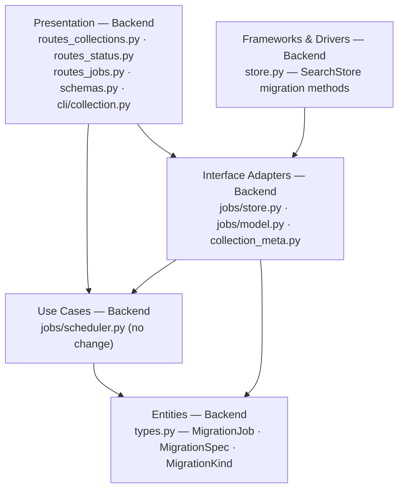
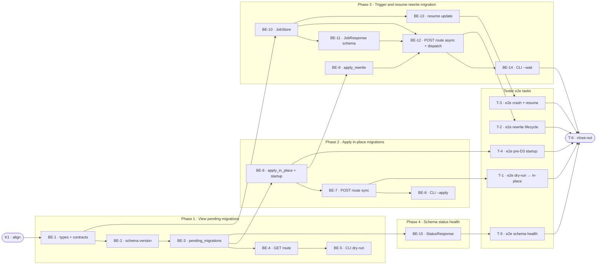

# D3 · Schema Migration Tooling — Team Plan

**How to read this file**
- **Architecture approach:** Clean Architecture (default). **Layers:** Presentation · Use Cases · Interface Adapters · Entities · Frameworks & Drivers (dependencies inward). Each task's first sub-bullet names the layer it touches.
- This project has **no web frontend**. The Frontend role is N/A. All Presentation-layer work (REST routes, Pydantic schemas, CLI commands) is owned by the **Backend** developer.
- The **Backend** and **Tester** sections are the **depth view** — each role's work grouped by layer.
- The **Task Breakdown** is the **order view** — every task is a single-role checkbox in execution order, opening with a dependency graph.
- **Phases are vertical slices** — sliced with the `vertical-slicer` skill. Each delivers a working end-to-end increment. No separate "integrate" phase.
- **Contract tooling:** TypeSpec v1.13.0 — contracts are authored as `.tsp` files beside this plan and validated with `tsp compile --no-emit`.
- IDs (`S#`, `C#`, `BE-#`, `T-#`, `K#`, `Q#`) are the traceability thread.

---

## Background

Five idempotent add-column migrations already run silently at startup (`migrate_namespace`, `migrate_description_embedding`, `migrate_centroid_sum`, `migrate_per_collection_model`, `migrate_acl` in `store.py`), but they are ad-hoc, opaque to operators, untracked, and unobservable via REST. There is no formal mechanism for changes that require data rewrites (e.g., re-embedding after a model upgrade) and no safe recovery path if a migration fails mid-way.

---

## Goal

Operators can apply a schema migration to a collection via a `MigrationJob` — tracked, resumable, and observable through the same job REST and CLI surface as export/import jobs. Additive structural changes apply in-place in under a second; data-rewrite changes run as checkpointed async jobs with structured progress that resume from a crash without requiring source-file re-ingest. Every migration is classified as `in_place`, `rewrite`, or `export_rebuild` so operators know upfront what the job entails.

---

## Scope

### In Scope
- `MigrationJob` dataclass (extends `IngestJob`) with `collection`, `kind`, `migrations_applied`, `backup_confirmed`, `source` fields; persisted via the existing `JobStore` discriminator pattern (`job_type: "migration"`)
- `STORE_SCHEMA_VERSION` constant in `store.py` (starts at `0`); `schema_version` column added to `_archon_collection_meta` (idempotent add-column, defaults to `0` for pre-D3 collections)
- `MigrationSpec` dataclass (`name`, `kind`, `description`, `introduced_at`)
- `SearchStore.pending_migrations(collection, namespace)` — compares live `schema_version` to `STORE_SCHEMA_VERSION`; returns list of `MigrationSpec`
- `SearchStore.apply_in_place_migrations(collection, specs)` — idempotent add-column; updates `schema_version` on completion
- `SearchStore.apply_rewrite_migration(collection, spec, progress_cb)` — batch read/transform/write with per-collection lock and 100-chunk progress callback
- `SearchStore._run_startup_migrations()` — replaces the five direct `migrate_*()` calls in `app.py` lifespan; no behavior change for existing deployments
- Formalise the five existing `migrate_*` methods as `in_place` migrations with `introduced_at=0`
- `GET /collections/{name}/migrations/pending` — returns `{collection, pending: [MigrationSpec], schema_version}`; 404 for unknown collection
- `POST /collections/{name}/migrate` — accepts `{backup_confirmed, dry_run}`; `backup_confirmed` required for `rewrite`/`export_rebuild`; `dry_run=true` is alias for GET
- `MigrationJob` joins the `QUEUED` scheduler (same `max_concurrent_bulk` limit as `ExportJob`/`ImportJob`)
- `POST /jobs/{job_id}/resume` updated to accept `MigrationJob` (add to isinstance check)
- CLI: `archon-search collection migrate <name> [--dry-run] [--apply] [--backup-first] [--wait]`; `--dry-run` is the default
- `JobResponse` gains `migrations_applied: list[str] | None` and `backup_confirmed: bool | None` (nullable, additive)
- `GET /status` gains `store_schema_version: int` and `collections_schema_behind: int`
- `STORE_SCHEMA_VERSION` bump policy documented in `CLAUDE.md` and `BREAKING.md`
- `export_rebuild` kind classified and reported in pending list; execution deferred (operators must re-ingest manually)

### Out of Scope
- `export_rebuild` job execution (export → transform → import saga) — D5 or later
- Cross-collection migration (`--all` flag) — follow-up
- Automatic rollback execution — documented only
- Schema migration for `_archon_collection_meta` metadata table via new system — existing startup migrations cover all known cases
- Embedding-model-change re-embedding inside `MigrationJob` — delegates to existing `ReindexJob`
- LanceDB version migrations — handled by LanceDB itself
- Priority queue for `MigrationJob` vs other bulk jobs — D5
- Dry-run simulation of data transforms — too expensive; operators use classification + doc count to assess cost

---

## Acceptance criteria

- [ ] `GET /collections/{name}/migrations/pending` returns a list of `MigrationSpec` objects with correct `kind` classifications; returns `[]` when schema is current; returns `404` for unknown collection
- [ ] `POST /collections/{name}/migrate` applies in-place migrations synchronously and returns `200` with `{migrations_applied}`; no `MigrationJob` is created for in-place-only migrations
- [ ] `POST /collections/{name}/migrate` rejects `rewrite`/`export_rebuild` migrations without `backup_confirmed: true` with `422`
- [ ] `POST /collections/{name}/migrate` creates a `MigrationJob` (QUEUED → RUNNING → DONE) for rewrite migrations; progress written every 100 chunks
- [ ] `MigrationJob` crash recovery: `RUNNING` → `FAILED` on server restart; checkpoint preserved; `POST /jobs/{id}/resume` re-queues from checkpoint
- [ ] CLI `--wait` polls every 2s, prints `phase: processed/total`, exits `0` on `DONE`, `1` on `FAILED`/`CANCELLED`
- [ ] `GET /status` includes `store_schema_version` and `collections_schema_behind` integer fields
- [ ] Server startup silently applies all pending in-place migrations (no operator action); rewrite migrations NOT applied at startup
- [ ] Pre-D3 collections (no `schema_version` column) treated as version `0`; no errors on fresh startup
- [ ] `MigrationJob` round-trips correctly through `JobStore` `job_to_dict()` / `_load()` discriminator

---

## What does NOT change

- The five existing `migrate_*()` methods' behavior — they continue to run at startup; `_run_startup_migrations()` is a wrapper, not a rewrite
- All existing job kinds (`ExportJob`, `ImportJob`, `ReindexJob`, `IngestJob`, `DeleteJob`) — unchanged
- `POST /jobs/{id}/resume` state machine — only the isinstance check broadens
- `EXPORT_SCHEMA_VERSION` in `export_archive.py` — separate from `STORE_SCHEMA_VERSION`
- `GET /jobs?kind=migration` — already works once `job_type: "migration"` is registered
- Auth model — same Bearer token requirement on all new endpoints
- Per-collection `asyncio.Lock` behavior (A1) — 503 on concurrent ingest already works; D3 acquires the existing lock in the rewrite phase

---

## Known limitations / accepted trade-offs

- `export_rebuild` execution requires the export → transform → import saga (D5); D3 only classifies and reports it — operators must re-ingest manually
- `backup_confirmed` is a flag, not an automated backup gate — operators must confirm they have a backup before D3 creates a rewrite job
- Per-collection lock is in-process only (A1 constraint) — two concurrent `archon-search` processes can corrupt `schema_version` tracking
- `MigrationJob` re-embedding for embedding-model changes delegates to `ReindexJob`; D3 surfaces the need, not the execution
- `STORE_SCHEMA_VERSION = 0` for D3 (infrastructure-only release; no new data migrations ship); first real migration bumps it to `1`

---

## Approach & architecture

D3 follows the same Clean Architecture layering as `ExportJob`/`ImportJob`. New types live in `Entities` (`types.py`), serialization in `Interface Adapters` (`jobs/store.py`, `jobs/model.py`), domain logic in `Frameworks & Drivers` (`store.py`), and REST + CLI in `Presentation` (`routes_collections.py`, `routes_status.py`, `cli/collection.py`). Use Cases (`jobs/scheduler.py`) require no changes — `MigrationJob` slots into the existing QUEUED bulk dispatch loop.

**Layer map**

| Layer | Role | D3 components |
|---|---|---|
| Presentation | Backend | `routes_collections.py` (2 new endpoints), `routes_status.py` (2 new fields), `routes_jobs.py` (isinstance broadened), `schemas.py` (3 model changes), `cli/collection.py` (new `migrate` subcommand) |
| Use Cases | Backend | `jobs/scheduler.py` — **no change**; `MigrationJob` enters via `list_queued_bulk()` |
| Interface Adapters | Backend | `jobs/store.py` (discriminator + `create_migration()` + `list_queued_bulk()` type guard), `jobs/model.py` (`job_to_dict()` extension), `collection_meta.py` (`schema_version` field) |
| Entities | Backend | `types.py` — `MigrationJob`, `MigrationSpec`, `MigrationKind` |
| Frameworks & Drivers | Backend | `store.py` — `STORE_SCHEMA_VERSION`, `schema_version` column, `pending_migrations()`, `apply_in_place_migrations()`, `apply_rewrite_migration()`, `_run_startup_migrations()` |
| Frontend | **N/A** | No web UI — all Presentation is server-side Python owned by Backend |

**What changes**
- `types.py`: add `MigrationJob(IngestJob)`, `MigrationSpec`, `MigrationKind` enum
- `store.py`: `STORE_SCHEMA_VERSION = 0`; `schema_version` column in `_meta_schema()`; `_row_to_meta()` + `update_collection_meta()`; 5 new/updated methods; `_run_startup_migrations()`
- `jobs/store.py`: `_load()` + `_write_atomic()` discriminator branches; `create_migration()` factory; `list_queued_bulk()` type guard and return type
- `jobs/model.py`: `job_to_dict()` — add `migrations_applied` and `backup_confirmed` via `getattr`
- `collection_meta.py`: `schema_version: int = 0` field
- `server/schemas.py`: `JobResponse` two nullable fields; `StatusResponse` two new fields; new `MigrationPendingResponse` + `MigrateRequest` models
- `server/routes_collections.py`: `GET /{name}/migrations/pending` + `POST /{name}/migrate`
- `server/routes_status.py`: populate `store_schema_version` and `collections_schema_behind`
- `server/routes_jobs.py`: broaden isinstance check to include `MigrationJob`
- `server/app.py`: replace 5 direct `migrate_*()` calls in lifespan with `_run_startup_migrations()`; add `_migration_task` to scheduler dispatch closure
- `cli/collection.py`: new `@collection.command("migrate")` subcommand

**Key decisions (from the brief)**
- `STORE_SCHEMA_VERSION` is separate from `EXPORT_SCHEMA_VERSION` — they evolve independently
- In-place migrations still run silently at startup — zero-downtime upgrades preserved
- `backup_confirmed` is a flag, not an automated backup — deliberate operator forcing function
- `MigrationJob` delegates re-embedding to `ReindexJob` — avoids duplicating checkpoint/resume logic
- `export_rebuild` classified but not executed — deferred to D5; classification alone is the D3 deliverable
- `MigrationSpec` lives in `pending_migrations()`, not a global registry — schema version integer + function is sufficient

---

## Contracts / seams

Boundaries where roles must agree. Changing one requires team agreement. **Contract tooling: TypeSpec v1.13.0** — contracts are `.tsp` files beside this plan, each compiled clean with `tsp compile --no-emit`.

**C1 — MigrationSpec and MigrationJob entity shapes**  *(Entities ↔ all layers)*  
Defines the canonical shape of a `MigrationSpec` descriptor and the full `MigrationJob` record used across REST responses, `JobStore` serialization, and CLI output. `MigrationKind` enum constrains the three legal values (`in_place`, `rewrite`, `export_rebuild`). — see [`D3-migration-job.tsp`](D3-migration-job.tsp)
- Realised by: BE-1 · Verified by: BE-3, BE-4, BE-10, BE-11

**C2 — REST endpoint and schema extension shapes**  *(Presentation ↔ external callers)*  
Defines `MigrationPendingResponse` (GET pending response body), `MigrateRequest` (POST migrate request body), `MigrateResponse` (202 body), and the additive extensions to `JobResponse` (`migrations_applied?`, `backup_confirmed?`) and `StatusResponse` (`store_schema_version`, `collections_schema_behind`). All new `JobResponse` fields are nullable for backward compatibility. — see [`D3-migration-rest-api.tsp`](D3-migration-rest-api.tsp)
- Realised by: BE-4, BE-7, BE-11, BE-12, BE-15 · Verified by: BE-4, BE-7, BE-11, BE-12, BE-15, T-1, T-2, T-5

**C3 — SearchStore migration interface**  *(Frameworks & Drivers ↔ Interface Adapters / Presentation)*  
Defines the four operations the `SearchStore` must implement for the migration feature. `pendingMigrations` reads `schema_version` from `_archon_collection_meta` (defaults to `0` if column absent) and returns all specs with `introduced_at > schema_version`. `applyInPlaceMigrations` runs `add_columns()` idempotently and updates `schema_version` on completion. `applyRewriteMigration` acquires the per-collection `asyncio.Lock` for the duration of the batch rewrite. `runStartupMigrations` wraps the other operations for silent at-startup execution. — see [`D3-store-migration-api.tsp`](D3-store-migration-api.tsp)
- Realised by: BE-3, BE-6, BE-9 · Verified by: BE-4, BE-7, BE-12

---

## Scenarios #tester-role

Behavioural only — step-level detail is in each task's `Tests` block.

| id | Scenario (Given / When / Then) |
|----|-------------------------------|
| **S1** | **Given** a collection exists with at least one pending migration · **When** `GET /collections/{name}/migrations/pending` · **Then** `200` with `{collection, pending: [MigrationSpec…], schema_version}` |
| **S2** | **Given** a collection's `schema_version` equals `STORE_SCHEMA_VERSION` · **When** `GET /collections/{name}/migrations/pending` · **Then** `200` with `{pending: []}` |
| **S3** | **Given** `_archon_collection_meta` for a collection has no `schema_version` column (pre-D3 DB) · **When** `GET /collections/{name}/migrations/pending` · **Then** `schema_version` defaults to `0`; all specs with `introduced_at > 0` appear as pending; no error |
| **S4** | **Given** no collection named `x` exists · **When** `GET /collections/x/migrations/pending` · **Then** `404` |
| **S5** | **Given** only in-place migrations are pending for a collection · **When** `POST /collections/{name}/migrate` (no `backup_confirmed` required) · **Then** `200` with `{migrations_applied: […]}`; no `MigrationJob` created in `JobStore` |
| **S6** | **Given** server starts and a collection has pending in-place migrations · **When** FastAPI lifespan runs `_run_startup_migrations()` · **Then** all in-place migrations applied silently; no operator action needed; `schema_version` updated |
| **S7** | **Given** rewrite migrations are pending · **When** `POST /collections/{name}/migrate` with `{backup_confirmed: true}` · **Then** `202` with `{job_id, status: "RUNNING"}` (route transitions to RUNNING immediately to prevent scheduler double-dispatch) |
| **S8** | **Given** a `MigrationJob` is dispatched · **When** `apply_rewrite_migration()` processes chunks in batches · **Then** job transitions `QUEUED → RUNNING → DONE`; `progress.processed/total/phase` written every 100 chunks; `result.migrated_chunks` is correct |
| **S9** | **Given** rewrite or export_rebuild migrations are pending · **When** `POST /collections/{name}/migrate` with `backup_confirmed: false` or omitted · **Then** `422` with clear error |
| **S10** | **Given** a `MigrationJob` rewrite phase holds the per-collection `asyncio.Lock` · **When** an ingest request arrives for the same collection · **Then** `503` after lock timeout; other-collection ingest is unaffected |
| **S11** | **Given** a `ReindexJob` in `QUEUED` or `RUNNING` state exists for the collection · **When** `POST /collections/{name}/migrate` · **Then** `409` |
| **S12** | **Given** a `MigrationJob` was `RUNNING` when the server process crashed · **When** the server restarts and `JobStore._load()` runs · **Then** job transitions to `FAILED` with `error="process_restart"`; `progress` checkpoint preserved |
| **S13** | **Given** a `MigrationJob` is `FAILED` with a checkpoint in `progress` · **When** `POST /jobs/{job_id}/resume` · **Then** `FAILED → QUEUED`; scheduler re-dispatches; job reaches `DONE` from last checkpoint |
| **S14** | **Given** a collection has zero chunks · **When** `MigrationJob` runs `apply_rewrite_migration()` · **Then** job completes immediately with `migrated_chunks=0`; no error |
| **S15** | **Given** `POST /collections/{name}/migrate` returns `202` with `job_id` · **When** CLI runs `migrate --apply --backup-first --wait` · **Then** CLI polls `GET /jobs/{job_id}` every 2s, prints `phase: processed/total` on each poll, exits `0` on `DONE` |
| **S16** | **Given** a `MigrationJob` transitions to `FAILED` during CLI `--wait` polling · **When** CLI receives terminal status · **Then** CLI prints final status and exits `1` |
| **S17** | **Given** collections exist with `schema_version` tracked · **When** `GET /status` · **Then** response includes `store_schema_version: int` and `collections_schema_behind: int` (count of collections with `schema_version < STORE_SCHEMA_VERSION`) |
| **S18** | **Given** a migration with `kind=export_rebuild` is pending · **When** `GET /collections/{name}/migrations/pending` · **Then** migration appears in list with `kind="export_rebuild"` and description noting manual re-ingest required; `POST /migrate` returns `422` (D3 does not execute export_rebuild) |
| **S19** | **Given** a `MigrationJob` is cancelled mid-rewrite (transitions to `CANCELLED`) · **When** the job record is read · **Then** `schema_version` is NOT updated (updated only on `DONE`); a resumed job restarts from the last 100-chunk checkpoint idempotently |

---

## Frontend — Presentation #frontend-role

**N/A — no web frontend.** This project has no GUI. All Presentation-layer work (REST routes, Pydantic schemas, Click CLI) is owned by the Backend developer and listed in the Backend section.

---

## Backend — All Layers #backend-role

**Scope:** All server-side work across all Clean Architecture layers. Writes unit and integration tests test-first for every task.

**Owns layers:** Entities · Interface Adapters · Frameworks & Drivers · Presentation (REST routes + CLI).

**Tasks by layer** *(checkable in the Task Breakdown)*

- Entities: BE-1 (MigrationJob + MigrationSpec types + TypeSpec validation)
- Frameworks & Drivers: BE-2 (STORE_SCHEMA_VERSION + schema_version column), BE-3 (pending_migrations), BE-6 (apply_in_place + startup wiring), BE-9 (apply_rewrite_migration)
- Interface Adapters: BE-10 (JobStore discriminator + create_migration + list_queued_bulk + job_to_dict)
- Presentation (REST): BE-4 (GET pending route), BE-7 (POST migrate in-place), BE-11 (JobResponse schema), BE-12 (POST migrate rewrite + scheduler dispatch), BE-13 (resume update), BE-15 (StatusResponse extensions)
- Presentation (CLI): BE-5 (migrate --dry-run), BE-8 (migrate --apply in-place), BE-14 (migrate --apply --backup-first --wait)

**Done when**
- [ ] Operator sees pending migrations list for any collection — S1, S2, S3, S4
- [ ] In-place migrations applied synchronously (200, no job) — S5
- [ ] Server startup silently applies in-place migrations — S6
- [ ] Rewrite job created (202), tracked to DONE with progress — S7, S8, S14
- [ ] backup_confirmed gate enforced (422 without it) — S9
- [ ] Concurrent ingest blocked during rewrite (503) — S10
- [ ] Conflicting ReindexJob blocked (409) — S11
- [ ] Crash recovery and resume work end-to-end — S12, S13, S19
- [ ] CLI --wait polls correctly and exits 0/1 — S15, S16
- [ ] GET /status shows schema version health — S17
- [ ] export_rebuild shown in pending list, POST /migrate returns 422 — S18

---

## Tester #tester-role

**Scope:** e2e tests (full operator workflow flows via `make_real_app` + `TestClient`) and project close-out. Unit and integration tests belong to the Backend developer in each implementation task's `Tests` block.

**Tasks:** T-1 (e2e dry-run → in-place flow), T-2 (e2e rewrite lifecycle + concurrent), T-3 (e2e crash recovery + resume), T-4 (e2e pre-D3 startup migration), T-5 (e2e schema health status), T-6 (close-out)

**Allocation** — cheapest level that proves each scenario individually; e2e tasks cover critical multi-step flows end-to-end.

| Scenario | Dev level | Tester e2e | Notes |
|---|---|---|---|
| S1 view pending | unit | T-1 | Dev: mock `pending_migrations()`. Tester: full HTTP flow with real store |
| S2 empty pending list | unit | T-1 | Dev: mock returns `[]`. Tester: after in-place apply, GET pending = `[]` |
| S3 pre-D3 default 0 | unit | T-4 | Dev: mock row with no `schema_version`. Tester: real pre-D3 DB through lifespan |
| S4 404 unknown collection | unit | — | Standard route null guard; unit is sufficient |
| S5 in-place 200 | integration | T-1 | Dev: `make_real_pipeline`. Tester: full flow POST → GET pending empty |
| S6 startup migration | integration | T-4 | Dev: `make_real_app` with pre-seeded schema. Tester: full lifespan + collection query |
| S7 rewrite 202 | integration | T-2 | Dev: `make_real_app` + tick = 0.1s. Tester: full lifecycle to DONE |
| S8 job DONE + progress | integration | T-2 | Dev: poll `job_store.get()` directly. Tester: full lifecycle with data assertion |
| S9 422 no backup_confirmed | unit | — | Body validation; unit is sufficient |
| S10 503 concurrent ingest | unit | T-2 | Dev: lock mock. Tester: real concurrent attempt during live rewrite job |
| S11 409 ReindexJob running | unit | — | State injection; unit is sufficient |
| S12 crash recovery | integration | T-3 | Dev: `JobStore._load()` with `RUNNING` job. Tester: full crash + restart flow |
| S13 resume FAILED → DONE | integration | T-3 | Dev: FAILED + checkpoint → DONE. Tester: full resume flow with data verification |
| S14 empty collection | integration | T-2 | Dev: zero chunks, assert result. Tester: part of full lifecycle |
| S15 CLI --wait exits 0 | unit | — | `CliRunner` + mocked httpx; no TCP subprocess harness exists |
| S16 CLI exits 1 FAILED | unit | — | `CliRunner` + mocked httpx; no TCP subprocess harness exists |
| S17 GET /status schema health | unit | T-5 | Dev: mock state. Tester: real migration → status reflects live count |
| S18 export_rebuild classification | unit | — | Classification response; unit is sufficient |
| S19 cancel → checkpoint preserved | integration | T-3 | Dev: cancel, assert `schema_version` unchanged. Tester: cancel + resume idempotency |

---

## Documentation update

Docs the feature touches — the close-out task (T-6) works through this list.

- [ ] `Documentation/Backlog/D3-schema-migration-tooling-brief.md` — no changes (source brief)
- [ ] `Documentation/Backlog/D3-schema-migration-tooling-team-plan.md` — this file (update status to `done`)
- [ ] `BREAKING.md` — add D3 entry: `JobResponse` new nullable fields; new REST endpoints; `STORE_SCHEMA_VERSION` bump policy
- [ ] `CLAUDE.md` (project) — add `STORE_SCHEMA_VERSION` bump policy: every structural change to `_schema()` or `_meta_schema()` increments it; migration author must add a `MigrationSpec` entry to `pending_migrations()`
- [ ] `archon-search.toml.example` — add note that `[jobs].max_concurrent_bulk` covers export, import, **and migration** jobs
- [ ] `Documentation/Architecture/130_data_architecture_and_persistence.md` — add `schema_version` column to `_archon_collection_meta` schema table; document `STORE_SCHEMA_VERSION`
- [ ] `Documentation/Architecture/600_api_reference_or_public_interface.md` — document `GET /collections/{name}/migrations/pending` and `POST /collections/{name}/migrate`; `JobResponse` extensions; `StatusResponse` extensions
- [ ] `Documentation/roadmap.md` — graduate D3 from Backlog to Completed
- [ ] `learnings.md` — update with session observations per CLAUDE.md requirement

---

## Open questions

**Resolved in this revision:**

All questions from the brief are resolved. The investigation surfaced one discrepancy:

- **`POST /jobs/{id}/resume` isinstance check** — the brief states "existing endpoint, no changes," but `routes_jobs.py` line 495 has an explicit `isinstance(job, (ExportJob, ImportJob))` guard that returns `409` for any other job type. `MigrationJob` would be rejected. **Resolution:** BE-13 broadens the isinstance check to `(ExportJob, ImportJob, MigrationJob)` — a necessary 1-line code change. The state-machine behavior is unchanged as the brief intended.
- **CLI calls REST API** — confirmed by existing pattern (`export_cmd.py`, `backup_cmd.py` use `httpx`). CLI migrate uses `httpx` + `_resolve_api_key()` pattern.
- **`STORE_SCHEMA_VERSION` starting value** — `0`. D3 ships as infrastructure; all five formalised migrations have `introduced_at=0` (already applied). Future features increment to `1+`.
- **`MigrationJob` dispatch path** — QUEUED scheduler path (confirmed by brief: "MigrationJob joins the QUEUED scheduler: same JobScheduler and max_concurrent_bulk limit").
- **`_run_startup_migrations()` as method** — instance method on `SearchStore`, following the pattern of all existing `migrate_*` methods.

No open questions remain. `status: planned`.

---

## Task Breakdown

Single-role tasks in execution order, grouped into vertical slices.

### Dependency graph

---

### Phase 0 · Kickoff

- [x] **K1** — Agree contracts, API shapes, and test strategy with the team #team
    - — · 1.0h
    - completes C1, C2, C3
    - Tests

---

### Phase 1 · View pending migrations *(walking skeleton — thinnest end-to-end path; carries the data/model foundation)*

- [x] **BE-1** — Add `MigrationJob`, `MigrationSpec`, `MigrationKind` to `types.py`; validate TypeSpec contract files #backend-role
    - Entities · 2.0h
    - needs K1 · completes C1
    - Tests
        - #unit_test — `test_migration_job_dataclass_fields` — MigrationJob has all required fields; defaults are correct; is a subclass of IngestJob
        - #unit_test — `test_migration_spec_dataclass_fields` — MigrationSpec has name, kind, description, introduced_at
        - #unit_test — `test_migration_kind_enum_values` — MigrationKind has in_place, rewrite, export_rebuild members

- [x] **BE-2** — Add `STORE_SCHEMA_VERSION = 0` to `store.py`; add `schema_version` column to `_meta_schema()` and `_row_to_meta()`; add `schema_version: int = 0` to `CollectionMeta` in `collection_meta.py` #backend-role
    - Frameworks & Drivers · 3.0h
    - needs BE-1 · completes (foundation for BE-3)
    - Tests
        - #unit_test — `test_meta_schema_includes_schema_version` — `_meta_schema()` includes `schema_version` pa.field with correct type
        - #unit_test — `test_row_to_meta_defaults_schema_version_to_zero` — row dict without `schema_version` key produces `CollectionMeta.schema_version == 0`
        - #unit_test — `test_collection_meta_schema_version_default` — `CollectionMeta()` has `schema_version == 0`
        - #integration_test — `test_schema_version_column_added_idempotently` — calling `_run_startup_migrations()` twice on a real LanceDB does not raise; `schema_version` column present after first call

- [x] **BE-3** — Add `SearchStore.pending_migrations(collection, namespace)` returning `list[MigrationSpec]`; classify the five existing `migrate_*` methods as `in_place` with `introduced_at=0` #backend-role
    - Frameworks & Drivers · 3.0h
    - needs BE-2 · completes S2, S3
    - Tests
        - #unit_test — `test_pending_migrations_empty_when_current` — returns `[]` when collection `schema_version == STORE_SCHEMA_VERSION`
        - #unit_test — `test_pending_migrations_returns_specs_when_behind` — returns correct `MigrationSpec` list when collection `schema_version < STORE_SCHEMA_VERSION`
        - #unit_test — `test_pending_migrations_defaults_missing_schema_version_to_zero` — collection row with no `schema_version` column treated as `0`
        - #integration_test — `test_pending_migrations_real_store_empty` — `pending_migrations()` returns `[]` for a freshly created collection (all existing migrations have `introduced_at=0`)

- [x] **BE-4** — Add `GET /collections/{name}/migrations/pending` route handler to `routes_collections.py`; add `MigrationPendingResponse` Pydantic model to `schemas.py` #backend-role
    - Presentation · 2.0h
    - needs BE-3 · completes S1, S4, S18, C2
    - Tests
        - #unit_test — `test_get_migrations_pending_200` — returns `{collection, pending, schema_version}` for a collection with pending migrations
        - #unit_test — `test_get_migrations_pending_empty` — returns `{pending: []}` when schema is current
        - #unit_test — `test_get_migrations_pending_404_unknown_collection` — returns 404 for a non-existent collection
        - #unit_test — `test_get_migrations_pending_export_rebuild_kind` — export_rebuild migration appears in list with correct kind

- [x] **BE-5** — Add `archon-search collection migrate <name> [--dry-run]` subcommand to `cli/collection.py`; default behavior (no flags) prints pending migrations and exits #backend-role
    - Presentation · 2.0h
    - needs BE-4 · completes S1
    - Tests
        - [x] #unit_test — `test_migrate_cli_dry_run_prints_pending` — `CliRunner` + mocked `httpx.get` returning pending list; output contains migration names
        - [x] #unit_test — `test_migrate_cli_no_flags_defaults_to_dry_run` — running without flags behaves identically to `--dry-run`
        - [x] #unit_test — `test_migrate_cli_empty_pending_prints_up_to_date` — clean output when no migrations pending

---

### Phase 2 · Apply in-place migrations

- [x] **BE-6** — Add `SearchStore.apply_in_place_migrations(collection, namespace, specs)` and `SearchStore._run_startup_migrations()`; replace the five direct `migrate_*()` calls in `app.py` lifespan with `await store._run_startup_migrations()` #backend-role
    - Frameworks & Drivers · 2.0h
    - needs BE-3 · completes S6
    - Tests
        - #unit_test — `test_apply_in_place_calls_add_columns_for_each_spec` — each spec triggers `add_columns()`
        - #unit_test — `test_apply_in_place_is_idempotent` — second call with same specs is a no-op; no error raised (catches "already exists" RuntimeError)
        - #unit_test — `test_apply_in_place_updates_schema_version` — `schema_version` in `_archon_collection_meta` is updated after apply
        - #integration_test — `test_run_startup_migrations_applies_in_place_on_startup` — seed pre-D3 schema in `tmp_path`, drive `make_real_app` lifespan; assert `schema_version` column exists and in-place migrations are applied

- [x] **BE-7** — Add `POST /collections/{name}/migrate` in-place synchronous path (status `200`) to `routes_collections.py`; add `MigrateRequest` Pydantic model to `schemas.py` #backend-role
    - Presentation · 2.0h
    - needs BE-6 · completes S5, C2
    - Tests
        - [x] #unit_test — `test_post_migrate_in_place_returns_200_with_migrations_applied` — returns `{migrations_applied: [...]}` synchronously; no job created in job store
        - [x] #unit_test — `test_post_migrate_dry_run_true_returns_pending_list` — `dry_run: true` returns same response as GET pending; no side effect
        - [x] #integration_test — `test_post_migrate_in_place_real_store` — real LanceDB; `schema_version` updated after apply; no MigrationJob in job store

- [x] **BE-8** — Extend CLI `migrate` with `--apply` flag (in-place sync path); print `{migrations_applied}` summary on success #backend-role
    - Presentation · 1.0h
    - needs BE-7 · completes S5
    - Tests
        - [x] #unit_test — `test_migrate_cli_apply_in_place_prints_summary` — `CliRunner` + mocked `httpx.post` returning 200 + `migrations_applied`; output contains applied names
        - [x] #unit_test — `test_migrate_cli_apply_and_dry_run_mutually_exclusive` — passing both `--apply` and `--dry-run` raises a usage error

---

### Phase 3 · Trigger and resume rewrite migration

- [x] **BE-9** — Add `SearchStore.apply_rewrite_migration(collection, namespace, spec, progress_cb)`; acquires per-collection `asyncio.Lock` for duration; reads chunks in batches; transforms; writes back via `table.delete() + table.add()` per batch; calls `progress_cb(processed, total, phase)` every 100 chunks #backend-role
    - Frameworks & Drivers · 4.0h
    - needs BE-6 · completes S10, S14, S19
    - Tests
        - #unit_test — `test_apply_rewrite_calls_progress_cb_every_100_chunks` — mock store with 250 chunks; verify `progress_cb` called at 100, 200, 250
        - #unit_test — `test_apply_rewrite_empty_collection_completes_immediately` — zero chunks → `progress_cb` not called; no error
        - #unit_test — `test_apply_rewrite_acquires_collection_lock` — concurrent ingest attempt times out with `StoreBusyError` while rewrite holds lock (pre-acquire pattern from `test_routes_ingest_503.py`)
        - #unit_test — `test_apply_rewrite_schema_version_not_updated_on_cancel` — simulate cancel mid-way; assert `schema_version` unchanged
        - #integration_test — `test_apply_rewrite_real_store_with_dummy_transform` — real LanceDB; synthetic `MigrationSpec`; all chunks rewritten; idempotent double-apply

- [x] **BE-10** — Add `MigrationJob` to `JobStore._load()` + `_write_atomic()` discriminators; add `create_migration()` factory; extend `list_queued_bulk()` isinstance guard and return type; extend `job_to_dict()` with `migrations_applied` and `backup_confirmed` via `getattr` #backend-role
    - Interface Adapters · 4.0h
    - needs BE-1 · completes S12
    - Tests
        - [x] #unit_test — `test_migration_job_serialization_round_trip` — `_write_atomic()` + `_load()` round-trip preserves all fields including `migrations_applied`, `backup_confirmed`, `source`, `kind`
        - [x] #unit_test — `test_migration_job_crash_recovery_running_to_failed` — `MigrationJob` in `RUNNING` loaded as `FAILED` with `error="process_restart"`; `progress` checkpoint preserved
        - [x] #unit_test — `test_migration_job_queued_survives_restart` — `QUEUED` MigrationJob is NOT set to FAILED on load
        - [x] #unit_test — `test_create_migration_returns_queued_job` — factory method returns `MigrationJob` with `status=QUEUED`
        - [x] #unit_test — `test_list_queued_bulk_includes_migration_job` — `list_queued_bulk()` returns `MigrationJob` alongside `ExportJob`/`ImportJob`
        - [x] #unit_test — `test_job_to_dict_includes_migration_fields` — `migrations_applied` and `backup_confirmed` appear in dict; existing jobs get `None` for both

- [x] **BE-11** — Add `migrations_applied: list[str] | None = None` and `backup_confirmed: bool | None = None` to `JobResponse` in `schemas.py`; regenerate OpenAPI snapshot with `uv run --python 3.12` #backend-role
    - Presentation · 1.5h
    - needs BE-10 · completes C2
    - Tests
        - #unit_test — `test_job_response_migration_fields_default_none` — existing job kinds produce `None` for both new fields; no serialization error
        - #unit_test — `test_job_response_migration_fields_populated` — `MigrationJob` with `migrations_applied=["m1"]` and `backup_confirmed=True` serializes correctly

- [x] **BE-12** — Add `POST /collections/{name}/migrate` rewrite async path to `routes_collections.py` (202, `backup_confirmed` gate, 409 for active `ReindexJob`, 422 for export_rebuild, `asyncio.create_task(_migration_task(…))`); add `_migration_task` coroutine; wire into scheduler dispatch closure in `app.py` lifespan #backend-role
    - Presentation · 4.0h
    - needs BE-9, BE-10, BE-11 · completes S7, S8, S9, S11, C2
    - Tests
        - #unit_test — `test_post_migrate_rewrite_returns_202_with_job_id` — `backup_confirmed: true`, rewrite pending → 202 + `job_id`
        - #unit_test — `test_post_migrate_rewrite_422_without_backup_confirmed` — missing or `false` `backup_confirmed` → 422
        - #unit_test — `test_post_migrate_export_rebuild_422_not_implemented` — export_rebuild pending → 422 with clear message
        - #unit_test — `test_post_migrate_409_if_reindex_job_running` — inject `ReindexJob` in `RUNNING`; assert 409
        - #integration_test — `test_migration_job_dispatched_and_reaches_done` — `make_real_app` + synthetic dummy transform + scheduler tick = 0.1s; poll `job_store.get()` until DONE; assert `result.migrated_chunks` correct
        - #integration_test — `test_migration_job_progress_written_every_100_chunks` — >100 chunks; assert `progress.processed` checkpoints written during run

- [x] **BE-13** — Broaden `isinstance` check in `POST /jobs/{id}/resume` handler (`routes_jobs.py`) to include `MigrationJob`; no other logic changes #backend-role
    - Presentation · 1.5h
    - needs BE-10 · completes S13
    - Tests
        - #unit_test — `test_resume_migration_job_transitions_failed_to_queued` — `FAILED` MigrationJob → 200; job transitions to `QUEUED`
        - #unit_test — `test_resume_migration_job_not_failed_returns_409` — `RUNNING` MigrationJob → 409 `job_not_failed`
        - #integration_test — `test_migration_job_resume_from_checkpoint_reaches_done` — FAILED + progress checkpoint; resume; scheduler re-dispatches; job reaches DONE; `migrated_chunks` reflects resumed work

- [x] **BE-14** — Extend CLI `migrate` with `--apply --backup-first --wait` flags; `--wait` polls `GET /jobs/{job_id}` every 2s and prints `phase: processed/total`; exits `0` on `DONE`, `1` on `FAILED`/`CANCELLED` #backend-role
    - Presentation · 2.0h
    - needs BE-12 · completes S15, S16
    - Tests
        - #unit_test — `test_migrate_cli_wait_polls_until_done_exits_0` — `CliRunner` + mocked `httpx.get` sequence: QUEUED → RUNNING (with progress) → DONE; exit code 0; progress output printed
        - #unit_test — `test_migrate_cli_wait_exits_1_on_failed` — mocked final status FAILED; exit code 1
        - #unit_test — `test_migrate_cli_backup_first_required_for_rewrite` — missing `--backup-first` when rewrite pending → 422 propagated as error message; exit non-zero

---

### Phase 4 · View schema status in server health
	
- [x] **BE-15** — Add `store_schema_version: int` and `collections_schema_behind: int` to `StatusResponse` in `schemas.py`; update `routes_status.py` handler to populate them from `STORE_SCHEMA_VERSION` and `pending_migrations()` aggregate #backend-role
    - Presentation · 2.0h
    - needs BE-3 · completes S17, C2
    - Tests
        - #unit_test — `test_get_status_includes_store_schema_version` — `GET /status` response contains `store_schema_version` equal to `STORE_SCHEMA_VERSION` constant
        - #unit_test — `test_get_status_collections_schema_behind_count` — mock 3 collections, 1 behind; assert `collections_schema_behind == 1`
        - #unit_test — `test_get_status_collections_schema_behind_zero` — all collections current; assert `collections_schema_behind == 0`

---

### Tester e2e tasks

All tester tasks are `@pytest.mark.integration` tests using `make_real_app` (real LanceDB in `tmp_path`, real `JobScheduler`, `TestClient` over ASGI transport). They cover full multi-step operator flows that span scheduler, store, and REST layers together.

- [x] **T-1** — e2e: full dry-run → in-place apply → pending empty flow #tester-role
    - — · 1.5h
    - needs BE-7 · completes S1, S2, S5
    - Tests
        - [x] #e2e_test — `test_migrate_dry_run_then_in_place_apply_e2e` — `make_real_app`; GET `/migrations/pending` returns non-empty list; POST `/migrate` (in-place) returns 200; GET `/migrations/pending` returns `{pending: []}`; assert `schema_version` updated in `_archon_collection_meta`

- [ ] **T-2** — e2e: full rewrite migration lifecycle including concurrent ingest 503 #tester-role
    - — · 2.0h
    - needs BE-12 · completes S7, S8, S10, S14
    - Tests
        - #e2e_test — `test_rewrite_migration_full_lifecycle_e2e` — `make_real_app` with real chunks + synthetic dummy transform spec; POST `/migrate` → 202; poll `job_store.get()` until DONE; assert `result["migrated_chunks"]` correct; assert GET `/migrations/pending` returns `{pending: []}` after completion
        - #e2e_test — `test_concurrent_ingest_503_during_rewrite_e2e` — trigger MigrationJob rewrite on a real collection; while rewrite holds lock, issue ingest POST to same collection; assert 503; migration finishes cleanly
        - #e2e_test — `test_empty_collection_rewrite_completes_immediately_e2e` — zero-chunk collection; POST `/migrate`; poll to DONE; assert `migrated_chunks == 0`

- [ ] **T-3** — e2e: crash recovery and resume complete flow #tester-role
    - — · 2.0h
    - needs BE-13 · completes S12, S13, S19
    - Tests
        - #e2e_test — `test_migration_crash_inject_and_resume_e2e` — trigger MigrationJob; force `RUNNING → FAILED` via direct `job_store.update()`; POST `/jobs/{id}/resume`; poll to DONE; assert `migrated_chunks` equals total (checkpoint not lost)
        - #e2e_test — `test_migration_cancel_schema_version_not_updated_e2e` — trigger MigrationJob; cancel mid-rewrite; assert `schema_version` unchanged in store; resume; poll to DONE; assert `schema_version` updated only now

- [ ] **T-4** — e2e: pre-D3 collection startup migration through full lifespan #tester-role
    - — · 1.5h
    - needs BE-6 · completes S3, S6
    - Tests
        - #e2e_test — `test_pre_d3_startup_applies_in_place_migrations_e2e` — write a LanceDB in `tmp_path` without `schema_version` column; drive `make_real_app` lifespan; assert `schema_version` column present in `_archon_collection_meta`; assert GET `/migrations/pending` returns `{pending: []}`; assert no error logged

- [ ] **T-5** — e2e: schema health status reflects live migration state #tester-role
    - — · 1.0h
    - needs BE-15 · completes S17
    - Tests
        - #e2e_test — `test_schema_status_reflects_migration_state_e2e` — `make_real_app`; GET `/status` → `collections_schema_behind` reflects count of behind collections; apply in-place migration; GET `/status` → count decrements; assert `store_schema_version` equals `STORE_SCHEMA_VERSION` constant throughout

---

### Phase 5 · Close-out

- [ ] **T-6** — Project close-out and acceptance fact-check #tester-role
    - — · 4.0h
    - needs BE-14, T-1, T-2, T-3, T-4, T-5
    - Tests
    - Duties
        - Update all documentation per the "Documentation update" section — `BREAKING.md`, `CLAUDE.md`, `archon-search.toml.example`, Architecture docs, `roadmap.md`, `learnings.md`
        - Fix all build/compiler warnings, if any
        - Run `uv run pytest` (full suite with coverage); fix every failing test including any unrelated to D3
        - Validate each acceptance criterion one-by-one with a fact check — no assumptions; confirm each is genuinely done in code

---

**Critical path:** K1 → BE-1 → BE-2 → BE-3 → BE-6 → BE-9 → BE-12 → BE-13 → T-3 → T-6 (≈ 28.0h)

Secondary parallel path merging at BE-12: BE-1 → BE-10 → BE-11 → BE-12 (≈ 11.5h — completes before BE-12 starts if begun at BE-1)
