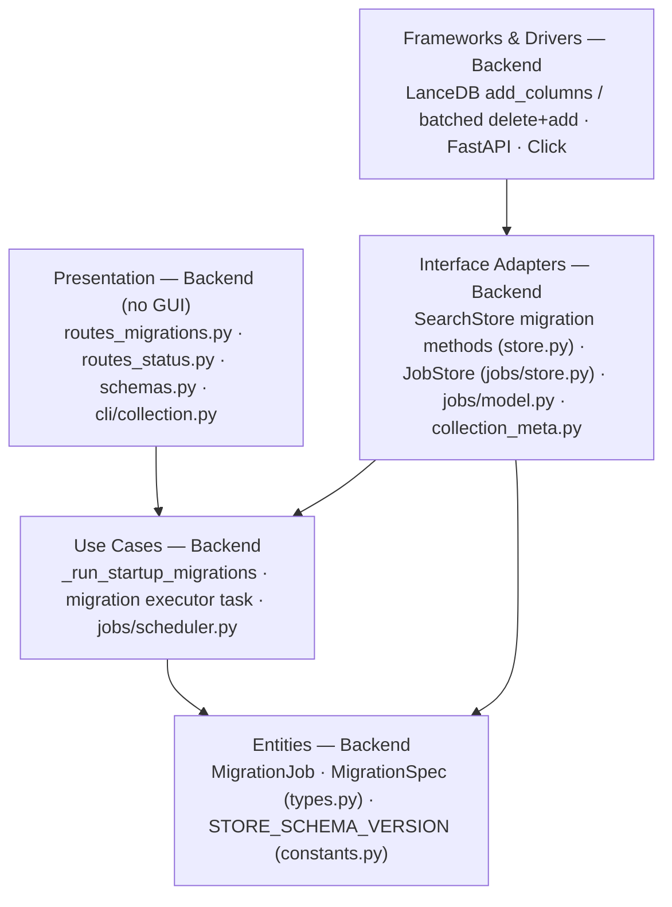
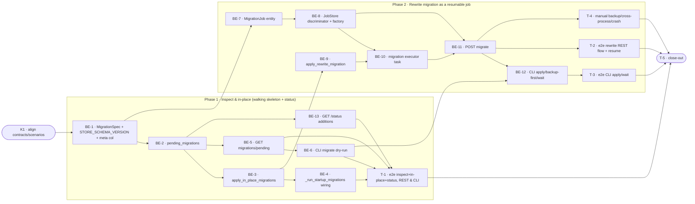

# D3 · Schema migration tooling — Team Plan

**How to read this file**
- **Architecture approach:** Clean Architecture (default). **Layers:** Presentation · Use Cases · Interface Adapters · Entities · Frameworks & Drivers. Each task's first sub-bullet names the layer it touches.
- This is a **server + CLI Python app with no GUI**. The Presentation layer is the FastAPI REST routes, the Pydantic schemas, and the Click CLI — all server-side Python owned by **backend**. The **Frontend role is N/A** for this feature.
- The **Frontend, Backend, and Tester** sections are the **depth view** — each role's work, grouped by layer.
- The **Task Breakdown** is the **order view** — every task is a single-role checkbox in execution order, opening with a dependency graph.
- **Phases are vertical slices**: each delivers a working end-to-end increment, not a horizontal layer. No separate "integrate" phase.
- Each task carries the **role tag at the end of its title line**, then sub-bullets: **layer · estimate** (decimal hours), **needs · completes**, and a **Tests** block. **needs** = predecessor tasks; **completes** = the scenario `S#` it makes true, or the contract `C#` it realises.
- **Tests** are tagged by level. **Unit and integration tests belong to the implementing dev** (test-first); **e2e and manual tests are the tester's tasks**. The close-out task writes no tests.
- **Contracts** are logical, authored as linked `.tsp` files (TypeSpec 1.13.0 detected). No code/signatures in prose.
- **Role tags** (`#frontend-role`, `#backend-role`, `#tester-role`) mark each task and each role-owned section.
- IDs (`S#`, `C#`, `BE-#`/`T-#`/`K#`, `Q#`) are the traceability thread.
- **Rule:** edit your own tasks freely; change a contract only by team agreement.

---

## Background
The chunk/metadata schema currently evolves through five idempotent startup migrations (`migrate_namespace`, `migrate_description_embedding`, `migrate_centroid_sum`, `migrate_per_collection_model`, `migrate_acl` in `store.py:590–778`) that run silently at startup from `server/app.py:151–155`. They are **not all simple add-column migrations**: `migrate_namespace`, `migrate_description_embedding`, and `migrate_centroid_sum` are purely additive `add_columns` on `_archon_collection_meta`; `migrate_per_collection_model` in its "state (a)" performs a **data rewrite** (read all meta rows, delete each, re-insert with a new column value) followed by `table.drop_columns(["embedding_model"])`; and `migrate_acl` iterates **every per-collection chunk table** to add an `acl` column (chunk-table scope, not the meta table). They are ad-hoc, opaque to operators, not job-tracked, not observable over REST, and have no documented rollback path. There is no sanctioned mechanism for changes that require data rewrites, and no guarantee a half-finished migration can be recovered without full re-ingest. (Note: LanceDB **does** support `drop_columns` — the codebase already calls it — but on chunk tables at scale or under concurrent reads it is risky, so D3 only formalizes the genuinely additive meta-table migrations as `in_place` specs.)

---

## Goal
An operator can apply a schema migration to a collection via a `MigrationJob` — tracked, resumable, and observable through the same job REST and CLI surface as export/import. Additive structural changes apply in-place in under a second with no data rewrite; data-rewrite changes run as a checkpointed async job that resumes after a crash and never touches source files; every migration is classified `in_place`, `rewrite`, or `export_rebuild` so operators know the cost upfront; rollback rules are documented per kind with a `backup_confirmed` gate for destructive kinds.

---

## Scope

### In Scope
- `MigrationSpec` entity (`{name, kind, description}`) + `STORE_SCHEMA_VERSION` constant (distinct from `EXPORT_SCHEMA_VERSION`); `schema_version` column on `_archon_collection_meta` (idempotent add-column, defaults `0`).
- `SearchStore.pending_migrations()`, `apply_in_place_migrations()`, `apply_rewrite_migration(progress_cb)`.
- Only the three genuinely additive meta-table startup migrations (`migrate_namespace`, `migrate_description_embedding`, `migrate_centroid_sum`) are formalized as `in_place` specs, run via a new `_run_startup_migrations()`. `migrate_acl` (chunk-table scope) and `migrate_per_collection_model` (state-(a) data rewrite + `drop_columns`) are **not** re-expressed as `in_place` specs in D3; they remain standalone startup calls invoked from `_run_startup_migrations()` exactly as today. No behavior change for existing deployments.
- `MigrationJob` (extends `IngestJob`, `job_type='migration'`, `source: Literal["user","auto"] = "user"`) persisted via the `JobStore` discriminator; joins the existing `QUEUED` bulk scheduler under `max_concurrent_bulk`.
- REST: `GET /collections/{name}/migrations/pending`, `POST /collections/{name}/migrate` (dry-run / `backup_confirmed` gate / 202 job / 409 vs running reindex); `JobResponse` gains `migrations_applied` + `backup_confirmed` (additive, nullable); `GET /status` gains `store_schema_version` + `collections_schema_behind`. `GET /jobs?kind=migration` works via the `kind` map.
- CLI: `archon-search collection migrate <name> [--dry-run] [--apply] [--backup-first] [--wait]` (dry-run default).
- Embedding-model-mismatch is **excluded from the migration-spec surface** (it is not a `MigrationSpec`, since `ReindexJob` has no `collection`/`kind` and never bumps `schema_version`). `POST .../migrate` detects an embedding mismatch as a precondition and either rejects with `409` when a `ReindexJob` is already `QUEUED`/`RUNNING` for the collection, or returns a response that directs the operator to run a standalone reindex (`JobStore.create_reindex()`); the embedding dimension of `schema_version` is handled by that reindex path separately, not by a `MigrationJob`.
- Documented rollback rules in `BREAKING.md` + inline in `MigrationSpec.description`; `STORE_SCHEMA_VERSION` bump policy in `CLAUDE.md` + `BREAKING.md`.

### Out of Scope
- `export_rebuild` execution as a job (classified + reported only; export→transform→import saga deferred to D5+).
- Cross-collection (`--all`) migration; automatic rollback execution; new metadata-table schema changes.
- Re-implementing re-embedding (delegated to `ReindexJob`); LanceDB on-disk format migrations; remote/URL transforms; priority queue for `MigrationJob`; data-transform simulation in dry-run.
- Promoting `migrate_acl` (chunk-table) and `migrate_per_collection_model` (data-rewrite + `drop_columns`) into the formal `MigrationSpec` system (e.g. via richer spec executors): in D3 they **intentionally remain standalone startup calls**; formalizing them is deferred. Future devs evolving the chunk/meta schema should follow the `in_place` spec pattern for additive meta changes, not these two standalone calls.

---

## Acceptance criteria
- `pending_migrations(collection)` returns `[]` when the collection is at `STORE_SCHEMA_VERSION`, and the correct `MigrationSpec` list when behind (incl. pre-D3 collections defaulting to version `0`).
- In-place migrations still apply silently at startup and are idempotent (second apply is a no-op, no error).
- `POST /collections/{name}/migrate` with only `in_place` migrations pending applies them **synchronously and returns `200` with no job** (per Q2 recommended answer). With a pending `rewrite`/`export_rebuild` and `backup_confirmed=false` it is rejected `422`; with `backup_confirmed=true` it returns `202` + `job_id`.
- **Mixed pending (both `in_place` and `rewrite`):** the `backup_confirmed` gate is evaluated **before any mutation**. If a `rewrite` (or `export_rebuild`) remains pending and `backup_confirmed` is not set, `POST .../migrate` returns `422` **before applying any `in_place` specs** — a rejected request mutates nothing. Only when the gate passes (`backup_confirmed=true`) are the pending `in_place` specs applied synchronously, and then `202` + `job_id` is returned for the rewrite (the response also reports the already-applied in-place summary); `409` if a `MigrationJob`/`ReindexJob` is already active for the collection.
- A `rewrite` `MigrationJob` checkpoints `progress {processed,total,phase}` every 100 chunks, reaches `DONE` with result `{migrated_chunks, migrations_applied, kind}`, and `schema_version` is bumped **only** in the same finalize step that sets `DONE` — never on a partial apply.
- A `RUNNING` `MigrationJob` on load transitions to `FAILED` with checkpoint preserved; `POST /jobs/{job_id}/resume` re-enqueues it to `QUEUED` and it resumes idempotently from the last checkpoint.
- `GET /collections/{name}/migrations/pending` returns `404` for an unknown collection; `GET /jobs?kind=migration` lists migration jobs; `GET /status` reports `store_schema_version` and `collections_schema_behind`.
- CLI `migrate` defaults to dry-run (no mutation), `--apply` applies, `--apply --wait` prints `phase: processed/total` and exits `0` on `DONE` / `1` on `FAILED`/`CANCELLED`.
- Concurrent ingest into a collection mid-`rewrite` gets `503` + `Retry-After`; `POST .../migrate` returns `409` when a `ReindexJob` is already `QUEUED`/`RUNNING` for the collection.

---

## What does NOT change
- The five existing `migrate_*` methods keep running at startup with identical effect; existing deployments need no operator action. Three are formalized as `in_place` specs; `migrate_acl` and `migrate_per_collection_model` keep running as standalone startup calls (unchanged behavior).
- The chunk schema (`_schema()`); only `_meta_schema()` gains `schema_version`.
- `max_concurrent_bulk` **semantics** and `EXPORT_SCHEMA_VERSION`. (The `JobScheduler`'s `dispatch_fn` **type surface widens** to admit `MigrationJob`, and `POST /jobs/{job_id}/resume` gains `MigrationJob` to its resumable allowlist — see BE-8; these are additive, not semantic, changes.)
- Re-embedding remains owned by `ReindexJob`; the per-collection `asyncio.Lock` (A1) and its `503` behavior are reused unchanged.

---

## Known limitations / accepted trade-offs
- `export_rebuild` is classified and reported but not executed in D3; operators back up and re-ingest manually.
- `backup_confirmed` is a forcing flag, not an automated backup; D3 does not snapshot before a rewrite.
- The per-collection lock is in-process only; two processes against one DB applying migrations concurrently is unsupported (may corrupt version tracking).
- Dry-run reports which migrations would run but does not simulate the data transform.
- A `rewrite` migration uses **batched read → transform → delete + add** (the same mechanism `migrate_per_collection_model` state-(a) already uses), not an unverified upsert API; `schema_version` is bumped only on `DONE`, so a partial `add_columns`/rewrite failure leaves the version unchanged and is safely re-applied.
- **Mid-batch crash can lose rows (accepted for D3, must be hardened before D5+).** Within a 100-chunk batch the delete + add is **row-by-row** (mirroring `migrate_per_collection_model` at `store.py:702–716`) with no crash safety between the per-row `delete` and `add`. A process crash **between** the delete and the add of an in-flight batch can leave rows deleted-but-not-re-added; those rows are not yet counted in `progress.processed`, so resume cannot recover them. Resume recovers only to the **last completed 100-chunk checkpoint**: the in-flight batch is re-run from its checkpoint start, and because the transform is idempotent re-running is safe — but rows deleted-but-not-re-added before the checkpoint advanced are unrecoverable. This is acceptable for D3 (which ships migration infrastructure + a synthetic transform only, not a real chunk-table rewrite) and **must be hardened before the first real chunk-table rewrite (D5+)**.
- A scheduled backup export (`BackupLoop`, `jobs/backup_loop.py:173–182`) for a collection with an **active rewrite `MigrationJob`** will contend on the per-collection lock: the backup's export gets an operator-visible `503` + `Retry-After` and is retried on the next backup cycle. `MigrationJob`s are correctly excluded from `BackupLoop`'s backup-key dedup (it filters on `source == "backup"`), so they neither suppress nor are suppressed by backup enqueue.
- LanceDB **supports `drop_columns`** (the codebase already calls it in `migrate_per_collection_model`), but on chunk tables at scale or under concurrent reads it is risky. D3 therefore does not run drop/rename on chunk tables: such changes are classified `export_rebuild` (reported, not executed) and operators back up and re-ingest.

---

## Approach & architecture

D3 is a classic Interface-Adapter + Use-Case extension layered on the proven D1/D2 job infrastructure: schema introspection + migration execution land on `SearchStore`; `MigrationJob` is a third application of the `JobStore` discriminator + `QUEUED` scheduler pattern; new REST routes and a CLI subcommand form the Presentation surface. Dependencies point inward; no new abstraction layer is introduced.

**Layer map (and role mapping)**

| Layer | Role | Components |
|-------|------|-----------|
| Presentation | **Backend** (no GUI; Frontend N/A) | `server/routes_migrations.py` (new pending + migrate routes, co-located with `_migration_task` — mirrors `routes_export.py`), `server/routes_status.py` (status additions), `server/schemas.py` (`MigrationSpec`, `PendingMigrationsResponse`, `MigrateRequest`, `JobResponse` additions), `server/routes_jobs.py` (`_KIND_TYPE_MAP`), `cli/collection.py` (`migrate` subcommand) |
| Use Cases | Backend | `store._run_startup_migrations()`, the migration executor task `_migration_task` (`server/routes_migrations.py` — co-located with the migration HTTP routes; dispatch wiring, phases, checkpointing), `jobs/scheduler.py` (reuse) |
| Interface Adapters | Backend | `store.py` (`pending_migrations`, `apply_in_place_migrations`, `apply_rewrite_migration`, `_meta_schema` + schema_version), `jobs/store.py` (`create_migration`, `_load`/`_write_atomic`, `list_queued_bulk`), `jobs/model.py` (`job_to_dict`), `collection_meta.py` (`schema_version`) |
| Entities | Backend | `types.py` (`MigrationJob`, `MigrationSpec`, `JobStatus` reuse), `constants.py` (`STORE_SCHEMA_VERSION`) |
| Frameworks & Drivers | Backend | LanceDB (`add_columns`, batched read → transform → `delete`+`add`), FastAPI, Click — existing |

**What changes**
- New entity types + a module-level schema-version constant; a new meta column.
- Three new `SearchStore` methods + a startup runner that re-expresses only the **three** additive meta-table migrations as `in_place` specs; the other two (`migrate_acl`, `migrate_per_collection_model`) remain standalone startup calls.
- `JobStore` gains a `migration` discriminator branch + factory; `job_to_dict` gains two nullable fields.
- Two new REST routes, status additions, and one new CLI subcommand.

**Key decisions (from the brief)**
- `STORE_SCHEMA_VERSION` is separate from `EXPORT_SCHEMA_VERSION` and module-level (all collections share one target; a collection's current version lives in its meta row).
- `in_place` migrations still run silently at startup; only `rewrite`/`export_rebuild` need explicit action.
- `backup_confirmed` is a forcing flag, not automated backup; re-embedding delegates to `ReindexJob`; `export_rebuild` is classified but not executed; specs live in `pending_migrations()`, not a separate registry; dry-run is the CLI default.

---

## Contracts / seams

Boundaries where layers/roles must agree. **Logical, not code.** Authored as TypeSpec `.tsp` files beside this plan (TypeSpec **1.13.0** detected); each compiled clean with `tsp compile <file> --no-emit`.

**C1 — Store migration API**  *(Use Cases ↔ Interface Adapters / Frameworks)*
`MigrationSpec` (name, kind, description), the rewrite `MigrationProgress` (processed, total, phase ∈ detecting/rewriting/reindexing/finalizing), `MigrationResult` (migrated_chunks, migrations_applied, kind), and the `SearchStore` migration surface (`pending_migrations`, `apply_in_place_migrations`, `apply_rewrite_migration`). The `in_place` specs formalize only the three additive meta-table startup migrations; `migrate_acl` (chunk-table) and `migrate_per_collection_model` (data-rewrite) stay as standalone startup calls and are **not** re-expressed as `in_place` specs. — see `D3-store-migration-api.tsp`.
- Realised by: BE-1, BE-2, BE-3, BE-9 · Verified by: BE-2, BE-3 (shape + behavioral), BE-9 (integration), T-1, T-2 (e2e)

**C2 — MigrationJob persistence**  *(Entities ↔ Interface Adapters)*
`MigrationJob` shape (IngestJob base + collection, kind, migrations_applied, backup_confirmed, source) and the serialization contract: persist with `job_type="migration"`, reload into the subclass, surface the two new fields (nullable for other kinds) via `job_to_dict`; crash recovery (RUNNING→FAILED, checkpoint preserved). — see `D3-migration-job.tsp`.
- Realised by: BE-7, BE-8 · Verified by: BE-8 (unit — serialization round-trip + crash recovery), T-2 (e2e). (`test_jobs_filter_kind_migration` is a REST filter test → attributed to C3, not C2.)

**C3 — Migration REST / CLI seam**  *(Presentation ↔ server; CLI ↔ server over HTTP)*
`PendingMigrationsResponse`, `MigrateRequest` (backup_confirmed, dry_run), `JobResponse` additions (migrations_applied, backup_confirmed), `GET /status` additions (store_schema_version, collections_schema_behind), and status-code semantics (200 / 202 / 404 / 409 / 422). — see `D3-migration-rest-api.tsp`.
- Realised by: BE-5, BE-11, BE-12, BE-13 · Verified by: BE-5, BE-8 (`test_jobs_filter_kind_migration`), BE-11, BE-12, BE-13 (integration/unit), T-1, T-2, T-3 (e2e)

---

## Scenarios #tester-role

Behavioural only — step-level detail is produced by the tasks below. Covers happy, unhappy, edge, and non-functional paths.

| id | Scenario (Given / When / Then) |
|----|--------------------------------|
| **S1** | **Given** a collection at `STORE_SCHEMA_VERSION` · **When** `pending_migrations()` is called · **Then** it returns an empty list. |
| **S2** | **Given** a collection behind the current schema version (incl. pre-D3 with no `schema_version` column → treated as `0`) · **When** `pending_migrations()` is called · **Then** it returns the correct `MigrationSpec` list with kinds. |
| **S3** | **Given** only `in_place` migrations pending · **When** the operator applies them · **Then** `add_columns` runs synchronously, `schema_version` is updated, and a summary returns. |
| **S4** | **Given** server startup with in-place migrations pending · **When** `_run_startup_migrations()` runs · **Then** all five existing migrations run at startup and apply silently and idempotently (second start is a no-op, no error) — three as formal `in_place` specs, the other two (`migrate_acl`, `migrate_per_collection_model`) as standalone startup calls. |
| **S5** | **Given** a `rewrite` migration pending and `backup_confirmed=true` · **When** the operator applies it · **Then** a `MigrationJob` is created (`202`), transitions QUEUED→RUNNING→DONE, checkpoints every 100 chunks, and the result carries `{migrated_chunks, migrations_applied, kind}`. |
| **S6** | **Given** a `rewrite`/`export_rebuild` pending and `backup_confirmed=false` · **When** `POST .../migrate` is called · **Then** the request is rejected `422` with a clear error. |
| **S7** | **Given** an unknown collection name · **When** `GET /collections/{name}/migrations/pending` is called · **Then** it returns `404`. |
| **S8** | **Given** a `MigrationJob` in `RUNNING` when the process restarts · **When** the `JobStore` loads · **Then** it transitions to `FAILED` with `error="process_restart"` and the checkpoint is preserved. |
| **S9** | **Given** a `FAILED` `MigrationJob` with a preserved checkpoint · **When** `POST /jobs/{job_id}/resume` is called · **Then** it transitions to `QUEUED` and resumes idempotently from the last 100-chunk checkpoint. |
| **S10** | **Given** an empty collection · **When** a `rewrite` migration runs · **Then** it completes immediately with `migrated_chunks=0` and `DONE` (not an error). |
| **S11** | **Given** a `rewrite` migration holding the per-collection lock · **When** a concurrent ingest targets the same collection · **Then** it gets `503` + `Retry-After`; other collections are unaffected. |
| **S12** | **Given** an embedding-model mismatch (handled outside the migration-spec surface) · **When** the operator calls `POST .../migrate` · **Then** if a `ReindexJob` is already `QUEUED`/`RUNNING` for the collection it returns `409`; otherwise the response directs the operator to the standalone reindex path (`JobStore.create_reindex()`), and `schema_version` for that concern is handled by the reindex, not a `MigrationJob`. |
| **S13** | **Given** an `export_rebuild` migration pending · **When** the operator inspects pending migrations · **Then** it is classified and reported (with rollback note) but no job executes it. |
| **S14** | **Given** a persisted `MigrationJob` · **When** it is reloaded and `GET /jobs?kind=migration` is queried · **Then** the round-trip preserves all fields and the filter lists it. |
| **S15** | **Given** a `rewrite` `MigrationJob` cancelled mid-rewrite · **When** it transitions to `CANCELLED` · **Then** `schema_version` is not bumped, the collection is left partially migrated, and a resume restarts from the last checkpoint. |
| **S16** | **Given** collections at mixed schema versions · **When** `GET /status` is called · **Then** it reports `store_schema_version` and `collections_schema_behind`. |
| **S17** | **Given** the CLI `collection migrate <name>` · **When** run with no flag · **Then** it reports pending migrations without mutating; **with** `--apply --wait` it prints `phase: processed/total` and exits `0` on `DONE` / `1` on `FAILED`/`CANCELLED`. |

---

## Frontend — Presentation #frontend-role

**N/A — no frontend (GUI) work for this feature.** This is a server + CLI Python app with no web UI, browser client, or JS/TS code (confirmed: no `package.json`/`*.tsx`/`*.vue`/`static`/`templates` outside `.venv`). The operator-facing Presentation surface is the FastAPI REST API and the Click CLI, both server-side Python owned by the **Backend** role.

---

## Backend — Entities · Use Cases · Adapters · Frameworks · Presentation #backend-role

**Scope:** all D3 implementation — entity types, store introspection/execution, job persistence, the migration executor, REST routes, status, and the CLI subcommand. Writes both unit and integration tests for its tasks.
**Owns layers:** Entities, Use Cases, Interface Adapters, Frameworks & Drivers, and (no-GUI) Presentation.

**Tasks by layer** *(checkable in the Task Breakdown)*
- Entities: BE-1 (`MigrationSpec` + `STORE_SCHEMA_VERSION` + meta `schema_version` field), BE-7 (`MigrationJob`)
- Interface Adapters: BE-2 (`pending_migrations` + schema_version read/add-column), BE-3 (`apply_in_place_migrations`), BE-8 (`JobStore` discriminator + `create_migration` + `job_to_dict` + `_KIND_TYPE_MAP`), BE-9 (`apply_rewrite_migration`)
- Use Cases: BE-4 (`_run_startup_migrations`: three additive meta migrations as `in_place` specs + `migrate_acl`/`migrate_per_collection_model` as standalone calls), BE-10 (migration executor task `_migration_task` in `server/routes_migrations.py`: dispatch, phases, checkpoint, version bump)
- Presentation: BE-5 (`GET .../migrations/pending` in `server/routes_migrations.py`), BE-6 (CLI `migrate` dry-run), BE-11 (`POST .../migrate` in `server/routes_migrations.py`), BE-12 (CLI `migrate` apply/wait), BE-13 (`GET /status` additions in `routes_status.py`)

**Done when**
- [ ] Pending migrations can be inspected and classified per collection — S1, S2, S7
- [ ] In-place migrations apply at startup and on demand, idempotently — S3, S4
- [ ] Rewrite migrations run as resumable, checkpointed jobs with correct result/version semantics — S5, S8, S9, S10, S15
- [ ] The backup gate, embedding-mismatch handling (409 / direct-to-reindex), lock contention, and status surface behave per the brief — S6, S11, S12, S13, S14, S16
- [ ] The CLI drives the full flow with dry-run default and `--wait` polling — S17

---

## Tester #tester-role

**Scope:** the tester owns **e2e and manual** tests plus the project **close-out**. **Unit and integration** tests belong to the backend dev, in each implementation task's `Tests` block. In this repo "e2e" is a full-flow test through the real FastAPI app via `TestClient` (`tests/integration/`, helper `make_real_app`) or the CLI via `CliRunner` — there is no separate e2e tier.

**Tasks** *(checkable in the Task Breakdown)* — each lives **inside the slice it verifies**, not in a separate testing phase
- Slice 1: T-1 (e2e — inspect + in-place + status, REST & CLI dry-run)
- Slice 2: T-2 (e2e — rewrite migrate REST flow + resume), T-3 (e2e — CLI `--apply --wait`), T-4 (manual — backup/cross-process/crash)
- Close-out: T-5

**Allocation** — each scenario at the cheapest level that proves it *(unit + integration are dev-written; e2e + manual are the tester's tasks)*

| Scenario | Cheapest level |
|----------|----------------|
| S1 | unit |
| S2 | integration |
| S3 | integration |
| S4 | integration |
| S5 | integration (BE-10, dev) + e2e (T-2) |
| S6 | unit |
| S7 | unit |
| S8 | unit |
| S9 | integration |
| S10 | integration |
| S11 | integration |
| S12 | integration |
| S13 | unit |
| S14 | unit |
| S15 | integration |
| S16 | integration |
| S17 | e2e |

---

## Documentation update

Docs the feature touches — the close-out task works through this list. Real files only.

- [ ] `Documentation/Backlog/D3-schema-migration-tooling-brief.md` — no changes needed (source brief)
- [ ] `Documentation/Backlog/D3-schema-migration-tooling-team-plan.md` — this file
- [ ] `Documentation/Backlog/D3-store-migration-api.tsp` · `D3-migration-job.tsp` · `D3-migration-rest-api.tsp` — contract files (keep in sync if seams change; in particular `MigrationSpec` is `{name, kind, description}`, and the REST contract's in-place apply returns `200` sync / `rewrite` returns `202`)
- [ ] `BREAKING.md` — additive `JobResponse.migrations_applied`/`backup_confirmed`, new REST routes, `GET /status` additions; per-kind rollback rules; `STORE_SCHEMA_VERSION` bump policy
- [ ] `CLAUDE.md` — `STORE_SCHEMA_VERSION` bump policy (every `_schema()`/`_meta_schema()` change increments it and adds a `MigrationSpec`); note `migrate` subcommand + new routes in the CLI/Server sections
- [ ] `archon-search.toml.example` — note `max_concurrent_bulk` covers export, import, **and** migration jobs
- [ ] `Documentation/Architecture/600_api_reference_or_public_interface.md` — new REST endpoints, `JobResponse`/`/status` fields, `migrate` CLI command
- [ ] `Documentation/Architecture/130_data_architecture_and_persistence.md` — `schema_version` meta column, `STORE_SCHEMA_VERSION`, migration kinds
- [ ] `Documentation/UserManual/04_ingestion_and_collections.md` — operator guide for `collection migrate` (dry-run, `--apply`, `--backup-first`, `--wait`)
- [ ] `Documentation/Testing/D3-Manual-Tests.md` — new manual test plan (created by T-4)

---

## Open questions

All brief-level open questions are resolved (see brief "Open Questions" — all closed). Resolutions carried into this plan, plus items surfaced by the investigation.

**Resolved in this revision**
- `MigrationJob.source` → `Literal["user","auto"] = "user"` (brief decision; carried into C2 / BE-7).
- `source="auto"` migration priority → `list_queued_bulk`'s sort key today is `0 if j.source=="user" else 1`, which would silently rank `"auto"` into the non-user (backup) tier. **Decision: auto-migrations rank in the user tier** (an operator-initiated upgrade's auto-classified migrations should not lose to nothing but should not be deprioritized below user export/import either). BE-8 updates the sort key so the priority tier is `0` for `source in {"user","auto"}` and `1` for `"backup"`, making the behavior intentional rather than accidental (BE-7, BE-8).
- `MigrationJob` concurrency → shares `max_concurrent_bulk`; documented in `archon-search.toml.example` (BE-8, doc checklist).
- `STORE_SCHEMA_VERSION` in `/status` → add `store_schema_version` + `collections_schema_behind` to `GET /status` (BE-13, S16).
- Pre-D3 archives / import blocking → no archives exist; D3 does not bump `EXPORT_SCHEMA_VERSION`; absent `schema_version` defaults to `0` (BE-2, S2).
- First concrete `rewrite` migration → D3 ships as infrastructure; integration tests use a synthetic `MigrationSpec` with a deterministic dummy transform (BE-9, BE-10).
- Where `MigrationSpec`/`MigrationJob` live → `types.py` alongside existing job dataclasses (BE-1, BE-7), matching codebase convention — no new module.

| id | Area | Question | Resolution (K1, confirmed) |
|----|------|----------|----------------------------|
| **Q1** | architecture | Should the migration executor task be dispatched through `JobScheduler.dispatch_fn` (like export/import) or run as a direct async task off the route? | **CONFIRMED: dispatch through `JobScheduler.dispatch_fn`.** Reuses the proven bulk-scheduler path, keeps `max_concurrent_bulk` accounting correct, and avoids a parallel concurrency mechanism; cost is widening the `dispatch_fn` type and adding a `MigrationJob` branch in `_real_dispatch` (scoped in BE-8). |
| **Q2** | feature | For an in-place-only apply, does `POST .../migrate` return `200` synchronously (no job) while `rewrite` returns `202` + job — i.e. the response type is kind-dependent? | **CONFIRMED: yes — kind-dependent.** In-place-only apply runs synchronously and returns `200` with the applied-summary and no `job_id`; a `rewrite` returns `202` + `job_id`; the mixed case checks the `backup_confirmed` gate before any mutation. Basis of the acceptance criteria. C3 status semantics locked. |

---

## Task Breakdown

Single-role tasks in execution order, grouped into **vertical slices**.

Each phase is a **vertical slice**: it carries its own data/model → logic → adapter → presentation → tests (including the tester's e2e/manual for that slice). There is no separate testing or "integrate" phase.

### Dependency graph

### Phase 0 · Kickoff *(prerequisite; the one cross-cutting step)*
- [x] **K1** — Agree the Contracts (C1–C3 `.tsp`) and Scenarios with the team; lock the kind-dependent response semantics (Q2) and the dispatch path (Q1) #team — **DONE: Q1 = bulk-scheduler dispatch, Q2 = kind-dependent 200/202 (see Open questions).**
    - — · 1.0h
    - completes C1, C2, C3
    - Tests

### Phase 1 · Inspect & in-place migration *(walking skeleton: carries the schema-version data foundation; ships operator inspection + silent in-place upgrades + schema-drift status — end to end via REST and CLI)*
- [ ] **BE-1** — Add `MigrationSpec` + `STORE_SCHEMA_VERSION` (constants.py) and the `schema_version` field in `_meta_schema()` #backend-role
    - Entities · 2.0h
    - needs K1 · completes C1
    - Tests
        - #unit_test — `test_store_schema_version_constant_distinct_from_export` — `STORE_SCHEMA_VERSION` exists, is an int, independent of `EXPORT_SCHEMA_VERSION`
        - #unit_test — `test_migration_spec_shape` — `MigrationSpec` carries name/kind/description with the three valid kinds
- [ ] **BE-2** — `SearchStore.pending_migrations(collection)` + idempotent `schema_version` add-column; pre-D3 defaults to `0`; **newly created collections seed `schema_version = STORE_SCHEMA_VERSION`** by adding the field to the hardcoded meta-row dict in `_do_write_meta_unlocked` (`store.py:957–978`) and to `CollectionMeta` (`collection_meta.py`) — **not** in `ensure_collection`, which creates only the chunk table (`store.py:402–409`); the meta row is written by `_do_write_meta_unlocked`. This ensures a collection created at the current version is not falsely reported as behind. `pending_migrations` also guards against false positives by checking **actual column presence** (not only the version int) before listing a meta add-column spec as pending. #backend-role
    - Interface Adapters · 4.0h
    - needs BE-1 · completes C1, S1, S2
    - Tests
        - #unit_test — `test_pending_migrations_empty_when_current` — returns `[]` at `STORE_SCHEMA_VERSION` (S1)
        - #unit_test — `test_migration_spec_shape_returned` — returned items carry name/kind/description (C1 shape assertion)
        - #unit_test — `test_pending_migrations_lists_specs_when_behind` — returns correct specs/kinds when behind
        - #integration_test — `test_new_collection_seeded_at_current_version_not_behind` — a collection created while the server is at `STORE_SCHEMA_VERSION` reports `pending == []` (no false positives)
        - #integration_test — `test_pending_migrations_pre_d3_collection_defaults_zero` — real LanceDB collection without `schema_version` column → treated as `0`, all specs pending (S2)
- [ ] **BE-3** — `SearchStore.apply_in_place_migrations(collection, specs)` — idempotent `add_columns`, "already exists" catch, bump `schema_version` **incrementally to each successfully-applied spec's version** (not all-at-once to `STORE_SCHEMA_VERSION`), so a partial in-place failure leaves the collection at the **last fully-applied** version and is safely re-appliable from there #backend-role
    - Interface Adapters · 3.0h
    - needs BE-2 · completes C1, S3
    - Tests
        - #unit_test — `test_apply_in_place_calls_add_columns_per_spec` — each spec → one add-column
        - #unit_test — `test_apply_in_place_partial_failure_leaves_last_applied_version` — if `add_columns` raises mid-apply (not an "already exists"), `schema_version` is bumped only to the **last fully-applied** spec's version (not to `STORE_SCHEMA_VERSION`), leaving the remaining specs re-appliable
        - #unit_test — `test_schema_version_bootstrap_add_column_failure_propagates` — failure to add the `schema_version` column itself surfaces an error and does not silently report the collection as current
        - #integration_test — `test_apply_in_place_idempotent_double_apply` — real collection: second apply is a no-op, no error, `schema_version` correct (S3)
- [ ] **BE-4** — `SearchStore._run_startup_migrations()`: re-express the **three** additive meta-table `migrate_*` (`migrate_namespace`, `migrate_description_embedding`, `migrate_centroid_sum`) as `in_place` specs, and invoke `migrate_acl` and `migrate_per_collection_model` as standalone startup calls from the same runner (their data-rewrite / chunk-table behavior is preserved verbatim). Wire into `server/app.py` lifespan, replacing the current direct calls #backend-role
    - Use Cases · 3.0h
    - needs BE-3 · completes S4
    - Tests
        - #integration_test — `test_startup_migrations_apply_silently_idempotent` — fresh + re-start both succeed; all columns present (meta add-columns, per-collection `acl`, per-collection-model columns); **same end-state as the pre-D3 direct calls** (S4)
        - #integration_test — `test_three_additive_migrations_classified_in_place` — only `migrate_namespace`/`migrate_description_embedding`/`migrate_centroid_sum` surface as `in_place` specs; `migrate_acl` and `migrate_per_collection_model` run as standalone calls and are absent from the in-place spec list
- [ ] **BE-5** — `GET /collections/{name}/migrations/pending` (in `server/routes_migrations.py` — see BE-10; the new migration HTTP routes live alongside `_migration_task`, mirroring `routes_export.py` which co-locates its routes and `_export_task`/`_import_task`) + `MigrationSpec`/`PendingMigrationsResponse` schemas; `404` on unknown #backend-role
    - Presentation · 3.0h
    - needs BE-2 · completes C3, S7, S13
    - Tests
        - #unit_test — `test_pending_endpoint_404_unknown_collection` — unknown name → `404` (S7)
        - #integration_test — `test_pending_endpoint_returns_specs_and_version` — real app: `200` with `pending` + `schema_version`
        - #unit_test — `test_pending_endpoint_reports_export_rebuild_with_rollback_note` — an `export_rebuild` spec appears in the GET pending response **with its `kind` and rollback note**, and no job is executed for it (S13, GET path)
- [ ] **BE-13** — `GET /status`: add `store_schema_version` + `collections_schema_behind` (zero-cost aggregate over meta) #backend-role
    - Presentation · 2.0h
    - needs BE-2 · completes C3, S16
    - Tests
        - #integration_test — `test_status_reports_schema_version_and_behind_count` — mixed-version collections → correct aggregate (S16)
- [ ] **BE-6** — CLI `collection migrate <name>` dry-run (default): report pending migrations, no mutation #backend-role
    - Presentation · 2.0h
    - needs BE-5 · completes S17
    - Tests
        - #unit_test — `test_cli_migrate_dry_run_default_lists_pending` — CliRunner: no flag → prints pending, no apply call
- [ ] **T-1** — e2e: inspect + in-place + status, end to end via `make_real_app`/`TestClient` and `CliRunner` #tester-role
    - — · 3.0h
    - needs BE-4, BE-5, BE-6, BE-13 · completes S4, S16, S17
    - Tests
        - #e2e_test — `test_e2e_inspect_and_in_place_startup` — a behind collection: `GET /status` shows `collections_schema_behind>0` → restart applies in-place silently → `GET .../migrations/pending` empty, behind-count drops to 0 (S4, S16)
        - #e2e_test — `test_e2e_cli_migrate_dry_run_lists_then_clean` — CLI no-flag dry-run lists pending, then lists nothing after in-place upgrade; no mutation from dry-run (S17)

### Phase 2 · Rewrite migration as a resumable job *(ships the data-rewrite path end to end: classify → gate → checkpointed job → resume → CLI, with its own e2e and manual coverage)*
- [ ] **BE-7** — `MigrationJob` dataclass (extends `IngestJob`; collection/kind/migrations_applied/backup_confirmed/source) in `types.py`. **`MigrationJob` MUST extend `IngestJob` directly — never `ExportJob`** (matching `ReindexJob`/`ExportJob`/`ImportJob` at `types.py:34–58`); subclassing `ExportJob` would break the `_write_atomic`/`_load` `isinstance`/`job_type` discriminator ordering in BE-8 (a `MigrationJob` would also satisfy `isinstance(job, ExportJob)`). Note: `source="auto"` is **reserved for a future auto-migration trigger** and is not produced by any D3 code path (every D3 `MigrationJob` is `source="user"`) — it is intentional forward-room, not dead code. #backend-role
    - Entities · 2.0h
    - needs BE-1 · completes C2
    - Tests
        - #unit_test — `test_migration_job_defaults` — defaults: kind, empty `migrations_applied`, `backup_confirmed=False`, `source="user"`
- [ ] **BE-8** — `JobStore` + scheduler integration for `MigrationJob`. This is a coordinated set of type-signature changes, not just a discriminator add #backend-role
    - Interface Adapters · 5.0h
    - needs BE-7 · completes C2, S8, S9 (partial — resume **allowlist gate** only; BE-10 completes the idempotent-resume-from-checkpoint behavior), S14
    - Scope (each item is a concrete, enumerated change):
        - `_write_atomic`/`_load` discriminator: add a `migration` branch. Because `MigrationJob` **extends `IngestJob`**, the `isinstance(job, MigrationJob)` branch in `_write_atomic` and the `job_type == "migration"` branch in `_load` **must precede the `else: "ingest"` fallback** (and precede no other subclass it does not derive from) so a `MigrationJob` is never misclassified as a bare `ingest`.
        - `create_migration` factory + `_KIND_TYPE_MAP` entry so `GET /jobs?kind=migration` resolves.
        - `active_migration_for(collection)` helper (`jobs/store.py`): scans `QUEUED`/`RUNNING` `MigrationJob`s for the given collection and returns the active one (or `None`). BE-11 calls this for its concurrent-migrate `409` guard, so the adapter-layer active-job query does **not** leak into the Presentation route.
        - `job_to_dict` (a **standalone function in `jobs/model.py`**, not a `JobStore` method) gains `migrations_applied` + `backup_confirmed` via `getattr(..., None)` (nullable for non-migration kinds).
        - `list_queued_bulk` (`jobs/store.py`): widen the return type to `list[ExportJob | ImportJob | MigrationJob]`, add `MigrationJob` to the `isinstance` filter, and update the sort key so the priority tier is `0` for `source in {"user","auto"}` and `1` for `"backup"` (per the resolved `source="auto"` decision). Verify (via `test_backup_loop_dedup_excludes_migration_jobs`) that the `BackupLoop` consumer (`jobs/backup_loop.py:173–182`) tolerates `MigrationJob` instances in the returned list and excludes them from its `source == "backup"` backup-key dedup.
        - `jobs/scheduler.py`: widen `dispatch_fn: Callable[[ExportJob | ImportJob | MigrationJob], None]`.
        - `server/app.py`: add a `MigrationJob` branch to `_real_dispatch` (and widen `_real_dispatch`/`_placeholder_dispatch` parameter types) so a promoted `MigrationJob` dispatches the migration executor task. The new `isinstance(job, MigrationJob)` branch **must be placed before the `else: raise TypeError` fallback** (`app.py:211–214`) so a `MigrationJob` dispatches rather than raising.
        - `server/routes_jobs.py` `resume_job`: extend the resumable `isinstance` allowlist (currently `(ExportJob, ImportJob)`) to include `MigrationJob`, so S9's `POST /jobs/{job_id}/resume` no longer returns `409` for a migration job.
    - Tests
        - #unit_test — `test_migration_job_serialization_round_trip` — `job_to_dict`/`_load` preserve all fields via `job_type="migration"`; migration branch precedes the ingest fallback (S14)
        - #unit_test — `test_migration_job_crash_recovery_running_to_failed` — RUNNING on load → FAILED, checkpoint preserved (S8)
        - #unit_test — `test_list_queued_bulk_includes_migration_auto_in_user_tier` — a `source="auto"` `MigrationJob` sorts in the user tier ahead of `source="backup"` jobs
        - #unit_test — `test_resume_allows_migration_job` — `resume_job` admits a FAILED `MigrationJob` (no `409` job_not_resumable) (S9 partial — allowlist gate; idempotent-resume proved by BE-10)
        - #unit_test — `test_active_migration_for_finds_queued_or_running` — `active_migration_for(collection)` returns a `QUEUED` **or** `RUNNING` `MigrationJob` for that collection and `None` otherwise (the BE-11 concurrent-migrate guard query)
        - #integration_test — `test_jobs_filter_kind_migration` — `GET /jobs?kind=migration` lists migration jobs (S14)
        - #unit_test — `test_backup_loop_dedup_excludes_migration_jobs` — `list_queued_bulk()` returning a `MigrationJob` does not break `BackupLoop`'s `source == "backup"` dedup: the migration job is excluded from the backup-key set and does not suppress a backup enqueue
- [ ] **BE-9** — `SearchStore.apply_rewrite_migration(collection, spec, progress_cb)` — **batched read → transform → `delete` + `add`** (the mechanism `migrate_per_collection_model` state-(a) already uses; no `add_or_update`/upsert is assumed), checkpoint every 100, phases, per-collection lock. The rewrite reuses the per-collection `asyncio.Lock` (A1); concurrent ingest that cannot acquire it within `INGEST_LOCK_TIMEOUT_S` (`constants.py` = 30.0s) gets `503` with **`Retry-After: ceil(INGEST_LOCK_TIMEOUT_S)` = `30`** (the existing `_ingest_lock.py` behavior, reused verbatim). **Resume mechanism (referenced by BE-10):** `IngestJob.progress` (`types.py:30`) stores only `{processed, total, phase}` — there is no cursor/marker — so resume is implemented by processing chunks in a **stable deterministic order (sorted by stable chunk id / rowid)** and skipping the first `progress.processed` chunks in that same order on a resume. This **requires the transform to be idempotent** (re-applying it to an already-migrated chunk yields the same bytes), and the `delete` + `add` must be **keyed by the stable chunk id** so re-running a partial batch cannot duplicate rows. **Stable-id requirement:** the rewrite transform MUST preserve each chunk's `chunk_id`. In this codebase `Chunk.chunk_id` (`types.py:95`) is **positional / path-derived**, assigned by the pipeline as `f"{doc_id}-{idx:06d}"` (`pipeline.py:393`), **not a content hash** — so a text-changing transform does not change it, and it is safe to use as the stable ordering/keying id across the transform. The transform must **not** re-derive the id from the (changed) chunk content; keep the existing `chunk_id` so resume ordering and `delete`+`add` keying remain valid after the transform. #backend-role
    - Interface Adapters · 5.0h
    - needs BE-3 · completes C1, S10, S11
    - Tests
        - #integration_test — `test_rewrite_migration_progress_and_phases` — real collection: `progress_cb` fires every 100 chunks with correct phase sequence
        - #integration_test — `test_rewrite_empty_collection_noop` — zero chunks → `migrated_chunks=0`, completes (S10)
        - #integration_test — `test_rewrite_holds_lock_blocks_ingest_503` — concurrent ingest gets `503` + `Retry-After: 30` (S11)
        - #integration_test — `test_rewrite_chunk_order_stable_and_transform_idempotent` — chunks are processed in stable id order; re-applying the transform to an already-migrated chunk yields identical bytes and does not duplicate rows (the resume invariant)
- [ ] **BE-10** — New module `server/routes_migrations.py` co-locating the two migration HTTP routes (BE-5 `GET .../migrations/pending`, BE-11 `POST .../migrate`) **and** the executor task `_migration_task`, mirroring `routes_export.py` exactly (which co-locates its `@router.post` routes and `_export_task`/`_import_task`) — **not** in `store.py` (layering) and **not** split across `routes_collections.py`. Register the module's `APIRouter` in `server/app.py` with `prefix="/collections"` (same pattern as `export_router`, `app.py:319`) so the full paths resolve. The executor: dispatch wiring (per Q1 — dispatched via `JobScheduler.dispatch_fn`), phase progression, checkpoint via `update_progress`, and bump `schema_version` **in the same finalize step that transitions the job to `DONE`** (never on a partial apply) — **incrementally, to the applied rewrite spec's version** (consistent with BE-3's incremental policy), result payload #backend-role
    - Use Cases · 4.0h
    - needs BE-8, BE-9 · completes S5, S9, S15
    - Tests
        - #integration_test — `test_rewrite_job_queued_running_done_result` — QUEUED→RUNNING→DONE with `{migrated_chunks, migrations_applied, kind}`; `schema_version` is bumped only at the `DONE` finalize (S5)
        - #integration_test — `test_resume_failed_migration_idempotent_from_checkpoint` — FAILED→QUEUED resume **restarts from the last 100-chunk checkpoint** (skips the first `progress.processed` chunks in stable id order, does not re-process from zero), does **not** re-transform or duplicate already-migrated chunks, and reaching `DONE` twice over a resume is idempotent (same final `migrated_chunks`/`schema_version`/row count) (S9)
        - #integration_test — `test_cancel_mid_rewrite_resume_restarts_from_checkpoint` — CANCELLED → `schema_version` unchanged; a subsequent resume restarts from the last checkpoint (not from zero) and does not re-process or duplicate the already-migrated chunks (S15)
- [ ] **BE-11** — `POST /collections/{name}/migrate` (in `server/routes_migrations.py`, co-located with `_migration_task` — see BE-10) — in-place-only apply → **`200` synchronous, no job** (per Q2); dry_run; `backup_confirmed` gate (`422`); `rewrite` → `202` job; `409` when a `MigrationJob` is already `QUEUED`/`RUNNING` for the collection (concurrent-migrate guard, via `JobStore.active_migration_for` — BE-8) **and** `409` when a `ReindexJob` is `QUEUED`/`RUNNING`. **Reindex-409 lookup is indirect:** `ReindexJob` has **no `collection` field** (`types.py:34–35` — it carries only `target_embedding_model` beyond the `IngestJob` base), so the route cannot scan `ReindexJob`s by collection. It must resolve via `CollectionMeta.reindex_job_id` (`collection_meta.py:26`) → `job_store.get(reindex_job_id)` → check that job's status is `QUEUED`/`RUNNING`. Embedding-mismatch is **not** a `MigrationSpec` — the route either returns `409` (active reindex, resolved via the indirect lookup above) or directs the operator to `create_reindex` (standalone reindex; no `MigrationJob`, `schema_version` for that concern handled by the reindex); `JobResponse` additions. **Gate-before-mutation ordering (mixed case — a collection with both `in_place` and `rewrite` pending):** evaluate the `backup_confirmed` gate **before applying any `in_place` spec**. If a `rewrite` (or `export_rebuild`) is pending and `backup_confirmed` is not set, return `422` immediately — **no `in_place` spec is applied, the collection is not mutated**. Only when the gate passes (`backup_confirmed=true`) apply the pending `in_place` specs **synchronously**, then return **`202` + `job_id`** for the rewrite (and `409` if a `MigrationJob`/`ReindexJob` is already active — check this before mutating too); the `202` response body reports the already-applied in-place summary (`migrations_applied`) alongside the `job_id`. (In-place-only pending stays `200` sync; rewrite-with-`backup_confirmed=false` stays `422` — both consistent with S3 and S6.) #backend-role
    - Presentation · 4.0h
    - needs BE-8, BE-10 · completes C3, S6, S12, S13
    - Tests
        - #unit_test — `test_migrate_inplace_only_returns_200_no_job` — only `in_place` pending → `200` sync, applied summary, no `job_id` (Q2)
        - #unit_test — `test_migrate_rewrite_without_backup_confirmed_422` — `backup_confirmed=false` + rewrite pending → `422` (S6)
        - #unit_test — `test_migrate_409_when_migration_already_running` — a `MigrationJob` already `QUEUED` **or** `RUNNING` for the collection → `409` (concurrent-migrate guard; assert both states)
        - #unit_test — `test_migrate_export_rebuild_classified_with_rollback_note_not_executed` — `export_rebuild` reported **with its rollback note / classification** in the response, no job created (S13)
        - #integration_test — `test_migrate_mixed_gate_rejects_before_mutation` — both `in_place` and `rewrite` pending with `backup_confirmed=false` → `422` returned **before any `in_place` spec is applied** (assert the collection's `schema_version` and columns are unchanged after the rejected request — no partial mutation)
        - #integration_test — `test_migrate_mixed_in_place_then_rewrite_applies_inplace_sync_then_202` — both `in_place` and `rewrite` pending with `backup_confirmed=true` → in-place applied synchronously (only after the gate passes), then `202` + `job_id` for the rewrite, response carries the in-place `migrations_applied` summary alongside the `job_id`
        - #integration_test — `test_migrate_409_when_reindex_queued_or_running` — set up a `CollectionMeta` whose `reindex_job_id` points at a `ReindexJob` in `QUEUED` **and** (separately) `RUNNING`; the route resolves the active reindex via `CollectionMeta.reindex_job_id` → `job_store.get(...)` → `409` (assert both states; assert the lookup is indirect, since `ReindexJob` has no `collection` field)
        - #integration_test — `test_migrate_embedding_mismatch_directs_to_reindex` — embedding mismatch with no active reindex → response directs to `create_reindex`; no `MigrationJob` is created (S12)
- [ ] **BE-12** — CLI `migrate` `--apply` / `--backup-first` / `--wait` (poll `phase: processed/total`, exit `0`/`1`) #backend-role
    - Presentation · 3.0h
    - needs BE-11, BE-6 · completes C3, S17
    - Tests
        - #unit_test — `test_cli_migrate_apply_requires_backup_first_for_rewrite` — `--apply` without `--backup-first` on rewrite surfaces the `422` error, exits non-zero
        - #unit_test — `test_cli_migrate_wait_prints_phase_and_exit_codes` — `--wait` prints `phase: processed/total`, exits `0` on DONE / `1` on FAILED
- [ ] **T-2** — e2e: rewrite migrate REST flow + resume via `make_real_app`/`TestClient` #tester-role
    - — · 4.0h
    - needs BE-11 · completes S5, S9 (also exercises S6 and S11 through the REST layer)
    - Tests
        - #e2e_test — `test_e2e_rewrite_migrate_422_then_confirmed_202` — POST rewrite with `backup_confirmed=false` → `422` → re-POST with `backup_confirmed=true` → `202` + `job_id` (the 422→confirm→202 sequence) (S6, S5)
        - #e2e_test — `test_e2e_rewrite_migrate_apply_to_done` — POST dry-run → apply (`202`) → poll job QUEUED→RUNNING→DONE → pending empty → `/status` behind-count drops (S5)
        - #e2e_test — `test_e2e_rewrite_resume_after_simulated_crash` — force RUNNING→FAILED → `POST /jobs/{id}/resume` → resumes from checkpoint to DONE (S9)
        - #e2e_test — `test_e2e_concurrent_ingest_during_rewrite_503` — while a rewrite holds the lock, an ingest request through the REST layer returns `503` with `Retry-After: 30` (exercises S11 through the full app, not only the store layer)
- [ ] **T-3** — e2e: full CLI rewrite flow via `CliRunner` against a real collection #tester-role
    - — · 3.0h
    - needs BE-12 · completes S17
    - Tests
        - #e2e_test — `test_e2e_cli_migrate_apply_wait` — `--apply --backup-first --wait` prints phases, exits `0` on DONE (S17)
- [ ] **T-4** — Manual test plan for operator-only behaviours (creates `Documentation/Testing/D3-Manual-Tests.md`) #tester-role
    - — · 3.0h
    - needs BE-11 · completes S6
    - Tests
        - #manual_test — Backup discipline gate (operator flow) — confirm `422` without `--backup-first` on a rewrite, success after (S6)
        - #manual_test — Cross-process safety — document/observe two processes on one DB (the unsupported in-process-lock limitation; this is **not** the single-process S11 503 check — that is covered by BE-9's `test_rewrite_holds_lock_blocks_ingest_503` integration test)
        - #manual_test — Real crash recovery — `kill -9` mid-rewrite, restart, `resume` continues from checkpoint (not from zero)

### Phase 3 · Close-out
- [ ] **T-5** — Project close-out & acceptance fact-check #tester-role
    - — · 4.0h
    - needs T-1, T-2, T-3, T-4 · completes (acceptance gate)
    - Tests
    - Duties
        - Update all documentation per the "Documentation update" section — `BREAKING.md`, `CLAUDE.md`, `archon-search.toml.example`, `Documentation/Architecture/600` + `130`, `Documentation/UserManual/04_ingestion_and_collections.md`, and the `.tsp` contracts.
        - Fix all build / compiler warnings, if any.
        - Run the full test suite (`uv run pytest`); fix every failing test, including any unrelated to this feature.
        - Validate every Acceptance criterion one-by-one with a fact check — no assumptions; confirm each is genuinely done.

**Critical path:** K1 → BE-1 → BE-2 → BE-3 → BE-9 → BE-10 → BE-11 → BE-12 → T-3 → T-5.
