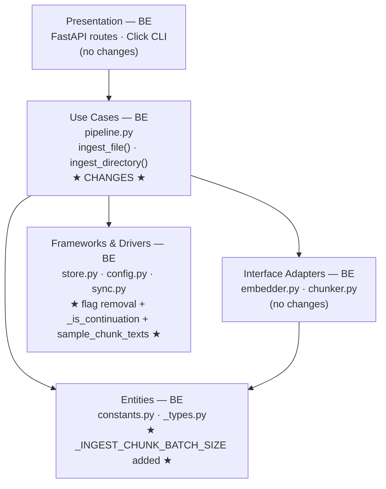
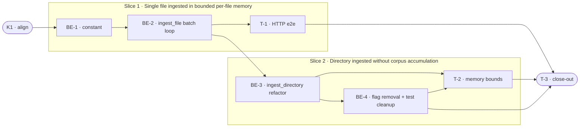

# D4 · Streaming / Incremental Chunking — Team Plan

**How to read this file**
- **Architecture approach:** Clean Architecture (default). **Layers:** Entities · Use Cases · Interface Adapters · Frameworks & Drivers. This project is a pure Python server — Presentation (FastAPI routes, Click CLI) is Backend-owned; **Frontend = N/A**. Each task's first sub-bullet names the layer it touches.
- The **Frontend, Backend, and Tester** sections are the **depth view** — each role's work, grouped by layer.
- The **Task Breakdown** is the **order view** — every task is a single-role checkbox in execution order, opening with a dependency graph.
- **Phases are vertical slices** — each delivers a working end-to-end operator behaviour. Sliced with the **`vertical-slicer` skill**. No separate "integrate" phase.
- **Contracts** are authored as linked `.tsp` files (TypeSpec v1.13.0 is available and was used).
- IDs (`S#`, `C#`, `BE-#`, `T-#`, `K#`, `Q#`) are the traceability thread. Do not renumber.

---

## Background

Ingesting large files in `archon_search/pipeline.py` currently materialises all parsed chunks, all embedding vectors, and all LanceDB rows as in-memory lists before the first write to disk. `ingest_directory()` additionally accumulates every chunk's vector and text from every file in `all_vectors`/`all_chunks` lists that grow O(corpus size). On memory-constrained hosts (Docker containers, small VMs) this produces silent OOM kills.

---

## Goal

Single-file ingest and directory ingest complete successfully on any host regardless of document or corpus size, by flushing embed + write batches of at most 512 chunks before accumulating the next.

---

## Scope

### In Scope
- Add `_INGEST_CHUNK_BATCH_SIZE = 512` (with `ponytail:` comments) to `archon_search/constants.py`
- Refactor `pipeline.py::ingest_file()` (lines 281–444): hoist `ensure_collection` (line 409) and `delete_document` (line 411) **above** the batch loop — they must each run exactly once per file; wrap only embed + `store.ingest_chunks()` (lines 400–418) in the batch loop; aggregate `needs_recompute` (OR) and `chunks_created` (sum) across batches; call `recompute_collection_meta` and FTS rebuild **after** the loop completes; `_chunk_collector` is fully populated before the batch loop (line-398 unchanged — all chunk texts extracted from `records` before embed); `_vector_collector` is extended per-batch inside the loop after each embed call (vectors do not exist until embedded, so they cannot be pre-batch); **doc_count fix:** add `_is_continuation: bool = False` parameter to `store.ingest_chunks()` and pass `True` for every batch except the first — `_do_update_meta_on_add` skips the `doc_count` increment when `_is_continuation=True` so a single file ingested in N batches still increments `doc_count` by 1; implementation: when _is_continuation=True, _do_update_meta_on_add receives distinct_doc_count=0 (not the computed value from the chunk set)
- Refactor `pipeline.py::ingest_directory()` (lines 446–607): remove `all_vectors` and `all_chunks` list accumulators (lines 491–492); remove `_vector_collector`/`_chunk_collector` pass-through to `ingest_file()` (lines 499–500); replace accumulator-based centroid block (lines 532–534) with the already-running B5 incremental path; replace `generate_description(all_chunks, ...)` with a targeted store query (Q1 resolution — see implementation note below); _should_regenerate(batch_doc_count, batch_chunk_count, described_at) receives its counts from the running collection-meta query (call store.get_collection_meta() after each file ingest to get the updated doc_count and chunk_count for the should-regenerate check); remove `centroid_incremental_enabled=False` branch (lines 562–601) and `_centroid_incremental_enabled` property (lines 270–275)
- **Q1 implementation:** `generate_description()` requires only `list[str]` of sample chunk texts (description_generator.py:61). Do NOT use `store.list_chunks_raw()` (which calls `table.query().to_list()` and materialises the entire collection in memory — the same O(corpus) problem D4 exists to fix). Instead add `store.sample_chunk_texts(collection, namespace, n=100) -> list[str]` that executes `table.query().select(["text"]).limit(n).to_list()` — O(1) memory regardless of corpus size. Use `n=100` (not 20) so `generate_description`'s existing `random.sample(chunks, min(20, len(chunks)))` can pick from a wider and more representative pool; for heterogeneous corpora, sampling only the first 20 by insertion order would bias description quality toward the first file ingested. **Known limitation:** `LIMIT n` returns rows in scan order (insertion order); descriptions may still skew toward early-ingested content in very large heterogeneous collections. This is accepted for v1 — add `ORDER BY RANDOM()` support if description quality proves inadequate. Pass the output to `generate_description()`.
- Remove `centroid_incremental_enabled` from the **config struct** (`config.py` line 98) and from the conditional branches in `store.py` (lines 1491, 1928) and `sync.py` (line 728); make the incremental path unconditional. **Keep** the TOML loader recognition (config.py lines 284–286) but change it to log `logger.warning("centroid_incremental_enabled is deprecated and ignored; B5 incremental path is always used")` and not assign the value — this is required so that S10's WARNING fires when the key is present in operator TOML configs.
- Add BREAKING.md entry for `centroid_incremental_enabled` removal
- Fix all affected tests (~61 references across 7 files: `tests/pipeline/test_pipeline_ingest.py`, `tests/test_store.py`, `tests/test_sync.py`, `tests/test_config.py`, `tests/test_config_defaults.py`, `tests/test_sync_fts.py`, `tests/test_store_delete_fts.py`)
- `store.ingest_chunks()` is stateless for chunk writes (`_do_ingest`) but NOT for collection-metadata updates (`_do_update_meta_on_add` reads and writes `doc_count`, `chunk_count`, `centroid_sum`). The `_is_continuation` parameter added above is the minimal store-API change required to keep `doc_count` correct across batches.

### Out of Scope
- Parse-time streaming (docling, markitdown, trafilatura, Chonkie all materialise full document internally)
- Enricher streaming (`MarkdownEnricher`/`CodeEnricher` require full text for two-pass offset tables — do not touch)
- File-size threshold ("always batch" is uniformly better; no threshold config)
- Parallel file ingestion within `ingest_directory()`
- Parser-level memory reduction (docling's internal PDF memory)
- Configurable batch size (`_INGEST_CHUNK_BATCH_SIZE` is a named constant, not a TOML key)
- `store.ingest_chunks()` major API changes — the one minimal addition (`_is_continuation: bool = False`) is **in scope** to fix the `doc_count` double-counting bug; all callers outside `ingest_file()` pass the default and are unaffected
- LanceDB fragmentation (handled separately via `table.optimize()` if post-D4 benchmarks show need)

---

## Acceptance criteria
- A single file producing 600 chunks results in exactly 2 `ingest_chunks()` calls, each with ≤ 512 chunks
- A directory of N files completes without `all_vectors` or `all_chunks` ever holding more than one file's data simultaneously
- `IngestResult.chunks_created` equals the total chunk count across all batches
- `IngestResult.needs_recompute` is True if any batch call returned `needs_recompute=True`
- FTS rebuild fires exactly once per `ingest_file()` call (after all batches complete) when `rebuild_fts=True`
- Search returns correct results after a batched large-file ingest
- `centroid_incremental_enabled` in TOML produces a WARNING and is ignored; B5 incremental path is always used
- All existing tests pass; coverage ≥ 85%

---

## What does NOT change
- `store.ingest_chunks()` signature gains one optional parameter (`_is_continuation: bool = False`); `store._do_ingest()` is unchanged. Public semantics preserved — all existing callers outside `ingest_file()` pass the default and are unaffected.
- `ingest_file()` and `ingest_directory()` public signatures — internal refactor only
- `_vector_collector` / `_chunk_collector` parameters on `ingest_file()` — preserved for backward compatibility; `_chunk_collector` is populated from `records` before the batch loop (unchanged from today); `_vector_collector` is extended per-batch inside the loop after each embed call (vectors don't exist until embedded)
- Enrichers (`MarkdownEnricher`, `CodeEnricher`) — two-pass design is correct, untouched
- FTS rebuild semantics — fires once per file (or once per directory), not per batch
- Watcher and sync paths (`watcher.py`, `sync.py`) — benefit from the refactor automatically; no signature changes
- MCP tools, REST routes, CLI commands, OpenAPI schema, Pydantic schemas

---

## Known limitations / accepted trade-offs
- **Partial-write on mid-file batch failure is a NEW failure mode (not "same as today"):** Previously `ingest_file()` called `ingest_chunks()` once — either fully succeeded or fully failed. With batching, if batch N raises, batches 1..N-1 are already persisted and their metadata updates (`doc_count`, `centroid_sum`) already applied; the document is left in a truncated state in the index. `delete_document()` already ran, so the old document is gone. Partial state remains until a subsequent re-ingest. No rollback. A subsequent re-ingest of the same file calls `delete_document()` first and clears the partial write. This is the accepted trade-off; document clearly in error messages and operator docs.
- **`tracemalloc` measures Python allocations only** — it won't capture LanceDB's Rust/Tokio heap. The memory test (T-2) proves the Python accumulator is gone; LanceDB's own memory is bounded by its implementation. Note: the test uses stub embedders that return tiny vectors, so the tracemalloc peak difference between 1-file and 10-file ingests may be small in absolute terms; the 3× ratio guard is a heuristic.
- **Description generation uses a sampled query, not a full-collection read** — `store.sample_chunk_texts(n=100)` issues `SELECT text LIMIT 100` against the collection (O(1) memory). `generate_description`'s existing `random.sample` picks 20 from the 100-chunk pool, giving a wider and less order-biased sample than `LIMIT 20`. `list_chunks_raw()` materialises the full table via `to_list()` and must NOT be used here. Known limitation: `LIMIT 100` returns rows in scan/insertion order; add `ORDER BY RANDOM()` if description quality proves inadequate for heterogeneous corpora.

---

## Approach & architecture

D4 is primarily a Use Cases refactor: `pipeline.py::ingest_file()` adds a batch loop around embed+write, and `pipeline.py::ingest_directory()` drops its O(corpus) accumulators. The Frameworks & Drivers layer (`store.py`) receives three changes: flag removal (lines 1491, 1928), a minimal `_is_continuation: bool = False` parameter on `ingest_chunks()` to fix doc_count double-counting, and a new `sample_chunk_texts()` method for O(1)-memory description generation. `ingest_chunks()` is stateless for chunk writes (`_do_ingest`) but NOT for metadata updates — `_do_update_meta_on_add` mutates `doc_count`, `chunk_count`, and `centroid_sum` on every call. The Shared Kernel (`constants.py`) gains one named constant. The flag removal also touches `config.py` and `sync.py`.

**Layer map and role mapping**

| Layer | Role | Components touched by D4 |
|-------|------|--------------------------|
| Entities | Backend | `archon_search/constants.py` — add `_INGEST_CHUNK_BATCH_SIZE` |
| Use Cases | Backend | `archon_search/pipeline.py` — `ingest_file()` batch loop; `ingest_directory()` accumulator removal; `_centroid_incremental_enabled` property removal |
| Interface Adapters | Backend | `archon_search/embedder.py`, `archon_search/chunker.py` — unchanged |
| Frameworks & Drivers | Backend | `archon_search/store.py` — make `_do_update_meta_on_add` unconditional; `archon_search/config.py` — remove field; `archon_search/sync.py` — remove guard |
| Presentation | Backend | `archon_search/server/`, `archon_search/cli/` — unchanged |

**Frontend:** N/A — no GUI, no web UI, no mobile code in this repo. Confirmed by investigation.

**What changes**
- `constants.py`: add `_INGEST_CHUNK_BATCH_SIZE: Final[int] = 512` with ponytail comments
- `pipeline.py::ingest_file()`: `ensure_collection` + `delete_document` hoisted above the batch loop; batch loop wraps only embed+`ingest_chunks`: `for i, batch in enumerate(batches(records, _INGEST_CHUNK_BATCH_SIZE)): embed(batch) → ingest_chunks(batch, _is_continuation=(i>0))`; `needs_recompute` OR-reduced; `chunks_created` summed; `_vector_collector`/`_chunk_collector` collected from `records` before the batch loop (unchanged from current line 398); `recompute_collection_meta` + FTS after the loop
- `pipeline.py::ingest_directory()`: lines 491–605 simplified — accumulators removed; pre-B5 branch deleted; `_centroid_incremental_enabled` property deleted; description generation calls `store.sample_chunk_texts(collection, namespace, n=100)` (new method, see Q1 implementation note); all `_centroid_incremental_enabled` references in `pipeline.py` removed: lines 270–275 (property), 420, 552, 604, **and 1462** (`recompute_collection_meta` short-circuit — replace with unconditional logic)
- `config.py`: remove `centroid_incremental_enabled` field (line 98); TOML loader (lines 284–286) kept but changed to log a WARNING and ignore the value
- `store.py`: remove `centroid_incremental_enabled` guards (lines 1491, 1928); `_do_update_meta_on_add()` called unconditionally; add `_is_continuation: bool = False` parameter to `ingest_chunks()` — when True, `_do_update_meta_on_add` skips `doc_count` increment; add `sample_chunk_texts(collection, namespace, n=100) -> list[str]` method using `table.query().select(["text"]).limit(n).to_list()`
- `sync.py`: remove guard at line 728
- `BREAKING.md`: add entry for `centroid_incremental_enabled` removal

**Key decisions (from the brief)**
- Always batch, no threshold — uniform code path, simpler
- 512 chunks × ~4 KB ≈ 2 MB per batch — safe on any host
- Remove `centroid_incremental_enabled` flag — pre-B5 path is dead since B5 defaulted to True; add BREAKING.md entry
- FTS rebuild once at the end — expensive; not per batch
- Enrichers stay two-pass — `MarkdownEnricher`/`CodeEnricher` require full text; do not break

---

## Contracts / seams

Authored as TypeSpec — see [`D4-contracts.tsp`](D4-contracts.tsp) (compiled clean with `tsp compile D4-contracts.tsp --no-emit`).

**C1 — BatchEmit guarantee** *(Use Cases ↔ Frameworks & Drivers)*
`ingest_file()` calls `store.ingest_chunks()` once per batch (⌈N/512⌉ total). It aggregates results into one `IngestResult`: `chunks_created` = sum of `chunks_ingested`; `needs_recompute` = OR of `needs_recompute` across all batches. FTS fires once after the final batch. `_vector_collector`/`_chunk_collector` are extended per batch if provided. See `BatchAggregation` in `D4-contracts.tsp`.
- Realised by: BE-2 · Verified by: BE-2 tests, T-1

**C2 — IncrementalCentroid always-on** *(Use Cases ↔ Frameworks & Drivers)*
After D4, `store._do_update_meta_on_add()` is called unconditionally on every `ingest_chunks()` call (the `centroid_incremental_enabled=True` branch becomes the only path). Callers must not pass `centroid_incremental_enabled=False` via config — the field is removed. BREAKING.md documents the removal.
- Realised by: BE-3, BE-4 · Verified by: BE-4 tests, T-2

---

## Scenarios #tester-role

| id | Scenario (Given / When / Then) |
|----|-------------------------------|
| **S1** | **Given** a text file whose content chunks into 600 records · **When** `ingest_file()` is called · **Then** `store.ingest_chunks()` is called exactly 2 times (⌈600/512⌉), each call receives ≤ 512 chunks, `IngestResult.chunks_created == 600`, `status == "ok"` |
| **S2** | **Given** a file chunking into ≤ 512 records · **When** `ingest_file()` is called · **Then** `store.ingest_chunks()` is called exactly 1 time and `IngestResult` matches today's semantics |
| **S3** | **Given** a file that produces 0 chunks after parsing · **When** `ingest_file()` is called · **Then** it returns immediately with `chunks_created=0, status="ok"` and `store.ingest_chunks()` is never called |
| **S4** | **Given** a file where the 2nd of 3 batches returns `needs_recompute=True` · **When** `ingest_file()` completes · **Then** `IngestResult.needs_recompute == True` |
| **S5** | **Given** a file producing N batches · **When** `ingest_file(rebuild_fts=True)` completes · **Then** `store.optimize_fts()` (or fallback `rebuild_fts_index()`) is called exactly once |
| **S6** | **Given** `ingest_file()` is called with a `_vector_collector` and `_chunk_collector` and the file produces 2 batches · **When** ingest completes · **Then** both collectors contain entries from all batches combined |
| **S7** | **Given** `store.ingest_chunks()` raises an exception on batch 2 of 4 · **When** `ingest_file()` propagates the error · **Then** `IngestResult.status == "error"`, no further batches are attempted, batch 1's chunks persist in the store (partial document — new failure mode introduced by batching), and a subsequent re-ingest of the same file succeeds and produces correct final state (`doc_count == 1`, `chunk_count` equals the re-ingested file's total chunk count, centroid reflects only the re-ingested chunks) |
| **S8** | **Given** a directory of N files each producing M chunks · **When** `ingest_directory()` runs · **Then** no in-memory list ever holds more than 512 chunks (one batch) simultaneously — the `all_vectors` and `all_chunks` accumulators are gone |
| **S9** | **Given** `_should_regenerate()` returns True after file N in a directory ingest · **When** description generation runs · **Then** chunk texts are read via `store.sample_chunk_texts(n=100)` (O(1) memory), not from an in-memory accumulator; `generate_description` receives the sampled list |
| **S10** | **Given** an operator sets `centroid_incremental_enabled = false` in `archon-search.toml` · **When** the server starts · **Then** a WARNING is logged and the B5 incremental path is used regardless (the field is deprecated/removed) |
| **S11** | **Given** a directory of 100 files ingested via `ingest_directory()` · **When** measured with `tracemalloc` · **Then** peak Python-allocated memory grows O(batch_size), not O(corpus_size) |
| **S12** | **Given** a large file is ingested via HTTP POST /ingest · **When** the job completes · **Then** a subsequent POST /search returns correct results for queries matching content from any batch |

---

## Frontend — Presentation #frontend-role

N/A — no frontend work for this feature. This project has no web UI, mobile code, or standalone client. Presentation (FastAPI routes, Click CLI) is server-side Python owned by Backend. D4 makes no changes to any route, schema, or CLI command.

---

## Backend — Entities · Use Cases · Frameworks & Drivers #backend-role

**Scope:** Pure internal refactor of `pipeline.py` + constant addition + flag removal across infra files. No public API changes. Writes unit and integration tests for each task (test-first).

**Owns layers:** Entities, Use Cases, Interface Adapters, Frameworks & Drivers.

**Tasks by layer** *(checkable in the Task Breakdown)*
- Entities: BE-1 — add `_INGEST_CHUNK_BATCH_SIZE` constant
- Use Cases: BE-2 — batch-emit loop in `ingest_file()`; BE-3 — accumulator removal + flag removal from pipeline.py
- Frameworks & Drivers: BE-4 — flag removal from config.py, store.py, sync.py + test cleanup + BREAKING.md

**Done when**
- `ingest_file()` calls `store.ingest_chunks()` ⌈chunks/512⌉ times — S1, S2
- `IngestResult.needs_recompute` is OR-reduced across all batches — S4
- FTS fires exactly once per `ingest_file()` call — S5
- `_vector_collector`/`_chunk_collector` populated from all batches — S6
- Mid-batch failure returns `status="error"`, no further batches — S7
- `all_vectors`/`all_chunks` accumulators removed from `ingest_directory()` — S8
- Description generation reads from `store.sample_chunk_texts(n=100)` — S9
- `centroid_incremental_enabled` removed from all files, WARNING logged if set — S10
- All tests pass, coverage ≥ 85%

---

## Tester #tester-role

**Scope:** the tester owns **e2e (HTTP-level integration) and manual** tests. Unit and integration tests at the pipeline/store level are dev-written. Tester also owns the mandatory close-out.

**Tasks** *(checkable in the Task Breakdown)*
- T-1 — E2e: HTTP ingest + search after batched large-file ingest (Slice 1)
- T-2 — Integration: memory-bounds assertion for directory ingest (Slice 2)
- T-3 — Close-out

**Allocation** — cheapest level that proves each scenario

| Scenario | Level | Owner |
|----------|-------|-------|
| S1 — 600 chunks, 2 batch calls, chunks_created=600 | integration (pipeline) | BE-2 |
| S2 — ≤512 chunks, 1 batch call | unit | BE-2 |
| S3 — empty file, no ingest_chunks call | unit | BE-2 |
| S4 — needs_recompute OR across batches | unit | BE-2 |
| S5 — FTS fires once per file | integration (pipeline) | BE-2 |
| S6 — _vector_collector/_chunk_collector across batches | unit | BE-2 |
| S7 — partial batch failure semantics | unit | BE-2 |
| S8 — no accumulators in ingest_directory | integration (pipeline) | BE-3 |
| S9 — description reads from store | unit | BE-3 |
| S10 — deprecated flag WARNING | unit | BE-4 |
| S11 — peak memory O(batch_size) | integration (tracemalloc) | T-2 |
| S12 — HTTP ingest + search correctness | e2e (HTTP) | T-1 |

---

## Documentation update

Handled as part of **T-3 close-out**:
- `Documentation/Backlog/D4-streaming-incremental-chunking-brief.md` — no changes needed (source brief)
- `Documentation/Backlog/D4-streaming-incremental-chunking-team-plan.md` — this file
- `Documentation/Backlog/D4-contracts.tsp` — this file (contract companion)
- `BREAKING.md` — add entry: `centroid_incremental_enabled` config field removed; B5 incremental centroid is now the only path (update as part of BE-4)
- `CLAUDE.md` — no changes needed (no new public behaviours to document)
- `Documentation/Architecture/130_data_architecture_and_persistence.md` — remove any reference to `centroid_incremental_enabled` flag if present
- `Documentation/Architecture/110_component_catalog_and_layer_breakdown.md` — update `pipeline.py` description if it references the accumulator pattern
- `Documentation/Architecture/210_performance_and_scalability.md` — remove reference to `centroid_incremental_enabled` flag (grep confirms it is present)
- `archon-search.toml.example` — remove `centroid_incremental_enabled` from `[database]` section if present
- `learnings.md` — update after implementation with any discovered edge cases

---

## Open questions

| id | Area | Question |
|----|------|----------|
| **Q1** | Description generation | ~~Proposed: `store.list_chunks_raw()`.~~ **Resolved:** use `store.sample_chunk_texts(collection, namespace, n=100)` (new method, `SELECT text LIMIT 100`) — O(1) memory. `generate_description`'s existing `random.sample` picks 20 from the 100-chunk pool. `list_chunks_raw()` must NOT be used here (materialises full table). See In Scope for implementation details. |

**Resolved in this revision:**
- Batch size: ship 512 (brief resolved — `_INGEST_CHUNK_BATCH_SIZE = 512`)
- File-size threshold: none (brief resolved — always batch)
- LanceDB fragmentation: out of scope for D4 (brief resolved)
- `centroid_incremental_enabled` removal: in scope for D4 (brief resolved — add BREAKING.md entry)
- `_vector_collector`/`_chunk_collector`: no test changes needed for callers; signature preserved on `ingest_file()` (brief resolved — only `ingest_directory()` stops passing them)

---

## Task Breakdown

Single-role tasks in execution order, grouped into vertical slices.

### Dependency graph

---

### Phase 0 · Kickoff

- [x] **K1** — Agree contracts C1/C2, scenarios S1–S12, and Q1 resolution with the team #team
    - — · 1.0h
    - completes C1, C2
    - Tests

---

### Slice 1 · Single file ingested in bounded per-file memory *(walking skeleton — thinnest end-to-end batch path; carries the constant that all subsequent work depends on)*

- [x] **BE-1** — Add `_INGEST_CHUNK_BATCH_SIZE = 512` to `constants.py` with ponytail comments #backend-role
    - Entities · 0.5h
    - needs K1
    - Tests
        - #unit_test — `test_ingest_chunk_batch_size_constant` — constant exists, equals 512, is `Final[int]`

- [x] **BE-2** — Refactor `ingest_file()` to batch-emit chunks in `pipeline.py`; add `_is_continuation` param + `sample_chunk_texts()` to `store.py` #backend-role
    - Use Cases + Frameworks & Drivers · 5.0h
    - needs BE-1 · completes S1, S2, S3, S4, S5, S6, S7, C1
    - Tests
        - #unit_test — `test_ingest_file_splits_into_two_batches` — 600-chunk file → `ingest_chunks` called 2 times (with `_is_continuation=False` then `True`), `chunks_created == 600`
        - #unit_test — `test_ingest_file_single_batch_unchanged` — ≤512 chunks → 1 `ingest_chunks` call with `_is_continuation=False`
        - #unit_test — `test_ingest_file_empty_returns_immediately` — 0 chunks → no `ingest_chunks` call
        - #unit_test — `test_needs_recompute_or_across_batches` — batch 2 of 3 returns `needs_recompute=True` → `IngestResult.needs_recompute == True`
        - #unit_test — `test_fts_fires_once_after_all_batches` — N batches → `optimize_fts` called exactly 1 time (not per batch)
        - #unit_test — `test_ensure_collection_and_delete_called_once` — 2-batch ingest → `ensure_collection` called exactly 1 time, `delete_document` called exactly 1 time, and both precede any `ingest_chunks` call (assert call ordering: ensure_collection → delete_document → ingest_chunks[0] → ingest_chunks[1])
        - #unit_test — `test_vector_collector_populated_across_batches` — 2-batch ingest, `_vector_collector` contains all vectors from all batches combined (vectors are appended per-batch inside the loop, after each embed call — they do not exist before embedding)
        - #unit_test — `test_chunk_collector_populated_across_batches` — 2-batch ingest, `_chunk_collector` contains all chunk texts (collected before the batch loop)
        - #unit_test — `test_partial_batch_failure_returns_error` — `ingest_chunks` raises on batch 2 → `status="error"`, no batch 3 attempt
        - #unit_test — `test_is_continuation_suppresses_doc_count_increment` — call `store.ingest_chunks()` twice with the same `doc_id` and `_is_continuation=True` on the second call; assert `doc_count == 1` not 2; this is the canonical verification that `distinct_doc_count=0` is enforced for continuation batches
        - #integration_test — `test_ingest_file_batched_centroid_correctness` — use `make_real_pipeline`; ingest 600-chunk synthetic file into empty collection; assert centroid = mean of all 600 stub vectors; assert `collection_info.doc_count == 1` (not 2)
        - #integration_test — `test_reingest_centroid_correctness` — use `make_real_pipeline`; ingest file A (600 chunks); re-ingest same doc_id with 300 different chunks; assert centroid = mean of the 300 NEW vectors only, `doc_count == 1`
        - #integration_test — `test_partial_batch_failure_leaves_store_partially_written` — use `make_real_pipeline`; mock `ingest_chunks` to raise on batch 2; assert batch 1's chunks exist in the store (`count_chunks > 0`); then re-ingest the same file successfully; assert final state is clean
        - #integration_test — `test_sample_chunk_texts_returns_limit_n` — use `make_real_pipeline`; ingest a 200-chunk file; call `store.sample_chunk_texts(collection, namespace, n=50)` directly; assert `len(result) == 50` and all items are strings; call with `n=200`; assert `len(result) == 200`; call on empty collection; assert `result == []`

- [x] **T-1** — E2e: ingest a 600-chunk file via HTTP and verify search returns correct results #tester-role
    - — · 2.0h
    - needs BE-2 · completes S12
    - Tests
        - #e2e_test — `test_batched_ingest_search_e2e` — POST /ingest a file whose first 512 chunks contain the token "alpha-batch-one" and remaining chunks contain "beta-batch-two"; poll until DONE; POST /search for "alpha-batch-one" and assert a hit; POST /search for "beta-batch-two" and assert a hit; this verifies both batches are searchable (use distinct tokens to make results deterministic regardless of K)

---

### Slice 2 · Directory ingested without corpus-wide accumulation

- [x] **BE-3** — Refactor `ingest_directory()`: remove accumulators + flag from pipeline.py #backend-role
    - Use Cases · 5.0h
    - needs BE-2 · completes S8, S9, C2 (partial)
    - Tests
        - #unit_test — `test_ingest_directory_no_all_vectors_accumulator` — after the refactor, assert `all_vectors` and `all_chunks` symbols do not exist in `ingest_directory`'s local scope (use `inspect.getsource` + assertion that neither name appears in the function body); this is a deletion-regression guard
        - #unit_test — `test_description_reads_from_store_not_accumulator` — mock `store.sample_chunk_texts`; assert it is called with `n=100` when `_should_regenerate` returns True; assert `generate_description` receives its return value; assert `store.list_chunks_raw` is NOT called
        - #unit_test — `test_centroid_incremental_path_always_used` — `ingest_directory` with 3 files; assert `_do_update_meta_on_add` called per batch, not a post-loop full-scan
        - #integration_test — `test_directory_centroid_correct_after_refactor` — use `make_real_pipeline`; ingest 5-file synthetic corpus; assert centroid equals mean of all chunk stub vectors (regression guard for accumulator removal)

- [x] **BE-4** — Remove `centroid_incremental_enabled` from config/store/sync; fix all tests; add BREAKING.md #backend-role
    - Frameworks & Drivers · 4.0h
    - needs BE-3 · completes S10, C2
    - Tests
        - #unit_test — `test_deprecated_flag_emits_warning` — construct `SearchConfig` with `centroid_incremental_enabled=False`; assert `logger.warning` is called on server start or config load
        - #unit_test — `test_store_ingest_chunks_always_calls_incremental_update` — call `store.ingest_chunks()`; assert `_do_update_meta_on_add` is always invoked (no conditional); assert `_is_continuation=True` suppresses doc_count increment (call twice with same doc_id, doc_count == 1 not 2)
        - #unit_test — `test_config_no_longer_accepts_centroid_flag` — loading TOML with `centroid_incremental_enabled = false` logs WARNING, field is ignored
        - #integration_test — `test_sync_centroid_update_unconditional` — use `make_real_pipeline`; trigger sync; assert centroid updates regardless of any legacy config

- [ ] **T-2** — Memory bounds: tracemalloc assertion for directory ingest #tester-role
    - — · 3.0h
    - needs BE-3, BE-4 · completes S8, S11
    - Tests
        - #e2e_test — `test_directory_ingest_peak_memory_bounded` — use `make_real_pipeline`; wrap `ingest_directory()` with `tracemalloc`; ingest 10 files × 100 chunks; assert peak memory doesn't scale linearly with file count (compare peak at 1 file vs 10 files; ratio must be < 3×)

---

### Phase N · Close-out

- [ ] **T-3** — Project close-out & acceptance fact-check #tester-role
    - — · 4.0h
    - needs T-1, T-2, BE-4
    - Tests
    - Duties
        - Update all documentation per the "Documentation update" section — `BREAKING.md`, architecture docs, `archon-search.toml.example`, `learnings.md`
        - Fix all build / compiler warnings, if any
        - Run the full test suite (`uv run pytest`); fix every failing test, including any unrelated to D4
        - Validate every Acceptance criterion one-by-one with a fact check — grep for `_INGEST_CHUNK_BATCH_SIZE` in constants.py, grep for the batch loop in pipeline.py, assert no `all_vectors`/`all_chunks` in ingest_directory, assert `centroid_incremental_enabled` absent from config.py/store.py/sync.py, verify BREAKING.md entry, run the test suite and check coverage ≥ 85%

---

**Critical path:** K1 → BE-1 → BE-2 → BE-3 → BE-4 → T-2 → T-3
