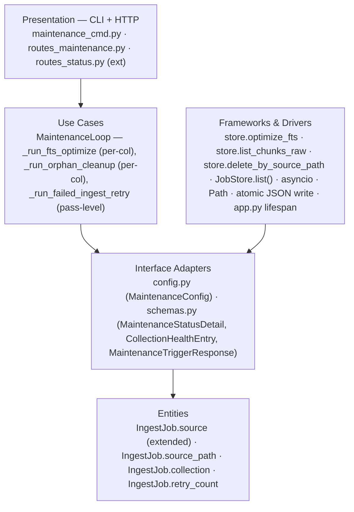
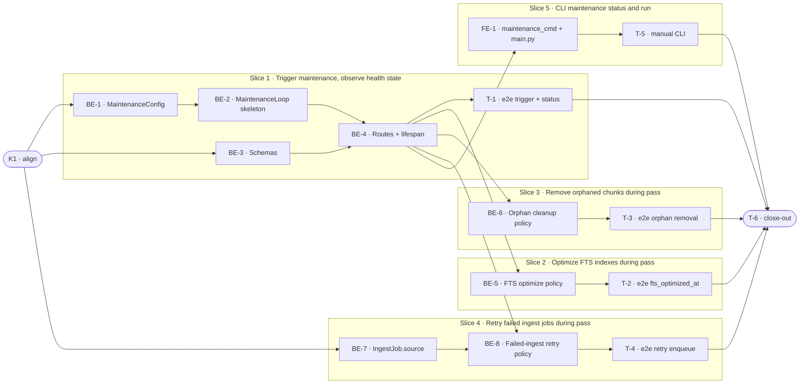

# D5 · Maintenance Jobs and Policies — Team Plan

**How to read this file**
- **Architecture approach:** Clean Architecture (default). **Layers:** Presentation · Use Cases · Interface Adapters · Entities · Frameworks & Drivers. Each task's first sub-bullet names the layer it touches. This is a server-only project — the CLI is the Presentation layer; there is no browser frontend.
- The **Frontend (CLI), Backend, and Tester** sections are the **depth view** — each role's work, grouped by layer.
- The **Task Breakdown** is the **order view** — every task is a single-role checkbox in execution order, opening with a dependency graph.
- **Phases are vertical slices** (sliced with the **`vertical-slicer` skill**): each delivers a working end-to-end increment. Walking-skeleton-first; no separate "integrate" phase.
- Each task carries the **role tag at the end of its title line**, then sub-bullets: **layer · estimate** (decimal hours), **needs · completes**, and a **Tests** block. **needs** = predecessor tasks; **completes** = scenario `S#` or contract `C#`.
- **Unit and integration tests belong to the implementing dev** (test-first); **e2e and manual tests are the tester's tasks**.
- **Contracts** are authored as linked `.tsp` files (TypeSpec 1.13.0 — compiled clean with `tsp compile <file> --no-emit`); the file-format seam (C3) is described logically inline.
- IDs (`S#`, `C#`, `BE-#`/`FE-#`/`T-#`/`K#`, `Q#`) are the traceability thread.
- **Rule:** edit your own tasks freely; change a contract only by team agreement.

---

## Background

archon-search collections degrade silently over time: FTS indexes grow stale, chunks from deleted source files accumulate, and failed ingest jobs never self-heal — with no automated mechanism to detect or fix any of this. Operators currently have no per-collection health visibility beyond raw chunk counts.

---

## Goal

A configurable in-process `MaintenanceLoop` runs on a scheduled interval, detects and remediates known degradation patterns (stale FTS, orphaned chunks, failed-ingest retry), and surfaces a per-collection health summary via `GET /status` — so operators can run archon-search for months without manual intervention.

---

## Scope

### In Scope
- `[maintenance]` TOML config section: `interval_hours` (0 = disabled), `fts_optimize`, `orphan_cleanup`, `failed_ingest_retry`, `retry_max_attempts` (default 3), `retry_max_age_hours` (default 72), `exclude` (list of `{namespace}/{collection}` or bare `{collection}` patterns — same syntax as backup exclude).
- `MaintenanceConfig` dataclass in `config.py` following the `BackupConfig` pattern.
- In-process `MaintenanceLoop` in `archon_search/jobs/maintenance_loop.py` — **single trigger loop** (no completion loop; all operations are synchronous in-loop).
- `MaintenanceLoop` instantiated in FastAPI `lifespan`, stored on `app.state.maintenance_loop` (same pattern as `BackupLoop`).
- FTS optimize: per-collection `store.optimize_fts(collection)` under the per-collection lock; skips on `FTSIndexNotFoundError` (WARNING), skips on locked collection (DEBUG).
- Orphan chunk cleanup: `store.list_chunks_raw(collection, namespace)` → group by `source_path` (collecting ALL distinct `doc_id`s per source path) → `Path.exists()` per unique path (skip URLs) → `store.delete_by_source_path(source_path, skip_fts_optimize=True)` per orphaned path → post-cleanup `optimize_fts`; elapsed-time WARNING if > 60 s.
- Failed-ingest retry: `_run_failed_ingest_retry()` is a **pass-level operation** (called once per pass, after all per-collection policies complete, NOT once per collection); it processes ALL namespaces and collections. In-Python filter of `JobStore.list()` for FAILED IngestJobs within age and attempt limits; re-enqueue via `JobStore.create(path=job.source_path, collection=job.collection, namespace=job.namespace, source="maintenance")`; retry count tracked in `.maintenance-state.json` keyed by `{namespace}/{collection}/{absolute_source_file_path}` to correctly scope retry limits when the same file is ingested in multiple collections; auto-reset on job `DONE`.
- `.maintenance-state.json` at `get_data_dir() / ".maintenance-state.json"` — written atomically after each pass.
- `POST /maintenance/trigger` in new `routes_maintenance.py` — 202 Accepted, async pass.
- `GET /status` extended with `maintenance: MaintenanceStatusDetail | None`.
- `archon-search maintenance status` and `archon-search maintenance run [--wait]` CLI subcommands in new `maintenance_cmd.py`.
- `archon-search.toml.example` updated with `[maintenance]` section.
- CLAUDE.md, API reference, and architecture docs updated.
- `BREAKING.md` entries: (1) `GET /status` additive `maintenance` field; (2) All IngestJob-family job responses gain `source: 'user'` by default (previously absent); (3) `IngestJob` gains `source_path`, `collection`, `retry_count` fields.

### Out of Scope
- Integrity checks (hash/doc-count verification) — deferred to D5.1.
- LanceDB vector-table compaction beyond FTS optimize.
- Stale-collection detection as a distinct `stale` boolean — raw counters (`mutations_since_recompute`, `meta_chunk_count`) are surfaced instead; D5.1 derives the boolean and may add `actual_chunk_count` via a real `count_rows()` call for drift detection.
- MCP tools for maintenance — REST and CLI coverage is sufficient for v1.
- Per-collection maintenance schedule overrides.
- Retry for ReindexJob, ExportJob, ImportJob — only IngestJob in v1.
- Notification hooks on maintenance actions.

---

## Acceptance criteria
- [ ] `MaintenanceLoop` starts when `interval_hours > 0`, stays dormant (but reachable) when `interval_hours = 0`.
- [ ] A maintenance pass runs all three enabled policies (FTS optimize, orphan cleanup, failed-ingest retry) for each non-excluded collection; each policy acquires the per-collection lock independently (not shared across policies, to avoid reentrant-lock deadlocks).
- [ ] `FTSIndexNotFoundError` → WARNING logged, pass continues; locked collection → DEBUG logged, collection skipped this pass.
- [ ] Orphaned chunks (file-path `source_path` with `Path.exists() == False`) are removed via `delete_by_source_path` (all doc_ids for that path); URL chunks are skipped; elapsed > 60 s emits WARNING.
- [ ] Failed IngestJobs within `retry_max_age_hours` and under `retry_max_attempts` are re-enqueued via `JobStore.create(source="maintenance")`.
- [ ] `.maintenance-state.json` written atomically after each pass with `last_run_at`, `next_run_at`, per-collection `collection_health`, and `retry_counts`.
- [ ] `POST /maintenance/trigger` returns 202 within 200 ms; the pass runs asynchronously.
- [ ] `GET /status` returns `maintenance.enabled`, `maintenance.last_run_at`, `maintenance.next_run_at`, `maintenance.collection_health` (namespace-scoped).
- [ ] `archon-search maintenance status` prints health table from state file (offline-capable) + live data when server is reachable.
- [ ] `archon-search maintenance run` triggers immediately; `--wait` polls until `last_run_at` changes.
- [ ] Test suite passes at ≥ 85% coverage; no compiler warnings.

---

## What does NOT change
- `BackupLoop` — not modified; `MaintenanceLoop` is a separate, independent loop.
- Existing `GET /status` fields — change is purely additive.
- `JobStore` — no new query methods; retry filtering is done in Python on `JobStore.list()`. However `JobStore.create()` gains optional parameters: `source: str = 'user'`, `path: str = ''`, `collection: str = ''` — used by maintenance retry to create `IngestJob` objects with correct provenance. These are the ONLY additions to `JobStore.create()`; no other `JobStore` public methods change.
- `store.optimize_fts`, `store.list_chunks_raw`, `store.delete_by_source_path` signatures — used as-is.
- `POST /jobs/{job_id}/resume` endpoint — maintenance retry uses fresh IngestJobs, not resume.
- Watcher/sync — MaintenanceLoop scans all collections regardless of watcher presence (uses `_collection_locks` to avoid conflict).
- `store.py` public method signatures are unchanged EXCEPT: `_lock_for` is renamed to `lock_for` (by BE-5) — this is an internal rename with no external API impact.

---

## Known limitations / accepted trade-offs
- `list_chunks_raw` does a full table scan — O(N) per collection. Operators with very large collections are advised to increase `interval_hours`.
- Orphan cleanup uses `delete_by_source_path` which removes all chunks (all doc_ids) for a path in one call — multiple ingests of the same file are handled automatically.
- Single trigger loop: a long pass delays the next scheduled run rather than overlapping it — acceptable for a background maintenance workload.
- Retry-count reset and key pruning is checked at the start of each pass (not event-driven). `retry_counts` keys are keyed by `{namespace}/{collection}/{absolute_source_file_path}`. Keys for files no longer tracked in JobStore and with count=0 are removed. Keys for files that failed but have aged out (beyond `retry_max_age_hours`) with count=0 are also pruned.
- `centroid_recompute_threshold` is read from `config` at status-build time, not stored in the state file — it reflects current config, not the config at pass time.
- `archon-search maintenance run --wait` S27 has no automated e2e coverage (requires blocking against a live server in real time). The unit tests cover all branching; manual test T-5 covers the live scenario.
- A second `POST /maintenance/trigger` while a pass is running returns 202 and is silently dropped (no second pass queued) — operators can see this from `GET /status` if `last_run_at` does not advance after the expected interval.
- FTS optimize and orphan cleanup use separate lock acquisitions (not one per collection). A collection could change between the two acquisitions — this is acceptable for a background maintenance workload.
- When `interval_hours=0`, the loop task stays alive indefinitely awaiting manual triggers. It is cancelled on server shutdown via the FastAPI lifespan handler.
- A `POST /maintenance/trigger` that arrives between pass completion and `_trigger_event.clear()` is silently dropped. The next interval or the next manual trigger will run the pass. This is a narrow window and accepted for a background maintenance workload.
- Failed `IngestJob`s created before D5 have `source_path=''` (the empty-string default). The maintenance retry loop skips these jobs since the source path is unknown. Operators must manually re-trigger ingest for pre-D5 failed jobs.

---

## Approach & architecture

`MaintenanceLoop` is a direct simplification of `BackupLoop`: one trigger loop (`_trigger_loop`), no completion loop, all operations synchronous in-loop. The pattern mirrors `BackupLoop` throughout — same constructor shape, same state-file mechanics, same lifespan wiring. Three new files are added: `jobs/maintenance_loop.py`, `server/routes_maintenance.py`, `cli/maintenance_cmd.py`.

**Trigger signaling**: `POST /maintenance/trigger` communicates with the loop via an `asyncio.Event` (`_trigger_event`) set on `MaintenanceLoop`. The trigger loop uses `asyncio.wait_for(_trigger_event.wait(), timeout=interval_seconds if interval_seconds > 0 else None)` instead of `asyncio.sleep(interval_seconds)` — `timeout=None` means wait indefinitely (for `interval_hours=0`); `timeout=0` would be an immediate timeout which is NOT what we want. The event fires an immediate pass without waiting for the interval. After the pass completes, the event is cleared. If the event is already set (pass in progress), a second trigger is a no-op. When `interval_hours=0`, the loop still monitors `_trigger_event` without timing out.

**Event-clear ordering**: `_trigger_event.clear()` is called AFTER `_save_state()` completes. A trigger that arrives between pass completion and `_trigger_event.clear()` is lost (the event is set then immediately cleared). This is an accepted trade-off — the next scheduled interval (or next manual trigger) will catch up. Documented in Known Limitations.



**Collection discovery in `_run_one_pass`**: the loop calls `store.list_collections()` (no arguments) to get all `CollectionInfo` objects, each with `name`, `namespace`, and `chunk_count` (a live `count_rows()` value). This returns all `(namespace, collection)` pairs in one call. Collections are processed as `{namespace}/{collection}` pairs. The exclude filter applies to this pair before the per-policy methods are called. Note: `CollectionInfo.chunk_count` is a **live** `count_rows()`, not the metadata-row value; `meta_chunk_count` comes from `get_collection_meta().chunk_count` (the O(1) metadata row), which is already fetched for `mutations_since_recompute`.

**Error boundary**: `_run_one_pass` wraps each per-collection block in `try/except Exception as e` → logs ERROR with collection name and exception, writes `last_error` to that collection's health state, continues to next collection. Within a collection, each per-collection policy (`_run_fts_optimize`, `_run_orphan_cleanup`) is similarly wrapped — a failure in one policy does not abort the other. After all per-collection work completes, `_run_failed_ingest_retry()` is called once at the pass level (not per-collection); it is also wrapped in `try/except Exception`. The state file is written after the full pass completes, not after each collection.

**Layer map (and role mapping)**

| Layer | Role | Components |
|-------|------|-----------|
| Presentation | **Frontend (CLI)** | `archon_search/cli/maintenance_cmd.py` (new) · `archon_search/cli/main.py` (wiring) |
| Presentation | Backend (HTTP) | `archon_search/server/routes_maintenance.py` (new) · `archon_search/server/routes_status.py` (ext) |
| Use Cases | Backend | `archon_search/jobs/maintenance_loop.py` (new) |
| Interface Adapters | Backend | `archon_search/config.py` (MaintenanceConfig) · `archon_search/server/schemas.py` (new models) |
| Entities | Backend | `archon_search/jobs/model.py` (IngestJob.source, source_path, collection, retry_count) |
| Frameworks & Drivers | Backend | `archon_search/store.py` (used as-is) · `archon_search/jobs/store.py` (used as-is) · `archon_search/server/app.py` (lifespan wiring) |

**What changes**
- `config.py`: `MaintenanceConfig` dataclass added; `SearchConfig` gains `maintenance: MaintenanceConfig`; `_apply_toml()` gains `[maintenance]` section handling; `_post_process_maintenance()` added for any path normalization.
- `jobs/model.py`: `IngestJob` base class gains `source: Literal["user", "backup", "maintenance"] = "user"`, `source_path: str = ""`, `collection: str = ""`, `retry_count: int = 0`; subclass `Literal` types updated to include `"maintenance"`. `jobs/store.py`: `JobStore.create()` gains optional `source: str = 'user'` parameter.
- `schemas.py`: `MaintenanceStatusDetail`, `CollectionHealthEntry`, `MaintenanceTriggerResponse` added; `StatusResponse.maintenance: MaintenanceStatusDetail | None = None` added.
- `server/app.py`: lifespan handler gains 5-line `MaintenanceLoop` startup (mirrors `BackupLoop` block).
- `routes_status.py`: `_build_maintenance_status()` added; called in the status handler.
- `archon-search.toml.example`: `[maintenance]` section added.
- `BREAKING.md`: additive `GET /status` change noted; `IngestJob.source`, `source_path`, `collection`, `retry_count` fields noted; `source=null→source="user"` serialization change for all IngestJob subclasses noted.
- `archon_search/cli/main.py` — register `maintenance_cmd.maintenance` Click group as a subcommand; add `'maintenance'` to the subcommand assertion in `tests/cli/test_main.py`.
- `archon_search/server/routes_status.py` — add `_build_maintenance_status()` helper; call it in the `GET /status` handler.
- `Documentation/Architecture/100_system_architecture_overview.md`, `110_component_catalog_and_layer_breakdown.md`, `120_services_and_integration_architecture.md`, `130_data_architecture_and_persistence.md`, `160_operational_readiness_monitoring_and_reliability.md` — update per the Documentation update checklist.
- `CLAUDE.md` — add `MaintenanceLoop`, `MaintenanceConfig`, `routes_maintenance.py`, `maintenance_cmd.py` to architecture and CLI docs.
- OpenAPI snapshot (`openapi.json` or equivalent) — regenerate with `uv run --python 3.12` after BE-4 adds the new route.
- `archon_search/store.py` — rename `_lock_for` to `lock_for` (all ~12 internal call sites updated); this is the only change to store.py.
- `tests/` — new test files for each task's specified tests (not listed individually here).

**Key decisions (from the brief)**
- Single trigger loop — no completion loop; maintenance is entirely synchronous in-loop.
- **Per-policy lock acquisition, not shared across policies**: FTS optimize acquires the collection lock via `asyncio.wait_for(store.lock_for(collection).acquire(), timeout=INGEST_LOCK_TIMEOUT_S)`, catches `asyncio.TimeoutError` → DEBUG + skip. Orphan cleanup does NOT pre-acquire the lock — instead it calls `store.delete_by_source_path(source_path, skip_fts_optimize=True)` per orphaned path (each call acquires/releases the lock internally), then calls `optimize_fts()` under a separate lock acquisition after all deletions. Rationale: `asyncio.Lock` is not reentrant; holding the lock externally while calling `delete_document`/`delete_by_source_path` would deadlock. **Note**: `store._lock_for(collection)` is currently a private method. `MaintenanceLoop` is a second consumer beyond the store itself. To avoid depending on a private API, `_lock_for` should be renamed to `lock_for` (removing the underscore) in `store.py` — this change is in-scope for BE-5, which is the first task to call it. See BE-5 task description for the rename requirement.
- Trigger-while-busy: second `POST /maintenance/trigger` returns 202 with body `{ "status": "already_triggered" }` instead of `{ "status": "triggered" }` — no second pass queued. Callers can distinguish accepted-and-queued from dropped. Note: `"already_triggered"` is used rather than `"already_running"` because `_trigger_event.is_set()` means "a trigger is pending or pass is running," not "a pass is definitely running."
- Retry-count reset: at each pass start, scan `retry_counts` keys, look up latest IngestJob by source path, reset count if status is DONE; prune keys where source path no longer appears in JobStore AND count == 0.
- `delete_by_source_path` is used for orphan cleanup (handles multiple doc_ids automatically); `doc_id` extraction from `list_chunks_raw` is not needed.
- `interval_hours = 0` → loop does NOT dispatch a scheduled pass; instead it waits indefinitely on `_trigger_event.wait()` (no timeout). Manual triggers via `POST /maintenance/trigger` still fire a pass. The loop task remains alive until server shutdown.
- `MaintenanceLoop` always instantiated (even when disabled) so `app.state.maintenance_loop` is never None — mirrors BackupLoop lifespan pattern.

---

## Contracts / seams

Boundaries where roles must agree. **Logical, not code.** Changing one requires team agreement. Contracts C1 and C2 are authored as TypeSpec files (compiled clean).

---

**C1 — `MaintenanceStatusDetail` + `CollectionHealthEntry`** *(Interface Adapters ↔ Presentation: GET /status response)*

GET /status response gains `maintenance: MaintenanceStatusDetail | None`. `MaintenanceStatusDetail` carries top-level loop state and a `collection_health` list. Each `CollectionHealthEntry` contains four per-pass health fields (`fts_optimized_at`, `orphans_removed_last_run`, `last_retry_at`, `last_error`) and three raw counters for D5.1 headroom (`mutations_since_recompute`, `centroid_recompute_threshold`, `meta_chunk_count`). The `maintenance` field is `null` when `app.state.maintenance_loop` is absent. The `collection_health` list is namespace-scoped to the caller's API key.

**`meta_chunk_count` source**: `meta_chunk_count` = `meta.chunk_count` from `store.get_collection_meta(collection, namespace)` — the count stored in the collection-metadata row (O(1) read). `CollectionInfo.chunk_count` (from `list_collections()`) is a live `count_rows()` and is NOT used for `meta_chunk_count`. `actual_chunk_count` is deferred to D5.1, which can add a real `count_rows()` call for drift detection against `meta_chunk_count`.

**`mutations_since_recompute` source**: read from the collection metadata row via `store.get_collection_meta(collection, namespace).mutations_since_recompute` at pass time (not stored redundantly in the state file). `centroid_recompute_threshold` is read from `config.centroid_recompute_threshold` at `GET /status` build time.

See [`D5-maintenance-status.tsp`](D5-maintenance-status.tsp).

- Realised by: BE-3 (schema models), BE-4 (`_build_maintenance_status` route handler)
- Verified by: BE-4 (integration tests for status builder), T-1 (e2e)

---

**C2 — `MaintenanceTriggerResponse`** *(Interface Adapters ↔ Presentation: POST /maintenance/trigger response)*

`POST /maintenance/trigger` returns HTTP 202 with body `{ "status": "triggered" }`. The pass runs asynchronously; callers observe progress via `GET /status`. If a pass is already in progress (or a trigger is pending), the trigger returns 202 with body `{ "status": "already_triggered" }` instead of `{ "status": "triggered" }`. `"already_triggered"` is used (not `"already_running"`) because `_trigger_event.is_set()` indicates a trigger is pending or a pass is running — not definitively that a pass is running. Callers can distinguish accepted-and-queued from dropped — the in-progress pass completes normally.

**C2 updated**: `status` is now `"triggered" | "already_triggered"` (not a single literal). Update `D5-maintenance-trigger.tsp` to reflect both values.

See [`D5-maintenance-trigger.tsp`](D5-maintenance-trigger.tsp).

- Realised by: BE-3 (schema model), BE-4 (route handler)
- Verified by: BE-4 (unit tests for trigger route), T-1 (e2e)

---

**C3 — `.maintenance-state.json` file format** *(MaintenanceLoop ↔ CLI status subcommand + routes_status.py)*  *(built-in logical contract — file seam, not REST)*

Written atomically (write-to-temp + rename) by `MaintenanceLoop._save_state()` after every pass. Read by `routes_status.py._build_maintenance_status()` and by `maintenance_cmd.py status`.

Shape:
```
{
  "last_run_at": "<ISO-8601> | null",
  "next_run_at":  "<ISO-8601> | null",
  "collection_health": {
    "{namespace}/{collection}": {
      "fts_optimized_at":          "<ISO-8601> | null",
      "orphans_removed_last_run":  <int>,
      "last_retry_at":             "<ISO-8601> | null",
      "last_error":                "<string> | null",
      "meta_chunk_count":          <int>
    }
  },
  "retry_counts": {
    "<namespace>/<collection>/<absolute_source_file_path>": <int>
  }
}
```

`meta_chunk_count` comes from `CollectionMeta.chunk_count` via `store.get_collection_meta()` — the O(1) metadata-row value. `CollectionInfo.chunk_count` (from `list_collections()`) is a live `count_rows()` and is not used here. `actual_chunk_count` is deferred to D5.1, which can add a real `count_rows()` call for drift detection.

`retry_counts` key format is `{namespace}/{collection}/{absolute_source_file_path}` — namespace and collection prefix ensures correct retry-limit scoping when the same file is ingested in multiple collections.

Absent or corrupt file → fresh empty state (no error). `retry_counts` key is auto-reset to 0 when the latest IngestJob for a source path transitions to DONE.

**Pruning**: at the start of each `_run_failed_ingest_retry` pass, after resetting counts for DONE jobs, also remove keys from `retry_counts` where the source file path no longer appears as `source_path` in any job in `JobStore.list()` AND `retry_counts[path] == 0`. This bounds growth to currently-tracked paths.

- Realised by: BE-2 (`_load_state` / `_save_state`), BE-4 (`_build_maintenance_status` reader), FE-1 (CLI reader)
- Verified by: BE-2 (unit tests for atomic write + corruption recovery)

---

## Scenarios #tester-role

| id | Scenario (Given / When / Then) |
|----|-------------------------------|
| **S1** | **Given** `interval_hours = 0` in config · **When** `MaintenanceLoop.run()` starts · **Then** trigger loop enters indefinite wait on `_trigger_event` (no interval-based passes fire); `app.state.maintenance_loop` is set; `POST /maintenance/trigger` still works |
| **S2** | **Given** `interval_hours = 24` · **When** loop starts · **Then** loop sleeps 24 h, fires one pass per interval; concurrent passes are prevented (single-loop) |
| **S3** | **Given** `.maintenance-state.json` does not exist · **When** `MaintenanceLoop` initialises · **Then** fresh empty state returned; no exception; no ERROR log; first pass runs on schedule |
| **S4** | **Given** `.maintenance-state.json` contains invalid JSON · **When** `MaintenanceLoop` initialises · **Then** fresh empty state used; WARNING logged; loop continues |
| **S5** | **Given** collection with an FTS index · **When** maintenance pass runs `_run_fts_optimize` · **Then** `optimize_fts` called; `fts_optimized_at` written to health state; no exception propagates |
| **S6** | **Given** collection with no FTS index (empty or never searched) · **When** `optimize_fts` raises `FTSIndexNotFoundError` · **Then** WARNING logged (not ERROR); `fts_optimized_at` not updated; pass continues to next policy |
| **S7** | **Given** collection lock held by active ingest · **When** maintenance pass tries to acquire the lock · **Then** collection skipped; DEBUG logged; no exception propagates; other collections proceed |
| **S8** | **Given** collection with chunks whose `source_path` no longer exists on disk · **When** maintenance pass runs `_run_orphan_cleanup` · **Then** `delete_by_source_path` called once per unique orphaned `source_path`; all chunks for that path removed; `optimize_fts` called after deletions; `orphans_removed_last_run` count written |
| **S9** | **Given** collection where all source files still exist · **When** orphan cleanup runs · **Then** `delete_by_source_path` not called; `orphans_removed_last_run = 0` |
| **S10** | **Given** chunk with `source_path` starting with `http://` or `https://` · **When** orphan cleanup iterates · **Then** `Path.exists()` not called; DEBUG logged; chunk not deleted |
| **S11** | **Given** collection where orphan scan takes > 60 s (mocked elapsed time) · **When** orphan cleanup runs · **Then** WARNING logged with elapsed seconds and advice to increase `interval_hours` or reduce collection size; pass still completes |
| **S12** | **Given** source file split into N chunks AND potentially ingested multiple times (multiple doc_ids) · **When** orphan cleanup runs · **Then** `delete_by_source_path` called once per unique source_path; all chunks for that path removed (handling multiple doc_ids automatically) |
| **S13** | **Given** FAILED `IngestJob` created within `retry_max_age_hours`, retry count < `retry_max_attempts` · **When** maintenance pass runs `_run_failed_ingest_retry()` (called once after all per-collection policies, processes all namespaces/collections) · **Then** new `IngestJob` created with `source="maintenance"`; original `job_id` recorded in new job metadata; retry count incremented in `.maintenance-state.json` keyed by `{namespace}/{collection}/{source_path}` |
| **S14** | **Given** FAILED `IngestJob` with retry count = `retry_max_attempts` · **When** retry phase runs · **Then** no new IngestJob created; WARNING logged with source path and failure reason |
| **S15** | **Given** FAILED `IngestJob` created more than `retry_max_age_hours` ago · **When** retry phase runs · **Then** job not re-enqueued (filtered out); no WARNING |
| **S16** | **Given** source path with retry count = 2; latest IngestJob for that path is DONE · **When** next maintenance pass starts · **Then** retry count reset to 0 in `.maintenance-state.json`; file eligible for future retry |
| **S17** | **Given** server running · **When** `POST /maintenance/trigger` called with valid auth · **Then** 202 returned with `{ "status": "triggered" }`; pass runs asynchronously; `GET /status` reflects updated `last_run_at` after pass. If a trigger is pending or a pass is already in progress when trigger is called, 202 returned with `{ "status": "already_triggered" }`; in-progress pass completes normally. |
| **S18** | **Given** `interval_hours = 0` (loop disabled) · **When** `POST /maintenance/trigger` called · **Then** 202 returned; one pass runs on demand; state file updated; loop remains disabled |
| **S19** | **Given** no `Authorization: Bearer` header · **When** `POST /maintenance/trigger` called · **Then** 401 returned (shared auth middleware) |
| **S20** | **Given** maintenance enabled; at least one pass completed · **When** `GET /status` called · **Then** response contains `maintenance.enabled=true`, `maintenance.last_run_at` (ISO-8601), `maintenance.next_run_at`, `maintenance.collection_health` |
| **S21** | **Given** `interval_hours = 0` · **When** `GET /status` called · **Then** `maintenance.enabled=false`; `maintenance.next_run_at=null`; `last_run_at` may be non-null if a manual trigger ran |
| **S22** | **Given** collections in multiple namespaces · **When** `GET /status` called · **Then** `maintenance.collection_health` contains only entries for the caller's namespace |
| **S23** | **Given** `exclude = ["ns1/col-a"]` · **When** pass runs · **Then** `ns1/col-a` skipped; `ns1/col-b` processed normally |
| **S24** | **Given** `exclude = ["col-a"]` (bare name) · **When** pass runs · **Then** all collections named `col-a` in any namespace are skipped |
| **S25** | **Given** server running with maintenance state file present · **When** `archon-search maintenance status` runs · **Then** output includes `last_run_at`, `next_run_at`, per-collection health table; exit 0 |
| **S26** | **Given** server running · **When** `archon-search maintenance run` (no `--wait`) · **Then** `POST /maintenance/trigger` called; 202 received; CLI prints "triggered"; exits immediately |
| **S27** | **Given** server running; pass takes ~5 s · **When** `archon-search maintenance run --wait` · **Then** CLI polls `GET /status` until `maintenance.last_run_at` changes; prints final health summary; exit 0 |
| **S28** | **Given** maintenance pass expected to take 30 s · **When** `POST /maintenance/trigger` called · **Then** 202 returned in < 200 ms; pass runs asynchronously |

---

## Frontend — Presentation (CLI) #frontend-role

**Scope:** New `archon_search/cli/maintenance_cmd.py` — `maintenance` Click group with `status` and `run` subcommands, following the `backup_cmd.py` pattern exactly. Reads `.maintenance-state.json` on disk (offline-capable) and optionally calls `GET /status` for live data. Writes unit and integration tests for the CLI.

**Owns layer:** Presentation.

**Tasks** *(checkable in the Task Breakdown)*
- Presentation: FE-1 (maintenance CLI group + status + run + main.py wiring)

**Done when**
- [ ] `archon-search maintenance status` prints per-collection health table (offline + live) — S25
- [ ] `archon-search maintenance run` triggers immediately and exits; `--wait` polls until done — S26, S27
- [ ] `archon-search --help` lists `maintenance` as a subcommand

---

## Backend — Entities · Use Cases · Adapters · Frameworks #backend-role

**Scope:** `MaintenanceConfig`, `MaintenanceLoop` with three in-loop policies, route handlers, schema models, lifespan wiring, state-file mechanics, and `IngestJob.source` field. Backend dev writes all unit and integration tests test-first.

**Owns layers:** Entities, Use Cases, Interface Adapters, Frameworks & Drivers.

**Tasks by layer** *(checkable in the Task Breakdown)*
- Entities: BE-7 (IngestJob.source, source_path, collection, retry_count)
- Use Cases: BE-2 (MaintenanceLoop skeleton), BE-5 (FTS optimize policy), BE-6 (orphan cleanup policy), BE-8 (failed-ingest retry policy)
- Interface Adapters: BE-1 (MaintenanceConfig), BE-3 (schemas), BE-4 (routes + lifespan + status builder)
- Frameworks & Drivers: BE-4 (lifespan wiring in app.py; store calls are existing)

**Done when**
- [ ] `MaintenanceLoop` runs all three policies per non-excluded collection (each policy acquires the lock independently) — S2, S5, S8, S13
- [ ] All three policies handle their error cases correctly (FTSIndexNotFoundError, locked, URL chunks, max-attempts) — S6, S7, S10, S14
- [ ] `.maintenance-state.json` written atomically; corrupt-file recovery works — S3, S4
- [ ] `POST /maintenance/trigger` → 202; `GET /status` → `maintenance` block populated — S17, S20
- [ ] Exclude list (`{ns}/{col}` and bare `{col}`) respected — S23, S24

---

## Tester #tester-role

**Scope:** the tester owns **e2e and manual** tests plus the project **close-out**. Unit and integration tests belong to the implementing dev in each implementation task's `Tests` block.

**Tasks** *(checkable in the Task Breakdown)*
- T-1 (e2e trigger + status block), T-2 (e2e FTS optimized_at), T-3 (e2e orphan removal), T-4 (e2e retry enqueue), T-5 (manual CLI), T-6 (close-out)

**Allocation** — cheapest level that proves each scenario *(unit + integration are dev-written; e2e + manual are the tester's tasks)*

| Scenario | Cheapest level |
|----------|---------------|
| S1 — disabled loop, trigger still reachable | integration (lifespan test) |
| S2 — armed loop, single-loop no overlap | unit (mock sleep, drive _trigger_loop) |
| S3 — missing state file → fresh state | unit (tmp_path) |
| S4 — corrupt state file → fresh state + WARNING | unit (tmp_path) |
| S5 — FTS optimize happy path | **e2e** (T-2: visible in GET /status) |
| S6 — FTSIndexNotFoundError → WARNING + continue | unit (mock store) |
| S7 — locked collection → `asyncio.TimeoutError` → DEBUG + skip | unit (mock `asyncio.wait_for` to raise `asyncio.TimeoutError`) |
| S8 — orphaned chunks removed | **e2e** (T-3: real store + deleted file) |
| S9 — no orphans → count 0 | unit (mock list_chunks_raw) |
| S10 — URL source_path skipped | unit (mock list_chunks_raw) |
| S11 — elapsed > 60 s → WARNING | unit (monkeypatch time) |
| S12 — multi-chunk / multi-docid same source_path → one `delete_by_source_path` | unit |
| S13 — FAILED job re-enqueued with source="maintenance" | **e2e** (T-4: real app) |
| S14 — max attempts reached → WARNING | unit |
| S15 — job too old → filtered | unit |
| S16 — retry count reset on DONE | unit |
| S17 — POST trigger → 202, pass runs async | **e2e** (T-1) |
| S18 — trigger with interval=0 works | integration |
| S19 — auth required → 401 | unit (TestClient, Style A) |
| S20 — GET /status has maintenance block | **e2e** (T-1) |
| S21 — disabled → enabled=false | unit (TestClient, Style A) |
| S22 — namespace-scoped collection_health | integration |
| S23 — exact exclude pattern | unit |
| S24 — bare exclude pattern | unit |
| S25 — maintenance status CLI | unit (CliRunner, mock HTTP) |
| S26 — maintenance run CLI | unit (CliRunner, mock HTTP) |
| S27 — maintenance run --wait CLI | **manual** (T-5: live server required) |
| S28 — POST trigger < 200 ms | integration (TestClient timing) |

---

## Documentation update

Docs the feature touches — the close-out task works through this list. List only real files.

- [ ] `Documentation/Backlog/D5-maintenance-jobs-policies-brief.md` — no changes needed (source brief)
- [ ] `Documentation/Backlog/D5-maintenance-jobs-policies-team-plan.md` — this file
- [ ] `Documentation/Backlog/D5-maintenance-status.tsp` — this file (C1 contract)
- [ ] `Documentation/Backlog/D5-maintenance-trigger.tsp` — this file (C2 contract)
- [ ] `CLAUDE.md` — add `MaintenanceLoop`, `MaintenanceConfig`, `routes_maintenance.py`, `maintenance_cmd.py` to the architecture section; extend CLI subcommands list
- [ ] `Documentation/Architecture/600_api_reference_or_public_interface.md` — add `POST /maintenance/trigger`, extended `GET /status` maintenance object, `archon-search maintenance status/run` CLI
- [ ] `Documentation/Architecture/100_system_architecture_overview.md` — add `MaintenanceLoop` as a new background task alongside `BackupLoop`
- [ ] `Documentation/Architecture/110_component_catalog_and_layer_breakdown.md` — add `maintenance_loop.py`, `routes_maintenance.py`, `maintenance_cmd.py` with their layers and key symbols
- [ ] `Documentation/Architecture/120_services_and_integration_architecture.md` — add `MaintenanceLoop` integration (trigger endpoint, lifespan, state file)
- [ ] `Documentation/Architecture/130_data_architecture_and_persistence.md` — add `.maintenance-state.json` schema (C3)
- [ ] `Documentation/Architecture/160_operational_readiness_monitoring_and_reliability.md` — add maintenance runbook (how to trigger, how to read health state)
- [ ] `archon-search.toml.example` — add `[maintenance]` section (done in BE-1)
- [ ] `BREAKING.md` — note additive `GET /status` maintenance field; note `IngestJob.source` (now `"user"` default, was absent/null for all subclasses), `source_path`, `collection`, `retry_count` additions; `JobStore.create()` gains optional `source` parameter (done in BE-7 and BE-8)

---

## Open questions

All questions from the brief are resolved (see brief, section "Open Questions"). The following were surfaced during the codebase investigation:

| id | Area | Resolution |
|----|------|-----------|
| **Q1** | `delete_document` takes `doc_id`, not `source_path` | **Resolved:** orphan cleanup uses `store.delete_by_source_path(source_path, skip_fts_optimize=True)` which handles multiple doc_ids for the same source path automatically. No `doc_id` extraction from `list_chunks_raw` needed for deletion. |
| **Q2** | `JobStore` has no `list_jobs(status=, kind=)` | **Resolved:** filter in Python within `_run_failed_ingest_retry`. `JobStore.list()` returns all IngestJobs; the retry logic filters by `status == FAILED`, age, and attempt count. No new `JobStore` method needed. |
| **Q3** | Lock acquisition scope for FTS + orphan under same pass | **Resolved:** per-policy lock acquisition (not shared). FTS optimize acquires the lock via `asyncio.wait_for(store.lock_for(collection).acquire(), timeout=INGEST_LOCK_TIMEOUT_S)` (note: `_lock_for` renamed to `lock_for` as part of BE-5), catches `asyncio.TimeoutError` → DEBUG + skip. Orphan cleanup does NOT pre-acquire — `delete_by_source_path` acquires/releases internally per call; `optimize_fts` acquires separately after all deletions. `asyncio.Lock` is not reentrant; a shared lock would deadlock. |
| **Q4** | `IngestJob.source` — base class or subclass? | **Resolved:** add `source: str = "user"` to the `IngestJob` base class (mirrors the field already on ExportJob/ImportJob). `job_to_dict` already uses `getattr(job, "source", None)`; `JobResponse.source` is already nullable. |
| **Q5** | Retry-count reset timing (no completion loop) | **Resolved:** at the start of each `_run_failed_ingest_retry`, scan `retry_counts` keys, look up the most recent IngestJob for each source path, reset count to 0 if `status == DONE`. |
| **Q6** | `centroid_recompute_threshold` source | **Resolved:** read from `config.centroid_recompute_threshold` at `GET /status` build time (not stored in state file). `mutations_since_recompute` comes from the collection-meta row via `get_collection_meta()`. |
| **Q7** | Startup overdue check (like `BackupLoop._startup_overdue_check`) | **Resolved for v1:** not implemented. Brief does not mention it. First pass fires on the first scheduled interval. |
| **Q8** | `maintenance run` — subcommand or flag on group? | **Resolved:** `@maintenance_cmd.command("run")` (separate subcommand), not a flag on the group. Matches the brief's `archon-search maintenance run` wording. |

*Resolved in this revision: Q1–Q8 above. No open questions remain. Status: `planned`.*

---

## Task Breakdown

Single-role tasks in execution order, grouped into vertical slices.

### Dependency graph



---

### Phase 0 · Kickoff

- [x] **K1** — Agree contracts C1, C2, C3 and scenario set with the team #team
    - — · 1.0h
    - completes C1, C2, C3
    - Tests

---

### Slice 1 · Trigger maintenance, observe health state *(walking skeleton — carries config + state-file + schema foundation)*

- [x] **BE-1** — Add `MaintenanceConfig` dataclass to `config.py` + `SearchConfig.maintenance` + `_apply_toml` + `archon-search.toml.example` `[maintenance]` section #backend-role
    - Interface Adapters · 1.5h
    - needs K1 · completes C1
    - Tests
        - #unit_test — `test_maintenance_config_defaults` — verifies all seven fields load with correct defaults
        - #unit_test — `test_maintenance_config_from_toml` — round-trips all fields from a TOML string via `load_config()`
        - #unit_test — `test_retry_max_age_hours_zero_emits_warning` — S5 edge: `retry_max_age_hours=0` triggers a WARNING during `_post_process_maintenance`

- [x] **BE-2** — Implement `MaintenanceLoop` skeleton in `jobs/maintenance_loop.py`: `__init__` (includes `_trigger_event: asyncio.Event`), single `_trigger_loop` (uses `asyncio.wait_for(_trigger_event.wait(), timeout=interval_seconds if interval_seconds > 0 else None)` — `timeout=None` means wait indefinitely (for `interval_hours=0`); `timeout=0` would be an immediate timeout which is NOT what we want — catching `asyncio.TimeoutError` for normal interval; event cleared after each pass; `interval_hours=0` monitors event with no timeout), `_load_state`/`_save_state` (atomic write-temp-rename), `_run_one_pass` (empty body with per-collection + per-policy `try/except Exception` error boundaries, exclude logic only), lifespan wiring in `app.py`. Per-collection data collection in `_run_one_pass`: call `store.list_collections()` (no arguments) to get all `CollectionInfo` objects for discovery; for each collection, call `store.get_collection_meta(collection, namespace)` to populate `meta_chunk_count` (= `meta.chunk_count`, the O(1) metadata-row value) and `mutations_since_recompute` (= `meta.mutations_since_recompute`); handle `None` from `get_collection_meta` gracefully (fields become `null` or 0 in state file). Note: `CollectionInfo.chunk_count` is a live `count_rows()` — do NOT use it as `meta_chunk_count`. #backend-role
    - Use Cases + Frameworks & Drivers · 4.0h
    - needs BE-1 · completes S1, S2, S3, S4, S23, S24
    - Tests
        - #unit_test — `test_disabled_loop_waits_on_event_indefinitely` — `interval_hours=0`; mock `_trigger_event`; assert loop does not call `_run_one_pass` without a trigger; assert loop stays alive until cancelled (S1)
        - #unit_test — `test_trigger_loop_fires_on_event` — mock `_trigger_event`; assert pass fires immediately when event set without waiting for interval (S2)
        - #unit_test — `test_trigger_loop_fires_on_interval_timeout` — event never set; `interval_seconds > 0`; after `asyncio.wait_for` times out (`TimeoutError`), `_run_one_pass` is called (verifies the interval path, not just the event path) (S2)
        - #unit_test — `test_load_state_missing_file_returns_empty` — S3
        - #unit_test — `test_load_state_corrupt_file_returns_empty_and_warns` — S4
        - #unit_test — `test_save_state_writes_atomically` — verify tmp-file rename pattern (C3)
        - #unit_test — `test_save_state_conforms_to_c3_schema` — call `_save_state()` with known health data; read the written JSON; assert top-level keys are exactly `last_run_at`, `next_run_at`, `collection_health`, `retry_counts`; assert `collection_health` value is a dict keyed by `{ns}/{col}`; assert `retry_counts` value is a dict
        - #unit_test — `test_run_one_pass_no_collections` — mock `store.list_collections()` returning empty list; assert `_run_one_pass` completes without error; assert no policy methods called; state file written with empty `collection_health`
        - #unit_test — `test_run_one_pass_get_collection_meta_returns_none` — mock `get_collection_meta()` returning `None` for one collection; assert graceful fallback (`meta_chunk_count=0`, `mutations_since_recompute=0`); no exception propagates
        - #unit_test — `test_exclude_exact_ns_col` — S23
        - #unit_test — `test_exclude_bare_col_all_namespaces` — S24
        - #unit_test — `test_run_one_pass_continues_after_per_collection_exception` — first collection raises RuntimeError; second collection processed normally; `last_error` set on first collection; no exception propagates from `_run_one_pass`; assert `health_state[collection_key]['last_error']` contains the RuntimeError message text (not just non-null)
        - #unit_test — `test_run_one_pass_policy_exception_does_not_abort_other_policies` — mock per-collection policies `_run_fts_optimize` and `_run_orphan_cleanup` as `AsyncMock`; mock pass-level `_run_failed_ingest_retry` as `AsyncMock`; `_run_fts_optimize` raises `RuntimeError`; assert `_run_orphan_cleanup.assert_called_once()` and `_run_failed_ingest_retry.assert_called_once()` after `_run_one_pass` completes (verifies per-policy try/except allows others to proceed, and that pass-level retry still runs)
        - #integration_test — `test_maintenance_loop_lifespan` — `app.state.maintenance_loop` is set; task is cancellable on shutdown; `interval_hours=0` still sets the attribute (S1, S18)

- [x] **BE-3** — Add `MaintenanceStatusDetail`, `CollectionHealthEntry`, `MaintenanceTriggerResponse` to `schemas.py`; extend `StatusResponse.maintenance: MaintenanceStatusDetail | None = None` #backend-role
    - Interface Adapters · 2.0h
    - needs K1 · completes C1, C2
    - Tests
        - [x] #unit_test — `test_status_response_maintenance_field_optional` — `StatusResponse` serialises with `maintenance=None` without error
        - [x] #unit_test — `test_collection_health_entry_all_fields` — all eight fields round-trip through Pydantic serialisation
        - [x] #unit_test — `test_maintenance_trigger_response_literal` — `status` must be one of `"triggered"` or `"already_triggered"` (both are valid; neither other values)

- [x] **BE-4** — Add `routes_maintenance.py` (`POST /maintenance/trigger`; sets `_trigger_event` on `MaintenanceLoop`; returns `{"status":"already_triggered"}` if event already set — `"already_triggered"` is used because `_trigger_event.is_set()` means a trigger is pending or pass is running, not definitively that a pass is running); add `_build_maintenance_status()` and `maintenance` field to `routes_status.py` (namespace scoping: filter `collection_health` to entries whose `{namespace}/{collection}` key starts with `{caller_namespace}/`, following precedent in `routes_status.py` backup scoping); register route in `app.py`; wire `app.state.maintenance_loop` in lifespan (5-line pattern mirroring BackupLoop) #backend-role
    - Interface Adapters · 2.0h
    - needs BE-2, BE-3 · completes S17, S18, S19, S20, S21, S22, S28
    - Tests
        - [x] #unit_test — `test_trigger_returns_202` — Style A TestClient; mock `maintenance_loop`; assert 202 + body `{"status":"triggered"}` (S17, C2)
        - [x] #unit_test — `test_trigger_requires_auth` — no Bearer → 401 (S19)
        - [x] #unit_test — `test_trigger_while_busy_returns_202` — pass already running (event set); 202 returned with `{"status":"already_triggered"}`; `_run_one_pass` call count remains 1 (second pass not started) (S17)
        - [x] #unit_test — `test_status_maintenance_disabled` — `interval_hours=0`; `enabled=false`, `next_run_at=null` (S21)
        - [x] #unit_test — `test_status_maintenance_absent` — `app.state` has no `maintenance_loop`; `maintenance=null` in response (S20 null branch)
        - [x] #unit_test — `test_status_maintenance_namespace_scoped` — two-namespace mock; only caller's namespace in `collection_health`; implementation must extract namespace from the `{namespace}/{collection}` key in the state file and compare to caller's namespace (S22)
        - [x] #integration_test — `test_trigger_post_timing` — TestClient; assert response received in < 2000 ms (S28); mark with `xdist_group("benchmark")` to avoid flakiness under parallelism

- [x] **T-1** — e2e: POST /maintenance/trigger → 202; GET /status shows `maintenance.last_run_at` non-null after pass #tester-role
    - — · 2.0h
    - needs BE-4 · completes S17, S20
    - Tests
        - [x] #e2e_test — `test_maintenance_trigger_and_status_reflect_run` — `make_real_app(maintenance_enabled=True)`; POST trigger; poll GET /status until `maintenance.last_run_at` is non-null; assert `maintenance.enabled=true` and `collection_health` present

---

### Slice 2 · Optimize FTS indexes during pass

- [x] **BE-5** — Implement `_run_fts_optimize(collection, namespace)` in `MaintenanceLoop`: acquire lock via `asyncio.wait_for(store.lock_for(collection).acquire(), timeout=INGEST_LOCK_TIMEOUT_S)`, call `store.optimize_fts()`, catch `FTSIndexNotFoundError` → WARNING + skip, catch lock-acquisition timeout (`asyncio.TimeoutError`) → DEBUG + skip, update `fts_optimized_at` in health state. **Prerequisite**: rename `store._lock_for` to `store.lock_for` (remove the underscore, making it public); update all existing callers within `store.py` that reference `_lock_for` to use `lock_for`. This is a purely internal rename with no API impact. #backend-role
    - Use Cases · 2.5h
    - needs BE-4 · completes S5, S6, S7
    - Tests
        - #unit_test — `test_fts_optimize_happy_path` — mock store; assert `optimize_fts` called; `fts_optimized_at` updated (S5)
        - #unit_test — `test_fts_optimize_index_not_found_warns_and_continues` — mock raises `FTSIndexNotFoundError`; WARNING logged; `fts_optimized_at` not updated; no exception propagates (S6)
        - #unit_test — `test_fts_optimize_locked_collection_skips` — mock `asyncio.wait_for` to raise `asyncio.TimeoutError`; DEBUG logged; collection skipped (S7)
        - #unit_test — `test_fts_optimize_disabled_by_config` — `fts_optimize=False`; `optimize_fts` never called

- [ ] **T-2** — e2e: POST /maintenance/trigger → verify `fts_optimized_at` non-null in `GET /status` maintenance.collection_health #tester-role
    - — · 1.5h
    - needs BE-5 · completes S5
    - Tests
        - #e2e_test — `test_fts_optimized_at_appears_in_health` — `make_real_app(maintenance_enabled=True)`; ingest one doc; POST trigger; poll until `collection_health[0].fts_optimized_at` is non-null

---

### Slice 3 · Remove orphaned chunks during pass

- [ ] **BE-6** — Implement `_run_orphan_cleanup(collection, namespace)` in `MaintenanceLoop`: call `store.list_chunks_raw`, group by `source_path` (collecting ALL distinct `doc_id`s per source path — the same file may have been ingested multiple times resulting in multiple doc_ids), for each unique path — skip if URL, check `Path.exists()`, call `store.delete_by_source_path(source_path, skip_fts_optimize=True)` per orphaned path (removes all chunks for that path, handling multiple doc_ids automatically), call `store.optimize_fts()` once after all deletions under a separate lock acquisition: `asyncio.wait_for(store.lock_for(collection).acquire(), timeout=INGEST_LOCK_TIMEOUT_S)` + try/finally release — on `asyncio.TimeoutError`, log WARNING ("could not acquire lock for post-orphan FTS optimize; FTS index may be stale") and skip (the next pass will attempt it), log elapsed time with WARNING if > 60 s, update `orphans_removed_last_run` in health state #backend-role
    - Use Cases · 3.5h
    - needs BE-4 · completes S8, S9, S10, S11, S12
    - Tests
        - #unit_test — `test_orphan_cleanup_removes_deleted_file` — async-generator mock for `list_chunks_raw`; source file does not exist; assert `delete_by_source_path` called with correct `source_path`; `orphans_removed_last_run=1` (S8)
        - #unit_test — `test_orphan_cleanup_no_orphans` — all files exist; `delete_by_source_path` never called; count=0 (S9)
        - #unit_test — `test_orphan_cleanup_skips_url_source_path` — URL `source_path`; `Path.exists()` never called (S10)
        - #unit_test — `test_orphan_cleanup_elapsed_warning` — monkeypatch `time.monotonic` to return 65 s elapsed; WARNING logged (S11)
        - #unit_test — `test_orphan_cleanup_multi_chunk_multi_docid_single_source_path` — three chunks with two distinct `doc_id`s, same `source_path`; `delete_by_source_path` called once; all chunks removed (S12)
        - #unit_test — `test_orphan_cleanup_disabled_by_config` — `orphan_cleanup=False`; `list_chunks_raw` never called
        - #unit_test — `test_orphan_cleanup_no_chunks_in_collection` — mock `list_chunks_raw` as empty async iterator; assert `Path.exists` never called; assert `delete_by_source_path` never called; assert `orphans_removed_last_run=0`
        - #integration_test — `test_orphan_cleanup_real_store` — `make_real_pipeline`; ingest file; delete file; run `_run_orphan_cleanup`; assert chunks gone from store

- [ ] **T-3** — e2e: ingest doc, delete source file, POST trigger, verify `orphans_removed_last_run > 0` in collection_health #tester-role
    - — · 2.0h
    - needs BE-6 · completes S8
    - Tests
        - #e2e_test — `test_orphan_cleanup_removes_deleted_source` — `make_real_app`; ingest real file; delete file; POST trigger; poll GET /status until `orphans_removed_last_run > 0`

---

### Slice 4 · Retry failed ingest jobs during pass

- [ ] **BE-7** — Add the following to `jobs/model.py` and `jobs/store.py` #backend-role
    - (a) `source: Literal["user", "backup", "maintenance"] = "user"` on `IngestJob` base class — use the same `Literal` type as `ExportJob`/`ImportJob`; update subclass `Literal` types to include `"maintenance"`. Note: `ReindexJob` and other subclasses will inherit `source="user"` by default — this is a breaking serialization change (previously `source=None`). **Note**: `ExportJob`, `ImportJob`, and `MigrationJob` keep their own narrower `source: Literal["user", "backup"] = "user"` fields which shadow the base class field for those types. Do NOT widen their Literals — `"maintenance"` is not a valid source for export/import/migration jobs.
    - (b) `source_path: str = ""` on `IngestJob` base class — set by the ingest worker when a file ingest job is created.
    - (c) `collection: str = ""` on `IngestJob` base class — set by the ingest worker when a file ingest job is created.
    - (d) `retry_count: int = 0` on `IngestJob` base class — incremented by the maintenance loop; tracked here to survive server restarts without relying solely on the state file.
    - (e) `JobStore.create()` gains optional parameters: `source: str = 'user'`, `path: str = ''`, `collection: str = ''` — used by maintenance retry to create `IngestJob` objects with correct provenance. These are the ONLY additions to `JobStore.create()`; no other `JobStore` public methods change.
    - Update `BREAKING.md` noting all additive fields and the `source=null→source="user"` serialization change for all IngestJob subclasses. Also note: (4) `GET /jobs` responses for all IngestJob-family jobs gain `collection: ''` (previously `null`) due to the `collection` field moving to the IngestJob base class with an empty-string default.
    - Entities · 2.5h
    - needs K1
    - Tests
        - #unit_test — `test_ingest_job_source_default` — `IngestJob()` has `source="user"` by default
        - #unit_test — `test_ingest_job_source_maintenance` — `IngestJob(source="maintenance")` round-trips through `job_to_dict`
        - #unit_test — `test_ingest_job_source_literal` — `source="maintenance"` is valid; `source="unknown"` fails type checking (add a runtime check if Literal is not enforced at runtime)
        - #unit_test — `test_ingest_job_source_path_and_collection_fields` — verify `source_path`, `collection`, `retry_count` default to empty/0 and round-trip through `job_to_dict`
        - #unit_test — `test_ingest_job_from_dict_missing_new_fields` — construct a dict missing new fields (only pre-D5 keys); load via `JobStore._load()` deserialization path (`IngestJob(**item)` with default values filling in missing keys); assert `source='user'`, `source_path=''`, `collection=''`, `retry_count=0`
        - #unit_test — `test_job_store_create_with_source_maintenance` — `JobStore.create(source="maintenance", path="/some/file.txt", collection="my-col", namespace="ns1")`; returned job has correct field values

- [ ] **BE-8** — Implement `_run_failed_ingest_retry()` (no collection/namespace args) in `MaintenanceLoop` as a **pass-level operation** (called once per pass, after all per-collection policies complete, NOT once per collection). It processes ALL namespaces and collections: load retry_counts from state, check DONE resets and prune stale keys (keys keyed by `{namespace}/{collection}/{absolute_source_file_path}`; paths no longer in `JobStore.list()` AND count=0 are removed), filter `JobStore.list()` by FAILED + age + retry_count, skip jobs where `job.source_path == ''` (pre-D5 jobs that lack source path metadata — log DEBUG for each), re-enqueue eligible jobs via `JobStore.create(path=job.source_path, collection=job.collection, namespace=job.namespace, source="maintenance")` — NOT via `pipeline.ingest_file()` (which is a chunking function, not a job creator); the worker picks up the new `IngestJob` on its normal poll cycle; increment retry_counts (keyed `{job.namespace}/{job.collection}/{job.source_path}`), log WARNING for exhausted jobs; update `last_retry_at` in health state per collection; update `BREAKING.md` for `GET /status` additive change. #backend-role
    - Use Cases · 4.0h
    - needs BE-4, BE-7 · completes S13, S14, S15, S16
    - Tests
        - #unit_test — `test_retry_eligible_job_is_reenqueued` — FAILED job within age and attempt limit; assert `JobStore.create()` called with `source="maintenance"` and correct `path`/`collection`/`namespace`; count incremented with key `{namespace}/{collection}/{source_path}` (S13)
        - #unit_test — `test_retry_max_attempts_reached_warns` — count at max; WARNING logged; no new job (S14)
        - #unit_test — `test_retry_too_old_filtered` — job older than `retry_max_age_hours`; not re-enqueued (S15)
        - #unit_test — `test_retry_count_reset_on_done` — source path in retry_counts (key `{ns}/{col}/{path}`); latest job is DONE; count reset to 0 (S16)
        - #unit_test — `test_retry_no_failed_jobs` — empty filtered list; no new jobs; no WARNING (S46 from investigation)
        - #unit_test — `test_retry_disabled_by_config` — `failed_ingest_retry=False`; `JobStore.list()` not called
        - #unit_test — `test_retry_skips_jobs_with_empty_source_path` — FAILED IngestJob with `source_path=''` (pre-D5 job); assert job is skipped (no `JobStore.create()` call); assert DEBUG logged; pass continues to next job
        - #unit_test — `test_retry_ingest_file_raises_during_reenqueue` — `JobStore.create()` raises during retry; WARNING logged; `retry_count` still incremented; pass continues to next job
        - #integration_test — `test_retry_reenqueues_into_job_store` — `make_real_pipeline`; insert FAILED IngestJob; run `_run_failed_ingest_retry()`; assert new job in `JobStore.list()` with `source="maintenance"`
        - #unit_test — `test_retry_counts_pruned_when_absent_from_job_store_and_zero` — retry_counts has a key `{ns}/{col}/{path}` with count=0; that path has no job in JobStore.list(); assert key is removed from retry_counts after pruning step
        - #unit_test — `test_retry_counts_not_pruned_when_present_in_job_store` — retry_counts has a key `{ns}/{col}/{path}` with count=0; a job for that path exists in JobStore.list(); assert key is NOT removed (still eligible for retry)
        - #unit_test — `test_retry_same_file_different_collections_separate_counts` — same source_path ingested into two different collections (ns1/col-a and ns1/col-b); both FAILED; assert retry_counts uses `ns1/col-a/{path}` and `ns1/col-b/{path}` as separate keys; each tracked independently

- [ ] **T-4** — e2e: force FAILED IngestJob, POST trigger, verify new job visible in GET /jobs with source="maintenance" #tester-role
    - — · 2.0h
    - needs BE-8 · completes S13
    - Tests
        - #e2e_test — `test_failed_ingest_retry_creates_new_job` — `make_real_app`; directly insert FAILED IngestJob into job store; POST trigger; poll GET /jobs until a job with `source="maintenance"` appears

---

### Slice 5 · CLI maintenance status and run

- [ ] **FE-1** — Create `archon_search/cli/maintenance_cmd.py`: `maintenance` Click group + `status` subcommand (reads `.maintenance-state.json` offline-capable + calls `GET /status` for live data, `--json` flag, plain `click.echo` output) + `run` subcommand (POST trigger, `--wait` polls `GET /status` until `maintenance.last_run_at` changes); register in `main.py`; add `"maintenance"` to subcommand assertion in `tests/cli/test_main.py` #frontend-role
    - Presentation · 4.0h
    - needs BE-4 · completes S25, S26
    - Tests
        - #unit_test — `test_maintenance_status_offline` — CliRunner; mock `get_data_dir` to `tmp_path`; state file present; assert health table in output (S25)
        - #unit_test — `test_maintenance_status_no_state_file` — no state file; "no maintenance history" in output; exit 0
        - #unit_test — `test_maintenance_status_json_flag` — `--json`; output parses as JSON with `last_run_at` key
        - #unit_test — `test_maintenance_run_triggers_and_exits` — mock `httpx.post` returning 202; assert "triggered" in output; exits immediately (S26)
        - #unit_test — `test_maintenance_run_wait_polls_until_last_run_at_changes` — mock `httpx.post` + `httpx.get` sequence; first GET returns old `last_run_at`; second returns new; assert CLI exits after second GET
        - #unit_test — `test_maintenance_run_wait_timeout` — mock `httpx.get` always returns same `last_run_at`; assert CLI exits after configured timeout (or max polls) with non-zero exit code
        - #unit_test — `test_maintenance_run_wait_server_error_mid_poll` — first poll returns 200, second returns 500; assert CLI logs error and exits
        - #unit_test — `test_maintenance_run_wait_maintenance_null` — `GET /status` returns `maintenance=null`; assert CLI handles gracefully (no crash, informative message)
        - #unit_test — `test_maintenance_run_connection_error` — `httpx.post` raises `ConnectError`; exit 1
        - #unit_test — `test_main_help_lists_maintenance` — `maintenance` appears in `archon-search --help` output

- [ ] **T-5** — Manual: verify `archon-search maintenance status` reads state file correctly offline; verify `archon-search maintenance run --wait` polls and exits after pass completes against a live server #tester-role
    - — · 1.0h
    - needs FE-1 · completes S27
    - Tests
        - #manual_test — Offline status read — Run `archon-search maintenance status` with no server; state file present in `~/.archon-search/`; verify last_run_at and collection table printed correctly
        - #manual_test — run --wait against live server — `uv run archon-search serve` in background; `archon-search maintenance run --wait`; verify CLI blocks until pass completes and prints updated health

---

### Phase N · Close-out

- [ ] **T-6** — Project close-out and acceptance fact-check #tester-role
    - — · 4.0h
    - needs T-1, T-2, T-3, T-4, T-5 · completes (acceptance gate)
    - Tests
    - Duties
        - Update all documentation per the "Documentation update" section — CLAUDE.md, API reference, architecture docs (`100`, `110`, `120`, `130`, `160`), operational runbook, `archon-search.toml.example`, `BREAKING.md`.
        - Fix all build / compiler warnings, if any.
        - Run the full test suite (`uv run pytest`); fix every failing test, including any unrelated to this feature.
        - Validate every Acceptance criterion one-by-one with a fact check — no assumptions; confirm each is genuinely done.

**Critical path:** K1 → BE-1 → BE-2 → BE-4 → BE-8 → T-4 → T-6
