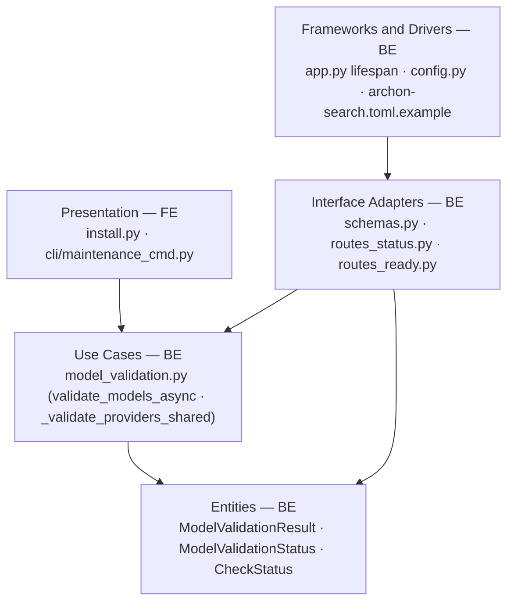
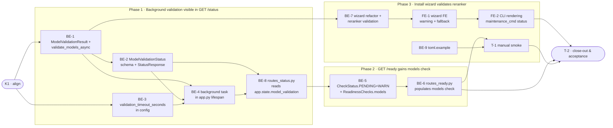

# D6 · Install-time / Background Provider Validation — Team Plan

**How to read this file**
- **Architecture approach:** Clean Architecture — the default. **Layers:** Presentation · Use Cases · Interface Adapters · Entities · Frameworks & Drivers. Each task's first sub-bullet names the layer it touches.
- archon-search has **no web UI**. The Presentation layer is the CLI (`archon_search/cli/`) and the install wizard (`archon_search/install.py`). Backend = everything else.
- The **Frontend, Backend, and Tester** sections are the **depth view** — each role's work, grouped by layer.
- The **Task Breakdown** is the **order view** — every task is a single-role checkbox in execution order, opening with a dependency graph.
- **Phases are vertical slices**, each delivering a working end-to-end increment. Sliced with the **`vertical-slicer` skill**.
- Each task carries the **role tag at the end of its title line**, then sub-bullets: **layer · estimate** (decimal hours), **needs · completes**, and a **Tests** block.
- **Unit and integration tests belong to the implementing dev** (test-first); **e2e and manual tests are the tester's tasks**. Close-out task writes no tests.
- **Contracts** are authored as linked `.tsp` files (TypeSpec v1.13.0 — validated clean).
- IDs (`S#` scenarios, `C#` contracts, `BE-#`/`FE-#`/`T-#`/`K#` tasks, `Q#` questions) are the traceability thread.
- **Rule:** edit your own tasks freely; change a contract only by team agreement.

---

## Background

When archon-search is configured with a non-CPU ONNX provider (CoreML, CUDA) or a custom `reranker_model`, the ONNX session initialises lazily — 5–15 seconds into the first real search query. The reranker has no validation path at all; the embedder's provider check only runs during Metal GPU detection at install time and never again. Today a misconfigured provider silently fails the first production query with no prior warning.

---

## Goal

Provider and model configuration is validated before it fails a user query. A misconfigured reranker model or unavailable ONNX provider surfaces at install time (wizard), at server startup (background, non-blocking), and is visible in `/ready` and `/status` — while the server boots in under 2 seconds regardless of model availability.

---

## Scope

### In Scope
- New `ModelValidationResult` dataclass and `validate_models_async(config, timeout) -> ModelValidationResult` in `model_validation.py` — never raises; catches all exceptions
- Shared `_validate_providers_shared()` extracted from `SearchInstaller.validate_providers()` — called by both wizard and startup check
- New `validation_timeout_seconds: int = 60` in `[database]` TOML section / `SearchConfig`
- Background validation task in `app.py` lifespan handler, result stored on `app.state.model_validation`
- `GET /status` gains `model_validation: ModelValidationStatus | null` sub-object
- `GET /ready` gains `models: CheckStatus` field; `CheckStatus` gains `PENDING` and `WARN` values
- `SearchInstaller.validate_providers()` refactored to call shared function + add reranker instantiation test
- CLI rendering of `model_validation` block in `archon-search maintenance status` (existing command that already calls `GET /status`)
- `archon-search.toml.example` — add `validation_timeout_seconds` comment
- Tests: unit (all validation paths) + integration (background task → status reflects result) + contract tests for `CheckStatus` new values
- Documentation: `CLAUDE.md`, API reference (600), architecture docs (100, 110, 120), `BREAKING.md`

### Out of Scope
- Per-model provider config (`embedding_providers` vs `reranker_providers`) — deferred (config-breaking change)
- Blocking server startup on validation failure — lazy-load contract is hard requirement
- Auto-retry of failed validation after startup
- Live config reload validation
- MCP tool `get_model_status()`
- Per-collection embedder pool validation

---

## Acceptance criteria
- `GET /status` returns `model_validation: {embedder_ok, reranker_ok, provider_warnings, validated_at}` after background validation completes; all fields null while pending
- `GET /ready` returns `checks.models: "pending"` before validation completes, `"ok"` when both pass, `"warn"` on fallback, `"fail"` when a model could not load
- `ready: bool` in `GET /ready` is NOT affected by model validation outcome — storage-only gate preserved
- Server boots in under 2 seconds regardless of model availability (background task, never blocking)
- With `reranker_model = ""`, `reranker_ok` is `true` and no reranker probe runs
- With `eager_load_embedders = true`, embedder probe is skipped if `app.state.embedder.is_warm` is already true
- Validation timeout (> `validation_timeout_seconds`) → both `ok = false`; `provider_warnings` contains `"validation timed out after {N}s"`
- Install wizard logs an actionable WARNING and falls back to CPU when reranker provider is unavailable; install does not fail hard
- `archon-search maintenance status` renders model validation state when server is reachable
- All tests pass; `BREAKING.md` entry for `CheckStatus.PENDING` and `CheckStatus.WARN`; `archon-search.toml.example` updated

---

## What does NOT change
- `ready: bool` is NOT gated on model validation (storage-only — unchanged)
- Server startup time (background task, non-blocking)
- The lazy-load contract (models initialise on first use if validation runs too early)
- `validate_embedding_model()` existing function in `model_validation.py` (separate; used by install wizard for dimension lookup)
- The `providers` list remains a single config key covering both embedder and reranker

---

## Known limitations / accepted trade-offs
- `WARN` state means provider fallback occurred (CPU used instead of GPU) — no per-model breakdown
- Validation runs once at startup; drift (e.g. CUDA driver update post-startup) is not caught until restart
- CLI rendering goes into `archon-search maintenance status` rather than a new dedicated command (Q1)
- Thread safety of `app.state.model_validation`: single write from background task, reads from route handlers — Python GIL makes the single assignment atomic (same pattern as existing `is_warm`)

---

## Approach & architecture

The feature adds a new validation layer between server startup and the first user query. `model_validation.py` (Use Cases) gains the async validator and shared provider-check logic. `app.py` (Frameworks & Drivers) spawns a background task. The result flows through `schemas.py` (Interface Adapters) to `routes_status.py` and `routes_ready.py`. The install wizard (Presentation) calls the same shared validation logic via `install.py`.

**Layer map (and role mapping)**

| Layer | Role | Components |
|-------|------|-----------|
| Presentation | **Frontend** (CLI/wizard) | `archon_search/install.py` · `archon_search/cli/maintenance_cmd.py` |
| Use Cases | Backend | `archon_search/model_validation.py` (`validate_models_async`, `_validate_providers_shared`) |
| Interface Adapters | Backend | `archon_search/server/schemas.py` · `routes_status.py` · `routes_ready.py` |
| Entities | Backend | `ModelValidationResult` (dataclass) · `ModelValidationStatus` (Pydantic) · `CheckStatus` (enum extension) |
| Frameworks & Drivers | Backend | `archon_search/server/app.py` (lifespan) · `archon_search/config.py` · `archon-search.toml.example` |

**What changes**
- `model_validation.py`: add `ModelValidationResult` dataclass, `validate_models_async()`, `_validate_providers_shared()` (extracted from `SearchInstaller`)
- `install.py`: `validate_providers()` calls `_validate_providers_shared()` + adds reranker `TextCrossEncoder` instantiation
- `config.py` / `SearchConfig`: add `validation_timeout_seconds: int = 60`
- `schemas.py`: `CheckStatus` gains `PENDING = "pending"` and `WARN = "warn"`; new `ModelValidationStatus` Pydantic model; `ReadinessChecks` gains `models: CheckStatus`; `StatusResponse` gains `model_validation: ModelValidationStatus | None`
- `app.py`: background task spawned in lifespan after eager-preload; `app.state.model_validation = None` before task
- `routes_status.py`: read `app.state.model_validation` and add field to response
- `routes_ready.py`: populate `checks.models` from `app.state.model_validation`

**Key decisions (from the brief)**
- Background task, not blocking startup — lazy-load contract is hard
- Warning-on-failure, not fatal — degraded-but-running beats refused startup
- `PENDING` as the "not yet complete" status — unambiguous vs `UNKNOWN`
- `ready: bool` never gated on model validation — load balancers use storage-only signal
- `validate_models_async` shared by wizard and startup (extracted to `model_validation.py`)
- `validation_timeout_seconds` as a dedicated `[database]` TOML key (default 60 s)

---

## Contracts / seams

Boundaries where roles must agree. Changing one requires team agreement. Contracts authored as TypeSpec — both validated clean with `tsp compile --no-emit`.

**C1 — ModelValidationResult / ModelValidationStatus** *(Entities ↔ Use Cases ↔ Interface Adapters)*
`validate_models_async()` returns `ModelValidationResult`; the result is stored on `app.state.model_validation` (None while pending) and mirrored as `ModelValidationStatus` in the API. All boolean fields are `bool | null` (null = pending). — see [`D6-model-validation-status.tsp`](D6-model-validation-status.tsp)
- Realised by: BE-1, BE-2, BE-4 · Verified by: BE-1 (unit), BE-4 (integration), T-1 (manual)

**C2 — GET /ready response extension** *(Interface Adapters ↔ clients / load balancers)*
`ReadinessChecks` gains `models: CheckStatus`. `CheckStatus` gains `PENDING` and `WARN`. `ready: bool` is NOT gated on `models`. A `BREAKING.md` entry is required (additive enum change). — see [`D6-readiness-extension.tsp`](D6-readiness-extension.tsp)
- Realised by: BE-5, BE-6 · Verified by: BE-5 (unit + integration), T-1 (manual)

**C3 — Shared provider-validation signature** *(Use Cases ↔ Wizard / Startup)*
`_validate_providers_shared(providers, embedding_model, reranker_model) -> tuple[bool, bool, list[str]]` returns `(embedder_ok, reranker_ok, warnings)`. Never raises. Called by both `validate_models_async()` and the refactored `SearchInstaller.validate_providers()`. Internal seam — built-in form only (no TypeSpec needed for an intra-package function).
- Realised by: BE-1, BE-7 · Verified by: BE-1 (unit), BE-7 (unit + integration)

---

## Scenarios #tester-role

| id | Scenario (Given / When / Then) |
|----|--------------------------------|
| **S1** | **Given** server starts with valid CPU-only config · **When** background validation completes · **Then** `GET /status` returns `model_validation.embedder_ok=true`, `reranker_ok=true`, `validated_at` is non-null ISO timestamp |
| **S2** | **Given** server has just started, validation is still running · **When** `GET /status` is called · **Then** `model_validation` sub-object has all fields null |
| **S3** | **Given** server has just started, validation is still running · **When** `GET /ready` is called · **Then** `checks.models = "pending"` and `ready = true` |
| **S4** | **Given** background validation completed successfully · **When** `GET /ready` is called · **Then** `checks.models = "ok"` and `ready = true` |
| **S5** | **Given** embedder model cannot be loaded (bad model name / network error) · **When** validation runs · **Then** `embedder_ok = false`, `provider_warnings` contains an error string, `GET /ready` returns `checks.models = "fail"` |
| **S6** | **Given** reranker model cannot be loaded · **When** validation runs · **Then** `reranker_ok = false`, `provider_warnings` contains an error string |
| **S7** | **Given** a non-CPU provider (e.g. CoreML) is configured but unavailable · **When** validation runs · **Then** `provider_warnings` contains the missing provider name; `embedder_ok = false` |
| **S8** | **Given** `reranker_model = ""` (disabled) · **When** validation runs · **Then** `reranker_ok = true` with no reranker probe attempted |
| **S9** | **Given** `eager_load_embedders = true` and embedder is already warm · **When** validation runs · **Then** embedder probe is skipped; `embedder_ok = true` |
| **S10** | **Given** validation exceeds `validation_timeout_seconds` · **When** timeout fires · **Then** both `ok = false`, `provider_warnings` contains `"validation timed out after {N}s"` |
| **S11** | **Given** operator runs install wizard with a non-CPU reranker provider that is unavailable · **When** wizard runs `validate_providers()` for the reranker · **Then** a WARNING is logged, install falls back to CPU for the reranker, install does not fail |
| **S12** | **Given** validation completed with a provider fallback to CPU · **When** `GET /ready` is called · **Then** `checks.models = "warn"` |
| **S13** | **Given** `archon-search maintenance status` is called while server is running · **When** the command renders its output · **Then** model validation state (embedder_ok, reranker_ok, warnings) is shown in the human-readable block |

---

## Frontend — Presentation #frontend-role

**Scope:** CLI and install wizard presentation only — calling shared validation logic and rendering results.
**Owns layer:** Presentation.

**Tasks** *(checkable in the Task Breakdown)*
- Presentation: FE-1 — wizard reranker validation · FE-2 — CLI maintenance status rendering

**Done when**
- [ ] Install wizard warns and falls back to CPU when reranker provider is unavailable, without failing install — S11
- [ ] `archon-search maintenance status` shows model validation state when server is reachable — S13

---

## Backend — Entities · Use Cases · Adapters · Frameworks #backend-role

**Scope:** all server-side validation logic, schema changes, route updates, config, and lifespan wiring. Writes both unit and integration tests for its tasks.
**Owns layers:** Entities, Use Cases, Interface Adapters, Frameworks & Drivers.

**Tasks by layer** *(checkable in the Task Breakdown)*
- Entities: BE-1 — `ModelValidationResult` + `validate_models_async` + `_validate_providers_shared`
- Use Cases: BE-1 (shared logic)
- Interface Adapters: BE-2 — `ModelValidationStatus` Pydantic + `StatusResponse` · BE-5 — `CheckStatus.PENDING`/`WARN` + `ReadinessChecks.models` · BE-6 — `routes_ready.py`
- Frameworks & Drivers: BE-3 — `validation_timeout_seconds` in config · BE-4 — background task in `app.py` · BE-7 — wizard refactor · BE-8 — `routes_status.py` · BE-9 — `toml.example`

**Done when**
- [ ] `GET /status` returns `model_validation` sub-object with null-while-pending semantics — S1, S2
- [ ] `GET /ready` returns `models: PENDING` pre-validation, `OK`/`WARN`/`FAIL` after — S3, S4, S5, S6, S7, S12
- [ ] Reranker disabled → `reranker_ok = true`, no probe — S8
- [ ] Warm embedder skipped when already loaded — S9
- [ ] Timeout → both `ok = false`, warning string — S10

---

## Tester #tester-role

**Scope:** the tester owns **e2e and manual** tests plus the project **close-out**. Unit and integration tests belong to the implementing dev.

**Tasks** *(checkable in the Task Breakdown)*
- T-1 — manual end-to-end smoke · T-2 — project close-out & acceptance fact-check

**Allocation** — each scenario at the cheapest level that proves it

| Scenario | Cheapest level |
|----------|----------------|
| S1 | integration |
| S2 | integration |
| S3 | integration |
| S4 | integration |
| S5 | unit |
| S6 | unit |
| S7 | unit |
| S8 | unit |
| S9 | unit |
| S10 | unit |
| S11 | manual |
| S12 | unit |
| S13 | manual |

---

## Documentation update

- [ ] `Documentation/Backlog/D6-provider-validation-brief.md` — no changes needed (source brief)
- [ ] `Documentation/Backlog/D6-provider-validation-team-plan.md` — this file
- [ ] `Documentation/Architecture/100_system_architecture_overview.md` — mention background model validation in runtime topology
- [ ] `Documentation/Architecture/110_component_catalog_and_layer_breakdown.md` — add `model_validation.py` new exports (`ModelValidationResult`, `validate_models_async`, `_validate_providers_shared`) and note `CheckStatus` enum extension
- [ ] `Documentation/Architecture/120_services_and_integration_architecture.md` — document background validation task lifecycle (parallel to BackupLoop/MaintenanceLoop pattern)
- [ ] `Documentation/Architecture/600_api_reference_or_public_interface.md` — document `GET /status` `model_validation` sub-object; document `GET /ready` `models` check + new `CheckStatus` values; document `[database] validation_timeout_seconds`
- [ ] `BREAKING.md` — additive enum change: `CheckStatus.PENDING` and `CheckStatus.WARN` (existing consumers asserting exhaustive match on `CheckStatus` will need updating; `tests/contract/test_readiness_schemas.py` currently asserts only `OK`/`FAIL`)
- [ ] `archon-search.toml.example` — add `validation_timeout_seconds = 60` with comment under `[database]`
- [ ] `CLAUDE.md` — update `model_validation.py` description to include new exports; note `validation_timeout_seconds` config key

---

## Open questions

| id | Area | Question |
|----|------|----------|
| **Q1** | CLI | The brief says `archon-search status` CLI "renders model_validation in existing status output" — but `cli/status.py` calls the platform service status, not `GET /status` HTTP. Plan targets `maintenance_cmd.py` status subcommand (which already fetches `GET /status`). Confirm this is the right home, or add a new `model-validation` CLI group. |
| **Q2** | testing | The contract test `tests/contract/test_readiness_schemas.py` currently asserts `CheckStatus` has exactly `OK` and `FAIL`. Adding `PENDING` and `WARN` will break that test. BE-5 must update the contract test. Confirm no other exhaustive-match guards exist on `CheckStatus`. |

---

## Task Breakdown

Single-role tasks in execution order, grouped into **vertical slices**.

### Dependency graph

### Phase 0 · Kickoff *(prerequisite; the one cross-cutting step)*
- [ ] **K1** — Agree Contracts and Scenarios with the team; resolve Q1 (CLI home for model_validation rendering) #team
    - — · 1.0h
    - completes C1, C2, C3
    - Tests

### Phase 1 · Background validation visible in GET /status *(walking skeleton: validation runs, result stored, status shows it)*
- [ ] **BE-1** — Add `ModelValidationResult` dataclass, `_validate_providers_shared()`, and `validate_models_async()` to `model_validation.py` #backend-role
    - Entities + Use Cases · 6.0h
    - needs K1 · completes C1, C3, S1, S5, S6, S7, S8, S9, S10, S12
    - Tests
        - #unit_test — `test_validate_models_async_both_ok` — stubs TextEmbedding+TextCrossEncoder; both return True, validated_at non-null
        - #unit_test — `test_validate_models_async_embedder_fails` — embedder raises; embedder_ok=False, reranker_ok unset by embedder path
        - #unit_test — `test_validate_models_async_reranker_fails` — reranker raises; reranker_ok=False, embedder_ok=True
        - #unit_test — `test_validate_models_async_provider_unavailable` — onnxruntime mock returns empty list; embedder_ok=False, warning contains provider name
        - #unit_test — `test_validate_models_async_timeout` — asyncio.wait_for times out; both ok=False, warning contains "timed out"
        - #unit_test — `test_validate_models_async_reranker_disabled` — reranker_model=""; reranker_ok=True, no reranker probe
        - #unit_test — `test_validate_models_async_embedder_warm_skip` — is_warm=True; embedder probe skipped, embedder_ok=True
        - #unit_test — `test_validate_models_async_never_raises` — any exception during validation; function returns result (not raises)
- [ ] **BE-2** — Add `ModelValidationStatus` Pydantic model and `model_validation: ModelValidationStatus | None = None` to `StatusResponse` in `schemas.py` #backend-role
    - Interface Adapters · 1.0h
    - needs BE-1 · completes C1
    - Tests
        - #unit_test — `test_model_validation_status_all_null` — `ModelValidationStatus` with null fields serialises correctly
        - #unit_test — `test_model_validation_status_populated` — fully populated instance round-trips through Pydantic
- [ ] **BE-3** — Add `validation_timeout_seconds: int = 60` to `SearchConfig` in `config.py`; parse from `[database]` TOML section #backend-role
    - Frameworks & Drivers · 1.0h
    - needs K1 · completes S10
    - Tests
        - #unit_test — `test_validation_timeout_seconds_default` — `SearchConfig()` has `validation_timeout_seconds == 60`
        - #unit_test — `test_validation_timeout_seconds_from_toml` — TOML with `validation_timeout_seconds = 30` produces config with 30
- [ ] **BE-4** — In `app.py` lifespan: set `app.state.model_validation = None`, then spawn `validate_models_async()` as a background task tracked in `app.state._background_tasks` #backend-role
    - Frameworks & Drivers · 3.0h
    - needs BE-1, BE-2, BE-3 · completes S1, S2
    - Tests
        - #unit_test — `test_model_validation_state_none_before_task` — immediately after lifespan startup, `app.state.model_validation` is None
        - #integration_test — `test_background_validation_completes_and_sets_app_state` — `make_real_app`, wait briefly, assert `app.state.model_validation` is non-None with `validated_at` set
- [ ] **BE-8** — In `routes_status.py`, read `app.state.model_validation` and include `model_validation` in `StatusResponse`; null if task not yet complete #backend-role
    - Interface Adapters · 2.0h
    - needs BE-4 · completes S1, S2
    - Tests
        - #unit_test — `test_status_model_validation_null_while_pending` — `app.state.model_validation = None`; GET /status returns `model_validation: null`
        - #unit_test — `test_status_model_validation_populated_after_validation` — `app.state.model_validation` set; GET /status reflects it
        - #integration_test — `test_status_endpoint_includes_model_validation_after_startup` — `make_real_app`, poll GET /status until `model_validation` non-null, assert `embedder_ok` field present

### Phase 2 · GET /ready gains models check *(operator/load balancer sees model health)*
- [ ] **BE-5** — Add `CheckStatus.PENDING = "pending"` and `CheckStatus.WARN = "warn"` to `schemas.py`; add `models: CheckStatus` to `ReadinessChecks` (default `PENDING`); update `tests/contract/test_readiness_schemas.py` #backend-role
    - Interface Adapters · 2.0h
    - needs BE-8 · completes C2, S3
    - Tests
        - #unit_test — `test_check_status_pending_value` — `CheckStatus.PENDING.value == "pending"`
        - #unit_test — `test_check_status_warn_value` — `CheckStatus.WARN.value == "warn"`
        - #unit_test — `test_readiness_checks_has_models_field` — `ReadinessChecks(storage=CheckStatus.OK, models=CheckStatus.PENDING)` round-trips
        - #unit_test — `test_readiness_response_ready_not_gated_on_models` — `ready=True` even when `models=FAIL`
- [ ] **BE-6** — Update `routes_ready.py` to populate `checks.models` from `app.state.model_validation`; `PENDING` while None, `OK`/`WARN`/`FAIL` from result #backend-role
    - Interface Adapters · 2.0h
    - needs BE-5 · completes C2, S3, S4, S12
    - Tests
        - #unit_test — `test_ready_models_pending_when_validation_none` — `app.state.model_validation = None`; `checks.models = "pending"`
        - #unit_test — `test_ready_models_ok_when_both_pass` — both `ok=True`; `checks.models = "ok"`
        - #unit_test — `test_ready_models_fail_when_embedder_fails` — `embedder_ok=False`; `checks.models = "fail"`
        - #unit_test — `test_ready_models_warn_on_provider_warning` — warnings non-empty, both ok=True; `checks.models = "warn"`
        - #unit_test — `test_ready_always_200_regardless_of_model_status` — model fail; response is 200, `ready=True`
        - #integration_test — `test_ready_models_transitions_from_pending_to_ok` — `make_real_app`, poll GET /ready until `models != "pending"`, assert `models == "ok"`

### Phase 3 · Install wizard validates reranker *(install-time misconfiguration surfaces before first query)*
- [ ] **BE-7** — Refactor `SearchInstaller.validate_providers()` in `install.py` to call `_validate_providers_shared()` from `model_validation.py`; add `TextCrossEncoder` reranker test when `profile.reranker is not None` #backend-role
    - Use Cases · 3.0h
    - needs BE-1 · completes C3, S7, S11
    - Tests
        - #unit_test — `test_validate_providers_calls_shared_function` — `SearchInstaller.validate_providers()` invokes `_validate_providers_shared`
        - #unit_test — `test_validate_providers_reranker_tested` — profile with reranker triggers reranker probe
        - #unit_test — `test_validate_providers_reranker_none_no_probe` — profile without reranker skips reranker probe
        - #integration_test — `test_wizard_validate_providers_returns_false_on_bad_provider` — unavailable provider → returns False without raising
- [ ] **FE-1** — In `SearchInstaller` wizard flow: after `_prewarm_models`, call refactored `validate_providers()` for the reranker; log `WARNING` + fallback message if reranker provider unavailable; install continues #frontend-role
    - Presentation · 2.0h
    - needs BE-7 · completes S11
    - Tests
        - #unit_test — `test_wizard_warns_on_reranker_provider_failure` — `validate_providers` returns False for reranker; WARNING logged, install does not raise
        - #unit_test — `test_wizard_install_completes_when_reranker_provider_unavailable` — full wizard flow with reranker provider failure; install writes config and returns
- [ ] **FE-2** — In `cli/maintenance_cmd.py`: update `_print_status_text` and `_gather_status` to extract and display `model_validation` block from `GET /status` when present #frontend-role
    - Presentation · 2.0h
    - needs FE-1 · completes S13
    - Tests
        - #unit_test — `test_maintenance_status_renders_model_validation` — status payload with `model_validation`; output contains `embedder_ok` and `reranker_ok`
        - #unit_test — `test_maintenance_status_no_model_validation_key` — status payload without `model_validation`; no crash, section omitted
- [ ] **BE-9** — Add `# validation_timeout_seconds = 60` comment+key under `[database]` in `archon-search.toml.example` #backend-role
    - Frameworks & Drivers · 0.5h
    - needs K1 · completes (documentation)
    - Tests
- [ ] **T-1** — Manual: install wizard warns on reranker provider unavailable; maintenance status shows model validation; ready endpoint shows PENDING then OK #tester-role
    - — · 2.0h
    - needs FE-2, BE-6, BE-9 · completes S11, S13
    - Tests
        - #manual_test — Wizard reranker provider failure — configure CoreML/CUDA reranker on a system where the provider is absent; verify WARNING logged and install completes
        - #manual_test — maintenance status model_validation — with server running, `archon-search maintenance status` shows embedder_ok/reranker_ok block
        - #manual_test — /ready PENDING then OK — poll /ready immediately after startup; observe PENDING transitions to OK after validation completes

### Phase 4 · Close-out
- [ ] **T-2** — Project close-out & acceptance fact-check #tester-role
    - — · 4.0h
    - needs all prior tasks · completes (acceptance gate)
    - Tests
    - Duties
        - Update all documentation per the "Documentation update" section — `CLAUDE.md`, API reference (600), architecture docs (100, 110, 120), `BREAKING.md`, `archon-search.toml.example`.
        - Fix all build / compiler warnings, if any.
        - Run the full test suite; fix every failing test, including any unrelated to this feature.
        - Validate every Acceptance criterion one-by-one with a fact check — no assumptions; confirm each is genuinely done.

**Critical path:** K1 → BE-1 → BE-2 → BE-4 → BE-8 → BE-5 → BE-6 → T-1 → T-2. Wizard refactor (BE-7 → FE-1 → FE-2) runs in parallel from BE-1.
