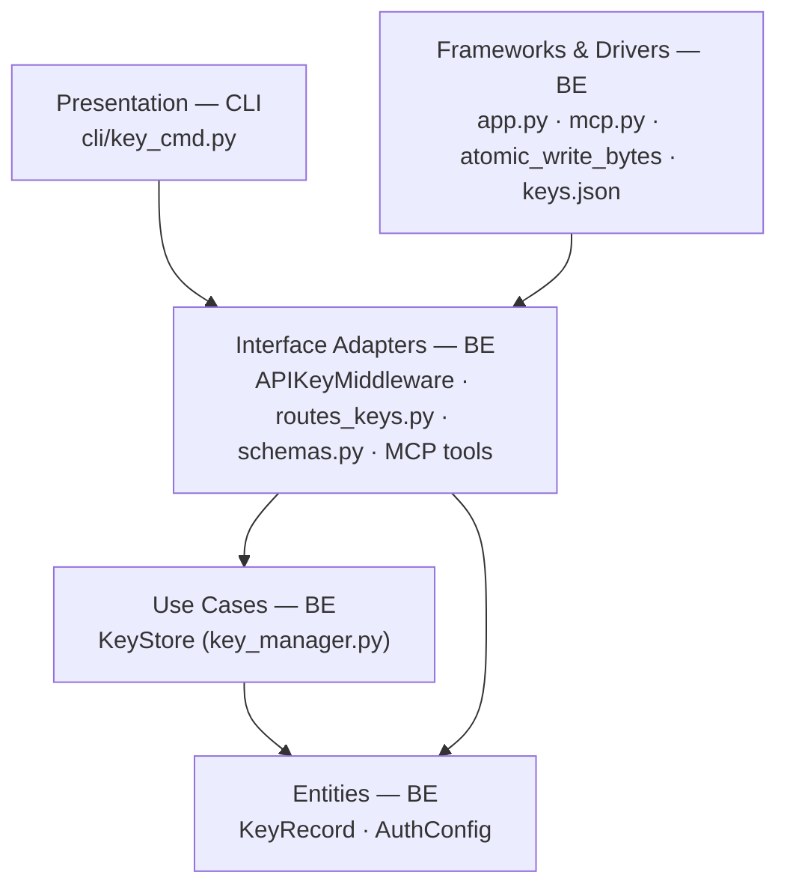

# D7 · Multi-Key Auth with Rotation — Team Plan

**How to read this file**
- **Architecture approach:** Clean Architecture (default). **Layers:** Presentation · Use Cases · Interface Adapters · Entities · Frameworks & Drivers. Each task's first sub-bullet names the layer it touches.
- The **Frontend, Backend, and Tester** sections are the **depth view** — each role's work, grouped by layer.
- The **Task Breakdown** is the **order view** — every task is a single-role checkbox in execution order, opening with a dependency graph.
- **Phases are vertical slices**: each delivers a working end-to-end increment, not a horizontal layer. No separate "integrate" phase. Sliced with the **`vertical-slicer` skill**.
- Each task carries the **role tag at the end of its title line**, then sub-bullets: **layer · estimate** (decimal hours), **needs · completes**, and a **Tests** block. **needs** = predecessor tasks; **completes** = the scenario `S#` it makes true, or the contract `C#` it realises.
- **Tests** are tagged by level. **Unit and integration tests belong to the implementing dev** (test-first); **e2e and manual tests are the tester's tasks**.
- **Contracts** are authored as TypeSpec `.tsp` files beside this plan (validated with `tsp compile --no-emit`): `d7-key-record.tsp` (C1), `d7-keystore-boundary.tsp` (C2), `d7-keys-api.tsp` (C3).
- IDs (`S#`, `C#`, `BE-#`/`FE-#`/`T-#`/`K#`, `Q#`) are the traceability thread.

---

## Background

Today archon-search uses a single API key loaded from `.search.env` or `ARCHON_SEARCH_API_KEY`, plus an optional static `[namespaces]` map in TOML. There is no way to revoke or rotate a key without editing config and restarting the server.

---

## Goal

An operator can issue, revoke, or rotate API keys — including the default key and any per-namespace keys — without restarting the server. Active requests in flight are never rejected mid-flight. Expired or revoked keys are refused immediately on the next request. The key store is durable across restarts.

---

## Scope

### In Scope
- Durable key store at `get_data_dir() / "keys.json"` — JSON array of `KeyRecord` objects; written via `atomic_write_bytes(path, json.dumps(records, default=str).encode(), mode=0o600)` — `atomic_write_json` is intentionally NOT used because it does not enforce file permissions
- `KeyStore` class in `key_manager.py`: `create()`, `revoke()`, `list_keys()`, `load()`, `active_keys()`
- Token hashing: SHA-256 hex of the raw bearer token — raw token stored nowhere, printed once
- `APIKeyMiddleware` additive `key_store: KeyStore | None = None` parameter — legacy `api_key` + `namespaces` path unchanged
- Expiry enforcement on each request via wall-clock comparison; expired keys rejected with 401
- Grace period for `key rotate`: `[auth] rotate_grace_seconds` (default `0`) — old default key gets `expires_at = now + grace_seconds`
- CLI commands: `archon-search key create`, `key list`, `key revoke`, `key rotate`
- REST endpoints: `POST /keys`, `GET /keys`, `DELETE /keys/{id}`, `POST /keys/rotate`
- MCP tools: `create_key`, `list_keys`, `revoke_key`, `rotate_key` in `mcp.py`
- TOML `[namespaces]` map: synthetic `KeyRecord` objects (no `id`, no revocation via CLI/API); backward-compat unchanged
- OpenAPI snapshot regenerated; `BREAKING.md` updated for new `/keys` endpoints

### Out of Scope
- Per-key ACL scoping to specific collections
- Key store migration CLI (`key import-from-toml`)
- Key expiry auto-renewal / scheduled rotation
- Audit log
- Multi-process / clustered deployments
- JWKS / OAuth / OIDC

---

## Acceptance criteria
- `archon-search key create --namespace ns` prints a token to stdout once and stores only its SHA-256 hash in `keys.json`
- A client using a managed key receives 200 on a search request; the key's namespace is stamped on `request.state.namespace`
- `archon-search key revoke <id>` marks the key revoked; the next request bearing that token returns 401 without a server restart
- `archon-search key list` shows active keys only by default; `--status all` shows all; revoked count hint line shown when hidden revoked keys exist
- `archon-search key rotate` generates a new default key, writes it to `.search.env`, revokes (or grace-expires) the old one
- Existing single-key and TOML `[namespaces]` deployments require zero config changes to keep working
- `keys.json` is written with mode `0600` and survives restart (keys persist)
- A corrupted `keys.json` on startup logs an ERROR and falls back to an empty key store — the server starts and the default env/file key still works

---

## What does NOT change
- `load_or_generate_key()` function — signature and behaviour unchanged
- `APIKeyMiddleware.__init__` signature minus the new optional `key_store` param — all existing callers (`app.py`, `mcp.py`) keep working with zero-argument change until they opt in
- TOML `[namespaces]` map — continues to work, tokens not promoted to `keys.json` automatically
- `ARCHON_SEARCH_API_KEY` env var — always wins for the default key, regardless of `keys.json` state
- All existing REST endpoints — no breaking changes; `/keys` is new

---

## Known limitations / accepted trade-offs
- Single-process model only — `keys.json` has no distributed lock; multi-process deployments require external coordination
- All keys have equal power (no admin vs. client role distinction) — deferred to v2 per brief
- Expired keys are not auto-purged — operator must `key revoke` to clean them up; future GC pass deferred
- `key list` for TOML-sourced synthetic keys shows `id: null` and `label: '<toml-namespace>'` in the response — they appear in `GET /keys` for operator visibility but cannot be targeted by `DELETE /keys/{id}`. Attempting `DELETE /keys/null` or any non-existent ID returns 404. Operators manage TOML tokens by editing `archon-search.toml` and restarting.
- **JSON write pattern:** `keys.json` is serialized with `json.dumps(..., default=str).encode()` and written via `atomic_write_bytes` with `mode=0o600`. `atomic_write_json` is not used because it does not set file permissions.
- **All-or-nothing corruption policy:** if `keys.json` fails to parse OR contains non-array JSON OR any record fails Pydantic validation, the entire store is treated as empty and ERROR is logged. A single bad record wipes all managed keys on restart — operators should back up `keys.json` before manual edits.
- **`key rotate` blocked when `ARCHON_SEARCH_API_KEY` is set** — the env var always overrides `.search.env` in the running process; rotating would silently produce a no-op from the operator's perspective. `POST /keys/rotate` returns 409 when the env var is detected (S23).
- **MCP `api_key` not hot-reloaded on rotation** — `key rotate` updates `.search.env` and `keys.json` for the managed-key path, but the MCP server's `APIKeyMiddleware.api_key` (loaded at startup from `.search.env`) is **not** hot-reloaded. The old default key remains valid for the MCP path until the server restarts. Operators who use MCP auth must restart after rotation (S24).
- **TOML + managed key SHA-256 collision** — if a TOML `[namespaces]` plaintext token happens to produce the same SHA-256 hash as a managed key's `token_hash`, the middleware will match whichever is found first (managed keys checked before TOML synthetic keys). This collision is astronomically unlikely with SHA-256 but is documented as an accepted edge case.
- **TOML `[namespaces]` changes require restart** — TOML namespace tokens are loaded once at startup as synthetic `KeyRecord` objects. Adding or removing a namespace token in `archon-search.toml` requires a server restart to take effect. Managed keys (created via `POST /keys`) are hot-loaded without restart.
- **`POST /keys` with `expires_at` in the past** — The server accepts creation of a key with a past `expires_at`. The key is immediately expired and will never be accepted by `active_keys()`. This is intentional: the server does not validate future-ness of `expires_at` at creation time. Operators should use this only for testing. No 422 is returned.

---

## Approach & architecture

Extend `key_manager.py` with a `KeyStore` class (Use Cases layer) backed by `atomic_write_bytes`. Update `APIKeyMiddleware` (Interface Adapters) with an additive `key_store` parameter that — when present — checks managed keys in addition to the legacy path. Wire `KeyStore` into `app.py` and `mcp.py` (Frameworks & Drivers). Add `routes_keys.py` (Interface Adapters), schemas, CLI `key_cmd.py` (Presentation), and MCP tools.



**Layer map**

| Layer | Role | Components |
|-------|------|-----------|
| Presentation | **Frontend (CLI)** | `archon_search/cli/key_cmd.py` (new), `cli/main.py` (registration) |
| Use Cases | Backend | `KeyStore` class in `archon_search/key_manager.py` |
| Interface Adapters | Backend | `APIKeyMiddleware` (updated), `routes_keys.py` (new, incl. `.search.env` write on rotate), `schemas.py` additions, MCP tools in `mcp.py` |
| Entities | Backend | `KeyRecord` Pydantic model, `AuthConfig` dataclass in `config.py` |
| Frameworks & Drivers | Backend | `app.py` `create_app()` wiring, `mcp.py` `create_app()` wiring, `atomic_write_bytes`, `_chmod_600` |

**What changes**
- `archon_search/key_manager.py`: add `KeyRecord` Pydantic model, `KeyStore` class with `create`, `revoke`, `list_keys`, `load`, `active_keys`. **`KeyStore` has no in-memory key list** — `active_keys()` and `list_keys()` call `load()` on every invocation to get a fresh snapshot from disk. Only the `_logged_expired_ids: set[str]` set (for suppressing repeated expired-key INFO logs) is held in memory.
- `archon_search/config.py`: add `AuthConfig` dataclass (`rotate_grace_seconds: int = 0`); add `auth: AuthConfig` field to `SearchConfig`; add `[auth]` TOML parsing in `_apply_toml`. **Grace seconds precedence:** the `POST /keys/rotate` request body `grace_seconds` field overrides the TOML `[auth] rotate_grace_seconds` default. If `grace_seconds` is absent from the request body, the TOML default is used. If both are 0, rotation is immediate.
- `archon_search/server/middleware_auth.py`: `APIKeyMiddleware.__init__` gains `key_store: KeyStore | None = None`; `dispatch` loops over `key_store.active_keys()` before the legacy path. **Token comparison:** for managed-key lookups, the middleware computes `token_hash = hashlib.sha256(incoming_token.encode()).hexdigest()` **once per request** (not once per key), then calls `hmac.compare_digest(token_hash, record.token_hash)` for each active key. The existing legacy path continues to use `secrets.compare_digest(incoming_token, self._api_key)` for raw-token comparison. Both are constant-time for equal-length inputs; managed-key hex digests are always 64 characters. **Dispatch order (with early-exit on match):** managed keys (`key_store.active_keys()`) checked first — exit loop on first `hmac.compare_digest` match. If no managed key matches, check TOML `namespaces` dict. If no TOML match, check default `api_key`. This ordering means managed keys take precedence over TOML tokens when the same raw token appears in both (with different namespaces). **The TOML `[namespaces]` loop retains its no-early-exit behavior (no `break` on match) to prevent timing leakage on namespace tokens, preserving the existing middleware design.** **Rotation-revocation guard:** after `POST /keys/rotate`, the old default token is revoked in `keys.json`; `active_keys()` filters it out. However, `APIKeyMiddleware._api_key` still holds the old raw token and the legacy `api_key` fallback path would accept it. To prevent bypassing revocation, the legacy `api_key` fallback must perform a negative check: before accepting a token via the legacy path, the middleware checks whether the incoming token matches any managed key with `status=revoked` or `status=expired` (by computing its SHA-256 hash and scanning `key_store.load()` for a matching revoked/expired record). If found, the request is rejected with 401 even though the raw token matches `self._api_key`. This negative check is only performed when `key_store` is not None. When `key_store` is None (legacy-only mode), the behavior is unchanged.
- `archon_search/server/app.py`: instantiate `KeyStore`; pass `key_store=key_store` to `APIKeyMiddleware`; include `keys_router`; set `app.state.key_store`
- `archon_search/server/mcp.py`: `create_app()` gains `key_store` param; wires it into `APIKeyMiddleware` at line 1265; registers four new MCP tools (`create_key`, `list_keys`, `revoke_key`, `rotate_key`)
- `archon_search/server/routes_keys.py`: new file — POST/GET/DELETE/POST-rotate
- `archon_search/server/schemas.py`: `KeyCreateRequest`, `KeyCreateResponse` (includes `status: Literal['active']` always, for consistency with `KeyResponse`), `KeyResponse`, `KeyListResponse`, `KeyRevokeResponse`, `KeyRotateRequest`, `KeyRotateResponse`
- `archon_search/cli/key_cmd.py`: new file — Click group `key` with subcommands
- `archon_search/cli/main.py`: register `key_cmd`

**Key decisions (from the brief)**
- Store token hashes (SHA-256 hex), never plaintext; token printed once to stdout
- Additive `key_store` parameter on `APIKeyMiddleware` — no flag day
- **`active_keys()` re-reads `keys.json` from disk on every call** — `keys.json` is small (typically <100KB); the I/O cost is negligible. Mutations (`create`, `revoke`, `rotate`) write to disk via `atomic_write_bytes` but do NOT maintain a separate in-memory cache. This eliminates cross-process staleness between the HTTP and MCP servers without requiring inotify, polling, or a shared-memory bus.
- Grace period implemented via `expires_at`, not a separate field
- TOML `[namespaces]` synthetic `KeyRecord` objects loaded at `create_app()` startup — no auto-migration
- `key rotate`: `KeyStore.rotate_default_key()` returns `{new_key_id, new_token, old_record?}` — the new key's UUID id, the new raw token, and the old key record (if any); `POST /keys/rotate` route handler writes `.search.env`

**Layer note:** `KeyStore` directly uses `atomic_write_bytes` and `_chmod_600` (Frameworks & Drivers utilities). This is an accepted pragmatic shortcut: `key_manager.py` intentionally spans the Use Cases and Frameworks boundary for these thin I/O utilities. The trade-off is that `KeyStore` unit tests must stub the filesystem (using `tmp_path`), not mock the write function.

---

## Contracts / seams

Boundaries where roles must agree. Logical, not code. Changing one requires team agreement. TypeSpec available (tsp 1.13.0) — contracts authored as `.tsp` files beside this plan.

**C1 — KeyRecord entity** *(Entities ↔ all layers)* — see [`d7-key-record.tsp`](d7-key-record.tsp)
`KeyRecord` is the shared data model flowing between `KeyStore`, `APIKeyMiddleware`, route handlers, schemas, and CLI. Fields: `id` (UUID4 string), `token_hash` (SHA-256 hex), `` `namespace` `` (string), `label?` (string), `created_at` (utcDateTime), `expires_at?` (utcDateTime), `status` (active|revoked). The raw bearer token is **never** a field.
- Realised by: BE-1 · Verified by: BE-1 (unit), BE-2 (integration)

**C2 — KeyStore ↔ APIKeyMiddleware** *(Use Cases ↔ Interface Adapters)* — see [`d7-keystore-boundary.tsp`](d7-keystore-boundary.tsp)
`active_keys()` calls `KeyStore.load()` on every invocation to get the current state from disk, then filters by `status=active` AND (`expires_at` is null OR `expires_at > now`); the comparison is **strict** (`expires_at > now`), so a key at exactly its expiry instant is considered expired. There is no in-memory key list to copy or replace — reads always go to disk. Writers use `atomic_write_bytes` for crash-safe disk writes. **Write serialization:** `KeyStore` holds an internal `asyncio.Lock`. Every read-modify-write cycle (`create`, `revoke`, `rotate`) must acquire this lock before reading `keys.json` and release it after writing. Because `active_keys()` reads from disk, it does not need the lock (each call gets a fresh snapshot). Middleware calls `active_keys()` on every authenticated request. `KeyStore` is the sole writer; middleware is read-only. `list_keys()` returns all records for operator display (no filtering by expiry). `create(ns: str, label: str | None, expires_at: datetime | None)` returns `{id: str, token: str}` — the new key's UUID id and the raw bearer token; both `label` and `expires_at` are optional (None = not set). **Done in K1:** `d7-keystore-boundary.tsp` updated to `create(ns: string, label?: string, expires_at?: utcDateTime): {id: string, token: string}`. `revoke(id)` is idempotent for already-revoked keys (no-op); raises `KeyError` only for nonexistent IDs (unknown ID, never existed). The route handler relies on this distinction: already-revoked returns 200, nonexistent returns 404. `rotate_default_key(current_token: str, grace_seconds: int) -> {new_key_id: str, new_token: str, old_record: KeyRecord | None}` — returns the new key's UUID id, the new raw token, and the old key record (if any). **Done in K1:** `d7-keystore-boundary.tsp` updated to return `{new_key_id: string, new_token: string, old_record?: KeyRecord}`. The INFO log for expired-key rejection is emitted **at most once per key ID per process lifetime**; `KeyStore` maintains an in-memory `_logged_expired_ids: set[str]` to suppress repeated logs for the same key.
- Realised by: BE-1, BE-5, BE-7 · Verified by: BE-1 (unit), BE-2 (integration), BE-5 (unit+integration)

**C3 — REST /keys HTTP API** *(CLI → server; clients ↔ server)* — see [`d7-keys-api.tsp`](d7-keys-api.tsp)
`POST /keys` → `KeyCreateResponse` (token field present once; includes `status: 'active'` for consistency with `KeyResponse`). `GET /keys` → `KeyListResponse` (no token). `DELETE /keys/{id}` → `KeyRevokeResponse`; for an already-revoked key, returns 200 (idempotent — desired state achieved). `POST /keys/rotate` → `KeyRotateResponse` (token field present once); returns 409 when `ARCHON_SEARCH_API_KEY` env var is set. All require Bearer auth. Duration strings (CLI-only) are resolved to ISO-8601 datetime before the HTTP call. **TypeSpec notes (done alongside BE-4 and BE-6):** `d7-keys-api.tsp` `KeyCreateResponse` must add `status: KeyStatus`; `KeyResponse.id` must be updated to `id?: string` (nullable) to accommodate TOML synthetic keys with `id=null`.
- Realised by: BE-4, BE-6, BE-8 · Verified by: BE-4 (integration), BE-6 (integration), BE-8 (integration), T-1, T-2, T-3 (e2e)

---

## Scenarios #tester-role

Behavioural only — step-level detail produced by tasks below.

| id | Scenario (Given / When / Then) |
|----|-------------------------------|
| **S1** | **Given** a running server with no managed keys · **When** operator `POST /keys` with valid namespace · **Then** 201 with `id`, `token`, `namespace`, `created_at`, `status=active`; `expires_at` null if not set |
| **S2** | **Given** an active managed key exists · **When** client sends `Authorization: Bearer <token>` · **Then** 200; `request.state.namespace` = key's namespace |
| **S3** | **Given** mixed active and revoked keys exist · **When** operator `GET /keys` (no filter) · **Then** only active keys in response; `hidden_revoked_count` > 0 shown as hint |
| **S4** | **Given** an active managed key exists · **When** operator `DELETE /keys/{id}` · **Then** 200; key `status=revoked` in `keys.json` |
| **S5** | **Given** keys for multiple namespaces exist · **When** operator `GET /keys?namespace=ns` · **Then** only keys for `ns` returned |
| **S6** | **Given** a running server · **When** operator `POST /keys/rotate` · **Then** new default key written to `.search.env`; old key revoked (or grace-expiring if `grace_seconds > 0`); new token in response |
| **S7** | **Given** a TOML `[namespaces]` token exists · **When** client sends that token · **Then** 200; backward-compat intact; no restart needed |
| **S8** | **Given** TOML token and a managed key for the same namespace · **When** client sends the managed token · **Then** 200; resolves to the key's namespace |
| **S9** | **Given** a revoked key · **When** client sends `Bearer <token>` · **Then** 401 immediately |
| **S10** | **Given** an expired key (`expires_at` in the past) · **When** client sends `Bearer <token>` · **Then** 401; INFO-level log emitted on first rejection |
| **S11** | **Given** no matching key · **When** client sends any `Bearer <token>` · **Then** 401 |
| **S12** | **Given** any request · **When** no `Authorization` header · **Then** 401 with `WWW-Authenticate: Bearer` |
| **S13** | **Given** a `POST /keys` with an invalid namespace · **When** called · **Then** 422 |
| **S14** | **Given** `DELETE /keys/{id}` for a nonexistent id · **When** called · **Then** 404 |
| **S15** | **Given** `POST /keys/rotate` with `grace_seconds=60` · **When** called · **Then** old key gets `expires_at = now + 60s`; requests with old token succeed during grace window; fail after expiry |
| **S16** | **Given** `ARCHON_SEARCH_API_KEY` set AND a matching `keys.json` record exists with `status=revoked` · **When** client sends that token · **Then** 200 (env var wins) |
| **S17** | **Given** `keys.json` is unparseable on startup · **When** server starts · **Then** ERROR logged; server starts with empty managed key store; default env/file key still works |
| **S18** | **Given** operator revokes the only active managed key · **When** next request arrives · **Then** 401; no crash; default env/file key still works if present |
| **S19** | **Given** any authentication attempt · **When** middleware checks managed keys · **Then** `hmac.compare_digest` used for each managed-key comparison; the loop may exit on first match. The timing guarantee is constant-time per comparison (fixed-length 64-char hex strings), not constant-time across all keys. |
| **S20** | **Given** `key create` is called · **When** inspecting `keys.json` · **Then** only `token_hash` (SHA-256) is stored; raw token absent |
| **S21** | **Given** `keys.json` is written · **When** file system stat checked · **Then** mode is `0600` |
| **S22** | **Given** CLI `key create` or `key rotate` · **When** output captured · **Then** raw token on stdout only; warning banner on stderr only |
| **S23** | **Given** `ARCHON_SEARCH_API_KEY` is set in the environment · **When** operator calls `POST /keys/rotate` · **Then** 409 with message "Cannot rotate: ARCHON_SEARCH_API_KEY env var is set; unset it first and restart the server to use managed key rotation." |
| **S24** | **Given** server started with MCP enabled AND `POST /keys/rotate` called · **When** MCP client authenticates after rotation · **Then** MCP's legacy `api_key` is unchanged until server restart (documented limitation, not a bug) |
| **S25** | **Given** a raw token exists as both a managed key (namespace=A) and a TOML `[namespaces]` entry (namespace=B) · **When** client sends that token · **Then** 200; `request.state.namespace` = A (managed key wins per dispatch order) |
| **S26** | **Given** operator calls `POST /keys` with `expires_at` in the past · **When** client sends that token · **Then** 201 on create; 401 on auth (immediately expired) |

---

## Frontend — Presentation #frontend-role

**Scope:** CLI command group `archon-search key` with four subcommands: `create`, `list`, `revoke`, `rotate`. All HTTP calls go to the server's `/keys` REST endpoints via `httpx` (pattern from `maintenance_cmd.py`). Duration strings (`30d`, `12h`, `3600s`, ISO-8601 datetime) parsed in the CLI before the HTTP call. Writes both unit and integration tests for CLI tasks.

**Owns layer:** Presentation.

**Tasks** *(checkable in the Task Breakdown)*
- Presentation: FE-1 (`key create`), FE-2 (`key list` + `key revoke`), FE-3 (`key rotate`)

**Done when**
- [ ] `archon-search key create --namespace ns` prints token to stdout and warning to stderr — S1, S22
- [ ] `archon-search key list` shows active-only with hint; `--status all` shows all — S3
- [ ] `archon-search key revoke <id>` marks key revoked — S4
- [ ] `archon-search key rotate [--grace Ns]` rotates default key — S6, S15

---

## Backend — Entities · Use Cases · Adapters · Frameworks #backend-role

**Scope:** `KeyRecord` entity + `KeyStore` use case + `APIKeyMiddleware` update + `AuthConfig` + route handlers + schemas + MCP tools + app wiring. Backend dev writes both unit and integration tests for all tasks.

**Owns layers:** Entities, Use Cases, Interface Adapters, Frameworks & Drivers.

**Tasks by layer** *(checkable in the Task Breakdown)*
- Entities: BE-1 (KeyRecord + AuthConfig)
- Use Cases: BE-1 (KeyStore.create/load), BE-5 (KeyStore.revoke/list/active_keys/expiry), BE-7 (KeyStore rotate logic)
- Interface Adapters: BE-2 (APIKeyMiddleware), BE-4 (POST /keys + schemas), BE-6 (GET/DELETE /keys + schemas), BE-8 (POST /keys/rotate + corruption), BE-9 (MCP tools)
- Frameworks & Drivers: BE-3 (app.py + mcp.py wiring)

**Done when**
- [ ] `keys.json` created on first `key create`; survives restart — S1, S20, S21
- [ ] Managed key auth works; TOML backward-compat intact — S2, S7, S8
- [ ] Revoked key returns 401 — S9
- [ ] Expired key returns 401 with INFO log — S10
- [ ] Timing-safe `hmac.compare_digest` for managed-key comparisons — S19
- [ ] Corrupted `keys.json` → graceful degradation — S17
- [ ] Rotation writes new key to `.search.env`, old key revoked/grace-expired — S6, S15
- [ ] MCP tools `create_key`, `list_keys`, `revoke_key`, `rotate_key` work — S1, S3, S4, S6

---

## Tester #tester-role

**Scope:** tester owns **e2e and manual** tests plus the project **close-out**. Unit and integration tests belong to the implementing dev (BE or FE) in each task's `Tests` block.

**Tasks** *(checkable in the Task Breakdown)*
- T-1 (e2e: issue key + auth), T-2 (e2e: revoke + expired + list), T-3 (e2e: rotate + grace + TOML + corruption), T-4 (close-out)

**Allocation** — each scenario at the cheapest level that proves it

| Scenario | Cheapest level |
|----------|----------------|
| S1 (create key) | integration (BE-4) |
| S2 (auth with managed key) | integration (BE-2) |
| S3 (list keys) | integration (BE-6) |
| S4 (revoke key) | integration (BE-5) |
| S5 (filter by namespace) | integration (BE-6) |
| S6 (rotate) | integration (BE-8) |
| S7 (TOML backward-compat) | integration (BE-3) |
| S8 (TOML + managed coexist) | integration (BE-3) |
| S9 (revoked → 401) | integration (BE-5) |
| S10 (expired → 401) | unit (BE-5, mock `datetime.now`) |
| S11 (unknown token → 401) | unit (BE-2) |
| S12 (no auth header → 401) | unit (BE-2) |
| S13 (invalid namespace → 422) | integration (BE-4) |
| S14 (nonexistent id → 404) | integration (BE-6) |
| S15 (grace period) | integration (BE-8, freeze time) |
| S16 (env var wins over revoked) | unit (BE-2) |
| S17 (corrupted keys.json) | unit (BE-1) |
| S18 (only key revoked) | integration (BE-5) |
| S19 (timing-safe, no early exit) | unit (BE-2) |
| S20 (token not in file) | unit (BE-1, regression) |
| S21 (file mode 0600) | unit (BE-1) |
| S22 (stdout/stderr split) | unit (FE-1) |
| S23 (rotate blocked by env var) | unit (BE-8) |
| S24 (MCP api_key not reloaded) | documentation (known limitation) |
| S25 (managed key beats TOML same token) | unit (BE-2) |
| S26 (born-expired key) | integration (BE-4) |
| Full create→use→revoke e2e | **e2e** (T-1, T-2) |
| Full rotate + grace e2e | **e2e** (T-3) |
| TOML + managed coexist e2e | **e2e** (T-3) |
| Corrupted keys.json e2e | **e2e** (T-3) |

---

## Documentation update

Docs the feature touches — the close-out task works through this list.

- [ ] `Documentation/Backlog/D7-multi-key-auth-rotation-brief.md` — no changes needed (source brief)
- [ ] `Documentation/Backlog/D7-multi-key-auth-rotation-team-plan.md` — this file
- [ ] `CLAUDE.md` — update `key_manager.py` section to describe `KeyStore` class and `keys.json`; add `routes_keys.py` to server route list; add `key_cmd.py` to CLI section; add `[auth]` to config section
- [ ] `archon-search.toml.example` — add `[auth]` section with `rotate_grace_seconds = 0` and comments
- [ ] `Documentation/Architecture/150_security_and_privacy_architecture.md` — update auth section: describe `KeyStore`, token hashing, grace period, TOML coexistence
- [ ] `Documentation/Architecture/600_api_reference_or_public_interface.md` — add `/keys` REST endpoints; add three MCP tools; add `key` CLI group
- [ ] `BREAKING.md` — record new `/keys` endpoints (non-breaking additions, but document)
- [ ] `Documentation/Architecture/110_component_catalog_and_layer_breakdown.md` — add `KeyStore`, `routes_keys.py`, `key_cmd.py` to component table

---

## Open questions

| id | Area | Question |
|----|------|----------|
| **Q1** | CLI | `_resolve_api_key()` is duplicated in `maintenance_cmd.py`, `backup_cmd.py`, `collection.py`, and `export_cmd.py` (four copies) — `key_cmd.py` will add a fifth. **Deferred to a separate refactor PR.** FE-1, FE-2, FE-3 tasks will copy the `_resolve_api_key()` pattern from `maintenance_cmd.py` into `key_cmd.py`. FE-1 estimate includes +0.5h for this duplication. |
| **Q2** | MCP | `mcp.py create_mcp_http_app()` at line 1265 uses `namespaces={}` (empty) — should managed keys be shared from `app.state.key_store` via a server reference, or should `create_mcp_http_app()` accept a `key_store` param directly? **Partially resolved — implementation approach for MCP mount TBD in BE-3.** Codebase investigation reveals: (a) the MCP ASGI app is built by `create_mcp_http_app()` in `mcp.py`, which is **not called in production** — only in tests; (b) `run_server()` in `app.py` blocks on `uvicorn.run()` and never hands control back, so "serve.py extracts and passes" is not a valid wiring story. For D7: `create_mcp_http_app()` gains a `key_store: KeyStore | None = None` parameter and wires it into its `APIKeyMiddleware` call (BE-3 + BE-9). Since the HTTP and MCP apps currently do not share a process in production, **each creates its own `KeyStore` instance from the same `keys.json` file**; the asyncio.Lock serializes writes per-process. If a future iteration co-mounts MCP inside the HTTP process, BE-3's shared-instance design can be revisited. The HTTP app's `create_app()` in `app.py` continues to create and own the HTTP app's `KeyStore` via `app.state.key_store`. **Cross-process key visibility** is achieved by `active_keys()` reading `keys.json` from disk on every call — HTTP creates a key → MCP sees it on the next authenticated request (within one disk-read latency, typically <1 ms). No IPC, no polling loop required. |
| **Q3** | OpenAPI | Does the OpenAPI snapshot need updating in CI as a separate step, or is it regenerated automatically on test run? (See `tests/contract/` — need to verify the snapshot update process.) |

**Resolved in this revision:**
- Grace period mechanism: via `expires_at`, not a separate field (confirmed in brief §Key Decisions)
- `key list` default: active-only + hint line for hidden revoked count (confirmed in brief §Resolved Decisions)
- TOML migration: no auto-migration; operators issue new keys and coexist (confirmed in brief §Resolved Decisions)
- `--expires` format: CLI accepts `30d`/`12h`/`3600s`/ISO-8601 datetime; REST accepts ISO-8601 datetime only (confirmed in brief §Resolved Decisions)
- Token display: token to stdout, banner to stderr (confirmed in brief §Resolved Decisions)
- Key role distinction (admin/client): deferred to v2; v1 all keys equal power (confirmed in brief §Resolved Decisions)

---

## Task Breakdown

Single-role tasks in execution order, grouped into **vertical slices**.

### Dependency graph

```mermaid
flowchart LR
  K1([K1 · align])

  subgraph P0["Kickoff"]
    K1
  end

  subgraph P1["Phase 1 · Issue a key and authenticate with it"]
    BE1[BE-1 · KeyRecord + KeyStore.create]
    BE2[BE-2 · APIKeyMiddleware update]
    BE3[BE-3 · app.py + mcp.py wiring]
    BE4[BE-4 · POST /keys + schemas]
    FE1[FE-1 · CLI key create]
    T1[T-1 · e2e issue + auth]
  end

  subgraph P2["Phase 2 · Revoke a key and see it rejected"]
    BE5[BE-5 · KeyStore.revoke + list + expiry]
    BE6[BE-6 · GET /keys + DELETE /keys/{id}]
    FE2[FE-2 · CLI key list + revoke]
    T2[T-2 · e2e revoke + expired + list]
  end

  subgraph P3["Phase 3 · Rotate the default key; MCP tools"]
    BE7[BE-7 · KeyStore rotate logic]
    BE8[BE-8 · POST /keys/rotate + corruption + S23]
    BE9[BE-9 · MCP tools]
    FE3[FE-3 · CLI key rotate]
    T3[T-3 · e2e rotate + grace + TOML + corruption]
  end

  TCO([T-4 · close-out])

  K1 --> BE1
  BE1 --> BE2
  BE2 --> BE3
  BE3 --> BE4
  BE4 --> FE1
  FE1 --> T1
  BE1 --> BE5
  BE5 --> BE6
  BE4 --> BE6
  BE6 --> FE2
  FE2 --> T2
  BE5 --> BE7
  BE7 --> BE8
  BE6 --> BE8
  BE3 --> BE9
  BE4 --> BE9
  BE6 --> BE9
  BE7 --> BE9
  BE8 --> BE9
  BE8 --> FE3
  FE3 --> T3
  BE9 --> T3
  T1 --> TCO
  T2 --> TCO
  T3 --> TCO
```

---

### Phase 0 · Kickoff

- [x] **K1** — Agree contracts C1–C3, scenarios S1–S24, and open questions Q1–Q3 (Q2 pre-resolved) with the team #team
    - — · 1.0h
    - completes C1, C2, C3
    - Tests

---

### Phase 1 · Issue a key and authenticate with it *(walking skeleton: thinnest e2e path; carries the data/model foundation)*

- [x] **BE-1** — Add `KeyRecord` Pydantic model + `AuthConfig` dataclass + `KeyStore.create()` and `load()` with `atomic_write_bytes(path, json.dumps(records, default=str).encode(), mode=0o600)` to `key_manager.py`; add `[auth]` TOML section to `config.py`; `KeyStore` holds an internal `asyncio.Lock` for write serialization; `KeyStore.load()` calls `_chmod_600(path)` after a successful read to tighten permissions on files that may have been created with a permissive umask. **TypeSpec update:** Already applied in K1 contract ratification: `d7-keystore-boundary.tsp` `create()` returns `{id: string, token: string}` (not bare `string`). No further `.tsp` changes needed for BE-1. #backend-role
    - Entities / Use Cases · 3.0h
    - needs K1 · completes C1, S1, S17, S20, S21
    - Tests
        - #unit_test — `test_key_record_model_valid` — KeyRecord Pydantic model accepts valid fields; rejects unknown fields with `extra='ignore'`
        - #unit_test — `test_keystore_create_hashes_token` — `KeyStore.create()` stores SHA-256 hex, not raw token; returns `{id: str, token: str}` — both the new key's UUID id and the raw bearer token
        - #unit_test — `test_keystore_create_writes_file_mode_600` — verify mode `0600` on initial creation AND on overwrite of an existing file with wrong permissions (pre-set file to `0644`, then call `KeyStore.create()`, assert mode is now `0600`)
        - #unit_test — `test_keystore_load_tightens_mode` — create `keys.json` with mode `0644`; call `KeyStore.load()`; assert mode is now `0600`
        - #unit_test — `test_keystore_load_corrupted_returns_empty` — corrupted `keys.json` (unparseable JSON) logs ERROR and returns empty list (S17)
        - #unit_test — `test_keystore_load_wrong_type_returns_empty` — `keys.json` contains `{}` (valid JSON but wrong type) → empty list + ERROR log (S17)
        - #unit_test — `test_keystore_load_invalid_record_returns_empty` — JSON array with a record missing required fields → empty list + ERROR log (S17)
        - #unit_test — `test_keystore_load_empty_file_returns_empty` — empty file (0 bytes) → empty list + ERROR log (S17)
        - #unit_test — `test_keystore_load_empty_array_ok` — `keys.json` is `[]` → empty KeyStore with no error logged
        - #unit_test — `test_keystore_active_keys_reads_disk_on_each_call` — modify `keys.json` on disk directly between two `active_keys()` calls; assert the second call sees the change (proves disk-read-on-demand, not cached list)
        - #unit_test — `test_keystore_concurrent_creates_no_lost_write` — two concurrent `asyncio.create_task` calls to `KeyStore.create()`; after both complete, both keys are present in `keys.json`
        - #unit_test — `test_token_not_in_keys_json` — regression: raw token absent from written `keys.json` (S20)
        - #unit_test — `test_auth_config_defaults` — `AuthConfig.rotate_grace_seconds` defaults to 0
        - #integration_test — `test_keystore_create_and_load_roundtrip` — create key, server restart (reload), key survives

- [x] **BE-2** — Update `APIKeyMiddleware.__init__` with additive `key_store: KeyStore | None = None` param; `dispatch` loops `key_store.active_keys()` before legacy path; timing-safe `hmac.compare_digest` over SHA-256 hex #backend-role
    - Interface Adapters · 2.0h
    - needs BE-1 · completes C2, S2, S11, S12, S16, S19
    - Tests
        - #unit_test — `test_middleware_managed_key_accepted` — valid managed key resolves namespace (S2)
        - #unit_test — `test_middleware_unknown_token_401` — no matching key → 401 (S11)
        - #unit_test — `test_middleware_no_auth_header_401` — missing header → 401 with `WWW-Authenticate: Bearer` (S12)
        - #unit_test — `test_middleware_timing_safe_compare_digest` — assert `hmac.compare_digest` (not `secrets.compare_digest` or `==`) is used for each managed-key comparison; both arguments are 64-char hex strings; the managed-key loop exits on first match (early exit is intentional for managed keys) (S19)
        - #unit_test — `test_middleware_toml_loop_no_early_exit` — assert the TOML namespace loop iterates all entries even after a match (no break), preserving timing-safe behavior
        - #unit_test — `test_middleware_managed_beats_toml_same_token` — when same raw token matches both a managed key and a TOML entry with different namespaces, the managed key's namespace is used (S25)
        - #unit_test — `test_middleware_revoked_managed_key_blocks_legacy_fallback` — after rotation, a token that was revoked in `keys.json` is rejected with 401 even if it matches `_api_key` on the legacy path (rotation-revocation guard)
        - #unit_test — `test_middleware_env_key_wins_over_revoked` — env-var key beats a `revoked` record with same token hash (S16)
        - #unit_test — `test_middleware_legacy_path_unchanged` — existing `api_key` + `namespaces` path works when `key_store=None`
        - #integration_test — `test_middleware_managed_key_full_request` — managed key accepted on a real `TestClient` request

- [x] **BE-3** — Wire `KeyStore` into `app.py` `create_app()` (`app.state.key_store`, middleware update, `keys_router`); wire an independent `KeyStore` into `mcp.py create_mcp_http_app()` (add `key_store: KeyStore | None = None` param, update `APIKeyMiddleware` call at line 1265). Each app creates its own `KeyStore` instance pointing to the same `keys.json` path — cross-process changes are immediately visible because `active_keys()` re-reads from disk on every call (no IPC required). Load TOML `[namespaces]` tokens as synthetic `KeyRecord` objects (no `id`, `status=active`) into each app's `KeyStore` at startup. #backend-role
    - Frameworks & Drivers · 1.5h
    - needs BE-2 · completes S7, S8
    - Tests
        - #unit_test — `test_create_app_exposes_key_store` — `app.state.key_store` is a `KeyStore` instance after `create_app()`
        - #unit_test — `test_toml_synthetic_key_records_loaded_at_startup` — after `create_app()`, TOML namespace tokens are already present as synthetic records in the `KeyStore`
        - #integration_test — `test_toml_namespaces_still_work` — TOML `[namespaces]` token accepted on a real `TestClient` (S7)
        - #integration_test — `test_toml_and_managed_key_coexist` — both TOML and managed key tokens accepted simultaneously (S8)

- [x] **BE-4** — Add `KeyCreateRequest`, `KeyCreateResponse` to `schemas.py`; add `routes_keys.py` with `POST /keys` only; include `keys_router` in `app.py` (depends on BE-3) #backend-role
    - Interface Adapters · 2.5h
    - needs BE-3 · completes C3, S1, S13
    - Tests
        - #unit_test — `test_key_create_request_schema` — `KeyCreateRequest` validates namespace required, label optional, expires_at optional
        - #unit_test — `test_key_create_response_has_token` — `KeyCreateResponse` includes token field and `status='active'`
        - #integration_test — `test_post_keys_creates_key` — `POST /keys` returns 201 with id, token, namespace, created_at (S1)
        - #integration_test — `test_post_keys_with_expires_at_echoed` — `POST /keys {"namespace": "ns", "expires_at": "2030-01-01T00:00:00Z"}` → response includes `expires_at: "2030-01-01T00:00:00Z"`
        - #integration_test — `test_post_keys_same_namespace_multiple_allowed` — create two keys with the same namespace; `GET /keys?namespace=ns` returns both
        - #integration_test — `test_post_keys_invalid_namespace_422` — `POST /keys` with unknown namespace returns 422 (S13)
        - #integration_test — `test_post_keys_requires_auth` — unauthenticated `POST /keys` returns 401
        - #integration_test — `test_post_keys_with_past_expires_at_creates_expired_key` — `POST /keys` with `expires_at` in the past returns 201; subsequent auth with that token returns 401 (S26)

- [x] **FE-1** — Add `cli/key_cmd.py` with Click group `key` + `create` subcommand (`--namespace`, `--expires`, `--label`); duration parser (`30d`/`12h`/`3600s`/ISO-8601); token to stdout, banner to stderr; register `key_cmd` in `cli/main.py`; copy `_resolve_api_key()` pattern from `maintenance_cmd.py` (+0.5h pending Q1 refactor) #frontend-role
    - Presentation · 2.5h
    - needs BE-4 · completes S22
    - Tests
        - #unit_test — `test_key_create_stdout_token_stderr_banner` — captures stdout/stderr separately; token on stdout, banner on stderr (S22)
        - #unit_test — `test_duration_parser_30d` — `30d` → 30 days from now
        - #unit_test — `test_duration_parser_iso8601` — ISO-8601 datetime with UTC offset (`2025-12-31T23:59:59Z`) passed through unchanged; naive datetimes (`2025-12-31T23:59:59` without tz) raise `click.BadParameter` (timezone required for unambiguous expiry)
        - #unit_test — `test_duration_parser_naive_iso8601_raises` — naive ISO-8601 without timezone raises `click.BadParameter`
        - #unit_test — `test_duration_parser_invalid_raises` — invalid string raises `click.BadParameter`
        - #integration_test — `test_cli_key_create_calls_post_keys` — CLI create calls `POST /keys` with correct JSON body and Bearer header

- [ ] **T-1** — E2e: issue a key via `POST /keys`, authenticate a search request with the returned token, confirm 200 and namespace stamped #tester-role
    - — · 2.0h
    - needs FE-1 · completes S1, S2
    - Tests
        - #e2e_test — `test_e2e_issue_key_and_auth` — create key via REST, send Bearer request, assert 200 + correct namespace on a real `TestClient`

---

### Phase 2 · Revoke a key and see it rejected

- [ ] **BE-5** — Add `KeyStore.revoke()`, `list_keys()`, `active_keys()` (with expiry enforcement and INFO log on first expired rejection) to `key_manager.py` #backend-role
    - Use Cases · 2.0h
    - needs BE-1 · completes C2, S4, S9, S10, S18
    - Tests
        - #unit_test — `test_keystore_revoke_marks_status` — `revoke(id)` sets status=revoked in `keys.json` (S4)
        - #unit_test — `test_keystore_active_keys_excludes_revoked` — revoked key not in `active_keys()` (S9)
        - #unit_test — `test_keystore_active_keys_excludes_expired` — key with past `expires_at` not in `active_keys()` (S10)
        - #unit_test — `test_keystore_active_keys_info_log_first_rejection` — call `active_keys()` twice with the same expired key; assert INFO log appears exactly once across both calls (S10)
        - #unit_test — `test_keystore_active_keys_valid_one_second_before_expiry` — key with `expires_at = now + 1s` is in `active_keys()`
        - #unit_test — `test_keystore_active_keys_invalid_at_exact_expiry` — key with `expires_at = now` (exactly) is NOT in `active_keys()` (strict `>` comparison)
        - #unit_test — `test_keystore_revoke_only_managed_key` — revoking last key is allowed; no error raised (S18)
        - #unit_test — `test_keystore_active_keys_includes_null_expiry` — key with `expires_at=None` (no expiry) is included in `active_keys()`
        - #unit_test — `test_keystore_list_includes_revoked` — `list_keys()` returns all records including revoked
        - #unit_test — `test_keystore_revoke_nonexistent_raises_key_error` — `revoke('no-such-id')` raises `KeyError`
        - #unit_test — `test_keystore_revoke_already_revoked_noop` — call `revoke(id)` on an already-revoked key; second call is a no-op (does not raise `KeyError`, key remains revoked)
        - #integration_test — `test_revoked_key_returns_401` — revoke key via `KeyStore`, send request → 401 via `TestClient` (S9)

- [ ] **BE-6** — Add `KeyResponse` (with `id: str | None` to accommodate TOML synthetic keys), `KeyListResponse`, `KeyRevokeResponse` to `schemas.py`; add `GET /keys` and `DELETE /keys/{id}` to `routes_keys.py`; TOML synthetic `KeyRecord` objects have `id=null` and appear in `GET /keys`; 404 response body for TOML synthetic key IDs must include a message: "This key is managed via archon-search.toml [namespaces] — remove it from the config file and restart the server."; update `d7-keys-api.tsp` `KeyResponse.id` to `id?: string` to accommodate TOML synthetic keys #backend-role
    - Interface Adapters · 2.0h
    - needs BE-5, BE-4 · completes C3, S3, S4, S5, S14
    - Tests
        - #unit_test — `test_key_response_no_token_field` — `KeyResponse` has no `token` field
        - #unit_test — `test_key_list_response_hidden_count` — `KeyListResponse.hidden_revoked_count` correct
        - #integration_test — `test_get_keys_active_only_default` — `GET /keys` returns active keys; hidden count hint when revoked exist (S3)
        - #integration_test — `test_get_keys_status_all` — `GET /keys?status=all` returns all including revoked
        - #integration_test — `test_get_keys_status_revoked` — create two keys, revoke one; `GET /keys?status=revoked` returns only the revoked key
        - #integration_test — `test_get_keys_includes_toml_synthetic_with_null_id` — server with TOML namespace; `GET /keys` response includes synthetic entry with `id=null`
        - #integration_test — `test_get_keys_filter_namespace` — `GET /keys?namespace=ns` returns only that namespace (S5)
        - #integration_test — `test_delete_keys_id_revokes` — `DELETE /keys/{id}` returns 200; key now revoked (S4)
        - #integration_test — `test_delete_keys_nonexistent_404` — `DELETE /keys/{unknown-id}` returns 404 (S14)
        - #integration_test — `test_delete_keys_already_revoked_200` — `DELETE /keys/{id}` on an already-revoked key returns 200 (idempotent)
        - #integration_test — `test_delete_keys_null_string_404` — `DELETE /keys/null` (literal string 'null') returns 404 with message distinguishing TOML synthetic key from unknown ID

- [ ] **FE-2** — Add `key list` subcommand (`--namespace`, `--status`) and `key revoke <id>` subcommand to `cli/key_cmd.py`; `key list` emits hint line for hidden revoked count #frontend-role
    - Presentation · 2.0h
    - needs BE-6 · completes S3, S4
    - Tests
        - #unit_test — `test_cli_key_list_active_default` — calls `GET /keys` with no status param; prints hint line when `hidden_revoked_count > 0`
        - #unit_test — `test_cli_key_list_status_all` — passes `status=all` query param
        - #unit_test — `test_cli_key_list_status_revoked` — passes `status=revoked` query param; shows only revoked keys
        - #unit_test — `test_cli_key_revoke_calls_delete` — `key revoke <id>` sends `DELETE /keys/{id}`
        - #integration_test — `test_cli_key_list_integration` — CLI list against `TestClient` returns formatted key rows

- [ ] **T-2** — E2e: create key → use it → revoke it → confirm 401; create expired key → confirm 401; `key list` shows correct counts #tester-role
    - — · 2.0h
    - needs FE-2 · completes S3, S4, S9, S10
    - Tests
        - #e2e_test — `test_e2e_revoke_and_reject` — full create → use → revoke → 401 cycle (S9)
        - #e2e_test — `test_e2e_expired_key_rejected` — create key with past `expires_at` → 401 (S10)
        - #e2e_test — `test_e2e_list_shows_hint` — create two keys, revoke one, list shows 1 active + hint count (S3)

---

### Phase 3 · Rotate the default key; MCP tools

- [ ] **BE-7** — Add `KeyStore.rotate_default_key()` to `key_manager.py`: generate new key, update `keys.json` (mark old key revoked/expired, add new key record); **return** the new raw token and old key record to the caller. The `POST /keys/rotate` route handler (Interface Adapters, BE-8) performs the `.search.env` write via `atomic_write_bytes`. This keeps file I/O in the route layer, not in Use Cases. **Default key identification:** `rotate_default_key(current_token: str, grace_seconds: int)` accepts the current default key's raw token as a parameter. The caller (route handler in BE-8) reads the current default key from `APIKeyMiddleware._api_key` (or re-reads `.search.env`) and passes it to `rotate_default_key()`. The method hashes it (`sha256(current_token).hexdigest()`), finds the matching record in `keys.json` (if any), marks it revoked/grace-expired, and creates a new managed `KeyRecord` for the new token. If no matching record exists (the current default was never in `keys.json`), it only creates the new record — no revocation. #backend-role
    - Use Cases · 2.5h
    - needs BE-5 · completes S6, S15
    - Tests
        - #unit_test — `test_rotate_returns_new_token_and_old_record` — `rotate_default_key()` returns `{new_key_id, new_token, old_record?}` — the new key's UUID id, new raw token, and old `KeyRecord` (or None); does NOT write `.search.env` (S6)
        - #unit_test — `test_rotate_immediate_revoke_grace_0` — old key status=revoked in `keys.json` when grace_seconds=0 (S6)
        - #unit_test — `test_rotate_grace_sets_expires_at` — old key gets `expires_at = now + grace` when grace_seconds > 0 (S15)
        - #unit_test — `test_rotate_no_old_key_ok` — rotate when no previous managed key exists; returns new token; no crash
        - #integration_test — `test_rotate_old_key_rejected_after_grace` — freeze time past grace window; old token → 401 (S15)

- [ ] **BE-8** — Add `KeyRotateRequest`, `KeyRotateResponse` to `schemas.py`; add `POST /keys/rotate` to `routes_keys.py` (route handler writes `.search.env` via `atomic_write_bytes` using the token returned by `KeyStore.rotate_default_key()`; the `.search.env` write uses the existing format: `ARCHON_SEARCH_API_KEY=<hex_token>\n`, matching the format written by `_generate_and_write()` in `key_manager.py`; returns 409 when `ARCHON_SEARCH_API_KEY` env var is set); add `keys.json` corruption handling in `KeyStore.load()` (TOML synthetic loading moved to BE-3); update `d7-keys-api.tsp` `KeyCreateResponse` to add `status: KeyStatus` #backend-role
    - Interface Adapters · 3.0h
    - needs BE-7, BE-6 · completes C3, S6, S15, S17, S23, S24
    - Tests
        - #unit_test — `test_rotate_response_has_token` — `KeyRotateResponse` includes `token` field for new key
        - #unit_test — `test_post_keys_rotate_env_var_set_409` — `POST /keys/rotate` when `ARCHON_SEARCH_API_KEY` env var is set returns 409 (S23)
        - #integration_test — `test_post_keys_rotate` — `POST /keys/rotate` returns 200 with new token; old key revoked; `.search.env` updated (S6)
        - #integration_test — `test_post_keys_rotate_grace` — `POST /keys/rotate` with `grace_seconds=30` → old key `expires_at` set (S15)
        - #integration_test — `test_post_keys_rotate_body_grace_overrides_config` — server configured with `rotate_grace_seconds=300`; `POST /keys/rotate {"grace_seconds": 0}` → old key immediately revoked (body wins)
        - #integration_test — `test_corruption_graceful_degradation` — write garbage to `keys.json`; `create_app()` starts; default key still works (S17)

- [ ] **BE-9** — Add MCP tools `create_key`, `list_keys`, `revoke_key`, `rotate_key` to `mcp.py`; update `mcp.py create_app()` to accept and wire `key_store` parameter. The MCP `rotate_key` tool calls `KeyStore.rotate_default_key()` (same Use Cases method as the REST route) and then writes `.search.env` using the same `atomic_write_bytes` helper as `POST /keys/rotate` — it does NOT call the REST endpoint internally; it reuses the same service logic directly. #backend-role
    - Interface Adapters · 2.0h
    - needs BE-3, BE-4, BE-6, BE-7, BE-8 · completes S1, S3, S4, S6
    - Tests
        - #unit_test — `test_mcp_create_key_returns_token_once` — `create_key` tool response includes `token`; no other MCP response does
        - #unit_test — `test_mcp_list_keys_no_token` — `list_keys` response has no `token` field
        - #unit_test — `test_mcp_create_key_no_auth_401` — MCP `create_key` call with no Bearer token → 401
        - #unit_test — `test_mcp_revoke_key_invalid_auth_401` — MCP `revoke_key` with bad token → 401
        - #unit_test — `test_mcp_create_key_invalid_namespace_error` — MCP `create_key` with invalid namespace → error response (S13)
        - #integration_test — `test_mcp_revoke_key_then_401` — `revoke_key` tool call; subsequent Bearer request → 401
        - #integration_test — `test_mcp_rotate_key_returns_new_token` — `rotate_key` MCP tool call returns new token; old key rejected on subsequent request (S6)

- [ ] **FE-3** — Add `key rotate [--grace <duration>]` subcommand to `cli/key_cmd.py`; grace duration parsed to seconds integer #frontend-role
    - Presentation · 1.5h
    - needs BE-8 · completes S6, S15
    - Tests
        - #unit_test — `test_cli_key_rotate_no_grace` — calls `POST /keys/rotate` with `{}` body
        - #unit_test — `test_cli_key_rotate_with_grace` — calls `POST /keys/rotate` with `{"grace_seconds": N}`
        - #unit_test — `test_cli_key_rotate_prints_new_token_stdout` — new token on stdout, banner on stderr
        - #integration_test — `test_cli_key_rotate_integration` — rotate via CLI against `TestClient`; old token rejected

- [ ] **T-3** — E2e: rotate default key + grace window; TOML token coexists with managed key; corrupted `keys.json` degrades gracefully; regression: token absent from `keys.json` #tester-role
    - — · 2.5h
    - needs FE-3, BE-9 · completes S6, S7, S8, S15, S17, S20
    - Tests
        - #e2e_test — `test_e2e_rotate_grace_window` — rotate with grace; old token works during window, fails after (S15)
        - #e2e_test — `test_e2e_toml_and_managed_coexist` — TOML token and managed token both accepted against full app (S7, S8)
        - #e2e_test — `test_e2e_corruption_degradation` — write corrupt `keys.json`; start app via TestClient; default key still returns 200 (S17)
        - #e2e_test — `test_e2e_token_not_stored_in_keys_json` — create key; read `keys.json`; assert raw token absent (S20)

---

### Phase 4 · Close-out

- [ ] **T-4** — Project close-out & acceptance fact-check #tester-role
    - — · 4.0h
    - needs T-1, T-2, T-3 · completes (acceptance gate)
    - Tests
    - Duties
        - Update all documentation per the "Documentation update" section — `CLAUDE.md`, `archon-search.toml.example`, `150_security_and_privacy_architecture.md`, `600_api_reference_or_public_interface.md`, `BREAKING.md`, `110_component_catalog_and_layer_breakdown.md`.
        - Fix all build / compiler warnings, if any.
        - Run the full test suite (`uv run pytest`); fix every failing test, including any unrelated to this feature.
        - Validate every Acceptance criterion one-by-one with a fact check — no assumptions; confirm each is genuinely done.

**Critical path:** K1 → BE-1 → BE-5 → BE-7 → BE-8 → FE-3 → T-3 → T-4 *(≈ 19.5h)*
