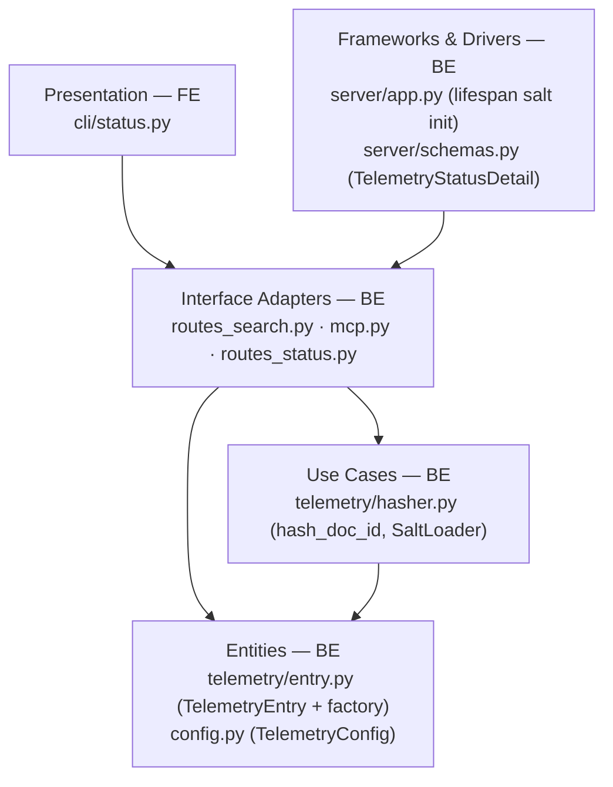
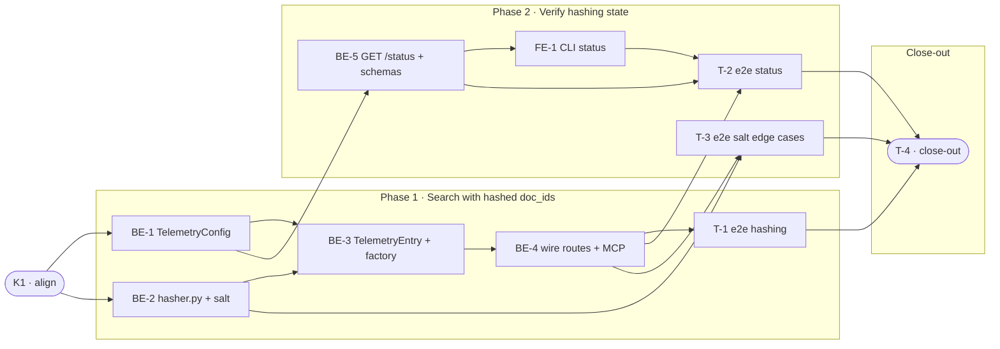

# D8 · Hashed doc_id Mode for Telemetry — Team Plan

**How to read this file**
- **Architecture approach:** Clean Architecture (default). **Layers:** Presentation · Use Cases · Interface Adapters · Entities · Frameworks & Drivers. Each task's first sub-bullet names the layer it touches.
- The **Frontend, Backend, and Tester** sections are the **depth view** — each role's work, grouped by layer.
- The **Task Breakdown** is the **order view** — every task is a single-role checkbox in execution order, opening with a dependency graph.
- **Phases are vertical slices**: each delivers a working end-to-end increment. Sliced with the **`vertical-slicer` skill**.
- Each task carries the **role tag at the end of its title line**, then sub-bullets: **layer · estimate**, **needs · completes**, and a **Tests** block.
- **Tests:** unit and integration tests belong to the implementing dev (test-first); e2e and manual tests are the tester's tasks. Close-out writes no tests.
- **Contracts:** authored as core-construct `.tsp` files (TypeSpec v1.13.0 available; no OpenAPI emit — project has not established an `api-contracts/` pattern). All three contracts compiled clean with `tsp compile --no-emit`.
- **Role tags** (`#frontend-role`, `#backend-role`, `#tester-role`) mark each role-owned section.
- IDs (`S#`, `C#`, `BE-#`/`FE-#`/`T-#`/`K#`, `Q#`) are the traceability thread.
- **Rule:** edit your own tasks freely; change a contract only by team agreement.

---

## Background

When telemetry is enabled, `result_doc_ids` in JSONL logs are SHA-256 hashes of filesystem paths. Because LanceDB stores the same mapping unencrypted, anyone with read access to `~/.archon-search/` can reverse the hash to exact file paths — making the "hash" effectively a lookup table. Operators who share logs or run archon-search on multi-user hosts inadvertently expose their filesystem layout.

---

## Goal

Operators can set `[telemetry] hash_doc_ids = true` in `archon-search.toml` to apply a second-stage HMAC-SHA256 transform to all `result_doc_ids` before they are written to JSONL. The mapping to LanceDB source paths is severed; doc_id uniqueness (for counts and per-document metrics) is preserved. Hashing state is visible in `GET /status` and `archon-search status`.

---

## Scope

### In Scope
- `TelemetryConfig.hash_doc_ids: bool = False` (TOML field, default off)
- Salt lifecycle: generate 32-byte salt on first start (mode 600, log WARNING); load existing; fallback on unreadable (log ERROR, disable hashing for session)
- `hash_doc_id(salt, doc_id) -> str` pure function → 64-char HMAC-SHA256 hex
- `doc_id_hasher: Callable[[str], str] | None` injected into `from_search_tool_result` factory
- `doc_ids_hashed: bool` field added to `TelemetryEntry` and `DOCUMENTED_SCHEMA_FIELDS`
- All 3 `from_search_tool_result` call sites updated: `routes_search.py:268`, `mcp.py:361`, `mcp.py:495`
- `TelemetryStatusDetail` model + `GET /status` `telemetry` sub-object
- `archon-search status` CLI enhanced to display `hash_doc_ids_enabled` (calls GET /status like `maintenance status` does)
- `archon-search.toml.example` updated
- Docs: `150_security_and_privacy_architecture.md`, `CLAUDE.md` telemetry section, ADR-05 amendment, `530_technical_debt_refactoring_roadmap.md` (close SEC-2)
- Tests: unit + integration (dev-owned, test-first); e2e per scenario (tester-owned)

### Out of Scope
- Retroactive re-hashing of existing JSONL entries
- Hashing `doc_id` in the LanceDB store
- Hashing any telemetry field other than `result_doc_ids`
- Salt rotation CLI/API
- `export_enabled` telemetry path
- `--json` flag for `archon-search status` (not established by this feature)

---

## Acceptance criteria
- With `hash_doc_ids = false` (default): JSONL entries contain raw `result_doc_ids` and `doc_ids_hashed: false`; existing deployments are unaffected.
- With `hash_doc_ids = true`: every `result_doc_ids` value in JSONL is a 64-char HMAC-SHA256 hex string; no raw path-derived hash is present; `doc_ids_hashed: true` in every entry.
- Salt file created on first start with `hash_doc_ids = true` (mode 600, WARNING logged); reused on subsequent starts (values stable).
- Salt file unreadable → ERROR logged, server falls back to `hash_doc_ids = false` for the session; server does not crash.
- `GET /status` → `telemetry.hash_doc_ids_enabled: true` when hashing is active, `false` otherwise.
- `archon-search status` displays `hash_doc_ids_enabled` from the server.
- `from_explain_result`, `from_error`, `from_route_response`, and `from_search_multi_result` factories are NOT modified and do NOT receive a hasher.
- MCP `search` and `search_with_context` tools hash doc_ids consistently with the REST endpoint.
- All existing telemetry tests pass; coverage gate passes.

---

## What does NOT change
- `from_search_multi_result`, `from_explain_result`, `from_error`, `from_route_response` factory signatures and behaviour
- The telemetry writer, reader, and pruner (no code changes needed — they use `model_dump` and `model_validate`)
- LanceDB store schema
- The no-raw-query structural invariant in `entry.py`
- Existing JSONL files (not retroactively modified)

---

## Known limitations / accepted trade-offs
- Toggling `hash_doc_ids` (on→off or off→on) breaks metric continuity across log segments — accepted; `doc_ids_hashed` field lets consumers detect the boundary.
- A server restart that reads a new salt (e.g. salt file deleted) also breaks continuity — accepted; a WARNING is logged.
- Salt rotation is deferred to a future iteration.

---

## Approach & architecture

The hasher is a pure function (`hash_doc_id`) housed in a new `archon_search/telemetry/hasher.py` module (Use Cases layer). The salt lifecycle is managed by a `SaltLoader` (also Use Cases) that runs once at lifespan startup and stores the result on `app.state`. Route and MCP handlers construct a `doc_id_hasher` closure if `app.state.salt_bytes` is set, and pass it as an optional keyword argument to `from_search_tool_result`. The factory sets `doc_ids_hashed` on the entry. The Presentation layer (CLI `status` command) reads `GET /status` like the `maintenance status` command already does.

**Layer map**

| Layer | Role | Components |
|-------|------|-----------|
| Presentation | **Frontend** | `archon_search/cli/status.py` |
| Use Cases | Backend | `archon_search/telemetry/hasher.py` (new) |
| Interface Adapters | Backend | `archon_search/server/routes_search.py`, `archon_search/server/mcp.py`, `archon_search/server/routes_status.py` |
| Entities | Backend | `archon_search/telemetry/entry.py`, `archon_search/config.py` |
| Frameworks & Drivers | Backend | `archon_search/server/app.py`, `archon_search/server/schemas.py` |

**What changes**
- `config.py`: `TelemetryConfig` gains `hash_doc_ids: bool = False`; `_apply_toml()` branch added
- `telemetry/hasher.py` (new): `hash_doc_id(salt, doc_id) -> str` + `load_or_create_salt(hash_doc_ids_enabled) -> bytes | None`
- `telemetry/entry.py`: `TelemetryEntry` gains `doc_ids_hashed: bool = False`; `DOCUMENTED_SCHEMA_FIELDS` updated; `from_search_tool_result` gains `doc_id_hasher` param
- `server/app.py`: lifespan calls `load_or_create_salt(config.telemetry.hash_doc_ids)`, stores result on `app.state.salt_bytes`
- `server/routes_search.py:268`: constructs hasher closure and passes it
- `server/mcp.py:361,495`: same
- `server/schemas.py`: new `TelemetryStatusDetail` model added
- `server/routes_status.py`: `_build_telemetry_status()` helper + `telemetry` field in response
- `archon_search/cli/status.py`: enhanced to call `GET /status`, display `hash_doc_ids_enabled`

**Key decisions (from the brief)**
- HMAC-SHA256 over double-SHA256: salt breaks correlation without knowing it
- 64-char output (full HMAC): zero schema friction, no length-validator breaks
- `doc_ids_hashed: bool` in every entry: consumers can distinguish log segments
- `hash_doc_ids_enabled` in GET /status: observable without opening config
- Salt stored on disk (not in TOML): outside config files operators share
- Default off: existing deployments unaffected
- Callable injected into factory (not module-global): keeps factories pure and testable

---

## Contracts / seams

Boundaries where roles must agree. All seams are **internal logical** (no HTTP/API boundary change to factory or hasher — only GET /status gains a new response field). Authored as core-construct TypeSpec (validated clean). No OpenAPI emit (project has not established `api-contracts/` pattern).

**C1 — Salt Lifecycle & hash_doc_id function** *(Use Cases ↔ Interface Adapters)*
`load_or_create_salt(hash_doc_ids_enabled) -> bytes | None` and `hash_doc_id(salt, doc_id) -> str` in `telemetry/hasher.py`. Route/MCP adapters call `load_or_create_salt` once at startup (via lifespan), store result on `app.state.salt_bytes`, and construct a closure `lambda id_: hash_doc_id(app.state.salt_bytes, id_)` per request when salt is non-null. See [`d8-telemetry-hasher.tsp`](d8-telemetry-hasher.tsp).
- Realised by: BE-2, BE-4 · Verified by: BE-2 (unit + integration), T-1 (e2e)

**C2 — TelemetryEntry factory seam** *(Entities ↔ Interface Adapters)*
`from_search_tool_result` gains optional `doc_id_hasher: Callable[[str], str] | None = None`. When provided, applies it to each `result_doc_ids` element and sets `doc_ids_hashed=True`. `doc_ids_hashed: bool = False` added to `TelemetryEntry` model and `DOCUMENTED_SCHEMA_FIELDS`. See [`d8-telemetry-entry.tsp`](d8-telemetry-entry.tsp).
- Realised by: BE-3, BE-4 · Verified by: BE-3 (unit), BE-4 (integration), T-1 (e2e)

**C3 — GET /status response extension** *(Interface Adapters ↔ Presentation)*
`StatusResponse` gains `telemetry: TelemetryStatusDetail | None`. `TelemetryStatusDetail` = `{enabled: bool, hash_doc_ids_enabled: bool}`. Present when telemetry is enabled; null otherwise. `hash_doc_ids_enabled` is true only when both config flag and loaded salt are non-null (guards fallback case). See [`d8-telemetry-status.tsp`](d8-telemetry-status.tsp).
- Realised by: BE-5, FE-1 · Verified by: BE-5 (integration), T-2 (e2e)

---

## Scenarios #tester-role

| id | Scenario (Given / When / Then) |
|----|-------------------------------|
| **S1** | **Given** `hash_doc_ids = false` (default) · **When** a search returns doc_ids · **Then** JSONL entry has raw `result_doc_ids` and `doc_ids_hashed: false` |
| **S2** | **Given** `hash_doc_ids = true` and salt loaded · **When** a search returns N doc_ids · **Then** JSONL entry has N 64-char hex strings in `result_doc_ids` and `doc_ids_hashed: true`; none match the raw SHA-256 of the ingested file paths |
| **S3** | **Given** `hash_doc_ids = true` and no salt file exists · **When** the server starts · **Then** a `.telemetry-salt` file is created with mode 600, a WARNING is logged, and subsequent searches produce hashed entries |
| **S4** | **Given** `hash_doc_ids = true` and salt file already exists · **When** the server restarts · **Then** the same hashed values are produced for the same doc_ids (salt is reused, not regenerated) |
| **S5** | **Given** `hash_doc_ids = true` and the salt file is unreadable (mode 000) · **When** the server starts · **Then** an ERROR is logged, hashing falls back to disabled for the session, JSONL entries have raw doc_ids, and the server does not crash |
| **S6** | **Given** `hash_doc_ids = true` and salt loaded · **When** a search returns `result_doc_ids = None` · **Then** the entry is written normally; no hasher is called; `doc_ids_hashed: false` |
| **S7** | **Given** `hash_doc_ids = true` and salt loaded · **When** a search returns an empty `result_doc_ids` list · **Then** entry has `result_doc_ids: []` and `doc_ids_hashed: true` |
| **S8** | **Given** `hash_doc_ids = true` · **When** multiple concurrent search requests arrive · **Then** all entries have correctly hashed doc_ids with no corruption or data races |
| **S9** | **Given** `hash_doc_ids = true` and salt loaded · **When** an MCP `search` or `search_with_context` call is made · **Then** JSONL entry has hashed doc_ids (same behaviour as REST endpoint) |
| **S10** | **Given** server running with `hash_doc_ids = true` and salt loaded · **When** `GET /status` is called · **Then** response includes `telemetry.hash_doc_ids_enabled: true` |
| **S11** | **Given** server running with `hash_doc_ids = false` · **When** `GET /status` is called · **Then** response includes `telemetry.hash_doc_ids_enabled: false` (or `telemetry: null` if telemetry disabled) |
| **S12** | **Given** `hash_doc_ids = true` · **When** `archon-search status` is run · **Then** output displays `hash_doc_ids_enabled: true` |
| **S13** | **Given** the same salt and the same doc_id · **When** `hash_doc_id()` is called twice · **Then** both calls return the identical 64-char hex string (determinism) |
| **S14** | **Given** the same salt and two different doc_ids · **When** `hash_doc_id()` is called for each · **Then** the two results are distinct (collision resistance at this scale) |
| **S15** | **Given** `ARCHON_SEARCH_DATA_DIR=/custom/path` and `hash_doc_ids = true` · **When** the server starts · **Then** the salt file is created at `/custom/path/.telemetry-salt` (not `~/.archon-search/.telemetry-salt`) |
| **S16** | **Given** `hash_doc_ids = true` · **When** a search goes through `from_explain_result`, `from_error`, or `from_route_response` · **Then** those entries are unaffected — no hasher param, no `doc_ids_hashed` change |

---

## Frontend — Presentation #frontend-role

**Scope:** Enhance `archon_search/cli/status.py` to call `GET /status` (like `maintenance status` does) and display `telemetry.hash_doc_ids_enabled`. No web UI exists; Presentation = CLI.
**Owns layer:** Presentation.

**Tasks** *(checkable in the Task Breakdown)*
- Presentation: FE-1 — Enhance `archon-search status` CLI to display hash_doc_ids_enabled

**Done when**
- [ ] `archon-search status` shows `hash_doc_ids_enabled` from the live server — S12
- [ ] When server is unreachable, status shows service state only (graceful degradation) — S12

---

## Backend — Entities · Use Cases · Adapters · Frameworks #backend-role

**Scope:** All implementation. No web frontend. Writes unit and integration tests test-first for every task.
**Owns layers:** Entities, Use Cases, Interface Adapters, Frameworks & Drivers.

**Tasks by layer** *(checkable in the Task Breakdown)*
- Entities: BE-1 (TelemetryConfig), BE-3 (TelemetryEntry + factory)
- Use Cases: BE-2 (hasher.py — hash_doc_id + salt lifecycle)
- Interface Adapters: BE-4 (wire hasher in routes + MCP), BE-5 (GET /status extension)
- Frameworks & Drivers: BE-2 partially (app.py lifespan salt init), BE-5 partially (schemas.py model)

**Done when**
- [ ] JSONL entries have `doc_ids_hashed: bool` in all code paths — S1, S2
- [ ] With `hash_doc_ids = true`, `result_doc_ids` are HMAC-hashed (64 chars, not raw) — S2
- [ ] Salt file created on first start (mode 600, WARNING); reused on restart — S3, S4
- [ ] Salt unreadable → ERROR + fallback, no crash — S5
- [ ] `result_doc_ids = None` / empty list handled correctly — S6, S7
- [ ] MCP search tools hash consistently with REST — S9
- [ ] `GET /status` includes `telemetry.hash_doc_ids_enabled` — S10, S11
- [ ] `from_explain_result`, `from_error`, `from_route_response` unchanged — S16
- [ ] `hash_doc_id()` is deterministic and collision-resistant at scale — S13, S14
- [ ] `ARCHON_SEARCH_DATA_DIR` override places salt in correct dir — S15

---

## Tester #tester-role

**Scope:** the tester owns **e2e and manual** tests plus the project **close-out**. Unit and integration tests belong to the implementing dev in each task's `Tests` block. Per project mandate: **every scenario must have at least one e2e test; no scenario is manual-only**.

**Tasks** *(checkable in the Task Breakdown)*
- T-1 — e2e: core hashing behaviour (S1–S9, S13, S14, S16)
- T-2 — e2e: status observability (S10–S12)
- T-3 — e2e: salt edge cases and data-dir override (S3–S5, S15)
- T-4 — close-out

**Allocation** — each scenario at the cheapest level that proves it; e2e mandatory per mandate

| Scenario | Cheapest unit/integration level | e2e (mandatory) |
|----------|---------------------------------|-----------------|
| S1 — default off, raw doc_ids | unit (entry factory) | ✓ T-1 |
| S2 — hashing on, HMAC output | unit (hash_doc_id) + integration (routes) | ✓ T-1 |
| S3 — salt generated on first start | integration (lifespan + real file) | ✓ T-3 |
| S4 — salt reused across restarts | integration (lifespan restart sim) | ✓ T-3 |
| S5 — salt unreadable fallback | integration (lifespan with mode-000 file) | ✓ T-3 |
| S6 — result_doc_ids=None | unit (entry factory) | ✓ T-1 |
| S7 — empty result_doc_ids | unit (entry factory) | ✓ T-1 |
| S8 — concurrent requests | integration (ThreadPoolExecutor) | ✓ T-1 |
| S9 — MCP tools hash correctly | integration (mcp.py TestClient) | ✓ T-1 |
| S10 — GET /status hash_doc_ids_enabled=true | integration (TestClient) | ✓ T-2 |
| S11 — GET /status hash_doc_ids_enabled=false | integration (TestClient) | ✓ T-2 |
| S12 — CLI status shows flag | unit (mocked HTTP) + integration | ✓ T-2 |
| S13 — determinism | unit (hash_doc_id) | ✓ T-1 |
| S14 — distinct outputs | unit (hash_doc_id) | ✓ T-1 |
| S15 — data-dir override | integration (env var + tmp_path) | ✓ T-3 |
| S16 — other factories unaffected | unit (factory tests) | ✓ T-1 |

---

## Documentation update

Docs the feature touches — the close-out task works through this list.

- [ ] `Documentation/Backlog/D8-hashed-doc-id-telemetry-brief.md` — no changes needed (source brief; open questions already resolved)
- [ ] `Documentation/Backlog/D8-hashed-doc-id-telemetry-team-plan.md` — this file
- [ ] `Documentation/Backlog/d8-telemetry-hasher.tsp` — this file (contract artefact)
- [ ] `Documentation/Backlog/d8-telemetry-entry.tsp` — this file (contract artefact)
- [ ] `Documentation/Backlog/d8-telemetry-status.tsp` — this file (contract artefact)
- [ ] `archon_search/CLAUDE.md` / `CLAUDE.md` — update telemetry section to describe `hash_doc_ids`, salt file, `doc_ids_hashed` field
- [ ] `Documentation/Architecture/150_security_and_privacy_architecture.md` — remove "accepted risk" caveat for path-leak via `doc_id`; document the HMAC-hashing mode
- [ ] `Documentation/Architecture/530_technical_debt_refactoring_roadmap.md` — close SEC-2
- [ ] `Documentation/ADRs/ADR-05` (or equivalent telemetry ADR) — append "Amendment" section recording that hashed-doc-id mode is implemented (ADRs are append-only)
- [ ] `archon-search.toml.example` — add `hash_doc_ids = false` with explanatory comment
- [ ] `tests/contract/openapi_snapshot.json` — regenerate with `uv run --python 3.12` after BE-5 adds `telemetry` field to StatusResponse

---

## Open questions

All open questions from the brief were resolved before planning. No new unknowns surfaced during investigation.

**Resolved in this revision:**
- Q1 (doc_ids_hashed field): yes — added as `bool = False`, every entry
- Q2 (status observability): yes — `telemetry.hash_doc_ids_enabled` in GET /status
- Q3 (truncation length): 64-char full HMAC output (Option B) — no length validators to break

| id     | Area                    | Question                                                                                                                                                                                                                                                                                 |
| ------ | ----------------------- | ---------------------------------------------------------------------------------------------------------------------------------------------------------------------------------------------------------------------------------------------------------------------------------------- |
| **Q1** | CLI status offline mode | Should `archon-search status` show `[server unavailable]` or omit the telemetry section when the server is unreachable? Current `maintenance status` falls back gracefully — follow the same pattern. **Recommendation: omit telemetry section if server unreachable, don't hard-fail.** |

---

## Task Breakdown

Single-role tasks in execution order, grouped into vertical slices.

### Dependency graph

### Phase 0 · Kickoff

- [ ] **K1** — Agree contracts C1, C2, C3 and scenarios S1–S16 with the team #team
    - — · 1.0h
    - completes C1, C2, C3
    - Tests

---

### Phase 1 · Search with hashed doc_ids *(walking skeleton: operator enables hashing, search writes HMAC doc_ids to JSONL)*

- [ ] **BE-1** — Add `hash_doc_ids: bool = False` to `TelemetryConfig` and TOML parser #backend-role
    - Entities · 1.0h
    - needs K1 · completes C1 (partial)
    - Tests
        - #unit_test — `test_hash_doc_ids_defaults_to_false` — TelemetryConfig() has hash_doc_ids=False
        - #unit_test — `test_hash_doc_ids_parsed_from_toml_true` — `[telemetry] hash_doc_ids = true` sets the field
        - #unit_test — `test_hash_doc_ids_parsed_from_toml_false` — explicit false parses correctly
        - #integration_test — `test_telemetry_config_hash_doc_ids_in_load_config` — full `load_config()` round-trip with the field

- [ ] **BE-2** — Implement `hash_doc_id()` and `load_or_create_salt()` in `archon_search/telemetry/hasher.py` (new file) + wire salt init into `app.py` lifespan #backend-role
    - Use Cases · 3.0h
    - needs K1 · completes C1
    - Tests
        - #unit_test — `test_hash_doc_id_returns_64_char_hex` — output is exactly 64 lowercase hex chars
        - #unit_test — `test_hash_doc_id_deterministic` — same salt + input → same output (S13)
        - #unit_test — `test_hash_doc_id_distinct_inputs` — different doc_ids → different outputs (S14)
        - #unit_test — `test_load_or_create_salt_generates_file` — creates file with mode 600, returns bytes (S3)
        - #unit_test — `test_load_or_create_salt_reuses_existing` — existing file read without regenerating (S4)
        - #unit_test — `test_load_or_create_salt_returns_none_when_disabled` — flag=False → None, no file
        - #unit_test — `test_load_or_create_salt_unreadable_logs_error_and_returns_none` — mode 000 file → None + ERROR logged (S5)
        - #integration_test — `test_app_state_salt_bytes_set_on_startup_with_hashing_enabled` — lifespan sets `app.state.salt_bytes` to bytes when flag=True

- [ ] **BE-3** — Add `doc_ids_hashed: bool = False` to `TelemetryEntry`; update `DOCUMENTED_SCHEMA_FIELDS`; add `doc_id_hasher` param to `from_search_tool_result` #backend-role
    - Entities · 2.0h
    - needs BE-1, BE-2 · completes C2
    - Tests
        - #unit_test — `test_from_search_tool_result_no_hasher_raw_ids_and_false_flag` — no hasher → raw ids, doc_ids_hashed=False (S1)
        - #unit_test — `test_from_search_tool_result_with_hasher_hashes_ids_and_sets_true` — hasher provided → hashed ids, doc_ids_hashed=True (S2)
        - #unit_test — `test_from_search_tool_result_result_doc_ids_none_no_hasher_called` — None ids → doc_ids_hashed=False, no call (S6)
        - #unit_test — `test_from_search_tool_result_empty_list_with_hasher` — [] → [], doc_ids_hashed=True (S7)
        - #unit_test — `test_doc_ids_hashed_in_documented_schema_fields` — "doc_ids_hashed" in DOCUMENTED_SCHEMA_FIELDS
        - #unit_test — `test_other_factories_have_no_doc_id_hasher_param` — from_explain_result, from_error, from_route_response, from_search_multi_result signatures unchanged (S16)
        - #unit_test — `test_doc_ids_hashed_field_defaults_false_in_model` — TelemetryEntry default
        - #integration_test — `test_telemetry_entry_jsonl_round_trip_with_doc_ids_hashed` — entry with doc_ids_hashed=True serialises and deserialises correctly via writer + reader

- [ ] **BE-4** — Wire hasher in `routes_search.py` (line 268) and `mcp.py` (lines 361, 495); add toml.example entry #backend-role
    - Interface Adapters · 2.0h
    - needs BE-3 · completes S2, S8, S9
    - Tests
        - #integration_test — `test_search_endpoint_with_hashing_enabled_writes_hashed_doc_ids` — real app + search → JSONL entry has hashed ids (S2)
        - #integration_test — `test_search_endpoint_with_hashing_disabled_writes_raw_doc_ids` — flag=False → raw ids (S1)
        - #integration_test — `test_mcp_search_tool_with_hashing_enabled_writes_hashed_doc_ids` — MCP search path (S9)
        - #integration_test — `test_mcp_search_with_context_hashing` — MCP search_with_context path (S9)
        - #integration_test — `test_concurrent_search_requests_no_data_corruption` — 10 concurrent searches, all entries have correct doc_ids_hashed (S8)

- [ ] **T-1** — e2e: core hashing behaviour — S1, S2, S6, S7, S8, S9, S13, S14, S16 #tester-role
    - — · 4.0h
    - needs BE-4 · completes S1, S2, S6, S7, S8, S9, S13, S14, S16
    - Tests
        - #e2e_test — `test_e2e_hashing_disabled_raw_doc_ids_in_jsonl` — real server, hashing off, verify JSONL entries contain raw doc_ids and doc_ids_hashed=false (S1)
        - #e2e_test — `test_e2e_hashing_enabled_hmac_doc_ids_in_jsonl` — real server, hashing on, verify 64-char hex, no raw path-derived hash present, doc_ids_hashed=true (S2)
        - #e2e_test — `test_e2e_result_doc_ids_none_entry_written_normally` — search returning None doc_ids, entry present without errors (S6)
        - #e2e_test — `test_e2e_empty_result_doc_ids_with_hashing` — search returning empty list, hashed flag true (S7)
        - #e2e_test — `test_e2e_concurrent_searches_all_entries_consistent` — parallel search calls, all JSONL entries correct (S8)
        - #e2e_test — `test_e2e_mcp_search_hashes_doc_ids` — MCP search tool via real MCP endpoint, verify JSONL hashed (S9)
        - #e2e_test — `test_e2e_hash_doc_id_deterministic_across_requests` — two searches with same doc, verify JSONL shows same hash both times (S13)
        - #e2e_test — `test_e2e_different_docs_different_hashes` — two different docs, verify distinct hashes (S14)
        - #e2e_test — `test_e2e_explain_and_error_entries_unaffected` — explain and error entries have no doc_ids_hashed=true anomaly (S16)

---

### Phase 2 · Verify hashing state *(operator can confirm hashing is active from status)*

- [ ] **BE-5** — Add `TelemetryStatusDetail` to `schemas.py`; add `_build_telemetry_status()` to `routes_status.py`; add `telemetry` field to `StatusResponse` #backend-role
    - Interface Adapters · 2.0h
    - needs BE-1 · completes C3, S10, S11
    - Tests
        - #unit_test — `test_telemetry_status_detail_hash_enabled_when_salt_loaded` — builds detail with hash_doc_ids_enabled=True when salt present
        - #unit_test — `test_telemetry_status_detail_hash_disabled_when_no_salt` — salt=None → hash_doc_ids_enabled=False
        - #unit_test — `test_telemetry_status_null_when_telemetry_disabled` — telemetry.enabled=False → None
        - #integration_test — `test_get_status_telemetry_field_present_with_hashing_on` — real app, flag=True → response.telemetry.hash_doc_ids_enabled=True (S10)
        - #integration_test — `test_get_status_telemetry_field_hash_disabled` — flag=False → hash_doc_ids_enabled=False (S11)
        - #integration_test — `test_openapi_snapshot_reflects_telemetry_field` — GET /openapi.json includes telemetry in StatusResponse schema

- [ ] **FE-1** — Enhance `archon_search/cli/status.py` to call `GET /status` and display `hash_doc_ids_enabled` #frontend-role
    - Presentation · 2.0h
    - needs BE-5 · completes S12
    - Tests
        - #unit_test — `test_status_cli_shows_hash_doc_ids_enabled_true` — mocked GET /status response with hash_doc_ids_enabled=True → output contains flag (S12)
        - #unit_test — `test_status_cli_shows_hash_doc_ids_enabled_false` — flag=False displayed correctly
        - #unit_test — `test_status_cli_graceful_when_server_unreachable` — connection error → service state shown, no crash, telemetry section omitted
        - #integration_test — `test_status_cli_integration_with_real_server` — real server running, status output contains hash_doc_ids_enabled (S12)

- [ ] **T-2** — e2e: status observability — S10, S11, S12 #tester-role
    - — · 2.0h
    - needs BE-5, FE-1 · completes S10, S11, S12
    - Tests
        - #e2e_test — `test_e2e_get_status_hash_doc_ids_enabled_true` — real server with hashing on, GET /status → telemetry.hash_doc_ids_enabled=true (S10)
        - #e2e_test — `test_e2e_get_status_hash_doc_ids_enabled_false` — hashing off → false (S11)
        - #e2e_test — `test_e2e_cli_status_displays_hash_doc_ids_flag` — run archon-search status CLI against real server, verify output contains hash_doc_ids_enabled (S12)

- [ ] **T-3** — e2e: salt lifecycle edge cases and data-dir override — S3, S4, S5, S15 #tester-role
    - — · 3.0h
    - needs BE-2, BE-4 · completes S3, S4, S5, S15
    - Tests
        - #e2e_test — `test_e2e_salt_file_created_on_first_start_with_mode_600` — real tmp data dir, hashing on, server start → .telemetry-salt exists with mode 600 (S3)
        - #e2e_test — `test_e2e_salt_reused_across_server_restarts` — stop and restart server with same data dir → hashed values identical for same doc (S4)
        - #e2e_test — `test_e2e_unreadable_salt_server_falls_back_and_does_not_crash` — set salt file to mode 000 before server start → server starts, hashing disabled, raw doc_ids in JSONL (S5)
        - #e2e_test — `test_e2e_custom_data_dir_salt_in_correct_location` — ARCHON_SEARCH_DATA_DIR=/tmp/custom, hashing on → salt at /tmp/custom/.telemetry-salt (S15)

---

### Phase 3 · Close-out

- [ ] **T-4** — Project close-out & acceptance fact-check #tester-role
    - — · 4.0h
    - needs T-1, T-2, T-3 · completes (acceptance gate)
    - Tests
    - Duties
        - Update all documentation per the "Documentation update" section — 150_security_and_privacy_architecture.md (remove accepted-risk caveat), 530_technical_debt_refactoring_roadmap.md (close SEC-2), ADR-05 (append Amendment), CLAUDE.md telemetry section, archon-search.toml.example, tests/contract/openapi_snapshot.json (regenerate with `uv run --python 3.12`).
        - Fix all build / compiler warnings, if any.
        - Run the full test suite (`uv run pytest`); fix every failing test, including any unrelated to this feature.
        - Validate every Acceptance criterion one-by-one with a fact check — no assumptions; confirm each is genuinely done.

**Critical path:** K1 → BE-1 → BE-3 → BE-4 → T-1 → T-4.
