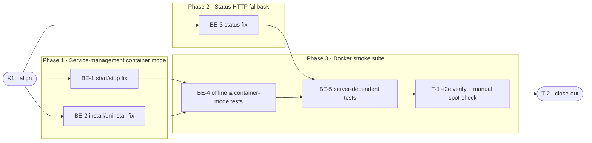

# DCS · Docker CLI Smoke Tests — Task Breakdown

**How to read this file**
- This is the **order view** for [`docker-cli-smoke-tests-team-plan.md`](./docker-cli-smoke-tests-team-plan.md) — every task is a single-role checkbox in execution order, opening with a dependency graph.
- **Phases are vertical slices**: each delivers a working end-to-end increment, not a horizontal layer. No separate "integrate" phase. Sliced with the **`vertical-slicer` skill**.
- Each task carries the **role tag at the end of its title line**, then sub-bullets: **layer · estimate** (decimal hours), **needs · completes**, and a **Tests** block. **needs** = predecessor tasks; **completes** = the scenario `S#` or contract `C#` (from the plan) it makes true.
- **Tests** are tagged by level. **Unit and integration tests belong to the implementing dev** (test-first); **e2e and manual tests are the tester's tasks**. The close-out task writes no tests.
- IDs (`BE-#`/`T-#`/`K#`) are this file's traceability thread; `S#`/`C#`/`Q#` are defined in the plan.
- **Rule:** edit your own tasks freely.

---

## References

- **Plan:** [docker-cli-smoke-tests-team-plan.md](./docker-cli-smoke-tests-team-plan.md) — the full team plan (contracts, scenarios, architecture, allocation). **Always read the plan before you start planning the next task** — it holds the context this file only cites (`S#`/`C#`/`Q#`).
- **Brief:** [docker-cli-smoke-tests-brief.md](./docker-cli-smoke-tests-brief.md) — the source feature brief behind the plan.

---

## Task Breakdown

Single-role tasks in execution order, grouped into **vertical slices**.

### Dependency graph

### Phase 0 · Kickoff

- [ ] **K1** — Agree Contracts C1/C2; verify `SystemdSearchService.status()` already returns `ServiceStatus(running=False)` when systemctl is absent (confirm no change to `archon_search/platform/linux.py` is needed) #team
    - — · 1.0h
    - completes C1, C2
    - Tests

### Phase 1 · Service-management commands handle container mode *(walking skeleton: operator runs `start` in Docker and sees a clean message instead of a traceback)*

- [ ] **BE-1** — Fix `archon_search/cli/start.py` and `archon_search/cli/stop.py`: detect `ARCHON_SEARCH_CONTAINER=1` before calling `_get_service()`, and catch `RuntimeError("systemctl binary not found")` from service calls; emit the clean container-mode message and exit 1 in both cases #backend-role
    - Presentation · 3.0h
    - needs K1 · completes C1, S5, S6, S17
    - Tests
        - #unit_test — `test_start_container_env_emits_clean_message_exits_1` — `ARCHON_SEARCH_CONTAINER=1` set; CliRunner invokes `start`; asserts exact container-mode message on stderr and `exit_code == 1`
        - #unit_test — `test_start_systemctl_absent_emits_clean_message_exits_1` — patches `_get_service().start` to raise `RuntimeError("systemctl binary not found")`; asserts clean message, `exit_code == 1`
        - #unit_test — `test_stop_container_env_emits_clean_message_exits_1` — same pattern for `stop` command with `ARCHON_SEARCH_CONTAINER=1`
        - #unit_test — `test_stop_systemctl_absent_emits_clean_message_exits_1` — patches `_get_service().stop` to raise `RuntimeError("systemctl binary not found")`; asserts clean message, `exit_code == 1`
        - #unit_test — `test_start_native_path_unchanged` — no `ARCHON_SEARCH_CONTAINER`; patches `_get_service().start` to return 0; asserts "archon-search started" in output, `exit_code == 0` (S17 regression guard)
        - #unit_test — `test_stop_native_path_unchanged` — no `ARCHON_SEARCH_CONTAINER`; patches `_get_service().stop` to return 0; asserts "archon-search stopped" in output, `exit_code == 0` (S17 regression guard)

- [ ] **BE-2** — Fix `archon_search/cli/install_cmd.py` `install` and `uninstall` commands: check `ARCHON_SEARCH_CONTAINER=1` before invoking `SearchInstaller.run_register_and_start()` for install; catch `RuntimeError("systemctl binary not found")` in the existing `except Exception` block for uninstall; emit the clean container-mode message and exit 1 in both cases #backend-role
    - Presentation · 2.0h
    - needs K1 · completes C1, S7, S8
    - Tests
        - #unit_test — `test_install_container_env_emits_clean_message_exits_1` — `ARCHON_SEARCH_CONTAINER=1` set; CliRunner invokes `install`; asserts no `SearchInstaller` constructed, clean message on stderr, `exit_code == 1`
        - #unit_test — `test_uninstall_container_env_emits_clean_message_exits_1` — `ARCHON_SEARCH_CONTAINER=1` set; CliRunner invokes `uninstall`; asserts clean message on stderr, `exit_code == 1`
        - #unit_test — `test_uninstall_systemctl_absent_emits_clean_message_exits_1` — patches `_get_service().stop` to raise `RuntimeError("systemctl binary not found")`; asserts clean message, `exit_code == 1`
        - #unit_test — `test_install_native_path_unchanged` — no `ARCHON_SEARCH_CONTAINER`; patches `SearchInstaller` to return 0; asserts success path, `exit_code == 0` (S17 regression guard)

### Phase 2 · Status shows accurate container-mode telemetry

- [ ] **BE-3** — Fix `archon_search/cli/status.py`: detect `ARCHON_SEARCH_CONTAINER=1` and suppress the "stopped" service-section line; leave `_fetch_server_status()` unchanged (it already runs unconditionally) #backend-role
    - Presentation · 2.0h
    - needs K1 · completes C2, S3, S4
    - Tests
        - #unit_test — `test_status_container_mode_suppresses_stopped_when_server_reachable` — `ARCHON_SEARCH_CONTAINER=1`; patches `_get_service().status` to return `ServiceStatus(running=False)`; patches `_fetch_server_status` to return a server payload; asserts "stopped" NOT in output, telemetry IS shown, `exit_code == 0`
        - #unit_test — `test_status_container_mode_no_traceback_when_server_unreachable` — `ARCHON_SEARCH_CONTAINER=1`; patches `_fetch_server_status` to return `None`; asserts no traceback, clean output, `exit_code == 0`
        - #unit_test — `test_status_native_path_unchanged` — no `ARCHON_SEARCH_CONTAINER`; patches `_get_service().status` to return `ServiceStatus(running=False)`; asserts "stopped" IS in output (S17 regression guard)

### Phase 3 · Docker smoke suite guards container CLI regressions

- [ ] **BE-4** — Add `tests/smoke/docker/__init__.py`, `tests/smoke/docker/conftest.py` (with `_docker_env()` helper injecting `ARCHON_SEARCH_CONTAINER=1` into subprocess env), and `tests/smoke/docker/test_docker_cli.py` with offline and container-mode tests; set `pytestmark = pytest.mark.xdist_group("smoke_e2e")` at module level #backend-role
    - Frameworks & Drivers · 3.0h
    - needs BE-1, BE-2 · completes S1, S5, S6, S7, S8, S13, S18
    - Tests
        - #unit_test — `test_docker_dir_has_correct_pytestmark` — reads `tests/smoke/docker/test_docker_cli.py`; asserts `xdist_group("smoke_e2e")` and `@pytest.mark.smoke` are present (structural guard)
        - #integration_test — `test_help_exits_0` — subprocess `archon-search --help`; `returncode == 0`, no traceback (S1)
        - #integration_test — `test_version_exits_0` — subprocess `archon-search --version`; `returncode == 0` (S1)
        - #integration_test — `test_config_show_exits_0` — subprocess `archon-search config show` with isolated `ARCHON_SEARCH_CONFIG`; `returncode == 0`, `"[server]"` in stdout (S13)
        - #integration_test — `test_help_completes_within_5s` — subprocess `archon-search --help` with elapsed measurement; `elapsed < 5.0` (S18)
        - #integration_test — `test_start_emits_clean_container_mode_message` — subprocess `archon-search start` with `_docker_env()`; `returncode == 1`, clean container-mode message in output, no traceback (S5)
        - #integration_test — `test_stop_emits_clean_container_mode_message` — subprocess `archon-search stop` with `_docker_env()`; `returncode == 1`, clean container-mode message in output, no traceback (S6)
        - #integration_test — `test_install_emits_clean_container_mode_message` — subprocess `archon-search install` with `_docker_env()`; `returncode == 1`, clean container-mode message in output, no traceback (S7)
        - #integration_test — `test_uninstall_emits_clean_container_mode_message` — subprocess `archon-search uninstall` with `_docker_env()`; `returncode == 1`, clean container-mode message in output, no traceback (S8)

- [ ] **BE-5** — Extend `tests/smoke/docker/test_docker_cli.py` with server-dependent tests using the `smoke_server` fixture from [`tests/smoke/conftest.py`](../smoke/conftest.py) #backend-role
    - Frameworks & Drivers · 4.0h
    - needs BE-3, BE-4 · completes S2, S3, S4, S9, S10, S11, S12, S14, S15, S16
    - Tests
        - #integration_test — `test_serve_health_and_ready` — asserts `smoke_server.base_url` is reachable via `GET /health` and `GET /ready`; proves `serve` starts and stops cleanly in the container (S2)
        - #integration_test — `test_status_with_server_shows_http_telemetry` — subprocess `archon-search status --api-url <smoke_server.base_url> --api-key <key>` with `_docker_env()`; `returncode == 0`, "stopped" NOT in output, at least one telemetry field present (S3)
        - #integration_test — `test_status_without_server_shows_not_reachable` — subprocess `archon-search status --api-url <dead-port>` with `_docker_env()`; `returncode == 0`, no traceback, server-unreachable path taken (S4)
        - #integration_test — `test_key_list_exits_0` — subprocess `archon-search key list --api-url ... --api-key ...`; `returncode == 0` (S9)
        - #integration_test — `test_collection_list_exits_0` — subprocess `archon-search collection list` with `ARCHON_SEARCH_DATA_DIR=smoke_server.data_dir`; `returncode == 0`, "smoke" in output (S10)
        - #integration_test — `test_collection_add_wait_completes` — subprocess `archon-search collection add <tmp_dir> --wait --api-url ... --api-key ...`; `returncode == 0`, "ingested successfully." in stdout (S11)
        - #integration_test — `test_collection_info_exits_0` — subprocess `archon-search collection info smoke --api-url ... --api-key ...`; `returncode == 0`, "name: smoke" in stdout (S12)
        - #integration_test — `test_ingest_wait_completes` — subprocess `archon-search ingest --path <tmp_file> --collection smoke --wait --api-url ... --api-key ...`; `returncode == 0`, "Ingest complete for 'smoke'." in stdout (S14)
        - #integration_test — `test_jobs_status_reports_status` — submit reindex job via REST, poll to terminal, subprocess `archon-search jobs status <id> --api-url ... --api-key ...`; `returncode == 0`, "status:     DONE" in stdout (S15)
        - #integration_test — `test_maintenance_run_exits_0` — subprocess `archon-search maintenance run --api-url ... --api-key ...`; `returncode == 0` (S16)

- [ ] **T-1** — Verify the Docker smoke suite runs end-to-end inside the container; manual telemetry spot-check #tester-role
    - — · 3.0h
    - needs BE-4, BE-5 · completes S1, S2, S3, S4, S5, S6, S7, S8, S9, S10, S11, S12, S13, S14, S15, S16, S18
    - Tests
        - #e2e_test — `test_docker_smoke_suite_exits_0` — `docker compose run --rm archon-test-runner uv run pytest tests/smoke/docker/ --no-cov`; full suite exits 0, all S1–S16 and S18 scenarios covered
        - #manual_test — Telemetry output comparison — run `docker compose run --rm archon-test-runner archon-search status --api-url <url> --api-key <key>` and confirm the HTTP-fallback telemetry section matches native `archon-search status` output; verify "stopped" does not appear in Docker output (non-automatable: cross-environment output comparison requires human judgment on layout completeness)

### Phase 4 · Close-out

- [ ] **T-2** — Project close-out & acceptance fact-check #tester-role
    - — · 3.0h
    - needs BE-1, BE-2, BE-3, BE-4, BE-5, T-1 · completes (acceptance gate)
    - Tests
    - Duties
        - Update all documentation per [docker-cli-smoke-tests-team-plan.md](./docker-cli-smoke-tests-team-plan.md)'s "Documentation update" section — [08_running_with_docker.md](../UserManual/08_running_with_docker.md) (add CLI-in-Docker section: what works, clean service-command message, status HTTP fallback), [docker-test-runner.md](../docker-test-runner.md) (add `tests/smoke/docker/` section), [200_testing_strategy.md](../Architecture/200_testing_strategy.md) (note `tests/smoke/docker/` under smoke-test section), [C9-container-support-plan.md](../Completed/C9-container-support-plan.md) (update status to Done per Q5 resolution), [CLAUDE.md](../../CLAUDE.md) (verify smoke section covers `tests/smoke/docker/` subdirectory).
        - Fix all build / compiler warnings, if any.
        - Run the full test suite; fix every failing test, including any unrelated to this feature.
        - Validate every Acceptance criterion one-by-one (from the plan) with a fact check — no assumptions; confirm each is genuinely done.

**Critical path:** K1 → BE-1 → BE-4 → BE-5 → T-1 → T-2. BE-2 and BE-3 run in parallel with BE-1 after K1 and unblock their respective downstream tasks.
