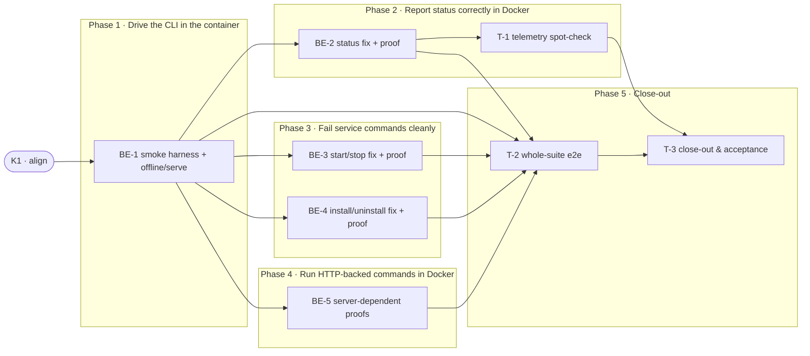

# DCS · Docker CLI Smoke Tests — Task Breakdown

**How to read this file**
- This is the **order view** for [docker-cli-smoke-tests-team-plan.md](./docker-cli-smoke-tests-team-plan.md) — every task is a single-role checkbox in execution order, opening with a dependency graph.
- **Phases are vertical slices**: each delivers a working end-to-end increment (the CLI fix **and** its Docker proof in the same slice), not a horizontal layer. No separate "integrate" phase. Sliced with the **`vertical-slicer` skill**.
- Each task carries the **role tag at the end of its title line**, then sub-bullets: **layer · estimate** (decimal hours), **needs · completes**, and a **Tests** block. **needs** = predecessor tasks; **completes** = the scenario `S#` or contract `C#` (from the plan) it makes true.
- **Tests** are tagged by level. **Unit and integration tests belong to the implementing dev** (test-first) — the Docker subprocess smoke tests are integration-level and backend-owned; **e2e and manual tests are the tester's tasks** (the container-orchestrated `docker compose run` whole-suite proof + the telemetry spot-check). The close-out task writes no tests.
- IDs (`BE-#`/`T-#`/`K#`) are this file's traceability thread; `S#`/`C#`/`Q#` are defined in the plan.
- This feature has **no web frontend** — the CLI Presentation layer is backend-owned, so there are no `FE-#` tasks.
- **Rule:** edit your own tasks freely.

---

## References

- **Plan:** [docker-cli-smoke-tests-team-plan.md](./docker-cli-smoke-tests-team-plan.md) — the full team plan (contracts, scenarios, architecture, allocation). **Always read the plan before you start planning the next task** — it holds the context this file only cites (`S#`/`C#`/`Q#`).
- **Brief:** [docker-cli-smoke-tests-brief.md](./docker-cli-smoke-tests-brief.md) — the source feature brief behind the plan.
- **Contract:** [service-lifecycle.tsp](./service-lifecycle.tsp) — the C1 logical seam (CLI ↔ platform service).

---

## Task Breakdown

Single-role tasks in execution order, grouped into **vertical slices**. Every functional slice pairs the code fix with the Docker integration test that proves it inside the container.

### Dependency graph

### Phase 0 · Kickoff *(prerequisite; the one cross-cutting step)*
- [x] **K1** — Agree Contracts C1/C2; verify `SystemdSearchService.status()` already returns `ServiceStatus(running=False)` when systemctl is absent (confirm no change to [linux.py](../../archon_search/platform/linux.py) is needed) #team
    - — · 1.0h
    - completes C1 (status-path invariant — agreed, no code change needed), C2 (agreed — code change in BE-2)
    - Tests — None new; C1 status-path proven by existing `test_status_returns_stopped_on_exception` (tests/test_service_linux.py)

### Phase 1 · Drive the CLI in the container *(walking skeleton: stand up the Docker smoke harness — the foundation every later slice's proof reuses — and prove the thinnest end-to-end path, a CLI command running inside the real container)*
- [x] **BE-1** — Scaffold `tests/smoke/docker/` (`__init__.py`, `conftest.py` with a `_docker_env()` helper injecting `ARCHON_SEARCH_CONTAINER=1` into the subprocess env, and a self-contained `serve` subprocess fixture mirroring [tests/smoke/conftest.py](../../tests/smoke/conftest.py)); add the offline + serve-lifecycle tests to `test_docker_cli.py`; set `@pytest.mark.smoke` + `pytestmark = pytest.mark.xdist_group("smoke_e2e")` at module level #backend-role
    - Frameworks & Drivers · 3.0h
    - needs K1 · completes S1, S2, S13, S18
    - Tests
        - #unit_test — `test_docker_module_has_correct_markers` — reads `tests/smoke/docker/test_docker_cli.py`; asserts `xdist_group("smoke_e2e")` and `@pytest.mark.smoke` are present (structural guard)
        - #integration_test — `test_help_exits_0` — subprocess `archon-search --help`; `returncode == 0`, no traceback (S1)
        - #integration_test — `test_version_exits_0` — subprocess `archon-search --version`; `returncode == 0` (S1)
        - #integration_test — `test_config_show_exits_0` — subprocess `archon-search config show` with isolated `ARCHON_SEARCH_CONFIG`; `returncode == 0`, `"[server]"` in stdout, no server required (S13)
        - #integration_test — `test_help_completes_within_5s` — subprocess `archon-search --help` with elapsed measurement; `elapsed < 5.0` (advisory) (S18)
        - #integration_test — `test_serve_health_and_ready` — bring up the `serve` fixture; assert `GET /health` and `GET /ready` reachable, then clean SIGTERM shutdown (S2)

### Phase 2 · Report status correctly in Docker *(the marquee fix ships with its container proof: `status` shows real HTTP telemetry instead of a misleading "stopped")*
- [ ] **BE-2** — Fix [status.py](../../archon_search/cli/status.py): detect `ARCHON_SEARCH_CONTAINER=1` and suppress the `"stopped"` service-section line; `_fetch_server_status()` already runs unconditionally at [status.py:231](../../archon_search/cli/status.py). Extend `test_docker_cli.py` with the status-in-container proof #backend-role
    - Presentation · 3.5h
    - needs K1, BE-1 · completes C2, S3, S4
    - Tests
        - #unit_test — `test_status_container_mode_suppresses_stopped_when_reachable` — env set; `_get_service().status()` → `ServiceStatus(running=False)`; `_fetch_server_status` → payload; "stopped" NOT in output, telemetry shown, `exit_code == 0`
        - #unit_test — `test_status_container_mode_no_traceback_when_unreachable` — env set; `_fetch_server_status` → `None`; no traceback, clean output, `exit_code == 0` (S4)
        - #unit_test — `test_status_native_path_unchanged` — env unset; `ServiceStatus(running=False)` → "stopped" IS printed (S17 regression guard)
        - #integration_test — `test_status_with_server_shows_http_telemetry` — subprocess `status --api-url <smoke_server.base_url> --api-key <key>` with `_docker_env()`; `returncode == 0`, "stopped" absent, ≥1 telemetry field present (S3)
        - #integration_test — `test_status_without_server_shows_not_reachable` — subprocess `status --api-url <dead-port>` with `_docker_env()`; `returncode == 0`, no traceback, unreachable path taken (S4)
- [ ] **T-1** — Spot-check that the container `status` HTTP-fallback telemetry matches the native telemetry section #tester-role
    - — · 1.5h
    - needs BE-2 · completes S3
    - Tests
        - #e2e_test — `test_docker_status_telemetry_matches_native_fields` — companion automating the parity path: assert every telemetry field the native `status` section prints is present in the container `status` output and that "stopped" is absent
        - #manual_test — Telemetry output comparison — run `docker compose run --rm archon-test-runner archon-search status --api-url <url> --api-key <key>` and eyeball that the HTTP-fallback telemetry section reads the same as native `archon-search status` (layout/completeness human spot-check; field-presence is automated by the companion e2e above)

### Phase 3 · Fail service commands cleanly in Docker *(each service-command fix ships with its container proof: one actionable message, exit 1, no traceback)*
- [ ] **BE-3** — Fix [start.py](../../archon_search/cli/start.py) and [stop.py](../../archon_search/cli/stop.py): short-circuit on `ARCHON_SEARCH_CONTAINER=1` and catch `RuntimeError("systemctl binary not found")` from `_get_service().start()`/`.stop()`; emit the container-mode message + exit 1. Extend `test_docker_cli.py` with the start/stop proofs #backend-role
    - Presentation · 3.5h
    - needs K1, BE-1 · completes C1, S5, S6, S17
    - Tests
        - #unit_test — `test_start_container_env_emits_clean_message_exits_1` — `ARCHON_SEARCH_CONTAINER=1`; CliRunner invokes `start`; exact container-mode message on stderr, `exit_code == 1` (S5)
        - #unit_test — `test_start_systemctl_absent_emits_clean_message_exits_1` — patches `_get_service().start` to raise `RuntimeError("systemctl binary not found")`; clean message, `exit_code == 1`
        - #unit_test — `test_stop_container_env_emits_clean_message_exits_1` — same pattern for `stop` (S6)
        - #unit_test — `test_start_native_path_unchanged` — env unset; `_get_service().start` → 0; "archon-search started", `exit_code == 0` (S17 regression guard)
        - #integration_test — `test_start_emits_clean_container_mode_message` — subprocess `archon-search start` with `_docker_env()`; `returncode == 1`, clean message, no traceback (S5)
        - #integration_test — `test_stop_emits_clean_container_mode_message` — subprocess `archon-search stop` with `_docker_env()`; `returncode == 1`, clean message, no traceback (S6)
- [ ] **BE-4** — Fix [install_cmd.py](../../archon_search/cli/install_cmd.py): check `ARCHON_SEARCH_CONTAINER=1` before calling `SearchInstaller.run_register_and_start()` ([install.py:2550](../../archon_search/install.py)) for `install`, and catch `RuntimeError("systemctl binary not found")` in `uninstall`'s existing `except Exception`; emit the container-mode message + exit 1. Extend `test_docker_cli.py` with the install/uninstall proofs #backend-role
    - Presentation · 2.5h
    - needs K1, BE-1 · completes C1, S7, S8
    - Tests
        - #unit_test — `test_install_container_env_emits_clean_message_exits_1` — env set; no `SearchInstaller` constructed, clean message, `exit_code == 1` (S7)
        - #unit_test — `test_uninstall_container_env_emits_clean_message_exits_1` — env set; clean message, `exit_code == 1` (S8)
        - #unit_test — `test_uninstall_systemctl_absent_emits_clean_message_exits_1` — patches `_get_service().stop` to raise `RuntimeError("systemctl binary not found")`; clean message, `exit_code == 1`
        - #unit_test — `test_install_native_path_unchanged` — env unset; `SearchInstaller` patched → 0; success path, `exit_code == 0` (S17 regression guard)
        - #integration_test — `test_install_emits_clean_container_mode_message` — subprocess `archon-search install` with `_docker_env()`; `returncode == 1`, clean message, no traceback (S7)
        - #integration_test — `test_uninstall_emits_clean_container_mode_message` — subprocess `archon-search uninstall` with `_docker_env()`; `returncode == 1`, clean message, no traceback (S8)

### Phase 4 · Run HTTP-backed commands in Docker *(the read/write CLI surface works against a server inside the container — no production code change; the suite guards it)*
- [ ] **BE-5** — Extend `test_docker_cli.py` with server-dependent proofs driving the HTTP-backed commands against the `smoke_server` fixture #backend-role
    - Frameworks & Drivers · 4.0h
    - needs K1, BE-1 · completes S9, S10, S11, S12, S14, S15, S16
    - Tests
        - #integration_test — `test_key_list_exits_0` — subprocess `key list --api-url ... --api-key ...`; `returncode == 0` (S9)
        - #integration_test — `test_collection_list_exits_0` — subprocess `collection list` with `ARCHON_SEARCH_DATA_DIR=smoke_server.data_dir`; `returncode == 0`, "smoke" in output (S10)
        - #integration_test — `test_collection_add_wait_completes` — subprocess `collection add <tmp_dir> --wait --api-url ... --api-key ...`; `returncode == 0`, "ingested successfully." in stdout (S11)
        - #integration_test — `test_collection_info_exits_0` — subprocess `collection info smoke --api-url ... --api-key ...`; `returncode == 0`, "name: smoke" in stdout (S12)
        - #integration_test — `test_ingest_wait_completes` — subprocess `ingest --path <tmp_file> --collection smoke --wait --api-url ... --api-key ...`; `returncode == 0`, "Ingest complete for 'smoke'." in stdout (S14)
        - #integration_test — `test_jobs_status_reports_status` — submit a reindex job via REST, poll to terminal, subprocess `jobs status <id> --api-url ... --api-key ...`; `returncode == 0`, "status:     DONE" in stdout (S15)
        - #integration_test — `test_maintenance_run_exits_0` — subprocess `maintenance run --api-url ... --api-key ...`; `returncode == 0` (S16)

### Phase 5 · Close-out
- [ ] **T-2** — Whole-feature e2e: run the Docker smoke suite through the container orchestration and confirm every scenario holds inside the real image #tester-role
    - — · 2.0h
    - needs BE-1, BE-2, BE-3, BE-4, BE-5 · completes S1, S2, S3, S4, S5, S6, S7, S8, S9, S10, S11, S12, S13, S14, S15, S16, S18
    - Tests
        - #e2e_test — `test_docker_smoke_suite_exits_0` — `docker compose run --rm archon-test-runner uv run pytest tests/smoke/docker/ --no-cov`; the full suite exits 0 inside the container, covering S1–S16 and S18
- [ ] **T-3** — Project close-out & acceptance fact-check #tester-role
    - — · 3.0h
    - needs T-1, T-2 · completes (acceptance gate)
    - Tests
    - Duties
        - Update all documentation per [docker-cli-smoke-tests-team-plan.md](./docker-cli-smoke-tests-team-plan.md)'s "Documentation update" section — [08_running_with_docker.md](../UserManual/08_running_with_docker.md) (add CLI-in-Docker section: what works, the clean service-command message, the status HTTP fallback), [docker-test-runner.md](../docker-test-runner.md) (add a `tests/smoke/docker/` section), [200_testing_strategy.md](../Architecture/200_testing_strategy.md) (note `tests/smoke/docker/` under the smoke-test section), [C9-container-support-plan.md](../Completed/C9-container-support-plan.md) (update status to Done per the Q5 resolution), [CLAUDE.md](../../CLAUDE.md) (verify the smoke section covers the `tests/smoke/docker/` subdirectory).
        - Fix all build / compiler warnings, if any (zero pytest warnings under the project's `-W` config).
        - Run the full test suite; fix every failing test, including any unrelated to this feature.
        - Validate every Acceptance criterion in the plan one-by-one with a fact check — no assumptions; confirm each is genuinely done.

**Critical path:** K1 → BE-1 → BE-5 → T-2 → T-3. The status and service-command fixes (BE-2, BE-3, BE-4) run in parallel behind BE-1 (each needs the harness for its integration proof); T-1's spot-check runs alongside once BE-2 lands.
