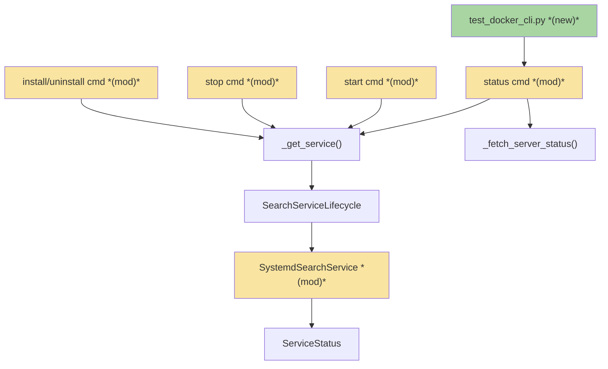
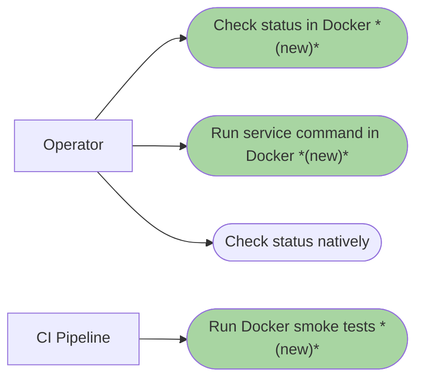
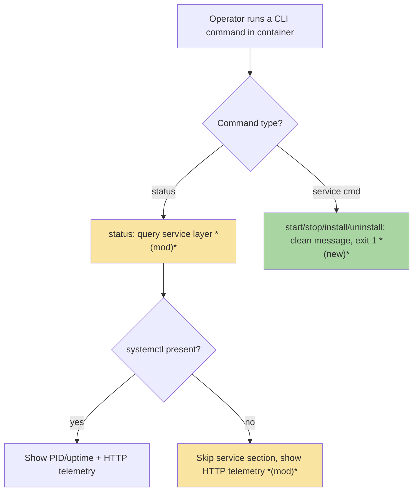
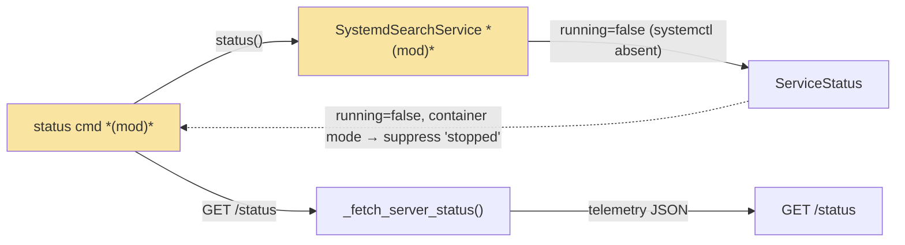
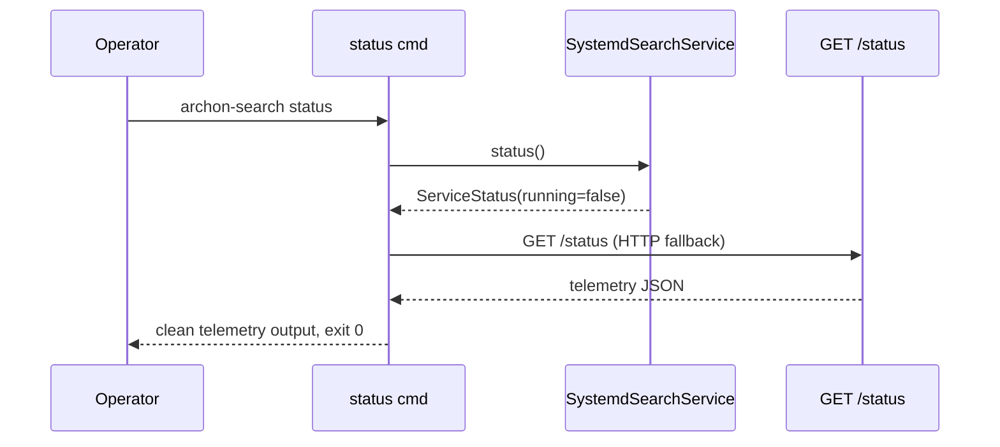

# DCS · Docker CLI Smoke Tests — Team Plan

**How to read this file**
- **Architecture approach:** Clean Architecture. **Layers:** Presentation · Use Cases · Interface Adapters · Entities · Frameworks & Drivers.
- The **Frontend, Backend, and Tester** sections are the **depth view** — each role's scope, grouped by layer.
- **Contracts** are logical. This feature has one internal logical seam (CLI ↔ platform service), authored as a core-construct `.tsp` file — no HTTP/API seam, so no OpenAPI.
- **Role tags** (`#frontend-role`, `#backend-role`, `#tester-role`) mark each role-owned section — filter a tag (e.g. in Obsidian) to see one role's whole scope.
- IDs (`S#` scenarios, `C#` contracts, `Q#` questions) are the traceability thread; search the file for an ID to find where it's defined.
- **Tasks** are not in this file — task breakdown is a separate downstream step that consumes this plan.
- **Rule:** change a contract only by team agreement.

---

## Background

Running `start`/`stop`/`install`/`uninstall` inside a Docker container produces raw Python tracebacks. `SystemdSearchService` (`linux.py`) already catches `FileNotFoundError` from `systemctl` and re-raises it as `RuntimeError("systemctl binary not found")`; the CLI command layer lets this `RuntimeError` propagate uncaught, becoming a traceback. `status` does NOT crash: `SystemdSearchService.status()` wraps its entire body in `try/except Exception` and already returns `ServiceStatus(running=False)` when systemctl is absent — but it prints `"stopped"` even when the server IS running via `archon-search serve`, because the service section has no container-mode awareness. No tests run inside Docker, so this class of container-specific regression is invisible to CI.

---

## Goal

Every CLI command works correctly inside Docker: service-management commands (`start`, `stop`, `install`, `uninstall`) emit a clear, actionable message and exit 1 instead of crashing; `status` falls back to the HTTP `/status` endpoint when systemctl is absent and shows the same telemetry as native; and a new smoke-test suite under `tests/smoke/docker/` runs inside the container and fails on any regression. Native Linux service management is unchanged.

---

## Scope

### In Scope
- New `tests/smoke/docker/` directory with `test_docker_cli.py` (and `conftest.py` / `__init__.py` as needed)
- Tests spawn `archon-search serve` inside the container and exercise every CLI command group listed below
- Fix `archon_search/cli/start.py`, `cli/stop.py`, `cli/install_cmd.py` (including `SearchInstaller.run_register_and_start()`): catch `RuntimeError` whose message indicates `systemctl` is absent and emit the clean container-mode message + exit 1. (`linux.py` already catches `FileNotFoundError` and converts it to `RuntimeError("systemctl binary not found")` — the fix belongs at the CLI layer, not the platform layer.)
- Fix `archon_search/cli/status.py`: when container mode is active (`ARCHON_SEARCH_CONTAINER=1` or no systemctl), suppress the `"stopped"` service-section line. `_fetch_server_status()` already runs unconditionally after the service section — no new HTTP call is needed, only the misleading `"stopped"` output is removed.
- Clean container-mode message for `start`/`stop`/`install`/`uninstall`: `"Service management is not available in container mode. Use 'archon-search serve' to run the server."`
- Container detection: `ARCHON_SEARCH_CONTAINER=1` is the primary signal (already set in the Docker image); catching `RuntimeError("systemctl binary not found")` at the CLI layer is the safety net for edge-case installs
- Commands covered by smoke tests, classified by server dependency:

  | Command | Server needed? | Notes |
  |---------|---------------|-------|
  | `--help`, `--version` | no (offline) | |
  | `config show` | no (offline) | reads local TOML only |
  | `serve` | n/a (IS the server) | |
  | `status` | yes (read-HTTP) | HTTP fallback for telemetry |
  | `key list` | yes (read-HTTP) | |
  | `collection list` | yes (read-HTTP) | |
  | `collection info` | yes (read-HTTP) | |
  | `jobs status <id>` | yes (read-HTTP) | |
  | `collection add --wait` | yes (write-HTTP-async) | use `--wait`; tests job completion |
  | `ingest --wait` | yes (write-HTTP-async) | use `--wait`; tests job completion |
  | `maintenance run` | yes (write-HTTP-async) | |
  | `start`, `stop`, `install`, `uninstall` | no | container-mode message + exit 1 |

### Out of Scope
- `wizard` container-mode behavior — separate brief
- Windows or macOS container scenarios — those platforms don't run this image
- CI pipeline wiring — tests run locally and manually in CI for now; hooking into the release workflow is a follow-up
- GPU image variant — the fix is platform-level, not image-variant-level

---

## Acceptance criteria
- `--help` and `--version` complete without error inside the container, exit 0
- `serve` starts and shuts down cleanly inside the container
- `status` with server running and systemctl absent shows full HTTP telemetry (collections, jobs, graph GC), exit 0, no traceback
- `status` with server not running and systemctl absent shows "server not reachable" via the existing ConnectError path, exit 0, no traceback
- `start`/`stop`/`install`/`uninstall` in container mode print the clean container-mode message and exit 1 — no traceback
- HTTP-based commands (`key list`, `collection list`, `collection add --wait`, `collection info`, `ingest --wait`, `jobs status`, `maintenance run`) work inside the container; `config show` works offline (reads local TOML, no server required)
- `collection add` and `ingest` smoke tests use `--wait` to assert job completion, not just submission
- Native Linux service management does not regress: when `systemctl` is present, behavior is unchanged
- `tests/smoke/docker/` runs via `docker compose run archon-test-runner uv run pytest tests/smoke/docker/ --no-cov` and passes
- `--help` completes within 5s (advisory; wall-clock in an unloaded container, not a hard CI gate)
- All tests pass with zero pytest warnings (as defined by the project's existing `-W` config in `pyproject.toml`)
- New test files carry `@pytest.mark.smoke` and `pytestmark = pytest.mark.xdist_group("smoke_e2e")` — required for correct exclusion from default runs and serialization with other smoke tests

---

## What does NOT change
- `ServiceStatus` dataclass shape (`running`, `pid`, `uptime_seconds`) — same type returned, only the exception path changes
- `SearchServiceLifecycle` ABC method signatures
- `_get_service()` platform-detection logic in `_helpers.py` (Linux still returns `SystemdSearchService`)
- `serve` command — already container-aware, foreground-only, never touches systemd
- `GET /status` and `GET /jobs` HTTP endpoints — already support the container fallback path; no contract change
- `pyproject.toml` markers — `smoke` marker and `norecursedirs` cover the new subdirectory; no config change needed
- Native Linux behavior when `systemctl` is present

---

## Known limitations / accepted trade-offs
- `start`/`stop`/`install`/`uninstall` in container mode are an explicit clean error, not a silent no-op — these commands are genuinely meaningless in a container
- Detection is dual (env var + exception catch) rather than a single mechanism — intentional, for both efficiency and robustness on edge-case installs without systemd
- Docker smoke tests reuse the `smoke` marker rather than a new `docker` marker — avoids a `pyproject.toml` change for no added value

---

## Approach & architecture

The change is a bug fix plus a regression-test suite, structured in **Clean Architecture** terms: the platform-service seam (Interface Adapters ↔ Frameworks & Drivers) stops leaking OS errors, and the Presentation layer (CLI commands) gains explicit container-mode handling.

### Architecture

| Component | Change | Why |
|-----------|--------|-----|
| `SystemdSearchService` (`platform/linux.py`) | **no change** | Already catches `FileNotFoundError` and converts it to `RuntimeError`; `status()` already wraps all calls in `try/except Exception` and returns `ServiceStatus(running=False)` |
| `status` command (`cli/status.py`) | modified | Detect container mode (`ARCHON_SEARCH_CONTAINER=1`); suppress the `"stopped"` service-section line. `_fetch_server_status()` already runs unconditionally after the service section — no new HTTP call needed |
| `start` command (`cli/start.py`) | modified | Catch `RuntimeError` from `_get_service().start()` when it indicates missing systemctl; emit clean container-mode message and exit 1 |
| `stop` command (`cli/stop.py`) | modified | Catch `RuntimeError` from `_get_service().stop()`; emit clean container-mode message and exit 1 |
| `install` command — `SearchInstaller.run_register_and_start()` (`install.py`) | modified | Detect container mode before calling `SearchInstaller`; emit clean container-mode message and exit 1 without invoking the installer |
| `uninstall` command (`cli/install_cmd.py`) | modified | Catch `RuntimeError` from `_get_service().stop()`/`.unregister()`; emit clean container-mode message and exit 1 |
| `test_docker_cli.py` (`tests/smoke/docker/`) | new | Subprocess smoke tests for every CLI command inside the container |

_The three new test files (`test_docker_cli.py`, `conftest.py`, `__init__.py`) are one logical addition — the Docker smoke suite. `ServiceStatus`, `SearchServiceLifecycle`, `_get_service()`, and `_fetch_server_status()` are unchanged._

**Layer map (and role mapping)**

| Layer | Role | Components |
|-------|------|-----------|
| Presentation | Backend (CLI) | `status`, `start`, `stop`, `install`/`uninstall` commands |
| Use Cases | Backend | container-mode detection · HTTP fallback selection |
| Interface Adapters | Backend | `SearchServiceLifecycle` ABC, `_get_service()`, `_fetch_server_status()` |
| Entities | Backend | `ServiceStatus` |
| Frameworks & Drivers | Backend | `SystemdSearchService` (systemctl subprocess) |

_This feature has no web frontend. The CLI Presentation layer is backend-owned._

**What changes**
- `SystemdSearchService` stops leaking OS errors across the service seam — missing `systemctl` becomes a safe status or a clean failure, not a traceback.
- The `status` command becomes explicit about its two-phase structure: service-layer query first, HTTP `/status` fallback when the service layer yields nothing.
- `start`/`stop`/`install`/`uninstall` detect container mode and print one actionable message.
- A new Docker smoke suite drives every command via subprocess inside the container and asserts clean output and correct exit codes.

**Key decisions (from the brief, fixed for v1)**
- **TDD:** tests written first, confirmed failing, then the fix applied — genuine regression guards.
- **HTTP fallback for `status`, clean error for the rest:** only `status` has a meaningful Docker equivalent (the running server's `/status`); the others are meaningless in a container.
- **Dual detection:** `ARCHON_SEARCH_CONTAINER=1` (already set in the Docker image at `Dockerfile:107`) is the primary signal. Catching `RuntimeError("systemctl binary not found")` at the CLI layer is the safety net for edge-case installs where the env var is absent but systemctl is missing. Note: `linux.py` already catches `FileNotFoundError` and converts it to `RuntimeError` — the CLI catches `RuntimeError`, not `FileNotFoundError` directly.
- **Tests live in `tests/smoke/docker/`,** follow the existing smoke pattern (`xdist_group("smoke_e2e")`, excluded from default runs), and run *inside* the container calling `archon-search` directly.

### Actors & Use Cases

### Flows

#### User Flow

#### Data Flow

#### Sequence

### Prior decisions

| Decision | Rationale | Constraint |
|---|---|---|
| Single-process, self-contained deployment model (ADR-01) | Ships as a simple package with zero external dependencies; local-first | The Docker container must respect this invariant — `serve` is the execution unit inside containers; service management (`systemctl`/`launchd`) does not exist there and must gracefully degrade or be explicitly unavailable |
| Opt-in, local-only telemetry; no raw query logging (ADR-05) | Operators expect privacy for potentially sensitive query text; structural invariant | CLI smoke-test error output must not include raw input or query details; tests verify clean, non-traceback output |

_ADR-06 (durable writes), ADR-02 (fastembed), ADR-10 (CoreML split providers) were reviewed; their constraints are already satisfied by existing code and impose no new work here. No ADR directly governs container CLI behavior — see Q5._

### Contradictions

**Brief vs. reality**

| Contradiction | Brief assumes | Reality | Owner |
|---|---|---|---|
| C9 completion status | Brief (line 66) treats C9 container support as "marked complete" while container CLI behavior was incomplete | `Documentation/Completed/C9-container-support-plan.md` has status header `To Do` (line 5), despite living in the `Completed/` directory | open question — see Q5 |

*Action:* Team decides whether this feature completes C9's container-CLI scope and whether to update C9's status header. Tracked as Q5; the C9 doc is listed in the Documentation update section.

---

## Contracts / seams

Boundaries where roles must agree. **Logical, not code.** Authored as a core-construct TypeSpec file (validated with `tsp compile --no-emit`, TypeSpec v1.13.0) — no HTTP/API seam, so no OpenAPI. Changing one requires team agreement.

**C1 — Service lifecycle status query**  *(Interface Adapters ↔ Frameworks & Drivers)*
The `status()` method on `SearchServiceLifecycle` **already never raises** when systemctl is absent — `SystemdSearchService.status()` wraps its body in `try/except Exception` and returns `ServiceStatus(running=False, pid=None, uptime_seconds=None)`. No change to `linux.py` is required. `start`/`stop`/`register`/`unregister` already catch `FileNotFoundError` and re-raise as `RuntimeError("systemctl binary not found")` — the CLI command layer (not linux.py) must catch this `RuntimeError` and convert it to the clean container-mode message + exit 1. Same `ServiceStatus` type as today. — see [`service-lifecycle.tsp`](./service-lifecycle.tsp)

**C2 — status container-mode output**  *(Presentation ↔ Interface Adapters)*
`_fetch_server_status()` already runs unconditionally in `status.py` after the service section — no new HTTP call is needed. The change: when container mode is detected (`ARCHON_SEARCH_CONTAINER=1`), the `"stopped"` service-section line is suppressed, so only the HTTP telemetry is shown. **Trigger is the env var, not PID/uptime** (uptime is `None` on every run — native included — so it cannot be the trigger). Resulting behavior: server running → full HTTP telemetry, exit 0; server not reachable → "server not reachable" via the existing ConnectError path, exit 0. The `GET /status` endpoint is unchanged. Exit 0 on "not reachable" is intentional — `status` is a reporting command; non-zero would break scripts that probe status for display. Document this at the use-case layer if callers need a health-check signal: use `GET /health` instead.

---

## Data

_No database schema changes — this feature is CLI-only._

---

## Scenarios #tester-role

Behavioural only — step-level detail is produced by the tasks below. Cover happy, unhappy, edge, and non-functional paths.

| id | Scenario (Given / When / Then) |
|----|--------------------------------|
| **S1** | **Given** the container · **When** `--help` and `--version` run · **Then** each completes without error and exits 0 |
| **S2** | **Given** the container · **When** `serve` starts and is then signalled to shut down · **Then** it starts cleanly and shuts down cleanly |
| **S3** | **Given** the server is running and systemctl is absent · **When** `status` runs · **Then** it shows full HTTP telemetry (collections, jobs, graph GC), exit 0, no traceback |
| **S4** | **Given** the server is not running and systemctl is absent · **When** `status` runs · **Then** it shows "server not reachable" (no traceback), exit 0 |
| **S5** | **Given** the container · **When** `start` runs · **Then** it prints the clean container-mode message and exits 1 |
| **S6** | **Given** the container · **When** `stop` runs · **Then** it prints the clean container-mode message and exits 1 |
| **S7** | **Given** the container · **When** `install` runs · **Then** it prints the clean container-mode message and exits 1 |
| **S8** | **Given** the container · **When** `uninstall` runs · **Then** it prints the clean container-mode message and exits 1 |
| **S9** | **Given** the server is running · **When** `key list` runs in the container · **Then** it lists keys, exit 0 |
| **S10** | **Given** a seeded store · **When** `collection list` runs in the container · **Then** it lists collections, exit 0 |
| **S11** | **Given** the server is running · **When** `collection add --wait` runs in the container · **Then** the add job completes (not just submits), exit 0 |
| **S12** | **Given** a seeded collection · **When** `collection info` runs in the container · **Then** it shows the collection detail, exit 0 |
| **S13** | **Given** the container · **When** `config show` runs · **Then** it prints TOML config, exit 0 |
| **S14** | **Given** the server is running · **When** `ingest --wait` runs in the container · **Then** the ingest job completes (not just submits), exit 0 |
| **S15** | **Given** a terminal job · **When** `jobs status <id>` runs in the container · **Then** it reports the job status, exit 0 |
| **S16** | **Given** the server is running · **When** `maintenance run` runs in the container · **Then** it triggers maintenance, exit 0 |
| **S17** | **Given** a native Linux host with systemctl present · **When** service management runs · **Then** behavior is unchanged (no regression) |
| **S18** | **Given** the container · **When** `--help` runs · **Then** it completes within 5s (advisory non-functional guard; wall-clock in an unloaded container baseline) |

---

## Frontend — Presentation #frontend-role

N/A — no web frontend for this feature. The CLI Presentation layer is backend-owned (see the Backend section).

---

## Backend — Entities · Use Cases · Adapters · Frameworks (Python) #backend-role

**Scope:** all work in this feature — the platform-service fix, the CLI command changes, and the Docker smoke suite. Writes both unit and integration tests for its tasks; the Docker smoke suite (e2e) is also backend-written but tester-verified.
**Owns layers:** Presentation (CLI), Use Cases, Interface Adapters, Entities, Frameworks & Drivers.

**Done when**
- [ ] Verified: `SystemdSearchService.status()` already returns `ServiceStatus(running=False)` when systemctl is absent — no change to `linux.py` needed; existing behavior satisfies C1 for the status path
- [ ] CLI `start`/`stop` commands catch `RuntimeError("systemctl binary not found")` from `_get_service()` and emit the container-mode message + exit 1 — C1, S5, S6
- [ ] `install` command checks `ARCHON_SEARCH_CONTAINER=1` before invoking `SearchInstaller.run_register_and_start()` and emits the container-mode message + exit 1 — C1, S7
- [ ] `uninstall` command catches `RuntimeError` from `_get_service().stop()`/`.unregister()` and emits the container-mode message + exit 1 — C1, S8
- [ ] `status` command suppresses the `"stopped"` service-section line in container mode; `_fetch_server_status()` already runs unconditionally — C2, S3, S4
- [ ] `start`/`stop`/`install`/`uninstall` detect container mode (env var + exception catch) and print the clean message with exit 1 — S5, S6, S7, S8
- [ ] Native Linux behavior is unchanged when systemctl is present — S17
- [ ] `tests/smoke/docker/test_docker_cli.py` (plus fixtures) drives every in-scope command via subprocess inside the container and asserts clean output and exit codes — S1–S16, S18

---

## Tester #tester-role

**Scope:** the tester owns **e2e verification and manual spot-check** plus the project close-out. **Unit and integration** tests belong to the implementing dev, in each implementation task's `Tests` block. The Docker smoke suite is dev-written; the tester verifies it runs end-to-end and passes.

**Allocation** — each scenario at the cheapest level that proves it *(unit + integration are dev-written; e2e + manual are the tester's verification tasks)*

| Scenario | Cheapest level |
|----------|----------------|
| S17 | unit (native systemctl-present path, existing mock pattern) |
| S3, S4 | unit (status HTTP fallback wiring) + e2e |
| S5, S6, S7, S8 | unit (container-mode message + exit 1) + e2e |
| S1, S2, S9, S10, S11, S12, S13, S14, S15, S16, S18 | e2e (Docker smoke suite) |
| HTTP-fallback output matches native telemetry section | manual spot-check |

**Tester tasks**
- Verify the Docker smoke suite runs end-to-end: `docker compose run archon-test-runner uv run pytest tests/smoke/docker/ --no-cov` exits 0 and covers S1–S16, S18.
- Manual spot-check: run `docker compose run archon-test-runner archon-search status` and confirm the HTTP-fallback telemetry matches the native `status` telemetry section.

---

## Documentation update

Docs the feature touches — the tasks file's close-out task works through this list. Each file carries a reason.

- [ ] [docker-cli-smoke-tests-brief.md](./docker-cli-smoke-tests-brief.md) — *no change needed* (source brief)
- [ ] [docker-cli-smoke-tests-team-plan.md](./docker-cli-smoke-tests-team-plan.md) — *new feature* (this file)
- [ ] [08_running_with_docker.md](../UserManual/08_running_with_docker.md) — *new feature* — add a section on CLI behavior in Docker (what works, the clean service-command message, the `status` HTTP fallback)
- [ ] [docker-test-runner.md](../docker-test-runner.md) — *new feature* — add a section on running the Docker smoke tests (`docker compose run archon-test-runner uv run pytest tests/smoke/docker/ --no-cov`)
- [ ] [200_testing_strategy.md](../Architecture/200_testing_strategy.md) — *new feature* — note `tests/smoke/docker/` under the smoke-test section
- [ ] [C9-container-support-plan.md](../Completed/C9-container-support-plan.md) — *contradiction with code* — status header reads `To Do` though it lives in `Completed/`; if this feature completes C9's container-CLI scope, update the status (team decision — Q5)
- [ ] [CLAUDE.md](../../CLAUDE.md) — *new feature* — the smoke section describes `tests/smoke/`; verify whether the new `tests/smoke/docker/` subdirectory needs a mention

**Consulted (read-only)**
- [200_testing_strategy.md](../Architecture/200_testing_strategy.md) — smoke-test marker conventions, `norecursedirs` policy, xdist serialization
- [service-lifecycle.tsp](./service-lifecycle.tsp) — the C1 logical contract, validated with `tsp compile --no-emit`

---

## Open questions

Resolve before committing (status moves `draft → planned`).

| id | Area | Question |
|----|------|----------|
| ~~**Q5**~~ | ~~architecture~~ | ~~Does this feature complete C9's container-CLI scope?~~ **Resolved (Option A):** DCS completes C9. C9's `Status` updated to `Done` with a note that service-module graceful degradation and the Docker smoke suite landed in DCS. |

*Resolved in this revision:*
- **Q1 (detection mechanism):** both — `ARCHON_SEARCH_CONTAINER=1` short-circuits; at the CLI layer, catching `RuntimeError("systemctl binary not found")` is the safety net. `linux.py` converts `FileNotFoundError`→`RuntimeError` internally; the CLI catches `RuntimeError` (Key decisions; C1).
- **Q2 (fixture architecture):** the fixture spawns its own `archon-search serve` subprocess inside the test container — simpler, self-contained (Backend scope; mirrors `tests/smoke/conftest.py`).
- **Q3 (`norecursedirs`):** the `-m "not smoke"` filter is sufficient; new tests carry `@pytest.mark.smoke` + `xdist_group("smoke_e2e")`. No `pyproject.toml` change.
- **Q4 (detection location):** both layers — `linux.py` catches the OS error (safety net); CLI commands check the env var to print the user-facing message.

---

## References

- **Brief:** [docker-cli-smoke-tests-brief.md](./docker-cli-smoke-tests-brief.md)
- **Contract:** [service-lifecycle.tsp](./service-lifecycle.tsp)
