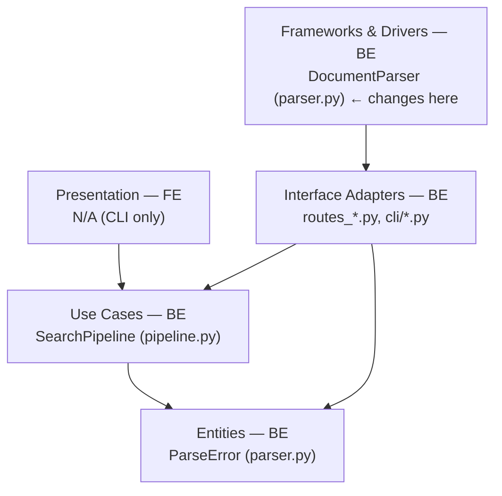
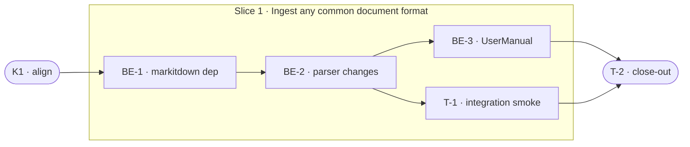

# E0a · File-Type Completeness — Team Plan

**How to read this file**
- **Architecture approach:** Clean Architecture. **Layers:** Presentation · Use Cases · Interface Adapters · Entities · Frameworks & Drivers. Dependencies point inward.
- The **Frontend, Backend, and Tester** sections are the **depth view** — each role's work, grouped by layer.
- The **Task Breakdown** is the **order view** — every task is a single-role checkbox in execution order, opening with a dependency graph.
- **Phases are vertical slices**: each delivers a working end-to-end increment. Sliced with the **`vertical-slicer` skill**.
- Each task carries the **role tag at the end of its title line**, then sub-bullets: **layer · estimate**, **needs · completes**, and a **Tests** block.
- **Unit and integration tests belong to the implementing dev** (test-first); **e2e and manual tests are the tester's tasks**.
- **Contracts** are logical: authored as a linked `.tsp` file (TypeSpec, validated clean). No HTTP seam — no OpenAPI.
- IDs (`S#`, `C#`, `BE-#`/`T-#`/`K#`, `Q#`) are the traceability thread.

---

## Background

`archon_search/parser.py` advertises Office-format support in its module docstring and routes `.docx`/`.pptx`/`.xlsx` to `_parse_office`, which calls `markitdown`. However, `markitdown` is absent from `[project.dependencies]` in `pyproject.toml`, so `uv sync --dev` does not install it. Several additional common Office and document formats (`.xls`, `.rtf`, `.epub`, `.eml`, `.msg`) are absent from `_OFFICE_EXTENSIONS` entirely. When any of these files are ingested, a `ParseError` wrapping a `ModuleNotFoundError` is raised. Note: `.doc`, `.ppt`, `.odt` were considered but excluded — markitdown raises `UnsupportedFormatException` for these formats.

---

## Goal

Every supported document format ingests successfully on a fresh `uv sync --dev` install with no extra steps. `archon-search ingest document.xlsx` (or `.xls`, `.rtf`, `.epub`, `.eml`, `.msg`) returns indexed content, not an error.

---

## Scope

### In Scope
- Add `markitdown` to `[project.dependencies]` in `pyproject.toml` (core, not optional).
- Add to `_OFFICE_EXTENSIONS` in `archon_search/parser.py`: `.xls`, `.rtf`, `.epub`, `.eml`, `.msg` (5 formats). Note: `.doc`, `.ppt`, `.odt` are excluded — markitdown raises `UnsupportedFormatException` for these; they fall through to `_parse_plain` producing garbled output.
- Add `.tsv` to `_PLAIN_EXTENSIONS` in `archon_search/parser.py`.
- Replace the bare `except Exception` in `_parse_office` with an `ImportError` branch that surfaces a human-readable message before the generic `ParseError` fallback.
- Add a `None` guard to `_parse_office`: return `MarkItDown().convert(str(path)).text_content or ""` so `None` from markitdown returns empty string rather than violating the `-> str` contract (mirrors the docling handler's pattern at `parser.py:109`).
- Update the `parser.py` module docstring to reflect new supported types.
- Add a supported-extension list to `Documentation/UserManual/04_ingestion_and_collections.md`.

### Out of Scope
- Audio transcription (`.mp3`, `.wav`) — requires Whisper; separate brief.
- Image-only PDFs / scanned docs beyond current docling OCR coverage — no `_parse_pdf` change.
- Animated `.gif`, `.svg` — intentionally excluded; no change.

---

## Acceptance criteria
- `uv sync --dev` installs `markitdown` with no extra step; confirmed by `uv run python -c "import markitdown"` after a clean sync.
- `archon-search ingest <file.xls>` (and each of `.rtf`, `.epub`, `.eml`, `.msg`) returns `Ingest complete: 1 ingested, 0 errors.`
- `archon-search ingest <file.tsv>` returns `Ingest complete: 1 ingested, 0 errors.`
- Existing `.docx`/`.pptx`/`.xlsx` ingestion is unchanged.
- If `markitdown` is somehow not installed, the `ParseError.cause` message contains "install markitdown".
- `Documentation/UserManual/04_ingestion_and_collections.md` lists all supported extensions.

---

## What does NOT change
- `_parse_pdf` / docling pipeline — no change.
- `_parse_html` / trafilatura pipeline — no change.
- `_parse_image` — no change.
- `.gif` and `.svg` exclusion — preserved (comment at `parser.py:42-43` remains).
- `ParseError` interface (`path` + `cause` fields, message format) — no change.
- All REST, MCP, and CLI API surfaces — no change.
- Existing `.docx`/`.pptx`/`.xlsx` behaviour — no change.

---

## Known limitations / accepted trade-offs
- The `ImportError` branch in `_parse_office` is a defence against future dep-slip; under normal operation (markitdown declared in `pyproject.toml`) it will never fire.
- `.odt` with embedded images: markitdown extracts text and ignores binary blobs — accepted.
- `.eml` with HTML body: markitdown strips HTML tags and returns plain text — acceptable for search indexing.
- `.msg` (Outlook) requires `extract-msg` (a pure-Python transitive dep of markitdown) — works cross-platform.
- `trafilatura` (HTML parser at `_parse_html`) has the same missing-dep pattern as `markitdown` — it is installed by the wizard but absent from `[project.dependencies]`. HTML ingestion fails on a fresh `uv sync --dev`. This is out of scope for E0a but should be tracked as a follow-up (same fix pattern: add `trafilatura` to `[project.dependencies]`).
- `.epub` chapter structure and table of contents are flattened to a single plain-text string by markitdown; chapter-aligned chunking is not possible. This is accepted for search indexing purposes.

---

## Approach & architecture

All changes are confined to the Frameworks & Drivers layer (`parser.py`, `pyproject.toml`). The Use Cases layer (`pipeline.py`) and above are untouched. The seam between Frameworks & Drivers and Use Cases — `DocumentParser.parse()` raising `ParseError` — is unchanged in shape.

**Layer map (and role mapping)**

| Layer | Role | Components |
|-------|------|-----------|
| Presentation | **Frontend** | N/A — CLI only project |
| Use Cases | Backend | `SearchPipeline` (`pipeline.py`) |
| Interface Adapters | Backend | `routes_*.py`, `cli/*.py` |
| Entities | Backend | `ParseError` (`parser.py:24-29`) |
| Frameworks & Drivers | Backend | `DocumentParser` (`parser.py:45-124`), `pyproject.toml` |

**What changes**
- `pyproject.toml:7-22` — add `markitdown>=0.1.0` to `[project.dependencies]`. (BE-1 must verify this floor covers all 5 new formats and that `extract-msg` is a hard transitive dep, not an optional extra. Adjust if markitdown's actual dep tree requires a higher floor.)
- `archon_search/parser.py:1-10` — module docstring: expand Office and add plain-text lists.
- `archon_search/parser.py:33-39` — `_PLAIN_EXTENSIONS`: add `.tsv`; `_OFFICE_EXTENSIONS`: add 5 extensions (`.xls`, `.rtf`, `.epub`, `.eml`, `.msg`); `.doc`, `.ppt`, `.odt` excluded (markitdown raises `UnsupportedFormatException`).
- `archon_search/parser.py:119-124` — `_parse_office`: split into two try/except blocks — first block catches `ImportError` from the lazy import and raises `ParseError(path, ImportError("markitdown is not installed; run: pip install markitdown"))` from it; second block calls `MarkItDown().convert()` and catches generic `Exception`. This ordering is required — `except ImportError` must come before `except Exception` or it is dead code.
- `Documentation/UserManual/04_ingestion_and_collections.md` — add supported-extension table.

**Key decisions (from the brief)**
- `markitdown` is a core dep, not optional — the parser already advertises Office support; optional would be a broken contract.
- Zero new libraries — all new formats are handled by `markitdown`, already the declared dep for the Office handler.
- `.tsv` via plain-text reader — TSV is tab-separated text; no CSV parser overhead needed. Note: `.tsv` already routes to `_parse_plain` via the `else` branch in `parse()` — adding it to `_PLAIN_EXTENSIONS` is an explicitness/documentation change only; it does not alter observable behavior. The corresponding test confirms the routing is intentional, not that a new code path is being exercised.

---

## Contracts / seams

*Using TypeSpec (v1.13.0). This is an internal logical seam (in-process, not HTTP); no OpenAPI emitted.*

**C1 — DocumentParser parse seam**  *(Frameworks & Drivers ↔ Use Cases)*
`DocumentParser.parse(path)` returns extracted text (`str`) or raises `ParseError(path, cause)`. Callers (`pipeline.py:296`) need only handle `ParseError`. The expansion of `_OFFICE_EXTENSIONS` and `_PLAIN_EXTENSIONS` is internal to Frameworks & Drivers; the seam shape is unchanged.
— see [`document-parser-contract.tsp`](document-parser-contract.tsp) (validated clean: `tsp compile document-parser-contract.tsp --no-emit`)

- Realised by: BE-1, BE-2 · Verified by: BE-2 (unit tests), T-1 (integration tests)

---

## Scenarios #tester-role

| id | Scenario (Given / When / Then) |
|----|-------------------------------|
| **S1** | **Given** a fresh `uv sync --dev` install · **When** the user runs `archon-search ingest document.xls` (or `.rtf`, `.epub`, `.eml`, `.msg`) · **Then** the file is parsed, chunked, and indexed; ingest reports `1 ingested, 0 errors` |
| **S2** | **Given** a `.tsv` file · **When** the user ingests it · **Then** it is routed to `_parse_plain` and its tab-separated content is indexed as plain text |
| **S3** | **Given** a malformed Office file (e.g. a truncated `.doc`) · **When** the user ingests it · **Then** `ParseError` is raised with `path` and a conversion `cause`; no `ImportError` or `ModuleNotFoundError` surfaces |
| **S4** | **Given** `markitdown` is somehow absent at runtime · **When** `_parse_office` is called · **Then** `ParseError.cause` contains the message "install markitdown" |
| **S5** | **Given** existing `.docx`, `.pptx`, or `.xlsx` files that ingested successfully before this change · **When** ingested after the change · **Then** behaviour is identical — same chunk count, no error |
| **S6** | **Given** a developer who runs `uv sync --dev` on a clean clone · **When** they check installed packages · **Then** `markitdown` is present without any manual `pip install` step |
| **S7** | **Given** a parseable Office file where markitdown's `text_content` returns `None` · **When** the user ingests it · **Then** an empty string is returned (not a `TypeError`) — `parse()` always returns `str`, never `None` |

---

## Frontend — Presentation #frontend-role

N/A — no frontend work for this feature. This project has no web UI; the CLI is Frameworks & Drivers. All changes are in the backend parser layer.

---

## Backend — Entities · Use Cases · Adapters · Frameworks #backend-role

**Scope:** fix the `markitdown` dep declaration, expand the extension sets, harden the `ImportError` branch, update the module docstring, and add the extension table to the UserManual. Writes unit and integration tests for all tasks.
**Owns layers:** Entities, Use Cases, Interface Adapters, Frameworks & Drivers.

**Tasks by layer** *(checkable in the Task Breakdown)*
- Frameworks & Drivers: BE-1 (pyproject.toml dep), BE-2 (parser.py changes)
- Interface Adapters: BE-3 (UserManual extension table)

**Done when**
- [ ] `uv sync --dev` installs `markitdown` — S6
- [ ] All 5 new Office extensions route to `_parse_office` — S1
- [ ] `.tsv` routes to `_parse_plain` — S2
- [ ] `None` from markitdown `text_content` returns empty string — S7
- [ ] `ImportError` branch fires with a helpful message — S4
- [ ] Existing `.docx`/`.pptx`/`.xlsx` parametrized test still passes — S5
- [x] UserManual lists all supported extensions — (close-out acceptance)

---

## Tester #tester-role

**Scope:** the tester owns **integration** smoke tests plus the project **close-out**. Unit tests belong to the backend dev (BE-2).

**Tasks** *(checkable in the Task Breakdown)*
- T-1 — Integration smoke: ingest real Office and TSV files via `make_real_app` TestClient
- T-2 — Close-out

**Allocation** — each scenario at the cheapest level that proves it

| Scenario | Cheapest level |
|----------|----------------|
| S1 — new Office extensions indexed | unit (routing only — mocked markitdown); real-conversion coverage in T-1 integration tests for `.xlsx`, `.eml`, `.epub`, `.rtf`; `.xls` has a conditional integration test (requires xlwt — skips gracefully when absent); `.msg` remains mocked-only at unit level |
| S2 — `.tsv` plain-text path | unit (confirms explicit routing; behavior already works via else-branch) |
| S3 — malformed file → ParseError | unit |
| S4 — ImportError → helpful message | unit |
| S5 — existing .docx/.pptx/.xlsx unchanged | unit (existing parametrized test) |
| S6 — `uv sync` includes markitdown | manual (requires fresh clone) |
| S7 — None content → empty string | unit |

---

## Documentation update

Docs the feature touches — the close-out task works through this list.

- [ ] `Documentation/Backlog/e0a-file-type-completeness-brief.md` — no changes needed (source brief)
- [ ] `Documentation/Backlog/e0a-file-type-completeness-team-plan.md` — this file
- [ ] `Documentation/Backlog/document-parser-contract.tsp` — this file (contract artefact)
- [ ] `Documentation/UserManual/04_ingestion_and_collections.md` — add supported-extension table (in-scope deliverable, covered by BE-3)
- [ ] `archon_search/parser.py` module docstring — update to list new extensions (in-scope, covered by BE-2)
- [ ] `Documentation/Architecture/100_system_architecture_overview.md` — verify parser capabilities section; update if it lists supported formats explicitly
- [ ] `Documentation/Architecture/110_component_catalog_and_layer_breakdown.md` — verify `DocumentParser` entry lists supported extensions; update to include new Office and TSV extensions
- [ ] `CLAUDE.md` — no change needed (parser layer not documented there)

---

## Open questions

All decisions are resolved in the brief.

*Resolved in this revision:*
- Whether `markitdown` should be core or optional → core (brief §Key Decisions).
- Whether `.tsv` needs a CSV parser → no, plain-text reader suffices (brief §Core Flow).
- Whether the wizard install needs updating → no (brief §Edge Cases: wizard already installs markitdown; `pyproject.toml` change makes `uv sync` consistent).

---

## Task Breakdown

Single-role tasks in execution order, grouped into **vertical slices**.

### Dependency graph

### Phase 0 · Kickoff *(cross-cutting alignment)*

- [x] **K1** — Agree on C1 contract seam and scenario list with team #team
    - — · 0.5h
    - completes C1
    - Tests

---

### Phase 1 · Ingest any common document format *(walking skeleton: dep + extension routing + smoke)* #backend-role

- [x] **BE-1** — Add `markitdown` to `[project.dependencies]` in `pyproject.toml` #backend-role
    - Frameworks & Drivers · 0.5h
    - needs K1 · completes S6, C1
    - Tests
        - #unit_test — `test_markitdown_declared_as_core_dep` — parse `pyproject.toml` and assert `markitdown` appears in `[project.dependencies]` (not optional-dependencies)
        - BE-1 must verify: run `uv pip show markitdown | grep Requires` to confirm `extract-msg` is a hard transitive dep (not an optional extra of markitdown). If optional, add `extract-msg` explicitly to `[project.dependencies]`.
        - Verified: `extract-msg` is not a transitive dep. `.msg` support uses `olefile` (in markitdown's `[all]` optional extra only). Added `olefile>=0.46,<1` to core deps with `test_olefile_declared_as_core_dep`.

- [x] **BE-2** — Expand `_OFFICE_EXTENSIONS`, add `.tsv` to `_PLAIN_EXTENSIONS`, add `ImportError` branch in `_parse_office`, update module docstring #backend-role
    - Frameworks & Drivers · 2.0h
    - needs BE-1 · completes S1, S2, S3, S4, S5, S7
    - Tests
        - #unit_test — `test_parser_office_new_extensions_routed` — parametrize `.xls`, `.rtf`, `.epub`, `.eml`, `.msg`; mock `markitdown`; assert `_parse_office` called and returns content (`.doc`, `.ppt`, `.odt` excluded — markitdown raises `UnsupportedFormatException` for these)
        - #unit_test — `test_parser_tsv_routed_to_plain` — `.tsv` file routes to `_parse_plain`; assert content returned without markitdown mock
        - #unit_test — `test_parser_office_import_error_surfaces_message` — use `patch.dict("sys.modules", {"markitdown": None})` to force `ImportError` on import; assert `ParseError` raised and `str(exc.cause)` contains "markitdown"
        - #unit_test — `test_parser_office_malformed_file_raises_parse_error` — mock `MarkItDown().convert()` to raise `RuntimeError`; assert `ParseError` (not `ImportError`) with correct `path` and `cause`
        - #unit_test — `test_parser_office_none_content_returns_empty_string` — mock `MarkItDown().convert().text_content = None`; assert `parse()` returns `""`

- [x] **BE-3** — Add supported-extension table to `Documentation/UserManual/04_ingestion_and_collections.md` #backend-role
    - Interface Adapters · 0.5h
    - needs BE-2
    - Tests

- [x] **T-1** — Integration smoke: ingest representative Office formats (`.xlsx`, `.eml`, `.epub`, `.rtf`) and a real `.tsv` via `make_real_app` TestClient integration tests #tester-role
    - — · 1.0h
    - needs BE-2 · completes S1, S2
    - Tests
        - #integration_test — Office file round-trip (`.xlsx`, `.eml`, `.epub`, `.rtf`) — exercised via `make_real_app` FastAPI TestClient (in-process, no real TCP); each format verifies `status=DONE`, `error=None`, and the known phrase is searchable with `doc_id` confirmed in results
        - #integration_test — TSV file round-trip — exercised via `make_real_app` FastAPI TestClient; verifies `status=DONE`, `error=None`, and tab-separated content is searchable

    > **Note on `.doc` / `.ppt` / `.odt`:** These extensions are intentionally excluded from `_OFFICE_EXTENSIONS` in `parser.py` (markitdown raises `UnsupportedFormatException` for them). They fall through to `_parse_plain`, which reads the binary content as UTF-8 with replacement characters — producing garbled but non-crashing output (`1 ingested, 0 errors`). Local CLI testing confirmed this fallthrough behaviour: `.doc` ingests without crashing but the indexed content is not meaningfully parsed. This is documented, expected behaviour — not a regression.

---

### Phase 2 · Close-out

- [ ] **T-2** — Project close-out & acceptance fact-check #tester-role
    - — · 2.0h
    - needs BE-3, T-1
    - Tests
    - Duties
        - Update all documentation per the "Documentation update" section — `04_ingestion_and_collections.md`, `parser.py` docstring, this plan.
        - Fix all build / compiler warnings, if any.
        - Run `uv run pytest`; fix every failing test, including any unrelated to this feature.
        - Validate every Acceptance criterion one-by-one with a fact check — no assumptions; confirm each is genuinely done.

**Critical path:** K1 → BE-1 → BE-2 → T-1 → T-2.
