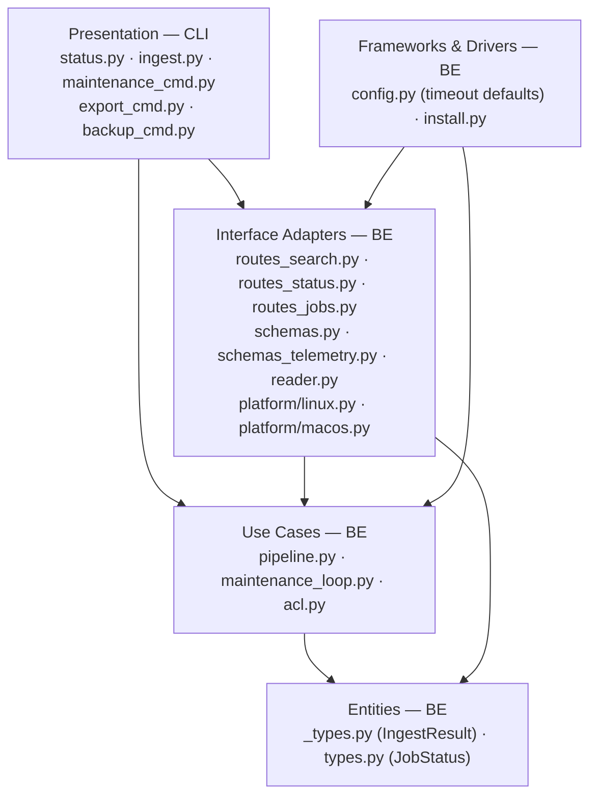
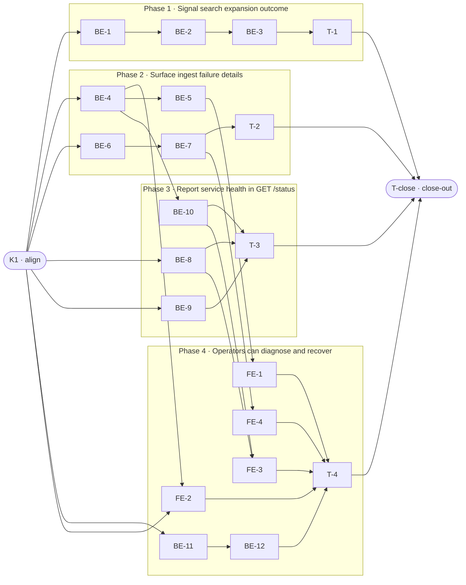

# E0b · Silent Failure Transparency — Team Plan

**How to read this file**
- **Architecture approach:** Clean Architecture (default). **Layers:** Presentation · Use Cases · Interface Adapters · Entities · Frameworks & Drivers. Dependencies point inward. Each task's first sub-bullet names the layer it touches.
- The **Frontend, Backend, and Tester** sections are the **depth view** — each role's work, grouped by layer.
- The **Task Breakdown** is the **order view** — every task is a single-role checkbox in execution order, opening with a dependency graph.
- **Phases are vertical slices**: each delivers a working end-to-end increment. Sliced with the **`vertical-slicer` skill**.
- Each task carries the **role tag at the end of its title line**, then sub-bullets: **layer · estimate** (decimal hours), **needs · completes**, and a **Tests** block.
- **Tests**: Unit and integration tests belong to the implementing dev (test-first). E2e and manual tests are the tester's tasks. The close-out task writes no tests.
- **Contracts** are logical, authored as TypeSpec. Internal seams: core-construct `.tsp` validated with `--no-emit`. HTTP/API seams: TypeSpec HTTP service with emitted `openapi.yaml`.
- Role tags: `#frontend-role`, `#backend-role`, `#tester-role`. IDs `S#`, `C#`, `BE-#`/`FE-#`/`T-#`/`K#`, `Q#` are the traceability thread.

---

## Background

archon-search silently degrades across six failure modes with no signal to the user. HyDE and RAG Fusion time out and fall back to plain search without indicating they did so; the managed service doesn't inherit `ANTHROPIC_API_KEY` so expansion stops working after install; failed ingest jobs age past 72 hours with no record; oversized telemetry entries are truncated (since D8) but that count is not surfaced in stats; ACL sidecars over 64 KB are skipped with only a Python logger warning; and `--wait` CLI commands exit with an error and no job ID when they time out.

---

## Goal

Every silent failure surface emits an observable signal. A user hitting any of these failure modes can diagnose and resolve it without reading source code.

---

## Scope

### In Scope
- **L7**: Raise `HydeConfig.timeout_seconds` and `RAGFusionConfig.timeout_seconds` defaults from 5.0 → 10.0. Add `expansion_used: bool` and `expansion_warning: str | None` to `SearchResponse` in `routes_search.py`. `expansion_warning` is assembled at the route level: HyDE timeout detected in `routes_search.py` when `resolve_hyde_vector()` returns `(None, False)` with HyDE requested; RAG Fusion timeout detected via `rag_fusion_warning` on `SearchPipelineResult` (pipeline.py). See C4 and Q2.
- **L6**: Add `hyde: HydeStatusDetail | None` and `rag_fusion: RagFusionStatusDetail | None` (each with `key_available: bool`) to `StatusResponse` in `schemas.py`; populate in `routes_status.py` by checking `os.environ`. Add `EnvironmentFile=` to the Linux systemd unit template (`platform/linux.py`). Add a wrapper-script approach to the macOS launchd template (`platform/macos.py`). Wizard (`install.py`) creates `.secrets.env` (mode 600) and the macOS wrapper script when HyDE or RAG Fusion is enabled. `archon-search status` CLI warns when feature enabled but key unavailable.
- **L10**: Add `FAILED_EXPIRED` to `JobStatus` enum (`types.py`). Maintenance loop (`maintenance_loop.py`) transitions aged-out FAILED jobs to `FAILED_EXPIRED` instead of logging and discarding. Add `failed_expired_ingest_count: int` to `StatusResponse`. `archon-search status` CLI displays the count.
- **L11**: Add `truncated_count: int = 0` to `StatsResponse` (`schemas_telemetry.py`). `TelemetryReader.compute_stats()` (`reader.py`) counts entries where `truncated=True`. (The truncation in the writer already exists since D8; this surfaces the count.)
- **L14**: Add `warnings: list[str]` to `IngestResult` (`_types.py`). Modify `acl.read_acl_sidecar()` to return the warning string alongside `None` when sidecar > 64 KB. `pipeline.py` ingest path collects ACL warnings into `IngestResult`. `archon-search ingest` CLI prints warnings to stderr. `IngestResultSchema.from_result()` (`mcp_schemas.py`) includes the new field.
- **L8**: Add `--timeout SECONDS` to `--wait` in `maintenance_cmd.py`, `export_cmd.py`, `backup_cmd.py`. On timeout: print job ID and recovery instruction; exit 0. Exit 2 on confirmed FAILED.

### Out of Scope
- Raising the 64 KB ACL sidecar limit itself.
- Email/Slack notifications for `FAILED_EXPIRED` jobs.
- Structured warning codes on `IngestResult` (plain strings are v1).
- Windows service (`EnvironmentFile` equivalent) — deferred.
- `expansion_used`/`expansion_warning` on `/explain` (`routes_explain.py`) and MCP `explain` tool (`mcp.py`) — these endpoints also call `resolve_hyde_vector()` but are excluded from E0b to keep scope contained. Filed as future work.

---

## Acceptance criteria
- `POST /search` with `hyde=true` and a timed-out Anthropic call returns `expansion_used: false` and a non-null `expansion_warning`.
- `GET /status` includes `hyde.key_available` and `rag_fusion.key_available` when the features are configured.
- `archon-search status` prints a warning to stderr when HyDE or RAG Fusion is enabled and the API key is absent.
- A FAILED ingest job that ages past `retry_max_age_hours` transitions to `FAILED_EXPIRED` and appears in `GET /jobs?status=FAILED_EXPIRED`.
- `GET /status` includes `failed_expired_ingest_count`.
- `GET /telemetry/stats` includes `truncated_count`.
- Ingesting a file with an ACL sidecar over 64 KB returns `IngestResult.warnings` with a human-readable message; `archon-search ingest` prints it to stderr.
- `archon-search maintenance run --wait --timeout 60` exits 0 after 60 s and prints the job ID with recovery instructions.
- `archon-search maintenance run --wait` exits 2 when the job is confirmed FAILED.
- macOS launchd service loads `ANTHROPIC_API_KEY` from `~/.archon-search/.secrets.env` via a wrapper script; `.secrets.env` absent does not prevent service start.
- Linux systemd service loads `ANTHROPIC_API_KEY` from `~/.archon-search/.secrets.env` via `EnvironmentFile=-`; absent file is a no-op.
- OpenAPI snapshot regenerated and passing after all HTTP-seam changes.

---

## What does NOT change
- The 64 KB ACL sidecar size limit itself.
- Telemetry `writer.py` truncation logic (already implemented in D8).
- MCP tool names and the 17-tool count do not change. MCP `search`/`search_with_context` tool **response shapes** gain `expansion_used` and `expansion_warning` fields (see BE-3).
- `GET /health` and `GET /ready` response shapes.
- The internal maintenance retry policy configuration keys.
- Existing `SearchResponse` fields (`hyde_applied`, `rag_fusion_applied`, etc.) remain.
- `ExplainResponse` and MCP `explain` tool response shapes (expansion warning fields are only added to search responses in E0b).

---

## Known limitations / accepted trade-offs
- `expansion_warning` for HyDE always reads `'HyDE expansion failed'` regardless of failure mode (timeout, API error, missing key, empty response) — `resolve_hyde_vector()` returns `(None, False)` for all cases, making the specific cause undetectable at the route level. For RAG Fusion, the messages are specific: `'RAG Fusion timed out'` (TimeoutError) or `'RAG Fusion expansion failed'` (other exceptions). These strings are de facto test contracts; changing wording requires updating tests.
- `truncated_count` accumulates only from deploy time; historical entries written before E0b do not backfill.
- `FAILED_EXPIRED` transition happens on the next maintenance pass after the cutoff, not at the exact expiry moment.
- macOS wrapper script hard-codes the Python interpreter path recorded at `register()` time; re-virtualenv requires re-registration.
- The five independent `_TERMINAL_STATUSES` definitions (3 string-based, 2 enum-based) are a pre-existing tech-debt smell. All five are updated by BE-4 for E0b. Consolidation is a future refactor.

---

## Approach & architecture

Six independent changes, each touching a different failure surface. All follow the clean architecture layer conventions already established in this codebase: domain types in `_types.py` / `types.py`, use-case logic in `pipeline.py` / `maintenance_loop.py`, HTTP adapters in `server/`, CLI adapters in `cli/`. No new layers or cross-layer shortcuts are introduced. This is a backend-only Python service; there is no browser frontend. The Presentation layer is the CLI.

**Layer map**

| Layer | Role | Components touched by E0b |
|---|---|---|
| Presentation | **Frontend** | `cli/status.py`, `cli/ingest.py`, `cli/maintenance_cmd.py`, `cli/export_cmd.py`, `cli/backup_cmd.py` |
| Use Cases | Backend | `pipeline.py` (expansion warning propagation, ACL warning collection), `maintenance_loop.py` (FAILED_EXPIRED transition), `acl.py` (sidecar warning return) |
| Interface Adapters | Backend | `server/routes_search.py`, `server/routes_status.py`, `server/routes_jobs.py`, `server/schemas.py`, `server/schemas_telemetry.py`, `server/mcp_schemas.py` (BE-3: expansion fields on MCP search responses), `server/mcp.py` (BE-3: wire expansion fields in search/search_with_context tools), `telemetry/reader.py`, `platform/linux.py`, `platform/macos.py` |
| Entities | Backend | `archon_search/_types.py` (`IngestResult`), `archon_search/types.py` (`JobStatus`) |
| Frameworks & Drivers | Backend | `config.py` (raise timeout defaults), `install.py` (create `.secrets.env` + wrapper) |

**What changes**
- `SearchPipelineResult` gains `rag_fusion_warning: str | None`; `SearchResponse` gains `expansion_used: bool` and `expansion_warning: str | None` assembled at the route level (HyDE timeout from route, RAG Fusion timeout from pipeline); both timeout defaults raised to 10.0. `McpSearchResponse` and `SearchWithContextResponse` gain the same two fields.
- `StatusResponse` gains `hyde`, `rag_fusion` sub-objects and `failed_expired_ingest_count`; Linux unit template gains `EnvironmentFile=-`; macOS template gains wrapper-script delegate; wizard creates `.secrets.env`.
- `JobStatus` gains `FAILED_EXPIRED`; maintenance loop transitions aged-out jobs.
- `StatsResponse` gains `truncated_count`; `reader.compute_stats()` counts truncated entries.
- `IngestResult` gains `warnings: list[str]`; `acl.read_acl_sidecar()` returns the warning; pipeline collects it; MCP schema updated.
- `--wait` in three CLI commands gains `--timeout SECONDS`; exit-code contract formalised (0 = success or timeout, 2 = FAILED).

**Key decisions**
- Wrapper-script approach for macOS launchd (chosen in brief) — secrets never land in the plist; absent `.secrets.env` is a no-op (`[ -f ] && source`).
- `expansion_used` = `hyde_applied OR rag_fusion_applied` (mirrors existing fields; no new pipeline state). Acknowledged as redundant with existing fields; kept because it provides a single boolean 'did expansion succeed' without requiring consumers to know about both features. The actual diagnostic signal is `expansion_warning`.
- `FAILED_EXPIRED` is terminal and queryable — preserves auditability; operators can re-ingest.
- `truncated_count` is additive to existing `StatsResponse` — no existing field changes.

---

## Contracts / seams

Boundaries where roles must agree. **TypeSpec v1.13.0** was used. Internal seams validated with `tsp compile --no-emit`. HTTP/API seams emit `openapi.yaml` via `@typespec/openapi3`.

**C1 — SearchResponse expansion fields** *(Interface Adapters → HTTP)*
Adds `expansion_used: bool` and `expansion_warning: string | null` to `POST /search` response. `expansion_used` mirrors `hyde_applied OR rag_fusion_applied`. `expansion_warning` is non-null when expansion was requested but failed. HyDE failures always use the message `'HyDE expansion failed'` (all failure modes — timeout, API error, missing key, empty response — produce identical `(None, False)` returns from `resolve_hyde_vector()`; the specific cause is undetectable at the route level). RAG Fusion failures use specific messages: `'RAG Fusion timed out'` (TimeoutError) or `'RAG Fusion expansion failed'` (other exceptions), since they are caught at pipeline level.
See [`api-contracts/e0b-search-response.tsp`](api-contracts/e0b-search-response.tsp) · [`api-contracts/e0b-search-response.openapi.yaml`](api-contracts/e0b-search-response.openapi.yaml)
- Realised by: BE-2, BE-3 · Verified by: BE-3 (integration), T-1 (e2e)

**C2 — StatusResponse expansion key availability + FAILED_EXPIRED count** *(Interface Adapters → HTTP)*
Adds `hyde: HydeStatusDetail | null`, `rag_fusion: RagFusionStatusDetail | null` (each with `key_available: bool`), and `failed_expired_ingest_count: int32` to `GET /status` response. Both sub-objects are null when the feature is not configured.
See [`api-contracts/e0b-status-response.tsp`](api-contracts/e0b-status-response.tsp) · [`api-contracts/e0b-status-response.openapi.yaml`](api-contracts/e0b-status-response.openapi.yaml)
- Realised by: BE-8, BE-10 · Verified by: BE-8, BE-10 (integration), T-3 (e2e), FE-3 (CLI integration)

**C3 — StatsResponse truncated count** *(Interface Adapters → HTTP)*
Adds `truncated_count: int32` to `GET /telemetry/stats`. Counts entries where `truncated=True` in the JSONL log since the stats window. Note: `TelemetryEntry.truncated` defaults to `None` (not `False`) — count logic must use `entry.truncated is True`. Note: the TypeSpec model is named `StatsResponse` in the contract file (matching the Python class at `schemas_telemetry.py`); implementers: extend `StatsResponse`, not a new class.
See [`api-contracts/e0b-telemetry-stats.tsp`](api-contracts/e0b-telemetry-stats.tsp) · [`api-contracts/e0b-telemetry-stats.openapi.yaml`](api-contracts/e0b-telemetry-stats.openapi.yaml)
- Realised by: BE-9 · Verified by: BE-9 (unit + integration), T-3 (e2e)

**C4 — SearchPipelineResult RAG Fusion warning** *(Use Cases → Interface Adapters)*
Adds `rag_fusion_warning: string | null` to the `SearchPipelineResult` dataclass. Non-null when RAG Fusion was requested and caught a `TimeoutError` or exception. `None` when RAG Fusion succeeded or was not requested. **HyDE timeout warning is assembled at the route level in `routes_search.py`**, not in the pipeline, because `resolve_hyde_vector()` runs before `pipeline.search()` is called — the pipeline never sees HyDE calls. See Q2.
See [`e0b-search-pipeline-result.tsp`](e0b-search-pipeline-result.tsp)
- Realised by: BE-1, BE-2 · Verified by: BE-2 (unit), BE-3 (integration)

**C5 — JobStatus FAILED_EXPIRED** *(Entities → Use Cases)*
Adds `FAILED_EXPIRED` as a terminal `JobStatus` value. A job in this state will never be retried. The transition is one-way: `FAILED → FAILED_EXPIRED` when `job_created < cutoff` (aged-out) **OR** `retry_count >= max_attempts` (exhausted). Note: jobs that are aged-out but have `retry_count < max_attempts` **also** transition to `FAILED_EXPIRED` — they cannot be retried due to age and must not be silently dropped. `FAILED_EXPIRED` means "abandoned" whether due to age or exhausted retries.
See [`e0b-job-status.tsp`](e0b-job-status.tsp)
- Realised by: BE-4 · Verified by: BE-4 (unit), BE-5 (unit + integration)

**C6 — IngestResult warnings field** *(Entities → Use Cases + Interface Adapters)*
Adds `warnings: list[str]` to `IngestResult`. Default empty list. Populated by the pipeline when ACL sidecar processing emits a non-fatal warning. `IngestResultSchema.from_result()` in `mcp_schemas.py` must include this field. Note: `resolve_acl()` is the intermediate function `pipeline.py` calls — its return type also changes to `tuple[list[str] | None, list[str]]` alongside `read_acl_sidecar()`.
See [`e0b-ingest-result.tsp`](e0b-ingest-result.tsp)
- Realised by: BE-6 · Verified by: BE-6 (unit), BE-7 (integration), T-2 (e2e)

---

## Scenarios #tester-role

| id | Scenario (Given / When / Then) |
|----|-------------------------------|
| **S1** | **Given** HyDE is enabled and `ANTHROPIC_API_KEY` is set · **When** `POST /search` with `hyde=true` and the Anthropic call succeeds · **Then** `expansion_used=true`, `expansion_warning=null` |
| **S2** | **Given** RAG Fusion is enabled and key is set · **When** `POST /search` with `rag_fusion=true` and all variant calls succeed · **Then** `expansion_used=true`, `expansion_warning=null` |
| **S3** | **Given** HyDE is enabled · **When** the Anthropic API call exceeds the 10 s timeout · **Then** `expansion_used=false`, `expansion_warning` contains "HyDE expansion failed" (generic message — all HyDE failure modes indistinguishable at route level) |
| **S4** | **Given** RAG Fusion is enabled · **When** `generate_variants` exceeds the 10 s timeout · **Then** `expansion_used=false`, `expansion_warning` contains "RAG Fusion timed out" |
| **S4b** | **Given** RAG Fusion is enabled · **When** `generate_variants` raises a non-timeout exception (API error, parse failure) · **Then** `expansion_used=false`, `expansion_warning` contains "RAG Fusion expansion failed" |
| **S5** | **Given** neither HyDE nor RAG Fusion was requested · **When** `POST /search` · **Then** `expansion_used=false`, `expansion_warning=null` |
| **S6** | **Given** `[hyde] enabled = true` in config · **When** server starts with `ANTHROPIC_API_KEY` set · **Then** `GET /status` returns `hyde.key_available=true` |
| **S7** | **Given** `[hyde] enabled = true` · **When** server starts without `ANTHROPIC_API_KEY` · **Then** `GET /status` returns `hyde.key_available=false`; `archon-search status` prints a warning to stderr |
| **S8** | **Given** `[hyde] enabled = true` and `key_available=false` · **When** operator runs `archon-search status` · **Then** stderr contains "HyDE enabled but ANTHROPIC_API_KEY is not set" |
| **S9** | **Given** macOS managed service with `ANTHROPIC_API_KEY` in `~/.archon-search/.secrets.env` · **When** `archon-search start` registers and loads the service · **Then** the key is available in the server environment (manual) |
| **S10** | **Given** macOS managed service with no `~/.archon-search/.secrets.env` · **When** `archon-search start` launches the service · **Then** service starts successfully; no key is set but no startup failure occurs (manual) |
| **S11** | **Given** a FAILED ingest job within `retry_max_age_hours` AND `retry_count < retry_max_attempts` · **When** maintenance loop runs · **Then** job is re-enqueued and stays FAILED until next attempt |
| **S11b** | **Given** a FAILED ingest job within `retry_max_age_hours` AND `retry_count >= retry_max_attempts` · **When** maintenance loop runs · **Then** job transitions to `FAILED_EXPIRED` (retries exhausted regardless of age) |
| **S12** | **Given** a FAILED ingest job older than `retry_max_age_hours` with attempts ≥ `retry_max_attempts` · **When** maintenance loop runs · **Then** job transitions to `FAILED_EXPIRED` |
| **S12b** | **Given** a FAILED ingest job older than `retry_max_age_hours` with `retry_count < retry_max_attempts` · **When** maintenance loop runs · **Then** job transitions to `FAILED_EXPIRED` (aged-out regardless of remaining retries) |
| **S13** | **Given** FAILED_EXPIRED jobs exist · **When** `GET /jobs?status=FAILED_EXPIRED` · **Then** response lists those jobs |
| **S14** | **Given** 2 FAILED_EXPIRED jobs in the default namespace · **When** `GET /status` · **Then** `failed_expired_ingest_count=2` |
| **S15** | **Given** `failed_expired_ingest_count > 0` in GET /status · **When** operator runs `archon-search status` · **Then** stdout includes the count with a re-ingest hint |
| **S16** | **Given** a search result set that produces a telemetry entry ≤ 8 KB · **When** the entry is written · **Then** `GET /telemetry/stats` `truncated_count` does not increase |
| **S17** | **Given** a large result set whose telemetry entry exceeds 8 KB · **When** the entry is written (truncated by writer) · **Then** `GET /telemetry/stats` `truncated_count` increments |
| **S18** | **Given** a document with an ACL sidecar file ≤ 64 KB · **When** ingested · **Then** `IngestResult.warnings` is empty; ACL is applied |
| **S19** | **Given** a document with an ACL sidecar file > 64 KB · **When** ingested · **Then** `IngestResult.warnings` contains a message naming the file and limit; `archon-search ingest` prints it to stderr |
| **S20** | **Given** a document with no ACL sidecar · **When** ingested · **Then** `IngestResult.warnings` is empty; ingestion proceeds normally |
| **S21** | **Given** `archon-search maintenance run --wait --timeout 120` and the pass completes in 30 s · **When** it finishes · **Then** CLI exits 0 |
| **S22** | **Given** `archon-search maintenance run --wait --timeout 10` and the pass takes longer · **When** 10 s elapses · **Then** CLI exits 0; stderr contains the job reference and "poll with archon-search maintenance status" |
| **S23** | **Given** maintenance job fails · **When** `archon-search maintenance run --wait` · **Then** CLI exits 2 |
| **S24** | **Given** `archon-search export --wait --timeout 30` and export exceeds 30 s · **When** timeout · **Then** CLI exits 0; stderr contains job ID + recovery hint |
| **S25** | **Given** `archon-search backup --now --wait --timeout 30` and backup exceeds 30 s · **When** timeout · **Then** CLI exits 0; stderr contains job IDs + recovery hint |

---

## Frontend — Presentation #frontend-role

**Scope:** CLI layer changes — five Click commands gain timeout support or new warning output. No HTTP server changes.
**Owns layer:** Presentation.

**Tasks** *(checkable in the Task Breakdown)*
- Presentation: FE-1 (maintenance --wait --timeout), FE-2 (export + backup --wait --timeout), FE-3 (status CLI warnings + count), FE-4 (ingest CLI warnings)

**Done when**
- [ ] `--wait --timeout N` accepted by `maintenance run`, `export`, and `backup --now`; exits 0 on timeout with recovery message — S21, S22, S23, S24, S25
- [ ] `archon-search maintenance run --wait` exits 2 when job FAILED — S23
- [ ] `archon-search status` warns when HyDE/RAG Fusion enabled but key absent — S7, S8
- [ ] `archon-search status` shows FAILED_EXPIRED ingest count — S15
- [ ] `archon-search ingest` prints ACL sidecar warnings to stderr — S19

---

## Backend — Entities · Use Cases · Adapters · Frameworks #backend-role

**Scope:** Config defaults, domain type additions, pipeline propagation, loop state transitions, HTTP route and schema changes, platform service templates, wizard script generation. Writes unit and integration tests for all tasks.
**Owns layers:** Entities, Use Cases, Interface Adapters, Frameworks & Drivers.

**Tasks by layer** *(checkable in the Task Breakdown)*
- Frameworks & Drivers: BE-1 (timeout defaults), BE-12 (wizard .secrets.env + wrapper)
- Entities: BE-4 (FAILED_EXPIRED enum value), BE-6 (IngestResult.warnings)
- Use Cases: BE-2 (pipeline rag_fusion_warning), BE-5 (maintenance loop FAILED_EXPIRED), BE-7 (pipeline ACL warning collection)
- Interface Adapters: BE-3 (SearchResponse), BE-4 (also updates _TERMINAL_STATUSES in jobs/store.py and routes_jobs.py), BE-8 (StatusResponse key_available), BE-9 (TelemetryStats truncated_count), BE-10 (StatusResponse failed_expired_count), BE-11 (service templates)
- Presentation (CLI): BE-4 (also updates _TERMINAL_STATUSES in cli/backup_cmd.py, cli/export_cmd.py, cli/collection.py)

**Done when**
- [ ] `SearchPipelineResult.rag_fusion_warning` populated on RAG Fusion timeout; route assembles `expansion_warning` from HyDE detection + `rag_fusion_warning` — S3, S4, S4b
- [ ] `SearchResponse` carries `expansion_used` and `expansion_warning` — S1, S2, S3, S4, S4b, S5
- [ ] `GET /status` carries `hyde.key_available`, `rag_fusion.key_available`, `failed_expired_ingest_count` — S6, S7, S13, S14
- [ ] `FAILED_EXPIRED` in `JobStatus`; maintenance loop transitions aged-out and retry-exhausted jobs — S11, S11b, S12, S12b
- [ ] `GET /telemetry/stats` carries `truncated_count` — S16, S17
- [ ] `IngestResult.warnings` populated from ACL sidecar check — S18, S19, S20
- [ ] Linux service unit gains `EnvironmentFile=-`; macOS service generates wrapper script — S9, S10
- [ ] OpenAPI snapshot regenerated and CI passing

---

## Tester #tester-role

**Scope:** e2e and manual tests only. Unit and integration tests belong to the implementing dev.

**Tasks** *(checkable in the Task Breakdown)*
- T-1 (e2e: search expansion), T-2 (e2e: ACL ingest warning), T-3 (e2e: status + telemetry stats), T-4 (e2e + manual: CLI --timeout + service templates), T-close (close-out)

**Allocation** — cheapest level that proves it

| Scenario | Cheapest level |
|---|---|
| S1, S2 | integration (TestClient POST /search, mock Anthropic) |
| S3, S4 | integration (TestClient POST /search, force asyncio.TimeoutError) |
| S4b | integration (TestClient POST /search, force non-timeout Exception from generate_variants) |
| S5 | integration (TestClient POST /search, no hyde/rag_fusion) |
| S6, S7 | integration (TestClient GET /status, monkeypatch `os.environ["ANTHROPIC_API_KEY"]`) |
| S8 | integration (Click test runner, capture stderr) |
| S9, S10 | **manual** (requires real launchd on macOS) |
| S11 | unit (maintenance_loop with mock job store, retry_count < max_attempts) |
| S11b | unit (maintenance_loop, within-age job, retry_count >= max_attempts → FAILED_EXPIRED) |
| S12 | unit (maintenance_loop age cutoff, verify FAILED_EXPIRED transition) |
| S12b | unit (maintenance_loop, aged job, retry_count < max_attempts → FAILED_EXPIRED) |
| S13 | integration (TestClient GET /jobs?status=FAILED_EXPIRED) |
| S14 | integration (TestClient GET /status, seeded FAILED_EXPIRED job) |
| S15 | integration (Click test runner, mock GET /status response) |
| S16, S17 | unit (reader.compute_stats with truncated entries) |
| S18, S19, S20 | unit (acl.read_acl_sidecar) + integration (pipeline + TestClient) |
| S21, S22, S23 | integration (Click test runner, monkeypatch _wait_for_pass polling) |
| S24, S25 | integration (Click test runner, monkeypatch _wait_for_jobs) |

---

## Documentation update

- [x] `Documentation/Backlog/e0b-silent-failure-transparency-brief.md` — updated HyDE warning message from stale "HyDE timed out after 10s — results may be less relevant" to canonical "HyDE expansion failed" (K1)
- [ ] `Documentation/Backlog/e0b-silent-failure-transparency-team-plan.md` — this file
- [ ] `Documentation/Architecture/600_api_reference_or_public_interface.md` — add `expansion_used`, `expansion_warning` to SearchResponse; `hyde`, `rag_fusion`, `failed_expired_ingest_count` to StatusResponse; `truncated_count` to TelemetryStats
- [ ] `Documentation/Architecture/110_component_catalog_and_layer_breakdown.md` — document `FAILED_EXPIRED` state; `IngestResult.warnings`; `HydeStatusDetail`/`RagFusionStatusDetail`
- [ ] `Documentation/UserManual/02_wizard.md` — document that wizard creates `.secrets.env` (and macOS wrapper) when HyDE/RAG Fusion is enabled
- [ ] `Documentation/UserManual/05_searching.md` — document `expansion_used` and `expansion_warning` response fields
- [ ] `Documentation/UserManual/06_telemetry.md` — document `truncated_count` in stats
- [ ] `Documentation/UserManual/07_troubleshooting.md` — add entries: "HyDE key not set", "FAILED_EXPIRED jobs", "ACL sidecar skipped"
- [ ] `BREAKING.md` — note exit-code change (1→0 on `--wait` timeout for maintenance, export, backup; this is a breaking CLI behavioral change); note OpenAPI snapshot regeneration required; additive changes to SearchResponse, StatusResponse, StatsResponse
- [ ] `CLAUDE.md` (project) — update `IngestResult` description under `_types.py`; note `FAILED_EXPIRED` terminal state
- [ ] `learnings.md` — update after task completion

---

## Open questions

**Resolved in this revision:**
- Q1 (launchd EnvironmentFile) — resolved before planning: use wrapper-script approach on macOS; `EnvironmentFile=-` on Linux (systemd). Wrapper guards with `[ -f ] && source` so absent file is no-op.

**Open:**
- Q2 (HyDE warning seam): The HyDE timeout warning cannot flow through `SearchPipelineResult` because HyDE resolution happens at the route level before `pipeline.search()` is called — `resolve_hyde_vector()` internally swallows `asyncio.TimeoutError` and returns `(None, False)`. Resolution: `expansion_warning` for HyDE is assembled in `routes_search.py` by detecting when `resolve_hyde_vector()` returns `(None, False)` with HyDE requested. **Must verify the MCP `search` path** (`mcp.py:267-274`) applies the same detection — MCP resolves HyDE the same way and must be covered in BE-3. This must be agreed at K1 before BE-2/BE-3 implementation begins.

---

## Task Breakdown

Single-role tasks in execution order, grouped into **vertical slices**.

### Dependency graph

---

### Phase 0 · Kickoff

- [x] **K1** — Agree contracts C1–C6 and scenarios S1–S25 + S12b with the team #team
    - — · 1.0h
    - completes C1, C2, C3, C4, C5, C6
    - Tests

---

### Phase 1 · Signal search expansion outcome *(walking skeleton: thinnest end-to-end — config → pipeline → schema → route)*

- [x] **BE-1** — Raise `HydeConfig.timeout_seconds` and `RAGFusionConfig.timeout_seconds` defaults from 5.0 → 10.0 in `config.py` #backend-role
    - Frameworks & Drivers · 1.0h
    - needs K1 · completes C4
    - Tests
        - #unit_test — `test_hyde_config_timeout_default_is_10` — asserts `HydeConfig().timeout_seconds == 10.0`
        - #unit_test — `test_rag_fusion_config_timeout_default_is_10` — asserts `RAGFusionConfig().timeout_seconds == 10.0`

- [x] **BE-2** — Add `rag_fusion_warning: str | None` to `SearchPipelineResult`; pipeline captures `asyncio.TimeoutError` OR any `Exception` from RAG Fusion and populates the field. HyDE timeout detection moves to the route in BE-3 (HyDE runs before `pipeline.search()` is called). Handle RAG Fusion failure in both `pipeline.search()` and `pipeline.search_many()`: `search_many` has two distinct failure paths — `generate_variants` failure at `pipeline.py:1091-1101` AND embedding gather failure at `pipeline.py:1107-1116` — both must set `rag_fusion_warning`. **Critical implementation note:** `rag_fusion.generate_variants()` currently catches ALL exceptions internally (including `asyncio.TimeoutError` at `rag_fusion.py:162-168`) and returns `[]` — the pipeline's outer `except` at `pipeline.py:619` is dead code for these cases. BE-2 MUST change `generate_variants()` to re-raise `asyncio.TimeoutError` (and optionally other exceptions) so the pipeline can distinguish failure from empty-variant success. The integration test (`test_search_pipeline_rag_fusion_fallback_signal` with `monkeypatched generate_variants() raising asyncio.TimeoutError`) will verify this propagation. #backend-role
    - Use Cases · 3.0h
    - needs BE-1 · completes S3, S4
    - Tests
        - #unit_test — `test_pipeline_result_rag_fusion_warning_none_on_success` — mock RAG Fusion returning variants; assert `rag_fusion_warning=None`
        - #unit_test — `test_pipeline_result_rag_fusion_warning_set_on_timeout` — force `asyncio.TimeoutError` from RAG Fusion in `search()`; assert `rag_fusion_warning` contains "RAG Fusion timed out"
        - #unit_test — `test_pipeline_result_rag_fusion_warning_set_on_api_error` — force a generic `Exception` (not `TimeoutError`) from `generate_variants`; assert `rag_fusion_warning` is non-null and message differs from "timed out"
        - #unit_test — `test_search_many_pipeline_result_expansion_warning_on_rag_fusion_failure` — force exception in `generate_variants` inside `search_many`; assert result carries `rag_fusion_warning`
        - #unit_test — `test_search_many_embedding_failure_sets_rag_fusion_warning` — force `Exception` in the embedding gather step inside `search_many` (`pipeline.py:1107-1116`); assert result carries `rag_fusion_warning` (distinct failure path from `generate_variants`)
        - #integration_test — `test_search_pipeline_rag_fusion_fallback_signal` — real `SearchPipeline` with monkeypatched `rag_fusion.generate_variants()` raising `asyncio.TimeoutError`; assert result carries `rag_fusion_warning`

- [x] **BE-3** — Add `expansion_used: bool` and `expansion_warning: str | None` to `SearchResponse` in `routes_search.py`. Route assembles `expansion_warning` from two sources: (a) HyDE failure detected at route level when `resolve_hyde_vector()` returns `(None, False)` and HyDE was requested — `expansion_warning = 'HyDE expansion failed'` (generic message; all HyDE failure modes produce identical `(None, False)` returns — timeout, API error, missing key, empty response are indistinguishable at this level); (b) pipeline's `rag_fusion_warning` when set. Since HyDE and RAG Fusion are mutually exclusive (the route suppresses HyDE when RAG Fusion is requested), `expansion_warning` will never contain both messages in the same response — only whichever source is non-None is used. Also add `expansion_used` and `expansion_warning` to `McpSearchResponse` and `SearchWithContextResponse` in `mcp_schemas.py`; wire them in the `search` and `search_with_context` tool closures in `mcp.py` using the same route-level assembly logic. Run the OpenAPI snapshot test (`uv run --python 3.12 pytest tests/server/test_openapi_snapshot.py -n0`) to verify BE-3 changes are consistent; do NOT regenerate yet — T-close does the final regeneration after all schema changes. #backend-role
    - Interface Adapters · 3.5h
    - needs BE-2 · completes C1, S1, S2, S3, S4, S4b, S5
    - Tests
        - #integration_test — `test_search_response_expansion_used_true_on_success` — TestClient POST /search with mocked HyDE success; assert `expansion_used=true`, `expansion_warning=null`
        - #integration_test — `test_search_response_expansion_warning_on_hyde_failure` — TestClient POST /search with `resolve_hyde_vector` returning `(None, False)` and HyDE requested; assert `expansion_used=false`, `expansion_warning='HyDE expansion failed'`
        - #integration_test — `test_search_response_expansion_used_or_logic` — POST /search with hyde=true; HyDE succeeds (`expansion_used=true`, `expansion_warning=null`); then POST with hyde=true and `resolve_hyde_vector` forced to return `(None, False)` (`expansion_used=false`, `expansion_warning='HyDE expansion failed'`); assert the derived field correctly reflects both true/false cases
        - #integration_test — `test_search_response_expansion_warning_on_rag_fusion_timeout` — TestClient POST /search with forced RAG Fusion timeout; assert `expansion_used=false`, `expansion_warning='RAG Fusion timed out'`
        - #integration_test — `test_search_response_no_expansion_fields_default` — POST /search without hyde/rag_fusion; assert `expansion_used=false`, `expansion_warning=null`
        - #integration_test — `test_search_response_expansion_warning_on_rag_fusion_generic_error` — TestClient POST /search with forced generic Exception (not TimeoutError) from `generate_variants`; assert `expansion_used=false`, `expansion_warning='RAG Fusion expansion failed'`
        - #integration_test — `test_mcp_search_tool_returns_expansion_fields` — invoke MCP `search` tool with forced HyDE failure (`resolve_hyde_vector` returning `(None, False)` with hyde requested); assert tool response contains `expansion_warning` and `expansion_used=false`

- [x] **T-1** — Verify end-to-end: POST /search expansion warning in all cases #tester-role
    - — · 1.5h
    - needs BE-3 · completes S1, S2, S3, S4, S4b, S5
    - Note: TestClient-based tests are integration-level (in-process ASGI). Labeled #e2e_test here because they exercise the full application stack; true process-isolated e2e is not required for E0b.
    - Tests
        - #e2e_test — `test_e2e_search_expansion_failure_warning` — real app via TestClient; force `resolve_hyde_vector()` to return `(None, False)` with HyDE requested; assert response has `expansion_used=false`, `expansion_warning` is non-null (contains 'HyDE expansion failed')
        - #e2e_test — `test_e2e_search_no_expansion_requested` — POST /search without hyde; assert `expansion_used=false`, `expansion_warning=null`

---

### Phase 2 · Surface ingest failure details

- [x] **BE-4** — Add `FAILED_EXPIRED = "FAILED_EXPIRED"` terminal state to `JobStatus` enum in `types.py`. Also add `FAILED_EXPIRED` to ALL five `_TERMINAL_STATUSES` definitions: `jobs/store.py:26` (enum set), `server/routes_jobs.py:28` (enum set), `cli/backup_cmd.py:31` (string set), `cli/export_cmd.py:14` (string set), `cli/collection.py:22` (string set). Required for correct purge via `purge_old_jobs()`, cancellation logic in routes, and CLI poll loops. Note: three files use string literals (`'FAILED_EXPIRED'`), not the enum member. Note: `export_cmd.py:14`'s `_TERMINAL_STATUSES` is also used by the import `--wait` poll path (`export_cmd.py:240`). Adding `FAILED_EXPIRED` there is a benign side-effect — import poll loops will correctly stop on `FAILED_EXPIRED` after BE-4, even though the import `--wait --timeout` feature is out of scope for E0b. This is intentional and desirable. #backend-role
    - Entities · Interface Adapters · Presentation · 1.5h
    - needs K1 · completes C5
    - Tests
        - #unit_test — `test_job_status_failed_expired_is_terminal` — assert `FAILED_EXPIRED` in `JobStatus` and its string value equals `"FAILED_EXPIRED"`
        - #unit_test — `test_job_status_enum_members` — assert existing members (PENDING, QUEUED, RUNNING, DONE, FAILED, CANCELLED, CANCELLING) all still present
        - #unit_test — `test_failed_expired_in_all_terminal_statuses_sets` — assert `"FAILED_EXPIRED"` (or `JobStatus.FAILED_EXPIRED`) present in each of the five `_TERMINAL_STATUSES` definitions
        - #unit_test — `test_failed_expired_stops_import_wait_poll` — assert `"FAILED_EXPIRED"` is in the `_TERMINAL_STATUSES` used by the import poll path in `export_cmd.py` (benign side-effect of BE-4 that correctly stops import poll loops on this state)

- [x] **BE-5** — Maintenance loop transitions FAILED jobs to `FAILED_EXPIRED` via `job_store.update_status()`; logs WARNING per transition. Restructures the age-filter in `_run_failed_ingest_retry`: when `job_created < cutoff` (aged-out), instead of `continue`, checks `retry_count` — if `>= max_attempts`: transition to `FAILED_EXPIRED`; if `< max_attempts`: **also** transition to `FAILED_EXPIRED` (job is too old to retry, must not be silently dropped). Only jobs WITHIN the age cutoff proceed to the normal retry path. **Implementation note:** move `retry_key` computation and `seen_keys` dedup check (`maintenance_loop.py:404-408`) to BEFORE the age filter. The restructured order is: (1) compute `retry_key`; (2) check `seen_keys` (dedup); (3) check `job_created < cutoff` — if aged-out, transition to `FAILED_EXPIRED` regardless of retry_count; (4) check `retry_count >= max_attempts` — if exhausted, transition to `FAILED_EXPIRED`; (5) otherwise: enqueue retry and mark `seen_keys`. Without this reordering, the age-filter branch cannot access retry counts. #backend-role
    - Use Cases · 2.5h
    - needs BE-4 · completes S11, S11b, S12, S12b
    - Tests
        - #unit_test — `test_maintenance_loop_skips_failed_job_within_age_limit` — FAILED job within cutoff AND `retry_count < max_attempts`; assert still FAILED after pass (re-enqueued)
        - #unit_test — `test_maintenance_loop_within_age_but_retries_exhausted_transitions_to_failed_expired` — FAILED job within cutoff AND `retry_count >= max_attempts`; assert transitions to FAILED_EXPIRED (S11b)
        - #unit_test — `test_maintenance_loop_transitions_failed_job_to_failed_expired` — FAILED job older than cutoff with max attempts reached; assert job transitions to FAILED_EXPIRED
        - #unit_test — `test_maintenance_loop_aged_job_under_max_attempts_transitions_to_failed_expired` — FAILED job older than cutoff with `retry_count=1`, `max_attempts=3`; assert transitions to FAILED_EXPIRED (cannot retry due to age)
        - #unit_test — `test_maintenance_loop_does_not_reenqueue_failed_expired` — FAILED_EXPIRED job; assert no new job created
        - #integration_test — `test_maintenance_loop_failed_expired_via_real_job_store` — real `JobStore` + loop; seed aged FAILED job (retry-exhausted); run pass; assert `FAILED_EXPIRED` in store
        - #integration_test — `test_maintenance_loop_recent_failed_job_stays_failed` — real `JobStore`; seed recent FAILED job (within cutoff); run maintenance pass; assert job still FAILED in store

- [x] **BE-6** — Add `warnings: list[str]` to `IngestResult` in `_types.py`; modify `acl.read_acl_sidecar()` to return `(list[str] | None, list[str])` — ACL entries and warnings list. Also update `resolve_acl()` in `acl.py` to unpack the new tuple return: `acl_list, warnings = read_acl_sidecar(doc_path); return acl_list, warnings`. Change `resolve_acl()` return type from `list[str] | None` to `tuple[list[str] | None, list[str]]`. Note: the pipeline imports `resolve_acl`, not `read_acl_sidecar` directly — both functions' return types change. Also update the front-matter ACL early-return path at `acl.py:234-242` (when `_acl` is in front-matter) to return a tuple: `return parse_acl_value(raw_acl), []` (no warnings on the front-matter path). #backend-role
    - Entities · 2.0h
    - needs K1 · completes C6
    - Tests
        - #unit_test — `test_ingest_result_warnings_default_empty` — `IngestResult(doc_id=...).warnings == []`
        - #unit_test — `test_read_acl_sidecar_oversized_returns_warning` — sidecar file > 64 KB; assert returns `(None, ["ACL sidecar ... exceeds 64 KB ..."])`
        - #unit_test — `test_read_acl_sidecar_normal_returns_no_warning` — sidecar ≤ 64 KB; assert returns `(acl_list, [])`
        - #unit_test — `test_read_acl_sidecar_absent_returns_no_warning` — no sidecar; assert returns `(None, [])`
        - #unit_test — `test_resolve_acl_sidecar_path_returns_tuple` — call `resolve_acl()` with a valid sidecar file; assert returns `tuple[list[str] | None, list[str]]` with empty warnings
        - #unit_test — `test_resolve_acl_frontmatter_path_returns_tuple` — call `resolve_acl()` with front-matter `_acl` field; assert returns `(parsed_acl, [])` tuple (front-matter path also returns tuple)

- [x] **BE-7** — Pipeline `ingest_file()` collects ACL warnings by unpacking `acl_list, warnings = resolve_acl(...)` at every call site in `pipeline.py` (the pipeline calls `resolve_acl()`, not `read_acl_sidecar()` directly) and appends to `IngestResult.warnings`. `IngestResultSchema.from_result()` in `mcp_schemas.py` includes `warnings`. Ensure `IngestResult.warnings` is included in the job's `result` dict when the job worker serializes `IngestResult` to `IngestJob.result`; verify `GET /jobs/{id}` exposes the warnings from the stored result dict. Note: direct ingest (CLI) returns warnings immediately; async ingest (POST /ingest → job) surfaces warnings via `GET /jobs/{id}`. #backend-role
    - Use Cases + Interface Adapters · 2.5h
    - needs BE-6 · completes S18, S19, S20
    - Tests
        - #integration_test — `test_ingest_oversized_acl_sidecar_populates_warnings` — real pipeline with tmp_path sidecar > 64 KB; assert `result.warnings` non-empty
        - #integration_test — `test_ingest_normal_acl_sidecar_no_warnings` — sidecar ≤ 64 KB; assert `result.warnings == []`
        - #unit_test — `test_mcp_ingest_result_schema_includes_warnings` — `IngestResultSchema.from_result()` with non-empty warnings; assert field present in schema
        - #integration_test — `test_async_ingest_warnings_in_job_result` — POST /ingest with oversized ACL sidecar; poll `GET /jobs/{id}`; assert job result contains warnings
        - #integration_test — `test_mcp_ingest_file_tool_returns_warnings_for_oversized_sidecar` — call MCP `ingest_file` tool with oversized ACL sidecar; assert tool response dict contains `warnings` field

- [x] **T-2** — Verify end-to-end: ingest with oversized ACL sidecar returns warning #tester-role
    - — · 1.5h
    - needs BE-7 · completes S18, S19, S20
    - Note: TestClient-based tests are integration-level (in-process ASGI). Labeled #e2e_test here because they exercise the full application stack; true process-isolated e2e is not required for E0b.
    - Tests
        - #e2e_test — `test_e2e_oversized_acl_sidecar_warning_in_response` — TestClient ingest via real pipeline with oversized sidecar; assert job result contains `warnings`
        - #e2e_test — `test_e2e_normal_sidecar_no_warnings` — normal sidecar; assert `warnings=[]`

---

### Phase 3 · Report service health in GET /status

- [x] **BE-8** — Add `HydeStatusDetail(key_available: bool)` and `RagFusionStatusDetail(key_available: bool)` to `schemas.py`; extend `StatusResponse`; populate in `routes_status.py` by calling a new method `HyDEGenerator.is_key_available() -> bool` that checks whether `ANTHROPIC_API_KEY` is set in `os.environ` at call time. Add the same `is_key_available()` method to `RAGFusionGenerator`. This keeps the env-var logic in the Use Cases layer (the generator classes) and the route only calls a method. `routes_status.py` calls `app.state.hyde_generator.is_key_available()` and `app.state.rag_fusion_generator.is_key_available()`. Note: do NOT check `app.state.X_generator is not None` — generators are unconditionally instantiated at startup (`app.py:468,475`) regardless of key presence, so the None check is always True and useless. Return `null` for the `hyde` sub-object when `config.hyde.enabled = false` (feature not configured, key availability is irrelevant); return `HydeStatusDetail(key_available=...)` only when `config.hyde.enabled = true`. Same logic for `rag_fusion`. #backend-role
    - Interface Adapters · 2.5h
    - needs K1 · completes C2, S6, S7
    - Tests
        - #unit_test — `test_status_hyde_key_available_true_when_key_set` — monkeypatch `os.environ["ANTHROPIC_API_KEY"]` present; assert `HyDEGenerator.is_key_available()` returns `True` and response includes `hyde.key_available=True`
        - #unit_test — `test_status_hyde_key_available_false_when_key_absent` — remove `ANTHROPIC_API_KEY` from `os.environ` via monkeypatch; assert `HyDEGenerator.is_key_available()` returns `False` and response includes `hyde.key_available=False`
        - #integration_test — `test_status_response_key_available_via_test_client` — TestClient GET /status with monkeypatched `os.environ` (key present); assert response includes `hyde` sub-object with `key_available=True`
        - #unit_test — `test_status_hyde_null_when_hyde_disabled` — `config.hyde.enabled=False`; GET /status; assert `response.hyde is None`

- [x] **BE-9** — Add `truncated_count: int = 0` to `StatsResponse` in `schemas_telemetry.py`; `reader.compute_stats()` counts entries where `truncated=True` in the JSONL read. Count logic must use `entry.truncated is True` (identity check) — `TelemetryEntry.truncated` defaults to `None` (not `False`); `None` is falsy but represents "not truncated." #backend-role
    - Interface Adapters · 1.5h
    - needs K1 · completes C3, S16, S17
    - Tests
        - #unit_test — `test_compute_stats_counts_truncated_entries` — seed JSONL with 2 truncated entries (`truncated=True`); assert `truncated_count=2`
        - #unit_test — `test_compute_stats_truncated_count_zero_with_no_truncated` — entries all have `truncated=None` (the real default); assert `truncated_count=0`
        - #unit_test — `test_compute_stats_truncated_count_respects_date_window` — seed JSONL with 3 truncated entries, 1 inside `since`/`until` window and 2 outside; assert `truncated_count=1`
        - #integration_test — `test_telemetry_stats_route_includes_truncated_count` — TestClient GET /telemetry/stats; assert field present

- [x] **BE-10** — Add `failed_expired_ingest_count: int = 0` to `StatusResponse`; `routes_status.py` queries job store for count of `FAILED_EXPIRED` `IngestJob` instances in the request namespace #backend-role
    - Interface Adapters · 1.5h
    - needs BE-4 · completes S13, S14
    - Tests
        - [x] #unit_test — `test_status_failed_expired_count_zero_when_no_failed_jobs` — empty job store; assert `failed_expired_ingest_count=0`
        - [x] #integration_test — `test_status_failed_expired_count_via_test_client` — seed job store with 2 FAILED_EXPIRED jobs; GET /status; assert `failed_expired_ingest_count=2`
        - [x] #integration_test — `test_status_failed_expired_count_namespace_isolated` — seed 2 FAILED_EXPIRED jobs in namespace-A and 3 in namespace-B; GET /status as namespace-A; assert `failed_expired_ingest_count=2`
        - [x] #integration_test — `test_jobs_filter_by_failed_expired_status` — TestClient GET /jobs?status=FAILED_EXPIRED; assert only FAILED_EXPIRED jobs returned

- [x] **T-3** — Verify end-to-end: GET /status key availability, failed_expired_count, and GET /telemetry/stats truncated_count #tester-role
    - — · 2.0h
    - needs BE-8, BE-9, BE-10 · completes S6, S7, S13, S14, S16, S17
    - Tests
        - [x] #e2e_test — `test_e2e_status_key_available_false` — real app, no API key; assert `hyde.key_available=false`
        - [x] #e2e_test — `test_e2e_status_failed_expired_count` — seed FAILED_EXPIRED job; assert `failed_expired_ingest_count >= 1`
        - [x] #e2e_test — `test_e2e_telemetry_stats_truncated_count` — write truncated telemetry entry; GET /telemetry/stats; assert `truncated_count >= 1`

---

### Phase 4 · Operators can diagnose and recover

- [x] **BE-11** — Linux `_UNIT_TEMPLATE` gains `EnvironmentFile=-%h/.archon-search/.secrets.env`; macOS `_PLIST_TEMPLATE` changes `ProgramArguments` to call a wrapper script (`~/.archon-search/run-server.sh`); `LaunchdSearchService.register()` writes the wrapper script (sources `.secrets.env` with guard, then exec Python) #backend-role
    - Interface Adapters · 2.5h
    - needs K1 · completes S9, S10
    - Tests
        - #unit_test — `test_linux_unit_template_contains_environment_file` — assert `EnvironmentFile=-` in rendered systemd template
        - #unit_test — `test_macos_plist_uses_wrapper_script` — assert `ProgramArguments` in rendered plist points to wrapper script path
        - #unit_test — `test_macos_wrapper_script_content_guards_missing_file` — assert generated wrapper contains `[ -f ] && source`
        - #integration_test — `test_register_writes_wrapper_script_on_macos` — mock macOS platform; call `register()`; assert wrapper file written with mode 0o755
        - #unit_test — `test_wrapper_script_syntax_is_valid` — generated wrapper script content passes basic shell syntax check (`sh -n`); confirm `[ -f ] && source` guard handles absent `.secrets.env` gracefully

- [ ] **BE-12** — Wizard (`install.py`) creates `~/.archon-search/.secrets.env` (mode 600, empty) and the macOS wrapper script when HyDE or RAG Fusion is enabled at install time #backend-role
    - Frameworks & Drivers · 1.5h
    - needs BE-11 · completes S9
    - Tests
        - #unit_test — `test_wizard_creates_secrets_env_when_hyde_enabled` — call wizard with `enable_hyde=True`; assert `.secrets.env` created with mode 0o600
        - #unit_test — `test_wizard_no_secrets_env_when_expansion_disabled` — `enable_hyde=False`, `enable_rag_fusion=False`; assert no `.secrets.env` created
        - #integration_test — `test_install_dry_run_secrets_env_not_created` — dry-run mode; assert no file written
        - #integration_test — `test_wizard_creates_secrets_env_and_wrapper_on_macos_positive` — mock platform as macOS; run wizard with `enable_hyde=True`; assert both `.secrets.env` (mode `0o600`) and `run-server.sh` (mode `0o755`) created in correct location

- [ ] **FE-1** — `maintenance_cmd.py`: add `--timeout SECONDS` option (default 120) to `run_subcommand`; pass to `_wait_for_pass()`; on poll timeout print job reference + "poll with `archon-search maintenance status`" and exit 0; exit 2 on FAILED status. Breaking change: changes timeout exit code from 1 (current `maintenance_cmd.py:343`) to 0. Update `BREAKING.md` in this task. #frontend-role
    - Presentation · 2.0h
    - needs BE-5 · completes S21, S22, S23
    - Tests
        - #unit_test — `test_wait_for_pass_exits_0_on_timeout` — monkeypatch the HTTP GET call inside `_wait_for_pass` to always return a running status, exhausting the timeout; assert `SystemExit(0)` raised with recovery message on stderr. Do NOT monkeypatch `_wait_for_pass` itself.
        - #integration_test — `test_maintenance_run_wait_timeout_option_accepted` — Click test runner; `--wait --timeout 5`; monkeypatch polling to timeout; assert exit code 0 and stderr contains job reference
        - #integration_test — `test_maintenance_run_wait_exits_2_on_failed` — Click test runner; monkeypatch poll to return FAILED; assert exit code 2

- [ ] **FE-2** — `export_cmd.py` (export --wait path only) and `backup_cmd.py` (`--now --wait` path): add `--timeout SECONDS` option with `default=300` (exports and backups can be large); same exit-code contract (0 = success or timeout, 2 = FAILED). Scope: `export_cmd.py` export `--wait` path only. The import command's `--wait` path (`export_cmd.py:153`) is explicitly OUT OF SCOPE for E0b — note it as tech debt for CLI consistency. Breaking change: changes timeout exit code from 1 (current) to 0. Update `BREAKING.md` in this task. Note: the `_TERMINAL_STATUSES` update in `export_cmd.py:14` is handled by BE-4; FE-2 implementation must follow BE-4 completion. #frontend-role
    - Presentation · 1.5h
    - needs K1, BE-4 · completes S24, S25
    - Tests
        - #integration_test — `test_export_wait_timeout_exits_0` — Click test runner; `--wait --timeout 5`; monkeypatch poll timeout; assert exit 0 + stderr hint
        - #integration_test — `test_backup_wait_timeout_exits_0` — Click test runner; `--now --wait --timeout 5`; monkeypatch `_wait_for_jobs` timeout; assert exit 0 + stderr hint

- [ ] **FE-3** — `cli/status.py`: after rendering normal status, if `response.hyde.key_available == False` or `response.rag_fusion.key_available == False` print warning to stderr; if `failed_expired_ingest_count > 0` print count + re-ingest hint to stdout #frontend-role
    - Presentation · 1.5h
    - needs BE-8, BE-10 · completes S7, S8, S15
    - Tests
        - #integration_test — `test_status_cli_warns_when_hyde_key_unavailable` — Click test runner; mock GET /status with `hyde.key_available=false`; assert stderr contains "ANTHROPIC_API_KEY"
        - #integration_test — `test_status_cli_shows_failed_expired_count` — mock GET /status with `failed_expired_ingest_count=3`; assert stdout contains "3" and "re-ingest"

- [ ] **FE-4** — `cli/ingest.py`: after ingestion loop, print any `result.warnings` entries to stderr #frontend-role
    - Presentation · 0.5h
    - needs BE-7 · completes S19
    - Tests
        - #unit_test — `test_ingest_cli_prints_warnings_to_stderr` — Click test runner with mocked pipeline returning `IngestResult(warnings=["ACL ..."])`; assert stderr contains warning text

- [ ] **T-4** — Verify end-to-end: CLI --timeout behavior, status warnings, ingest stderr; manual service template smoke test #tester-role
    - — · 3.0h
    - needs BE-11, BE-12, FE-1, FE-2, FE-3, FE-4 · completes S8, S9, S10, S21, S22, S23, S24, S25
    - Tests
        - #e2e_test — `test_e2e_maintenance_wait_timeout_recovery_message` — Click test runner full stack; force timeout; assert exit 0, stderr has recovery message
        - #e2e_test — `test_e2e_status_cli_key_warning` — run against real app with no API key; assert stderr warning
        - #manual_test — macOS launchd service — register with `.secrets.env` containing a dummy key; verify key in service environment via `launchctl getenv`; remove file; verify service still starts
        - #manual_test — macOS absent .secrets.env — confirm launchd service starts normally without `.secrets.env`

---

### Phase 5 · Close-out

- [ ] **T-close** — Project close-out and acceptance fact-check #tester-role
    - — · 4.0h
    - needs T-1, T-2, T-3, T-4
    - Tests
    - Duties
        - Update all documentation per the "Documentation update" section — `600_api_reference_or_public_interface.md`, `110_component_catalog_and_layer_breakdown.md`, `UserManual/02_wizard.md`, `UserManual/05_searching.md`, `UserManual/06_telemetry.md`, `UserManual/07_troubleshooting.md`, `BREAKING.md`, `CLAUDE.md`, `learnings.md`.
        - Fix all build and compiler warnings, if any.
        - Run `uv run pytest` (full suite); fix every failing test including any unrelated to E0b.
        - Regenerate OpenAPI snapshot: `uv run --python 3.12 pytest tests/server/test_openapi_snapshot.py --update-openapi-snapshot`.
        - Validate every Acceptance criterion one-by-one with a fact check — grep for symbols, hit endpoints, read code — no assumptions.

**Critical path:** K1 → BE-1 → BE-2 → BE-3 → T-1 → T-close. Schedule risk: BE-2/BE-3 must resolve the HyDE-warning-seam split (Q2 above) before implementation begins — the route-level assembly in BE-3 is the key design decision.
