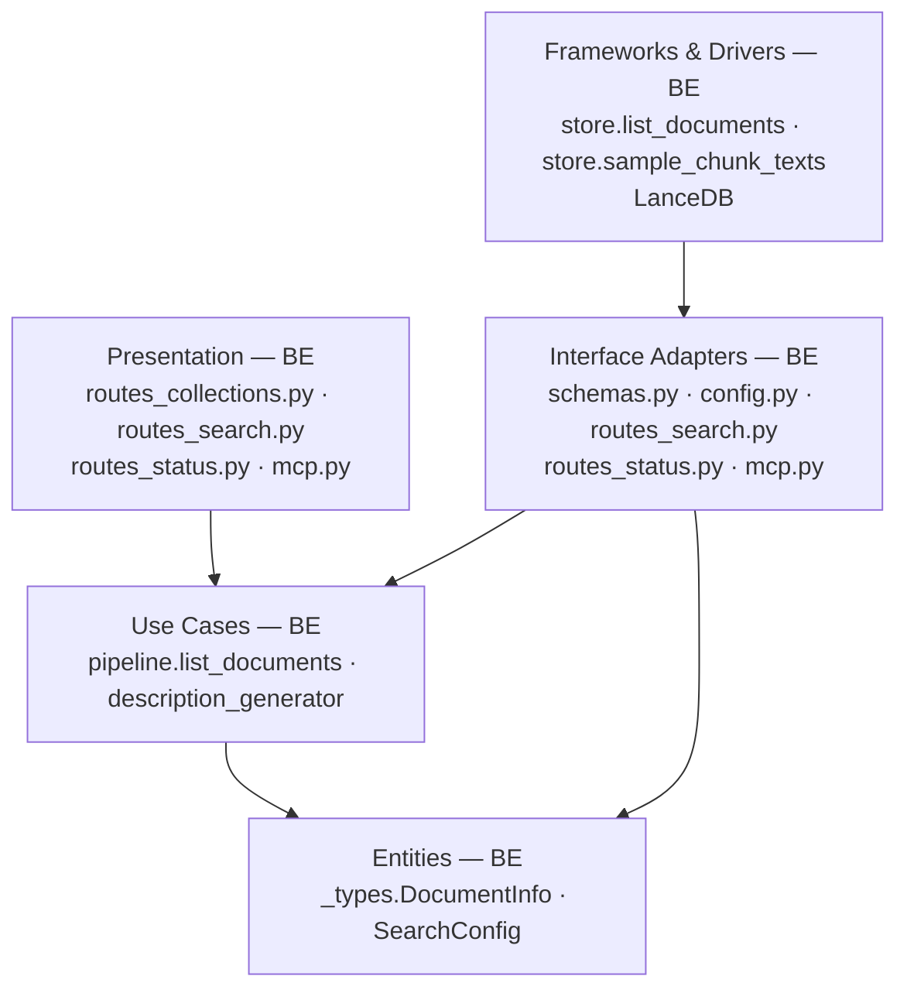
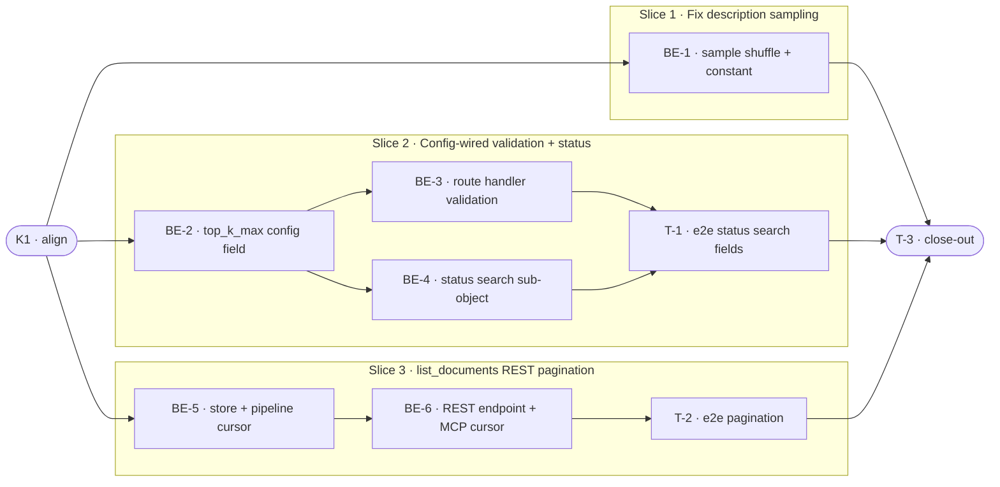

# E0C · API Surface Fixes — Team Plan

**How to read this file**
- **Architecture approach:** Clean Architecture (default). **Layers:** Presentation · Use Cases · Interface Adapters · Entities · Frameworks & Drivers. Each task's first sub-bullet names the layer it touches.
- This project has **no web UI**. Presentation surfaces are REST routes, MCP, and CLI (all backend-owned). **Frontend = N/A.**
- The **Backend** section is the depth view. The **Task Breakdown** is the order view.
- **Phases are vertical slices**, sliced with the `vertical-slicer` skill. No separate "integrate" phase.
- **Tests:** unit + integration tests are written test-first by the backend dev in each task's `Tests` block. Tester owns e2e only.
- **Contracts:** C1 (list-documents endpoint) and C4 (status search sub-object) are HTTP/API seams authored as TypeSpec HTTP services under `api-contracts/`; C2 and C3 are internal logical seams authored as core-construct `.tsp` files beside this plan. All four validated clean.
- IDs (`S#`, `C#`, `BE-#`, `T-#`, `K#`, `Q#`) are the traceability thread.

---

## Background

Four API-level constraints frustrate users invisibly: `list_documents` silently truncates at 1 000 with no cursor; `max_fanout` in TOML is loaded by config but the Pydantic validator in `routes_search.py` reads a hardcoded `_FANOUT_VALIDATION_LIMIT = 8` constant instead; `top_k` is capped at a hardcoded `le=100` on `SearchRequest.top_k` with no operator override; and auto-generated collection descriptions draw from the first 20 chunks by insertion order, producing misleading routing metadata for large heterogeneous collections.

---

## Goal

API limits are either configurable by the operator or replaced with correct defaults. A user who pages through a 10 000-document collection, raises `max_fanout` in TOML, or asks for 200 results for a batch evaluation use-case gets the expected behaviour without a code change.

---

## Scope

### In Scope
- **L4** — `GET /collections/{name}/documents` REST endpoint with `limit` (1–200, default 50) and `cursor` (opaque `doc_id`-based) query params. Response: `DocumentListResponse { items, next_cursor, total }` — mirrors `JobListResponse`. `store.list_documents()` and `pipeline.list_documents()` updated to honour cursor. MCP `list_documents` tool updated additively to accept cursor.
- **L9** — Remove `_FANOUT_VALIDATION_LIMIT` constant from `routes_search.py` and `mcp.py`. Move fanout count check to the route handler body (reads `request.app.state.config.max_fanout`). `GET /status` exposes `search.max_fanout`.
- **L13** — Add `top_k_max: int = 100` to `SearchConfig` `[search]` section. Remove `le=100` from `SearchRequest.top_k` field; move upper-bound check to route handler body (reads `config.top_k_max`). `GET /status` exposes `search.top_k_max`.
- **L12** — `store.sample_chunk_texts()` returns a shuffled sample (in-process `random.shuffle` after fetching `n` rows) so the draw is not biased to insertion order. `_MAX_SAMPLE_CHUNKS` raised from 20 to 100 in `description_generator.py`.

### Out of Scope
- Filters or sort fields on `list_documents`
- Multi-collection `list_documents`
- Changing `top_k_retrieve` (pre-rerank pool)
- `ORDER BY RANDOM()` performance on large collections
- CLI `archon-search status` surfacing `search.max_fanout` / `search.top_k_max`

---

## Acceptance criteria
- `GET /collections/{name}/documents?limit=50` returns `{ items, next_cursor, total }`.
- Calling with `cursor=<next_cursor>` returns the next page; `next_cursor` is null on the last page.
- A `cursor` referencing a deleted document restarts from the beginning of the remainder (no 4xx).
- `POST /search` with `len(collections) > config.max_fanout` returns 422; with exactly `max_fanout` succeeds.
- `GET /status` includes `search: { max_fanout: <configured>, top_k_max: <configured> }`.
- `POST /search` with `top_k > config.top_k_max` returns 422 with message "top_k N exceeds operator-configured maximum of M".
- `top_k_max` defaults to 100; existing integrations that pass `top_k <= 100` are unaffected.
- Description generation samples from a random draw of up to 100 chunks, not the first 20 by insertion order.
- MCP `list_documents` accepts an optional `cursor` param; existing calls without cursor continue to work.
- OpenAPI snapshot updated; `BREAKING.md` entry added for `top_k` schema change.

---

## What does NOT change
- `routes_jobs.py` cursor pagination (already correct; used as the pattern for this feature)
- `top_k_retrieve` / `top_k_return` pipeline knobs
- The `store.list_documents` chunk-fetch strategy (`limit * 50` row pre-fetch for aggregation)
- Existing behaviour for requests with `top_k ≤ 100` and `len(collections) ≤ current max_fanout`
- CLI surface — `archon-search status` does not surface the new `search.*` fields (out of scope)

---

## Known limitations / accepted trade-offs
- Cursor pagination operates post-aggregation on `doc_id`; the store still fetches `limit * 50` raw chunk rows before aggregating. For very large collections this is bounded memory — fine for v1.
- `store.sample_chunk_texts` uses an in-process shuffle (not SQL `ORDER BY RANDOM()`) — LanceDB `.query()` does not expose a random-order clause; the fetch-then-shuffle approach is equivalent for description generation.
- `top_k_max` schema in OpenAPI changes from `le=100` (static) to `le=top_k_max` (dynamic at server startup) — generated clients that relied on the hardcoded OpenAPI constraint will see a different schema. Recorded in `BREAKING.md`.
- Moving the fanout and top_k checks from `@model_validator` / `Field(le=…)` to the route handler **changes the 422 error envelope**: Pydantic validation errors return `{"detail": [{"loc":…, "msg":…}]}` (a list); handler-raised `HTTPException(422)` returns `{"detail": "…"}` (a string). Clients that parse the error-detail list will see a different shape. Recorded in `BREAKING.md`.

---

## Approach & architecture

All four fixes are backend-only changes across the store (Frameworks & Drivers), pipeline (Use Cases), config/routes/MCP (Interface Adapters), and schemas (Entities). No web UI exists; the CLI does not need changes. Changes are delivered in three vertical slices: description-sampling fix first (thinnest, self-contained), then config-wired validation + status fields, then the new REST list-documents endpoint with cursor.

**Layer map (and role mapping)**

| Layer | Role | Components |
|-------|------|-----------|
| Presentation | Backend | `routes_collections.py` (new route), `routes_search.py`, `routes_status.py`, `mcp.py` |
| Use Cases | Backend | `pipeline.list_documents`, `description_generator._MAX_SAMPLE_CHUNKS` |
| Interface Adapters | Backend | `schemas.py` (`DocumentListResponse`, `SearchStatusDetail`, `StatusResponse`), `config.py` (`SearchConfig.top_k_max`), `routes_status.py` (`_build_search_status`) |
| Entities | Backend | `_types.DocumentInfo`, `SearchConfig` dataclass |
| Frameworks & Drivers | Backend | `store.list_documents` (cursor), `store.sample_chunk_texts` (shuffle), LanceDB |

**What changes**
- `store.py:2021` — `list_documents(collection, limit, cursor)` gains cursor param; post-aggregation slice moves to cursor position
- `store.py:1625` — `sample_chunk_texts` shuffles fetched rows in-process before returning
- `description_generator.py:27` — `_MAX_SAMPLE_CHUNKS` 20 → 100
- `pipeline.py:1429` — `list_documents` passes cursor through to store
- `config.py:111–124` — `SearchConfig` gains `top_k_max: int = 100`; `[search]` loader (~line 355) gains `top_k_max` entry
- `routes_search.py:32,43,86` — `_FANOUT_VALIDATION_LIMIT` removed; `le=100` removed from `top_k` field; both checks moved to route handler body
- `routes_explain.py:186` — `ExplainRequest.top_k` also has `le=100`; same fix applied for consistency
- `mcp.py:43,305,682` — `_FANOUT_VALIDATION_LIMIT` import/uses replaced with `config.max_fanout`
- `app.py:209-217` — startup drift assertion `_FANOUT_VALIDATION_LIMIT == SearchConfig().max_fanout` removed (constant no longer exists)
- `schemas.py` — new `SearchStatusDetail`, `DocumentListResponse`; `StatusResponse` gains `search` field
- `routes_status.py` — new `_build_search_status` helper; `StatusResponse(...)` call gains `search=`
- `routes_collections.py` — new `GET /collections/{name}/documents` endpoint
- `mcp_schemas.py:295` — `DocumentInfoSchema` reused unchanged; MCP `list_documents` tool gains optional `cursor` param

**Key decisions (from the brief)**
- `_FANOUT_VALIDATION_LIMIT` removed entirely — a constant that duplicates a config value and silently overrides it is strictly worse than reading the config value.
- `doc_id` as cursor key — stable, opaque, matches the jobs pattern; avoids offset pagination which breaks under concurrent ingest.
- Validation moves to route handler body — Pydantic `@model_validator` and `Field(le=…)` have no access to `request.app.state.config`; the route handler does. Clean pattern already used by other checks in this codebase.
- `top_k_max` in `[search]` TOML section — consistent with `max_fanout`, `fanout_leg_trim` already there.

---

## Contracts / seams

Boundaries where roles must agree. **Logical, not code.** Changing one requires team agreement.

**Using TypeSpec (v1.13.0).** HTTP/API seams authored as TypeSpec HTTP services under `api-contracts/` with emitted `openapi.yaml`. Internal logical seams authored as core-construct `.tsp` beside this plan, validated with `--no-emit`. All four compiled clean.

---

**C1 — list_documents REST endpoint** *(HTTP/API seam — Client ↔ REST)*
New `GET /collections/{name}/documents` endpoint. Client sends `limit` (1–200, default 50) and optional opaque `cursor`; server returns `DocumentListResponse { items: DocumentInfo[], next_cursor: string|null, total: int }`. Cursor based on last item's `doc_id`. Unknown collection → 404. Missing/deleted cursor → restart from beginning (no 4xx). Auth failure → 401.
See [`api-contracts/e0c-list-documents.tsp`](api-contracts/e0c-list-documents.tsp) + [`api-contracts/e0c-list-documents.openapi.yaml`](api-contracts/e0c-list-documents.openapi.yaml)
- Realised by: BE-5, BE-6 · Verified by: BE-6 (integration), T-2 (e2e)

---

**C2 — document cursor internal seam** *(internal logical seam — pipeline ↔ store)*
`store.list_documents(collection, limit, cursor)` returns `(items, next_cursor|None, total)`. `pipeline.list_documents` passes `cursor` through unchanged. Cursor = last item's `doc_id`; items are sorted by `doc_id` ascending (lexicographic). Missing/deleted cursor → resume from the sort position of the cursor value; if nothing sorts after it, return empty; no error. Absence of cursor starts from the beginning of the sorted collection. Total = full document count in collection, regardless of page.
See [`e0c-document-cursor-contract.tsp`](e0c-document-cursor-contract.tsp)
- Realised by: BE-5 · Verified by: BE-5 (unit + integration)

---

**C3 — search validation config injection** *(internal logical seam — config ↔ route handlers)*
Route handler bodies (not Pydantic validators) enforce `len(collections) <= config.max_fanout` and `top_k <= config.top_k_max`. Both MCP tool bodies and REST handlers read from the same `config` object. `SearchConfig` is the single source of truth; no module-level constants shadow it.
See [`e0c-search-validation-contract.tsp`](e0c-search-validation-contract.tsp)
- Realised by: BE-2, BE-3 · Verified by: BE-3 (integration)

---

**C4 — status search sub-object** *(HTTP/API seam — Client ↔ REST, additive)*
`GET /status` response gains a `search` sub-object: `{ max_fanout: int, top_k_max: int }`. Additive — existing fields on `StatusResponse` are unchanged. Null when the status endpoint is called without the `config` context (test factories not wiring it).
See [`api-contracts/e0c-search-status.tsp`](api-contracts/e0c-search-status.tsp) + [`api-contracts/e0c-search-status.openapi.yaml`](api-contracts/e0c-search-status.openapi.yaml)
- Realised by: BE-2, BE-4 · Verified by: BE-4 (integration), T-1 (e2e)

---

## Scenarios #tester-role

| id | Scenario (Given / When / Then) |
|----|-------------------------------|
| **S1** | **Given** a collection with 150 indexed documents · **When** `GET /collections/{name}/documents?limit=50` · **Then** response has 50 items, `next_cursor` set, `total=150` |
| **S2** | **Given** S1 response with `next_cursor` · **When** `GET /collections/{name}/documents?limit=50&cursor=<next_cursor>` · **Then** response has the next 50 items, new `next_cursor`, `total=150` |
| **S3** | **Given** last page reached · **When** `GET /collections/{name}/documents?cursor=<last_cursor>` · **Then** `next_cursor` is null, remaining items returned |
| **S4** | **Given** a cursor `doc_id` that was deleted between pages · **When** cursor is passed · **Then** response resumes from the first document whose `doc_id` sorts after the deleted cursor's value (lexicographic order); if no documents fall after that position, returns empty items with `next_cursor: null`; no 4xx error |
| **S5** | **Given** a collection name that does not exist · **When** `GET /collections/{name}/documents` · **Then** HTTP 404 |
| **S6** | **Given** `limit=0` or `limit=201` · **When** endpoint is called · **Then** HTTP 422 |
| **S7** | **Given** MCP `list_documents` called with `cursor` param · **When** cursor is valid · **Then** returns next page; **And** calling without cursor still works (backward-compat) |
| **S8** | **Given** `max_fanout = 12` in TOML · **When** `POST /search` with 12 collections · **Then** HTTP 200 |
| **S9** | **Given** `max_fanout = 12` in TOML · **When** `POST /search` with 13 collections · **Then** HTTP 422 with message "collections length exceeds maximum of 12" |
| **S10** | **Given** `max_fanout = 12` in TOML · **When** `GET /status` · **Then** `search.max_fanout = 12` |
| **S11** | **Given** `top_k_max = 200` in TOML · **When** `POST /search` with `top_k: 200` · **Then** HTTP 200 |
| **S12** | **Given** `top_k_max = 100` (default) · **When** `POST /search` with `top_k: 101` · **Then** HTTP 422 with "top_k 101 exceeds operator-configured maximum of 100" |
| **S13** | **Given** `top_k_max = 200` in TOML · **When** `GET /status` · **Then** `search.top_k_max = 200` |
| **S14** | **Given** no `top_k_max` in TOML · **When** `POST /search` with `top_k: 100` · **Then** HTTP 200 (default cap preserved) |
| **S15** | **Given** a collection with 500 chunks inserted in insertion order · **When** `sample_chunk_texts(n=100)` is called twice · **Then** the returned chunk orders differ (random, not deterministic insertion order) |
| **S16** | **Given** `_MAX_SAMPLE_CHUNKS = 100` · **When** description is generated for a 500-chunk collection · **Then** generator samples 100 chunks from the shuffled pool, not 20 |
| **S17** | **Given** a collection with 5 000+ documents · **When** listing all via cursor pagination · **Then** all pages return within 5 s each |

---

## Frontend — Presentation #frontend-role

N/A — no frontend work for this feature. This is a pure Python backend project (FastAPI REST + MCP + CLI). No web UI exists and no CLI changes are required for E0c.

---

## Backend — Entities · Use Cases · Adapters · Frameworks #backend-role

**Scope:** All four L-fixes are backend-only. Writes both unit and integration tests for its tasks.
**Owns layers:** Entities, Use Cases, Interface Adapters, Frameworks & Drivers.

**Tasks by layer** *(checkable in the Task Breakdown)*
- Frameworks & Drivers: BE-1 (store.sample_chunk_texts shuffle), BE-5 (store.list_documents cursor)
- Use Cases: BE-1 (description_generator._MAX_SAMPLE_CHUNKS), BE-5 (pipeline.list_documents cursor)
- Interface Adapters: BE-2 (config.top_k_max), BE-3 (routes_search + mcp validation), BE-4 (schemas + routes_status search sub-object), BE-6 (routes_collections endpoint + mcp cursor + schemas)
- Entities: BE-2 (SearchConfig field), BE-6 (DocumentListResponse model)

**Done when**
- [ ] `sample_chunk_texts` returns shuffled results; `_MAX_SAMPLE_CHUNKS = 100` — S15, S16
- [ ] `POST /search` fanout validated from `config.max_fanout`, not the removed constant — S8, S9
- [ ] `POST /search` `top_k` validated from `config.top_k_max` (default 100) — S11, S12, S14
- [ ] `GET /status` returns `search: { max_fanout, top_k_max }` — S10, S13
- [ ] `GET /collections/{name}/documents` REST endpoint with cursor pagination — S1–S6
- [ ] MCP `list_documents` accepts optional `cursor` additively — S7

---

## Tester #tester-role

**Scope:** tester owns **e2e** tests plus the project **close-out**. Unit and integration tests are backend-owned.

**Tasks** *(checkable in the Task Breakdown)*
- T-1: E2e tests for L9+L13 status search fields (S10, S13)
- T-2: E2e tests for L4 list_documents pagination (S1–S7, S17)
- T-3: Project close-out & acceptance fact-check

**Allocation** — cheapest level that proves each scenario

| Scenario | Cheapest level | Owner |
|----------|---------------|-------|
| S1 — first page returns items + cursor + total | integration | Backend dev (BE-6) |
| S2 — cursor returns next page | integration | Backend dev (BE-6) |
| S3 — last page next_cursor null | integration | Backend dev (BE-6) |
| S4 — deleted cursor restarts | integration | Backend dev (BE-5) |
| S5 — 404 on missing collection | integration | Backend dev (BE-6) |
| S6 — 422 on invalid limit | integration | Backend dev (BE-6) |
| S7 — MCP cursor backward-compat | integration | Backend dev (BE-6) |
| S8 — max_fanout honoured | integration | Backend dev (BE-3) |
| S9 — max_fanout exceeded 422 | integration | Backend dev (BE-3) |
| S10 — status search.max_fanout | e2e | Tester (T-1) |
| S11 — top_k at max succeeds | integration | Backend dev (BE-3) |
| S12 — top_k exceeded 422 with message | integration | Backend dev (BE-3) |
| S13 — status search.top_k_max | e2e | Tester (T-1) |
| S14 — top_k_max default 100 | unit | Backend dev (BE-3) |
| S15 — sample_chunk_texts shuffled | unit | Backend dev (BE-1) |
| S16 — _MAX_SAMPLE_CHUNKS = 100 | unit | Backend dev (BE-1) |
| S17 — large collection pagination perf | e2e | Tester (T-2) |

---

## Documentation update

- [ ] `Documentation/Backlog/e0c-api-surface-fixes-brief.md` — no changes needed (source brief)
- [ ] `Documentation/Backlog/e0c-api-surface-fixes-team-plan.md` — this file
- [ ] `BREAKING.md` — three entries: (1) `top_k` OpenAPI schema changes from static `le=100` to dynamic `le=top_k_max`; (2) fanout + top_k 422 envelope changes from Pydantic detail-list to handler string `{"detail": "…"}`; (3) `GET /collections/{name}/documents` is new (additive, not breaking)
- [ ] `Documentation/Architecture/600_api_reference_or_public_interface.md` — add `GET /collections/{name}/documents` REST entry; update `POST /search` `top_k` constraint note; add `GET /status search` sub-object; add MCP `list_documents` cursor param
- [ ] `Documentation/Architecture/110_component_catalog_and_layer_breakdown.md` — annotate `store.list_documents` (cursor, count_documents for total), `store.sample_chunk_texts` (shuffle), `description_generator._MAX_SAMPLE_CHUNKS`, `SearchConfig.top_k_max`, `routes_collections` (new endpoint), `routes_explain` (top_k cap change), `routes_status` (`_build_search_status`), `schemas.SearchStatusDetail`/`DocumentListResponse`, `app.py` (drift assertion removed)
- [ ] `archon-search.toml.example` — add `# top_k_max = 100` comment under `[search]`
- [ ] `CLAUDE.md` — update `routes_search.py` bullet (remove `_FANOUT_VALIDATION_LIMIT` mention; note handler-level validation), `routes_collections.py` bullet (new endpoint), `config.py` `SearchConfig` bullet (`top_k_max`), `routes_status.py` bullet (`search` sub-object), `store.py` bullet (`list_documents` cursor, `sample_chunk_texts` shuffle)
- [ ] `learnings.md` — add E0c observations after T-3

---

## Open questions

Resolved in this revision:

**Q1 — Pydantic validator injection for `max_fanout` / `top_k`:** Resolved. Both checks move to the route handler body. The `routes_search.py` handler already has `request: Request`, giving access to `request.app.state.config.max_fanout` and `.top_k_max`. MCP tools are closures over `config` (passed into `create_mcp_http_app`), so they read `config.max_fanout` / `config.top_k_max` directly. Pydantic model-level validators (`@model_validator`, `Field(le=…)`) are replaced/removed.

*(No open questions remain — status: planned.)*

---

## Task Breakdown

Single-role tasks in execution order, grouped into vertical slices.

### Dependency graph

---

### Phase 0 · Kickoff

- [x] **K1** — Agree on Contracts and Scenarios with the team #team
    - — · 1.0h
    - completes C1, C2, C3, C4
    - Tests

---

### Slice 1 · Fix description sampling *(walking skeleton: thinnest, self-contained, store-only fix)*

- [x] **BE-1** — Fix `store.sample_chunk_texts` to shuffle in-process; raise `_MAX_SAMPLE_CHUNKS` 20→100 in `description_generator.py` #backend-role
    - Frameworks & Drivers (`store.py:1625`) + Use Cases (`description_generator.py:27`) · 2.0h
    - needs K1 · completes S15, S16
    - Tests
        - #unit_test — `test_sample_chunk_texts_order_is_not_deterministic` — two consecutive calls on a 200-chunk collection return different orderings
        - #unit_test — `test_max_sample_chunks_constant_equals_100` — `_MAX_SAMPLE_CHUNKS` is 100 in the module
        - #unit_test — `test_sample_chunk_texts_returns_at_most_n` — len(result) ≤ n for any n
        - #integration_test — `test_description_generator_samples_from_larger_pool` — pipeline.generate_description on a 500-chunk collection uses 100-chunk pool (mock store counts the sample size)

---

### Slice 2 · Config-wired validation + status fields *(operators can raise limits; GET /status reports them)*

- [x] **BE-2** — Add `top_k_max: int = 100` to `SearchConfig`; wire `[search].top_k_max` into `config.py` loader; update `archon-search.toml.example` #backend-role
    - Interface Adapters (`config.py:111–124`, loader `~355`) + Entities (`SearchConfig` dataclass) · 1.0h
    - needs K1 · completes C3 (partial), C4 (partial)
    - Tests
        - #unit_test — `test_top_k_max_default_is_100` — `SearchConfig().top_k_max == 100`
        - #unit_test — `test_top_k_max_loaded_from_toml` — TOML `top_k_max = 200` → `config.top_k_max == 200`
        - #unit_test — `test_top_k_max_zero_raises_config_error` — `top_k_max = 0` raises `ConfigError`

- [x] **BE-3** — Remove `_FANOUT_VALIDATION_LIMIT` from `routes_search.py` + `mcp.py` + `app.py` + `routes_explain.py:36,223`; move fanout + top_k checks into route handler bodies; apply same top_k fix to `routes_explain.py:186`; wire `config.max_fanout` / `config.top_k_max` #backend-role
    - Interface Adapters (`routes_search.py:32,43,86`, `routes_explain.py:186`, `mcp.py:43,305,682`, `app.py:209-217`) · 3.5h
    - needs BE-2 · completes S8, S9, S11, S12, S14, C3
    - Tests
        - #unit_test — `test_search_request_top_k_has_no_static_upper_bound` — `SearchRequest(top_k=500)` parses without Pydantic error (bound removed from Field)
        - #integration_test — `test_fanout_respected_from_config_at_limit` — config max_fanout=3, search with 3 collections → 200
        - #integration_test — `test_fanout_exceeded_returns_422` — config max_fanout=3, search with 4 collections → 422
        - #integration_test — `test_top_k_at_max_succeeds` — config top_k_max=200, top_k=200 → 200
        - #integration_test — `test_top_k_exceeded_returns_422_with_message` — top_k=201, top_k_max=200 → 422 "top_k 201 exceeds operator-configured maximum of 200"
        - #integration_test — `test_explain_top_k_exceeded_returns_422` — config top_k_max=200, explain request with top_k=201 → 422 "top_k 201 exceeds operator-configured maximum of 200"
        - #integration_test — `test_explain_fanout_exceeded_returns_422` — config max_fanout=3, explain request with 4 collections → 422 "collections length exceeds maximum of 3"
        - # Note: MCP `search` has no `top_k` parameter — top_k_max only applies to MCP `explain` and REST handlers
        - #integration_test — `test_mcp_search_fanout_exceeded_returns_error` — config max_fanout=3, MCP search tool with 4 collections → error response (not exception)
        - #integration_test — `test_mcp_explain_top_k_exceeded_returns_error` — config top_k_max=200, MCP explain tool with top_k=201 → error response
        - #integration_test — `test_mcp_explain_fanout_exceeded_returns_error` — config max_fanout=3, MCP explain tool with 4 collections → error response

- [x] **BE-4** — Add `SearchStatusDetail` model to `schemas.py`; add `search: SearchStatusDetail | None` to `StatusResponse`; add `_build_search_status` helper to `routes_status.py` #backend-role
    - Interface Adapters (`schemas.py`, `routes_status.py`) · 1.5h
    - needs BE-2 · completes S10, S13, C4
    - Tests
        - [x] #integration_test — `test_status_search_max_fanout_matches_config` — config max_fanout=12 → `status.search.max_fanout == 12`
        - [x] #integration_test — `test_status_search_top_k_max_matches_config` — config top_k_max=200 → `status.search.top_k_max == 200`
        - [x] #integration_test — `test_status_search_defaults` — no TOML overrides → `max_fanout=8, top_k_max=100`

- [ ] **T-1** — E2e tests for status search fields: verify TOML config flows end-to-end into `GET /status search.*` #tester-role
    - — · 2.0h
    - needs BE-3, BE-4 · completes S10, S13
    - Tests
        - #e2e_test — `test_e2e_status_search_max_fanout_reflects_toml` — write custom TOML with max_fanout=12, start real app via make_real_app, assert `GET /status` search.max_fanout == 12
        - #e2e_test — `test_e2e_status_search_top_k_max_reflects_toml` — write custom TOML with top_k_max=300, assert search.top_k_max == 300

---

### Slice 3 · list_documents REST pagination *(clients can page through all documents in large collections)*

- [ ] **BE-5** — Update `store.list_documents(collection, limit, cursor)`: add stable doc_id sort, post-aggregation cursor slicing, use `count_documents` (store.py:2134) for accurate `total`; update `pipeline.list_documents` to pass cursor through; return `(items, next_cursor|None, total)` #backend-role
    - Frameworks & Drivers (`store.py:2021–2060, 2134`) + Use Cases (`pipeline.py:1429`) · 3.0h
    - needs K1 · completes S1, S2, S3, S4, C2
    - Tests
        - #unit_test — `test_list_documents_cursor_skips_to_next_page` — 10 docs, cursor=doc5.doc_id → returns docs 6-10
        - #unit_test — `test_list_documents_last_page_next_cursor_none` — last page → next_cursor is None
        - #unit_test — `test_list_documents_deleted_cursor_resumes_from_sort_position` — cursor doc_id not in aggregated result → resumes from first doc_id sorting after cursor value; if none, returns empty items and next_cursor=None; no error
        - #unit_test — `test_list_documents_total_is_full_collection_count` — total reflects all docs, not just current page
        - #integration_test — `test_pipeline_list_documents_cursor_passes_through` — pipeline delegates cursor to store unchanged

- [ ] **BE-6** — Add `DocumentListResponse` to `schemas.py`; add `GET /collections/{name}/documents` to `routes_collections.py`; update MCP `list_documents` tool in `mcp.py` to accept optional `cursor` param (additive) #backend-role
    - Interface Adapters (`schemas.py`, `routes_collections.py`, `mcp.py:1043`) · 3.0h
    - needs BE-5 · completes S1, S2, S3, S4, S5, S6, S7, C1
    - Tests
        - #integration_test — `test_list_documents_endpoint_first_page` — ingest 150 docs, GET ?limit=50 → 50 items, next_cursor set, total=150
        - #integration_test — `test_list_documents_endpoint_second_page` — use next_cursor → second 50 items
        - #integration_test — `test_list_documents_endpoint_last_page_no_cursor` — final page → next_cursor null
        - #integration_test — `test_list_documents_endpoint_collection_not_found_404` — unknown collection → 404
        - #integration_test — `test_list_documents_endpoint_limit_0_returns_422` — limit=0 → 422
        - #integration_test — `test_list_documents_endpoint_limit_201_returns_422` — limit=201 → 422 (above maximum of 200)
        - #integration_test — `test_list_documents_mcp_cursor_backward_compat` — MCP list_documents without cursor still works
        - #integration_test — `test_list_documents_mcp_cursor_returns_next_page` — ingest 60 docs, call MCP list_documents with limit=30 (no cursor), take next_cursor from result, call again with cursor → verify second 30 items are different from first 30

- [ ] **T-2** — E2e tests for L4 pagination: full ingest-then-paginate flow and large-collection performance #tester-role
    - — · 3.0h
    - needs BE-6 · completes S1, S2, S3, S4, S5, S6, S7, S17
    - Tests
        - #e2e_test — `test_e2e_list_documents_full_pagination_flow` — ingest 150 docs via real app, page through all with limit=50, assert all 150 retrieved, last page next_cursor null
        - #e2e_test — `test_e2e_list_documents_deleted_cursor_no_error` — ingest 20 docs, delete one, use its doc_id as cursor → no 4xx, response resumes from the first document whose doc_id sorts after the deleted cursor; no 4xx
        - #manual_test — Large collection pagination performance — ingest 5 000+ documents via direct store insert; time `GET /collections/{name}/documents?limit=200` pages; each page must respond within 5 s

---

### Phase N · Close-out

- [ ] **T-3** — Project close-out & acceptance fact-check #tester-role
    - — · 4.0h
    - needs BE-1, T-1, T-2 · completes (acceptance gate)
    - Tests
    - Duties
        - Update all documentation per the "Documentation update" section — `BREAKING.md`, `600_api_reference`, `110_component_catalog`, `archon-search.toml.example`, `CLAUDE.md`, `learnings.md`.
        - Fix all build / compiler warnings, if any.
        - Run the full test suite; fix every failing test, including any unrelated to this feature.
        - Validate every Acceptance criterion one-by-one with a fact check — no assumptions; confirm each is genuinely done.

**Critical path:** K1 → BE-2 → BE-3 → T-1 → T-3 *(config-wired validation is the shortest chain to the acceptance gate; description-sampling and list_documents run in parallel with it)*
